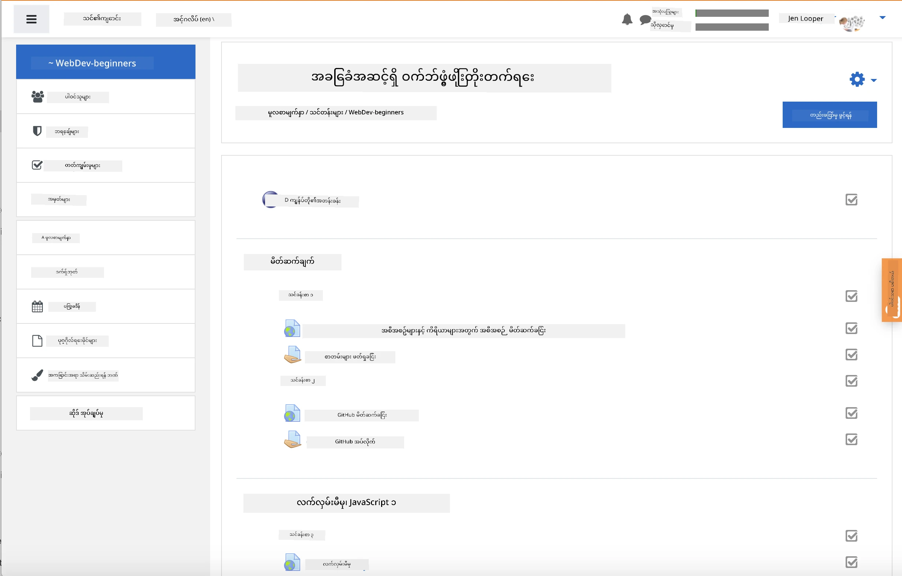

<!--
CO_OP_TRANSLATOR_METADATA:
{
  "original_hash": "71009af209f81cc01a1f2d324200375f",
  "translation_date": "2025-10-03T11:00:29+00:00",
  "source_file": "for-teachers.md",
  "language_code": "my"
}
-->
### ဆရာ/ဆရာမများအတွက်

ဤသင်ခန်းစာများကို သင်၏အတန်းထဲတွင် အသုံးပြုနိုင်ပါသည်။ GitHub Classroom နှင့် ထိပ်တန်း LMS ပလက်ဖောင်းများနှင့် အလွယ်တကူ လိုက်ဖက်ပြီး၊ သင်၏ကျောင်းသားများနှင့်အတူ standalone repo အဖြစ်လည်း အသုံးပြုနိုင်ပါသည်။

### GitHub Classroom ဖြင့် အသုံးပြုခြင်း

အတန်းအလိုက် သင်ခန်းစာများနှင့် လုပ်ငန်းများကို စီမံရန်၊ သင်ခန်းစာတစ်ခုစီအတွက် repository တစ်ခုဖန်တီးပါ၊ ထို့ကြောင့် GitHub Classroom သည် လုပ်ငန်းတစ်ခုစီကို သီးသန့်ချိတ်ဆက်နိုင်ပါသည်။

- ဤ repo ကို သင်၏အဖွဲ့အစည်းသို့ fork လုပ်ပါ။
- သင်ခန်းစာတစ်ခုစီအတွက် သီးခြား repo ဖန်တီးပြီး သင်ခန်းစာ folder တစ်ခုစီကို သီးသန့် repository အဖြစ် extract လုပ်ပါ။
  - ရွေးချယ်မှု A: သင်ခန်းစာတစ်ခုစီအတွက် အလွတ် repo များဖန်တီးပြီး သင်ခန်းစာ folder အကြောင်းအရာများကို ထည့်သွင်းပါ။
  - ရွေးချယ်မှု B: Git history‑preserving နည်းလမ်း (ဥပမာ folder ကို repo အသစ်တစ်ခုသို့ ခွဲခြားခြင်း) ကို အသုံးပြုပါ၊ သင် provenance လိုအပ်ပါက။
- GitHub Classroom တွင် သင်ခန်းစာတစ်ခုစီအတွက် လုပ်ငန်းတစ်ခုဖန်တီးပြီး သက်ဆိုင်ရာ သင်ခန်းစာ repo သို့ ညွှန်းပါ။
- အကြံပြု settings:
  - Repository visibility: ကျောင်းသားလုပ်ငန်းများအတွက် private ဖြစ်ရန်။
  - သင်ခန်းစာ repo ၏ default branch မှ starter code ကို အသုံးပြုပါ။
  - quizzes နှင့် submissions အတွက် issue နှင့် pull request templates ထည့်ပါ။
  - သင်ခန်းစာများတွင် autograding နှင့် tests ပါရှိပါက အလိုအလျောက် configure လုပ်နိုင်ပါသည်။
- အထောက်အကူပြုသော စနစ်များ:
  - Repository အမည်များကို lesson-01-intro, lesson-02-html စသည်ဖြင့် သတ်မှတ်ပါ။
  - Labels: quiz, assignment, needs-review, late, resubmission။
  - Cohort အလိုက် tags/releases (ဥပမာ v2025-term1)။

အကြံပြုချက်: Git conflicts ကို ကာကွယ်ရန် synced folders (ဥပမာ OneDrive/Google Drive) အတွင်းတွင် repositories မထားပါနှင့်။

### Moodle, Canvas, Blackboard ဖြင့် အသုံးပြုခြင်း

ဤသင်ခန်းစာများတွင် သင့်လျော်သော LMS workflows အတွက် importable packages ပါရှိသည်။

- Moodle: [Moodle upload file](../../../../../../../teaching-files/webdev-moodle.mbz) ကို အသုံးပြု၍ အပြည့်အစုံသင်ခန်းစာကို load လုပ်ပါ။
- Common Cartridge: [Common Cartridge file](../../../../../../../teaching-files/webdev-common-cartridge.imscc) ကို အသုံးပြု၍ ကျယ်ပြန့်သော LMS compatibility ရရှိပါသည်။
- မှတ်ချက်များ:
  - Moodle Cloud တွင် Common Cartridge support အကန့်အသတ်ရှိသည်။ Canvas တွင်လည်း upload လုပ်နိုင်သော Moodle file ကို အသုံးပြုရန် ဦးစားပေးပါ။
  - Import ပြီးနောက် modules, due dates, quiz settings များကို သင်၏ term schedule နှင့် ကိုက်ညီစေရန် ပြန်လည်သုံးသပ်ပါ။

> Moodle classroom အတွင်းရှိ သင်ခန်းစာများ

> Canvas အတွင်းရှိ သင်ခန်းစာများ

### Repo ကို တိုက်ရိုက်အသုံးပြုခြင်း (Classroom မပါ)

GitHub Classroom ကို အသုံးမပြုလိုပါက၊ ဤ repo မှ တိုက်ရိုက် သင်ခန်းစာကို လည်ပတ်နိုင်ပါသည်။

- synchronous/online formats (Zoom/Teams):
  - mentor‑led warmups အတိုအထွာများ လည်ပတ်ပါ; quizzes အတွက် breakout rooms အသုံးပြုပါ။
  - quizzes အတွက် အချိန် window တစ်ခု ကြေညာပါ; ကျောင်းသားများ GitHub Issues အဖြစ် အဖြေများတင်သွင်းပါ။
  - ပူးပေါင်းလုပ်ငန်းများအတွက် ကျောင်းသားများသည် public lesson repos တွင် အလုပ်လုပ်ပြီး pull requests ဖွင့်ပါ။
- private/asynchronous formats:
  - ကျောင်းသားများသည် lesson တစ်ခုစီကို **private** repos သို့ fork လုပ်ပြီး သင်ကို collaborator အဖြစ် ထည့်သွင်းပါ။
  - သူတို့၏ private forks သို့မဟုတ် သင်၏ classroom repo တွင် Issues (quizzes) နှင့် Pull Requests (assignments) ဖြင့် တင်သွင်းပါ။

### အကောင်းဆုံးအလေ့အကျင့်များ

- Git/GitHub အခြေခံများ, Issues, PRs အကြောင်း orientation lesson တစ်ခု ပေးပါ။
- multi‑step quizzes/assignments အတွက် Issues တွင် checklists ထည့်ပါ။
- CONTRIBUTING.md နှင့် CODE_OF_CONDUCT.md ထည့်သွင်းပြီး classroom norms သတ်မှတ်ပါ။
- accessibility မှတ်ချက်များ (alt text, captions) ထည့်သွင်းပြီး printable PDFs ပေးပါ။
- term အလိုက် သင်ခန်းစာများကို version လုပ်ပြီး publish ပြီးနောက် lesson repos များကို freeze လုပ်ပါ။

### အကြံပြုချက်နှင့် အထောက်အပံ့

ဤသင်ခန်းစာများသည် သင်နှင့် သင်၏ကျောင်းသားများအတွက် အကျိုးရှိစေရန် ကျွန်ုပ်တို့လိုလားပါသည်။ bugs, requests, improvements အတွက် repo တွင် Issue အသစ်ဖွင့်ပါ၊ သို့မဟုတ် Teacher Corner တွင် ဆွေးနွေးမှုတစ်ခု စတင်ပါ။

---

**အကြောင်းကြားချက်**:  
ဤစာရွက်စာတမ်းကို AI ဘာသာပြန်ဝန်ဆောင်မှု [Co-op Translator](https://github.com/Azure/co-op-translator) ကို အသုံးပြု၍ ဘာသာပြန်ထားပါသည်။ ကျွန်ုပ်တို့သည် တိကျမှန်ကန်မှုအတွက် ကြိုးစားနေသော်လည်း အလိုအလျောက် ဘာသာပြန်ခြင်းတွင် အမှားများ သို့မဟုတ် မမှန်ကန်မှုများ ပါဝင်နိုင်သည်ကို သတိပြုပါ။ မူရင်းဘာသာစကားဖြင့် ရေးသားထားသော စာရွက်စာတမ်းကို အာဏာတရ အရင်းအမြစ်အဖြစ် သတ်မှတ်သင့်ပါသည်။ အရေးကြီးသော အချက်အလက်များအတွက် လူ့ဘာသာပြန်ပညာရှင်များကို အသုံးပြုရန် အကြံပြုပါသည်။ ဤဘာသာပြန်ကို အသုံးပြုခြင်းမှ ဖြစ်ပေါ်လာသော အလွဲအမှားများ သို့မဟုတ် အနားယူမှုများအတွက် ကျွန်ုပ်တို့သည် တာဝန်မယူပါ။