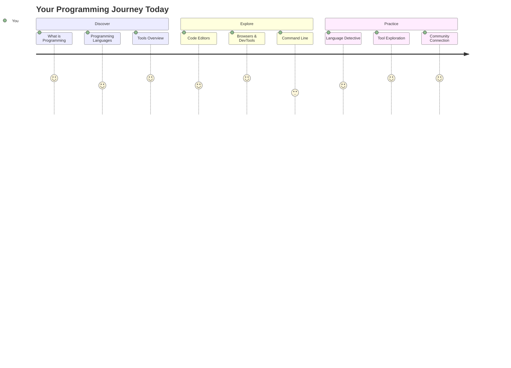
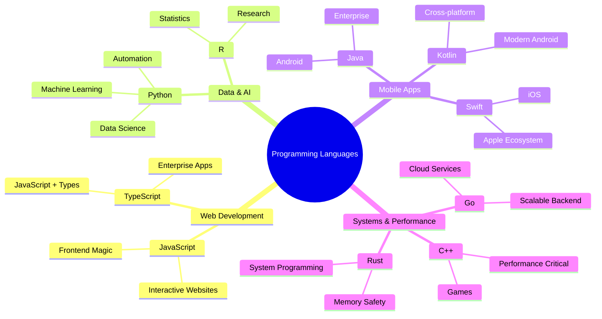
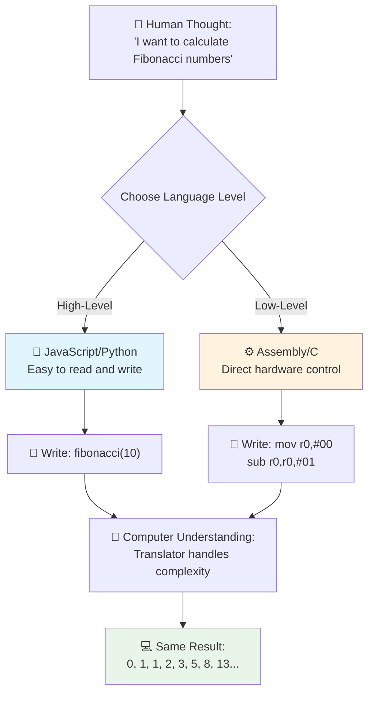
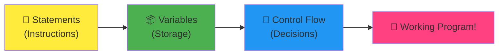
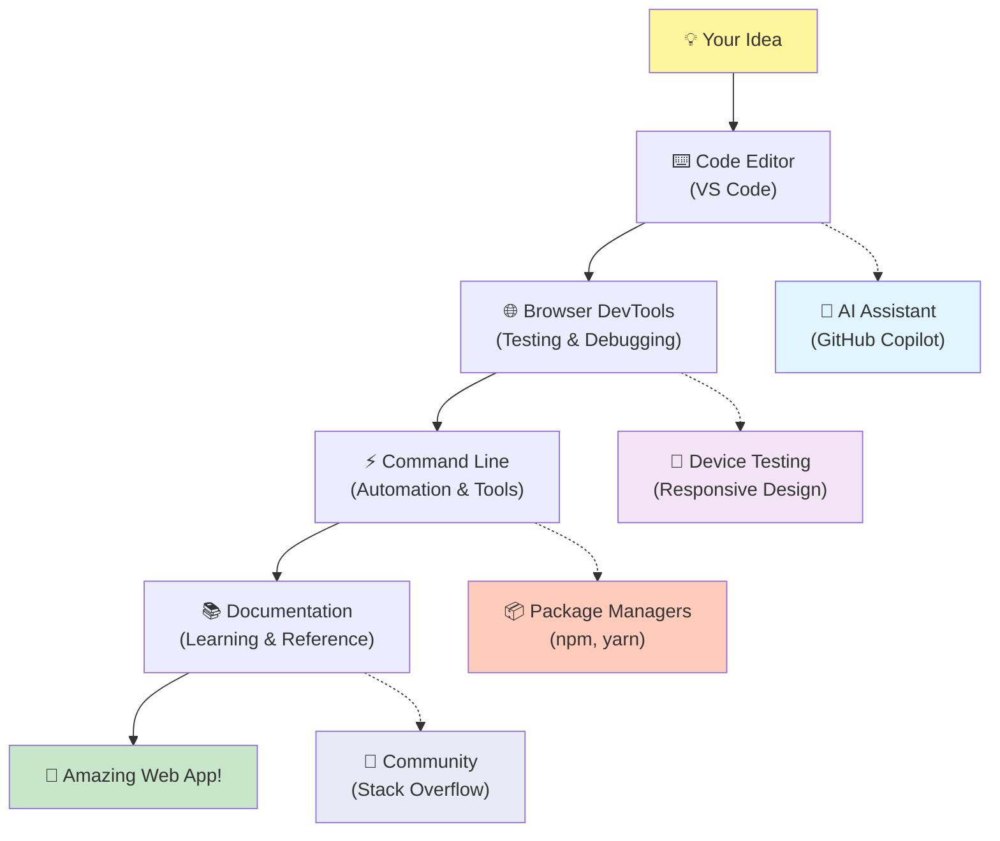
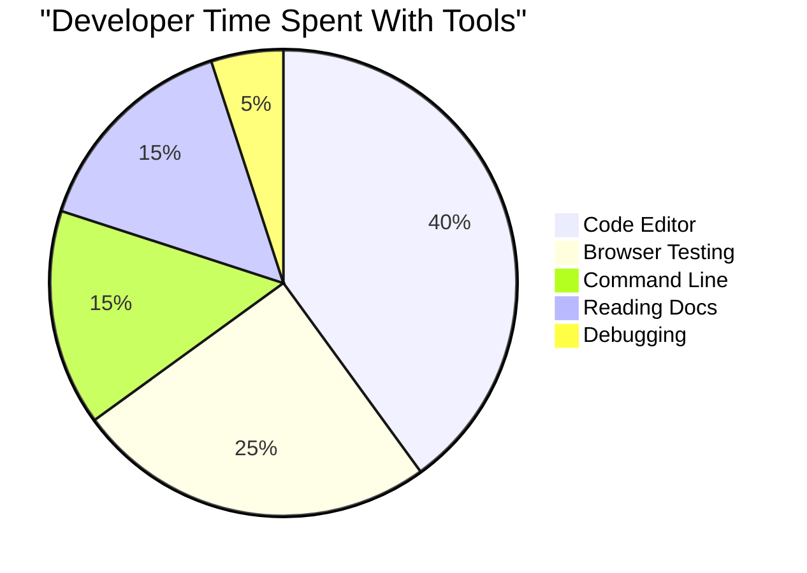
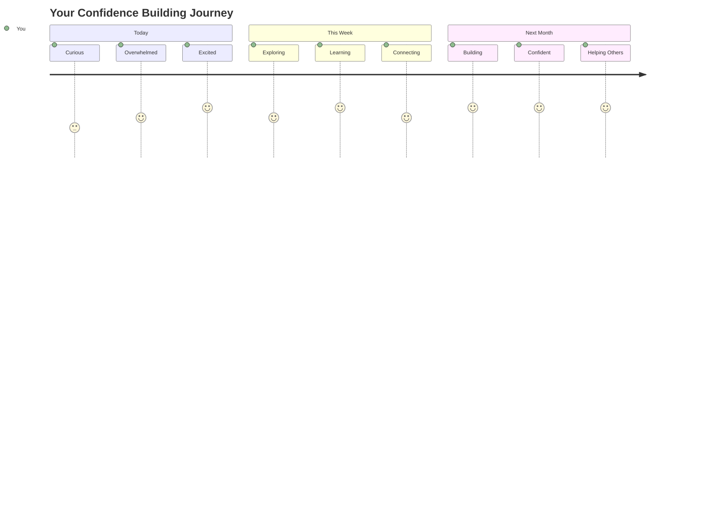

<!--
CO_OP_TRANSLATOR_METADATA:
{
  "original_hash": "d45ddcc54eb9232a76d08328b09d792e",
  "translation_date": "2025-11-03T15:19:18+00:00",
  "source_file": "1-getting-started-lessons/1-intro-to-programming-languages/README.md",
  "language_code": "ne"
}
-->
# प्रोग्रामिङ भाषा र आधुनिक डेभलपर उपकरणहरूको परिचय

नमस्ते, भविष्यका डेभलपर! 👋 के म तपाईंलाई केही भन्न सक्छु जसले मलाई हरेक दिन रोमाञ्चित बनाउँछ? तपाईंले पत्ता लगाउन लाग्नुभएको छ कि प्रोग्रामिङ केवल कम्प्युटरको बारेमा मात्र होइन – यो तपाईंको सबैभन्दा पागल विचारहरूलाई जीवनमा ल्याउन सक्ने वास्तविक सुपरपावर हो!

तपाईंलाई थाहा छ त्यो क्षण जब तपाईं आफ्नो मनपर्ने एप प्रयोग गर्दै हुनुहुन्छ र सबै कुरा पूर्ण रूपमा मिल्छ? जब तपाईं एउटा बटन थिच्नुहुन्छ र केही जादुई हुन्छ जसले तपाईंलाई "वाह, उनीहरूले यो कसरी गरे?" भन्न बाध्य बनाउँछ। खैर, तपाईं जस्तै कोही – सम्भवतः रातको २ बजे आफ्नो मनपर्ने कफी शपमा तेस्रो एस्प्रेसोको साथ बसेर – त्यो जादु सिर्जना गर्ने कोड लेखेका थिए। र यहाँ तपाईंलाई चकित पार्ने कुरा छ: यो पाठको अन्त्यसम्ममा, तपाईंले उनीहरूले कसरी गरे भनेर मात्र बुझ्नुहुने छैन, तर तपाईं आफैंले प्रयास गर्न उत्सुक हुनुहुनेछ!

हेर्नुहोस्, यदि प्रोग्रामिङ अहिले डर लाग्दो लाग्छ भने म पूर्ण रूपमा बुझ्छु। जब मैले सुरु गरें, मैले इमानदारीपूर्वक सोचेको थिए कि तपाईंलाई कुनै प्रकारको गणितको जीनियस हुनुपर्छ वा पाँच वर्षको उमेरदेखि कोडिङ गरिरहेको हुनुपर्छ। तर यहाँ के कुराले मेरो दृष्टिकोणलाई पूर्ण रूपमा परिवर्तन गर्यो: प्रोग्रामिङ नयाँ भाषामा संवाद गर्न सिक्ने जस्तै हो। तपाईं "नमस्ते" र "धन्यवाद" बाट सुरु गर्नुहुन्छ, त्यसपछि कफी अर्डर गर्न सिक्नुहुन्छ, र थाहा पाउनुहुन्छ, तपाईं गहिरो दार्शनिक छलफल गर्दै हुनुहुन्छ! तर यस अवस्थामा, तपाईं कम्प्युटरसँग संवाद गर्दै हुनुहुन्छ, र इमानदारीपूर्वक? तिनीहरू तपाईंले कहिल्यै गरेको सबैभन्दा धैर्यवान संवाद साझेदार हुन् – तिनीहरूले कहिल्यै तपाईंको गल्तीको न्याय गर्दैनन् र तिनीहरू सँधै फेरि प्रयास गर्न उत्साहित हुन्छन्!

आज, हामी ती अद्भुत उपकरणहरूको अन्वेषण गर्नेछौं जसले आधुनिक वेब विकासलाई सम्भव मात्र होइन, गम्भीर रूपमा लत लाग्ने बनाउँछ। म त्यही सम्पादकहरू, ब्राउजरहरू, र वर्कफ्लोहरूको कुरा गर्दैछु जुन नेटफ्लिक्स, स्पोटिफाई, र तपाईंको मनपर्ने इन्डी एप स्टुडियोका डेभलपरहरूले हरेक दिन प्रयोग गर्छन्। र यहाँ तपाईंलाई खुशीको नाच गर्न बनाउने भाग छ: यी पेशेवर-ग्रेड, उद्योग-मानक उपकरणहरूको अधिकांश पूर्ण रूपमा निःशुल्क छन्!


> स्केच नोट [Tomomi Imura](https://twitter.com/girlie_mac) द्वारा



## तपाईंले पहिले नै के जान्नुहुन्छ हेर्नुहोस्!

मजाको कुरामा जानु अघि, म उत्सुक छु – तपाईंले यस प्रोग्रामिङ संसारको बारेमा पहिले नै के जान्नुहुन्छ? र सुन्नुहोस्, यदि तपाईं यी प्रश्नहरू हेर्दै हुनुहुन्छ र सोच्दै हुनुहुन्छ "मलाई यसको बारेमा शून्य थाहा छ," त्यो मात्र ठीक छैन, यो उत्तम छ! यसको मतलब तपाईं बिल्कुल सही ठाउँमा हुनुहुन्छ। यो क्विजलाई व्यायाम अघि स्ट्रेचिङ जस्तै सोच्नुहोस् – हामी ती मस्तिष्क मांसपेशीहरूलाई मात्र तातो बनाउँदैछौं!

[पाठ अघि क्विज लिनुहोस्](https://forms.office.com/r/dru4TE0U9n?origin=lprLink)


## हामी सँगै जान लागेका साहसिक यात्रा

ठीक छ, म साँच्चै उत्साहित छु कि हामी आज के अन्वेषण गर्न जाँदैछौं! गम्भीर रूपमा, म तपाईंको अनुहार देख्न चाहन्छु जब यी अवधारणाहरू क्लिक हुन्छन्। यहाँ हामी सँगै लिने अविश्वसनीय यात्रा छ:

- **प्रोग्रामिङ वास्तवमा के हो (र यो किन सबैभन्दा चिसो कुरा हो!)** – हामी पत्ता लगाउनेछौं कि कोड वास्तवमा तपाईंको वरिपरि सबै कुरालाई शक्ति दिने अदृश्य जादु हो, त्यो अलार्मबाट जसले कसरी सोमबार बिहान हो भनेर थाहा पाउँछदेखि तपाईंको नेटफ्लिक्स सिफारिसहरूलाई पूर्ण रूपमा क्युरेट गर्ने एल्गोरिदमसम्म
- **प्रोग्रामिङ भाषाहरू र तिनीहरूको अद्भुत व्यक्तित्वहरू** – कल्पना गर्नुहोस् कि तपाईं एउटा पार्टीमा हिँड्दै हुनुहुन्छ जहाँ प्रत्येक व्यक्तिसँग समस्या समाधान गर्ने पूर्ण रूपमा फरक सुपरपावरहरू छन्। प्रोग्रामिङ भाषा संसार यस्तै हो, र तपाईं तिनीहरूलाई भेट्न मन पराउनुहुनेछ!
- **डिजिटल जादु बनाउनका लागि आधारभूत निर्माण ब्लकहरू** – यीलाई अन्तिम रचनात्मक LEGO सेटको रूपमा सोच्नुहोस्। एकपटक तपाईंले यी टुक्राहरू कसरी फिट हुन्छन् भनेर बुझ्नुभयो भने, तपाईंले महसुस गर्नुहुनेछ कि तपाईंले आफ्नो कल्पनाले सपना देखेको कुनै पनि कुरा निर्माण गर्न सक्नुहुन्छ
- **पेशेवर उपकरणहरू जसले तपाईंलाई जादूगरको छडी दिइएको जस्तो महसुस गराउँछ** – म यहाँ नाटकीय हुँदै छैन – यी उपकरणहरूले तपाईंलाई वास्तवमा सुपरपावर भएको महसुस गराउँछ, र सबैभन्दा राम्रो भाग? तिनीहरू पेशेवरहरूले प्रयोग गर्ने समान हुन्!

> 💡 **यहाँ कुरा छ**: आज सबै कुरा सम्झन प्रयास गर्ने बारे सोच्न पनि नहोस्! अहिले, म केवल तपाईंलाई सम्भव के छ भन्ने बारे उत्साहको झिल्को महसुस गर्न चाहन्छु। विवरणहरू अभ्यास गर्दा स्वाभाविक रूपमा अडिन्छन् – वास्तविक सिकाइ यसरी हुन्छ!

> तपाईं यो पाठ [Microsoft Learn](https://docs.microsoft.com/learn/modules/web-development-101/introduction-programming/?WT.mc_id=academic-77807-sagibbon) मा लिन सक्नुहुन्छ!

## त प्रोग्रामिङ वास्तवमा *के हो*?

ठीक छ, हामी लाखौं डलरको प्रश्नलाई सम्बोधन गरौं: प्रोग्रामिङ वास्तवमा के हो?

म तपाईंलाई एउटा कथा दिनेछु जसले मेरो सोच्ने तरिका पूर्ण रूपमा परिवर्तन गर्यो। गत हप्ता, म मेरी आमालाई हाम्रो नयाँ स्मार्ट टिभी रिमोट कसरी प्रयोग गर्ने भनेर व्याख्या गर्ने प्रयास गर्दै थिएँ। मैले आफैंलाई यस्तो कुरा भन्दै गरेको पाएँ "रातो बटन थिच्नुहोस्, तर ठूलो रातो बटन होइन, सानो रातो बटन बायाँतिर... होइन, तपाईंको अर्को बायाँ... ठीक छ, अब यसलाई दुई सेकेन्डको लागि थिच्नुहोस्, एक होइन, तीन होइन..." परिचित लाग्छ? 😅

त्यो प्रोग्रामिङ हो! यो धेरै शक्तिशाली तर सबै कुरा पूर्ण रूपमा व्याख्या गर्न आवश्यक पर्ने चीजलाई अत्यन्त विस्तृत, चरण-दर-चरण निर्देशनहरू दिने कला हो। तर तपाईंको आमालाई व्याख्या गर्ने सट्टा (जो "कुन रातो बटन?!" सोध्न सक्छ), तपाईं कम्प्युटरलाई व्याख्या गर्दै हुनुहुन्छ (जसले तपाईंले भनेको कुरा ठीक गर्छ, तपाईंले भनेको कुरा तपाईंले भन्न चाहनुभएको कुरा होइन भने पनि)।

जब मैले यो पहिलो पटक सिकें, यो मेरो दिमागलाई उडाएको कुरा यहाँ छ: कम्प्युटरहरू वास्तवमा आफ्नो मूलमा धेरै सरल छन्। तिनीहरूले शाब्दिक रूपमा केवल दुई चीजहरू बुझ्छन् – १ र ०, जुन मूल रूपमा "हो" र "होइन" वा "अन" र "अफ" मात्र हो। बस यति! तर यहाँ यो जादुई हुन्छ – हामीलाई १ र ० मा बोल्न आवश्यक छैन जस्तो कि हामी म्याट्रिक्समा छौं। त्यहाँ **प्रोग्रामिङ भाषाहरू** उद्धार गर्न आउँछन्। तिनीहरू संसारको सबैभन्दा राम्रो अनुवादक भएको जस्तै हुन् जसले तपाईंको पूर्ण रूपमा सामान्य मानव विचारहरूलाई कम्प्युटर भाषामा रूपान्तरण गर्दछ।

र यहाँ के कुरा छ जसले मलाई हरेक बिहान वास्तविक झिल्को दिन्छ: तपाईंको जीवनमा शाब्दिक *सबै* डिजिटल कुरा तपाईं जस्तै कोहीबाट सुरु भएको थियो, सम्भवतः आफ्नो पजामा लगाएर कफीको कपको साथ, आफ्नो ल्यापटपमा कोड टाइप गर्दै। त्यो इन्स्टाग्राम फिल्टर जसले तपाईंलाई निर्दोष देखिन्छ? कसैले त्यो कोड गर्यो। सिफारिस जसले तपाईंलाई तपाईंको नयाँ मनपर्ने गीतमा पुर्‍यायो? डेभलपरले त्यो एल्गोरिदम निर्माण गर्यो। एप जसले तपाईंलाई साथीहरूसँग डिनर बिल विभाजन गर्न मद्दत गर्दछ? हो, कसैले सोच्यो "यो झन्झट छ, म यसलाई ठीक गर्न सक्छु जस्तो लाग्छ" र त्यसपछि... तिनीहरूले गरे!

जब तपाईंले प्रोग्राम गर्न सिक्नुहुन्छ, तपाईंले केवल नयाँ सीप उठाउनुहुन्न – तपाईं समस्या समाधान गर्नेहरूको यो अविश्वसनीय समुदायको हिस्सा बन्नुहुन्छ जसले आफ्नो दिन सोच्दै बिताउँछन्, "यदि मैले केही निर्माण गर्न सकें जसले कसैको दिनलाई अलिकति राम्रो बनाउँछ भने के हुन्छ?" इमानदारीपूर्वक, त्यो भन्दा चिसो केहि छ?

✅ **मजाको तथ्य खोज**: यहाँ केही सुपर कूल छ जब तपाईंसँग खाली समय छ – तपाईंलाई लाग्छ कि संसारको पहिलो कम्प्युटर प्रोग्रामर को थियो? म तपाईंलाई संकेत दिनेछु: यो तपाईंले अपेक्षा गरेको व्यक्ति नहुन सक्छ! यस व्यक्तिको पछाडि कथा बिल्कुल आकर्षक छ र देखाउँछ कि प्रोग्रामिङ सधैं रचनात्मक समस्या समाधान र बक्स बाहिर सोच्ने बारेमा भएको छ।

### 🧠 **जाँच समय: तपाईं कस्तो महसुस गर्दै हुनुहुन्छ?**

**एक क्षणको लागि विचार गर्नुहोस्:**
- "कम्प्युटरलाई निर्देशन दिनु" भन्ने विचार अब तपाईंलाई अर्थपूर्ण लाग्छ?
- के तपाईं कुनै दैनिक कार्यको बारेमा सोच्न सक्नुहुन्छ जुन तपाईं प्रोग्रामिङको साथ स्वचालित गर्न चाहनुहुन्छ?
- यस सम्पूर्ण प्रोग्रामिङ कुराको बारेमा तपाईंको दिमागमा के प्रश्नहरू उठिरहेका छन्?

> **स्मरण गर्नुहोस्**: यदि केही अवधारणाहरू अहिले अस्पष्ट लाग्छ भने यो पूर्ण रूपमा सामान्य हो। प्रोग्रामिङ सिक्नु नयाँ भाषा सिक्न जस्तै हो – तपाईंको मस्तिष्कले ती न्युरल मार्गहरू निर्माण गर्न समय लाग्छ। तपाईं राम्रो गर्दै हुनुहुन्छ!

## प्रोग्रामिङ भाषाहरू जादुको विभिन्न स्वादहरू जस्तै छन्

ठीक छ, यो अजीब लाग्न सक्छ, तर मेरो साथमा रहनुहोस् – प्रोग्रामिङ भाषाहरू विभिन्न प्रकारका संगीत जस्तै छन्। सोच्नुहोस्: तपाईंसँग जाज छ, जुन स्मूथ र इम्प्रोभाइजेशनल छ, रक जुन शक्तिशाली र सरल छ, क्लासिकल जुन सुरुचिपूर्ण र संरचित छ, र हिप-हप जुन रचनात्मक र अभिव्यक्तिपूर्ण छ। प्रत्येक शैलीको आफ्नै माहोल छ, आफ्नै उत्साही प्रशंसकहरूको समुदाय छ, र प्रत्येक विभिन्न मूड र अवसरहरूको लागि उत्तम छ।

प्रोग्रामिङ भाषाहरू ठीक त्यस्तै काम गर्छन्! तपाईंले जलवायु डाटा ठूलो मात्रामा क्रन्च गर्न प्रयोग गर्ने भाषा र मजाको मोबाइल गेम निर्माण गर्न प्रयोग गर्ने भाषा एउटै हुँदैन, जस्तै तपाईं योग क्लासमा डेथ मेटल बजाउनुहुन्न (खैर, अधिकांश योग क्लासहरूमा! 😄)।

तर यहाँ के कुरा छ जसले मलाई हरेक पटक सोच्दा मेरो दिमागलाई उडाउँछ: यी भाषाहरू संसारको सबैभन्दा धैर्यवान, प्रतिभाशाली अनुवादक भएको जस्तै छन्। तपाईं आफ्नो मानव मस्तिष्कलाई प्राकृतिक लाग्ने तरिकामा आफ्नो विचारहरू व्यक्त गर्न सक्नुहुन्छ, र तिनीहरूले त्यो कम्प्युटरले वास्तवमा बोल्ने १ र ० मा अनुवाद गर्ने अत्यन्त जटिल कामलाई ह्यान्डल गर्छन्। यो जस्तो छ कि तपाईंको साथमा "मानव रचनात्मकता" र "कम्प्युटर तर्क" मा पूर्ण रूपमा धाराप्रवाह भएको साथी छ – र तिनीहरू कहिल्यै थाक्दैनन्, कहिल्यै कफी ब्रेकको आवश्यकता पर्दैन, र तपाईंले सोधेको प्रश्नको लागि तपाईंलाई कहिल्यै न्याय गर्दैनन्!

### लोकप्रिय प्रोग्रामिङ भाषाहरू र तिनीहरूको प्रयोग



| भाषा | उत्तम प्रयोग | किन यो लोकप्रिय छ |
|----------|----------|------------------|
| **जाभास्क्रिप्ट** | वेब विकास, प्रयोगकर्ता इन्टरफेस | ब्राउजरमा चल्छ र अन्तरक्रियात्मक वेबसाइटहरूलाई शक्ति दिन्छ |
| **पाइथन** | डाटा विज्ञान, स्वचालन, एआई | पढ्न र सिक्न सजिलो, शक्तिशाली लाइब्रेरीहरू |
| **जाभा** | उद्यम एप्लिकेसनहरू, एन्ड्रोइड एप्स | प्लेटफर्म-स्वतन्त्र, ठूला प्रणालीहरूको लागि बलियो |
| **C#** | विन्डोज एप्लिकेसनहरू, खेल विकास | माइक्रोसफ्ट इकोसिस्टमको बलियो समर्थन |
| **Go** | क्लाउड सेवाहरू, ब्याकएन्ड प्रणालीहरू | छिटो, सरल, आधुनिक कम्प्युटिङको लागि डिजाइन गरिएको |

### उच्च-स्तर बनाम निम्न-स्तर भाषाहरू

ठीक छ, यो इमानदारीपूर्वक अवधारणा थियो जसले मलाई पहिलो पटक सिक्दा मेरो दिमागलाई तोड्यो, त्यसैले म तपाईंलाई त्यो उपमा साझा गर्न जाँदैछु जसले अन्ततः मलाई क्लिक गरायो – र म साँच्चै आशा गर्दछु कि यसले तपाईंलाई पनि मद्दत गर्दछ!

कल्पना गर्नुहोस् कि तपाईं एउटा देशमा भ्रमण गर्दै हुनुहुन्छ जहाँ तपाईंले भाषा बोल्नुहुन्न, र तपाईंलाई नजिकको बाथरूम खोज्न अत्यन्त आवश्यक छ (हामी सबै त्यहाँ पुगेका छौं, हैन? 😅):

- **निम्न-स्तर प्रोग्रामिङ** स्थानीय बोलीलाई यति राम्रोसँग सिक्न जस्तै हो कि तपाईं कुनामा फल बेच्ने हजुरआमासँग सांस्कृतिक सन्दर्भहरू, स्थानीय स्ल्याङ, र भित्री मजाकहरू प्रयोग गरेर कुरा गर्न सक्नुहुन्छ जुन केवल त्यहाँ हुर्केका व्यक्तिले मात्र बुझ्न सक्छ। सुपर प्रभावशाली र अविश्वसनीय रूपमा कुशल... यदि तपाईं धाराप्रवाह हुनुहुन्छ भने! तर तपाईं केवल बाथरूम खोज्न प्रयास गर्दै हुनुहुन्छ भने धेरै भारी।

- **उच्च-स्तर प्रोग्रामिङ** त्यो अद्भुत स्थानीय साथी भएको जस्तै हो जसले तपाईंलाई मात्र बुझ्छ। तपाईं "मलाई साँच्चै शौचालय खोज्न आवश्यक छ" सामान्य अंग्रेजीमा भन्न सक्नुहुन्छ, र तिनीहरूले सबै सांस्कृतिक अनुवादलाई ह्यान्डल गर्छन् र तपाईंलाई यस्तो तरिकामा निर्देशन दिन्छन् जुन तपाईंको गैर-स्थानीय मस्तिष्कमा पूर्ण रूपमा अर्थपूर्ण हुन्छ।

प्रोग्रामिङ सर्तहरूमा:
- **निम्न-स्तर भाषाहरू** (जस्तै Assembly वा C) तपाईंलाई कम्प्युटरको वास्तविक हार्डवेयरसँग अविश्वसनीय रूपमा विस्तृत कुराकानी गर्न दिन्छ, तर तपाईंलाई मेसिन जस्तै सोच्न आवश्यक छ, जुन... खैर, हामी केवल यो ठूलो मानसिक परिवर्तन हो भनेर भनौं!
- **उच्च-स्तर भाषाहरू** (जस्तै जाभास्क्रिप्ट, पाइथन, वा C#) तपाईंलाई मानव जस्तै सोच्न दिन्छ जबकि तिनीहरूले दृश्य पछाडि सबै मेसिन-भाषा ह्यान्डल गर्छन्। साथै, तिनीहरूसँग यी अविश्वसनीय स्वागतयोग्य समुदायहरू छन् जसले नयाँ भएको कस्तो महसुस हुन्छ भनेर सम्झन्छन् र वास्तवमा मद्दत गर्न चाहन्छन्!

तपाईंलाई सुरु गर्न म कुन सुझाव दिनेछु भनेर अनुमान गर्नुहोस्? 😉 उच्च-स्तर भाषाहरू प्रशिक्षण पाङ्ग्राहरू भएको जस्तै छन् जुन तपाईं वास्तवमा कहिल्यै हटाउन चाहनुहुन्न किनभने तिनीहरूले सम्पूर्ण अनुभवलाई धेरै रमाइलो बनाउँछन्!



### उच्च-स्तर भाषाहरू किन धेरै मैत्रीपूर्ण छन् भनेर म तपाईंलाई देखाउँछु

ठीक छ, म तपाईंलाई केही देखाउन जाँदैछु जसले उच्च-स्तर भाषाहरू किन माया गरें भनेर पूर्ण रूपमा प्रदर्शन गर्दछ, तर पहिले – म तपाईंलाई केहि वाचा गर्न आवश्यक छ। जब तपाईंले त्यो पहिलो कोड उदाहरण देख्नुहुन्छ, आतंक नगर्नुहोस्! यो डर लाग्दो देखिनु पर्ने हो। त्यो ठीक त्यही बिन्दु हो जुन म बनाउँदैछु!

हामी एकदमै समान कार्य दुई पूर्ण रूपमा फरक शैलीमा लेखिएको हेर्नेछौं। दुवैले फिबोनाच्ची अनुक्रम सिर्जना गर्छन् – यो यो सुन्दर गणितीय ढाँचा हो जहाँ प्रत्येक संख्या अघिल्लो दुईको योग हो: ०, १, १, २, ३, ५, ८, १३... (मजाको तथ्य: तपाईंले यो ढाँचा प्रकृतिमा शाब्दिक रूपमा सबै ठाउँमा पाउनुहुनेछ – घामफूलको बीउको घुमाउरो, सल्लाको शंकु ढाँचा, यहाँसम्म कि आकाशगंगाहरू बनाउने तरिका!)

तयार हुनुहुन्छ फरक देख्न? सुरु गरौं!

**उच्च-स्तर भाषा (जाभास्क्रिप्ट) – मानव-मैत्रीपूर्ण:**

```javascript
// Step 1: Basic Fibonacci setup
const fibonacciCount = 10;
let current = 0;
let next = 1;

console.log('Fibonacci sequence:');
```

**यो कोडले के गर्छ:**
- **घोषणा गर्नुहोस्** कि हामी कति फिबोनाच्ची संख्या उत्पन्न गर्न चाहन्छौं
- **आरम्भ गर्नुहोस्** दुई भेरिएबलहरू अनुक्रममा हालको र अर्को संख्याहरू ट्र्याक गर्न
- **सेट अप गर्नुहोस्** फिबोनाच्ची ढ
- **टिप्पणीहरू**: उच्च-स्तरीय भाषाहरूले व्याख्यात्मक टिप्पणीहरूलाई प्रोत्साहन गर्छन् जसले कोडलाई आफैंले बुझ्न सक्ने बनाउँछ।  
- **संरचना**: जाभास्क्रिप्टको तार्किक प्रवाहले मानिसहरूले समस्याहरूलाई चरण-दर-चरण सोच्ने तरिकासँग मेल खान्छ।  
- **मर्मतसम्भार**: विभिन्न आवश्यकताहरूका लागि जाभास्क्रिप्ट संस्करण अद्यावधिक गर्नु सरल र स्पष्ट छ।  

✅ **फिबोनाची अनुक्रमको बारेमा**: यो अत्यन्तै सुन्दर संख्याको ढाँचा (जहाँ प्रत्येक संख्या अघिल्लो दुईको योग बराबर हुन्छ: ०, १, १, २, ३, ५, ८...) प्रकृतिमा *जताततै* देखिन्छ! तपाईंले यसलाई सूर्यफूलको घुमाउरो, सल्लाको शंकुका ढाँचाहरू, नौटिलस खोलको घुमाउरो, र यहाँसम्म कि रुखका हाँगाहरू बढ्ने तरिकामा पनि पाउनुहुनेछ। गणित र कोडले प्रकृतिले सौन्दर्य सिर्जना गर्न प्रयोग गर्ने ढाँचाहरूलाई बुझ्न र पुनः सिर्जना गर्न मद्दत गर्न सक्छ भन्ने कुरा साँच्चै चमत्कारी छ!  

## जादू सिर्जना गर्ने आधारभूत तत्वहरू  

ठिक छ, अब तपाईंले प्रोग्रामिङ भाषाहरूलाई काममा देख्नुभयो, आउनुहोस् ती आधारभूत टुक्राहरूलाई तोडौं जसले अहिलेसम्म लेखिएको प्रत्येक प्रोग्राम बनाउँछ। यीलाई तपाईंको मनपर्ने रेसिपीका आवश्यक सामग्रीहरू जस्तै सोच्नुहोस् – एकपटक तपाईंले प्रत्येकले के गर्छ बुझ्नुभयो भने, तपाईंले लगभग कुनै पनि भाषामा कोड पढ्न र लेख्न सक्नुहुन्छ!  

यो प्रोग्रामिङको व्याकरण सिक्ने जस्तै हो। विद्यालयमा तपाईंले संज्ञा, क्रियापद, र वाक्यहरू कसरी मिलाउने भनेर सिक्नुभएको सम्झनुहुन्छ? प्रोग्रामिङको आफ्नै व्याकरण छ, र इमानदारीपूर्वक भन्नुपर्दा, यो अंग्रेजी व्याकरणभन्दा धेरै तार्किक र क्षमाशील छ! 😄  

### स्टेटमेन्टहरू: चरण-दर-चरण निर्देशनहरू  

आउनुहोस् **स्टेटमेन्टहरू**बाट सुरु गरौं – यी तपाईंको कम्प्युटरसँगको कुराकानीका व्यक्तिगत वाक्यहरू जस्तै हुन्। प्रत्येक स्टेटमेन्टले कम्प्युटरलाई एक विशिष्ट काम गर्न भन्छ, जस्तै निर्देशन दिनु: "यहाँ बायाँ मोड्नुहोस्," "रातो बत्तीमा रोक्नुहोस्," "त्यो ठाउँमा पार्क गर्नुहोस्।"  

मलाई स्टेटमेन्टहरू मनपर्छ किनभने ती सामान्यतया पढ्न सजिलो हुन्छन्। यो हेर्नुहोस्:  

```javascript
// Basic statements that perform single actions
const userName = "Alex";                    
console.log("Hello, world!");              
const sum = 5 + 3;                         
```
  
**यो कोडले के गर्छ:**  
- **घोषणा गर्नुहोस्** स्थिर भेरिएबल प्रयोगकर्ताको नाम भण्डारण गर्न।  
- **देखाउनुहोस्** अभिवादन सन्देश कन्सोल आउटपुटमा।  
- **गणना गर्नुहोस्** र गणितीय अपरेशनको नतिजा भण्डारण गर्नुहोस्।  

```javascript
// Statements that interact with web pages
document.title = "My Awesome Website";      
document.body.style.backgroundColor = "lightblue";
```
  
**चरण-दर-चरण, यहाँ के भइरहेको छ:**  
- **परिवर्तन गर्नुहोस्** ब्राउजर ट्याबमा देखिने वेबपेजको शीर्षक।  
- **बदल्नुहोस्** सम्पूर्ण पृष्ठको पृष्ठभूमि रंग।  

### भेरिएबलहरू: तपाईंको प्रोग्रामको मेमोरी प्रणाली  

ठिक छ, **भेरिएबलहरू** इमानदारीपूर्वक मेरो मनपर्ने अवधारणाहरू मध्ये एक हो किनभने ती तपाईंले दैनिक जीवनमा प्रयोग गर्ने चीजहरू जस्तै छन्!  

तपाईंको फोनको सम्पर्क सूचीको बारेमा सोच्नुहोस्। तपाईंले सबैको फोन नम्बर याद गर्नुहुन्न – यसको सट्टा, तपाईं "आमा," "सबैभन्दा राम्रो साथी," वा "पिज्जा स्थान जसले रातको २ बजेसम्म डेलिभर गर्छ" बचत गर्नुहुन्छ र तपाईंको फोनले वास्तविक नम्बरहरू सम्झन्छ। भेरिएबलहरू ठीक त्यस्तै काम गर्छन्! ती लेबल गरिएको कन्टेनरहरू जस्तै हुन् जहाँ तपाईंको प्रोग्रामले जानकारी भण्डारण गर्न सक्छ र पछि नाम प्रयोग गरेर पुनः प्राप्त गर्न सक्छ।  

यहाँ के साँच्चै चाखलाग्दो छ: भेरिएबलहरू तपाईंको प्रोग्राम चल्दा परिवर्तन गर्न सक्छन् (त्यसैले नाम "भेरिएबल" – हेर्नुहोस् उनीहरूले के गरे?)। जस्तै तपाईंले त्यो पिज्जा स्थान सम्पर्क अपडेट गर्न सक्नुहुन्छ जब तपाईंले अझ राम्रो ठाउँ पत्ता लगाउनुहुन्छ, भेरिएबलहरू तपाईंको प्रोग्रामले नयाँ जानकारी सिक्दा वा परिस्थितिहरू परिवर्तन हुँदा अपडेट गर्न सकिन्छ!  

म तपाईंलाई यो कति सुन्दर सरल हुन सक्छ भनेर देखाउँछु:  

```javascript
// Step 1: Creating basic variables
const siteName = "Weather Dashboard";        
let currentWeather = "sunny";               
let temperature = 75;                       
let isRaining = false;                      
```
  
**यी अवधारणाहरू बुझ्दै:**  
- **भण्डारण गर्नुहोस्** स्थिर मानहरू `const` भेरिएबलहरूमा (जस्तै साइट नाम)।  
- **प्रयोग गर्नुहोस्** `let` मानहरूको लागि जुन तपाईंको प्रोग्राममा परिवर्तन हुन सक्छ।  
- **असाइन गर्नुहोस्** विभिन्न डेटा प्रकारहरू: स्ट्रिङहरू (पाठ), नम्बरहरू, र बूलियनहरू (सत्य/झुटो)।  
- **चयन गर्नुहोस्** वर्णनात्मक नामहरू जसले प्रत्येक भेरिएबलले के समावेश गर्छ व्याख्या गर्छ।  

```javascript
// Step 2: Working with objects to group related data
const weatherData = {                       
  location: "San Francisco",
  humidity: 65,
  windSpeed: 12
};
```
  
**माथिको कोडमा, हामीले:**  
- **सिर्जना गर्यौं** सम्बन्धित मौसम जानकारीलाई एकसाथ समूह गर्न एक वस्तु।  
- **व्यवस्थित गर्यौं** एक भेरिएबल नाम अन्तर्गत धेरै डेटा टुक्राहरू।  
- **प्रयोग गर्यौं** प्रत्येक टुक्रालाई स्पष्ट रूपमा लेबल गर्न कुञ्जी-मूल्य जोडीहरू।  

```javascript
// Step 3: Using and updating variables
console.log(`${siteName}: Today is ${currentWeather} and ${temperature}°F`);
console.log(`Wind speed: ${weatherData.windSpeed} mph`);

// Updating changeable variables
currentWeather = "cloudy";                  
temperature = 68;                          
```
  
**प्रत्येक भाग बुझौं:**  
- **देखाउनुहोस्** जानकारी टेम्प्लेट लिटरलहरू प्रयोग गरेर `${}` सिन्ट्याक्स।  
- **पहुंच गर्नुहोस्** वस्तु गुणहरू डट नोटेशन (`weatherData.windSpeed`) प्रयोग गरेर।  
- **अपडेट गर्नुहोस्** `let` भेरिएबलहरू बदलिने अवस्थाहरू प्रतिबिम्बित गर्न।  
- **संयोजन गर्नुहोस्** धेरै भेरिएबलहरू अर्थपूर्ण सन्देशहरू सिर्जना गर्न।  

```javascript
// Step 4: Modern destructuring for cleaner code
const { location, humidity } = weatherData; 
console.log(`${location} humidity: ${humidity}%`);
```
  
**तपाईंलाई थाहा हुनुपर्ने कुरा:**  
- **निकाल्नुहोस्** वस्तुहरूबाट विशिष्ट गुणहरू डेस्ट्रक्चरिङ असाइनमेन्ट प्रयोग गरेर।  
- **सिर्जना गर्नुहोस्** नयाँ भेरिएबलहरू स्वतः वस्तु कुञ्जीहरूको समान नामहरू प्रयोग गरेर।  
- **सरल बनाउनुहोस्** कोड दोहोरिने डट नोटेशनबाट बचेर।  

### नियन्त्रण प्रवाह: तपाईंको प्रोग्रामलाई सोच्न सिकाउँदै  

ठिक छ, यहाँ प्रोग्रामिङ साँच्चै चमत्कारी हुन्छ! **नियन्त्रण प्रवाह** भनेको तपाईंको प्रोग्रामलाई स्मार्ट निर्णय गर्न सिकाउनु हो, ठीक तपाईंले दैनिक जीवनमा सोच्नुभएको जस्तै।  

कल्पना गर्नुहोस्: आज बिहान तपाईंले सम्भवतः यस्तो सोच्नुभयो "यदि पानी परिरहेको छ भने, म छाता लिन्छु। यदि चिसो छ भने, म ज्याकेट लगाउँछु। यदि म ढिलो छु भने, म नास्ता छोड्छु र बाटोमा कफी लिन्छु।" तपाईंको मस्तिष्कले यो यदि-त्यसपछि तर्क स्वाभाविक रूपमा दैनिक जीवनमा दर्जनौं पटक अनुसरण गर्छ!  

यसले प्रोग्रामहरूलाई बोरिंग, पूर्वानुमानित स्क्रिप्टको सट्टा बौद्धिक र जीवित महसुस गराउँछ। तिनीहरूले वास्तवमा स्थिति हेर्न सक्छन्, के भइरहेको छ मूल्याङ्कन गर्न सक्छन्, र उपयुक्त रूपमा प्रतिक्रिया दिन सक्छन्। यो तपाईंको प्रोग्रामलाई अनुकूलन गर्न र निर्णय गर्न सक्ने मस्तिष्क दिने जस्तै हो!  

यो कति सुन्दर काम गर्छ हेर्न चाहनुहुन्छ? म तपाईंलाई देखाउँछु:  

```javascript
// Step 1: Basic conditional logic
const userAge = 17;

if (userAge >= 18) {
  console.log("You can vote!");
} else {
  const yearsToWait = 18 - userAge;
  console.log(`You'll be able to vote in ${yearsToWait} year(s).`);
}
```
  
**यो कोडले के गर्छ:**  
- **जाँच गर्नुहोस्** प्रयोगकर्ताको उमेर मतदान आवश्यकतासँग मेल खान्छ कि छैन।  
- **कार्यान्वयन गर्नुहोस्** विभिन्न कोड ब्लकहरू सर्तको परिणामको आधारमा।  
- **गणना गर्नुहोस्** र मतदान योग्यता प्राप्त गर्न कति समय बाँकी छ देखाउनुहोस्।  
- **प्रदान गर्नुहोस्** प्रत्येक परिदृश्यको लागि विशिष्ट, उपयोगी प्रतिक्रिया।  

```javascript
// Step 2: Multiple conditions with logical operators
const userAge = 17;
const hasPermission = true;

if (userAge >= 18 && hasPermission) {
  console.log("Access granted: You can enter the venue.");
} else if (userAge >= 16) {
  console.log("You need parent permission to enter.");
} else {
  console.log("Sorry, you must be at least 16 years old.");
}
```
  
**यहाँ के भइरहेको छ तोड्दै:**  
- **संयोजन गर्नुहोस्** धेरै सर्तहरू `&&` (र) अपरेटर प्रयोग गरेर।  
- **सिर्जना गर्नुहोस्** सर्तहरूको पदानुक्रम `else if` प्रयोग गरेर धेरै परिदृश्यहरूको लागि।  
- **सम्भावित सबै केसहरू ह्यान्डल गर्नुहोस्** अन्तिम `else` स्टेटमेन्टसँग।  
- **प्रदान गर्नुहोस्** प्रत्येक फरक परिस्थितिको लागि स्पष्ट, कार्ययोग्य प्रतिक्रिया।  

```javascript
// Step 3: Concise conditional with ternary operator
const votingStatus = userAge >= 18 ? "Can vote" : "Cannot vote yet";
console.log(`Status: ${votingStatus}`);
```
  
**तपाईंले सम्झनुपर्ने कुरा:**  
- **प्रयोग गर्नुहोस्** टर्नरी अपरेटर (`? :`) सरल दुई-विकल्प सर्तहरूको लागि।  
- **लेख्नुहोस्** सर्त पहिले, त्यसपछि `?`, त्यसपछि सत्य परिणाम, त्यसपछि `:`, त्यसपछि झुटो परिणाम।  
- **लागू गर्नुहोस्** यो ढाँचा जब तपाईंलाई सर्तहरूको आधारमा मानहरू असाइन गर्न आवश्यक छ।  

```javascript
// Step 4: Handling multiple specific cases
const dayOfWeek = "Tuesday";

switch (dayOfWeek) {
  case "Monday":
  case "Tuesday":
  case "Wednesday":
  case "Thursday":
  case "Friday":
    console.log("It's a weekday - time to work!");
    break;
  case "Saturday":
  case "Sunday":
    console.log("It's the weekend - time to relax!");
    break;
  default:
    console.log("Invalid day of the week");
}
```
  
**यो कोडले निम्न कार्यहरू पूरा गर्छ:**  
- **मिलाउनुहोस्** भेरिएबल मानलाई धेरै विशिष्ट केसहरूसँग।  
- **समूह बनाउनुहोस्** समान केसहरू (सप्ताहका दिन बनाम सप्ताहन्त)।  
- **कार्यान्वयन गर्नुहोस्** उपयुक्त कोड ब्लक जब मिलान भेटिन्छ।  
- **समावेश गर्नुहोस्** अप्रत्याशित मानहरू ह्यान्डल गर्न `default` केस।  
- **प्रयोग गर्नुहोस्** `break` स्टेटमेन्टहरू कोडलाई अर्को केसमा जारी राख्नबाट रोक्न।  

> 💡 **वास्तविक जीवनको उपमा**: नियन्त्रण प्रवाहलाई संसारकै सबैभन्दा धैर्यवान जीपीएसले तपाईंलाई निर्देशन दिइरहेको जस्तै सोच्नुहोस्। यो भन्न सक्छ "यदि मेन स्ट्रीटमा ट्राफिक छ भने, राजमार्ग लिनुहोस्। यदि राजमार्गमा निर्माण भइरहेको छ भने, रमणीय मार्ग प्रयास गर्नुहोस्।" प्रोग्रामहरूले ठीक त्यस्तै प्रकारको सर्तात्मक तर्क प्रयोग गर्छन् विभिन्न परिस्थितिहरूमा बुद्धिमानीपूर्वक प्रतिक्रिया दिन र सधैं प्रयोगकर्ताहरूलाई उत्तम सम्भावित अनुभव दिन।  

### 🎯 **अवधारणाको जाँच: आधारभूत तत्वहरूको मास्टरी**  

**आउनुहोस् हेर्नुहोस् तपाईं आधारभूत कुराहरूमा कत्तिको राम्रो गर्दै हुनुहुन्छ:**  
- के तपाईं आफ्नो शब्दमा भेरिएबल र स्टेटमेन्टको बीचको फरक व्याख्या गर्न सक्नुहुन्छ?  
- तपाईंले यदि-त्यसपछि निर्णय प्रयोग गर्ने वास्तविक जीवनको परिदृश्य सोच्न सक्नुहुन्छ (जस्तै हाम्रो मतदान उदाहरण)?  
- प्रोग्रामिङ तर्कको बारेमा तपाईंलाई चकित पार्ने एउटा कुरा के हो?  

**छिटो आत्मविश्वास बूस्टर:**  

  
✅ **अर्को के आउँदैछ**: हामी यी अवधारणाहरूमा अझ गहिरो डुब्न जाँदैछौं र यो अविश्वसनीय यात्रामा सँगै अगाडि बढ्दै जाँदा पूर्ण रूपमा रमाइलो गर्नेछौं! अहिले, तपाईंले अगाडि रहेका सबै अद्भुत सम्भावनाहरूको बारेमा उत्साहित महसुस गर्न ध्यान दिनुहोस्। विशिष्ट सीपहरू र प्रविधिहरू अभ्यास गर्दा स्वाभाविक रूपमा अडिनेछन् – म वाचा गर्छु यो तपाईंले अपेक्षा गर्नुभएको भन्दा धेरै रमाइलो हुनेछ!  

## व्यापारका उपकरणहरू  

ठिक छ, यो इमानदारीपूर्वक जहाँ म यति उत्साहित हुन्छु कि म आफूलाई सम्हाल्न सक्दिन! 🚀 हामी ती अविश्वसनीय उपकरणहरूको बारेमा कुरा गर्न जाँदैछौं जसले तपाईंलाई डिजिटल अन्तरिक्ष यानको चाबी दिइएको जस्तो महसुस गराउनेछ।  

तपाईंलाई थाहा छ कसरी शेफसँग ती पूर्ण रूपमा सन्तुलित चक्कुहरू हुन्छन् जसले उनीहरूको हातको विस्तार जस्तो महसुस गराउँछ? वा कसरी संगीतकारसँग त्यो एक गिटार हुन्छ जसले उनीहरूले छोएपछि गाउन जस्तो देखिन्छ? ठिक छ, विकासकर्ताहरूको आफ्नै संस्करणका यी जादुई उपकरणहरू छन्, र यहाँ के तपाईंलाई पूर्ण रूपमा चकित पार्नेछ – ती मध्ये अधिकांश पूर्ण रूपमा निःशुल्क छन्!  

म तपाईंलाई यी उपकरणहरू साझा गर्न सोच्दै मेरो कुर्सीमा उफ्रिरहेको छु किनभने तिनीहरूले हामीले सफ्टवेयर निर्माण गर्ने तरिकालाई पूर्ण रूपमा क्रान्तिकारी बनाएका छन्। हामी एआई-संचालित कोडिङ सहायकहरूको बारेमा कुरा गर्दैछौं जसले तपाईंको कोड लेख्न मद्दत गर्न सक्छ (म मजाक गरिरहेको छैन!), क्लाउड वातावरण जहाँ तपाईं शाब्दिक रूपमा वाइफाइ भएको कुनै पनि ठाउँबाट सम्पूर्ण एप्लिकेसनहरू निर्माण गर्न सक्नुहुन्छ, र डिबगिङ उपकरणहरू यति परिष्कृत छन् कि तिनीहरू तपाईंको प्रोग्रामहरूको लागि एक्स-रे दृष्टि भएको जस्तो छन्।  

र यहाँ भाग छ जसले अझै मलाई चिसो दिन्छ: यी "सुरुवात उपकरणहरू" होइनन् जुन तपाईंले बढ्दै जानुहुन्छ। यी Google, Netflix, र तपाईंले मन पराउने त्यो इन्डी एप स्टुडियोका विकासकर्ताहरूले अहिलेको क्षणमा प्रयोग गरिरहेका ठ्याक्कै समान व्यावसायिक-ग्रेड उपकरणहरू हुन्। तिनीहरू प्रयोग गर्दा तपाईंलाई यति धेरै प्रो महसुस हुनेछ!  


  
### कोड सम्पादकहरू र IDEs: तपाईंको नयाँ डिजिटल सबैभन्दा राम्रो साथीहरू  

आउनुहोस् कोड सम्पादकहरूको बारेमा कुरा गरौं – यी गम्भीर रूपमा तपाईंको नयाँ मनपर्ने ठाउँहरू बन्न जाँदैछन्! तिनीहरूलाई तपाईंको व्यक्तिगत कोडिङ अभयारण्य जस्तै सोच्नुहोस् जहाँ तपाईं आफ्नो डिजिटल सिर्जनाहरू निर्माण र परिष्कृत गर्न अधिकांश समय बिताउनुहुनेछ।  

तर यहाँ के पूर्ण रूपमा जादुई छ आधुनिक सम्पादकहरूको बारेमा: तिनीहरू केवल फ्यान्सी पाठ सम्पादकहरू मात्र होइनन्। तिनीहरू जस्तै छन् कि तपाईंको छेउमा २४/७ बस्ने सबैभन्दा प्रतिभाशाली, सहयोगी कोडिङ गुरु। तिनीहरूले तपाईंको टाइपोहरू तपाईंले नोटिस गर्नु अघि नै समात्छन्, सुधारहरूको सुझाव दिन्छन् जसले तपाईंलाई प्रतिभाशाली जस्तो देखाउँछ, तपाईंलाई प्रत्येक कोडको टुक्राले के गर्छ बुझ्न मद्दत गर्छ, र तिनीहरू मध्ये केहीले तपाईंले टाइप गर्न लागेको कुरा भविष्यवाणी गर्न सक्छन् र तपाईंको विचारहरू समाप्त गर्न प्रस्ताव गर्न सक्छन्!  

मलाई याद छ जब मैले पहिलो पटक अटो-कम्प्लिसन पत्ता लगाएँ – म शाब्दिक रूपमा भविष्यमा बाँचिरहेको जस्तो महसुस गरें। तपाईंले केही टाइप गर्न सुरु गर्नुहुन्छ, र तपाईंको सम्पादकले भन्छ, "हेर्नुहोस्, के तपाईंलाई यो फङ्सन चाहिएको थियो जसले तपाईंलाई चाहिएको कुरा ठीक गर्छ?" यो तपाईंको कोडिङ साथीको रूपमा मन पढ्ने जस्तो छ!  

**यी सम्पादकहरूलाई यति अविश्वसनीय बनाउने के हो?**  

आधुनिक कोड सम्पादकहरूले तपाईंको उत्पादकता बढाउन डिजाइन गरिएको प्रभावशाली सुविधाहरूको श्रृंखला प्रस्ताव गर्छन्:  

| सुविधा | यसले के गर्छ | यसले किन मद्दत गर्छ |  
|---------|--------------|--------------|  
| **सिन्ट्याक्स हाइलाइटिङ** | तपाईंको कोडका विभिन्न भागहरूलाई रंग दिन्छ | कोड पढ्न र त्रुटि पत्ता लगाउन सजिलो बनाउँछ |  
| **अटो-कम्प्लिसन** | तपाईंले टाइप गर्दा कोडको सुझाव दिन्छ | कोडिङ गति बढाउँछ र टाइपोहरू कम गर्छ |  
| **डिबगिङ उपकरणहरू** | त्रुटि पत्ता लगाउन र सुधार गर्न मद्दत गर्छ | समस्या समाधान गर्ने समय बचाउँछ |  
| **एक्सटेन्सनहरू** | विशेष सुविधाहरू थप्छ | कुनै पनि प्रविधिका लागि तपाईंको सम्पादकलाई अनुकूलित गर्नुहोस् |  
| **एआई सहायकहरू** | कोड र व्याख्याको सुझाव दिन्छ | सिकाइ र उत्पादकता बढाउँछ |  

> 🎥 **भिडियो स्रोत**: यी उपकरणहरूलाई काममा देख्न चाहनुहुन्छ? [टूल्स अफ द ट्रेड भिडियो](https://youtube.com/watch?v=69WJeXGBdxg) हेर्नुहोस् विस्तृत अवलोकनको लागि।  

#### वेब विकासका लागि सिफारिस गरिएका सम्पादकहरू  

**[Visual Studio Code](https://code.visualstudio.com/?WT.mc_id=academic-77807-sagibbon)** (निःशुल्क)  
- वेब विकासकर्ताहरू बीच सबैभन्दा लोकप्रिय।  
- उत्कृष्ट एक्सटेन्सन इकोसिस्टम।  
- बिल्ट-इन टर्मिनल र Git एकीकरण।  
- **आवश्यक एक्सटेन्सनहरू**:  
  - [GitHub Copilot](https://marketplace.visualstudio.com/items?itemName=GitHub.copilot) - एआई-संचालित कोड सुझावहरू।  
  - [Live Share](https://marketplace.visualstudio.com/items?itemName=MS-vsliveshare.vsliveshare) - वास्तविक
पहिलो पटक कसैले मलाई ब्राउजरको DevTools देखाएको थियो, म तीन घण्टा जति क्लिक गर्दै "पर्खिनुहोस्, यसले यो पनि गर्न सक्छ?!" भन्दै बिताएँ। तपाईं कुनै पनि वेबसाइटलाई वास्तविक समयमा सम्पादन गर्न सक्नुहुन्छ, सबै कुरा कति छिटो लोड हुन्छ भनेर हेर्न सक्नुहुन्छ, विभिन्न उपकरणहरूमा तपाईंको साइट कस्तो देखिन्छ भनेर परीक्षण गर्न सक्नुहुन्छ, र JavaScript लाई पूर्ण प्रो जस्तै डिबग गर्न सक्नुहुन्छ। यो साँच्चै अचम्मको कुरा हो!

**किन ब्राउजरहरू तपाईंको गोप्य हतियार हुन्:**

जब तपाईं वेबसाइट वा वेब एप्लिकेसन बनाउनुहुन्छ, तपाईंलाई यो वास्तविक संसारमा कस्तो देखिन्छ र कस्तो व्यवहार गर्छ भनेर हेर्न आवश्यक छ। ब्राउजरहरूले तपाईंको काम मात्र देखाउँदैनन्, तर प्रदर्शन, पहुँचयोग्यता, र सम्भावित समस्याहरूको विस्तृत प्रतिक्रिया पनि प्रदान गर्छन्।

#### ब्राउजर डेभलपर टूल्स (DevTools)

आधुनिक ब्राउजरहरूले व्यापक विकास उपकरणहरू समावेश गर्छन्:

| टूल श्रेणी | यसले के गर्छ | उदाहरण प्रयोग केस |
|------------|--------------|--------------------|
| **Element Inspector** | HTML/CSS लाई वास्तविक समयमा हेर्न र सम्पादन गर्न | स्टाइल समायोजन गरेर तत्काल परिणाम हेर्नुहोस् |
| **Console** | त्रुटि सन्देशहरू हेर्नुहोस् र JavaScript परीक्षण गर्नुहोस् | समस्याहरू डिबग गर्नुहोस् र कोडमा प्रयोग गर्नुहोस् |
| **Network Monitor** | स्रोतहरू कसरी लोड हुन्छन् ट्र्याक गर्नुहोस् | प्रदर्शन र लोड समय अनुकूलित गर्नुहोस् |
| **Accessibility Checker** | समावेशी डिजाइनको लागि परीक्षण गर्नुहोस् | सुनिश्चित गर्नुहोस् कि तपाईंको साइट सबै प्रयोगकर्ताहरूको लागि काम गर्छ |
| **Device Simulator** | विभिन्न स्क्रिन साइजहरूमा पूर्वावलोकन गर्नुहोस् | धेरै उपकरणहरू बिना उत्तरदायी डिजाइन परीक्षण गर्नुहोस् |

#### विकासको लागि सिफारिस गरिएका ब्राउजरहरू

- **[Chrome](https://developers.google.com/web/tools/chrome-devtools/)** - विस्तृत दस्तावेजसहित उद्योग-मानक DevTools
- **[Firefox](https://developer.mozilla.org/docs/Tools)** - उत्कृष्ट CSS Grid र पहुँचयोग्यता उपकरणहरू
- **[Edge](https://docs.microsoft.com/microsoft-edge/devtools-guide-chromium/?WT.mc_id=academic-77807-sagibbon)** - Chromium मा आधारित Microsoft को विकास स्रोतहरूसँग

> ⚠️ **महत्वपूर्ण परीक्षण सुझाव**: तपाईंको वेबसाइटहरू धेरै ब्राउजरहरूमा सधैं परीक्षण गर्नुहोस्! Chrome मा पूर्ण रूपमा काम गर्ने कुरा Safari वा Firefox मा फरक देखिन सक्छ। व्यावसायिक विकासकर्ताहरूले सबै प्रमुख ब्राउजरहरूमा परीक्षण गर्छन् ताकि प्रयोगकर्ताको अनुभव सुसंगत होस्।

### कमाण्ड लाइन टूल्स: विकासकर्ताको सुपरपावरको प्रवेशद्वार

ठिक छ, कमाण्ड लाइनको बारेमा यहाँ एकदम इमानदार क्षण राखौं, किनकि म चाहन्छु तपाईंले यो कुरा कसैबाट सुन्नुहोस् जसले यो वास्तवमै बुझ्छ। जब मैले पहिलो पटक देखेँ – बस यो डर लाग्दो कालो स्क्रिन झिल्किरहेको पाठसँग – मैले शाब्दिक रूपमा सोचेँ, "होइन, बिल्कुल होइन! यो 1980 को ह्याकर फिल्मबाट केही जस्तो देखिन्छ, र म यसका लागि पर्याप्त स्मार्ट छैन!" 😅

तर यहाँ के हो जुन म चाहन्छु कसैले मलाई त्यतिबेला भनेको होस्, र म तपाईंलाई अहिले बताउँदैछु: कमाण्ड लाइन डर लाग्दो छैन – यो वास्तवमा तपाईंको कम्प्युटरसँग प्रत्यक्ष कुराकानी जस्तै हो। यसलाई सोच्नुहोस् कि तपाईंको मनपर्ने स्थानीय रेस्टुरेन्टमा जानु जहाँ शेफलाई तपाईंले के मन पराउनुहुन्छ भन्ने थाहा छ र तपाईंले "मलाई केही अद्भुत चिजले आश्चर्यचकित बनाउनुहोस्" भनेको मात्रले केही उत्तम तयार गर्न सक्छ।

कमाण्ड लाइन त्यहाँ हो जहाँ विकासकर्ताहरू पूर्ण जादूगर जस्तो महसुस गर्न जान्छन्। तपाईं केही जादुई शब्दहरू टाइप गर्नुहुन्छ (ठिक छ, तिनीहरू केवल कमाण्डहरू हुन्, तर तिनीहरू जादुई महसुस हुन्छन्!), इन्टर थिच्नुहोस्, र BOOM – तपाईंले सम्पूर्ण परियोजना संरचनाहरू सिर्जना गर्नुभएको छ, संसारभरका शक्तिशाली उपकरणहरू स्थापना गर्नुभएको छ, वा तपाईंको एपलाई इन्टरनेटमा लाखौं मानिसहरूले हेर्नका लागि तैनात गर्नुभएको छ। तपाईंले त्यो शक्ति पहिलो पटक अनुभव गरेपछि, यो वास्तवमै धेरै नशालु हुन्छ!

**किन कमाण्ड लाइन तपाईंको मनपर्ने उपकरण बन्नेछ:**

ग्राफिकल इन्टरफेसहरू धेरै कार्यहरूको लागि उत्कृष्ट छन्, तर कमाण्ड लाइन स्वचालन, सटीकता, र गति मा उत्कृष्ट छ। धेरै विकास उपकरणहरू मुख्य रूपमा कमाण्ड लाइन इन्टरफेसहरू मार्फत काम गर्छन्, र तिनीहरूलाई कुशलतापूर्वक प्रयोग गर्न सिक्नाले तपाईंको उत्पादकता नाटकीय रूपमा सुधार गर्न सक्छ।

```bash
# Step 1: Create and navigate to project directory
mkdir my-awesome-website
cd my-awesome-website
```

**यो कोडले के गर्छ:**
- **नयाँ डाइरेक्टरी सिर्जना गर्नुहोस्** "my-awesome-website" नामक तपाईंको परियोजनाको लागि
- **नयाँ सिर्जित डाइरेक्टरीमा जानुहोस्** काम सुरु गर्न

```bash
# Step 2: Initialize project with package.json
npm init -y

# Install modern development tools
npm install --save-dev vite prettier eslint
npm install --save-dev @eslint/js
```

**चरणबद्ध रूपमा, यहाँ के भइरहेको छ:**
- **नयाँ Node.js परियोजना आरम्भ गर्नुहोस्** डिफल्ट सेटिङ्सको साथ `npm init -y` प्रयोग गरेर
- **Vite स्थापना गर्नुहोस्** आधुनिक निर्माण उपकरणको रूपमा छिटो विकास र उत्पादन निर्माणहरूको लागि
- **Prettier थप्नुहोस्** स्वचालित कोड फर्म्याटिङको लागि र ESLint कोड गुणस्तर जाँचको लागि
- **`--save-dev` फ्ल्याग प्रयोग गर्नुहोस्** यीलाई विकास-केवल निर्भरता रूपमा चिन्हित गर्न

```bash
# Step 3: Create project structure and files
mkdir src assets
echo '<!DOCTYPE html><html><head><title>My Site</title></head><body><h1>Hello World</h1></body></html>' > index.html

# Start development server
npx vite
```

**माथिकोमा, हामीले:**
- **हाम्रो परियोजना व्यवस्थित गर्यौं** स्रोत कोड र सम्पत्ताहरूको लागि छुट्टै फोल्डरहरू सिर्जना गरेर
- **मूल HTML फाइल उत्पन्न गर्यौं** उचित दस्तावेज संरचनासहित
- **Vite विकास सर्भर सुरु गर्यौं** लाइभ रीलोडिङ र हट मोड्युल प्रतिस्थापनको लागि

#### वेब विकासको लागि आवश्यक कमाण्ड लाइन उपकरणहरू

| उपकरण | उद्देश्य | किन तपाईंलाई यसको आवश्यकता छ |
|-------|---------|-----------------------------|
| **[Git](https://git-scm.com/)** | संस्करण नियन्त्रण | परिवर्तनहरू ट्र्याक गर्नुहोस्, अरूसँग सहकार्य गर्नुहोस्, तपाईंको काम ब्याकअप गर्नुहोस् |
| **[Node.js & npm](https://nodejs.org/)** | JavaScript रनटाइम र प्याकेज व्यवस्थापन | ब्राउजर बाहिर JavaScript चलाउनुहोस्, आधुनिक विकास उपकरणहरू स्थापना गर्नुहोस् |
| **[Vite](https://vitejs.dev/)** | निर्माण उपकरण र विकास सर्भर | हट मोड्युल प्रतिस्थापनको साथ छिटो विकास |
| **[ESLint](https://eslint.org/)** | कोड गुणस्तर | तपाईंको JavaScript मा समस्या स्वचालित रूपमा फेला पार्नुहोस् र समाधान गर्नुहोस् |
| **[Prettier](https://prettier.io/)** | कोड फर्म्याटिङ | तपाईंको कोडलाई सुसंगत रूपमा फर्म्याटेड र पढ्न योग्य राख्नुहोस् |

#### प्लेटफर्म-विशिष्ट विकल्पहरू

**Windows:**
- **[Windows Terminal](https://docs.microsoft.com/windows/terminal/?WT.mc_id=academic-77807-sagibbon)** - आधुनिक, सुविधा सम्पन्न टर्मिनल
- **[PowerShell](https://docs.microsoft.com/powershell/?WT.mc_id=academic-77807-sagibbon)** 💻 - शक्तिशाली स्क्रिप्टिङ वातावरण
- **[Command Prompt](https://docs.microsoft.com/windows-server/administration/windows-commands/?WT.mc_id=academic-77807-sagibbon)** 💻 - परम्परागत Windows कमाण्ड लाइन

**macOS:**
- **[Terminal](https://support.apple.com/guide/terminal/)** 💻 - बिल्ट-इन टर्मिनल एप्लिकेसन
- **[iTerm2](https://iterm2.com/)** - उन्नत सुविधाहरू भएको टर्मिनल

**Linux:**
- **[Bash](https://www.gnu.org/software/bash/)** 💻 - मानक Linux शेल
- **[KDE Konsole](https://docs.kde.org/trunk5/en/konsole/konsole/index.html)** - उन्नत टर्मिनल इम्युलेटर

> 💻 = अपरेटिङ सिस्टममा पूर्व-स्थापित

> 🎯 **अध्ययन मार्ग**: `cd` (डाइरेक्टरी परिवर्तन गर्नुहोस्), `ls` वा `dir` (फाइलहरूको सूची), र `mkdir` (फोल्डर सिर्जना गर्नुहोस्) जस्ता आधारभूत कमाण्डहरूबाट सुरु गर्नुहोस्। आधुनिक वर्कफ्लो कमाण्डहरू जस्तै `npm install`, `git status`, र `code .` (VS Code मा हालको डाइरेक्टरी खोल्छ) अभ्यास गर्नुहोस्। तपाईं अधिक सहज हुँदै जानुहुन्छ, तपाईं स्वाभाविक रूपमा अधिक उन्नत कमाण्डहरू र स्वचालन प्रविधिहरू सिक्नुहुनेछ।

### दस्तावेज: तपाईंको सधैं उपलब्ध सिकाइ गुरु

ठिक छ, म एउटा सानो रहस्य साझा गर्न चाहन्छु जसले तपाईंलाई नयाँ सिक्नेमा धेरै राम्रो महसुस गराउनेछ: सबैभन्दा अनुभवी विकासकर्ताहरूले आफ्नो समयको ठूलो हिस्सा दस्तावेज पढ्नमा बिताउँछन्। र त्यो किनभने उनीहरूलाई थाहा छैन भन्ने होइन – यो वास्तवमा बुद्धिमताको संकेत हो!

दस्तावेजलाई २४/७ उपलब्ध विश्वको सबैभन्दा धैर्यवान, जानकार शिक्षकहरूको पहुँच भएको जस्तो सोच्नुहोस्। रातको २ बजे समस्यामा अड्किनु भयो? दस्तावेज त्यहाँ छ न्यानो भर्चुअल अँगालो र तपाईंलाई चाहिएको उत्तरको साथ। सबैले कुरा गरिरहेको नयाँ सुविधाको बारेमा सिक्न चाहनुहुन्छ? दस्तावेजले तपाईंलाई चरणबद्ध उदाहरणहरूको साथ समर्थन गरेको छ। केहि किन काम गर्छ भनेर बुझ्न प्रयास गर्दै हुनुहुन्छ? तपाईंले अनुमान गर्नुभयो – दस्तावेजले यसलाई अन्ततः क्लिक गराउने तरिकामा व्याख्या गर्न तयार छ!

#### आवश्यक दस्तावेज स्रोतहरू

**[Mozilla Developer Network (MDN)](https://developer.mozilla.org/docs/Web)**
- वेब प्रविधि दस्तावेजको सुनौलो मानक
- HTML, CSS, र JavaScript का लागि व्यापक मार्गदर्शकहरू
- ब्राउजर अनुकूलता जानकारी समावेश गर्दछ
- व्यावहारिक उदाहरणहरू र अन्तरक्रियात्मक डेमोहरू समावेश गर्दछ

**[Web.dev](https://web.dev)** (Google द्वारा)
- आधुनिक वेब विकासका उत्कृष्ट अभ्यासहरू
- प्रदर्शन अनुकूलन मार्गदर्शकहरू
- पहुँचयोग्यता र समावेशी डिजाइन सिद्धान्तहरू
- वास्तविक परियोजनाहरूबाट केस अध्ययनहरू

**[Microsoft Developer Documentation](https://docs.microsoft.com/microsoft-edge/#microsoft-edge-for-developers)**
- Edge ब्राउजर विकास स्रोतहरू
- प्रोग्रेसिभ वेब एप मार्गदर्शकहरू
- क्रस-प्लेटफर्म विकास अन्तर्दृष्टिहरू

**[Frontend Masters Learning Paths](https://frontendmasters.com/learn/)**
- संरचित सिकाइ पाठ्यक्रमहरू
- उद्योग विशेषज्ञहरूबाट भिडियो पाठहरू
- हातमा कोडिङ अभ्यासहरू

> 📚 **अध्ययन रणनीति**: दस्तावेजलाई याद गर्न प्रयास नगर्नुहोस् – यसको सट्टा, यसलाई कुशलतापूर्वक नेभिगेट गर्न सिक्नुहोस्। बारम्बार प्रयोग गरिएका सन्दर्भहरू बुकमार्क गर्नुहोस् र विशिष्ट जानकारी छिटो फेला पार्न खोज कार्यहरू प्रयोग गर्ने अभ्यास गर्नुहोस्।

### 🔧 **टूल मास्टरी चेक: तपाईंलाई के आकर्षित गर्छ?**

**एक क्षण लिनुहोस् विचार गर्न:**
- कुन उपकरण तपाईंलाई पहिलो पटक प्रयास गर्न सबैभन्दा उत्साहित बनाउँछ? (यहाँ कुनै गलत उत्तर छैन!)
- के कमाण्ड लाइन अझै डर लाग्दो महसुस हुन्छ, वा तपाईं यसमा जिज्ञासु हुनुहुन्छ?
- के तपाईं आफ्नो मनपर्ने वेबसाइटहरूको पर्दा पछाडि हेर्न ब्राउजर DevTools प्रयोग गर्ने कल्पना गर्न सक्नुहुन्छ?



> **मजाको जानकारी**: अधिकांश विकासकर्ताहरू आफ्नो समयको लगभग ४०% आफ्नो कोड सम्पादकमा बिताउँछन्, तर ध्यान दिनुहोस् कि परीक्षण, सिकाइ, र समस्या समाधानमा कति समय जान्छ। प्रोग्रामिङ केवल कोड लेख्ने बारे होइन – यो अनुभवहरू सिर्जना गर्ने बारे हो!

✅ **विचारको लागि खाना**: यहाँ केहि रोचक सोच्नको लागि छ – वेबसाइटहरू निर्माण गर्नका लागि उपकरणहरू (विकास) वेबसाइटहरू कस्तो देखिन्छ भनेर डिजाइन गर्नका लागि उपकरणहरू (डिजाइन) भन्दा कसरी फरक हुन सक्छन्? यो सुन्दर घर डिजाइन गर्ने आर्किटेक्ट र वास्तवमा यसलाई निर्माण गर्ने ठेकेदारको बीचको फरक जस्तै हो। दुवै महत्त्वपूर्ण छन्, तर तिनीहरूलाई फरक उपकरण बक्सहरू चाहिन्छ! यस प्रकारको सोचले तपाईंलाई वेबसाइटहरू कसरी जीवनमा आउँछन् भन्ने ठूलो चित्र देख्न वास्तवमै मद्दत गर्नेछ।

## GitHub Copilot Agent Challenge 🚀

Agent मोड प्रयोग गरेर निम्न चुनौती पूरा गर्नुहोस्:

**विवरण:** आधुनिक कोड सम्पादक वा IDE को सुविधाहरू अन्वेषण गर्नुहोस् र यसले वेब विकासकर्ताको रूपमा तपाईंको वर्कफ्लो सुधार गर्न कसरी सक्छ भनेर प्रदर्शन गर्नुहोस्।

**प्रेरणा:** कोड सम्पादक वा IDE (जस्तै Visual Studio Code, WebStorm, वा क्लाउड-आधारित IDE) चयन गर्नुहोस्। तीन सुविधाहरू वा एक्सटेन्सनहरूको सूची बनाउनुहोस् जसले तपाईंलाई कोड लेख्न, डिबग गर्न, वा कुशलतापूर्वक मर्मत गर्न मद्दत गर्छ। प्रत्येकको लागि, यसले तपाईंको वर्कफ्लोमा कसरी फाइदा पुर्‍याउँछ भन्ने संक्षिप्त व्याख्या प्रदान गर्नुहोस्।

---

## 🚀 चुनौती

**ठिक छ, जासूस, तपाईंको पहिलो केसको लागि तयार?**

अब तपाईंले यो अद्भुत आधार प्राप्त गर्नुभएको छ, मसँग एउटा साहसिक कार्य छ जसले तपाईंलाई प्रोग्रामिङ संसार कति विविध र आकर्षक छ भनेर देख्न मद्दत गर्नेछ। र सुन्नुहोस् – यो कोड लेख्ने बारे होइन, त्यसैले यहाँ कुनै दबाब छैन! तपाईंलाई आफ्नो पहिलो रोमाञ्चक केसमा प्रोग्रामिङ भाषा जासूसको रूपमा सोच्नुहोस्!

**तपाईंको मिशन, यदि तपाईंले स्वीकार गर्नुभयो भने:**
1. **भाषा अन्वेषक बन्नुहोस्**: तीन प्रोग्रामिङ भाषाहरू चयन गर्नुहोस् जुन पूर्ण रूपमा फरक ब्रह्माण्डबाट आउँछन् – सायद एउटा वेबसाइटहरू निर्माण गर्ने, एउटा मोबाइल एपहरू बनाउने, र एउटा वैज्ञानिकहरूको लागि डेटा विश्लेषण गर्ने। प्रत्येक भाषामा लेखिएको एउटै साधारण कार्यको उदाहरणहरू फेला पार्नुहोस्। म वाचा गर्छु तपाईं पूर्ण रूपमा चकित हुनुहुनेछ कि तिनीहरूले एकै काम गर्न कति फरक देखिन्छन्!

2. **तिनीहरूको उत्पत्ति कथाहरू पत्ता लगाउनुहोस्**: प्रत्येक भाषा विशेष के बनाउँछ? यहाँ एउटा चाखलाग्दो तथ्य छ – प्रत्येक प्रोग्रामिङ भाषा सिर्जना गरिएको थियो किनभने कसैले सोचे, "तपाईंलाई थाहा छ के? यो विशिष्ट समस्या समाधान गर्नको लागि राम्रो तरिका हुनुपर्छ।" के तपाईं ती समस्याहरू के थिए भनेर पत्ता लगाउन सक्नुहुन्छ? यी कथाहरू साँच्चै आकर्षक छन्!

3. **समुदायहरू भेट्नुहोस्**: प्रत्येक भाषाको समुदाय कत्तिको स्वागतयोग्य र उत्साही छ हेर्नुहोस्। केहीसँग लाखौं विकासकर्ताहरू छन् जो ज्ञान साझा गर्दै र एकअर्कालाई मद्दत गर्दैछन्, अरू साना तर अविश्वसनीय रूपमा नजिक र सहयोगी छन्। तपाईंलाई यी समुदायहरूको फरक व्यक्तित्व देख्न मनपर्नेछ!

4. **आफ्नो आन्तरिक भावना पछ्याउनुहोस्**: कुन भाषा अहिले तपाईंलाई सबैभन्दा पहुँचयोग्य लाग्छ? "सही" छनोट गर्ने बारे तनाव नगर्नुहोस् – केवल आफ्नो अन्तर्ज्ञान सुन्नुहोस्! यहाँ कुनै गलत उत्तर छैन, र तपाईं पछि अरू अन्वेषण गर्न सक्नुहुन्छ।

**बोनस जासूस कार्य**: प्रत्येक भाषाले कुन प्रमुख वेबसाइटहरू वा एपहरू निर्माण गरेको छ पत्ता लगाउन प्रयास गर्नुहोस्। म ग्यारेन्टी दिन्छु तपाईं चकित हुनुहुनेछ कि Instagram, Netflix, वा त्यो मोबाइल गेम जसलाई तपाईं रोक्न सक्नुहुन्न केले शक्ति दिन्छ!

> 💡 **स्मरण गर्नुहोस्**: तपाईं आज यी भाषाहरूको कुनै पनि मा विशेषज्ञ बन्न प्रयास गर्दै हुनुहुन्न। तपाईं केवल छिमेकलाई चिन्न प्रयास गर्दै हुनुहुन्छ अघि तपाईंले कहाँ पसल स्थापना गर्न चाहनुहुन्छ निर्णय गर्नुहोस्। आफ्नो समय लिनुहोस्, यससँग रमाइलो गर्नुहोस्, र तपाईंको जिज्ञासाले तपाईंलाई मार्गदर्शन गर्न दिनुहोस्!

## तपाईंले पत्ता लगाउनुभएको कुरा मनाउन तयार हुनुहोस्!

हे भगवान, तपाईंले आज कति अविश्वसनीय जानकारी अवशोषित गर्नुभएको छ! म साँच्चै उत्साहित छु कि तपाईंले यस अद्भुत यात्राको कति भाग सम्झनुभएको छ। र सम्झनुहोस् – यो कुनै परीक्षा होइन जहाँ तपाईंले सबै कुरा सही गर्न आवश्यक छ। यो तपाईंले सिक्नुभएको सबै चाखलाग्दो कुराको उत्सव जस्तै हो!

[पाठ-पछिको क्विज लिनुहोस्](https://ff-quizzes.netlify.app/web/)
## समीक्षा र आत्म अध्ययन

**आफ्नो समय लिनुहोस् र यसलाई रमाइलो बनाउनुहोस्!**

तपाईंले आज धेरै कुरा सिक्नुभएको छ, र यो गर्व गर्न लायक कुरा हो! अब रमाइलो भाग आउँछ – ती विषयहरू अन्वेषण गर्नुहोस् जसले तपाईंको जिज्ञासा जगायो। सम्झनुहोस्, यो गृहकार्य होइन – यो एउटा साहसिक यात्रा हो!

**तपाईंलाई उत्साहित गर्ने कुरामा गहिरो डुबुल्की मार्नुहोस्:**

**प्रोग्रामिङ भाषाहरूमा व्यावहारिक अनुभव लिनुहोस्:**
- तपाईंलाई मन परेको २-३ भाषाहरूको आधिकारिक वेबसाइटहरूमा जानुहोस्। प्रत्येकको आफ्नै विशेषता र कथा छ!
- [CodePen](https://codepen.io/), [JSFiddle](https://jsfiddle.net/), वा [Replit](https://replit.com/) जस्ता अनलाइन कोडिङ प्लेग्राउन्डहरू प्रयास गर्नुहोस्। प्रयोग गर्न डराउनुहोस् – तपाईंले केही बिगार्न सक्नुहुन्न!
- तपाईंको मनपर्ने भाषाको उत्पत्ति कसरी भयो भन्नेबारे पढ्नुहोस्। साँच्चै, यी उत्पत्ति कथाहरू रोचक छन् र तपाईंलाई भाषाहरू किन यसरी काम गर्छन् भन्ने बुझ्न मद्दत गर्नेछन्।

**आफ्नो नयाँ उपकरणहरूसँग सहज हुनुहोस्:**
- Visual Studio Code डाउनलोड गर्नुहोस् यदि तपाईंले अझै डाउनलोड गर्नुभएको छैन भने – यो निःशुल्क छ र तपाईंलाई यो मनपर्नेछ!
- Extensions marketplace ब्राउज गर्न केही मिनेट खर्च गर्नुहोस्। यो तपाईंको कोड एडिटरको लागि एप स्टोर जस्तै हो!
- तपाईंको ब्राउजरको Developer Tools खोल्नुहोस् र क्लिक गर्न सुरु गर्नुहोस्। सबै कुरा बुझ्न चिन्ता नगर्नुहोस् – त्यहाँ के छ भनेर परिचित हुनुहोस्।

**समुदायमा सामेल हुनुहोस्:**
- [Dev.to](https://dev.to/), [Stack Overflow](https://stackoverflow.com/), वा [GitHub](https://github.com/) मा केही डेभलपर समुदायहरूलाई फलो गर्नुहोस्। प्रोग्रामिङ समुदाय नयाँ व्यक्तिहरूलाई स्वागत गर्न धेरै उत्सुक छ!
- YouTube मा केही शुरुआती मैत्री कोडिङ भिडियोहरू हेर्नुहोस्। त्यहाँ धेरै उत्कृष्ट सिर्जनाकर्ताहरू छन् जसले सुरु गर्दा कस्तो महसुस हुन्छ भन्ने सम्झन्छन्।
- स्थानीय मिटअपहरू वा अनलाइन समुदायहरूमा सामेल हुने विचार गर्नुहोस्। विश्वास गर्नुहोस्, डेभलपरहरू नयाँ व्यक्तिहरूलाई मद्दत गर्न मन पराउँछन्!

> 🎯 **सुन्नुहोस्, यहाँ म तपाईंलाई सम्झाउन चाहन्छु**: तपाईंलाई रातारात कोडिङ विशेषज्ञ बन्ने अपेक्षा गरिएको छैन! अहिले, तपाईं यो अद्भुत नयाँ संसारलाई चिन्न सुरु गर्दै हुनुहुन्छ जसको तपाईं भाग बन्न लाग्नुभएको छ। आफ्नो समय लिनुहोस्, यात्रा रमाइलो बनाउनुहोस्, र सम्झनुहोस् – तपाईंले प्रशंसा गर्ने प्रत्येक डेभलपर एकपटक तपाईं जस्तै स्थानमा बसेका थिए, उत्साहित र सायद अलि अलमलमा परेका। यो पूर्ण रूपमा सामान्य हो, र यसको मतलब तपाईं सही गरिरहनुभएको छ।


## असाइनमेन्ट

[Reading the Docs](assignment.md)

> 💡 **तपाईंको असाइनमेन्टको लागि सानो प्रेरणा**: म तपाईंलाई केही उपकरणहरू अन्वेषण गर्न देख्न चाहन्छु जुन हामीले अझै कभर गरेका छैनौं! हामीले पहिले नै चर्चा गरेका एडिटरहरू, ब्राउजरहरू, र कमाण्ड लाइन उपकरणहरू छोड्नुहोस् – त्यहाँ विकासका लागि अद्भुत उपकरणहरूको सम्पूर्ण ब्रह्माण्ड छ जुन पत्ता लगाउन तपाईंलाई पर्खिरहेको छ। ती उपकरणहरू खोज्नुहोस् जुन सक्रिय रूपमा मर्मत गरिन्छ र जीवंत, सहयोगी समुदायहरू छन् (यीसँग उत्कृष्ट ट्यूटोरियलहरू र सहयोगी व्यक्तिहरू हुने सम्भावना बढी हुन्छ जब तपाईं अनिवार्य रूपमा अड्किनुहुन्छ र सहयोगी हातको आवश्यकता हुन्छ)।

---

## 🚀 तपाईंको प्रोग्रामिङ यात्रा समयरेखा

### ⚡ **अर्को ५ मिनेटमा तपाईं के गर्न सक्नुहुन्छ**
- [ ] तपाईंलाई मन परेको २-३ प्रोग्रामिङ भाषाको वेबसाइट बुकमार्क गर्नुहोस्
- [ ] Visual Studio Code डाउनलोड गर्नुहोस् यदि तपाईंले अझै डाउनलोड गर्नुभएको छैन भने
- [ ] तपाईंको ब्राउजरको DevTools (F12) खोल्नुहोस् र कुनै पनि वेबसाइटमा क्लिक गर्नुहोस्
- [ ] एउटा प्रोग्रामिङ समुदायमा सामेल हुनुहोस् (Dev.to, Reddit r/webdev, वा Stack Overflow)

### ⏰ **यो घण्टामा तपाईं के हासिल गर्न सक्नुहुन्छ**
- [ ] पाठपछिको क्विज पूरा गर्नुहोस् र तपाईंको उत्तरहरूमा विचार गर्नुहोस्
- [ ] GitHub Copilot एक्सटेन्सनको साथ VS Code सेटअप गर्नुहोस्
- [ ] अनलाइनमा २ फरक प्रोग्रामिङ भाषाहरूमा "Hello World" उदाहरण प्रयास गर्नुहोस्
- [ ] YouTube मा "Day in the Life of a Developer" भिडियो हेर्नुहोस्
- [ ] तपाईंको प्रोग्रामिङ भाषा डिटेक्टिभ कार्य सुरु गर्नुहोस् (चुनौतीबाट)

### 📅 **तपाईंको हप्ताको साहसिक यात्रा**
- [ ] असाइनमेन्ट पूरा गर्नुहोस् र ३ नयाँ विकास उपकरणहरू अन्वेषण गर्नुहोस्
- [ ] सामाजिक सञ्जालमा ५ डेभलपरहरू वा प्रोग्रामिङ खाताहरू फलो गर्नुहोस्
- [ ] CodePen वा Replit मा केही सानो निर्माण प्रयास गर्नुहोस् (यहाँसम्म कि "Hello, [तपाईंको नाम]!")
- [ ] कसैको कोडिङ यात्राबारे एक डेभलपर ब्लग पोस्ट पढ्नुहोस्
- [ ] भर्चुअल मिटअपमा सामेल हुनुहोस् वा प्रोग्रामिङ टक हेर्नुहोस्
- [ ] अनलाइन ट्यूटोरियलहरूसँग तपाईंले रोजेको भाषा सिक्न सुरु गर्नुहोस्

### 🗓️ **तपाईंको महिनाको रूपान्तरण**
- [ ] तपाईंको पहिलो सानो प्रोजेक्ट निर्माण गर्नुहोस् (यहाँसम्म कि एउटा साधारण वेबपेज पनि गनिन्छ!)
- [ ] ओपन-सोर्स प्रोजेक्टमा योगदान गर्नुहोस् (डकुमेन्टेसन सुधारबाट सुरु गर्नुहोस्)
- [ ] कोहीलाई मार्गदर्शन गर्नुहोस् जो आफ्नो प्रोग्रामिङ यात्रा सुरु गर्दैछ
- [ ] तपाईंको डेभलपर पोर्टफोलियो वेबसाइट बनाउनुहोस्
- [ ] स्थानीय डेभलपर समुदायहरू वा अध्ययन समूहहरूसँग जडान गर्नुहोस्
- [ ] तपाईंको अर्को सिकाइको लक्ष्य योजना गर्न सुरु गर्नुहोस्

### 🎯 **अन्तिम प्रतिबिम्ब जाँच**

**अगाडि बढ्नु अघि, एक क्षण लिनुहोस् र उत्सव मनाउनुहोस्:**
- आज प्रोग्रामिङको बारेमा तपाईंलाई उत्साहित गर्ने एउटा कुरा के हो?
- कुन उपकरण वा अवधारणा तपाईंले पहिलो अन्वेषण गर्न चाहनुहुन्छ?
- यो प्रोग्रामिङ यात्रा सुरु गर्दा तपाईंलाई कस्तो महसुस भइरहेको छ?
- अहिले तपाईंले डेभलपरलाई सोध्न चाहनुभएको एउटा प्रश्न के हो?



> 🌟 **सम्झनुहोस्**: प्रत्येक विशेषज्ञ एकपटक नयाँ सिक्ने व्यक्ति थिए। प्रत्येक वरिष्ठ डेभलपरले एकपटक तपाईं जस्तै महसुस गरेका थिए – उत्साहित, सायद अलि अलमलमा, र के सम्भव छ भन्ने बारेमा निश्चित रूपमा जिज्ञासु। तपाईं अद्भुत कम्पनीमा हुनुहुन्छ, र यो यात्रा अविश्वसनीय हुने छ। प्रोग्रामिङको अद्भुत संसारमा स्वागत छ! 🎉

---

**अस्वीकरण**:  
यो दस्तावेज़ AI अनुवाद सेवा [Co-op Translator](https://github.com/Azure/co-op-translator) प्रयोग गरेर अनुवाद गरिएको छ। हामी शुद्धताको लागि प्रयास गर्छौं, तर कृपया ध्यान दिनुहोस् कि स्वचालित अनुवादहरूमा त्रुटिहरू वा अशुद्धताहरू हुन सक्छ। यसको मूल भाषा मा रहेको मूल दस्तावेज़लाई आधिकारिक स्रोत मानिनुपर्छ। महत्वपूर्ण जानकारीको लागि, व्यावसायिक मानव अनुवाद सिफारिस गरिन्छ। यस अनुवादको प्रयोगबाट उत्पन्न हुने कुनै पनि गलतफहमी वा गलत व्याख्याको लागि हामी जिम्मेवार हुने छैनौं।