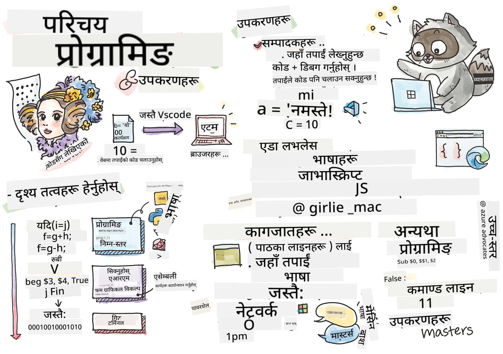

<!--
CO_OP_TRANSLATOR_METADATA:
{
  "original_hash": "b181f967dadb03e20e27995626d5912d",
  "translation_date": "2025-10-20T21:33:31+00:00",
  "source_file": "1-getting-started-lessons/1-intro-to-programming-languages/README.md",
  "language_code": "ne"
}
-->
# प्रोग्रामिङ भाषा र आधुनिक डेभलपर उपकरणहरूको परिचय

प्रोग्रामिङको रोमाञ्चक संसारमा स्वागत छ! यो पाठले तपाईंलाई प्रत्येक वेबसाइट, एप्स, र डिजिटल अनुभवलाई शक्ति दिने आधारभूत अवधारणाहरूमा परिचित गराउनेछ। तपाईंले प्रोग्रामिङ भाषाहरू के हुन्, तिनीहरू कसरी काम गर्छन्, र किन तिनीहरू हाम्रो डिजिटल संसारका निर्माण ब्लकहरू हुन् भन्ने कुरा पत्ता लगाउनुहुनेछ।

प्रोग्रामिङ सुरुमा रहस्यमय लाग्न सक्छ, तर यसलाई नयाँ भाषा सिक्न जस्तै सोच्नुहोस् – जसले तपाईंलाई कम्प्युटरहरूसँग संवाद गर्न र तपाईंको रचनात्मक विचारहरूलाई जीवनमा ल्याउन अनुमति दिन्छ। चाहे तपाईं वेबसाइट निर्माण गर्न चाहनुहुन्छ, मोबाइल एप्स बनाउन चाहनुहुन्छ, वा दैनिक कार्यहरू स्वचालित गर्न चाहनुहुन्छ, प्रोग्रामिङ भाषाहरू बुझ्नु डिजिटल रचनात्मकता र समस्या समाधानतर्फको पहिलो कदम हो।

यस पाठमा, तपाईंले आधुनिक वेब डेभलपरहरूले दैनिक रूपमा प्रयोग गर्ने आवश्यक उपकरणहरूको अन्वेषण गर्नुहुनेछ। सफा, प्रभावकारी कोड लेख्न मद्दत गर्ने कोड एडिटरहरूदेखि ब्राउजरहरू जसले तपाईंलाई तपाईंको सिर्जनाहरू परीक्षण र डिबग गर्न अनुमति दिन्छन्, तपाईंले विश्वभरका शीर्ष टेक कम्पनीहरूले प्रयोग गर्ने उही व्यावसायिक उपकरणहरूसँग व्यावहारिक अनुभव प्राप्त गर्नुहुनेछ।


> स्केच नोट [Tomomi Imura](https://twitter.com/girlie_mac) द्वारा

## प्रि-लेक्चर क्विज
[प्रि-लेक्चर क्विज](https://forms.office.com/r/dru4TE0U9n?origin=lprLink)


## तपाईंले के सिक्नुहुनेछ

यस व्यापक परिचयमा, तपाईंले पत्ता लगाउनुहुनेछ:

- **प्रोग्रामिङ के हो र किन यो महत्त्वपूर्ण छ** – डिजिटल समाधानहरू सिर्जना गर्न प्रोग्रामिङको भूमिका बुझ्दै
- **प्रोग्रामिङ भाषाहरूका प्रकार र तिनीहरूको प्रयोग** – जाभास्क्रिप्टदेखि पाइथनसम्मको भाषाको परिदृश्य अन्वेषण गर्दै  
- **कार्यक्रमको आधारभूत तत्वहरू** – कोडलाई काम गर्ने आधारभूत निर्माण ब्लकहरू सिक्दै
- **व्यावसायिक डेभलपरहरूको लागि आधुनिक सफ्टवेयर र उपकरणहरू** – उद्योगमा प्रयोग गरिने उही उपकरणहरूसँग व्यावहारिक अनुभव प्राप्त गर्दै

> 💡 **सिक्ने सुझाव**: सबै कुरा याद गर्न चिन्ता नगर्नुहोस्! अवधारणाहरू बुझ्नमा ध्यान दिनुहोस् – तपाईंले सम्पूर्ण पाठ्यक्रमभरि यी विचारहरू अभ्यास र सुदृढ गर्नुहुनेछ।

> तपाईंले यो पाठ [Microsoft Learn](https://docs.microsoft.com/learn/modules/web-development-101/introduction-programming/?WT.mc_id=academic-77807-sagibbon) मा लिन सक्नुहुन्छ!

## प्रोग्रामिङ के हो?

प्रोग्रामिङ (कोडिङ वा सफ्टवेयर विकासको रूपमा पनि चिनिन्छ) कम्प्युटर, स्मार्टफोन, वा कुनै पनि डिजिटल उपकरणलाई के गर्नुपर्ने हो भनेर निर्देशनहरू सिर्जना गर्ने प्रक्रिया हो। यसलाई धेरै विस्तृत रेसिपी लेख्न जस्तै सोच्नुहोस् – तर कुकीहरू बनाउने सट्टा, तपाईं वेबसाइटहरू, खेलहरू, मोबाइल एप्स, वा स्मार्ट होम नियन्त्रणहरू सिर्जना गर्दै हुनुहुन्छ।

यी निर्देशनहरू विशेष भाषाहरूमा लेखिन्छन् जसलाई **प्रोग्रामिङ भाषाहरू** भनिन्छ, जसले मानव सोच र कम्प्युटर प्रशोधनको बीच पुलको रूपमा काम गर्छ। कम्प्युटरहरूले केवल बाइनरी कोड (१ र ०) मात्र बुझ्छन्, तर प्रोग्रामिङ भाषाहरूले हामीलाई निर्देशनहरू मानव-पढ्न योग्य र तार्किक तरिकामा लेख्न अनुमति दिन्छ।

तपाईंले प्रयोग गर्ने प्रत्येक डिजिटल अनुभव कसैको कोडबाट सुरु भएको थियो: तपाईंले स्क्रोल गर्ने सामाजिक मिडिया एप, तपाईंको ड्राइभलाई मार्गदर्शन गर्ने जीपीएस, यहाँसम्म कि तपाईंको फोनमा रहेको साधारण क्यालकुलेटर। जब तपाईंले प्रोग्रामिङ सिक्नुहुन्छ, तपाईंले ती डिजिटल समाधानहरू सिर्जना गर्न सिक्दै हुनुहुन्छ जसले वास्तविक समस्याहरू समाधान गर्न सक्छ र लाखौं मानिसहरूको जीवनलाई सजिलो बनाउँछ।

✅ **छोटो अनुसन्धान चुनौती**: विश्वको पहिलो कम्प्युटर प्रोग्रामर को मानिन्छ? यसबारे एकपटक खोजी गर्नुहोस् – उत्तरले तपाईंलाई अचम्मित पार्न सक्छ!

## प्रोग्रामिङ भाषाहरू

जसरी मानिसहरूले अंग्रेजी, स्पेनिश, वा म्यान्डारिन जस्ता विभिन्न भाषाहरू बोल्छन्, कम्प्युटरहरूले विभिन्न प्रोग्रामिङ भाषाहरू बुझ्न सक्छन्। प्रत्येक प्रोग्रामिङ भाषाको आफ्नै सिन्ट्याक्स (व्याकरण नियमहरू) हुन्छ र विशिष्ट प्रकारका कार्यहरूको लागि डिजाइन गरिएको हुन्छ, जसले केही भाषाहरूलाई अन्य कार्यहरूको लागि उपयुक्त बनाउँछ।

प्रोग्रामिङ भाषाहरूले मानव विचार र कम्प्युटर क्रियाहरूको बीच अनुवादकको रूपमा काम गर्छन्। तिनीहरूले डेभलपरहरूलाई मानव-पढ्न योग्य र कम्प्युटर-कार्यान्वयन योग्य निर्देशनहरू लेख्न अनुमति दिन्छन्। जब तपाईंले प्रोग्रामिङ भाषामा कोड लेख्नुहुन्छ, विशेष सफ्टवेयरले तपाईंको निर्देशनहरू कम्प्युटरले वास्तवमा बुझ्ने बाइनरी कोडमा रूपान्तरण गर्छ।

### लोकप्रिय प्रोग्रामिङ भाषाहरू र तिनीहरूको प्रयोग

| भाषा | उत्तम प्रयोग | किन यो लोकप्रिय छ |
|------|--------------|--------------------|
| **जाभास्क्रिप्ट** | वेब विकास, प्रयोगकर्ता इन्टरफेस | ब्राउजरमा चल्छ र इन्टरएक्टिभ वेबसाइटहरूलाई शक्ति दिन्छ |
| **पाइथन** | डाटा विज्ञान, स्वचालन, एआई | पढ्न र सिक्न सजिलो, शक्तिशाली लाइब्रेरीहरू |
| **जाभा** | उद्यम एप्स, एन्ड्रोइड एप्स | प्लेटफर्म-स्वतन्त्र, ठूला प्रणालीहरूको लागि बलियो |
| **C#** | विन्डोज एप्स, खेल विकास | माइक्रोसफ्ट इकोसिस्टमको बलियो समर्थन |
| **Go** | क्लाउड सेवाहरू, ब्याकएन्ड प्रणालीहरू | छिटो, सरल, आधुनिक कम्प्युटिङको लागि डिजाइन गरिएको |

### उच्च-स्तर बनाम निम्न-स्तरका भाषाहरू

प्रोग्रामिङ भाषाहरू **निम्न-स्तर** (मेसिन कोड नजिक) देखि **उच्च-स्तर** (मानव भाषा नजिक) सम्मको स्पेक्ट्रममा अवस्थित छन्:

- **निम्न-स्तरका भाषाहरू** (जस्तै Assembly वा C) कम अनुवाद चरणहरू आवश्यक हुन्छ तर मानिसहरूका लागि पढ्न र लेख्न गाह्रो हुन्छ
- **उच्च-स्तरका भाषाहरू** (जस्तै जाभास्क्रिप्ट, पाइथन, वा C#) पढ्न सजिलो हुन्छ र ठूला समुदायहरू हुन्छन्, जसले तिनीहरूलाई अधिकांश आधुनिक विकासको लागि आदर्श बनाउँछ

> 💡 **यसलाई यसरी सोच्नुहोस्**: निम्न-स्तरका भाषाहरू कम्प्युटरको मातृभाषामा सिधै बोल्न जस्तै हो, जबकि उच्च-स्तरका भाषाहरू कुशल अनुवादक भएको जस्तै हो जसले तपाईंको दैनिक भाषालाई कम्प्युटर-भाषामा अनुवाद गर्छ।

### प्रोग्रामिङ भाषाहरूको कार्यमा तुलना

उच्च-स्तर र निम्न-स्तरका भाषाहरूको बीचको भिन्नता देखाउनको लागि, एउटै कार्य दुई फरक तरिकामा लेखिएको हेर्नुहोस्। तलका दुवै कोड उदाहरणहरूले प्रसिद्ध फिबोनाची अनुक्रम उत्पन्न गर्छन् (जहाँ प्रत्येक संख्या दुई अघिल्लो संख्याको योग हो: ०, १, १, २, ३, ५, ८, १३, २१, ३४...)।

**उच्च-स्तरको भाषा (जाभास्क्रिप्ट) – मानव-मैत्री:**

```javascript
// Step 1: Basic Fibonacci setup
const fibonacciCount = 10;
let current = 0;
let next = 1;

console.log('Fibonacci sequence:');
```

**यो कोडले के गर्छ:**
- **घोषणा गर्नुहोस्** कि कति फिबोनाची संख्याहरू उत्पन्न गर्न चाहिन्छ
- **सुरु गर्नुहोस्** दुई भेरिएबलहरूलाई अनुक्रममा हालको र अर्को संख्याहरू ट्र्याक गर्न
- **सेट गर्नुहोस्** सुरुका मानहरू (० र १) जसले फिबोनाची ढाँचा परिभाषित गर्छ
- **प्रदर्शन गर्नुहोस्** हेडर सन्देशले हाम्रो आउटपुटलाई पहिचान गर्न

```javascript
// Step 2: Generate the sequence with a loop
for (let i = 0; i < fibonacciCount; i++) {
  console.log(`Position ${i + 1}: ${current}`);
  
  // Calculate next number in sequence
  const sum = current + next;
  current = next;
  next = sum;
}
```

**यहाँ के हुन्छ:**
- **लूप गर्नुहोस्** प्रत्येक स्थानमा `for` लूप प्रयोग गरेर
- **प्रदर्शन गर्नुहोस्** प्रत्येक संख्या यसको स्थानसँग टेम्पलेट लिटरल फर्म्याटिङ प्रयोग गरेर
- **गणना गर्नुहोस्** अर्को फिबोनाची संख्या हालको र अर्को मानहरू जोडेर
- **अपडेट गर्नुहोस्** हाम्रो ट्र्याकिङ भेरिएबलहरू अर्को पुनरावृत्तिमा जान

```javascript
// Step 3: Modern functional approach
const generateFibonacci = (count) => {
  const sequence = [0, 1];
  
  for (let i = 2; i < count; i++) {
    sequence[i] = sequence[i - 1] + sequence[i - 2];
  }
  
  return sequence;
};

// Usage example
const fibSequence = generateFibonacci(10);
console.log(fibSequence);
```

**माथिको कोडमा:**
- **पुनः प्रयोग गर्न मिल्ने** फङ्सन आधुनिक एरो फङ्सन सिन्ट्याक्स प्रयोग गरेर सिर्जना गरिएको छ
- **निर्माण गरिएको छ** सम्पूर्ण अनुक्रम भण्डारण गर्नको लागि एरे
- **प्रयोग गरिएको छ** एरे इन्डेक्सिङ प्रत्येक नयाँ संख्या अघिल्लो मानहरूबाट गणना गर्न
- **फिर्ता गरिएको छ** सम्पूर्ण अनुक्रम अन्य भागहरूमा लचिलो प्रयोगको लागि

**निम्न-स्तरको भाषा (ARM Assembly) – कम्प्युटर-मैत्री:**

```assembly
 area ascen,code,readonly
 entry
 code32
 adr r0,thumb+1
 bx r0
 code16
thumb
 mov r0,#00
 sub r0,r0,#01
 mov r1,#01
 mov r4,#10
 ldr r2,=0x40000000
back add r0,r1
 str r0,[r2]
 add r2,#04
 mov r3,r0
 mov r0,r1
 mov r1,r3
 sub r4,#01
 cmp r4,#00
 bne back
 end
```

जाभास्क्रिप्ट संस्करणले लगभग अंग्रेजी निर्देशनहरू जस्तै पढ्छ, जबकि Assembly संस्करणले कम्प्युटरको प्रोसेसरलाई सिधै नियन्त्रण गर्ने क्रिप्टिक आदेशहरू प्रयोग गर्छ। दुवैले ठ्याक्कै एउटै कार्य पूरा गर्छन्, तर उच्च-स्तरको भाषा मानिसहरूका लागि बुझ्न, लेख्न, र मर्मत गर्न धेरै सजिलो छ।

**मुख्य भिन्नताहरू जुन तपाईंले देख्नुहुनेछ:**
- **पढ्न सजिलो**: जाभास्क्रिप्टले `fibonacciCount` जस्ता वर्णनात्मक नामहरू प्रयोग गर्छ जबकि Assemblyले `r0`, `r1` जस्ता क्रिप्टिक लेबलहरू प्रयोग गर्छ
- **टिप्पणीहरू**: उच्च-स्तरका भाषाहरूले व्याख्यात्मक टिप्पणीहरूलाई प्रोत्साहन दिन्छ जसले कोडलाई आत्म-डकुमेन्टिङ बनाउँछ
- **संरचना**: जाभास्क्रिप्टको तार्किक प्रवाहले मानिसहरूले समस्याहरूलाई चरण-दर-चरण सोच्ने तरिकालाई मिल्छ
- **मर्मत**: फरक आवश्यकताहरूको लागि जाभास्क्रिप्ट संस्करणलाई अपडेट गर्नु सरल र स्पष्ट छ

✅ **फिबोनाची अनुक्रम** [परिभाषित](https://en.wikipedia.org/wiki/Fibonacci_number) हुन्छ संख्याहरूको सेटको रूपमा जहाँ प्रत्येक संख्या दुई अघिल्लो संख्याको योग हो, ० र १ बाट सुरु गर्दै। यो गणितीय ढाँचा प्रकृतिमा बारम्बार देखा पर्दछ, फूलका पातदेखि घुमाउरो खोलसम्म!


## कार्यक्रमका तत्वहरू

अब तपाईंले प्रोग्रामिङ भाषाहरू के हुन् भन्ने कुरा बुझ्नुभयो, आउनुहोस् कुनै पनि कार्यक्रम बनाउने आधारभूत निर्माण ब्लकहरूको अन्वेषण गरौं। यी तत्वहरूलाई प्रोग्रामिङको व्याकरण र शब्दावलीको रूपमा सोच्नुहोस् – एकपटक तपाईंले यी अवधारणाहरू बुझ्नुभयो भने, तपाईं कुनै पनि भाषामा कोड पढ्न र लेख्न सक्षम हुनुहुनेछ।

### स्टेटमेन्टहरू: आधारभूत निर्देशनहरू

**स्टेटमेन्ट** भनेको कार्यक्रमको एकल निर्देशन हो, जस्तै मानव भाषामा एउटा वाक्य। प्रत्येक स्टेटमेन्टले कम्प्युटरलाई एक विशिष्ट कार्य गर्न निर्देशन दिन्छ। जस्तै वाक्यहरू पूर्णविराममा समाप्त हुन्छन्, स्टेटमेन्टहरूमा एक निर्देश समाप्त हुने र अर्को सुरु हुने विशिष्ट तरिकाहरू हुन्छन् (यो प्रोग्रामिङ भाषाद्वारा फरक हुन्छ)।

```javascript
// Basic statements that perform single actions
const userName = "Alex";                    
console.log("Hello, world!");              
const sum = 5 + 3;                         
```

**यो कोडले के गर्छ:**
- **घोषणा गर्नुहोस्** एक स्थिर भेरिएबल प्रयोगकर्ताको नाम भण्डारण गर्न
- **प्रदर्शन गर्नुहोस्** कन्सोल आउटपुटमा अभिवादन सन्देश
- **गणना गर्नुहोस्** र गणितीय अपरेशनको परिणाम भण्डारण गर्नुहोस्

```javascript
// Statements that interact with web pages
document.title = "My Awesome Website";      
document.body.style.backgroundColor = "lightblue";
```

**चरण-दर-चरण, यहाँ के हुन्छ:**
- **परिवर्तन गर्नुहोस्** ब्राउजर ट्याबमा देखिने वेबपेजको शीर्षक
- **परिवर्तन गर्नुहोस्** सम्पूर्ण पृष्ठको पृष्ठभूमि रंग

### भेरिएबलहरू: जानकारी भण्डारण गर्नु

**भेरिएबलहरू** लेबल गरिएको कन्टेनरहरू जस्तै हुन्छन् जसले तपाईंको कार्यक्रमलाई आवश्यक जानकारी सम्झन मद्दत गर्छ। जस्तै तपाईंले कागजमा किराना सूची लेख्न सक्नुहुन्छ र त्यसलाई पछि हेर्न सक्नुहुन्छ, भेरिएबलहरूले कार्यक्रमलाई डाटा भण्डारण गर्न र पछि प्रयोग गर्न अनुमति दिन्छ। भेरिएबलहरूको अद्वितीय नाम हुन्छ र तिनीहरूको सामग्री कार्यक्रम चल्दा परिवर्तन हुन सक्छ।

```javascript
// Step 1: Creating basic variables
const siteName = "Weather Dashboard";        
let currentWeather = "sunny";               
let temperature = 75;                       
let isRaining = false;                      
```

**यी अवधारणाहरू बुझ्दै:**
- **भण्डारण गर्नुहोस्** परिवर्तन नहुने मानहरू `const` भेरिएबलहरूमा (जस्तै साइट नाम)
- **प्रयोग गर्नुहोस्** `let` मानहरूको लागि जुन तपाईंको कार्यक्रमभरि परिवर्तन हुन सक्छ
- **असाइन गर्नुहोस्** विभिन्न डाटा प्रकारहरू: स्ट्रिङ (पाठ), संख्या, र बूलियन (सत्य/झुटो)
- **चयन गर्नुहोस्** वर्णनात्मक नामहरू जसले प्रत्येक भेरिएबलले के समावेश गर्छ भन्ने कुरा स्पष्ट गर्छ

```javascript
// Step 2: Working with objects to group related data
const weatherData = {                       
  location: "San Francisco",
  humidity: 65,
  windSpeed: 12
};
```

**माथिको कोडमा:**
- **सिर्जना गरिएको छ** एक वस्तु सम्बन्धित मौसम जानकारीलाई समूह गर्न
- **व्यवस्थित गरिएको छ** धेरै टुक्रा डाटालाई एक भेरिएबल नाम अन्तर्गत
- **प्रयोग गरिएको छ** प्रमुख-मूल्य जोडीहरू प्रत्येक टुक्रा जानकारीलाई स्पष्ट रूपमा लेबल गर्न

```javascript
// Step 3: Using and updating variables
console.log(`${siteName}: Today is ${currentWeather} and ${temperature}°F`);
console.log(`Wind speed: ${weatherData.windSpeed} mph`);

// Updating changeable variables
currentWeather = "cloudy";                  
temperature = 68;                          
```

**प्रत्येक भाग बुझ्दै:**
- **प्रदर्शन गर्नुहोस्** जानकारी टेम्पलेट लिटरलहरू `${}` सिन्ट्याक्सको साथ प्रयोग गरेर
- **पहुंच गर्नुहोस्** वस्तु गुणहरू डट नोटेशन (`weatherData.windSpeed`) प्रयोग गरेर
- **अपडेट गर्नुहोस्** `let` भेरिएबलहरू परिवर्तनशील अवस्थाहरू प्रतिबिम्बित गर्न
- **संयोजन गर्नुहोस्** धेरै भेरिएबलहरू अर्थपूर्ण सन्देशहरू सिर्जना गर्न

```javascript
// Step 4: Modern destructuring for cleaner code
const { location, humidity } = weatherData; 
console.log(`${location} humidity: ${humidity}%`);
```

**तपाईंले जान्नुपर्ने कुरा:**
- **निकाल्नुहोस्** वस्तुबाट विशिष्ट गुणहरू डेस्ट्रक्चरिङ असाइनमेन्ट प्रयोग गरेर
- **सिर्जना गर्नुहोस्** नयाँ भेरिएबलहरू स्वतः वस्तु कुञ्जीहरूको समान नामको साथ
- **सरल बनाउनुहोस्** कोड दोहोरिने डट नोटेशनबाट बचेर

### नियन्त्रण प्रवाह: निर्णय लिने

कार्यक्रमहरूले प्रायः विभिन्न परिस्थितिहरूको आधारमा निर्णय लिन आवश्यक हुन्छ। **नियन्त्रण प्रवाह स्टेटमेन्टहरू** (जस्तै `if...else`) ले कार्यक्रमहरूलाई विभिन्न मार्गहरू छनोट गर्न अनुमति दिन्छ, जसले तिनीहरूलाई स्मार्ट र परिवर्तनशील अवस्थाहरूमा उत्तरदायी बनाउँछ।

```javascript
// Step 1: Basic conditional logic
const userAge = 17;

if (userAge >= 18) {
  console.log("You can vote!");
} else {
  const yearsToWait = 18 - userAge;
  console.log(`You'll be able to vote in ${yearsToWait} year(s).`);
}
```

**यो कोडले के गर्छ:**
- **जाँच गर्नुहोस्** प्रयोगकर्ताको उमेर मतदानको आवश्यकतासँग मेल खान्छ कि छैन
- **कार्यान्वयन गर्नुहोस्** विभिन्न कोड ब्लकहरू अवस्था परिणामको आधारमा
- **गणना गर्नुहोस्** र प्रदर्शन गर्नुहोस् कति समयसम्म मतदानको योग्यता प्राप्त गर्न बाँकी छ
- **प्रदान गर्नुहोस्** प्रत्येक परिदृश्यको लागि विशिष्ट, उपयोगी प्रतिक्रिया

```javascript
// Step 2: Multiple conditions with logical operators
const userAge = 17;
const hasPermission = true;

if (userAge >= 18 && hasPermission) {
  console.log("Access granted: You can enter the venue.");
} else if (userAge >= 16) {
  console.log("You need parent permission to enter.");
} else {
  console.log("Sorry, you must be at least 16 years old.");
}
```

**यहाँ के हुन्छ:**
- **संयोजन गर्नुहोस्** धेरै अवस्थाहरू `&&` (र) अपरेटर प्रयोग गरेर
- **सिर्जना गर्नुहोस्** अवस्थाहरूको पदानुक्रम `else if` प्रयोग गरेर धेरै परिदृश्यहरूको लागि
- **सम्भावित सबै केसहरूलाई ह्यान्डल गर्नुहोस्** अन्तिम `else` स्टेटमेन्टको साथ
- **प्रदान गर्नुहोस्** प्रत्येक फरक परिस्थितिको लागि स्पष्ट, कार्यात्मक प्रतिक्रिया

```javascript
// Step 3: Concise conditional with ternary operator
const votingStatus = userAge >= 18 ? "Can vote" : "Cannot vote yet";
console.log(`Status: ${votingStatus}`);
```

**तपाईंले सम्झनुपर्ने कुरा:**
- **प्रयोग गर्नुहोस्** टर्नरी अपरेटर (`? :`) सरल दुई-विकल्प अवस्थाहरूको लागि
- **लेख्नुहोस्** अवस्था पहिले, त्यसपछि `?`, त्यसपछि सत्य परिणाम, त्यसपछि `:`, त्यसपछि झुटो परिणाम
- **यो ढाँचा लागू गर्नुहोस्** जब तपाईंले अवस्थाहरूको आधारमा मानहरू असाइन गर्न आवश्यक छ

```javascript
// Step 4: Handling multiple specific cases
const dayOfWeek = "Tuesday";

switch (dayOfWeek) {
  case "Monday":
  case "Tuesday":
  case "Wednesday":
  case "Thursday":
  case "Friday":
    console.log("It's a weekday - time to work!");
    break;
  case "Saturday":
  case "Sunday":
    console.log("It's the weekend - time to relax!");
    break;
  default:
    console.log("Invalid day of the week");
}
```

**यो कोडले निम्न कार्यहरू पूरा गर्छ:**
- **मिलाउनुहोस्** भेरिएबल मानलाई धेरै विशिष्ट केसहरूसँग
- **समूह बनाउनुहोस्** समान केसहरू (सप्ताहका दिन बनाम सप्ताहन्त)
- **कार्यान्वयन गर्नुहोस्** उपयुक्त कोड ब्लक जब मिलान भेटिन्छ
- **सामेल गर्नुहोस्** `default` केस अप्रत्याशित मानहरू ह्यान्डल गर्न
- **प्रयोग गर्नुहोस्** `break` स्टेटमेन्टहरू अर्को केसमा कोड जारी राख्नबाट रोक्न

> 💡 **वास्तविक जीवनको उपमा**: नियन्त्रण प्रवाहलाई जीपीएसले तपाईंलाई दिशा दिने जस्तै सोच्नुहोस्। यसले भन्न सक्छ "यदि मेन स्ट्रीटमा ट्राफिक छ
आधुनिक कोड सम्पादकहरूले तपाईंको उत्पादकता बढाउन डिजाइन गरिएका प्रभावशाली सुविधाहरू प्रदान गर्छन्:

| सुविधा | यसको काम | किन यो सहयोगी छ |
|--------|----------|------------------|
| **सिन्ट्याक्स हाइलाइटिङ** | तपाईंको कोडका विभिन्न भागहरूलाई रंग दिन्छ | कोड पढ्न सजिलो बनाउँछ र त्रुटिहरू पत्ता लगाउन सहयोग गर्छ |
| **अटो-कम्प्लिसन** | तपाईं टाइप गर्दा कोड सुझाव दिन्छ | कोड लेख्न छिटो बनाउँछ र टाइपो कम गर्छ |
| **डिबगिङ उपकरणहरू** | त्रुटिहरू पत्ता लगाउन र सुधार गर्न सहयोग गर्छ | समस्या समाधानमा समय बचत गर्छ |
| **एक्सटेन्सनहरू** | विशेष सुविधाहरू थप्छ | तपाईंको सम्पादकलाई कुनै पनि प्रविधिका लागि अनुकूल बनाउँछ |
| **एआई सहायकहरू** | कोड र व्याख्या सुझाव दिन्छ | सिकाइ र उत्पादकता बढाउँछ |

> 🎥 **भिडियो स्रोत**: यी उपकरणहरूलाई काममा देख्न चाहनुहुन्छ? [Tools of the Trade video](https://youtube.com/watch?v=69WJeXGBdxg) हेर्नुहोस् विस्तृत जानकारीको लागि।

#### वेब विकासका लागि सिफारिस गरिएका सम्पादकहरू

**[Visual Studio Code](https://code.visualstudio.com/?WT.mc_id=academic-77807-sagibbon)** (निःशुल्क)
- वेब विकासकर्ताहरू बीच सबैभन्दा लोकप्रिय
- उत्कृष्ट एक्सटेन्सन इकोसिस्टम
- बिल्ट-इन टर्मिनल र Git इंटिग्रेशन
- **आवश्यक एक्सटेन्सनहरू**:
  - [GitHub Copilot](https://marketplace.visualstudio.com/items?itemName=GitHub.copilot) - एआई-शक्तिशाली कोड सुझाव
  - [Live Share](https://marketplace.visualstudio.com/items?itemName=MS-vsliveshare.vsliveshare) - वास्तविक समय सहयोग
  - [Prettier](https://marketplace.visualstudio.com/items?itemName=esbenp.prettier-vscode) - स्वचालित कोड फर्म्याटिङ
  - [Code Spell Checker](https://marketplace.visualstudio.com/items?itemName=streetsidesoftware.code-spell-checker) - तपाईंको कोडमा टाइपो पत्ता लगाउनुहोस्

**[JetBrains WebStorm](https://www.jetbrains.com/webstorm/)** (भुक्तान गरिएको, विद्यार्थीहरूका लागि निःशुल्क)
- उन्नत डिबगिङ र परीक्षण उपकरणहरू
- बौद्धिक कोड कम्प्लिसन
- बिल्ट-इन संस्करण नियन्त्रण

**क्लाउड-आधारित IDEs** (विभिन्न मूल्य निर्धारण)
- [GitHub Codespaces](https://github.com/features/codespaces) - तपाईंको ब्राउजरमा पूर्ण VS Code
- [Replit](https://replit.com/) - सिक्न र कोड साझा गर्न उत्कृष्ट
- [StackBlitz](https://stackblitz.com/) - तत्काल, पूर्ण-स्ट्याक वेब विकास

> 💡 **सुरु गर्ने सुझाव**: Visual Studio Code बाट सुरु गर्नुहोस् – यो निःशुल्क छ, उद्योगमा व्यापक रूपमा प्रयोग गरिन्छ, र सहयोगी ट्यूटोरियल र एक्सटेन्सनहरू बनाउने ठूलो समुदाय छ।

### वेब ब्राउजरहरू: तपाईंको परीक्षण प्रयोगशाला

वेब ब्राउजरहरू केवल इन्टरनेट ब्राउज गर्नका लागि उपकरण मात्र होइनन् – ती परिष्कृत विकास वातावरण हुन् जसले तपाईंलाई वेब एप्लिकेसनहरू निर्माण, परीक्षण, र अनुकूलन गर्न सहयोग गर्छ। प्रत्येक आधुनिक ब्राउजरमा शक्तिशाली विकासकर्ता उपकरणहरू (DevTools) समावेश छन् जसले तपाईंको कोडको प्रदर्शनको गहिरो जानकारी प्रदान गर्छ।

**वेब विकासका लागि ब्राउजरहरू किन आवश्यक छन्:**

जब तपाईं वेबसाइट वा वेब एप्लिकेसन बनाउनुहुन्छ, तपाईंले वास्तविक संसारमा यो कस्तो देखिन्छ र कसरी व्यवहार गर्छ भन्ने हेर्न आवश्यक छ। ब्राउजरहरूले तपाईंको काम देखाउने मात्र होइन, प्रदर्शन, पहुँचयोग्यता, र सम्भावित समस्याहरूको विस्तृत प्रतिक्रिया पनि प्रदान गर्छ।

#### ब्राउजर विकासकर्ता उपकरणहरू (DevTools)

आधुनिक ब्राउजरहरूले व्यापक विकास सूटहरू समावेश गर्छन्:

| उपकरण श्रेणी | यसको काम | उदाहरण प्रयोग केस |
|--------------|----------|--------------------|
| **एलिमेन्ट इन्स्पेक्टर** | HTML/CSS लाई वास्तविक समयमा हेर्न र सम्पादन गर्न दिन्छ | स्टाइल समायोजन गरेर तत्काल परिणाम हेर्नुहोस् |
| **कन्सोल** | त्रुटि सन्देशहरू हेर्न र JavaScript परीक्षण गर्न दिन्छ | समस्या समाधान र कोडमा प्रयोग |
| **नेटवर्क मोनिटर** | स्रोतहरू कसरी लोड हुन्छन् ट्र्याक गर्नुहोस् | प्रदर्शन र लोड समय अनुकूलन गर्नुहोस् |
| **एक्सेसिबिलिटी चेकर** | समावेशी डिजाइनको लागि परीक्षण गर्नुहोस् | तपाईंको साइट सबै प्रयोगकर्ताहरूका लागि काम सुनिश्चित गर्नुहोस् |
| **डिभाइस सिम्युलेटर** | विभिन्न स्क्रिन साइजमा पूर्वावलोकन गर्नुहोस् | धेरै उपकरणहरू बिना उत्तरदायी डिजाइन परीक्षण गर्नुहोस् |

#### विकासका लागि सिफारिस गरिएका ब्राउजरहरू

- **[Chrome](https://developers.google.com/web/tools/chrome-devtools/)** - विस्तृत डकुमेन्टेसनसहितको उद्योग-मानक DevTools
- **[Firefox](https://developer.mozilla.org/docs/Tools)** - उत्कृष्ट CSS ग्रिड र पहुँचयोग्यता उपकरणहरू
- **[Edge](https://docs.microsoft.com/microsoft-edge/devtools-guide-chromium/?WT.mc_id=academic-77807-sagibbon)** - Chromium मा आधारित Microsoft का विकासकर्ता स्रोतहरूसहित

> ⚠️ **महत्वपूर्ण परीक्षण सुझाव**: तपाईंको वेबसाइटहरू विभिन्न ब्राउजरहरूमा सधैं परीक्षण गर्नुहोस्! Chrome मा पूर्ण रूपमा काम गर्ने कुरा Safari वा Firefox मा फरक देखिन सक्छ। व्यावसायिक विकासकर्ताहरूले सबै प्रमुख ब्राउजरहरूमा परीक्षण गर्छन् ताकि प्रयोगकर्ताहरूलाई समान अनुभव सुनिश्चित गर्न सकियोस्।

### कमाण्ड लाइन उपकरणहरू: पावर प्रयोगकर्ताको प्रवेशद्वार

कमाण्ड लाइन (टर्मिनल वा शेल पनि भनिन्छ) सुरुमा डर लाग्दो देखिन सक्छ – यो केवल कालो स्क्रिनमा पाठ हो! तर यसको साधारण देखावटले तपाईंलाई मूर्ख नबनाओस्। कमाण्ड लाइन विकासकर्ताको टूलकिटमा सबैभन्दा शक्तिशाली उपकरणहरू मध्ये एक हो, जसले तपाईंलाई जटिल कार्यहरू सरल पाठ आदेशहरूसँग प्रदर्शन गर्न अनुमति दिन्छ।

**विकासकर्ताहरू किन कमाण्ड लाइन मन पराउँछन्:**

ग्राफिकल इन्टरफेसहरू धेरै कार्यहरूको लागि उत्कृष्ट छन्, तर कमाण्ड लाइन स्वचालन, सटीकता, र गति मा उत्कृष्ट छ। धेरै विकास उपकरणहरू मुख्य रूपमा कमाण्ड लाइन इन्टरफेसहरू मार्फत काम गर्छन्, र तिनीहरूलाई प्रभावकारी रूपमा प्रयोग गर्न सिक्नाले तपाईंको उत्पादकता नाटकीय रूपमा सुधार गर्न सक्छ।

```bash
# Step 1: Create and navigate to project directory
mkdir my-awesome-website
cd my-awesome-website
```

**यो कोडले के गर्छ:**
- **नयाँ डाइरेक्टरी बनाउनुहोस्** "my-awesome-website" नामक तपाईंको प्रोजेक्टको लागि
- **नेभिगेट गर्नुहोस्** नयाँ बनाइएको डाइरेक्टरीमा काम सुरु गर्न

```bash
# Step 2: Initialize project with package.json
npm init -y

# Install modern development tools
npm install --save-dev vite prettier eslint
npm install --save-dev @eslint/js
```

**चरणबद्ध रूपमा, यहाँ के भइरहेको छ:**
- **नोड.जएस प्रोजेक्ट सुरु गर्नुहोस्** `npm init -y` प्रयोग गरेर डिफल्ट सेटिङ्ससहित
- **Vite स्थापना गर्नुहोस्** छिटो विकास र उत्पादन निर्माणको लागि आधुनिक निर्माण उपकरणको रूपमा
- **Prettier थप्नुहोस्** स्वचालित कोड फर्म्याटिङको लागि र ESLint कोड गुणस्तर जाँचको लागि
- **`--save-dev` फ्ल्याग प्रयोग गर्नुहोस्** यी विकास-केवल निर्भरता रूपमा चिन्हित गर्न

```bash
# Step 3: Create project structure and files
mkdir src assets
echo '<!DOCTYPE html><html><head><title>My Site</title></head><body><h1>Hello World</h1></body></html>' > index.html

# Start development server
npx vite
```

**माथिको कोडमा, हामीले:**
- **प्रोजेक्ट व्यवस्थित गर्यौं** स्रोत कोड र सम्पत्तिहरूका लागि छुट्टै फोल्डरहरू बनाएर
- **मूल HTML फाइल उत्पन्न गर्यौं** उचित कागजात संरचनासहित
- **Vite विकास सर्भर सुरु गर्यौं** लाइभ रीलोडिङ र हट मोड्युल प्रतिस्थापनको लागि

#### वेब विकासका लागि आवश्यक कमाण्ड लाइन उपकरणहरू

| उपकरण | उद्देश्य | किन तपाईंलाई यसको आवश्यकता छ |
|-------|----------|-------------------------------|
| **[Git](https://git-scm.com/)** | संस्करण नियन्त्रण | परिवर्तनहरू ट्र्याक गर्नुहोस्, अरूसँग सहकार्य गर्नुहोस्, तपाईंको काम ब्याकअप गर्नुहोस् |
| **[Node.js & npm](https://nodejs.org/)** | JavaScript रनटाइम र प्याकेज व्यवस्थापन | ब्राउजर बाहिर JavaScript चलाउनुहोस्, आधुनिक विकास उपकरणहरू स्थापना गर्नुहोस् |
| **[Vite](https://vitejs.dev/)** | निर्माण उपकरण र विकास सर्भर | हट मोड्युल प्रतिस्थापनसहितको छिटो विकास |
| **[ESLint](https://eslint.org/)** | कोड गुणस्तर | तपाईंको JavaScript मा समस्या स्वतः पत्ता लगाउनुहोस् र सुधार गर्नुहोस् |
| **[Prettier](https://prettier.io/)** | कोड फर्म्याटिङ | तपाईंको कोडलाई सधैं एकरूप र पढ्न सजिलो बनाउनुहोस् |

#### प्लेटफर्म-विशिष्ट विकल्पहरू

**Windows:**
- **[Windows Terminal](https://docs.microsoft.com/windows/terminal/?WT.mc_id=academic-77807-sagibbon)** - आधुनिक, सुविधायुक्त टर्मिनल
- **[PowerShell](https://docs.microsoft.com/powershell/?WT.mc_id=academic-77807-sagibbon)** 💻 - शक्तिशाली स्क्रिप्टिङ वातावरण
- **[Command Prompt](https://docs.microsoft.com/windows-server/administration/windows-commands/?WT.mc_id=academic-77807-sagibbon)** 💻 - परम्परागत Windows कमाण्ड लाइन

**macOS:**
- **[Terminal](https://support.apple.com/guide/terminal/)** 💻 - बिल्ट-इन टर्मिनल एप्लिकेसन
- **[iTerm2](https://iterm2.com/)** - उन्नत सुविधाहरू भएको टर्मिनल

**Linux:**
- **[Bash](https://www.gnu.org/software/bash/)** 💻 - मानक Linux शेल
- **[KDE Konsole](https://docs.kde.org/trunk5/en/konsole/konsole/index.html)** - उन्नत टर्मिनल इम्युलेटर

> 💻 = अपरेटिङ सिस्टममा पूर्व-स्थापित

> 🎯 **सिकाइको मार्ग**: `cd` (डाइरेक्टरी परिवर्तन गर्नुहोस्), `ls` वा `dir` (फाइलहरूको सूची हेर्नुहोस्), र `mkdir` (फोल्डर बनाउनुहोस्) जस्ता आधारभूत आदेशहरूबाट सुरु गर्नुहोस्। आधुनिक वर्कफ्लो आदेशहरू जस्तै `npm install`, `git status`, र `code .` (हालको डाइरेक्टरीलाई VS Code मा खोल्नुहोस्) अभ्यास गर्नुहोस्। तपाईं सहज हुँदै जाँदा, तपाईं स्वाभाविक रूपमा थप उन्नत आदेशहरू र स्वचालन प्रविधिहरू सिक्नुहुनेछ।

### डकुमेन्टेसन: तपाईंको सिकाइको कम्पास

डकुमेन्टेसन भनेको २४/७ उपलब्ध जानकार मार्गदर्शक जस्तै हो। जब तपाईं नयाँ अवधारणाहरू सामना गर्नुहुन्छ, उपकरण कसरी काम गर्छ बुझ्न आवश्यक छ, वा उन्नत सुविधाहरू अन्वेषण गर्न चाहनुहुन्छ, उच्च-गुणस्तरको डकुमेन्टेसन तपाईंको सफलताको रोडम्याप बन्छ।

**डकुमेन्टेसन किन महत्त्वपूर्ण छ:**

व्यावसायिक विकासकर्ताहरूले डकुमेन्टेसन पढ्न धेरै समय बिताउँछन् – किनभने तिनीहरूलाई थाहा छैन भन्ने होइन, तर वेब विकास परिदृश्य यति छिटो विकसित हुन्छ कि अद्यावधिक रहन निरन्तर सिकाइ आवश्यक छ। उत्कृष्ट डकुमेन्टेसनले तपाईंलाई *कसरी* मात्र होइन, *किन* र *कहिले* प्रयोग गर्ने बुझ्न मद्दत गर्छ।

#### आवश्यक डकुमेन्टेसन स्रोतहरू

**[Mozilla Developer Network (MDN)](https://developer.mozilla.org/docs/Web)**
- वेब प्रविधि डकुमेन्टेसनको लागि सुनौलो मानक
- HTML, CSS, र JavaScript का लागि व्यापक मार्गदर्शन
- ब्राउजर अनुकूलता जानकारी समावेश छ
- व्यावहारिक उदाहरणहरू र अन्तरक्रियात्मक डेमोहरू समावेश छन्

**[Web.dev](https://web.dev)** (Google द्वारा)
- आधुनिक वेब विकासका उत्कृष्ट अभ्यासहरू
- प्रदर्शन अनुकूलन मार्गदर्शन
- पहुँचयोग्यता र समावेशी डिजाइन सिद्धान्तहरू
- वास्तविक परियोजनाहरूबाट केस अध्ययनहरू

**[Microsoft Developer Documentation](https://docs.microsoft.com/microsoft-edge/#microsoft-edge-for-developers)**
- Edge ब्राउजर विकास स्रोतहरू
- प्रोग्रेसिभ वेब एप्स मार्गदर्शन
- क्रस-प्ल्याटफर्म विकास अन्तर्दृष्टि

**[Frontend Masters Learning Paths](https://frontendmasters.com/learn/)**
- संरचित सिकाइ पाठ्यक्रमहरू
- उद्योग विशेषज्ञहरूबाट भिडियो पाठ्यक्रमहरू
- व्यावहारिक कोडिङ अभ्यासहरू

> 📚 **अध्ययन रणनीति**: डकुमेन्टेसनलाई याद गर्न प्रयास नगर्नुहोस् – यसको सट्टा, यसलाई प्रभावकारी रूपमा नेभिगेट गर्न सिक्नुहोस्। बारम्बार प्रयोग गरिने सन्दर्भहरू बुकमार्क गर्नुहोस् र विशिष्ट जानकारी छिटो फेला पार्न खोजी कार्यहरू प्रयोग गर्ने अभ्यास गर्नुहोस्।

✅ **प्रतिबिम्ब अभ्यास**: वेब विकास उपकरणहरू वेब डिजाइन उपकरणहरूबाट कसरी फरक हुन सक्छन् भनेर सोच्नुहोस्। पहुँचयोग्यता सुविधाहरू, उत्तरदायी डिजाइन क्षमता, र सहयोगी वर्कफ्लोहरू दुई भूमिकाहरू बीच कसरी फरक हुन सक्छन् भनेर विचार गर्नुहोस्। यो तुलना तपाईंलाई वेब सिर्जनाको व्यापक पारिस्थितिकी तन्त्र बुझ्न मद्दत गर्नेछ!

## GitHub Copilot Agent Challenge 🚀

Agent मोड प्रयोग गरेर निम्न चुनौती पूरा गर्नुहोस्:

**विवरण:** आधुनिक कोड सम्पादक वा IDE का सुविधाहरू अन्वेषण गर्नुहोस् र वेब विकासकर्ताको रूपमा तपाईंको वर्कफ्लो सुधार गर्न यसले कसरी सहयोग गर्न सक्छ भनेर प्रदर्शन गर्नुहोस्।

**प्रेरणा:** Visual Studio Code, WebStorm, वा क्लाउड-आधारित IDE जस्ता कोड सम्पादक वा IDE चयन गर्नुहोस्। तीन सुविधाहरू वा एक्सटेन्सनहरूको सूची बनाउनुहोस् जसले तपाईंलाई कोड लेख्न, डिबग गर्न, वा मर्मत गर्न अधिक प्रभावकारी बनाउँछ। प्रत्येकको लागि, यो तपाईंको वर्कफ्लोमा कसरी फाइदा पुर्‍याउँछ भन्ने संक्षिप्त व्याख्या प्रदान गर्नुहोस्।

---

## 🚀 चुनौती

**प्रोग्रामिङ भाषा विविधता अन्वेषण गर्नुहोस्**

अब तपाईंले प्रोग्रामिङ भाषाहरूको आधारभूत कुरा बुझ्नुभयो, तिनीहरूको अनौठो विशेषताहरू र प्रयोगका केसहरूमा गहिरो डुबुल्की लगाउनुहोस्। विभिन्न श्रेणीहरू (जस्तै, वेब विकास, मोबाइल विकास, डाटा विज्ञान, प्रणाली प्रोग्रामिङ) बाट तीन प्रोग्रामिङ भाषाहरू चयन गर्नुहोस् र तिनीहरूको विशिष्ट विशेषताहरूको अनुसन्धान गर्नुहोस्।

**तपाईंको कार्य:**
1. **सिन्ट्याक्स शैलीहरूको तुलना गर्नुहोस्**: तपाईंको चयन गरिएको भाषाहरूमा लेखिएको समान साधारण कार्य (जस्तै, भेरिएबल सिर्जना गर्नु वा "Hello World" प्रिन्ट गर्नु) फेला पार्नुहोस्।
2. **विशिष्ट बलहरू पहिचान गर्नुहोस्**: प्रत्येक भाषा के विशेष बनाउँछ? कुन समस्याहरू समाधान गर्न डिजाइन गरिएको छ?
3. **समुदायहरू अन्वेषण गर्नुहोस्**: प्रत्येक भाषाको विकासकर्ता समुदायको आकार र गतिविधि हेर्नुहोस्।
4. **सिकाइका मार्गहरू विचार गर्नुहोस्**: कुन भाषा सुरु गर्न सजिलो देखिन्छ, र किन?

**बोनस चुनौती**: प्रत्येक भाषाबाट निर्माण गरिएका प्रमुख वेबसाइटहरू, एपहरू, वा प्रणालीहरूको उदाहरणहरू फेला पार्ने प्रयास गर्नुहोस्। तपाईं आफ्नो मनपर्ने डिजिटल अनुभवहरू केले शक्ति दिन्छ भनेर थाहा पाएर अचम्मित हुन सक्नुहुन्छ!

> 💡 **सिकाइ सुझाव**: सबै सिन्ट्याक्स विवरणहरू बुझ्न चिन्ता नगर्नुहोस् – प्रत्येक भाषाले समस्या समाधान गर्न कसरी फरक दृष्टिकोण अपनाउँछ भन्ने पैटर्न र भिन्नताहरूलाई चिन्नमा ध्यान दिनुहोस्।

## पोस्ट-लेक्चर क्विज
[पोस्ट-लेक्चर क्विज](https://ff-quizzes.netlify.app/web/)

## समीक्षा र आत्म अध्ययन

**तपाईंको बुझाइलाई गहिरो बनाउनुहोस्**

तपाईंले सिकेका अवधारणाहरू अन्वेषण गर्न समय लिनुहोस् र तपाईंलाई सबैभन्दा चासो लाग्ने उपकरणहरू र भाषाहरूमा गहिरो डुबुल्की लगाउनुहोस्:

**प्रोग्रामिङ भाषा अन्वेषण:**
- यस पाठमा उल्लेख गरिएका २-३ प्रोग्रामिङ भाषाहरूको आधिकारिक वेबसाइटहरू भ्रमण गर्नुहोस्।
- [CodePen](https://codepen.io/), [JSFiddle](https://jsfiddle.net/), वा [Replit](https://replit.com/) जस्ता अनलाइन कोडिङ प्लेग्राउन्डहरूमा गएर साधारण कोडमा प्रयोग गर्नुहोस्।
- तपाईंको मनपर्ने प्रोग्रामिङ भाषाको इतिहास र सिर्जनाकर्ताहरूको बारेमा पढ्नुहोस् – भाषाको डिजाइनको "किन" बुझ्नाले तपाईंलाई यसलाई अधिक प्रभावकारी रूपमा प्रयोग गर्न मद्दत गर्छ।

**उपकरण परिचय:**
- Visual Studio Code डाउनलोड र स्थापना गर्नुहोस् (यदि तपाईंले अझै गर्नुभएको छैन भने)।
- एक्सटेन्सन मार्केटप्लेस अन्वेषण गर्नुहोस् र केही सिफारिस गरिएका एक्सटेन्सनहरू स्थापना गर्नुहोस्।
- तपाईं
> नोट: आफ्नो असाइनमेन्टको लागि उपकरण चयन गर्दा, माथि सूचीबद्ध गरिएको सम्पादक, ब्राउजर, वा कमाण्ड लाइन उपकरणहरू चयन नगर्नुहोस्। हालको, व्यापक रूपमा प्रयोग हुने, र बलियो समुदाय वा आधिकारिक समर्थन भएका उपकरणहरूमा ध्यान दिनुहोस्।

---

**अस्वीकरण**:  
यो दस्तावेज़ AI अनुवाद सेवा [Co-op Translator](https://github.com/Azure/co-op-translator) प्रयोग गरेर अनुवाद गरिएको छ। हामी शुद्धताको लागि प्रयास गर्छौं, तर कृपया ध्यान दिनुहोस् कि स्वचालित अनुवादहरूमा त्रुटिहरू वा अशुद्धताहरू हुन सक्छ। यसको मूल भाषा मा रहेको मूल दस्तावेज़लाई आधिकारिक स्रोत मानिनुपर्छ। महत्वपूर्ण जानकारीको लागि, व्यावसायिक मानव अनुवाद सिफारिस गरिन्छ। यस अनुवादको प्रयोगबाट उत्पन्न हुने कुनै पनि गलतफहमी वा गलत व्याख्याको लागि हामी जिम्मेवार हुने छैनौं।