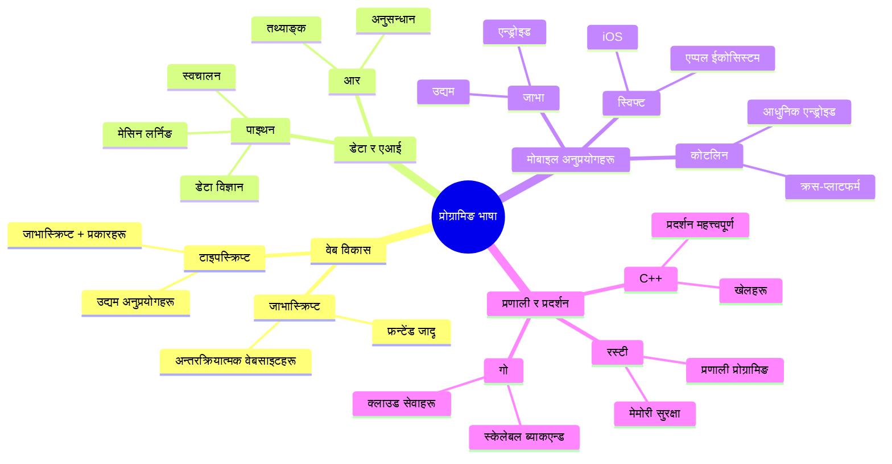
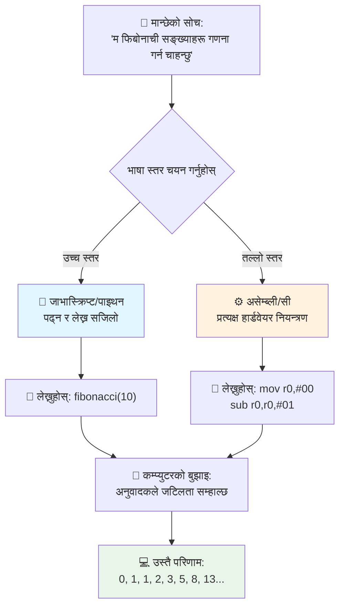
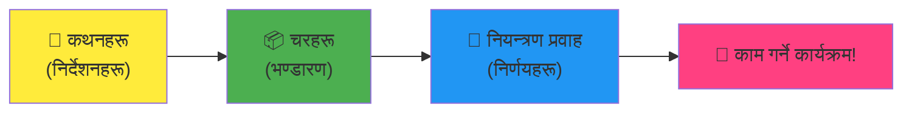
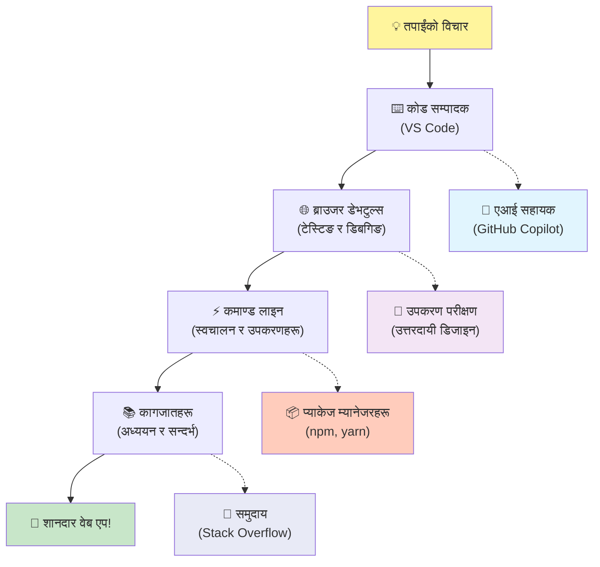
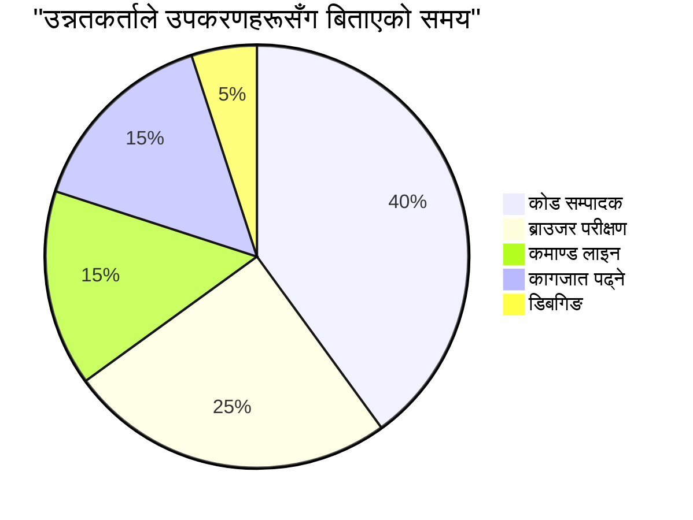
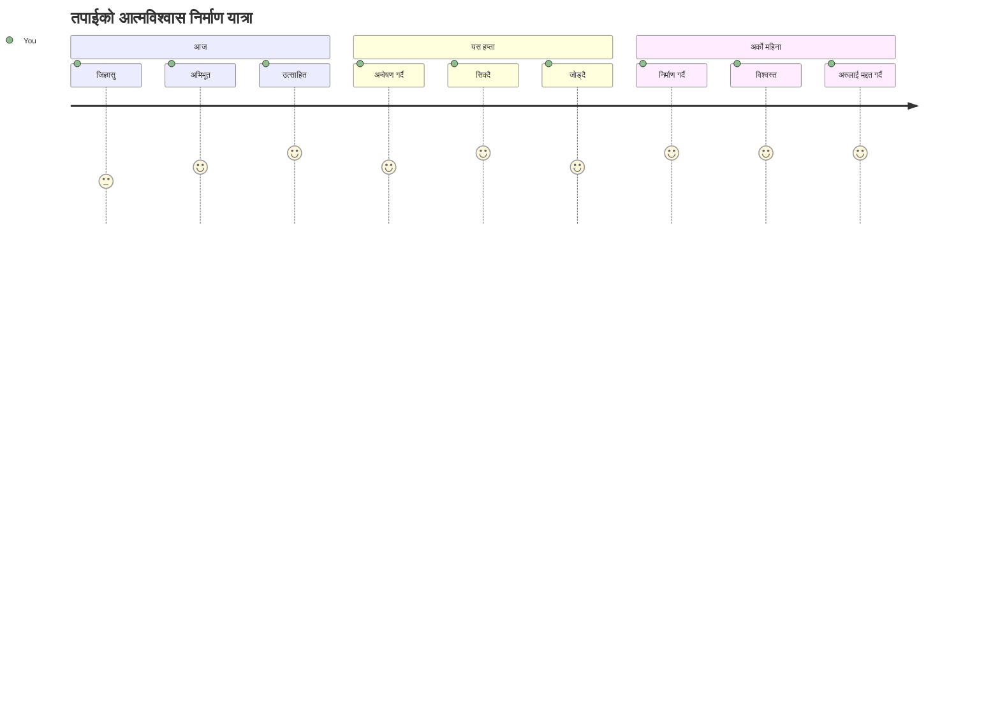

# परिचय प्रोग्रामिङ भाषाहरू र आधुनिक विकासकर्ता उपकरणहरू

नमस्ते, भविष्यका विकासकर्ता! 👋 के म तिमीलाई केही भन्न सक्छु जुन हरेक दिन मलाई अझै पनि रोमाञ्चित बनाउँछ? तिमीले थाहा पाउनु हुनेछ कि प्रोग्रामिङ केवल कम्प्युटरहरूका बारेमा मात्र होइन – यो तिम्रा अति जादुई शक्तिहरू हो जुनले तिम्रा सबैभन्दा पागल विचारहरूलाई जीवन्त बनाउँछ!

तिमीलाई त्यो क्षण थाहा छ जुन तिमी तिम्रो मनपर्ने एप्लिकेशन प्रयोग गरिरहेका हुन्छौ र सबै कुरा बिल्कुलै मेल खान्छ? जब तिमीले एउटा बटन थिच्छौ र केही बिल्कुलै जादुई हुन्छ जसले तिमीलाई "वा, तिनीहरूले कसरी गरे?" भन्न लगाउँछ? त्यस्तो कुनै मानिस जसरी तिमी जस्तै – सम्भवत: आफ्नो मनपर्ने कफि पसलमा राति २ बजे आफ्नो तेस्रो एस्प्रेसो लिएर बसेको – त्यो जादू सिर्जना गर्ने कोड लेखेको थियो। र यहाँ तिम्रो मन उडाउने कुरा छ: यो पाठ समाप्त हुँदा, तिमी बुझ्नेछौ तिनीहरूले कसरी गर्नुभयो, र आफैंले पनि गर्ने उत्सुकता हुनेछ!

हेर्नु, म पूर्ण रूपमा बुझ्छु यदि प्रोग्रामिङ अहिले डर लाग्ने जस्तो लागिरहेको छ भने। जब म सुरु गरेको थिएँ, म साँच्चिकै सोचेको थिएँ तिमीलाई गणितको जीनियस हुनुपर्छ वा पाँच वर्ष उमेरदेखि कोडिङ गर्दै आएको हुनुपर्छ। तर यो कुरा जसले मेरो दृष्टिकोण पूर्ण रूपमा परिवर्तन गर्यो: प्रोग्रामिङ बिल्कुलै नयाँ भाषामा कुरा सिक्ने जस्तो हो। तिमी "नमस्ते" र "धन्यवाद" बाट सुरु गर्छौ, त्यसपछि कफि अर्डर गर्न सिक्छौ, र अचेल तिमी गहिरो दार्शनिक छलफल गरिरहेका हुनेछौ! तर यो अवस्थामा, तिमी कम्प्युटरहरूसँग कुरा गरिरहेका छौ, र साँच्चिकै? उनीहरू सबैभन्दा धैर्यवान कुराकानी गर्ने साथीहरू हुन् – कहिल्यै तिम्रा गल्तीहरूलाई न्याय गर्दैनन् र सधैं पुनः प्रयास गर्न उत्साहित हुन्छन्!

आज, हामी ती अद्भुत उपकरणहरू पत्ता लगाउने छौं जसले आधुनिक वेब विकासलाई सम्भव मात्र होइन, साँच्चिकै लत लाग्ने बनाउँछ। म ती नै सम्पादक, ब्राउजर, र काम गर्ने प्रक्रियाहरूको कुरा गर्दैछु जुन Netflix, Spotify, र तिम्रो मनपर्ने स्वतन्त्र एप स्टुडियोका विकासकर्ताहरू हरेक दिन प्रयोग गर्छन्। र यो भागले तिमीलाई खुशीले नाच्न लगाउने छ: यी धेरै व्यावसायिक स्तरका, उद्योग-मानक उपकरणहरू प्रायः पूर्ण रूपमा निःशुल्क छन्!


> स्केचनोट [टोमोमी इमुरा](https://twitter.com/girlie_mac) द्वारा


```mermaid
journey
    title आजको तपाईंको प्रोग्रामिङ यात्रा
    section पत्ता लगाउने
      प्रोग्रामिङ के हो: 5: You
      प्रोग्रामिङ भाषाहरू: 4: You
      उपकरणहरूको अवलोकन: 5: You
    section अन्वेषण गर्ने
      कोड सम्पादकहरू: 4: You
      ब्राउजरहरू र विकास उपकरणहरू: 5: You
      आदेश पंक्ति: 3: You
    section अभ्यास गर्ने
      भाषा जासूस: 4: You
      उपकरण अन्वेषण: 5: You
      समुदाय सम्बन्ध: 5: You
```
## तिमीले पहिले नै के जान्दछौ हेर्नुहोस्!

मज़ा कुराहरूमा जानुअघि, मलाई जिज्ञासा छ – यो प्रोग्रामिङ संसारबारे तिमी पहिले नै के जान्दछौ? अनि सुन, यदि तिमी यी प्रश्नहरूलाई हेरेर सोच्दै छौ "मलाई यसबारे एकदमै थाहा छैन," त्यो मात्र ठीक छैन, यो उत्तम हो! यसको अर्थ तिमी बिल्कुल सही ठाउँमा छौ। यस क्विजलाई एउटा व्यायामअघि शरीर तान्ने जस्तै सोच – हामी दिमागका मांसपेशीहरू तातो गरिरहेको छौं!

[पाठ अघि क्विज लिनुहोस्](https://ff-quizzes.netlify.app/web/)


## हामी एउटैसाथ जाने साहसिक यात्रा

ठीक छ, म साँच्चै उत्साहित छु हामीले आज के अन्वेषण गर्ने छौं! गम्भीर रूपमा, मलाई तिम्रो अनुहार देख्न मन छ जब यी केही अवधारणाहरू क्लिक हुन्छन्। हामीले गर्ने यो अद्भुत यात्रा यस्ता छ:

- **प्रोग्रामिङ के हो वास्तवमा (र किन यो सबैभन्दा कूल कुरा हो!)** – हामी पत्ता लगाउने छौं कसरी कोड तिमी वरिपरि भएका सबै कुरा चलाउने अदृश्य जादू हो, त्यो अलार्म जसले सोमबार बिहान हो भनी कसरी थाहा पाउँछ देखि लिएर नेटफ्लिक्स सुझावहरूको अल्गोरिथ्मसम्म
- **प्रोग्रामिङ भाषाहरू र तिनीहरूको अद्भुत व्यक्तित्वहरू** – एउटा पार्टीमा सोच जहाँ प्रत्येक व्यक्तिसँग फरक-फरक सुपरपावरहरू र समस्या समाधान गर्ने तरिकाहरू छन्। प्रोग्रामिङ भाषा संसार त्यस्तै हो, र तिमी तिनीहरूलाई भेट्न मन पराउने छौ!
- **डिजिटल जादू गराउने आधारभूत निर्माण ब्लकहरू** – यसलाई अन्तिम सिर्जनात्मक LEGO सेट जस्तो सोच। एकपटक तिमीले यी टुक्राहरू कसरी मिल्छन् बुझेपछि, तिमी ले आफूले कल्पना गरेका कुनै पनि कुरा बनाउन सक्छौ
- **व्यावसायिक उपकरणहरू जसले तिमीलाई जादूगरको छडी पाएको जस्तो महसुस गराउनेछ** – म नाटकीय भएर भनेको होइन – यी उपकरणहरूले साँच्चै तिमीलाई सुपरपावर भएको महसुस गराउनेछन्, र सबैभन्दा राम्रो कुरा? यी नै उपकरणहरू प्रोहरूले प्रयोग गर्छन्!

> 💡 **यहाँ कुरा यतै छ**: आज सबै कुरा याद गर्न प्रयास नकर! अहिले, म केवल तिमीलाई सम्भावनामा उत्साह महसुस गराउन चाहन्छु। विवरणहरू स्वाभाविक रूपमा संगै अभ्यास गर्दा झनै याद हुनेछ – त्यो नै वास्तविक सिकाइ हो!

> तिमी यो पाठ [Microsoft Learn](https://learn.microsoft.com/en-us/learn/modules/web-development-101/introduction-programming/?WT.mc_id=academic-77807-sagibbon) मा लिन पनि सक्छौ!

## त त्यसोभए प्रोग्रामिङ *के* हो?

ठीक छ, अब करोडौंको प्रश्न समाधान गरौं: प्रोग्रामिङ के हो साँच्चै?

म तिमीलाई एउटा कथा सुनाउँछु जसले मेरो सोचाइ पूर्ण रूपमा परिवर्तन गर्‍यो। गत हप्ता म आमालाई हाम्रो नयाँ स्मार्ट टीभी रिमोट कसरी चलाउने हो भनेर देखाउँदै थिएँ। मैले आफैलाई यस्ता कुरा भन्ठानेँ "रातो बटन थिच्नू, तर त्यो ठूलो रातो होइन, बाँया साइडको सानो रातो बटन... होइन, तिम्रो अर्को बाँया... ठीक छ, अब दुई सेकेन्ड सम्म थिच्नू, एक होइन, तीन होइन..." थाहा छ यो ठ्याक्कै त्यस्तो छैन? 😅

त्यै हो प्रोग्रामिङ! यो बहु-विस्तृत, चरण-दर-चरण निर्देशनहरू दिनेको कला हो जुन धेरै शक्तिशाली छ तर सबै कुरा स्पष्ट रूपमा भन्नुपर्छ। तर यहाँ, आमालाई (जो सोध्न सक्छ "कुन रातो बटन?!") बुझाउनुभन्दा कम्प्युटरलाई बुझाउनुपर्छ (जसले मात्र ठीक त्यसै गर्छ जुन तिमी भन्छौ, अर्थात् जुन तिमीले भन्न खोज्यौ त्यो होइन भने पनि)।

जब मैले यो पहिलोपटक सिकें, मेरो दिमाग उडायो: कम्प्युटरहरू वास्तवमै आफ्नै मूलमा धेरै सरल हुन्छन्। तिनीहरू केवल दुई कुरा बुझ्छन् – १ र ०, जुन तै हो “हो” र “होइन” वा “चालु” र “बन्द।” त्यहि हो! तर जादू के छ – हामीलाई म्याट्रिक्स जस्तो 1 र 0 मा कुरा गर्नु पर्दैन। त्यहि ठाउँमा **प्रोग्रामिङ भाषाहरू** मद्दत गर्छन्। तिनीहरू तिमीलाई विश्वकै सबैभन्दा उत्कृष्ट अनुवादक जस्तै हुन् जसले तिम्रा आदर्श मानव विचारहरूलाई कम्प्युटर भाषामा रूपान्तरण गर्छ।

र मलाई अझै बिहान उठ्दा वास्तविक रूपमा रोमाञ्चित बनाउने कुरा छ: तिम्रो जीवनमा सबै कुरा डिजिटलमा कसैले तिमी जस्तै कपडामा बस्दै, कफीको कप बोकेर, आफ्नो ल्यापटपमा कोड टाइप गर्दै सुरू गरेको हो। त्यो Instagram फिल्टर जसले तिमीलाई निखार्छ? कसैले बनायो। त्यो सिफारिस जसले तिमीलाई तिमी नयाँ मनपर्ने गीतमा पुर्‍यायो? एक विकासकर्ताले त्यो अल्गोरिथ्म बनायो। त्यो एप जसले तिमीलाई साथीहरूसँग खानेकुरा बिल बाँड्न मद्दत गर्छ? हो, कसैले सोच्यो "यो झन्झटिलो छ, मैले यसलाई सुधार्न सक्छु" र त्यसपछि गरे!

जब तिमी प्रोग्राम गर्न सिक्छौ, तिमी केवल नयाँ सिप मात्र सिक्ने होइनौ – तिमी समस्याहरू समाधान गर्ने यो अद्भुत समुदायको भाग बन्नुभयो जसले आफ्नो दिन यसो सोचेर बिताउँछ, "म केहि यस्तो बनाउन सक्छु जुन कसैको दिन अलिअलि राम्रो बनाओस्?" साँच्चिकै, यो भन्दा कूल के छ?

✅ **रोचक तथ्य खोजी**: खाली समय हुँदा एउटा धेरै रोचक कुरा खोज्नु - विश्वकै पहिलो कम्प्युटर प्रोग्रामर को हुन सक्छ? म तिमीलाई एउटा हिंट दिन्छु: त्यो व्यक्ति तिमीले सोचेकै नहुन सक्छ! यसको कथा साँच्चिकै आकर्षक छ र देखाउँछ कि प्रोग्रामिङ सधैं सिर्जनात्मक समस्याहरू समाधान गर्ने कला रही आएको छ।

### 🧠 **चेक-इन समय: तिमीलाई कस्तो लागिरहेको छ?**

**एकछिन सोच:**  
- "कम्प्युटरलाई निर्देशन दिनु" को विचार अहिले तिमीलाई बुझिन्छ?  
- के तिमी कुनै दैनिक काम प्रोग्रामिङले स्वचालन गर्न चाहन्छौ?  
- यो पुरै प्रोग्रामिङ बारे कुन प्रश्नहरू तिम्रो मनमा छन्?

> **स्मरण रहोस्**: केही अवधारणाहरू अहिले अलि अस्पष्ट लाग्नु सामान्य कुरा हो। प्रोग्रामिङ सिक्नु नयाँ भाषा सिक्ने जस्तो छ – तिम्रो दिमागले समयसँग नयाँ न्यूरो नेटवर्क निर्माण गर्छ। तिमी राम्रो गर्दैछौ!

## प्रोग्रामिङ भाषाहरू विभिन्न प्रकारका जादूका स्वादहरू जस्तै

ठीक छ, यो अलि अजब लाग्न सक्छ तर जोडिदै जानु – प्रोग्रामिङ भाषाहरू धेरै फरक प्रकारका संगीतजस्तै छन्। सोच, तिमीलाई जाज छ, जुन न्यून र सहज छ, रक छ, जुन शक्तिशाली र सोझो छ, क्लासिकल छ, जुन सुरुचिपूर्ण र संरचित छ, र हिपहप छ, जुन रचनात्मक र अभिव्यक्तिशील छ। प्रत्येक शैलीको आफ्नै माहोल हुन्छ, उसका आफ्नै उत्साही समर्थकहरू हुन्छन्, र प्रत्येक फरक-फरक मनोदशा र अवसरका लागि उपयुक्त हुन्छ।

प्रोग्रामिङ भाषाहरू पनि ठीक त्यही काम गर्छन्! तिमी एकै भाषा प्रयोग गरेर रमाइलो मोबाइल खेल बनाउँदैनौ जसले जलवायु डाटा मापन गर्छ, ठीक त्यसैगरी तिमी योग कक्षामा डेथ मेटल बजाउन चाहँदैनौ (ठिकै छ, अधिकांश योग कक्षाहरुमा भने! 😄)।

तर हरेक पटक म सोच्दा मलाई अचम्म लाग्छ: यी भाषाहरू संसारकै सबैभन्दा धैर्यवान, प्रतिभाशाली दुभाषेलाई जस्तै छन् जुन तिम्रो छेउमा बसेर तिम्रा विचारहरूलाई सहज रूपमा बुझ्छ र कम्प्युटरको भाषा 1 र 0 मा रूपान्तरण गर्छ। यो एकदमै त्यस्तो साथी हो जो "मानव सिर्जनशीलता" र "कम्प्युटर तर्क" दुवैमा निपूर्ण छ – र कहिल्यै थाक्दैन, कहिल्यै कफि ब्रेक लिन पर्दैन, र तिमीलाई उस्तै प्रश्न दोहोर्याउन भन्दिन!

### लोकप्रिय प्रोग्रामिङ भाषाहरू र तिनीहरूको प्रयोग


```mermaid
mindmap
  root((प्रोग्रामिङ भाषा))
    वेब विकास
      जाभास्क्रिप्ट
        फ्रन्टेंड जादू
        अन्तरक्रियात्मक वेबसाइटहरू
      टाइपस्क्रिप्ट
        जाभास्क्रिप्ट + प्रकारहरू
        उद्यम अनुप्रयोगहरू
    डेटा र एआई
      पाइथन
        डेटा विज्ञान
        मेसिन लर्निङ
        स्वचालन
      आर
        तथ्याङ्क
        अनुसन्धान
    मोबाइल अनुप्रयोगहरू
      जाभा
        एन्ड्रोइड
        उद्यम
      स्विफ्ट
        iOS
        एप्पल ईकोसिस्टम
      कोटलिन
        आधुनिक एन्ड्रोइड
        क्रस-प्लाटफर्म
    प्रणाली र प्रदर्शन
      C++
        खेलहरू
        प्रदर्शन महत्त्वपूर्ण
      रस्टी
        मेमोरी सुरक्षा
        प्रणाली प्रोग्रामिङ
      गो
        क्लाउड सेवाहरू
        स्केलेबल ब्याकएन्ड
```
| भाषा | उत्कृष्ट प्रयोग | किन लोकप्रिय छ |
|----------|----------|------------------|
| **JavaScript** | वेब विकास, उपयोगकर्ता अन्तरफलकहरू | ब्राउजरमा चल्छ र अन्तरक्रियात्मक वेबसाइटहरू सन्चालन गर्दछ |
| **Python** | डाटा विज्ञान, स्वचालन, AI | सजिलै पढ्न र सिक्न सकिन्छ, शक्तिशाली पुस्तकालयहरू |
| **Java** | उद्यम अनुप्रयोगहरू, Android एपहरू | प्लेटफर्म-स्वतन्त्र, ठूलो प्रणालीका लागि बलियो |
| **C#** | विन्डोज एप्लिकेशन, खेल विकास | मजबूत माइक्रोसफ्ट इकोसिस्टम समर्थन |
| **Go** | क्लाउड सेवा, ब्याकएन्ड प्रणालीहरू | छिटो, सरल, आधुनिक कम्प्युटिङका लागि डिजाइन गरिएको |

### उच्च-स्तर र तल्लो-स्तर भाषाहरू

ठीक छ, यो साँच्चै त्यो अवधारणा थियो जसले मेरो दिमाग फुटायो जब मैले सुरु गरेको थिएँ, त्यसैले म त्यो उपमा साझा गर्न जाँदैछु जसले अन्ततः मलाई बुझायो – र मलाई आशा छ तिमीलाई पनि सहयोग पुग्नेछ!

कल्पना गर – तिमी एउटा देश भ्रमण गर्दैछौ जहाँ तिमी भाषा बोल्दैनौ, र तुरुन्त शौचालय खोज्नुपर्छ (हामी सबै त्यो अवस्थामा पुगेका छौँ, होइन? 😅):

- **तल्लो-स्तर प्रोग्रामिङ** त्यस्तो हो जस्तै स्थानीय बोली यती राम्रोसँग सिक्नु कि तिमी त्यहाँ फल बेच्ने हजुरआमासँग साँस्कृतिक सन्दर्भ, स्थानीय बोलचाल, र भित्री हास्य प्रयोग गरी कुराकानी गर्न सक्दछौ जुन केवल त्यहाँ पलाएका मान्छेले बुझ्छन्। अत्यन्त प्रभावशाली र धेरै प्रभावकारी... यदि तिमी त्यो भाषामा दिर्घकालीक रूपमा दक्ष छौ भने! तर शौचालय खोज्ने बेला भने अलि भारी हुन्छ।

- **उच्च-स्तर प्रोग्रामिङ** त्यस्तो हो जस्तो त्यो अद्भुत स्थानीय साथी जसले तिमीलाई बुझ्छ। तिमीले "मलाई शौचालय फेला पार्न जरुरी छ" सरल अंग्रेजीमा भनें, र उनी सबै सांस्कृतिक अनुवाद गर्छन् र तिमीलाई यस्तो तरिकामा निर्देशन दिन्छन् जुन तिम्रो व्यक्ति-मूलक मस्तिष्कलाई पूर्ण रूपमा बुझिन्छ।

प्रोग्रामिङमा:  
- **तल्लो-स्तर भाषाहरू** (जस्तै Assembly वा C) तिमीलाई कम्प्युटरको वास्तविक हार्डवेयरसँग धेरै विस्तारपूर्वक कुराकानी गर्न अनुमति दिन्छ, तर तिमीले मेसिन झैँ सोच्नुपर्छ, जुन... खैर, ठूलो मानसिक परिवर्तन हो!  
- **उच्च-स्तर भाषाहरू** (जस्तै JavaScript, Python, वा C#) तिमीलाई मान्छेसँग जस्तै सोच्न दिन्छ जब तिनीहरू पृष्ठभूमिमा मेसिन भाषामा सबै जटिल काम गर्छन्। साथै, यिनका अत्यन्त स्वागतयोग्य समुदायहरू छन् जो आफ्नै नयाँ अनुभव सम्झन्छन् र साँच्चिकै सहयोग गर्न चाहन्छन्!

तिमी जे सोच्यौ? 😉 म तिमीलाई कुनबाट सुरु गर्न सल्लाह दिनेछु? उच्च-स्तर भाषाहरू तिमीलाई यस्तो प्रशिक्षण पाङ्ग्रा जस्तै हो जुन तिमी कहिल्यै हटाउन चाहँदैनौ किनभने तिनीहरूले अनुभवलाई धेरै रमाइलो बनाउँछन्!


```mermaid
flowchart TB
    A["👤 मान्छेको सोच:<br/>'म फिबोनाची सङ्ख्याहरू गणना गर्न चाहन्छु'"] --> B{भाषा स्तर चयन गर्नुहोस्}
    
    B -->|उच्च स्तर| C["🌟 जाभास्क्रिप्ट/पाइथन<br/>पढ्न र लेख्न सजिलो"]
    B -->|तल्लो स्तर| D["⚙️ असेम्ब्ली/सी<br/>प्रत्यक्ष हार्डवेयर नियन्त्रण"]
    
    C --> E["📝 लेख्नुहोस्: fibonacci(10)"]
    D --> F["📝 लेख्नुहोस्: mov r0,#00<br/>sub r0,r0,#01"]
    
    E --> G["🤖 कम्प्युटरको बुझाइ:<br/>अनुवादकले जटिलता सम्हाल्छ"]
    F --> G
    
    G --> H["💻 उस्तै परिणाम:<br/>0, 1, 1, 2, 3, 5, 8, 13..."]
    
    style C fill:#e1f5fe
    style D fill:#fff3e0
    style H fill:#e8f5e8
```
### म तिमीलाई देखाउँछु किन उच्च-स्तर भाषाहरू धेरै मित्रवत छन्

ठीक छ, म तिमीलाई यस्तो कुरा देखाउन लागें जुन म उच्च-स्तर भाषाहरूमा किन प्रेम गर्थे भन्ने स्पष्ट पार्छ, तर पहिले – मलाई तिमी केही कुरा वाचा गर्नुपर्नेछ। पहिलो कोड उदाहरण हेर्दा डराउनु पर्दैन! त्यो जानाजान डर देखाउनको लागि हो। ठीक यो नै मेरो बिन्दु हो!

हामी ठीक उही काम दुई बिल्कुल फरक शैलीमा लेखिएको हेर्ने छौं। दुबैले फारबोनाच्ची अनुक्रम नामको गणितीय सुन्दर पैटर्न सिर्जना गर्छ – यो त्यस्तो प्याटर्न हो जहाँ प्रत्येक संख्या अघिल्ला दुई संख्या योग हो: 0, 1, 1, 2, 3, 5, 8, 13... (रोचक कुरा: तिमी यो ढाँचा प्रकृतिमा पनि सबैत्र पाउनेछौ – सूर्यफूलका बीउका घुम्ती, पाइन्कोनका ढाँचाहरू, यहाँसम्म कि आकाशगंगाहरूको निर्माण!)

तयार छौं भिन्नता हेर्न? सुरु गरौं!

**उच्च-स्तर भाषा (JavaScript) – मान्छे-मित्रवत:**

```javascript
// चरण १: आधारभूत फिबोनाची सेटअप
const fibonacciCount = 10;
let current = 0;
let next = 1;

console.log('Fibonacci sequence:');
```

**यो कोड के गर्छ:**
- **घोषणा** स्थायी मान जसले कति वटा फारबोनाच्ची संख्या उत्पन्न गर्ने छ भनेर जनाउँछ
- **शुरूवात** दुई भेरिएबलमार्फत अनुक्रमका हाल र अर्को संख्या ट्र्याक गर्छ
- **सेटअप** सुरुका मानहरू (0 र 1) जसले फारबोनाच्ची नमूना परिभाषित गर्छ
- **प्रदर्शन** आउटपुटको लागि एक शीर्षक सन्देश देखाउँछ

```javascript
// चरण २: लूपको साथ अनुक्रम उत्पन्न गर्नुहोस्
for (let i = 0; i < fibonacciCount; i++) {
  console.log(`Position ${i + 1}: ${current}`);
  
  // अनुक्रममा अर्को संख्या गणना गर्नुहोस्
  const sum = current + next;
  current = next;
  next = sum;
}
```

**यहाँ के हुन्छ भाँच्दै:**
- **पर्खाल** हरेक अनुक्रम स्थानमा `for` लूप प्रयोग गरेर घुम्छ
- **प्रदर्शन** प्रत्येक सङ्ख्या र यसको स्थान टेम्प्लेट लिटरल फारम्याटिङ्गले देखाउँछ
- **गणना** वर्तमान र अर्को मानहरू जोडेर अर्को फारबोनाच्ची संख्या बनाउँछ
- **अद्यावधिक** हाम्रो ट्र्याकिङ भेरिएबलहरू अर्को चरणमा लाग्छ

```javascript
// चरण ३: आधुनिक कार्यात्मक दृष्टिकोण
const generateFibonacci = (count) => {
  const sequence = [0, 1];
  
  for (let i = 2; i < count; i++) {
    sequence[i] = sequence[i - 1] + sequence[i - 2];
  }
  
  return sequence;
};

// उपयोग उदाहण
const fibSequence = generateFibonacci(10);
console.log(fibSequence);
```

**माथि, हामीले:**
- **बनेको** आधुनिक एरो फङ्सन सिन्ट्याक्स प्रयोग गरेर पुन: प्रयोग गर्न मिल्ने फंक्शन
- **बनायो** सम्पूर्ण अनुक्रम भण्डारण गर्नको लागि एरे एकल एकल देखाउनुभन्दा
- **एरे इन्डेक्सिङ** प्रयोग गरेर हरेक नयाँ संख्या पहिलेका मानबाट गणना गर्‍यो
- **फिर्ता गर्‍यो** पूर्ण अनुक्रम लचिलो प्रयोगको लागि प्रोग्रामका अन्य भागहरूमा

**तल्लो-स्तर भाषा (ARM Assembly) – कम्प्युटर-मित्रवत:**

```assembly
 area ascen,code,readonly
 entry
 code32
 adr r0,thumb+1
 bx r0
 code16
thumb
 mov r0,#00
 sub r0,r0,#01
 mov r1,#01
 mov r4,#10
 ldr r2,=0x40000000
back add r0,r1
 str r0,[r2]
 add r2,#04
 mov r3,r0
 mov r0,r1
 mov r1,r3
 sub r4,#01
 cmp r4,#00
 bne back
 end
```

JavaScript संस्करण लगभग अंग्रेजी निर्देश जस्तै पढिन्छ, जबकि Assembly संस्करण कम्प्युटरको प्रोसेसरलाई सिधै नियन्त्रण गर्ने गूढ आदेशहरू प्रयोग गर्छ। दुबैले ठ्याक्कै उही काम गर्दछन्, तर उच्च-स्तर भाषा मान्छेलाई बुझ्न, लेख्न, र मर्मत गर्न सजिलो हुन्छ।

**तिमीले देख्ने मुख्य फरकहरू:**
- **पढ्न सजिलो**: JavaScript मा `fibonacciCount` जस्ता वर्णनात्मक नामहरू प्रयोग गरिन्छ जबकि Assembly ले `r0`, `r1` जस्ता रहस्यमय लेबलहरू प्रयोग गर्दछ
- **टिप्पणीहरू**: उच्च-स्तरीय भाषाहरू व्याख्यात्मक टिप्पणीहरूलाई प्रोत्साहन गर्छन् जसले कोडलाई आत्म-दस्तावेजी बनाउँछ
- **संरचना**: JavaScript को तार्किक प्रवाहले मानिसहरू समस्याहरूलाई चरण-दर-चरण कसरी सोच्दछन् त्यो अनुसार मेल खान्छ
- **मर्मतसम्भार**: फरक आवश्यकताहरूको लागि JavaScript संस्करण अद्यावधिक गर्नु सरल र स्पष्ट हुन्छ

✅ **Fibonacci अनुक्रम बारे**: यो अत्यन्त आकर्षक संख्या ढाँचा (जहाँ प्रत्येक संख्या अघिल्लो दुईको योग बराबर हुन्छ: 0, 1, 1, 2, 3, 5, 8...) प्रकृतिमा शब्दशः *सबै ठाउँमा* पाईन्छ! तपाईं यसलाई सूर्यगुलाबी फुलका घुमाउरोहरू, पाइनकोन ढाँचाहरू, नटिलस खोलाहरू कसरी घुम्छन् र रुखका हाँगाहरू कसरी बढ्छन् त्यसमाथि पनि पाउनुहुनेछ। कति अचम्म लाग्दो छ कि गणित र कोडले हामीलाई प्राकृतिक सुन्दरताका ढाँचाहरू बुझ्न र पुनःनिर्माण गर्न सहयोग पुर्‍याउँछन्!

## जादु हुने आधारभूत पाटाहरू

ठिक छ, अब तपाईंले कार्यक्रम भाषाहरू क्रियाशील रूपमा कस्तो देखिन्छ भनेर हेर्नुभयो, आउनुहोस् ती मुलभूत अंशहरूलाई टुक्र्याएर हेयरौं जसले शब्दशः हरेक लेखिएको प्रोग्राम बनाउँछन्। यीलाई तपाईंको मनपर्ने पाक विधिमामा आवश्यक सामग्रीहरू जस्तो सम्झनुहोस् – एकपटक तपाईंले प्रत्येक अंशको काम बुझ्नुभयो भने, तपाईं लगभग कुनै पनि भाषामा कोड पढ्न र लेख्न सक्षम हुनुहुनेछ!

यो प्रोग्रामिङको व्याकरण सिक्ने जस्तो हो। स्कूलमा जब तपाईंले नाम, क्रिया र वाक्य कसरी बनाएँ भन्ने कुरा सिक्नु भयो? प्रोग्रामिङको आफ्नै व्याकरण छ, र साँच्चै भन्नुपर्दा, त्यो अंग्रेजी व्याकरण भन्दा धेरै तार्किक र माफालु छ! 😄

### बयानहरू: कदम-दर-कदम निर्देशनहरू

हाम्रा सुरु गरौं **बयानहरू** बाट – यी तपाईंको कम्प्युटरसँग कुराकानी गर्ने व्यक्तिगत वाक्य जस्तै हुन्छन्। हरेक बयानले कम्प्युटरलाई कुनै एउटा विशेष काम गर्न आदेश दिन्छ, जस्तै दिशानिर्देशनहरू दिने: "यहाँबाट बायाँ घुम," "रातो बत्तीमा रोकिनु," "त्यो ठाउँमा पार्क गर्नु।"

बयानहरूको सबैभन्दा राम्रो कुरा तिनीहरू धेरै पढ्न सजिला हुन्छन्। यो हेरौँ:

```javascript
// एकल कार्यहरू गर्ने आधारभूत कथनहरू
const userName = "Alex";                    
console.log("Hello, world!");              
const sum = 5 + 3;                         
```

**यस कोडले के गर्छ:**
- प्रयोगकर्ताको नाम भण्डारण गर्न स्थिर चर घोषणा गर्नुहोस्
- कन्सोल आउटपुटमा अभिवादन सन्देश देखाउनुहोस्
- गणितीय अपरेसनको परिणाम गणना र भण्डारण गर्नुहोस्

```javascript
// वेब पृष्ठहरूसँग अन्तरक्रिया गर्ने वक्तव्यहरू
document.title = "My Awesome Website";      
document.body.style.backgroundColor = "lightblue";
```

**क्रमशः, यसरी हुन्छ:**
- ब्राउजर ट्याबमा देखा पर्ने वेबपेजको शीर्षक परिवर्तन गर्नुहोस्
- सम्पूर्ण पृष्ठको पृष्ठभूमि रङ परिवर्तन गर्नुहोस्

### चरहरू: तपाईंको प्रोग्रामको स्मृति प्रणाली

ठीक छ, **चरहरू** मेरो सबैभन्दा मनपर्ने अवधारणाहरू मध्ये एक हुन् किनभने तिनीहरू तपाईंले दैनिक रूपमा प्रयोग गर्ने वस्तुहरू जस्तै हुन्!

तपाईंको फोनको सम्पर्क सूचीलाई सोच्नुहोस्। तपाईं सबैको नम्बर याद गर्नुहुन्न – बरु "आमा," "सबैभन्दा राम्रो साथी," वा "रात्री २ बजेसम्म पिज्जा डेलिभरी गर्ने ठाउँ" सुरक्षित गर्नुहुन्छ र तपाईंको फोनले वास्तविक नम्बरहरू याद गर्छ। चरहरू त्यस्तै हुन्छन्! तिनीहरू लेबल गरिएका कन्टेनरहरू हुन् जहाँ तपाईंको प्रोग्रामले जानकारी भण्डारण गर्न र पछि नाम प्रयोग गरी पुन: प्राप्त गर्न सक्छ।

यो साँच्चिकै राम्रो कुरा हो: चरहरू प्रोग्राम चलिरहेको बेला परिवर्तन हुन सक्छन् (त्यसैले तिनीहरूलाई "चर" भनिन्छ – के हेर्नुभएको?). जस्तै तपाईं तेस्रो पक्ष पिज्जा स्थल परिवर्तन गर्नुहुन्छ जब राम्रो ठाउँ भेट्टाउनुहुन्छ, प्रोग्रामले नयाँ जानकारी सिक्दा वा अवस्था परिवर्तन हुँदा चरहरू अद्यावधिक गर्न सकिन्छ!

यहाँ कति सरल र सुन्दर हुने देखाउन तयार छु:

```javascript
// चरण 1: आधारभूत चरहरू सिर्जना गर्दै
const siteName = "Weather Dashboard";        
let currentWeather = "sunny";               
let temperature = 75;                       
let isRaining = false;                      
```

**यी अवधारणाहरू बुझ्दै:**
- `const` चरहरूमा अपरिवर्तनीय मानहरू भण्डारण गर्नुहोस् (जस्तै साइट नाम)
- प्रोग्रामभर परिवर्तन हुन सक्ने मानहरूका लागि `let` प्रयोग गर्नुहोस्
- विभिन्न प्रकारका डेटा जस्तै स्ट्रिङ (पाठ), संख्या, र बूलियन (सत्य/असत्य) निर्धारण गर्नुहोस्
- प्रत्येक चरले के चाहन्छ भन्ने वर्णन गर्ने नामहरू रोज्नुहोस्

```javascript
// चरण २: सम्बन्धित डाटा समूह गर्न वस्तुहरूसँग काम गर्ने
const weatherData = {                       
  location: "San Francisco",
  humidity: 65,
  windSpeed: 12
};
```

**माथिको ठाउँमा हामीले:**
- सम्बन्धित मौसम सूचना समूहबद्ध गर्न वस्तु बनायौं
- धेरै डेटा एउटै चर नाम अन्तर्गत सङगठित गर्यौं
- प्रत्येक जानकारीलाई स्पष्ट रूपमा लेबल गर्न कुञ्जी-मूल्य जोडीहरू प्रयोग गर्यौं

```javascript
// चरण ३: चलहरू प्रयोग र अद्यावधिक गर्दै
console.log(`${siteName}: Today is ${currentWeather} and ${temperature}°F`);
console.log(`Wind speed: ${weatherData.windSpeed} mph`);

// परिवर्तनशील चलहरू अद्यावधिक गर्दै
currentWeather = "cloudy";                  
temperature = 68;                          
```

**प्रत्येक भाग बुझौं:**
- `${}` प्रयोग गरी टेम्प्लेट लिटरल्स मार्फत जानकारी प्रदर्शन गर्नुहोस्
- डट नोटेशन (`weatherData.windSpeed`) ले वस्तुको गुणहरू पहुँच गर्नुहोस्
- `let` संग घोषित चरहरूलाई हालको अवस्थाहरू प्रतिबिम्बित गर्न अद्यावधिक गर्नुहोस्
- धेरै चरहरू मिलाएर अर्थपूर्ण सन्देशहरू सिर्जना गर्नुहोस्

```javascript
// चरण ४: सफा कोडको लागि आधुनिक डेस्ट्रक्चरिङ्ग
const { location, humidity } = weatherData; 
console.log(`${location} humidity: ${humidity}%`);
```

**जान्न आवश्यक कुरा:**
- वस्तुबाट विशिष्ट गुणहरू निकाल्न संरचना (destructuring) असाइनमेन्ट प्रयोग गर्नुहोस्
- वस्तु कुञ्जीहरू जस्तै नामका नयाँ चरहरू स्वतः सिर्जना गर्नुहोस्
- केवल डट नोटेशन दोहोर्याउने टाढा गरेर कोड सरल बनाउनुहोस्

### नियन्त्रण प्रवाह: तपाईँको प्रोग्रामलाई सोच्न सिकाउनु

ठिक छ, यहाँ प्रोग्रामिङ पूर्णतया रोमाञ्चक बन्न थाल्छ! **नियन्त्रण प्रवाह** तपाईंको प्रोग्रामलाई बुद्धिमानी निर्णय गर्न सिकाउने प्रक्रिया हो, ठीक तपाईंले दैनिक जीवनमा बिना सोचाइ गर्ने जस्तो।

कल्पना गर्नुहोस्: आज बिहान तपाईंले " यदि पानी पर्दैछ भने छाता लिएर जान्छु। यदि चिसो छ भने ज्याकेट लगाउँछु। यदि म ढिला छु भने बिहानको खाना छोडेर बाटोमा कफी लिन्छु।" तपाईंको दिमाग स्वतः यो यदि-त्यसो हो त-त्यसो सम्बन्धित तर्कलाई पटक-पटक पालना गर्छ!

यसले प्रोग्रामहरूलाई बुद्धिमानी र जीवन्त महसुस गराउँछ, केवल कुनै एकरस, कडाइपूर्ण स्क्रिप्ट चलाउने नभई। तिनीहरूले अवस्था मूल्यांकन गरेर उपयुक्त प्रतिक्रिया दिन सक्छन्। यो तपाईंको प्रोग्रामलाई अनुकूलन र निर्णय गर्ने मष्तिष्क दिने जस्तो हो!

यो कति असाधारण काम गर्छ भनेर देख्न चाहनुहुन्छ? हेरौँ:

```javascript
// चरण १: आधारभूत सशर्त तर्क
const userAge = 17;

if (userAge >= 18) {
  console.log("You can vote!");
} else {
  const yearsToWait = 18 - userAge;
  console.log(`You'll be able to vote in ${yearsToWait} year(s).`);
}
```

**यस कोडले के गर्छ:**
- प्रयोगकर्ताको उमेर मतदान योग्यता पूरा गरेको छ कि छैन जाँच्नुहोस्
- अवस्थाको परिणाम अनुसार विभिन्न कोड ब्लकहरू चलाउनुहोस्
- १८ वर्ष मुनिको भए मतदान योग्यता सम्म कति समय बाँकी छ गणना गरी देखाउनुहोस्
- प्रत्येक परिदृश्यका लागि विशेष, उपयोगी प्रतिक्रिया दिनुहोस्

```javascript
// चरण २: तार्किक अपरेटरहरूसँग बहु सर्तहरू
const userAge = 17;
const hasPermission = true;

if (userAge >= 18 && hasPermission) {
  console.log("Access granted: You can enter the venue.");
} else if (userAge >= 16) {
  console.log("You need parent permission to enter.");
} else {
  console.log("Sorry, you must be at least 16 years old.");
}
```

**यहाँ के हुन्छ टूटेर बुझौं:**
- `&&` (र) अपरेटर प्रयोग गरी धेरै अवस्था संयोजन गर्नुहोस्
- `else if` प्रयोग गरी विभिन्न परिदृश्यहरूको श्रेणी बनाउनुहोस्
- अन्तिम `else` बयानले सबै सम्भावित केसहरू सम्हाल्छ
- प्रत्येक फरक अवस्थाका लागि स्पष्ट, उपयोगी प्रतिक्रिया दिनुहोस्

```javascript
// चरण ३: टर्नरी अपरेटरसँग संक्षिप्त सर्तीय अभिव्यक्ति
const votingStatus = userAge >= 18 ? "Can vote" : "Cannot vote yet";
console.log(`Status: ${votingStatus}`);
```

**स्मरण गर्नु पर्ने कुरा:**
- सरल दुइ विकल्प अवस्थाहरूका लागि ternary अपरेटर (`? :`) प्रयोग गर्नुहोस्
- पहिले अवस्था लेख्नुहोस्, त्यसपछि `?`, त्यसपछि सत्य परिणाम, त्यसपछि `:`, त्यसपछि झूठ परिणाम लेख्नुहोस्
- अवस्था अनुसार मानहरु निर्धारित गर्न यो ढाँचाको प्रयोग गर्नुहोस्

```javascript
// चरण ४: धेरै विशिष्ट केसहरूको व्यवस्थापन
const dayOfWeek = "Tuesday";

switch (dayOfWeek) {
  case "Monday":
  case "Tuesday":
  case "Wednesday":
  case "Thursday":
  case "Friday":
    console.log("It's a weekday - time to work!");
    break;
  case "Saturday":
  case "Sunday":
    console.log("It's the weekend - time to relax!");
    break;
  default:
    console.log("Invalid day of the week");
}
```

**यस कोडले के गर्छ:**
- चरको मानलाई धेरै विशिष्ट केसहरूसँग मिलाउनुहोस्
- समान केसहरूलाई समूहबद्ध गर्नुहोस् (हप्तापछि र सप्ताहन्त)
- मिलेको बेला उचित कोड ब्लक कार्यान्वयन गर्नुहोस्
- अप्रत्याशित मानहरूका लागि `default` केस समावेश गर्नुहोस्
- अर्को केसमा नजाने गरि `break` स्टेटमेन्टहरू प्रयोग गर्नुहोस्

> 💡 **वास्तविक-विश्व तुलना**: नियन्त्रण प्रवाहलाई संसारकै सबैभन्दा धैर्यशील GPS समान सम्झनुहोस् जुन तपाईंलाई दिशानिर्देश दिन्छ। यसले भन्न सक्छ "यदि मेन स्ट्रीटमा ट्राफिक छ भने, सट्टा हाइवे लिनुहोस्। यदि हाइवेमा निर्माण कार्य अवरुद्ध छ भने, रमणीय मार्ग प्रयोग गर्नुहोस्।" प्रोग्रामहरूले पनि यस्ता प्रकारका स्थिति अनुसार प्रतिक्रिया दिन बुद्धिमानी निर्णय तर्कहरू प्रयोग गर्छन् र सधैं प्रयोगकर्तालाई उत्तम अनुभव दिन्छन्।

### 🎯 **अवधारणा जाँच: आधारभूत तत्वहरूमा दक्षता**

**मूलभूत कुराहरूमा तपाईं कति सक्षम हुनुहुन्छ जाँचौं:**
- तपाईं आफ्नै शब्दमा चर र बयानको बीच के फरक छ भन्न सक्नुहुन्छ?
- एउटा वास्तविक-विश्व परिस्थिति सोच्नुहोस् जहाँ तपाईंले यदि-त्यसो निर्णय प्रयोग गर्नुहुन्छ (जस्तै हामीले मतदान उदाहरणमा गर्यौं)
- प्रोग्रामिङ तर्कको बारेमा के कुराले तपाईंलाई अचम्मित पार्‍यो?

**छिटो आत्मविश्वास बढाउने कुरा:**

```mermaid
flowchart LR
    A["📝 कथनहरू<br/>(निर्देशनहरू)"] --> B["📦 चरहरू<br/>(भण्डारण)"] --> C["🔀 नियन्त्रण प्रवाह<br/>(निर्णयहरू)"] --> D["🎉 काम गर्ने कार्यक्रम!"]
    
    style A fill:#ffeb3b
    style B fill:#4caf50
    style C fill:#2196f3
    style D fill:#ff4081
```
✅ **आगामी के छ**: हामी यी अवधारणाहरू अझ गहिराइमा अध्ययन गर्नेछौं र यो अनौंठो यात्रा सँगै रमाइलो गर्ने छौं! अहिले त केवल भविष्यका सबै अद्भुत सम्भावनाहरूको लागि उत्साह महसुस गर्न केन्द्रित हुनुहोस्। विशेष सीप र प्रविधिहरू अभ्यासका साथ स्वाभाविक रूपमा टाँसिनेछन् – म वाचा गर्छु यो तपाईंले आशा गर्नुभन्दा धेरै रमाइलो हुनेछ!

## उपकरणहरूको संसार

ठिक छ, यहाँ म साँच्चै उत्साहित छु र आफूलाई रोक्न गाह्रो छ! 🚀 हामी ती अविश्वसनीय उपकरणहरू बारे कुरा गर्न जाँदैछौं जसले तपाईंलाई जस्तो लाग्छ डिजिटल अन्तरिक्ष यानका साँचाहरू पाउँदा जस्तो महसुस हुन सक्दछ।

तपाईं कसरी रसोइया सन्तुलित छुरा प्रयोग गर्छ जुन हातको विस्तार जस्तो लाग्छ भनेर थाहा छ? वा कसरी संगीतकारसँग त्यो एक गितार हुन्छ जुन त्यसलाई छोएपछिको छिनमै गीत गाउन थाल्छ? खैर, विकासकर्ताहरूका आफ्नै जादुगर उपकरणहरू छन्, र यहाँ के छ जसले तपाईंको मन पूर्णतया उडाउनेछ – अधिकांश पूर्णतया निःशुल्क छन्!

म भन्दाभन्दै खुशीले उफ्रिरहेको छु यी साझा गर्न किनभने तिनीहरूले सफ्टवेयर बनाउने तरिका पूर्ण रूपमा परिवर्तन गरिदिएका छन्। हामी AI-सञ्चालित कोडिङ सहयोगीहरूको बारेमा कुरा गर्दैछौं जसले तपाईंको कोड लेख्न मद्दत गर्छ (म ठट्टा गरिरहेको छैन!), क्लाउड वातावरणहरू जहाँ तपाईं जुनसुकै स्थानबाट Wi-Fi सँग सम्पूर्ण एप्लिकेसनहरू निर्माण गर्न सक्नुहुन्छ, र डिबगिङ उपकरणहरू जसले तपाईंको प्रोग्रामहरूका लागि X-ray दृष्टि भएको जस्तो सहायता दिन्छ।

र यहाँ त्यो भाग छ जसले अझै पनि मलाई चिसो छाप दिन्छ: यी "सुरु गर्नेलाई मात्र" उपकरणहरू होइनन् जुन तपाईंले छोड्ने कुरा हो। यी Google, Netflix, र तपाईंले मन पराउने त्यस स्वतन्त्र एप स्टुडियोका विकासकर्ताहरूले अहिले नै प्रयोग गरिरहेको ठ्याक्कै त्यही व्यावसायिक उपकरणहरू हुन्। तपाईंलाई यिनीहरू प्रयोग गर्दा असाधारण पेशेवर महसुस हुनेछ!


```mermaid
graph TD
    A["💡 तपाईंको विचार"] --> B["⌨️ कोड सम्पादक<br/>(VS Code)"] 
    B --> C["🌐 ब्राउजर डेभटुल्स<br/>(टेस्टिङ र डिबगिङ)"]
    C --> D["⚡ कमाण्ड लाइन<br/>(स्वचालन र उपकरणहरू)"]
    D --> E["📚 कागजातहरू<br/>(अध्ययन र सन्दर्भ)"]
    E --> F["🚀 शानदार वेब एप!"]
    
    B -.-> G["🤖 एआई सहायक<br/>(GitHub Copilot)"]
    C -.-> H["📱 उपकरण परीक्षण<br/>(उत्तरदायी डिजाइन)"]
    D -.-> I["📦 प्याकेज म्यानेजरहरू<br/>(npm, yarn)"]
    E -.-> J["👥 समुदाय<br/>(Stack Overflow)"]
    
    style A fill:#fff59d
    style F fill:#c8e6c9
    style G fill:#e1f5fe
    style H fill:#f3e5f5
    style I fill:#ffccbc
    style J fill:#e8eaf6
```
### कोड सम्पादकहरू र IDE: तपाईंका नयाँ डिजिटल सबैभन्दा राम्रो साथीहरू

आउनुहोस् कोड सम्पादकहरूको कुरा गरौं – यी साँच्चिकै तपाईंका नयाँ मनपर्ने ठाउँ बन्ने छन्! तिनीहरूलाई तपाईंको व्यक्तिगत कोडिङ आश्रय स्थलको रूपमा सोच्नुहोस् जहाँ तपाईंले आफ्नो डिजिटल सिर्जनाहरू बनाउने र पूरा गर्ने अधिकांश समय बिताउनेछ।

तर यहाँ आधुनिक सम्पादकहरूको जादु छ: तिनीहरू केवल सामान्य टेक्स्ट सम्पादकहरू मात्र होइनन्। ती तपाईंको सबभन्दा प्रतिभाशाली, सहयोगी कोडिङ गुरु तपार्इंसँग २४/७ बसेको जस्तो हुन्छ। तिनीहरूले तपाईंको टाइपोहरू तपाईंलाई थाहा हुनु अघि नै समात्छन्, सुधार सुझावहरू दिन्छन् जसले तपाईंलाई दिमागी खतरनाक देखाउँछन्, हरेक टुक्रा कोड काय हुन्छ भनेर बुझ्न मद्दत गर्छन्, र केही त तपाईंले के टाइप गर्न लाग्नु भएको छ अन्दाज लगाएर तपाईंलाई विचार पुरा गर्ने प्रस्ताव पनि गर्छन्!

म याद गर्छु जब म पहिलो पटक अटोकम्प्लिशन भेटें – मलाई लाग्थ्यो म भविष्यमा रहेको छु। तपाईं केही टाइप गर्न थाल्नुहुन्छ र तपाईंको सम्पादक भन्छ, "हे, तपाईं केहि यस्तै प्रकारको फङ्सन सोच्दै हुनुहुन्थ्यो जुन तपाईंलाई चाहिन्छ?" यो तपाईंको कोडिङ साथीको रूपमा मष्तिष्क पढ्ने जस्तो हो!

**यी सम्पादकहरूलाई किन यति अद्भुत बनाउँछ?**

आधुनिक कोड सम्पादकहरूले तपाईंको उत्पादकत्व बढाउने विविध सुविधा प्रदान गर्छन्:

| सुविधा | के गर्छ | किन मद्दत गर्छ |
|---------|----------|----------------|
| **सिन्ट्याक्स हाइलाइटिङ** | तपाईंको कोडका विभिन्न भागहरूलाई रंगीन बनाउँछ | कोड पढ्न सजिलो र त्रुटि पत्ता लगाउन मद्दत गर्छ |
| **अटोकम्प्लिशन** | तपाईंले टाइप गर्दा कोड सुझाव दिन्छ | कोड लेख्न छिटो र टाइपो कम गर्छ |
| **डिबगिङ उपकरणहरू** | त्रुटिहरू पत्ता लगाउन र सुधार गर्न मद्दत गर्छ | अनुसन्धानमा धेरै समय बचत गर्छ |
| **एक्सटेन्सनहरू** | विशेष सुविधा थप्छ | तपाईंको सम्पादकलाई कुनै पनि प्रविधिको लागि अनुकूल बनाउनुहोस् |
| **AI सहायकहरू** | कोड र व्याख्या सुझाव दिन्छ | सिकाइ र उत्पादकत्व तीव्र बनाउँछ |

> 🎥 **भिडियो स्रोत**: यी उपकरणहरू कसरी काम गर्छन् देख्न चाहनुहुन्छ? यो [Tools of the Trade video](https://youtube.com/watch?v=69WJeXGBdxg) हेर्नुहोस्।

#### वेब विकासका लागि सिफारिस गरिएका सम्पादकहरू

**[Visual Studio Code](https://code.visualstudio.com/?WT.mc_id=academic-77807-sagibbon)** (निःशुल्क)
- वेब विकासकर्ताहरूमा सर्वाधिक लोकप्रिय
- उत्कृष्ट एक्सटेन्सन इकोसिस्टम
- इनबिल्ट टर्मिनल र Git समाकलन
- **अवश्य राख्नुपर्ने एक्सटेन्सनहरू**:
  - [GitHub Copilot](https://marketplace.visualstudio.com/items?itemName=GitHub.copilot) - AI-सञ्चालित कोड सुझावहरू
  - [Live Share](https://marketplace.visualstudio.com/items?itemName=MS-vsliveshare.vsliveshare) - यथार्थ-समयको सहकार्य
  - [Prettier](https://marketplace.visualstudio.com/items?itemName=esbenp.prettier-vscode) - स्वचालित कोड फर्म्याटिङ
  - [Code Spell Checker](https://marketplace.visualstudio.com/items?itemName=streetsidesoftware.code-spell-checker) - तपाईंको कोडको टाइपो पत्ता लगाउने

**[JetBrains WebStorm](https://www.jetbrains.com/webstorm/)** (पेड, विद्यार्थीहरूका लागि निःशुल्क)
- उच्च स्तरीय डिबगिङ र परीक्षण उपकरणहरू
- बौद्धिक कोड पूर्णता
- इनबिल्ट भर्सन कन्ट्रोल

**क्लाउड-आधारित IDEs** (विभिन्न मूल्यहरू)
- [GitHub Codespaces](https://github.com/features/codespaces) - ब्राउजरमा पूर्ण VS Code
- [Replit](https://replit.com/) - सिक्न र कोड साझा गर्न उत्कृष्ट
- [StackBlitz](https://stackblitz.com/) - छिटो, पूर्ण-स्ट्याक वेब विकास

> 💡 **सुरु गर्ने सुझाव**: Visual Studio Code बाट सुरु गर्नुहोस् – यो निःशुल्क, उद्योगमा व्यापक प्रयोग हुने, र ठूलो समुदायले सहयोगी ट्युटोरियलहरू र एक्सटेन्सनहरू बनाइरहेको छ।

### वेब ब्राउजरहरू: तपाईंको गोप्य विकास प्रयोगशाला

ठीक छ, तपाईंको मन पूर्णतया उडाउन तयार हुनुहोस्! तपाईं सामाजिक मिडिया स्क्रोल गर्न र भिडियो हेर्न ब्राउजरहरू प्रयोग गर्दै आइरहनुभएको छ। तर उनीहरू सधैं तपाईंलाई पत्ता लगाउन बाँकी रहेको अविश्वसनीय गोप्य विकास प्रयोगशाला लुकाइरहेका थिए!

हरेक पटक तपाईंले वेबपेजमा राईट-क्लिक गरी "Inspect Element" छान्नुहुन्छ, तपाईं विकासकर्ता उपकरणहरूको एउटा लुकाइएको संसार खोल्नुहुन्छ जुन साँच्चिकै मैले पहिले सयौं डलर तिरेर किन्ने महँगो सफ्टवेयरहरू भन्दा बढी शक्तिशाली छन्। यो ठ्याक्कै तपाईंको पुरानो भान्सा पछाडि एउटा व्यावसायिक रसोइया प्रयोगशाला लुकिरहेको पत्ता लगाउनुजस्तो हो!
पहिलो पटक कसैले मलाई ब्राउजर DevTools देखाएको बेला, म लगभग तीन घन्टा मात्र क्लिक गर्दै र "पर्ख, त्यो पनि गर्न सक्छ?!" भन्दै बिताएँ। तपाईं साँच्चिकै कुनै पनि वेबसाइटलाई वास्तविक समयमा सम्पादन गर्न सक्नुहुन्छ, सबै कुरा कति छिटो लोड हुन्छ भनेर ठीकै देख्न सक्नुहुन्छ, तपाईंको साइट विभिन्न उपकरणहरूमा कस्तो देखिन्छ भनेर परीक्षण गर्न सक्नुहुन्छ, र जाभास्क्रिप्टलाई पूर्ण प्रो जस्तै डिबग गर्न सक्नुहुन्छ। यो पूर्ण रूपमा मनमोहक छ!

**ब्राउजरहरू किन तपाईंको गोप्य हतियार हुन् भनेको यहाँ छ:**

जब तपाईं वेबसाइट वा वेब एप्लिकेसन बनाउनुहुन्छ, तपाईंले वास्तविक दुनियाँमा यसले कस्तो देखिन्छ र कसरी व्यवहार गर्छ भनेर देख्नुपर्छ। ब्राउजरहरूले तपाईंको काम मात्र देखाउने होइनन्, प्रदर्शन, पहुँचयोग्यता, र सम्भावित समस्याहरूको विस्तृत प्रतिक्रिया पनि प्रदान गर्छन्।

#### ब्राउजर डेवलपर टुल्स (DevTools)

आधुनिक ब्राउजरहरूले व्यापक विकास सूटहरू समावेश गर्छन्:

| उपकरण वर्ग | के गर्छ | प्रयोग गर्ने उदाहरण |
|------------|---------|--------------------|
| **एलिमेन्ट इन्स्पेक्टर** | HTML/CSS वास्तविक समयमा हेर्न र सम्पादन गर्न | तुरुन्त नतिजा हेर्न शैली समायोजन गर्न |
| **कन्सोल** | त्रुटि सन्देशहरू हेर्न र जाभास्क्रिप्ट परीक्षण गर्न | समस्याहरू डिबग गर्न र कोडसँग प्रयोग गर्न |
| **नेटवर्क मनिटर** | स्रोतहरू कसरी लोड हुन्छन् ट्र्याक गर्न | प्रदर्शन र लोडिङ समयहरू अनुकूलन गर्न |
| **पहुँचयोग्यता चेकर** | समावेशी डिजाइन परीक्षण गर्न | सुनिश्चित गर्न कि तपाईंको साइट सबै प्रयोगकर्ताहरूको लागि काम गर्छ |
| **डिभाइस सिम्युलेटर** | विभिन्न स्क्रिन आकारहरूमा पूर्वावलोकन गर्न | धेरै उपकरण बिना नै रेस्पोन्सिभ डिजाइन परीक्षण गर्न |

#### विकासका लागि सिफारिस गरिएका ब्राउजरहरू

- **[Chrome](https://developers.google.com/web/tools/chrome-devtools/)** - उद्योग-मानक DevTools व्यापक दस्तावेजीकरणसहित
- **[Firefox](https://developer.mozilla.org/docs/Tools)** - उत्कृष्ट CSS Grid र पहुँचयोग्यता उपकरणहरू
- **[Edge](https://docs.microsoft.com/microsoft-edge/devtools-guide-chromium/?WT.mc_id=academic-77807-sagibbon)** - Microsoft को विकास स्रोतहरूसहित Chromium मा आधारित

> ⚠️ **महत्वपूर्ण परीक्षण सुझाव**: तपाईंको वेबसाइटहरू सधैं बहु ब्राउजरहरूमा परीक्षण गर्नुहोस्! जुन कुरा Chrome मा उत्तम काम गर्छ त्यो Safari वा Firefox मा फरक देखिन सक्छ। व्यावसायिक विकासकर्ताहरू सबै प्रमुख ब्राउजरहरूमा प्रयोगकर्ता अनुभव सुसंगत बनाउन टेस्ट गर्छन्।

### कमाण्ड लाइन उपकरणहरू: तपाईंको विकासकर्ता उच्च क्षमता प्रवेशद्वार

ठीक छ, कमाण्ड लाइन बारे पूर्ण ईमान्दार क्षण यहाँ छ किनकि म चाहन्छु तपाईं यो कसैबाट सुन्नुहोस् जसले साँच्चिकै बुझ्छ। जब मैले पहिलो पटक देखेँ – त्यो मात्र डराउने कालो स्क्रिन ब्लिंक गर्ने टेक्स्टसहित – मैले साँच्चिकै सोचें, "होइन, बिल्कुल होइन! यो 1980 को दशकको ह्याकर चलचित्र जस्तो देखिन्छ, र म यो लागि स्मार्ट छैन!" 😅

तर यहाँ त्यो कुरा हो जुन म चाहन्थेँ कसैले मलाई त्यो बेला भनिदिएको होस्, र जुन म अहिले तपाईंलाई भनिरहेको छु: कमाण्ड लाइन डराउने कुरा होइन – यो साँच्चिकै तपाईंको कम्प्युटरसँग प्रत्यक्ष संवाद जस्तो हो। यो त्यो फरक जस्तो हो जुन एक सुन्दर ऐप मार्फत तस्वीर र मेनुका साथ खाना अर्डर गर्ने (जसले सजिलो बनाउँछ) बनाम तपाईंको मनपर्ने स्थानीय रेस्टुरेन्टमा जानु जहाँ सेफले तपाईं के मन पराउनुहुन्छ भनी थाहा पाउँछन् र "कसरी मलाई अचम्मको कुरा दिनुहोस्" मात्र भनी केहि बनाई दिन्छ।

कमाण्ड लाइन त्यही स्थान हो जहाँ विकासकर्ताहरूले आफूलाई पूर्ण जादूगर महसुस गर्छन्। तपाईंले केही जादूजस्तो लाग्ने शब्दहरू टाइप गर्नुहुन्छ (ठीक छ, ती केवल कमाण्ड हुन्, तर जादुईजस्तो महसुस हुन्छ!), इन्टर थिच्नुहोस्, र बूम – तपाईंले पूरा परियोजना संरचनाहरू तयार पार्नुभयो, विश्वभरिका शक्तिशाली उपकरणहरू इन्स्टल गर्नुभयो, वा तपाईंको एपलाई इन्टरनेटमा करोडौँ मानिसहरूले हेर्नका लागि डिप्लोय गर्नुभयो। एक पटक त्यो शक्ति अनुभव गरेपछि, यो साँच्चिकै आदी हुन सक्छ!

**किन कमाण्ड लाइन तपाईंको मनपर्ने उपकरण हुनेछ:**

ग्राफिकल इन्टरफेसहरू धेरै कार्यहरूको लागि राम्रो भए तापनि कमाण्ड लाइन अटोमेशन, परिशुद्धता, र छिटोमा उत्कृष्ट हुन्छ। धेरै विकास उपकरणहरू प्रायः कमाण्ड लाइन इन्टरफेस मार्फत काम गर्छन्, र ती प्रभावकारी प्रयोग गर्न सिक्नुले तपाईंको उत्पादकत्वलाई नाटकीय रूपमा सुधार गर्न सक्छ।

```bash
# चरण १: परियोजना निर्देशिका सिर्जना गर्नुहोस् र त्यहाँ जानुहोस्
mkdir my-awesome-website
cd my-awesome-website
```
  
**यो कोडले के गर्छ:**  
- **नयाँ** डिरेक्टरी "my-awesome-website" तपाईंको परियोजनाको लागि बनाउँछ  
- **नयाँ बनाइएको डिरेक्टरीमा प्रवेश** गरेर काम सुरु गर्छ  

```bash
# चरण २: package.json सहित परियोजना सुरु गर्नुहोस्
npm init -y

# आधुनिक विकास उपकरणहरू स्थापना गर्नुहोस्
npm install --save-dev vite prettier eslint
npm install --save-dev @eslint/js
```
  
**क्रमशः के भइरहेको छ:**  
- `npm init -y` प्रयोग गरी डिफल्ट सेटिङसहित नयाँ Node.js परियोजना आरम्भ गर्न  
- छिटो विकास र उत्पादन बिल्डका लागि आधुनिक बिल्ड उपकरण Vite इन्स्टल गर्न  
- स्वचालित कोड फर्म्याटिङको लागि Prettier र कोड गुणस्तर जाँचका लागि ESLint थप्न  
- `--save-dev` झण्डा प्रयोग गरी यी केवल विकास-सम्बन्धित निर्भरता भनेर मार्क गर्न  

```bash
# चरण ३: परियोजना संरचना र फाइलहरू सिर्जना गर्नुहोस्
mkdir src assets
echo '<!DOCTYPE html><html><head><title>My Site</title></head><body><h1>Hello World</h1></body></html>' > index.html

# विकास सर्भर सुरु गर्नुहोस्
npx vite
```
  
**माथिल्लो कोडमा हामीले:**  
- स्रोत कोड र एसेटका लागि अलग-अलग फोल्डरहरू बनाएर परियोजनालाई व्यवस्थित गर्‍यौं  
- उचित कागजात संरचनासहित आधारभूत HTML फाइल बनायौं  
- लाइभ रीलोड र हट मोड्युल रिप्लेसमेन्टको लागि Vite विकास सर्भर सुरु गर्‍यौं  

#### वेब विकासको लागि आवश्यक कमाण्ड लाइन उपकरणहरू

| उपकरण | उद्देश्य | किन आवश्यक छ |
|---------|----------|----------------|
| **[Git](https://git-scm.com/)** | संस्करण नियन्त्रण | परिवर्तन ट्र्याक गर्न, अरूसँग सहकार्य गर्न, काम ब्याकअप गर्न |
| **[Node.js & npm](https://nodejs.org/)** | जाभास्क्रिप्ट रनटाइम र प्याकेज व्यवस्थापन | जाभास्क्रिप्ट ब्राउजर बाहिर चलाउन, आधुनिक विकास उपकरणहरू इन्स्टल गर्न |
| **[Vite](https://vitejs.dev/)** | बिल्ड उपकरण र विकास सर्भर | छिटो विकास गति र हट मोड्युल रिप्लेसमेन्टका लागि |
| **[ESLint](https://eslint.org/)** | कोड गुणस्तर | तपाईँको जाभास्क्रिप्टमा समस्याहरू स्वचालित रूपमा फेला पार्न र सुधार गर्न |
| **[Prettier](https://prettier.io/)** | कोड फर्म्याटिङ | कोडलाई सधैं समान र पढ्नयोग्य राख्न |

#### प्लेटफर्म-विशिष्ट विकल्पहरू

**Windows:**  
- **[Windows Terminal](https://docs.microsoft.com/windows/terminal/?WT.mc_id=academic-77807-sagibbon)** - आधुनिक, सुविधायुक्त टर्मिनल  
- **[PowerShell](https://docs.microsoft.com/powershell/?WT.mc_id=academic-77807-sagibbon)** 💻 - शक्तिशाली स्क्रिप्टिङ वातावरण  
- **[Command Prompt](https://docs.microsoft.com/windows-server/administration/windows-commands/?WT.mc_id=academic-77807-sagibbon)** 💻 - पारम्परिक Windows कमाण्ड लाइन  

**macOS:**  
- **[Terminal](https://support.apple.com/guide/terminal/)** 💻 - बिल्ट-इन टर्मिनल एप्लिकेसन  
- **[iTerm2](https://iterm2.com/)** - उन्नत सुविधासहित टर्मिनल  

**Linux:**  
- **[Bash](https://www.gnu.org/software/bash/)** 💻 - मानक Linux शेल  
- **[KDE Konsole](https://docs.kde.org/trunk5/en/konsole/konsole/index.html)** - उन्नत टर्मिनल इम्युलेटर  

> 💻 = अपरेटिङ सिस्टममा पूर्व-इन्स्टल गरिएको  

> 🎯 **शिक्षण मार्ग:** `cd` (डिरेक्टरी परिवर्तन), `ls` वा `dir` (फाइल सूची), र `mkdir` (फोल्डर बनाउने) जस्ता आधारभूत कमाण्डहरूबाट सुरु गर्नुहोस्। `npm install`, `git status`, र `code .` (हालको डिरेक्टरी VS Code मा खोल्ने) जस्ता आधुनिक वर्कफ्लो कमाण्डहरूसँग अभ्यास गर्नुहोस्। जति बढी आराम महसुस गर्ने हुँदै जानुहुन्छ, त्यति नै तपाईंले उन्नत कमाण्डहरू र अटोमेशन प्रविधिहरू स्वाभाविक रूपमा सिक्नेछ।

### दस्तावेजीकरण: सधैं उपलब्ध सिकाइ गुरु

ठीक छ, म तपाईंलाई एउटा सानो रहस्य बताउन चाहन्छु जसले तपाईंलाई शुरुवाती भएर धेरै राम्रो महसुस गराउनेछ: सबैभन्दा अनुभवी विकासकर्ताहरू पनि आफ्नो समयको ठूलो भाग दस्तावेज पढ्नमा बिताउँछन्। त्यो यसकारण हैन कि उनीहरूलाई के गर्दैछन् थाहा छैन – यो त बुद्धिमत्ताको चिन्ह हो!

दस्तावेजीकरणलाई तपाईंले संसारकै सबैभन्दा धैर्यशील, ज्ञानवान शिक्षकहरूलाई २४/७ पहुँच भएको जस्तो सोच्नुहोस्। बिहान २ बजे समस्यामा पर्नुभयो? दस्तावेजीकरण त्यही जान्दोजान न्यानो भर्चुअल अँगालो र ठ्याक्कै आवश्यक उत्तरसहित हुन्छ। सबैले कुरा गरिरहेका शीत नयाँ सुविधाबारे जान्न चाहनुहुन्छ? दस्तावेजीकरण तपाईंका लागि कदम-दर-कदम उदाहरणहरू सहित छ। किन केहि यसरी काम गर्छ भनेर बुझ्न खोज्दै हुनुहुन्छ? तपाईंले अनुमान लगाउनुभयो - दस्तावेजीकरण यसलाई अन्ततः बुझ्ने तरिकाले व्याख्या गर्न तयार छ!

यहाँ एउटाले मेरो दृष्टिकोण पूर्ण रूपमा परिवर्तन गर्‍यो: वेब विकासको दुनियाँ अत्यन्तै छिटो चल्छ, र कोही पनि सबै कुरा याद राख्दैन (म भन्छु निश्चितै केही पनि होइन)! मैले १५+ वर्ष अनुभव भएका वरिष्ठ विकासकर्तालाई आधारभूत सिन्ट्याक्स खोज्दै देखेको छु, र थाहा छ के? त्यो लाजको कुरा हैन – त्यो स्मार्ट हो! यो उत्कृष्ट स्मरण शक्ति हुनुको कुरा होइन; यो छिटो भरपर्दो उत्तरहरू कहाँ फेला पार्ने र तीलाई कसरी लागू गर्ने बुझ्नको कुरा हो।

**यहाँ साँच्चिकै जादू हुन्छ:**

व्यावसायिक विकासकर्ताहरू आफ्नो धेरै समय दस्तावेजीकरण पढ्नमा बिताउँछन् – त्यसका लागि होइन कि उनीहरूको के गर्दैछन् थाहा छैन, तर यो किनभने वेब विकासको परिदृश्य यति छिटो विकास हुँदैछ कि नवीनतम रहन लगातार सिकाइ आवश्यक छ। उत्कृष्ट दस्तावेजीकरणले तपाईंलाई मात्र *कसरी* प्रयोग गर्ने देखाउँदैन, तर *किन* र *कहिले* प्रयोग गर्ने बुझ्न मद्दत गर्छ।

#### आवश्यक दस्तावेजीकरण स्रोतहरू

**[Mozilla Developer Network (MDN)](https://developer.mozilla.org/docs/Web)**  
- वेब प्रविधि दस्तावेजका लागि सुनौलो मानक  
- HTML, CSS, र जाभास्क्रिप्टका लागि व्यापक मार्गनिर्देशन  
- ब्राउजर संगतता जानकारी समावेश  
- व्यवहारिक उदाहरणहरू र अन्तरक्रियात्मक डेमोहरूसहित  

**[Web.dev](https://web.dev)** (Google द्वारा)  
- आधुनिक वेब विकास उत्तम अभ्यासहरू  
- प्रदर्शन अनुकूलन मार्गदर्शन  
- पहुँचयोग्यता र समावेशी डिजाइन सिद्धान्तहरू  
- वास्तविक परियोजनाहरूबाट केस स्टडीहरू  

**[Microsoft Developer Documentation](https://docs.microsoft.com/microsoft-edge/#microsoft-edge-for-developers)**  
- Edge ब्राउजर विकास स्रोतहरू  
- प्रोग्रेसिभ वेब एप मार्गनिर्देशन  
- क्रस-प्लेटफर्म विकास अन्तर्दृष्टिहरू  

**[Frontend Masters Learning Paths](https://frontendmasters.com/learn/)**  
- संरचित सिकाइ पाठ्यक्रमहरू  
- उद्योग विशेषज्ञहरूबाट भिडियो कोर्सहरू  
- हातमा लिएर पढ्ने कोडिङ अभ्यासहरू  

> 📚 **अध्ययन रणनीति:** दस्तावेजीकरण याद गर्न प्रयास नगर्नुहोस् – यसको सट्टा, यसमा कसरी प्रभावकारी रूपमा नेभिगेट गर्ने सिक्नुहोस्। बारम्बार प्रयोग गरिने संदर्भहरू बुकमार्क गर्नुहोस् र विशेष जानकारी छिटो फेला पार्न खोजी कार्यहरू प्रयोग गरेर अभ्यास गर्नुहोस्।

### 🔧 **उपकरण विशेषज्ञता जाँच: तपाईंलाई के मन पर्यो?**

**एउटा पल लिनुहोस् र विचार गर्नुहोस्:**  
- कुन उपकरण तपाईं पहिलो पटक प्रयास गर्न सबैभन्दा उत्साहित हुनुहुन्छ? (गलत जवाफ छैन!)  
- कमाण्ड लाइन अझै पनि डर लाग्छ कि तपाईंको जिज्ञासा छ?  
- तपाईंले आफ्नो मनपर्ने वेबसाइटहरूको पर्दा पछाडिको दृष्य हेर्न ब्राउजर DevTools प्रयोग गर्ने कल्पना गर्न सक्नुहुन्छ?


```mermaid
pie title "उन्नतकर्ताले उपकरणहरूसँग बिताएको समय"
    "कोड सम्पादक" : 40
    "ब्राउजर परीक्षण" : 25
    "कमाण्ड लाइन" : 15
    "कागजात पढ्ने" : 15
    "डिबगिङ" : 5
```  
> **रोचक तथ्य:** अधिकांश विकासकर्ताहरू आफ्नो कोड सम्पादकमा लगभग ४०% समय बिताउँछन्, तर ध्यान दिनुहोस् कति समय परीक्षण, सिकाइ, र समस्याहरू समाधान गर्न जान्छ। प्रोग्रामिङ केवल कोड लेख्ने कुरा होइन – यो अनुभव सिर्जना गर्ने कुरा हो!

✅ **विचारका लागि खानेकुरा:** यो रमाइलो कुरा विचार गर्नुहोस् – तपाईंलाई के लाग्छ वेबसाइट निर्माण (विकास) उपकरणहरू र त्यसले कस्तो देखिन्छ डिजाइन गर्ने उपकरणहरूमा के फरक हुन्छ? यो त्यही फरक हो जुन एक आर्किटेक्टले सुन्दर घर डिजाइन गर्ने र ठेकेदारले वास्तवमा त्यसलाई निर्माण गर्नेबीच हुन्छ। दुवै अत्यावश्यक छन्, तर तिनीहरूले फरक उपकरणहरू चाहिन्छ! यो प्रकारको सोचले तपाईंलाई वेबसाइटहरू जीवन्त कसरी हुन्छन् भन्ने ठूलो चित्र देख्न धेरै मद्दत गर्नेछ।

## GitHub Copilot Agent Challenge 🚀

एजेन्ट मोड प्रयोग गरी निम्न चुनौती पूरा गर्नुहोस्:

**विवरण:** कुनै आधुनिक कोड सम्पादक वा IDE का विशेषताहरू अन्वेषण गर्नुहोस् र कसरी यसले वेब विकासकर्ता रुपमा तपाईंको वर्कफ्लो सुधार गर्न सक्छ भन्ने प्रदर्शन गर्नुहोस्।

**प्रम्प्ट:** कुनै कोड सम्पादक वा IDE (जस्तै Visual Studio Code, WebStorm, वा क्लाउड-आधारित IDE) चयन गर्नुहोस्। तीनवटा सुविधाहरू वा एक्सटेन्सनहरूले तपाईंलाई कोड लेख्न, डिबग गर्न, वा मर्मत गर्न कसरी सहयोग गर्छ भन्ने छोटकरीमा व्याख्या सहित सूचीबद्ध गर्नुहोस्।

---

## 🚀 चुनौती

**ठीक छ, जासूस, तपाईंको पहिलो केसका लागि तयार हुनुहुन्छ?**

अब तपाईंले यो जबरजस्त आधार पाउनुभयो, म एउटा साहसिक कथा छ जुन तपाईंलाई प्रोग्रामिङ विश्व कति विविध र रोचक छ भन्ने देखाउन मद्दत गर्नेछ। र सुनुहोस् – यो अझै कोड लेख्ने बारे होइन, त्यसैले कुनै दबाब छैन! आफूलाई एक प्रोग्रामिङ भाषा जासूसको रूपमा सोच्नुहोस् तपाईंको पहिलो रोमाञ्चक केसमा!

**तपाईंको मिशन, यदि तपाईं स्वीकार गर्नुहुन्छ भने:**  
1. **भाषा अन्वेषक बन्नुहोस्:** एकदमै फरक-फरक विश्वबाट तीन प्रोग्रामिङ भाषा छान्नुहोस् – सम्भवतया एउटा वेबसाइटहरु बनाउने, एउटा मोबाइल एप्स बनाउने, र अर्को वैज्ञानिकहरूको लागि डेटा विश्लेषण गर्ने। प्रत्येक भाषामा एउटै साधारण कार्यको उदाहरणहरू खोज्नुहोस्। मलाई विश्वास गर्नुहोस् तपाईं तिनका देखिने भिन्नताहरूले पूर्ण रूपमा अचम्मित हुनुहुनेछ!  
2. **उनीहरूको उत्पत्तिको कथा पत्ता लगाउनुहोस्:** प्रत्येक भाषा के विशेष बनाउँछ? यहाँ एउटा रमाइलो तथ्य छ – प्रत्येक प्रोग्रामिङ भाषा त्यसकारण बन्यो किनकि कसैले सोच्यो, "यो विशेष समस्याको समाधानका लागि अझ राम्रो तरिका हुनुपर्छ।" तपाईं त्यो समस्याहरू के थिए पत्ता लगाउन सक्नुहुन्छ? केही कथाहरू साँच्चिकै रोचक छन्!  
3. **समुदायहरू भेट्नुहोस्:** जाँच गर्नुहोस् प्रत्येक भाषाको समुदाय कति स्वागतयोग्य र उत्साही छ। केहीमा लाखौं विकासकर्ताहरू ज्ञान साझेदारी गर्छन् र एक अर्कालाई मद्दत गर्छन्, केही साना तर अत्यन्तै घनिष्ठ र सहयोगी छन्। तपाईं ती समुदायहरूको फरक व्यक्तित्वहरू हेर्न मन पराउने हुनुहुन्छ!  
4. **आफ्नो Gut फेरी अनुसरण गर्नुहोस्:** अहिले सबैभन्दा सहज लाग्ने भाषा कुन हो? "सही" छनोट बारे चिन्ता नगर्नुहोस् – केवल आफ्नो आन्तरिक आवाज सुन्नुहोस्! यहाँ साँच्चै कुनै गलत उत्तर छैन, र तपाईं पछि अन्य भाषाहरू पनि अन्वेषण गर्न सक्नुहुन्छ।

**बोनस जासूसी कार्य:** पत्ता लगाउन कोसिस गर्नुहोस् कुन प्रमुख वेबसाइट वा एपहरू प्रत्येक भाषाले बनाएको छ। म ग्यारेन्टी गर्छु तपाईं Instagram, Netflix, वा त्यो मोबाइल खेल जुन रोक्न सक्नुहुन्न कसले बनाएको थाहा पाउँदा अचम्मित हुनुहुनेछ!

> 💡 **स्मरण रहोस:** तपाईं आज कुनै भाषा विशेषज्ञ बन्न खोज्दै हुनुहुन्न। तपाईं केवल आफू बस्न चाहनु भएको ठाउँ निश्चित गर्नुभन्दा पहिले छिमेक जान्दै हुनुहुन्छ। समय लिनुहोस्, रमाइलो गर्नुहोस्, र जिज्ञासा तपाईंको मार्गदर्शक बन्न दिनुहोस्!

## तपाईंले के पत्ता लगाउनुभयो त्यसको उत्सव मनाऔं!

हेर, तपाईंले आज यति धेरै अविश्वसनीय जानकारी ग्रहण गर्नुभयो! म साँच्चिकै उत्साहित छु तपाईंले कति राम्रो सिक्नुभएको छ भनेर हेर्न। र सम्झनुहोस् – यो कुनै परीक्षण होइन जहाँ सबै कुरा perfect हुनुपर्छ। यो तपाईंले यो रोचक संसारका बारेमा सिकेका सबै रमाइला कुरा मनाउने उत्सव जस्तो छ जुन तपाईंमा पसेको छ!

[पाठपछिको क्विज लिने](https://ff-quizzes.netlify.app/web/)

## समीक्षा र स्व-अध्ययन

**आफ्नो समय लिई एक्सप्लोर गर्नुहोस् र रमाइलो गर्नुहोस्!**
तपाईंले आज धेरै कुरा सिक्नुभएको छ, र त्यो गर्व गर्ने कुरा हो! अब रमाइलो भाग आउँछ – ती विषयहरू अन्वेषण गर्ने जुनले तपाईंको जिज्ञासा जगाएको छ। याद गर्नुहोस्, यो गृहकार्य होइन – यो एक साहसिक यात्रा हो!

**तपाईंलाई उत्साहित गर्ने कुरामा गहिराईमा जानुहोस्:**

**प्रोग्रामिङ भाषासँग हातेमालो गर्नुहोस्:**
- २-३ भाषाको आधिकारिक वेबसाइटहरू भ्रमण गर्नुहोस् जुनले तपाईंको ध्यान तानेको छ। प्रत्येकको आफ्नै व्यक्तित्व र कथा हुन्छ!
- [CodePen](https://codepen.io/), [JSFiddle](https://jsfiddle.net/), वा [Replit](https://replit.com/) जस्ता अनलाइन कोडिङ प्लेटफर्महरू प्रयोग गर्नुहोस्। प्रयोग गर्न नडराउनुहोस् – तपाईं केही बिग्रन सक्नुहुन्न!
- तपाईंको मनपर्ने भाषाको उद्भवबारे पढ्नुहोस्। साँच्चिकै, यी केही उत्पत्ति कथाहरू अचम्मका हुन्छन् र तपाईंलाई भाषाहरू किन त्यस्तै काम गर्छन् बुझ्न मद्दत गर्नेछन्।

**तपाईंका नयाँ उपकरणहरूसँग परिचित हुनुहोस्:**
- यदि तपाईंले भिजुअल स्टुडियो कोड डाउनलोड गर्नुभएको छैन भने डाउनलोड गर्नुहोस् – यो निःशुल्क छ र तपाईंलाई मन पर्नेछ!
- एक्सटेन्सन बजार एक दुई मिनेट हेरौं। यो तपाईंको कोड सम्पादकको लागि एप स्टोर जस्तो छ!
- आफ्नो ब्राउजरको डेभलपर टूल्स खोल्नुहोस् र केही क्लिक गर्नुहोस्। सबै कुरा बुझ्ने चिन्ता गर्नु पर्दैन – के के छ भनेर परिचित हुनुहोस्।

**समुदायमा सहभागी हुनुहोस्:**
- केही डेभलपर समुदायहरूको पछ्याउनुहोस् [Dev.to](https://dev.to/), [Stack Overflow](https://stackoverflow.com/), वा [GitHub](https://github.com/) मा। प्रोग्रामिङ समुदाय नयाँ आगन्तुकहरूका लागि अत्यन्त स्वागतयोग्य छ!
- युट्युबमा शुरुवाती-मैत्री कोडिङ भिडियोहरू हेर्नुहोस्। त्यहाँ धेरै उत्कृष्ट निर्माताहरू छन् जसले शुरु गर्दा कस्तो हुन्छ सम्झन सक्छन्।
- स्थानीय मिटअप वा अनलाइन समुदायमा सहभागी हुनु विचार गर्नुहोस्। विश्वास गर्नुहोस्, डेभलपरहरूले नयाँ आउँदाहरुलाई मद्दत गर्न मन पराउँछन्!

> 🎯 **सुनुहोस्, मैले तपाईंलाई याद गर्न चाहेको कुरा यो हो**: तपाईंलाई एक रातमै कोडिङ विजार्ड बन्ने अपेक्षा गरिएको छैन! अहिले तपाईं यस अद्भुत नयाँ संसारलाई चिन्दै हुनुहुन्छ जुन तपाईंको हिस्सा बन्नेछ। समय लिनुहोस्, यात्राको मजा लिनुहोस्, र याद गर्नुहोस् – तपाईंले जसलाई सम्मान गर्नुहुन्छ हरेक डेभलपर पनि यस्तै ठाउँमा बसेका थिए, उत्साहित र सायद अलि तनावमा। यो पूर्ण रूपमा सामान्य हो, र यसले तपाईं ठीक गर्दै हुनुहुन्छ भन्ने देखाउँछ।

## Assignment

[Reading the Docs](assignment.md)

> 💡 **तपाईंको असाइन्मेन्टको लागि एउटा सानो प्रोत्साहन**: मैले अझै समेट्न नसकेका केही उपकरणहरू अन्वेषण गर्ने कुरा देख्न मन लाग्छ! हामीले पहिले नै कुरा गरेका सम्पादक, ब्राउजर, र कमाण्ड लाइन उपकरणहरूलाई छोड्नुहोस् – त्यहाँ बाहिर एक विशाल अद्भुत विकास उपकरणहरूको ब्रह्माण्ड छ जुन पत्ता लगाउन बाँकी छ। ती उपकरणहरू खोज्नुहोस् जुन सक्रिय रूपमा मर्मतसम्भार हुन्छन् र जीवित, सहयोगी समुदायहरू छन् (यीमा सबैभन्दा राम्रो ट्युटोरियल हुन्छन् र जब तपाईं अड्किनुहुन्छ र मद्दत चाहिन्छ तब सबैभन्दा सहयोगी मानिसहरू हुन्छन्)।

---

## 🚀 तपाईंको प्रोग्रामिङ यात्रा समयरेखा

### ⚡ **अर्को ५ मिनेटमा तपाईं के गर्न सक्नुहुन्छ**
- [ ] २-३ प्रोग्रामिङ भाषा वेबसाइटहरू बुकमार्क गर्नुहोस् जुनले तपाईंको ध्यान तानेको छ
- [ ] यदि भिजुअल स्टुडियो कोड डाउनलोड गर्नुभएको छैन भने डाउनलोड गर्नुहोस्
- [ ] आफ्नो ब्राउजरको DevTools (F12) खोल्नुहोस् र कुनै पनि वेबसाइटमा क्लिक गर्नुहोस्
- [ ] एउटा प्रोग्रामिङ समुदायमा सहभागी हुनुहोस् (Dev.to, Reddit r/webdev, वा Stack Overflow)

### ⏰ **यस घण्टामा तपाईं के पूरा गर्न सक्नुहुन्छ**
- [ ] पाठपछि गरिएको क्विज पूरा गर्नुहोस् र आफ्नो उत्तरहरूमा प्रतिबिम्बित हुनुहोस्
- [ ] VS Code मा GitHub Copilot एक्सटेन्सन सेटअप गर्नुहोस्
- [ ] दुई फरक प्रोग्रामिङ भाषामा अनलाइन "Hello World" उदाहरण प्रयास गर्नुहोस्
- [ ] युट्युबमा "Developer को एक दिन" भिडियो हेर्नुहोस्
- [ ] प्रोग्रामिङ भाषा जासूस काम सुरु गर्नुहोस् (चुनौतीबाट)

### 📅 **तपाईंको हप्तादेखि थलो रोमाञ्चक यात्रा**
- [ ] असाइन्मेन्ट पूरा गर्नुहोस् र ३ नयाँ विकास उपकरणहरू अन्वेषण गर्नुहोस्
- [ ] सामाजिक संजालमा ५ जना डेभलपर वा प्रोग्रामिङ खाता फलो गर्नुहोस्
- [ ] CodePen वा Replit मा केही साना कुरा बनाउने प्रयास गर्नुहोस् (जति सानो भए पनि "Hello, [तपाईंको नाम]!" ठिकै छ)
- [ ] कसैको कोडिङ यात्रामा एक डेभलपर ब्लग पोस्ट पढ्नुहोस्
- [ ] भर्चुअल मिटअपमा सहभागी हुनुहोस् वा प्रोग्रामिङ सम्बन्धि टक वार्ता हेर्नुहोस्
- [ ] तपाईंले रोजेको भाषाको अनलाइन ट्युटोरियलहरूबाट सिक्न सुरु गर्नुहोस्

### 🗓️ **तपाईंको महिनादेखि लामो रूपान्तरण**
- [ ] आफ्नो पहिलो सानो प्रोजेक्ट निर्माण गर्नुहोस् (सजिलो वेबपेज पनि ठीकै छ)
- [ ] खुल्ला स्रोत प्रोजेक्टमा योगदान दिनुहोस् (सर्वप्रथम कागजात सुधारहरूबाट सुरु गर्नुहोस्)
- [ ] कसैलाई मार्गदर्शन गर्नुहोस् जो प्रोग्रामिङ यात्रा शुरु गर्दैछ
- [ ] तपाईंको डेभलपर पोर्टफोलियो वेबसाइट बनाउनुहोस्
- [ ] स्थानीय डेभलपर समुदाय वा अध्ययन समूहमा जडान हुनुहोस्
- [ ] अर्को सिकाइ लक्ष्य योजना बनाउन सुरु गर्नुहोस्

### 🎯 **अन्तिम प्रतिबिम्ब जाँच**

**अगाडि बढ्नु अघि, एक क्षण लिएर उत्सव मनाउनुहोस्:**
- आज प्रोग्रामिङमा के कुराले तपाईंलाई उत्साहित गरायो?
- कुन उपकरण वा अवधारणा पहिलो अन्वेषण गर्न चाहनुहुन्छ?
- यो प्रोग्रामिङ यात्रा सुरु गर्ने बारेमा तपाईंको भावना कस्तो छ?
- अहिले तपाईंले डेभलपरलाई सोध्न चाहेको एउटा प्रश्न के हो?


```mermaid
journey
    title तपाईको आत्मविश्वास निर्माण यात्रा
    section आज
      जिज्ञासु: 3: You
      अभिभूत: 4: You
      उत्साहित: 5: You
    section यस हप्ता
      अन्वेषण गर्दै: 4: You
      सिक्दै: 5: You
      जोड्दै: 4: You
    section अर्को महिना
      निर्माण गर्दै: 5: You
      विश्वस्त: 5: You
      अरुलाई मद्दत गर्दै: 5: You
```
> 🌟 **याद गर्नुहोस्**: प्रत्येक विशेषज्ञ पनि कहिल्यै शुरुवाती थिए। हरेक वरिष्ठ डेभलपरले पनि अहिले तपाइँ जस्तै अनुभव गरेका थिए – उत्साहित, सायद अलि तनावग्रस्त, र के सम्भव छ भनेर जिज्ञासु। तपाईं अचम्मको समूहमा हुनुहुन्छ, र यो यात्रा अविश्वसनीय हुनेछ। प्रोग्रामिङको रमणीय संसारमा स्वागत छ! 🎉

---

<!-- CO-OP TRANSLATOR DISCLAIMER START -->
**अस्वीकरण**:
यो दस्तावेज AI अनुवाद सेवा [Co-op Translator](https://github.com/Azure/co-op-translator) प्रयोग गरेर अनुवाद गरिएको हो। हामी सटीकताको लागि प्रयास गर्छौं, तर कृपया जानकार हुनुहोस् कि स्वचालित अनुवादमा त्रुटि वा अनिश्चितताहरू हुन सक्छन्। मूल दस्तावेज यसको मूल भाषामा नै अधिकारप्राप्त स्रोत मानिनु पर्छ। महत्वपूर्ण जानकारीका लागि व्यावसायिक मानवीय अनुवाद सिफारिस गरिन्छ। यस अनुवादको प्रयोगबाट उत्पन्न हुने कुनै भ्रम वा गलत बुझाइका लागि हामी जिम्मेवार छैनौं।
<!-- CO-OP TRANSLATOR DISCLAIMER END -->