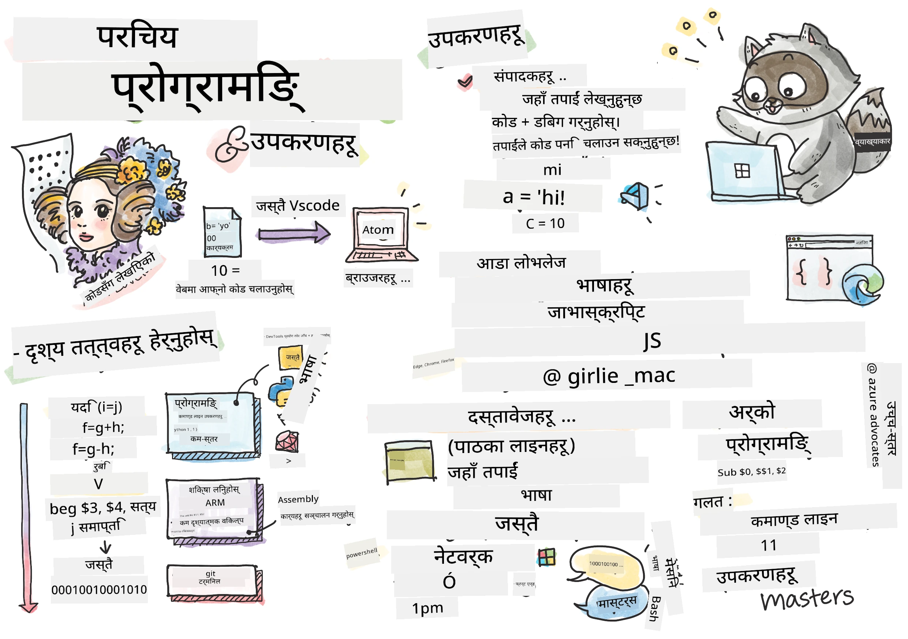
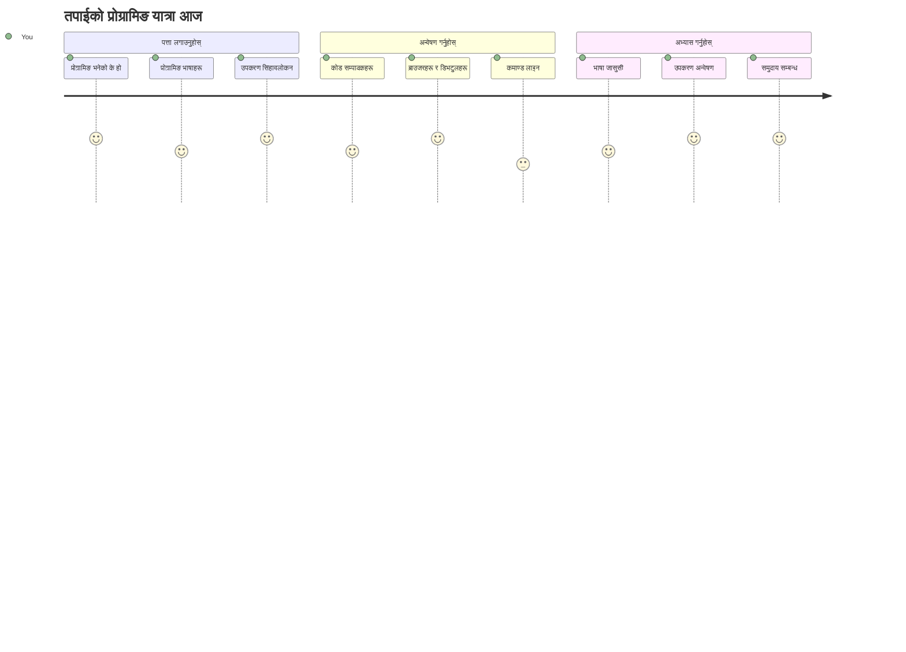
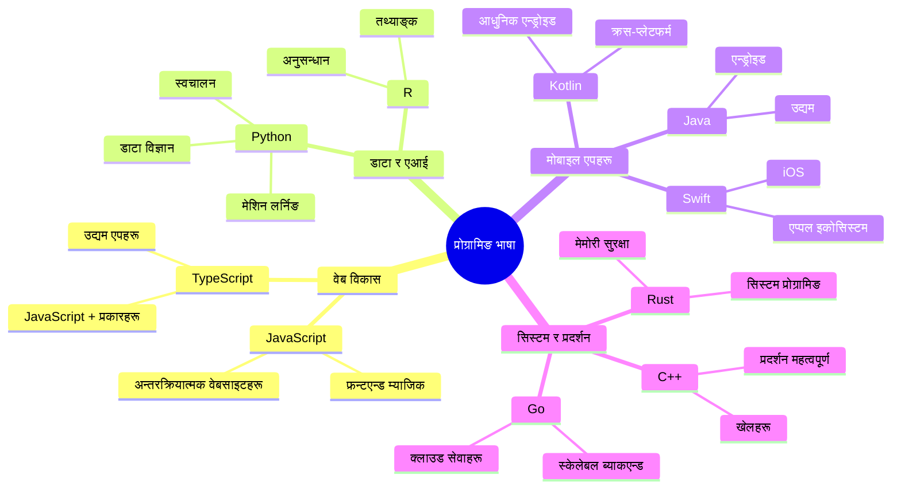
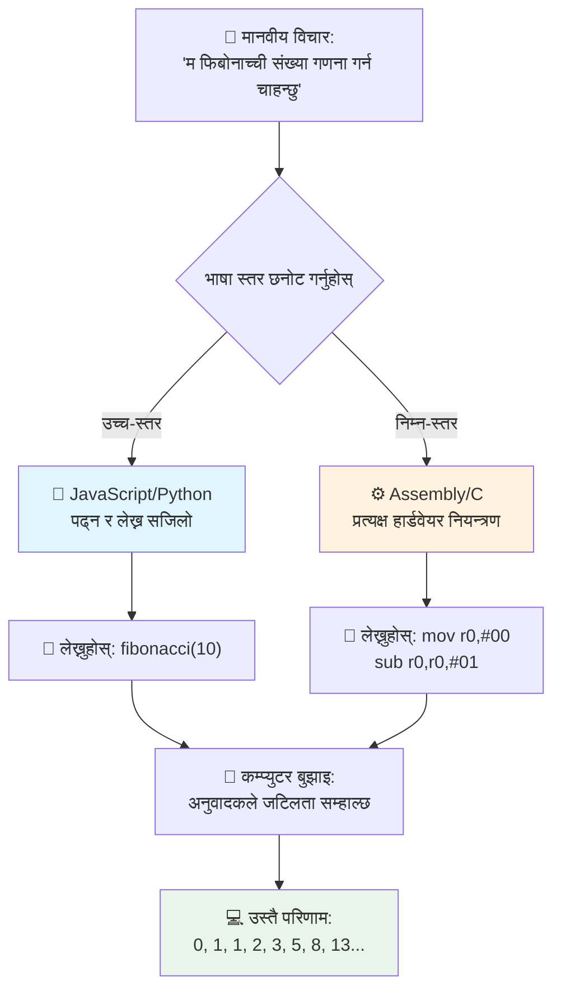
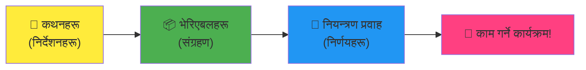
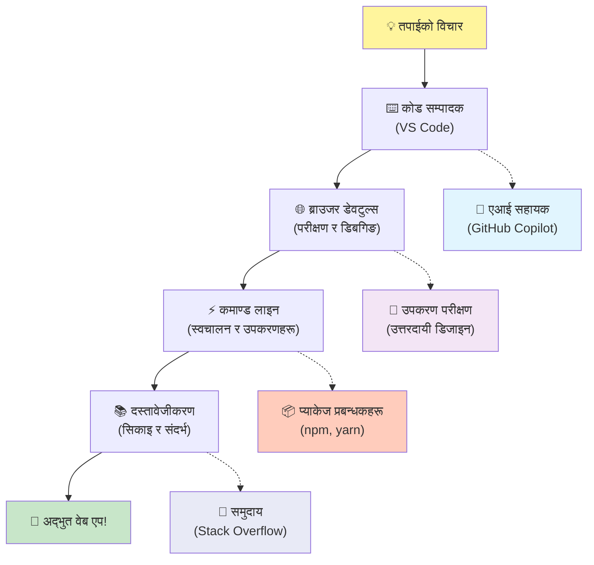
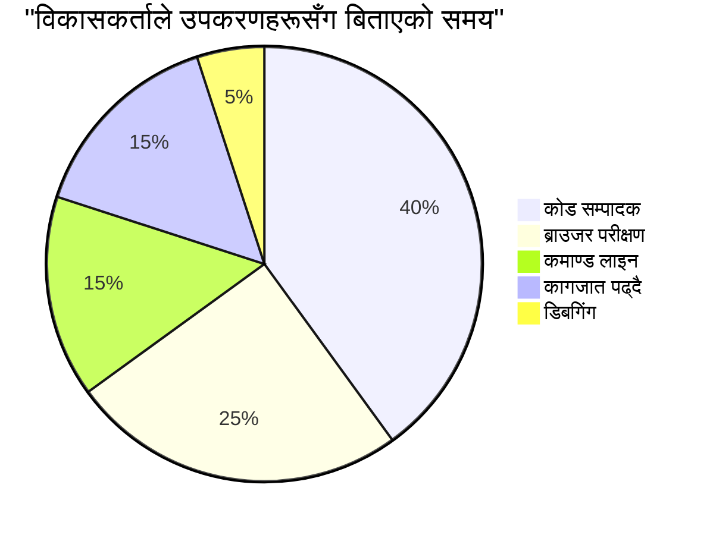

# प्रोग्रामिङ भाषाहरू र आधुनिक विकासकर्ता उपकरणहरूको परिचय

हे त्यहाँ, भविष्यका विकासकर्ता! 👋 के म तिमीलाई केही भन्न सक्छु जुन हरेक दिन मलाई अझै पनि रोमाञ्चक बनाउँछ? तिमी अब पत्ता लगाउन लागेका छौ कि प्रोग्रामिङ मात्र कम्प्युटरसँग सम्बन्धित छैन – यो तिमीले तिमीका सबैभन्दा पागल विचारहरूलाई जीवन्त बनाउनका लागि साँच्चै सुपरपावर पाउने कुरा हो!

तिमीलाई थाहा छ त्यो क्षण जब तिमी आफ्नो मनपर्ने एप प्रयोग गर्दैछौ र सबै कुरा बिल्कुल सहीसँग मिल्छ? जब तिमी एक बटन थिच्छौ र त्यहाँ केही बिल्कुल जादुई हुन्छ जुनले तिमीलाई "वाह, तिनीहरूले यो कसरी गरे?" भन्न बाध्य पार्छ? ठीक त्यस्तै, तिमी जस्तै कसैले – सायद आफ्नो मनपर्ने कफी पसलमा बिहान २ बजे आफ्नो तेस्रो एस्प्रेसो संग बसिरहेको – त्यो जादू सिर्जना गर्ने कोड लेखेको हो। र यहाँ छ जुनले तिम्रो मन उडाउनेछ: यस पाठको अन्त्यसम्म, तिमीले मात्र बुझ्नेछौ कि तिनीहरूले कसरी गरे, तर तिमी आफैं प्रयास गर्न झुकाव महसुस गर्नेछौ!

हेर्नुहोस्, मलाई पूर्ण रुपमा बुझिन्छ यदि अहिले प्रोग्रामिङ तिमीलाई डर लाग्ने लाग्छ। जब म पहिलो पटक सुरु गरें, मलाई साँचोमा लाग्थ्यो तिमीलाई कुनै प्रकारको गणितीय प्रतिभा चाहिन्छ वा पाँच वर्षदेखि कोडिङ गर्दैआएको हुनुपर्छ। तर यहाँ छ जसले मेरो दृष्टिकोण पूरै परिवर्तन गर्‍यो: प्रोग्रामिङ नयाँ भाषा सिकेर कुरा गर्न सिक्न जस्तै हो। तिमी "हेल्लो" र "धन्यवाद" बाट सुरु गर्छौ, त्यसपछि कफी अर्डर गर्न सम्म पुग्छौ, र थोरैमा तिमी गहिरा दार्शनिक छलफलहरु पनि गर्न थाल्छौ! तर यस केसमा, तिमी कम्प्युटरसँग कुराकानी गर्दैछौ, र साँच्चिकै? तिनीहरू सबैभन्दा धैर्यवान् कुराकानी साथी हुन् – उनीहरूले कहिल्यै तिम्रा गल्तीहरूमाथि निन्दा गर्दैनन् र सधैं फेरि प्रयास गर्न उत्साहित हुन्छन्!

आज, हामी ती अविश्वसनीय उपकरणहरु अन्वेषण गर्दैछौं जुन आधुनिक वेब विकासलाई सम्भव मात्र बनाउँदैन, तर साँच्चिकै लत लाग्दो बनाउँछ। म ती नै सम्पादकहरू, ब्राउजरहरू, र कार्यप्रवाहहरू को कुरा गर्दैछु जुन नेटफ्लिक्स, स्पोटीफाइ, र तिम्रो मनपर्ने इन्डी एप स्टुडियोका विकासकर्ताहरू हरेक दिन प्रयोग गर्दछन्। र यहाँ छ त्यो भाग जसले तिमीलाई खुशीका साथ नाच्न बाध्य पार्नेछ: यी अधिकांश व्यावसायिक स्तरका, उद्योग-मानक उपकरणहरू पूर्ण रूपमा निःशुल्क छन्!


> स्केचना [Tomomi Imura](https://twitter.com/girlie_mac) द्वारा


```mermaid
journey
    title तपाईको प्रोग्रामिङ यात्रा आज
    section पत्ता लगाउनुहोस्
      प्रोग्रामिङ भनेको के हो: 5: You
      प्रोग्रामिङ भाषाहरू: 4: You
      उपकरण सिंहावलोकन: 5: You
    section अन्वेषण गर्नुहोस्
      कोड सम्पादकहरू: 4: You
      ब्राउजरहरू र डिभटुलहरू: 5: You
      कमाण्ड लाइन: 3: You
    section अभ्यास गर्नुहोस्
      भाषा जासुसी: 4: You
      उपकरण अन्वेषण: 5: You
      समुदाय सम्बन्ध: 5: You
```
## हेरौं, तिमीले पहिले नै के जान्यौ!

मजेदार कुरामा प्रवेश गर्नु अघि, मलाई जान्न मन लागेको छ – तिमी यो प्रोग्रामिङ संसारबारे पहिले के जान्छौ? र सुन्नुहोस्, यदि तिमी यी प्रश्नहरु हेरेर "म एकदमै अलि पनि थाहा छैन" सोच्दैछौ भने, त्यो ठीक छ, त्यो उत्तम हो! यसको मतलब तिमी बिल्कुलै उपयुक्त स्थानमा छौ। यो प्रश्नोत्तरीलाई व्यायाम अघि तन्किने व्यायाम जस्तो सोच – हामीले हाम्रो दिमागका मांसपेशीहरू तातो पार्दैछौं!

[पाठ अघि क्विज लिनुहोस्](https://ff-quizzes.netlify.app/web/)


## हामीसंग गर्ने साहसिक यात्रा

ठीक छ, म साँच्चिकै उत्साहित छु आज हामी के अन्वेषण गर्नेछौं! साँच्चै, म तिम्रो अनुहार देख्न चाहन्छु जब केही यी अवधारणाहरू मेल खान्छन्। यहाँ हामी सँगै लिने अद्भुत यात्रा छ:

- **प्रोग्रामिङ वास्तवमा के हो (र किन यो सबैभन्दा चिसो कुरा हो!)** – हामी पत्ता लगाउनेछौँ कि कसरी कोड अचेतन जादू हो जुन तिमी वरिपरिका सबै वस्तुहरूमा शक्ति दिन्छ, जुन अलार्म जुन कसरी सँधै सोमबार बिहान थाह पाउँछ देखि लिएर एल्गोरिदम जुन तिम्रो नेटफ्लिक्स सिफारिसहरू कुशलतापूर्वक चासो गर्दछ
- **प्रोग्रामिङ भाषाहरू र तिनीहरूको अद्भुत व्यक्तित्वहरू** – कल्पना गर, पार्टीमा हरेक व्यक्तिको एकदम फरक सुपरपावर र समस्या समाधान गर्ने तरिका छ। प्रोग्रामिङ भाषा संसार त्यस्तै छ, र तिमी तिनीहरूलाई भेट्न मन पराउनेछौ!
- **डिजिटल जादू कराउने आधारभूत निर्माण ब्लकहरू** – यीलाई अन्तिम रचनात्मक LEGO सेटको रूपमा सोच। जब तिमी यी टुक्राहरू कसरी एक आपसमा फिट हुन्छन् बुझ्न सक्दछौ, तब तिमीले जे कल्पना गर्छौ त्यो कुनै पनि कुरा बनाउन सक्नेछौ
- **व्यावसायिक उपकरणहरू जसले तिमीलाई यस्तो महसुस गराउनेछ जस्तो तिमीलाई जादूगरको छडी दिइएको हो** – म नाटक गर्दै छैन – यी उपकरणहरूले साँच्चिकै तिमीलाई सुपरपावर भएको महसुस गराउनेछन्, र सबैभन्दा राम्रो भाग? तिनीहरू नै हुन् जुन व्यावसायिकहरू प्रयोग गर्दछन्!

> 💡 **यहाँ कुरा छ**: आज सबै कुरा याद गर्न प्रयास गर्न समेत सोच्न पनि नलागोस्! अहिले म चाहन्छु कि तिमी यो सम्भावनाको जोश महसुस गर। विवरणहरू स्वाभाविक रूपमा तिमीले सँगै अभ्यास गर्दा टाँसिनेछन् – त्यसरी नै वास्तविक सिकाइ हुन्छ!

> तिमी यो पाठ [Microsoft Learn](https://learn.microsoft.com/en-us/learn/modules/web-development-101/introduction-programming/?WT.mc_id=academic-77807-sagibbon) मा लिन सक्नुहुन्छ!

## त त, प्रोग्रामिङ *के* हो?

ठीक छ, अब त्यो करोडौं डलरको प्रश्न समाधान गरौं: प्रोग्रामिङ साँच्चिकै के हो?

म तिमीलाई एउटा कथा दिनेछु जसले मेरो सोचाईलाई पूरै परिवर्तन गर्यो। गत हप्ता, म आमा लाई हाम्रो नयाँ स्मार्ट टिभी रिमोट कसरी प्रयोग गर्ने भनेर बुझाउन खोज्दै थिएँ। मैले आफैंलाई भन्न थालेँ "रातो बटन दबाओ, तर ठूलो रातो बटन होइन, बाँया तर्फ सानो रातो बटन... होइन, अर्काे बाँया... ठीक छ, अब दुई सेकेन्ड सम्म थिचिराख, एउटा होइन, तीन होइन..." के तिमीलाई परिचित लाग्यो? 😅

त्यो हो प्रोग्रामिङ! यो अत्यन्तै विस्तृत, क्रमबद्ध निर्देशनहरू दिनु हो त्यस्तो चीजलाई जसले धेरै शक्ति राख्छ तर सबै कुरा ठीकसँग स्पष्ट गरिनु पर्छ। तर तिमी आमा लाई बुझाउनु भन्दा पक्कै फरक छ (जो सोध्न सक्छन् "कुन रातो बटन?"), कम्प्युटरलाई बुझाउनु हो (जो तिमीले भने अनुरूपै गर्छ, चाहे तिम्रो भनाइ ठीक नहुन सक्छ)।

मलाई पहिलो पटक यो सिक्दा के चकित बनायो भने: कम्प्युटरहरू वास्तवमा सिरियलमा निकै सरल छन्। तिनीहरू केवल दुई कुरा बुझ्छन् – १ र ०, जसको अर्थ हो "हो" र "होइन" वा "चालु" र "बन्द"। त्यति मात्र! तर जादू त्यहाँ हुन्छ – हामीले हामी म्याट्रिक्समा जस्तै 1 र 0 मा कुरा गर्नु पर्दैन। त्यहाँ **प्रोग्रामिङ भाषाहरू** आउँछन्। तिनीहरू संसारकै सबैभन्दा राम्रा अनुवादक जस्तै हुन् जसले तिम्रा सामान्य मानवीय सोचहरूलाई कम्प्युटर भाषा मा रूपान्तरण गर्छन्।

र यहाँ छ जुन मलाई हरेक बिहान उठ्दा वास्तविक रूपमा रोमाञ्चक बनाउँछ: तिम्रो जस्तै कसैलेले, सायद पजामा लगाएर कफीको कप हातमा लिएर, आफ्नो ल्यापटपमा कोड टाइप गर्दै, तिमीले प्रयोग गर्ने प्रत्येक डिजिटल कुरा सुरु गरेको हो। त्यो इन्स्टाग्राम फिल्टर जसले तिमीलाई निर्दोष देखाउने बनाउँछ? कसैले त्यो कोड गर्‍यो। त्यो सिफारिस जसले तिमीलाई तिम्रो नयाँ मनपर्ने गीतमा पुऱ्यायो? एउटा विकासकर्ता त्यो एल्गोरिदम बनाए। तिम्रा साथीहरूसँग खाना बिल विभाजन गर्न सहयोग गर्ने एप? हो, कसैले सोचे, "यो झन्झटिलो छ, म यो सुधार्न सक्छु" र त्यसपछि... तिनीहरूले गरे!

जब तिमी प्रोग्रामिङ सिक्छौ, तिमी केवल नयाँ सीप सिक्दै होइनौ – तिमी यो अद्भुत समस्या समाधानकर्ता समुदायको हिस्सा बन्दैछौ जसले आफ्ना दिनहरू सोच्दै बिताउँछन्, "के मैले केहि यस्तो बनाउन सक्दछु जसले कसैको दिन अलिकति राम्रो बनाओस्?" साँच्चै, के त्यस्तो केही चिसो छ र?

✅ **रोमाञ्चक तथ्य खोज**: यहाँ तिमीले खाली समयमा खोज्न सक्ने एकदमै रमाईलो कुरा छ – विश्वकै पहिलो कम्प्युटर प्रोग्रामर को थियो? म तिमीलाई संकेत दिन्छु: त्यो अपेक्षा गरेजस्तो कोही नहुन सक्छ! त्यस व्यक्तिको कथा साँच्चिकै आकर्षक छ र देखाउँछ कि प्रोग्रामिङ सधैं सिर्जनात्मक समस्या समाधान र बाकस बाहिर सोच्ने कुरा हो।

### 🧠 **चेक-इन समय: कस्तो महसुस गर्दैछौ?**

**एउटा समय निकालेर विचार गर:**
- "कम्प्युटरसँग निर्देशन दिनु" भन्ने विचार अहिले के तिमीलाई बुझिन्छ?
- हरेक दिनको कुनै काम छ जुन तिमी प्रोग्रामिङले स्वचालित गर्न चाहन्छौ?
- यो पुरै प्रोग्रामिङबारे तिम्रो मनमा के प्रश्नहरू उठिरहेका छन्?

> **स्मरण रहोस्**: यो पूर्ण सामान्य कुरा हो यदि केही अवधारणाहरू अहिले अलि अस्पष्ट लाग्छन्। प्रोग्रामिङ सिक्नु नयाँ भाषा सिक्ने जस्तै हो – तिमीले दिमागमा नयाँ न्यूरल मार्गहरू बनाउन समय लाग्छ। तिमी राम्रो गर्दैछौ!

## प्रोग्रामिङ भाषाहरू जादूका विभिन्न स्वादहरू जस्तै हुन्छन्

ठीक छ, यो अलि अजब सुनिन्छ, तर मेरो कुरा संगै रहि – प्रोग्रामिङ भाषाहरू धेरै प्रकारका संगीत जस्तै छन्। सोच, तिमीलाई छ जाज, जुन नरम र आविष्कारशील हुन्छ, रक जुन शक्तिशाली र सोझो हुन्छ, क्लासिकल जुन सुरुचिपूर्ण र संरचित हुन्छ, र हिप-हप जुन सिर्जनात्मक र अभिव्यक्तिक हुन्छ। हरेक शैलीको आफ्नो माहोल हुन्छ, आफ्नै उर्जाशील समुदाय हुन्छ, र हरेक एक फरक मूड र अवसरका लागि उपयुक्त हुन्छ।

प्रोग्रामिङ भाषाहरू पनि ठीक त्यस्तै छन्! तिमी त्यहि भाषा प्रयोग गर्नुहुन्न जुन तिमी मोबाइल खेल बनाउन प्रयोग गर्छौ त्यहि भाषा जलवायु डाटा विश्लेषण गर्न प्रयोग गर्ने। जस्तै, तिमी योग वर्गमा डेथ मेटल बजाउनु हुँदैन (खैर, अधिकांश योग वर्गमा! 😄)।

तर यहाँ छ जुनले मलाई हरेक पटक अचम्मित पार्छ: यी भाषाहरू तिमीलाई संसारकै सबैभन्दा धैर्यवान्, प्रतिभाशाली दुभाषिया छेउमा बसिरहेको जस्तो अनुभूति दिन्छन्। तिमीले आफ्ना विचारहरू मानव दिमागलाई सजिलो पर्ने तरिकाले अभिव्यक्त गर्न सक्छौ, र तिनीहरूले कम्प्युटर भाषा 1 र 0 मा सजिलै रूपान्तरण गर्छन्। यो त्यस्तो साथी जस्तो हो जो "मानव सिर्जनात्मकता" र "कम्प्युटर तर्क" दुबैमा पारंगत छ – र कहिल्यै थाक्दैन, कफि ब्रेक चाहँदैन, र तिमीले उस्तै प्रश्न दोहोर्याए पनि कहिल्यै निन्दा गर्दैन!

### लोकप्रिय प्रोग्रामिङ भाषाहरू र तिनीहरूको उपयोगहरू


```mermaid
mindmap
  root((प्रोग्रामिङ भाषा))
    वेब विकास
      JavaScript
        फ्रन्टएन्ड म्याजिक
        अन्तरक्रियात्मक वेबसाइटहरू
      TypeScript
        JavaScript + प्रकारहरू
        उद्यम एपहरू
    डाटा र एआई
      Python
        डाटा विज्ञान
        मेशिन लर्निङ
        स्वचालन
      R
        तथ्याङ्क
        अनुसन्धान
    मोबाइल एपहरू
      Java
        एन्ड्रोइड
        उद्यम
      Swift
        iOS
        एप्पल इकोसिस्टम
      Kotlin
        आधुनिक एन्ड्रोइड
        क्रस-प्लेटफर्म
    सिस्टम र प्रदर्शन
      C++
        खेलहरू
        प्रदर्शन महत्वपूर्ण
      Rust
        मेमोरी सुरक्षा
        सिस्टम प्रोग्रामिङ
      Go
        क्लाउड सेवाहरू
        स्केलेबल ब्याकएन्ड
```
| भाषा | उत्तम | किन लोकप्रिय |
|----------|----------|------------------|
| **JavaScript** | वेब विकास, प्रयोगकर्ता इन्टरफेस | ब्राउजरहरुमा चल्छ र अन्तरक्रियात्मक वेबसाइटहरूलाई शक्ति दिन्छ |
| **Python** | डाटा विज्ञान, स्वचालन, AI | पढ्न र सिक्न सजिलो, शक्तिशाली पुस्तकालयहरू |
| **Java** | एंटरप्राइज एप्लिकेसनहरू, एन्ड्रोइड एप्स | प्लेटफर्म-स्वतन्त्र, ठूला प्रणालीहरूको लागि मजबुती |
| **C#** | विन्डोज एप्लिकेसनहरू, खेल विकास | माईक्रोसफ्टको शक्तिशाली इकोसिस्टम समर्थन |
| **Go** | क्लाउड सेवा, ब्याकएण्ड प्रणालीहरू | छिटो, सरल, आधुनिक कम्प्युटिङका लागि डिजाइन गरिएको |

### उच्च-स्तरीय बनाम तल्लो-स्तरीय भाषाहरू

ठीक छ, यो साँच्चिकै त्यो अवधारणा हो जसले मेरो दिमाग फुटाइदियो जब म पहिलो पटक सिक्दै थिएँ, त्यसैले म त्यो रूपक साझा गर्नेछु जसले मलाई अन्ततः बुझ्न मद्दत गर्‍यो – र मलाई आशा छ यो तिमीलाई पनि मद्दत गर्नेछ!

कल्पना गर तिमी त्यस्तो देश गएँ जहाँ तिमी भाषा बोल्दैनौ, र तिमीलाई नजिकैको शौचालय पत्ता लगाउन धेरै आवश्यक छ (हामी सबै त्यहीँ पुगेका छौं, हो? 😅):

- **तल्लो-स्तरीय प्रोग्रामिङ** त्यस्तै हो जस्तो त्यो स्थानिय बोली यति राम्रोसँग सिक्नु कि तिमी कुना नजिक बेच्ने हजुरआमासँग फलफूलको कदाचार, स्थानीय स्लयाङ र आफू त्यहाँ हुर्किएका मात्र बुझ्ने भित्री मजाकहरूसँग कुराकानी गर्न सक्छौ। धेरै प्रभावकारी र अत्यन्त प्रभावशाली... यदि तिमी पारंगत छौ भने! तर केवल शौचालय खोज्दै गर्दा अलि भारी लाग्न सक्छ।

- **उच्च-स्तरीय प्रोग्रामिङ** त्यस्तो छ जस्तो त्यो अद्भुत स्थानीय साथी जसले तिमीलाई ठीकसँग बुझ्छ। तिमी "मलाई शौचालय खोज्न धेरै आवश्यक छ" सामान्य अंग्रेजीमा भन्न सक्नेछौ, र उनी त्यो सबै सांस्कृतिक अनुवाद गर्छन् र तिमीलाई यस्तो दिशानिर्देशन दिन्छन् जुन तिम्रो गैर-स्थानिय दिमागका लागि बिल्कुल उपयुक्त हुन्छ।

प्रोग्रामिङ भाषाहरू भन्नुपर्दा:
- **तल्लो-स्तरीय भाषाहरू** (जस्तै Assembly वा C) ले तिमीलाई कम्प्युटरको हार्डवेयरसँग अत्यन्त विस्तृत कुराकानी गर्न दिन्छ, तर तिमीले मशीन जस्तो सोचना जरुरी हुन्छ, जुन... हो, भन्नुपर्दा ठूलो दिमागको परिवर्तन हो!
- **उच्च-स्तरीय भाषाहरू** (जस्तै JavaScript, Python, वा C#) ले तिमीलाई मानिस जस्तो सोच्न अनुमति दिन्छ जब तिनीहरूले सबै मेशिन-कुरा पृष्ठभूमिमा ह्यान्डल गर्छन्। साथै, तिनीहरूका यी अत्यन्त स्वागतयोग्य समुदायहरू छन् जसमा धेरैले नयाँ थिए कस्तो हो सम्झन्छन् र साँच्चिकै मद्दत गर्न चाहन्छन्!

सुन यहाँ म तिमीलाई कुनबाट सुरु गर्न सुझाव दिनेछु? 😉 उच्च-स्तरीय भाषाहरू त्यस्तै छन् जस्तो तिमीलाई सिक्ने बेलामा सहयोग गर्ने प्रशिक्षण पाङ्ग्रा जसलाई पछि हटाउन चाहँदैनौ किनभने तिनीहरूले अनुभवलाई साँच्चिकै रमाइलो बनाउँछन्!


```mermaid
flowchart TB
    A["👤 मानवीय विचार:<br/>'म फिबोनाच्ची संख्या गणना गर्न चाहन्छु'"] --> B{भाषा स्तर छनोट गर्नुहोस्}
    
    B -->|उच्च-स्तर| C["🌟 JavaScript/Python<br/>पढ्न र लेख्न सजिलो"]
    B -->|निम्न-स्तर| D["⚙️ Assembly/C<br/>प्रत्यक्ष हार्डवेयर नियन्त्रण"]
    
    C --> E["📝 लेख्नुहोस्: fibonacci(10)"]
    D --> F["📝 लेख्नुहोस्: mov r0,#00<br/>sub r0,r0,#01"]
    
    E --> G["🤖 कम्प्युटर बुझाइ:<br/>अनुवादकले जटिलता सम्हाल्छ"]
    F --> G
    
    G --> H["💻 उस्तै परिणाम:<br/>0, 1, 1, 2, 3, 5, 8, 13..."]
    
    style C fill:#e1f5fe
    style D fill:#fff3e0
    style H fill:#e8f5e8
```
### किन उच्च-स्तरीय भाषाहरू यति मित्रवत् छन् देखाउँछु

ठीक छ, म तिमीलाई यी कुरा देखाउन लागिरहेको छु जुनले पूर्ण रूपमा देखाउँछ किन म उच्च-स्तरीय भाषाहरू सँग माया बसेँ, तर पहिले – तिमीलाई केही वाचा गराउनु पर्छ। जब तिमी त्यो पहिलो कोड उदाहरण देख्नेछौ, डर नमान! यो जानाजान डर लाग्दो देखिन्छ। त्यो नै मेरो बनाएको मुख्य कुरा हो!

हामी दुई बिलकुल फरक शैलीहरूमा लेखिएको एउटै कार्य हेर्नेछौं। दुवैले फिबोनाच्ची अनुक्रम बनाउँछ – यो एक सुन्दर गणितीय ढाँचा हो जहाँ प्रत्येक संख्या अघिल्लो दुईको योग हुन्छ: 0, 1, 1, 2, 3, 5, 8, 13... (रोमाञ्चक तथ्य: तिमी यो ढाँचा प्रकृतिमा सबै ठाउँमा फेला पार्नेछौ – घोडा घाँसका बीउको घुमाउरो, पाइनकोन्सको ढाँचा, र ग्यालेक्सीहरू निर्माण हुने तरिका!)

फर्केर हेर्न तयार? जानौँ!

**उच्च-स्तरीय भाषा (JavaScript) – मानिसमैत्री:**

```javascript
// कदम १: आधारभूत फिबोनाच्ची सेटअप
const fibonacciCount = 10;
let current = 0;
let next = 1;

console.log('Fibonacci sequence:');
```

**यो कोडले के गर्दछ:**
- **घोषणा** गर्छ स्थायी मान जसले कति फिबोनाच्ची संख्या उत्पन्न गर्ने हो निर्दिष्ट गर्छ
- **初始化** दुई क变量हरू जुन अनुक्रमको वर्तमान र अर्को संख्याको ट्र्याक राख्छ
- **सेट अप** सुरुवाती मानहरू (0 र 1) जुन फिबोनाच्ची ढाँचा परिभाषित गर्छ
- **प्रदर्शित** गर्छ एउटा शीर्षक सन्देश जसले हाम्रो आउटपुटलाई चिन्हित गर्छ

```javascript
// चरण २: लूपसँग अनुक्रम उत्पन्न गर्नुहोस्
for (let i = 0; i < fibonacciCount; i++) {
  console.log(`Position ${i + 1}: ${current}`);
  
  // अनुक्रममा अर्को संख्या गणना गर्नुहोस्
  const sum = current + next;
  current = next;
  next = sum;
}
```

**यहाँ के हुन्छ भँग्दै गरेको:**
- एक `for` लूप प्रयोग गरेर हाम्रा अनुक्रमका प्रत्येक पदमा **दोहर्याउने**
- टेम्प्लेट लिटरल ढाँचामा हरेक संख्या र यसको स्थान **प्रदर्शित गर्ने**
- हालको र अर्को मान थपेर अर्को फिबोनाच्ची संख्या **गणना गर्ने**
- अर्को पुनरावृत्तिमा जान हाम्रो ट्र्याकिङ भेरियबलहरू अपडेट गर्ने

```javascript
// चरण ३: आधुनिक कार्यात्मक दृष्टिकोण
const generateFibonacci = (count) => {
  const sequence = [0, 1];
  
  for (let i = 2; i < count; i++) {
    sequence[i] = sequence[i - 1] + sequence[i - 2];
  }
  
  return sequence;
};

// प्रयोग उदाहरण
const fibSequence = generateFibonacci(10);
console.log(fibSequence);
```

**माथि के गर्यौं:**
- आधुनिक एरो फंक्शन सिन्ट्याक्स प्रयोग गरेर पुन: प्रयोगयोग्य फंक्शन **बनेको**
- सम्पूर्ण अनुक्रम भण्डारण गर्नको लागि ऐरे **बनाएको** बजाए क्रमशः एक एक गरेर प्रदर्शन गर्ने
- हरेक नयाँ संख्या अघिल्लो मानबाट गणना गर्न ऐरे इन्डेक्सिङ **प्रयोग गरेको**
- लचिलो प्रयोगको लागि पूर्ण अनुक्रम **फिर्ता गरेको** हाम्रो प्रोग्रामका अन्य भागमा

**तल्लो-स्तरीय भाषा (ARM Assembly) – कम्प्युटरमैत्री:**

```assembly
 area ascen,code,readonly
 entry
 code32
 adr r0,thumb+1
 bx r0
 code16
thumb
 mov r0,#00
 sub r0,r0,#01
 mov r1,#01
 mov r4,#10
 ldr r2,=0x40000000
back add r0,r1
 str r0,[r2]
 add r2,#04
 mov r3,r0
 mov r0,r1
 mov r1,r3
 sub r4,#01
 cmp r4,#00
 bne back
 end
```

JavaScript संस्करण अंग्रेजी निर्देशन जस्तै पढिन्छ, जस्तै Assembly संस्करणले कम्प्युटरको प्रोसेसरलाई सिधा नियन्त्रण गर्ने गोप्य आदेशहरू प्रयोग गर्छ। दुवैले एउटै काम पूरा गर्छन्, तर उच्च-स्तरीय भाषा मानिसहरूका लागि बुझ्न, लेख्न, र मर्मत गर्न धेरै सजिलो हुन्छ।

**तिमीले देख्ने मुख्य भिन्नताहरू:**
- **पठनयोग्यता**: JavaScript ले `fibonacciCount` जस्ता व्याख्यात्मक नामहरू प्रयोग गर्छ भने Assembly ले `r0`, `r1` जस्ता रहस्यमय लेबलहरू प्रयोग गर्छ
- **टिप्पणीहरू**: उच्च तहका भाषाहरूले व्याख्यात्मक टिप्पणीहरूलाई प्रोत्साहित गर्छन् जसले कोडलाई स्व-दस्तावेजी बनाउँछ
- **संरचना**: JavaScript को तार्किक प्रवाह मानिसहरूले समस्याहरूलाई चरणबद्ध रूपमा कसरी सोच्दछन् भन्नेसँग मेल खान्छ
- **मर्मतसम्भार**: फरक आवश्यकताका लागि JavaScript संस्करण अपडेट गर्नु सिधा र स्पष्ट हुन्छ

✅ **Fibonacci श्रेणीबारे**: यो एकदमै सुन्दर संख्या रूपमा ढाँचा हो (जहाँ प्रत्येक संख्या अगाडिका दुईको योग बराबर हुन्छ: 0, 1, 1, 2, 3, 5, 8...) जुन प्रकृतिमा वास्तवमै *सधैं* देखिन्छ! तपाईं यो हँसिया घर्यान घुमाउने बनोटमा, पाइनकोनका ढाँचाहरूमा, नॉटिलस खोलाहरू कसरी मुड्छन् र यहाँसम्म कि रुखका हाँगाहरू कसरी बढ्छन् भनी भेट्टाउनुहुनेछ। गणित र कोडले कसरी प्रकृतिले सौन्दर्य सिर्जना गर्न प्रयोग गर्ने ढाँचाहरूलाई बुझ्न र पुनः सिर्जना गर्न हामीलाई मद्दत गर्छ भन्ने कुरा एकदमै अचम्म लाग्छ!


## त्यो आधारभूत तत्वहरू जसले जादू बनाउँछन्

अब, तपाईंले देख्नुभएको छ कि प्रोग्रामिङ भाषाहरू कस्तो देखिन्छन्, आउनुस् त्यस्ता आधारभूत टुक्राहरुलाई विश्लेषण गरौं जसले शाब्दिक रूपमा हरेक प्रोग्राम बनाउँछन्। यसलाई तपाईंको मनपर्ने परिकारको आधारभूत सामग्रीहरू जस्तै सोच्नुहोस् – एक पटक तपाईंले प्रत्येकको काम बुझ्नु भयो भने, तपाईं लगभग जुनसुकै भाषामा कोड पढ्न र लेख्न सक्नुहुनेछ!

यो प्रोग्रामिङको व्याकरण सिक्ने जस्तो हो। विद्यालयमा जब तपाईंले नाम, क्रिया, र वाक्यहरू कसरी बनाउने भनेर सिक्नु भएको थियो त्यो सम्झनुभएको छ? प्रोग्रामिङसँग आफ्नै व्याकरण छ, र सत्य भन्नुपर्दा यो अंग्रेजी व्याकरणभन्दा धेरै बढी तार्किक र सहिष्णु छ! 😄

### कथनहरू: चरण-द्वारा-चरण निर्देशनहरू

हामी **कथनहरू** बाट सुरु गरौं – यी तपाईंको कम्प्युटरसँगको संवादमा व्यक्तिगत वाक्यजस्तै छन्। प्रत्येक कथनले कम्प्युटरलाई एक विशेष काम गर्न भन्छ, जस्तै निर्देशन दिनु हो: "यहाँ बायाँ मोड," "रातो बत्तिमा रोक," "त्यो ठाउँमा पार्क गर।"

मलाई कथनहरूको पढ्न सजिलो हुनु पक्कै पनि मन पर्छ। हेर्नुहोस्:

```javascript
// एकल क्रियाहरू गर्ने आधारभूत बयानहरू
const userName = "Alex";                    
console.log("Hello, world!");              
const sum = 5 + 3;                         
```

**यो कोडले के गर्छ:**
- प्रयोगकर्ताको नाम भण्डारण गर्न स्थायी भेरिएबल घोषणा गर्नु
- कन्सोल आउटपुटमा अभिवादन सन्देश प्रदर्शन गर्नु
- गणितीय अपरेसनको नतिजा गणना गरी भण्डारण गर्नु

```javascript
// वेब पृष्ठहरूसँग अन्तरक्रिया गर्ने कथनहरू
document.title = "My Awesome Website";      
document.body.style.backgroundColor = "lightblue";
```

**चरणद्वारा चरण, यी भइरहेका छन्:**
- ब्राउजर ट्याबमा देखिने वेबपेजको शीर्षक परिवर्तन गर्नु
- पृष्ठको पृष्ठभूमि रंग परिवर्तन गर्नु

### भेरिएबलहरू: तपाईंको प्रोग्रामको स्मृति प्रणाली

ठिक छ, **भेरिएबलहरू** वास्तवमै सिकाउन सकिने मेरो मनपर्ने अवधारणाहरू मध्ये एक हुन् किनकि तिनीहरू दैनिक जीवनमा प्रयोग गर्ने चीजहरू जस्तै छन्!

यो तपाईंको फोनको सम्पर्क सूचीको बारेमा सोच्नुहोस्। तपाईं सबै मानिसहरूको फोन नम्बर स्मरण गर्नु हुन्न – यसको सट्टा, तपाईं "आमा," "सबैभन्दा राम्रो साथी," वा "Pizza Place That Delivers Until 2 AM" भनी सुरक्षित गर्नुहुन्छ र फोनले वास्तविक नम्बरहरू सम्झन्छ। भेरिएबलहरू पनि ठीक त्यस्तै हुन्छन्! तिनीहरू लेबल गरिएको कन्टेनरहरू हुन् जहाँ तपाईंको प्रोग्रामले जानकारी भण्डारण गर्न र पछि नाम प्रयोग गरेर प्राप्त गर्न सक्छ जुन साँच्चिकै अर्थपूर्ण छ।

यहाँ साँच्चै रमाइलो कुरा के हो भने: प्रोग्राम चल्दा भेरिएबलहरूले परिवर्तन पनि गर्न सक्छन् (त्यसैले "variable" नाम राखिएको हो – ध्यान दिई हेर्नुहोस्!). जस्तै तपाईं पिज्जा पसलको सम्पर्क अद्यावधिक गर्न सक्नुहुन्छ जब तपाईंले अझ राम्रो ठाउँ पत्ता लगाउनुहुन्छ, भेरिएबलहरू पनि नयाँ जानकारी सिक्दा वा अवस्थाहरू परिवर्तन हुँदा अपडेट हुन सक्छन्!

म तपाईंलाई कति सरल र सुन्दर हुन सक्छ भनेर देखाउँछु:

```javascript
// चरण १: आधारभूत चरहरू सिर्जना गर्दै
const siteName = "Weather Dashboard";        
let currentWeather = "sunny";               
let temperature = 75;                       
let isRaining = false;                      
```

**यी अवधारणाहरू बुझ्दै:**
- `const` भेरिएबलहरूमा अपरिवर्तनीय मानहरू भण्डारण गर्नुहोस् (जस्तै साइट नाम)
- `let` भेरिएबलहरू प्रयोग गर्नुहोस् जुन प्रोग्रामभरि परिवर्तन हुन सक्छन्
- फरक डाटा प्रकारहरू नियुक्त गर्नुहोस्: स्ट्रिङहरू (पाठ), संख्या, र बूलियन (सही/गलत)
- हरेक भेरिएबलले के राख्छ भन्ने स्पष्ट पार्ने नामहरू चयन गर्नुहोस्

```javascript
// चरण २: सम्बन्धित डाटा समूह गर्न वस्तुहरूसँग काम गर्दै
const weatherData = {                       
  location: "San Francisco",
  humidity: 65,
  windSpeed: 12
};
```

**माथिको उदाहरणमा, हामीले:**
- सम्बन्धित मौसम जानकारीलाई समूहबद्ध गर्न वस्तु सिर्जना गर्यौं
- डाटा विभिन्न टुक्रालाई एउटै भेरिएबल नामअन्तर्गत व्यवस्थित गर्यौं
- हरेक जानकारीको टुक्रालाई स्पष्ट रूपमा लेबल गर्न कुञ्जी-मूल्य जोडीहरू प्रयोग गर्यौं

```javascript
// चरण ३: चल हरूको प्रयोग र अद्यावधिक
console.log(`${siteName}: Today is ${currentWeather} and ${temperature}°F`);
console.log(`Wind speed: ${weatherData.windSpeed} mph`);

// परिवर्तनशील चल हरू अद्यावधिक गर्दै
currentWeather = "cloudy";                  
temperature = 68;                          
```

**प्रत्येक भाग बुझौं:**
- `${}` वाक्यांश प्रयोग गरेर जानकारी देखाउनुहोस्
- डट नोटेशन (`weatherData.windSpeed`) द्वारा वस्तुको गुणहरू पहुँच गर्नुहोस्
- `let` द्वारा घोषित भेरिएबलहरूलाई परिवर्तनशील अवस्थाहरू अनुरूप अद्यावधिक गर्नुहोस्
- धेरै भेरिएबलहरूलाई मिलाएर अर्थपुर्ण सन्देश तयार गर्नुहोस्

```javascript
// चरण ४: सफा कोडका लागि आधुनिक डीस्ट्रक्चरिङ
const { location, humidity } = weatherData; 
console.log(`${location} humidity: ${humidity}%`);
```

**जान्नु पर्ने कुरा:**
- वस्तुहरूको विशेष गुणहरूलाई डेस्ट्रक्चरिङ असाइनमेन्टबाट निकाल्नुहोस्
- वस्तु कुञ्जीहरूसँग मिल्ने नयाँ भेरिएबलहरू स्वचालित रूपमा सिर्जना गर्नुहोस्
- बारम्बार डट नोटेशन प्रयोग नगरी कोडलाई सरल बनाउन

### नियन्त्रण प्रवाह: तपाईंको प्रोग्रामलाई सोच्न सिकाउनुहोस्

ठिक छ, यहाँ प्रोग्रामिङ बिल्कुल दिमागलाई झम्कार्ने हुन्छ! **नियन्त्रण प्रवाह** नै तपाईंको प्रोग्रामलाई बुद्धिमानी निर्णय लिन सिकाउनु हो, बिल्कुल तपाईंले दैनिक रूपमा सोच्न नपरी गर्ने तरिकामा।

कल्पना गर्नुहोस्: आज बिहान तपाईंले "यदि वर्षा भइरहेको छ भने, छाता लगाउनेछु। यदि चिसो छ भने, ज्याकेट लगाउनेछु। यदि ढिलो भयो भने, बिहानको खाजा छोडी कफी किनेनेछु।" तपाईंको मस्तिष्क स्वाभाविक रूपमा यस प्रकारको 'यदि-तब' तार्किकता धेरै पटक प्रयोग गर्छ!

यसले प्रोग्रामहरूलाई बुद्धिमान र जीवित बनाउँछ जुन केवल एउटा उब्जाउने, अनुमानयोग्य स्क्रिप्ट पछ्याउने होइनन्। तिनीहरूले परिस्थितिलाई हेर्न सक्छन्, के भइरहेको छ मूल्याङ्कन गर्न सक्छन् र उपयुक्त प्रतिक्रिया दिन सक्छन्। यो तपाईंको प्रोग्रामलाई मस्तिष्क दिने जस्तो हो जुन अनुकूलन गर्न र निर्णय लिनसक्नेछ!

कसरी यो सुन्दर रूपमा काम गर्छ देख्न चाहनुहुन्छ? म तपाईंलाई देखाउँछु:

```javascript
// चरण १: आधारभूत सर्तीय तर्क
const userAge = 17;

if (userAge >= 18) {
  console.log("You can vote!");
} else {
  const yearsToWait = 18 - userAge;
  console.log(`You'll be able to vote in ${yearsToWait} year(s).`);
}
```

**यो कोडले के गर्छ:**
- प्रयोगकर्ताको उमेर मतदान योग्यताको मापदण्ड पुर्‍याएको छ कि छैन जाँच गर्नु
- अवस्था परिणाममा आधारित भिन्न कोड ब्लकहरू कार्यान्वयन गर्नु
- १८ वर्ष मुनिको अवस्था भए मतदान योग्यतासम्म कति समय बाँकी छ गणना गर्न र देखाउन
- प्रत्येक परिदृश्यका लागि विशिष्ट, उपयोगी प्रतिक्रिया प्रदान गर्नु

```javascript
// चरण 2: तार्किक अपरेटरहरूसँग बहुविध सर्तहरू
const userAge = 17;
const hasPermission = true;

if (userAge >= 18 && hasPermission) {
  console.log("Access granted: You can enter the venue.");
} else if (userAge >= 16) {
  console.log("You need parent permission to enter.");
} else {
  console.log("Sorry, you must be at least 16 years old.");
}
```

**यहाँ के भइरहेको छ विश्लेषण गर्दै:**
- `&&` (र) अपरेटर प्रयोग गरेर बहु सर्तहरू संयोजन गर्नु
- `else if` प्रयोग गरी बहु परिदृश्यहरूका लागि अवस्था संरचना बनाउनु
- अन्तिम `else` कथनले सबै सम्भावित अवस्थामा व्यवस्थापन गर्नु
- प्रत्येक फरक अवस्थाका लागि स्पष्ट र कार्यन्वयनयोग्य प्रतिक्रिया उपलब्ध गराउनु

```javascript
// चरण ३: टर्नरी अपरेटरको साथ संक्षिप्त सशर्त
const votingStatus = userAge >= 18 ? "Can vote" : "Cannot vote yet";
console.log(`Status: ${votingStatus}`);
```

**तपाईंले सम्झनुपर्ने कुरा:**
- सरल दुई विकल्प अवस्थाहरूका लागि टर्नरी अपरेटर (`? :`) प्रयोग गर्नुहोस्
- पहिला अवस्था लेख्नुहोस्, त्यसपछि `?`, त्यसपछि सत्य नतिजा, त्यसपछि `:`, त्यसपछि असत्य नतिजा
- सर्त अनुसार मानहरू असाइन गर्दा यो ढाँचा प्रयोग गर्नुहोस्

```javascript
// चरण ४: धेरै विशेष अवस्था व्यवस्थापन गर्नुहोस्
const dayOfWeek = "Tuesday";

switch (dayOfWeek) {
  case "Monday":
  case "Tuesday":
  case "Wednesday":
  case "Thursday":
  case "Friday":
    console.log("It's a weekday - time to work!");
    break;
  case "Saturday":
  case "Sunday":
    console.log("It's the weekend - time to relax!");
    break;
  default:
    console.log("Invalid day of the week");
}
```

**यस कोडले निम्न कार्य गर्दछ:**
- भेरिएबल मानलाई धेरै विशिष्ट केसहरूसँग मेल गर्नुहोस्
- उस्तै केसहरूलाई समूहबद्ध गर्नुहोस् (कार्यालय दिनहरू विरुद्ध सप्ताहन्त)
- मेल पाएपछि उपयुक्त कोड ब्लक कार्यान्वयन गर्नु
- नअज्ञात मानहरूको लागि `default` केस समावेश गर्नु
- अर्को केसमा जानबाट रोक्न `break` वक्तव्यहरू प्रयोग गर्नु

> 💡 **वास्तविक संसारको उदाहरण**: नियन्त्रण प्रवाहलाई संसारकै सबैभन्दा धैर्यवान GPSको रूपमा सोच्नुहोस् जसले तपाईंलाई निर्देशन दिन्छ। यसले भन्न सक्छ "यदि मुख्य सडकमा ट्राफिक छ भने राजमार्ग लिऊँ। यदि राजमार्ग बाटो निर्माणमा अवरुद्ध छ भने, रमणीय मार्ग प्रयास गर।" प्रोग्रामहरूले उही प्रकारको सर्तसापेक्ष तार्किकता प्रयोग गर्छन् विभिन्न अवस्थाहरूमा बुद्धिमानीपूर्वक प्रतिक्रिया दिन र सदैव प्रयोगकर्तालाई उत्तम अनुभव दिन।

### 🎯 **अवधारणा जाँच: आधारभूत तत्वहरूमा पारंगत

**तपाईं कस्तो गर्दै हुनुहुन्छ आधारभूतसंग:**
- भेरिएबल र कथनबीचको फरक तपाईंको आफ्नै शब्दमा भन्न सक्नुहुन्छ?
- एउटा वास्तविक जीवन परिदृश्य सोच्नुहोस् जहाँ तपाईंले यदि-तब निर्णय प्रयोग गर्नुहुन्छ (जस्तै मतदान उदाहरण)
- प्रोग्रामिङ तर्कबारे तपाईंलाई सबैभन्दा आश्चर्यचकित बनाएको कुरा के हो?

**छिटो आत्मविश्वास बढाउने:**

```mermaid
flowchart LR
    A["📝 कथनहरू<br/>(निर्देशनहरू)"] --> B["📦 भेरिएबलहरू<br/>(संग्रहण)"] --> C["🔀 नियन्त्रण प्रवाह<br/>(निर्णयहरू)"] --> D["🎉 काम गर्ने कार्यक्रम!"]
    
    style A fill:#ffeb3b
    style B fill:#4caf50
    style C fill:#2196f3
    style D fill:#ff4081
```
✅ **अर्को के आउँदैछ**: हामी यी अवधारणाहरूमा अझ गहिराई मा छिर्न रमाइलो गर्नेछौं! अहिले, केवल उत्साहित महसुस गर्नुहोस् यो अद्भुत सम्भावनाहरूको लागि जुन तपाईं अघि पाउनुहुनेछ। विशिष्ट सीपहरू र प्रविधिहरू स्वाभाविक रूपमा अभ्यास संग जोडिनेछन् – म वाचा गर्दछु कि यो तपाईंले सोचेभन्दा धेरै रमाइलो हुनेछ!

## व्यापारका उपकरणहरू

ठिक छ, यो साँच्चै जहाँ म अत्यन्त उत्साहित हुन्छु अनि आफैंलाई रोक्न सक्दिन! 🚀 हामी ती अविश्वसनीय उपकरणहरू बारे कुरा गर्न लाग्यौँ जुन तपाईंलाई यस्तो महसुस गराउनेछ कि तपाईंले भर्खर डिजिटल अन्तरिक्ष यानका चाबीहरू पाउनुभयो।

तपाईंलाई थाहा छ जस्तो कि शेफसँग ती उत्तम सन्तुलित छुरा हुन्छन् जुन हातको विस्तार जस्तै हुन्छ? वा संगीतकारसँग त्यो गितार हुन्छ जुन छुँदै गरेसँगै गाइरहेको जस्तो हुन्छ? ठिक छ, विकासकर्ताहरूले यस्ता जादुई उपकरणहरूको आफ्नै संस्करण छ, र यहाँ त्यस्ता केही छन् जुन तपाईंको दिमाग उडाउने हुन्छ – अधिकांश पूर्ण रूपमा निःशुल्क छन्!

म तपाईंहरूसँग यी साझा गर्ने सोच्दै सिटमा उफ्रिन लागेको छु किनकि तिनीहरूले सफ्टवेयर निर्माण कसरी गर्ने पूर्णरूपले परिवर्तन गरिदिए। हामी AI-सञ्चालित कोडिङ सहायकहरूको कुरा गर्दैछौं जसले तपाईंको कोड लेख्न मद्दत गर्छ (म मजाक गर्दैछु भन्ने होइन!), क्लाउड वातावरणहरू जहाँ तपाईं Wi-Fi सँगै जे जहाँबाट पनि पूरै अनुप्रयोगहरू निर्माण गर्न सक्नुहुन्छ, र यति उत्तम डिबगिङ उपकरणहरू जुन तपाईंको प्रोग्रामहरूको X-रे दृष्टि जस्तै छन्।

र अझै पनि मलाई रुन बाँकी भाग छ: यी "शुरुवाती उपकरणहरू" होइनन् जुन तपाईंले छिट्टै छोड्नुहुनेछ। यी नै ठ्याक्कै Google, Netflix, र त्यो तपाईं मनपराउने indie एप स्टुडियोका विकासकर्ताहरूले यसै समयमा प्रयोग गरिरहेका पेशेवर स्तरका उपकरणहरू हुन्। तपाईं ती प्रयोग गर्दा एकदमै प्रो महसुस गर्नुहुनेछ!


```mermaid
graph TD
    A["💡 तपाईको विचार"] --> B["⌨️ कोड सम्पादक<br/>(VS Code)"] 
    B --> C["🌐 ब्राउजर डेवटुल्स<br/>(परीक्षण र डिबगिङ)"]
    C --> D["⚡ कमाण्ड लाइन<br/>(स्वचालन र उपकरणहरू)"]
    D --> E["📚 दस्तावेजीकरण<br/>(सिकाइ र संदर्भ)"]
    E --> F["🚀 अद्भुत वेब एप!"]
    
    B -.-> G["🤖 एआई सहायक<br/>(GitHub Copilot)"]
    C -.-> H["📱 उपकरण परीक्षण<br/>(उत्तरदायी डिजाइन)"]
    D -.-> I["📦 प्याकेज प्रबन्धकहरू<br/>(npm, yarn)"]
    E -.-> J["👥 समुदाय<br/>(Stack Overflow)"]
    
    style A fill:#fff59d
    style F fill:#c8e6c9
    style G fill:#e1f5fe
    style H fill:#f3e5f5
    style I fill:#ffccbc
    style J fill:#e8eaf6
```
### कोड सम्पादकहरू र IDE हरू: तपाईंका नयाँ डिजिटल सबैभन्दा मिल्ने साथीहरू

कोड सम्पादकहरू बारे कुरा गरौं – यी साँच्चै तपाईंका नयाँ मनपर्ने ठाउँहरू हुन लागेका छन्! तिनीहरूलाई तपाईंको व्यक्तिगत कोडिङ आश्रय स्थलको रूपमा सोच्नुहोस् जहाँ तपाईंले सबैभन्दा धेरै समय बिताउने हुनुहुन्छ तपाईंका डिजिटल सिर्जनाहरू बनाएर र परिमार्जन गरेर।

तर आधुनिक सम्पादकहरूको जादू भनेको उनीहरू केवल परिष्कृत पाठ सम्पादक मात्र होइनन्। ती जस्तै छन् सबैभन्दा प्रतिभाशाली र समर्थन गर्ने कोडिङ गुरु सधैं तपाईंको छेउमै बसेर २४/७। ती तपाईंका वर्तनी गल्तीहरू देख्नुअघि नै समात्छन्, सुधार सुझाव दिन्छन् जसले तपाईंलाई प्रतिभाशाली देखाउँछ, तपाईंलाई हरेक कोड भाग के गर्छ भनी बुझ्न मद्दत गर्छन्, र केही त तपाईं के लेख्न लाग्नुभएको छ अगावै अनुमान गरेर विचार पुरा गर्न मद्दत गर्छन्!

मलाई सम्झना छ जब मैले पहिलो पटक अटो-कम्प्लीसन पत्ता लगाएँ – म साँच्चै यस्तो अनुभव गरें कि म भविष्यमा बाँच्दैछु। तपाईं केही लेख्न थाल्नुभएको छ, अनि सम्पादक भन्छ, "हे, के तपाईं यसै प्रकारको फङ्सनको बारेमा सोच्दै हुनुहुन्थ्यो जसले तपाईंलाई चाहिएको सबै गर्छ?" यो जस्तो हो मस्तिष्क पठन साथीको रूपमा!

**यी सम्पादकहरूलाई यस्तो अद्भुत बनाउने के हो?**

आधुनिक कोड सम्पादकहरूले उत्पादनशीलता बढाउने धेरै विशेषताहरू प्रस्ताव गर्छन्:

| सुविधा | के गर्छ | किन मद्दत गर्छ |
|---------|---------|----------------|
| **सिन्ट्याक्स हाइलाइटिङ** | तपाईंको कोडका विभिन्न भागहरू रङ्गीन बनाउँछ | कोड पढ्न र त्रुटि पत्ता लगाउन सजिलो हुन्छ |
| **अटो-कम्प्लीसन** | तपाईं लेख्दा कोड सुझाव दिन्छ | कोड लेख्न छिटो बनाउँछ र वर्तनी गल्ती कम गर्छ |
| **डिबगिङ उपकरणहरू** | त्रुटिहरू पत्ता लगाउन र सुधार्न मद्दत गर्छ | त्रुटि सुल्झाउन घण्टौ बचत हुन्छ |
| **एक्सटेन्सनहरू** | विशिष्ट सुविधा थप्छ | तपाईंको सम्पादकलाई कुनै पनि प्रविधिको लागि अनुकूल बनाउँछ |
| **AI सहायकहरू** | कोड र व्याख्या सुझाव दिन्छ | सिक्न र उत्पादनशीलता बढाउन छिटो बनाउँछ |

> 🎥 **भिडियो स्रोत**: यी उपकरणहरू क्रियाशील देख्न चाहनुहुन्छ? व्यापक अवलोकनका लागि यो [Tools of the Trade भिडियो](https://youtube.com/watch?v=69WJeXGBdxg) हेर्नुहोस्।

#### वेब विकासका लागि सिफारिश गरिएका सम्पादकहरू

**[Visual Studio Code](https://code.visualstudio.com/?WT.mc_id=academic-77807-sagibbon)** (निःशुल्क)
- वेब विकासकर्ताहरूमा सबैभन्दा लोकप्रिय
- उत्कृष्ट एक्सटेन्सन पारिस्थितिकी तन्त्र
- बिल्ट-इन टर्मिनल र Git एकीकरण
- **जरुरी एक्सटेन्सनहरू**:
  - [GitHub Copilot](https://marketplace.visualstudio.com/items?itemName=GitHub.copilot) - AI-सञ्चालित कोड सुझावहरू
  - [Live Share](https://marketplace.visualstudio.com/items?itemName=MS-vsliveshare.vsliveshare) - वास्तविक समय सहकार्य
  - [Prettier](https://marketplace.visualstudio.com/items?itemName=esbenp.prettier-vscode) - स्वचालित कोड फार्म्याटिङ
  - [Code Spell Checker](https://marketplace.visualstudio.com/items?itemName=streetsidesoftware.code-spell-checker) - कोडमा टाइपो पत्ता लगाउने

**[JetBrains WebStorm](https://www.jetbrains.com/webstorm/)** (भुक्तानी, विद्यार्थीहरूका लागि निःशुल्क)
- उन्नत डिबगिङ र परीक्षण उपकरणहरू
- बुद्धिमान कोड पूरकता
- बिल्ट-इन संस्करण नियन्त्रण

**क्लाउड-आधारित IDE हरू** (विविध मूल्य निर्धारण)
- [GitHub Codespaces](https://github.com/features/codespaces) - तपाईंको ब्राउजरमा पूर्ण VS Code
- [Replit](https://replit.com/) - सिक्न र कोड साझेदारी गर्न उत्कृष्ट
- [StackBlitz](https://stackblitz.com/) - तत्काल, पूर्ण-स्ट्याक वेब विकास

> 💡 **सुरु गर्न सुझाव**: Visual Studio Code बाट सुरु गर्नुहोस् – यो निःशुल्क छ, उद्योगमा व्यापक प्रयोगमा छ र ठूलो समुदायले सहायक ट्यूटोरियल र एक्सटेन्सनहरू बनाइरहेको छ।


### वेब ब्राउजरहरू: तपाईंको गोप्य विकास प्रयोगशाला

ठिक छ, तपाईंको दिमाग पूर्ण रूपमा उड्न तयार हुनुहोस्! तपाईं वेब ब्राउजरहरू सामाजिक सञ्जाल ब्राउज गर्न र भिडियोहरू हेर्न प्रयोग गर्दै हुनुहुन्छ भन्ने थाहा छ? ठीक छ, परिणामस्वरूप तिनीहरूले यो अनौठो गोप्य विकास प्रयोगशाला लामो समयदेखि लुकाएर राखेका थिए, तपाईंले मात्र पत्ता लगाउन बाँकी छ!

हरेक पटक जब तपाईं वेबपृष्ठमा दायाँ क्लिक गरेर "Inspect Element" छान्नुहुन्छ, तपाईं विकासकर्ता उपकरणहरूको एक लुकेको संसार खोल्दै हुनुहुन्छ जुन साँच्चै मैले पहिले सयौं डलर खर्च गरेर किन्ने महँगो सफ्टवेयरहरू भन्दा पनि धेरै शक्तिशाली छन्। यो त्यस्तै हो जस्तो तपाईंको साधारण पुरानो भान्सा पछाडि एउटा पेशेवर शेफको प्रयोगशाला लुकेको पत्ता लगाउनु!
जब कसैले पहिलो पटक मलाई ब्राउजर DevTools देखायो, म लगभग तीन घण्टा मात्र क्लिक गर्दै थिएँ र भन्छु "पर्ख, यो पनि गर्न सक्छ?!" तपाईं साँच्चिकै कुनै पनि वेबसाइटलाई वास्तविक-समयमा सम्पादन गर्न सक्नुहुन्छ, हरेक कुरा कति छिटो लोड हुन्छ भनेर ठीकसँग देख्न सक्नुहुन्छ, तपाईंको साइट विभिन्न उपकरणहरूमा कस्तो देखिन्छ टेस्ट गर्न सक्नुहुन्छ, र यहाँसम्म कि JavaScript लाई पूर्ण प्रो जस्तै डिबग गर्न सक्नुहुन्छ। यो साँच्चिकै अचम्मको कुरा हो!

**यहाँ किन ब्राउजरहरू तपाईंको गोप्य हथियार हुन्:**

जब तपाईं वेबसाइट वा वेब एप्लिकेशन बनाउनुहुन्छ, तपाईंले यो वास्तविक संसारमा कस्तो देखिन्छ र कसरी व्यवहार गर्छ भनेर देख्न आवश्यक हुन्छ। ब्राउजरहरूले केवल तपाईंको काम प्रदर्शन गर्ने मात्र होइन, तर प्रदर्शन, पहुँचयोग्यता, र सम्भावित समस्याहरू सम्बन्धमा विस्तृत प्रतिक्रिया पनि प्रदान गर्छन्।

#### ब्राउजर विकासकर्ता उपकरणहरू (DevTools)

आधुनिक ब्राउजरहरूले व्यापक विकास सूटहरू समावेश गर्छन्:

| उपकरण श्रेणी | के गर्छ | उदाहरण प्रयोग केस |
|---------------|--------------|------------------|
| **तत्व निरीक्षक (Element Inspector)** | HTML/CSS लाई वास्तविक-समयमा हेर्न र सम्पादन गर्न | स्टाइलिंग समायोजन गरेर तत्काल परिणाम हेर्न |
| **कन्सोल (Console)** | त्रुटि सन्देशहरू हेर्न र JavaScript परीक्षण गर्न | समस्याहरू डिबग गर्न र कोडसँग प्रयोग गर्न |
| **नेटवर्क मोनिटर (Network Monitor)** | स्रोतहरू कसरी लोड हुन्छन् ट्रयाक गर्न | प्रदर्शन र लोडिङ समयहरू अनुकूलन गर्न |
| **पहुंच जाँचकर्ता (Accessibility Checker)** | समावेशी डिजाइनको परीक्षण गर्न | तपाईंको साइट सबै प्रयोगकर्ताहरूका लागि काम गर्छ भन्ने सुनिश्चित गर्न |
| **उपकरण सिमुलेटर (Device Simulator)** | विभिन्न स्क्रिन साइजमा पूर्वावलोकन गर्न | विभिन्न उपकरणहरू बिना प्रतिक्रिया डिजाइन परीक्षण गर्न |

#### विकासका लागि सिफारिस गरिएको ब्राउजरहरू

- **[Chrome](https://developers.google.com/web/tools/chrome-devtools/)** - उद्योग मापदण्ड DevTools सहित व्यापक दस्तावेजीकरण
- **[Firefox](https://developer.mozilla.org/docs/Tools)** - उत्कृष्ट CSS Grid र पहुँचयोग्यता उपकरणहरू
- **[Edge](https://docs.microsoft.com/microsoft-edge/devtools-guide-chromium/?WT.mc_id=academic-77807-sagibbon)** - Chromium मा आधारित Microsoft का विकास स्रोतहरूसहित

> ⚠️ **महत्त्वपूर्ण परीक्षण सुझाव**: सँधै तपाईंको वेबसाइटहरू विभिन्न ब्राउजरहरूमा परीक्षण गर्नुहोस्! जुन कुरा Chrome मा पूर्ण रूपमा काम गर्छ त्यो Safari वा Firefox मा फरक देखिन सक्छ। व्यावसायिक विकासकर्ताहरूले सबै मुख्य ब्राउजरहरूमा परीक्षण गर्छन् ताकि प्रयोगकर्ता अनुभव एकरूप रहोस्।

### कमाण्ड लाइन उपकरणहरू: विकासकर्ता सुपरपावरहरूको तपाईंको प्रवेशद्वार

ठीक छ, कमाण्ड लाइन बारे पूर्ण इमानदार कुरा गरौं, किनभने म चाहन्छु तपाईंलाई कसैले त भन्दा राम्रो तवरबाट सुन्नुहोस्। जब म पहिलो पटक यसलाई देखें – त्यो केवल एउटा डर लाग्ने कालो स्क्रिन जसमा टेक्स्ट टल्कल गर्दै थियो – मैले साँच्चै सोचेँ, "होइन, बिल्कुल होइन! यो १९८० को दशकको ह्याकर मुभीबाट केही जस्तो देखिन्छ, र म यो लागि पर्याप्त जानकारी भएको छैन!" 😅

तर यहाँ के मलाई त्यो बेला कसैले भन्नुपर्यो, र जुन म तपाईंलाई अहिले बताउँदैछु: कमाण्ड लाइन डराउने कुरा होइन – यो तपाईंको कम्प्युटरसँग सीधा कुराकानी गर्ने समान हो। यसलाई सोच्नुहोस् जस्तो तपाईं खाना अर्डर गर्न एउटा फैंसी एप प्रयोग गर्दै हुनुहुन्छ, जहाँ फोटो र मेनुहरू छन् (जुन सजिलो र राम्रो छ) र तपाईंको मनपर्ने स्थानीय रेस्टुरेन्टमा जानुहोस् जहाँ सेफले तपाईंले "अचम्मको कुनै कुरा दिनुहोस्" मात्र भनेपछि उपयुक्त खाना तयार गर्छ।

कमाण्ड लाइन विकासकर्ताहरूलाई पूर्ण जादुगर जस्तो महसुस गराउने ठाउँ हो। तपाईं केही जादुई देखिने शब्दहरू टाइप गर्नुहुन्छ (ठीक छ, ती केवल आदेशहरू हुन्, तर जादु जस्तो लाग्छ!), इन्टर थिच्नुहोस्, र थाहा पाइन्छ – तपाईंले सम्पूर्ण परियोजना संरचना सिर्जना गर्नुभयो, विश्वभरिका शक्तिशाली उपकरणहरू स्थापना गर्नुभयो, वा तपाईंको एपलाई इन्टरनेटमा लाखौं मानिसहरूले हेर्न deploy गर्नुभयो। त्यस शक्ति को पहिलो स्वाद पाएपछि यो साँच्चिकै निर्भर बनाउने कुरा हो!

**किन कमाण्ड लाइन तपाईंको मनपर्ने उपकरण बन्ने छ:**

ग्राफिकल इंटरफेसहरू धेरै कार्यहरूका लागि राम्रो हुन्छन्, तर कमाण्ड लाइन स्वचालन, सटीकता, र गति मा उत्कृष्ट छ। धेरै विकास उपकरणहरू मुख्य रूपमा कमाण्ड लाइन इंटरफेस मार्फत काम गर्छन्, र ती दक्षतापूर्वक प्रयोग गर्न सिक्नुले तपाईंको उत्पादकत्वमा ठूलो सुधार ल्याउन सक्छ।

```bash
# चरण १: प्रोजेक्ट निर्देशिका सिर्जना गर्नुहोस् र त्यहाँ जानुहोस्
mkdir my-awesome-website
cd my-awesome-website
```

**यो कोड के गर्छ:**
- तपाईंको परियोजनाको लागि "my-awesome-website" नामको नयाँ डिरेक्टरी सिर्जना गर्नुहोस्
- काम सुरु गर्न नयाँ सिर्जना गरिएको डिरेक्टरीमा जानुहोस्

```bash
# चरण २: project.json सँग परियोजना सुरु गर्नुहोस्
npm init -y

# आधुनिक विकास उपकरणहरू स्थापना गर्नुहोस्
npm install --save-dev vite prettier eslint
npm install --save-dev @eslint/js
```

**क्रमशः, यहाँ के हुँदैछ:**
- `npm init -y` प्रयोग गरेर डिफल्ट सेटिङ्गमा नयाँ Node.js परियोजना सुरु गर्नुहोस्
- तेज विकास र उत्पादन निर्माणका लागि आधुनिक निर्माण उपकरण Vite स्थापना गर्नुहोस्
- स्वत: कोड फर्म्याट गर्ने Prettier र कोड गुणस्तर जाँचका लागि ESLint थप्नुहोस्
- यी विकासको लागि मात्र निर्भरता भनेर चिन्ह लगाउन `--save-dev` झण्डा प्रयोग गर्नुहोस्

```bash
# चरण ३: परियोजना संरचना र फाइलहरू सिर्जना गर्नुहोस्
mkdir src assets
echo '<!DOCTYPE html><html><head><title>My Site</title></head><body><h1>Hello World</h1></body></html>' > index.html

# विकास सर्भर सुरु गर्नुहोस्
npx vite
```

**माथिका चरणहरूमा हामीले:**
- स्रोत कोड र सम्पत्तिहरुका लागि अलग अलग फोल्डरहरू सिर्जना गरेर परियोजनालाई संगठित गर्यौं
- सही कागजात संरचनासहित आधारभूत HTML फाइल उत्पन्न गर्यौं
- प्रत्यक्ष पुनःलोड र हट मोड्युल प्रतिस्थापनको लागि Vite विकास सर्वर सुरु गर्यौं

#### वेब विकासका लागि आवश्यक कमाण्ड लाइन उपकरणहरू

| उपकरण | प्रयोजन | तपाईंलाई किन चाहिन्छ |
|------|---------|-----------------|
| **[Git](https://git-scm.com/)** | संस्करण नियन्त्रण | परिवर्तनहरू ट्रयाक गर्न, अरूसँग सहकार्य गर्न, कामको ब्याकअप गर्न |
| **[Node.js & npm](https://nodejs.org/)** | JavaScript रनटाइम र प्याकेज व्यवस्थापन | ब्राउजर बाहिर JavaScript चलाउन, आधुनिक विकास उपकरण स्थापना गर्न |
| **[Vite](https://vitejs.dev/)** | निर्माण उपकरण र विकास सर्वर | हट मोड्युल प्रतिस्थापनसहित छिटो विकास |
| **[ESLint](https://eslint.org/)** | कोड गुणस्तर | तपाईंको JavaScript मा समस्याहरू स्वत: फेला पार्ने र सुधार गर्ने |
| **[Prettier](https://prettier.io/)** | कोड फर्म्याटिङ | तपाईंको कोड निरन्तर रूपले फर्म्याट गरिएको र पढ्नयोग्य राख्ने |

#### प्लेटफर्म-विशिष्ट विकल्पहरू

**Windows:**
- **[Windows Terminal](https://docs.microsoft.com/windows/terminal/?WT.mc_id=academic-77807-sagibbon)** - आधुनिक, विशेषताले भरिपूर्ण टर्मिनल
- **[PowerShell](https://docs.microsoft.com/powershell/?WT.mc_id=academic-77807-sagibbon)** 💻 - शक्तिशाली स्क्रिप्टिङ वातावरण
- **[Command Prompt](https://learn.microsoft.com/windows-server/administration/windows-commands/windows-commands)** 💻 - पारम्परिक Windows कमाण्ड लाइन

**macOS:**
- **[Terminal](https://support.apple.com/guide/terminal/)** 💻 - बिल्ट-इन टर्मिनल एप्लिकेसन
- **[iTerm2](https://iterm2.com/)** - उन्नत सुविधासहित टर्मिनल

**Linux:**
- **[Bash](https://www.gnu.org/software/bash/)** 💻 - स्ट्यान्डर्ड Linux शेल
- **[KDE Konsole](https://docs.kde.org/trunk5/en/konsole/konsole/index.html)** - उन्नत टर्मिनल एमुलेटर

> 💻 = अपरेटिङ सिस्टममा पूर्व-स्थापित

> 🎯 **शिक्षा मार्ग**: आधारभूत आदेशहरूसँग सुरु गर्नुहोस् जस्तै `cd` (डिरेक्टरी परिवर्तन), `ls` वा `dir` (फाइल सूची), र `mkdir` (फोल्डर सिर्जना)। आधुनिक कार्यप्रवाह आदेशहरू जस्तै `npm install`, `git status`, र `code .` (VS Code मा वर्तमान डिरेक्टरी खोल्ने) मा अभ्यास गर्नुहोस्। जति सहज हुँदै जानुहुन्छ, त्यति नै उन्नत आदेश र स्वचालन प्रविधिहरू आफैं सिक्नुहुनेछ।

### दस्तावेजीकरण: तपाईंको सधैं उपलब्ध सिकाइ गुरु

ठीक छ, केहि रहस्य म साझा गर्न चाहन्छु जसले तपाईंलाई शुरुवाती भएकोमा धेरै सहज महसुस गराउनेछ: सबैभन्दा अनुभवी विकासकर्ताहरू पनि आफ्नो समयको ठूलो हिस्सा दस्तावेज पढ्न खर्च गर्छन्। र त्यो यसकारण होइन कि उनीहरू के गर्दैछन् थाहा छैन – यो त बुद्धिमत्ताको संकेत हो!

दस्तावेजीकरणलाई संसारका सबैभन्दा धैर्यवान, जानकार शिक्षकहरूसँग २४/७ पहुँच भएको जस्तो सोच्नुहोस्। बिहान २ बजे कुनै समस्या पर्दा? दस्तावेजीकरण त्यहाँ तपाईंलाई न्यानो भर्चुअल आलिङ्गनसँग साथ दिनेछ र तपाईंलाई चाहिने ठ्याक्कै उत्तर दिनेछ। नयाँ फिचर सिक्न चाहनुहुन्छ जुन सबैले चर्चा गरिरहेका छन्? दस्तावेजीकरणसँग क्रमशः उदाहरणहरू छन्। केहि किन त्यस्तो काम गर्छ बुझ्न खोज्दै हुनुहुन्छ? हो, दस्तावेजीकरण यसलाई अन्ततः बुझ्ने तरिकामा व्याख्या गर्न तयार छ!

मलाई मेरो दृष्टिकोण पूर्ण रूपमा बदल्ने एउटा कुरा: वेब विकास संसार अत्यन्त छिटो घुम्छ, र कसैले पनि (म मतलब साँच्चिकै कसैले पनि होइन!) सबै कुरा याद राख्दैन। मैले १५+ वर्षको अनुभव भएकाहरूलाई आधारभूत सिन्ट्याक्स खोज्दै गरेको देखेको छु, र थाहा छ के? त्यो लाजमर्दो होइन – त्यो स्मार्ट हो! उत्कृष्ट स्मृति हुनु होइन; त्यसको सट्टा छिटो भरपर्दो जवाफ कहाँ भेटिन्छ र कसरी लागू गर्ने थाहा पाउनु हो।

**यहाँ वास्तविक जादु हुन्छ:**

व्यावसायिक विकासकर्ताहरू आफ्नो समयको ठूलो भाग दस्तावेज पढ्नमा खर्च गर्छन् – किनभने उनीहरू के गर्दैछन् थाहा नभएको होइन, तर वेब विकास छेत्र यति तीव्र रूपमा विकसित हुन्छ कि अपडेट रहन निरन्तर सिकाइ आवश्यक हुन्छ। उत्कृष्ट दस्तावेजीकरणले तपाईंलाई फेरी *कसरी* होइन, तर *किन* र *कहिले* प्रयोग गर्ने कुरा बुझ्न मद्दत गर्छ।

#### आवश्यक दस्तावेजीकरण स्रोतहरू

**[Mozilla Developer Network (MDN)](https://developer.mozilla.org/docs/Web)**
- वेब प्रविधि दस्तावेजीकरणको सुनौलो मापदण्ड
- HTML, CSS, र JavaScript का लागि व्यापक मार्गनिर्देशन
- ब्राउजर संगतता जानकारी समावेश
- व्यावहारिक उदाहरण र अन्तरक्रियात्मक डेमोहरू

**[Web.dev](https://web.dev)** (Google द्वारा)
- आधुनिक वेब विकास उत्कृष्ट अभ्यासहरू
- प्रदर्शन अनुकूलन मार्गदर्शनहरू
- पहुँचयोग्यता र समावेशी डिजाइन सिद्धान्तहरू
- वास्तविक संसारका परियोजनाका केस स्टडिज

**[Microsoft Developer Documentation](https://docs.microsoft.com/microsoft-edge/#microsoft-edge-for-developers)**
- Edge ब्राउजर विकास स्रोतहरू
- प्रोग्रेसिभ वेब एप गाइडहरू
- क्रस-प्लेटफर्म विकास अन्तर्दृष्टिहरू

**[Frontend Masters Learning Paths](https://frontendmasters.com/learn/)**
- संरचित सिकाइ पाठ्यक्रमहरू
- उद्योग विशेषज्ञहरूको भिडियो कोर्सहरू
- प्रत्यक्ष कोडिङ अभ्यासहरू

> 📚 **अध्ययन रणनीति**: दस्तावेजीकरण सम्झन प्रयास नगर्नुहोस् – यसको सट्टा, कसरी कुशलतापूर्वक नेभिगेट गर्ने सिक्नुहोस्। बारम्बार प्रयोग हुने रेफरेन्सहरूलाई बुकमार्क गर्नुहोस् र छिटो विशेष जानकारी खोज्न खोजी कार्यहरूमा अभ्यास गर्नुहोस्।

### 🔧 **उपकरण महारथी परीक्षण: कुन कुरा तपाईंलाई सबैभन्दा बढी मन पर्छ?**

**केहि समय लिनुहोस् सोच्नका लागि:**
- कुन उपकरण तपाईं पहिलो पटक प्रयोग गर्न सबैभन्दा उत्साहित हुनुहुन्छ? (गलत जवाफ छैन!)
- के कमाण्ड लाइन अझै डर लाग्दछ, वा तपाईंमा जिज्ञासा छ?
- के तपाईं आफ्नो मनपर्ने वेबसाइटहरूको पर्दा पछाडी हेर्न ब्राउजर DevTools प्रयोग गर्ने कल्पना गर्न सक्नुहुन्छ?


```mermaid
pie title "विकासकर्ताले उपकरणहरूसँग बिताएको समय"
    "कोड सम्पादक" : 40
    "ब्राउजर परीक्षण" : 25
    "कमाण्ड लाइन" : 15
    "कागजात पढ्दै" : 15
    "डिबगिंग" : 5
```
> **रोचक तथ्य**: धेरै विकासकर्ताहरू आफ्नो कोड सम्पादकमा लगभग ४०% समय बिताउँछन्, तर ध्यान दिनुहोस् कति समय परीक्षण, सिकाइ र समस्या समाधानमा जान्छ। प्रोग्रामिङ केवल कोड लेख्नु मात्र होइन – यो अनुभवहरू सिर्जना गर्ने कुरा हो!

✅ **सोच्नका लागि खाना**: यहाँ एउटा रोचक कुरा छ – तपाईंलाई कस्तो लाग्छ, वेबसाइट बनाउन प्रयोग हुने उपकरणहरू (विकास) र त्यसलाई देखिने तवर डिजाइन गर्ने उपकरणहरू (डिजाइन) कसरी फरक हुन्छन्? यो वास्तुकार जसले सुन्दर घर डिजाइन गर्छ र ठेकेदार जो वास्तवमा त्यो बनाउँछ जस्तै हो। दुवै महत्त्वपूर्ण छन्, तर फरक उपकरणको डब्बा चाहिन्छ! यस्तो सोचले तपाईंलाई वेबसाइट कसरी जीवन्त हुन्छ भनेर ठूलो चित्र देख्न सहयोग गर्नेछ।

## GitHub Copilot Agent चुनौती 🚀

एजेन्ट मोड प्रयोग गरेर तलको चुनौती पूरा गर्नुहोस्:

**विवरण:** एक आधुनिक कोड सम्पादक वा IDE का सुविधाहरू अन्वेषण गर्नुहोस् र कसरी यसले वेब विकासकर्ता रूपमा तपाईंको कार्यप्रवाह सुधार गर्न सक्छ देखाउनुहोस्।

**प्रॉम्प्ट:** कोड सम्पादक वा IDE (जस्तै Visual Studio Code, WebStorm, वा क्लाउड-आधारित IDE) छान्नुहोस्। तपाईंलाई कोड लेख्न, डिबग गर्न, वा मर्मत गर्न मद्दत गर्ने तीन सुविधा वा एक्सटेन्शनहरूको सूची बनाउनुहोस्। प्रत्येकको लागि छोटो व्याख्या दिनुहोस् कि यसले तपाईंको कार्यप्रवाहमा कसरी लाभ पुर्याउँछ।

---

## 🚀 चुनौती

**ठीक छ, जासूस, तपाईंको पहिलो केसका लागि तयार हुनुहुन्छ?**

अब तपाईंले यो आश्चर्यजनक आधार प्राप्त गर्नुभयो, मसँग एउटा साहसिक काम छ जसले तपाईंलाई प्रोग्रामिङ संसार कत्तिको विविध र रोचक छ बुझ्न मद्दत गर्नेछ। र सुनुहोस् – यसमा अझै कोड लेख्नुपर्ने कुरा छैन, त्यसैले त दबाब छैन! आफूलाई प्रोग्रामिङ भाषा जासूस जस्तो सोच्नुहोस् जसले आफ्नो पहिलो रोमाञ्चक केसमा हो!

**तपाईंको कार्य, यदि तपाईं स्वीकार गर्नुहुन्छ भने:**
1. **भाषा अन्वेषक बन्नुहोस्**: पूर्णतया फरक तीन प्रोग्रामिङ भाषाहरू छान्नुहोस् – सायद एउटा वेबसाइट बनाउन, अर्को मोबाइल एप बनाउन, र अर्को वैज्ञानिकहरुले डेटा विश्लेषण गर्न प्रयोग गर्ने। ती प्रत्येक भाषामा एउटै सरल काम लेखिएका उदाहरणहरू फेला पार्नुहोस्। म वाचा गर्छु तपाईं पूर्णरूपमा अचम्मित हुनुहुनेछ तिनीहरू कति फरक देखिन्छन् तर एकै काम गर्दै छन्!

2. **उनीहरूको उत्पत्ति कथा पत्ता लगाउनुहोस्**: प्रत्येक भाषाले के कुरालाई विशेष बनाउँछ? एउटा रोचक तथ्य: प्रत्येक प्रोग्रामिङ भाषा एउटा समस्या समाधान गर्न कोसिस गरि सिर्जना गरिएको हो। ती समस्याहरू के थिए पत्ता लगाउन सक्नुहुन्छ? केही कथा साँच्चिकै रोचक छन्!

3. **समुदायहरूको परिचय पाउनुहोस्**: हेर्नुहोस् हरेक भाषाको समुदाय कति स्वागतयोग्य र उत्साही छ। केहीका लाखौं विकासकर्ताहरू जानकारी साझा गर्छन् र एक अर्कालाई सहयोग गर्छन्, केही साना तर निकै नजिक र सहयोगी हुन्छन्। यी समुदायहरूको फरक व्यक्तित्व हेरिसकेपछि रमाइलो हुने छ!

4. **आफ्नो सहज महसुसलाई फलो गर्नुहोस्**: अहिले कुन भाषा सबैभन्दा सहज लाग्छ? "सही" निर्णय लिनु पर्दैन – केवल आफ्नो भावना सुन्नुहोस्! यहाँ कुनै गल्ती जवाफ छैन, र पछि अन्य भाषा पनि अन्वेषण गर्न सक्नुहुन्छ।

**बोनस जासूसी काम**: हरेक भाषाले कुन ठूला वेबसाइटहरू वा एपहरू निर्माण गर्छन भनेर पत्ता लगाउनुहोस्। म ग्यारेन्टी गर्छु तपाईं अचम्ममा पर्नुहुनेछ Instagram, Netflix, वा त्यो मोबाइल खेल जुन तपाईं रोक्न सक्नुहुन्न केले चलाउँछ भनेर जान्दा!

> 💡 **स्मरण रहोस्**: आज कुनै भाषा विशेषज्ञ बन्न खोज्नु हुन्न। तपाईं केवल छिमेक जान्दै हुनुहुन्छ कि कहाँ आफ्नो पसल खोल्ने निर्णय गर्नुहोस्। समय लिनुहोस्, रमाइलो गर्नुहोस्, र तपाईंको जिज्ञासा पालन गर्नुहोस्!

## तपाईंले के पत्ता लगाउनुभयो त्यसको उत्सव मनाऔं!

अरे, तपाईंले आज यति धेरै अद्भुत जानकारी अवशोषित गर्नुभयो! म साँच्चिकै उत्साहित छु यो अद्भुत यात्राबाट कति कुरा तपाईं संग जोडिएको छ देख्नको लागि। र सम्झनुहोस् – यो कुनै परीक्षण होइन जहाँ सबै कुरा पूर्ण हुनुपर्छ। यो तपाईंले यस अद्भुत संसारबारे सिक्नुभएको सबै कुरा उत्सव मनाउनु हो जुन तपाईं डुब्न जाँदै हुनुहुन्छ!

[पाठको पश्चात क्विज लिनुहोस्](https://ff-quizzes.netlify.app/web/)

## समीक्षा र आत्म-अध्ययन

**धेरै धैर्य राख्नुहोस्, अन्वेषण गर्नुहोस् र रमाइलो गर्नुहोस्!**
तिमीले आज धेरै कुरा सिक्यौँ, र त्यो तिमीले गर्व गर्नु पर्ने कुरा हो! अब रमाइलो भाग आउँदैछ – ती विषयहरू अन्वेषण गर्ने जो तिमीमा उत्सुकता जागरहेको छ। सम्झनुहोस्, यो गृहकार्य होइन – यो एक साहसिक यात्रा हो!

**तिमीलाई उत्साहित गर्ने कुराहरूमा गहिराइमा डुब्नुहोस्:**

**प्रोग्रामिङ भाषाहरूसँग हातेमालो गर:**
- २-३ भाषाहरू जहाँ तिम्रो ध्यान गएको छ, ती भाषा का आधिकारिक वेबसाइटहरूमा जानुहोस्। प्रत्येक भाषाको आफ्नै व्यक्तित्व र कथा हुन्छ!
- केही अनलाइन कोडिङ प्लेग्राउन्डहरू जस्तै [CodePen](https://codepen.io/), [JSFiddle](https://jsfiddle.net/), वा [Replit](https://replit.com/) मा प्रयास गर्नुहोस्। प्रयोग गर्न डराउनु पर्दैन – केही पनि बिग्रँदैन!
- तिम्रो मनपर्ने भाषाको उद्भवबारे पढ्नुहोस्। साँच्चै, ती उत्पत्तिका कथाहरू धेरै रोचक छन् र यीले भाषा किन यसरी काम गर्छन् भनेर बुझ्न मद्दत गर्छ।

**तिम्रा नयाँ उपकरणहरूसँग परिचित होऊ:**
- यदि अझै डाउनलोड गरेको छैन भने Visual Studio Code डाउनलोड गर्नोस् – यो निःशुल्क हो र तिमीलाई मन पर्छ!
- केही मिनेट Extension बजार हेर्न बिताउ। यो तिम्रो कोड सम्पादकको लागि एप स्टोरजस्तै हो!
- आफ्नो ब्राउजरको Developer Tools खोल र त्यहाँ क्लिक गर। सबै कुरा बुझ्न झन्झट नमान, केवल त्यहाँ के छ भनेर परिचित बन।

**समुदायसँग जोडिनुहोस्:**
- केही विकासकर्ता समुदायहरूलाई [Dev.to](https://dev.to/), [Stack Overflow](https://stackoverflow.com/), वा [GitHub](https://github.com/) मा फलो गर। प्रोग्रामिङ समुदाय नयाँ आगन्तुकहरूलाई अत्यधिक स्वागत गर्छ!
- यूट्यूबमा सुरूवाती कोडिङ भिडियोहरू हेर्नुहोस्। त्यहाँ धेरै राम्रा सिर्जनाकर्ताहरू छन् जसले सुरूवात गर्ने अनुभव सम्झन्छन्।
- स्थानिय मिटअपहरू वा अनलाइन समुदायहरूमा सामेल हुन विचार गर। विश्वस्त रहनुहोस्, विकासकर्ताहरू नयाँ आगन्तुकहरूलाई सहयोग गर्न मन पराउँछन्!

> 🎯 **सुन्नुहोस्, यहाँ म चाहन्छु तिमीले याद राख्ने**: तिमीलाई एकै रातमा कोडिङ जादूगर बन्ने अपेक्षा गरिएको छैन! अहिले तिमी केवल यो अद्भुत नयाँ संसारलाई चिन्न थाल्दैछौ जसको हिस्सा तिमी बन्न लागेका छौ। आफ्नो समय लिउ, यात्राको मजा लिनु, र याद राख – तिमीले देखेका प्रत्येक विकासकर्ता पहिले तिमी जहाँ छौ त्यहीँ बसेका थिए, उत्साहित र सायद अलि डराएका पनि। त्यो सामान्य हो, र यसको अर्थ तिमी ठीक गर्दैछौ!


## Assignment

[Reading the Docs](assignment.md)

> 💡 **तिम्रो असाइनमेन्टका लागि एउटा सानो सल्लाह**: म तिमीलाई अझै केही उपकरणहरू अन्वेषण गर्न पाउँदा खुशी हुने थिएँ जुन हामीले अझै छामेका छैनौं! हामीले पहिले नै कुरा गरेका सम्पादकहरू, ब्राउजरहरू, र कमाण्ड लाइन उपकरणहरूलाई छोड्नोस् – त्यहाँ एउटा विशाल अद्भुत विकास उपकरणहरूको संसार छ जुन पत्ता लगाउन पर्खिरहेको छ। ती उपकरणहरू खोज कि ती सक्रिय रूपमा मर्मत गरिएको छ र जहाँ रमाइलो, सहयोगी समुदाय छ (यी प्रायः सबैभन्दा उत्कृष्ट ट्युटोरियल र सबैभन्दा समर्थन गर्ने मानिसहरू हुन्छन् जब तिमी अड्किन सक्छौ र मद्दत चाहिन्छ)।

---

## 🚀 तिम्रो प्रोग्रामिङ यात्रा समयरेखा

### ⚡ **अर्को ५ मिनेटमा के गर्न सक्छौ**
- [ ] २-३ प्रोग्रामिङ भाषाका वेबसाइटहरू बुकमार्क गर जुन तिम्रो ध्यान खिच्यो
- [ ] यदि अझै नगरेको छौ भने Visual Studio Code डाउनलोड गर
- [ ] आफ्नो ब्राउजरको DevTools (F12) खोल र कुनैपनि वेबसाइटमा क्लिक गर
- [ ] एउटा प्रोग्रामिङ समुदायमा सामेल हो (Dev.to, Reddit r/webdev, वा Stack Overflow)

### ⏰ **यस घण्टामा के पूरा गर्न सक्छौ**
- [ ] पाठ पछि क्विज पूरा गर र तिम्रा उत्तरहरूमा सोच पुर्याउ
- [ ] VS Code मा GitHub Copilot एक्सटेन्सन सेटअप गर
- [ ] अनलाइनमा दुई फरक प्रोग्रामिङ भाषामा "Hello World" उदाहरण प्रयास गर
- [ ] यूट्यूबमा "डे इन द लाइफ अफ अ डेभलपर" भिडियो हेर
- [ ] तिमीले चयन गरेका भाषाका बारेमा जासुसी आरम्भ गर (चुनौतीबाट)

### 📅 **तिम्रो हप्ता लामो साहसिक यात्रा**
- [ ] असाइनमेन्ट पूरा गर र ३ नयाँ विकास उपकरणहरू अन्वेषण गर
- [ ] सामाजिक सञ्जालमा ५ विकासकर्ता वा प्रोग्रामिङ खाता फलो गर
- [ ] CodePen या Replit मा सानो केही बनाउने प्रयास गर (सिर्फ "Hello, [तिम्रो नाम]!" पनि हुन सक्छ)
- [ ] कुनै विकासकर्ताको कोडिङ यात्राका बारेमा ब्लग पोस्ट पढ
- [ ] भर्चुअल मिटअपमा सामेल हो वा प्रोग्रामिङ टक हेर्नुहोस्
- [ ] अनलाइन ट्युटोरियलहरूसँग आफ्नो छानिएको भाषा सिक्न सुरु गर

### 🗓️ **तिम्रो महिना लामो रुपान्तरण**
- [ ] आफ्नो पहिलो सानो प्रोजेक्ट बनाउने (सधैँ सानो वेबपेज पनि हुन सक्छ!)
- [ ] कुनै खुला स्रोत प्रोजेक्टमा योगदान दिनु (शुरुवातमा डकुमेन्टेशन सुधार गरेर)
- [ ] कुनै नयाँ शुरुवात गर्ने व्यक्तिलाई मार्गदर्शन गर
- [ ] आफ्नो विकासकर्ता पोर्टफोलियो वेबसाइट बनाऊ
- [ ] स्थानिय विकासकर्ता समुदाय वा अध्ययन समूहहरूसँग जोडिनु
- [ ] अर्को सिकाइ लक्ष्य योजना बनाऊ

### 🎯 **अन्तिम प्रतिबिम्ब जाँच**

**अगाडि बढ्नु अघि, एकछिन उत्सव मनाऊ:**
- आज प्रोग्रामिङको कुन कुरा तिमीलाई उत्साहित गर्यो?
- कुन उपकरण वा अवधारणा पहिला अन्वेषण गर्न चाहन्छौ?
- यो प्रोग्रामिङ यात्रा सुरु गर्दा तिमीलाई कस्तो महसुस हुन्छ?
- अहिले तिमीले विकासकर्तालाई के प्रश्न सोध्न चाहन्छौ?


```mermaid
journey
    title तपाईंको आत्मविश्वास निर्माण यात्रा
    section आज
      जिज्ञासु: 3: You
      थकित: 4: You
      उत्साहित: 5: You
    section यो हप्ता
      अन्वेषण गर्दै: 4: You
      सिक्दै: 5: You
      जोडिँदै: 4: You
    section अर्को महिना
      निर्माण गर्दै: 5: You
      आत्मविश्वासी: 5: You
      अरूलाई मद्दत गर्दै: 5: You
```
> 🌟 **सम्झनुहोस्**: प्रत्येक विशेषज्ञ पनि कहिल्यै नयाँ सिक्ने क्रममा थियो। प्रत्येक वरिष्ठ विकासकर्ताले पनि ठीक अहिले तिमी जस्तै महसुस गरेको थियो – उत्साहित, सायद अलि डराइएको, र पक्कै के सम्भव छ भनेर उत्सुक। तिमी अविश्वसनीय संगतिमा छौ, र यो यात्रा अद्भुत हुनेछ। प्रोग्रामिङको अद्भुत संसारमा स्वागत छ! 🎉

---

<!-- CO-OP TRANSLATOR DISCLAIMER START -->
**अस्वीकरण**:
यो दस्तावेज AI अनुवाद सेवा [Co-op Translator](https://github.com/Azure/co-op-translator) को प्रयोग गरी अनुवाद गरिएको हो। हामी सटीकता को लागि प्रयासरत भएपनि, कृपया ध्यान दिनुहोस् कि स्वचालित अनुवादहरूमा त्रुटिहरू वा अशुद्धताहरू हुन सक्छन्। मूल दस्तावेज यसको मूल भाषामा अधिकृत स्रोत मानिनुपर्छ। महत्वपूर्ण जानकारीको लागि, व्यावसायिक मानवीय अनुवाद सिफारिस गरिन्छ। यस अनुवादको प्रयोगबाट उत्पन्न हुने कुनै पनि गलतफहमी वा गलत व्याख्याहरूको लागि हामी जिम्मेवार छैनौं।
<!-- CO-OP TRANSLATOR DISCLAIMER END -->