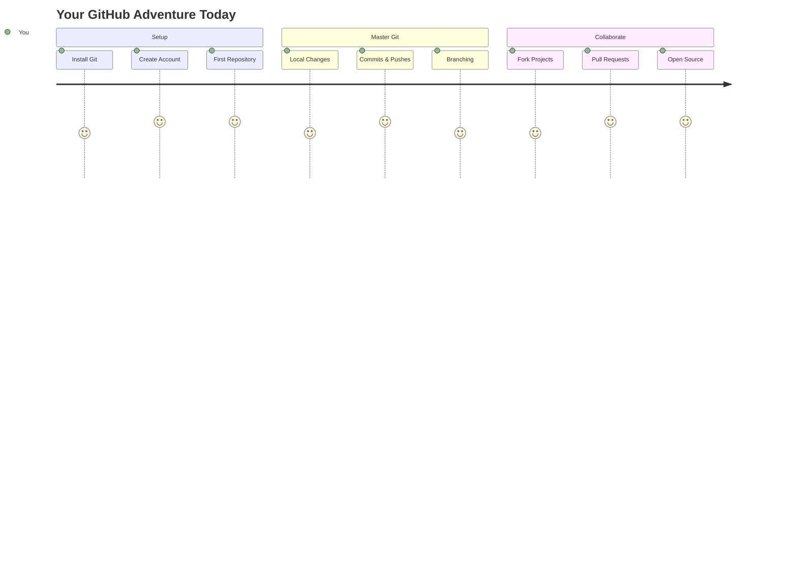
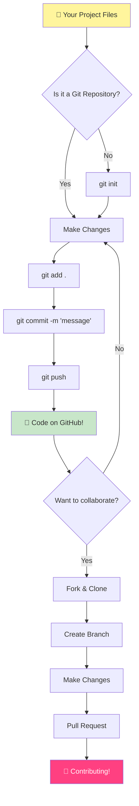
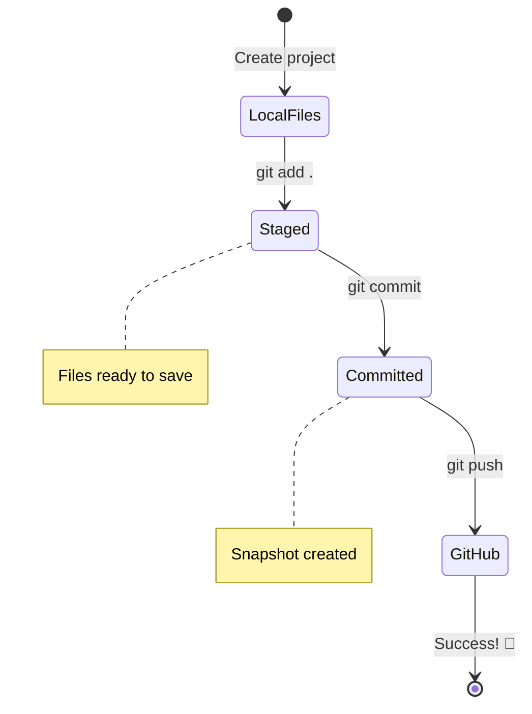
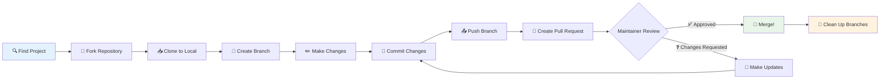
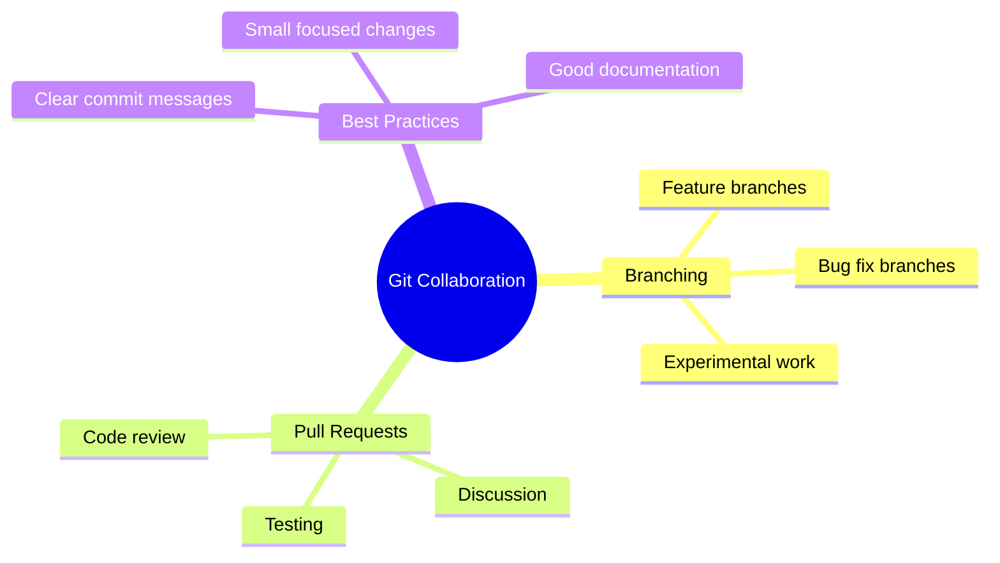
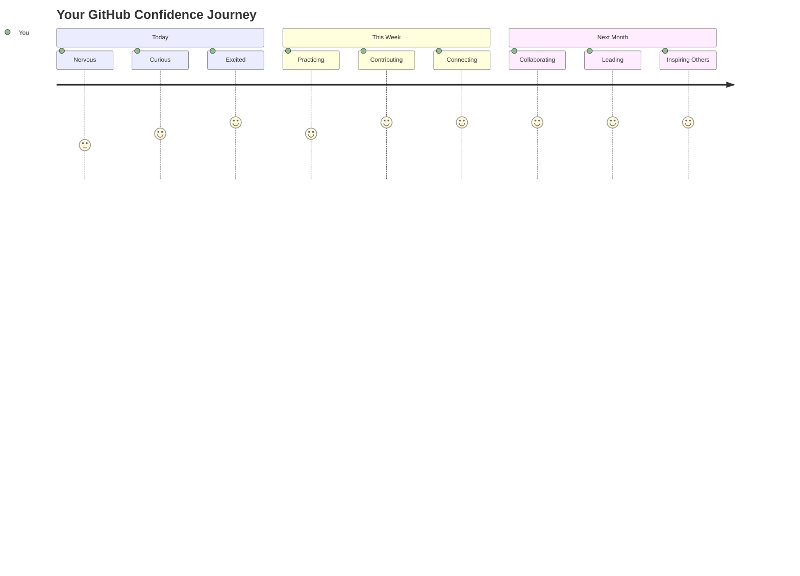

<!--
CO_OP_TRANSLATOR_METADATA:
{
  "original_hash": "0fe3ff66299b447f1c8cb34dcbf0c5ef",
  "translation_date": "2025-11-03T15:24:43+00:00",
  "source_file": "1-getting-started-lessons/2-github-basics/README.md",
  "language_code": "ne"
}
-->
# GitHub परिचय

नमस्ते, भविष्यका डेभलपर! 👋 संसारभरका लाखौं कोडरहरूसँग सामेल हुन तयार हुनुहुन्छ? म साँच्चै उत्साहित छु तपाईंलाई GitHub मा परिचय गराउन – यसलाई प्रोग्रामरहरूको लागि सामाजिक मिडिया प्लेटफर्मको रूपमा सोच्नुहोस्, तर यहाँ लन्चको फोटोहरू साझा गर्ने सट्टा, हामी कोड साझा गर्दैछौं र सँगै अद्भुत चीजहरू निर्माण गर्दैछौं!

यो कुरा साँच्चै मनमा पर्छ: तपाईंको फोनमा रहेको प्रत्येक एप, तपाईंले भ्रमण गर्ने प्रत्येक वेबसाइट, र तपाईंले प्रयोग गर्न सिक्ने अधिकांश उपकरणहरू विकासकर्ताहरूको टोलीले GitHub जस्ता प्लेटफर्महरूमा सहकार्य गरेर निर्माण गरेका हुन्। तपाईंलाई मनपर्ने संगीत एप? तपाईंजस्तै कसैले यसमा योगदान दिएको हो। त्यो खेल जसलाई तपाईं छोड्न सक्नुहुन्न? हो, सम्भवतः GitHub सहकार्यको साथ निर्माण गरिएको। र अब तपाईं त्यो अद्भुत समुदायको हिस्सा बन्न सिक्दै हुनुहुन्छ!

मलाई थाहा छ यो सुरुमा धेरै जस्तो लाग्न सक्छ – म पनि मेरो पहिलो GitHub पेजमा हेर्दै "यो सबैको अर्थ के हो?" भनेर सोच्दै थिएँ। तर कुरा के छ भने: प्रत्येक डेभलपर ठीक त्यही ठाउँबाट सुरु गरेका छन् जहाँ तपाईं अहिले हुनुहुन्छ। यो पाठको अन्त्यसम्ममा, तपाईंको आफ्नै GitHub रिपोजिटरी हुनेछ (यसलाई क्लाउडमा तपाईंको व्यक्तिगत परियोजना प्रदर्शनको रूपमा सोच्नुहोस्), र तपाईंले आफ्नो काम बचत गर्ने, अरूसँग साझा गर्ने, र लाखौं मानिसहरूले प्रयोग गर्ने परियोजनाहरूमा योगदान दिन सिक्नुहुनेछ।

हामी यो यात्रा सँगै गर्नेछौं, एक कदममा। कुनै हतार छैन, कुनै दबाब छैन – केवल तपाईं, म, र केही साँच्चै चिसो उपकरणहरू जुन तपाईंको नयाँ साथी बन्नेछन्!


> स्केच नोट [Tomomi Imura](https://twitter.com/girlie_mac) द्वारा



## प्रि-लेक्चर क्विज
[प्रि-लेक्चर क्विज](https://ff-quizzes.netlify.app)

## परिचय

रोचक कुराहरूमा डुब्नु अघि, तपाईंको कम्प्युटरलाई केही GitHub जादुका लागि तयार गरौं! यसलाई उत्कृष्ट कृति सिर्जना गर्नु अघि तपाईंको कला सामग्रीहरू व्यवस्थित गर्ने जस्तै सोच्नुहोस् – सही उपकरणहरू तयार हुँदा सबै कुरा धेरै सहज र रमाइलो हुन्छ।

म तपाईंलाई प्रत्येक सेटअप चरण व्यक्तिगत रूपमा मार्गदर्शन गर्नेछु, र म वाचा गर्छु कि यो सुरुमा जति डर लाग्दो देखिन्छ त्यति छैन। यदि केही कुरा तुरुन्तै क्लिक गर्दैन भने, त्यो पूर्ण रूपमा सामान्य हो! मैले मेरो पहिलो विकास वातावरण सेटअप गर्दा प्राचीन हाइरोग्लिफिक्स पढ्न खोजिरहेको जस्तो महसुस गरेको थिएँ। प्रत्येक डेभलपर ठीक त्यही ठाउँमा छन् जहाँ तपाईं अहिले हुनुहुन्छ, सोच्दै कि उनीहरूले यो सही गरिरहेका छन् कि छैनन्। स्पोइलर अलर्ट: यदि तपाईं यहाँ सिक्दै हुनुहुन्छ भने, तपाईं पहिले नै सही गरिरहनुभएको छ! 🌟

यस पाठमा, हामी कभर गर्नेछौं:

- तपाईंले आफ्नो मेसिनमा गरेको काम ट्र्याक गर्ने
- अरूसँग परियोजनाहरूमा काम गर्ने
- ओपन सोर्स सफ्टवेयरमा योगदान कसरी गर्ने

### पूर्वापेक्षाहरू

तपाईंको कम्प्युटरलाई केही GitHub जादुका लागि तयार गरौं! चिन्ता नगर्नुहोस् – यो सेटअप तपाईंले केवल एक पटक गर्नुपर्ने कुरा हो, र त्यसपछि तपाईंको सम्पूर्ण कोडिङ यात्राको लागि तयार हुनुहुनेछ।

ठीक छ, आधारबाट सुरु गरौं! पहिलो, हामी जाँच गर्न आवश्यक छ कि Git पहिले नै तपाईंको कम्प्युटरमा छ कि छैन। Git मूलतः सुपर-स्मार्ट सहायक जस्तै हो जसले तपाईंको कोडमा तपाईंले गरेको प्रत्येक परिवर्तन सम्झन्छ – प्रत्येक दुई सेकेन्डमा हतारमा Ctrl+S हिट गर्ने भन्दा धेरै राम्रो (हामी सबै त्यहाँ पुगेका छौं!)।

Git पहिले नै स्थापना भएको छ कि छैन भनेर जाँच्नको लागि, तपाईंको टर्मिनलमा यो जादुई कमाण्ड टाइप गर्नुहोस्:
`git --version`

यदि Git त्यहाँ छैन भने, चिन्ता नगर्नुहोस्! [Git डाउनलोड गर्नुहोस्](https://git-scm.com/downloads) मा जानुहोस् र यसलाई प्राप्त गर्नुहोस्। एकपटक तपाईंले यसलाई स्थापना गर्नुभयो भने, हामीले Git लाई तपाईंलाई ठीकसँग परिचय गराउन आवश्यक छ:

> 💡 **पहिलो पटक सेटअप**: यी कमाण्डहरूले Git लाई तपाईं को हुनुहुन्छ भनेर बताउँछन्। यो जानकारी तपाईंले गर्ने प्रत्येक कमिटमा संलग्न हुनेछ, त्यसैले सार्वजनिक रूपमा साझा गर्न सहज नाम र इमेल चयन गर्नुहोस्।

```bash
git config --global user.name "your-name"
git config --global user.email "your-email"
```

Git पहिले नै कन्फिगर गरिएको छ कि छैन भनेर जाँच गर्न तपाईं टाइप गर्न सक्नुहुन्छ:
```bash
git config --list
```

तपाईंलाई GitHub खाता, कोड एडिटर (जस्तै Visual Studio Code), र तपाईंको टर्मिनल खोल्न आवश्यक छ (वा: कमाण्ड प्रम्प्ट)।

[github.com](https://github.com/) मा जानुहोस् र खाता सिर्जना गर्नुहोस् यदि तपाईंले पहिले नै गर्नुभएको छैन भने, वा लग इन गरेर आफ्नो प्रोफाइल भर्नुहोस्।

💡 **आधुनिक सुझाव**: पासवर्ड बिना सजिलो प्रमाणीकरणको लागि [SSH keys](https://docs.github.com/en/authentication/connecting-to-github-with-ssh) सेटअप गर्ने वा [GitHub CLI](https://cli.github.com/) प्रयोग गर्ने विचार गर्नुहोस्।

✅ GitHub संसारको एकमात्र कोड रिपोजिटरी होइन; अरू पनि छन्, तर GitHub सबैभन्दा परिचित हो।

### तयारी

तपाईंलाई स्थानीय मेसिन (ल्यापटप वा पीसी) मा कोड परियोजनाको साथ एक फोल्डर, र GitHub मा सार्वजनिक रिपोजिटरी आवश्यक हुनेछ, जसले अरूको परियोजनामा योगदान कसरी गर्ने उदाहरणको रूपमा काम गर्नेछ।

### तपाईंको कोड सुरक्षित राख्नुहोस्

हामी एक क्षणको लागि सुरक्षा बारे कुरा गरौं – तर चिन्ता नगर्नुहोस्, हामी तपाईंलाई डराउने कुरा गर्दैनौं! यी सुरक्षा अभ्यासहरूलाई तपाईंको कार वा घर लक गर्ने जस्तै सोच्नुहोस्। यी सरल बानीहरू स्वाभाविक बन्छन् र तपाईंको कडा परिश्रमलाई सुरक्षित राख्छन्।

हामी तपाईंलाई GitHub सँग काम गर्ने आधुनिक, सुरक्षित तरिकाहरू देखाउनेछौं। यसरी, तपाईंले राम्रो बानीहरू विकास गर्नुहुनेछ जसले तपाईंको कोडिङ करियरभरि तपाईंलाई राम्रो सेवा दिनेछ।

GitHub सँग काम गर्दा, सुरक्षा उत्तम अभ्यासहरू पालना गर्नु महत्त्वपूर्ण छ:

| सुरक्षा क्षेत्र | उत्तम अभ्यास | किन यो महत्त्वपूर्ण छ |
|---------------|---------------|----------------|
| **प्रमाणीकरण** | SSH keys वा Personal Access Tokens प्रयोग गर्नुहोस् | पासवर्ड कम सुरक्षित छन् र चरणबद्ध रूपमा हटाइँदैछन् |
| **दुई-फ्याक्टर प्रमाणीकरण** | तपाईंको GitHub खातामा 2FA सक्षम गर्नुहोस् | खाताको सुरक्षा थप तह थप्छ |
| **रिपोजिटरी सुरक्षा** | संवेदनशील जानकारी कहिल्यै कमिट नगर्नुहोस् | API keys र पासवर्डहरू सार्वजनिक रिपोजमा कहिल्यै हुनु हुँदैन |
| **निर्भरता व्यवस्थापन** | Dependabot अपडेटहरूको लागि सक्षम गर्नुहोस् | तपाईंको निर्भरतालाई सुरक्षित र अद्यावधिक राख्छ |

> ⚠️ **महत्त्वपूर्ण सुरक्षा सम्झना**: API keys, पासवर्डहरू, वा अन्य संवेदनशील जानकारी कुनै पनि रिपोजिटरीमा कहिल्यै कमिट नगर्नुहोस्। संवेदनशील डाटालाई सुरक्षित गर्न environment variables र `.gitignore` फाइलहरू प्रयोग गर्नुहोस्।

**आधुनिक प्रमाणीकरण सेटअप:**

```bash
# Generate SSH key (modern ed25519 algorithm)
ssh-keygen -t ed25519 -C "your_email@example.com"

# Set up Git to use SSH
git remote set-url origin git@github.com:username/repository.git
```

> 💡 **प्रो टिप**: SSH keys ले बारम्बार पासवर्ड प्रविष्ट गर्न आवश्यकतालाई हटाउँछ र परम्परागत प्रमाणीकरण विधिहरू भन्दा सुरक्षित हुन्छ।

---

## तपाईंको कोडलाई प्रो जस्तै व्यवस्थापन गर्नुहोस्

ठीक छ, अब कुरा साँच्चै रोमाञ्चक हुँदैछ! 🎉 हामी तपाईंको कोडलाई प्रोहरू जस्तै ट्र्याक र व्यवस्थापन गर्ने तरिका सिक्दैछौं, र इमानदारीपूर्वक, यो मेरो मनपर्ने कुरा हो किनभने यो पूर्ण रूपमा गेम-चेंजर हो।

कल्पना गर्नुहोस्: तपाईं एक अद्भुत कथा लेख्दै हुनुहुन्छ, र तपाईं प्रत्येक ड्राफ्ट, प्रत्येक उत्कृष्ट सम्पादन, र प्रत्येक "पर्खनुहोस्, यो प्रतिभा हो!" क्षणलाई ट्र्याक गर्न चाहनुहुन्छ। यही कुरा Git तपाईंको कोडको लागि गर्छ! यो सबै कुरा सम्झने सबैभन्दा अविश्वसनीय समय-यात्रा नोटबुक जस्तै हो – प्रत्येक कीस्ट्रोक, प्रत्येक परिवर्तन, प्रत्येक "ओह, यसले सबै कुरा बिगार्यो" क्षण जुन तपाईं तुरुन्तै पूर्ववत गर्न सक्नुहुन्छ।

म इमान्दारीपूर्वक भन्न सक्छु – यो सुरुमा भारी लाग्न सक्छ। जब मैले सुरु गरे, मैले सोचेँ "किन म केवल मेरो फाइलहरू सामान्य रूपमा बचत गर्न सक्दिन?" तर यसमा विश्वास गर्नुहोस्: एकपटक Git तपाईंलाई क्लिक गरेपछि (र यो हुनेछ!), तपाईंको एउटा प्रकाश बल क्षण हुनेछ जहाँ तपाईं सोच्नुहुन्छ "मैले यस बिना कहिल्यै कोड कसरी गरे?" यो जस्तै हो जब तपाईं हिँड्दै आफ्नो जीवन बिताएपछि उड्न सक्नुहुन्छ!

मानौं तपाईंको स्थानीय रूपमा कोड परियोजनाको साथ एक फोल्डर छ र तपाईं git - संस्करण नियन्त्रण प्रणाली प्रयोग गरेर आफ्नो प्रगति ट्र्याक गर्न चाहनुहुन्छ। केही मानिसहरूले git प्रयोग गर्न भविष्यको आफ्नै लागि प्रेम पत्र लेख्नको रूपमा तुलना गर्छन्। तपाईंको कमिट सन्देशहरू दिनहरू वा हप्ताहरू वा महिनाहरू पछि पढ्दा तपाईंले किन निर्णय गर्नुभयो भनेर सम्झन सक्नुहुन्छ, वा परिवर्तन "रोलब्याक" गर्न सक्नुहुन्छ – त्यो हो, जब तपाईंले राम्रो "कमिट सन्देशहरू" लेख्नुहुन्छ।



### कार्य: तपाईंको पहिलो रिपोजिटरी सिर्जना गर्नुहोस्!

> 🎯 **तपाईंको मिशन (र म तपाईंको लागि धेरै उत्साहित छु!)**: हामी सँगै तपाईंको पहिलो GitHub रिपोजिटरी सिर्जना गर्नेछौं! यहाँ समाप्त भएपछि, तपाईंको कोड बस्ने इन्टरनेटको आफ्नै सानो कुनो हुनेछ, र तपाईंले आफ्नो पहिलो "कमिट" (यो डेभलपरको भाषामा तपाईंको कामलाई साँच्चै स्मार्ट तरिकाले बचत गर्ने) गर्नुभएको हुनेछ।
>
> यो साँच्चै यस्तो विशेष क्षण हो – तपाईं आधिकारिक रूपमा विकासकर्ताहरूको विश्वव्यापी समुदायमा सामेल हुन लाग्नुभएको छ! मैले मेरो पहिलो रिपो सिर्जना गर्दा र "वाह, म साँच्चै यो गर्दैछु!" भनेर सोच्दा आएको रोमाञ्चकता अझै सम्झन्छु।

हामी यो साहसिक यात्रा सँगै गर्नेछौं, चरणबद्ध रूपमा। प्रत्येक भागमा आफ्नो समय लिनुहोस् – हतारको लागि कुनै पुरस्कार छैन, र म वाचा गर्छु कि प्रत्येक चरणले अर्थ राख्नेछ। सम्झनुहोस्, तपाईंले प्रशंसा गर्ने प्रत्येक कोडिङ सुपरस्टार एकपटक ठीक त्यही ठाउँमा थिए जहाँ तपाईं हुनुहुन्छ, आफ्नो पहिलो रिपोजिटरी सिर्जना गर्न लागेका। यो कति चिसो छ?

> भिडियो हेर्नुहोस्
> 
> [](https://www.youtube.com/watch?v=9R31OUPpxU4)

**सँगै गरौं:**

1. **GitHub मा आफ्नो रिपोजिटरी सिर्जना गर्नुहोस्**। GitHub.com मा जानुहोस् र त्यो चम्किलो हरियो **New** बटन (वा माथि दायाँ कुनामा **+** चिन्ह) खोज्नुहोस्। यसलाई क्लिक गर्नुहोस् र **New repository** चयन गर्नुहोस्।

   यहाँ के गर्ने:
   1. तपाईंको रिपोजिटरीलाई नाम दिनुहोस् – यसलाई तपाईंको लागि अर्थपूर्ण बनाउनुहोस्!
   1. चाहनुहुन्छ भने विवरण थप्नुहोस् (यसले अरूलाई तपाईंको परियोजना के बारेमा हो भनेर बुझ्न मद्दत गर्दछ)
   1. तपाईं यसलाई सार्वजनिक (सबैले देख्न सक्छन्) वा निजी (केवल तपाईंको लागि) बनाउन चाहनुहुन्छ कि निर्णय गर्नुहोस्
   1. म सिफारिस गर्छु कि README फाइल थप्नको लागि बक्स जाँच गर्नुहोस् – यो तपाईंको परियोजनाको अगाडिको पृष्ठ जस्तै हो
   1. **Create repository** क्लिक गर्नुहोस् र उत्सव मनाउनुहोस् – तपाईंले आफ्नो पहिलो रिपो सिर्जना गर्नुभयो! 🎉

2. **तपाईंको परियोजना फोल्डरमा जानुहोस्**। अब हामी तपाईंको टर्मिनल खोलौं (चिन्ता नगर्नुहोस्, यो देखिए जस्तो डर लाग्दो छैन!)। हामीले तपाईंको कम्प्युटरलाई तपाईंको परियोजना फाइलहरू कहाँ छन् भनेर बताउन आवश्यक छ। यो कमाण्ड टाइप गर्नुहोस्:

   ```bash
   cd [name of your folder]
   ```

   **यहाँ हामी के गर्दैछौं:**
   - हामी मूलतः "हे कम्प्युटर, मलाई मेरो परियोजना फोल्डरमा लैजाऊ" भनिरहेका छौं
   - यो तपाईंको डेस्कटपमा विशिष्ट फोल्डर खोल्ने जस्तै हो, तर हामी यसलाई टेक्स्ट कमाण्डहरूसँग गर्दैछौं
   - `[name of your folder]` लाई तपाईंको परियोजना फोल्डरको वास्तविक नामले प्रतिस्थापन गर्नुहोस्

3. **तपाईंको फोल्डरलाई Git रिपोजिटरीमा परिवर्तन गर्नुहोस्**। यहाँ जादु हुन्छ! टाइप गर्नुहोस्:

   ```bash
   git init
   ```

   **यहाँ के भयो (साँच्चै चिसो कुरा!):**
   - Git ले तपाईंको परियोजनामा ​​लुकेको `.git` फोल्डर सिर्जना गर्यो – तपाईंले यो देख्नुहुनेछैन, तर यो त्यहाँ छ!
   - तपाईंको नियमित फोल्डर अब "रिपोजिटरी" हो जसले तपाईंले गरेको प्रत्येक परिवर्तन ट्र्याक गर्न सक्छ
   - यसलाई तपाईंको फोल्डरलाई सबै कुरा सम्झन सुपरपावर दिने जस्तै सोच्नुहोस्

4. **के भइरहेको छ जाँच गर्नुहोस्**। अहिले Git ले तपाईंको परियोजनाबारे के सोचिरहेको छ हेर्नुहोस्:

   ```bash
   git status
   ```

   **Git तपाईंलाई के बताउँदैछ बुझ्दै:**
   
   तपाईंले यस्तो देख्न सक्नुहुन्छ:

   ```output
   Changes not staged for commit:
   (use "git add <file>..." to update what will be committed)
   (use "git restore <file>..." to discard changes in working directory)

        modified:   file.txt
        modified:   file2.txt
   ```

   **प्यानिक नगर्नुहोस्! यसको अर्थ के हो:**
   - **रातो** मा फाइलहरू फाइलहरू हुन् जसमा परिवर्तनहरू छन् तर बचत गर्न तयार छैनन्
   - **हरियो** मा फाइलहरू (जब तपाईंले देख्नुहुन्छ) बचत गर्न तयार छन्
   - Git तपाईंलाई अगाडि के गर्न सकिन्छ भनेर ठीकसँग बताउँदैछ

   > 💡 **प्रो टिप**: `git status` कमाण्ड तपाईंको सबैभन्दा राम्रो साथी हो! तपाईंलाई के भइरहेको छ भनेर थाहा छैन भने यो प्रयोग गर्नुहोस्। यो जस्तै हो कि Git लाई सोध्दै "हे, अहिले स्थिति के हो?"

5. **तपाईंको फाइलहरू बचत गर्न तयार गर्नुहोस्** (यसलाई "स्टेजिङ" भनिन्छ):

   ```bash
   git add .
   ```

   **हामीले के गर्यौं:**
   - हामीले Git लाई "हे, म मेरो फोल्डरका सबै फाइलहरूलाई अर्को बचतमा समावेश गर्न चाहन्छु" भनेका छौं
   - `.` जस्तै हो "यस फोल्डरमा सबै कुरा"
   - अब तपाईंको फाइलहरू "स्टेज गरिएको" छन् र अर्को चरणको लागि तयार छन्

   **अझ चयनात्मक हुन चाहनुहुन्छ?** तपाईं केवल विशिष्ट फाइलहरू थप्न सक्नुहुन्छ:

   ```bash
   git add [file or folder name]
   ```

   **किन तपाईं यसो गर्न चाहनुहुन्छ?**
   - कहिलेकाहीं तपाईं सम्बन्धित परिवर्तनहरू सँगै बचत गर्न चाहनुहुन्छ
   - यसले तपाईंलाई तपाईंको कामलाई तार्किक टुक्रामा व्यवस्थित गर्न मद्दत गर्दछ
   - के परिवर्तन भयो र कहिले भनेर बुझ्न सजिलो बनाउँछ

   **तपाईंको विचार परिवर्तन भयो?** चिन्ता नगर्नुहोस्! तपाईं फाइलहरूलाई यसरी अनस्टेज गर्न सक्नुहुन्छ:

   ```bash
   # Unstage everything
   git reset
   
   # Unstage just one file
   git reset [file name]
   ```

   चिन्ता नगर्नुहोस् – यसले तपाईंको काम मेटाउँदैन, यसले केवल फाइलहरूलाई "बचत गर्न तयार" थुप्रोबाट हटाउँछ।

6. **तपाईंको काम स्थायी रूपमा बचत गर्नुहोस्** (तपाईंको पहिलो कमिट बनाउँदै!):

   ```bash
   git commit -m "first commit"
   ```

   **🎉 बधाई छ! तपाईंले आफ्नो पहिलो कमिट गर्नुभयो!**
   
   **यहाँ के भयो:**
   - Git ले तपाईंको स्टेज गरिएको सबै फाइलहरूको "स्न्यापशट" यस सटीक क्षणमा लियो
   - तपाईंको कमिट सन्देश "पहिलो कमिट" ले यो बचत बिन्दु के बारेमा हो भनेर व्याख्या गर्दछ
   - Git ले यस स्न्यापशटलाई एक अद्वितीय ID दियो ताकि तपाईंले यसलाई पछि सधैं फेला पार्न सक्नुहुन्छ
   - तपाईंले आधिकारिक रूपमा तपाईंको परियोजनाको इतिहास ट्र्याक गर्न सुरु गर्नुभएको छ!

   > 💡 **भविष्यका कमिट सन्देशहरू**: तपाईंको अर्को कमिटहरूको लागि, अझ वर्णनात्मक बनाउनुहोस्! "अपडेट गरिएको सामान" सट्टा, "होमपेजमा सम्पर्क फारम थप्नुहोस्" वा "नेभिगेसन मेनु बग ठीक गर्नुहोस्" प्रयास गर्नुहोस्। तपाईंको भविष्यको स्वयम् तपाईंलाई धन्यवाद दिनेछ!

7. **तपाईंको स्थानीय परियोजनालाई GitHub सँग जडान गर्नुहोस्**। अहिले, तपाईंको परियोजना केवल तपाईंको कम्प्युटर
**हामीले के गर्यौं:**
- तपाईंको स्थानीय प्रोजेक्ट र GitHub रिपोजिटरी बीच कनेक्शन बनायौं
- "Origin" भनेको तपाईंको GitHub रिपोजिटरीको उपनाम हो – यो तपाईंको फोनमा सम्पर्क थप्ने जस्तै हो
- अब तपाईंको स्थानीय Git लाई थाहा छ कि तपाईंको कोड कहिले र कहाँ पठाउनुपर्छ

💡 **सजिलो तरिका**: यदि तपाईंले GitHub CLI स्थापना गर्नुभएको छ भने, तपाईंले यो एक आदेशमा गर्न सक्नुहुन्छ:
   ```bash
   gh repo create my-repo --public --push --source=.
   ```

8. **तपाईंको कोड GitHub मा पठाउनुहोस्** (ठूलो क्षण!):

   ```bash
   git push -u origin main
   ```

**🚀 यही हो! तपाईं आफ्नो कोड GitHub मा अपलोड गर्दै हुनुहुन्छ!**

**के भइरहेको छ:**
- तपाईंको commits तपाईंको कम्प्युटरबाट GitHub मा यात्रा गर्दैछन्
- `-u` फ्ल्यागले स्थायी कनेक्शन सेटअप गर्छ ताकि भविष्यमा push गर्न सजिलो होस्
- "main" भनेको तपाईंको प्राथमिक शाखाको नाम हो (मुख्य फोल्डर जस्तै)
- यसपछि, तपाईं भविष्यका अपलोडहरूको लागि केवल `git push` टाइप गर्न सक्नुहुन्छ!

💡 **छोटो नोट**: यदि तपाईंको शाखाको नाम "master" जस्तै केही हो भने, त्यो नाम प्रयोग गर्नुहोस्। तपाईं `git branch --show-current` प्रयोग गरेर जाँच गर्न सक्नुहुन्छ।

9. **तपाईंको नयाँ दैनिक कोडिङ ताल** (यो लत लाग्ने ठाउँ हो!):

अबदेखि, जब तपाईं आफ्नो प्रोजेक्टमा परिवर्तन गर्नुहुन्छ, तपाईंले यो सरल तीन-चरणको नृत्य गर्न सक्नुहुन्छ:

   ```bash
   git add .
   git commit -m "describe what you changed"
   git push
   ```

**यो तपाईंको कोडिङको धड्कन बन्छ:**
- आफ्नो कोडमा केही अद्भुत परिवर्तन गर्नुहोस् ✨
- `git add` प्रयोग गरेर stage गर्नुहोस् ("हे Git, यी परिवर्तनहरूमा ध्यान दिनुहोस्!")
- `git commit` र वर्णनात्मक सन्देशको साथ save गर्नुहोस् (भविष्यको तपाईंलाई धन्यवाद!)
- `git push` प्रयोग गरेर संसारसँग share गर्नुहोस् 🚀
- दोहोर्याउनुहोस् – गम्भीर रूपमा, यो सास फेर्ने जस्तै प्राकृतिक बन्छ!

म यो workflow मन पराउँछु किनभने यो भिडियो गेममा धेरै save points भएको जस्तै हो। तपाईंले मन पराएको परिवर्तन गर्नुभयो? Commit गर्नुहोस्! केही जोखिमपूर्ण प्रयास गर्न चाहनुहुन्छ? कुनै समस्या छैन – यदि चीजहरू गलत भए भने तपाईं सधैं आफ्नो अन्तिम commit मा फर्कन सक्नुहुन्छ!

> 💡 **Tip**: तपाईंले `.gitignore` फाइल अपनाउन चाहनुहुन्छ जसले तपाईं GitHub मा track गर्न नचाहेको फाइलहरू रोक्छ - जस्तै त्यो नोट्स फाइल जुन तपाईंले त्यही फोल्डरमा राख्नुहुन्छ तर सार्वजनिक रिपोजिटरीमा कुनै स्थान छैन। तपाईं [.gitignore templates](https://github.com/github/gitignore) मा टेम्प्लेटहरू पाउन सक्नुहुन्छ वा [gitignore.io](https://www.toptal.com/developers/gitignore) प्रयोग गरेर एउटा बनाउन सक्नुहुन्छ।

### 🧠 **पहिलो रिपोजिटरी चेक-इन: कस्तो लाग्यो?**

**एक क्षणको लागि उत्सव मनाउनुहोस् र विचार गर्नुहोस्:**
- पहिलो पटक तपाईंको कोड GitHub मा देख्दा कस्तो लाग्यो?
- कुन चरण सबैभन्दा भ्रमित लाग्यो, र कुन चरण आश्चर्यजनक रूपमा सजिलो लाग्यो?
- तपाईं आफ्नो शब्दमा `git add`, `git commit`, र `git push` बीचको भिन्नता व्याख्या गर्न सक्नुहुन्छ?



> **स्मरण गर्नुहोस्**: अनुभवी विकासकर्ताहरूले पनि कहिलेकाहीं ठ्याक्कै आदेशहरू बिर्सन्छन्। यो workflow मांसपेशी स्मृति बन्न अभ्यास चाहिन्छ - तपाईं राम्रो गर्दै हुनुहुन्छ!

#### आधुनिक Git workflow

यी आधुनिक अभ्यासहरू अपनाउने विचार गर्नुहोस्:

- **Conventional Commits**: `feat:`, `fix:`, `docs:` जस्ता मानकीकृत commit सन्देश ढाँचा प्रयोग गर्नुहोस्। [conventionalcommits.org](https://www.conventionalcommits.org/) मा थप जान्नुहोस्।
- **Atomic commits**: प्रत्येक commit लाई एकल तार्किक परिवर्तनको प्रतिनिधित्व गराउनुहोस्।
- **Frequent commits**: ठूला, कम बारम्बार हुने commits को सट्टा वर्णनात्मक सन्देशहरू सहित बारम्बार commit गर्नुहोस्।

#### Commit सन्देशहरू

एक उत्कृष्ट Git commit विषय लाइनले निम्न वाक्य पूरा गर्छ:
यदि लागू गरियो भने, यो commit <तपाईंको विषय लाइन यहाँ>

विषयको लागि imperative, present tense प्रयोग गर्नुहोस्: "change" होइन "changed" वा "changes"। 
विषयमा जस्तै, body (वैकल्पिक) मा पनि imperative, present tense प्रयोग गर्नुहोस्। body ले परिवर्तनको प्रेरणा समावेश गर्नुपर्छ र यसलाई अघिल्लो व्यवहारसँग तुलना गर्नुपर्छ। तपाईं `किन` व्याख्या गर्दै हुनुहुन्छ, `कसरी` होइन।

✅ केही समय GitHub वरिपरि सर्फ गर्न लिनुहोस्। के तपाईं साँच्चै उत्कृष्ट commit सन्देश पाउन सक्नुहुन्छ? के तपाईं साँच्चै न्यूनतम commit सन्देश पाउन सक्नुहुन्छ? commit सन्देशमा कुन जानकारी सबैभन्दा महत्त्वपूर्ण र उपयोगी छ भन्ने तपाईंलाई के लाग्छ?

## अरूसँग काम गर्ने (मजाको भाग!)

तपाईंको टोपी समात्नुहोस् किनभने यो GitHub बिल्कुल जादुई बन्ने ठाउँ हो! 🪄 तपाईंले आफ्नो कोड व्यवस्थापन गर्न सिक्नुभयो, तर अब हामी मेरो सबैभन्दा मनपर्ने भागमा डुब्न जाँदैछौं – संसारभरका अद्भुत व्यक्तिहरूसँग सहकार्य।

यो कल्पना गर्नुहोस्: तपाईं भोलि बिहान उठ्नुहुन्छ र देख्नुहुन्छ कि टोकियोमा कसैले तपाईंको कोड सुधार गरेको छ जब तपाईं सुतिरहनुभएको थियो। त्यसपछि बर्लिनमा कसैले तपाईंलाई अड्किएको बग ठीक गर्छ। दिउँसोसम्म, साओ पाउलोमा एक विकासकर्ताले तपाईंले कहिल्यै सोच्न नसकेको सुविधा थप्छ। यो विज्ञान कल्पना होइन – यो GitHub ब्रह्माण्डमा सामान्य मंगलवार हो!

मलाई साँच्चै उत्साहित बनाउने कुरा के हो भने तपाईंले सिक्न लागेको सहकार्य कौशल? यी EXACT workflow हरू हुन् जुन Google, Microsoft, र तपाईंको मनपर्ने स्टार्टअपहरूका टोलीहरूले प्रत्येक दिन प्रयोग गर्छन्। तपाईं केवल एक चिसो उपकरण सिक्दै हुनुहुन्न – तपाईं सम्पूर्ण सफ्टवेयर संसारलाई सँगै काम गर्न बनाउने गोप्य भाषा सिक्दै हुनुहुन्छ।

गम्भीर रूपमा, जब तपाईंले कसैले तपाईंको पहिलो pull request merge गरेको अनुभव गर्नुहुन्छ, तपाईंले बुझ्नुहुनेछ किन विकासकर्ताहरू खुला स्रोतको बारेमा यति भावुक हुन्छन्। यो संसारको सबैभन्दा ठूलो, सबैभन्दा रचनात्मक टोली परियोजनाको हिस्सा भएको जस्तै हो!

> भिडियो हेर्नुहोस्
>
> [](https://www.youtube.com/watch?v=bFCM-PC3cu8)

GitHub मा चीजहरू राख्ने मुख्य कारण भनेको अन्य विकासकर्ताहरूसँग सहकार्य गर्न सम्भव बनाउनु हो।



तपाईंको रिपोजिटरीमा, `Insights > Community` मा नेभिगेट गर्नुहोस् ताकि तपाईंको प्रोजेक्ट सिफारिस गरिएको समुदाय मापदण्डहरूसँग कसरी तुलना हुन्छ हेर्न सक्नुहुन्छ।

तपाईंको रिपोजिटरीलाई व्यावसायिक र स्वागतयोग्य देखाउन चाहनुहुन्छ? तपाईंको रिपोजिटरीमा जानुहोस् र `Insights > Community` क्लिक गर्नुहोस्। यो चिसो सुविधा तपाईंको प्रोजेक्ट GitHub समुदायले "राम्रो रिपोजिटरी अभ्यास" मान्ने कुरासँग कसरी तुलना हुन्छ भनेर देखाउँछ।

> 🎯 **तपाईंको प्रोजेक्टलाई चम्काउनुहोस्**: राम्रो दस्तावेजीकरण भएको राम्रोसँग व्यवस्थित रिपोजिटरी सफा, स्वागतयोग्य स्टोरफ्रन्ट भएको जस्तै हो। यसले मानिसहरूलाई तपाईंको कामको हेरचाह गर्छ र अरूलाई योगदान गर्न चाहना बनाउँछ!

**रिपोजिटरीलाई उत्कृष्ट बनाउने कुरा:**

| के थप्ने | किन यो महत्त्वपूर्ण छ | यसले तपाईंको लागि के गर्छ |
|-------------|-------------------|---------------------|
| **Description** | पहिलो प्रभाव महत्त्वपूर्ण छ! | मानिसहरूले तुरुन्तै तपाईंको प्रोजेक्ट के गर्छ थाहा पाउँछन् |
| **README** | तपाईंको प्रोजेक्टको अगाडिको पृष्ठ | नयाँ आगन्तुकहरूको लागि जस्तै मैत्रीपूर्ण टुर गाइड |
| **Contributing Guidelines** | तपाईं सहयोग स्वागत गर्नुहुन्छ देखाउँछ | मानिसहरूले तपाईंलाई कसरी सहयोग गर्न सकिन्छ भन्ने कुरा थाहा पाउँछन् |
| **Code of Conduct** | मैत्रीपूर्ण स्थान सिर्जना गर्छ | सबैले सहभागी हुन स्वागत महसुस गर्छन् |
| **License** | कानूनी स्पष्टता | अरूले तपाईंको कोड कसरी प्रयोग गर्न सकिन्छ भन्ने कुरा थाहा पाउँछन् |
| **Security Policy** | तपाईं जिम्मेवार हुनुहुन्छ देखाउँछ | व्यावसायिक अभ्यासहरू प्रदर्शन गर्छ |

> 💡 **Pro Tip**: GitHub ले यी सबै फाइलहरूको लागि टेम्प्लेटहरू प्रदान गर्दछ। नयाँ रिपोजिटरी बनाउँदा, यी फाइलहरू स्वचालित रूपमा उत्पन्न गर्न बक्सहरू जाँच गर्नुहोस्।

**आधुनिक GitHub सुविधाहरू अन्वेषण गर्न:**

🤖 **स्वचालन र CI/CD:**
- **GitHub Actions** स्वचालित परीक्षण र परिनियोजनको लागि
- **Dependabot** स्वचालित निर्भरता अपडेटहरूको लागि

💬 **समुदाय र प्रोजेक्ट व्यवस्थापन:**
- **GitHub Discussions** मुद्दाहरू बाहिर समुदाय वार्तालापहरूको लागि
- **GitHub Projects** kanban-शैली प्रोजेक्ट व्यवस्थापनको लागि
- **Branch protection rules** कोड गुणस्तर मापदण्ड लागू गर्न

यी सबै स्रोतहरूले नयाँ टोली सदस्यहरूलाई onboard गर्न फाइदा पुर्‍याउँछन्। र ती सामान्यतया नयाँ योगदानकर्ताहरूले तपाईंको कोड हेर्नु अघि हेर्ने प्रकारका चीजहरू हुन्, यो पत्ता लगाउन कि तपाईंको प्रोजेक्ट उनीहरूको समय खर्च गर्नको लागि सही स्थान हो।

✅ README फाइलहरू, यद्यपि तिनीहरू तयार गर्न समय लाग्छ, अक्सर व्यस्त मर्मतकर्ताहरूले बेवास्ता गर्छन्। के तपाईं विशेष रूपमा वर्णनात्मक एक उदाहरण पाउन सक्नुहुन्छ? नोट: त्यहाँ केही [उपकरणहरू राम्रो README बनाउन मद्दत गर्न](https://www.makeareadme.com/) छन् जुन तपाईंले प्रयास गर्न चाहन सक्नुहुन्छ।

### कार्य: केही कोड मर्ज गर्नुहोस्

Contributing docs ले मानिसहरूलाई प्रोजेक्टमा योगदान गर्न मद्दत गर्छ। यसले तपाईंले खोजिरहेको योगदानको प्रकार र प्रक्रिया कसरी काम गर्छ भन्ने व्याख्या गर्छ। योगदानकर्ताहरूले GitHub मा तपाईंको रिपोजिटरीमा योगदान गर्न सक्षम हुन चरणहरूको श्रृंखला मार्फत जान आवश्यक छ:

1. **तपाईंको रिपोजिटरी fork गर्नुहोस्** तपाईंले सम्भवतः मानिसहरूलाई तपाईंको प्रोजेक्ट _fork_ गर्न चाहनुहुन्छ। Forking भनेको तपाईंको रिपोजिटरीको प्रतिलिपि उनीहरूको GitHub प्रोफाइलमा बनाउनु हो।
1. **Clone**। त्यहाँबाट उनीहरूले प्रोजेक्टलाई आफ्नो स्थानीय मेसिनमा clone गर्नेछन्।
1. **शाखा बनाउनुहोस्**। तपाईंले उनीहरूलाई आफ्नो कामको लागि _शाखा_ बनाउन सोध्न चाहनुहुन्छ।
1. **एक क्षेत्रमा परिवर्तन केन्द्रित गर्नुहोस्**। योगदानकर्ताहरूलाई एक पटकमा एक कुरामा आफ्नो योगदान केन्द्रित गर्न सोध्नुहोस् - यसले तपाईंले उनीहरूको काम _merge_ गर्ने सम्भावना उच्च बनाउँछ। कल्पना गर्नुहोस् उनीहरूले बग फिक्स लेख्छन्, नयाँ सुविधा थप्छन्, र धेरै परीक्षणहरू अपडेट गर्छन् - के हुन्छ यदि तपाईं ३ मध्ये २ वा ३ मध्ये १ परिवर्तन मात्र लागू गर्न चाहनुहुन्छ वा सक्नुहुन्छ?

✅ शाखाहरू लेख्न र राम्रो कोड पठाउन विशेष रूपमा महत्त्वपूर्ण हुने स्थिति कल्पना गर्नुहोस्। तपाईं के उपयोग केसहरू सोच्न सक्नुहुन्छ?

> नोट, तपाईं संसारमा देख्न चाहनुहुन्छ परिवर्तन हुनुहोस्, र आफ्नो कामको लागि शाखाहरू सिर्जना गर्नुहोस्। तपाईंले गर्ने कुनै पनि commits तपाईं हाल "checked out" शाखामा गरिनेछ। `git status` प्रयोग गरेर त्यो कुन शाखा हो हेर्नुहोस्।

आउनुहोस् एक योगदानकर्ता workflow मार्फत जानुहोस्। मानौं योगदानकर्ताले पहिले नै _forked_ र _cloned_ रिपोजिटरी गरिसकेका छन् ताकि उनीहरूसँग काम गर्न तयार Git repo छ, उनीहरूको स्थानीय मेसिनमा:

1. **शाखा बनाउनुहोस्**। `git branch` आदेश प्रयोग गरेर शाखा बनाउनुहोस् जसले उनीहरूले योगदान गर्न चाहेको परिवर्तनहरू समावेश गर्नेछ:

   ```bash
   git branch [branch-name]
   ```

   > 💡 **आधुनिक दृष्टिकोण**: तपाईं एक आदेशमा नयाँ शाखा सिर्जना र स्विच गर्न सक्नुहुन्छ:
   ```bash
   git switch -c [branch-name]
   ```

1. **काम गर्ने शाखामा स्विच गर्नुहोस्**। निर्दिष्ट शाखामा स्विच गर्नुहोस् र `git switch` प्रयोग गरेर कार्यरत निर्देशिका अपडेट गर्नुहोस्:

   ```bash
   git switch [branch-name]
   ```

   > 💡 **आधुनिक नोट**: शाखाहरू परिवर्तन गर्दा `git switch` `git checkout` को आधुनिक प्रतिस्थापन हो। यो स्पष्ट र सुरक्षात्मक छ।

1. **काम गर्नुहोस्**। यस बिन्दुमा तपाईंले आफ्नो परिवर्तनहरू थप्न चाहनुहुन्छ। Git लाई यसबारे भन्न नबिर्सनुहोस् निम्न आदेशहरू प्रयोग गरेर:

   ```bash
   git add .
   git commit -m "my changes"
   ```

   > ⚠️ **Commit सन्देशको गुणस्तर**: सुनिश्चित गर्नुहोस् तपाईंले आफ्नो commit लाई राम्रो नाम दिनुहुन्छ, तपाईंको लागि र तपाईंले मद्दत गरिरहेको रिपोजिटरीको मर्मतकर्ताको लागि। तपाईंले के परिवर्तन गर्नुभयो भन्ने बारेमा विशिष्ट हुनुहोस्!

1. **तपाईंको कामलाई `main` शाखासँग मिलाउनुहोस्**। कुनै बिन्दुमा तपाईं काम सक्नुहुन्छ र तपाईं आफ्नो कामलाई `main` शाखाको कामसँग मिलाउन चाहनुहुन्छ। `main` शाखा यस बीचमा परिवर्तन भएको हुन सक्छ त्यसैले सुनिश्चित गर्नुहोस् तपाईंले पहिले यसलाई निम्न आदेशहरू प्रयोग गरेर नवीनतममा अपडेट गर्नुहोस्:

   ```bash
   git switch main
   git pull
   ```

   यस बिन्दुमा तपाईं सुनिश्चित गर्न चाहनुहुन्छ कि कुनै पनि _conflicts_, स्थिति जहाँ Git सजिलै _combine_ परिवर्तनहरू गर्न सक्दैन, तपाईंको कार्यरत शाखामा हुन्छ। त्यसैले निम्न आदेशहरू चलाउनुहोस्:

   ```bash
   git switch [branch_name]
   git merge main
   ```

   `git merge main` आदेशले `main` बाट सबै परिवर्तनहरू तपाईंको शाखामा ल्याउनेछ। आशा छ तपाईं केवल जारी राख्न सक्नुहुन्छ। यदि छैन भने, VS Code ले तपाईंलाई बताउनेछ कि Git कहाँ _confused_ छ र तपाईंले प्रभावित फाइलहरू परिवर्तन गर्न सक्नुहुन्छ ताकि कुन सामग्री सबैभन्दा सही छ भन्ने कुरा भन्न सक्नुहुन्छ।

   💡 **आधुनिक विकल्प**: सफा इतिहासको लागि `git rebase` प्रयोग गर्ने विचार गर्नुहोस्:
   ```bash
   git rebase main
   ```
   यसले तपाईंको commits लाई नवीनतम main शाखाको शीर्षमा पुनः चलाउँछ, रेखीय इतिहास सिर्जना गर्दै।

1. **तपाईंको काम GitHub मा पठाउनुहोस्**। तपाईंको काम GitHub मा पठाउनु भनेको दुई कुरा हो। तपाईंको शाखालाई तपाईंको रिपोजिटरीमा push गर्नुहोस् र त्यसपछि PR, Pull Request खोल्नुहोस्।

   ```bash
   git push --set-upstream origin [branch-name]
   ```

   माथिको आदेशले तपाईंको forked रिपोजिटरीमा शाखा सिर्जना गर्दछ।

### 🤝 **सहकार्य कौशल जाँच: अरूसँग काम गर्न तयार?**

**आउनुहोस् हेर्नुहोस् कि तपाईं सहकार्यको बारेमा कस्तो महसुस गर्दै हुनुहुन्छ:**
- Forking र pull requests को विचार अब तपाईंलाई अर्थपूर्ण लाग्छ?
- शाखाहरूको साथ काम गर्ने बारे तपाईंले अभ्यास गर्न चाहनुभएको एक कुरा के हो?
- अरूको प्रोजेक्टमा योगदान गर्न तपाईं कति सहज महसुस गर्नुहुन्छ?



> **आत्मविश्वास बढाउने कुरा**: तपाईंले प्रशंसा गर्ने प्रत्येक विकासकर्ता एक पटक आफ्नो पहिलो pull request को बारेमा नर्भस थिए। GitHub समुदाय नयाँ आगन्तुकहरूलाई अत्यन्त स्वागतयोग्य छ!

1. **PR खोल्नुहोस्**। त्यसपछि, तपाईं PR खोल्न चाहनुहुन्छ। तपाईं GitHub मा forked रिपोजिटरीमा नेभिगेट गरेर यो गर्नुहुन्छ। GitHub मा तपाईंले नयाँ PR सिर्जना गर्न चाहनुहुन्छ कि भनेर संकेत देख्नुहुनेछ, तपाईंले त्यो क्लिक गर्नुहुन्छ र तपाईंलाई commit सन्देश शीर्षक परिवर्तन गर्न, यसलाई उपयुक्त वर्णन दिनको लागि इन्टरफेसमा लगिन्छ। अब तपाईंले fork गरेको रिपोजिटरीको मर्मतकर्ताले यो PR देख्नेछन् र _आशा छ_ उनीहरूले तपाईंको PR लाई सराहना गर्नेछन् र _merge_ गर्नेछन्। तपाईं अब योगदानकर्ता हुनुहुन्छ, बधाई छ :)

   💡 **आधुनिक टिप**: तपाईं GitHub CLI प्रयोग गरेर पनि PR सिर्जना गर्न सक्नुहुन्छ:
   ```bash
   gh pr create --title "Your PR title" --body "Description of changes"
   ```

   🔧 **PR को लागि उत्तम अभ्यासहरू**:
   - "Fixes #123" जस्ता कीवर्डहरू प्रयोग गरेर सम्बन्धित मुद्दाहरू लिंक गर्नुहोस्
   - UI परिवर्तनहरूको लागि screenshots थप्नुहोस्
   - विशिष्ट reviewers अनुरोध गर्नुहोस्
   - काम-प्रगति को लागि draft PRs प्रयोग गर्नुहोस्
   - समीक्षा अनुरोध गर्नु अघि सबै CI जाँचहरू पास सुनिश्चित गर्नुहोस्
1. **सफा गर्नुहोस्**। PR सफलतापूर्वक मर्ज गरेपछि आफ्नो स्थानीय शाखा र GitHub मा पठाइएको शाखा सफा गर्नु राम्रो अभ्यास मानिन्छ। पहिलो चरणमा, तलको आदेश प्रयोग गरेर स्थानीय शाखा मेटाउनुहोस्:

   ```bash
   git branch -d [branch-name]
   ```

   त्यसपछि GitHub मा फोर्क गरिएको रिपोजिटरीको पृष्ठमा जानुहोस् र तपाईंले पठाएको रिमोट शाखा हटाउनुहोस्।

`Pull request` शब्द अलि अचम्मको लाग्न सक्छ किनभने वास्तवमा तपाईं आफ्नो परिवर्तनहरू परियोजनामा धकेल्न चाहनुहुन्छ। तर परियोजनाको मालिक वा कोर टिमले तपाईंको परिवर्तनलाई परियोजनाको "मुख्य" शाखासँग मर्ज गर्नु अघि विचार गर्नुपर्छ, त्यसैले तपाईं वास्तवमा मर्मतकर्ताबाट परिवर्तनको निर्णयको अनुरोध गर्दै हुनुहुन्छ।

Pull request भनेको शाखामा गरिएको परिवर्तनहरूको तुलना र छलफल गर्ने ठाउँ हो, जहाँ समीक्षा, टिप्पणीहरू, एकीकृत परीक्षणहरू र अन्य धेरै कुराहरू समावेश हुन्छन्। राम्रो pull request ले लगभग commit message जस्तै नियमहरू पालना गर्दछ। तपाईं आफ्नो कामले कुनै समस्या समाधान गरेको छ भने, समस्या ट्र्याकरमा समस्या सन्दर्भ थप्न सक्नुहुन्छ। यो `#` पछि तपाईंको समस्याको नम्बर प्रयोग गरेर गरिन्छ। उदाहरणका लागि `#97`।

🤞 आशा गरौं कि सबै जाँच पास हुन्छन् र परियोजनाको मालिकहरूले तपाईंको परिवर्तनहरू परियोजनामा मर्ज गर्छन् 🤞

GitHub मा रहेको सम्बन्धित रिमोट शाखाबाट सबै नयाँ commits सहित आफ्नो हालको स्थानीय कार्य शाखा अपडेट गर्नुहोस्:

`git pull`

## ओपन सोर्समा योगदान गर्नुहोस् (तपाईंको प्रभाव पार्ने मौका!)

के तपाईं केही यस्तो कुरा गर्न तयार हुनुहुन्छ जसले तपाईंलाई पूर्ण रूपमा चकित पार्नेछ? 🤯 आउनुहोस्, ओपन सोर्स परियोजनाहरूमा योगदान गर्ने बारे कुरा गरौं – र म यो तपाईंलाई साझा गर्न पाउँदा उत्साहित छु!

यो तपाईंको असाधारण कुराको हिस्सा बन्ने मौका हो। कल्पना गर्नुहोस्, लाखौं विकासकर्ताहरूले दैनिक रूपमा प्रयोग गर्ने उपकरणहरू सुधार गर्नुहोस्, वा तपाईंको साथीहरूले मन पराउने एपमा बग समाधान गर्नुहोस्। यो केवल सपना मात्र होइन – यो नै ओपन सोर्स योगदानको सार हो!

यो सोच्दा मलाई सधैं रोमाञ्चक लाग्छ: तपाईंले सिक्दै गरेको प्रत्येक उपकरण – तपाईंको कोड एडिटर, हामीले अन्वेषण गर्ने फ्रेमवर्कहरू, यहाँसम्म कि तपाईंले यो पढ्दै गरेको ब्राउजर – कुनै समय तपाईं जस्तै कसैले आफ्नो पहिलो योगदान गरेको थियो। तपाईंको मनपर्ने VS Code एक्सटेन्सन बनाउने प्रतिभाशाली विकासकर्ता? उनी पनि कहिल्यै "create pull request" क्लिक गर्दा नर्भस भएका थिए, ठीक तपाईं जस्तै।

र यहाँ सबैभन्दा सुन्दर कुरा छ: ओपन सोर्स समुदाय इन्टरनेटको सबैभन्दा ठूलो समूहको जस्तो छ। धेरै परियोजनाहरू नयाँ व्यक्तिहरूको खोजीमा सक्रिय छन् र "good first issue" ट्याग गरिएको समस्याहरू विशेष रूपमा तपाईं जस्ता व्यक्तिहरूका लागि राखिएको छ! मर्मतकर्ताहरू नयाँ योगदानकर्ताहरू देख्दा वास्तवमै उत्साहित हुन्छन् किनभने उनीहरूले आफ्नै पहिलो कदम सम्झन्छन्।

```mermaid
flowchart TD
    A[🔍 Explore GitHub] --> B[🏷️ Find "good first issue"]
    B --> C[📖 Read Contributing Guidelines]
    C --> D[🍴 Fork Repository]
    D --> E[💻 Set Up Local Environment]
    E --> F[🌿 Create Feature Branch]
    F --> G[✨ Make Your Contribution]
    G --> H[🧪 Test Your Changes]
    H --> I[📝 Write Clear Commit]
    I --> J[📤 Push & Create PR]
    J --> K[💬 Engage with Feedback]
    K --> L[🎉 Merged! You're a Contributor!]
    L --> M[🌟 Find Next Issue]
    
    style A fill:#e1f5fe
    style L fill:#c8e6c9
    style M fill:#fff59d
```

तपाईं यहाँ केवल कोड सिक्दै हुनुहुन्न – तपाईं एक विश्वव्यापी निर्माणकर्ताहरूको परिवारमा सामेल हुन तयार हुँदै हुनुहुन्छ जो प्रत्येक दिन "डिजिटल संसारलाई अलिकति राम्रो कसरी बनाउन सकिन्छ?" भनेर सोच्दै उठ्छन्। क्लबमा स्वागत छ! 🌟

पहिलो चरणमा, GitHub मा तपाईंलाई चासो लाग्ने र परिवर्तन गर्न चाहनुभएको रिपोजिटरी (वा **repo**) खोज्नुहोस्। तपाईं यसको सामग्री आफ्नो मेसिनमा प्रतिलिपि गर्न चाहनुहुन्छ।

✅ 'सुरुवाती मैत्रीपूर्ण' रिपोजिटरीहरू खोज्नको लागि [ट्याग 'good-first-issue' द्वारा खोज्नुहोस्](https://github.blog/2020-01-22-browse-good-first-issues-to-start-contributing-to-open-source/)।


कोड प्रतिलिपि गर्ने धेरै तरिकाहरू छन्। एउटा तरिका भनेको HTTPS, SSH, वा GitHub CLI (Command Line Interface) प्रयोग गरेर रिपोजिटरीको सामग्री "क्लोन" गर्नु हो।

तपाईंको टर्मिनल खोल्नुहोस् र रिपोजिटरी यसरी क्लोन गर्नुहोस्:
```bash
# Using HTTPS
git clone https://github.com/ProjectURL

# Using SSH (requires SSH key setup)
git clone git@github.com:username/repository.git

# Using GitHub CLI
gh repo clone username/repository
```

परियोजनामा काम गर्न, सही फोल्डरमा स्विच गर्नुहोस्:
`cd ProjectURL`

तपाईं सम्पूर्ण परियोजना यसरी पनि खोल्न सक्नुहुन्छ:
- **[GitHub Codespaces](https://github.com/features/codespaces)** - ब्राउजरमा VS Code सहित GitHub को क्लाउड विकास वातावरण
- **[GitHub Desktop](https://desktop.github.com/)** - Git अपरेसनहरूको लागि GUI एप्लिकेसन  
- **[GitHub.dev](https://github.dev)** - कुनै पनि GitHub रिपोमा `.` कुञ्जी थिचेर ब्राउजरमा VS Code खोल्नुहोस्
- **VS Code** GitHub Pull Requests एक्सटेन्सन सहित

अन्तमा, तपाईं कोडलाई जिप गरिएको फोल्डरमा डाउनलोड गर्न सक्नुहुन्छ।

### GitHub का केही रोचक कुराहरू

तपाईं GitHub मा कुनै पनि सार्वजनिक रिपोजिटरीलाई स्टार, वाच र/वा "fork" गर्न सक्नुहुन्छ। तपाईंले स्टार गरेका रिपोजिटरीहरू शीर्ष-दायाँ ड्रप-डाउन मेनुमा फेला पार्न सक्नुहुन्छ। यो कोडको लागि बुकमार्क जस्तै हो।

परियोजनाहरूमा प्रायः GitHub मा "Issues" ट्याबमा समस्या ट्र्याकर हुन्छ, जहाँ परियोजनासँग सम्बन्धित समस्याहरूको बारेमा छलफल गरिन्छ। र Pull Requests ट्याबमा मानिसहरूले प्रगतिको क्रममा रहेका परिवर्तनहरूको बारेमा छलफल र समीक्षा गर्छन्।

परियोजनाहरूले फोरमहरू, मेलिङ सूचीहरू, वा Slack, Discord वा IRC जस्ता च्याट च्यानलहरूमा पनि छलफल गर्न सक्छ।

🔧 **आधुनिक GitHub सुविधाहरू**:
- **GitHub Discussions** - समुदाय वार्तालापहरूको लागि बिल्ट-इन फोरम
- **GitHub Sponsors** - मर्मतकर्ताहरूलाई आर्थिक रूपमा समर्थन गर्नुहोस्  
- **Security tab** - कमजोर रिपोर्टहरू र सुरक्षा सल्लाहहरू
- **Actions tab** - स्वचालित वर्कफ्लोहरू र CI/CD पाइपलाइनहरू हेर्नुहोस्
- **Insights tab** - योगदानकर्ताहरू, commits, र परियोजनाको स्वास्थ्यको बारेमा एनालिटिक्स
- **Projects tab** - GitHub को बिल्ट-इन परियोजना व्यवस्थापन उपकरणहरू

✅ आफ्नो नयाँ GitHub रिपोजिटरी वरिपरि हेर्नुहोस् र केही कुराहरू प्रयास गर्नुहोस्, जस्तै सेटिङहरू सम्पादन गर्नु, आफ्नो रिपोमा जानकारी थप्नु, परियोजना सिर्जना गर्नु (जस्तै Kanban बोर्ड), र स्वचालनको लागि GitHub Actions सेट गर्नुहोस्। तपाईं धेरै गर्न सक्नुहुन्छ!

---

## 🚀 चुनौती 

ठीक छ, अब तपाईंको नयाँ GitHub सुपरपावरहरू परीक्षण गर्ने समय हो! 🚀 यहाँ एक चुनौती छ जसले सबै कुरा सबैभन्दा सन्तोषजनक तरिकामा क्लिक गराउनेछ:

एउटा साथी (वा त्यो परिवारको सदस्य जो सधैं तपाईंको "कम्प्युटरको कुरा" के हो भनेर सोध्छ) समात्नुहोस् र सँगै एक सहयोगात्मक कोडिङ साहसिक कार्यमा जानुहोस्! यहीँ वास्तविक जादू हुन्छ – परियोजना सिर्जना गर्नुहोस्, उनीहरूलाई यसलाई फोर्क गर्न दिनुहोस्, केही शाखाहरू बनाउनुहोस्, र तपाईं बन्ने पेशेवरहरू जस्तै परिवर्तनहरू मर्ज गर्नुहोस्।

म झूट बोल्दिन – तपाईं शायद कुनै बिन्दुमा हाँस्नुहुनेछ (विशेष गरी जब तपाईं दुवैले एउटै लाइन परिवर्तन गर्न प्रयास गर्नुहुन्छ), शायद अलिकति भ्रमित हुनुहुनेछ, तर तपाईं निश्चित रूपमा ती अद्भुत "आहा!" क्षणहरू पाउनुहुनेछ जसले सबै सिकाइलाई सार्थक बनाउँछ। साथै, कसैसँग पहिलो सफल मर्ज साझा गर्ने कुरा विशेष छ – यो तपाईंले कति टाढा आइपुग्नुभएको छ भन्ने सानो उत्सव जस्तै हो!

अझै कोडिङ साथी छैन? कुनै चिन्ता छैन! GitHub समुदायमा धेरै स्वागत गर्ने मानिसहरू छन् जसले नयाँ भएको अनुभव सम्झन्छन्। "good first issue" लेबल भएका रिपोजिटरीहरू खोज्नुहोस् – तिनीहरूले मूलतः "हे नयाँ व्यक्तिहरू, हामीसँग सिक्न आउनुहोस्!" भनिरहेका छन्। यो कति राम्रो छ?

## पोस्ट-व्याख्यान क्विज
[पोस्ट-व्याख्यान क्विज](https://ff-quizzes.netlify.app/web/en/)

## समीक्षा गर्नुहोस् र सिक्न जारी राख्नुहोस्

वाह! 🎉 हेर्नुहोस् तपाईं – तपाईंले GitHub को आधारभूत कुराहरू एकदम च्याम्पियन जस्तै जित्नुभएको छ! यदि तपाईंको दिमाग अहिले अलिकति भरिएको जस्तो लाग्छ भने, त्यो पूर्ण रूपमा सामान्य हो र इमानदारीपूर्वक राम्रो संकेत हो। तपाईंले अहिले मात्र उपकरणहरू सिक्नुभएको छ जुन मैले सुरु गर्दा सहज महसुस गर्न हप्ताहरू लाग्यो।

Git र GitHub अविश्वसनीय रूपमा शक्तिशाली छन् (जस्तै, साँच्चै शक्तिशाली), र म चिनेका प्रत्येक विकासकर्ताले – जसले अहिले जादूगर जस्तो देखिन्छ – अभ्यास गर्नुपरेको थियो र यो सबै क्लिक गर्नु अघि अलिकति संघर्ष गर्नुपरेको थियो। तपाईंले यो पाठ पार गर्नुभएको तथ्यले तपाईंलाई विकासकर्ताको टूलकिटका केही सबैभन्दा महत्त्वपूर्ण उपकरणहरूमा महारत हासिल गर्नको लागि पहिले नै बाटोमा राखेको छ।

यहाँ अभ्यास गर्न र अझ बढी अद्भुत बन्न मद्दत गर्ने केही उत्कृष्ट स्रोतहरू छन्:

- [ओपन सोर्स सफ्टवेयरमा योगदान गर्ने मार्गदर्शन](https://opensource.guide/how-to-contribute/#how-to-submit-a-contribution) – फरक पार्ने तपाईंको रोडम्याप
- [Git cheatsheet](https://training.github.com/downloads/github-git-cheat-sheet/) – छिटो सन्दर्भको लागि यो handy राख्नुहोस्!

र सम्झनुहोस्: अभ्यासले प्रगति ल्याउँछ, पूर्णता होइन! तपाईंले Git र GitHub जति धेरै प्रयोग गर्नुहुन्छ, यो त्यति नै प्राकृतिक हुन्छ। GitHub ले तपाईंलाई सुरक्षित वातावरणमा अभ्यास गर्न दिने केही अद्भुत अन्तरक्रियात्मक पाठ्यक्रमहरू सिर्जना गरेको छ:

- [GitHub को परिचय](https://github.com/skills/introduction-to-github)
- [Markdown प्रयोग गरेर संवाद गर्नुहोस्](https://github.com/skills/communicate-using-markdown)  
- [GitHub Pages](https://github.com/skills/github-pages)
- [मर्ज विवादहरू व्यवस्थापन गर्नुहोस्](https://github.com/skills/resolve-merge-conflicts)

**साहसी महसुस गर्दै हुनुहुन्छ? यी आधुनिक उपकरणहरू जाँच गर्नुहोस्:**
- [GitHub CLI दस्तावेज](https://cli.github.com/manual/) – जब तपाईं कमाण्ड-लाइन जादूगर जस्तो महसुस गर्न चाहनुहुन्छ
- [GitHub Codespaces दस्तावेज](https://docs.github.com/en/codespaces) – क्लाउडमा कोड गर्नुहोस्!
- [GitHub Actions दस्तावेज](https://docs.github.com/en/actions) – सबै कुराहरू स्वचालित गर्नुहोस्
- [Git को उत्कृष्ट अभ्यासहरू](https://www.atlassian.com/git/tutorials/comparing-workflows) – तपाईंको वर्कफ्लो खेल स्तर अप गर्नुहोस् 

## GitHub Copilot Agent Challenge 🚀

Agent मोड प्रयोग गरेर निम्न चुनौती पूरा गर्नुहोस्:

**विवरण:** तपाईंले यस पाठमा सिक्नुभएको सम्पूर्ण GitHub वर्कफ्लो प्रदर्शन गर्ने सहयोगात्मक वेब विकास परियोजना सिर्जना गर्नुहोस्। यो चुनौतीले तपाईंलाई रिपोजिटरी सिर्जना, सहयोग सुविधाहरू, र आधुनिक Git वर्कफ्लोहरू वास्तविक संसारको परिदृश्यमा अभ्यास गर्न मद्दत गर्नेछ।

**प्रेरणा:** "वेब विकास स्रोतहरू" परियोजनाको लागि नयाँ सार्वजनिक GitHub रिपोजिटरी सिर्जना गर्नुहोस्। रिपोजिटरीमा HTML, CSS, JavaScript आदि श्रेणीहरूद्वारा व्यवस्थित उपयोगी वेब विकास उपकरणहरू र स्रोतहरूको सूची समावेश भएको राम्रो संरचित README.md फाइल समावेश गर्नुहोस्। लाइसेन्स, योगदान दिशानिर्देशहरू, र आचार संहिता सहित उचित समुदाय मापदण्डहरू सहित रिपोजिटरी सेट अप गर्नुहोस्। CSS स्रोतहरू थप्नको लागि एउटा शाखा र JavaScript स्रोतहरू थप्नको लागि अर्को शाखा सिर्जना गर्नुहोस्। प्रत्येक शाखामा वर्णनात्मक commit messages सहित commits गर्नुहोस्, त्यसपछि परिवर्तनहरू मुख्यमा मर्ज गर्न pull requests सिर्जना गर्नुहोस्। Issues, Discussions जस्ता GitHub सुविधाहरू सक्षम गर्नुहोस् र स्वचालित जाँचहरूको लागि आधारभूत GitHub Actions वर्कफ्लो सेट अप गर्नुहोस्।

## असाइनमेन्ट 

तपाईंको मिशन, यदि तपाईंले स्वीकार गर्नुभयो भने: GitHub Skills मा [GitHub को परिचय](https://github.com/skills/introduction-to-github) पाठ्यक्रम पूरा गर्नुहोस्। यो अन्तरक्रियात्मक पाठ्यक्रमले तपाईंलाई सुरक्षित, निर्देशित वातावरणमा तपाईंले सिक्नुभएको सबै कुरा अभ्यास गर्न दिनेछ। साथै, तपाईंले पूरा गरेपछि एक शानदार ब्याज प्राप्त गर्नुहुनेछ! 🏅

**अझै चुनौतीहरूको लागि तयार महसुस गर्दै हुनुहुन्छ?**
- आफ्नो GitHub खाताको लागि SSH प्रमाणीकरण सेट अप गर्नुहोस् (अब पासवर्डहरू छैनन्!)
- आफ्नो दैनिक Git अपरेसनहरूको लागि GitHub CLI प्रयोग गर्ने प्रयास गर्नुहोस्
- GitHub Actions वर्कफ्लो सहित रिपोजिटरी सिर्जना गर्नुहोस्
- यो रिपोजिटरीलाई क्लाउड-आधारित सम्पादकमा खोल्दै GitHub Codespaces अन्वेषण गर्नुहोस्

---

## 🚀 तपाईंको GitHub महारतको समयरेखा

### ⚡ **अर्को ५ मिनेटमा तपाईं के गर्न सक्नुहुन्छ**
- [ ] यो रिपोजिटरी र तपाईंलाई चासो लाग्ने अन्य ३ परियोजनाहरूलाई स्टार गर्नुहोस्
- [ ] आफ्नो GitHub खातामा दुई-कारक प्रमाणीकरण सेट अप गर्नुहोस्
- [ ] आफ्नो पहिलो रिपोजिटरीको लागि साधारण README सिर्जना गर्नुहोस्
- [ ] तपाईंलाई प्रेरित गर्ने ५ विकासकर्ताहरूलाई फलो गर्नुहोस्

### 🎯 **यो घण्टामा तपाईं के हासिल गर्न सक्नुहुन्छ**
- [ ] पोस्ट-लेसन क्विज पूरा गर्नुहोस् र आफ्नो GitHub यात्रा प्रतिबिम्बित गर्नुहोस्
- [ ] SSH कुञ्जीहरू सेट अप गर्नुहोस् पासवर्ड-रहित GitHub प्रमाणीकरणको लागि
- [ ] उत्कृष्ट commit message सहित आफ्नो पहिलो अर्थपूर्ण commit सिर्जना गर्नुहोस्
- [ ] GitHub को "Explore" ट्याब अन्वेषण गर्नुहोस् र ट्रेन्डिङ परियोजनाहरू पत्ता लगाउनुहोस्
- [ ] रिपोजिटरी फोर्क गर्ने अभ्यास गर्नुहोस् र सानो परिवर्तन गर्नुहोस्

### 📅 **तपाईंको हप्ताको GitHub साहसिक कार्य**
- [ ] GitHub Skills पाठ्यक्रमहरू पूरा गर्नुहोस् (GitHub को परिचय, Markdown)
- [ ] ओपन सोर्स परियोजनामा आफ्नो पहिलो pull request गर्नुहोस्
- [ ] आफ्नो काम प्रदर्शन गर्न GitHub Pages साइट सेट अप गर्नुहोस्
- [ ] तपाईंलाई चासो लाग्ने परियोजनाहरूमा GitHub Discussions मा सामेल हुनुहोस्
- [ ] उचित समुदाय मापदण्डहरू (README, लाइसेन्स आदि) सहित रिपोजिटरी सिर्जना गर्नुहोस्
- [ ] क्लाउड-आधारित विकासको लागि GitHub Codespaces प्रयास गर्नुहोस्

### 🌟 **तपाईंको महिनाको रूपान्तरण**
- [ ] ३ विभिन्न ओपन सोर्स परियोजनाहरूमा योगदान गर्नुहोस्
- [ ] GitHub मा नयाँ व्यक्तिलाई मार्गदर्शन गर्नुहोस् (अगाडि बढाउनुहोस्!)
- [ ] GitHub Actions सहित स्वचालित वर्कफ्लोहरू सेट अप गर्नुहोस्
- [ ] आफ्नो GitHub योगदानहरू प्रदर्शन गर्ने पोर्टफोलियो निर्माण गर्नुहोस्
- [ ] Hacktoberfest वा यस्तै समुदाय घटनाहरूमा भाग लिनुहोस्
- [ ] अरूले योगदान गर्ने आफ्नो परियोजनाको मर्मतकर्ता बन्नुहोस्

### 🎓 **अन्तिम GitHub महारत जाँच**

**तपाईंले कति टाढा आइपुग्नुभएको छ भन्ने कुरा मनाउन:**
- GitHub प्रयोग गर्ने बारे तपाईंको मनपर्ने कुरा के हो?
- कुन सहयोग सुविधा तपाईंलाई सबैभन्दा रोमाञ्चक लाग्छ?
- ओपन सोर्समा योगदान गर्ने बारे तपाईं कति आत्मविश्वासी महसुस गर्नुहुन्छ?
- तपाईंले योगदान गर्न चाहनुभएको पहिलो परियोजना के हो?



> 🌍 **विश्वव्यापी विकासकर्ता समुदायमा स्वागत छ!** तपाईंले अब विश्वभरका लाखौं विकासकर्ताहरूसँग सहयोग गर्न उपकरणहरू पाउनुभएको छ। तपाईंको पहिलो योगदान सानो देखिन सक्छ, तर सम्झनुहोस् - प्रत्येक प्रमुख ओपन सोर्स परियोजना कसैले आफ्नो पहिलो commit बनाएकोबाट सुरु भएको थियो। प्रश्न यो होइन कि तपाईंले प्रभाव पार्नुहुनेछ कि होइन, तर कुन अद्भुत परियोजनाले पहिलो पटक तपाईंको अनौठो दृष्टिकोणबाट फाइदा उठाउनेछ! 🚀

सम्झनुहोस्: प्रत्येक विशेषज्ञ एक पटक नयाँ थियो। तपाईंले यो गर्न सक्नुहुन्छ! 💪

---

**अस्वीकरण**:  
यो दस्तावेज़ AI अनुवाद सेवा [Co-op Translator](https://github.com/Azure/co-op-translator) प्रयोग गरेर अनुवाद गरिएको छ। हामी शुद्धताको लागि प्रयास गर्छौं, तर कृपया ध्यान दिनुहोस् कि स्वचालित अनुवादमा त्रुटिहरू वा अशुद्धताहरू हुन सक्छ। यसको मूल भाषा मा रहेको मूल दस्तावेज़लाई आधिकारिक स्रोत मानिनुपर्छ। महत्वपूर्ण जानकारीको लागि, व्यावसायिक मानव अनुवाद सिफारिस गरिन्छ। यस अनुवादको प्रयोगबाट उत्पन्न हुने कुनै पनि गलतफहमी वा गलत व्याख्याको लागि हामी जिम्मेवार हुने छैनौं।