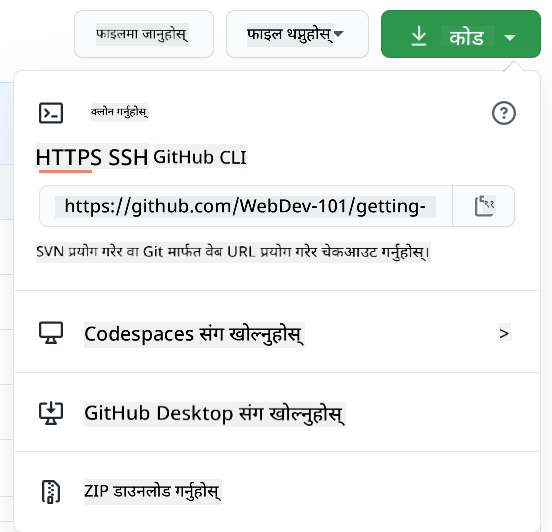

<!--
CO_OP_TRANSLATOR_METADATA:
{
  "original_hash": "05666cecb8983a72cf0ce1d18932b5b7",
  "translation_date": "2025-08-25T22:47:52+00:00",
  "source_file": "1-getting-started-lessons/2-github-basics/README.md",
  "language_code": "ne"
}
-->
# GitHub को परिचय

यो पाठले GitHub को आधारभूत कुराहरू समेट्छ, जुन तपाईंको कोडलाई होस्ट र परिवर्तनहरू व्यवस्थापन गर्न प्रयोग गरिने प्लेटफर्म हो।


> [Tomomi Imura](https://twitter.com/girlie_mac) द्वारा बनाइएको स्केच नोट

## पाठ अघि क्विज
[पाठ अघि क्विज](https://ff-quizzes.netlify.app/web/quiz/3)

## परिचय

यस पाठमा हामी निम्न विषयहरू समेट्नेछौं:

- तपाईंले आफ्नो मेसिनमा गर्ने काम ट्र्याक गर्ने
- अरूसँग परियोजनाहरूमा काम गर्ने
- ओपन सोर्स सफ्टवेयरमा कसरी योगदान गर्ने

### पूर्वआवश्यकताहरू

सुरु गर्नु अघि, Git इन्स्टल छ कि छैन जाँच गर्नुहोस्। टर्मिनलमा टाइप गर्नुहोस्:  
`git --version`

यदि Git इन्स्टल छैन भने, [Git डाउनलोड गर्नुहोस्](https://git-scm.com/downloads)। त्यसपछि, आफ्नो स्थानीय Git प्रोफाइल सेटअप गर्नुहोस्:
* `git config --global user.name "your-name"`
* `git config --global user.email "your-email"`

Git पहिले नै कन्फिगर गरिएको छ कि छैन जाँच गर्न, टाइप गर्नुहोस्:  
`git config --list`

तपाईंलाई GitHub खाता, कोड एडिटर (जस्तै Visual Studio Code), र टर्मिनल (वा: कमाण्ड प्रम्प्ट) खोल्न आवश्यक पर्छ।

[github.com](https://github.com/) मा जानुहोस् र खाता बनाउनुहोस् यदि तपाईंले पहिले नै बनाउनु भएको छैन भने, वा लगइन गरेर आफ्नो प्रोफाइल पूरा गर्नुहोस्।

✅ GitHub मात्र संसारको एकमात्र कोड रिपोजिटरी होइन; अरू पनि छन्, तर GitHub सबैभन्दा प्रख्यात हो।

### तयारी

तपाईंलाई आफ्नो स्थानीय मेसिन (ल्यापटप वा पीसी) मा कोड परियोजनासहितको फोल्डर र GitHub मा सार्वजनिक रिपोजिटरी चाहिन्छ, जसले अरूको परियोजनामा योगदान कसरी गर्ने भनेर उदाहरणको रूपमा काम गर्नेछ।  

---

## कोड व्यवस्थापन

मानौं तपाईंको स्थानीय मेसिनमा कोड परियोजनासहितको फोल्डर छ र तपाईं आफ्नो प्रगति ट्र्याक गर्न चाहनुहुन्छ। Git प्रयोग गर्नु भनेको भविष्यको लागि प्रेमपत्र लेख्न जस्तै हो। तपाईंले राम्रो "commit messages" लेख्दा, केही दिन, हप्ता वा महिनापछि तपाईंले किन निर्णय गर्नुभयो भनेर सम्झन सक्नुहुन्छ, वा परिवर्तन "rollback" गर्न सक्नुहुन्छ।

### कार्य: रिपोजिटरी बनाउनुहोस् र कोड कमिट गर्नुहोस्  

> भिडियो हेर्नुहोस्  
> 
> [](https://www.youtube.com/watch?v=9R31OUPpxU4)

1. **GitHub मा रिपोजिटरी बनाउनुहोस्।** GitHub.com मा, रिपोजिटरी ट्याबमा, वा माथिल्लो दायाँ नेभिगेसन बारबाट, **नयाँ रिपो** बटन खोज्नुहोस्।

   1. आफ्नो रिपोजिटरी (फोल्डर) लाई नाम दिनुहोस्।
   1. **रिपोजिटरी बनाउनुहोस्** चयन गर्नुहोस्।

1. **आफ्नो कार्य फोल्डरमा जानुहोस्।** टर्मिनलमा, तपाईं ट्र्याक गर्न चाहनु भएको फोल्डरमा जानुहोस्। टाइप गर्नुहोस्:

   ```bash
   cd [name of your folder]
   ```

1. **Git रिपोजिटरी इनिसियलाइज गर्नुहोस्।** आफ्नो परियोजनामा टाइप गर्नुहोस्:

   ```bash
   git init
   ```

1. **स्टेटस जाँच गर्नुहोस्।** रिपोजिटरीको स्टेटस जाँच गर्न टाइप गर्नुहोस्:

   ```bash
   git status
   ```

   आउटपुट यस प्रकार देखिन सक्छ:

   ```output
   Changes not staged for commit:
   (use "git add <file>..." to update what will be committed)
   (use "git checkout -- <file>..." to discard changes in working directory)

        modified:   file.txt
        modified:   file2.txt
   ```

   सामान्यतया `git status` कमाण्डले तपाईंलाई रिपोजिटरीमा _सेभ_ गर्न तयार फाइलहरू वा परिवर्तनहरू देखाउँछ।

1. **सबै फाइलहरू ट्र्याक गर्न थप्नुहोस्।**  
   यसलाई स्टेजिङ फाइलहरू/फाइलहरू स्टेजिङ क्षेत्रमा थप्ने पनि भनिन्छ।

   ```bash
   git add .
   ```

   `git add` र `.` को मतलब सबै फाइलहरू र परिवर्तनहरू ट्र्याक गर्नका लागि हो।

1. **चयनित फाइलहरू ट्र्याक गर्न थप्नुहोस्।**

   ```bash
   git add [file or folder name]
   ```

   यो कमाण्डले तपाईंलाई सबै फाइलहरू एकैपटक कमिट नगरी चयनित फाइलहरू मात्र स्टेजिङ क्षेत्रमा थप्न मद्दत गर्दछ।

1. **सबै फाइलहरू अनस्टेज गर्नुहोस्।**

   ```bash
   git reset
   ```

   यो कमाण्डले सबै फाइलहरू एकैपटक अनस्टेज गर्न मद्दत गर्दछ।

1. **विशेष फाइल अनस्टेज गर्नुहोस्।**

   ```bash
   git reset [file or folder name]
   ```

   यो कमाण्डले तपाईंलाई एकैपटक विशेष फाइल मात्र अनस्टेज गर्न मद्दत गर्दछ।

1. **आफ्नो काम सुरक्षित गर्नुहोस्।**  
   यस बिन्दुमा तपाईंले फाइलहरूलाई _स्टेजिङ क्षेत्र_ मा थप्नुभएको छ। परिवर्तन स्थायी बनाउन, तपाईंले _commit_ गर्नुपर्छ। टाइप गर्नुहोस्:

   ```bash
   git commit -m "first commit"
   ```

   यो सबै फाइलहरू कमिट गर्दछ, "first commit" सन्देशसहित। भविष्यका कमिट सन्देशहरूमा, तपाईंले परिवर्तनको प्रकार स्पष्ट पार्न थप वर्णनात्मक हुनुपर्छ।

1. **स्थानीय Git रिपो GitHub सँग जडान गर्नुहोस्।**  
   Git रिपो तपाईंको मेसिनमा राम्रो छ, तर तपाईं आफ्नो फाइलहरूको ब्याकअप राख्न र अरूलाई तपाईंको रिपोमा काम गर्न आमन्त्रित गर्न चाहनुहुन्छ। `git remote add` कमाण्डले यो काम गर्छ। टाइप गर्नुहोस्:

   > नोट: कमाण्ड टाइप गर्नु अघि GitHub रिपोजिटरी पृष्ठमा गएर रिपोजिटरी URL पत्ता लगाउनुहोस्। 

   ```bash
   git remote add origin https://github.com/username/repository_name.git
   ```

   यसले "origin" नामको _remote_ बनाउँछ, जुन तपाईंले पहिले बनाएको GitHub रिपोजिटरीतर्फ संकेत गर्दछ।

1. **स्थानीय फाइलहरू GitHub मा पठाउनुहोस्।**  
   `git push` कमाण्ड प्रयोग गरेर फाइलहरू GitHub मा पठाउनुहोस्:

   ```bash
   git push -u origin main
   ```

   यो तपाईंको "main" ब्रान्चका कमिटहरू GitHub मा पठाउँछ।

2. **थप परिवर्तनहरू थप्न।**  
   यदि तपाईं परिवर्तनहरू जारी राख्न र GitHub मा पठाउन चाहनुहुन्छ भने, निम्न तीन कमाण्डहरू प्रयोग गर्नुहोस्:

   ```bash
   git add .
   git commit -m "type your commit message here"
   git push
   ```

   > सुझाव: `.gitignore` फाइल अपनाउन चाहनुहुन्छ जसले तपाईं ट्र्याक गर्न नचाहने फाइलहरू GitHub मा देखिनबाट रोक्छ। `.gitignore` टेम्प्लेटहरू [यहाँ](https://github.com/github/gitignore) पाउन सकिन्छ।

#### कमिट सन्देशहरू

एक उत्कृष्ट Git कमिट सन्देशले निम्न वाक्य पूरा गर्दछ:  
यदि लागू गरियो भने, यो कमिटले <तपाईंको सन्देश यहाँ>।

सन्देशमा आदेशात्मक, वर्तमान काल प्रयोग गर्नुहोस्: "change" (परिवर्तन गर्नुहोस्) "changed" (परिवर्तित गरियो) वा "changes" (परिवर्तनहरू) होइन।  
सन्देशको मुख्य भागमा पनि आदेशात्मक, वर्तमान काल प्रयोग गर्नुहोस्। मुख्य भागले परिवर्तनको कारण र अघिल्लो व्यवहारसँगको भिन्नता समावेश गर्नुपर्छ। तपाईं `किन` स्पष्ट गर्दै हुनुहुन्छ, `कसरी` होइन।

✅ GitHub मा केही समय बिताउनुहोस्। के तपाईं उत्कृष्ट कमिट सन्देश फेला पार्न सक्नुहुन्छ? के तपाईं न्यूनतम सन्देश फेला पार्न सक्नुहुन्छ? कमिट सन्देशमा कुन जानकारी सबैभन्दा महत्त्वपूर्ण र उपयोगी छ?

### कार्य: सहकार्य गर्नुहोस्

GitHub मा फाइलहरू राख्नुको मुख्य कारण भनेको अन्य विकासकर्ताहरूसँग सहकार्य गर्न सम्भव बनाउनु हो।

## अरूसँग परियोजनाहरूमा काम गर्ने

> भिडियो हेर्नुहोस्  
> 
> [](https://www.youtube.com/watch?v=bFCM-PC3cu8)

तपाईंको रिपोजिटरीमा, `Insights > Community` मा जानुहोस् र तपाईंको परियोजना सिफारिस गरिएका सामुदायिक मापदण्डहरूसँग कसरी तुलना हुन्छ हेर्नुहोस्।

   यहाँ केही चीजहरू छन् जसले तपाईंको GitHub रिपो सुधार गर्न सक्छ:
   - **विवरण।** के तपाईंले आफ्नो परियोजनाको विवरण थप्नुभएको छ?
   - **README।** के तपाईंले README थप्नुभएको छ? GitHub ले [README लेख्न मार्गदर्शन](https://docs.github.com/articles/about-readmes/?WT.mc_id=academic-77807-sagibbon) प्रदान गर्दछ।
   - **योगदान दिशानिर्देश।** के तपाईंको परियोजनामा [योगदान दिशानिर्देशहरू](https://docs.github.com/articles/setting-guidelines-for-repository-contributors/?WT.mc_id=academic-77807-sagibbon) छन्?
   - **आचार संहिता।** [आचार संहिता](https://docs.github.com/articles/adding-a-code-of-conduct-to-your-project/)।
   - **लाइसेन्स।** सबैभन्दा महत्त्वपूर्ण, [लाइसेन्स](https://docs.github.com/articles/adding-a-license-to-a-repository/)।

यी सबै स्रोतहरूले नयाँ टोली सदस्यहरूलाई अनबोर्ड गर्न फाइदा पुर्‍याउँछन्। नयाँ योगदानकर्ताहरूले तपाईंको कोड हेर्नु अघि यी चीजहरू हेर्छन्।

✅ README फाइलहरू, यद्यपि तयार गर्न समय लाग्छ, व्यस्त मेन्टेनरहरूले प्रायः बेवास्ता गर्छन्। के तपाईं विशेष रूपमा वर्णनात्मक README को उदाहरण फेला पार्न सक्नुहुन्छ? [README बनाउन मद्दत गर्ने उपकरणहरू](https://www.makeareadme.com/) पनि छन्।

### कार्य: केही कोड मर्ज गर्नुहोस्

योगदान दस्तावेजहरूले मानिसहरूलाई परियोजनामा योगदान गर्न मद्दत गर्छ। यसले तपाईंको रिपोमा योगदानकर्ताहरूले पालना गर्नुपर्ने प्रक्रिया स्पष्ट पार्छ। 

1. **रिपो फोर्क गर्नुहोस्।**  
2. **क्लोन गर्नुहोस्।**  
3. **ब्रान्च बनाउनुहोस्।**  
4. **एक क्षेत्रमा ध्यान केन्द्रित गर्नुहोस्।**

✅ ब्रान्चहरू लेख्न र राम्रो कोड पठाउन विशेष रूपमा महत्त्वपूर्ण हुने स्थिति कल्पना गर्नुहोस्। तपाईं के उपयोग केसहरू सोच्न सक्नुहुन्छ?

> नोट: तपाईंले पनि आफ्नो कामका लागि ब्रान्चहरू बनाउनुहोस्। `git status` प्रयोग गरेर कुन ब्रान्चमा हुनुहुन्छ हेर्नुहोस्।

आउनुहोस्, योगदानकर्ताको वर्कफ्लो हेर्नुहोस्। मानौं, योगदानकर्ताले रिपो फोर्क र क्लोन गरिसकेका छन्:

1. **ब्रान्च बनाउनुहोस्।**  
   ```bash
   git branch [branch-name]
   ```

1. **कार्यरत ब्रान्चमा स्विच गर्नुहोस्।**  
   ```bash
   git switch [branch-name]
   ```

1. **काम गर्नुहोस्।**  
   ```bash
   git add .
   git commit -m "my changes"
   ```

1. **`main` ब्रान्चसँग काम मिलाउनुहोस्।**  
   ```bash
   git switch main
   git pull
   ```  
   ```bash
   git switch [branch_name]
   git merge main
   ```

1. **GitHub मा काम पठाउनुहोस्।**  
   ```bash
   git push --set-upstream origin [branch-name]
   ```

1. **PR खोल्नुहोस्।**  
   GitHub मा PR खोल्नुहोस्। PR मर्ज भएपछि, तपाईं योगदानकर्ता बन्नुहुन्छ।

1. **सफा गर्नुहोस्।**  
   सफल PR मर्ज भएपछि, स्थानीय र GitHub ब्रान्च हटाउनुहोस्।  
   ```bash
   git branch -d [branch-name]
   ```
GitHub पेजमा जानुहोस् र तपाईंले फोर्क गरेको रिपोजिटरीको रिमोट ब्रान्च हटाउनुहोस्।

`Pull request` शब्द अलि अचम्मको लाग्न सक्छ किनभने वास्तवमा तपाईं आफ्नो परिवर्तनहरू प्रोजेक्टमा धकेल्न चाहनुहुन्छ। तर मेन्टेनर (प्रोजेक्ट मालिक) वा कोर टिमले तपाईंको परिवर्तनहरूलाई प्रोजेक्टको "मुख्य" ब्रान्चमा मर्ज गर्नु अघि विचार गर्न आवश्यक छ, त्यसैले तपाईं वास्तवमा मेन्टेनरबाट परिवर्तनको निर्णयको अनुरोध गर्दै हुनुहुन्छ।

Pull request एउटा ठाउँ हो जहाँ ब्रान्चमा गरिएको परिवर्तनहरूको तुलना र छलफल गरिन्छ, समीक्षा, टिप्पणीहरू, एकीकृत परीक्षणहरू, र अन्य कुराहरू सहित। एउटा राम्रो pull request लगभग commit message जस्तै नियमहरू पालना गर्छ। तपाईं आफ्नो कामले कुनै समस्या समाधान गरेको छ भने issue tracker मा issue को सन्दर्भ थप्न सक्नुहुन्छ। यो `#` पछि तपाईंको issue को नम्बर प्रयोग गरेर गरिन्छ। उदाहरणका लागि `#97`।

🤞आशा गरौं कि सबै चेक पास हुन्छन् र प्रोजेक्ट मालिक(हरू)ले तपाईंको परिवर्तनहरू प्रोजेक्टमा मर्ज गर्छन्🤞

GitHub मा रहेको सम्बन्धित रिमोट ब्रान्चबाट सबै नयाँ commits लाई आफ्नो हालको स्थानीय कार्य ब्रान्चमा अपडेट गर्नुहोस्:

`git pull`

## खुला स्रोतमा योगदान कसरी गर्ने

पहिला, GitHub मा तपाईंलाई चासो लाग्ने र जसमा तपाईं परिवर्तन गर्न चाहनुहुन्छ भन्ने रिपोजिटरी (वा **repo**) खोजौं। तपाईं यसको सामग्रीलाई आफ्नो मेसिनमा प्रतिलिपि गर्न चाहनुहुन्छ।

✅ 'सुरुवातमै अनुकूल' repos खोज्नको लागि [ट्याग 'good-first-issue' द्वारा खोज्नुहोस्](https://github.blog/2020-01-22-browse-good-first-issues-to-start-contributing-to-open-source/)।



कोड प्रतिलिपि गर्ने धेरै तरिकाहरू छन्। एउटा तरिका भनेको HTTPS, SSH, वा GitHub CLI (Command Line Interface) प्रयोग गरेर रिपोजिटरीको सामग्रीलाई "clone" गर्नु हो।

टर्मिनल खोल्नुहोस् र रिपोजिटरीलाई यसरी clone गर्नुहोस्:
`git clone https://github.com/ProjectURL`

प्रोजेक्टमा काम गर्न, सही फोल्डरमा स्विच गर्नुहोस्:
`cd ProjectURL`

तपाईं [Codespaces](https://github.com/features/codespaces), GitHub को एम्बेडेड कोड एडिटर / क्लाउड विकास वातावरण, वा [GitHub Desktop](https://desktop.github.com/) प्रयोग गरेर पनि सम्पूर्ण प्रोजेक्ट खोल्न सक्नुहुन्छ।

अन्तमा, तपाईं कोडलाई zipped फोल्डरमा डाउनलोड गर्न सक्नुहुन्छ।

### GitHub को बारेमा केही रोचक कुराहरू

तपाईं GitHub मा कुनै पनि सार्वजनिक रिपोजिटरीलाई स्टार, वाच, र/वा "fork" गर्न सक्नुहुन्छ। तपाईंले स्टार गरेको रिपोजिटरीहरूलाई शीर्ष-दायाँ ड्रप-डाउन मेनुमा फेला पार्न सक्नुहुन्छ। यो कोडको लागि बुकमार्क जस्तै हो।

प्रोजेक्टहरूमा प्रायः GitHub मा "Issues" ट्याबमा (अर्को ठाउँमा संकेत गरिएको नभएमा) समस्या सम्बन्धी छलफल गर्ने issue tracker हुन्छ। र Pull Requests ट्याबमा मानिसहरूले प्रगतिको क्रममा रहेका परिवर्तनहरूको बारेमा छलफल र समीक्षा गर्छन्।

प्रोजेक्टहरूमा फोरम, मेलिङ लिस्ट, वा Slack, Discord वा IRC जस्ता च्याट च्यानलहरूमा पनि छलफल हुन सक्छ।

✅ आफ्नो नयाँ GitHub रिपोजिटरीको वरिपरि हेर्नुहोस् र केही कुराहरू प्रयास गर्नुहोस्, जस्तै सेटिङहरू सम्पादन गर्नु, आफ्नो रिपोजिटरीमा जानकारी थप्नु, र प्रोजेक्ट सिर्जना गर्नु (जस्तै Kanban बोर्ड)। तपाईं धेरै कुरा गर्न सक्नुहुन्छ!

---

## 🚀 चुनौती

साथीसँग जोडी बनाएर एक-अर्काको कोडमा काम गर्नुहोस्। सहकार्यात्मक रूपमा प्रोजेक्ट सिर्जना गर्नुहोस्, कोड fork गर्नुहोस्, ब्रान्चहरू सिर्जना गर्नुहोस्, र परिवर्तनहरू मर्ज गर्नुहोस्।

## पोस्ट-लेक्चर क्विज
[पोस्ट-लेक्चर क्विज](https://ff-quizzes.netlify.app/web/quiz/4)

## समीक्षा र आत्म-अध्ययन

[खुला स्रोत सफ्टवेयरमा योगदान गर्ने](https://opensource.guide/how-to-contribute/#how-to-submit-a-contribution) बारेमा थप पढ्नुहोस्।

[Git cheatsheet](https://training.github.com/downloads/github-git-cheat-sheet/)।

अभ्यास, अभ्यास, अभ्यास। GitHub मा [skills.github.com](https://skills.github.com) मार्फत उत्कृष्ट सिकाइ मार्गहरू उपलब्ध छन्:

- [GitHub मा पहिलो हप्ता](https://skills.github.com/#first-week-on-github)

तपाईंले थप उन्नत पाठ्यक्रमहरू पनि फेला पार्नुहुनेछ।

## असाइनमेन्ट

[GitHub मा पहिलो हप्ता कोर्स](https://skills.github.com/#first-week-on-github) पूरा गर्नुहोस्।

**अस्वीकरण**:  
यो दस्तावेज़ AI अनुवाद सेवा [Co-op Translator](https://github.com/Azure/co-op-translator) प्रयोग गरेर अनुवाद गरिएको छ। हामी शुद्धताको लागि प्रयास गर्छौं, तर कृपया ध्यान दिनुहोस् कि स्वचालित अनुवादमा त्रुटिहरू वा अशुद्धताहरू हुन सक्छ। यसको मूल भाषा मा रहेको मूल दस्तावेज़लाई आधिकारिक स्रोत मानिनुपर्छ। महत्वपूर्ण जानकारीको लागि, व्यावसायिक मानव अनुवाद सिफारिस गरिन्छ। यस अनुवादको प्रयोगबाट उत्पन्न हुने कुनै पनि गलतफहमी वा गलत व्याख्याको लागि हामी जिम्मेवार हुने छैनौं।