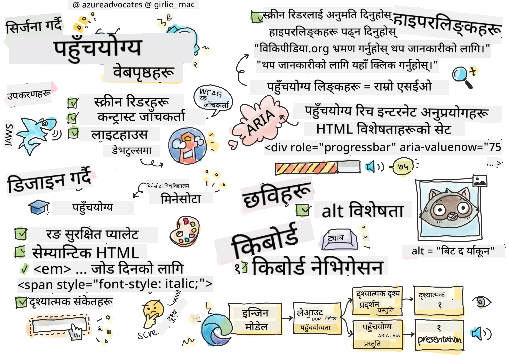
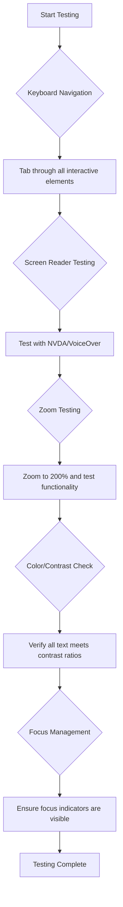
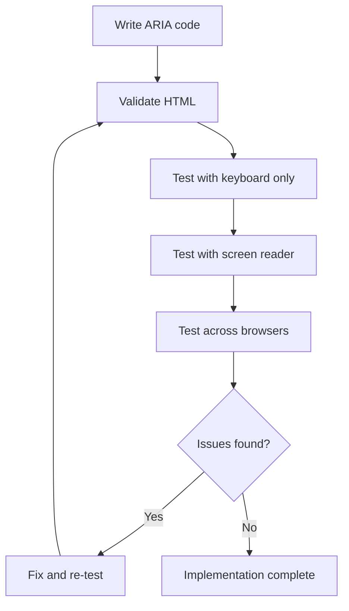

<!--
CO_OP_TRANSLATOR_METADATA:
{
  "original_hash": "300c1562e01f21065ae0b8e9d9181a86",
  "translation_date": "2025-10-20T21:35:58+00:00",
  "source_file": "1-getting-started-lessons/3-accessibility/README.md",
  "language_code": "ne"
}
-->
# पहुँचयोग्य वेबपृष्ठहरू बनाउने


> स्केच नोट [टोमोमी इमुरा](https://twitter.com/girlie_mac) द्वारा

## व्याख्यान अघि क्विज
[व्याख्यान अघि क्विज](https://ff-quizzes.netlify.app/web/)

> वेबको शक्ति यसको सार्वभौमिकतामा छ। अपाङ्गता भए पनि सबैले पहुँच पाउनु अनिवार्य पक्ष हो।
>
> \- सर टिमोथी बर्नर्स-ली, W3C निर्देशक र वर्ल्ड वाइड वेबका आविष्कारक

वेब पहुँचयोग्यता केवल राम्रो देखिने सुविधा मात्र होइन—यो इन्टरनेटलाई वास्तवमै सार्वभौमिक बनाउने आधारभूत सिद्धान्त हो। जब तपाईं पहुँचयोग्य वेबसाइटहरू निर्माण गर्नुहुन्छ, तपाईंले अपाङ्गता भएका व्यक्तिहरूलाई मात्र सहयोग गरिरहनुभएको छैन; तपाईंले सबैका लागि राम्रो अनुभव सिर्जना गरिरहनुभएको छ। सोच्नुहोस्, व्हीलचेयरका लागि डिजाइन गरिएका कर्ब कटहरूले बच्चाको गाडी, सामान, वा साइकल भएका व्यक्तिहरूलाई पनि कसरी सहयोग गर्छ। पहुँचयोग्य वेब डिजाइन पनि त्यस्तै काम गर्छ।

यस पाठमा, तपाईंले सबैका लागि काम गर्ने वेबसाइटहरू कसरी बनाउने भन्ने कुरा पत्ता लगाउनुहुनेछ, चाहे उनीहरूको क्षमता वा वेब ब्राउज गर्न प्रयोग गरिने प्रविधि जस्तोसुकै होस्। तपाईंले आधुनिक वेब मापदण्डहरूमा निर्मित व्यावहारिक प्रविधिहरू सिक्नुहुनेछ, शक्तिशाली पहुँचयोग्यता परीक्षण उपकरणहरूको अन्वेषण गर्नुहुनेछ, र पहुँचयोग्यताले सबै प्रयोगकर्ताहरूको लागि उपयोगिता कसरी बढाउँछ भन्ने कुरा बुझ्नुहुनेछ।

यस पाठको अन्त्यसम्ममा, तपाईंले पहुँचयोग्यता विकास प्रक्रियाको पहिलो दिनदेखि नै प्राकृतिक भाग बनाउने ज्ञान र उपकरणहरू प्राप्त गर्नुहुनेछ। आउनुहोस्, विचारशील डिजाइन विकल्पहरूले विश्वभरका अर्बौं प्रयोगकर्ताहरूका लागि वेब खोल्न कसरी मद्दत गर्न सक्छ भन्ने कुरा अन्वेषण गरौं।

> तपाईंले यो पाठ [Microsoft Learn](https://docs.microsoft.com/learn/modules/web-development-101/accessibility/?WT.mc_id=academic-77807-sagibbon) मा लिन सक्नुहुन्छ!

## सहायक प्रविधिहरूको समझ

पहुँचयोग्य वेबसाइटहरू निर्माण गर्न अघि, विभिन्न क्षमताका व्यक्तिहरूले वेब कसरी नेभिगेट गर्छन् भन्ने कुरा बुझौं। यस ज्ञानले तपाईंलाई तपाईंको डिजाइन र विकास विकल्पहरूको बारेमा सूचित निर्णय लिन मद्दत गर्नेछ।

सहायक प्रविधिहरू विशेष उपकरणहरू हुन् जसले अपाङ्गता भएका व्यक्तिहरूलाई डिजिटल सामग्रीसँग अन्तरक्रिया गर्न मद्दत गर्छ। यी उपकरणहरू कसरी काम गर्छन् भन्ने कुरा बुझ्नु वास्तवमै पहुँचयोग्य वेब अनुभवहरू सिर्जना गर्न आवश्यक छ।

### स्क्रिन रिडरहरू

[स्क्रिन रिडरहरू](https://en.wikipedia.org/wiki/Screen_reader) अद्भुत सहायक प्रविधिहरू हुन् जसले डिजिटल पाठलाई भाषण वा ब्रेल आउटपुटमा रूपान्तरण गर्छ। यी मुख्य रूपमा दृष्टि कमजोर व्यक्तिहरूले प्रयोग गर्छन्, तर यसले डिस्लेक्सिया जस्ता सिकाइ अपाङ्गता भएका प्रयोगकर्ताहरूलाई पनि मद्दत गर्छ।

स्क्रिन रिडरलाई वेबको लागि आवाज कथाकारको रूपमा सोच्नुहोस्। यसले सामग्रीलाई तार्किक क्रममा पढ्छ, बटन र लिंक जस्ता अन्तरक्रियात्मक तत्वहरूको घोषणा गर्छ, र कुशल नेभिगेसनको लागि किबोर्ड सर्टकटहरू प्रदान गर्छ। तर, स्क्रिन रिडरहरूले मात्र प्रभावकारी रूपमा काम गर्न सक्छन् यदि वेबसाइटहरू उचित संरचना र अर्थपूर्ण सामग्रीको साथ निर्माण गरिएका छन् भने।

**प्लेटफर्महरूमा लोकप्रिय स्क्रिन रिडरहरू:**
- **विन्डोज**: [NVDA](https://www.nvaccess.org/about-nvda/) (निःशुल्क र सबैभन्दा लोकप्रिय), [JAWS](https://webaim.org/articles/jaws/), [Narrator](https://support.microsoft.com/windows/complete-guide-to-narrator-e4397a0d-ef4f-b386-d8ae-c172f109bdb1/?WT.mc_id=academic-77807-sagibbon) (बिल्ट-इन)
- **macOS/iOS**: [VoiceOver](https://support.apple.com/guide/voiceover/welcome/10) (बिल्ट-इन र धेरै सक्षम)
- **एन्ड्रोइड**: [TalkBack](https://support.google.com/accessibility/android/answer/6283677) (बिल्ट-इन)
- **लिनक्स**: [Orca](https://wiki.gnome.org/Projects/Orca) (निःशुल्क र ओपन-सोर्स)

**स्क्रिन रिडरहरूले वेब सामग्री कसरी नेभिगेट गर्छन्:**

स्क्रिन रिडरहरूले अनुभवी प्रयोगकर्ताहरूका लागि ब्राउजिङलाई कुशल बनाउने धेरै नेभिगेसन विधिहरू प्रदान गर्छन्:
- **क्रमिक पढाइ**: सामग्रीलाई माथिबाट तलसम्म पढ्छ, किताबको जस्तै
- **ल्यान्डमार्क नेभिगेसन**: पृष्ठ खण्डहरू (हेडर, नेभ, मेन, फुटर) बीचमा जम्प गर्नुहोस्
- **हेडिङ नेभिगेसन**: पृष्ठ संरचना बुझ्न हेडिङहरू बीचमा स्किप गर्नुहोस्
- **लिंक सूचीहरू**: छिटो पहुँचको लागि सबै लिंकहरूको सूची उत्पन्न गर्नुहोस्
- **फारम नियन्त्रणहरू**: इनपुट फिल्डहरू र बटनहरू बीचमा सिधै नेभिगेट गर्नुहोस्

> 💡 **डेभलपर इनसाइट**: 68% स्क्रिन रिडर प्रयोगकर्ताहरू मुख्य रूपमा हेडिङहरूद्वारा नेभिगेट गर्छन् ([WebAIM सर्वेक्षण](https://webaim.org/projects/screenreadersurvey9/#finding))। यही कारणले गर्दा उचित हेडिङ संरचना अत्यन्त महत्त्वपूर्ण छ!

### परीक्षण कार्यप्रवाह निर्माण गर्दै

प्रभावकारी पहुँचयोग्यता परीक्षणले स्वचालित उपकरणहरू र म्यानुअल सत्यापन दुवै आवश्यक छ। यहाँ एक व्यवस्थित दृष्टिकोण छ जसले धेरै समस्याहरू समेट्छ:

**आवश्यक म्यानुअल परीक्षण कार्यप्रवाह:**



**चरण-दर-चरण परीक्षण चेकलिस्ट:**
1. **किबोर्ड नेभिगेसन**: केवल Tab, Shift+Tab, Enter, Space, र Arrow कुञ्जीहरू प्रयोग गर्नुहोस्
2. **स्क्रिन रिडर परीक्षण**: NVDA, VoiceOver, वा Narrator सक्षम गर्नुहोस् र आँखा बन्द गरेर नेभिगेट गर्नुहोस्
3. **जूम परीक्षण**: 200% र 400% जूम स्तरहरूमा परीक्षण गर्नुहोस्
4. **रङ कन्ट्रास्ट सत्यापन**: सबै पाठ र UI घटकहरू जाँच गर्नुहोस्
5. **फोकस संकेतक परीक्षण**: सुनिश्चित गर्नुहोस् कि सबै अन्तरक्रियात्मक तत्वहरूमा देखिने फोकस अवस्था छ

✅ **लाइटहाउसबाट सुरु गर्नुहोस्**: तपाईंको ब्राउजरको DevTools खोल्नुहोस्, लाइटहाउस पहुँचयोग्यता अडिट चलाउनुहोस्, त्यसपछि तपाईंको म्यानुअल परीक्षण फोकस क्षेत्रहरूलाई मार्गदर्शन गर्न परिणामहरू प्रयोग गर्नुहोस्।

### जूम र म्याग्निफिकेसन उपकरणहरू

धेरै प्रयोगकर्ताहरूले सामग्रीलाई पढ्न योग्य बनाउन म्याग्निफिकेसनमा निर्भर गर्छन्। यसमा दृष्टि कमजोर व्यक्तिहरू, वृद्ध व्यक्तिहरू, र उज्यालो घाममा वा अस्थायी दृष्टि समस्याहरू भएका प्रयोगकर्ताहरू समावेश छन्। आधुनिक जूम प्रविधिहरू साधारण छवि स्केलिङभन्दा धेरै परिपक्व भएका छन्।

जूम कसरी काम गर्छ भन्ने कुरा बुझ्दा तपाईंले उत्तरदायी डिजाइनहरू सिर्जना गर्न सक्नुहुन्छ जसले कुनै पनि म्याग्निफिकेसन स्तरमा कार्यात्मक र सुन्दर रहन्छ।

**आधुनिक ब्राउजर जूम क्षमताहरू:**
- **पृष्ठ जूम**: सबै सामग्रीलाई समानुपातिक रूपमा स्केल गर्छ (पाठ, छविहरू, लेआउट) - यो प्राथमिक विधि हो
- **केवल पाठ जूम**: मूल लेआउट कायम राख्दै फन्ट आकार बढाउँछ
- **पिन्च-टु-जूम**: अस्थायी म्याग्निफिकेसनको लागि मोबाइल इशारा समर्थन
- **ब्राउजर समर्थन**: सबै आधुनिक ब्राउजरहरूले कार्यक्षमता बिग्रन बिना 500% सम्म जूम समर्थन गर्छन्

**विशेष म्याग्निफिकेसन सफ्टवेयर:**
- **विन्डोज**: [Magnifier](https://support.microsoft.com/windows/use-magnifier-to-make-things-on-the-screen-easier-to-see-414948ba-8b1c-d3bd-8615-0e5e32204198) (बिल्ट-इन), [ZoomText](https://www.freedomscientific.com/training/zoomtext/getting-started/)
- **macOS/iOS**: [Zoom](https://www.apple.com/accessibility/mac/vision/) (बिल्ट-इन र उन्नत सुविधाहरू सहित)

> ⚠️ **डिजाइन विचार**: WCAG ले सामग्रीलाई 200% जूम गर्दा कार्यात्मक रहन आवश्यक छ। यस स्तरमा, तेर्सो स्क्रोलिङ न्यूनतम हुनुपर्छ, र सबै अन्तरक्रियात्मक तत्वहरू पहुँचयोग्य रहनुपर्छ।

✅ **तपाईंको उत्तरदायी डिजाइन परीक्षण गर्नुहोस्**: तपाईंको ब्राउजरलाई 200% र 400% जूम गर्नुहोस्। के तपाईंको लेआउट सुन्दर रूपमा अनुकूलित हुन्छ? के तपाईं अझै पनि अत्यधिक स्क्रोलिङ बिना सबै कार्यक्षमतामा पहुँच गर्न सक्नुहुन्छ?

## आधुनिक पहुँचयोग्यता परीक्षण उपकरणहरू

अब तपाईंले सहायक प्रविधिहरू कसरी काम गर्छन् भन्ने कुरा बुझ्नुभयो, आउनुहोस् ती उपकरणहरूको अन्वेषण गरौं जसले तपाईंलाई पहुँचयोग्य वेबसाइटहरू निर्माण गर्न र परीक्षण गर्न मद्दत गर्छ। स्वचालित परीक्षणलाई म्यानुअल सत्यापनसँग संयोजन गर्दा तपाईंलाई तपाईंको साइटहरू सबैका लागि काम गर्छन् भन्ने विश्वास दिलाउँछ।

आधुनिक पहुँचयोग्यता परीक्षणले व्यापक दृष्टिकोण अनुसरण गर्छ: स्वचालित उपकरणहरूले स्पष्ट समस्याहरू समात्छन्, जबकि म्यानुअल परीक्षणले वास्तविक-विश्व उपयोगिता सुनिश्चित गर्छ।

### रङ कन्ट्रास्ट परीक्षण

रङ कन्ट्रास्ट पहुँचयोग्यताको सबैभन्दा सामान्य समस्या हो, तर यो समाधान गर्न सबैभन्दा सजिलो पनि हो। राम्रो कन्ट्रास्टले सबैलाई फाइदा पुर्‍याउँछ—दृष्टि कमजोर भएका प्रयोगकर्ताहरूदेखि उज्यालो घाममा स्क्रिन हेर्ने व्यक्तिहरूसम्म।

**WCAG कन्ट्रास्ट आवश्यकताहरू:**

| पाठ प्रकार | WCAG AA (न्यूनतम) | WCAG AAA (उन्नत) |
|------------|--------------------|------------------|
| **सामान्य पाठ** (18pt भन्दा कम) | 4.5:1 कन्ट्रास्ट अनुपात | 7:1 कन्ट्रास्ट अनुपात |
| **ठूलो पाठ** (18pt+ वा 14pt+ बोल्ड) | 3:1 कन्ट्रास्ट अनुपात | 4.5:1 कन्ट्रास्ट अनुपात |
| **UI घटकहरू** (बटनहरू, फारम सीमा) | 3:1 कन्ट्रास्ट अनुपात | 3:1 कन्ट्रास्ट अनुपात |

**आवश्यक परीक्षण उपकरणहरू:**
- [Colour Contrast Analyser](https://www.tpgi.com/color-contrast-checker/) - कलर पिकर सहित डेस्कटप एप
- [WebAIM Contrast Checker](https://webaim.org/resources/contrastchecker/) - वेब-आधारित तत्काल प्रतिक्रिया सहित
- [Stark](https://www.getstark.co/) - Figma, Sketch, Adobe XD का लागि डिजाइन टूल प्लगइन
- [Accessible Colors](https://accessible-colors.com/) - पहुँचयोग्य रङ प्यालेटहरू फेला पार्नुहोस्

✅ **रङ प्यालेटहरू राम्रो बनाउनुहोस्**: तपाईंको ब्रान्ड रङहरूबाट सुरु गर्नुहोस् र पहुँचयोग्य भेरिएसनहरू सिर्जना गर्न कन्ट्रास्ट चेकरहरू प्रयोग गर्नुहोस्। यीलाई तपाईंको डिजाइन प्रणालीको पहुँचयोग्य रङ टोकनको रूपमा दस्तावेज गर्नुहोस्।

### व्यापक पहुँचयोग्यता अडिटिङ

सबैभन्दा प्रभावकारी पहुँचयोग्यता परीक्षणले धेरै दृष्टिकोणहरूलाई संयोजन गर्छ। कुनै एकल उपकरणले सबै कुरा समात्दैन, त्यसैले विभिन्न विधिहरूको साथ परीक्षण दिनचर्या निर्माण गर्दा व्यापक कभरेज सुनिश्चित हुन्छ।

**ब्राउजर-आधारित परीक्षण (DevTools मा निर्मित):**
- **क्रोम/एज**: लाइटहाउस पहुँचयोग्यता अडिट + पहुँचयोग्यता प्यानल
- **फायरफक्स**: पहुँचयोग्यता निरीक्षक विस्तृत ट्री दृश्य सहित
- **सफारी**: वेब निरीक्षकमा अडिट ट्याब VoiceOver सिमुलेशन सहित

**व्यावसायिक परीक्षण एक्सटेन्सनहरू:**
- [axe DevTools](https://www.deque.com/axe/devtools/) - उद्योग-मानक स्वचालित परीक्षण
- [WAVE](https://wave.webaim.org/extension/) - त्रुटि हाइलाइटिङ सहित दृश्य प्रतिक्रिया
- [Accessibility Insights](https://accessibilityinsights.io/) - माइक्रोसफ्टको व्यापक परीक्षण सूट

**कमाण्ड-लाइन र CI/CD एकीकरण:**
- [axe-core](https://github.com/dequelabs/axe-core) - स्वचालित परीक्षणका लागि जाभास्क्रिप्ट लाइब्रेरी
- [Pa11y](https://pa11y.org/) - कमाण्ड-लाइन पहुँचयोग्यता परीक्षण उपकरण
- [Lighthouse CI](https://github.com/GoogleChrome/lighthouse-ci) - स्वचालित पहुँचयोग्यता स्कोरिङ

> 🎯 **परीक्षण लक्ष्य**: लाइटहाउस पहुँचयोग्यता स्कोर 95+ लाई तपाईंको आधार रेखा बनाउनुहोस्। सम्झनुहोस्, स्वचालित उपकरणहरूले केवल 30-40% पहुँचयोग्यता समस्याहरू समात्छन्—म्यानुअल परीक्षण अझै आवश्यक छ!

## पहुँचयोग्यता सुरुबाट निर्माण गर्दै

वेब पहुँचयोग्यताको सबैभन्दा प्रभावकारी दृष्टिकोण भनेको पहिलो दिनदेखि नै यसलाई तपाईंको आधारमा निर्माण गर्नु हो। पछि पहुँचयोग्यता समायोजन गर्नु केवल महँगो र समय-लाग्ने मात्र होइन—यसले अक्सर खराब प्रयोगकर्ता अनुभवहरू निम्त्याउँछ।

पहुंचयोग्यतालाई घर निर्माण जस्तै सोच्नुहोस्: व्हीलचेयर पहुँचयोग्यता समावेश गर्न प्रारम्भिक वास्तुकला योजनाहरूमा समावेश गर्नु धेरै सजिलो छ, निर्माण पूरा भएपछि र्याम्पहरू र चौडा ढोकाहरू थप्नुभन्दा।

### POUR सिद्धान्तहरू: तपाईंको पहुँचयोग्यता आधार

वेब सामग्री पहुँचयोग्यता दिशानिर्देशहरू (WCAG) चार आधारभूत सिद्धान्तहरूमा आधारित छन् जसलाई POUR भनिन्छ। यी सिद्धान्तहरूले विविध क्षमताहरू र प्रविधिहरू भएका प्रयोगकर्ताहरूका लागि सामग्री पहुँचयोग्य बनाउने फ्रेमवर्क प्रदान गर्छन्।

POUR बुझ्दा तपाईंले पहुँचयोग्यता निर्णयहरू लिन मद्दत गर्छ जसले सबैका लागि समावेशी अनुभवहरू सिर्जना गर्छ।

**🔍 बुझ्न सकिने**: जानकारी प्रयोगकर्ताहरूले आफ्नो उपलब्ध इन्द्रियहरू मार्फत बुझ्न सक्ने तरिकामा प्रस्तुत गर्नुपर्छ

- गैर-पाठ सामग्रीका लागि पाठ विकल्पहरू प्रदान गर्नुहोस् (छविहरू, भिडियोहरू, अडियो)
- सबै पाठ र UI घटकहरूको लागि पर्याप्त रङ कन्ट्रास्ट सुनिश्चित गर्नुहोस्
- मल्टिमिडिया सामग्रीका लागि क्याप्सन र ट्रान्सक्रिप्टहरू प्रस्ताव गर्नुहोस्
- सामग्रीलाई 200% सम्म पुन: आकार दिँदा कार्यात्मक रहन डिजाइन गर्नुहोस्
- जानकारी व्यक्त गर्न (केवल रङ मात्र होइन) बहु-संवेदी विशेषताहरू प्रयोग गर्नुहोस्

**🎮 सञ्चालन योग्य**: सबै इन्टरफेस घटकहरू उपलब्ध इनपुट विधिहरू मार्फत सञ्चालन योग्य हुनुपर्छ

- सबै कार्यक्षमता किबोर्ड नेभिगेसन मार्फत पहुँचयोग्य बनाउनुहोस्
- प्रयोगकर्ताहरूलाई सामग्री पढ्न र अन्तरक्रिया गर्न पर्याप्त समय प्रदान गर्नुहोस्
- ज्वरो वा भर्टिगो विकारहरू निम्त्याउने सामग्रीबाट बच्नुहोस्
- स्पष्ट संरचना र ल्यान्डमार्कहरू सहित प्रयोगकर्ताहरूलाई कुशलतापूर्वक नेभिगेट गर्न मद्दत गर्नुहोस्
- अन्तरक्रियात्मक तत्वहरूमा पर्याप्त लक्ष्य आकारहरू (न्यूनतम 44px) सुनिश्चित गर्नुहोस्

**📖 बुझ्न सकिने**: जानकारी र UI सञ्चालन स्पष्ट र बुझ्न योग्य हुनुपर्छ

- तपाईंको दर्शकहरूको लागि उपयुक्त स्पष्ट, सरल भाषा प्रयोग गर्नुहोस्
- सामग्रीले पूर्वानुमान योग्य, सुसंगत तरिकामा देखा पर्नु र सञ्चालन गर्नु पर्छ
- प्रयोगकर्ता इनपुटका लागि स्पष्ट निर्देशनहरू र त्रुटि सन्देशहरू प्रदान गर्नुहोस्
- फारमहरूमा प्रयोगकर्ताहरूलाई गल्तीहरू बुझ्न र सुधार गर्न मद्दत गर्नुहोस्
- तार्किक पढ्ने क्रम र जानकारीको पदानुक्रमको साथ सामग्री व्यवस्थित गर्नुहोस्

**💪 मजबुत**: सामग्रीले विभिन्न प्रविधिहरू र सहायक उपकरणहरूमा विश्वसनीय रूपमा काम गर्नुपर्छ

- तपाईंको आधारको रूपमा मान्य, सेम्यान्टिक HTML प्रयोग गर्नुहोस्
- वर्तमान र भविष्यका सहायक प्रविधिहरूसँग अनुकूलता सुनिश्चित गर्नुहोस्
- मार्कअपका लागि वेब मापदण्डहरू र उत्कृष्ट अभ्यासहरू अनुसरण गर्नुहोस्
- विभिन्न ब्राउजरहरू, उपकरणहरू, र सहायक उपकरणहरूमा परीक्षण गर्नुहोस्
- सामग्रीलाई संरचना गर्नुहोस् ताकि उन्नत सुविधाहरू समर्थित नभएको अवस्थामा पनि यो सुन्दर रूपमा काम गरोस्

## पहुँचयोग्य दृश्य डिजाइन सिर्जना गर्दै

राम्रो दृश्य डिजाइन र पहुँचयोग्यता हातमा हात मिलाएर जान्छ। जब तपाईं पहुँचयोग्यताको साथ डिजाइन गर्नुहुन्छ, तपाईंले अक्सर पत्ता लगाउनुहुन्छ
### फोकस संकेतकहरू र अन्तरक्रिया डिजाइन

फोकस संकेतकहरू कर्सरको डिजिटल संस्करण हुन्—यीले किबोर्ड प्रयोगकर्ताहरूलाई पृष्ठमा कहाँ छन् भनेर देखाउँछन्। राम्रोसँग डिजाइन गरिएका फोकस संकेतकहरूले सबैका लागि अनुभवलाई स्पष्ट र अनुमानयोग्य बनाउँछन्।

**आधुनिक फोकस संकेतकका उत्कृष्ट अभ्यासहरू:**

```css
/* Enhanced focus styles that work across browsers */
button:focus-visible {
  outline: 2px solid #0066cc;
  outline-offset: 2px;
  box-shadow: 0 0 0 4px rgba(0, 102, 204, 0.25);
}

/* Remove focus outline for mouse users, preserve for keyboard users */
button:focus:not(:focus-visible) {
  outline: none;
}

/* Focus-within for complex components */
.card:focus-within {
  box-shadow: 0 0 0 3px rgba(74, 144, 164, 0.5);
  border-color: #4A90A4;
}

/* Ensure focus indicators meet contrast requirements */
.custom-focus:focus-visible {
  outline: 3px solid #ffffff;
  outline-offset: 2px;
  box-shadow: 0 0 0 6px #000000;
}
```

**फोकस संकेतक आवश्यकताहरू:**
- **दृश्यता**: वरपरका तत्वहरूसँग कम्तीमा 3:1 को कन्ट्रास्ट अनुपात हुनुपर्छ
- **चौडाइ**: सम्पूर्ण तत्वको वरिपरि न्यूनतम 2px मोटाई हुनुपर्छ
- **अविरलता**: फोकस अन्यत्र सर्ने सम्म दृश्यमान रहनुपर्छ
- **भिन्नता**: अन्य UI अवस्थाहरूबाट दृश्य रूपमा फरक हुनुपर्छ

> 💡 **डिजाइन सुझाव**: उत्कृष्ट फोकस संकेतकहरूले प्रायः दृश्यता सुनिश्चित गर्न outline, box-shadow, र रंग परिवर्तनको संयोजन प्रयोग गर्छन्।

✅ **फोकस संकेतकहरूको अडिट गर्नुहोस्**: आफ्नो वेबसाइटमा ट्याब मार्फत जाँच गर्नुहोस् र कुन तत्वहरूमा स्पष्ट फोकस संकेतक छन् भनेर नोट गर्नुहोस्। के कुनै देख्न गाह्रो छ वा पूर्ण रूपमा हराएको छ?

### सेम्यान्टिक HTML: पहुँचयोग्यताको आधार

सेम्यान्टिक HTML सहायक प्रविधिहरूको लागि स्पष्ट रोडम्याप प्रदान गर्ने जस्तै हो। जब तपाईं HTML तत्वहरूलाई तिनीहरूको उद्देश्य अनुसार प्रयोग गर्नुहुन्छ, तपाईं स्क्रिन रिडरहरू, किबोर्डहरू, र अन्य उपकरणहरूलाई प्रयोगकर्ताहरूलाई प्रभावकारी रूपमा नेभिगेट गर्न मद्दत गर्न आवश्यक जानकारी प्रदान गर्दै हुनुहुन्छ।

सेम्यान्टिक HTMLलाई राम्रोसँग व्यवस्थित पुस्तकालय र स्पष्ट श्रेणीहरू र संकेतहरू भएको पुस्तकालयको बीचको भिन्नता जस्तै सोच्नुहोस्। दुवैमा समान जानकारी हुन्छ, तर केवल एक मात्र वास्तवमा प्रयोगयोग्य हुन्छ।

**पृष्ठ संरचनाको पहुँचयोग्य निर्माण ब्लकहरू:**

```html
<!-- Landmark elements provide page navigation structure -->
<header>
  <h1>Your Site Name</h1>
  <nav aria-label="Main navigation">
    <ul>
      <li><a href="/home">Home</a></li>
      <li><a href="/about">About</a></li>
      <li><a href="/services">Services</a></li>
    </ul>
  </nav>
</header>

<main>
  <article>
    <header>
      <h1>Article Title</h1>
      <p>Published on <time datetime="2024-10-14">October 14, 2024</time></p>
    </header>
    
    <section>
      <h2>First Section</h2>
      <p>Content that relates to this section...</p>
    </section>
    
    <section>
      <h2>Second Section</h2>
      <p>More related content...</p>
    </section>
  </article>
  
  <aside>
    <h2>Related Links</h2>
    <nav aria-label="Related articles">
      <ul>
        <li><a href="/related-1">First related article</a></li>
        <li><a href="/related-2">Second related article</a></li>
      </ul>
    </nav>
  </aside>
</main>

<footer>
  <p>&copy; 2024 Your Site Name. All rights reserved.</p>
  <nav aria-label="Footer links">
    <ul>
      <li><a href="/privacy">Privacy Policy</a></li>
      <li><a href="/contact">Contact Us</a></li>
    </ul>
  </nav>
</footer>
```

**किन सेम्यान्टिक HTMLले पहुँचयोग्यता परिवर्तन गर्छ:**

| सेम्यान्टिक तत्व | उद्देश्य | स्क्रिन रिडर लाभ |
|------------------|---------|----------------------|
| `<header>` | पृष्ठ वा खण्डको शीर्षक | "ब्यानर ल्यान्डमार्क" - शीर्षमा छिटो नेभिगेसन |
| `<nav>` | नेभिगेसन लिंकहरू | "नेभिगेसन ल्यान्डमार्क" - नेभ खण्डहरूको सूची |
| `<main>` | प्राथमिक पृष्ठ सामग्री | "मुख्य ल्यान्डमार्क" - सामग्रीमा सिधै जानुहोस् |
| `<article>` | आत्म-समावेश सामग्री | लेखको सीमा घोषणा गर्छ |
| `<section>` | विषयगत सामग्री समूहहरू | सामग्री संरचना प्रदान गर्छ |
| `<aside>` | सम्बन्धित साइडबार सामग्री | "पूरक ल्यान्डमार्क" |
| `<footer>` | पृष्ठ वा खण्डको फूटर | "सामग्री जानकारी ल्यान्डमार्क" |

**सेम्यान्टिक HTMLसँग स्क्रिन रिडरको सुपरपावरहरू:**
- **ल्यान्डमार्क नेभिगेसन**: प्रमुख पृष्ठ खण्डहरू बीच तुरुन्तै जम्प गर्नुहोस्
- **हेडिङ outlines**: हेडिङ संरचनाबाट सामग्रीको तालिका उत्पन्न गर्नुहोस्
- **तत्व सूचीहरू**: सबै लिंक, बटन, वा फारम नियन्त्रणहरूको सूची बनाउनुहोस्
- **सन्दर्भ जागरूकता**: सामग्री खण्डहरू बीचको सम्बन्ध बुझ्नुहोस्

> 🎯 **छिटो परीक्षण**: ल्यान्डमार्क सर्टकटहरू (NVDA/JAWS मा D, हेडिङका लागि H, लिंकका लागि K) प्रयोग गरेर स्क्रिन रिडरको साथ आफ्नो साइट नेभिगेट गर्न प्रयास गर्नुहोस्। के नेभिगेसनले अर्थ राख्छ?

✅ **आफ्नो सेम्यान्टिक संरचनाको अडिट गर्नुहोस्**: आफ्नो ब्राउजरको DevTools मा पहुँचयोग्यता प्यानल प्रयोग गरेर पहुँचयोग्यता ट्री हेर्नुहोस् र सुनिश्चित गर्नुहोस् कि तपाईंको मार्कअपले तार्किक संरचना सिर्जना गर्छ।

### हेडिङ पदानुक्रम: तार्किक सामग्री outline सिर्जना गर्नु

हेडिङहरू पहुँचयोग्य सामग्री संरचनाको मेरुदण्ड हुन्। स्क्रिन रिडर प्रयोगकर्ताहरूले तपाईंको सामग्री बुझ्न र नेभिगेट गर्न हेडिङहरूमा धेरै निर्भर गर्छन्—यो तपाईंको पृष्ठको लागि विस्तृत सामग्री तालिका प्रदान गर्ने जस्तै हो।

**हेडिङ पदानुक्रम नियम:**
कहिल्यै हेडिङ स्तरहरू छोड्नुहोस्। सधैं तार्किक रूपमा `<h1>` बाट `<h2>` र त्यसपछि `<h3>` मा प्रगति गर्नुहोस्। हेडिङहरूलाई कागजातमा outline संरचनाको रूपमा सोच्नुहोस्।

**सिद्ध हेडिङ संरचना उदाहरण:**

```html
<!-- ✅ Excellent: Logical, hierarchical progression -->
<main>
  <h1>Complete Guide to Web Accessibility</h1>
  
  <section>
    <h2>Understanding Screen Readers</h2>
    <p>Introduction to screen reader technology...</p>
    
    <h3>Popular Screen Reader Software</h3>
    <p>NVDA, JAWS, and VoiceOver comparison...</p>
    
    <h3>Testing with Screen Readers</h3>
    <p>Step-by-step testing instructions...</p>
  </section>
  
  <section>
    <h2>Color and Contrast Guidelines</h2>
    <p>Designing with sufficient contrast...</p>
    
    <h3>WCAG Contrast Requirements</h3>
    <p>Understanding the different contrast levels...</p>
    
    <h3>Testing Tools and Techniques</h3>
    <p>Tools for verifying contrast ratios...</p>
  </section>
</main>
```

```html
<!-- ❌ Problematic: Skipping levels, inconsistent structure -->
<h1>Page Title</h1>
<h3>Subsection</h3> <!-- Skipped h2 -->
<h2>This should come before h3</h2>
<h1>Another main heading?</h1> <!-- Multiple h1s -->
```

**हेडिङका उत्कृष्ट अभ्यासहरू:**
- **प्रति पृष्ठ एक `<h1>`**: सामान्यतया तपाईंको मुख्य पृष्ठ शीर्षक वा प्राथमिक सामग्री शीर्षक
- **तार्किक प्रगति**: स्तरहरू कहिल्यै नछोड्नुहोस् (h1 → h2 → h3, h1 → h3 होइन)
- **वर्णनात्मक सामग्री**: हेडिङहरूलाई सन्दर्भ बाहिर पढ्दा अर्थपूर्ण बनाउनुहोस्
- **CSS प्रयोग गरेर दृश्य शैली**: उपस्थिति को लागी CSS प्रयोग गर्नुहोस्, संरचनाको लागि HTML स्तरहरू

**स्क्रिन रिडर नेभिगेसन तथ्याङ्क:**
- 68% स्क्रिन रिडर प्रयोगकर्ताहरू हेडिङहरूद्वारा नेभिगेट गर्छन् ([WebAIM सर्वेक्षण](https://webaim.org/projects/screenreadersurvey9/#finding))
- प्रयोगकर्ताहरू तार्किक हेडिङ outline पाउन अपेक्षा गर्छन्
- हेडिङहरूले पृष्ठ संरचना बुझ्नको लागि छिटो तरिका प्रदान गर्छन्

> 💡 **प्रो सुझाव**: "HeadingsMap" जस्ता ब्राउजर एक्सटेन्सनहरू प्रयोग गरेर आफ्नो हेडिङ संरचना देख्नुहोस्। यसले राम्रोसँग व्यवस्थित सामग्री तालिका जस्तै पढ्नुपर्छ।

✅ **आफ्नो हेडिङ संरचनाको परीक्षण गर्नुहोस्**: स्क्रिन रिडरको हेडिङ नेभिगेसन (NVDA मा H कुञ्जी) प्रयोग गरेर आफ्नो हेडिङहरू मार्फत जम्प गर्नुहोस्। के प्रगति तार्किक रूपमा तपाईंको सामग्रीको कथा बताउँछ?

### उन्नत दृश्य पहुँचयोग्यता प्रविधिहरू

कन्ट्रास्ट र रंगको आधारभूत कुराहरू बाहेक, त्यहाँ परिष्कृत प्रविधिहरू छन् जसले वास्तवमै समावेशी दृश्य अनुभवहरू सिर्जना गर्न मद्दत गर्छ। यी विधिहरूले तपाईंको सामग्रीलाई विभिन्न दृश्य अवस्थाहरू र सहायक प्रविधिहरूमा काम गर्न सुनिश्चित गर्छ।

**आवश्यक दृश्य संचार रणनीतिहरू:**

- **बहु-मोडल प्रतिक्रिया**: दृश्य, पाठ्य, र कहिलेकाहीं अडियो संकेतहरूको संयोजन गर्नुहोस्
- **प्रगतिशील खुलासा**: जानकारीलाई पचाउन सकिने टुक्राहरूमा प्रस्तुत गर्नुहोस्
- **सुसंगत अन्तरक्रिया ढाँचाहरू**: परिचित UI परम्पराहरू प्रयोग गर्नुहोस्
- **प्रतिक्रियाशील टाइपोग्राफी**: उपकरणहरूमा पाठलाई उपयुक्त रूपमा स्केल गर्नुहोस्
- **लोडिंग र त्रुटि अवस्थाहरू**: सबै प्रयोगकर्ता कार्यहरूको लागि स्पष्ट प्रतिक्रिया प्रदान गर्नुहोस्

**CSS उपयोगिताहरू पहुँचयोग्यता सुधार गर्न:**

```css
/* Screen reader only text - visually hidden but accessible */
.sr-only {
  position: absolute;
  width: 1px;
  height: 1px;
  padding: 0;
  margin: -1px;
  overflow: hidden;
  clip: rect(0, 0, 0, 0);
  white-space: nowrap;
  border: 0;
}

/* Skip link for keyboard navigation */
.skip-link {
  position: absolute;
  top: -40px;
  left: 6px;
  background: #000000;
  color: #ffffff;
  padding: 8px 16px;
  text-decoration: none;
  border-radius: 4px;
  font-weight: bold;
  transition: top 0.3s ease;
  z-index: 1000;
}

.skip-link:focus {
  top: 6px;
}

/* Reduced motion respect */
@media (prefers-reduced-motion: reduce) {
  .skip-link {
    transition: none;
  }
  
  * {
    animation-duration: 0.01ms !important;
    animation-iteration-count: 1 !important;
    transition-duration: 0.01ms !important;
  }
}

/* High contrast mode support */
@media (prefers-contrast: high) {
  .button {
    border: 2px solid;
  }
}
```

> 🎯 **पहुँचयोग्यता ढाँचा**: "स्किप लिंक" किबोर्ड प्रयोगकर्ताहरूको लागि आवश्यक छ। यो तपाईंको पृष्ठमा पहिलो फोकसयोग्य तत्व हुनुपर्छ र मुख्य सामग्री क्षेत्रमा सिधै जम्प गर्नुपर्छ।

✅ **स्किप नेभिगेसन कार्यान्वयन गर्नुहोस्**: आफ्नो पृष्ठहरूमा स्किप लिंकहरू थप्नुहोस् र पृष्ठ लोड भएपछि Tab थिचेर परीक्षण गर्नुहोस्। तिनीहरूले देखिनुपर्छ र तपाईंलाई मुख्य सामग्रीमा जम्प गर्न अनुमति दिनुपर्छ।

## अर्थपूर्ण लिंक पाठ तयार गर्दै

लिंकहरू वेबका राजमार्गहरू हुन्, तर खराब लेखिएको लिंक पाठले अपाङ्गता भएका प्रयोगकर्ताहरूका लागि बाधा सिर्जना गर्छ। उत्कृष्ट लिंक पाठले तपाईंको सामग्रीलाई सबैका लागि स्क्यानयोग्य र नेभिगेटयोग्य बनाउँछ।

स्क्रिन रिडरहरूले पृष्ठबाट सबै लिंकहरू निकाल्न सक्छन् र तिनीहरूलाई सूचीको रूपमा प्रस्तुत गर्न सक्छन्—कल्पना गर्नुहोस् यदि तपाईंको लिंकहरू निर्देशिका रूपमा देखा परे। के प्रत्येक लिंकले वरपरको सन्दर्भ बिना अर्थ राख्छ?

### लिंक नेभिगेसन ढाँचाहरू बुझ्दै

स्क्रिन रिडरहरूले राम्रोसँग लेखिएको लिंक पाठमा निर्भर शक्तिशाली लिंक नेभिगेसन सुविधाहरू प्रदान गर्छन्:

**लिंक नेभिगेसन विधिहरू:**
- **क्रमिक पढाइ**: लिंकहरू सामग्री प्रवाहको भागको रूपमा सन्दर्भमा पढिन्छ
- **लिंक सूची सिर्जना**: सबै पृष्ठ लिंकहरू खोजयोग्य निर्देशिकामा संकलित
- **छिटो नेभिगेसन**: किबोर्ड सर्टकटहरू प्रयोग गरेर लिंकहरू बीच जम्प गर्नुहोस् (NVDA मा K)
- **खोज कार्यक्षमता**: आंशिक पाठ टाइप गरेर विशिष्ट लिंकहरू फेला पार्नुहोस्

**किन सन्दर्भ महत्त्वपूर्ण छ:**
जब स्क्रिन रिडर प्रयोगकर्ताहरूले लिंक सूची उत्पन्न गर्छन्, तिनीहरूले यस्तो देख्छन्:
- "रिपोर्ट डाउनलोड गर्नुहोस्"
- "थप जान्नुहोस्"
- "यहाँ क्लिक गर्नुहोस्"
- "गोपनीयता नीति"
- "यहाँ क्लिक गर्नुहोस्"

यी लिंकहरू मध्ये केवल दुईले सन्दर्भ बाहिर पढ्दा उपयोगी जानकारी प्रदान गर्छन्!

> 📊 **प्रयोगकर्ता प्रभाव**: स्क्रिन रिडर प्रयोगकर्ताहरूले पृष्ठ सामग्रीलाई छिटो बुझ्न लिंक सूचीहरू स्क्यान गर्छन्। सामान्य लिंक पाठले तिनीहरूलाई प्रत्येक लिंकको सन्दर्भमा फर्केर नेभिगेट गर्न बाध्य पार्छ, जसले उनीहरूको ब्राउजिङ अनुभवलाई धेरै ढिलो बनाउँछ।

### सामान्य लिंक पाठ गल्तीहरूबाट बच्न

के काम गर्दैन भनेर बुझ्दा तपाईंलाई अवस्थित सामग्रीमा पहुँचयोग्यता समस्याहरू पहिचान गर्न र सुधार गर्न मद्दत गर्छ।

**❌ सन्दर्भ प्रदान नगर्ने सामान्य लिंक पाठ:**

```html
<!-- Meaningless when read from a link list -->
<p>Our sustainability efforts are detailed in our recent report. 
   <a href="/sustainability-2024.pdf">Click here</a> to view it.</p>

<!-- Repeated generic text throughout the page -->
<div class="article-card">
  <h3>Web Accessibility Guide</h3>
  <p>Learn the fundamentals...</p>
  <a href="/accessibility-guide">Read more</a>
</div>
<div class="article-card">
  <h3>Color Contrast Tips</h3>
  <p>Improve your design...</p>
  <a href="/color-contrast">Read more</a>
</div>

<!-- URLs as link text (difficult for screen readers to announce) -->
<p>Visit https://www.w3.org/WAI/WCAG21/quickref/ for WCAG guidelines.</p>

<!-- Vague action words -->
<a href="/contact">Go</a> | <a href="/about">See</a> | <a href="/help">View</a>
```

**किन यी ढाँचाहरू असफल हुन्छन्:**
- **"यहाँ क्लिक गर्नुहोस्"**ले प्रयोगकर्ताहरूलाई गन्तव्यको बारेमा केही बताउँदैन
- **"थप पढ्नुहोस्"** बारम्बार दोहोर्याउँदा भ्रम सिर्जना गर्छ
- **कच्चा URLहरू** स्क्रिन रिडरहरूले स्पष्ट रूपमा उच्चारण गर्न गाह्रो हुन्छ
- **एकल शब्दहरू** जस्तै "जाऊ" वा "हेर्नुहोस्" ले वर्णनात्मक सन्दर्भको अभाव गर्दछ

### उत्कृष्ट लिंक पाठ लेख्दै

वर्णनात्मक लिंक पाठले सबैलाई फाइदा पुर्‍याउँछ—दृष्टि भएका प्रयोगकर्ताहरूले लिंकहरू छिटो स्क्यान गर्न सक्छन्, र स्क्रिन रिडर प्रयोगकर्ताहरूले गन्तव्यहरू तुरुन्तै बुझ्छन्।

**✅ स्पष्ट, वर्णनात्मक लिंक पाठ उदाहरणहरू:**

```html
<!-- Descriptive text that explains the destination -->
<p>Our comprehensive <a href="/sustainability-2024.pdf">2024 sustainability report (PDF, 2.1MB)</a> details our environmental initiatives.</p>

<!-- Specific, unique link text for each card -->
<div class="article-card">
  <h3>Web Accessibility Guide</h3>
  <p>Learn the fundamentals of inclusive design...</p>
  <a href="/accessibility-guide">Read our complete web accessibility guide</a>
</div>
<div class="article-card">
  <h3>Color Contrast Tips</h3>
  <p>Improve your design with better color choices...</p>
  <a href="/color-contrast">Explore color contrast best practices</a>
</div>

<!-- Meaningful text instead of raw URLs -->
<p>The <a href="https://www.w3.org/WAI/WCAG21/quickref/">WCAG 2.1 Quick Reference guide</a> provides comprehensive accessibility guidelines.</p>

<!-- Descriptive action links -->
<a href="/contact">Contact our support team</a> | 
<a href="/about">About our company</a> | 
<a href="/help">Get help with your account</a>
```

**लिंक पाठका उत्कृष्ट अभ्यासहरू:**
- **विशिष्ट हुनुहोस्**: "त्रैमासिक वित्तीय रिपोर्ट डाउनलोड गर्नुहोस्" बनाम "डाउनलोड"
- **फाइल प्रकार र आकार समावेश गर्नुहोस्**: "(PDF, 1.2MB)" डाउनलोड योग्य फाइलहरूको लागि
- **बाह्य गन्तव्यहरू खुला भएमा उल्लेख गर्नुहोस्**: "(नयाँ विन्डोमा खुल्छ)" जब उपयुक्त हुन्छ
- **सक्रिय भाषा प्रयोग गर्नुहोस्**: "हामीलाई सम्पर्क गर्नुहोस्" बनाम "सम्पर्क पृष्ठ"
- **संक्षिप्त राख्नुहोस्**: सकेसम्म 2-8 शब्दको लक्ष्य राख्नुहोस्

### उन्नत लिंक पहुँचयोग्यता ढाँचाहरू

कहिलेकाहीं दृश्य डिजाइन बाधाहरू वा प्राविधिक आवश्यकताहरूले विशेष समाधानहरू आवश्यक पर्छ। यहाँ सामान्य चुनौतीपूर्ण परिदृश्यहरूको लागि परिष्कृत प्रविधिहरू छन्:

**विवरणात्मक सन्दर्भको लागि ARIA प्रयोग गर्दै:**

```html
<!-- When button text must be short but needs more context -->
<a href="/report.pdf" 
   aria-label="Download 2024 annual financial report, PDF format, 2.3MB">
  Download Report
</a>

<!-- When the full context comes from surrounding content -->
<h3 id="sustainability-heading">Sustainability Initiative</h3>
<p>Our efforts to reduce environmental impact...</p>
<a href="/sustainability-details" 
   aria-labelledby="sustainability-heading"
   aria-describedby="sustainability-summary">
  Learn more
</a>
<p id="sustainability-summary">Detailed breakdown of our 2024 environmental goals and achievements</p>
```

**फाइल प्रकार र बाह्य गन्तव्यहरू संकेत गर्दै:**

```html
<!-- Method 1: Include information in visible link text -->
<a href="/annual-report.pdf">
  Download our 2024 annual report (PDF, 2.3MB)
</a>

<!-- Method 2: Use screen reader-only text for file details -->
<a href="/annual-report.pdf">
  Download our 2024 annual report
  <span class="sr-only">(PDF format, 2.3MB)</span>
</a>

<!-- Method 3: External link indication -->
<a href="https://example.com" 
   target="_blank" 
   aria-describedby="external-link-warning">
  Visit external resource
</a>
<span id="external-link-warning" class="sr-only">
  (opens in new window)
</span>

<!-- Method 4: Using CSS for visual indicators -->
<a href="https://example.com" class="external-link">
  External resource
</a>
```

```css
/* Visual indicator for external links */
.external-link::after {
  content: " ↗";
  font-size: 0.8em;
  color: #666;
}

/* Screen reader announcement for external links */
.external-link::before {
  content: "External link: ";
  position: absolute;
  left: -10000px;
  width: 1px;
  height: 1px;
  overflow: hidden;
}
```

> ⚠️ **महत्त्वपूर्ण**: जब `target="_blank"` प्रयोग गर्दै, सधैं प्रयोगकर्ताहरूलाई लिंक नयाँ विन्डो वा ट्याबमा खुल्छ भनेर सूचित गर्नुहोस्। अप्रत्याशित नेभिगेसन परिवर्तनहरूले प्रयोगकर्ताहरूलाई भ्रमित गर्न सक्छ।

✅ **आफ्नो लिंक सन्दर्भ परीक्षण गर्नुहोस्**: आफ्नो ब्राउजरको डेभलपर उपकरणहरू प्रयोग गरेर आफ्नो पृष्ठमा सबै लिंकहरूको सूची उत्पन्न गर्नुहोस्। के तपाईं प्रत्येक लिंकको उद्देश्य वरपरको सन्दर्भ बिना बुझ्न सक्नुहुन्छ?

## ARIA: HTML पहुँचयोग्यता सशक्त बनाउँदै

[Accessible Rich Internet Applications (ARIA)](https://developer.mozilla.org/docs/Web/Accessibility/ARIA) तपाईंको जटिल वेब अनुप्रयोगहरू र सहायक प्रविधिहरू बीचको एक सार्वभौमिक अनुवादक जस्तै हो। जब HTML मात्रले तपाईंको अन्तरक्रियात्मक घटकहरूको पूर्ण अर्थ व्यक्त गर्न सक्दैन, ARIAले खाडलहरू भर्छ।

ARIAलाई तपाईंको HTMLमा उपयोगी टिप्पणीहरू थप्ने जस्तै सोच्नुहोस्—जस्तै नाटक स्क्रिप्टमा चरण निर्देशनहरू जसले कलाकारहरूलाई उनीहरूको भूमिका र सम्बन्धहरू बुझ्न मद्दत गर्छ।

**ARIAको मौलिक नियम**: पहिले सेम्यान्टिक HTML प्रयोग गर्नुहोस्, दोस्रो ARIA। ARIAले सुधार र स्पष्ट पार्नुपर्छ, उचित HTML संरचनालाई कहिल्यै प्रतिस्थापन गर्नु हुँदैन।

### रणनीतिक ARIA कार्यान्वयन

ARIA शक्तिशाली छ, तर शक्ति जिम्मेवारीसँग आउँछ। गलत ARIAले पहुँचयोग्यतालाई कुनै ARIA भन्दा खराब बनाउन सक्छ। यहाँ कहिले र कसरी प्रभावकारी रूपमा प्रयोग गर्ने:

**✅ ARIA प्रयोग गर्नुहोस् जब:**
- अनुकूलन अन्तरक्रियात्मक विजेटहरू सिर्जना गर्दै (एकॉर्डियन, ट्याबहरू, क्यारोसेलहरू)
- पृष्ठ पुनः लोड नगरी परिवर्तन हुने गतिशील सामग्री निर्माण गर्दै
- जटिल UI सम्बन्धहरूको लागि थप सन्दर्भ प्रदान गर्दै
- लोडिंग अवस्थाहरू वा प्रत्यक्ष सामग्री अपडेटहरू संकेत गर्दै
- अनुकूलन नियन्त्रणहरू भएको एप-जस्तै इन्टरफेसहरू सिर्जना गर्दै

**❌ ARIA प्रयोग नगर्नुहोस् जब:**
- मानक HTML तत्वहरूले आवश्यक semantics पहिले नै प्रदान गर्छन्
- तपाईंलाई यसलाई सही रूपमा कार्यान्वयन गर्ने बारे निश्चित छैन
- यसले सेम्यान्टिक HTMLले पहिले नै प्रदान गरेको जानकारी दोहोर्याउँछ
- तपाईंले वास्तविक सहायक प्रविधिसँग परीक्षण गर्नुभएको छैन

> 🎯 **ARIA सुनौलो नियम**: "Semantics परिवर्तन नगर्नुहोस् जबसम्म तपाईंलाई पूर्ण रूपमा आवश्यक छैन, सधैं किबोर्ड पहुँचयोग्यता सुनिश्चित गर्नुहोस्, र वास्तविक सहायक प्रविधिसँग परीक्षण गर्नुहोस्।"

**ARIAका पाँच श्रेणीहरू:**

1. **Roles**: यो तत्व के हो? (`button`, `tab`, `dialog`)
2. **Properties**: यसको विशेषताहरू के हुन्? (`aria-required`, `aria-haspopup`)
3. **States**: यसको वर्तमान अवस्था के हो? (`aria-expanded`, `aria-checked`)
4. **Landmarks**: पृष्ठ संरचनामा यो कहाँ छ? (`banner`, `navigation`, `main`)
5. **Live regions**: परिवर्तनहरू कसरी घोषणा गरिनुपर्छ? (`aria-live`, `aria-atomic`)

### आधुनिक वेब एप्सका लागि आवश्यक ARIA ढाँचाहरू

यी ढाँचाहरू अन्तरक्रियात्मक वेब अनुप्रयोगहरूमा सबैभन्दा सामान्य पहुँचयोग्यता चुनौतीहरू समाधान गर्छन्:

**तत्वहरूको नामकरण र वर्णन गर्दै:**

```html
<!-- aria-label: Provides accessible name when visible text isn't sufficient -->
<button aria-label="Close newsletter subscription dialog">×</button>

<!-- aria-labelledby: References existing text as the accessible name -->
<section aria-labelledby="news-heading">
  <h2 id="news-heading">Latest News</h2>
  <!-- news content -->
</section>

<!-- aria-describedby: Links to additional descriptive text -->
<input type="password" 
       aria-describedby="pwd-requirements pwd-strength"
       required>
<div id="pwd-requirements">
  Password must contain at least 8 characters, including uppercase, lowercase, and numbers.
</div>
<div id="pwd-strength" aria-live="polite">
  <!-- Dynamic password strength indicator -->
</div>
```

**गतिशील सामग्रीका लागि प्रत्यक्ष क्षेत्रहरू:**

```html
<!-- Polite announcements (don't interrupt current speech) -->
<div aria-live="polite" id="status-updates">
  <!-- Status messages appear here -->
</div>

<!-- Assertive announcements (interrupt and announce immediately) -->
<div aria-live="assertive" id="urgent-alerts">
  <!-- Error messages and critical alerts -->
</div>

<!-- Loading states with live regions -->
<button id="submit-btn" aria-describedby="loading-status">
  Submit Application
</button>
<div id="loading-status" aria-live="polite" aria-atomic="true">
  <!-- "Processing your application..." appears here -->
</div>
```

**अन्तरक्रियात्मक विजेट उदाहरण (एकॉर्डियन):**

```html
<div class="accordion">
  <h3>
    <button aria-expanded="false" 
            aria-controls="panel-1" 
            id="accordion-trigger-1"
            class="accordion-trigger">
      Accessibility Guidelines
    </button>
  </h3>
  <div id="panel-1" 
       role="region"
       aria-labelledby="accordion-trigger-1" 
       hidden>
    <p>WCAG 2.1 provides comprehensive guidelines...</p>
  </div>
</div>
```

```javascript
// JavaScript to manage accordion state
function toggleAccordion(trigger) {
  const panel = document.getElementById(trigger.getAttribute('aria-controls'));
  const isExpanded = trigger.getAttribute('aria-expanded') === 'true';
  
  // Toggle states
  trigger.setAttribute('aria-expanded', !isExpanded);
  panel.hidden = isExpanded;
  
  // Announce change to screen readers
  const status = document.getElementById('status-updates');
  status.textContent = isExpanded ? 'Section collapsed' : 'Section expanded';
}
```

### ARIA कार्यान्वयनका उत्कृष्ट अभ्यासहरू

ARIA शक्तिशाली छ तर सावधानीपूर्वक कार्यान्वयन आवश्यक छ। यी दिशानिर्देशहरू पालना गर्दा तपाईंको ARIAले पहुँचयोग्यतालाई सुधार गर्न मद्दत गर्छ:

**🛡️ मुख्य सिद्धान्तहरू:**

1. **पहिले सेम्यान्टिक HTML**: सधैं `<button>`लाई `<div role="button">` भन्दा प्राथमिकता दिनुहोस्
2. **Semantics नबिगार्नुहोस्**: अवस्थित HTML अर्थलाई कहिल्यै अधिव्याख्या नगर्नुहोस् (जस्तै `<h1 role="button">` प्रयोग नगर्नुहोस्)
3. **किबोर्ड पहुँचयोग्यता कायम राख्नुहोस्**: सबै अन्तरक्रियात्मक ARIA तत्वहरू पूर्ण रूपमा किबोर्ड पहुँचयोग्य हुनुपर्छ
4. **वास्तविक प्रयोगकर्ताहरूसँग परीक्षण गर्नुहोस्**: सहायक प्रविधिहरू बीच ARIA समर्थनमा उल्लेखनीय भिन्नता छ
5. **सजिलोबाट सुरु गर्नुहोस्**: जटिल ARIA कार्यान्वयनहरूमा गल्तीहरू हुने सम्भावना बढी हुन्छ

**🔍 परीक्षण कार्यप्रवाह:**



**🚫 सामान्य ARIA गल्तीहरूबाट बच्न:**

- **विरोधाभासी जानकारी**: HTML semanticsलाई विरोधाभास नगर्नुहोस्
- **अत्यधिक लेबलिङ**: धेरै ARIA जानकारीले प्रयोगकर्ताहरूलाई भारी बनाउँछ
- **स्थिर ARIA
**कार्यात्मक छविहरू** - बटन वा नियन्त्रणको रूपमा सेवा दिन्छन्:
```html
<button>
  
</button>
```

**जटिल छविहरू** - चार्ट, डायग्राम, इन्फोग्राफिक्स:
```html

<div id="chart-description">
  <p>Detailed description: Sales data shows a steady increase across all quarters...</p>
</div>
```

### भिडियो र अडियो पहुँचयोग्यता

**भिडियो आवश्यकताहरू:**
- **क्याप्शनहरू**: बोलेको सामग्री र ध्वनि प्रभावहरूको पाठ संस्करण
- **अडियो विवरणहरू**: दृष्टिविहीन प्रयोगकर्ताहरूका लागि दृश्य तत्वहरूको वर्णन
- **ट्रान्सक्रिप्टहरू**: सबै अडियो र दृश्य सामग्रीको पूर्ण पाठ संस्करण

```html
<video controls>
  <source src="video.mp4" type="video/mp4">
  <track kind="captions" src="captions.vtt" srclang="en" label="English">
  <track kind="descriptions" src="descriptions.vtt" srclang="en" label="Audio descriptions">
</video>
```

**अडियो आवश्यकताहरू:**
- **ट्रान्सक्रिप्टहरू**: सबै बोलेको सामग्रीको पाठ संस्करण
- **दृश्य संकेतहरू**: केवल अडियो सामग्रीको लागि, दृश्य संकेतहरू प्रदान गर्नुहोस्

### आधुनिक छवि प्रविधिहरू

**सजावटी छविहरूको लागि CSS प्रयोग गर्दै:**
```css
.hero-section {
  background-image: url('decorative-hero.jpg');
  /* Decorative images in CSS don't need alt text */
}
```

**पहुंचयोग्यतासहित उत्तरदायी छविहरू:**
```html
<picture>
  <source media="(min-width: 800px)" srcset="large-chart.png">
  <source media="(min-width: 400px)" srcset="medium-chart.png">
  
</picture>
```

✅ **छवि पहुँचयोग्यता परीक्षण गर्नुहोस्**: स्क्रिन रिडर प्रयोग गरेर छविहरू भएको पृष्ठ नेभिगेट गर्नुहोस्। के तपाईं सामग्री बुझ्न पर्याप्त जानकारी प्राप्त गर्दै हुनुहुन्छ?

## किबोर्ड नेभिगेसन र फोकस व्यवस्थापन

धेरै प्रयोगकर्ताहरू केवल किबोर्ड नेभिगेसनमा निर्भर गर्छन्। किबोर्ड इनपुटसँग तपाईंको साइट पूर्ण रूपमा काम गर्ने सुनिश्चित गर्नु पहुँचयोग्यताको लागि आवश्यक छ।

### आवश्यक किबोर्ड नेभिगेसन ढाँचाहरू

**मानक किबोर्ड अन्तरक्रियाहरू:**
- **Tab**: अन्तरक्रियात्मक तत्वहरू मार्फत अगाडि फोकस सार्नुहोस्
- **Shift + Tab**: फोकस पछाडि सार्नुहोस्
- **Enter**: बटन र लिंक सक्रिय गर्नुहोस्
- **Space**: बटन सक्रिय गर्नुहोस्, चेकबक्सहरू जाँच गर्नुहोस्
- **Arrow keys**: कम्पोनेन्ट समूहहरू भित्र नेभिगेट गर्नुहोस् (रेडियो बटनहरू, मेनुहरू)
- **Escape**: मोडलहरू, ड्रपडाउनहरू बन्द गर्नुहोस् वा अपरेशन रद्द गर्नुहोस्

### फोकस व्यवस्थापनका उत्कृष्ट अभ्यासहरू

**दृश्य फोकस संकेतहरू:**
```css
/* Ensure focus is always visible */
button:focus-visible {
  outline: 2px solid #4A90A4;
  outline-offset: 2px;
}

/* Custom focus styles for different components */
.card:focus-within {
  box-shadow: 0 0 0 3px rgba(74, 144, 164, 0.5);
}
```

**द्रुत नेभिगेसनको लागि स्किप लिंकहरू:**
```html
<a href="#main-content" class="skip-link">Skip to main content</a>
<a href="#navigation" class="skip-link">Skip to navigation</a>

<nav id="navigation">
  <!-- navigation content -->
</nav>
<main id="main-content">
  <!-- main content -->
</main>
```

**सही ट्याब क्रम:**
```html
<!-- Use semantic HTML for natural tab order -->
<form>
  <label for="name">Name:</label>
  <input type="text" id="name" tabindex="0">
  
  <label for="email">Email:</label>
  <input type="email" id="email" tabindex="0">
  
  <button type="submit" tabindex="0">Submit</button>
</form>
```

### मोडलहरूमा फोकस ट्र्यापिङ

मोडल संवादहरू खोल्दा, फोकस मोडल भित्र ट्र्याप हुनुपर्छ:

```javascript
// Modern focus trap implementation
function trapFocus(element) {
  const focusableElements = element.querySelectorAll(
    'button, [href], input, select, textarea, [tabindex]:not([tabindex="-1"])'
  );
  
  const firstElement = focusableElements[0];
  const lastElement = focusableElements[focusableElements.length - 1];

  element.addEventListener('keydown', (e) => {
    if (e.key === 'Tab') {
      if (e.shiftKey && document.activeElement === firstElement) {
        e.preventDefault();
        lastElement.focus();
      } else if (!e.shiftKey && document.activeElement === lastElement) {
        e.preventDefault();
        firstElement.focus();
      }
    }
    
    if (e.key === 'Escape') {
      closeModal();
    }
  });
  
  // Focus first element when modal opens
  firstElement.focus();
}
```

✅ **किबोर्ड नेभिगेसन परीक्षण गर्नुहोस्**: केवल Tab कुञ्जी प्रयोग गरेर तपाईंको वेबसाइट नेभिगेट गर्न प्रयास गर्नुहोस्। के तपाईं सबै अन्तरक्रियात्मक तत्वहरूमा पुग्न सक्नुहुन्छ? के फोकस क्रम तार्किक छ? के फोकस संकेतहरू स्पष्ट रूपमा देखिन्छन्?

## फारम पहुँचयोग्यता

फारमहरू प्रयोगकर्ता अन्तरक्रियाको लागि महत्त्वपूर्ण छन् र पहुँचयोग्यतामा विशेष ध्यान आवश्यक छ।

### लेबल र फारम नियन्त्रण संघ

**प्रत्येक फारम नियन्त्रणको लागि लेबल आवश्यक छ:**
```html
<!-- Explicit labeling (preferred) -->
<label for="username">Username:</label>
<input type="text" id="username" name="username" required>

<!-- Implicit labeling -->
<label>
  Password:
  <input type="password" name="password" required>
</label>

<!-- Using aria-label when visual label isn't desired -->
<input type="search" aria-label="Search products" placeholder="Search...">
```

### त्रुटि ह्यान्डलिङ र मान्यता

**पहुंचयोग्य त्रुटि सन्देशहरू:**
```html
<label for="email">Email Address:</label>
<input type="email" id="email" name="email" 
       aria-describedby="email-error" 
       aria-invalid="true" required>
<div id="email-error" role="alert">
  Please enter a valid email address
</div>
```

**फारम मान्यता उत्कृष्ट अभ्यासहरू:**
- अमान्य क्षेत्रहरू संकेत गर्न `aria-invalid` प्रयोग गर्नुहोस्
- स्पष्ट, विशिष्ट त्रुटि सन्देशहरू प्रदान गर्नुहोस्
- महत्त्वपूर्ण त्रुटि घोषणाहरूको लागि `role="alert"` प्रयोग गर्नुहोस्
- त्रुटिहरू तुरुन्तै र फारम सबमिशनमा देखाउनुहोस्

### फिल्डसेटहरू र समूह बनाउने

**सम्बन्धित फारम नियन्त्रणहरू समूह बनाउनुहोस्:**
```html
<fieldset>
  <legend>Shipping Address</legend>
  <label for="street">Street Address:</label>
  <input type="text" id="street" name="street">
  
  <label for="city">City:</label>
  <input type="text" id="city" name="city">
</fieldset>

<fieldset>
  <legend>Preferred Contact Method</legend>
  <input type="radio" id="contact-email" name="contact" value="email">
  <label for="contact-email">Email</label>
  
  <input type="radio" id="contact-phone" name="contact" value="phone">
  <label for="contact-phone">Phone</label>
</fieldset>
```

## तपाईंको पहुँचयोग्यता यात्रा: मुख्य निष्कर्षहरू

बधाई छ! तपाईंले वास्तवमै समावेशी वेब अनुभवहरू सिर्जना गर्न आधारभूत ज्ञान प्राप्त गर्नुभएको छ। वेब पहुँचयोग्यता केवल अनुपालनको बारेमा होइन—यो मानिसहरूले डिजिटल सामग्रीसँग अन्तरक्रिया गर्ने विविध तरिकाहरूलाई पहिचान गर्ने र त्यस सुन्दर जटिलताको लागि डिजाइन गर्ने बारेमा हो।

**🎯 तपाईंको पहुँचयोग्यता उपकरण किटमा अब समावेश छ:**

| मुख्य सिद्धान्त | कार्यान्वयन | प्रभाव |
|----------------|----------------|---------|
| **सेम्यान्टिक HTML आधार** | HTML तत्वहरूलाई तिनीहरूको उद्देश्य अनुसार सही रूपमा प्रयोग गर्नुहोस् | स्क्रिन रिडरहरूले कुशलतापूर्वक नेभिगेट गर्न सक्छन्, किबोर्डहरू स्वचालित रूपमा काम गर्छन् |
| **समावेशी दृश्य डिजाइन** | पर्याप्त कन्ट्रास्ट, अर्थपूर्ण रंग प्रयोग, दृश्य फोकस संकेतहरू | कुनै पनि प्रकाश अवस्थामा सबैका लागि स्पष्ट |
| **वर्णनात्मक सामग्री** | अर्थपूर्ण लिंक पाठ, alt पाठ, हेडिङहरू | प्रयोगकर्ताहरूले दृश्य सन्दर्भ बिना सामग्री बुझ्छन् |
| **किबोर्ड पहुँचयोग्यता** | ट्याब क्रम, किबोर्ड सर्टकटहरू, फोकस व्यवस्थापन | मोटर पहुँचयोग्यता र पावर प्रयोगकर्ता दक्षता |
| **ARIA सुधार** | सेम्यान्टिक अन्तरालहरू भर्न रणनीतिक प्रयोग | जटिल अनुप्रयोगहरू सहायक प्रविधिहरूसँग काम गर्छन् |
| **व्यापक परीक्षण** | स्वचालित उपकरणहरू + म्यानुअल प्रमाणीकरण + वास्तविक प्रयोगकर्ता परीक्षण | समस्याहरूलाई प्रयोगकर्ताहरूलाई असर गर्नु अघि समात्नुहोस् |

**🚀 तपाईंको अर्को कदमहरू:**

1. **तपाईंको कार्यप्रवाहमा पहुँचयोग्यता निर्माण गर्नुहोस्**: परीक्षणलाई तपाईंको विकास प्रक्रियाको प्राकृतिक भाग बनाउनुहोस्
2. **वास्तविक प्रयोगकर्ताहरूबाट सिक्नुहोस्**: सहायक प्रविधिहरू प्रयोग गर्ने व्यक्तिहरूबाट प्रतिक्रिया खोज्नुहोस्
3. **वर्तमान रहनुहोस्**: पहुँचयोग्यता प्रविधिहरू नयाँ प्रविधिहरू र मापदण्डहरूसँग विकसित हुन्छन्
4. **समावेशको वकालत गर्नुहोस्**: तपाईंको ज्ञान साझा गर्नुहोस् र पहुँचयोग्यता टोलीको प्राथमिकता बनाउनुहोस्

> 💡 **स्मरण गर्नुहोस्**: पहुँचयोग्यता सीमाहरूले प्रायः सबैलाई फाइदा पुग्ने नवीन, सुरुचिपूर्ण समाधानहरू निम्त्याउँछ। कर्ब कट्स, क्याप्शनहरू, र भ्वाइस नियन्त्रणहरू सबै पहुँचयोग्यता सुविधाहरूको रूपमा सुरु भए र मुख्यधार सुधारहरू बने।

**व्यवसायिक मामला स्पष्ट छ**: पहुँचयोग्य वेबसाइटहरूले धेरै प्रयोगकर्ताहरूलाई पुग्छन्, खोज इन्जिनहरूमा राम्रो स्थान प्राप्त गर्छन्, कम मर्मत लागत हुन्छ, र कानुनी जोखिमहरूबाट बचाउँछन्। तर अझ महत्त्वपूर्ण कुरा, पहुँचयोग्य वेबसाइटहरूले वेबका उत्कृष्ट मूल्यहरूलाई समेट्छन्—खुलापन, समावेशिता, र जानकारीको समान पहुँच।

तपाईं अब भविष्यको समावेशी वेब निर्माण गर्न सुसज्जित हुनुहुन्छ। तपाईंले सिर्जना गर्ने प्रत्येक पहुँचयोग्य साइटले इन्टरनेटलाई सबैका लागि अझ स्वागतयोग्य स्थान बनाउँछ।

## थप स्रोतहरू

यी आवश्यक स्रोतहरूसँग तपाईंको पहुँचयोग्यता सिक्ने यात्रा जारी राख्नुहोस्:

**📚 आधिकारिक मापदण्ड र दिशानिर्देशहरू:**
- [WCAG 2.1 दिशानिर्देशहरू](https://www.w3.org/WAI/WCAG21/quickref/) - आधिकारिक पहुँचयोग्यता मापदण्डको छिटो सन्दर्भ
- [ARIA लेखन अभ्यास मार्गदर्शक](https://w3c.github.io/aria-practices/) - अन्तरक्रियात्मक विजेटहरूको लागि व्यापक ढाँचाहरू
- [WebAIM दिशानिर्देशहरू](https://webaim.org/) - व्यावहारिक, प्रारम्भिक पहुँचयोग्यता मार्गदर्शन

**🛠️ उपकरणहरू र परीक्षण स्रोतहरू:**
- [axe DevTools](https://www.deque.com/axe/devtools/) - उद्योग-मानक पहुँचयोग्यता परीक्षण
- [A11y Project Checklist](https://www.a11yproject.com/checklist/) - चरण-दर-चरण पहुँचयोग्यता प्रमाणीकरण
- [Accessibility Insights](https://accessibilityinsights.io/) - माइक्रोसफ्टको व्यापक परीक्षण सूट
- [Color Oracle](https://colororacle.org/) - डिजाइन परीक्षणको लागि रंग अन्धोपन सिमुलेटर

**🎓 सिकाइ र समुदाय:**
- [WebAIM Screen Reader Survey](https://webaim.org/projects/screenreadersurvey9/) - वास्तविक प्रयोगकर्ता प्राथमिकताहरू र व्यवहारहरू
- [Inclusive Components](https://inclusive-components.design/) - आधुनिक पहुँचयोग्य कम्पोनेन्ट ढाँचाहरू
- [A11y Coffee](https://a11y.coffee/) - छिटो पहुँचयोग्यता सुझावहरू र जानकारी
- [Web Accessibility Initiative (WAI)](https://www.w3.org/WAI/) - W3C को व्यापक पहुँचयोग्यता स्रोतहरू

**🎥 व्यावहारिक सिकाइ:**
- [Accessibility Developer Guide](https://www.accessibility-developer-guide.com/) - व्यावहारिक कार्यान्वयन मार्गदर्शन
- [Deque University](https://dequeuniversity.com/) - व्यावसायिक पहुँचयोग्यता प्रशिक्षण पाठ्यक्रमहरू

## GitHub Copilot Agent Challenge 🚀

Agent मोड प्रयोग गरेर निम्न चुनौती पूरा गर्नुहोस्:

**विवरण:** सही फोकस व्यवस्थापन, ARIA विशेषताहरू, र किबोर्ड नेभिगेसन ढाँचाहरू प्रदर्शन गर्ने पहुँचयोग्य मोडल संवाद कम्पोनेन्ट सिर्जना गर्नुहोस्।

**प्रेरणा:** HTML, CSS, र JavaScript सहित पूर्ण मोडल संवाद कम्पोनेन्ट निर्माण गर्नुहोस् जसमा समावेश छ: सही फोकस ट्र्यापिङ, ESC कुञ्जी बन्द गर्न, बाहिर क्लिक गरेर बन्द गर्न, स्क्रिन रिडरहरूको लागि ARIA विशेषताहरू, र दृश्य फोकस संकेतहरू। मोडलमा उचित लेबलहरू र त्रुटि ह्यान्डलिङसहित फारम समावेश गर्नुपर्छ। सुनिश्चित गर्नुहोस् कि कम्पोनेन्ट WCAG 2.1 AA मापदण्डहरू पूरा गर्दछ।

## 🚀 चुनौती

यो HTML लिई तपाईंले सिकेका रणनीतिहरूलाई ध्यानमा राख्दै यसलाई सकेसम्म पहुँचयोग्य बनाउनुहोस्।

```html
<!DOCTYPE html>
<html lang="en">
  <head>
    <meta charset="UTF-8">
    <meta name="viewport" content="width=device-width, initial-scale=1.0">
    <title>Turtle Ipsum - The World's Premier Turtle Fan Club</title>
    <link href='../assets/style.css' rel='stylesheet' type='text/css'>
  </head>
  <body>
    <header class="site-header">
      <h1 class="site-title">Turtle Ipsum</h1>
      <p class="site-subtitle">The World's Premier Turtle Fan Club</p>
    </header>
    
    <nav class="main-nav" aria-label="Main navigation">
      <h2 class="nav-header">Resources</h2>
      <ul class="nav-list">
        <li><a href="https://www.youtube.com/watch?v=CMNry4PE93Y">"I like turtles" video</a></li>
        <li><a href="https://en.wikipedia.org/wiki/Turtle">Basic turtle information</a></li>
        <li><a href="https://en.wikipedia.org/wiki/Turtles_(chocolate)">Chocolate turtles candy</a></li>
      </ul>
    </nav>
    
    <main class="main-content">
      <article>
        <h1>Welcome to Turtle Ipsum</h1>
        <p class="intro">
          <a href="/about">Learn more about our turtle community</a> and discover fascinating facts about these amazing creatures.
        </p>
        <p class="article-text">
          Turtle ipsum dolor sit amet, consectetur adipiscing elit, sed do eiusmod tempor incididunt ut labore et dolore magna aliqua. Ut enim ad minim veniam, quis nostrud exercitation ullamco laboris nisi ut aliquip ex ea commodo consequat. Duis aute irure dolor in reprehenderit in voluptate velit esse cillum dolore eu fugiat nulla pariatur. Excepteur sint occaecat cupidatat non proident, sunt in culpa qui officia deserunt mollit anim id est laborum.
        </p>
      </article>
    </main>
    
    <footer class="footer">
      <section class="newsletter-signup">
        <h2>Stay Updated</h2>
        <button type="button" onclick="showNewsletterForm()">Sign up for turtle news</button>
      </section>
      
      <nav class="footer-nav" aria-label="Footer navigation">
        <h2>Site Pages</h2>
        <ul>
          <li><a href="../">Home</a></li>
          <li><a href="../semantic">Semantic HTML example</a></li>
        </ul>
      </nav>
      
      <p class="footer-copyright">&copy; 2024 Instrument. All rights reserved.</p>
    </footer>
  </body>
</html>
```

**किए गए सुधारहरू:**
- उचित सेम्यान्टिक HTML संरचना थपियो
- हेडिङ पदानुक्रम सुधार गरियो (एकल h1, तार्किक प्रगति)
- "यहाँ क्लिक गर्नुहोस्" को सट्टा अर्थपूर्ण लिंक पाठ थपियो
- नेभिगेसनको लागि उचित ARIA लेबलहरू समावेश गरियो
- lang विशेषता र उचित मेटा ट्यागहरू थपियो
- अन्तरक्रियात्मक तत्वहरूको लागि बटन तत्व प्रयोग गरियो
- उचित ल्यान्डमार्कहरूसहित फुटर सामग्री संरचना गरियो

## पोस्ट-व्याख्यान क्विज
[पोस्ट-व्याख्यान क्विज](https://ff-quizzes.netlify.app/web/en/)

## समीक्षा र आत्म अध्ययन

धेरै सरकारहरूले पहुँचयोग्यता आवश्यकताहरूको बारेमा कानूनहरू राखेका छन्। तपाईंको देशको पहुँचयोग्यता कानूनहरूको बारेमा पढ्नुहोस्। के समावेश छ, र के छैन? एउटा उदाहरण हो [यो सरकारी वेबसाइट](https://accessibility.blog.gov.uk/)।

## असाइनमेन्ट
 
[एक गैर-पहुंचयोग्य वेबसाइटको विश्लेषण गर्नुहोस्](assignment.md)

Credits: [Turtle Ipsum](https://github.com/Instrument/semantic-html-sample) by Instrument

---

**अस्वीकरण**:  
यो दस्तावेज AI अनुवाद सेवा [Co-op Translator](https://github.com/Azure/co-op-translator) प्रयोग गरेर अनुवाद गरिएको छ। हामी शुद्धताको लागि प्रयास गर्छौं, तर कृपया ध्यान दिनुहोस् कि स्वचालित अनुवादहरूमा त्रुटिहरू वा अशुद्धताहरू हुन सक्छ। यसको मूल भाषा मा रहेको दस्तावेजलाई आधिकारिक स्रोत मानिनुपर्छ। महत्वपूर्ण जानकारीको लागि, व्यावसायिक मानव अनुवाद सिफारिस गरिन्छ। यस अनुवादको प्रयोगबाट उत्पन्न हुने कुनै पनि गलतफहमी वा गलत व्याख्याको लागि हामी जिम्मेवार हुने छैनौं।