<!--
CO_OP_TRANSLATOR_METADATA:
{
  "original_hash": "7f2c48e04754724123ea100a822765e5",
  "translation_date": "2025-11-03T15:23:04+00:00",
  "source_file": "1-getting-started-lessons/3-accessibility/README.md",
  "language_code": "ne"
}
-->
# पहुँचयोग्य वेबपेजहरू बनाउने

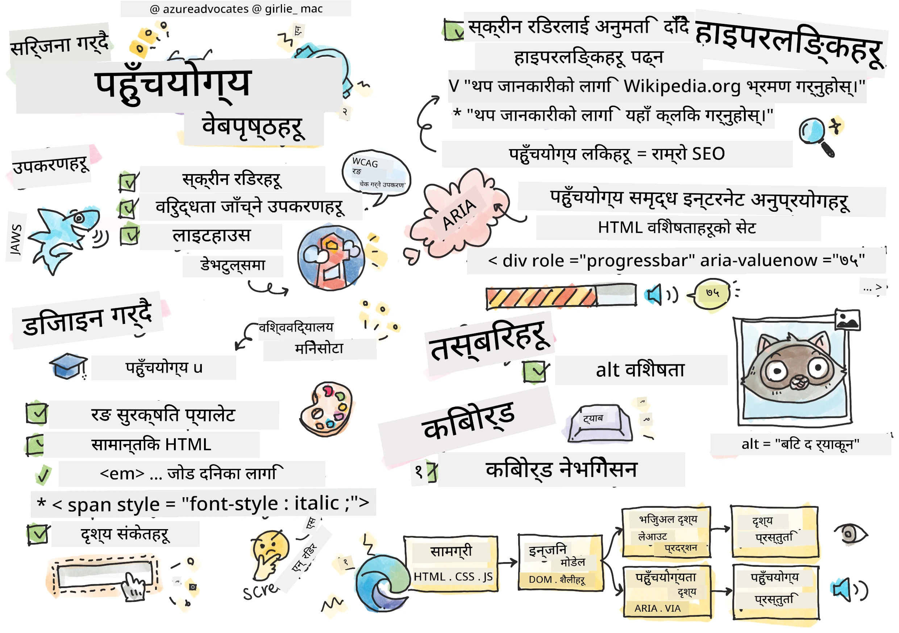
> स्केच नोट [टोमोमी इमुरा](https://twitter.com/girlie_mac) द्वारा

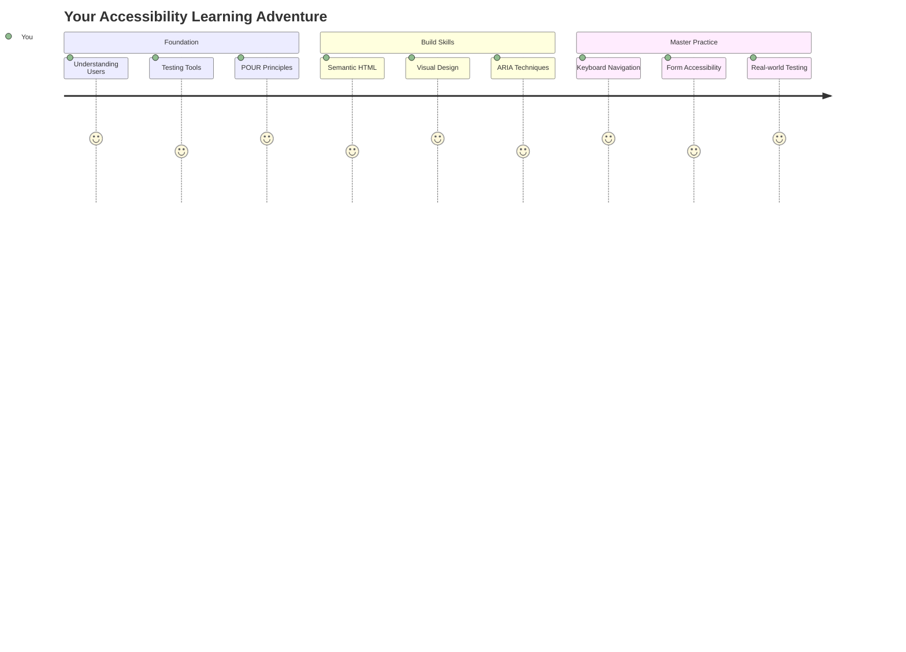

## प्रि-लेक्चर क्विज
[प्रि-लेक्चर क्विज](https://ff-quizzes.netlify.app/web/)

> वेबको शक्ति यसको सार्वभौमिकतामा छ। अपाङ्गता भए पनि सबैले पहुँच पाउनु अनिवार्य पक्ष हो।
>
> \- सर टिमोथी बर्नर्स-ली, W3C निर्देशक र वर्ल्ड वाइड वेबका आविष्कारक

तपाईंलाई यो थाहा पाउँदा अचम्म लाग्न सक्छ: जब तपाईं पहुँचयोग्य वेबसाइटहरू बनाउनुहुन्छ, तपाईं केवल अपाङ्गता भएका व्यक्तिहरूलाई सहयोग गरिरहनुभएको छैन—तपाईं वास्तवमा सबैका लागि वेबलाई अझ राम्रो बनाइरहनुभएको छ!

के तपाईंले कहिल्यै सडकको कुनामा भएका ती साना ढलानहरू देख्नुभएको छ? ती मूल रूपमा व्हीलचेयरका लागि डिजाइन गरिएका थिए, तर अहिले तिनीहरूले बच्चाको गाडी, डेलिभरी कामदारहरू, यात्रुहरू, र साइकल चालकहरूलाई पनि सहयोग गर्छन्। पहुँचयोग्य वेब डिजाइन पनि यस्तै हो—एक समूहलाई सहयोग गर्ने समाधानले प्रायः सबैलाई फाइदा पुर्‍याउँछ। रमाइलो, हैन?

यस पाठमा, हामी वेबसाइटहरू कसरी बनाउने भनेर अन्वेषण गर्नेछौं जसले सबैका लागि काम गर्छ, चाहे उनीहरूले वेब कसरी ब्राउज गरे पनि। तपाईंले वेब मापदण्डहरूमा पहिले नै समावेश गरिएका व्यावहारिक प्रविधिहरू पत्ता लगाउनुहुनेछ, परीक्षण उपकरणहरूसँग काम गर्नुहुनेछ, र पहुँचयोग्यता कसरी सबै प्रयोगकर्ताहरूका लागि तपाईंको साइटहरूलाई अझ उपयोगी बनाउँछ भन्ने देख्नुहुनेछ।

पाठको अन्त्यसम्ममा, तपाईंले पहुँचयोग्यतालाई तपाईंको विकास कार्यप्रवाहको प्राकृतिक भाग बनाउन आत्मविश्वास पाउनुहुनेछ। विचारशील डिजाइन विकल्पहरूले अरबौं प्रयोगकर्ताहरूका लागि वेब खोल्न कसरी मद्दत गर्न सक्छ भन्ने अन्वेषण गर्न तयार हुनुहुन्छ? सुरु गरौं!

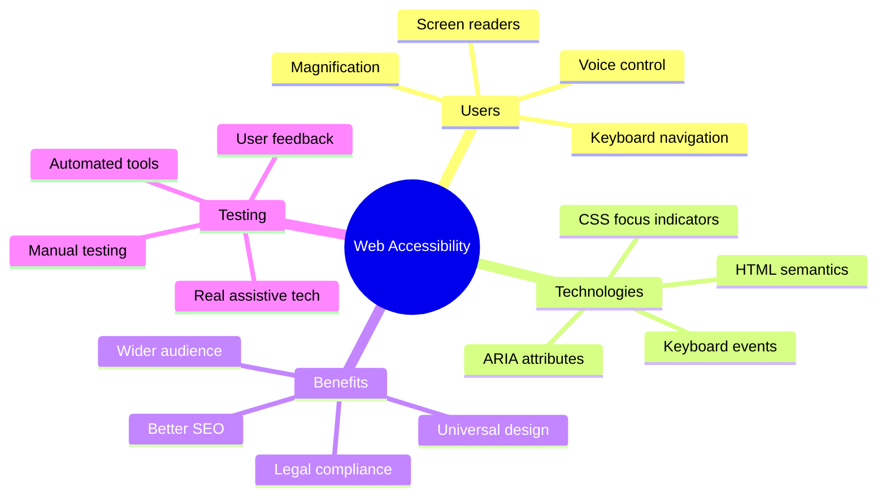

> तपाईं यो पाठ [Microsoft Learn](https://docs.microsoft.com/learn/modules/web-development-101/accessibility/?WT.mc_id=academic-77807-sagibbon) मा लिन सक्नुहुन्छ!

## सहायक प्रविधिहरू बुझ्दै

कोडिङमा जानु अघि, विभिन्न क्षमताका व्यक्तिहरूले वेबलाई वास्तवमा कसरी अनुभव गर्छन् भन्ने कुरा बुझ्न एक क्षण लिऔं। यो केवल सिद्धान्त होइन—यी वास्तविक-विश्व नेभिगेसन ढाँचाहरू बुझ्दा तपाईं एकदम राम्रो विकासकर्ता बन्नुहुनेछ!

सहायक प्रविधिहरू अपाङ्गता भएका व्यक्तिहरूलाई वेबसाइटहरूसँग अन्तरक्रिया गर्न मद्दत गर्ने अद्भुत उपकरणहरू हुन्। एकपटक तपाईंले यी प्रविधिहरू कसरी काम गर्छन् भन्ने कुरा बुझ्नुभयो भने, पहुँचयोग्य वेब अनुभवहरू सिर्जना गर्नु धेरै सहज हुन्छ। यो कसैको आँखाबाट तपाईंको कोड हेर्न सिक्न जस्तै हो।

### स्क्रिन रिडरहरू

[स्क्रिन रिडरहरू](https://en.wikipedia.org/wiki/Screen_reader) डिजिटल पाठलाई भाषण वा ब्रेल आउटपुटमा रूपान्तरण गर्ने अत्यन्त परिष्कृत प्रविधिहरू हुन्। यद्यपि तिनीहरू मुख्य रूपमा दृष्टि अपाङ्गता भएका व्यक्तिहरूले प्रयोग गर्छन्, तिनीहरू डिस्लेक्सिया जस्ता सिकाइ अपाङ्गता भएका प्रयोगकर्ताहरूका लागि पनि धेरै उपयोगी छन्।

म स्क्रिन रिडरलाई एकदमै स्मार्ट कथावाचकले पुस्तक पढिरहेको जस्तो सोच्न मन पराउँछु। यसले सामग्रीलाई तार्किक क्रममा पढ्छ, "बटन" वा "लिंक" जस्ता अन्तरक्रियात्मक तत्वहरू घोषणा गर्छ, र पृष्ठमा हिँड्नका लागि किबोर्ड सर्टकटहरू प्रदान गर्छ। तर यहाँ कुरा के छ—स्क्रिन रिडरहरूले आफ्नो जादू मात्र तब गर्न सक्छन् जब हामीले वेबसाइटहरू उचित संरचना र अर्थपूर्ण सामग्रीका साथ निर्माण गर्छौं। यो तपाईंको जिम्मेवारी हो विकासकर्ता!

**प्लेटफर्महरूमा लोकप्रिय स्क्रिन रिडरहरू:**
- **विन्डोज**: [NVDA](https://www.nvaccess.org/about-nvda/) (निःशुल्क र सबैभन्दा लोकप्रिय), [JAWS](https://webaim.org/articles/jaws/), [Narrator](https://support.microsoft.com/windows/complete-guide-to-narrator-e4397a0d-ef4f-b386-d8ae-c172f109bdb1/?WT.mc_id=academic-77807-sagibbon) (बिल्ट-इन)
- **macOS/iOS**: [VoiceOver](https://support.apple.com/guide/voiceover/welcome/10) (बिल्ट-इन र धेरै सक्षम)
- **एन्ड्रोइड**: [TalkBack](https://support.google.com/accessibility/android/answer/6283677) (बिल्ट-इन)
- **लिनक्स**: [Orca](https://wiki.gnome.org/Projects/Orca) (निःशुल्क र ओपन-सोर्स)

**स्क्रिन रिडरहरूले वेब सामग्री कसरी नेभिगेट गर्छन्:**

स्क्रिन रिडरहरूले अनुभवी प्रयोगकर्ताहरूका लागि ब्राउजिङलाई प्रभावकारी बनाउने धेरै नेभिगेसन विधिहरू प्रदान गर्छन्:
- **क्रमिक पढाइ**: सामग्रीलाई माथिबाट तलसम्म पढ्छ, पुस्तकको अनुसरण गरेजस्तै
- **ल्यान्डमार्क नेभिगेसन**: पृष्ठका भागहरूमा (हेडर, नेभ, मेन, फुटर) हाम फाल्छ
- **हेडिङ नेभिगेसन**: हेडिङहरू बीचमा हाम फाल्छ र पृष्ठ संरचना बुझ्छ
- **लिंक सूचीहरू**: छिटो पहुँचका लागि सबै लिंकहरूको सूची उत्पन्न गर्छ
- **फर्म नियन्त्रणहरू**: इनपुट फिल्डहरू र बटनहरू बीचमा सिधै नेभिगेट गर्छ

> 💡 **यो कुरा सुनेर तपाईंलाई अचम्म लाग्न सक्छ**: 68% स्क्रिन रिडर प्रयोगकर्ताहरू मुख्य रूपमा हेडिङहरूद्वारा नेभिगेट गर्छन् ([WebAIM सर्वेक्षण](https://webaim.org/projects/screenreadersurvey9/#finding))। यसको मतलब तपाईंको हेडिङ संरचना प्रयोगकर्ताहरूका लागि रोडम्याप जस्तै हो—जब तपाईंले यसलाई सही बनाउनुहुन्छ, तपाईंले मानिसहरूलाई तपाईंको सामग्री वरिपरि छिटो बाटो पत्ता लगाउन मद्दत गरिरहनुभएको छ!

### तपाईंको परीक्षण कार्यप्रवाह निर्माण गर्दै

यहाँ केही राम्रो समाचार छ—प्रभावकारी पहुँचयोग्यता परीक्षणले तपाईंलाई तनावग्रस्त बनाउनु पर्दैन! तपाईंले स्वचालित उपकरणहरू (तिनीहरूले स्पष्ट समस्याहरू पत्ता लगाउन उत्कृष्ट छन्) र केही हातले परीक्षणलाई संयोजन गर्न चाहनुहुन्छ। यहाँ एक व्यवस्थित दृष्टिकोण छ जसले धेरै समस्याहरू पत्ता लगाउँछ बिना तपाईंको सारा दिन खाइदिने:

**आवश्यक म्यानुअल परीक्षण कार्यप्रवाह:**

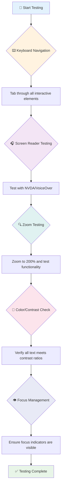

**चरण-दर-चरण परीक्षण चेकलिस्ट:**
1. **किबोर्ड नेभिगेसन**: केवल Tab, Shift+Tab, Enter, Space, र Arrow कुञ्जीहरू प्रयोग गर्नुहोस्
2. **स्क्रिन रिडर परीक्षण**: NVDA, VoiceOver, वा Narrator सक्षम गर्नुहोस् र आँखा बन्द गरेर नेभिगेट गर्नुहोस्
3. **जुम परीक्षण**: 200% र 400% जुम स्तरहरूमा परीक्षण गर्नुहोस्
4. **रङ कन्ट्रास्ट प्रमाणीकरण**: सबै पाठ र UI घटकहरू जाँच गर्नुहोस्
5. **फोकस सूचक परीक्षण**: सुनिश्चित गर्नुहोस् कि सबै अन्तरक्रियात्मक तत्वहरूमा देखिने फोकस अवस्था छ

✅ **लाइटहाउसबाट सुरु गर्नुहोस्**: तपाईंको ब्राउजरको DevTools खोल्नुहोस्, लाइटहाउस पहुँचयोग्यता अडिट चलाउनुहोस्, त्यसपछि परिणामहरूलाई तपाईंको म्यानुअल परीक्षण फोकस क्षेत्रहरू मार्गदर्शन गर्न प्रयोग गर्नुहोस्।

### जुम र म्याग्निफिकेसन उपकरणहरू

तपाईंले कहिल्यै आफ्नो फोनमा पाठ सानो हुँदा जुम गर्नको लागि पिन्च गर्नुभएको छ, वा उज्यालो घाममा आफ्नो ल्यापटप स्क्रिनमा आँखा चिम्लेर हेर्नुभएको छ? धेरै प्रयोगकर्ताहरूले सामग्रीलाई पढ्न योग्य बनाउन म्याग्निफिकेसन उपकरणहरूमा दैनिक निर्भर गर्छन्। यसमा कम दृष्टि भएका व्यक्तिहरू, वृद्ध व्यक्तिहरू, र कहिल्यै बाहिर वेबसाइट पढ्ने प्रयास गर्ने जो कोही समावेश छन्।

आधुनिक जुम प्रविधिहरू केवल चीजहरू ठूलो बनाउने भन्दा पर विकसित भएका छन्। यी उपकरणहरू कसरी काम गर्छन् भन्ने कुरा बुझ्दा तपाईंले उत्तरदायी डिजाइनहरू सिर्जना गर्न सक्नुहुन्छ जसले कुनै पनि म्याग्निफिकेसन स्तरमा कार्यात्मक र आकर्षक रहन्छ।

**आधुनिक ब्राउजर जुम क्षमताहरू:**
- **पृष्ठ जुम**: सबै सामग्रीलाई समानुपातिक रूपमा स्केल गर्छ (पाठ, छविहरू, लेआउट) - यो प्राथमिक विधि हो
- **केवल पाठ जुम**: मूल लेआउट कायम राख्दै फन्ट आकार बढाउँछ
- **पिन्च-टु-जुम**: अस्थायी म्याग्निफिकेसनको लागि मोबाइल इशारा समर्थन
- **ब्राउजर समर्थन**: सबै आधुनिक ब्राउजरहरूले कार्यक्षमता बिग्रन बिना 500% सम्म जुम समर्थन गर्छन्

**विशेष म्याग्निफिकेसन सफ्टवेयर:**
- **विन्डोज**: [Magnifier](https://support.microsoft.com/windows/use-magnifier-to-make-things-on-the-screen-easier-to-see-414948ba-8b1c-d3bd-8615-0e5e32204198) (बिल्ट-इन), [ZoomText](https://www.freedomscientific.com/training/zoomtext/getting-started/)
- **macOS/iOS**: [Zoom](https://www.apple.com/accessibility/mac/vision/) (बिल्ट-इन र उन्नत सुविधाहरू सहित)

> ⚠️ **डिजाइन विचार**: WCAG ले सामग्रीलाई 200% जुम गर्दा कार्यात्मक रहन आवश्यक छ। यस स्तरमा, क्षैतिज स्क्रोलिङ न्यूनतम हुनुपर्छ, र सबै अन्तरक्रियात्मक तत्वहरू पहुँचयोग्य रहनुपर्छ।

✅ **तपाईंको उत्तरदायी डिजाइन परीक्षण गर्नुहोस्**: तपाईंको ब्राउजरलाई 200% र 400% जुम गर्नुहोस्। के तपाईंको लेआउट सुन्दर रूपमा अनुकूल हुन्छ? के तपाईं अझै पनि अत्यधिक स्क्रोलिङ बिना सबै कार्यक्षमतामा पहुँच गर्न सक्नुहुन्छ?

## आधुनिक पहुँचयोग्यता परीक्षण उपकरणहरू

अब तपाईंले सहायक प्रविधिहरूको साथ मानिसहरूले वेब कसरी नेभिगेट गर्छन् भन्ने कुरा बुझ्नुभयो, आउनुहोस् उपकरणहरू अन्वेषण गरौं जसले तपाईंलाई पहुँचयोग्य वेबसाइटहरू निर्माण गर्न र परीक्षण गर्न मद्दत गर्छ।

यसलाई यसरी सोच्नुहोस्: स्वचालित उपकरणहरूले स्पष्ट समस्याहरू (जस्तै, हराएको alt पाठ) पत्ता लगाउन उत्कृष्ट छन्, जबकि हातले परीक्षणले तपाईंको साइट वास्तविक संसारमा प्रयोग गर्न राम्रो महसुस गर्छ भन्ने सुनिश्चित गर्न मद्दत गर्छ। सँगै, तिनीहरूले तपाईंलाई तपाईंको साइटहरू सबैका लागि काम गर्छन् भन्ने विश्वास दिन्छन्।

### रङ कन्ट्रास्ट परीक्षण

यहाँ केही राम्रो समाचार छ: रङ कन्ट्रास्ट पहुँचयोग्यताको सबैभन्दा सामान्य समस्या हो, तर यो समाधान गर्न सबैभन्दा सजिलो पनि हो। राम्रो कन्ट्रास्टले सबैलाई फाइदा पुर्‍याउँछ—दृष्टि अपाङ्गता भएका व्यक्तिहरूदेखि समुद्र किनारमा आफ्नो फोन पढ्ने प्रयास गर्ने व्यक्तिहरूसम्म।

**WCAG कन्ट्रास्ट आवश्यकताहरू:**

| पाठ प्रकार | WCAG AA (न्यूनतम) | WCAG AAA (उन्नत) |
|-----------|-------------------|---------------------|
| **सामान्य पाठ** (18pt भन्दा कम) | 4.5:1 कन्ट्रास्ट अनुपात | 7:1 कन्ट्रास्ट अनुपात |
| **ठूलो पाठ** (18pt+ वा 14pt+ बोल्ड) | 3:1 कन्ट्रास्ट अनुपात | 4.5:1 कन्ट्रास्ट अनुपात |
| **UI घटकहरू** (बटनहरू, फर्म सीमा) | 3:1 कन्ट्रास्ट अनुपात | 3:1 कन्ट्रास्ट अनुपात |

**आवश्यक परीक्षण उपकरणहरू:**
- [Colour Contrast Analyser](https://www.tpgi.com/color-contrast-checker/) - कलर पिकर सहित डेस्कटप एप
- [WebAIM Contrast Checker](https://webaim.org/resources/contrastchecker/) - वेब-आधारित तत्काल प्रतिक्रिया सहित
- [Stark](https://www.getstark.co/) - Figma, Sketch, Adobe XD का लागि डिजाइन टूल प्लगइन
- [Accessible Colors](https://accessible-colors.com/) - पहुँचयोग्य रङ प्यालेटहरू फेला पार्नुहोस्

✅ **रङ प्यालेटहरू राम्रो बनाउनुहोस्**: तपाईंको ब्रान्ड रङहरूबाट सुरु गर्नुहोस् र पहुँचयोग्य भेरिएसनहरू सिर्जना गर्न कन्ट्रास्ट चेकरहरू प्रयोग गर्नुहोस्। यीलाई तपाईंको डिजाइन प्रणालीको पहुँचयोग्य रङ टोकनको रूपमा दस्तावेज गर्नुहोस्।

### व्यापक पहुँचयोग्यता अडिट

सबैभन्दा प्रभावकारी पहुँचयोग्यता परीक्षणले धेरै दृष्टिकोणहरूलाई संयोजन गर्छ। कुनै एकल उपकरणले सबै कुरा पत्ता लगाउँदैन, त्यसैले विभिन्न विधिहरूको साथ परीक्षण दिनचर्या निर्माण गर्दा व्यापक कवरेज सुनिश्चित हुन्छ।

**ब्राउजर-आधारित परीक्षण (DevTools मा निर्मित):**
- **क्रोम/एज**: लाइटहाउस पहुँचयोग्यता अडिट + पहुँचयोग्यता प्यानल
- **फायरफक्स**: विस्तृत ट्री भ्यू सहित पहुँचयोग्यता निरीक्षक
- **सफारी**: वेब निरीक्षकमा अडिट ट्याब VoiceOver सिमुलेशन सहित

**व्यावसायिक परीक्षण एक्सटेन्सनहरू:**
- [axe DevTools](https://www.deque.com/axe/devtools/) - उद्योग-मानक स्वचालित परीक्षण
- [WAVE](https://wave.webaim.org/extension/) - त्रुटि हाइलाइटिङको साथ दृश्य प्रतिक्रिया
- [Accessibility Insights](https://accessibilityinsights.io/) - माइक्रोसफ्टको व्यापक परीक्षण सूट

**कमाण्ड-लाइन र CI/CD एकीकरण:**
- [axe-core](https://github.com/dequelabs/axe-core) - स्वचालित परीक्षणको लागि जाभास्क्रिप्ट लाइब्रेरी
- [Pa11y](https://pa11y.org/) - कमाण्ड-लाइन पहुँचयोग्यता परीक्षण उपकरण
- [Lighthouse CI](https://github.com/GoogleChrome/lighthouse-ci) - स्वचालित पहुँचयोग्यता स्कोरिङ

> 🎯 **परीक्षण लक्ष्य**: लाइटहाउस पहुँचयोग्यता स्कोर 95+ लाई तपाईंको आधाररेखा बनाउने लक्ष्य राख्नुहोस्। याद गर्नुहोस्, स्वचालित उपकरणहरूले केवल 30-40% पहुँचयोग्यता समस्याहरू पत्ता लगाउँछन्—म्यानुअल परीक्षण अझै आवश्यक छ!

### 🧠 **परीक्षण सीप जाँच: समस्या पत्ता लगाउन तयार?**

**आउनुहोस् हेर्नुहोस् कि तपाईं पहुँचयोग्यता परीक्षणको बारेमा कस्तो महसुस गर्दै हुनुहुन्छ:**
- कुन परीक्षण विधि अहिले तपाईंलाई सबैभन्दा सहज लाग्छ?
- के तपाईं एक दिनभरि केवल किबोर्ड नेभिगेसन प्रयोग गर्ने कल्पना गर्न सक्नुहुन्छ?
- अनलाइन तपाईंले व्यक्तिगत रूपमा अनुभव गरेको एक पहुँचयोग्यता बाधा के हो?

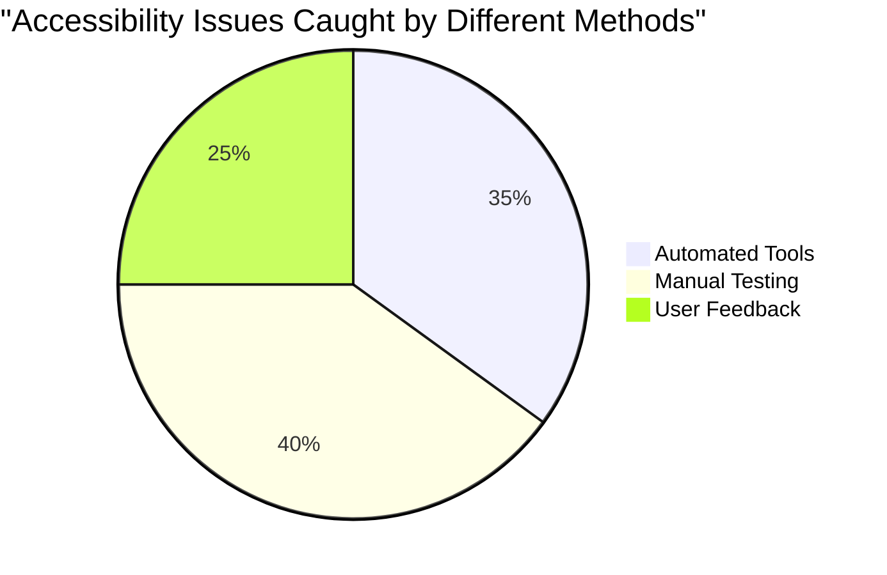

> **आत्मविश्वास बढाउने कुरा**: व्यावसायिक पहुँचयोग्यता परीक्षकहरूले यस्तै विधिहरूको संयोजन प्रयोग गर्छन्। तपाईं उद्योग-मानक अभ्यासहरू सिक्दै हुनुहुन्छ!

## सुरुबाट पहुँचयोग्यता निर्माण गर्दै

पहिलो दिनदेखि नै पहुँचयोग्यता सफलताको कुञ्जी हो। मलाई थाहा छ "म पछि पहुँचयोग्यता थप्छु" भन्ने सोच्न लोभलाग्दो छ, तर यो घर बनाइसकेपछि र्याम्प थप्न खोज्न जस्तै हो। सम्भव? हो। सजिलो? खासै होइन।

पहुँचयोग्यतालाई घर योजना जस्तै सोच्नुहोस्—पहिलो वास्तुकला योजनामा व्हीलचेयर पहुँच समावेश गर्नु धेरै सजिलो हुन्छ, पछि सबै कुरा पुनःनिर्माण गर्नुभन्दा।

### POUR सिद्धान्तहरू: तपाईंको पहुँचयोग्यता आधार

वेब सामग्री पहुँचयोग्यता दिशानिर्देशहरू (WCAG) चार मौलिक सिद्धान्तहरूमा आधारित छन् जसले POUR बनाउँछन्। चिन्ता नगर्नुहोस्—यी शैक्षिक अवधारणाहरू होइनन्! तिनीहरू वास्तवमा सबैका लागि काम गर्ने सामग्री बनाउने व्यावहारिक दिशानिर्देशहरू हुन्।

एकपटक तपाईंले POUR को अभ्यास गर्नुभयो भने, पहुँचयोग्यता निर्णयहरू लिन धेरै सहज हुन्छ। यो तपाईंको डिजाइन विकल्पहरू मार्गदर्शन गर्ने मानसिक चेकलिस्ट जस्तै हो। यसलाई टुक्रा टुक्रामा बुझौं:

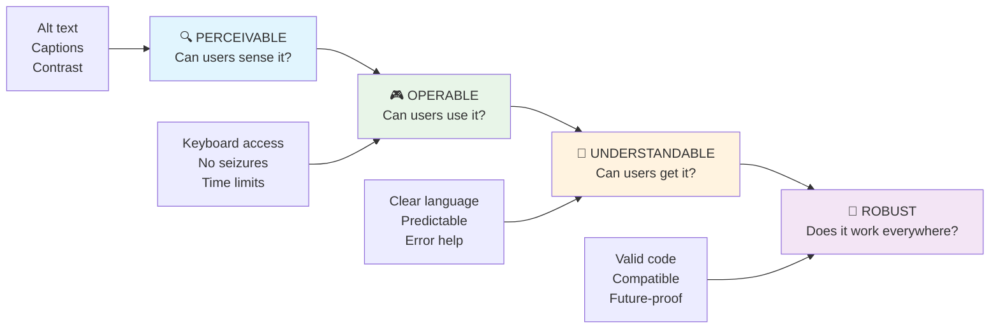

**🔍 बुझ्न सकिने**: जानकारी प्रयोगकर्ताहरूले आफ्नो उपलब्ध इन्द्रियहरू मार्फत बुझ्न सक्ने तरिकामा प्रस्तुत गर्नुपर्छ

- गैर-पाठ सामग्री (छविहरू, भिडियोहरू, अडियो) का लागि पाठ विकल्पहरू प्रदान गर्नुहोस्
- सबै पाठ र UI घटकहरूको लागि पर्याप्त रङ कन्ट्रास्ट सुनिश्चित गर्नुहोस्
- मल्टिमिडिया सामग्रीका लागि क्याप्सन र ट्रान्सक्रिप्टहरू प्रस्ताव गर्नुहोस्
- सामग्रीलाई 200% सम्म पुनःआकार
- **विभिन्न ब्राउजर, उपकरण, र सहायक उपकरणहरूमा परीक्षण गर्नुहोस्**
- **सामग्रीलाई यसरी संरचना गर्नुहोस् कि उन्नत सुविधाहरू समर्थित नभएको अवस्थामा पनि राम्रोसँग काम गरोस्**

### 🎯 **POUR सिद्धान्तहरूको जाँच: यसलाई प्रभावकारी बनाउने**

**आधारभूत कुराहरूको छिटो समीक्षा:**
- के तपाईं कुनै वेबसाइट सुविधाको बारेमा सोच्न सक्नुहुन्छ जसले प्रत्येक POUR सिद्धान्तलाई असफल बनाउँछ?
- कुन सिद्धान्त तपाईंलाई विकासकर्ता रूपमा सबैभन्दा प्राकृतिक लाग्छ?
- यी सिद्धान्तहरूले अपांगता भएका प्रयोगकर्ताहरू मात्र नभई सबैका लागि डिजाइन सुधार गर्न कसरी मद्दत गर्न सक्छन्?

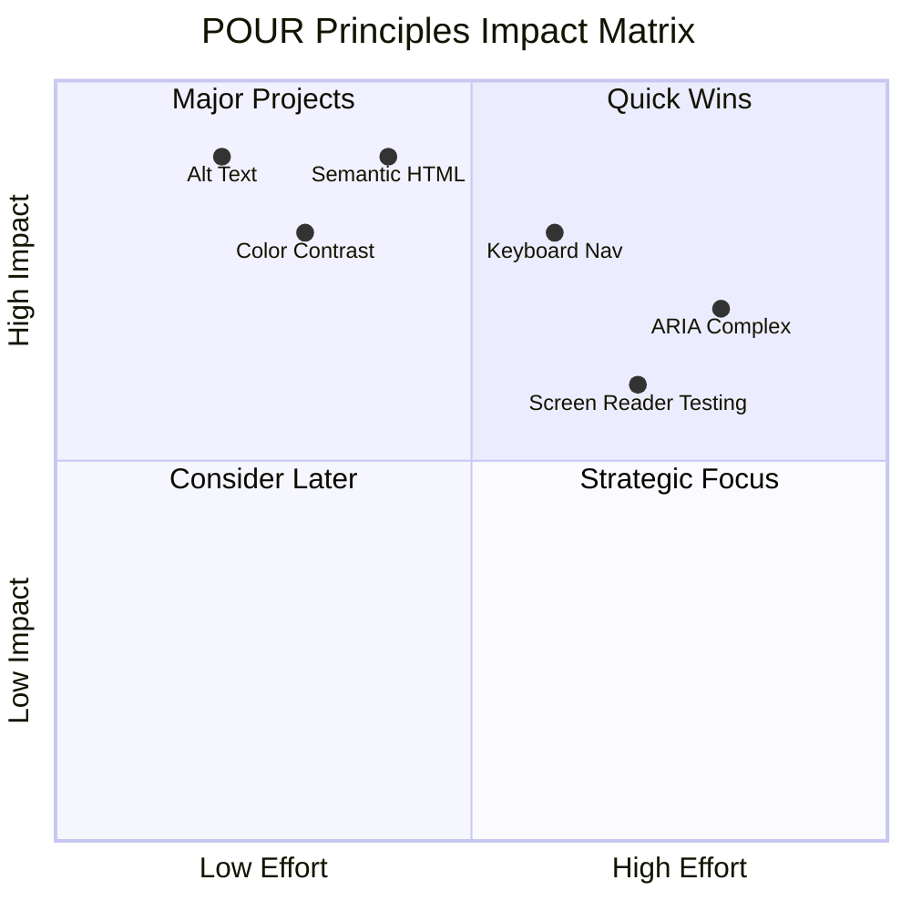

> **याद गर्नुहोस्**: उच्च प्रभाव र कम प्रयास सुधारहरूबाट सुरु गर्नुहोस्। सेम्यान्टिक HTML र alt टेक्स्टले न्यूनतम प्रयासमा सबैभन्दा ठूलो पहुँचयोग्यता सुधार दिन्छ!

## पहुँचयोग्य दृश्य डिजाइन सिर्जना गर्दै

राम्रो दृश्य डिजाइन र पहुँचयोग्यता हातमा हात मिलाएर जान्छ। जब तपाईं पहुँचयोग्यताको ध्यानमा राखेर डिजाइन गर्नुहुन्छ, तपाईंले प्रायः पत्ता लगाउनुहुन्छ कि यी सीमाहरूले सफा, अधिक आकर्षक समाधानहरू सिर्जना गर्छन् जसले सबै प्रयोगकर्ताहरूलाई फाइदा पुर्‍याउँछ।

आउनुहोस्, सबैका लागि काम गर्ने दृश्यात्मक रूपमा आकर्षक डिजाइनहरू कसरी सिर्जना गर्ने भनेर अन्वेषण गरौं, चाहे तिनीहरूको दृश्य क्षमता वा सामग्री हेर्ने सर्तहरू जस्तोसुकै किन नहोस्।

### रंग र दृश्य पहुँचयोग्यता रणनीतिहरू

रंग सञ्चारको लागि शक्तिशाली हो, तर यो कहिल्यै महत्वपूर्ण जानकारी व्यक्त गर्ने एकमात्र तरिका हुनु हुँदैन। रंगको सीमाभन्दा बाहिर डिजाइन गर्दा अधिक बलियो, समावेशी अनुभवहरू सिर्जना हुन्छन् जसले धेरै परिस्थितिहरूमा काम गर्छ।

**रंग दृष्टि भिन्नताहरूको लागि डिजाइन गर्नुहोस्:**

लगभग ८% पुरुष र ०.५% महिलाहरूमा केही प्रकारको रंग दृष्टि भिन्नता (प्रायः "रंग अन्धोपन" भनिन्छ) हुन्छ। सबैभन्दा सामान्य प्रकारहरू हुन्:
- **Deuteranopia**: रातो र हरियो छुट्याउन गाह्रो
- **Protanopia**: रातो अधिक धुमिल देखिन्छ
- **Tritanopia**: नीलो र पहेंलो छुट्याउन गाह्रो (दुर्लभ)

**समावेशी रंग रणनीतिहरू:**

```css
/* ❌ Bad: Using only color to indicate status */
.error { color: red; }
.success { color: green; }

/* ✅ Good: Color plus icons and context */
.error {
  color: #d32f2f;
  border-left: 4px solid #d32f2f;
}
.error::before {
  content: "⚠️";
  margin-right: 8px;
}

.success {
  color: #2e7d32;
  border-left: 4px solid #2e7d32;
}
.success::before {
  content: "✅";
  margin-right: 8px;
}
```

**मूलभूत कन्ट्रास्ट आवश्यकताहरूभन्दा पर:**
- रंग अन्धोपन सिमुलेटरहरूसँग तपाईंको रंग छनोट परीक्षण गर्नुहोस्
- रंग कोडिङसँगै ढाँचाहरू, बनावटहरू, वा आकारहरू प्रयोग गर्नुहोस्
- अन्तरक्रियात्मक अवस्थाहरू रंग बिना पनि छुट्याउन सकिने सुनिश्चित गर्नुहोस्
- उच्च कन्ट्रास्ट मोडमा तपाईंको डिजाइन कस्तो देखिन्छ विचार गर्नुहोस्

✅ **तपाईंको रंग पहुँचयोग्यता परीक्षण गर्नुहोस्**: [Coblis](https://www.color-blindness.com/coblis-color-blindness-simulator/) जस्ता उपकरणहरू प्रयोग गरेर तपाईंको साइट विभिन्न प्रकारका रंग दृष्टि भएका प्रयोगकर्ताहरूलाई कस्तो देखिन्छ हेर्नुहोस्।

### फोकस संकेतकहरू र अन्तरक्रिया डिजाइन

फोकस संकेतकहरू डिजिटल कर्सरको बराबर हुन्—तिनीहरूले किबोर्ड प्रयोगकर्ताहरूलाई पृष्ठमा कहाँ छन् भनेर देखाउँछन्। राम्रोसँग डिजाइन गरिएका फोकस संकेतकहरूले सबैका लागि अन्तरक्रियाहरू स्पष्ट र अनुमान योग्य बनाउँछन्।

**आधुनिक फोकस संकेतकका उत्कृष्ट अभ्यासहरू:**

```css
/* Enhanced focus styles that work across browsers */
button:focus-visible {
  outline: 2px solid #0066cc;
  outline-offset: 2px;
  box-shadow: 0 0 0 4px rgba(0, 102, 204, 0.25);
}

/* Remove focus outline for mouse users, preserve for keyboard users */
button:focus:not(:focus-visible) {
  outline: none;
}

/* Focus-within for complex components */
.card:focus-within {
  box-shadow: 0 0 0 3px rgba(74, 144, 164, 0.5);
  border-color: #4A90A4;
}

/* Ensure focus indicators meet contrast requirements */
.custom-focus:focus-visible {
  outline: 3px solid #ffffff;
  outline-offset: 2px;
  box-shadow: 0 0 0 6px #000000;
}
```

**फोकस संकेतक आवश्यकताहरू:**
- **दृश्यता**: वरपरका तत्वहरूसँग कम्तिमा ३:१ कन्ट्रास्ट अनुपात हुनुपर्छ
- **चौडाइ**: सम्पूर्ण तत्व वरिपरि न्यूनतम २px मोटाई
- **स्थिरता**: फोकस अन्यत्र सर्दासम्म दृश्य रहनुपर्छ
- **भिन्नता**: अन्य UI अवस्थाहरूबाट दृश्य रूपमा फरक हुनुपर्छ

> 💡 **डिजाइन सुझाव**: उत्कृष्ट फोकस संकेतकहरूले दृश्यता सुनिश्चित गर्न outline, box-shadow, र रंग परिवर्तनको संयोजन प्रयोग गर्छन्।

✅ **तपाईंको फोकस संकेतकहरूको अडिट गर्नुहोस्**: तपाईंको वेबसाइटमा ट्याब मार्फत जानुहोस् र कुन तत्वहरूमा स्पष्ट फोकस संकेतकहरू छन् नोट गर्नुहोस्। के कुनै देख्न गाह्रो छ वा पूर्ण रूपमा हराइरहेको छ?

### सेम्यान्टिक HTML: पहुँचयोग्यताको आधार

सेम्यान्टिक HTML भनेको सहायक प्रविधिहरूलाई तपाईंको वेबसाइटको लागि GPS प्रणाली दिनु जस्तै हो। जब तपाईं HTML तत्वहरूलाई तिनीहरूको उद्देश्यका लागि सही रूपमा प्रयोग गर्नुहुन्छ, तपाईं स्क्रिन रिडरहरू, किबोर्डहरू, र अन्य उपकरणहरूलाई प्रभावकारी रूपमा नेभिगेट गर्न मद्दत गर्न विस्तृत रोडम्याप प्रदान गर्दै हुनुहुन्छ।

मलाई लाग्छ सेम्यान्टिक HTML भनेको राम्रोसँग व्यवस्थित पुस्तकालय र स्पष्ट श्रेणीहरू र सहायक संकेतहरू भएको गोदामको बीचको भिन्नता हो। दुवै ठाउँमा समान पुस्तकहरू छन्, तर कुन ठाउँमा तपाईंले केही खोज्न चाहनुहुन्छ? ठीक छ!

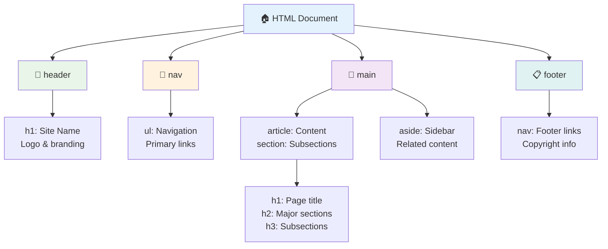

**पहुँचयोग्य पृष्ठ संरचनाको निर्माण ब्लकहरू:**

```html
<!-- Landmark elements provide page navigation structure -->
<header>
  <h1>Your Site Name</h1>
  <nav aria-label="Main navigation">
    <ul>
      <li><a href="/home">Home</a></li>
      <li><a href="/about">About</a></li>
      <li><a href="/services">Services</a></li>
    </ul>
  </nav>
</header>

<main>
  <article>
    <header>
      <h1>Article Title</h1>
      <p>Published on <time datetime="2024-10-14">October 14, 2024</time></p>
    </header>
    
    <section>
      <h2>First Section</h2>
      <p>Content that relates to this section...</p>
    </section>
    
    <section>
      <h2>Second Section</h2>
      <p>More related content...</p>
    </section>
  </article>
  
  <aside>
    <h2>Related Links</h2>
    <nav aria-label="Related articles">
      <ul>
        <li><a href="/related-1">First related article</a></li>
        <li><a href="/related-2">Second related article</a></li>
      </ul>
    </nav>
  </aside>
</main>

<footer>
  <p>&copy; 2024 Your Site Name. All rights reserved.</p>
  <nav aria-label="Footer links">
    <ul>
      <li><a href="/privacy">Privacy Policy</a></li>
      <li><a href="/contact">Contact Us</a></li>
    </ul>
  </nav>
</footer>
```

**किन सेम्यान्टिक HTML पहुँचयोग्यता परिवर्तन गर्छ:**

| सेम्यान्टिक तत्व | उद्देश्य | स्क्रिन रिडर लाभ |
|------------------|---------|----------------------|
| `<header>` | पृष्ठ वा खण्ड शीर्षक | "ब्यानर ल्यान्डमार्क" - शीर्षमा छिटो नेभिगेसन |
| `<nav>` | नेभिगेसन लिंकहरू | "नेभिगेसन ल्यान्डमार्क" - नेभ खण्डहरूको सूची |
| `<main>` | प्राथमिक पृष्ठ सामग्री | "मुख्य ल्यान्डमार्क" - सामग्रीमा सिधै जानुहोस् |
| `<article>` | आत्म-समावेश सामग्री | लेखको सीमा घोषणा गर्छ |
| `<section>` | विषयवस्तु समूहहरू | सामग्री संरचना प्रदान गर्छ |
| `<aside>` | सम्बन्धित साइडबार सामग्री | "पूरक ल्यान्डमार्क" |
| `<footer>` | पृष्ठ वा खण्डको अन्त्य | "सामग्री जानकारी ल्यान्डमार्क" |

**स्क्रिन रिडरको सुपरपावरहरू सेम्यान्टिक HTMLसँग:**
- **ल्यान्डमार्क नेभिगेसन**: प्रमुख पृष्ठ खण्डहरू बीच तुरुन्तै जम्प गर्नुहोस्
- **हेडिङ रूपरेखा**: तपाईंको हेडिङ संरचनाबाट सामग्रीको तालिका उत्पन्न गर्नुहोस्
- **तत्व सूचीहरू**: सबै लिंक, बटन, वा फारम नियन्त्रणहरूको सूची सिर्जना गर्नुहोस्
- **सन्दर्भ जागरूकता**: सामग्री खण्डहरू बीचको सम्बन्ध बुझ्नुहोस्

> 🎯 **छिटो परीक्षण**: तपाईंको साइटमा स्क्रिन रिडरको साथ ल्यान्डमार्क सर्टकटहरू (NVDA/JAWS मा D ल्यान्डमार्कका लागि, H हेडिङका लागि, K लिंकका लागि) प्रयोग गरेर नेभिगेट गर्न प्रयास गर्नुहोस्। के नेभिगेसनले तपाईंको सामग्रीको अर्थ बनाउँछ?

### 🏗️ **सेम्यान्टिक HTML मास्टरी जाँच: बलियो आधार निर्माण गर्दै**

**आउनुहोस्, तपाईंको सेम्यान्टिक बुझाइको मूल्यांकन गरौं:**
- के तपाईं HTML हेरेर मात्र पृष्ठका ल्यान्डमार्कहरू पहिचान गर्न सक्नुहुन्छ?
- तपाईं कसरी आफ्नो साथीलाई `<section>` र `<div>` बीचको भिन्नता व्याख्या गर्नुहुन्छ?
- यदि स्क्रिन रिडर प्रयोगकर्ताले नेभिगेसन समस्याहरू रिपोर्ट गरे भने तपाईंले पहिलो कुरा के जाँच गर्नुहुन्छ?

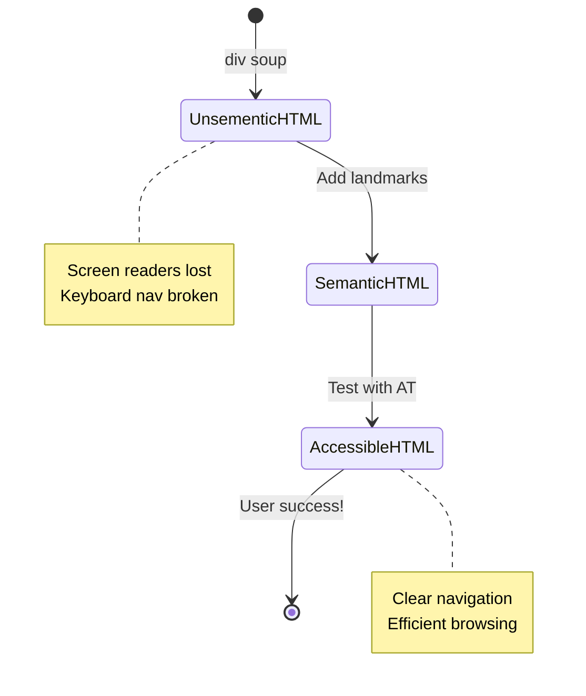

> **प्रो सुझाव**: राम्रो सेम्यान्टिक HTMLले स्वचालित रूपमा लगभग ७०% पहुँचयोग्यता समस्याहरू समाधान गर्छ। यो आधार मास्टर गर्नुहोस् र तपाईं राम्रो बाटोमा हुनुहुन्छ!

✅ **तपाईंको सेम्यान्टिक संरचनाको अडिट गर्नुहोस्**: तपाईंको ब्राउजरको DevTools मा पहुँचयोग्यता प्यानल प्रयोग गरेर पहुँचयोग्यता रूख हेर्नुहोस् र तपाईंको मार्कअपले तार्किक संरचना सिर्जना गरेको सुनिश्चित गर्नुहोस्।

### हेडिङ पदानुक्रम: तार्किक सामग्री रूपरेखा सिर्जना गर्दै

हेडिङहरू पहुँचयोग्य सामग्रीको लागि अत्यन्त महत्त्वपूर्ण छन्—यी सबैलाई सँगै राख्ने मेरुदण्ड जस्तै हुन्। स्क्रिन रिडर प्रयोगकर्ताहरूले तपाईंको सामग्री बुझ्न र नेभिगेट गर्न हेडिङहरूमा धेरै निर्भर गर्छन्। यो स्कूलमा outline बनाउने जस्तै हो—तपाईं "I. मुख्य बिन्दु" बाट सिधै "C. उप-बिन्दु" मा नजाने, हैन?

**हेडिङको सुनौलो नियम यहाँ छ:**
कहिल्यै स्तरहरू नछोड्नुहोस्। सधैं तार्किक रूपमा `<h1>` बाट `<h2>` र त्यसपछि `<h3>` मा प्रगति गर्नुहोस्। 

**सिद्ध हेडिङ संरचना उदाहरण:**

```html
<!-- ✅ Excellent: Logical, hierarchical progression -->
<main>
  <h1>Complete Guide to Web Accessibility</h1>
  
  <section>
    <h2>Understanding Screen Readers</h2>
    <p>Introduction to screen reader technology...</p>
    
    <h3>Popular Screen Reader Software</h3>
    <p>NVDA, JAWS, and VoiceOver comparison...</p>
    
    <h3>Testing with Screen Readers</h3>
    <p>Step-by-step testing instructions...</p>
  </section>
  
  <section>
    <h2>Color and Contrast Guidelines</h2>
    <p>Designing with sufficient contrast...</p>
    
    <h3>WCAG Contrast Requirements</h3>
    <p>Understanding the different contrast levels...</p>
    
    <h3>Testing Tools and Techniques</h3>
    <p>Tools for verifying contrast ratios...</p>
  </section>
</main>
```

```html
<!-- ❌ Problematic: Skipping levels, inconsistent structure -->
<h1>Page Title</h1>
<h3>Subsection</h3> <!-- Skipped h2 -->
<h2>This should come before h3</h2>
<h1>Another main heading?</h1> <!-- Multiple h1s -->
```

**हेडिङका उत्कृष्ट अभ्यासहरू:**
- **प्रत्येक पृष्ठमा एक `<h1>`**: सामान्यतया तपाईंको मुख्य पृष्ठ शीर्षक वा प्राथमिक सामग्री शीर्षक
- **तार्किक प्रगति**: स्तरहरू कहिल्यै नछोड्नुहोस् (h1 → h2 → h3, h1 → h3 होइन)
- **वर्णनात्मक सामग्री**: हेडिङहरूलाई सन्दर्भ बाहिर पढ्दा पनि अर्थपूर्ण बनाउनुहोस्
- **CSSसँग दृश्य शैलीकरण**: उपस्थिति को लागी CSS प्रयोग गर्नुहोस्, संरचनाको लागि HTML स्तरहरू

**स्क्रिन रिडर नेभिगेसन तथ्याङ्क:**
- ६८% स्क्रिन रिडर प्रयोगकर्ताहरू हेडिङद्वारा नेभिगेट गर्छन् ([WebAIM सर्वेक्षण](https://webaim.org/projects/screenreadersurvey9/#finding))
- प्रयोगकर्ताहरू तार्किक हेडिङ रूपरेखा पाउने अपेक्षा गर्छन्
- हेडिङहरूले पृष्ठ संरचना बुझ्नको लागि छिटो तरिका प्रदान गर्छन्

> 💡 **प्रो सुझाव**: "HeadingsMap" जस्ता ब्राउजर एक्सटेन्सनहरू प्रयोग गरेर तपाईंको हेडिङ संरचना दृश्य बनाउनुहोस्। यो राम्रोसँग व्यवस्थित सामग्रीको तालिका जस्तै पढ्नुपर्छ।

✅ **तपाईंको हेडिङ संरचना परीक्षण गर्नुहोस्**: स्क्रिन रिडरको हेडिङ नेभिगेसन (NVDA मा H कुञ्जी) प्रयोग गरेर तपाईंको हेडिङहरू मार्फत जम्प गर्नुहोस्। के प्रगति तार्किक रूपमा तपाईंको सामग्रीको कथा बताउँछ?

### उन्नत दृश्य पहुँचयोग्यता प्रविधिहरू

कन्ट्रास्ट र रंगको आधारभूत कुराहरूभन्दा पर, परिष्कृत प्रविधिहरू छन् जसले साँच्चै समावेशी दृश्य अनुभवहरू सिर्जना गर्न मद्दत गर्छ। यी विधिहरूले तपाईंको सामग्रीलाई विभिन्न हेर्ने सर्तहरू र सहायक प्रविधिहरूमा काम गर्न सुनिश्चित गर्छ।

**आवश्यक दृश्य सञ्चार रणनीतिहरू:**

- **बहु-ढाँचाको प्रतिक्रिया**: दृश्य, पाठ्य, र कहिलेकाहीं अडियो संकेतहरू संयोजन गर्नुहोस्
- **प्रगतिशील खुलासा**: जानकारीलाई पचाउन सकिने खण्डहरूमा प्रस्तुत गर्नुहोस्
- **सुसंगत अन्तरक्रिया ढाँचाहरू**: परिचित UI परम्पराहरू प्रयोग गर्नुहोस्
- **प्रतिक्रियात्मक टाइपोग्राफी**: उपकरणहरूमा पाठलाई उपयुक्त रूपमा स्केल गर्नुहोस्
- **लोडिङ र त्रुटि अवस्थाहरू**: सबै प्रयोगकर्ता कार्यहरूको लागि स्पष्ट प्रतिक्रिया प्रदान गर्नुहोस्

**CSS पहुँचयोग्यता सुधारका लागि उपयोगिताहरू:**

```css
/* Screen reader only text - visually hidden but accessible */
.sr-only {
  position: absolute;
  width: 1px;
  height: 1px;
  padding: 0;
  margin: -1px;
  overflow: hidden;
  clip: rect(0, 0, 0, 0);
  white-space: nowrap;
  border: 0;
}

/* Skip link for keyboard navigation */
.skip-link {
  position: absolute;
  top: -40px;
  left: 6px;
  background: #000000;
  color: #ffffff;
  padding: 8px 16px;
  text-decoration: none;
  border-radius: 4px;
  font-weight: bold;
  transition: top 0.3s ease;
  z-index: 1000;
}

.skip-link:focus {
  top: 6px;
}

/* Reduced motion respect */
@media (prefers-reduced-motion: reduce) {
  .skip-link {
    transition: none;
  }
  
  * {
    animation-duration: 0.01ms !important;
    animation-iteration-count: 1 !important;
    transition-duration: 0.01ms !important;
  }
}

/* High contrast mode support */
@media (prefers-contrast: high) {
  .button {
    border: 2px solid;
  }
}
```

> 🎯 **पहुँचयोग्यता ढाँचा**: "स्किप लिंक" किबोर्ड प्रयोगकर्ताहरूको लागि आवश्यक छ। यो तपाईंको पृष्ठमा पहिलो फोकसयोग्य तत्व हुनुपर्छ र मुख्य सामग्री क्षेत्रमा सिधै जम्प गर्नुपर्छ।

✅ **स्किप नेभिगेसन कार्यान्वयन गर्नुहोस्**: तपाईंको पृष्ठहरूमा स्किप लिंकहरू थप्नुहोस् र पृष्ठ लोड भएपछि ट्याब थिचेर तिनीहरूलाई परीक्षण गर्नुहोस्। तिनीहरूले देखा पर्नुपर्छ र तपाईंलाई मुख्य सामग्रीमा जम्प गर्न अनुमति दिनुपर्छ।

## अर्थपूर्ण लिंक टेक्स्ट तयार गर्दै

लिंकहरू वेबका राजमार्गहरू हुन्, तर खराब लेखिएको लिंक टेक्स्ट भनेको "स्थान" मात्र लेखिएको सडक संकेतहरू जस्तै हो। धेरै उपयोगी छैन, हैन?

### लिंक नेभिगेसन ढाँचाहरू बुझ्दै

स्क्रिन रिडरहरूले राम्रोसँग लेखिएको लिंक टेक्स्टमा निर्भर गर्ने शक्तिशाली लिंक नेभिगेसन सुविधाहरू प्रदान गर्छन्:

**लिंक नेभिगेसन विधिहरू:**
- **क्रमिक पढाइ**: लिंकहरू सामग्री प्रवाहको भागको रूपमा सन्दर्भमा पढिन्छ
- **लिंक सूची सिर्जना**: सबै पृष्ठ लिंकहरू खोजयोग्य निर्देशिकामा संकलन गरिन्छ
- **छिटो नेभिगेसन**: किबोर्ड सर्टकटहरू प्रयोग गरेर लिंकहरू बीच जम्प गर्नुहोस् (NVDA मा K)
- **खोज कार्यक्षमता**: आंशिक पाठ टाइप गरेर विशिष्ट लिंकहरू फेला पार्नुहोस्

**किन सन्दर्भ महत्त्वपूर्ण छ:**
जब स्क्रिन रिडर प्रयोगकर्ताहरूले लिंक सूची सिर्जना गर्छन्, तिनीहरूले यस्तो देख्छन्:
- "रिपोर्ट डाउनलोड गर्नुहोस्"
- "थप जान्नुहोस्"
- "यहाँ क्लिक गर्नुहोस्"
- "गोपनीयता नीति"
- "यहाँ क्लिक गर्नुहोस्"

यी लिंकहरू मध्ये केवल दुईले सन्दर्भ बाहिर पढ्दा उपयोगी जानकारी प्रदान गर्छन्!

> 📊 **प्रयोगकर्ता प्रभाव**: स्क्रिन रिडर प्रयोगकर्ताहरूले लिंक सूची स्क्यान गरेर पृष्ठ सामग्री छिटो बुझ्न खोज्छन्। सामान्य लिंक टेक्स्टले तिनीहरूलाई प्रत्येक लिंकको सन्दर्भमा फर्केर नेभिगेट गर्न बाध्य पार्छ, जसले तिनीहरूको ब्राउजिङ अनुभवलाई धेरै ढिलो बनाउँछ।

### उत्कृष्ट लिंक टेक्स्ट लेख्दै

वर्णनात्मक लिंक टेक्स्टले सबैलाई फाइदा पुर्‍याउँछ—दृष्टि भएका प्रयोगकर्ताहरूले लिंकहरू छिटो स्क्यान गर्न सक्छन्, र स्क्रिन रिडर प्रयोगकर्ताहरूले गन्तव्यहरू तुरुन्तै बुझ्छन्।

**✅ स्पष्ट, वर्णनात्मक लिंक टेक्स्ट उदाहरणहरू:**

```html
<!-- Descriptive text that explains the destination -->
<p>Our comprehensive <a href="/sustainability-2024.pdf">2024 sustainability report (PDF, 2.1MB)</a> details our environmental initiatives.</p>

<!-- Specific, unique link text for each card -->
<div class="article-card">
  <h3>Web Accessibility Guide</h3>
  <p>Learn the fundamentals of inclusive design...</p>
  <a href="/accessibility-guide">Read our complete web accessibility guide</a>
</div>
<div class="article-card">
  <h3>Color Contrast Tips</h3>
  <p>Improve your design with better color choices...</p>
  <a href="/color-contrast">Explore color contrast best practices</a>
</div>

<!-- Meaningful text instead of raw URLs -->
<p>The <a href="https://www.w3.org/WAI/WCAG21/quickref/">WCAG 2.1 Quick Reference guide</a> provides comprehensive accessibility guidelines.</p>

<!-- Descriptive action links -->
<a href="/contact">Contact our support team</a> | 
<a href="/about">About our company</a> | 
<a href="/help">Get help with your account</a>
```

**लिंक टेक्स्टका उत्कृष्ट अभ्यासहरू:**
- **विशिष्ट हुनुहोस्**: "त्रैमासिक वित्तीय रिपोर्ट डाउनलोड गर्नुहोस्" vs. "डाउनलोड"
- **फाइल प्रकार र आकार समावेश गर्नुहोस्**: "(PDF, 1.2MB)" डाउनलोड योग्य फाइलहरूको लागि
- **बाह्य रूपमा खुल्छ भने उल्लेख गर्नुहोस्**: "(नयाँ विन्डोमा खुल्छ)" उपयुक्त हुँदा
- **सक्रिय भाषा प्रयोग गर्नुहोस्**: "हामीलाई सम्पर्क गर्नुहोस्" vs. "सम्पर्क पृष्ठ"
- **संक्षिप्त राख्नुहोस्**: सकेसम्म २-८ शब्दको लक्ष्य राख्नुहोस्

### उन्नत लिंक पहुँचयोग्यता ढाँचाहरू

कहिलेकाहीं दृश्य डिजाइन सीमाहरू वा प्राविधिक आवश्यकताहरूले विशेष समाधानहरू आवश्यक पर्छ। यहाँ सामान्य चुनौतीपूर्ण परिदृश्यहरूको लागि परिष्कृत प्रविधिहरू छन्:

**ARIA प्रयोग गरेर उन्नत सन्दर्भ प्रदान गर्दै:**

```html
<!-- When button text must be short but needs more context -->
<a href="/report.pdf" 
   aria-label="Download 2024 annual financial report, PDF format, 2.3MB">
  Download Report
</a>

<!-- When the full context comes from surrounding content -->
<h3 id="sustainability-heading">Sustainability Initiative</h3>
<p>Our efforts to reduce environmental impact...</p>
<a href="/sustainability-details" 
   aria-labelledby="sustainability-heading"
   aria-describedby="sustainability-summary">
  Learn more
</a>
<p id="sustainability-summary">Detailed breakdown of our 2024 environmental goals and achievements</p>
```

**फाइल प्रकार र बाह्य गन्तव्यहरू संकेत गर्दै:**

```html
<!-- Method 1: Include information in visible link text -->
<a href="/annual-report.pdf">
  Download our 2024 annual report (PDF, 2.3MB)
</a>

<!-- Method 2: Use screen reader-only text for file details -->
<a href="/annual-report.pdf">
  Download our 2024 annual report
  <span class="sr-only">(PDF format, 2.3MB)</span>
</a>

<!-- Method 3: External link indication -->
<a href="https://example.com" 
   target="_blank" 
   aria-describedby="external-link-warning">
  Visit external resource
</a>
<span id="external-link-warning" class="sr-only">
  (opens in new window)
</span>

<!-- Method 4: Using CSS for visual indicators -->
<a href="https://example.com" class="external-link">
  External resource
</a>
```

```css
/* Visual indicator for external links */
.external-link::after {
  content: " ↗";
  font-size: 0.8em;
  color: #666;
}

/* Screen reader announcement for external links */
.external-link::before {
  content: "External link: ";
  position: absolute;
  left: -10000px;
  width: 1px;
  height: 1px;
  overflow: hidden;
}
```

> ⚠️ **महत्त्वपूर्ण**: जब `target="_blank"` प्रयोग गर्नुहुन्छ, सधैं प्रयोगकर्ताहरूलाई लिंक नयाँ विन्डो वा ट्याबमा खुल्छ भनेर जानकारी दिनुहोस्। अप्रत्याशित नेभिगेसन परिवर्तनहरू भ्रमित गर्न सक्छ।

✅ **तपाईंको लिंक सन्दर्भ परीक्षण गर्नुहोस्**: तपाईंको ब्राउजरको डेभलपर उपकरणहरू प्रयोग गरेर तपाईंको पृष्ठका सबै लिंकहरूको सूची सिर्जना गर्नुहोस्। के तपाईं प्रत्येक लिंकको उद्देश्य कुनै पनि वरपरको सन्दर्भ बिना बुझ्न सक्नुहुन्छ?

## ARIA: HTML पहुँचयोग्यता सुपरचार्ज गर्दै

[Accessible Rich Internet Applications (ARIA)](https://developer.mozilla.org/docs/Web/Accessibility/ARIA) भनेको तपाईंको जटिल वेब अनुप्रयोगहरू र सहायक प्रविधिहरू बीचको सार्वभौम अनुवादक जस्तै हो। जब HTML मात्रले तपाईंको अन्तरक्रियात्मक घटकहरूले गरिरहेको सबै कुरा व्यक्त गर्न सक्दैन, ARIAले ती खाली ठाउँहरू भर्न मद्दत गर्छ।

मलाई लाग्छ ARIA भनेको तपाईंको HTMLमा सहायक टिप्पणीहरू थप्नु जस्तै हो—जसरी नाटकको स्क्रिप्टमा स्टेज निर्देशनहरूले कलाकारहरूलाई तिनीहरूको भूमिका र सम्बन्धहरू बुझ्न मद्दत गर्छ।

**ARIAको सबैभन्दा महत्त्वपूर्ण नियम यहाँ छ**: सधैं पहिले सेम्यान्टिक HTML प्रयोग गर्नुहोस्, त्यसपछि ARIA थपेर यसलाई सुधार गर्नुहोस्। ARIAलाई मुख्य पकवान होइन, मसला जस्तै सोच्नुहोस्। यसले तपाईंको HTML संरचना स्पष्ट र सुधार गर्नुपर्छ, कहिल्यै प्रतिस्थापन गर्नु हुँदैन। पहिले त्यो आधार सही बनाउनुहोस्!

### रणनीतिक ARIA कार्यान्वयन

ARIA शक्तिशाली छ, तर शक्ति संग जिम्मेवारी आउँछ। गलत ARIAले पहुँचयोग्यता बिना ARIA भन्दा खराब बनाउन सक्छ। यहाँ कहिले र कसरी प्रभावकारी रूपमा प्रयोग गर्ने:

**✅ ARIA प्रयोग गर्नुहोस् जब
**ARIA का पाँच श्रेणीहरू:**

1. **Roles**: यो तत्व के हो? (`button`, `tab`, `dialog`)
2. **Properties**: यसको विशेषताहरू के हुन्? (`aria-required`, `aria-haspopup`)
3. **States**: यसको वर्तमान अवस्था के हो? (`aria-expanded`, `aria-checked`)
4. **Landmarks**: पृष्ठ संरचनामा यो कहाँ छ? (`banner`, `navigation`, `main`)
5. **Live regions**: परिवर्तनहरू कसरी घोषणा गरिनु पर्छ? (`aria-live`, `aria-atomic`)

### आधुनिक वेब एप्सका लागि आवश्यक ARIA ढाँचाहरू

यी ढाँचाहरू अन्तरक्रियात्मक वेब एप्लिकेसनहरूमा सामान्य पहुँचयोग्यता चुनौतीहरू समाधान गर्छन्:

**तत्वहरूको नामकरण र वर्णन:**

```html
<!-- aria-label: Provides accessible name when visible text isn't sufficient -->
<button aria-label="Close newsletter subscription dialog">×</button>

<!-- aria-labelledby: References existing text as the accessible name -->
<section aria-labelledby="news-heading">
  <h2 id="news-heading">Latest News</h2>
  <!-- news content -->
</section>

<!-- aria-describedby: Links to additional descriptive text -->
<input type="password" 
       aria-describedby="pwd-requirements pwd-strength"
       required>
<div id="pwd-requirements">
  Password must contain at least 8 characters, including uppercase, lowercase, and numbers.
</div>
<div id="pwd-strength" aria-live="polite">
  <!-- Dynamic password strength indicator -->
</div>
```

**डायनामिक सामग्रीका लागि Live regions:**

```html
<!-- Polite announcements (don't interrupt current speech) -->
<div aria-live="polite" id="status-updates">
  <!-- Status messages appear here -->
</div>

<!-- Assertive announcements (interrupt and announce immediately) -->
<div aria-live="assertive" id="urgent-alerts">
  <!-- Error messages and critical alerts -->
</div>

<!-- Loading states with live regions -->
<button id="submit-btn" aria-describedby="loading-status">
  Submit Application
</button>
<div id="loading-status" aria-live="polite" aria-atomic="true">
  <!-- "Processing your application..." appears here -->
</div>
```

**इंटरएक्टिभ विजेट उदाहरण (accordion):**

```html
<div class="accordion">
  <h3>
    <button aria-expanded="false" 
            aria-controls="panel-1" 
            id="accordion-trigger-1"
            class="accordion-trigger">
      Accessibility Guidelines
    </button>
  </h3>
  <div id="panel-1" 
       role="region"
       aria-labelledby="accordion-trigger-1" 
       hidden>
    <p>WCAG 2.1 provides comprehensive guidelines...</p>
  </div>
</div>
```

```javascript
// JavaScript to manage accordion state
function toggleAccordion(trigger) {
  const panel = document.getElementById(trigger.getAttribute('aria-controls'));
  const isExpanded = trigger.getAttribute('aria-expanded') === 'true';
  
  // Toggle states
  trigger.setAttribute('aria-expanded', !isExpanded);
  panel.hidden = isExpanded;
  
  // Announce change to screen readers
  const status = document.getElementById('status-updates');
  status.textContent = isExpanded ? 'Section collapsed' : 'Section expanded';
}
```

### ARIA कार्यान्वयनका उत्कृष्ट अभ्यासहरू

ARIA शक्तिशाली छ तर सावधानीपूर्वक कार्यान्वयन आवश्यक छ। यी दिशानिर्देशहरू पालना गर्दा तपाईंको ARIA पहुँचयोग्यता सुधार गर्न मद्दत गर्छ:

**🛡️ मुख्य सिद्धान्तहरू:**

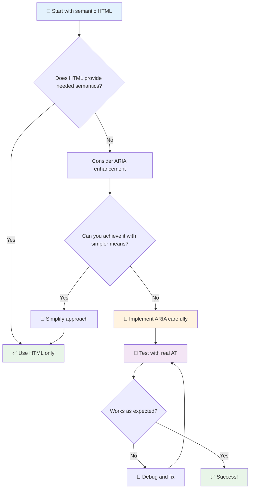

1. **पहिले Semantic HTML**: सधैं `<button>` लाई `<div role="button">` भन्दा प्राथमिकता दिनुहोस्
2. **अर्थ नबिगार्नुहोस्**: HTML को मौलिक अर्थलाई कहिल्यै ओभरराइड नगर्नुहोस् (जस्तै `<h1 role="button">` प्रयोग नगर्नुहोस्)
3. **किबोर्ड पहुँचयोग्यता कायम राख्नुहोस्**: सबै अन्तरक्रियात्मक ARIA तत्वहरू पूर्ण रूपमा किबोर्ड पहुँचयोग्य हुनुपर्छ
4. **वास्तविक प्रयोगकर्तासँग परीक्षण गर्नुहोस्**: ARIA समर्थन सहायक प्रविधिहरूमा धेरै फरक हुन्छ
5. **सजिलोबाट सुरु गर्नुहोस्**: जटिल ARIA कार्यान्वयनहरूमा त्रुटिहरूको सम्भावना बढी हुन्छ

**🔍 परीक्षण कार्यप्रवाह:**

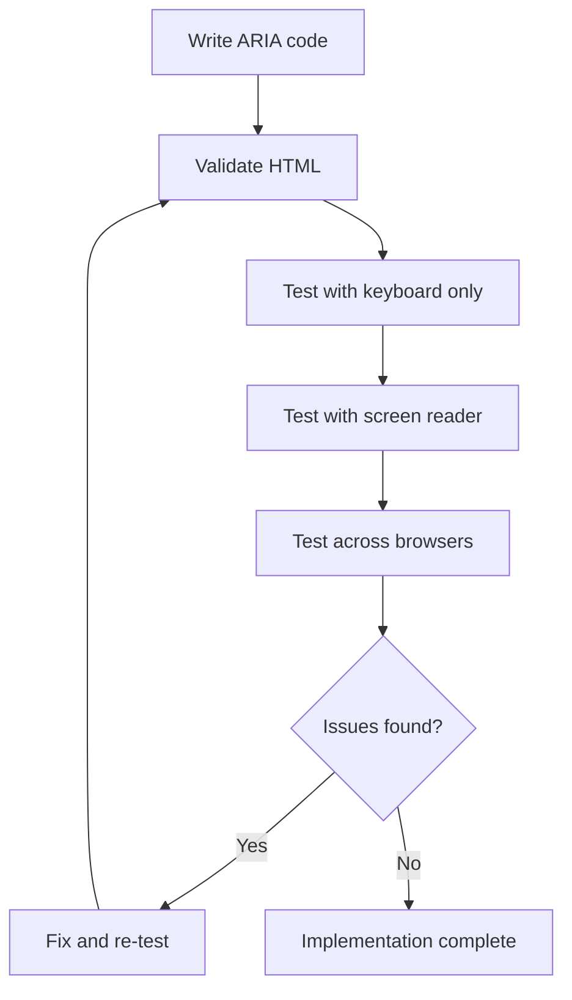

**🚫 सामान्य ARIA त्रुटिहरूबाट बच्नुहोस्:**

- **विरोधाभासी जानकारी**: HTML अर्थसँग विरोध नगर्नुहोस्
- **अत्यधिक लेबलिङ**: धेरै ARIA जानकारीले प्रयोगकर्तालाई भारी बनाउँछ
- **स्थिर ARIA**: सामग्री परिवर्तन हुँदा ARIA अवस्थाहरू अपडेट गर्न बिर्सनु
- **परीक्षण नगरिएको कार्यान्वयनहरू**: सैद्धान्तिक रूपमा काम गर्ने तर व्यवहारमा असफल हुने ARIA
- **किबोर्ड समर्थनको अभाव**: ARIA roles बिना सम्बन्धित किबोर्ड अन्तरक्रिया

> 💡 **परीक्षण स्रोतहरू**: [accessibility-checker](https://www.npmjs.com/package/accessibility-checker) जस्ता उपकरणहरू प्रयोग गरेर स्वचालित ARIA मान्यता प्राप्त गर्नुहोस्, तर पूर्ण अनुभवको लागि सधैं वास्तविक स्क्रीन रिडरहरूसँग परीक्षण गर्नुहोस्।

### 🎭 **ARIA सीप जाँच: जटिल अन्तरक्रियाहरूको लागि तयार?**

**तपाईंको ARIA आत्मविश्वासको मूल्याङ्कन गर्नुहोस्:**
- तपाईं कहिले ARIA लाई Semantic HTML भन्दा प्राथमिकता दिनुहुन्छ? (सुझाव: लगभग कहिल्यै होइन!)
- तपाईं व्याख्या गर्न सक्नुहुन्छ कि किन `<div role="button">` सामान्यतया `<button>` भन्दा खराब छ?
- ARIA परीक्षणको बारेमा सम्झन सबैभन्दा महत्त्वपूर्ण कुरा के हो?

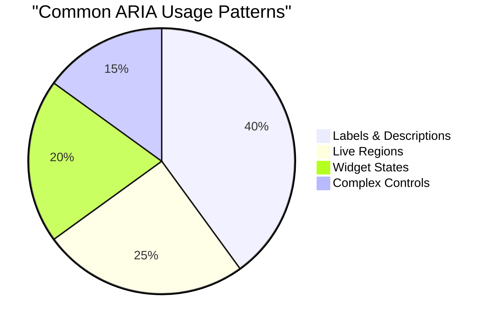

> **महत्त्वपूर्ण जानकारी**: अधिकांश ARIA प्रयोग तत्वहरूको नामकरण र वर्णनको लागि हो। जटिल विजेट ढाँचाहरू तपाईंले सोच्नुभएको भन्दा धेरै कम सामान्य छन्!

✅ **विशेषज्ञहरूबाट सिक्नुहोस्**: [ARIA Authoring Practices Guide](https://w3c.github.io/aria-practices/) अध्ययन गर्नुहोस् जटिल अन्तरक्रियात्मक विजेटहरूको लागि परीक्षण गरिएको ढाँचाहरू र कार्यान्वयनहरूको लागि।

## छविहरू र मिडियालाई पहुँचयोग्य बनाउने

दृश्य र अडियो सामग्री आधुनिक वेब अनुभवहरूको महत्त्वपूर्ण भाग हो, तर यदि सोचपूर्वक कार्यान्वयन नगरिएमा तिनीहरूले बाधा सिर्जना गर्न सक्छन्। लक्ष्य भनेको तपाईंको मिडियाको जानकारी र भावनात्मक प्रभाव प्रत्येक प्रयोगकर्तासम्म पुग्न सुनिश्चित गर्नु हो। एकपटक तपाईंले यसलाई बुझ्नुभयो भने, यो स्वाभाविक बन्छ।

विभिन्न प्रकारका मिडियाले विभिन्न पहुँचयोग्यता दृष्टिकोणहरू आवश्यक पार्छ। यो खाना पकाउने जस्तै हो—तपाईंले नाजुक माछालाई बलियो स्टेक जस्तै व्यवहार गर्नुहुन्न। यी भिन्नताहरू बुझ्दा प्रत्येक परिस्थितिका लागि सही समाधान चयन गर्न मद्दत गर्छ।

### रणनीतिक छवि पहुँचयोग्यता

तपाईंको वेबसाइटमा प्रत्येक छविले उद्देश्य पूरा गर्छ। त्यो उद्देश्य बुझ्दा तपाईंले राम्रो वैकल्पिक पाठ लेख्न र समावेशी अनुभवहरू सिर्जना गर्न मद्दत गर्छ।

**छविहरूका चार प्रकार र तिनीहरूको alt पाठ रणनीतिहरू:**

**सूचनात्मक छविहरू** - महत्त्वपूर्ण जानकारी प्रदान गर्ने:
```html

```

**सजावटी छविहरू** - केवल दृश्यात्मक, कुनै जानकारीमूलक मूल्य नभएको:
```html

```

**कार्यात्मक छविहरू** - बटन वा नियन्त्रणको रूपमा काम गर्ने:
```html
<button>
  
</button>
```

**जटिल छविहरू** - चार्ट, डायग्राम, इन्फोग्राफिक्स:
```html

<div id="chart-description">
  <p>Detailed description: Sales data shows a steady increase across all quarters...</p>
</div>
```

### भिडियो र अडियो पहुँचयोग्यता

**भिडियो आवश्यकताहरू:**
- **क्याप्सनहरू**: बोलेको सामग्री र ध्वनि प्रभावहरूको पाठ संस्करण
- **अडियो विवरणहरू**: दृष्टिविहीन प्रयोगकर्ताहरूका लागि दृश्य तत्वहरूको वर्णन
- **ट्रान्सक्रिप्टहरू**: सबै अडियो र दृश्य सामग्रीको पूर्ण पाठ संस्करण

```html
<video controls>
  <source src="video.mp4" type="video/mp4">
  <track kind="captions" src="captions.vtt" srclang="en" label="English">
  <track kind="descriptions" src="descriptions.vtt" srclang="en" label="Audio descriptions">
</video>
```

**अडियो आवश्यकताहरू:**
- **ट्रान्सक्रिप्टहरू**: सबै बोलेको सामग्रीको पाठ संस्करण
- **दृश्य संकेतहरू**: केवल अडियो सामग्रीको लागि, दृश्य संकेतहरू प्रदान गर्नुहोस्

### आधुनिक छवि प्रविधिहरू

**सजावटी छविहरूको लागि CSS प्रयोग गर्दै:**
```css
.hero-section {
  background-image: url('decorative-hero.jpg');
  /* Decorative images in CSS don't need alt text */
}
```

**पहुंचयोग्यतासहितको उत्तरदायी छविहरू:**
```html
<picture>
  <source media="(min-width: 800px)" srcset="large-chart.png">
  <source media="(min-width: 400px)" srcset="medium-chart.png">
  
</picture>
```

✅ **छवि पहुँचयोग्यता परीक्षण गर्नुहोस्**: स्क्रीन रिडर प्रयोग गरेर छविहरू भएको पृष्ठमा नेभिगेट गर्नुहोस्। के तपाईं सामग्री बुझ्न पर्याप्त जानकारी प्राप्त गर्दै हुनुहुन्छ?

## किबोर्ड नेभिगेसन र फोकस व्यवस्थापन

धेरै प्रयोगकर्ताहरूले किबोर्डको माध्यमबाट मात्र वेब नेभिगेट गर्छन्। यसमा मोटर अपाङ्गता भएका व्यक्तिहरू, किबोर्डलाई माउसभन्दा छिटो मान्ने पावर प्रयोगकर्ताहरू, र जसको माउस काम गर्दैन त्यस्ता सबै समावेश छन्। तपाईंको साइट किबोर्ड इनपुटसँग राम्रोसँग काम गर्ने सुनिश्चित गर्नु महत्त्वपूर्ण छ र प्रायः सबैका लागि तपाईंको साइटलाई अझ प्रभावकारी बनाउँछ।

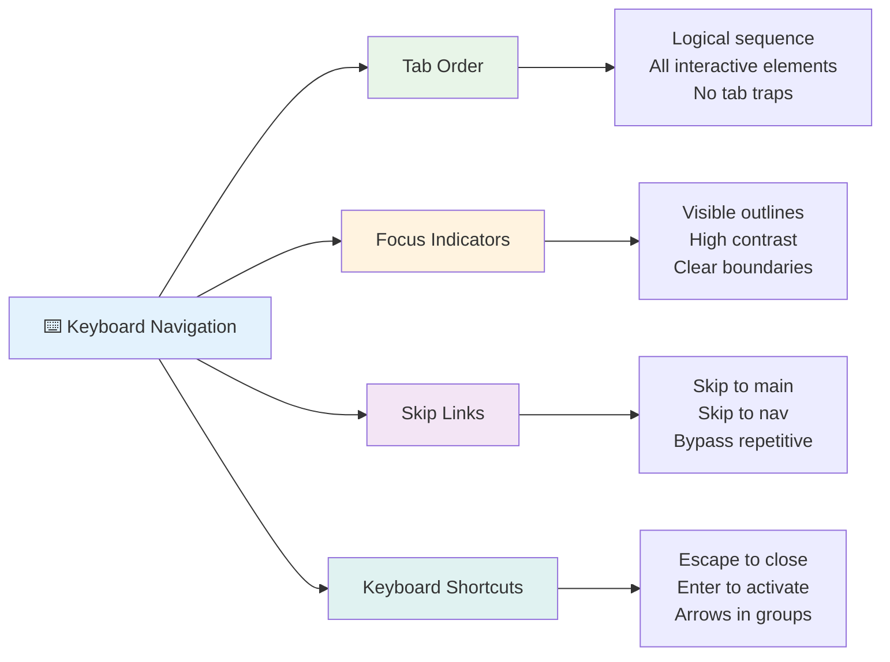

### आवश्यक किबोर्ड नेभिगेसन ढाँचाहरू

**मानक किबोर्ड अन्तरक्रियाहरू:**
- **Tab**: अन्तरक्रियात्मक तत्वहरू मार्फत अगाडि फोकस सार्नुहोस्
- **Shift + Tab**: फोकस पछाडि सार्नुहोस्
- **Enter**: बटन र लिंक सक्रिय गर्नुहोस्
- **Space**: बटन सक्रिय गर्नुहोस्, चेकबक्सहरू जाँच गर्नुहोस्
- **Arrow keys**: कम्पोनेन्ट समूहहरू भित्र नेभिगेट गर्नुहोस् (रेडियो बटनहरू, मेनुहरू)
- **Escape**: मोडलहरू, ड्रपडाउनहरू बन्द गर्नुहोस्, वा अपरेशन रद्द गर्नुहोस्

### फोकस व्यवस्थापनका उत्कृष्ट अभ्यासहरू

**दृश्य फोकस संकेतहरू:**
```css
/* Ensure focus is always visible */
button:focus-visible {
  outline: 2px solid #4A90A4;
  outline-offset: 2px;
}

/* Custom focus styles for different components */
.card:focus-within {
  box-shadow: 0 0 0 3px rgba(74, 144, 164, 0.5);
}
```

**द्रुत नेभिगेसनका लागि Skip links:**
```html
<a href="#main-content" class="skip-link">Skip to main content</a>
<a href="#navigation" class="skip-link">Skip to navigation</a>

<nav id="navigation">
  <!-- navigation content -->
</nav>
<main id="main-content">
  <!-- main content -->
</main>
```

**सही Tab क्रम:**
```html
<!-- Use semantic HTML for natural tab order -->
<form>
  <label for="name">Name:</label>
  <input type="text" id="name" tabindex="0">
  
  <label for="email">Email:</label>
  <input type="email" id="email" tabindex="0">
  
  <button type="submit" tabindex="0">Submit</button>
</form>
```

### मोडलहरूमा फोकस ट्र्यापिङ

मोडल संवादहरू खोल्दा, फोकस मोडल भित्र मात्र सीमित हुनुपर्छ:

```javascript
// Modern focus trap implementation
function trapFocus(element) {
  const focusableElements = element.querySelectorAll(
    'button, [href], input, select, textarea, [tabindex]:not([tabindex="-1"])'
  );
  
  const firstElement = focusableElements[0];
  const lastElement = focusableElements[focusableElements.length - 1];

  element.addEventListener('keydown', (e) => {
    if (e.key === 'Tab') {
      if (e.shiftKey && document.activeElement === firstElement) {
        e.preventDefault();
        lastElement.focus();
      } else if (!e.shiftKey && document.activeElement === lastElement) {
        e.preventDefault();
        firstElement.focus();
      }
    }
    
    if (e.key === 'Escape') {
      closeModal();
    }
  });
  
  // Focus first element when modal opens
  firstElement.focus();
}
```

✅ **किबोर्ड नेभिगेसन परीक्षण गर्नुहोस्**: केवल Tab कुञ्जी प्रयोग गरेर तपाईंको वेबसाइट नेभिगेट गर्न प्रयास गर्नुहोस्। के तपाईं सबै अन्तरक्रियात्मक तत्वहरूमा पुग्न सक्नुहुन्छ? के फोकस क्रम तार्किक छ? के फोकस संकेतहरू स्पष्ट रूपमा देखिन्छन्?

## फारम पहुँचयोग्यता

फारमहरू प्रयोगकर्ता अन्तरक्रियाको लागि महत्त्वपूर्ण छन् र पहुँचयोग्यतामा विशेष ध्यान आवश्यक छ।

### लेबल र फारम नियन्त्रणको सम्बन्ध

**प्रत्येक फारम नियन्त्रणलाई लेबल आवश्यक छ:**
```html
<!-- Explicit labeling (preferred) -->
<label for="username">Username:</label>
<input type="text" id="username" name="username" required>

<!-- Implicit labeling -->
<label>
  Password:
  <input type="password" name="password" required>
</label>

<!-- Using aria-label when visual label isn't desired -->
<input type="search" aria-label="Search products" placeholder="Search...">
```

### त्रुटि ह्यान्डलिङ र मान्यता

**पहुंचयोग्य त्रुटि सन्देशहरू:**
```html
<label for="email">Email Address:</label>
<input type="email" id="email" name="email" 
       aria-describedby="email-error" 
       aria-invalid="true" required>
<div id="email-error" role="alert">
  Please enter a valid email address
</div>
```

**फारम मान्यता उत्कृष्ट अभ्यासहरू:**
- `aria-invalid` प्रयोग गरेर अमान्य क्षेत्रहरू संकेत गर्नुहोस्
- स्पष्ट, विशिष्ट त्रुटि सन्देशहरू प्रदान गर्नुहोस्
- महत्त्वपूर्ण त्रुटि घोषणाहरूका लागि `role="alert"` प्रयोग गर्नुहोस्
- त्रुटिहरू तुरुन्तै र फारम सबमिशनमा देखाउनुहोस्

### Fieldsets र समूह बनाउने

**सम्बन्धित फारम नियन्त्रणहरू समूह बनाउनुहोस्:**
```html
<fieldset>
  <legend>Shipping Address</legend>
  <label for="street">Street Address:</label>
  <input type="text" id="street" name="street">
  
  <label for="city">City:</label>
  <input type="text" id="city" name="city">
</fieldset>

<fieldset>
  <legend>Preferred Contact Method</legend>
  <input type="radio" id="contact-email" name="contact" value="email">
  <label for="contact-email">Email</label>
  
  <input type="radio" id="contact-phone" name="contact" value="phone">
  <label for="contact-phone">Phone</label>
</fieldset>
```

## तपाईंको पहुँचयोग्यता यात्रा: मुख्य निष्कर्षहरू

बधाई छ! तपाईंले वास्तवमै समावेशी वेब अनुभवहरू सिर्जना गर्न आधारभूत ज्ञान प्राप्त गर्नुभएको छ। यो निकै रोमाञ्चक कुरा हो! वेब पहुँचयोग्यता केवल अनुपालन बक्सहरू जाँच गर्ने बारे होइन—यो मानिसहरूले डिजिटल सामग्रीसँग अन्तरक्रिया गर्ने विविध तरिकाहरूलाई पहिचान गर्ने र त्यो अद्भुत जटिलताको लागि डिजाइन गर्ने बारे हो।

तपाईं अब विकासकर्ताहरूको बढ्दो समुदायको हिस्सा हुनुहुन्छ जसले बुझ्छ कि उत्कृष्ट डिजाइन सबैका लागि काम गर्छ। क्लबमा स्वागत छ!

**🎯 तपाईंको पहुँचयोग्यता उपकरण किटमा अब समावेश छ:**

| मुख्य सिद्धान्त | कार्यान्वयन | प्रभाव |
|----------------|----------------|---------|
| **Semantic HTML आधार** | HTML तत्वहरूलाई तिनीहरूको उद्देश्य अनुसार प्रयोग गर्नुहोस् | स्क्रीन रिडरहरूले कुशलतापूर्वक नेभिगेट गर्न सक्छन्, किबोर्डहरू स्वतः काम गर्छन् |
| **समावेशी दृश्य डिजाइन** | पर्याप्त कन्ट्रास्ट, अर्थपूर्ण रंग प्रयोग, दृश्य फोकस संकेतहरू | कुनै पनि प्रकाश अवस्थामा सबैका लागि स्पष्ट |
| **वर्णनात्मक सामग्री** | अर्थपूर्ण लिंक पाठ, alt पाठ, हेडिङहरू | प्रयोगकर्ताहरूले दृश्य सन्दर्भ बिना सामग्री बुझ्छन् |
| **किबोर्ड पहुँचयोग्यता** | Tab क्रम, किबोर्ड सर्टकटहरू, फोकस व्यवस्थापन | मोटर पहुँचयोग्यता र पावर प्रयोगकर्ता दक्षता |
| **ARIA सुधार** | Semantic खाली ठाउँहरू भर्न रणनीतिक प्रयोग | जटिल एप्लिकेसनहरू सहायक प्रविधिहरूसँग काम गर्छन् |
| **व्यापक परीक्षण** | स्वचालित उपकरणहरू + म्यानुअल सत्यापन + वास्तविक प्रयोगकर्ता परीक्षण | समस्याहरू प्रयोगकर्तालाई असर गर्नु अघि पत्ता लगाउनुहोस् |

**🚀 तपाईंको अर्को कदमहरू:**

1. **तपाईंको कार्यप्रवाहमा पहुँचयोग्यता निर्माण गर्नुहोस्**: परीक्षणलाई तपाईंको विकास प्रक्रियाको प्राकृतिक भाग बनाउनुहोस्
2. **वास्तविक प्रयोगकर्ताबाट सिक्नुहोस्**: सहायक प्रविधिहरू प्रयोग गर्ने व्यक्तिहरूबाट प्रतिक्रिया खोज्नुहोस्
3. **वर्तमान रहनुहोस्**: पहुँचयोग्यता प्रविधिहरू नयाँ प्रविधिहरू र मापदण्डहरूसँग विकसित हुन्छन्
4. **समावेशीता वकालत गर्नुहोस्**: तपाईंको ज्ञान साझा गर्नुहोस् र पहुँचयोग्यता टोलीको प्राथमिकता बनाउनुहोस्

> 💡 **स्मरण गर्नुहोस्**: पहुँचयोग्यता सीमाहरूले प्रायः सबैलाई फाइदा पुग्ने नवीन, सुरुचिपूर्ण समाधानहरू जन्माउँछन्। कर्ब कट्स, क्याप्सनहरू, र भ्वाइस नियन्त्रणहरू सबै पहुँचयोग्यता सुविधाहरूको रूपमा सुरु भए र मुख्यधार सुधार बने।

**व्यावसायिक मामला स्पष्ट छ**: पहुँचयोग्य वेबसाइटहरूले बढी प्रयोगकर्ताहरूलाई पुग्छन्, खोज इन्जिनहरूमा राम्रो स्थानमा रहन्छन्, कम मर्मत लागत हुन्छ, र कानुनी जोखिमहरूबाट बच्छन्। तर इमानदारीपूर्वक? पहुँचयोग्यतामा ध्यान दिनको वास्तविक कारण अझ गहिरो छ। पहुँचयोग्य वेबसाइटहरूले वेबका उत्कृष्ट मूल्यहरू—खुलापन, समावेशिता, र सबैलाई जानकारीमा समान पहुँचको विचारलाई मूर्त रूप दिन्छन्।

तपाईं अब भविष्यको समावेशी वेब निर्माण गर्न तयार हुनुहुन्छ। तपाईंले सिर्जना गर्ने प्रत्येक पहुँचयोग्य साइटले इन्टरनेटलाई सबैका लागि अझ स्वागतयोग्य स्थान बनाउँछ। यो सोच्दा निकै अद्भुत लाग्छ!

## थप स्रोतहरू

पहुंचयोग्यता सिक्ने यात्रालाई यी आवश्यक स्रोतहरूसँग जारी राख्नुहोस्:

**📚 आधिकारिक मापदण्ड र दिशानिर्देशहरू:**
- [WCAG 2.1 Guidelines](https://www.w3.org/WAI/WCAG21/quickref/) - आधिकारिक पहुँचयोग्यता मापदण्डको द्रुत सन्दर्भ
- [ARIA Authoring Practices Guide](https://w3c.github.io/aria-practices/) - अन्तरक्रियात्मक विजेटहरूको लागि व्यापक ढाँचाहरू
- [WebAIM Guidelines](https://webaim.org/) - व्यावहारिक, शुरुवात मैत्री पहुँचयोग्यता मार्गदर्शन

**🛠️ उपकरणहरू र परीक्षण स्रोतहरू:**
- [axe DevTools](https://www.deque.com/axe/devtools/) - उद्योग-मानक पहुँचयोग्यता परीक्षण
- [A11y Project Checklist](https://www.a11yproject.com/checklist/) - चरण-दर-चरण पहुँचयोग्यता सत्यापन
- [Accessibility Insights](https://accessibilityinsights.io/) - माइक्रोसफ्टको व्यापक परीक्षण सूट
- [Color Oracle](https://colororacle.org/) - डिजाइन परीक्षणको लागि रंग अन्धोपन सिमुलेटर

**🎓 सिकाइ र समुदाय:**
- [WebAIM Screen Reader Survey](https://webaim.org/projects/screenreadersurvey9/) - वास्तविक प्रयोगकर्ता प्राथमिकता र व्यवहार
- [Inclusive Components](https://inclusive-components.design/) - आधुनिक पहुँचयोग्य कम्पोनेन्ट ढाँचाहरू
- [A11y Coffee](https://a11y.coffee/) - द्रुत पहुँचयोग्यता सुझावहरू र जानकारी
- [Web Accessibility Initiative (WAI)](https://www.w3.org/WAI/) - W3C को व्यापक पहुँचयोग्यता स्रोतहरू

**🎥 व्यावहारिक सिकाइ:**
- [Accessibility Developer Guide](https://www.accessibility-developer-guide.com/) - व्यावहारिक कार्यान्वयन मार्गदर्शन
- [Deque University](https://dequeuniversity.com/) - व्यावसायिक पहुँचयोग्यता प्रशिक्षण पाठ्यक्रमहरू

## GitHub Copilot Agent Challenge 🚀

Agent मोड प्रयोग गरेर निम्न चुनौती पूरा गर्नुहोस्:

**विवरण:** उचित फोकस व्यवस्थापन, ARIA विशेषताहरू, र किबोर्ड नेभिगेसन ढाँचाहरू प्रदर्शन गर्ने पहुँचयोग्य मोडल संवाद कम्पोनेन्ट सिर्जना गर्नुहोस्।

**प्रेरणा:** HTML, CSS, र JavaScript सहित पूर्ण मोडल संवाद कम्पोनेन्ट निर्माण गर्नुहोस् जसमा समावेश छ: उचित फोकस ट्र्यापिङ, ESC कुञ्जीले बन्द गर्ने, बाहिर क्लिक गरेर बन्द गर्ने, स्क्रीन रिडरहरूको लागि ARIA विशेषताहरू, र दृश्य फोकस संकेतहरू। मोडलमा उचित लेबल र त्रुटि ह्यान्डलिङ भएको फारम समावेश हुनुपर्छ। सुनिश्चित गर्नुहोस् कि कम्पोनेन्ट WCAG 2.1 AA मापदण्डहरू पूरा गर्छ।

## 🚀 चुनौती

यो HTML लिनुहोस् र तपाईंले सिकेका रणनीतिहरूलाई ध्यानमा राख्दै यसलाई सकेसम्म पहुँचयोग्य बनाउनुहोस्।

```html
<!DOCTYPE html>
<html lang="en">
  <head>
    <meta charset="UTF-8">
    <meta name="viewport" content="width=device-width, initial-scale=1.0">
    <title>Turtle Ipsum - The World's Premier Turtle Fan Club</title>
    <link href='../assets/style.css' rel='stylesheet' type='text/css'>
  </head>
  <body>
    <header class="site-header">
      <h1 class="site-title">Turtle Ipsum</h1>
      <p class="site-subtitle">The World's Premier Turtle Fan Club</p>
    </header>
    
    <nav class="main-nav" aria-label="Main navigation">
      <h2 class="nav-header">Resources</h2>
      <ul class="nav-list">
        <li><a href="https://www.youtube.com/watch?v=CMNry4PE93Y">"I like turtles" video</a></li>
        <li><a href="https://en.wikipedia.org/wiki/Turtle">Basic turtle information</a></li>
        <li><a href="https://en.wikipedia.org/wiki/Turtles_(chocolate)">Chocolate turtles candy</a></li>
      </ul>
    </nav>
    
    <main class="main-content">
      <article>
        <h1>Welcome to Turtle Ipsum</h1>
        <p class="intro">
          <a href="/about">Learn more about our turtle community</a> and discover fascinating facts about these amazing creatures.
        </p>
        <p class="article-text">
          Turtle ipsum dolor sit amet, consectetur adipiscing elit, sed do eiusmod tempor incididunt ut labore et dolore magna aliqua. Ut enim ad minim veniam, quis nostrud exercitation ullamco laboris nisi ut aliquip ex ea commodo consequat. Duis aute irure dolor in reprehenderit in voluptate velit esse cillum dolore eu fugiat nulla pariatur. Excepteur sint occaecat cupidatat non proident, sunt in culpa qui officia deserunt mollit anim id est laborum.
        </p>
      </article>
    </main>
    
    <footer class="footer">
      <section class="newsletter-signup">
        <h2>Stay Updated</h2>
        <button type="button" onclick="showNewsletterForm()">Sign up for turtle news</button>
      </section>
      
      <nav class="footer-nav" aria-label="Footer navigation">
        <h2>Site Pages</h2>
        <ul>
          <li><a href="../">Home</a></li>
          <li><a href="../semantic">Semantic HTML example</a></li>
        </ul>
      </nav>
      
      <p class="footer-copyright">&copy; 2024 Instrument. All rights reserved.</p>
    </footer>
  </body>
</html>
```

**गरेका मुख्य सुधारहरू:**
- उचित Semantic HTML संरचना थपियो
- हेडिङको पदानुक्रम सुधार गरियो (एकल h1, तार्किक प्रगति)
- "click here" को सट्टा अर्थपूर्ण लिंक पाठ थपियो
- नेभिगेसनका लागि उचित ARIA लेबलहरू समावेश गरियो
- lang attribute र उचित meta tags थपियो
- अन्तरक्रियात्मक तत्वहरूको लागि button तत्व प्रयोग गरियो
- footer सामग्रीलाई उचित landmarks सहित संरचना गरियो

## पोस्ट-व्याख्यान क्विज
[पोस्ट-व्याख्यान क्विज](https://ff-quizzes.netlify.app/web/en/)

## समीक्षा र आत्म अध्ययन

धेरै सरकारहरूले पहुँचयोग्यता आवश्यकताहरूको सम्बन्धमा कानूनहरू राखेका छन्। तपाईंको देशको पहुँचयोग्यता कानूनहरूको बारेमा पढ्नुहोस्। के समावेश छ, र के छैन? उदाहरणका लागि [यो सरकारी वेबसाइट](https://accessibility.blog.gov.uk/)।

## असाइनमेन्ट
 
[एक गैर-पहुंचयोग्य वेबसाइटको विश्लेषण गर्नुहोस्](assignment.md)

Credits: [Turtle Ipsum](https://github.com/Instrument/semantic-html-sample) by Instrument

---

## 🚀 तपाईंको पहुँचयोग्यता मास्टरी समयरेखा

### ⚡ **अर्को ५ मिनेटमा तपाईं के गर्न सक्नुहुन्छ**
- [ ] तपाईंको ब्राउजरमा axe DevTools एक्सटेन्सन स्थापना गर्नुहोस्
- [ ] तपाईंको मनपर्ने वेबसाइटमा Lighthouse पहुँचयोग्यता अडिट चलाउनुहोस्
- [ ] केवल Tab कुञ्जी प्रयोग
- [ ] ५ वटा जटिल वेबसाइटहरूमा किबोर्ड नेभिगेसन अभ्यास गर्नुहोस्  
- [ ] सही लेबल, त्रुटि ह्यान्डलिङ, र ARIA सहित एक साधारण फारम बनाउनुहोस्  
- [ ] पहुँचयोग्यता समुदायमा सामेल हुनुहोस् (A11y Slack, WebAIM फोरम)  
- [ ] अपाङ्गता भएका वास्तविक प्रयोगकर्ताहरूले वेबसाइटहरू कसरी नेभिगेट गर्छन् हेर्नुहोस् (YouTube मा उत्कृष्ट उदाहरणहरू छन्)  

### 🌟 **तपाईंको महिनाभरि परिवर्तन**  
- [ ] आफ्नो विकास कार्यप्रवाहमा पहुँचयोग्यता परीक्षण समावेश गर्नुहोस्  
- [ ] पहुँचयोग्यता समस्याहरू समाधान गरेर खुला स्रोत परियोजनामा योगदान गर्नुहोस्  
- [ ] सहायक प्रविधि प्रयोग गर्ने कसैसँग उपयोगिता परीक्षण गर्नुहोस्  
- [ ] आफ्नो टिमको लागि पहुँचयोग्य कम्पोनेन्ट लाइब्रेरी बनाउनुहोस्  
- [ ] आफ्नो कार्यस्थल वा समुदायमा पहुँचयोग्यताको वकालत गर्नुहोस्  
- [ ] पहुँचयोग्यता अवधारणाहरूमा नयाँ व्यक्तिलाई मार्गदर्शन गर्नुहोस्  

### 🏆 **अन्तिम पहुँचयोग्यता च्याम्पियन जाँच**

**आफ्नो पहुँचयोग्यता यात्रा मनाउनुहोस्:**  
- वेब प्रयोग गर्ने तरिकाबारे तपाईंले सबैभन्दा आश्चर्यजनक कुरा के सिक्नुभयो?  
- कुन पहुँचयोग्यता सिद्धान्त तपाईंको विकास शैलीसँग सबैभन्दा मेल खान्छ?  
- पहुँचयोग्यता सिकेपछि डिजाइनप्रति तपाईंको दृष्टिकोण कसरी परिवर्तन भयो?  
- वास्तविक परियोजनामा तपाईंले गर्न चाहेको पहिलो पहुँचयोग्यता सुधार के हो?  

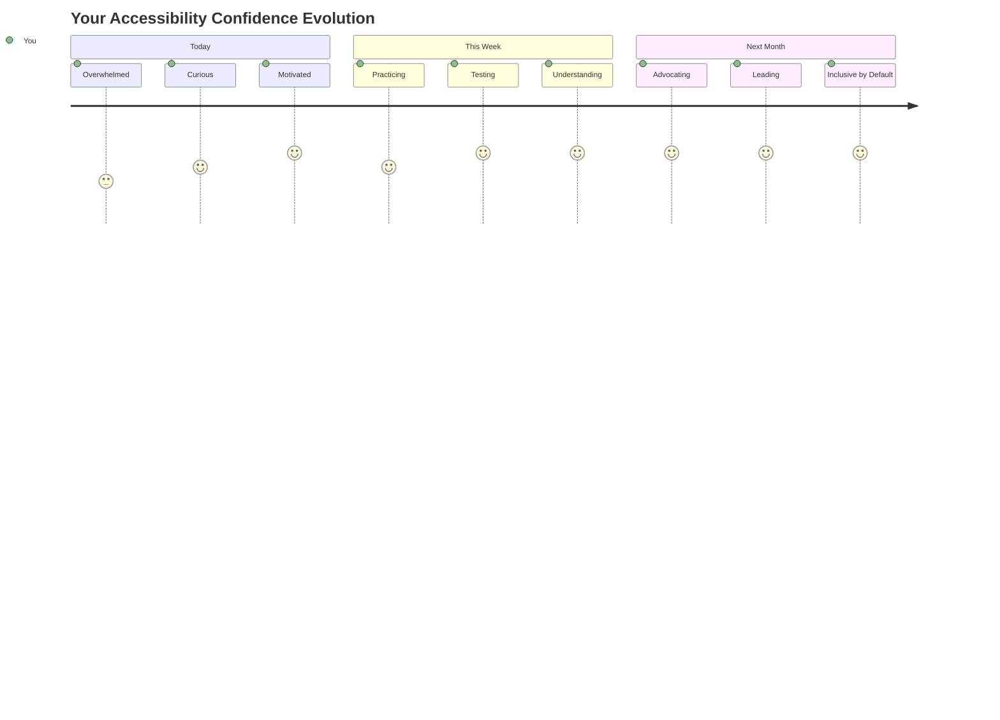
  
> 🌍 **अब तपाईं पहुँचयोग्यता च्याम्पियन हुनुहुन्छ!** तपाईंले बुझ्नुभयो कि उत्कृष्ट वेब अनुभवहरू सबैका लागि काम गर्छन्, चाहे उनीहरूले वेब कसरी पहुँच गर्छन्। तपाईंले बनाएको प्रत्येक पहुँचयोग्य सुविधाले इन्टरनेटलाई अझ समावेशी बनाउँछ। वेबलाई तपाईंजस्ता विकासकर्ताहरूको आवश्यकता छ जसले पहुँचयोग्यतालाई बाधा होइन, सबै प्रयोगकर्ताहरूका लागि राम्रो अनुभव सिर्जना गर्ने अवसरको रूपमा हेर्छन्। आन्दोलनमा स्वागत छ! 🎉  

---

**अस्वीकरण**:  
यो दस्तावेज AI अनुवाद सेवा [Co-op Translator](https://github.com/Azure/co-op-translator) प्रयोग गरेर अनुवाद गरिएको छ। हामी शुद्धताको लागि प्रयास गर्छौं, तर कृपया ध्यान दिनुहोस् कि स्वचालित अनुवादमा त्रुटिहरू वा अशुद्धताहरू हुन सक्छ। यसको मूल भाषामा रहेको दस्तावेजलाई आधिकारिक स्रोत मानिनुपर्छ। महत्वपूर्ण जानकारीको लागि, व्यावसायिक मानव अनुवाद सिफारिस गरिन्छ। यस अनुवादको प्रयोगबाट उत्पन्न हुने कुनै पनि गलतफहमी वा गलत व्याख्याको लागि हामी जिम्मेवार हुनेछैनौं।