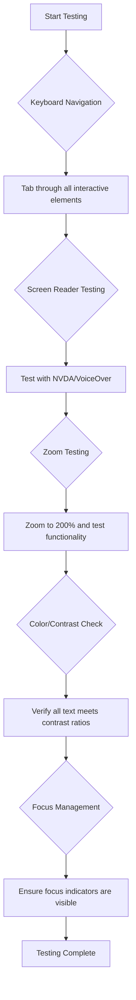
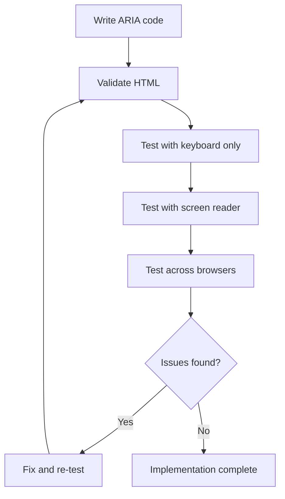

<!--
CO_OP_TRANSLATOR_METADATA:
{
  "original_hash": "90b19cde5b79b29e91babd3138cd8035",
  "translation_date": "2025-10-22T16:49:05+00:00",
  "source_file": "1-getting-started-lessons/3-accessibility/README.md",
  "language_code": "ne"
}
-->
# पहुँचयोग्य वेबपृष्ठहरू बनाउने


> स्केच नोट [Tomomi Imura](https://twitter.com/girlie_mac) द्वारा

## प्रि-लेक्चर क्विज
[प्रि-लेक्चर क्विज](https://ff-quizzes.netlify.app/web/)

> वेबको शक्ति यसको सार्वभौमिकतामा छ। अपाङ्गता भए पनि सबैको पहुँच एक महत्वपूर्ण पक्ष हो।
>
> \- सर टिमोथी बर्नर्स-ली, W3C निर्देशक र वर्ल्ड वाइड वेबका आविष्कारक

यहाँ केही चकित पार्ने कुरा छ: जब तपाईं पहुँचयोग्य वेबसाइटहरू बनाउनुहुन्छ, तपाईं केवल अपाङ्गता भएका व्यक्तिहरूलाई सहयोग गरिरहनुभएको छैन—तपाईं वास्तवमा सबैका लागि वेबलाई राम्रो बनाइरहनुभएको छ!

के तपाईंले कहिल्यै सडकको कुनामा भएका 'कर्ब कट्स' देख्नुभएको छ? ती मूलतः व्हीलचेयरका लागि डिजाइन गरिएका थिए, तर अहिले तिनीहरूले बच्चाको गाडी, डेलिभरी कामदारहरू, यात्रुहरू, र साइकल चालकहरूलाई पनि सहयोग गर्छन्। पहुँचयोग्य वेब डिजाइन ठीक यस्तै काम गर्छ—एक समूहलाई सहयोग गर्ने समाधानले प्रायः सबैलाई फाइदा पुर्‍याउँछ। कस्तो चाखलाग्दो कुरा, हैन?

यस पाठमा, हामी वेबसाइटहरू कसरी बनाउने भनेर अन्वेषण गर्नेछौं जसले सबैका लागि काम गर्छ, चाहे उनीहरूले वेब कसरी ब्राउज गरे पनि। तपाईं व्यावहारिक प्रविधिहरू पत्ता लगाउनुहुनेछ जुन पहिले नै वेब मापदण्डहरूमा समावेश छन्, परीक्षण उपकरणहरूसँग काम गर्नुहुनेछ, र कसरी पहुँचले तपाईंको साइटहरू सबै प्रयोगकर्ताहरूका लागि बढी उपयोगी बनाउँछ भन्ने देख्नुहुनेछ।

यस पाठको अन्त्यसम्ममा, तपाईंलाई पहुँचलाई तपाईंको विकास कार्यप्रवाहको प्राकृतिक भाग बनाउन आत्मविश्वास हुनेछ। वेबलाई अर्बौं प्रयोगकर्ताहरूका लागि खुला बनाउन विचारशील डिजाइन विकल्पहरूले कसरी मद्दत गर्न सक्छन् भनेर अन्वेषण गर्न तयार हुनुहुन्छ? सुरु गरौं!

> तपाईं यो पाठ [Microsoft Learn](https://docs.microsoft.com/learn/modules/web-development-101/accessibility/?WT.mc_id=academic-77807-sagibbon) मा लिन सक्नुहुन्छ!

## सहायक प्रविधिहरूको समझ

कोडिङमा जानु अघि, विभिन्न क्षमताका व्यक्तिहरूले वेबलाई वास्तवमा कसरी अनुभव गर्छन् भन्ने कुरा बुझ्न एक क्षण लिऔं। यो केवल सिद्धान्त होइन—यी वास्तविक संसारका नेभिगेसन ढाँचाहरू बुझ्दा तपाईं एकदम राम्रो विकासकर्ता बन्नुहुनेछ!

सहायक प्रविधिहरू अद्भुत उपकरणहरू हुन् जसले अपाङ्गता भएका व्यक्तिहरूलाई वेबसाइटहरूसँग अन्तर्क्रिया गर्न मद्दत गर्छ। एकपटक तपाईंले यी प्रविधिहरू कसरी काम गर्छन् भन्ने कुरा बुझ्नुभयो भने, पहुँचयोग्य वेब अनुभवहरू सिर्जना गर्नु धेरै सहज हुन्छ। यो तपाईंको कोडलाई अरूको आँखाबाट हेर्न सिक्न जस्तै हो।

### स्क्रिन रिडरहरू

[स्क्रिन रिडरहरू](https://en.wikipedia.org/wiki/Screen_reader) डिजिटल पाठलाई भाषण वा ब्रेल आउटपुटमा रूपान्तरण गर्ने अत्यन्त परिष्कृत प्रविधिहरू हुन्। तिनीहरू मुख्य रूपमा दृष्टि अपाङ्गता भएका व्यक्तिहरूले प्रयोग गर्छन्, तर तिनीहरू सिकाइ अपाङ्गता भएका प्रयोगकर्ताहरूका लागि पनि धेरै उपयोगी छन्, जस्तै डिस्लेक्सिया।

म स्क्रिन रिडरलाई एकदम स्मार्ट कथावाचकले तपाईंलाई पुस्तक पढिरहेको जस्तो सोच्न मन पराउँछु। यसले सामग्रीलाई तार्किक क्रममा पढ्छ, "बटन" वा "लिंक" जस्ता अन्तरक्रियात्मक तत्वहरू घोषणा गर्छ, र पृष्ठमा हिँड्नको लागि किबोर्ड सर्टकटहरू प्रदान गर्छ। तर यहाँ कुरा छ—स्क्रिन रिडरहरूले केवल आफ्नो जादू काम गर्न सक्छन् यदि हामीले वेबसाइटहरू उचित संरचना र अर्थपूर्ण सामग्रीको साथ निर्माण गरेका छौं। यहाँ तपाईं विकासकर्ता रूपमा आउनुहुन्छ!

**प्लेटफर्महरूमा लोकप्रिय स्क्रिन रिडरहरू:**
- **Windows**: [NVDA](https://www.nvaccess.org/about-nvda/) (निःशुल्क र सबैभन्दा लोकप्रिय), [JAWS](https://webaim.org/articles/jaws/), [Narrator](https://support.microsoft.com/windows/complete-guide-to-narrator-e4397a0d-ef4f-b386-d8ae-c172f109bdb1/?WT.mc_id=academic-77807-sagibbon) (बिल्ट-इन)
- **macOS/iOS**: [VoiceOver](https://support.apple.com/guide/voiceover/welcome/10) (बिल्ट-इन र धेरै सक्षम)
- **Android**: [TalkBack](https://support.google.com/accessibility/android/answer/6283677) (बिल्ट-इन)
- **Linux**: [Orca](https://wiki.gnome.org/Projects/Orca) (निःशुल्क र ओपन-सोर्स)

**स्क्रिन रिडरहरूले वेब सामग्री कसरी नेभिगेट गर्छन्:**

स्क्रिन रिडरहरूले धेरै नेभिगेसन विधिहरू प्रदान गर्छन् जसले अनुभवी प्रयोगकर्ताहरूका लागि ब्राउजिङलाई प्रभावकारी बनाउँछ:
- **क्रमिक पढाइ**: सामग्रीलाई माथिबाट तलसम्म पढ्छ, पुस्तकको जस्तै
- **ल्यान्डमार्क नेभिगेसन**: पृष्ठका भागहरूमा (हेडर, नेभ, मेन, फुटर) हिँड्न
- **हेडिङ नेभिगेसन**: हेडिङहरू बीचमा हिँड्न पृष्ठ संरचना बुझ्न
- **लिंक सूचीहरू**: सबै लिंकहरूको सूची उत्पन्न गरेर छिटो पहुँच
- **फारम नियन्त्रणहरू**: इनपुट फिल्डहरू र बटनहरू बीचमा सिधै नेभिगेट गर्नुहोस्

> 💡 **यहाँ केही चकित पार्ने कुरा छ**: 68% स्क्रिन रिडर प्रयोगकर्ताहरू मुख्य रूपमा हेडिङहरूद्वारा नेभिगेट गर्छन् ([WebAIM सर्वेक्षण](https://webaim.org/projects/screenreadersurvey9/#finding))। यसको मतलब तपाईंको हेडिङ संरचना प्रयोगकर्ताहरूका लागि रोडम्याप जस्तै हो—जब तपाईंले यसलाई सही बनाउनुहुन्छ, तपाईंले मानिसहरूलाई छिटो सामग्री वरिपरि हिँड्न मद्दत गरिरहनुभएको छ!

### परीक्षण कार्यप्रवाह निर्माण गर्दै

यहाँ केही राम्रो समाचार छ—प्रभावकारी पहुँच परीक्षणले तपाईंलाई तनावग्रस्त बनाउनु पर्दैन! तपाईंले स्वचालित उपकरणहरू (तिनीहरूले स्पष्ट समस्याहरू पत्ता लगाउन उत्कृष्ट छन्) र केही हातले परीक्षणलाई संयोजन गर्न चाहनुहुन्छ। यहाँ एक व्यवस्थित दृष्टिकोण छ जसले धेरै समस्याहरू पत्ता लगाउँछ बिना तपाईंको सारा दिन खाइदिने:

**आवश्यक म्यानुअल परीक्षण कार्यप्रवाह:**



**चरण-दर-चरण परीक्षण चेकलिस्ट:**
1. **किबोर्ड नेभिगेसन**: केवल Tab, Shift+Tab, Enter, Space, र Arrow कुञ्जीहरू प्रयोग गर्नुहोस्
2. **स्क्रिन रिडर परीक्षण**: NVDA, VoiceOver, वा Narrator सक्षम गर्नुहोस् र आँखा बन्द गरेर नेभिगेट गर्नुहोस्
3. **जूम परीक्षण**: 200% र 400% जूम स्तरहरूमा परीक्षण गर्नुहोस्
4. **रंग कन्ट्रास्ट प्रमाणीकरण**: सबै पाठ र UI घटकहरू जाँच गर्नुहोस्
5. **फोकस सूचक परीक्षण**: सबै अन्तरक्रियात्मक तत्वहरूमा दृश्य फोकस अवस्थाहरू सुनिश्चित गर्नुहोस्

✅ **Lighthouse बाट सुरु गर्नुहोस्**: तपाईंको ब्राउजरको DevTools खोल्नुहोस्, Lighthouse पहुँच अडिट चलाउनुहोस्, त्यसपछि परिणामहरूलाई तपाईंको म्यानुअल परीक्षण फोकस क्षेत्रहरू मार्गदर्शन गर्न प्रयोग गर्नुहोस्।

### जूम र म्याग्निफिकेसन उपकरणहरू

तपाईंले कहिल्यै आफ्नो फोनमा पाठ सानो हुँदा पिन्च गरेर जूम गर्नुभएको छ, वा उज्यालो घाममा आफ्नो ल्यापटप स्क्रिनमा आँखा चिम्लेर हेर्नुभएको छ? धेरै प्रयोगकर्ताहरूले सामग्रीलाई पढ्न योग्य बनाउन म्याग्निफिकेसन उपकरणहरूमा दैनिक निर्भर गर्छन्। यसमा कम दृष्टि भएका व्यक्तिहरू, वृद्ध व्यक्तिहरू, र कहिल्यै बाहिर वेबसाइट पढ्ने प्रयास गर्ने जो कोही समावेश छन्।

आधुनिक जूम प्रविधिहरूले केवल चीजहरू ठूलो बनाउने भन्दा पर विकास गरेका छन्। यी उपकरणहरू कसरी काम गर्छन् भन्ने कुरा बुझ्दा तपाईंले उत्तरदायी डिजाइनहरू सिर्जना गर्न मद्दत गर्नेछ जुन कुनै पनि म्याग्निफिकेसन स्तरमा कार्यात्मक र आकर्षक रहन्छ।

**आधुनिक ब्राउजर जूम क्षमताहरू:**
- **पृष्ठ जूम**: सबै सामग्रीलाई समानुपातिक रूपमा स्केल गर्छ (पाठ, छविहरू, लेआउट) - यो प्राथमिक विधि हो
- **केवल पाठ जूम**: मूल लेआउट कायम राख्दै फन्ट आकार बढाउँछ
- **पिन्च-टु-जूम**: मोबाइल इशारा समर्थन अस्थायी म्याग्निफिकेसनको लागि
- **ब्राउजर समर्थन**: सबै आधुनिक ब्राउजरहरूले 500% सम्म जूम समर्थन गर्छन् बिना कार्यक्षमता बिग्रने

**विशेष म्याग्निफिकेसन सफ्टवेयर:**
- **Windows**: [Magnifier](https://support.microsoft.com/windows/use-magnifier-to-make-things-on-the-screen-easier-to-see-414948ba-8b1c-d3bd-8615-0e5e32204198) (बिल्ट-इन), [ZoomText](https://www.freedomscientific.com/training/zoomtext/getting-started/)
- **macOS/iOS**: [Zoom](https://www.apple.com/accessibility/mac/vision/) (बिल्ट-इन उन्नत सुविधाहरू सहित)

> ⚠️ **डिजाइन विचार**: WCAG ले सामग्रीलाई 200% जूम गर्दा कार्यात्मक रहन आवश्यक छ। यस स्तरमा, क्षैतिज स्क्रोलिङ न्यूनतम हुनुपर्छ, र सबै अन्तरक्रियात्मक तत्वहरू पहुँचयोग्य रहनुपर्छ।

✅ **तपाईंको उत्तरदायी डिजाइन परीक्षण गर्नुहोस्**: तपाईंको ब्राउजरलाई 200% र 400% मा जूम गर्नुहोस्। के तपाईंको लेआउट सुन्दर रूपमा अनुकूल हुन्छ? के तपाईं अझै अत्यधिक स्क्रोलिङ बिना सबै कार्यक्षमतामा पहुँच गर्न सक्नुहुन्छ?

## आधुनिक पहुँच परीक्षण उपकरणहरू

अब तपाईंले सहायक प्रविधिहरूको साथमा मानिसहरूले वेब कसरी नेभिगेट गर्छन् भन्ने कुरा बुझ्नुभयो, आउनुहोस् उपकरणहरू अन्वेषण गरौं जसले तपाईंलाई पहुँचयोग्य वेबसाइटहरू निर्माण गर्न र परीक्षण गर्न मद्दत गर्छ।

यसलाई यसरी सोच्नुहोस्: स्वचालित उपकरणहरूले स्पष्ट समस्याहरू (जस्तै, हराएको alt पाठ) पत्ता लगाउन उत्कृष्ट छन्, जबकि हातले परीक्षणले तपाईंको साइट वास्तविक संसारमा प्रयोग गर्न राम्रो महसुस गर्छ भन्ने सुनिश्चित गर्न मद्दत गर्छ। सँगै, तिनीहरूले तपाईंलाई विश्वास दिन्छन् कि तपाईंको साइटहरू सबैका लागि काम गर्छन्।

### रंग कन्ट्रास्ट परीक्षण

यहाँ केही राम्रो समाचार छ: रंग कन्ट्रास्ट पहुँचको सबैभन्दा सामान्य समस्या हो, तर यो समाधान गर्न सबैभन्दा सजिलो हो। राम्रो कन्ट्रास्टले सबैलाई फाइदा पुर्‍याउँछ—दृष्टि अपाङ्गता भएका व्यक्तिहरूदेखि समुद्र किनारमा आफ्नो फोन पढ्ने प्रयास गर्ने व्यक्तिहरूसम्म।

**WCAG कन्ट्रास्ट आवश्यकताहरू:**

| पाठ प्रकार | WCAG AA (न्यूनतम) | WCAG AAA (उन्नत) |
|-----------|-------------------|---------------------|
| **सामान्य पाठ** (18pt भन्दा कम) | 4.5:1 कन्ट्रास्ट अनुपात | 7:1 कन्ट्रास्ट अनुपात |
| **ठूलो पाठ** (18pt+ वा 14pt+ बोल्ड) | 3:1 कन्ट्रास्ट अनुपात | 4.5:1 कन्ट्रास्ट अनुपात |
| **UI घटकहरू** (बटनहरू, फारम सीमा) | 3:1 कन्ट्रास्ट अनुपात | 3:1 कन्ट्रास्ट अनुपात |

**आवश्यक परीक्षण उपकरणहरू:**
- [Colour Contrast Analyser](https://www.tpgi.com/color-contrast-checker/) - कलर पिकर सहित डेस्कटप एप
- [WebAIM Contrast Checker](https://webaim.org/resources/contrastchecker/) - वेब-आधारित तत्काल प्रतिक्रिया सहित
- [Stark](https://www.getstark.co/) - Figma, Sketch, Adobe XD का लागि डिजाइन टूल प्लगइन
- [Accessible Colors](https://accessible-colors.com/) - पहुँचयोग्य रंग प्यालेटहरू फेला पार्नुहोस्

✅ **रंग प्यालेटहरू राम्रो बनाउनुहोस्**: तपाईंको ब्रान्ड रंगहरूबाट सुरु गर्नुहोस् र पहुँचयोग्य भेरिएसनहरू सिर्जना गर्न कन्ट्रास्ट चेकरहरू प्रयोग गर्नुहोस्। यीलाई तपाईंको डिजाइन प्रणालीको पहुँचयोग्य रंग टोकनको रूपमा दस्तावेज गर्नुहोस्।

### व्यापक पहुँच अडिट

सबैभन्दा प्रभावकारी पहुँच परीक्षणले धेरै दृष्टिकोणहरू संयोजन गर्छ। कुनै एकल उपकरणले सबै कुरा पत्ता लगाउँदैन, त्यसैले विभिन्न विधिहरूको साथ परीक्षण दिनचर्या निर्माण गर्दा व्यापक कवरेज सुनिश्चित हुन्छ।

**ब्राउजर-आधारित परीक्षण (DevTools मा निर्मित):**
- **Chrome/Edge**: Lighthouse पहुँच अडिट + पहुँच प्यानल
- **Firefox**: पहुँच निरीक्षक विस्तृत ट्री दृश्य सहित
- **Safari**: वेब निरीक्षकको अडिट ट्याब VoiceOver सिमुलेशन सहित

**व्यावसायिक परीक्षण एक्सटेन्सनहरू:**
- [axe DevTools](https://www.deque.com/axe/devtools/) - उद्योग-मानक स्वचालित परीक्षण
- [WAVE](https://wave.webaim.org/extension/) - त्रुटि हाइलाइटिङ सहित दृश्य प्रतिक्रिया
- [Accessibility Insights](https://accessibilityinsights.io/) - Microsoft को व्यापक परीक्षण सूट

**कमाण्ड-लाइन र CI/CD एकीकरण:**
- [axe-core](https://github.com/dequelabs/axe-core) - स्वचालित परीक्षणका लागि JavaScript लाइब्रेरी
- [Pa11y](https://pa11y.org/) - कमाण्ड-लाइन पहुँच परीक्षण उपकरण
- [Lighthouse CI](https://github.com/GoogleChrome/lighthouse-ci) - स्वचालित पहुँच स्कोरिङ

> 🎯 **परीक्षण लक्ष्य**: 95+ को Lighthouse पहुँच स्कोरलाई तपाईंको आधार रेखाको रूपमा लक्ष्य राख्नुहोस्। सम्झनुहोस्, स्वचालित उपकरणहरूले केवल 30-40% पहुँच समस्याहरू पत्ता लगाउँछन्—म्यानुअल परीक्षण अझै आवश्यक छ!

## सुरुबाट पहुँच निर्माण गर्दै

पहुंचको सफलताको कुञ्जी भनेको यसलाई पहिलो दिनदेखि नै तपाईंको आधारमा निर्माण गर्नु हो। मलाई थाहा छ "म पछि पहुँच थप्छु" भन्ने सोच्न लोभलाग्दो छ, तर यो घर बनाइसकेपछि र्याम्प थप्न खोज्न जस्तै हो। सम्भव? हो। सजिलो? खासै होइन।

पहुंचलाई घर योजना बनाउने जस्तै सोच्नुहोस्—तपाईंको प्रारम्भिक वास्तुकला योजनामा व्हीलचेयर पहुँच समावेश गर्नु धेरै सजिलो छ, पछि सबै कुरा पुनः निर्माण गर्नुभन्दा।

### POUR सिद्धान्तहरू: तपाईंको पहुँचको आधार

वेब सामग्री पहुँच दिशानिर्देशहरू (WCAG) चार मौलिक सिद्धान्तहरू वरिपरि निर्माण गरिएको छ जसले POUR बनाउँछ। चिन्ता नगर्नुहोस्—यी कुनै गम्भीर शैक्षिक अवधारणाहरू होइनन्! तिनीहरू वास्तवमा सबैका लागि काम गर्ने सामग्री बनाउने व्यावहारिक दिशानिर्देशहरू हुन्।

एकपटक तपाईंले POUR को समझ पाउनुभयो भने, पहुँच निर्णयहरू लिनु धेरै सहज हुन्छ। यो तपाईंको डिजाइन विकल्पहरू मार्गदर्शन गर्ने मानसिक चेकलिस्ट भएको जस्तै हो। यसलाई तोडौं:

**🔍 देखिने (Perceivable)**: जानकारी प्रयोगकर्ताहरूले आफ्नो उपलब्ध इन्द्रियहरू मार्फत बुझ्न सक्ने तरिकामा प्रस्तुत गर्नुपर्छ

- गैर-पाठ सामग्रीको लागि पाठ विकल्पहरू प्रदान गर्नुहोस् (छविहरू, भिडियोहरू, अडियो)
- सबै पाठ र UI घटकहरूको लागि पर्याप्त रंग कन्ट्रास्ट सुनिश्चित गर्नुहोस्
- मल्टिमिडिया सामग्रीको लागि क्याप्सन र ट्रान्सक्रिप्टहरू प्रस्ताव गर्नुहोस्
- सामग्रीलाई 200% सम्म पुनः आकार दिँदा कार्यात्मक रहन डिजाइन गर्नुहोस्
- जानकारी व्यक्त गर्न (केवल रंग मात्र होइन) बहु-संवेदी विशेषताहरू प्रयोग गर्नुहोस्

**🎮 सञ्चालन योग्य (Operable)**: सबै इन्टरफेस घटकहरू उपलब्ध इनपुट विधिहरू मार्फत सञ्चालन योग्य हुनुपर्छ

- सबै कार्यक्षमता किबोर्ड नेभिगेसन मार्फत पहुँचयोग्य बनाउनुहोस्
- प्रयोगकर्ताहरूलाई सामग्री पढ्न र अन्तर्क्रिया गर्न पर्याप्त समय प्रदान गर्नुहोस्
- ज्वरो वा भर्टिगो विकारहरू निम्त्याउने सामग्रीबाट बच्नुहोस्
- स्पष्ट संरचना र ल्यान्डमार्कहरूसँग प्रयोगकर्ताहरूलाई प्रभावकारी रूपमा नेभिगेट गर्न मद्दत गर्नुहोस्
- अन्तरक्रियात्मक तत्वहरूमा पर्याप्त लक्ष्य आकारहरू सुनिश्चित गर्नुहोस् (44px न्यूनतम)

**📖 बुझ्न योग्य (Understandable)**: जानकारी र UI सञ्चालन स्पष्ट र बुझ्न योग्य हुनुपर्छ

- तपाईंको दर्शकका लागि उपयुक्त स्पष्ट, सरल भाषा प्रयोग गर्नुहोस्
- सामग्रीले पूर्वानुमान योग्य, सुसंगत तरिकामा देखा पर्नुपर्छ र सञ्चालन गर्नुपर्छ
- प्रयोगकर्ता इनपुटका लागि स्पष्ट निर्देशनहरू र त्रुटि सन्देशहरू
रङ्ग सञ्चारको लागि शक्तिशाली हुन्छ, तर यो कहिल्यै मात्र महत्त्वपूर्ण जानकारी व्यक्त गर्ने माध्यम हुनु हुँदैन। रङ्गको सीमाभन्दा बाहिर डिजाइन गर्दा धेरै बलियो, समावेशी अनुभवहरू सिर्जना हुन्छन् जसले धेरै परिस्थितिहरूमा काम गर्छ।

**रङ्ग दृष्टि भिन्नताका लागि डिजाइन गर्नुहोस्:**

लगभग ८% पुरुष र ०.५% महिलाहरूमा रङ्ग दृष्टि भिन्नता (प्रायः "रङ्ग अन्धोपन" भनिन्छ) हुन्छ। सबैभन्दा सामान्य प्रकारहरू हुन्:
- **Deuteranopia**: रातो र हरियो छुट्याउन कठिनाइ
- **Protanopia**: रातो झनै धमिलो देखिन्छ
- **Tritanopia**: नीलो र पहेलो छुट्याउन कठिनाइ (दुर्लभ)

**समावेशी रङ्ग रणनीतिहरू:**

```css
/* ❌ Bad: Using only color to indicate status */
.error { color: red; }
.success { color: green; }

/* ✅ Good: Color plus icons and context */
.error {
  color: #d32f2f;
  border-left: 4px solid #d32f2f;
}
.error::before {
  content: "⚠️";
  margin-right: 8px;
}

.success {
  color: #2e7d32;
  border-left: 4px solid #2e7d32;
}
.success::before {
  content: "✅";
  margin-right: 8px;
}
```

**मूलभूत कन्ट्रास्ट आवश्यकताहरूभन्दा बाहिर:**
- रङ्ग छनोटलाई रङ्ग अन्धोपन सिमुलेटरहरूसँग परीक्षण गर्नुहोस्
- रङ्ग कोडिङसँगै ढाँचाहरू, बनावटहरू, वा आकारहरू प्रयोग गर्नुहोस्
- अन्तरक्रियात्मक अवस्थाहरू रङ्ग बिना छुट्याउन योग्य बनाउनुहोस्
- उच्च कन्ट्रास्ट मोडमा तपाईंको डिजाइन कस्तो देखिन्छ विचार गर्नुहोस्

✅ **तपाईंको रङ्ग पहुँचयोग्यता परीक्षण गर्नुहोस्**: [Coblis](https://www.color-blindness.com/coblis-color-blindness-simulator/) जस्ता उपकरणहरू प्रयोग गरेर विभिन्न प्रकारका रङ्ग दृष्टि भएका प्रयोगकर्ताहरूको लागि तपाईंको साइट कस्तो देखिन्छ हेर्नुहोस्।

### फोकस संकेतकहरू र अन्तरक्रिया डिजाइन

फोकस संकेतकहरू डिजिटल कर्सरको बराबर हुन्—तिनीहरूले किबोर्ड प्रयोगकर्ताहरूलाई पृष्ठमा कहाँ छन् भनेर देखाउँछन्। राम्रोसँग डिजाइन गरिएका फोकस संकेतकहरूले सबैका लागि अनुभवलाई स्पष्ट र अनुमान योग्य बनाउँछन्।

**आधुनिक फोकस संकेतकका उत्कृष्ट अभ्यासहरू:**

```css
/* Enhanced focus styles that work across browsers */
button:focus-visible {
  outline: 2px solid #0066cc;
  outline-offset: 2px;
  box-shadow: 0 0 0 4px rgba(0, 102, 204, 0.25);
}

/* Remove focus outline for mouse users, preserve for keyboard users */
button:focus:not(:focus-visible) {
  outline: none;
}

/* Focus-within for complex components */
.card:focus-within {
  box-shadow: 0 0 0 3px rgba(74, 144, 164, 0.5);
  border-color: #4A90A4;
}

/* Ensure focus indicators meet contrast requirements */
.custom-focus:focus-visible {
  outline: 3px solid #ffffff;
  outline-offset: 2px;
  box-shadow: 0 0 0 6px #000000;
}
```

**फोकस संकेतक आवश्यकताहरू:**
- **दृश्यता**: वरपरका तत्वहरूसँग कम्तिमा ३:१ कन्ट्रास्ट अनुपात हुनुपर्छ
- **चौडाइ**: सम्पूर्ण तत्व वरिपरि न्यूनतम २px मोटाई
- **स्थायित्व**: फोकस अन्यत्र सर्दासम्म दृश्यमान रहनुपर्छ
- **भिन्नता**: अन्य UI अवस्थाहरूबाट दृश्य रूपमा फरक हुनुपर्छ

> 💡 **डिजाइन सुझाव**: उत्कृष्ट फोकस संकेतकहरूले अक्सर दृश्यता सुनिश्चित गर्न outline, box-shadow, र रङ्ग परिवर्तनको संयोजन प्रयोग गर्छन्।

✅ **फोकस संकेतकहरूको अडिट गर्नुहोस्**: तपाईंको वेबसाइटमा ट्याब गरेर हेर्नुहोस् र कुन तत्वहरूमा स्पष्ट फोकस संकेतक छन् नोट गर्नुहोस्। के कुनै देख्न गाह्रो छ वा पूर्ण रूपमा हराइरहेको छ?

### Semantic HTML: पहुँचयोग्यताको आधार

Semantic HTML भनेको तपाईंको वेबसाइटको लागि सहायक प्रविधिहरूलाई GPS प्रणाली दिनु जस्तै हो। जब तपाईं HTML तत्वहरूलाई तिनीहरूको उद्देश्यका लागि सही रूपमा प्रयोग गर्नुहुन्छ, तपाईं स्क्रिन रिडरहरू, किबोर्डहरू, र अन्य उपकरणहरूलाई प्रयोगकर्ताहरूलाई प्रभावकारी रूपमा नेभिगेट गर्न मद्दत गर्न विस्तृत रोडम्याप प्रदान गर्दै हुनुहुन्छ।

यहाँ एउटा उपमा छ जसले मलाई साँच्चै बुझायो: Semantic HTML भनेको स्पष्ट श्रेणीहरू र उपयोगी संकेतहरू भएको राम्रोसँग व्यवस्थित पुस्तकालय र पुस्तकहरू अनियमित रूपमा छरिएका गोदामको बीचको फरक हो। दुवै ठाउँमा समान पुस्तकहरू छन्, तर तपाईं कुन ठाउँमा केही खोज्न चाहनुहुन्छ? ठीक छ!

**पृष्ठ संरचनाको पहुँचयोग्य निर्माण ब्लकहरू:**

```html
<!-- Landmark elements provide page navigation structure -->
<header>
  <h1>Your Site Name</h1>
  <nav aria-label="Main navigation">
    <ul>
      <li><a href="/home">Home</a></li>
      <li><a href="/about">About</a></li>
      <li><a href="/services">Services</a></li>
    </ul>
  </nav>
</header>

<main>
  <article>
    <header>
      <h1>Article Title</h1>
      <p>Published on <time datetime="2024-10-14">October 14, 2024</time></p>
    </header>
    
    <section>
      <h2>First Section</h2>
      <p>Content that relates to this section...</p>
    </section>
    
    <section>
      <h2>Second Section</h2>
      <p>More related content...</p>
    </section>
  </article>
  
  <aside>
    <h2>Related Links</h2>
    <nav aria-label="Related articles">
      <ul>
        <li><a href="/related-1">First related article</a></li>
        <li><a href="/related-2">Second related article</a></li>
      </ul>
    </nav>
  </aside>
</main>

<footer>
  <p>&copy; 2024 Your Site Name. All rights reserved.</p>
  <nav aria-label="Footer links">
    <ul>
      <li><a href="/privacy">Privacy Policy</a></li>
      <li><a href="/contact">Contact Us</a></li>
    </ul>
  </nav>
</footer>
```

**किन Semantic HTML पहुँचयोग्यतालाई रूपान्तरण गर्छ:**

| Semantic Element | उद्देश्य | स्क्रिन रिडर लाभ |
|------------------|---------|----------------------|
| `<header>` | पृष्ठ वा खण्डको हेडर | "Banner landmark" - शीर्षमा छिटो नेभिगेसन |
| `<nav>` | नेभिगेसन लिंकहरू | "Navigation landmark" - नेभ खण्डहरूको सूची |
| `<main>` | प्राथमिक पृष्ठ सामग्री | "Main landmark" - सामग्रीमा सिधै जानुहोस् |
| `<article>` | आत्म-समावेश सामग्री | लेखको सीमा घोषणा गर्छ |
| `<section>` | विषयवस्तु समूहहरू | सामग्री संरचना प्रदान गर्छ |
| `<aside>` | सम्बन्धित साइडबार सामग्री | "Complementary landmark" |
| `<footer>` | पृष्ठ वा खण्डको फूटर | "Contentinfo landmark" |

**स्क्रिन रिडरको सुपरपावरहरू Semantic HTMLसँग:**
- **Landmark नेभिगेसन**: प्रमुख पृष्ठ खण्डहरू बीच तुरुन्तै जम्प गर्नुहोस्
- **Heading outlines**: तपाईंको हेडिंग संरचनाबाट सामग्रीको तालिका उत्पन्न गर्नुहोस्
- **Element lists**: सबै लिंकहरू, बटनहरू, वा फारम नियन्त्रणहरूको सूची सिर्जना गर्नुहोस्
- **Context awareness**: सामग्री खण्डहरू बीचको सम्बन्ध बुझ्नुहोस्

> 🎯 **छिटो परीक्षण**: NVDA/JAWS मा landmark shortcuts (D for landmark, H for heading, K for link) प्रयोग गरेर तपाईंको साइट नेभिगेट गर्न प्रयास गर्नुहोस्। के नेभिगेसनले अर्थ राख्छ?

✅ **तपाईंको Semantic संरचनाको अडिट गर्नुहोस्**: तपाईंको ब्राउजरको DevTools मा Accessibility प्यानल प्रयोग गरेर पहुँचयोग्यता ट्री हेर्नुहोस् र तपाईंको मार्कअपले तार्किक संरचना सिर्जना गरेको सुनिश्चित गर्नुहोस्।

### हेडिंग पदानुक्रम: तार्किक सामग्री रूपरेखा सिर्जना गर्नु

हेडिंगहरू पहुँचयोग्य सामग्रीको लागि अत्यन्त महत्त्वपूर्ण छन्—तिनीहरू सबै कुरालाई सँगै राख्ने मेरुदण्ड जस्तै हुन्। स्क्रिन रिडर प्रयोगकर्ताहरूले तपाईंको सामग्री बुझ्न र नेभिगेट गर्न हेडिंगहरूमा धेरै निर्भर गर्छन्। यसलाई तपाईंको पृष्ठको लागि सामग्रीको तालिका प्रदान गर्नु जस्तै सोच्नुहोस्।

**हेडिंगहरूको सुनौलो नियम यहाँ छ:**
कहिल्यै स्तरहरू नछोड्नुहोस्। सधैं तार्किक रूपमा `<h1>` बाट `<h2>` र `<h3>` मा प्रगति गर्नुहोस्। विद्यालयमा रूपरेखा बनाउने सम्झनुहुन्छ? यो बिल्कुल त्यही सिद्धान्त हो—तपाईं "I. मुख्य बिन्दु" बाट सिधै "C. उप-उप-बिन्दु" मा "A. उप-बिन्दु" बिना जानुहुन्न, हैन?

**सिद्ध हेडिंग संरचना उदाहरण:**

```html
<!-- ✅ Excellent: Logical, hierarchical progression -->
<main>
  <h1>Complete Guide to Web Accessibility</h1>
  
  <section>
    <h2>Understanding Screen Readers</h2>
    <p>Introduction to screen reader technology...</p>
    
    <h3>Popular Screen Reader Software</h3>
    <p>NVDA, JAWS, and VoiceOver comparison...</p>
    
    <h3>Testing with Screen Readers</h3>
    <p>Step-by-step testing instructions...</p>
  </section>
  
  <section>
    <h2>Color and Contrast Guidelines</h2>
    <p>Designing with sufficient contrast...</p>
    
    <h3>WCAG Contrast Requirements</h3>
    <p>Understanding the different contrast levels...</p>
    
    <h3>Testing Tools and Techniques</h3>
    <p>Tools for verifying contrast ratios...</p>
  </section>
</main>
```

```html
<!-- ❌ Problematic: Skipping levels, inconsistent structure -->
<h1>Page Title</h1>
<h3>Subsection</h3> <!-- Skipped h2 -->
<h2>This should come before h3</h2>
<h1>Another main heading?</h1> <!-- Multiple h1s -->
```

**हेडिंग उत्कृष्ट अभ्यासहरू:**
- **प्रति पृष्ठ एक `<h1>`**: सामान्यतया तपाईंको मुख्य पृष्ठ शीर्षक वा प्राथमिक सामग्री हेडिंग
- **तार्किक प्रगति**: स्तरहरू कहिल्यै नछोड्नुहोस् (h1 → h2 → h3, h1 → h3 होइन)
- **वर्णनात्मक सामग्री**: हेडिंगहरूलाई सन्दर्भ बाहिर पढ्दा अर्थपूर्ण बनाउनुहोस्
- **CSS प्रयोग गरेर दृश्य शैली**: उपस्थिति को लागी CSS प्रयोग गर्नुहोस्, संरचनाको लागि HTML स्तरहरू

**स्क्रिन रिडर नेभिगेसन तथ्याङ्क:**
- ६८% स्क्रिन रिडर प्रयोगकर्ताहरू हेडिंगहरूद्वारा नेभिगेट गर्छन् ([WebAIM सर्वेक्षण](https://webaim.org/projects/screenreadersurvey9/#finding))
- प्रयोगकर्ताहरू तार्किक हेडिंग रूपरेखा खोज्ने अपेक्षा गर्छन्
- हेडिंगहरूले पृष्ठ संरचना बुझ्नको लागि सबैभन्दा छिटो तरिका प्रदान गर्छन्

> 💡 **प्रो सुझाव**: "HeadingsMap" जस्ता ब्राउजर एक्सटेन्सनहरू प्रयोग गरेर तपाईंको हेडिंग संरचना दृश्य बनाउनुहोस्। यसले राम्रोसँग व्यवस्थित सामग्रीको तालिका जस्तै पढ्नुपर्छ।

✅ **तपाईंको हेडिंग संरचना परीक्षण गर्नुहोस्**: स्क्रिन रिडरको हेडिंग नेभिगेसन (NVDA मा H कुञ्जी) प्रयोग गरेर तपाईंको हेडिंगहरू मार्फत जम्प गर्नुहोस्। के प्रगति तार्किक रूपमा तपाईंको सामग्रीको कथा बताउँछ?
5. **साधारणबाट सुरु गर्नुहोस्**: जटिल ARIA कार्यान्वयनहरूमा त्रुटि हुने सम्भावना बढी हुन्छ

**🔍 परीक्षण कार्यप्रवाह:**



**🚫 सामान्य ARIA गल्तीहरू जसलाई टार्नुपर्छ:**

- **विरोधाभासी जानकारी**: HTML semantics सँग विरोधाभास नगर्नुहोस्
- **अत्यधिक लेबलिङ**: धेरै ARIA जानकारीले प्रयोगकर्तालाई अलमल्याउँछ
- **स्थिर ARIA**: सामग्री परिवर्तन हुँदा ARIA अवस्थाहरू अद्यावधिक गर्न बिर्सनु
- **परीक्षण नगरिएका कार्यान्वयनहरू**: सैद्धान्तिक रूपमा काम गर्ने ARIA तर व्यवहारमा असफल
- **किबोर्ड समर्थनको अभाव**: ARIA भूमिकाहरू बिना किबोर्ड अन्तरक्रियाहरू

> 💡 **परीक्षण स्रोतहरू**: [accessibility-checker](https://www.npmjs.com/package/accessibility-checker) जस्ता उपकरणहरू प्रयोग गरेर स्वचालित ARIA मान्यकरण गर्नुहोस्, तर पूर्ण अनुभवका लागि सधैं वास्तविक स्क्रिन रिडरहरूसँग परीक्षण गर्नुहोस्।

✅ **विशेषज्ञहरूबाट सिक्नुहोस्**: [ARIA Authoring Practices Guide](https://w3c.github.io/aria-practices/) अध्ययन गर्नुहोस्, जसले जटिल अन्तरक्रियात्मक विजेटहरूको लागि परीक्षण गरिएका ढाँचाहरू र कार्यान्वयनहरू प्रदान गर्दछ।

## छविहरू र मिडियालाई पहुँचयोग्य बनाउने

दृश्य र अडियो सामग्री आधुनिक वेब अनुभवहरूको महत्त्वपूर्ण हिस्सा हुन्, तर यदि विचारपूर्वक कार्यान्वयन नगरिएमा तिनीहरूले अवरोध सिर्जना गर्न सक्छन्। लक्ष्य भनेको तपाईंको मिडियाको जानकारी र भावनात्मक प्रभाव प्रत्येक प्रयोगकर्तासम्म पुर्‍याउनु हो। एकपटक तपाईंले यसलाई बुझ्नुभयो भने, यो स्वाभाविक बन्छ।

विभिन्न प्रकारका मिडियाहरूले विभिन्न पहुँचयोग्य दृष्टिकोणहरू आवश्यक पार्छन्। यो खाना पकाउने जस्तै हो—तपाईंले नाजुक माछालाई बलियो स्टेक जस्तै व्यवहार गर्नुहुन्न। यी भिन्नताहरू बुझ्दा प्रत्येक परिस्थितिका लागि सही समाधान छनोट गर्न मद्दत गर्दछ।

### रणनीतिक छवि पहुँचयोग्यता

तपाईंको वेबसाइटमा प्रत्येक छविले कुनै उद्देश्य पूरा गर्छ। त्यो उद्देश्य बुझ्दा तपाईंले राम्रो वैकल्पिक पाठ लेख्न र थप समावेशी अनुभवहरू सिर्जना गर्न सक्नुहुन्छ।

**छविहरूका चार प्रकार र तिनीहरूको alt पाठ रणनीतिहरू:**

**जानकारीमूलक छविहरू** - महत्त्वपूर्ण जानकारी प्रदान गर्ने:
```html

```

**सजावटी छविहरू** - केवल दृश्यात्मक, कुनै जानकारीमूलक मूल्य नभएको:
```html

```

**कार्यात्मक छविहरू** - बटन वा नियन्त्रणको रूपमा काम गर्ने:
```html
<button>
  
</button>
```

**जटिल छविहरू** - चार्ट, आरेख, इन्फोग्राफिक्स:
```html

<div id="chart-description">
  <p>Detailed description: Sales data shows a steady increase across all quarters...</p>
</div>
```

### भिडियो र अडियो पहुँचयोग्यता

**भिडियो आवश्यकताहरू:**
- **क्याप्सनहरू**: बोलेको सामग्री र ध्वनि प्रभावहरूको पाठ संस्करण
- **अडियो विवरणहरू**: दृष्टिविहीन प्रयोगकर्ताहरूका लागि दृश्य तत्वहरूको वर्णन
- **ट्रान्सक्रिप्टहरू**: सबै अडियो र दृश्य सामग्रीको पूर्ण पाठ संस्करण

```html
<video controls>
  <source src="video.mp4" type="video/mp4">
  <track kind="captions" src="captions.vtt" srclang="en" label="English">
  <track kind="descriptions" src="descriptions.vtt" srclang="en" label="Audio descriptions">
</video>
```

**अडियो आवश्यकताहरू:**
- **ट्रान्सक्रिप्टहरू**: सबै बोलेको सामग्रीको पाठ संस्करण
- **दृश्य संकेतहरू**: केवल अडियो सामग्रीका लागि, दृश्य संकेतहरू प्रदान गर्नुहोस्

### आधुनिक छवि प्रविधिहरू

**सजावटी छविहरूका लागि CSS प्रयोग गर्दै:**
```css
.hero-section {
  background-image: url('decorative-hero.jpg');
  /* Decorative images in CSS don't need alt text */
}
```

**पहुंचयोग्य प्रतिक्रियाशील छविहरू:**
```html
<picture>
  <source media="(min-width: 800px)" srcset="large-chart.png">
  <source media="(min-width: 400px)" srcset="medium-chart.png">
  
</picture>
```

✅ **छवि पहुँचयोग्यता परीक्षण गर्नुहोस्**: स्क्रिन रिडर प्रयोग गरेर छविहरू भएको पृष्ठ नेभिगेट गर्नुहोस्। के तपाईं सामग्री बुझ्न पर्याप्त जानकारी प्राप्त गर्दै हुनुहुन्छ?

## किबोर्ड नेभिगेसन र फोकस व्यवस्थापन

धेरै प्रयोगकर्ताहरूले पूर्ण रूपमा किबोर्डको माध्यमबाट वेब नेभिगेट गर्छन्। यसमा मोटर अपाङ्गता भएका व्यक्तिहरू, ती प्रयोगकर्ताहरू जो किबोर्डलाई माउसभन्दा छिटो मान्छन्, र जसको माउसले काम गर्न छोडेको छ, समावेश छन्। तपाईंको साइट किबोर्ड इनपुटसँग राम्रोसँग काम गर्छ भन्ने सुनिश्चित गर्नु महत्त्वपूर्ण छ र यसले प्रायः सबैका लागि तपाईंको साइटलाई थप प्रभावकारी बनाउँछ।

### आवश्यक किबोर्ड नेभिगेसन ढाँचाहरू

**मानक किबोर्ड अन्तरक्रियाहरू:**
- **Tab**: अन्तरक्रियात्मक तत्वहरूमा फोकस अगाडि सार्नुहोस्
- **Shift + Tab**: फोकस पछाडि सार्नुहोस्
- **Enter**: बटन र लिङ्क सक्रिय गर्नुहोस्
- **Space**: बटन सक्रिय गर्नुहोस्, चेकबक्सहरू जाँच गर्नुहोस्
- **Arrow keys**: कम्पोनेन्ट समूहहरू भित्र नेभिगेट गर्नुहोस् (रेडियो बटन, मेनुहरू)
- **Escape**: मोडलहरू, ड्रपडाउनहरू बन्द गर्नुहोस्, वा अपरेसन रद्द गर्नुहोस्

### फोकस व्यवस्थापनका उत्कृष्ट अभ्यासहरू

**दृश्य फोकस संकेतकहरू:**
```css
/* Ensure focus is always visible */
button:focus-visible {
  outline: 2px solid #4A90A4;
  outline-offset: 2px;
}

/* Custom focus styles for different components */
.card:focus-within {
  box-shadow: 0 0 0 3px rgba(74, 144, 164, 0.5);
}
```

**द्रुत नेभिगेसनका लागि स्किप लिङ्कहरू:**
```html
<a href="#main-content" class="skip-link">Skip to main content</a>
<a href="#navigation" class="skip-link">Skip to navigation</a>

<nav id="navigation">
  <!-- navigation content -->
</nav>
<main id="main-content">
  <!-- main content -->
</main>
```

**सही ट्याब क्रम:**
```html
<!-- Use semantic HTML for natural tab order -->
<form>
  <label for="name">Name:</label>
  <input type="text" id="name" tabindex="0">
  
  <label for="email">Email:</label>
  <input type="email" id="email" tabindex="0">
  
  <button type="submit" tabindex="0">Submit</button>
</form>
```

### मोडलहरूमा फोकस ट्र्यापिङ

मोडल संवादहरू खोल्दा, फोकस मोडल भित्रै सीमित हुनुपर्छ:

```javascript
// Modern focus trap implementation
function trapFocus(element) {
  const focusableElements = element.querySelectorAll(
    'button, [href], input, select, textarea, [tabindex]:not([tabindex="-1"])'
  );
  
  const firstElement = focusableElements[0];
  const lastElement = focusableElements[focusableElements.length - 1];

  element.addEventListener('keydown', (e) => {
    if (e.key === 'Tab') {
      if (e.shiftKey && document.activeElement === firstElement) {
        e.preventDefault();
        lastElement.focus();
      } else if (!e.shiftKey && document.activeElement === lastElement) {
        e.preventDefault();
        firstElement.focus();
      }
    }
    
    if (e.key === 'Escape') {
      closeModal();
    }
  });
  
  // Focus first element when modal opens
  firstElement.focus();
}
```

✅ **किबोर्ड नेभिगेसन परीक्षण गर्नुहोस्**: केवल Tab कुञ्जी प्रयोग गरेर तपाईंको वेबसाइट नेभिगेट गर्न प्रयास गर्नुहोस्। के तपाईं सबै अन्तरक्रियात्मक तत्वहरूमा पुग्न सक्नुहुन्छ? के फोकस क्रम तार्किक छ? के फोकस संकेतकहरू स्पष्ट रूपमा देखिन्छन्?

## फारम पहुँचयोग्यता

फारमहरू प्रयोगकर्ता अन्तरक्रियाका लागि महत्त्वपूर्ण छन् र पहुँचयोग्यतामा विशेष ध्यान आवश्यक छ।

### लेबल र फारम नियन्त्रणको सम्बन्ध

**प्रत्येक फारम नियन्त्रणलाई लेबल चाहिन्छ:**
```html
<!-- Explicit labeling (preferred) -->
<label for="username">Username:</label>
<input type="text" id="username" name="username" required>

<!-- Implicit labeling -->
<label>
  Password:
  <input type="password" name="password" required>
</label>

<!-- Using aria-label when visual label isn't desired -->
<input type="search" aria-label="Search products" placeholder="Search...">
```

### त्रुटि ह्यान्डलिङ र मान्यकरण

**पहुंचयोग्य त्रुटि सन्देशहरू:**
```html
<label for="email">Email Address:</label>
<input type="email" id="email" name="email" 
       aria-describedby="email-error" 
       aria-invalid="true" required>
<div id="email-error" role="alert">
  Please enter a valid email address
</div>
```

**फारम मान्यकरणका उत्कृष्ट अभ्यासहरू:**
- `aria-invalid` प्रयोग गरेर अमान्य क्षेत्रहरू संकेत गर्नुहोस्
- स्पष्ट, विशिष्ट त्रुटि सन्देशहरू प्रदान गर्नुहोस्
- महत्त्वपूर्ण त्रुटि घोषणाहरूका लागि `role="alert"` प्रयोग गर्नुहोस्
- त्रुटिहरू तुरुन्तै र फारम सबमिशनमा देखाउनुहोस्

### फील्डसेट र समूह बनाउने

**सम्बन्धित फारम नियन्त्रणहरू समूह गर्नुहोस्:**
```html
<fieldset>
  <legend>Shipping Address</legend>
  <label for="street">Street Address:</label>
  <input type="text" id="street" name="street">
  
  <label for="city">City:</label>
  <input type="text" id="city" name="city">
</fieldset>

<fieldset>
  <legend>Preferred Contact Method</legend>
  <input type="radio" id="contact-email" name="contact" value="email">
  <label for="contact-email">Email</label>
  
  <input type="radio" id="contact-phone" name="contact" value="phone">
  <label for="contact-phone">Phone</label>
</fieldset>
```

## तपाईंको पहुँचयोग्यता यात्रा: मुख्य निष्कर्षहरू

बधाई छ! तपाईंले वास्तवमै समावेशी वेब अनुभवहरू सिर्जना गर्न आधारभूत ज्ञान प्राप्त गर्नुभयो। यो साँच्चै रोमाञ्चक कुरा हो! वेब पहुँचयोग्यता केवल अनुपालन बक्सहरू जाँच गर्ने कुरा होइन—यो मानिसहरूले डिजिटल सामग्रीसँग अन्तरक्रिया गर्ने विविध तरिकाहरूलाई पहिचान गर्ने र त्यो अद्भुत जटिलताका लागि डिजाइन गर्ने कुरा हो।

अब तपाईं विकासकर्ताहरूको बढ्दो समुदायको हिस्सा हुनुहुन्छ जसले बुझ्छ कि उत्कृष्ट डिजाइन सबैका लागि काम गर्छ। क्लबमा स्वागत छ!

**🎯 तपाईंको पहुँचयोग्यता उपकरण किटमा अब समावेश छ:**

| मुख्य सिद्धान्त | कार्यान्वयन | प्रभाव |
|----------------|----------------|---------|
| **सेम्यान्टिक HTML आधार** | HTML तत्वहरूलाई तिनीहरूको उद्देश्यका लागि सही प्रयोग गर्नुहोस् | स्क्रिन रिडरहरूले कुशलतापूर्वक नेभिगेट गर्न सक्छन्, किबोर्डहरू स्वचालित रूपमा काम गर्छन् |
| **समावेशी दृश्य डिजाइन** | पर्याप्त कन्ट्रास्ट, अर्थपूर्ण रंग प्रयोग, दृश्य फोकस संकेतकहरू | कुनै पनि प्रकाश अवस्थामा सबैका लागि स्पष्ट |
| **वर्णनात्मक सामग्री** | अर्थपूर्ण लिङ्क पाठ, alt पाठ, हेडिङहरू | प्रयोगकर्ताहरूले दृश्य सन्दर्भ बिना सामग्री बुझ्छन् |
| **किबोर्ड पहुँचयोग्यता** | ट्याब क्रम, किबोर्ड सर्टकटहरू, फोकस व्यवस्थापन | मोटर पहुँचयोग्यता र पावर प्रयोगकर्ता दक्षता |
| **ARIA सुधार** | सेम्यान्टिक खाडलहरू भर्न रणनीतिक प्रयोग | जटिल अनुप्रयोगहरू सहायक प्रविधिहरूसँग काम गर्छन् |
| **व्यापक परीक्षण** | स्वचालित उपकरणहरू + म्यानुअल प्रमाणीकरण + वास्तविक प्रयोगकर्ता परीक्षण | प्रयोगकर्ताहरूलाई असर गर्नु अघि समस्याहरू पत्ता लगाउनुहोस् |

**🚀 तपाईंका आगामी कदमहरू:**

1. **तपाईंको कार्यप्रवाहमा पहुँचयोग्यता निर्माण गर्नुहोस्**: परीक्षणलाई तपाईंको विकास प्रक्रियाको स्वाभाविक हिस्सा बनाउनुहोस्
2. **वास्तविक प्रयोगकर्ताहरूबाट सिक्नुहोस्**: सहायक प्रविधिहरू प्रयोग गर्ने व्यक्तिहरूबाट प्रतिक्रिया खोज्नुहोस्
3. **अप-टु-डेट रहनुहोस्**: पहुँचयोग्यता प्रविधिहरू नयाँ प्रविधि र मापदण्डहरूसँग विकसित हुन्छन्
4. **समावेशीकरणको वकालत गर्नुहोस्**: तपाईंको ज्ञान साझा गर्नुहोस् र पहुँचयोग्यतालाई टोलीको प्राथमिकता बनाउनुहोस्

> 💡 **स्मरण गर्नुहोस्**: पहुँचयोग्यता सीमाहरूले प्रायः सबैका लागि नवीन, सुरुचिपूर्ण समाधानहरू ल्याउँछन्। कर्ब कट, क्याप्सनहरू, र भ्वाइस कन्ट्रोलहरू सबै पहुँचयोग्यता सुविधाहरूको रूपमा सुरु भए र मुख्यधारका सुधारहरू बने।

**व्यावसायिक मामला स्पष्ट छ**: पहुँचयोग्य वेबसाइटहरूले बढी प्रयोगकर्ताहरूलाई पुग्छन्, खोज इन्जिनहरूमा राम्रो स्थानमा रहन्छन्, कम मर्मत खर्च हुन्छ, र कानुनी जोखिमहरू टार्छन्। तर इमानदारीपूर्वक भन्नुपर्दा? पहुँचयोग्यतामा ध्यान दिनुको वास्तविक कारण अझ गहिरो छ। पहुँचयोग्य वेबसाइटहरूले वेबका उत्कृष्ट मूल्यहरू—खुलापन, समावेशीकरण, र सबैलाई जानकारीमा समान पहुँचको विचार—लाई मूर्त रूप दिन्छन्।

अब तपाईं भविष्यको समावेशी वेब निर्माण गर्न तयार हुनुहुन्छ। तपाईंले सिर्जना गर्ने प्रत्येक पहुँचयोग्य साइटले इन्टरनेटलाई सबैका लागि थप स्वागतयोग्य स्थान बनाउँछ। यो सोच्दा साँच्चै अद्भुत छ, हैन?

## थप स्रोतहरू

यी महत्त्वपूर्ण स्रोतहरूसँग तपाईंको पहुँचयोग्यता सिकाइ यात्रा जारी राख्नुहोस्:

**📚 आधिकारिक मापदण्ड र दिशानिर्देशहरू:**
- [WCAG 2.1 दिशानिर्देशहरू](https://www.w3.org/WAI/WCAG21/quickref/) - आधिकारिक पहुँचयोग्यता मापदण्डको छिटो सन्दर्भ
- [ARIA Authoring Practices Guide](https://w3c.github.io/aria-practices/) - अन्तरक्रियात्मक विजेटहरूको लागि व्यापक ढाँचाहरू
- [WebAIM दिशानिर्देशहरू](https://webaim.org/) - व्यावहारिक, सुरुवाती अनुकूल पहुँचयोग्यता मार्गदर्शन

**🛠️ उपकरणहरू र परीक्षण स्रोतहरू:**
- [axe DevTools](https://www.deque.com/axe/devtools/) - उद्योग-मानक पहुँचयोग्यता परीक्षण
- [A11y Project Checklist](https://www.a11yproject.com/checklist/) - चरण-दर-चरण पहुँचयोग्यता प्रमाणीकरण
- [Accessibility Insights](https://accessibilityinsights.io/) - माइक्रोसफ्टको व्यापक परीक्षण सुइट
- [Color Oracle](https://colororacle.org/) - डिजाइन परीक्षणका लागि रंग अन्धोपन सिमुलेटर

**🎓 सिकाइ र समुदाय:**
- [WebAIM Screen Reader Survey](https://webaim.org/projects/screenreadersurvey9/) - वास्तविक प्रयोगकर्ता प्राथमिकता र व्यवहार
- [Inclusive Components](https://inclusive-components.design/) - आधुनिक पहुँचयोग्य कम्पोनेन्ट ढाँचाहरू
- [A11y Coffee](https://a11y.coffee/) - छिटो पहुँचयोग्यता सुझावहरू र अन्तर्दृष्टिहरू
- [Web Accessibility Initiative (WAI)](https://www.w3.org/WAI/) - W3C को व्यापक पहुँचयोग्यता स्रोतहरू

**🎥 व्यावहारिक सिकाइ:**
- [Accessibility Developer Guide](https://www.accessibility-developer-guide.com/) - व्यावहारिक कार्यान्वयन मार्गदर्शन
- [Deque University](https://dequeuniversity.com/) - व्यावसायिक पहुँचयोग्यता प्रशिक्षण पाठ्यक्रमहरू

## GitHub Copilot Agent Challenge 🚀

Agent मोड प्रयोग गरेर निम्न चुनौती पूरा गर्नुहोस्:

**विवरण:** उचित फोकस व्यवस्थापन, ARIA विशेषताहरू, र किबोर्ड नेभिगेसन ढाँचाहरू प्रदर्शन गर्ने पहुँचयोग्य मोडल संवाद कम्पोनेन्ट सिर्जना गर्नुहोस्।

**प्रेरणा:** HTML, CSS, र JavaScript सहित पूर्ण मोडल संवाद कम्पोनेन्ट निर्माण गर्नुहोस् जसमा: उचित फोकस ट्र्यापिङ, ESC कुञ्जीले बन्द गर्ने, बाहिर क्लिक गर्दा बन्द गर्ने, स्क्रिन रिडरहरूको लागि ARIA विशेषताहरू, र दृश्य फोकस संकेतकहरू समावेश छन्। मोडलमा उचित लेबल र त्रुटि ह्यान्डलिङ भएको फारम समावेश हुनुपर्छ। कम्पोनेन्टले WCAG 2.1 AA मापदण्डहरू पूरा गर्नुपर्छ।

## 🚀 चुनौती

यो HTML लिनुहोस् र तपाईंले सिकेका रणनीतिहरूलाई ध्यानमा राख्दै यसलाई सकेसम्म पहुँचयोग्य बनाउन पुनःलेखन गर्नुहोस्।

```html
<!DOCTYPE html>
<html lang="en">
  <head>
    <meta charset="UTF-8">
    <meta name="viewport" content="width=device-width, initial-scale=1.0">
    <title>Turtle Ipsum - The World's Premier Turtle Fan Club</title>
    <link href='../assets/style.css' rel='stylesheet' type='text/css'>
  </head>
  <body>
    <header class="site-header">
      <h1 class="site-title">Turtle Ipsum</h1>
      <p class="site-subtitle">The World's Premier Turtle Fan Club</p>
    </header>
    
    <nav class="main-nav" aria-label="Main navigation">
      <h2 class="nav-header">Resources</h2>
      <ul class="nav-list">
        <li><a href="https://www.youtube.com/watch?v=CMNry4PE93Y">"I like turtles" video</a></li>
        <li><a href="https://en.wikipedia.org/wiki/Turtle">Basic turtle information</a></li>
        <li><a href="https://en.wikipedia.org/wiki/Turtles_(chocolate)">Chocolate turtles candy</a></li>
      </ul>
    </nav>
    
    <main class="main-content">
      <article>
        <h1>Welcome to Turtle Ipsum</h1>
        <p class="intro">
          <a href="/about">Learn more about our turtle community</a> and discover fascinating facts about these amazing creatures.
        </p>
        <p class="article-text">
          Turtle ipsum dolor sit amet, consectetur adipiscing elit, sed do eiusmod tempor incididunt ut labore et dolore magna aliqua. Ut enim ad minim veniam, quis nostrud exercitation ullamco laboris nisi ut aliquip ex ea commodo consequat. Duis aute irure dolor in reprehenderit in voluptate velit esse cillum dolore eu fugiat nulla pariatur. Excepteur sint occaecat cupidatat non proident, sunt in culpa qui officia deserunt mollit anim id est laborum.
        </p>
      </article>
    </main>
    
    <footer class="footer">
      <section class="newsletter-signup">
        <h2>Stay Updated</h2>
        <button type="button" onclick="showNewsletterForm()">Sign up for turtle news</button>
      </section>
      
      <nav class="footer-nav" aria-label="Footer navigation">
        <h2>Site Pages</h2>
        <ul>
          <li><a href="../">Home</a></li>
          <li><a href="../semantic">Semantic HTML example</a></li>
        </ul>
      </nav>
      
      <p class="footer-copyright">&copy; 2024 Instrument. All rights reserved.</p>
    </footer>
  </body>
</html>
```

**मुख्य सुधारहरू गरिएका:**
- उचित सेम्यान्टिक HTML संरचना थपियो
- शीर्षक पदानुक्रम ठीक गरियो (एकल h1, तार्किक प्रगति)
- "यहाँ क्लिक गर्नुहोस्" को सट्टा अर्थपूर्ण लिङ्क पाठ थपियो
- नेभिगेसनका लागि उचित ARIA लेबलहरू समावेश गरियो
- lang विशेषता र उचित meta ट्यागहरू थपियो
- अन्तरक्रियात्मक तत्वहरूको लागि बटन तत्व प्रयोग गरियो
- उचित ल्यान्डमार्कहरूसँग फुटर सामग्री संरचना गरियो

## पोस्ट-व्याख्यान क्विज
[पोस्ट-व्याख्यान क्विज](https://ff-quizzes.netlify.app/web/en/)

## समीक्षा र आत्म अध्ययन

धेरै सरकारहरूले पहुँचयोग्यता आवश्यकताहरू सम्बन्धी कानूनहरू बनाएका छन्। तपाईंको देशको पहुँचयोग्यता कानूनहरूबारे पढ्नुहोस्। के समेटिएको छ, र के छैन? उदाहरणका लागि [यो सरकारी वेबसाइट](https://accessibility.blog.gov.uk/) हेर्नुहोस्।

## असाइनमेन्ट
 
[एक गैर-पहुँचयोग्य वेबसाइटको विश्लेषण गर्नुहोस्](assignment.md)

श्रेय: [Turtle Ipsum](https://github.com/Instrument/semantic-html-sample) Instrument द्वारा

---

**अस्वीकरण**:  
यो दस्तावेज़ AI अनुवाद सेवा [Co-op Translator](https://github.com/Azure/co-op-translator) प्रयोग गरेर अनुवाद गरिएको छ। हामी शुद्धताको लागि प्रयास गर्छौं, तर कृपया ध्यान दिनुहोस् कि स्वचालित अनुवादहरूमा त्रुटिहरू वा अशुद्धताहरू हुन सक्छ। यसको मूल भाषा मा रहेको दस्तावेज़लाई आधिकारिक स्रोत मानिनुपर्छ। महत्वपूर्ण जानकारीको लागि, व्यावसायिक मानव अनुवाद सिफारिस गरिन्छ। यस अनुवादको प्रयोगबाट उत्पन्न हुने कुनै पनि गलतफहमी वा गलत व्याख्याको लागि हामी जिम्मेवार हुने छैनौं।