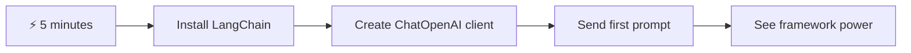
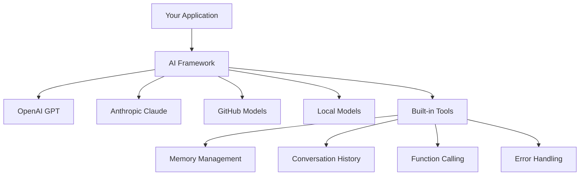
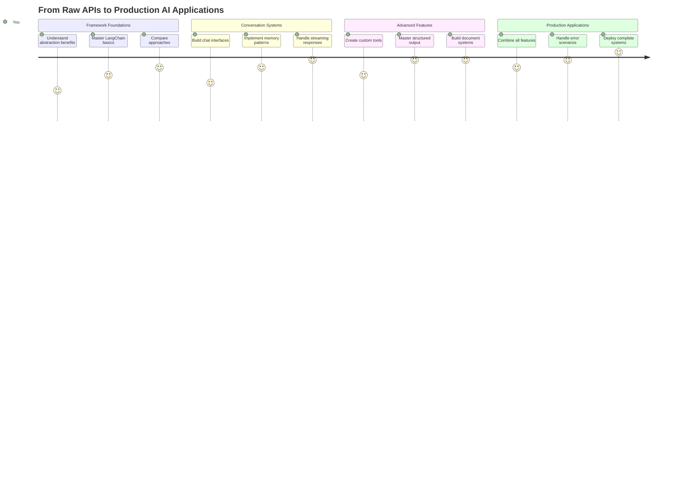
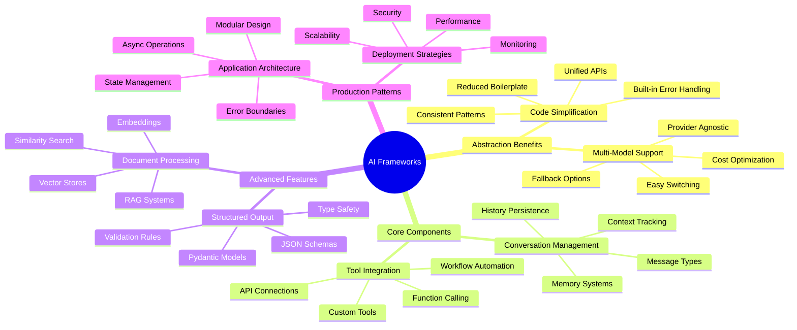
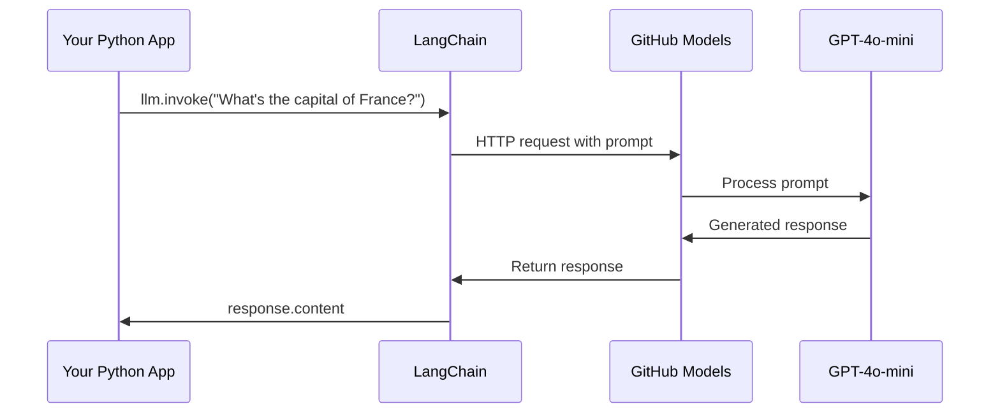
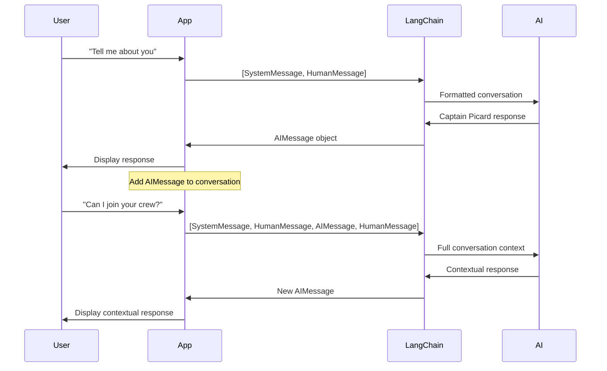
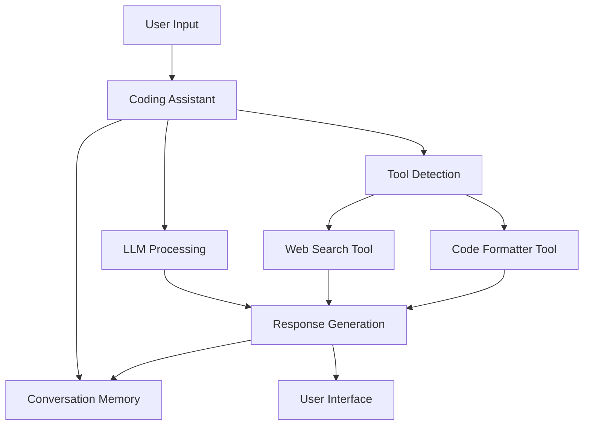
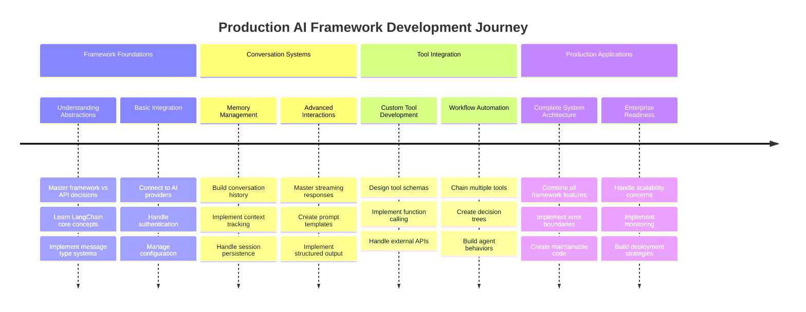
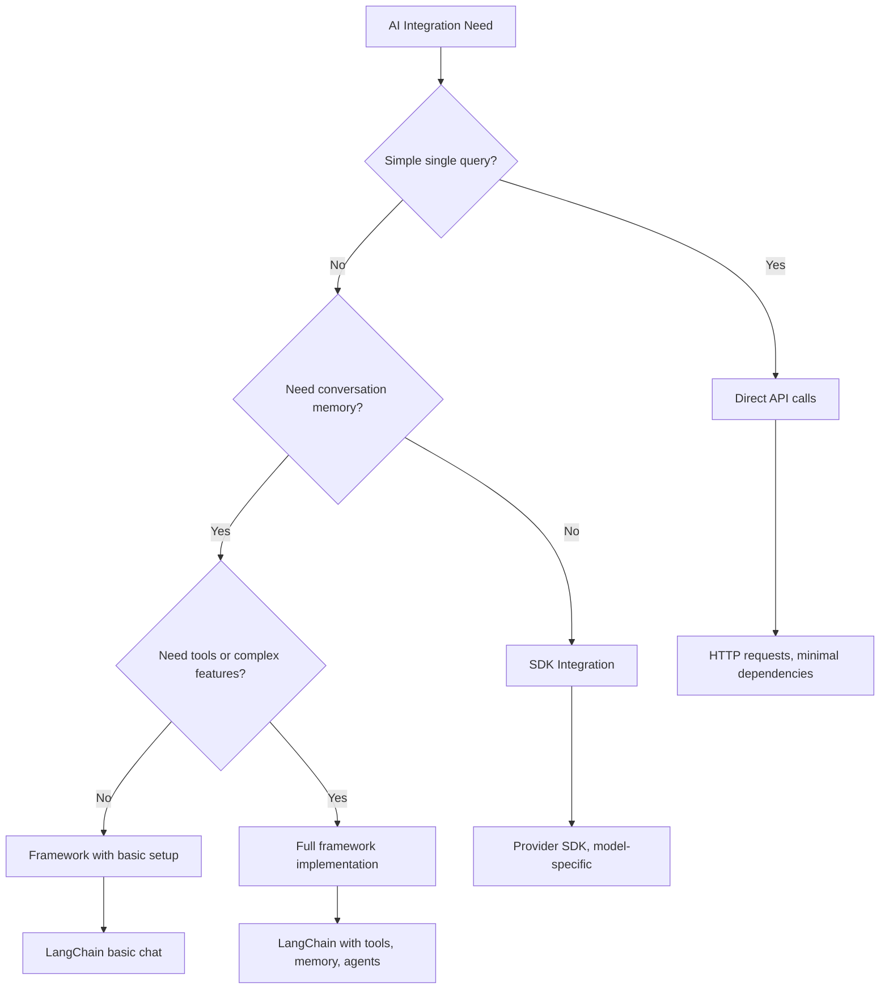

<!--
CO_OP_TRANSLATOR_METADATA:
{
  "original_hash": "3925b6a1c31c60755eaae4d578232c25",
  "translation_date": "2025-11-03T15:27:21+00:00",
  "source_file": "10-ai-framework-project/README.md",
  "language_code": "ne"
}
-->
# एआई फ्रेमवर्क

कहिल्यै एआई एप्लिकेशनहरू स्क्र्याचबाट निर्माण गर्न प्रयास गर्दा तनाव महसुस गर्नुभएको छ? तपाईं एक्लै हुनुहुन्न! एआई फ्रेमवर्कहरू एआई विकासको लागि स्विस आर्मी चक्कु जस्तै हुन् - ती शक्तिशाली उपकरणहरू हुन् जसले तपाईंलाई बुद्धिमान एप्लिकेशनहरू निर्माण गर्दा समय र झन्झट बचत गर्न सक्छ। एआई फ्रेमवर्कलाई राम्रोसँग व्यवस्थित पुस्तकालयको रूपमा सोच्नुहोस्: यसले पूर्वनिर्मित कम्पोनेन्टहरू, मानकीकृत एपीआईहरू, र स्मार्ट एब्स्ट्र्याक्सनहरू प्रदान गर्दछ ताकि तपाईं कार्यान्वयन विवरणसँग संघर्ष नगरी समस्याहरू समाधान गर्न ध्यान दिन सक्नुहुन्छ।

यस पाठमा, हामी LangChain जस्ता फ्रेमवर्कहरूले जटिल एआई एकीकरण कार्यहरूलाई कसरी सफा, पढ्न मिल्ने कोडमा परिणत गर्न सक्छन् भन्ने कुरा अन्वेषण गर्नेछौं। तपाईंले वास्तविक-जीवन चुनौतीहरू जस्तै कुराकानीको ट्र्याक राख्ने, उपकरण कलिंग कार्यान्वयन गर्ने, र एकीकृत इन्टरफेस मार्फत विभिन्न एआई मोडेलहरू सम्हाल्ने तरिका पत्ता लगाउनुहुनेछ।

हामी समाप्त हुँदा, तपाईंलाई थाहा हुनेछ कि कच्चा एपीआई कलहरूको सट्टा फ्रेमवर्कहरू कहिले प्रयोग गर्ने, तिनीहरूको एब्स्ट्र्याक्सनहरू प्रभावकारी रूपमा कसरी प्रयोग गर्ने, र वास्तविक-जीवन प्रयोगको लागि तयार एआई एप्लिकेशनहरू कसरी निर्माण गर्ने। आउनुहोस्, एआई फ्रेमवर्कहरूले तपाईंको परियोजनाहरूको लागि के गर्न सक्छन् भनेर अन्वेषण गरौं।

## ⚡ तपाईंले अर्को ५ मिनेटमा के गर्न सक्नुहुन्छ

**व्यस्त डेभलपरहरूको लागि छिटो सुरु गर्ने मार्ग**



- **मिनेट १**: LangChain स्थापना गर्नुहोस्: `pip install langchain langchain-openai`
- **मिनेट २**: आफ्नो GitHub टोकन सेटअप गर्नुहोस् र ChatOpenAI क्लाइन्ट आयात गर्नुहोस्
- **मिनेट ३**: प्रणाली र मानव सन्देशहरू सहित सरल कुराकानी सिर्जना गर्नुहोस्
- **मिनेट ४**: आधारभूत उपकरण (जस्तै एक add function) थप्नुहोस् र एआई उपकरण कलिंग हेर्नुहोस्
- **मिनेट ५**: कच्चा एपीआई कलहरू र फ्रेमवर्क एब्स्ट्र्याक्सनको बीचको फरक अनुभव गर्नुहोस्

**छिटो परीक्षण कोड**:
```python
from langchain_openai import ChatOpenAI
from langchain_core.messages import SystemMessage, HumanMessage

llm = ChatOpenAI(
    api_key=os.environ["GITHUB_TOKEN"],
    base_url="https://models.github.ai/inference",
    model="openai/gpt-4o-mini"
)

response = llm.invoke([
    SystemMessage(content="You are a helpful coding assistant"),
    HumanMessage(content="Explain Python functions briefly")
])
print(response.content)
```

**किन यो महत्त्वपूर्ण छ**: ५ मिनेटमा, तपाईंले अनुभव गर्नुहुनेछ कि एआई फ्रेमवर्कहरूले जटिल एआई एकीकरणलाई सरल विधि कलहरूमा कसरी रूपान्तरण गर्छ। यही आधार हो जसले उत्पादन एआई एप्लिकेशनहरूलाई शक्ति दिन्छ।

## किन फ्रेमवर्क रोज्ने?

तपाईं एआई एप निर्माण गर्न तयार हुनुहुन्छ - उत्कृष्ट! तर यहाँ कुरा छ: तपाईंले विभिन्न मार्गहरू लिन सक्नुहुन्छ, र प्रत्येकको आफ्नै फाइदा र बेफाइदा छन्। यो पैदल हिँड्ने, साइकल चलाउने, वा गाडी चलाएर कतै पुग्न छनोट गर्ने जस्तै हो - तिनीहरूले तपाईंलाई त्यहाँ पुर्‍याउँछन्, तर अनुभव (र प्रयास) पूर्ण रूपमा फरक हुनेछ।

आउनुहोस्, तपाईंले आफ्नो परियोजनाहरूमा एआई एकीकृत गर्न सक्ने तीन मुख्य तरिकाहरूलाई तोडौं:

| दृष्टिकोण | फाइदाहरू | उत्तम लागि | विचारहरू |
|----------|------------|----------|--------------|
| **प्रत्यक्ष HTTP अनुरोधहरू** | पूर्ण नियन्त्रण, कुनै निर्भरता छैन | सरल प्रश्नहरू, आधारभूत कुरा सिक्ने | बढी विस्तृत कोड, म्यानुअल त्रुटि ह्यान्डलिंग |
| **SDK एकीकरण** | कम बोइलरप्लेट, मोडेल-विशिष्ट अनुकूलन | एकल-मोडेल एप्लिकेशनहरू | विशिष्ट प्रदायकहरूमा सीमित |
| **एआई फ्रेमवर्कहरू** | एकीकृत एपीआई, निर्मित एब्स्ट्र्याक्सनहरू | बहु-मोडेल एपहरू, जटिल कार्यप्रवाहहरू | सिक्ने वक्र, सम्भावित अत्यधिक एब्स्ट्र्याक्सन |

### फ्रेमवर्क लाभहरू व्यवहारमा



**किन फ्रेमवर्कहरू महत्त्वपूर्ण छन्:**
- **एकीकृत** विभिन्न एआई प्रदायकहरू एक इन्टरफेस अन्तर्गत
- **स्वचालित रूपमा ह्यान्डल गर्छ** कुराकानी मेमोरी
- **तयार उपकरणहरू प्रदान गर्छ** सामान्य कार्यहरूको लागि जस्तै embeddings र function calling
- **त्रुटि ह्यान्डलिंग र पुन: प्रयास तर्क व्यवस्थापन गर्छ**
- **जटिल कार्यप्रवाहहरूलाई रूपान्तरण गर्छ** पढ्न मिल्ने विधि कलहरूमा

> 💡 **प्रो टिप**: विभिन्न एआई मोडेलहरू बीच स्विच गर्दा वा एजेन्टहरू, मेमोरी, वा उपकरण कलिंग जस्ता जटिल सुविधाहरू निर्माण गर्दा फ्रेमवर्कहरू प्रयोग गर्नुहोस्। आधारभूत कुरा सिक्दा वा सरल, केन्द्रित एप्लिकेशनहरू निर्माण गर्दा प्रत्यक्ष एपीआईहरूमा अडिग रहनुहोस्।

**तलको रेखा**: जस्तै एक कुशल कारीगरको विशेष उपकरणहरू र पूर्ण कार्यशालाको बीचमा छनोट गर्ने, यो कार्यको लागि उपकरण मिलाउनको बारेमा हो। जटिल, सुविधा-समृद्ध एप्लिकेशनहरूको लागि फ्रेमवर्कहरू उत्कृष्ट छन्, जबकि प्रत्यक्ष एपीआईहरू सरल प्रयोग केसहरूको लागि राम्रो काम गर्छन्।

## 🗺️ एआई फ्रेमवर्क मास्टरीको माध्यमबाट तपाईंको सिक्ने यात्रा



**तपाईंको यात्रा गन्तव्य**: यस पाठको अन्त्यसम्ममा, तपाईंले एआई फ्रेमवर्क विकासमा महारत हासिल गर्नुभएको हुनेछ र व्यावसायिक एआई सहायकहरूको प्रतिस्पर्धा गर्ने परिष्कृत, उत्पादन-तयार एआई एप्लिकेशनहरू निर्माण गर्न सक्षम हुनुहुनेछ।

## परिचय

यस पाठमा, हामी सिक्नेछौं:

- सामान्य एआई फ्रेमवर्क प्रयोग गर्ने।
- च्याट कुराकानी, उपकरण प्रयोग, मेमोरी र सन्दर्भ जस्ता सामान्य समस्याहरू समाधान गर्ने।
- यसलाई एआई एप्स निर्माण गर्न उपयोग गर्ने।

## 🧠 एआई फ्रेमवर्क विकास पारिस्थितिकी तन्त्र



**मुख्य सिद्धान्त**: एआई फ्रेमवर्कहरूले जटिलतालाई एब्स्ट्र्याक्ट गर्दै कुराकानी व्यवस्थापन, उपकरण एकीकरण, र कागजात प्रशोधनको लागि शक्तिशाली एब्स्ट्र्याक्सनहरू प्रदान गर्छन्, जसले सफा, मर्मतयोग्य कोडको साथ परिष्कृत एआई एप्लिकेशनहरू निर्माण गर्न डेभलपरहरूलाई सक्षम बनाउँछ।

## तपाईंको पहिलो एआई प्रम्प्ट

आउनुहोस्, आधारभूत कुराबाट सुरु गरौं र तपाईंको पहिलो एआई एप्लिकेशन सिर्जना गरौं जसले प्रश्न पठाउँछ र उत्तर फिर्ता ल्याउँछ। जस्तै आर्किमिडिजले आफ्नो स्नानमा विस्थापनको सिद्धान्त पत्ता लगाए, कहिलेकाहीँ सबैभन्दा सरल अवलोकनहरूले सबैभन्दा शक्तिशाली अन्तर्दृष्टिहरू ल्याउँछन् - र फ्रेमवर्कहरूले यी अन्तर्दृष्टिहरू पहुँचयोग्य बनाउँछन्।

### LangChain सेटअप गर्दै GitHub मोडेलहरूसँग

हामी LangChain प्रयोग गर्नेछौं GitHub मोडेलहरूसँग जडान गर्न, जुन धेरै राम्रो छ किनभने यसले तपाईंलाई विभिन्न एआई मोडेलहरूमा निःशुल्क पहुँच दिन्छ। सबैभन्दा राम्रो कुरा? तपाईंलाई सुरु गर्न केही सरल कन्फिगरेसन प्यारामिटरहरू मात्र आवश्यक छ:

```python
from langchain_openai import ChatOpenAI
import os

llm = ChatOpenAI(
    api_key=os.environ["GITHUB_TOKEN"],
    base_url="https://models.github.ai/inference",
    model="openai/gpt-4o-mini",
)

# Send a simple prompt
response = llm.invoke("What's the capital of France?")
print(response.content)
```

**यहाँ के भइरहेको छ भन्ने कुरा तोडौं:**
- **LangChain क्लाइन्ट सिर्जना गर्छ** `ChatOpenAI` क्लास प्रयोग गरेर - यो तपाईंको एआईमा प्रवेशद्वार हो!
- **GitHub मोडेलहरूसँग जडान कन्फिगर गर्छ** तपाईंको प्रमाणीकरण टोकनको साथ
- **कुन एआई मोडेल प्रयोग गर्ने निर्दिष्ट गर्छ** (`gpt-4o-mini`) - यसलाई तपाईंको एआई सहायक चयन गर्ने सोच्नुहोस्
- **तपाईंको प्रश्न पठाउँछ** `invoke()` विधि प्रयोग गरेर - यहाँ जादू हुन्छ
- **उत्तर निकाल्छ र प्रदर्शन गर्छ** - र voilà, तपाईं एआईसँग च्याट गर्दै हुनुहुन्छ!

> 🔧 **सेटअप नोट**: यदि तपाईं GitHub Codespaces प्रयोग गर्दै हुनुहुन्छ भने, तपाईं भाग्यमानी हुनुहुन्छ - `GITHUB_TOKEN` पहिले नै सेटअप गरिएको छ! स्थानीय रूपमा काम गर्दै हुनुहुन्छ? चिन्ता नगर्नुहोस्, तपाईंले सही अनुमतिहरूको साथ व्यक्तिगत पहुँच टोकन सिर्जना गर्न आवश्यक छ।

**अपेक्षित आउटपुट**:
```text
The capital of France is Paris.
```



## कुराकानी एआई निर्माण गर्दै

पहिलो उदाहरणले आधारभूत कुरा प्रदर्शन गर्छ, तर यो केवल एकल आदानप्रदान हो - तपाईंले प्रश्न सोध्नुहुन्छ, उत्तर प्राप्त गर्नुहुन्छ, र त्यति मात्र। वास्तविक एप्लिकेशनहरूमा, तपाईंले आफ्नो एआईलाई तपाईंले छलफल गरिरहनुभएको कुराको सम्झना गर्न चाहनुहुन्छ, जस्तै वाट्सन र होम्सले समयसँगै आफ्नो अनुसन्धानात्मक कुराकानी निर्माण गरे।

यही ठाउँ हो जहाँ LangChain विशेष रूपमा उपयोगी हुन्छ। यसले विभिन्न सन्देश प्रकारहरू प्रदान गर्दछ जसले कुराकानी संरचना गर्न मद्दत गर्दछ र तपाईंलाई आफ्नो एआईलाई व्यक्तित्व दिन अनुमति दिन्छ। तपाईं च्याट अनुभवहरू निर्माण गर्दै हुनुहुनेछ जसले सन्दर्भ र चरित्र कायम राख्छ।

### सन्देश प्रकारहरू बुझ्दै

यी सन्देश प्रकारहरूलाई कुराकानीमा सहभागीहरूले लगाउने विभिन्न "टोपीहरू" जस्तै सोच्नुहोस्। LangChain ले विभिन्न सन्देश वर्गहरू प्रयोग गर्दछ जसले को के भन्छ भनेर ट्र्याक राख्छ:

| सन्देश प्रकार | उद्देश्य | उदाहरण प्रयोग केस |
|--------------|---------|------------------|
| `SystemMessage` | एआई व्यक्तित्व र व्यवहार परिभाषित गर्छ | "तपाईं एक सहयोगी कोडिङ सहायक हुनुहुन्छ" |
| `HumanMessage` | प्रयोगकर्ता इनपुट प्रतिनिधित्व गर्छ | "फङ्सनहरू कसरी काम गर्छन् भनेर व्याख्या गर्नुहोस्" |
| `AIMessage` | एआई प्रतिक्रियाहरू भण्डारण गर्छ | कुराकानीमा अघिल्लो एआई प्रतिक्रियाहरू |

### तपाईंको पहिलो कुराकानी सिर्जना गर्दै

आउनुहोस्, एउटा कुराकानी सिर्जना गरौं जहाँ हाम्रो एआईले विशिष्ट भूमिका ग्रहण गर्छ। हामीले यसलाई क्याप्टेन पिकार्डको रूपमा अवतार दिन्छौं - कूटनीतिक बुद्धिमत्ता र नेतृत्वका लागि परिचित पात्र:

```python
messages = [
    SystemMessage(content="You are Captain Picard of the Starship Enterprise"),
    HumanMessage(content="Tell me about you"),
]
```

**यो कुराकानी सेटअपलाई तोड्दै:**
- **एआईको भूमिका र व्यक्तित्व स्थापना गर्छ** `SystemMessage` मार्फत
- **प्रारम्भिक प्रयोगकर्ता प्रश्न प्रदान गर्छ** `HumanMessage` मार्फत
- **बहु-टर्न कुराकानीको लागि आधार सिर्जना गर्छ**

यस उदाहरणको पूर्ण कोड यस प्रकार देखिन्छ:

```python
from langchain_core.messages import HumanMessage, SystemMessage
from langchain_openai import ChatOpenAI
import os

llm = ChatOpenAI(
    api_key=os.environ["GITHUB_TOKEN"],
    base_url="https://models.github.ai/inference",
    model="openai/gpt-4o-mini",
)

messages = [
    SystemMessage(content="You are Captain Picard of the Starship Enterprise"),
    HumanMessage(content="Tell me about you"),
]


# works
response  = llm.invoke(messages)
print(response.content)
```

तपाईंले निम्न जस्तै परिणाम देख्नुहुनेछ:

```text
I am Captain Jean-Luc Picard, the commanding officer of the USS Enterprise (NCC-1701-D), a starship in the United Federation of Planets. My primary mission is to explore new worlds, seek out new life and new civilizations, and boldly go where no one has gone before. 

I believe in the importance of diplomacy, reason, and the pursuit of knowledge. My crew is diverse and skilled, and we often face challenges that test our resolve, ethics, and ingenuity. Throughout my career, I have encountered numerous species, grappled with complex moral dilemmas, and have consistently sought peaceful solutions to conflicts.

I hold the ideals of the Federation close to my heart, believing in the importance of cooperation, understanding, and respect for all sentient beings. My experiences have shaped my leadership style, and I strive to be a thoughtful and just captain. How may I assist you further?
```

कुराकानी निरन्तरता कायम गर्न (प्रत्येक पटक सन्दर्भ रिसेट नगरी), तपाईंले आफ्नो सन्देश सूचीमा प्रतिक्रियाहरू थपिरहनु आवश्यक छ। जस्तै मौखिक परम्पराहरूले पुस्ताहरूमा कथाहरू संरक्षण गरे, यो दृष्टिकोणले स्थायी मेमोरी निर्माण गर्छ:

```python
from langchain_core.messages import HumanMessage, SystemMessage
from langchain_openai import ChatOpenAI
import os

llm = ChatOpenAI(
    api_key=os.environ["GITHUB_TOKEN"],
    base_url="https://models.github.ai/inference",
    model="openai/gpt-4o-mini",
)

messages = [
    SystemMessage(content="You are Captain Picard of the Starship Enterprise"),
    HumanMessage(content="Tell me about you"),
]


# works
response  = llm.invoke(messages)

print(response.content)

print("---- Next ----")

messages.append(response)
messages.append(HumanMessage(content="Now that I know about you, I'm Chris, can I be in your crew?"))

response  = llm.invoke(messages)

print(response.content)

```

धेरै राम्रो, हैन? यहाँ के भइरहेको छ भने हामीले LLMलाई दुई पटक कल गरिरहेका छौं - पहिलो पटक हाम्रो प्रारम्भिक दुई सन्देशहरूसँग, तर त्यसपछि पूर्ण कुराकानी इतिहाससँग। यो एआई वास्तवमा हाम्रो च्याट पछ्याउँदै छ जस्तो छ!

जब तपाईं यो कोड चलाउनुहुन्छ, तपाईंले दोस्रो प्रतिक्रिया प्राप्त गर्नुहुनेछ जुन केही यस प्रकारको देखिन्छ:

```text
Welcome aboard, Chris! It's always a pleasure to meet those who share a passion for exploration and discovery. While I cannot formally offer you a position on the Enterprise right now, I encourage you to pursue your aspirations. We are always in need of talented individuals with diverse skills and backgrounds. 

If you are interested in space exploration, consider education and training in the sciences, engineering, or diplomacy. The values of curiosity, resilience, and teamwork are crucial in Starfleet. Should you ever find yourself on a starship, remember to uphold the principles of the Federation: peace, understanding, and respect for all beings. Your journey can lead you to remarkable adventures, whether in the stars or on the ground. Engage!
```



मलाई लाग्छ यो सम्भव छ ;)

## स्ट्रिमिङ प्रतिक्रियाहरू

कहिल्यै ध्यान दिनुभएको छ कि ChatGPTले आफ्नो प्रतिक्रियाहरू वास्तविक समयमा "टाइप" गरिरहेको जस्तो देखिन्छ? यो स्ट्रिमिङको कार्य हो। जस्तै कुशल क्यालिग्राफरले काम गरिरहेको हेर्दा - अक्षरहरू स्ट्रोक बाई स्ट्रोक देखा पर्दैछन् बरु तुरुन्तै प्रकट हुँदैछन् - स्ट्रिमिङले अन्तरक्रिया प्राकृतिक महसुस गराउँछ र तत्काल प्रतिक्रिया प्रदान गर्छ।

### LangChainसँग स्ट्रिमिङ कार्यान्वयन गर्दै

```python
from langchain_openai import ChatOpenAI
import os

llm = ChatOpenAI(
    api_key=os.environ["GITHUB_TOKEN"],
    base_url="https://models.github.ai/inference",
    model="openai/gpt-4o-mini",
    streaming=True
)

# Stream the response
for chunk in llm.stream("Write a short story about a robot learning to code"):
    print(chunk.content, end="", flush=True)
```

**किन स्ट्रिमिङ उत्कृष्ट छ:**
- **सामग्री देखाउँछ** यो सिर्जना भइरहेको छ - अब कुनै अजीब प्रतीक्षा छैन!
- **प्रयोगकर्ताहरूलाई महसुस गराउँछ** कि केही वास्तवमै भइरहेको छ
- **छिटो महसुस हुन्छ**, जब यो प्राविधिक रूपमा छैन
- **प्रयोगकर्ताहरूलाई पढ्न दिन्छ** जबकि एआई अझै "सोच्दै" छ

> 💡 **प्रयोगकर्ता अनुभव टिप**: स्ट्रिमिङ वास्तवमै चम्किन्छ जब तपाईं कोड व्याख्या, रचनात्मक लेखन, वा विस्तृत ट्यूटोरियलहरू जस्ता लामो प्रतिक्रियाहरूको सामना गर्दै हुनुहुन्छ। तपाईंका प्रयोगकर्ताहरूले खाली स्क्रिनमा घुरेर हेर्ने सट्टा प्रगति देख्न मन पराउनेछन्!

### 🎯 शैक्षिक जाँच: फ्रेमवर्क एब्स्ट्र्याक्सन लाभहरू

**रोक्नुहोस् र प्रतिबिम्ब गर्नुहोस्**: तपाईंले एआई फ्रेमवर्क एब्स्ट्र्याक्सनहरूको शक्ति अनुभव गर्नुभएको छ। कच्चा एपीआई कलहरूबाट सिकेको कुरासँग तुलना गर्नुहोस्।

**छिटो आत्म-मूल्यांकन**:
- तपाईं LangChainले म्यानुअल सन्देश ट्र्याकिङको तुलनामा कुराकानी व्यवस्थापनलाई कसरी सरल बनाउँछ भनेर व्याख्या गर्न सक्नुहुन्छ?
- `invoke()` र `stream()` विधिहरूको बीचको फरक के हो, र तपाईंले प्रत्येकलाई कहिले प्रयोग गर्नुहुन्छ?
- फ्रेमवर्कको सन्देश प्रकार प्रणालीले कोड संगठनलाई कसरी सुधार गर्छ?

**वास्तविक-जीवन जडान**: तपाईंले सिकेका एब्स्ट्र्याक्सन ढाँचाहरू (सन्देश प्रकारहरू, स्ट्रिमिङ इन्टरफेसहरू, कुराकानी मेमोरी) प्रत्येक प्रमुख एआई एप्लिकेशनमा प्रयोग गरिन्छ - ChatGPTको इन्टरफेसदेखि GitHub Copilotको कोड सहायता सम्म। तपाईं व्यावसायिक एआई विकास टोलीहरूले प्रयोग गर्ने समान वास्तुकला ढाँचाहरूमा महारत हासिल गर्दै हुनुहुन्छ।

**चुनौती प्रश्न**: विभिन्न एआई मोडेल प्रदायकहरू (OpenAI, Anthropic, Google) एकल इन्टरफेसको साथ ह्यान्डल गर्न फ्रेमवर्क एब्स्ट्र्याक्सन कसरी डिजाइन गर्नुहुन्छ? फाइदाहरू र बेफाइदाहरू विचार गर्नुहोस्।

## प्रम्प्ट टेम्प्लेटहरू

प्रम्प्ट टेम्प्लेटहरू शास्त्रीय वक्तृत्वमा प्रयोग गरिएका रेटोरिकल संरचनाहरू जस्तै काम गर्छन् - सोच्नुहोस् कि कसरी सिसेरोले आफ्नो भाषण शैलीहरू विभिन्न श्रोताहरूको लागि अनुकूलन गर्थे जबकि समान प्रेरक फ्रेमवर्क कायम राख्दै। तिनीहरूले तपाईंलाई पुन: प्रयोग गर्न मिल्ने प्रम्प्टहरू सिर्जना गर्न अनुमति दिन्छन् जहाँ तपाईंले सबै कुरा स्क्र्याचबाट पुन: लेख्न बिना विभिन्न जानकारीका टुक्राहरू साट्न सक्नुहुन्छ। एक पटक तपाईंले टेम्प्लेट सेटअप गर्नुभयो, तपाईंले आवश्यक मानहरू सहित भेरिएबलहरू भर्नु मात्र आवश्यक छ।

### पुन: प्रयोग गर्न मिल्ने प्रम्प्टहरू सिर्जना गर्दै

```python
from langchain_core.prompts import ChatPromptTemplate

# Define a template for code explanations
template = ChatPromptTemplate.from_messages([
    ("system", "You are an expert programming instructor. Explain concepts clearly with examples."),
    ("human", "Explain {concept} in {language} with a practical example for {skill_level} developers")
])

# Use the template with different values
questions = [
    {"concept": "functions", "language": "JavaScript", "skill_level": "beginner"},
    {"concept": "classes", "language": "Python", "skill_level": "intermediate"},
    {"concept": "async/await", "language": "JavaScript", "skill_level": "advanced"}
]

for question in questions:
    prompt = template.format_messages(**question)
    response = llm.invoke(prompt)
    print(f"Topic: {question['concept']}\n{response.content}\n---\n")
```

**किन तपाईंलाई टेम्प्लेटहरू मनपर्नेछ:**
- **तपाईंको प्रम्प्टहरूलाई** तपाईंको सम्पूर्ण एपमा स्थिर राख्छ
- **अब कुनै पनि** अव्यवस्थित स्ट्रिङ कन्काटेनेशन छैन - केवल सफा, सरल भेरिएबलहरू
- **तपाईंको एआई** पूर्वानुमान योग्य व्यवहार गर्छ किनभने संरचना उस्तै रहन्छ
- **अपडेटहरू** सजिलो हुन्छ - एक पटक टेम्प्लेट परिवर्तन गर्नुहोस्, र यो सबै ठाउँमा ठीक हुन्छ

## संरचित आउटपुट

कहिल्यै एआई प्रतिक्रियाहरूलाई पार्स गर्न प्रयास गर्दा निराश महसुस गर्नुभएको छ जुन असंरचित पाठको रूपमा फिर्ता आउँछ? संरचित आउटपुट जस्तै तपाईंको एआईलाई लिनियसले जैविक वर्गीकरणको लागि प्रयोग गरेको प्रणालीगत दृष्टिकोण अनुसरण गर्न सिकाउँदै - व्यवस्थित, पूर्वानुमान योग्य, र काम गर्न सजिलो। तपाईं JSON, विशिष्ट डेटा संरचनाहरू, वा तपाईंलाई आवश्यक कुनै पनि ढाँचा अनुरोध गर्न सक्नुहुन्छ।

### आउटपुट स्किमाहरू परिभाषित गर्दै

```python
from langchain_core.prompts import ChatPromptTemplate
from langchain_core.output_parsers import JsonOutputParser
from pydantic import BaseModel, Field

class CodeReview(BaseModel):
    score: int = Field(description="Code quality score from 1-10")
    strengths: list[str] = Field(description="List of code strengths")
    improvements: list[str] = Field(description="List of suggested improvements")
    overall_feedback: str = Field(description="Summary feedback")

# Set up the parser
parser = JsonOutputParser(pydantic_object=CodeReview)

# Create prompt with format instructions
prompt = ChatPromptTemplate.from_messages([
    ("system", "You are a code reviewer. {format_instructions}"),
    ("human", "Review this code: {code}")
])

# Format the prompt with instructions
chain = prompt | llm | parser

# Get structured response
code_sample = """
def calculate_average(numbers):
    return sum(numbers) / len(numbers)
"""

result = chain.invoke({
    "code": code_sample,
    "format_instructions": parser.get_format_instructions()
})

print(f"Score: {result['score']}")
print(f"Strengths: {', '.join(result['strengths'])}")
```

**किन संरचित आउटपुट गेम-चेन्जर हो:**
- **अब कुनै पनि अनुमान छैन** कि तपाईंले फिर्ता के ढाँचा प्राप्त गर्नुहुनेछ - यो प्रत्येक पटक स्थिर छ
- **तुरुन्तै प्लग हुन्छ** तपाईंको डेटाबेसहरू र एपीआईहरूमा अतिरिक्त काम बिना
- **अजीब एआई प्रतिक्रियाहरू समात्छ** तपाईंको एपलाई बिग्रनु अघि
- **तपाईंको कोडलाई सफा बनाउँछ** किनभने तपाईंलाई थाहा छ कि तपाईं केसँग काम गर्दै हुनुहुन्छ

## उपकरण कलिंग

अब हामी सबैभन्दा शक्तिशाली सुविधाहरूमा पुग्छौं: उपकरणहरू। यही हो जसले तपाईंको एआईलाई कुराकानीभन्दा बाहिर व्यावहारिक क्षमता दिन्छ। ज
संख्या थप्नुले अवधारणा देखाउँछ, तर वास्तविक उपकरणहरूले सामान्यतया थप जटिल कार्यहरू गर्छन्, जस्तै वेब API कल गर्नु। अब हाम्रो उदाहरणलाई विस्तार गरौं जसले AI लाई इन्टरनेटबाट सामग्री ल्याउन सक्षम बनाउँछ - ठीक त्यस्तै जस्तो टेलिग्राफ अपरेटरहरूले कहिल्यै टाढा रहेका स्थानहरूलाई जोड्थे:

```python
class joke(TypedDict):
    """Tell a joke."""

    # Annotations must have the type and can optionally include a default value and description (in that order).
    category: Annotated[str, ..., "The joke category"]

def get_joke(category: str) -> str:
    response = requests.get(f"https://api.chucknorris.io/jokes/random?category={category}", headers={"Accept": "application/json"})
    if response.status_code == 200:
        return response.json().get("value", f"Here's a {category} joke!")
    return f"Here's a {category} joke!"

functions = {
    "add": lambda a, b: a + b,
    "joke": lambda category: get_joke(category)
}

query = "Tell me a joke about animals"

# the rest of the code is the same
```

अब यदि तपाईंले यो कोड चलाउनुभयो भने तपाईंलाई केही यस्तै प्रतिक्रिया प्राप्त हुनेछ:

```text
TOOL CALL:  Chuck Norris once rode a nine foot grizzly bear through an automatic car wash, instead of taking a shower.
CONTENT:  
```

```mermaid
flowchart TD
    A[User Query: "Tell me a joke about animals"] --> B[LangChain Analysis]
    B --> C{Tool Available?}
    C -->|Yes| D[Select joke tool]
    C -->|No| E[Generate direct response]
    
    D --> F[Extract Parameters]
    F --> G[Call joke(category="animals")]
    G --> H[API Request to chucknorris.io]
    H --> I[Return joke content]
    I --> J[Display to user]
    
    E --> K[AI-generated response]
    K --> J
    
    subgraph "Tool Definition Layer"
        L[TypedDict Schema]
        M[Function Implementation]
        N[Parameter Validation]
    end
    
    D --> L
    F --> N
    G --> M
```

यहाँ कोडको सम्पूर्णता छ:

```python
from langchain_openai import ChatOpenAI
import requests
import os
from typing_extensions import Annotated, TypedDict

class add(TypedDict):
    """Add two integers."""

    # Annotations must have the type and can optionally include a default value and description (in that order).
    a: Annotated[int, ..., "First integer"]
    b: Annotated[int, ..., "Second integer"]

class joke(TypedDict):
    """Tell a joke."""

    # Annotations must have the type and can optionally include a default value and description (in that order).
    category: Annotated[str, ..., "The joke category"]

tools = [add, joke]

def get_joke(category: str) -> str:
    response = requests.get(f"https://api.chucknorris.io/jokes/random?category={category}", headers={"Accept": "application/json"})
    if response.status_code == 200:
        return response.json().get("value", f"Here's a {category} joke!")
    return f"Here's a {category} joke!"

functions = {
    "add": lambda a, b: a + b,
    "joke": lambda category: get_joke(category)
}

llm = ChatOpenAI(
    api_key=os.environ["GITHUB_TOKEN"],
    base_url="https://models.github.ai/inference",
    model="openai/gpt-4o-mini",
)

llm_with_tools = llm.bind_tools(tools)

query = "Tell me a joke about animals"

res = llm_with_tools.invoke(query)
if(res.tool_calls):
    for tool in res.tool_calls:
        # print("TOOL CALL: ", tool)
        print("TOOL CALL: ", functions[tool["name"]](../../../10-ai-framework-project/**tool["args"]))
print("CONTENT: ",res.content)
```

## एम्बेडिङ्स र दस्तावेज प्रक्रिया

एम्बेडिङ्स आधुनिक AI मा सबैभन्दा सुन्दर समाधानहरू मध्ये एक हो। कल्पना गर्नुहोस् कि तपाईं कुनै पनि पाठलाई लिइरहनु भएको छ र त्यसलाई यसको अर्थ समेट्ने संख्यात्मक समन्वयमा रूपान्तरण गर्न सक्नुहुन्छ। यही कुरा एम्बेडिङ्सले गर्छ - तिनीहरूले पाठलाई बहु-आयामिक स्थानमा बिन्दुहरूमा रूपान्तरण गर्छन् जहाँ समान अवधारणाहरू एकसाथ समूह हुन्छन्। यो विचारहरूको लागि समन्वय प्रणाली जस्तै हो, जसरी मेन्डेलीभले परमाणु गुणहरूद्वारा आवधिक तालिका व्यवस्थित गरे।

### एम्बेडिङ्स सिर्जना र प्रयोग गर्ने

```python
from langchain_openai import OpenAIEmbeddings
from langchain_community.vectorstores import FAISS
from langchain_community.document_loaders import TextLoader
from langchain.text_splitter import CharacterTextSplitter

# Initialize embeddings
embeddings = OpenAIEmbeddings(
    api_key=os.environ["GITHUB_TOKEN"],
    base_url="https://models.github.ai/inference",
    model="text-embedding-3-small"
)

# Load and split documents
loader = TextLoader("documentation.txt")
documents = loader.load()

text_splitter = CharacterTextSplitter(chunk_size=1000, chunk_overlap=0)
texts = text_splitter.split_documents(documents)

# Create vector store
vectorstore = FAISS.from_documents(texts, embeddings)

# Perform similarity search
query = "How do I handle user authentication?"
similar_docs = vectorstore.similarity_search(query, k=3)

for doc in similar_docs:
    print(f"Relevant content: {doc.page_content[:200]}...")
```

### विभिन्न ढाँचाका लागि दस्तावेज लोडरहरू

```python
from langchain_community.document_loaders import (
    PyPDFLoader,
    CSVLoader,
    JSONLoader,
    WebBaseLoader
)

# Load different document types
pdf_loader = PyPDFLoader("manual.pdf")
csv_loader = CSVLoader("data.csv")
json_loader = JSONLoader("config.json")
web_loader = WebBaseLoader("https://example.com/docs")

# Process all documents
all_documents = []
for loader in [pdf_loader, csv_loader, json_loader, web_loader]:
    docs = loader.load()
    all_documents.extend(docs)
```

**एम्बेडिङ्सले तपाईंलाई के गर्न सक्षम बनाउँछ:**
- **खोज निर्माण गर्नुहोस्** जसले वास्तवमा तपाईंको अर्थ बुझ्छ, केवल कीवर्ड मिलान मात्र होइन
- **AI सिर्जना गर्नुहोस्** जसले तपाईंको दस्तावेजहरूको बारेमा प्रश्नहरूको उत्तर दिन सक्छ
- **सिफारिस प्रणाली बनाउनुहोस्** जसले वास्तवमै सान्दर्भिक सामग्री सुझाव दिन्छ
- **स्वतः** तपाईंको सामग्रीलाई व्यवस्थित र वर्गीकृत गर्नुहोस्

```mermaid
flowchart LR
    A[Documents] --> B[Text Splitter]
    B --> C[Create Embeddings]
    C --> D[Vector Store]
    
    E[User Query] --> F[Query Embedding]
    F --> G[Similarity Search]
    G --> D
    D --> H[Relevant Documents]
    H --> I[AI Response]
    
    subgraph "Vector Space"
        J[Document A: [0.1, 0.8, 0.3...]]
        K[Document B: [0.2, 0.7, 0.4...]]
        L[Query: [0.15, 0.75, 0.35...]]
    end
    
    C --> J
    C --> K
    F --> L
    G --> J
    G --> K
```

## पूर्ण AI एप्लिकेसन निर्माण

अब हामीले सिकेका सबै कुरा एक व्यापक एप्लिकेसनमा समाहित गर्नेछौं - एक कोडिङ सहायक जसले प्रश्नहरूको उत्तर दिन सक्छ, उपकरणहरू प्रयोग गर्न सक्छ, र संवाद स्मृति कायम राख्न सक्छ। जस्तै छापाखानाले विद्यमान प्रविधिहरू (चलायमान प्रकार, मसी, कागज, र दबाब) लाई केही परिवर्तनकारीमा संयोजन गर्यो, हामीले हाम्रो AI घटकहरूलाई केही व्यावहारिक र उपयोगीमा संयोजन गर्नेछौं।

### पूर्ण एप्लिकेसन उदाहरण

```python
from langchain_openai import ChatOpenAI, OpenAIEmbeddings
from langchain_core.prompts import ChatPromptTemplate
from langchain_core.messages import HumanMessage, SystemMessage, AIMessage
from langchain_community.vectorstores import FAISS
from typing_extensions import Annotated, TypedDict
import os
import requests

class CodingAssistant:
    def __init__(self):
        self.llm = ChatOpenAI(
            api_key=os.environ["GITHUB_TOKEN"],
            base_url="https://models.github.ai/inference",
            model="openai/gpt-4o-mini"
        )
        
        self.conversation_history = [
            SystemMessage(content="""You are an expert coding assistant. 
            Help users learn programming concepts, debug code, and write better software.
            Use tools when needed and maintain a helpful, encouraging tone.""")
        ]
        
        # Define tools
        self.setup_tools()
    
    def setup_tools(self):
        class web_search(TypedDict):
            """Search for programming documentation or examples."""
            query: Annotated[str, "Search query for programming help"]
        
        class code_formatter(TypedDict):
            """Format and validate code snippets."""
            code: Annotated[str, "Code to format"]
            language: Annotated[str, "Programming language"]
        
        self.tools = [web_search, code_formatter]
        self.llm_with_tools = self.llm.bind_tools(self.tools)
    
    def chat(self, user_input: str):
        # Add user message to conversation
        self.conversation_history.append(HumanMessage(content=user_input))
        
        # Get AI response
        response = self.llm_with_tools.invoke(self.conversation_history)
        
        # Handle tool calls if any
        if response.tool_calls:
            for tool_call in response.tool_calls:
                tool_result = self.execute_tool(tool_call)
                print(f"🔧 Tool used: {tool_call['name']}")
                print(f"📊 Result: {tool_result}")
        
        # Add AI response to conversation
        self.conversation_history.append(response)
        
        return response.content
    
    def execute_tool(self, tool_call):
        tool_name = tool_call['name']
        args = tool_call['args']
        
        if tool_name == 'web_search':
            return f"Found documentation for: {args['query']}"
        elif tool_name == 'code_formatter':
            return f"Formatted {args['language']} code: {args['code'][:50]}..."
        
        return "Tool execution completed"

# Usage example
assistant = CodingAssistant()

print("🤖 Coding Assistant Ready! Type 'quit' to exit.\n")

while True:
    user_input = input("You: ")
    if user_input.lower() == 'quit':
        break
    
    response = assistant.chat(user_input)
    print(f"🤖 Assistant: {response}\n")
```

**एप्लिकेसन आर्किटेक्चर:**



**हामीले कार्यान्वयन गरेका मुख्य विशेषताहरू:**
- **तपाईंको सम्पूर्ण संवाद सम्झन्छ** सन्दर्भ निरन्तरता सुनिश्चित गर्न
- **कार्यहरू प्रदर्शन गर्छ** उपकरण कल मार्फत, केवल संवाद मात्र होइन
- **अनुसरण गर्छ** पूर्वानुमान योग्य अन्तरक्रिया ढाँचाहरू
- **स्वतः त्रुटि व्यवस्थापन र जटिल कार्यप्रवाहहरू व्यवस्थापन गर्छ**

### 🎯 शैक्षिक जाँच: उत्पादन AI आर्किटेक्चर

**आर्किटेक्चर बुझाइ**: तपाईंले संवाद व्यवस्थापन, उपकरण कल, र संरचित कार्यप्रवाहहरू संयोजन गर्ने पूर्ण AI एप्लिकेसन निर्माण गर्नुभएको छ। यो उत्पादन-स्तर AI एप्लिकेसन विकासको प्रतिनिधित्व गर्दछ।

**मुख्य अवधारणाहरूमा महारत हासिल गरियो**:
- **क्लास-आधारित आर्किटेक्चर**: व्यवस्थित, मर्मतयोग्य AI एप्लिकेसन संरचना
- **उपकरण एकीकरण**: संवादभन्दा बाहिरको अनुकूल कार्यक्षमता
- **स्मृति व्यवस्थापन**: स्थायी संवाद सन्दर्भ
- **त्रुटि व्यवस्थापन**: बलियो एप्लिकेसन व्यवहार

**उद्योग जडान**: तपाईंले कार्यान्वयन गरेका आर्किटेक्चर ढाँचाहरू (संवाद कक्षाहरू, उपकरण प्रणालीहरू, स्मृति व्यवस्थापन) Slack को AI सहायक, GitHub Copilot, र Microsoft Copilot जस्ता उद्यम AI एप्लिकेसनहरूमा प्रयोग गरिएका समान ढाँचाहरू हुन्। तपाईंले व्यावसायिक-ग्रेड आर्किटेक्चरल सोचको साथ निर्माण गर्दै हुनुहुन्छ।

**प्रतिबिम्ब प्रश्न**: तपाईंले यो एप्लिकेसनलाई बहु-प्रयोगकर्ता, स्थायी भण्डारण, वा बाह्य डाटाबेसहरूसँग एकीकरण गर्न कसरी विस्तार गर्नुहुन्छ? स्केलेबिलिटी र राज्य व्यवस्थापन चुनौतीहरूको बारेमा विचार गर्नुहोस्।

## असाइनमेन्ट: आफ्नो AI-संचालित अध्ययन सहायक निर्माण गर्नुहोस्

**उद्देश्य**: एक AI एप्लिकेसन सिर्जना गर्नुहोस् जसले विद्यार्थीहरूलाई प्रोग्रामिङ अवधारणाहरू सिक्न मद्दत गर्दछ व्याख्या, कोड उदाहरणहरू, र अन्तरक्रियात्मक क्विजहरू प्रदान गरेर।

### आवश्यकताहरू

**मुख्य विशेषताहरू (आवश्यक):**
1. **संवादात्मक इन्टरफेस**: एक च्याट प्रणाली कार्यान्वयन गर्नुहोस् जसले बहु प्रश्नहरूमा सन्दर्भ कायम राख्छ
2. **शैक्षिक उपकरणहरू**: सिकाइमा मद्दत गर्ने कम्तीमा दुई उपकरणहरू सिर्जना गर्नुहोस्:
   - कोड व्याख्या उपकरण
   - अवधारणा क्विज जनरेटर
3. **व्यक्तिगत सिकाइ**: विभिन्न सीप स्तरहरूमा प्रतिक्रिया अनुकूलन गर्न प्रणाली सन्देशहरू प्रयोग गर्नुहोस्
4. **प्रतिक्रिया ढाँचा**: क्विज प्रश्नहरूको लागि संरचित आउटपुट कार्यान्वयन गर्नुहोस्

### कार्यान्वयन चरणहरू

**चरण 1: आफ्नो वातावरण सेटअप गर्नुहोस्**
```bash
pip install langchain langchain-openai
```

**चरण 2: आधारभूत च्याट कार्यक्षमता**
- `StudyAssistant` कक्षा सिर्जना गर्नुहोस्
- संवाद स्मृति कार्यान्वयन गर्नुहोस्
- शैक्षिक समर्थनको लागि व्यक्तित्व कन्फिगरेसन थप्नुहोस्

**चरण 3: शैक्षिक उपकरणहरू थप्नुहोस्**
- **कोड व्याख्याकार**: कोडलाई बुझ्न सकिने भागहरूमा तोड्छ
- **क्विज जनरेटर**: प्रोग्रामिङ अवधारणाहरूको बारेमा प्रश्नहरू सिर्जना गर्छ
- **प्रगति ट्र्याकर**: समेटिएका विषयहरूको ट्र्याक राख्छ

**चरण 4: उन्नत विशेषताहरू (वैकल्पिक)**
- राम्रो प्रयोगकर्ता अनुभवको लागि स्ट्रिमिङ प्रतिक्रियाहरू कार्यान्वयन गर्नुहोस्
- पाठ्यक्रम सामग्री समावेश गर्न दस्तावेज लोडिंग थप्नुहोस्
- समानता-आधारित सामग्री पुनःप्राप्तिको लागि एम्बेडिङ्स सिर्जना गर्नुहोस्

### मूल्यांकन मापदण्ड

| विशेषता | उत्कृष्ट (4) | राम्रो (3) | सन्तोषजनक (2) | सुधार आवश्यक (1) |
|---------|---------------|----------|------------------|----------------|
| **संवाद प्रवाह** | प्राकृतिक, सन्दर्भ-सचेत प्रतिक्रियाहरू | राम्रो सन्दर्भ प्रतिधारण | आधारभूत संवाद | विनिमयहरू बीच कुनै स्मृति छैन |
| **उपकरण एकीकरण** | धेरै उपयोगी उपकरणहरू सहज रूपमा काम गर्दै | २+ उपकरणहरू सही कार्यान्वयन गरिएको | १-२ आधारभूत उपकरणहरू | उपकरणहरू कार्यात्मक छैनन् |
| **कोड गुणस्तर** | सफा, राम्रोसँग दस्तावेज गरिएको, त्रुटि व्यवस्थापन | राम्रो संरचना, केही दस्तावेज | आधारभूत कार्यक्षमता काम गर्छ | खराब संरचना, कुनै त्रुटि व्यवस्थापन छैन |
| **शैक्षिक मूल्य** | सिकाइको लागि वास्तवमै उपयोगी, अनुकूलन योग्य | राम्रो सिकाइ समर्थन | आधारभूत व्याख्याहरू | सीमित शैक्षिक लाभ |

### नमूना कोड संरचना

```python
class StudyAssistant:
    def __init__(self, skill_level="beginner"):
        # Initialize LLM, tools, and conversation memory
        pass
    
    def explain_code(self, code, language):
        # Tool: Explain how code works
        pass
    
    def generate_quiz(self, topic, difficulty):
        # Tool: Create practice questions
        pass
    
    def chat(self, user_input):
        # Main conversation interface
        pass

# Example usage
assistant = StudyAssistant(skill_level="intermediate")
response = assistant.chat("Explain how Python functions work")
```

**बोनस चुनौतीहरू:**
- आवाज इनपुट/आउटपुट क्षमताहरू थप्नुहोस्
- Streamlit वा Flask प्रयोग गरेर वेब इन्टरफेस कार्यान्वयन गर्नुहोस्
- एम्बेडिङ्स प्रयोग गरेर पाठ्यक्रम सामग्रीबाट ज्ञान आधार सिर्जना गर्नुहोस्
- प्रगति ट्र्याकिङ र व्यक्तिगत सिकाइ मार्गहरू थप्नुहोस्

## 📈 तपाईंको AI फ्रेमवर्क विकास महारत समयरेखा



**🎓 स्नातक माइलस्टोन**: तपाईंले आधुनिक AI एप्लिकेसनहरूलाई शक्ति प्रदान गर्ने उही उपकरणहरू र ढाँचाहरू प्रयोग गरेर AI फ्रेमवर्क विकासमा सफलतापूर्वक महारत हासिल गर्नुभएको छ। यी सीपहरूले AI एप्लिकेसन विकासको अत्याधुनिक प्रतिनिधित्व गर्दछ र तपाईंलाई उद्यम-ग्रेड बौद्धिक प्रणालीहरू निर्माण गर्न तयार बनाउँछ।

**🔄 अर्को स्तर क्षमताहरू**:
- उन्नत AI आर्किटेक्चर (एजेन्टहरू, बहु-एजेन्ट प्रणालीहरू) अन्वेषण गर्न तयार
- RAG प्रणालीहरू वेक्टर डाटाबेसहरूसँग निर्माण गर्न तयार
- बहु-मोडल AI एप्लिकेसनहरू सिर्जना गर्न सुसज्जित
- AI एप्लिकेसन स्केलिङ र अनुकूलनको लागि आधार सेट

## सारांश

🎉 तपाईंले अब AI फ्रेमवर्क विकासको आधारभूत कुराहरूमा महारत हासिल गर्नुभएको छ र LangChain प्रयोग गरेर परिष्कृत AI एप्लिकेसनहरू निर्माण गर्न सिक्नुभएको छ। जस्तै व्यापक शिक्षुता पूरा गरेपछि, तपाईंले सीपहरूको पर्याप्त उपकरण किट प्राप्त गर्नुभएको छ। आउनुहोस् तपाईंले के हासिल गर्नुभएको छ समीक्षा गरौं।

### तपाईंले के सिक्नुभयो

**मुख्य फ्रेमवर्क अवधारणाहरू:**
- **फ्रेमवर्क लाभहरू**: फ्रेमवर्कहरूलाई प्रत्यक्ष API कलहरू भन्दा कहिले छनोट गर्ने भन्ने कुरा बुझ्दै
- **LangChain आधारभूत कुरा**: AI मोडेल जडान सेटअप र कन्फिगर गर्दै
- **सन्देश प्रकारहरू**: संरचित संवादहरूको लागि `SystemMessage`, `HumanMessage`, र `AIMessage` प्रयोग गर्दै

**उन्नत विशेषताहरू:**
- **उपकरण कल**: उन्नत AI क्षमताहरूको लागि अनुकूल उपकरणहरू सिर्जना र एकीकरण गर्दै
- **संवाद स्मृति**: बहु संवाद मोडहरूमा सन्दर्भ कायम राख्दै
- **स्ट्रिमिङ प्रतिक्रियाहरू**: वास्तविक-समय प्रतिक्रिया वितरण कार्यान्वयन गर्दै
- **प्रम्प्ट टेम्प्लेटहरू**: पुनः प्रयोगयोग्य, गतिशील प्रम्प्टहरू निर्माण गर्दै
- **संरचित आउटपुट**: निरन्तर, पार्स गर्न मिल्ने AI प्रतिक्रियाहरू सुनिश्चित गर्दै
- **एम्बेडिङ्स**: अर्थपूर्ण खोज र दस्तावेज प्रक्रिया क्षमताहरू सिर्जना गर्दै

**व्यावहारिक अनुप्रयोगहरू:**
- **पूर्ण एप्लिकेसन निर्माण**: उत्पादन-तयार एप्लिकेसनहरूमा धेरै सुविधाहरू संयोजन गर्दै
- **त्रुटि व्यवस्थापन**: बलियो त्रुटि व्यवस्थापन र प्रमाणीकरण कार्यान्वयन गर्दै
- **उपकरण एकीकरण**: AI क्षमताहरू विस्तार गर्ने अनुकूल उपकरणहरू सिर्जना गर्दै

### मुख्य निष्कर्षहरू

> 🎯 **स्मरण गर्नुहोस्**: LangChain जस्ता AI फ्रेमवर्कहरू आधारभूत रूपमा तपाईंको जटिलता लुकाउने, सुविधा-प्याक गरिएको सबैभन्दा राम्रो साथी हुन्। तिनीहरू उत्तम छन् जब तपाईंलाई संवाद स्मृति, उपकरण कल, वा धेरै AI मोडेलहरूसँग काम गर्न आवश्यक छ।

**AI एकीकरणको लागि निर्णय फ्रेमवर्क:**



### अब तपाईं कहाँ जानुहुन्छ?

**अहिले नै निर्माण सुरु गर्नुहोस्:**
- यी अवधारणाहरू लिई केही निर्माण गर्नुहोस् जसले तपाईंलाई उत्साहित बनाउँछ!
- LangChain मार्फत विभिन्न AI मोडेलहरूसँग खेल्नुहोस् - यो AI मोडेलहरूको खेल मैदान जस्तै छ
- उपकरणहरू सिर्जना गर्नुहोस् जसले तपाईंको काम वा परियोजनाहरूमा वास्तविक समस्याहरू समाधान गर्छ

**अर्को स्तरको लागि तयार?**
- **AI एजेन्टहरू**: AI प्रणालीहरू निर्माण गर्नुहोस् जसले आफैं जटिल कार्यहरू योजना बनाउन र कार्यान्वयन गर्न सक्छ
- **RAG (रिट्रिभल-अग्मेन्टेड जेनेरेसन)**: AI लाई तपाईंको आफ्नै ज्ञान आधारहरूसँग संयोजन गरेर सुपर-पावर एप्लिकेसनहरू निर्माण गर्नुहोस्
- **बहु-मोडल AI**: पाठ, छवि, र अडियो सबै सँगै काम गर्नुहोस् - सम्भावनाहरू असीमित छन्!
- **उत्पादन परिनियोजन**: आफ्नो AI एप्लिकेसनहरू स्केल गर्ने र वास्तविक संसारमा तिनीहरूलाई अनुगमन गर्ने तरिका सिक्नुहोस्

**समुदायमा सामेल हुनुहोस्:**
- LangChain समुदाय अद्यावधिक रहन र उत्कृष्ट अभ्यासहरू सिक्नको लागि शानदार छ
- GitHub मोडेलहरूले तपाईंलाई अत्याधुनिक AI क्षमताहरूमा पहुँच दिन्छ - प्रयोग गर्नको लागि उत्तम
- विभिन्न प्रयोग केसहरूसँग अभ्यास गर्दै राख्नुहोस् - प्रत्येक परियोजनाले तपाईंलाई नयाँ कुरा सिकाउँछ

अब तपाईंसँग बौद्धिक, संवादात्मक एप्लिकेसनहरू निर्माण गर्ने ज्ञान छ जसले मानिसहरूलाई वास्तविक समस्याहरू समाधान गर्न मद्दत गर्न सक्छ। जस्तै पुनर्जागरणका कारीगरहरूले कलात्मक दृष्टि र प्राविधिक सीपलाई संयोजन गरे, तपाईंले अब AI क्षमताहरूलाई व्यावहारिक अनुप्रयोगसँग संयोजन गर्न सक्नुहुन्छ। प्रश्न यो हो: तपाईं के सिर्जना गर्नुहुन्छ? 🚀

## GitHub Copilot एजेन्ट चुनौती 🚀

एजेन्ट मोड प्रयोग गरेर निम्न चुनौती पूरा गर्नुहोस्:

**विवरण:** एक उन्नत AI-संचालित कोड समीक्षा सहायक निर्माण गर्नुहोस् जसले उपकरण कल, संरचित आउटपुट, र संवाद स्मृति सहित धेरै LangChain सुविधाहरू संयोजन गर्दछ ताकि कोड सबमिशनहरूमा व्यापक प्रतिक्रिया प्रदान गर्न सकियोस्।

**प्रम्प्ट:** `CodeReviewAssistant` कक्षा सिर्जना गर्नुहोस् जसले कार्यान्वयन गर्छ:
1. कोड जटिलता विश्लेषण गर्ने र सुधारको सुझाव दिने उपकरण
2. कोडलाई उत्कृष्ट अभ्यासहरूसँग जाँच गर्ने उपकरण
3. संरचित आउटपुटको लागि Pydantic मोडेलहरू प्रयोग गरेर निरन्तर समीक्षा ढाँचा
4. समीक्षा सत्रहरू ट्र्याक गर्न संवाद स्मृति
5. मुख्य च्याट इन्टरफेस जसले कोड सबमिशनहरू ह्यान्डल गर्न सक्छ र विस्तृत, कार्यान्वयन योग्य प्रतिक्रिया प्रदान गर्न सक्छ

सहायकले बहु प्रोग्रामिङ भाषाहरूमा कोड समीक्षा गर्न सक्षम हुनुपर्छ, सत्रमा बहु कोड सबमिशनहरूमा सन्दर्भ कायम राख्नुपर्छ, र सारांश स्कोरहरू र विस्तृत सुधार सुझावहरू दुवै प्रदान गर्नुपर्छ।

[एजेन्ट मोड](https://code.visualstudio.com/blogs/2025/02/24/introducing-copilot-agent-mode) को बारेमा थप जान्नुहोस्।

---

**अस्वीकरण**:  
यो दस्तावेज AI अनुवाद सेवा [Co-op Translator](https://github.com/Azure/co-op-translator) प्रयोग गरेर अनुवाद गरिएको छ। हामी शुद्धताको लागि प्रयास गर्छौं, तर कृपया ध्यान दिनुहोस् कि स्वचालित अनुवादमा त्रुटिहरू वा अशुद्धताहरू हुन सक्छ। यसको मूल भाषामा रहेको मूल दस्तावेजलाई आधिकारिक स्रोत मानिनुपर्छ। महत्वपूर्ण जानकारीको लागि, व्यावसायिक मानव अनुवाद सिफारिस गरिन्छ। यस अनुवादको प्रयोगबाट उत्पन्न हुने कुनै पनि गलतफहमी वा गलत व्याख्याको लागि हामी जिम्मेवार हुने छैनौं।