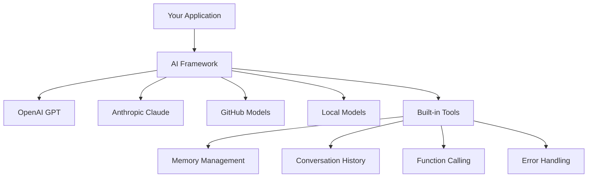
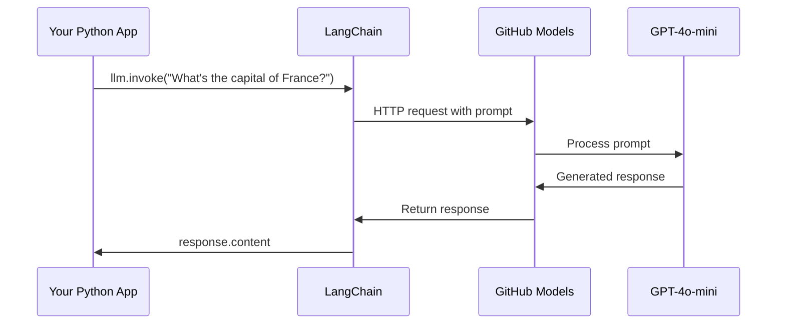
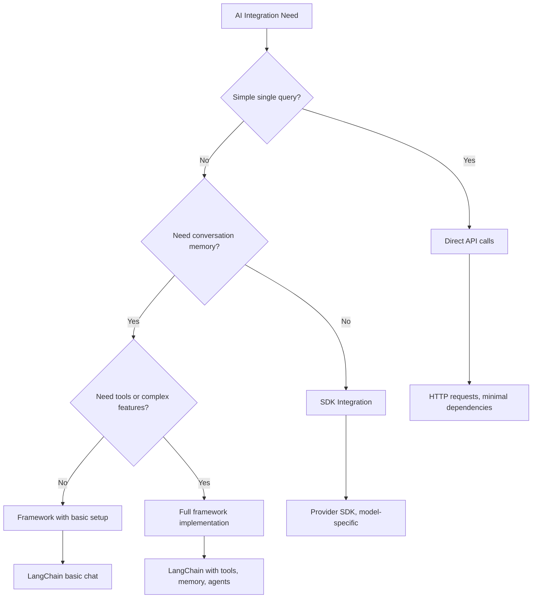

<!--
CO_OP_TRANSLATOR_METADATA:
{
  "original_hash": "e2c4ae5688e34b4b8b09d52aec56c79e",
  "translation_date": "2025-10-22T16:52:53+00:00",
  "source_file": "10-ai-framework-project/README.md",
  "language_code": "ne"
}
-->
# एआई फ्रेमवर्क

कहिल्यै एआई एप्लिकेसनहरू स्क्र्याचबाट निर्माण गर्न प्रयास गर्दा तनाव महसुस गर्नुभएको छ? तपाईं एक्लो हुनुहुन्न! एआई फ्रेमवर्कहरू एआई विकासको लागि स्विस आर्मी चक्कु जस्तै हुन् - ती शक्तिशाली उपकरणहरू हुन् जसले तपाईंलाई बुद्धिमान एप्लिकेसनहरू निर्माण गर्दा समय र झन्झट बचत गर्न मद्दत गर्छ। एआई फ्रेमवर्कलाई राम्रोसँग व्यवस्थित पुस्तकालयको रूपमा सोच्नुहोस्: यसले पूर्वनिर्मित कम्पोनेन्टहरू, मानकीकृत एपीआईहरू, र स्मार्ट एब्स्ट्र्याक्सनहरू प्रदान गर्दछ ताकि तपाईं कार्यान्वयन विवरणहरूसँग संघर्ष नगरी समस्याहरू समाधान गर्न ध्यान केन्द्रित गर्न सक्नुहुन्छ।

यस पाठमा, हामी LangChain जस्ता फ्रेमवर्कहरूले जटिल एआई एकीकरण कार्यहरूलाई कसरी सफा, पढ्न मिल्ने कोडमा परिणत गर्न सक्छन् भन्ने कुरा अन्वेषण गर्नेछौं। तपाईंले वास्तविक-विश्व चुनौतीहरू जस्तै कुराकानीको ट्र्याक राख्ने, टूल कलिंग कार्यान्वयन गर्ने, र एकीकृत इन्टरफेस मार्फत विभिन्न एआई मोडेलहरू सम्हाल्ने तरिका पत्ता लगाउनुहुनेछ।

हामी समाप्त हुँदा, तपाईंलाई थाहा हुनेछ कि कच्चा एपीआई कलहरूको सट्टा फ्रेमवर्कहरू कहिले प्रयोग गर्ने, तिनीहरूको एब्स्ट्र्याक्सनहरू प्रभावकारी रूपमा कसरी प्रयोग गर्ने, र वास्तविक-विश्व प्रयोगको लागि तयार एआई एप्लिकेसनहरू कसरी निर्माण गर्ने। आउनुहोस्, एआई फ्रेमवर्कहरूले तपाईंको परियोजनाहरूको लागि के गर्न सक्छन् भनेर अन्वेषण गरौं।

## किन फ्रेमवर्क रोज्ने?

तपाईं एआई एप निर्माण गर्न तयार हुनुहुन्छ - शानदार! तर यहाँ कुरा छ: तपाईंले विभिन्न मार्गहरू लिन सक्नुहुन्छ, र प्रत्येकको आफ्नै फाइदा र बेफाइदा छन्। यो कतै पुग्न हिँड्ने, साइकल चलाउने, वा ड्राइभ गर्ने बीचको छनोट जस्तै हो - तिनीहरूले तपाईंलाई त्यहाँ पुर्‍याउँछन्, तर अनुभव (र प्रयास) पूर्ण रूपमा फरक हुनेछ।

आउनुहोस्, तपाईंको परियोजनाहरूमा एआई एकीकृत गर्न सक्ने तीन मुख्य तरिकाहरूलाई तोडौं:

| दृष्टिकोण | फाइदाहरू | उत्तम लागि | विचारहरू |
|----------|------------|----------|--------------|
| **प्रत्यक्ष HTTP अनुरोधहरू** | पूर्ण नियन्त्रण, कुनै निर्भरता छैन | साधारण प्रश्नहरू, आधारभूत कुरा सिक्ने | बढी विस्तृत कोड, म्यानुअल त्रुटि ह्यान्डलिंग |
| **SDK एकीकरण** | कम बोइलरप्लेट, मोडेल-विशिष्ट अनुकूलन | एकल-मोडेल एप्लिकेसनहरू | विशिष्ट प्रदायकहरूमा सीमित |
| **एआई फ्रेमवर्कहरू** | एकीकृत एपीआई, निर्मित एब्स्ट्र्याक्सनहरू | बहु-मोडेल एपहरू, जटिल वर्कफ्लोहरू | सिकाइ वक्र, सम्भावित अत्यधिक एब्स्ट्र्याक्सन |

### फ्रेमवर्कको व्यावहारिक फाइदाहरू



**किन फ्रेमवर्कहरू महत्त्वपूर्ण छन्:**
- **एकीकृत** विभिन्न एआई प्रदायकहरूलाई एउटै इन्टरफेस अन्तर्गत
- **स्वचालित रूपमा** कुराकानी मेमोरी ह्यान्डल गर्छ
- **सामान्य कार्यहरूको लागि** तयार उपकरणहरू प्रदान गर्दछ जस्तै एम्बेडिङ र फङ्सन कलिंग
- **त्रुटि ह्यान्डलिंग र पुन: प्रयास तर्क** व्यवस्थापन गर्छ
- **जटिल वर्कफ्लोहरूलाई** पढ्न मिल्ने मेथड कलहरूमा परिणत गर्छ

> 💡 **प्रो टिप**: विभिन्न एआई मोडेलहरू बीच स्विच गर्दा वा एजेन्टहरू, मेमोरी, वा टूल कलिंग जस्ता जटिल सुविधाहरू निर्माण गर्दा फ्रेमवर्कहरू प्रयोग गर्नुहोस्। आधारभूत कुरा सिक्दा वा साधारण, केन्द्रित एप्लिकेसनहरू निर्माण गर्दा प्रत्यक्ष एपीआईहरूमा अडिग रहनुहोस्।

**निचोडमा**: जस्तै एक कुशल कारीगरको विशेष उपकरणहरू र पूर्ण कार्यशालाको बीचको छनोट, यो कार्यको लागि उपकरण मिलाउनको कुरा हो। जटिल, सुविधायुक्त एप्लिकेसनहरूको लागि फ्रेमवर्कहरू उत्कृष्ट छन्, जबकि साधारण प्रयोगका मामिलाहरूको लागि प्रत्यक्ष एपीआईहरू राम्रो काम गर्छन्।

## परिचय

यस पाठमा, हामी सिक्नेछौं:

- सामान्य एआई फ्रेमवर्क प्रयोग गर्न।
- च्याट कुराकानी, टूल प्रयोग, मेमोरी र सन्दर्भ जस्ता सामान्य समस्याहरू समाधान गर्न।
- यसलाई एआई एप्स निर्माण गर्न उपयोग गर्ने।

## तपाईंको पहिलो एआई प्रम्प्ट

आउनुहोस्, आधारभूत कुराबाट सुरु गरौं र तपाईंको पहिलो एआई एप्लिकेसन निर्माण गरौं जसले प्रश्न पठाउँछ र उत्तर फिर्ता ल्याउँछ। जस्तै आर्किमिडिजले आफ्नो स्नानमा विस्थापनको सिद्धान्त पत्ता लगाए, कहिलेकाहीँ सबैभन्दा साधारण अवलोकनहरूले सबैभन्दा शक्तिशाली अन्तर्दृष्टि दिन्छन् - र फ्रेमवर्कहरूले यी अन्तर्दृष्टिहरू पहुँचयोग्य बनाउँछन्।

### LangChain सेटअप गर्दै GitHub मोडेलहरूसँग

हामी LangChain प्रयोग गर्नेछौं GitHub मोडेलहरूसँग जडान गर्न, जुन धेरै राम्रो छ किनभने यसले तपाईंलाई विभिन्न एआई मोडेलहरूको नि:शुल्क पहुँच दिन्छ। सबैभन्दा राम्रो भाग? सुरु गर्न तपाईंलाई केही साधारण कन्फिगरेसन प्यारामिटरहरू मात्र आवश्यक छ:

```python
from langchain_openai import ChatOpenAI
import os

llm = ChatOpenAI(
    api_key=os.environ["GITHUB_TOKEN"],
    base_url="https://models.github.ai/inference",
    model="openai/gpt-4o-mini",
)

# Send a simple prompt
response = llm.invoke("What's the capital of France?")
print(response.content)
```

**यहाँ के भइरहेको छ भन्ने कुरा तोडौं:**
- **LangChain क्लाइन्ट सिर्जना गर्छ** `ChatOpenAI` क्लास प्रयोग गरेर - यो तपाईंको एआईमा प्रवेशद्वार हो!
- **GitHub मोडेलहरूसँग जडान कन्फिगर गर्छ** तपाईंको प्रमाणीकरण टोकनको साथ
- **कुन एआई मोडेल प्रयोग गर्ने निर्दिष्ट गर्छ** (`gpt-4o-mini`) - यसलाई तपाईंको एआई सहायक चयन गर्ने सोच्नुहोस्
- **तपाईंको प्रश्न पठाउँछ** `invoke()` मेथड प्रयोग गरेर - यहीँ जादू हुन्छ
- **प्रतिक्रिया निकाल्छ र प्रदर्शन गर्छ** - र voilà, तपाईं एआईसँग कुराकानी गर्दै हुनुहुन्छ!

> 🔧 **सेटअप नोट**: यदि तपाईं GitHub Codespaces प्रयोग गर्दै हुनुहुन्छ भने, तपाईं भाग्यमानी हुनुहुन्छ - `GITHUB_TOKEN` पहिले नै सेटअप गरिएको छ! स्थानीय रूपमा काम गर्दै हुनुहुन्छ? चिन्ता नगर्नुहोस्, तपाईंले सही अनुमतिहरूको साथ व्यक्तिगत पहुँच टोकन सिर्जना गर्न आवश्यक हुनेछ।

**अपेक्षित आउटपुट:**
```text
The capital of France is Paris.
```



## कुराकानी एआई निर्माण गर्दै

पहिलो उदाहरणले आधारभूत कुरा प्रदर्शन गर्छ, तर यो केवल एकल आदानप्रदान हो - तपाईंले प्रश्न सोध्नुहुन्छ, उत्तर प्राप्त गर्नुहुन्छ, र त्यति नै। वास्तविक एप्लिकेसनहरूमा, तपाईंको एआईले तपाईंले के कुरा गरिरहनुभएको छ भनेर सम्झन चाहनुहुन्छ, जस्तै वॉटसन र होम्सले समयसँगै आफ्नो अनुसन्धानात्मक कुराकानी निर्माण गरे।

यहीँ LangChain विशेष रूपमा उपयोगी हुन्छ। यसले विभिन्न सन्देश प्रकारहरू प्रदान गर्दछ जसले कुराकानी संरचना गर्न मद्दत गर्छ र तपाईंलाई तपाईंको एआईलाई व्यक्तित्व दिन अनुमति दिन्छ। तपाईं च्याट अनुभवहरू निर्माण गर्दै हुनुहुनेछ जसले सन्दर्भ र चरित्र कायम राख्छ।

### सन्देश प्रकारहरू बुझ्दै

यी सन्देश प्रकारहरूलाई कुराकानीमा सहभागीहरूले लगाउने विभिन्न "टोपीहरू" जस्तै सोच्नुहोस्। LangChainले विभिन्न सन्देश वर्गहरू प्रयोग गर्दछ जसले को के भनिरहेको छ भनेर ट्र्याक राख्न मद्दत गर्छ:

| सन्देश प्रकार | उद्देश्य | उदाहरण प्रयोग केस |
|--------------|---------|------------------|
| `SystemMessage` | एआईको व्यक्तित्व र व्यवहार परिभाषित गर्छ | "तपाईं एक सहयोगी कोडिङ सहायक हुनुहुन्छ" |
| `HumanMessage` | प्रयोगकर्ताको इनपुट प्रतिनिधित्व गर्छ | "फङ्सनहरू कसरी काम गर्छन् भनेर व्याख्या गर्नुहोस्" |
| `AIMessage` | एआई प्रतिक्रियाहरू भण्डारण गर्छ | कुराकानीमा अघिल्लो एआई प्रतिक्रियाहरू |

### तपाईंको पहिलो कुराकानी सिर्जना गर्दै

आउनुहोस्, एउटा कुराकानी सिर्जना गरौं जहाँ हाम्रो एआईले विशिष्ट भूमिका ग्रहण गर्छ। हामी यसलाई क्याप्टन पिकार्डको भूमिका दिन्छौं - कूटनीतिक बुद्धिमत्ता र नेतृत्वका लागि परिचित पात्र:

```python
messages = [
    SystemMessage(content="You are Captain Picard of the Starship Enterprise"),
    HumanMessage(content="Tell me about you"),
]
```

**यो कुराकानी सेटअपलाई तोड्दै:**
- **एआईको भूमिका र व्यक्तित्व स्थापना गर्छ** `SystemMessage` मार्फत
- **प्रारम्भिक प्रयोगकर्ता प्रश्न प्रदान गर्छ** `HumanMessage` मार्फत
- **बहु-टर्न कुराकानीको लागि आधार सिर्जना गर्छ**

यस उदाहरणको पूर्ण कोड यस प्रकार देखिन्छ:

```python
from langchain_core.messages import HumanMessage, SystemMessage
from langchain_openai import ChatOpenAI
import os

llm = ChatOpenAI(
    api_key=os.environ["GITHUB_TOKEN"],
    base_url="https://models.github.ai/inference",
    model="openai/gpt-4o-mini",
)

messages = [
    SystemMessage(content="You are Captain Picard of the Starship Enterprise"),
    HumanMessage(content="Tell me about you"),
]


# works
response  = llm.invoke(messages)
print(response.content)
```

तपाईंले निम्न जस्तै परिणाम देख्नुहुनेछ:

```text
I am Captain Jean-Luc Picard, the commanding officer of the USS Enterprise (NCC-1701-D), a starship in the United Federation of Planets. My primary mission is to explore new worlds, seek out new life and new civilizations, and boldly go where no one has gone before. 

I believe in the importance of diplomacy, reason, and the pursuit of knowledge. My crew is diverse and skilled, and we often face challenges that test our resolve, ethics, and ingenuity. Throughout my career, I have encountered numerous species, grappled with complex moral dilemmas, and have consistently sought peaceful solutions to conflicts.

I hold the ideals of the Federation close to my heart, believing in the importance of cooperation, understanding, and respect for all sentient beings. My experiences have shaped my leadership style, and I strive to be a thoughtful and just captain. How may I assist you further?
```

कुराकानी निरन्तरता कायम गर्न (प्रत्येक पटक सन्दर्भ रिसेट नगरी), तपाईंले आफ्नो सन्देश सूचीमा प्रतिक्रियाहरू थपिरहनु पर्छ। जस्तै मौखिक परम्पराहरूले पुस्ताहरूमा कथाहरू संरक्षण गरे, यो दृष्टिकोणले स्थायी मेमोरी निर्माण गर्छ:

```python
from langchain_core.messages import HumanMessage, SystemMessage
from langchain_openai import ChatOpenAI
import os

llm = ChatOpenAI(
    api_key=os.environ["GITHUB_TOKEN"],
    base_url="https://models.github.ai/inference",
    model="openai/gpt-4o-mini",
)

messages = [
    SystemMessage(content="You are Captain Picard of the Starship Enterprise"),
    HumanMessage(content="Tell me about you"),
]


# works
response  = llm.invoke(messages)

print(response.content)

print("---- Next ----")

messages.append(response)
messages.append(HumanMessage(content="Now that I know about you, I'm Chris, can I be in your crew?"))

response  = llm.invoke(messages)

print(response.content)

```

धेरै राम्रो, हैन? यहाँ के भइरहेको छ भने हामीले LLMलाई दुई पटक कल गर्यौं - पहिलो पटक केवल हाम्रो प्रारम्भिक दुई सन्देशहरूसँग, तर फेरि हाम्रो पूर्ण कुराकानी इतिहासको साथ। यो एआई वास्तवमा हाम्रो च्याटको पालना गरिरहेको जस्तो छ!

जब तपाईं यो कोड चलाउनुहुन्छ, तपाईंले दोस्रो प्रतिक्रिया प्राप्त गर्नुहुनेछ जुन निम्न जस्तै सुनिन्छ:

```text
Welcome aboard, Chris! It's always a pleasure to meet those who share a passion for exploration and discovery. While I cannot formally offer you a position on the Enterprise right now, I encourage you to pursue your aspirations. We are always in need of talented individuals with diverse skills and backgrounds. 

If you are interested in space exploration, consider education and training in the sciences, engineering, or diplomacy. The values of curiosity, resilience, and teamwork are crucial in Starfleet. Should you ever find yourself on a starship, remember to uphold the principles of the Federation: peace, understanding, and respect for all beings. Your journey can lead you to remarkable adventures, whether in the stars or on the ground. Engage!
```

मलाई लाग्छ यो सम्भव छ ;)

## स्ट्रिमिङ प्रतिक्रियाहरू

कहिल्यै ध्यान दिनुभएको छ कि ChatGPTले आफ्नो प्रतिक्रियाहरू वास्तविक समयमा "टाइप" गरिरहेको जस्तो देखिन्छ? यो स्ट्रिमिङको कार्य हो। जस्तै कुशल क्यालिग्राफरले काम गरिरहेको हेर्दा - स्ट्रोक बाई स्ट्रोक अक्षरहरू देखा पर्दा - स्ट्रिमिङले अन्तरक्रिया प्राकृतिक महसुस गराउँछ र तत्काल प्रतिक्रिया प्रदान गर्छ।

### LangChainसँग स्ट्रिमिङ कार्यान्वयन गर्दै

```python
from langchain_openai import ChatOpenAI
import os

llm = ChatOpenAI(
    api_key=os.environ["GITHUB_TOKEN"],
    base_url="https://models.github.ai/inference",
    model="openai/gpt-4o-mini",
    streaming=True
)

# Stream the response
for chunk in llm.stream("Write a short story about a robot learning to code"):
    print(chunk.content, end="", flush=True)
```

**किन स्ट्रिमिङ उत्कृष्ट छ:**
- **सामग्री देखाउँछ** यो सिर्जना भइरहेको छ - अब कुनै अजीब प्रतीक्षा छैन!
- **प्रयोगकर्ताहरूलाई महसुस गराउँछ** कि केही वास्तवमै भइरहेको छ
- **छिटो महसुस हुन्छ**, यद्यपि यो प्राविधिक रूपमा छैन
- **प्रयोगकर्ताहरूलाई पढ्न दिन्छ** जबकि एआई अझै "सोच्दै" छ

> 💡 **प्रयोगकर्ता अनुभव टिप**: स्ट्रिमिङले वास्तवमै लामो प्रतिक्रियाहरू जस्तै कोड व्याख्या, रचनात्मक लेखन, वा विस्तृत ट्यूटोरियलहरूमा चम्किन्छ। तपाईंका प्रयोगकर्ताहरूले खाली स्क्रिनमा घुरेर हेर्ने सट्टा प्रगति देखेर माया गर्नेछन्!

## प्रम्प्ट टेम्प्लेटहरू

प्रम्प्ट टेम्प्लेटहरू शास्त्रीय वक्तृत्वमा प्रयोग गरिएका रेटोरिकल संरचनाहरू जस्तै काम गर्छन् - सोच्नुहोस् कि कसरी सिसेरोले आफ्नो भाषण शैलीहरू विभिन्न दर्शकहरूको लागि अनुकूलन गर्थे जबकि उही प्रेरक फ्रेमवर्क कायम राख्दै। तिनीहरूले तपाईंलाई पुन: प्रयोग गर्न मिल्ने प्रम्प्टहरू सिर्जना गर्न अनुमति दिन्छन् जहाँ तपाईंले सबै कुरा स्क्र्याचबाट पुन: लेख्न बिना विभिन्न जानकारीका टुक्राहरू स्वैप गर्न सक्नुहुन्छ। एक पटक तपाईंले टेम्प्लेट सेटअप गर्नुभयो भने, तपाईंले केवल आवश्यक मानहरू सहित भर्नु पर्छ।

### पुन: प्रयोग गर्न मिल्ने प्रम्प्टहरू सिर्जना गर्दै

```python
from langchain_core.prompts import ChatPromptTemplate

# Define a template for code explanations
template = ChatPromptTemplate.from_messages([
    ("system", "You are an expert programming instructor. Explain concepts clearly with examples."),
    ("human", "Explain {concept} in {language} with a practical example for {skill_level} developers")
])

# Use the template with different values
questions = [
    {"concept": "functions", "language": "JavaScript", "skill_level": "beginner"},
    {"concept": "classes", "language": "Python", "skill_level": "intermediate"},
    {"concept": "async/await", "language": "JavaScript", "skill_level": "advanced"}
]

for question in questions:
    prompt = template.format_messages(**question)
    response = llm.invoke(prompt)
    print(f"Topic: {question['concept']}\n{response.content}\n---\n")
```

**किन तपाईंलाई टेम्प्लेटहरू मनपर्नेछ:**
- **तपाईंको प्रम्प्टहरूलाई** तपाईंको सम्पूर्ण एपमा स्थिर राख्छ
- **अब कुनै गडबड स्ट्रिङ कन्केटनेसन छैन** - केवल सफा, सरल भेरिएबलहरू
- **तपाईंको एआई** पूर्वानुमान योग्य व्यवहार गर्छ किनभने संरचना उस्तै रहन्छ
- **अपडेटहरू सजिलो छन्** - एक पटक टेम्प्लेट परिवर्तन गर्नुहोस्, र यो सबै ठाउँमा ठीक हुन्छ

## संरचित आउटपुट

कहिलेकाहीँ एआई प्रतिक्रियाहरूलाई पार्स गर्न प्रयास गर्दा निराश महसुस गर्नुहुन्छ जुन असंरचित पाठको रूपमा फिर्ता आउँछ? संरचित आउटपुट एआईलाई जैविक वर्गीकरणको लागि लिनियसले प्रयोग गरेको प्रणालीगत दृष्टिकोण अनुसरण गर्न सिकाउने जस्तै हो - व्यवस्थित, पूर्वानुमान योग्य, र काम गर्न सजिलो। तपाईं JSON, विशिष्ट डेटा संरचनाहरू, वा तपाईंलाई आवश्यक कुनै पनि ढाँचा अनुरोध गर्न सक्नुहुन्छ।

### आउटपुट स्किमाहरू परिभाषित गर्दै

```python
from langchain_core.prompts import ChatPromptTemplate
from langchain_core.output_parsers import JsonOutputParser
from pydantic import BaseModel, Field

class CodeReview(BaseModel):
    score: int = Field(description="Code quality score from 1-10")
    strengths: list[str] = Field(description="List of code strengths")
    improvements: list[str] = Field(description="List of suggested improvements")
    overall_feedback: str = Field(description="Summary feedback")

# Set up the parser
parser = JsonOutputParser(pydantic_object=CodeReview)

# Create prompt with format instructions
prompt = ChatPromptTemplate.from_messages([
    ("system", "You are a code reviewer. {format_instructions}"),
    ("human", "Review this code: {code}")
])

# Format the prompt with instructions
chain = prompt | llm | parser

# Get structured response
code_sample = """
def calculate_average(numbers):
    return sum(numbers) / len(numbers)
"""

result = chain.invoke({
    "code": code_sample,
    "format_instructions": parser.get_format_instructions()
})

print(f"Score: {result['score']}")
print(f"Strengths: {', '.join(result['strengths'])}")
```

**किन संरचित आउटपुट गेम-चेन्जर हो:**
- **अब कुनै अनुमान छैन** तपाईंले फिर्ता के ढाँचा प्राप्त गर्नुहुनेछ - यो प्रत्येक पटक स्थिर छ
- **तपाईंको डेटाबेसहरू र एपीआईहरूमा** अतिरिक्त काम बिना सीधा प्लग गर्छ
- **अजीब एआई प्रतिक्रियाहरूलाई समात्छ** तपाईंको एपलाई तोड्नुअघि
- **तपाईंको कोडलाई सफा बनाउँछ** किनभने तपाईंलाई थाहा छ कि तपाईं केसँग काम गर्दै हुनुहुन्छ

## टूल कलिंग

अब हामी सबैभन्दा शक्तिशाली सुविधाहरूमा पुग्छौं: टूलहरू। यो कसरी तपाईंले आफ्नो एआईलाई कुराकानी बाहेक व्यावहारिक क्षमताहरू दिनुहुन्छ। जस्तै मध्यकालीन गिल्डहरूले विशिष्ट शिल्पहरूको लागि विशेष उपकरणहरू विकास गरे, तपाईं आफ्नो एआईलाई केन्द्रित उपकरणहरू प्रदान गर्न सक्नुहुन्छ। तपाईंले उपलब्ध टूलहरू वर्णन गर्नुहुन्छ, र जब कसैले केही अनुरोध गर्छ जुन मेल खान्छ, तपाईंको एआईले कार्य गर्न सक्छ। 

### Python प्रयोग गर्दै

आउनुहोस्, केही टूलहरू थपौं:

```python
from typing_extensions import Annotated, TypedDict

class add(TypedDict):
    """Add two integers."""

    # Annotations must have the type and can optionally include a default value and description (in that order).
    a: Annotated[int, ..., "First integer"]
    b: Annotated[int, ..., "Second integer"]

tools = [add]

functions = {
    "add": lambda a, b: a + b
}
```

यहाँ के भइरहेको छ भने हामी `add` नामक टूलको ब्लूप्रिन्ट सिर्जना गर्दैछौं। `TypedDict` बाट उत्तराधिकार लिएर र `Annotated` प्रकारहरू प्रयोग गरेर `a` र `b` को लागि, हामी LLMलाई यो टूल के गर्छ र यसलाई के चाहिन्छ भन्ने स्पष्ट चित्र दिइरहेका छौं। `functions` डिक्सनरी हाम्रो टूलबक्स जस्तै हो - यसले हाम्रो कोडलाई ठीक के गर्नुपर्छ जब एआईले विशिष्ट टूल प्रयोग गर्ने निर्णय गर्छ।

आउनुहोस्, हामीले यो टूलसँग LLMलाई कसरी कल गर्छौं हेर्नुहोस्:

```python
llm = ChatOpenAI(
    api_key=os.environ["GITHUB_TOKEN"],
    base_url="https://models.github.ai/inference",
    model="openai/gpt-4o-mini",
)

llm_with_tools = llm.bind_tools(tools)
```

यहाँ हामीले `bind_tools` लाई हाम्रो `tools` एरेसँग कल गर्यौं र यसरी LLM `llm_with_tools` अब यो टूलको ज्ञान छ।

यो नयाँ LLM प्रयोग गर्न, हामी निम्न कोड टाइप गर्न सक्छौं:

```python
query = "What is 3 + 12?"

res = llm_with_tools.invoke(query)
if(res.tool_calls):
    for tool in res.tool_calls:
        print("TOOL CALL: ", functions[tool["name"]](../../../10-ai-framework-project/**tool["args"]))
print("CONTENT: ",res.content)
```

अब हामीले टूल भएको नयाँ llm मा `invoke` कल गर्दा, हामीले `tool_calls` गुण भरिएको पाउन सक्छौं। यदि हो भने, कुनै पनि पहिचान गरिएको टूलको `name` र `args` गुण हुन्छ जसले कुन टूल कल गर्नुपर्छ र कुन तर्कहरू। पूर्ण कोड यस प्रकार देखिन्छ:

```python
from langchain_core.messages import HumanMessage, SystemMessage
from langchain_openai import ChatOpenAI
import os
from typing_extensions import Annotated, TypedDict

class add(TypedDict):
    """Add two integers."""

    # Annotations must have the type and can optionally include a default value and description (in that order).
    a: Annotated[int, ..., "First integer"]
    b: Annotated[int, ..., "Second integer"]

tools = [add]

functions = {
    "add": lambda a, b: a + b
}

llm = ChatOpenAI(
    api_key=os.environ["GITHUB_TOKEN"],
    base_url="https://models.github.ai/inference",
    model="openai/gpt-4o-mini",
)

llm_with_tools = llm.bind_tools(tools)

query = "What is 3 + 12?"

res = llm_with_tools.invoke(query)
if(res.tool_calls):
    for tool in res.tool_calls:
        print("TOOL CALL: ", functions[tool["name"]](../../../10-ai-framework-project/**tool["args"]))
print("CONTENT: ",res.content)
```

यो कोड चलाउँदा, तपाईंले निम्न जस्तै आउटपुट देख्नुहुनेछ:

```text
TOOL CALL:  15
CONTENT: 
```

एआईले "What is 3 + 12" लाई जाँच गर्यो र यो `add` टूलको लागि कार्यको रूपमा पहिचान गर्यो। जस्तै कुशल पुस्तकालयकारले सोधिएको प्रश्नको प्रकारको आधारमा कुन सन्दर्भ परामर्श गर्नुपर्छ भनेर जान्दछ, यसले टूलको नाम, विवरण, र क्षेत्र निर्दिष्टीकरणबाट यो निर्धारण गर्यो। 15 को परिणाम हाम्रो `functions` डिक्सनरीबाट टूल कार्यान्वयन गरेर आउँछ:

```python
print("TOOL CALL: ", functions[tool["name"]](../../../10-ai-framework-project/**tool["args"]))
```

### वेब एपीआई कल गर्ने थप रोचक टूल

संख्या थप्नेले अवधारणालाई प्रदर्शन गर्छ, तर वास्तविक टूलहरूले सामान्यतया वेब एपीआई कल गर्ने जस्ता जटिल कार्यहरू प्रदर्शन गर्छ। आउनुहोस्, हाम्रो उदाहरणलाई विस्तार गरौं ताकि एआईले इन्टरनेटबाट सामग्री ल्याउन सक्दछ - जस्तै टेलिग्राफ अपरेटरहरूले कहिल्यै टाढा स्थानहरू जडान गरे:

```python
class joke(TypedDict):
    """Tell a joke."""

    # Annotations must have the type and can optionally include a default value and description (in that order).
    category: Annotated[str, ..., "The joke category"]

def get_joke(category: str) -> str:
    response = requests.get(f"https://api.chucknorris.io/jokes/random?category={category}", headers={"Accept": "application/json"})
    if response.status_code == 200:
        return response.json().get("value", f"Here's a {category} joke!")
    return f"Here's a {category} joke!"

functions = {
    "add": lambda a, b: a + b,
    "joke": lambda category: get_joke(category)
}

query = "Tell me a joke about animals"

# the rest of the code is the same
```

अब यदि तपाईंले यो कोड चलाउनुभयो भने तपाईंले निम्न जस्तै प्रतिक्रिया प्राप्त गर्नुहुनेछ:

```text
TOOL CALL:  Chuck Norris once rode a nine foot grizzly bear through an automatic car wash, instead of taking a shower.
CONTENT:  
```

यहाँ कोड पूर्ण रूपमा:

```python
from langchain_openai import ChatOpenAI
import requests
import os
from typing_extensions import Annotated, TypedDict

class add(TypedDict):
    """Add two integers."""

    # Annotations must have the type and can optionally include a default value and description (in that order).
    a: Annotated[int, ..., "First integer"]
    b: Annotated[int, ..., "Second integer"]

class joke(TypedDict):
    """Tell a joke."""

    # Annotations must have the type and can optionally include a default value and description (in that order).
    category: Annotated[str, ..., "The joke category"]

tools = [add, joke]

def get_joke(category: str) -> str:
    response = requests.get(f"https://api.chucknorris.io/jokes/random?category={category}", headers={"Accept": "application/json"})
    if response.status_code == 200:
        return response.json().get("value", f"Here's a {category} joke!")
    return f"Here's a {category} joke!"

functions = {
    "add": lambda a, b: a + b,
    "joke": lambda category: get_joke(category)
}

llm = ChatOpenAI(
    api_key=os.environ["GITHUB_TOKEN"],
    base_url="https://models.github.ai/inference",
    model="openai/gpt-4o-mini",
)

llm_with_tools = llm.bind_tools(tools)

query = "Tell me a joke about animals"

res = llm_with_tools.invoke(query)
if(res.tool_calls):
    for tool in res.tool_calls:
        # print("TOOL CALL: ", tool)
        print("TOOL CALL: ", functions[tool["name"]](../../../10-ai-framework-project/**tool["args"]))
print("CONTENT: ",res.content)
```

## एम्बेडिङ र दस्तावेज प्रशोधन

एम्बेडिङहरू आधुनिक एआईमा सबैभन्दा सुन्दर समाधानहरू मध्ये एक प्रतिनिधित्व गर्छ। कल्पना गर्नुहोस् यदि तपाईंले कुनै पनि पाठलाई संख्यात्मक निर्देशांकहरूमा रूपान्तरण गर्न सक्नुहुन्छ जसले यसको अर्थलाई समेट्छ। यही एम्बेडिङहरूले गर्छन् - तिनीहरूले पाठलाई बहु-आयामिक स्थानमा बिन्दुहरूमा रूपान्तरण गर्छन् जहाँ समान अवधारणाहरू सँगै समूहबद्ध हुन्छन्। यो विचारहरूको लागि समन्वय प्रणाली भएको जस्तै हो, जसले मेन्डेलेभले परमाणु गुणहरूद्वारा आव
3. **व्यक्तिगत शिक्षण**: प्रणाली सन्देशहरू प्रयोग गरेर विभिन्न सीप स्तरहरूमा प्रतिक्रिया अनुकूल बनाउनुहोस्  
4. **प्रतिक्रिया स्वरूप**: क्विज प्रश्नहरूको लागि संरचित आउटपुट लागू गर्नुहोस्  

### कार्यान्वयन चरणहरू  

**चरण १: आफ्नो वातावरण सेटअप गर्नुहोस्**  
```bash
pip install langchain langchain-openai
```
  
**चरण २: आधारभूत च्याट कार्यक्षमता**  
- `StudyAssistant` नामक कक्षा बनाउनुहोस्  
- संवाद स्मृति कार्यान्वयन गर्नुहोस्  
- शैक्षिक सहयोगको लागि व्यक्तित्व कन्फिगरेसन थप्नुहोस्  

**चरण ३: शैक्षिक उपकरणहरू थप्नुहोस्**  
- **कोड व्याख्याकार**: कोडलाई बुझ्न सकिने भागहरूमा विभाजन गर्छ  
- **क्विज जनरेटर**: प्रोग्रामिङ अवधारणाहरूको बारेमा प्रश्नहरू सिर्जना गर्छ  
- **प्रगति ट्र्याकर**: कभर गरिएका विषयहरूको ट्र्याक राख्छ  

**चरण ४: उन्नत सुविधाहरू (वैकल्पिक)**  
- राम्रो प्रयोगकर्ता अनुभवको लागि स्ट्रिमिङ प्रतिक्रियाहरू कार्यान्वयन गर्नुहोस्  
- पाठ्यक्रम सामग्री समावेश गर्न कागजात लोडिंग थप्नुहोस्  
- समानता-आधारित सामग्री पुनःप्राप्तिको लागि एम्बेडिङहरू सिर्जना गर्नुहोस्  

### मूल्यांकन मापदण्ड  

| सुविधा | उत्कृष्ट (४) | राम्रो (३) | सन्तोषजनक (२) | सुधार आवश्यक (१) |  
|--------|--------------|------------|----------------|-------------------|  
| **संवाद प्रवाह** | प्राकृतिक, सन्दर्भ-सचेत प्रतिक्रिया | राम्रो सन्दर्भ प्रतिधारण | आधारभूत संवाद | आदानप्रदान बीच कुनै स्मृति छैन |  
| **उपकरण एकीकरण** | धेरै उपयोगी उपकरणहरू सहज रूपमा काम गर्दै | २+ उपकरणहरू सही कार्यान्वयन गरिएको | १-२ आधारभूत उपकरणहरू | उपकरणहरू कार्यात्मक छैनन् |  
| **कोड गुणस्तर** | सफा, राम्रोसँग दस्तावेज गरिएको, त्रुटि ह्यान्डलिङ | राम्रो संरचना, केही दस्तावेज | आधारभूत कार्यक्षमता काम गर्छ | खराब संरचना, कुनै त्रुटि ह्यान्डलिङ छैन |  
| **शैक्षिक मूल्य** | सिकाइको लागि वास्तवमै उपयोगी, अनुकूलन योग्य | राम्रो सिकाइ समर्थन | आधारभूत व्याख्या | सीमित शैक्षिक लाभ |  

### नमूना कोड संरचना  

```python
class StudyAssistant:
    def __init__(self, skill_level="beginner"):
        # Initialize LLM, tools, and conversation memory
        pass
    
    def explain_code(self, code, language):
        # Tool: Explain how code works
        pass
    
    def generate_quiz(self, topic, difficulty):
        # Tool: Create practice questions
        pass
    
    def chat(self, user_input):
        # Main conversation interface
        pass

# Example usage
assistant = StudyAssistant(skill_level="intermediate")
response = assistant.chat("Explain how Python functions work")
```
  
**बोनस चुनौतीहरू:**  
- आवाज इनपुट/आउटपुट क्षमताहरू थप्नुहोस्  
- Streamlit वा Flask प्रयोग गरेर वेब इन्टरफेस कार्यान्वयन गर्नुहोस्  
- एम्बेडिङहरू प्रयोग गरेर पाठ्यक्रम सामग्रीबाट ज्ञान आधार सिर्जना गर्नुहोस्  
- प्रगति ट्र्याकिङ र व्यक्तिगत शिक्षण मार्गहरू थप्नुहोस्  

## सारांश  

🎉 अब तपाईंले AI फ्रेमवर्क विकासको आधारभूत कुरा सिक्नुभएको छ र LangChain प्रयोग गरेर परिष्कृत AI अनुप्रयोगहरू निर्माण गर्न सिक्नुभएको छ। यो एक व्यापक शिक्षुता पूरा गरेजस्तै, तपाईंले सीपहरूको महत्वपूर्ण उपकरण किट प्राप्त गर्नुभएको छ। आउनुहोस्, तपाईंले के हासिल गर्नुभएको छ समीक्षा गरौं।  

### तपाईंले के सिक्नुभयो  

**मुख्य फ्रेमवर्क अवधारणाहरू:**  
- **फ्रेमवर्क लाभहरू**: फ्रेमवर्कहरू प्रत्यक्ष API कलहरूको सट्टा कहिले छनोट गर्ने बुझ्दै  
- **LangChain आधारभूत कुरा**: AI मोडेल कनेक्शन सेटअप र कन्फिगर गर्दै  
- **सन्देश प्रकारहरू**: संरचित संवादहरूको लागि `SystemMessage`, `HumanMessage`, र `AIMessage` प्रयोग गर्दै  

**उन्नत सुविधाहरू:**  
- **उपकरण कलिङ**: उन्नत AI क्षमताहरूको लागि अनुकूलित उपकरणहरू सिर्जना र एकीकृत गर्दै  
- **संवाद स्मृति**: धेरै संवाद मोडहरूमा सन्दर्भ कायम राख्दै  
- **स्ट्रिमिङ प्रतिक्रियाहरू**: वास्तविक-समय प्रतिक्रिया डेलिभरी कार्यान्वयन गर्दै  
- **प्रम्प्ट टेम्प्लेटहरू**: पुन: प्रयोग गर्न मिल्ने, गतिशील प्रम्प्टहरू निर्माण गर्दै  
- **संरचित आउटपुट**: निरन्तर, पार्स गर्न मिल्ने AI प्रतिक्रियाहरू सुनिश्चित गर्दै  
- **एम्बेडिङहरू**: सेम्यान्टिक खोज र कागजात प्रशोधन क्षमताहरू सिर्जना गर्दै  

**व्यावहारिक अनुप्रयोगहरू:**  
- **पूर्ण अनुप्रयोगहरू निर्माण गर्दै**: उत्पादन-तयार अनुप्रयोगहरूमा धेरै सुविधाहरू संयोजन गर्दै  
- **त्रुटि ह्यान्डलिङ**: बलियो त्रुटि व्यवस्थापन र मान्यकरण कार्यान्वयन गर्दै  
- **उपकरण एकीकरण**: AI क्षमताहरू विस्तार गर्ने अनुकूलित उपकरणहरू सिर्जना गर्दै  

### मुख्य निष्कर्षहरू  

> 🎯 **स्मरण गर्नुहोस्**: LangChain जस्ता AI फ्रेमवर्कहरू तपाईंको जटिलता लुकाउने, सुविधाले भरिएको उत्कृष्ट साथी हुन्। जब तपाईंलाई संवाद स्मृति, उपकरण कलिङ चाहिन्छ, वा धेरै AI मोडेलहरूसँग काम गर्नुपर्छ, यो उत्तम विकल्प हो।  

**AI एकीकरणको लागि निर्णय फ्रेमवर्क:**  


  
### अब यहाँबाट कहाँ जाने?  

**अहिले नै निर्माण सुरु गर्नुहोस्:**  
- यी अवधारणाहरू लिनुहोस् र तपाईंलाई उत्साहित गर्ने केही निर्माण गर्नुहोस्!  
- LangChain मार्फत विभिन्न AI मोडेलहरूसँग खेल्नुहोस् - यो AI मोडेलहरूको खेल मैदानजस्तै हो  
- तपाईंको काम वा परियोजनाहरूमा सामना गर्ने वास्तविक समस्याहरू समाधान गर्ने उपकरणहरू सिर्जना गर्नुहोस्  

**अर्को स्तरको लागि तयार हुनुहुन्छ?**  
- **AI एजेन्टहरू**: जटिल कार्यहरू आफैं योजना र कार्यान्वयन गर्न सक्ने AI प्रणालीहरू निर्माण गर्नुहोस्  
- **RAG (Retrieval-Augmented Generation)**: AI लाई तपाईंको आफ्नै ज्ञान आधारहरूसँग संयोजन गर्दै सुपर-पावर अनुप्रयोगहरू सिर्जना गर्नुहोस्  
- **मल्टी-मोडल AI**: पाठ, छवि, र अडियो सबैसँग काम गर्दै - सम्भावनाहरू अनन्त छन्!  
- **उत्पादन परिनियोजन**: तपाईंको AI अनुप्रयोगहरू स्केल गर्ने र वास्तविक संसारमा तिनीहरूलाई अनुगमन गर्ने तरिका सिक्नुहोस्  

**समुदायमा सामेल हुनुहोस्:**  
- LangChain समुदाय अद्यावधिक रहन र उत्कृष्ट अभ्यासहरू सिक्नको लागि शानदार छ  
- GitHub Models तपाईंलाई अत्याधुनिक AI क्षमताहरूमा पहुँच दिन्छ - प्रयोग गर्नको लागि उत्तम  
- विभिन्न प्रयोग केसहरूसँग अभ्यास गर्दै जानुहोस् - प्रत्येक परियोजनाले तपाईंलाई नयाँ कुरा सिकाउँछ  

अब तपाईंले बौद्धिक, संवादात्मक अनुप्रयोगहरू निर्माण गर्ने ज्ञान प्राप्त गर्नुभएको छ जसले मानिसहरूलाई वास्तविक समस्याहरू समाधान गर्न मद्दत गर्न सक्छ। पुनर्जागरणका शिल्पकारहरूले कलात्मक दृष्टि र प्राविधिक सीपलाई संयोजन गरेजस्तै, तपाईंले अब AI क्षमताहरूलाई व्यावहारिक अनुप्रयोगसँग मिलाउन सक्नुहुन्छ। प्रश्न यो हो: तपाईं के सिर्जना गर्नुहुन्छ? 🚀  

## GitHub Copilot Agent Challenge 🚀  

Agent मोड प्रयोग गरेर निम्न चुनौती पूरा गर्नुहोस्:  

**विवरण:** धेरै LangChain सुविधाहरू समावेश गर्ने उन्नत AI-संचालित कोड समीक्षा सहायक निर्माण गर्नुहोस् जसमा उपकरण कलिङ, संरचित आउटपुट, र संवाद स्मृति समावेश छ ताकि कोड सबमिशनहरूमा व्यापक प्रतिक्रिया प्रदान गर्न सकियोस्।  

**प्रम्प्ट:** `CodeReviewAssistant` कक्षा सिर्जना गर्नुहोस् जसले कार्यान्वयन गर्छ:  
1. कोड जटिलता विश्लेषण गर्ने र सुधारको सुझाव दिने उपकरण  
2. कोडलाई उत्कृष्ट अभ्यासहरूसँग जाँच गर्ने उपकरण  
3. Pydantic मोडेलहरू प्रयोग गरेर निरन्तर समीक्षा स्वरूपको लागि संरचित आउटपुट  
4. समीक्षा सत्रहरू ट्र्याक गर्न संवाद स्मृति  
5. मुख्य च्याट इन्टरफेस जसले कोड सबमिशनहरू ह्यान्डल गर्न सक्छ र विस्तृत, कार्यान्वयन योग्य प्रतिक्रिया प्रदान गर्न सक्छ  

सहायकले धेरै प्रोग्रामिङ भाषाहरूमा कोड समीक्षा गर्न सक्षम हुनुपर्छ, सत्रमा धेरै कोड सबमिशनहरूमा सन्दर्भ कायम राख्नुपर्छ, र संक्षेप स्कोरहरू र विस्तृत सुधार सुझावहरू दुवै प्रदान गर्नुपर्छ।  

[agent mode](https://code.visualstudio.com/blogs/2025/02/24/introducing-copilot-agent-mode) को बारेमा थप जान्नुहोस्।  

---

**अस्वीकरण**:  
यो दस्तावेज AI अनुवाद सेवा [Co-op Translator](https://github.com/Azure/co-op-translator) प्रयोग गरेर अनुवाद गरिएको छ। हामी शुद्धताको लागि प्रयास गर्छौं, तर कृपया ध्यान दिनुहोस् कि स्वचालित अनुवादमा त्रुटि वा अशुद्धता हुन सक्छ। यसको मूल भाषा मा रहेको मूल दस्तावेजलाई आधिकारिक स्रोत मानिनुपर्छ। महत्वपूर्ण जानकारीको लागि, व्यावसायिक मानव अनुवाद सिफारिस गरिन्छ। यस अनुवादको प्रयोगबाट उत्पन्न हुने कुनै पनि गलतफहमी वा गलत व्याख्याको लागि हामी जिम्मेवार हुने छैनौं।