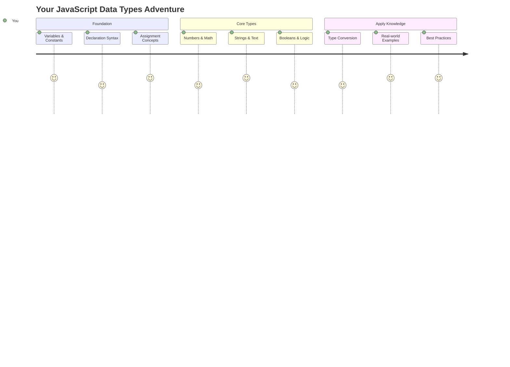
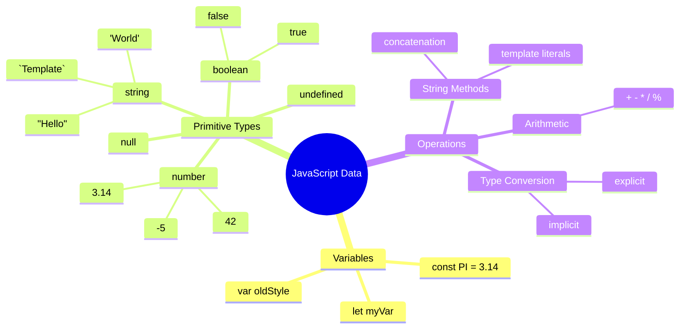
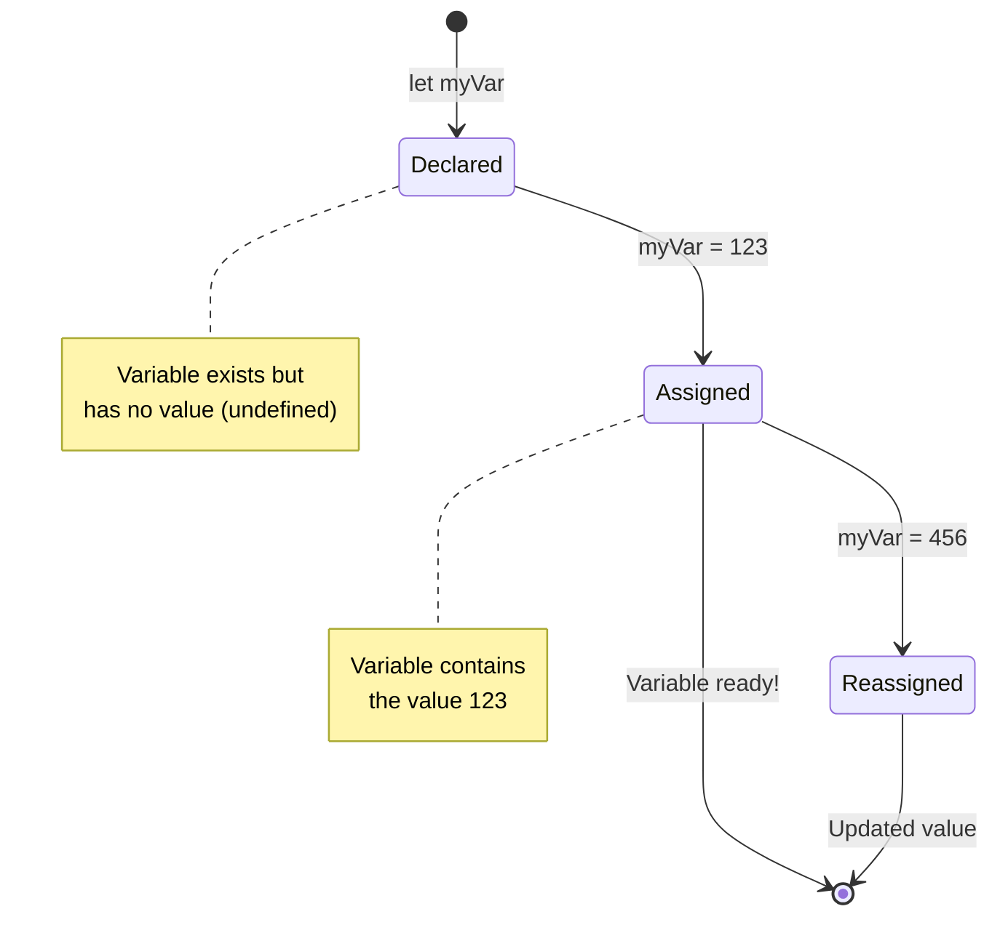
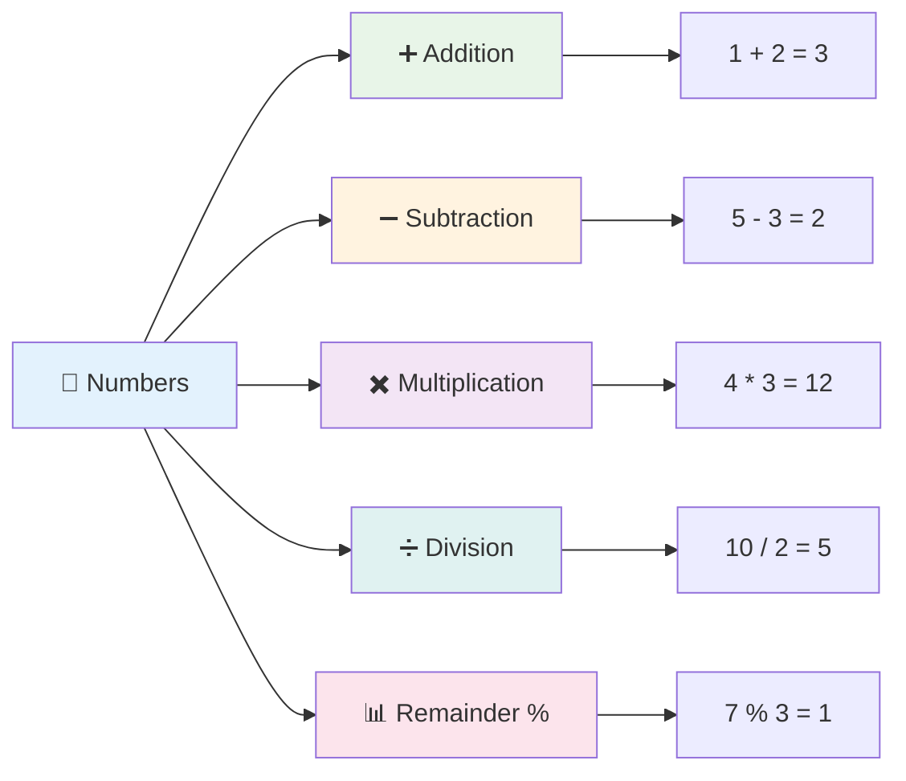
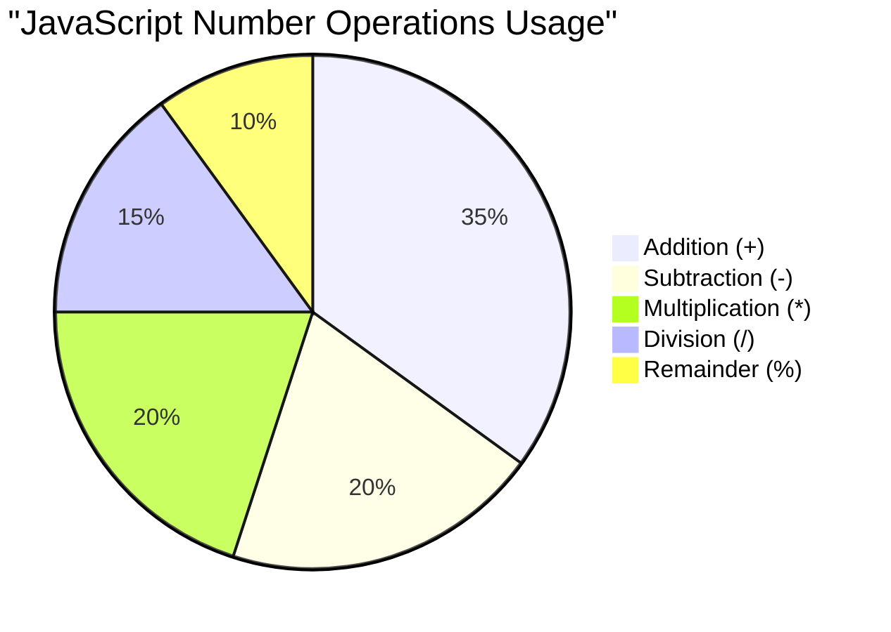
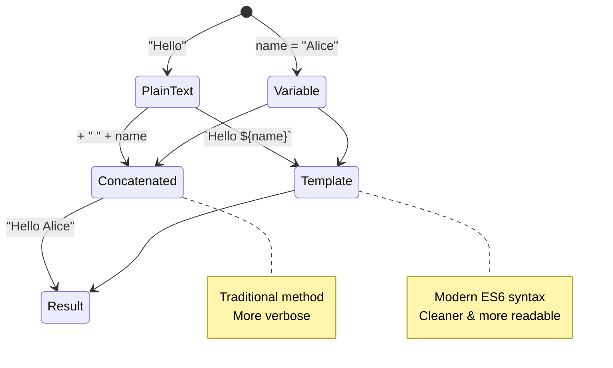
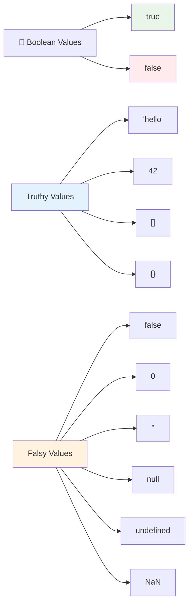
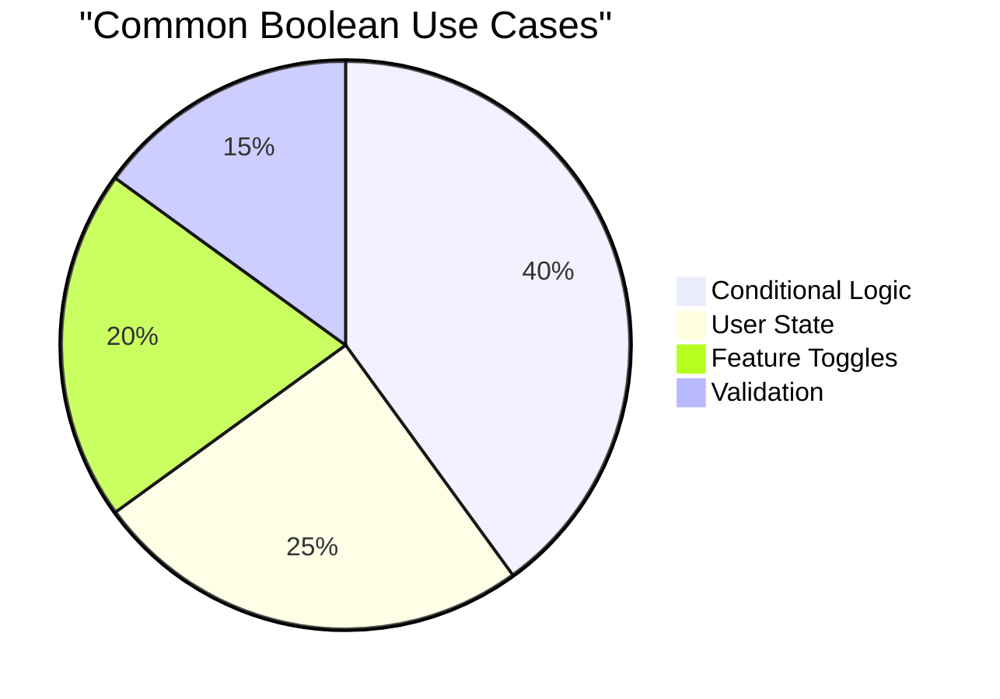
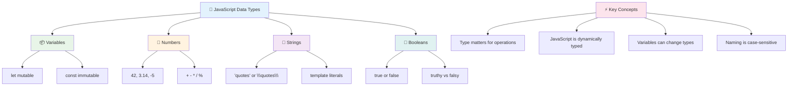
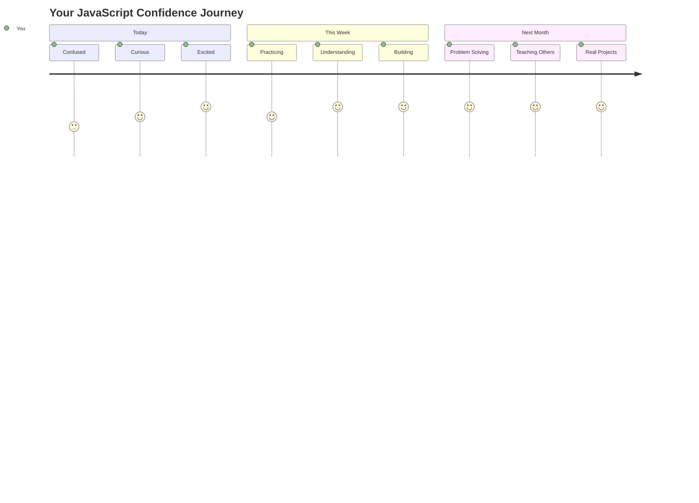

<!--
CO_OP_TRANSLATOR_METADATA:
{
  "original_hash": "672b0bb6e8b431075f3bdb7130590d2d",
  "translation_date": "2025-11-03T15:11:19+00:00",
  "source_file": "2-js-basics/1-data-types/README.md",
  "language_code": "ne"
}
-->
# जाभास्क्रिप्ट आधारभूत: डाटा प्रकारहरू


> स्केच नोट [टोमोमी इमुरा](https://twitter.com/girlie_mac) द्वारा



डाटा प्रकारहरू जाभास्क्रिप्टको आधारभूत अवधारणाहरू मध्ये एक हो जुन तपाईंले लेख्ने प्रत्येक प्रोग्राममा भेट्नुहुनेछ। डाटा प्रकारहरूलाई अलेक्जान्ड्रिया शहरका प्राचीन पुस्तकालयका पुस्तकहरू वर्गीकरण गर्ने प्रणाली जस्तै सोच्नुहोस् – उनीहरूले कविता, गणित, र ऐतिहासिक अभिलेखहरू समेट्ने स्क्रोलहरूका लागि विशेष स्थानहरू राखेका थिए। जाभास्क्रिप्टले विभिन्न प्रकारका डाटाहरूलाई वर्गीकृत गरेर यस्तै तरिकाले जानकारी व्यवस्थित गर्दछ।

यस पाठमा, हामी जाभास्क्रिप्टलाई काम गर्न बनाउने मुख्य डाटा प्रकारहरूको अन्वेषण गर्नेछौं। तपाईंले नम्बरहरू, पाठ, सत्य/झुटो मानहरू कसरी ह्यान्डल गर्ने र किन सही प्रकार चयन गर्नु महत्त्वपूर्ण छ भन्ने कुरा बुझ्नुहुनेछ। यी अवधारणाहरू सुरुमा केही जटिल लाग्न सक्छन्, तर अभ्यासले गर्दा यी स्वाभाविक हुनेछन्।

डाटा प्रकारहरू बुझ्नाले जाभास्क्रिप्टको अन्य सबै कुरा धेरै स्पष्ट बनाउँछ। जस्तै वास्तुकारहरूले क्याथेड्रल निर्माण गर्नु अघि विभिन्न निर्माण सामग्रीहरू बुझ्न आवश्यक छ, यी आधारभूत कुराहरूले तपाईंले अगाडि निर्माण गर्ने सबै कुरालाई समर्थन गर्नेछ।

## पाठ अघि क्विज
[पाठ अघि क्विज](https://ff-quizzes.netlify.app/web/)

यो पाठ जाभास्क्रिप्टको आधारभूत कुराहरू समेट्छ, जुन वेबमा अन्तरक्रियात्मकता प्रदान गर्ने भाषा हो।

> तपाईं यो पाठ [Microsoft Learn](https://docs.microsoft.com/learn/modules/web-development-101-variables/?WT.mc_id=academic-77807-sagibbon) मा लिन सक्नुहुन्छ!

[](https://youtube.com/watch?v=JNIXfGiDWM8 "जाभास्क्रिप्टमा भेरिएबलहरू")

[](https://youtube.com/watch?v=AWfA95eLdq8 "जाभास्क्रिप्टमा डाटा प्रकारहरू")

> 🎥 माथिका तस्बिरहरूमा क्लिक गरेर भेरिएबलहरू र डाटा प्रकारहरूबारे भिडियोहरू हेर्नुहोस्

आउनुहोस्, भेरिएबलहरू र तिनीहरूमा राखिने डाटा प्रकारहरूबाट सुरु गरौं!



## भेरिएबलहरू

भेरिएबलहरू प्रोग्रामिङको आधारभूत निर्माण ब्लकहरू हुन्। जस्तै मध्यकालीन रसायनशास्त्रीहरूले विभिन्न पदार्थहरू भण्डारण गर्न लेबल गरिएको जारहरू प्रयोग गर्थे, भेरिएबलहरूले तपाईंलाई जानकारी भण्डारण गर्न र त्यसलाई पछि सन्दर्भ गर्न वर्णनात्मक नाम दिन अनुमति दिन्छ। कसैको उमेर सम्झनु छ? `age` नामको भेरिएबलमा राख्नुहोस्। प्रयोगकर्ताको नाम ट्र्याक गर्न चाहनुहुन्छ? `userName` नामको भेरिएबलमा राख्नुहोस्।

हामी जाभास्क्रिप्टमा भेरिएबलहरू सिर्जना गर्ने आधुनिक दृष्टिकोणमा ध्यान केन्द्रित गर्नेछौं। यहाँ तपाईंले सिक्ने प्रविधिहरू भाषा विकास र प्रोग्रामिङ समुदायद्वारा विकसित गरिएको उत्कृष्ट अभ्यासहरूको प्रतिनिधित्व गर्दछ।

भेरिएबल सिर्जना र **घोषणा** गर्ने निम्नलिखित सिन्ट्याक्स छ **[keyword] [name]**। यो दुई भागहरू मिलेर बनेको छ:

- **कीवर्ड**। परिवर्तन गर्न सकिने भेरिएबलहरूको लागि `let` प्रयोग गर्नुहोस्, वा स्थिर रहने मानहरूको लागि `const` प्रयोग गर्नुहोस्।
- **भेरिएबल नाम**, यो तपाईंले आफैं चयन गर्ने वर्णनात्मक नाम हो।

✅ `let` कीवर्ड ES6 मा परिचय गराइएको थियो र तपाईंको भेरिएबललाई _ब्लक स्कोप_ दिन्छ। `let` वा `const` प्रयोग गर्न सिफारिस गरिन्छ पुरानो `var` कीवर्डको सट्टा। हामी भविष्यका भागहरूमा ब्लक स्कोपहरू थप गहिरो रूपमा कभर गर्नेछौं।

### कार्य - भेरिएबलहरूसँग काम गर्ने

1. **भेरिएबल घोषणा गर्नुहोस्**। आउनुहोस् हाम्रो पहिलो भेरिएबल सिर्जना गरेर सुरु गरौं:

    ```javascript
    let myVariable;
    ```

   **यसले के हासिल गर्छ:**
   - यसले जाभास्क्रिप्टलाई `myVariable` नामको भण्डारण स्थान सिर्जना गर्न भन्छ
   - जाभास्क्रिप्टले यस भेरिएबलको लागि मेमोरीमा ठाउँ छुट्याउँछ
   - भेरिएबल हाल कुनै मान (undefined) छैन

2. **यसलाई मान दिनुहोस्**। अब हाम्रो भेरिएबलमा केही राखौं:

    ```javascript
    myVariable = 123;
    ```

   **असाइनमेन्ट कसरी काम गर्छ:**
   - `=` अपरेटरले हाम्रो भेरिएबललाई 123 मान असाइन गर्छ
   - भेरिएबलले अब यो मान समावेश गर्दछ, undefined नभई
   - तपाईं आफ्नो कोडमा `myVariable` प्रयोग गरेर यो मान सन्दर्भ गर्न सक्नुहुन्छ

   > नोट: यस पाठमा `=` को प्रयोगले "असाइनमेन्ट अपरेटर" को प्रयोगलाई जनाउँछ, जसले भेरिएबलमा मान सेट गर्न प्रयोग गरिन्छ। यसले समानता जनाउँदैन।

3. **स्मार्ट तरिकाले गर्नुहोस्**। वास्तवमा, आउनुहोस् ती दुई चरणहरूलाई संयोजन गरौं:

    ```javascript
    let myVariable = 123;
    ```

    **यो दृष्टिकोण अधिक प्रभावकारी छ:**
    - तपाईं एकै वक्तव्यमा भेरिएबल घोषणा गर्दै र मान असाइन गर्दै हुनुहुन्छ
    - यो विकासकर्ताहरू बीचको मानक अभ्यास हो
    - यसले कोडको लम्बाइ घटाउँछ र स्पष्टता कायम राख्छ

4. **आफ्नो विचार परिवर्तन गर्नुहोस्**। यदि हामीले फरक नम्बर भण्डारण गर्न चाह्यौं भने के हुन्छ?

   ```javascript
   myVariable = 321;
   ```

   **पुनः असाइनमेन्ट बुझ्दै:**
   - भेरिएबलले अब 123 को सट्टा 321 समावेश गर्दछ
   - अघिल्लो मान प्रतिस्थापित गरिएको छ – भेरिएबलहरूले एक पटकमा मात्र एक मान भण्डारण गर्छन्
   - यो परिवर्तनशीलता `let` द्वारा घोषणा गरिएको भेरिएबलहरूको मुख्य विशेषता हो

   ✅ प्रयास गर्नुहोस्! तपाईं आफ्नो ब्राउजरमै जाभास्क्रिप्ट लेख्न सक्नुहुन्छ। ब्राउजर विन्डो खोल्नुहोस् र डेभलपर टूल्समा जानुहोस्। कन्सोलमा तपाईंले एक प्रम्प्ट पाउनुहुनेछ; `let myVariable = 123` टाइप गर्नुहोस्, रिटर्न थिच्नुहोस्, त्यसपछि `myVariable` टाइप गर्नुहोस्। के हुन्छ? नोट गर्नुहोस्, तपाईंले यी अवधारणाहरू थप पाठहरूमा सिक्नुहुनेछ।

### 🧠 **भेरिएबल मास्टरी चेक: सहज महसुस गर्दै**

**आउनुहोस्, भेरिएबलहरूको बारेमा तपाईं कत्तिको सहज महसुस गर्दै हुनुहुन्छ हेर्नुहोस्:**
- के तपाईं भेरिएबल घोषणा र असाइन गर्ने बीचको फरक व्याख्या गर्न सक्नुहुन्छ?
- यदि तपाईंले भेरिएबल घोषणा गर्नु अघि प्रयोग गर्न खोज्नुभयो भने के हुन्छ?
- तपाईं कहिले `let` को सट्टा `const` चयन गर्नुहुन्छ?



> **छोटो सुझाव**: भेरिएबलहरूलाई लेबल गरिएको भण्डारण बक्सहरू जस्तै सोच्नुहोस्। तपाईं बक्स सिर्जना गर्नुहुन्छ (`let`), त्यसमा केही राख्नुहुन्छ (`=`), र आवश्यक परेमा सामग्री परिवर्तन गर्न सक्नुहुन्छ!

## स्थिरांकहरू

कहिलेकाहीं तपाईंलाई प्रोग्रामको कार्यान्वयनको क्रममा कहिल्यै परिवर्तन गर्न नहुने जानकारी भण्डारण गर्न आवश्यक हुन्छ। स्थिरांकहरू प्राचीन ग्रीसका गणितीय सिद्धान्तहरू जस्तै हुन् – एकपटक प्रमाणित र दस्तावेज गरिएको, तिनीहरू भविष्यको सन्दर्भका लागि स्थिर रहन्छन्।

स्थिरांकहरू भेरिएबलहरू जस्तै काम गर्छन्, तर एउटा महत्त्वपूर्ण प्रतिबन्धका साथ: एकपटक तपाईंले तिनीहरूको मान असाइन गरेपछि, यसलाई परिवर्तन गर्न सकिँदैन। यो अपरिवर्तनीयताले तपाईंको प्रोग्राममा महत्त्वपूर्ण मानहरूमा अनियन्त्रित परिवर्तनहरू रोक्न मद्दत गर्दछ।

स्थिरांकको घोषणा र आरम्भ भेरिएबलको जस्तै अवधारणाहरू अनुसरण गर्दछ, `const` कीवर्डको अपवादको साथ। स्थिरांकहरू सामान्यतया सबै क्याप्स अक्षरहरूमा घोषणा गरिन्छ।

```javascript
const MY_VARIABLE = 123;
```

**यस कोडले के गर्छ:**
- **सिर्जना गर्छ** `MY_VARIABLE` नामको स्थिरांक जसको मान 123 छ
- **प्रयोग गर्छ** स्थिरांकहरूको लागि अपरकेस नामकरण परम्परा
- **रोक्छ** भविष्यमा यस मानमा कुनै परिवर्तन

स्थिरांकहरूको दुई मुख्य नियमहरू छन्:

- **तपाईंले तिनीहरूलाई तुरुन्तै मान दिनुपर्छ** – खाली स्थिरांकहरू अनुमति छैन!
- **तपाईंले कहिल्यै त्यो मान परिवर्तन गर्न सक्नुहुन्न** – यदि तपाईंले प्रयास गर्नुभयो भने जाभास्क्रिप्टले त्रुटि फ्याँक्छ। आउनुहोस्, म के भन्न चाहन्छु हेर्नुहोस्:

   **साधारण मान** - निम्न अनुमति छैन:
   
      ```javascript
      const PI = 3;
      PI = 4; // अनुमति छैन
      ```

   **तपाईंले सम्झनुपर्ने कुरा:**
   - **पुनः असाइन गर्ने प्रयासहरू** स्थिरांकमा त्रुटि उत्पन्न गर्छ
   - **महत्त्वपूर्ण मानहरूलाई** अनियन्त्रित परिवर्तनबाट जोगाउँछ
   - **प्रोग्रामभरि** मानलाई स्थिर राख्छ

   **अवजेक्ट सन्दर्भ सुरक्षित छ** - निम्न अनुमति छैन:
   
      ```javascript
      const obj = { a: 3 };
      obj = { b: 5 } // अनुमति छैन
      ```

   **यी अवधारणाहरू बुझ्दै:**
   - **सम्पूर्ण वस्तु प्रतिस्थापन गर्नबाट रोक्छ**
   - **मूल वस्तुको सन्दर्भलाई सुरक्षित राख्छ**
   - **मेमोरीमा वस्तुको पहिचान कायम राख्छ**

    **अवजेक्ट मान सुरक्षित छैन** - निम्न अनुमति छ:
    
      ```javascript
      const obj = { a: 3 };
      obj.a = 5;  // अनुमति छ
      ```

      **यहाँ के हुन्छ भन्ने कुरा तोड्दै:**
      - **वस्तु भित्रको सम्पत्ति मानलाई परिवर्तन गर्छ**
      - **उही वस्तु सन्दर्भ राख्छ**
      - **देखाउँछ कि वस्तु सामग्री परिवर्तन गर्न सकिन्छ जबकि सन्दर्भ स्थिर रहन्छ**

   > नोट, `const` ले सन्दर्भलाई पुनः असाइनमेन्टबाट सुरक्षित राख्छ। मान _अपरिवर्तनीय_ भने होइन र परिवर्तन गर्न सकिन्छ, विशेष गरी यदि यो वस्तु जस्तो जटिल संरचना हो भने।

## डाटा प्रकारहरू

जाभास्क्रिप्टले जानकारीलाई विभिन्न वर्गहरूमा व्यवस्थित गर्दछ जसलाई डाटा प्रकारहरू भनिन्छ। यो अवधारणाले प्राचीन विद्वानहरूले ज्ञान वर्गीकरण गरेको तरिकालाई प्रतिबिम्बित गर्दछ – अरिस्टोटलले विभिन्न प्रकारका तर्कहरू छुट्याए, थाहा पाएर कि तार्किक सिद्धान्तहरू कविता, गणित, र प्राकृतिक दर्शनमा समान रूपमा लागू गर्न सकिँदैन।

डाटा प्रकारहरू महत्त्वपूर्ण छन् किनभने विभिन्न कार्यहरू विभिन्न प्रकारका जानकारीहरूसँग काम गर्छन्। जस्तै तपाईंले कसैको नाममा अंकगणित गर्न सक्नुहुन्न वा गणितीय समीकरणलाई वर्णमालामा राख्न सक्नुहुन्न, जाभास्क्रिप्टले प्रत्येक कार्यका लागि उपयुक्त डाटा प्रकार आवश्यक गर्दछ। यसलाई बुझ्नाले त्रुटिहरू रोक्छ र तपाईंको कोडलाई बढी भरपर्दो बनाउँछ।

भेरिएबलहरूले नम्बरहरू र पाठ जस्ता विभिन्न प्रकारका मानहरू भण्डारण गर्न सक्छन्। यी विभिन्न प्रकारका मानहरूलाई **डाटा प्रकार** भनिन्छ। डाटा प्रकारहरू सफ्टवेयर विकासको महत्त्वपूर्ण हिस्सा हुन् किनभने यसले विकासकर्ताहरूलाई कोड कसरी लेख्नुपर्छ र सफ्टवेयर कसरी चल्नुपर्छ भन्ने निर्णय गर्न मद्दत गर्दछ। साथै, केही डाटा प्रकारहरूमा अनौठो विशेषताहरू हुन्छन् जसले मानमा थप जानकारी परिवर्तन गर्न वा निकाल्न मद्दत गर्दछ।

✅ डाटा प्रकारहरूलाई जाभास्क्रिप्ट डाटा प्रिमिटिभहरू पनि भनिन्छ, किनभने तिनीहरू भाषा द्वारा प्रदान गरिएका सबैभन्दा तल्लो स्तरका डाटा प्रकारहरू हुन्। त्यहाँ ७ प्रिमिटिभ डाटा प्रकारहरू छन्: string, number, bigint, boolean, undefined, null र symbol। यी प्रत्येक प्रिमिटिभहरूले के प्रतिनिधित्व गर्न सक्छन् भनेर कल्पना गर्न एक मिनेट समय लिनुहोस्। `zebra` के हो? `0` कस्तो छ? `true`?

### नम्बरहरू

नम्बरहरू जाभास्क्रिप्टमा सबैभन्दा सरल डाटा प्रकार हुन्। तपाईं 42 जस्ता पूर्णांक, 3.14 जस्ता दशमलव, वा -5 जस्ता नकारात्मक संख्याहरूमा काम गरिरहनु भएको भए पनि, जाभास्क्रिप्टले तिनीहरूलाई समान रूपमा ह्यान्डल गर्छ।

हाम्रो पहिलेको भेरिएबल सम्झनुहोस्? त्यो 123 हामीले भण्डारण गरेको वास्तवमा नम्बर डाटा प्रकार थियो:

```javascript
let myVariable = 123;
```

**मुख्य विशेषताहरू:**
- जाभास्क्रिप्टले स्वचालित रूपमा संख्यात्मक मानहरू पहिचान गर्छ
- तपाईं यी भेरिएबलहरूसँग गणितीय कार्यहरू गर्न सक्नुहुन्छ
- कुनै स्पष्ट प्रकार घोषणा आवश्यक छैन

भेरिएबलहरूले सबै प्रकारका नम्बरहरू भण्डारण गर्न सक्छन्, जसमा दशमलव वा नकारात्मक नम्बरहरू समावेश छन्। नम्बरहरू अंकगणित अपरेटरहरूसँग पनि प्रयोग गर्न सकिन्छ, जुन [अर्को खण्डमा](../../../../2-js-basics/1-data-types) समेटिएको छ।



### अंकगणित अपरेटरहरू

अंकगणित अपरेटरहरूले तपाईंलाई जाभास्क्रिप्टमा गणितीय गणना गर्न अनुमति दिन्छ। यी अपरेटरहरूले गणितज्ञहरूले शताब्दीयौंदेखि प्रयोग गरेका समान सिद्धान्तहरू अनुसरण गर्छन् – अल-ख्वारिज्मी जस्ता विद्वानहरूले विकास गरेको बीजगणितीय नोटेशनमा देखा पर्ने समान प्रतीकहरू।

अपरेटरहरूले परम्परागत गणितबाट अपेक्षित रूपमा काम गर्छन्: थप्नको लागि प्लस, घटाउनको लागि माइनस, र यस्तै।

अंकगणित कार्यहरू गर्दा प्रयोग गर्न सकिने अपरेटरहरूको विभिन्न प्रकारहरू छन्, र केही यहाँ सूचीबद्ध छन्:

| प्रतीक | विवरण                                                               | उदाहरण                          |
| ------ | -------------------------------------------------------------------- | -------------------------------- |
| `+`    | **थप**: दुई नम्बरहरूको योग गणना गर्छ                                | `1 + 2 //expected answer is 3`   |
| `-`    | **घटाउ**: दुई नम्बरहरूको अन्तर गणना गर्छ                            | `1 - 2 //expected answer is -1`  |
| `*`    | **गुणन**: दुई नम्बरहरूको गुणनफल गणना गर्छ                           | `1 * 2 //expected answer is 2`   |
| `/`    | **भाग**: दुई नम्बरहरूको भागफल गणना गर्छ                             | `1 / 2 //expected answer is 0.5` |
| `%`    | **बाकी**: दुई नम्बरहरूको भागबाट बाँकी गणना गर्छ                    | `1 % 2 //expected answer is 1`   |

✅ प्रयास गर्नुहोस्! आफ्नो ब्राउजरको कन्सोलमा अंकगणित कार्य प्रयास गर्नुहोस्। नतिजाले तपाईंलाई अचम्मित बनाउँछ?

### 🧮 **गणित सीप जाँच: आत्मविश्वासका साथ गणना गर्दै**

**आफ्नो अंकगणित बुझाइको परीक्षण गर्नुहोस्:**
- `/` (भाग) र `%` (बाकी) बीचको फरक के हो?
- तपाईं अनुमान गर्न सक्नुहुन्छ कि `10 % 3` के बराबर छ? (संकेत: यो 3.33 होइन...)
- किन बाँकी अपरेटर प्रोग्रामिङमा उपयोगी हुन सक्छ?



> **वास्तविक संसारको जानकारी**: बाँकी अपरेटर (%) नम्बरहरू सम र विषम छन् कि छैनन् जाँच गर्न, ढाँचाहरू सिर्जना गर्न, वा एरेहरूमा चक्र चलाउन धेरै उपयोगी छ!

### स्ट्रिङहरू

जाभास्क्रिप्टमा, पाठ्य डाटालाई स्ट्रिङको रूपमा प्रतिनिधित्व गरिन्छ। "स्ट्रिङ" शब्द अक्षरहरूलाई अनुक्रममा जोड्ने अवधारणाबाट आएको हो, जस्तै मध्यकालीन मठहरूमा लेखकहरूले शब्दहरू र वाक्यहरू बनाउन अक्षरहरू जोड्थे।

स्ट्रिङहरू वेब विकासका लागि आधारभूत हुन्। वेबसाइटमा देखाइने प्रत्येक पाठ – प्रयोगकर्ता नामहरू, बटन लेबलहरू, त्रुटि सन्देशहरू, सामग्री – स्ट्रिङ डाटा रूपमा ह्यान्डल गरिन्छ। कार्यात्मक प्रयोगकर्ता इन्टरफेसहरू सिर्जना गर्न स्ट्रिङहरू बुझ्न आवश्यक छ।

स्ट्रिङहरू अक्षरहरूको सेट हुन् जुन एकल वा दोहोरो उद्धरण चिन्हहरू बीचमा हुन्छन्।

```javascript
'This is a string'
"This is also a string"
let myString = 'This is a string value stored in a variable';
```

**यी अवध
दुई वा बढी स्ट्रिङहरूलाई **जोड्न**, वा एकसाथ मिलाउन, `+` अपरेटर प्रयोग गर्नुहोस्।

```javascript
let myString1 = "Hello";
let myString2 = "World";

myString1 + myString2 + "!"; //HelloWorld!
myString1 + " " + myString2 + "!"; //Hello World!
myString1 + ", " + myString2 + "!"; //Hello, World!
```

**चरणबद्ध रूपमा, यहाँ के भइरहेको छ:**
- **जोड्छ** धेरै स्ट्रिङहरू `+` अपरेटर प्रयोग गरेर
- पहिलो उदाहरणमा स्ट्रिङहरूलाई सिधै बिना स्पेस जोड्छ
- **स्पेस क्यारेक्टरहरू** `" "` स्ट्रिङहरू बीचमा थप्छ ताकि पढ्न सजिलो होस्
- **विराम चिन्हहरू** जस्तै कमाहरू थप्छ ताकि सही ढाँचामा बनाइयोस्

✅ किन `1 + 1 = 2` हुन्छ JavaScript मा, तर `'1' + '1' = 11` हुन्छ? सोच्नुहोस्। अनि `'1' + 1` को बारेमा के भन्नुहुन्छ?

**टेम्प्लेट लिटरलहरू** स्ट्रिङहरूलाई ढाँचाबद्ध गर्ने अर्को तरिका हो, जहाँ उद्धरणको सट्टा ब्याकटिक प्रयोग गरिन्छ। कुनै पनि साधारण पाठ नभएको कुरा `${ }` प्लेसहोल्डरभित्र राख्नुपर्छ। यसमा स्ट्रिङ हुन सक्ने कुनै पनि भेरिएबलहरू समावेश छन्।

```javascript
let myString1 = "Hello";
let myString2 = "World";

`${myString1} ${myString2}!` //Hello World!
`${myString1}, ${myString2}!` //Hello, World!
```

**प्रत्येक भागलाई बुझौं:**
- **ब्याकटिकहरू** `` ` `` प्रयोग गर्दछ नियमित उद्धरणको सट्टा टेम्प्लेट लिटरलहरू बनाउन
- `${}` प्लेसहोल्डर सिन्ट्याक्स प्रयोग गरेर भेरिएबलहरू सिधै **समावेश** गर्दछ
- **स्पेसहरू र ढाँचालाई** ठीक त्यस्तै जोगाउँछ जस्तो लेखिएको छ
- **जटिल स्ट्रिङहरू** भेरिएबलहरूसँग बनाउनको लागि सफा तरिका प्रदान गर्दछ

तपाईं आफ्नो ढाँचाबद्ध लक्ष्यहरू कुनै पनि विधिबाट प्राप्त गर्न सक्नुहुन्छ, तर टेम्प्लेट लिटरलहरूले कुनै पनि स्पेस र लाइन ब्रेकलाई सम्मान गर्दछ।

✅ कहिले टेम्प्लेट लिटरल प्रयोग गर्नुहुन्छ र कहिले साधारण स्ट्रिङ?

### 🔤 **स्ट्रिङ मास्टरी चेक: टेक्स्ट म्यानिपुलेसन आत्मविश्वास**

**आफ्नो स्ट्रिङ सीप मूल्यांकन गर्नुहोस्:**
- के तपाईं व्याख्या गर्न सक्नुहुन्छ किन `'1' + '1'` बराबर `'11'` हुन्छ `2` को सट्टा?
- कुन स्ट्रिङ विधि तपाईंलाई बढी पढ्न सजिलो लाग्छ: कन्काटेनेसन वा टेम्प्लेट लिटरल?
- के हुन्छ यदि तपाईं स्ट्रिङ वरिपरि उद्धरणहरू बिर्सनुहुन्छ?



> **प्रो टिप**: टेम्प्लेट लिटरलहरू सामान्यतया जटिल स्ट्रिङ निर्माणको लागि रुचाइन्छन् किनभने तिनीहरू बढी पढ्न सजिलो हुन्छन् र बहु-लाइन स्ट्रिङहरूलाई सुन्दर रूपमा ह्यान्डल गर्छन्!

### बूलियनहरू

बूलियनहरू सबैभन्दा सरल डेटा रूपलाई प्रतिनिधित्व गर्छन्: तिनीहरूले केवल दुई मानहरू राख्न सक्छन् – `true` वा `false`। यो द्विपक्षीय तर्क प्रणाली १९ औं शताब्दीका गणितज्ञ जर्ज बूलको काममा आधारित छ जसले बूलियन एल्जेब्रा विकास गरे।

तिनीहरूको सरलताका बाबजुद, बूलियनहरू प्रोग्राम तर्कको लागि अत्यावश्यक छन्। तिनीहरूले तपाईंको कोडलाई सर्तहरूमा आधारित निर्णय लिन सक्षम बनाउँछन् – चाहे प्रयोगकर्ता लग इन भएको छ, बटन क्लिक गरिएको छ, वा निश्चित मापदण्डहरू पूरा भएका छन्।

बूलियनहरू केवल दुई मानहरू हुन सक्छन्: `true` वा `false`। बूलियनहरूले सर्तहरू पूरा हुँदा कुन लाइनको कोड चलाउनुपर्छ भन्ने निर्णय गर्न मद्दत गर्छ। धेरै अवस्थामा, [अपरेटरहरू](../../../../2-js-basics/1-data-types) बूलियनको मान सेट गर्न मद्दत गर्छन् र तपाईं अक्सर भेरिएबलहरू आरम्भ गरिएको वा तिनीहरूको मानहरू अपरेटरको साथ अपडेट गरिएको देख्नुहुनेछ।

```javascript
let myTrueBool = true;
let myFalseBool = false;
```

**माथिको उदाहरणमा, हामीले:**
- **भेरिएबल सिर्जना गरेका छौं** जसले बूलियन मान `true` भण्डारण गर्छ
- बूलियन मान `false` भण्डारण गर्ने तरिका **प्रदर्शन** गरेका छौं
- **ठीक शब्दहरू** `true` र `false` प्रयोग गरेका छौं (कुनै उद्धरण आवश्यक छैन)
- यी भेरिएबलहरू सर्तात्मक कथनहरूमा प्रयोगको लागि **तयार** गरेका छौं

✅ कुनै भेरिएबललाई 'truthy' मान्न सकिन्छ यदि यो बूलियन `true` मा मूल्याङ्कन हुन्छ। रोचक कुरा, JavaScript मा, [सबै मानहरू truthy हुन्छन् जबसम्म तिनीहरू falsy भनेर परिभाषित गरिएको छैन](https://developer.mozilla.org/docs/Glossary/Truthy)।



### 🎯 **बूलियन तर्क चेक: निर्णय लिने सीप**

**आफ्नो बूलियन बुझाइ परीक्षण गर्नुहोस्:**
- किन तपाईंलाई लाग्छ JavaScript मा `true` र `false` बाहेक "truthy" र "falsy" मानहरू छन्?
- तपाईं अनुमान गर्न सक्नुहुन्छ कुन falsy हो: `0`, `"0"`, `[]`, `"false"`?
- बूलियनहरू प्रोग्राम फ्लो नियन्त्रण गर्न कसरी उपयोगी हुन सक्छन्?



> **स्मरण गर्नुहोस्**: JavaScript मा, केवल ६ मानहरू falsy छन्: `false`, `0`, `""`, `null`, `undefined`, र `NaN`। बाँकी सबै truthy छन्!

---

## 📊 **तपाईंको डेटा प्रकार टूलकिट सारांश**



## GitHub Copilot Agent Challenge 🚀

Agent मोड प्रयोग गरेर निम्न चुनौती पूरा गर्नुहोस्:

**विवरण:** व्यक्तिगत जानकारी प्रबन्धक बनाउनुहोस् जसले तपाईंले यस पाठमा सिकेका सबै JavaScript डेटा प्रकारहरू प्रदर्शन गर्दछ र वास्तविक संसारको डेटा परिदृश्यहरूलाई ह्यान्डल गर्दछ।

**प्रेरणा:** एउटा JavaScript प्रोग्राम बनाउनुहोस् जसले प्रयोगकर्ता प्रोफाइल वस्तु सिर्जना गर्छ जसमा समावेश छ: व्यक्तिको नाम (स्ट्रिङ), उमेर (संख्या), विद्यार्थी स्थिति (बूलियन), मनपर्ने रंगहरूको सूची, र ठेगाना वस्तु जसमा सडक, शहर, र जिप कोड गुणहरू छन्। प्रोफाइल जानकारी प्रदर्शन गर्न र व्यक्तिगत क्षेत्रहरू अपडेट गर्न कार्यहरू समावेश गर्नुहोस्। स्ट्रिङ कन्काटेनेसन, टेम्प्लेट लिटरल, उमेरसँग गणितीय अपरेसनहरू, र विद्यार्थी स्थितिको लागि बूलियन तर्क प्रदर्शन गर्न सुनिश्चित गर्नुहोस्।

[agent mode](https://code.visualstudio.com/blogs/2025/02/24/introducing-copilot-agent-mode) को बारेमा थप जान्नुहोस्।

## 🚀 चुनौती

JavaScript मा केही व्यवहारहरू छन् जसले विकासकर्ताहरूलाई चकित पार्न सक्छ। यहाँ अन्वेषण गर्नको लागि एक क्लासिक उदाहरण छ: यो तपाईंको ब्राउजर कन्सोलमा टाइप गर्नुहोस्: `let age = 1; let Age = 2; age == Age` र परिणाम अवलोकन गर्नुहोस्। यसले `false` फर्काउँछ – तपाईं किन निर्धारण गर्न सक्नुहुन्छ?

यो JavaScript को धेरै व्यवहारहरू मध्ये एक हो जुन बुझ्न लायक छ। यी विचित्रताहरूको परिचितताले तपाईंलाई अधिक विश्वसनीय कोड लेख्न र समस्याहरूलाई प्रभावकारी रूपमा डिबग गर्न मद्दत गर्नेछ।

## पोस्ट-व्याख्यान क्विज
[पोस्ट-व्याख्यान क्विज](https://ff-quizzes.netlify.app)

## समीक्षा र आत्म अध्ययन

[JavaScript अभ्यासहरूको यो सूची](https://css-tricks.com/snippets/javascript/) हेर्नुहोस् र एउटा प्रयास गर्नुहोस्। तपाईंले के सिक्नुभयो?

## असाइनमेन्ट

[डेटा प्रकार अभ्यास](assignment.md)

## 🚀 तपाईंको JavaScript डेटा प्रकार मास्टरी टाइमलाइन

### ⚡ **तपाईंले अर्को ५ मिनेटमा गर्न सक्ने कुरा**
- [ ] आफ्नो ब्राउजर कन्सोल खोल्नुहोस् र विभिन्न डेटा प्रकारका ३ भेरिएबलहरू सिर्जना गर्नुहोस्
- [ ] चुनौती प्रयास गर्नुहोस्: `let age = 1; let Age = 2; age == Age` र किन false हो भनेर पत्ता लगाउनुहोस्
- [ ] आफ्नो नाम र मनपर्ने नम्बरसँग स्ट्रिङ कन्काटेनेसन अभ्यास गर्नुहोस्
- [ ] स्ट्रिङमा नम्बर थप्दा के हुन्छ परीक्षण गर्नुहोस्

### 🎯 **तपाईंले यो घण्टामा पूरा गर्न सक्ने कुरा**
- [ ] पोस्ट-पाठ क्विज पूरा गर्नुहोस् र कुनै पनि भ्रमित अवधारणाहरू समीक्षा गर्नुहोस्
- [ ] दुई नम्बरहरू थप्ने, घटाउने, गुणा गर्ने, र भाग गर्ने एउटा सानो क्यालकुलेटर बनाउनुहोस्
- [ ] टेम्प्लेट लिटरल प्रयोग गरेर एउटा साधारण नाम ढाँचाबद्धकर्ता बनाउनुहोस्
- [ ] `==` र `===` तुलना अपरेटरहरूको बीचको भिन्नता अन्वेषण गर्नुहोस्
- [ ] विभिन्न डेटा प्रकारहरू बीच रूपान्तरण अभ्यास गर्नुहोस्

### 📅 **तपाईंको हप्ताको JavaScript आधार**
- [ ] आत्मविश्वास र रचनात्मकतासँग असाइनमेन्ट पूरा गर्नुहोस्
- [ ] सिकेका सबै डेटा प्रकारहरू प्रयोग गरेर व्यक्तिगत प्रोफाइल वस्तु बनाउनुहोस्
- [ ] [CSS-Tricks बाट JavaScript अभ्यासहरू](https://css-tricks.com/snippets/javascript/) संग अभ्यास गर्नुहोस्
- [ ] बूलियन तर्क प्रयोग गरेर एउटा साधारण फारम मान्यकर्ता बनाउनुहोस्
- [ ] सूची र वस्तु डेटा प्रकारहरू (आगामी पाठहरूको पूर्वावलोकन) संग प्रयोग गर्नुहोस्
- [ ] JavaScript समुदायमा सामेल हुनुहोस् र डेटा प्रकारहरूको बारेमा प्रश्नहरू सोध्नुहोस्

### 🌟 **तपाईंको महिनाको रूपान्तरण**
- [ ] ठूलो प्रोग्रामिङ परियोजनाहरूमा डेटा प्रकार ज्ञान समाहित गर्नुहोस्
- [ ] वास्तविक अनुप्रयोगहरूमा प्रत्येक डेटा प्रकार कहिले र किन प्रयोग गर्ने बुझ्नुहोस्
- [ ] अन्य प्रारम्भिक सिक्नेहरूलाई JavaScript आधारभूत कुरा बुझ्न मद्दत गर्नुहोस्
- [ ] विभिन्न प्रकारका प्रयोगकर्ता डेटा प्रबन्ध गर्ने सानो अनुप्रयोग बनाउनुहोस्
- [ ] उन्नत डेटा प्रकार अवधारणाहरू जस्तै प्रकार कोअर्सन र कडा समानता अन्वेषण गर्नुहोस्
- [ ] खुला स्रोत JavaScript परियोजनाहरूमा प्रलेखन सुधारको साथ योगदान गर्नुहोस्

### 🧠 **अन्तिम डेटा प्रकार मास्टरी चेक-इन**

**तपाईंको JavaScript आधारभूत कुरा मनाउनुहोस्:**
- कुन डेटा प्रकारले तपाईंलाई यसको व्यवहारको सन्दर्भमा सबैभन्दा चकित बनायो?
- तपाईंलाई साथीलाई भेरिएबलहरू र स्थिरांकहरू व्याख्या गर्न कति सहज महसुस हुन्छ?
- JavaScript को प्रकार प्रणालीको बारेमा तपाईंले पत्ता लगाएको सबैभन्दा रोचक कुरा के हो?
- यी आधारभूत कुराहरूको साथ तपाईंले निर्माण गर्न सक्ने वास्तविक अनुप्रयोग के हो?



> 💡 **तपाईंले आधारभूत कुरा निर्माण गर्नुभयो!** डेटा प्रकारहरू बुझ्नु भनेको कथाहरू लेख्नुअघि वर्णमाला सिक्न जस्तै हो। तपाईंले कहिल्यै लेख्ने प्रत्येक JavaScript प्रोग्रामले यी आधारभूत अवधारणाहरू प्रयोग गर्नेछ। तपाईंले अन्तरक्रियात्मक वेबसाइटहरू, गतिशील अनुप्रयोगहरू, र कोडको साथ वास्तविक समस्याहरू समाधान गर्नको लागि निर्माण ब्लकहरू पाउनुभएको छ। JavaScript को अद्भुत संसारमा स्वागत छ! 🎉

---

**अस्वीकरण**:  
यो दस्तावेज़ AI अनुवाद सेवा [Co-op Translator](https://github.com/Azure/co-op-translator) प्रयोग गरेर अनुवाद गरिएको छ। हामी शुद्धताको लागि प्रयास गर्छौं, तर कृपया ध्यान दिनुहोस् कि स्वचालित अनुवादमा त्रुटिहरू वा अशुद्धताहरू हुन सक्छ। यसको मूल भाषा मा रहेको दस्तावेज़लाई आधिकारिक स्रोत मानिनुपर्छ। महत्वपूर्ण जानकारीको लागि, व्यावसायिक मानव अनुवाद सिफारिस गरिन्छ। यस अनुवादको प्रयोगबाट उत्पन्न हुने कुनै पनि गलतफहमी वा गलत व्याख्याको लागि हामी जिम्मेवार हुने छैनौं।