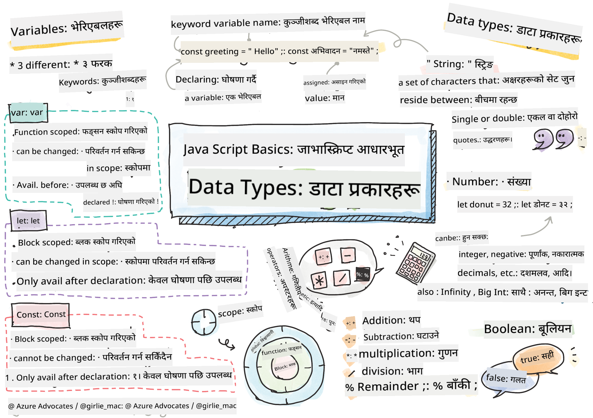

<!--
CO_OP_TRANSLATOR_METADATA:
{
  "original_hash": "fc6aef8ecfdd5b0ad2afa6e6ba52bfde",
  "translation_date": "2025-08-25T21:54:35+00:00",
  "source_file": "2-js-basics/1-data-types/README.md",
  "language_code": "ne"
}
-->
# जाभास्क्रिप्ट आधारभूत: डाटा प्रकारहरू


> स्केच नोट [Tomomi Imura](https://twitter.com/girlie_mac) द्वारा

## प्रि-लेक्चर क्विज
[प्रि-लेक्चर क्विज](https://ff-quizzes.netlify.app/web/quiz/7)

यो पाठले जाभास्क्रिप्टको आधारभूत कुराहरू समेट्छ, जुन वेबमा अन्तरक्रियात्मकता प्रदान गर्ने भाषा हो।

> तपाईं यो पाठ [Microsoft Learn](https://docs.microsoft.com/learn/modules/web-development-101-variables/?WT.mc_id=academic-77807-sagibbon) मा लिन सक्नुहुन्छ!

[](https://youtube.com/watch?v=JNIXfGiDWM8 "जाभास्क्रिप्टमा भेरिएबलहरू")

[](https://youtube.com/watch?v=AWfA95eLdq8 "जाभास्क्रिप्टमा डाटा प्रकारहरू")

> 🎥 माथिका तस्बिरहरूमा क्लिक गरेर भेरिएबल र डाटा प्रकारहरूबारे भिडियो हेर्नुहोस्

अब भेरिएबलहरू र तिनमा राखिने डाटा प्रकारहरूबाट सुरु गरौं!

## भेरिएबलहरू

भेरिएबलहरूले मूल्यहरू भण्डारण गर्छन् जसलाई तपाईंको कोडमा प्रयोग गर्न र परिवर्तन गर्न सकिन्छ।

भेरिएबल **घोषणा** गर्न निम्न प्रकारको सिंट्याक्स हुन्छ **[keyword] [name]**। यो दुई भागहरूबाट बनेको हुन्छ:

- **कीवर्ड**। कीवर्डहरू `let` वा `var` हुन सक्छन्।  
✅ `let` कीवर्ड ES6 मा परिचय गराइएको थियो र यसले तपाईंको भेरिएबललाई _ब्लक स्कोप_ दिन्छ। `let` प्रयोग गर्न सिफारिस गरिन्छ। हामी ब्लक स्कोपहरूबारे भविष्यका भागहरूमा थप चर्चा गर्नेछौं।
- **भेरिएबलको नाम**, यो तपाईंले आफैंले चयन गर्ने नाम हो।

### कार्य - भेरिएबलहरूसँग काम गर्ने

1. **भेरिएबल घोषणा गर्नुहोस्**। `let` कीवर्ड प्रयोग गरेर भेरिएबल घोषणा गरौं:

    ```javascript
    let myVariable;
    ```

   `myVariable` अब `let` कीवर्ड प्रयोग गरेर घोषणा गरिएको छ। हाल यसमा कुनै मूल्य छैन।

1. **मूल्य असाइन गर्नुहोस्**। `=` अपरेटर प्रयोग गरेर भेरिएबलमा मूल्य भण्डारण गर्नुहोस्, त्यसपछि अपेक्षित मूल्य राख्नुहोस्।

    ```javascript
    myVariable = 123;
    ```

   > नोट: यस पाठमा `=` को प्रयोगले "असाइनमेन्ट अपरेटर" को प्रयोगलाई जनाउँछ, जसले भेरिएबलमा मूल्य सेट गर्न प्रयोग गरिन्छ। यसले समानता जनाउँदैन।

   `myVariable` अब 123 मूल्यसँग *इनिसियलाइज* गरिएको छ।

1. **रिफ्याक्टर गर्नुहोस्**। आफ्नो कोडलाई निम्न कथनले प्रतिस्थापन गर्नुहोस्।

    ```javascript
    let myVariable = 123;
    ```

    माथिकोलाई _स्पष्ट इनिसियलाइजेशन_ भनिन्छ जब भेरिएबल घोषणा गरिन्छ र एकै समयमा मूल्य असाइन गरिन्छ।

1. **भेरिएबलको मूल्य परिवर्तन गर्नुहोस्**। भेरिएबलको मूल्य निम्न तरिकाले परिवर्तन गर्नुहोस्:

   ```javascript
   myVariable = 321;
   ```

   एकपटक भेरिएबल घोषणा भएपछि, तपाईं आफ्नो कोडमा कुनै पनि समयमा `=` अपरेटर र नयाँ मूल्य प्रयोग गरेर यसको मूल्य परिवर्तन गर्न सक्नुहुन्छ।

   ✅ प्रयास गर्नुहोस्! तपाईं आफ्नो ब्राउजरमै जाभास्क्रिप्ट लेख्न सक्नुहुन्छ। ब्राउजर विन्डो खोल्नुहोस् र डेभलपर टुल्समा जानुहोस्। कन्सोलमा तपाईंलाई एक प्रम्प्ट देखिन्छ; `let myVariable = 123` टाइप गर्नुहोस्, रिटर्न थिच्नुहोस्, त्यसपछि `myVariable` टाइप गर्नुहोस्। के हुन्छ? नोट गर्नुहोस्, तपाईं यी अवधारणाहरू आगामी पाठहरूमा थप सिक्नुहुनेछ।

## Constants

कन्स्टेन्टको घोषणा र इनिसियलाइजेशन भेरिएबलको जस्तै अवधारणाहरू अनुसरण गर्दछ, `const` कीवर्डको अपवादसहित। कन्स्टेन्टहरू सामान्यतया सबै अक्षरहरूमा ठूला अक्षरहरूमा घोषणा गरिन्छ।

```javascript
const MY_VARIABLE = 123;
```

कन्स्टेन्टहरू भेरिएबलहरू जस्तै छन्, तर दुई अपवादहरू छन्:

- **मूल्य हुनैपर्छ**। कन्स्टेन्टहरू इनिसियलाइज हुनैपर्छ, अन्यथा कोड चलाउँदा त्रुटि हुनेछ।
- **सन्दर्भ परिवर्तन गर्न सकिँदैन**। एकपटक इनिसियलाइज भएपछि कन्स्टेन्टको सन्दर्भ परिवर्तन गर्न सकिँदैन, अन्यथा कोड चलाउँदा त्रुटि हुनेछ। दुई उदाहरणहरू हेरौं:
   - **साधारण मूल्य**। निम्न अनुमति छैन:
   
      ```javascript
      const PI = 3;
      PI = 4; // not allowed
      ```
 
   - **अवजेक्ट सन्दर्भ सुरक्षित छ**। निम्न अनुमति छैन।
   
      ```javascript
      const obj = { a: 3 };
      obj = { b: 5 } // not allowed
      ```

    - **अवजेक्ट मूल्य सुरक्षित छैन**। निम्न अनुमति छ:
    
      ```javascript
      const obj = { a: 3 };
      obj.a = 5;  // allowed
      ```

      माथिकोमा तपाईंले अवजेक्टको मूल्य परिवर्तन गर्दै हुनुहुन्छ तर सन्दर्भलाई होइन, जसले यसलाई अनुमति दिन्छ।

   > नोट गर्नुहोस्, `const` ले सन्दर्भलाई पुनः असाइनमेन्टबाट सुरक्षित राख्छ। तर मूल्य _अपरिवर्तनीय_ छैन र परिवर्तन हुन सक्छ, विशेष गरी यदि यो जटिल संरचना जस्तै अवजेक्ट हो भने।

## डाटा प्रकारहरू

भेरिएबलहरूले विभिन्न प्रकारका मूल्यहरू भण्डारण गर्न सक्छन्, जस्तै संख्या र पाठ। यी विभिन्न प्रकारका मूल्यहरूलाई **डाटा प्रकार** भनिन्छ। डाटा प्रकारहरू सफ्टवेयर विकासको महत्त्वपूर्ण भाग हुन् किनभने यसले विकासकर्ताहरूलाई कोड कसरी लेख्ने र सफ्टवेयर कसरी चल्ने भन्ने निर्णय गर्न मद्दत गर्छ। साथै, केही डाटा प्रकारहरूमा अनौठो विशेषताहरू हुन्छन् जसले मूल्यमा थप जानकारी परिवर्तन गर्न वा निकाल्न मद्दत गर्छ।

✅ डाटा प्रकारहरूलाई जाभास्क्रिप्ट डाटा प्रिमिटिभहरू पनि भनिन्छ, किनभने यी भाषा द्वारा प्रदान गरिएका सबैभन्दा तल्लो स्तरका डाटा प्रकारहरू हुन्। 7 प्रिमिटिभ डाटा प्रकारहरू छन्: string, number, bigint, boolean, undefined, null, र symbol। एक मिनेट समय लिएर यी प्रिमिटिभहरूले के प्रतिनिधित्व गर्न सक्छन् भनेर कल्पना गर्नुहोस्। `zebra` के हो? `0` कस्तो छ? `true` कस्तो छ?

### संख्याहरू

अघिल्लो भागमा, `myVariable` को मूल्य संख्या डाटा प्रकार थियो।

`let myVariable = 123;`

भेरिएबलहरूले सबै प्रकारका संख्याहरू भण्डारण गर्न सक्छन्, जस्तै दशमलव वा ऋणात्मक संख्या। संख्याहरूलाई [अर्थमेटिक अपरेटरहरू](../../../../2-js-basics/1-data-types) सँग प्रयोग गर्न सकिन्छ।

### अर्थमेटिक अपरेटरहरू

अर्थमेटिक कार्यहरू गर्दा प्रयोग गर्न सकिने विभिन्न प्रकारका अपरेटरहरू छन्, र केही यहाँ सूचीबद्ध छन्:

| प्रतीक | विवरण                                                                  | उदाहरण                          |
| ------ | ---------------------------------------------------------------------- | -------------------------------- |
| `+`    | **जोड**: दुई संख्याको योग गणना गर्छ                                    | `1 + 2 //अपेक्षित उत्तर 3 हो`   |
| `-`    | **घटाउ**: दुई संख्याको अन्तर गणना गर्छ                                 | `1 - 2 //अपेक्षित उत्तर -1 हो`  |
| `*`    | **गुणन**: दुई संख्याको गुणनफल गणना गर्छ                                | `1 * 2 //अपेक्षित उत्तर 2 हो`   |
| `/`    | **भाग**: दुई संख्याको भागफल गणना गर्छ                                  | `1 / 2 //अपेक्षित उत्तर 0.5 हो` |
| `%`    | **बाकी**: दुई संख्याको भागबाट बाँकी गणना गर्छ                         | `1 % 2 //अपेक्षित उत्तर 1 हो`   |

✅ प्रयास गर्नुहोस्! आफ्नो ब्राउजरको कन्सोलमा अर्थमेटिक अपरेसन प्रयास गर्नुहोस्। नतिजाले तपाईंलाई अचम्मित बनायो?

### स्ट्रिङहरू

स्ट्रिङहरू अक्षरहरूको सेट हुन् जुन एकल वा दोहोरो उद्धरण चिन्हभित्र राखिन्छन्।

- `'यो स्ट्रिङ हो'`
- `"यो पनि स्ट्रिङ हो"`
- `let myString = 'यो स्ट्रिङ मूल्य हो जुन भेरिएबलमा भण्डारण गरिएको छ';`

स्ट्रिङ लेख्दा उद्धरण चिन्ह प्रयोग गर्न सम्झनुहोस्, अन्यथा जाभास्क्रिप्टले यसलाई भेरिएबलको नाम ठान्छ।

### स्ट्रिङहरूलाई फर्म्याट गर्ने

स्ट्रिङहरू पाठात्मक हुन्छन्, र समय समयमा फर्म्याटिङ आवश्यक पर्छ।

दुई वा बढी स्ट्रिङहरूलाई **जोड्न**, वा एकसाथ मिलाउन, `+` अपरेटर प्रयोग गर्नुहोस्।

```javascript
let myString1 = "Hello";
let myString2 = "World";

myString1 + myString2 + "!"; //HelloWorld!
myString1 + " " + myString2 + "!"; //Hello World!
myString1 + ", " + myString2 + "!"; //Hello, World!

```

✅ किन जाभास्क्रिप्टमा `1 + 1 = 2` हुन्छ, तर `'1' + '1' = 11` हुन्छ? यसबारे सोच्नुहोस्। `'1' + 1` के हुन्छ?

**टेम्प्लेट लिटरलहरू** स्ट्रिङहरूलाई फर्म्याट गर्ने अर्को तरिका हो, तर उद्धरण चिन्हको सट्टा ब्याकटिक प्रयोग गरिन्छ। साधारण पाठ नभएको कुनै पनि कुरा `${ }` प्लेसहोल्डरभित्र राख्नुपर्छ। यसमा स्ट्रिङ हुन सक्ने कुनै पनि भेरिएबलहरू समावेश छन्।

```javascript
let myString1 = "Hello";
let myString2 = "World";

`${myString1} ${myString2}!` //Hello World!
`${myString1}, ${myString2}!` //Hello, World!
```

तपाईं आफ्नो फर्म्याटिङ लक्ष्यहरू कुनै पनि विधिबाट प्राप्त गर्न सक्नुहुन्छ, तर टेम्प्लेट लिटरलहरूले कुनै पनि स्पेस र लाइन ब्रेकलाई सम्मान गर्नेछ।

✅ तपाईंले टेम्प्लेट लिटरल कहिले प्रयोग गर्नुहुन्छ र साधारण स्ट्रिङ कहिले?

### बूलियनहरू

बूलियनहरू दुई मात्र मानहरू हुन सक्छन्: `true` वा `false`। बूलियनहरूले केही सर्तहरू पूरा हुँदा कुन लाइनको कोड चलाउनुपर्छ भन्ने निर्णय गर्न मद्दत गर्छ। धेरै अवस्थामा, [अपरेटरहरू](../../../../2-js-basics/1-data-types) बूलियनको मान सेट गर्न मद्दत गर्छन् र तपाईंले अक्सर भेरिएबलहरू इनिसियलाइज गरिएको वा तिनको मान अपडेट गरिएको देख्नुहुनेछ।

- `let myTrueBool = true`
- `let myFalseBool = false`

✅ कुनै भेरिएबललाई 'truthy' मान्न सकिन्छ यदि यसले बूलियन `true` मा मूल्याङ्कन गर्छ। रोचक कुरा, जाभास्क्रिप्टमा [सबै मानहरू truthy हुन्छन् जबसम्म तिनीहरूलाई falsy भनेर परिभाषित गरिएको छैन](https://developer.mozilla.org/docs/Glossary/Truthy)।

---

## 🚀 चुनौती

जाभास्क्रिप्ट कहिलेकाहीँ डाटा प्रकारहरूलाई ह्यान्डल गर्ने अनौठो तरिकाका लागि कुख्यात छ। यी 'gotchas' बारे केही अनुसन्धान गर्नुहोस्। उदाहरणका लागि: केस संवेदनशीलता समस्यामा पार्न सक्छ! आफ्नो कन्सोलमा यो प्रयास गर्नुहोस्: `let age = 1; let Age = 2; age == Age` (यसले `false` समाधान गर्छ -- किन?)। तपाईंले अरू के 'gotchas' पाउन सक्नुहुन्छ?

## पोस्ट-लेक्चर क्विज
[पोस्ट-लेक्चर क्विज](https://ff-quizzes.netlify.app/web/quiz/8)

## समीक्षा र आत्म-अध्ययन

[जाभास्क्रिप्ट अभ्यासहरूको यो सूची](https://css-tricks.com/snippets/javascript/) हेर्नुहोस् र एउटा प्रयास गर्नुहोस्। तपाईंले के सिक्नुभयो?

## असाइनमेन्ट

[डाटा प्रकार अभ्यास](assignment.md)

**अस्वीकरण**:  
यो दस्तावेज़ AI अनुवाद सेवा [Co-op Translator](https://github.com/Azure/co-op-translator) प्रयोग गरेर अनुवाद गरिएको छ। हामी यथार्थताको लागि प्रयास गर्छौं, तर कृपया ध्यान दिनुहोस् कि स्वचालित अनुवादहरूमा त्रुटिहरू वा अशुद्धताहरू हुन सक्छ। यसको मूल भाषा मा रहेको मूल दस्तावेज़लाई आधिकारिक स्रोत मानिनुपर्छ। महत्वपूर्ण जानकारीको लागि, व्यावसायिक मानव अनुवाद सिफारिस गरिन्छ। यस अनुवादको प्रयोगबाट उत्पन्न हुने कुनै पनि गलतफहमी वा गलत व्याख्याको लागि हामी जिम्मेवार हुने छैनौं।