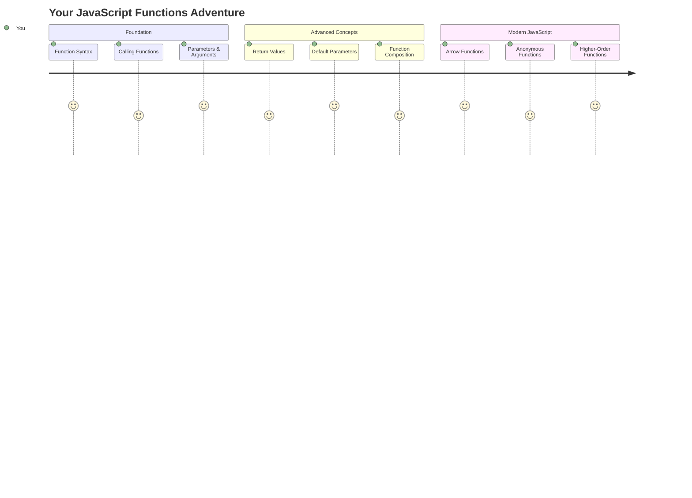
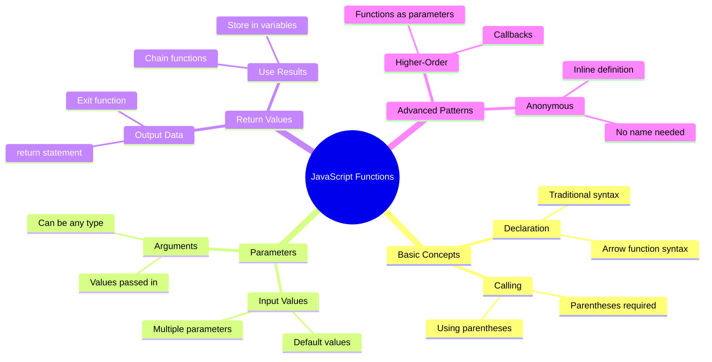
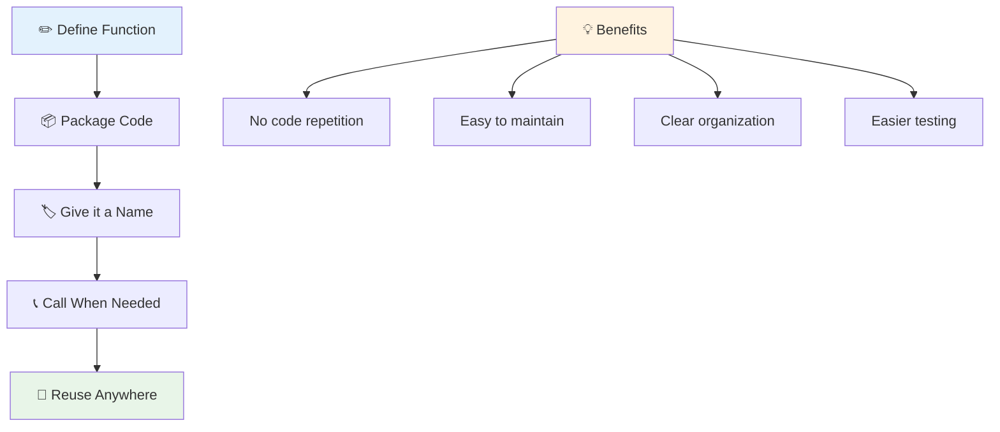
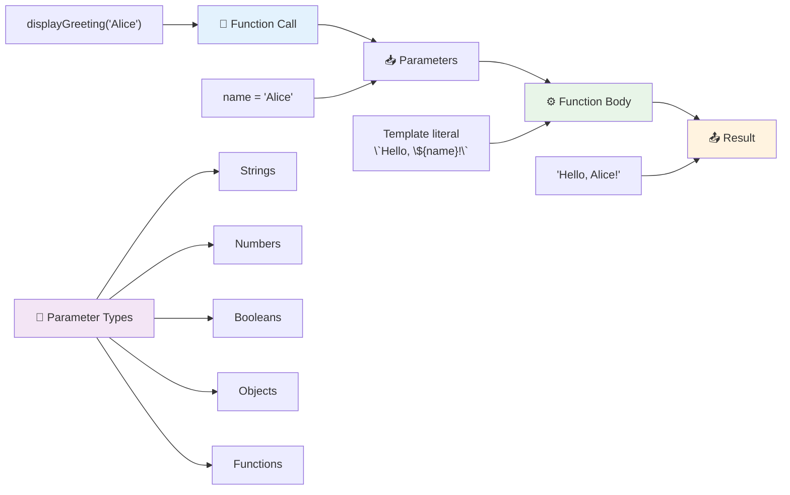
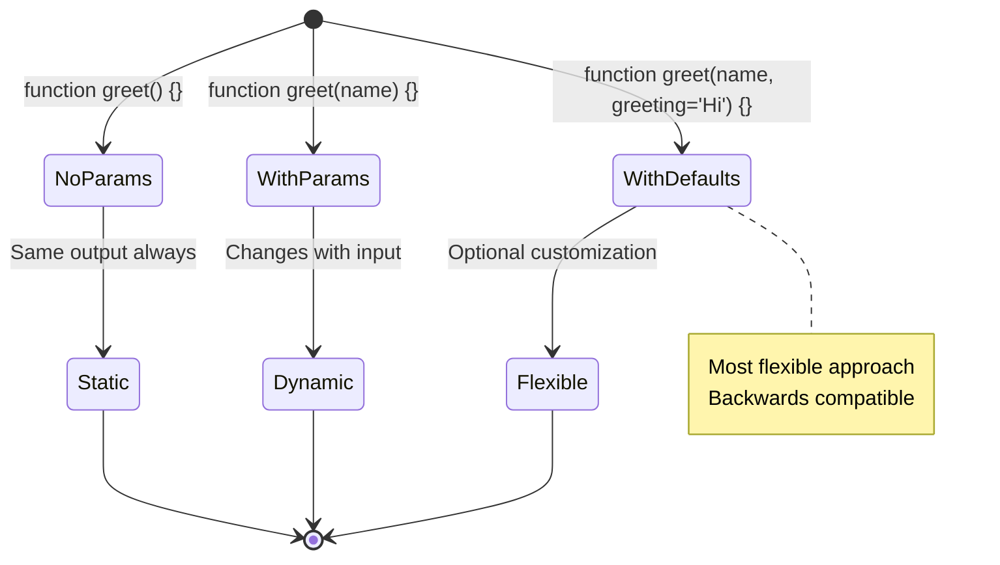
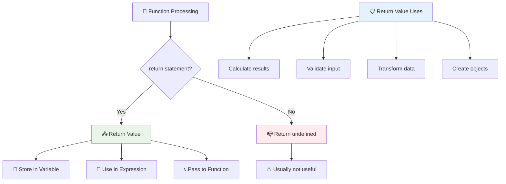
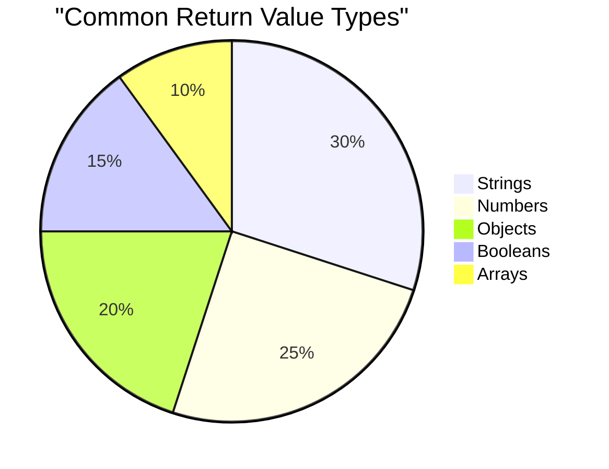
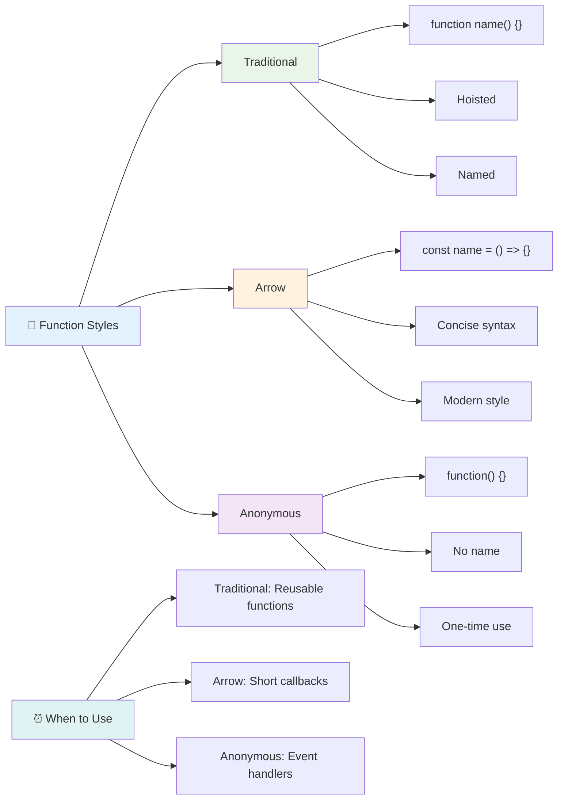
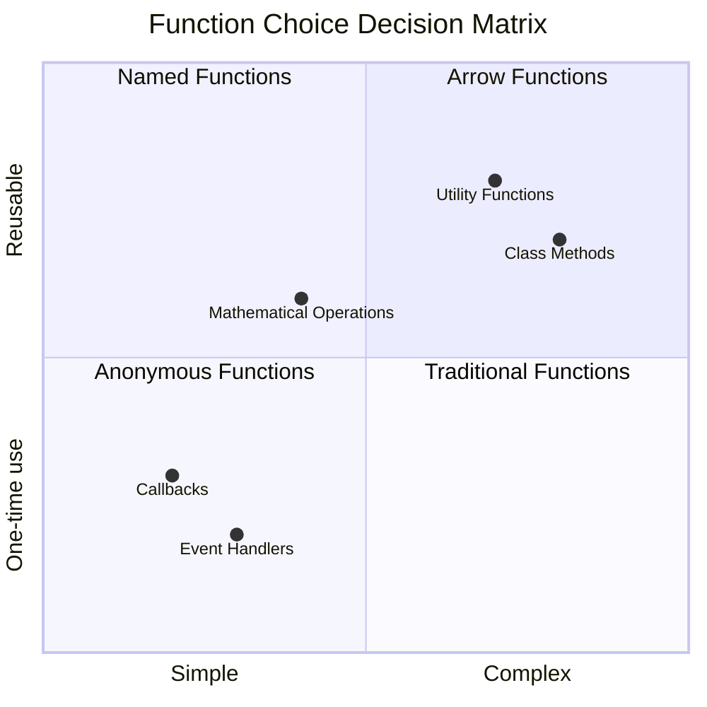
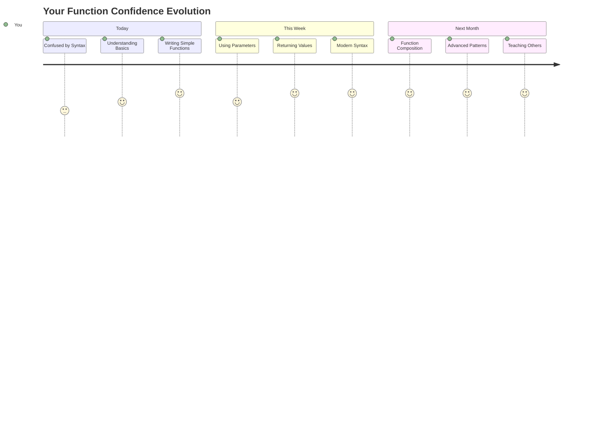

<!--
CO_OP_TRANSLATOR_METADATA:
{
  "original_hash": "71f7d7dafa1c7194d79ddac87f669ff9",
  "translation_date": "2025-11-03T15:13:02+00:00",
  "source_file": "2-js-basics/2-functions-methods/README.md",
  "language_code": "ne"
}
-->
# जाभास्क्रिप्ट आधारभूत: मेथड्स र फङ्सन्स


> स्केच नोट [Tomomi Imura](https://twitter.com/girlie_mac) द्वारा



## प्रि-लेक्चर क्विज
[प्रि-लेक्चर क्विज](https://ff-quizzes.netlify.app)

एकै कोड बारम्बार लेख्नु प्रोग्रामिङको सबैभन्दा सामान्य निराशाजनक पक्ष हो। फङ्सन्सले यो समस्या समाधान गर्छन् जसले कोडलाई पुनः प्रयोग गर्न मिल्ने ब्लकहरूमा प्याकेज गर्न अनुमति दिन्छ। फङ्सन्सलाई हेनरी फोर्डको असेंब्ली लाइनलाई क्रान्तिकारी बनाउने मानकीकृत भागहरू जस्तै सोच्नुहोस् – एकपटक तपाईंले भरपर्दो कम्पोनेन्ट बनाउनु भयो भने, तपाईंले यसलाई जहाँ आवश्यक छ त्यहाँ पुनः निर्माण नगरी प्रयोग गर्न सक्नुहुन्छ।

फङ्सन्सले कोडका टुक्राहरूलाई एकसाथ बाँध्न अनुमति दिन्छ ताकि तपाईंले आफ्नो प्रोग्रामभरि तिनीहरूलाई पुनः प्रयोग गर्न सक्नुहुन्छ। एउटै तर्कलाई सबै ठाउँमा प्रतिलिपि गरेर टाँस्नुको सट्टा, तपाईंले एकपटक फङ्सन बनाउन सक्नुहुन्छ र जहाँ आवश्यक छ त्यहाँ कल गर्न सक्नुहुन्छ। यसले तपाईंको कोडलाई व्यवस्थित राख्छ र अपडेटहरू धेरै सजिलो बनाउँछ।

यस पाठमा, तपाईंले आफ्नै फङ्सन्स कसरी बनाउने, तिनीहरूलाई जानकारी पास गर्ने, र उपयोगी परिणामहरू फिर्ता प्राप्त गर्ने सिक्नुहुनेछ। तपाईंले फङ्सन्स र मेथड्सको बीचको भिन्नता पत्ता लगाउनुहुनेछ, आधुनिक सिन्ट्याक्स दृष्टिकोणहरू सिक्नुहुनेछ, र फङ्सन्सले अन्य फङ्सन्ससँग कसरी काम गर्न सक्छन् भन्ने देख्नुहुनेछ। हामी यी अवधारणाहरू चरणबद्ध रूपमा निर्माण गर्नेछौं।

[](https://youtube.com/watch?v=XgKsD6Zwvlc "मेथड्स र फङ्सन्स")

> 🎥 माथिको तस्बिरमा क्लिक गर्नुहोस् मेथड्स र फङ्सन्सको बारेमा भिडियो हेर्न।

> तपाईंले यो पाठ [Microsoft Learn](https://docs.microsoft.com/learn/modules/web-development-101-functions/?WT.mc_id=academic-77807-sagibbon) मा लिन सक्नुहुन्छ!



## फङ्सन्स

फङ्सन भनेको एक स्व-समावेशित कोड ब्लक हो जसले विशिष्ट कार्य गर्दछ। यसले तर्कलाई समेट्छ जुन तपाईंले आवश्यक पर्दा कार्यान्वयन गर्न सक्नुहुन्छ।

तपाईंको प्रोग्रामभरि एउटै कोड बारम्बार लेख्नुको सट्टा, तपाईंले यसलाई फङ्सनमा प्याकेज गर्न सक्नुहुन्छ र जहाँ आवश्यक छ त्यहाँ फङ्सन कल गर्न सक्नुहुन्छ। यसले तपाईंको कोडलाई सफा राख्छ र अपडेटहरू धेरै सजिलो बनाउँछ। कल्पना गर्नुहोस् यदि तपाईंले आफ्नो कोडबेसका २० विभिन्न स्थानहरूमा फैलिएको तर्क परिवर्तन गर्नुपर्ने चुनौती सामना गर्नुपरेको छ भने।

तपाईंको फङ्सन्सलाई वर्णनात्मक नाम दिनु महत्त्वपूर्ण छ। राम्रो नाम दिइएको फङ्सनले यसको उद्देश्य स्पष्ट रूपमा सञ्चार गर्दछ – जब तपाईंले `cancelTimer()` देख्नुहुन्छ, तपाईंले तुरुन्तै बुझ्नुहुन्छ कि यसले के गर्छ, जस्तै स्पष्ट रूपमा लेबल गरिएको बटनले तपाईंलाई बताउँछ कि तपाईंले क्लिक गर्दा के हुनेछ।

## फङ्सन बनाउने र कल गर्ने

आउनुहोस् फङ्सन कसरी बनाउने भनेर हेर्नुहोस्। सिन्ट्याक्सले एक सुसंगत ढाँचा पछ्याउँछ:

```javascript
function nameOfFunction() { // function definition
 // function definition/body
}
```

यसलाई टुक्रा-टुक्रामा बुझौं:
- `function` कीवर्डले जाभास्क्रिप्टलाई "हे, म फङ्सन बनाउँदैछु!" भन्छ।
- `nameOfFunction` तपाईंले आफ्नो फङ्सनलाई वर्णनात्मक नाम दिने ठाउँ हो।
- कोष्ठक `()` तपाईंले प्यारामिटरहरू थप्न सक्ने ठाउँ हो (हामी चाँडै यसमा पुग्नेछौं)।
- कर्ली ब्रेसेस `{}`ले वास्तविक कोड समावेश गर्दछ जुन तपाईंले फङ्सन कल गर्दा चल्छ।

आउनुहोस् एउटा साधारण अभिवादन फङ्सन बनाऔं र यसलाई कार्यमा हेर्नुहोस्:

```javascript
function displayGreeting() {
  console.log('Hello, world!');
}
```

यो फङ्सनले "Hello, world!" कन्सोलमा प्रिन्ट गर्छ। एकपटक तपाईंले यसलाई परिभाषित गरेपछि, तपाईंले यसलाई आवश्यक पर्दा जति पटक पनि प्रयोग गर्न सक्नुहुन्छ।

तपाईंको फङ्सनलाई कार्यान्वयन गर्न (वा "कल" गर्न), यसको नाम लेख्नुहोस् र त्यसपछि कोष्ठक राख्नुहोस्। जाभास्क्रिप्टले तपाईंलाई फङ्सन परिभाषित गर्नु अघि वा पछि कल गर्न अनुमति दिन्छ – जाभास्क्रिप्ट इन्जिनले कार्यान्वयन क्रमलाई ह्यान्डल गर्नेछ।

```javascript
// calling our function
displayGreeting();
```

जब तपाईंले यो लाइन चलाउनुहुन्छ, यसले तपाईंको `displayGreeting` फङ्सनभित्रको सबै कोड कार्यान्वयन गर्छ, "Hello, world!" तपाईंको ब्राउजरको कन्सोलमा देखाउँछ। तपाईंले यो फङ्सन बारम्बार कल गर्न सक्नुहुन्छ।

### 🧠 **फङ्सन आधारभूत जाँच: तपाईंको पहिलो फङ्सन्स निर्माण गर्दै**

**आउनुहोस् तपाईंको आधारभूत फङ्सन्सको बारेमा कस्तो महसुस गर्दै हुनुहुन्छ हेर्नुहोस्:**
- तपाईं फङ्सन परिभाषामा कर्ली ब्रेसेस `{}` किन प्रयोग गर्छौं भनेर व्याख्या गर्न सक्नुहुन्छ?
- यदि तपाईंले `displayGreeting` कोष्ठक बिना लेख्नुभयो भने के हुन्छ?
- तपाईंले एउटै फङ्सन बारम्बार कल गर्न किन चाहनुहुन्छ?



> **Note:** तपाईंले यी पाठहरूमा **मेथड्स** प्रयोग गर्दै हुनुहुन्छ। `console.log()` एउटा मेथड हो – मूलतः `console` वस्तुमा सम्बन्धित फङ्सन। मुख्य भिन्नता भनेको मेथड्स वस्तुमा जोडिएका हुन्छन्, जबकि फङ्सन्स स्वतन्त्र रूपमा उभिन्छन्। धेरै डेभलपर्सले अनौपचारिक कुराकानीमा यी शब्दहरू परस्पर प्रयोग गर्छन्।

### फङ्सनको राम्रो अभ्यासहरू

यहाँ तपाईंलाई उत्कृष्ट फङ्सन्स लेख्न मद्दत गर्ने केही सुझावहरू छन्:

- तपाईंको फङ्सन्सलाई स्पष्ट, वर्णनात्मक नाम दिनुहोस् – तपाईंको भविष्यको स्वयम्ले तपाईंलाई धन्यवाद दिनेछ!
- बहु-शब्द नामहरूको लागि **camelCasing** प्रयोग गर्नुहोस् (जस्तै `calculateTotal` को सट्टा `calculate_total`)
- प्रत्येक फङ्सनलाई एक काम राम्रोसँग गर्न केन्द्रित राख्नुहोस्

## फङ्सनमा जानकारी पास गर्दै

हाम्रो `displayGreeting` फङ्सन सीमित छ – यसले सबैका लागि "Hello, world!" मात्र देखाउन सक्छ। प्यारामिटरहरूले फङ्सन्सलाई अझ लचिलो र उपयोगी बनाउँछन्।

**प्यारामिटरहरू** प्लेसहोल्डर जस्तै काम गर्छन् जहाँ तपाईंले प्रत्येक पटक फङ्सन प्रयोग गर्दा विभिन्न मानहरू राख्न सक्नुहुन्छ। यसरी, एउटै फङ्सनले प्रत्येक कलमा विभिन्न जानकारीसँग काम गर्न सक्छ।

तपाईंले फङ्सन परिभाषा गर्दा कोष्ठकभित्र प्यारामिटरहरूको सूची बनाउनुहुन्छ, धेरै प्यारामिटरहरूलाई कमासँग छुट्याउनुहोस्:

```javascript
function name(param, param2, param3) {

}
```

प्रत्येक प्यारामिटर प्लेसहोल्डर जस्तै काम गर्छ – जब कसैले तपाईंको फङ्सन कल गर्छ, तिनीहरूले वास्तविक मानहरू प्रदान गर्नेछन् जुन यी स्थानहरूमा प्लग गरिन्छ।

आउनुहोस् हाम्रो अभिवादन फङ्सनलाई कसैको नाम स्वीकार गर्न अद्यावधिक गरौं:

```javascript
function displayGreeting(name) {
  const message = `Hello, ${name}!`;
  console.log(message);
}
```

ध्यान दिनुहोस् हामीले कसरी ब्याकटिक्स (`` ` ``) र `${}` प्रयोग गरेर नामलाई सन्देशमा सिधै राख्दैछौं – यसलाई टेम्प्लेट लिटरल भनिन्छ, र यो चरहरूसँग मिसिएको स्ट्रिङहरू निर्माण गर्नको लागि धेरै उपयोगी तरिका हो।

अब जब हामीले हाम्रो फङ्सन कल गर्छौं, हामीले कुनै पनि नाम पास गर्न सक्छौं:

```javascript
displayGreeting('Christopher');
// displays "Hello, Christopher!" when run
```

जाभास्क्रिप्टले स्ट्रिङ `'Christopher'` लिन्छ, यसलाई `name` प्यारामिटरमा असाइन गर्छ, र व्यक्तिगत सन्देश "Hello, Christopher!" बनाउँछ।



## डिफल्ट मानहरू

यदि हामीले केही प्यारामिटरहरू वैकल्पिक बनाउन चाह्यौं भने के हुन्छ? त्यहाँ डिफल्ट मानहरू उपयोगी हुन्छन्!

मानौं हामी चाहन्छौं कि मानिसहरूले अभिवादन शब्दलाई अनुकूलित गर्न सकून्, तर यदि तिनीहरूले कुनै निर्दिष्ट गरेनन् भने, हामीले "Hello" लाई ब्याकअपको रूपमा प्रयोग गर्नेछौं। तपाईंले डिफल्ट मानहरू सेट गर्न सक्नुहुन्छ बराबर चिन्ह प्रयोग गरेर, ठीक चर सेट गरेजस्तै:

```javascript
function displayGreeting(name, salutation='Hello') {
  console.log(`${salutation}, ${name}`);
}
```

यहाँ, `name` अझै आवश्यक छ, तर `salutation` को ब्याकअप मान `'Hello'` छ यदि कसैले फरक अभिवादन प्रदान गरेन भने।

अब हामीले यो फङ्सनलाई दुई फरक तरिकामा कल गर्न सक्छौं:

```javascript
displayGreeting('Christopher');
// displays "Hello, Christopher"

displayGreeting('Christopher', 'Hi');
// displays "Hi, Christopher"
```

पहिलो कलमा, जाभास्क्रिप्टले डिफल्ट "Hello" प्रयोग गर्छ किनभने हामीले कुनै सल्युटेसन निर्दिष्ट गरेका छैनौं। दोस्रो कलमा, यसले हाम्रो अनुकूलित "Hi" प्रयोग गर्छ। यो लचकताले फङ्सन्सलाई विभिन्न परिदृश्यहरूमा अनुकूल बनाउँछ।

### 🎛️ **प्यारामिटर मास्टरी जाँच: फङ्सन्सलाई लचिलो बनाउँदै**

**तपाईंको प्यारामिटर बुझाइ जाँच गर्नुहोस्:**
- प्यारामिटर र आर्गुमेन्टको बीचको भिन्नता के हो?
- वास्तविक संसारको प्रोग्रामिङमा डिफल्ट मानहरू किन उपयोगी छन्?
- यदि तपाईंले प्यारामिटरभन्दा बढी आर्गुमेन्ट पास गर्नुभयो भने के हुन्छ भनेर अनुमान गर्न सक्नुहुन्छ?



> **Pro tip**: डिफल्ट प्यारामिटरहरूले तपाईंको फङ्सन्सलाई प्रयोगकर्ता-अनुकूल बनाउँछ। प्रयोगकर्ताहरूले संवेदनशील डिफल्टहरूसँग छिटो सुरु गर्न सक्छन्, तर आवश्यक पर्दा अझै अनुकूलन गर्न सक्छन्!

## फिर्ता मानहरू

हाम्रो फङ्सन्सले अहिलेसम्म कन्सोलमा सन्देशहरू मात्र प्रिन्ट गर्दै आएका छन्, तर यदि तपाईंले फङ्सनलाई केही गणना गर्न र परिणाम फिर्ता दिन चाहनुभयो भने के हुन्छ?

त्यहाँ **फिर्ता मानहरू** आउँछन्। केही देखाउने सट्टा, फङ्सनले तपाईंलाई एउटा मान फिर्ता दिन सक्छ जुन तपाईंले चरमा भण्डारण गर्न वा तपाईंको कोडका अन्य भागहरूमा प्रयोग गर्न सक्नुहुन्छ।

मान फिर्ता पठाउन, तपाईंले `return` कीवर्ड प्रयोग गर्नुहुन्छ र त्यसपछि तपाईंले फिर्ता दिन चाहेको कुरा:

```javascript
return myVariable;
```

यहाँ महत्त्वपूर्ण कुरा छ: जब फङ्सनले `return` स्टेटमेन्टलाई हिट गर्छ, यसले तुरुन्तै चल्न बन्द गर्छ र त्यो मानलाई फङ्सन कल गर्ने व्यक्तिलाई फिर्ता पठाउँछ।

आउनुहोस् हाम्रो अभिवादन फङ्सनलाई सन्देश प्रिन्ट गर्ने सट्टा सन्देश फिर्ता दिन संशोधित गरौं:

```javascript
function createGreetingMessage(name) {
  const message = `Hello, ${name}`;
  return message;
}
```

अब यो फङ्सनले अभिवादन प्रिन्ट गर्ने सट्टा सन्देश बनाउँछ र हामीलाई फिर्ता दिन्छ।

फिर्ता गरिएको मान प्रयोग गर्न, हामीले यसलाई अन्य कुनै पनि मान जस्तै चरमा भण्डारण गर्न सक्छौं:

```javascript
const greetingMessage = createGreetingMessage('Christopher');
```

अब `greetingMessage`मा "Hello, Christopher" छ र हामीले यसलाई हाम्रो कोडमा जहाँ पनि प्रयोग गर्न सक्छौं – वेबपेजमा देखाउन, इमेलमा समावेश गर्न, वा अर्को फङ्सनमा पास गर्न।



### 🔄 **फिर्ता मान जाँच: परिणामहरू फिर्ता प्राप्त गर्दै**

**तपाईंको फिर्ता मान बुझाइ मूल्याङ्कन गर्नुहोस्:**
- फङ्सनमा `return` स्टेटमेन्टपछि कोडमा के हुन्छ?
- कन्सोलमा मात्र प्रिन्ट गर्ने सट्टा मान फिर्ता गर्नु किन राम्रो हो?
- के फङ्सनले विभिन्न प्रकारका मानहरू (स्ट्रिङ, नम्बर, बूलियन) फिर्ता गर्न सक्छ?



> **Key insight**: मान फिर्ता गर्ने फङ्सन्स अधिक बहुमुखी हुन्छन् किनभने कल गर्ने व्यक्तिले परिणामसँग के गर्ने निर्णय गर्छ। यसले तपाईंको कोडलाई अधिक मोड्युलर र पुनः प्रयोगयोग्य बनाउँछ!

## फङ्सन्सलाई फङ्सन्सका प्यारामिटरको रूपमा प्रयोग गर्दै

फङ्सन्सलाई अन्य फङ्सन्सका प्यारामिटरको रूपमा पास गर्न सकिन्छ। यो अवधारणा सुरुमा जटिल लाग्न सक्छ, तर यो एक शक्तिशाली सुविधा हो जसले लचिलो प्रोग्रामिङ ढाँचाहरू सक्षम बनाउँछ।

यो ढाँचा धेरै सामान्य छ जब तपाईं भन्न चाहनुहुन्छ "केही हुन्छ भने, यो अर्को कुरा गर।" उदाहरणका लागि, "जब टाइमर समाप्त हुन्छ, यो कोड चलाउनुहोस्" वा "जब प्रयोगकर्ताले बटन क्लिक गर्छ, यो फङ्सन कल गर्नुहोस्।"

आउनुहोस् `setTimeout` हेर्नुहोस्, जुन एक बिल्ट-इन फङ्सन हो जसले निश्चित समय पर्खन्छ र त्यसपछि केही कोड चलाउँछ। हामीले यसलाई के कोड चलाउने बताउनुपर्छ – फङ्सन पास गर्नको लागि उत्तम प्रयोग केस!

यो कोड प्रयास गर्नुहोस् – ३ सेकेन्डपछि, तपाईंले सन्देश देख्नुहुनेछ:

```javascript
function displayDone() {
  console.log('3 seconds has elapsed');
}
// timer value is in milliseconds
setTimeout(displayDone, 3000);
```

ध्यान दिनुहोस् हामीले `displayDone` (कोष्ठक बिना) `setTimeout`मा पास गर्दैछौं। हामी आफैंले फङ्सन कल गर्दै छैनौं – हामी यसलाई `setTimeout`मा हस्तान्तरण गर्दैछौं र भनिरहेका छौं "यो ३ सेकेन्डमा कल गर्नुहोस्।"

### अनाम फङ्सन्स

कहिलेकाहीं तपाईंलाई केवल एक पटकको लागि फङ्सन चाहिन्छ र यसलाई नाम दिन चाहनुहुन्न। सोच्नुहोस् – यदि तपाईंले फङ्सनलाई मात्र एक पटक प्रयोग गर्नुपर्छ भने, किन आफ्नो कोडलाई अतिरिक्त नामले भरमग्दुर बनाउनुहोस्?

जाभास्क्रिप्टले तपाईंलाई **अनाम फङ्सन्स** बनाउन अनुमति दिन्छ – नाम बिना फङ्सन्स जुन तपाईंले जहाँ आवश्यक छ त्यही परिभाषित गर्न सक्नुहुन्छ।

यहाँ हामीले हाम्रो टाइमर उदाहरणलाई अनाम फङ्सन प्रयोग गरेर पुनः लेख्न सक्छौं:

```javascript
setTimeout(function() {
  console.log('3 seconds has elapsed');
}, 3000);
```

यसले उस्तै परिणाम प्राप्त गर्छ, तर फङ्सन `setTimeout` कलभित्रै परिभाषित गरिएको छ, अलग फङ्सन घोषणा आवश्यक छैन।

### फ्याट एरो फङ्सन्स

आधुनिक जाभास्क्रिप्टमा फङ्सन्स लेख्न अझ छोटो तरिका छ जसलाई **एरो फङ्सन्स** भनिन्छ। तिनीहरूले `=>` प्रयोग गर्छन् (जसले एरो जस्तो देखिन्छ – बुझ्नुभयो?) र डेभलपर्ससँग धेरै लोकप्रिय छन्।

एरो फङ्सन्सले तपाईंलाई `function` कीवर्ड छोड्न र अधिक संक्षिप्त कोड लेख्न अनुमति दिन्छ।

यहाँ हाम्रो टाइमर उदाहरण एरो फङ्सन प्रयोग गरेर:

```javascript
setTimeout(() => {
  console.log('3 seconds has elapsed');
}, 3000);
```

`()` प्यारामिटरहरू जाने ठाउँ हो (यो केसमा खाली), त्यसपछि एरो `=>` आउँछ, र अन्तमा कर्ली ब्रेसेसमा फङ्सन बडी। यसले उस्तै कार्यक्षमता प्रदान गर्दछ अधिक संक्षिप्त सिन्ट्याक्ससँग।



### प्रत्येक रणनीति कहिले प्रयोग गर्ने

तपाईंले प्रत्येक दृष्टिकोण कहिले प्रयोग गर्नुपर्छ? व्यावहारिक दिशानिर्देश: यदि तपाईंले फङ्सनलाई धेरै पटक प्रयोग गर्नुहुनेछ भने, यसलाई नाम दिनुहोस् र अलग रूपमा परिभाषित गर्नुहोस्। यदि यो एक विशिष्ट प्रयोगको लागि हो भने, अनाम फङ्सन विचार गर्नुहोस्। एरो फङ्सन्स र परम्परागत सिन्ट्याक्स दुवै मान्य विकल्पहरू हुन्, यद्यपि एरो फङ्सन्स आधुनिक जाभास्क्रिप्ट कोडबेसहरूमा प्रचलित छन्।

### 🎨 **फङ्सन शैली मास्टरी जाँच: सही सिन्ट्याक्स चयन गर्दै**

**तपाईंको सिन्ट्याक्स बुझाइ जाँच गर्नुहोस्:**
- तपाईंले परम्परागत फङ्सन सिन्ट्याक्सको सट्टा एरो फङ्सन्स कहिले प्राथमिकता दिनुहुन्छ?
- अनाम फङ्सन्सको मुख्य फाइदा के हो?
- तपाईंले अनाम फङ्सनभन्दा नाम दिइएको फङ्सन राम्रो हुने स्थिति सोच्न सक्नुहुन्छ?



> **आधुनिक प्रवृत्ति**: एरो फङ्सन्स धेरै डेभलपर्सको लागि डिफल्ट विकल्प
- [ ] परम्परागत फङ्सनलाई एरो फङ्सन सिन्ट्याक्समा परिवर्तन गर्ने प्रयास गर्नुहोस्  
- [ ] चुनौती अभ्यास गर्नुहोस्: फङ्सन र मेथडको बीचको फरक व्याख्या गर्नुहोस्  

### 🎯 **यो घण्टामा तपाईंले के हासिल गर्न सक्नुहुन्छ**  
- [ ] पाठपछिको क्विज पूरा गर्नुहोस् र कुनै पनि भ्रमित अवधारणाहरू समीक्षा गर्नुहोस्  
- [ ] GitHub Copilot चुनौतीबाट गणित उपयोगिता पुस्तकालय निर्माण गर्नुहोस्  
- [ ] अर्को फङ्सनलाई प्यारामिटरको रूपमा प्रयोग गर्ने फङ्सन सिर्जना गर्नुहोस्  
- [ ] डिफल्ट प्यारामिटरहरू सहित फङ्सन लेख्ने अभ्यास गर्नुहोस्  
- [ ] फङ्सनको रिटर्न मानहरूमा टेम्प्लेट लिटरल्स प्रयोग गरेर प्रयोग गर्नुहोस्  

### 📅 **तपाईंको हप्ताभरि फङ्सन मास्टरी**  
- [ ] "Fun with Functions" असाइनमेन्ट सिर्जनात्मकतासँग पूरा गर्नुहोस्  
- [ ] तपाईंले लेखेको दोहोरिएको कोडलाई पुन: प्रयोग गर्न मिल्ने फङ्सनहरूमा सुधार गर्नुहोस्  
- [ ] केवल फङ्सनहरू प्रयोग गरेर सानो क्यालकुलेटर निर्माण गर्नुहोस् (कुनै ग्लोबल भेरिएबलहरू प्रयोग नगरी)  
- [ ] `map()` र `filter()` जस्ता एरो फङ्सनहरू अभ्यास गर्नुहोस्  
- [ ] सामान्य कार्यहरूको लागि उपयोगिता फङ्सनहरूको संग्रह सिर्जना गर्नुहोस्  
- [ ] उच्च-स्तरीय फङ्सनहरू र फङ्सनल प्रोग्रामिङ अवधारणाहरू अध्ययन गर्नुहोस्  

### 🌟 **तपाईंको महिनाभरि रूपान्तरण**  
- [ ] क्लोजर र स्कोप जस्ता उन्नत फङ्सन अवधारणाहरूमा महारत हासिल गर्नुहोस्  
- [ ] फङ्सन कम्पोजिसनलाई व्यापक रूपमा प्रयोग गर्ने परियोजना निर्माण गर्नुहोस्  
- [ ] फङ्सन डकुमेन्टेसन सुधार गरेर ओपन सोर्समा योगदान गर्नुहोस्  
- [ ] कसैलाई फङ्सन र विभिन्न सिन्ट्याक्स शैलीहरूको बारेमा सिकाउनुहोस्  
- [ ] JavaScript मा फङ्सनल प्रोग्रामिङ पद्धतिहरू अन्वेषण गर्नुहोस्  
- [ ] भविष्यका परियोजनाहरूको लागि पुन: प्रयोग गर्न मिल्ने फङ्सनहरूको व्यक्तिगत पुस्तकालय सिर्जना गर्नुहोस्  

### 🏆 **अन्तिम फङ्सन च्याम्पियन चेक-इन**  

**तपाईंको फङ्सन मास्टरीको उत्सव मनाउनुहोस्:**  
- अहिलेसम्म तपाईंले सिर्जना गरेको सबैभन्दा उपयोगी फङ्सन के हो?  
- फङ्सनको बारेमा सिक्दा कोड संगठनको बारेमा तपाईंको सोच कसरी परिवर्तन भयो?  
- तपाईं कुन फङ्सन सिन्ट्याक्सलाई प्राथमिकता दिनुहुन्छ र किन?  
- तपाईं कुन वास्तविक समस्या फङ्सन लेखेर समाधान गर्नुहुन्छ?  


  
> 🎉 **तपाईंले प्रोग्रामिङको सबैभन्दा शक्तिशाली अवधारणाहरूमा महारत हासिल गर्नुभएको छ!** फङ्सनहरू ठूला प्रोग्रामहरूको निर्माण ब्लक हुन्। तपाईंले कहिल्यै निर्माण गर्ने प्रत्येक एप्लिकेसनले कोडलाई व्यवस्थित, पुन: प्रयोग गर्न मिल्ने, र संरचना गर्न फङ्सनहरू प्रयोग गर्नेछ। तपाईंले अब तर्कलाई पुन: प्रयोग गर्न मिल्ने कम्पोनेन्टहरूमा प्याकेज गर्ने तरिका बुझ्नुभएको छ, जसले तपाईंलाई अधिक कुशल र प्रभावकारी प्रोग्रामर बनाउँछ। मोडुलर प्रोग्रामिङको संसारमा स्वागत छ! 🚀  

---

**अस्वीकरण**:  
यो दस्तावेज AI अनुवाद सेवा [Co-op Translator](https://github.com/Azure/co-op-translator) प्रयोग गरेर अनुवाद गरिएको छ। हामी शुद्धताको लागि प्रयास गर्छौं, तर कृपया ध्यान दिनुहोस् कि स्वचालित अनुवादहरूमा त्रुटि वा अशुद्धता हुन सक्छ। यसको मूल भाषा मा रहेको मूल दस्तावेजलाई आधिकारिक स्रोत मानिनुपर्छ। महत्वपूर्ण जानकारीको लागि, व्यावसायिक मानव अनुवाद सिफारिस गरिन्छ। यस अनुवादको प्रयोगबाट उत्पन्न हुने कुनै पनि गलतफहमी वा गलत व्याख्याको लागि हामी जिम्मेवार हुने छैनौं।