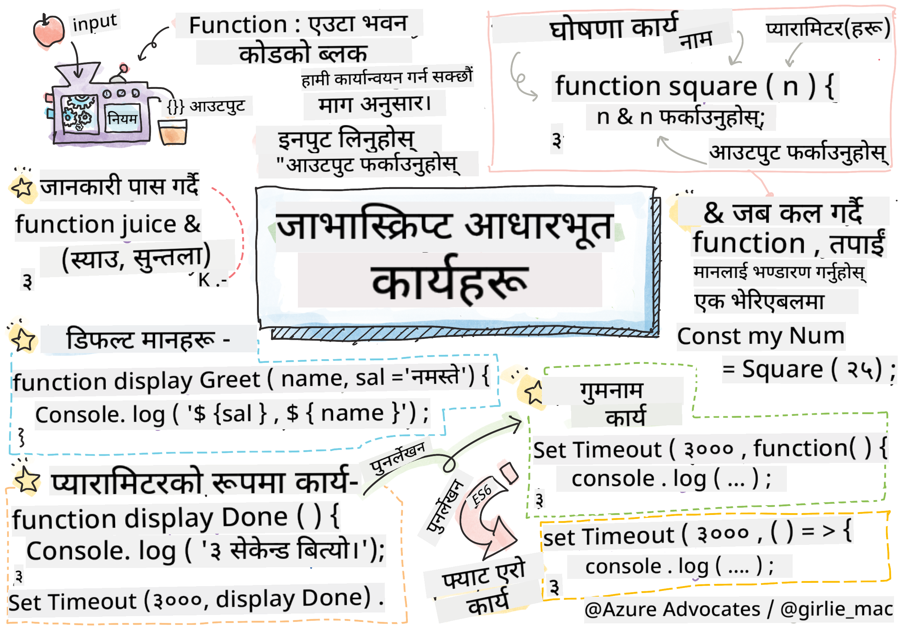

<!--
CO_OP_TRANSLATOR_METADATA:
{
  "original_hash": "ec43b53e8e015cdabfd3ad877b3c28e5",
  "translation_date": "2025-10-22T16:39:23+00:00",
  "source_file": "2-js-basics/2-functions-methods/README.md",
  "language_code": "ne"
}
-->
# जाभास्क्रिप्ट आधारभूत: मेथड्स र फङ्सन्स


> स्केच नोट [टोमोमी इमुरा](https://twitter.com/girlie_mac) द्वारा

## प्रि-लेक्चर क्विज
[प्रि-लेक्चर क्विज](https://ff-quizzes.netlify.app)

बारम्बार एउटै कोड लेख्नु प्रोग्रामिङको सबैभन्दा सामान्य निराशाजनक पक्षहरूमध्ये एक हो। फङ्सन्सले यो समस्या समाधान गर्छन्, जसले कोडलाई पुन: प्रयोग गर्न मिल्ने ब्लकहरूमा प्याकेज गर्न अनुमति दिन्छ। फङ्सन्सलाई हेनरी फोर्डको एसेम्बली लाइनलाई क्रान्तिकारी बनाउने मानकीकृत भागहरू जस्तै सोच्नुहोस् – एकपटक तपाईंले भरपर्दो कम्पोनेन्ट बनाउनु भयो भने, तपाईंले यसलाई जहाँ आवश्यक छ त्यहाँ पुन: प्रयोग गर्न सक्नुहुन्छ, सुरुबाट पुन: निर्माण नगरी।

फङ्सन्सले तपाईंलाई कोडका टुक्राहरूलाई प्याकेज गर्न अनुमति दिन्छ ताकि तपाईंले आफ्नो प्रोग्रामभरि तिनीहरूलाई पुन: प्रयोग गर्न सक्नुहुन्छ। एउटै तर्कलाई हरेक ठाउँमा प्रतिलिपि र पेस्ट गर्नुको सट्टा, तपाईंले एकपटक फङ्सन बनाउन सक्नुहुन्छ र जहाँ आवश्यक छ त्यहाँ कल गर्न सक्नुहुन्छ। यसले तपाईंको कोडलाई व्यवस्थित राख्छ र अपडेटहरू धेरै सजिलो बनाउँछ।

यस पाठमा, तपाईंले आफ्नै फङ्सन्स कसरी बनाउने, तिनीहरूलाई जानकारी पास गर्ने, र उपयोगी नतिजा फिर्ता पाउने कुरा सिक्नुहुनेछ। तपाईंले फङ्सन्स र मेथड्सको बीचको भिन्नता पत्ता लगाउनुहुनेछ, आधुनिक सिन्ट्याक्स दृष्टिकोणहरू सिक्नुहुनेछ, र फङ्सन्सले अन्य फङ्सन्ससँग कसरी काम गर्न सक्छन् भन्ने देख्नुहुनेछ। हामी यी अवधारणाहरूलाई चरणबद्ध रूपमा निर्माण गर्नेछौं।

[](https://youtube.com/watch?v=XgKsD6Zwvlc "मेथड्स र फङ्सन्स")

> 🎥 माथिको तस्बिरमा क्लिक गरेर मेथड्स र फङ्सन्सको बारेमा भिडियो हेर्नुहोस्।

> तपाईंले यो पाठ [Microsoft Learn](https://docs.microsoft.com/learn/modules/web-development-101-functions/?WT.mc_id=academic-77807-sagibbon) मा लिन सक्नुहुन्छ!

## फङ्सन्स

फङ्सन भनेको कोडको एउटा आत्म-निहित ब्लक हो जसले विशेष कार्य गर्दछ। यसले तर्कलाई समेट्छ जुन तपाईंले आवश्यक पर्दा कार्यान्वयन गर्न सक्नुहुन्छ।

तपाईंको प्रोग्रामभरि एउटै कोड धेरै पटक लेख्नुको सट्टा, तपाईंले यसलाई फङ्सनमा प्याकेज गर्न सक्नुहुन्छ र जहाँ आवश्यक छ त्यहाँ कल गर्न सक्नुहुन्छ। यसले तपाईंको कोडलाई सफा राख्छ र अपडेटहरू धेरै सजिलो बनाउँछ। कल्पना गर्नुहोस्, यदि तपाईंले आफ्नो कोडबेसका २० विभिन्न स्थानहरूमा छरिएको तर्क परिवर्तन गर्नुपर्ने भयो भने कस्तो मर्मत चुनौती हुनेछ।

तपाईंको फङ्सन्सलाई वर्णनात्मक नाम दिनु महत्त्वपूर्ण छ। राम्रो नाम दिइएको फङ्सनले यसको उद्देश्य स्पष्ट रूपमा सञ्चार गर्दछ – जब तपाईंले `cancelTimer()` देख्नुहुन्छ, तपाईंले तुरुन्तै बुझ्नुहुन्छ कि यसले के गर्छ, जस्तै स्पष्ट रूपमा लेबल गरिएको बटनले तपाईंलाई क्लिक गर्दा के हुनेछ भन्ने कुरा बताउँछ।

## फङ्सन बनाउने र कल गर्ने

हामी फङ्सन कसरी बनाउने भन्ने कुरा अध्ययन गरौं। यसको सिन्ट्याक्सले एक सुसंगत ढाँचा पछ्याउँछ:

```javascript
function nameOfFunction() { // function definition
 // function definition/body
}
```

यसलाई टुक्रा-टुक्रामा बुझौं:
- `function` कीवर्डले जाभास्क्रिप्टलाई "हे, म फङ्सन बनाउँदैछु!" भन्छ।
- `nameOfFunction` तपाईंले आफ्नो फङ्सनलाई दिने वर्णनात्मक नाम हो
- कोष्ठक `()` मा तपाईंले प्यारामिटरहरू थप्न सक्नुहुन्छ (हामी चाँडै यसमा पुग्नेछौं)
- कर्ली ब्रेसेस `{}` मा तपाईंले फङ्सन कल गर्दा चल्ने वास्तविक कोड हुन्छ

अब एउटा साधारण अभिवादन फङ्सन बनाऔं:

```javascript
function displayGreeting() {
  console.log('Hello, world!');
}
```

यो फङ्सनले "Hello, world!" कन्सोलमा प्रिन्ट गर्छ। एकपटक तपाईंले यसलाई परिभाषित गरेपछि, तपाईंले यसलाई आवश्यक पर्दा जति पटक पनि प्रयोग गर्न सक्नुहुन्छ।

तपाईंको फङ्सन कार्यान्वयन गर्न (वा "कल" गर्न), यसको नाम लेख्नुहोस् र त्यसपछि कोष्ठक राख्नुहोस्। जाभास्क्रिप्टले तपाईंलाई फङ्सन परिभाषित गर्नु अघि वा पछि कल गर्न अनुमति दिन्छ – जाभास्क्रिप्ट इन्जिनले कार्यान्वयन क्रम सम्हाल्नेछ।

```javascript
// calling our function
displayGreeting();
```

जब तपाईंले यो लाइन चलाउनुहुन्छ, यसले तपाईंको `displayGreeting` फङ्सनभित्रको सबै कोड कार्यान्वयन गर्छ, र "Hello, world!" तपाईंको ब्राउजरको कन्सोलमा देखाउँछ। तपाईंले यो फङ्सन बारम्बार कल गर्न सक्नुहुन्छ।

> **Note:** तपाईंले यी पाठहरूमा **मेथड्स** प्रयोग गर्दै आउनुभएको छ। `console.log()` एउटा मेथड हो – मूलतः `console` वस्तुमा सम्बन्धित फङ्सन। मुख्य भिन्नता भनेको मेथड्स वस्तुहरूसँग जोडिएका हुन्छन्, जबकि फङ्सन्स स्वतन्त्र रूपमा उभिन्छन्। धेरै विकासकर्ताहरूले यी शब्दहरूलाई अनौपचारिक कुराकानीमा परस्पर प्रयोग गर्छन्।

### फङ्सनका उत्कृष्ट अभ्यासहरू

यहाँ केही सुझावहरू छन् जसले तपाईंलाई उत्कृष्ट फङ्सन्स लेख्न मद्दत गर्छ:
- तपाईंको फङ्सन्सलाई स्पष्ट, वर्णनात्मक नाम दिनुहोस् – तपाईंको भविष्यको स्वयम्ले तपाईंलाई धन्यवाद दिनेछ!
- बहु-शब्द नामहरूको लागि **camelCasing** प्रयोग गर्नुहोस् (जस्तै `calculateTotal` को सट्टा `calculate_total`)
- प्रत्येक फङ्सनलाई एउटा काम राम्रोसँग गर्न केन्द्रित राख्नुहोस्

## फङ्सनमा जानकारी पास गर्ने

हाम्रो `displayGreeting` फङ्सन सीमित छ – यसले सबैका लागि "Hello, world!" मात्र देखाउन सक्छ। प्यारामिटरहरूले फङ्सन्सलाई अझ लचिलो र उपयोगी बनाउँछन्।

**प्यारामिटरहरू** प्लेसहोल्डर जस्तै काम गर्छन् जहाँ तपाईंले प्रत्येक पटक फङ्सन प्रयोग गर्दा फरक मानहरू राख्न सक्नुहुन्छ। यसरी, एउटै फङ्सनले प्रत्येक कलमा फरक जानकारीसँग काम गर्न सक्छ।

तपाईंले आफ्नो फङ्सन परिभाषित गर्दा प्यारामिटरहरू कोष्ठकभित्र सूचीबद्ध गर्नुहुन्छ, धेरै प्यारामिटरहरूलाई कमासँग छुट्याउनुहोस्:

```javascript
function name(param, param2, param3) {

}
```

प्रत्येक प्यारामिटर प्लेसहोल्डर जस्तै काम गर्छ – जब कसैले तपाईंको फङ्सन कल गर्छ, तिनीहरूले वास्तविक मानहरू प्रदान गर्नेछन् जुन यी स्थानहरूमा प्लग गरिन्छ।

अब हाम्रो अभिवादन फङ्सनलाई कसैको नाम स्वीकार गर्न अद्यावधिक गरौं:

```javascript
function displayGreeting(name) {
  const message = `Hello, ${name}!`;
  console.log(message);
}
```

ध्यान दिनुहोस् हामीले कसरी ब्याकटिक्स (`` ` ``) र `${}` प्रयोग गरेर नामलाई सन्देशमा सिधै राखिरहेका छौं – यसलाई टेम्प्लेट लिटेरल भनिन्छ, र यो भेरिएबलहरू मिसाएर स्ट्रिङहरू बनाउनको लागि धेरै उपयोगी तरिका हो।

अब जब हामीले हाम्रो फङ्सन कल गर्छौं, हामीले कुनै पनि नाम पास गर्न सक्छौं:

```javascript
displayGreeting('Christopher');
// displays "Hello, Christopher!" when run
```

जाभास्क्रिप्टले स्ट्रिङ `'Christopher'` लिन्छ, यसलाई `name` प्यारामिटरमा असाइन गर्छ, र व्यक्तिगत सन्देश "Hello, Christopher!" बनाउँछ।

## डिफल्ट मानहरू

यदि हामीले केही प्यारामिटरहरू वैकल्पिक बनाउन चाह्यौं भने के गर्ने? त्यहाँ डिफल्ट मानहरू उपयोगी हुन्छन्!

मानौं हामीले मानिसहरूलाई अभिवादन शब्द अनुकूलन गर्न दिन चाहन्छौं, तर यदि तिनीहरूले कुनै निर्दिष्ट गरेनन् भने, हामीले "Hello" लाई ब्याकअपको रूपमा प्रयोग गर्नेछौं। तपाईंले डिफल्ट मानहरू बराबर चिन्ह प्रयोग गरेर सेट गर्न सक्नुहुन्छ, जस्तै भेरिएबल सेट गर्दा:

```javascript
function displayGreeting(name, salutation='Hello') {
  console.log(`${salutation}, ${name}`);
}
```

यहाँ, `name` अझै आवश्यक छ, तर `salutation` को ब्याकअप मान `'Hello'` छ यदि कसैले फरक अभिवादन प्रदान गरेन भने।

अब हामीले यो फङ्सन दुई फरक तरिकामा कल गर्न सक्छौं:

```javascript
displayGreeting('Christopher');
// displays "Hello, Christopher"

displayGreeting('Christopher', 'Hi');
// displays "Hi, Christopher"
```

पहिलो कलमा, जाभास्क्रिप्टले डिफल्ट "Hello" प्रयोग गर्छ किनभने हामीले कुनै अभिवादन निर्दिष्ट गरेका छैनौं। दोस्रो कलमा, यसले हाम्रो अनुकूल "Hi" प्रयोग गर्छ। यस लचकताले फङ्सन्सलाई विभिन्न परिदृश्यहरूमा अनुकूल बनाउँछ।

## रिटर्न मानहरू

हाम्रो फङ्सन्सले अहिलेसम्म कन्सोलमा सन्देशहरू मात्र प्रिन्ट गरेका छन्, तर यदि तपाईंले फङ्सनलाई केही गणना गर्न र तपाईंलाई नतिजा फिर्ता दिन चाहनुभयो भने के गर्ने?

त्यहाँ **रिटर्न मानहरू** काम लाग्छन्। केही देखाउने सट्टा, फङ्सनले तपाईंलाई एउटा मान फिर्ता दिन सक्छ जुन तपाईंले भेरिएबलमा भण्डारण गर्न वा तपाईंको कोडका अन्य भागहरूमा प्रयोग गर्न सक्नुहुन्छ।

मान फिर्ता पठाउन, तपाईंले `return` कीवर्ड प्रयोग गर्नुहुन्छ र त्यसपछि तपाईंले फिर्ता गर्न चाहनुभएको कुरा लेख्नुहुन्छ:

```javascript
return myVariable;
```

यहाँ एउटा महत्त्वपूर्ण कुरा छ: जब फङ्सनले `return` स्टेटमेन्टमा पुग्छ, यसले तुरुन्तै चल्न रोक्छ र त्यो मानलाई फङ्सन कल गर्ने व्यक्तिलाई फिर्ता पठाउँछ।

अब हाम्रो अभिवादन फङ्सनलाई सन्देश प्रिन्ट गर्ने सट्टा फिर्ता गर्न परिमार्जन गरौं:

```javascript
function createGreetingMessage(name) {
  const message = `Hello, ${name}`;
  return message;
}
```

अब यो फङ्सनले अभिवादन प्रिन्ट गर्ने सट्टा सन्देश बनाउँछ र हामीलाई फिर्ता दिन्छ।

फिर्ता गरिएको मान प्रयोग गर्न, हामीले यसलाई कुनै अन्य मान जस्तै भेरिएबलमा भण्डारण गर्न सक्छौं:

```javascript
const greetingMessage = createGreetingMessage('Christopher');
```

अब `greetingMessage` मा "Hello, Christopher" छ र हामीले यसलाई हाम्रो कोडमा जहाँसुकै प्रयोग गर्न सक्छौं – वेबपेजमा देखाउन, इमेलमा समावेश गर्न, वा अर्को फङ्सनमा पास गर्न।

## फङ्सन्सलाई फङ्सन्सका प्यारामिटरको रूपमा प्रयोग गर्ने

फङ्सन्सलाई अन्य फङ्सन्सका प्यारामिटरको रूपमा पास गर्न सकिन्छ। यो अवधारणा सुरुमा जटिल लाग्न सक्छ, तर यो लचिलो प्रोग्रामिङ ढाँचाहरू सक्षम पार्ने शक्तिशाली सुविधा हो।

यो ढाँचा "केही हुन्छ भने, यो अर्को कुरा गर" भन्न चाहनुहुन्छ भने धेरै सामान्य छ। उदाहरणका लागि, "जब टाइमर समाप्त हुन्छ, यो कोड चलाउनुहोस्" वा "जब प्रयोगकर्ताले बटन क्लिक गर्छ, यो फङ्सन कल गर्नुहोस्।"

`setTimeout` लाई हेरौं, जुन एउटा बिल्ट-इन फङ्सन हो जसले निश्चित समय पर्खन्छ र त्यसपछि केही कोड चलाउँछ। हामीले यसलाई के कोड चलाउने भन्ने बताउनुपर्छ – फङ्सन पास गर्नको लागि उत्तम प्रयोग केस!

यो कोड प्रयास गर्नुहोस् – ३ सेकेन्डपछि, तपाईंले सन्देश देख्नुहुनेछ:

```javascript
function displayDone() {
  console.log('3 seconds has elapsed');
}
// timer value is in milliseconds
setTimeout(displayDone, 3000);
```

ध्यान दिनुहोस् हामीले `displayDone` (कोष्ठक बिना) `setTimeout` मा पास गरेका छौं। हामी आफैंले फङ्सन कल गरिरहेका छैनौं – हामी यसलाई `setTimeout` लाई हस्तान्तरण गर्दैछौं र भनिरहेका छौं "यो ३ सेकेन्डमा कल गर्नुहोस्।"

### एनोनिमस फङ्सन्स

कहिलेकाहीँ तपाईंलाई कुनै एक कामको लागि मात्र फङ्सन चाहिन्छ र यसलाई नाम दिन चाहनुहुन्न। सोच्नुहोस् – यदि तपाईंले फङ्सनलाई केवल एकपटक प्रयोग गर्नुभयो भने, किन आफ्नो कोडलाई अतिरिक्त नामले अव्यवस्थित बनाउनुहुन्छ?

जाभास्क्रिप्टले तपाईंलाई **एनोनिमस फङ्सन्स** बनाउन अनुमति दिन्छ – नाम बिना फङ्सन्स जुन तपाईंले जहाँ आवश्यक छ त्यही परिभाषित गर्न सक्नुहुन्छ।

यहाँ हामीले हाम्रो टाइमर उदाहरणलाई एनोनिमस फङ्सन प्रयोग गरेर कसरी पुन: लेख्न सक्छौं:

```javascript
setTimeout(function() {
  console.log('3 seconds has elapsed');
}, 3000);
```

यसले उस्तै नतिजा प्राप्त गर्छ, तर फङ्सन `setTimeout` कलभित्र सिधै परिभाषित गरिएको छ, छुट्टै फङ्सन घोषणा आवश्यक छैन।

### फ्याट एरो फङ्सन्स

आधुनिक जाभास्क्रिप्टमा फङ्सन्स लेख्न अझ छोटो तरिका छ जसलाई **एरो फङ्सन्स** भनिन्छ। तिनीहरूले `=>` प्रयोग गर्छन् (जसले एरो जस्तो देखिन्छ – बुझ्नुभयो?) र विकासकर्ताहरूमा धेरै लोकप्रिय छन्।

एरो फङ्सन्सले तपाईंलाई `function` कीवर्ड छोड्न र अझ संक्षिप्त कोड लेख्न अनुमति दिन्छ।

यहाँ हाम्रो टाइमर उदाहरण एरो फङ्सन प्रयोग गरेर छ:

```javascript
setTimeout(() => {
  console.log('3 seconds has elapsed');
}, 3000);
```

`()` प्यारामिटरहरू जाने ठाउँ हो (यो केसमा खाली), त्यसपछि एरो `=>` आउँछ, र अन्तमा कर्ली ब्रेसेसमा फङ्सन बडी। यसले उस्तै कार्यक्षमता प्रदान गर्दछ तर अझ संक्षिप्त सिन्ट्याक्ससँग।

### प्रत्येक रणनीति कहिले प्रयोग गर्ने

प्रत्येक दृष्टिकोण कहिले प्रयोग गर्ने? व्यावहारिक दिशानिर्देश: यदि तपाईंले फङ्सनलाई धेरै पटक प्रयोग गर्नुहुनेछ भने, यसलाई नाम दिनुहोस् र छुट्टै परिभाषित गर्नुहोस्। यदि यो एक विशिष्ट प्रयोगको लागि हो भने, एनोनिमस फङ्सन विचार गर्नुहोस्। एरो फङ्सन्स र परम्परागत सिन्ट्याक्स दुवै मान्य छनोटहरू हुन्, यद्यपि एरो फङ्सन्स आधुनिक जाभास्क्रिप्ट कोडबेसहरूमा प्रचलित छन्।

---

## 🚀 चुनौती

के तपाईं एक वाक्यमा फङ्सन्स र मेथड्सको बीचको भिन्नता स्पष्ट गर्न सक्नुहुन्छ? प्रयास गर्नुहोस्!

## GitHub Copilot Agent चुनौती 🚀

Agent मोड प्रयोग गरेर निम्न चुनौती पूरा गर्नुहोस्:

**विवरण:** यस पाठमा समेटिएका विभिन्न फङ्सन अवधारणाहरू प्रदर्शन गर्ने गणितीय फङ्सन्सको युटिलिटी लाइब्रेरी बनाउनुहोस्, जसमा प्यारामिटरहरू, डिफल्ट मानहरू, रिटर्न मानहरू, र एरो फङ्सन्स समावेश छन्।

**प्रम्ट:** `mathUtils.js` नामक जाभास्क्रिप्ट फाइल बनाउनुहोस् जसमा निम्न फङ्सन्स समावेश छन्:
1. दुई प्यारामिटर लिने र तिनीहरूको योग फिर्ता गर्ने `add` फङ्सन
2. डिफल्ट प्यारामिटर मानहरू भएको `multiply` फङ्सन (दोस्रो प्यारामिटरको डिफल्ट मान १)
3. एउटा नम्बर लिने र यसको वर्ग फिर्ता गर्ने एरो फङ्सन `square`
4. अर्को फङ्सनलाई प्यारामिटरको रूपमा स्वीकार गर्ने र दुई नम्बरमा फङ्सन लागू गर्ने `calculate` फङ्सन
5. प्रत्येक फङ्सनलाई उपयुक्त परीक्षण केसहरूसँग कल गर्ने प्रदर्शन गर्नुहोस्

[Agent मोड](https://code.visualstudio.com/blogs/2025/02/24/introducing-copilot-agent-mode) को बारेमा थप जान्नुहोस्।

## पोस्ट-लेक्चर क्विज
[पोस्ट-लेक्चर क्विज](https://ff-quizzes.netlify.app)

## समीक्षा र आत्म-अध्ययन

[एरो फङ्सन्सको बारेमा अलिकति बढी पढ्न](https://developer.mozilla.org/docs/Web/JavaScript/Reference/Functions/Arrow_functions) लायक छ, किनभने तिनीहरू कोड बेसहरूमा बढ्दो रूपमा प्रयोग गरिन्छ। एउटा फङ्सन लेख्ने अभ्यास गर्नुहोस्, र त्यसपछि यसलाई यो सिन्ट्याक्ससँग पुन: लेख्नुहोस्।

## असाइनमेन्ट

[फन विथ फङ्सन्स](assignment.md)

---

**अस्वीकरण**:  
यो दस्तावेज़ AI अनुवाद सेवा [Co-op Translator](https://github.com/Azure/co-op-translator) प्रयोग गरेर अनुवाद गरिएको छ। हामी शुद्धताको लागि प्रयास गर्छौं, तर कृपया ध्यान दिनुहोस् कि स्वचालित अनुवादमा त्रुटिहरू वा अशुद्धताहरू हुन सक्छ। यसको मूल भाषा मा रहेको दस्तावेज़लाई आधिकारिक स्रोत मानिनुपर्छ। महत्वपूर्ण जानकारीको लागि, व्यावसायिक मानव अनुवाद सिफारिस गरिन्छ। यस अनुवादको प्रयोगबाट उत्पन्न हुने कुनै पनि गलतफहमी वा गलत व्याख्याको लागि हामी जिम्मेवार हुने छैनौं।