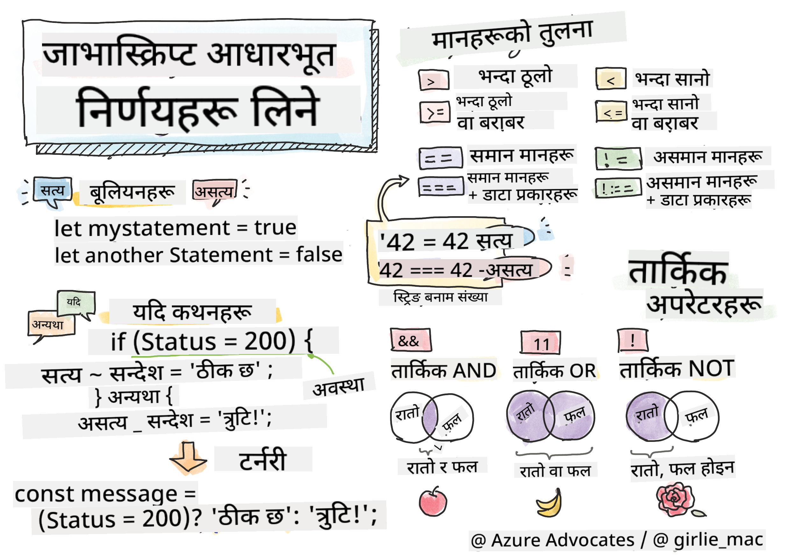

<!--
CO_OP_TRANSLATOR_METADATA:
{
  "original_hash": "90a3c32c3377f83ab750c2447c77ab98",
  "translation_date": "2025-10-22T16:41:44+00:00",
  "source_file": "2-js-basics/3-making-decisions/README.md",
  "language_code": "ne"
}
-->
# जाभास्क्रिप्ट आधारभूत: निर्णय लिनु



> स्केच नोट [टोमोमी इमुरा](https://twitter.com/girlie_mac) द्वारा

के तपाईंले कहिल्यै सोच्नुभएको छ कि एप्लिकेसनहरूले कसरी स्मार्ट निर्णय लिन्छन्? जस्तै, नेभिगेसन प्रणालीले छिटो मार्ग कसरी छान्छ, वा थर्मोस्टेटले तापक्रम कहिले चालु गर्ने निर्णय कसरी गर्छ? यो प्रोग्रामिङमा निर्णय लिने आधारभूत अवधारणा हो।

जस्तै चार्ल्स बेबेजको एनालिटिकल इन्जिन विभिन्न सर्तहरूमा आधारित अपरेशनको क्रम अनुसरण गर्न डिजाइन गरिएको थियो, आधुनिक जाभास्क्रिप्ट प्रोग्रामहरूले विभिन्न परिस्थितिमा आधारित निर्णय लिन आवश्यक छ। यो शाखा बनाउने र निर्णय लिने क्षमता स्थिर कोडलाई प्रतिक्रियाशील, बौद्धिक एप्लिकेसनमा रूपान्तरण गर्ने हो।

यस पाठमा, तपाईंले आफ्नो प्रोग्रामहरूमा सर्तात्मक तर्क कार्यान्वयन गर्ने तरिका सिक्नुहुनेछ। हामी सर्तात्मक कथनहरू, तुलना अपरेटरहरू, र तार्किक अभिव्यक्तिहरू अन्वेषण गर्नेछौं जसले तपाईंको कोडलाई परिस्थितिहरू मूल्याङ्कन गर्न र उपयुक्त रूपमा प्रतिक्रिया दिन अनुमति दिन्छ।

## प्रि-लेक्चर क्विज

[प्रि-लेक्चर क्विज](https://ff-quizzes.netlify.app/web/quiz/11)

निर्णय लिन र प्रोग्रामको प्रवाहलाई नियन्त्रण गर्ने क्षमता प्रोग्रामिङको एक आधारभूत पक्ष हो। यो खण्डले बूलियन मानहरू र सर्तात्मक तर्क प्रयोग गरेर तपाईंको जाभास्क्रिप्ट प्रोग्रामहरूको कार्यान्वयन मार्गलाई कसरी नियन्त्रण गर्ने भन्ने कुरा समेट्छ।

[](https://youtube.com/watch?v=SxTp8j-fMMY "निर्णय लिनु")

> 🎥 माथिको तस्बिरमा क्लिक गरेर निर्णय लिने बारेको भिडियो हेर्नुहोस्।

> तपाईं यो पाठ [Microsoft Learn](https://docs.microsoft.com/learn/modules/web-development-101-if-else/?WT.mc_id=academic-77807-sagibbon) मा लिन सक्नुहुन्छ!

## बूलियनको संक्षिप्त पुनरावलोकन

निर्णय लिने कुरा अन्वेषण गर्नु अघि, हाम्रो अघिल्लो पाठबाट बूलियन मानहरूलाई पुनरावलोकन गरौं। गणितज्ञ जर्ज बूलको नाममा राखिएको, यी मानहरूले द्विआधारी अवस्था प्रतिनिधित्व गर्छन् – या त `true` वा `false`। यहाँ कुनै अस्पष्टता छैन, कुनै बीचको अवस्था छैन।

यी द्विआधारी मानहरूले सबै कम्प्युटेशनल तर्कको आधार बनाउँछन्। तपाईंको प्रोग्रामले गर्ने प्रत्येक निर्णय अन्ततः बूलियन मूल्याङ्कनमा झर्छ।

बूलियन भेरिएबलहरू बनाउनु सरल छ:

```javascript
let myTrueBool = true;
let myFalseBool = false;
```

यसले स्पष्ट बूलियन मानहरू भएका दुई भेरिएबलहरू बनाउँछ।

✅ बूलियनहरू अंग्रेज गणितज्ञ, दार्शनिक र तर्कशास्त्री जर्ज बूल (1815–1864) को नाममा राखिएको हो।

## तुलना अपरेटरहरू र बूलियनहरू

व्यवहारमा, तपाईंले बूलियन मानहरू म्यानुअली सेट गर्न विरलै गर्नुहुन्छ। यसको सट्टा, तपाईंले सर्तहरू मूल्याङ्कन गरेर तिनीहरू उत्पन्न गर्नुहुन्छ: "के यो संख्या त्यो भन्दा ठूलो छ?" वा "के यी मानहरू बराबर छन्?"

तुलना अपरेटरहरूले यी मूल्याङ्कनहरू सक्षम बनाउँछन्। तिनीहरूले मानहरू तुलना गर्छन् र अपरेन्डहरू बीचको सम्बन्धको आधारमा बूलियन परिणामहरू फर्काउँछन्।

| प्रतीक | विवरण                                                                                                                                                   | उदाहरण            |
| ------ | ------------------------------------------------------------------------------------------------------------------------------------------------------------- | ------------------ |
| `<`    | **कम छ**: दुई मानहरू तुलना गर्छ र यदि बायाँ पक्षको मान दायाँ भन्दा कम छ भने `true` बूलियन डाटा प्रकार फर्काउँछ                              | `5 < 6 // true`    |
| `<=`   | **कम वा बराबर छ**: दुई मानहरू तुलना गर्छ र यदि बायाँ पक्षको मान दायाँ भन्दा कम वा बराबर छ भने `true` बूलियन डाटा प्रकार फर्काउँछ      | `5 <= 6 // true`   |
| `>`    | **ठूलो छ**: दुई मानहरू तुलना गर्छ र यदि बायाँ पक्षको मान दायाँ भन्दा ठूलो छ भने `true` बूलियन डाटा प्रकार फर्काउँछ                         | `5 > 6 // false`   |
| `>=`   | **ठूलो वा बराबर छ**: दुई मानहरू तुलना गर्छ र यदि बायाँ पक्षको मान दायाँ भन्दा ठूलो वा बराबर छ भने `true` बूलियन डाटा प्रकार फर्काउँछ | `5 >= 6 // false`  |
| `===`  | **कडा समानता**: दुई मानहरू तुलना गर्छ र यदि दायाँ र बायाँका मानहरू बराबर छन् र समान डाटा प्रकारका छन् भने `true` बूलियन डाटा प्रकार फर्काउँछ।       | `5 === 6 // false` |
| `!==`  | **असमानता**: दुई मानहरू तुलना गर्छ र कडा समानता अपरेटरले फर्काउने विपरीत बूलियन मान फर्काउँछ                                    | `5 !== 6 // true`  |

✅ आफ्नो ब्राउजरको कन्सोलमा केही तुलना लेखेर आफ्नो ज्ञान जाँच गर्नुहोस्। के कुनै फर्काइएको डाटाले तपाईंलाई अचम्मित बनायो?

## If Statement

`if` स्टेटमेन्ट तपाईंको कोडमा प्रश्न सोध्ने जस्तै हो। "यदि यो सर्त सत्य छ भने, यो काम गर।" यो जाभास्क्रिप्टमा निर्णय लिनको लागि तपाईंले प्रयोग गर्ने सबैभन्दा महत्त्वपूर्ण उपकरण हो।

यसले यसरी काम गर्छ:

```javascript
if (condition) {
  // Condition is true. Code in this block will run.
}
```

सर्त कोष्ठकभित्र जान्छ, र यदि यो `true` छ भने, जाभास्क्रिप्टले कर्ली ब्रेसेसभित्रको कोड चलाउँछ। यदि यो `false` छ भने, जाभास्क्रिप्टले त्यो सम्पूर्ण ब्लकलाई छोड्छ।

तपाईंले यी सर्तहरू बनाउन तुलना अपरेटरहरू प्राय: प्रयोग गर्नुहुनेछ। व्यावहारिक उदाहरण हेरौं:

```javascript
let currentMoney = 1000;
let laptopPrice = 800;

if (currentMoney >= laptopPrice) {
  // Condition is true. Code in this block will run.
  console.log("Getting a new laptop!");
}
```

किनभने `1000 >= 800` `true` मा मूल्याङ्कन हुन्छ, ब्लकभित्रको कोड कार्यान्वयन हुन्छ, कन्सोलमा "नयाँ ल्यापटप प्राप्त गर्दै!" देखाउँदै।

## If..Else Statement

तर यदि तपाईं आफ्नो प्रोग्रामले सर्त झुटो हुँदा केही फरक काम गर्न चाहनुहुन्छ भने के गर्ने? त्यहाँ `else` आउँछ – यो जस्तै छ कि ब्याकअप योजना छ।

`else` स्टेटमेन्टले तपाईंलाई "यदि यो सर्त सत्य छैन भने, यसको सट्टा यो अर्को काम गर।" भन्ने तरिका दिन्छ।

```javascript
let currentMoney = 500;
let laptopPrice = 800;

if (currentMoney >= laptopPrice) {
  // Condition is true. Code in this block will run.
  console.log("Getting a new laptop!");
} else {
  // Condition is false. Code in this block will run.
  console.log("Can't afford a new laptop, yet!");
}
```

अब किनभने `500 >= 800` `false` छ, जाभास्क्रिप्टले पहिलो ब्लकलाई छोड्छ र `else` ब्लक चलाउँछ। तपाईं कन्सोलमा "अहिलेसम्म नयाँ ल्यापटप किन्न सक्दिन!" देख्नुहुनेछ।

✅ यो कोड र तलको कोडलाई ब्राउजर कन्सोलमा चलाएर आफ्नो बुझाइ जाँच गर्नुहोस्। `currentMoney` र `laptopPrice` भेरिएबलहरूको मान परिवर्तन गरेर फर्काइएको `console.log()` परिवर्तन गर्नुहोस्।

## Switch Statement

कहिलेकाहीं तपाईंले एक मानलाई धेरै विकल्पहरूसँग तुलना गर्न आवश्यक छ। जबकि तपाईंले धेरै `if..else` स्टेटमेन्टहरू चेन गर्न सक्नुहुन्छ, यो दृष्टिकोण असुविधाजनक हुन्छ। `switch` स्टेटमेन्टले धेरै छुट्टै मानहरूलाई ह्यान्डल गर्न सफा संरचना प्रदान गर्दछ।

यो अवधारणा प्रारम्भिक टेलिफोन एक्सचेन्जहरूमा प्रयोग गरिएका मेकानिकल स्विचिङ प्रणालीसँग मिल्दोजुल्दो छ – एक इनपुट मानले कार्यान्वयनले कुन विशिष्ट मार्ग अनुसरण गर्ने निर्धारण गर्छ।

```javascript
switch (expression) {
  case x:
    // code block
    break;
  case y:
    // code block
    break;
  default:
    // code block
}
```

यसको संरचना यसरी छ:
- जाभास्क्रिप्टले अभिव्यक्तिलाई एकपटक मूल्याङ्कन गर्छ
- प्रत्येक `case` मा मिलान खोज्छ
- मिलान भेट्दा, त्यो कोड ब्लक चलाउँछ
- `break` ले जाभास्क्रिप्टलाई रोक्न र स्विचबाट बाहिर जान भन्छ
- कुनै केसहरू मिल्दैन भने, यो `default` ब्लक चलाउँछ (यदि तपाईंले राख्नुभएको छ भने)

```javascript
// Program using switch statement for day of week
let dayNumber = 2;
let dayName;

switch (dayNumber) {
  case 1:
    dayName = "Monday";
    break;
  case 2:
    dayName = "Tuesday";
    break;
  case 3:
    dayName = "Wednesday";
    break;
  default:
    dayName = "Unknown day";
    break;
}
console.log(`Today is ${dayName}`);
```

यस उदाहरणमा, जाभास्क्रिप्टले देख्छ कि `dayNumber` `2` हो, मिल्दो `case 2` भेट्छ, `dayName` लाई "Tuesday" मा सेट गर्छ, र त्यसपछि स्विचबाट बाहिर जान्छ। परिणाम? "आज Tuesday हो" कन्सोलमा देखिन्छ।

✅ यो कोड र तलको कोडलाई ब्राउजर कन्सोलमा चलाएर आफ्नो बुझाइ जाँच गर्नुहोस्। भेरिएबल `a` को मान परिवर्तन गरेर फर्काइएको `console.log()` परिवर्तन गर्नुहोस्।

## तार्किक अपरेटरहरू र बूलियनहरू

जटिल निर्णयहरूले प्राय: एकै समयमा धेरै सर्तहरू मूल्याङ्कन गर्न आवश्यक हुन्छ। जस्तै बूलियन एल्जेब्राले गणितज्ञहरूलाई तार्किक अभिव्यक्तिहरू जोड्न अनुमति दिन्छ, प्रोग्रामिङले धेरै बूलियन सर्तहरू जोड्न तार्किक अपरेटरहरू प्रदान गर्दछ।

यी अपरेटरहरूले सरल सत्य/झुटो मूल्याङ्कनहरू जोडेर परिष्कृत सर्तात्मक तर्क सक्षम बनाउँछन्।

| प्रतीक | विवरण                                                                                     | उदाहरण                                                                 |
| ------ | ----------------------------------------------------------------------------------------------- | ----------------------------------------------------------------------- |
| `&&`   | **तार्किक AND**: दुई बूलियन अभिव्यक्तिहरू तुलना गर्छ। दुवै पक्ष सत्य भए मात्र `true` फर्काउँछ | `(5 > 3) && (5 < 10) // दुवै पक्ष सत्य छन्। `true` फर्काउँछ` |
| `\|\|` | **तार्किक OR**: दुई बूलियन अभिव्यक्तिहरू तुलना गर्छ। कम्तीमा एक पक्ष सत्य भए `true` फर्काउँछ     | `(5 > 10) \|\| (5 < 10) // एक पक्ष झुटो छ, अर्को सत्य छ। `true` फर्काउँछ` |
| `!`    | **तार्किक NOT**: बूलियन अभिव्यक्तिको विपरीत मान फर्काउँछ                             | `!(5 > 10) // 5 10 भन्दा ठूलो छैन, त्यसैले "!" यसलाई सत्य बनाउँछ`         |

यी अपरेटरहरूले उपयोगी तरिकामा सर्तहरू जोड्न अनुमति दिन्छ:
- AND (`&&`) को मतलब दुवै सर्त सत्य हुनुपर्छ
- OR (`||`) को मतलब कम्तीमा एक सर्त सत्य हुनुपर्छ  
- NOT (`!`) सत्यलाई झुटोमा (र विपरीत) बदल्छ

## तार्किक अपरेटरहरूसँग सर्तहरू र निर्णयहरू

यी तार्किक अपरेटरहरूलाई यथार्थपरक उदाहरणसँग प्रयोग गरौं:

```javascript
let currentMoney = 600;
let laptopPrice = 800;
let laptopDiscountPrice = laptopPrice - (laptopPrice * 0.2); // Laptop price at 20 percent off

if (currentMoney >= laptopPrice || currentMoney >= laptopDiscountPrice) {
  // Condition is true. Code in this block will run.
  console.log("Getting a new laptop!");
} else {
  // Condition is false. Code in this block will run.
  console.log("Can't afford a new laptop, yet!");
}
```

यस उदाहरणमा: हामी २०% छुट मूल्य (६४०) गणना गर्छौं, त्यसपछि मूल्याङ्कन गर्छौं कि हाम्रो उपलब्ध रकमले पूर्ण मूल्य वा छुट मूल्य कभर गर्छ। किनभने ६०० छुट मूल्यको थ्रेसहोल्ड ६४० पूरा गर्छ, सर्त `true` मा मूल्याङ्कन हुन्छ।

### नेगेसन अपरेटर

कहिलेकाहीं केहि सत्य छैन भन्ने कुरा सोध्नु सजिलो हुन्छ। जस्तै "प्रयोगकर्ता लगइन भएको छ?" सोध्नुको सट्टा, तपाईं "प्रयोगकर्ता लगइन भएको छैन?" सोध्न चाहनुहुन्छ। विस्मयादिबोधक चिन्ह (`!`) अपरेटरले तपाईंको लागि तर्क उल्टाउँछ।

```javascript
if (!condition) {
  // runs if condition is false
} else {
  // runs if condition is true
}
```

`!` अपरेटर "विपरीत..." भन्ने जस्तै हो – यदि केहि `true` छ भने, `!` यसलाई `false` बनाउँछ, र विपरीत।

### टर्नरी अभिव्यक्तिहरू

सरल सर्तात्मक असाइनमेन्टहरूको लागि, जाभास्क्रिप्टले **टर्नरी अपरेटर** प्रदान गर्दछ। यो संक्षिप्त वाक्यविन्यासले तपाईंलाई एकल लाइनमा सर्तात्मक अभिव्यक्ति लेख्न अनुमति दिन्छ, जब तपाईंलाई सर्तको आधारमा दुई मानहरू मध्ये एक असाइन गर्न आवश्यक हुन्छ।

```javascript
let variable = condition ? returnThisIfTrue : returnThisIfFalse;
```

यो प्रश्न जस्तै पढिन्छ: "के यो सर्त सत्य छ? यदि हो भने, यो मान प्रयोग गर। यदि होइन भने, त्यो मान प्रयोग गर।"

तल एक थप ठोस उदाहरण छ:

```javascript
let firstNumber = 20;
let secondNumber = 10;
let biggestNumber = firstNumber > secondNumber ? firstNumber : secondNumber;
```

✅ यो कोडलाई केही पटक पढ्न समय लिनुहोस्। के तपाईं यी अपरेटरहरू कसरी काम गरिरहेका छन् भन्ने कुरा बुझ्नुभएको छ?

यो लाइनले के भन्छ: "के `firstNumber` `secondNumber` भन्दा ठूलो छ? यदि हो भने, `firstNumber` लाई `biggestNumber` मा राख। यदि होइन भने, `secondNumber` लाई `biggestNumber` मा राख।"

टर्नरी अपरेटरले यो पारम्परिक `if..else` स्टेटमेन्ट लेख्ने छोटो तरिका मात्र हो:

```javascript
let biggestNumber;
if (firstNumber > secondNumber) {
  biggestNumber = firstNumber;
} else {
  biggestNumber = secondNumber;
}
```

दुवै दृष्टिकोणले समान परिणाम उत्पादन गर्छ। टर्नरी अपरेटरले संक्षिप्तता प्रदान गर्छ, जबकि पारम्परिक if-else संरचना जटिल सर्तहरूको लागि बढी पढ्न योग्य हुन सक्छ।

---

## 🚀 चुनौती

पहिले तार्किक अपरेटरहरूसँग लेखिएको प्रोग्राम बनाउनुहोस्, र त्यसपछि टर्नरी अभिव्यक्तिको प्रयोग गरेर यसलाई पुनःलेख्नुहोस्। तपाईंको मनपर्ने वाक्यविन्यास कुन हो?

---

## GitHub Copilot Agent चुनौती 🚀

Agent मोड प्रयोग गरेर तलको चुनौती पूरा गर्नुहोस्:

**विवरण:** यस पाठबाट धेरै निर्णय लिने अवधारणाहरू प्रदर्शन गर्ने व्यापक ग्रेड क्यालकुलेटर बनाउनुहोस्, जसमा if-else स्टेटमेन्टहरू, switch स्टेटमेन्टहरू, तार्किक अपरेटरहरू, र टर्नरी अभिव्यक्तिहरू समावेश छन्।

**प्रेरणा:** जाभास्क्रिप्ट प्रोग्राम लेख्नुहोस् जसले विद्यार्थीको संख्यात्मक स्कोर (०-१००) लिन्छ र निम्न मापदण्ड प्रयोग गरेर तिनीहरूको अक्षर ग्रेड निर्धारण गर्छ:
- A: 90-100
- B: 80-89  
- C: 70-79
- D: 60-69
- F: 60 भन्दा तल

आवश्यकताहरू:
1. अक्षर ग्रेड निर्धारण गर्न if-else स्टेटमेन्ट प्रयोग गर्नुहोस्
2. विद्यार्थी पास भएको (ग्रेड >= 60) र सम्मानित (ग्रेड >= 90) छ कि छैन जाँच गर्न तार्किक अपरेटरहरू प्रयोग गर्नुहोस्
3. प्रत्येक अक्षर ग्रेडको लागि विशिष्ट प्रतिक्रिया प्रदान गर्न switch स्टेटमेन्ट प्रयोग गर्नुहोस्
4. विद्यार्थी अर्को पाठ्यक्रमको लागि योग्य छ कि छैन (ग्रेड >= 70) निर्धारण गर्न टर्नरी अपरेटर प्रयोग गर्नुहोस्
5. स्कोर ० देखि १०० बीचमा छ भन्ने कुरा सुनिश्चित गर्न इनपुट मान्यता समावेश गर्नुहोस्

स्कोरहरू सहित विभिन्न परीक्षणहरू गर्नुहोस्, जस्तै ५९, ६०, ८९, ९०, र अमान्य इनपुटहरू।

[Agent मोड](https://code.visualstudio.com/blogs/2025/02/24/introducing-copilot-agent-mode) बारे थप जान्नुहोस्।

## पोस्ट-लेक्चर क्विज

[पोस्ट-लेक्चर क्विज](https://ff-quizzes.netlify.app/web/quiz/12)

## समीक्षा र आत्म अध्ययन

प्रयोगकर्तालाई उपलब्ध धेरै अपरेटरहरूको बारेमा [MDN](https://developer.mozilla.org/docs/Web/JavaScript/Reference/Operators) मा पढ्नुहोस्।

जोश कमाउको अद्भुत [अपरेटर लुकअप](https://joshwcomeau.com/operator-lookup/) हेर्नुहोस्!

## असाइनमेन्ट

[अपरेटरहरू](assignment.md)

---

**अस्वीकरण**:  
यो दस्तावेज़ AI अनुवाद सेवा [Co-op Translator](https://github.com/Azure/co-op-translator) प्रयोग गरेर अनुवाद गरिएको छ। हामी शुद्धताको लागि प्रयास गर्छौं, तर कृपया ध्यान दिनुहोस् कि स्वचालित अनुवादहरूमा त्रुटिहरू वा अशुद्धताहरू हुन सक्छ। यसको मूल भाषा मा रहेको दस्तावेज़लाई आधिकारिक स्रोत मानिनुपर्छ। महत्वपूर्ण जानकारीको लागि, व्यावसायिक मानव अनुवाद सिफारिस गरिन्छ। यस अनुवादको प्रयोगबाट उत्पन्न हुने कुनै पनि गलतफहमी वा गलत व्याख्याको लागि हामी जिम्मेवार हुने छैनौं।