<!--
CO_OP_TRANSLATOR_METADATA:
{
  "original_hash": "c688385d15dd3645e924ea0ffee8967f",
  "translation_date": "2025-11-03T15:14:28+00:00",
  "source_file": "2-js-basics/3-making-decisions/README.md",
  "language_code": "ne"
}
-->
# जाभास्क्रिप्ट आधारभूत: निर्णय लिनु


> स्केच नोट [Tomomi Imura](https://twitter.com/girlie_mac) द्वारा

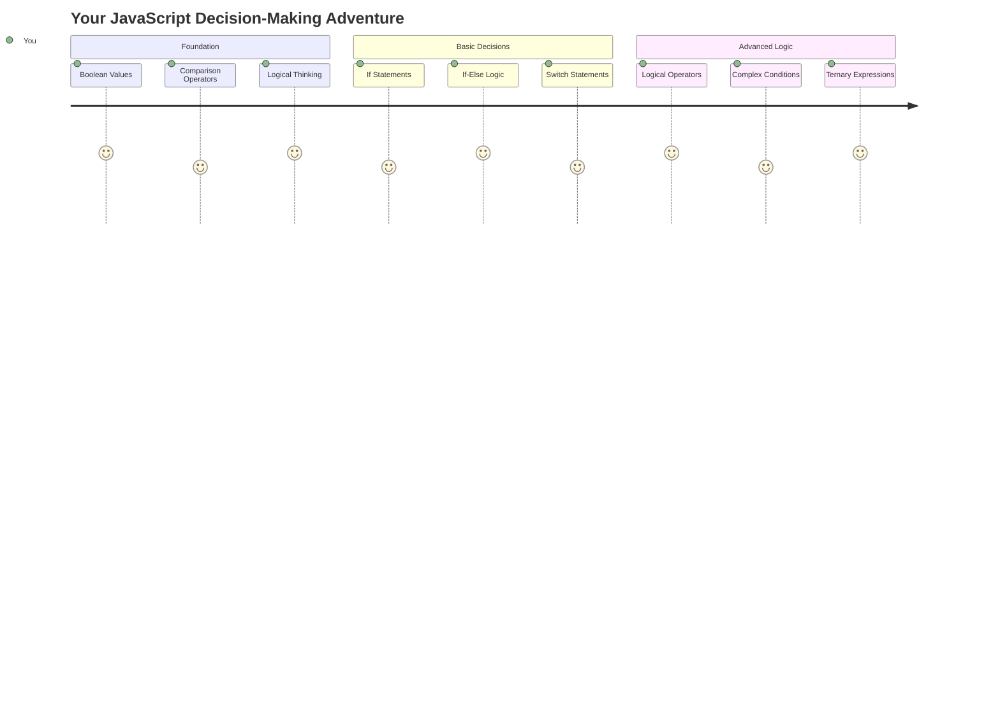

के तपाईंले कहिल्यै सोच्नुभएको छ कि एप्लिकेसनहरूले कसरी स्मार्ट निर्णय लिन्छन्? जस्तै, नेभिगेसन प्रणालीले छिटो मार्ग कसरी चयन गर्छ, वा थर्मोस्टेटले तापक्रम कहिले चालु गर्ने निर्णय कसरी गर्छ? यो प्रोग्रामिङमा निर्णय लिने आधारभूत अवधारणा हो।

जस्तै चार्ल्स बबेजको एनालिटिकल इन्जिन विभिन्न सर्तहरूमा आधारित अपरेशनहरूको क्रम अनुसरण गर्न डिजाइन गरिएको थियो, आधुनिक जाभास्क्रिप्ट प्रोग्रामहरूले विभिन्न परिस्थितिमा आधारित निर्णय लिन आवश्यक छ। यो शाखा बनाउने र निर्णय लिने क्षमता स्थिर कोडलाई प्रतिक्रियाशील, बौद्धिक एप्लिकेसनमा रूपान्तरण गर्ने हो।

यस पाठमा, तपाईंले आफ्नो प्रोग्रामहरूमा सर्तात्मक तर्क कार्यान्वयन गर्न सिक्नुहुनेछ। हामी सर्तात्मक कथनहरू, तुलना अपरेटरहरू, र तार्किक अभिव्यक्तिहरू अन्वेषण गर्नेछौं जसले तपाईंको कोडलाई परिस्थितिहरू मूल्याङ्कन गर्न र उपयुक्त रूपमा प्रतिक्रिया दिन अनुमति दिन्छ।

## प्रि-लेक्चर क्विज

[प्रि-लेक्चर क्विज](https://ff-quizzes.netlify.app/web/quiz/11)

निर्णय लिनु र प्रोग्रामको प्रवाह नियन्त्रण गर्नु प्रोग्रामिङको आधारभूत पक्ष हो। यो खण्डले तपाईंको जाभास्क्रिप्ट प्रोग्रामहरूको कार्यान्वयन मार्गलाई बूलियन मानहरू र सर्तात्मक तर्क प्रयोग गरेर कसरी नियन्त्रण गर्ने भन्ने कुरा समेट्छ।

[](https://youtube.com/watch?v=SxTp8j-fMMY "निर्णय लिनु")

> 🎥 माथिको तस्बिरमा क्लिक गर्नुहोस् निर्णय लिने बारेको भिडियोका लागि।

> तपाईं यो पाठ [Microsoft Learn](https://docs.microsoft.com/learn/modules/web-development-101-if-else/?WT.mc_id=academic-77807-sagibbon) मा लिन सक्नुहुन्छ!

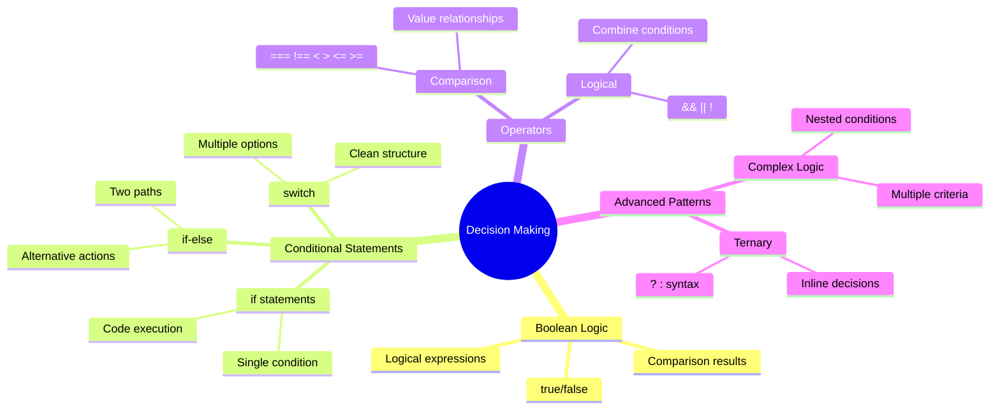

## बूलियनको संक्षिप्त पुनरावलोकन

निर्णय लिने कुरा अन्वेषण गर्नु अघि, हाम्रो अघिल्लो पाठबाट बूलियन मानहरूलाई पुनरावलोकन गरौं। गणितज्ञ जर्ज बूलको नाममा राखिएको, यी मानहरूले द्विआधारी अवस्था प्रतिनिधित्व गर्छन् – `true` वा `false`। कुनै अस्पष्टता छैन, कुनै बीचको अवस्था छैन।

यी द्विआधारी मानहरूले सबै कम्प्युटेशनल तर्कको आधार बनाउँछन्। तपाईंको प्रोग्रामले गर्ने प्रत्येक निर्णय अन्ततः बूलियन मूल्याङ्कनमा घट्छ।

बूलियन भेरिएबलहरू सिर्जना गर्नु सरल छ:

```javascript
let myTrueBool = true;
let myFalseBool = false;
```

यसले स्पष्ट बूलियन मानहरू भएका दुई भेरिएबलहरू सिर्जना गर्छ।

✅ बूलियनहरू अंग्रेजी गणितज्ञ, दार्शनिक र तर्कशास्त्री जर्ज बूल (1815–1864) को नाममा राखिएको हो।

## तुलना अपरेटरहरू र बूलियनहरू

व्यवहारमा, तपाईंले बूलियन मानहरू म्यानुअल रूपमा सेट गर्न विरलै गर्नुहुन्छ। यसको सट्टा, तपाईंले सर्तहरू मूल्याङ्कन गरेर तिनीहरूलाई उत्पन्न गर्नुहुन्छ: "के यो संख्या त्यो भन्दा ठूलो छ?" वा "के यी मानहरू बराबर छन्?"

तुलना अपरेटरहरूले यी मूल्याङ्कनहरू सक्षम बनाउँछन्। तिनीहरूले मानहरू तुलना गर्छन् र अपरेन्डहरू बीचको सम्बन्धको आधारमा बूलियन परिणामहरू फर्काउँछन्।

| प्रतीक | विवरण                                                                                                                                                   | उदाहरण            |
| ------ | ------------------------------------------------------------------------------------------------------------------------------------------------------------- | ------------------ |
| `<`    | **कम भन्दा**: दुई मानहरू तुलना गर्छ र यदि बायाँ पक्षको मान दायाँ भन्दा कम छ भने `true` बूलियन डाटा प्रकार फर्काउँछ                              | `5 < 6 // true`    |
| `<=`   | **कम वा बराबर**: दुई मानहरू तुलना गर्छ र यदि बायाँ पक्षको मान दायाँ भन्दा कम वा बराबर छ भने `true` बूलियन डाटा प्रकार फर्काउँछ      | `5 <= 6 // true`   |
| `>`    | **ठूलो भन्दा**: दुई मानहरू तुलना गर्छ र यदि बायाँ पक्षको मान दायाँ भन्दा ठूलो छ भने `true` बूलियन डाटा प्रकार फर्काउँछ                         | `5 > 6 // false`   |
| `>=`   | **ठूलो वा बराबर**: दुई मानहरू तुलना गर्छ र यदि बायाँ पक्षको मान दायाँ भन्दा ठूलो वा बराबर छ भने `true` बूलियन डाटा प्रकार फर्काउँछ | `5 >= 6 // false`  |
| `===`  | **सख्त समानता**: दुई मानहरू तुलना गर्छ र यदि दायाँ र बायाँका मानहरू समान छन् र समान डाटा प्रकारका छन् भने `true` बूलियन डाटा प्रकार फर्काउँछ।       | `5 === 6 // false` |
| `!==`  | **असमानता**: दुई मानहरू तुलना गर्छ र सख्त समानता अपरेटरले फर्काउने विपरीत बूलियन मान फर्काउँछ                                    | `5 !== 6 // true`  |

✅ आफ्नो ज्ञान जाँच गर्न ब्राउजरको कन्सोलमा केही तुलना लेख्नुहोस्। के कुनै फर्काइएको डाटाले तपाईंलाई अचम्मित बनाउँछ?

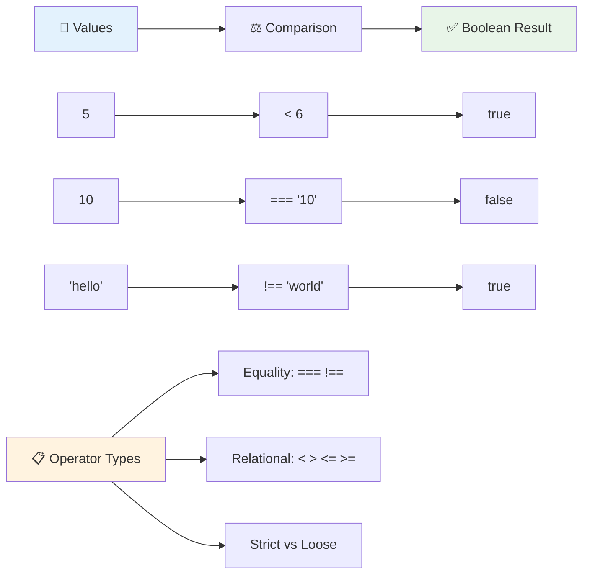

### 🧠 **तुलना तर्कको महारत जाँच: बूलियन तर्क बुझ्न**

**तपाईंको तुलना बुझाइ जाँच गर्नुहोस्:**
- किन `===` (सख्त समानता) सामान्यतया `==` (ढिलो समानता) भन्दा बढी प्राथमिकता दिइन्छ?
- के तपाईं अनुमान गर्न सक्नुहुन्छ `5 === '5'` के फर्काउँछ? `5 == '5'` के हुन्छ?
- `!==` र `!=` बीचको फरक के हो?

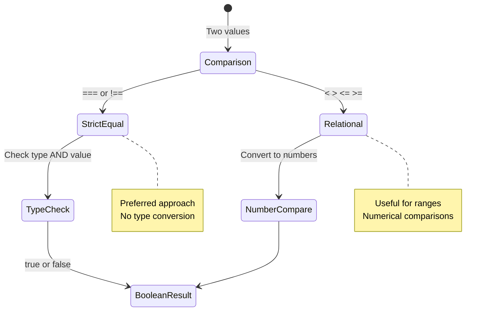

> **प्रो टिप**: समानता जाँचका लागि सधैं `===` र `!==` प्रयोग गर्नुहोस् जबसम्म तपाईंलाई विशेष रूपमा प्रकार रूपान्तरण आवश्यक छैन। यसले अप्रत्याशित व्यवहार रोक्छ!

## If Statement

`if` कथन तपाईंको कोडमा प्रश्न सोध्ने जस्तै हो। "यदि यो सर्त सत्य हो भने, यो काम गर।" यो सम्भवतः जाभास्क्रिप्टमा निर्णय लिनको लागि तपाईंले प्रयोग गर्ने सबैभन्दा महत्त्वपूर्ण उपकरण हो।

यसले कसरी काम गर्छ:

```javascript
if (condition) {
  // Condition is true. Code in this block will run.
}
```

सर्त कोष्ठकभित्र जान्छ, र यदि यो `true` हो भने, जाभास्क्रिप्टले कर्ली ब्रेसेसभित्रको कोड चलाउँछ। यदि यो `false` हो भने, जाभास्क्रिप्टले त्यो सम्पूर्ण ब्लकलाई छोड्छ।

तपाईंले यी सर्तहरू सिर्जना गर्न अक्सर तुलना अपरेटरहरू प्रयोग गर्नुहुनेछ। व्यावहारिक उदाहरण हेरौं:

```javascript
let currentMoney = 1000;
let laptopPrice = 800;

if (currentMoney >= laptopPrice) {
  // Condition is true. Code in this block will run.
  console.log("Getting a new laptop!");
}
```

किनभने `1000 >= 800` `true` मा मूल्याङ्कन हुन्छ, ब्लकभित्रको कोड कार्यान्वयन हुन्छ, कन्सोलमा "नयाँ ल्यापटप प्राप्त गर्दैछु!" देखाउँछ।

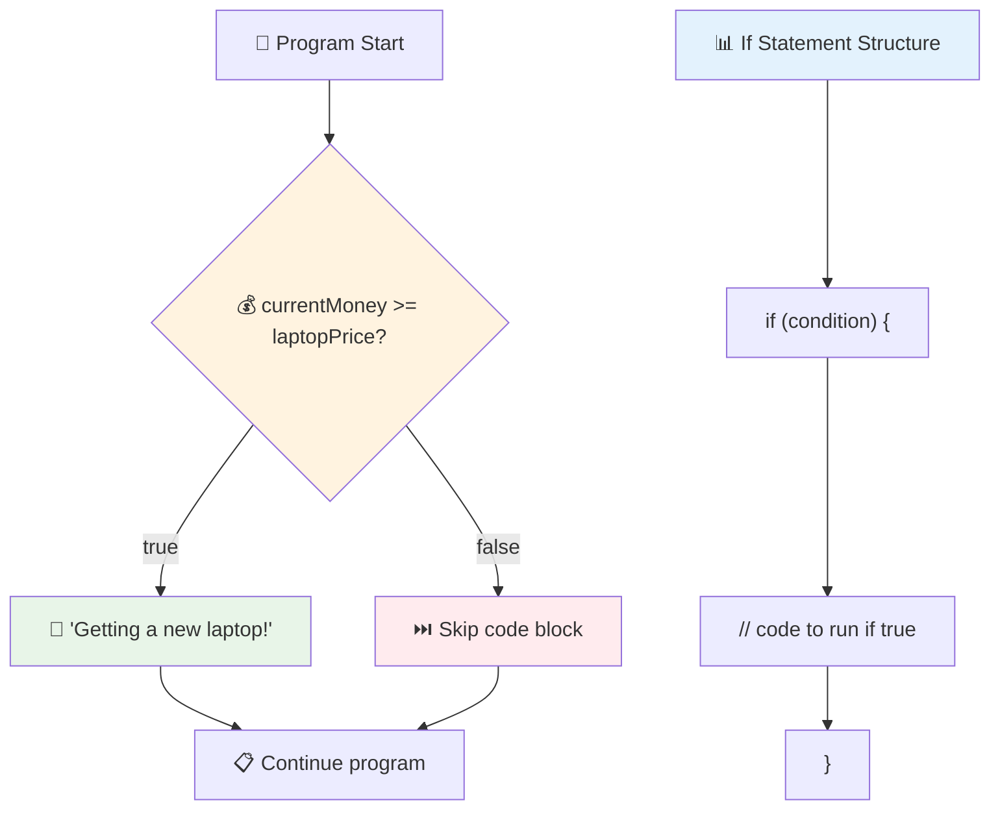

## If..Else Statement

तर यदि तपाईं चाहनुहुन्छ कि तपाईंको प्रोग्रामले सर्त गलत हुँदा केही फरक काम गरोस् भने के गर्ने? त्यहाँ `else` आउँछ – यो जस्तै हो कि "यदि यो सर्त सत्य छैन भने, यसको सट्टा यो अर्को काम गर।"

`else` कथनले तपाईंलाई भन्नको लागि एक तरिका दिन्छ "यदि यो सर्त सत्य छैन भने, यसको सट्टा यो अर्को काम गर।"

```javascript
let currentMoney = 500;
let laptopPrice = 800;

if (currentMoney >= laptopPrice) {
  // Condition is true. Code in this block will run.
  console.log("Getting a new laptop!");
} else {
  // Condition is false. Code in this block will run.
  console.log("Can't afford a new laptop, yet!");
}
```

अब किनभने `500 >= 800` `false` हो, जाभास्क्रिप्टले पहिलो ब्लकलाई छोड्छ र `else` ब्लक चलाउँछ। तपाईं कन्सोलमा "अहिलेसम्म नयाँ ल्यापटप किन्न सक्दिन!" देख्नुहुनेछ।

✅ ब्राउजर कन्सोलमा यो कोड र तलको कोड चलाएर आफ्नो बुझाइ जाँच गर्नुहोस्। `currentMoney` र `laptopPrice` भेरिएबलहरूको मान परिवर्तन गरेर फर्काइएको `console.log()` परिवर्तन गर्नुहोस्।

### 🎯 **If-Else तर्क जाँच: शाखा मार्गहरू**

**तपाईंको सर्तात्मक तर्क बुझाइ मूल्याङ्कन गर्नुहोस्:**
- के हुन्छ यदि `currentMoney` ठीक `laptopPrice` बराबर छ भने?
- के तपाईं वास्तविक जीवनको परिदृश्य सोच्न सक्नुहुन्छ जहाँ if-else तर्क उपयोगी हुनेछ?
- तपाईं यसलाई कसरी विस्तार गर्न सक्नुहुन्छ धेरै मूल्य दायराहरू सम्हाल्न?

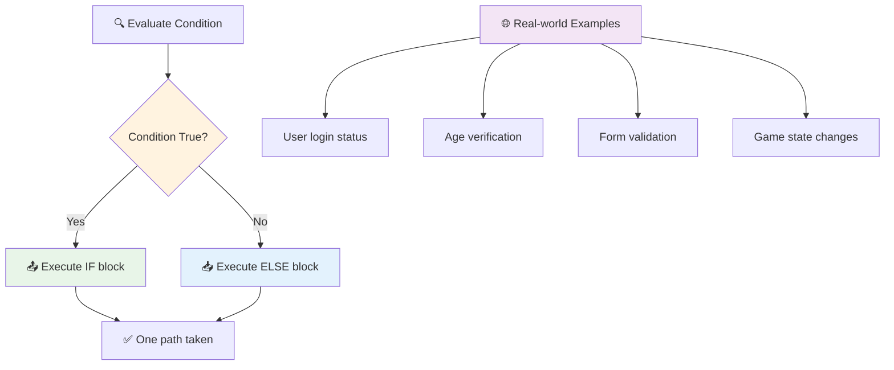

> **महत्त्वपूर्ण जानकारी**: If-else ले ठीक एक मार्ग लिन्छ। यसले तपाईंको प्रोग्रामले कुनै पनि सर्तमा सधैं प्रतिक्रिया सुनिश्चित गर्दछ!

## Switch Statement

कहिलेकाहीं तपाईंले एक मानलाई धेरै विकल्पहरूसँग तुलना गर्न आवश्यक पर्न सक्छ। जबकि तपाईंले धेरै `if..else` कथनहरू श्रृंखला बनाउन सक्नुहुन्छ, यो दृष्टिकोण असुविधाजनक हुन्छ। `switch` कथनले धेरै छुट्टै मानहरू सम्हाल्न सफा संरचना प्रदान गर्दछ।

यो अवधारणा प्रारम्भिक टेलिफोन एक्सचेन्जहरूमा प्रयोग गरिएका मेकानिकल स्विचिङ प्रणालीसँग मिल्दोजुल्दो छ – एक इनपुट मानले कार्यान्वयनले कुन विशिष्ट मार्ग अनुसरण गर्ने निर्धारण गर्छ।

```javascript
switch (expression) {
  case x:
    // code block
    break;
  case y:
    // code block
    break;
  default:
    // code block
}
```

यसको संरचना यस प्रकार छ:
- जाभास्क्रिप्टले अभिव्यक्तिलाई एकपटक मूल्याङ्कन गर्छ
- यसले प्रत्येक `case` हेर्छ र मिल्दो खोज्छ
- जब यसले मिल्दो भेट्छ, यसले त्यो कोड ब्लक चलाउँछ
- `break` ले जाभास्क्रिप्टलाई रोक्न र switch बाट बाहिर जान भन्छ
- यदि कुनै केसहरू मिल्दैनन् भने, यसले `default` ब्लक चलाउँछ (यदि तपाईंसँग छ भने)

```javascript
// Program using switch statement for day of week
let dayNumber = 2;
let dayName;

switch (dayNumber) {
  case 1:
    dayName = "Monday";
    break;
  case 2:
    dayName = "Tuesday";
    break;
  case 3:
    dayName = "Wednesday";
    break;
  default:
    dayName = "Unknown day";
    break;
}
console.log(`Today is ${dayName}`);
```

यस उदाहरणमा, जाभास्क्रिप्टले देख्छ कि `dayNumber` `2` हो, मिल्दो `case 2` भेट्छ, `dayName` लाई "Tuesday" मा सेट गर्छ, र त्यसपछि switch बाट बाहिर निस्कन्छ। परिणाम? "आज मंगलवार हो" कन्सोलमा देखिन्छ।

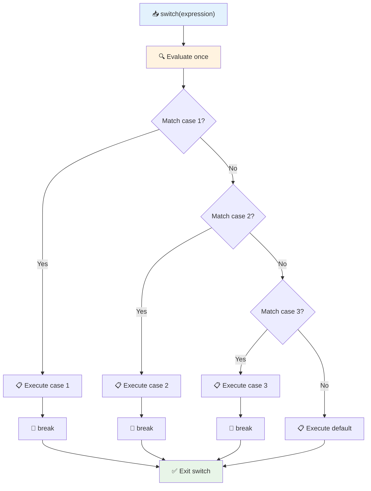

✅ आफ्नो बुझाइ जाँच गर्न ब्राउजरको कन्सोलमा यो कोड र तलको कोड चलाउनुहोस्। भेरिएबल `a` को मान परिवर्तन गरेर फर्काइएको `console.log()` परिवर्तन गर्नुहोस्।

### 🔄 **Switch Statement महारत: धेरै विकल्पहरू**

**तपाईंको switch बुझाइ जाँच गर्नुहोस्:**
- के हुन्छ यदि तपाईंले `break` कथन बिर्सनुभयो भने?
- तपाईंले कहिले `switch` प्रयोग गर्नुहुन्छ धेरै `if-else` कथनहरूको सट्टा?
- किन `default` केस उपयोगी छ, तपाईंले सबै सम्भावनाहरू समेटेको सोच्दा पनि?

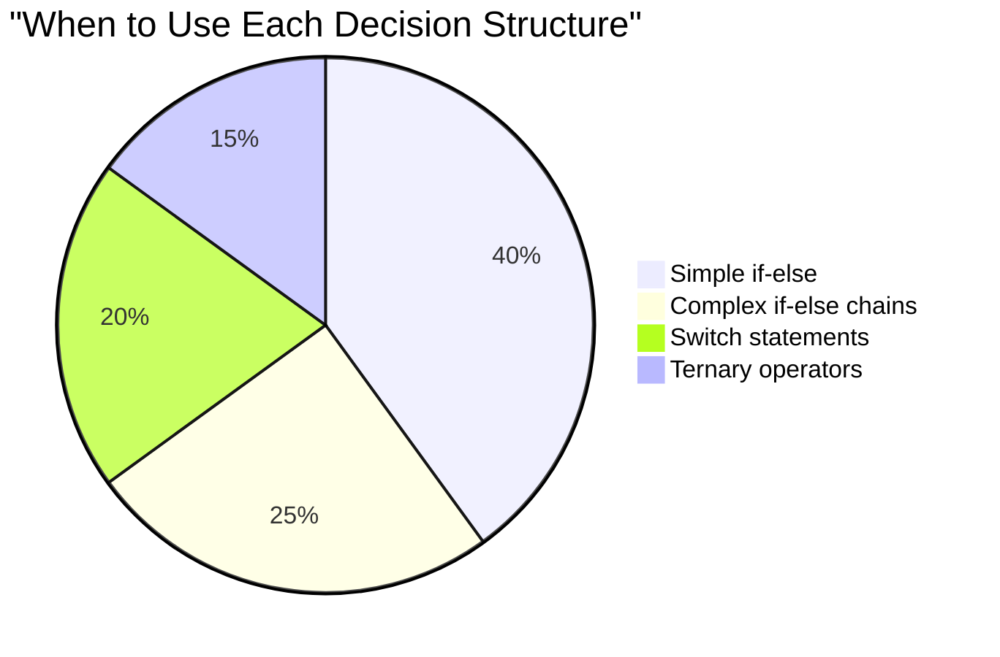

> **सर्वोत्तम अभ्यास**: एक भेरिएबललाई धेरै विशिष्ट मानहरूसँग तुलना गर्दा `switch` प्रयोग गर्नुहोस्। दायरा जाँच वा जटिल सर्तहरूको लागि `if-else` प्रयोग गर्नुहोस्!

## तार्किक अपरेटरहरू र बूलियनहरू

जटिल निर्णयहरूले प्रायः एकै समयमा धेरै सर्तहरू मूल्याङ्कन गर्न आवश्यक हुन्छ। जस्तै बूलियन बीजगणितले गणितज्ञहरूलाई तार्किक अभिव्यक्तिहरू संयोजन गर्न अनुमति दिन्छ, प्रोग्रामिङले धेरै बूलियन सर्तहरू जोड्न तार्किक अपरेटरहरू प्रदान गर्दछ।

यी अपरेटरहरूले सरल सत्य/झुटो मूल्याङ्कनहरू संयोजन गरेर परिष्कृत सर्तात्मक तर्क सक्षम बनाउँछन्।

| प्रतीक | विवरण                                                                                     | उदाहरण                                                                 |
| ------ | ----------------------------------------------------------------------------------------------- | ----------------------------------------------------------------------- |
| `&&`   | **तार्किक AND**: दुई बूलियन अभिव्यक्तिहरू तुलना गर्छ। दुवै पक्ष सत्य भए मात्र सत्य फर्काउँछ | `(5 > 3) && (5 < 10) // दुवै पक्ष सत्य छन्। सत्य फर्काउँछ` |
| `\|\|` | **तार्किक OR**: दुई बूलियन अभिव्यक्तिहरू तुलना गर्छ। कम्तीमा एक पक्ष सत्य भए सत्य फर्काउँछ     | `(5 > 10) \|\| (5 < 10) // एक पक्ष झुटो छ, अर्को सत्य छ। सत्य फर्काउँछ` |
| `!`    | **तार्किक NOT**: बूलियन अभिव्यक्तिको विपरीत मान फर्काउँछ                             | `!(5 > 10) // 5 10 भन्दा ठूलो छैन, त्यसैले "!" यसलाई सत्य बनाउँछ`         |

यी अपरेटरहरूले सर्तहरू उपयोगी तरिकामा संयोजन गर्न अनुमति दिन्छ:
- AND (`&&`) को अर्थ दुवै सर्तहरू सत्य हुनुपर्छ
- OR (`||`) को अर्थ कम्तीमा एक सर्त सत्य हुनुपर्छ  
- NOT (`!`) सत्यलाई झुटोमा (र विपरीत) परिवर्तन गर्छ

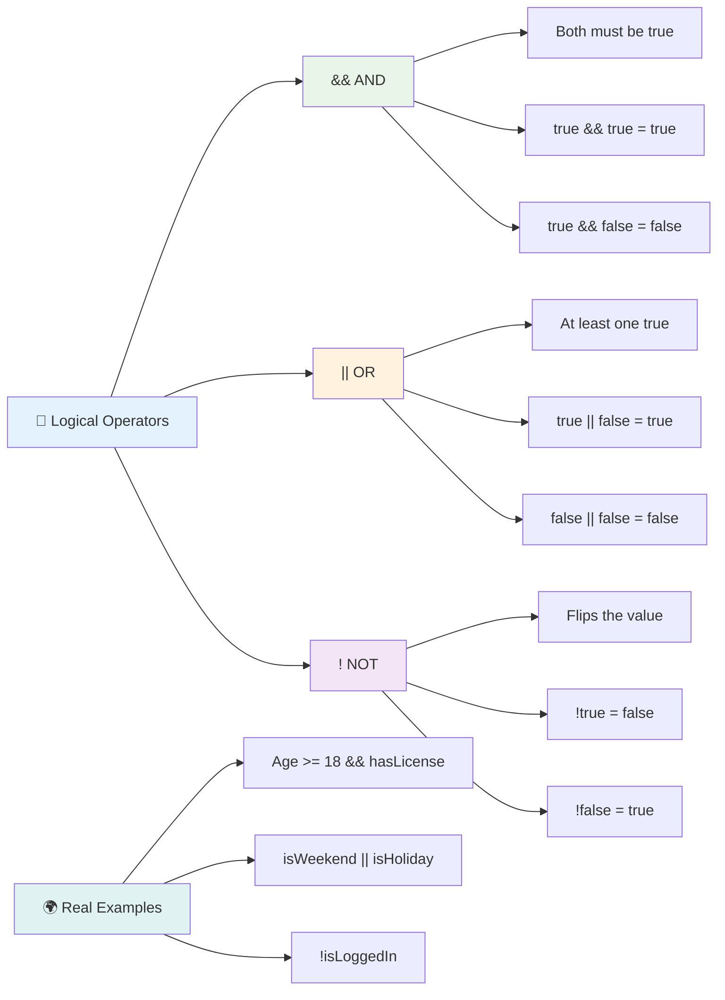

## तार्किक अपरेटरहरूसँग सर्तहरू र निर्णयहरू

आउनुहोस् यी तार्किक अपरेटरहरूलाई थप यथार्थपरक उदाहरणमा प्रयोग गरौं:

```javascript
let currentMoney = 600;
let laptopPrice = 800;
let laptopDiscountPrice = laptopPrice - (laptopPrice * 0.2); // Laptop price at 20 percent off

if (currentMoney >= laptopPrice || currentMoney >= laptopDiscountPrice) {
  // Condition is true. Code in this block will run.
  console.log("Getting a new laptop!");
} else {
  // Condition is false. Code in this block will run.
  console.log("Can't afford a new laptop, yet!");
}
```

यस उदाहरणमा: हामी २०% छुट मूल्य (६४०) गणना गर्छौं, त्यसपछि मूल्याङ्कन गर्छौं कि हाम्रो उपलब्ध रकमले पूर्ण मूल्य वा छुट मूल्य किन्न सक्छ। किनभने ६०० छुट मूल्यको सीमा ६४० पूरा गर्छ, सर्त सत्यमा मूल्याङ्कन हुन्छ।

### 🧮 **तार्किक अपरेटर जाँच: सर्तहरू संयोजन गर्नु**

**तपाईंको तार्किक अपरेटर बुझाइ जाँच गर्नुहोस्:**
- अभिव्यक्तिमा `A && B`, के हुन्छ यदि A झुटो छ भने? के B पनि मूल्याङ्कन हुन्छ?
- के तपाईं यस्तो स्थिति सोच्न सक्नुहुन्छ जहाँ तपाईंलाई तीनवटा अपरेटर (&&, ||, !) सँगै आवश्यक पर्छ?
- `!user.isActive` र `user.isActive !== true` बीचको फरक के हो?

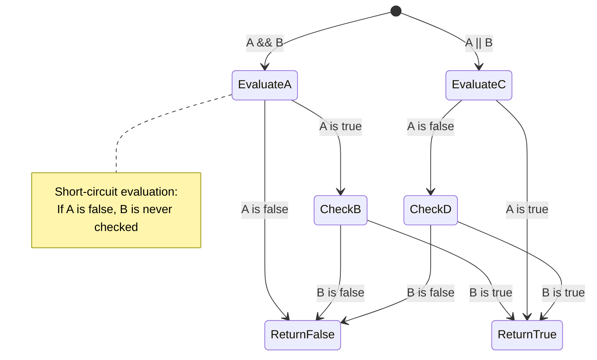

> **प्रदर्शन टिप**: जाभास्क्रिप्टले "छोटो-सर्किट मूल्याङ्कन" प्रयोग गर्छ - `A && B` मा, यदि A झुटो छ भने, B पनि मूल्याङ्कन हुँदैन। यसलाई आफ्नो फाइदाको लागि प्रयोग गर्नुहोस्!

### नकारात्मक अपरेटर

कहिलेकाहीं केहि सत्य छैन भने सोच्नु सजिलो हुन्छ। जस्तै "प्रयोगकर्ता लगइन छ?" सोध्नुको सट्टा, तपाईं "प्रयोगकर्ता लगइन छैन?" सोध्न चाहनुहुन्छ। विस्मयादिबोधक चिन्ह (`!`) अपरेटरले तपाईंको लागि तर्क उल्टाउँछ।

```javascript
if (!condition) {
  // runs if condition is false
} else {
  // runs if condition is true
}
```

`!` अपरेटर "विपरीत..." भन्ने जस्तै हो – यदि केहि `true` छ भने, `!` यसलाई `false` बनाउँछ, र विपरीत।

### टर्नरी अभिव्यक्तिहरू

सरल सर्तात्मक असाइनमेन्टहरूको लागि, जाभास्क्रिप्टले **टर्नरी अपरेटर** प्रदान गर्दछ। यो संक्षिप्त वाक्यविन्यासले तपाईंलाई एकल लाइनमा सर्तात्मक अभिव्यक्ति लेख्न अनुमति दिन्छ, जब तपाईंलाई सर्तको आधारमा दुई मानहरू मध्ये एक असाइन गर्न आवश्यक हुन्छ।

```javascript
let variable = condition ? returnThisIfTrue : returnThisIfFalse;
```

यो प्रश्न जस्तै पढिन्छ: "के यो सर्त सत्य हो? यदि हो भने, यो मान प्रयोग गर्नुहोस्। यदि होइन भने, त्यो मान प्रयोग गर्नुहोस्।"

तल एक थप ठोस उदाहरण छ:

```javascript
let firstNumber = 20;
let secondNumber = 10;
let biggestNumber = firstNumber > secondNumber ? firstNumber : secondNumber;
```

✅ यो कोडलाई केही पटक पढ्न समय लिनुहोस्। के तपाईं बुझ्न सक्नुहुन्छ कि यी अपरेटरहरू कसरी काम गरिरहेका छन्?

यो लाइनले के भन्छ: "के `firstNumber` `secondNumber` भन्दा ठूलो छ? यदि हो भने, `firstNumber` लाई `biggestNumber` मा राख्नुहोस्। यदि होइन भने, `secondNumber` लाई `biggestNumber` मा राख्नुहोस्।"

टर्नरी अपरेटरले यो परम्परागत `if..else` कथन लेख्न छोटो तरिका मात्र हो:

```javascript
let biggestNumber;
if (firstNumber > secondNumber) {
  biggestNumber = firstNumber;
} else {
  biggestNumber = secondNumber;
}
```

दुबै दृष्टिकोणहरूले समान परिणाम उत्पादन गर्छन्। टर्नरी अपरेटरले संक्षिप्तता प्रदान गर्दछ, जबकि परम्परागत if-else संरचना जटिल सर्तहरूको लागि बढी पढ्न योग्य हुन सक्छ।

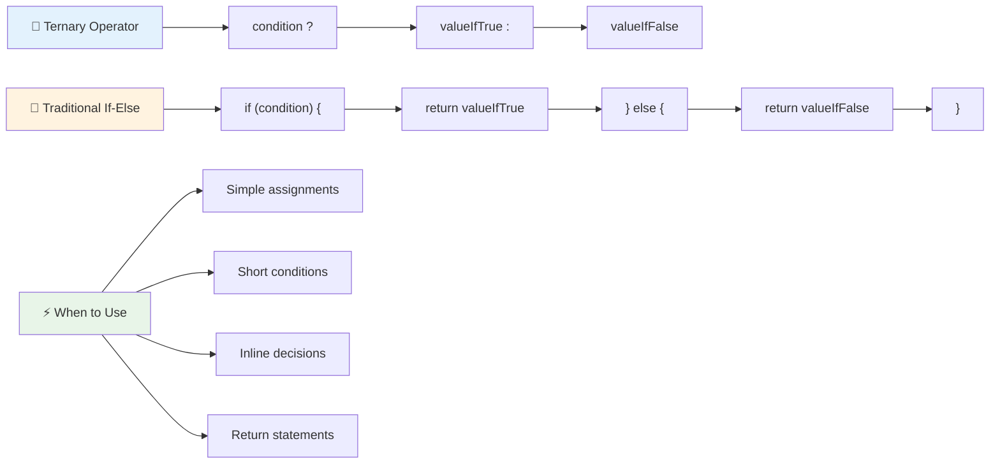

---


## 🚀 चुनौती

पहिले तार्किक अपरेटरहरू प्रयोग गरेर लेखिएको प्रोग्राम सिर्जना गर्नुहोस्, र त्यसपछि यसलाई टर्नरी अभिव्यक्तिको प्रयोग गरेर पुनःलेख्नुहोस्। तपाईंको मनपर्ने वाक्यविन्यास के हो?

---

## GitHub Copilot Agent चुनौती 🚀

Agent मोड प्रयोग गरेर निम्न चुनौती पूरा गर्नुहोस्:

**विवरण:** यस पाठबाट धेरै निर्णय लिने अवधारणाहरू प्रदर्शन गर्ने व्यापक ग्रेड क्यालकुलेटर सिर्जना गर्नुहोस्, जसमा if-else कथनहरू, switch कथनहरू, तार्किक अपरेटरहरू, र टर्नरी अभिव्यक्तिहरू समावेश छन्।

**प्रोम्प्ट:** जाभास्क्रिप्ट प्रोग्राम लेख्नुहोस् जसले विद्यार्थीको संख्यात्मक स्कोर (0-100) लिन्छ र निम्न माप
२. विद्यार्थी पास हुन्छ (grade >= 60) र सम्मानित हुन्छ (grade >= 90) भनेर जाँच गर्न तार्किक अपरेटरहरू प्रयोग गर्नुहोस्।  
३. प्रत्येक अक्षर ग्रेडको लागि विशेष प्रतिक्रिया दिन switch statement प्रयोग गर्नुहोस्।  
४. विद्यार्थी अर्को पाठ्यक्रमको लागि योग्य छ कि छैन (grade >= 70) भनेर निर्धारण गर्न ternary operator प्रयोग गर्नुहोस्।  
५. स्कोर ० देखि १०० बीचमा छ भनेर सुनिश्चित गर्न इनपुट मान्यता समावेश गर्नुहोस्।  

तपाईंको प्रोग्रामलाई विभिन्न स्कोरहरू, जस्तै ५९, ६०, ८९, ९०, र अमान्य इनपुटहरू सहित परीक्षण गर्नुहोस्।  

[agent mode](https://code.visualstudio.com/blogs/2025/02/24/introducing-copilot-agent-mode) को बारेमा यहाँ थप जान्नुहोस्।  

## पोस्ट-व्याख्यान क्विज  

[पोस्ट-व्याख्यान क्विज](https://ff-quizzes.netlify.app/web/quiz/12)  

## समीक्षा र आत्म-अध्ययन  

प्रयोगकर्ताले प्रयोग गर्न सक्ने धेरै अपरेटरहरूको बारेमा [MDN मा](https://developer.mozilla.org/docs/Web/JavaScript/Reference/Operators) थप पढ्नुहोस्।  

जोश कमाउको उत्कृष्ट [अपरेटर लुकअप](https://joshwcomeau.com/operator-lookup/) हेर्नुहोस्!  

## असाइनमेन्ट  

[अपरेटरहरू](assignment.md)  

---

## 🧠 **तपाईंको निर्णय-लिने उपकरणको सारांश**  

```mermaid
graph TD
    A["🎯 JavaScript Decisions"] --> B["🔍 Boolean Logic"]
    A --> C["📊 Conditional Statements"]
    A --> D["🔗 Logical Operators"]
    A --> E["⚡ Advanced Patterns"]
    
    B --> B1["true/false values"]
    B --> B2["Comparison operators"]
    B --> B3["Truthiness concepts"]
    
    C --> C1["if statements"]
    C --> C2["if-else chains"]
    C --> C3["switch statements"]
    
    D --> D1["&& (AND)"]
    D --> D2["|| (OR)"]
    D --> D3["! (NOT)"]
    
    E --> E1["Ternary operator"]
    E --> E2["Short-circuit evaluation"]
    E --> E3["Complex conditions"]
    
    F["💡 Key Principles"] --> F1["Clear readable conditions"]
    F --> F2["Consistent comparison style"]
    F --> F3["Proper operator precedence"]
    F --> F4["Efficient evaluation order"]
    
    style A fill:#e3f2fd
    style B fill:#e8f5e8
    style C fill:#fff3e0
    style D fill:#f3e5f5
    style E fill:#e0f2f1
    style F fill:#fce4ec
```
  
---

## 🚀 तपाईंको जाभास्क्रिप्ट निर्णय-लिने सीपको समयरेखा  

### ⚡ **तपाईंले अर्को ५ मिनेटमा गर्न सक्ने कुरा**  
- [ ] तपाईंको ब्राउजर कन्सोलमा तुलना अपरेटरहरू अभ्यास गर्नुहोस्।  
- [ ] तपाईंको उमेर जाँच गर्ने एउटा साधारण if-else statement लेख्नुहोस्।  
- [ ] चुनौती प्रयास गर्नुहोस्: if-else लाई ternary operator प्रयोग गरेर पुनःलेखन गर्नुहोस्।  
- [ ] विभिन्न "truthy" र "falsy" मानहरूको साथ के हुन्छ परीक्षण गर्नुहोस्।  

### 🎯 **तपाईंले यो घण्टामा हासिल गर्न सक्ने कुरा**  
- [ ] पाठ-पछिको क्विज पूरा गर्नुहोस् र कुनै पनि भ्रमित अवधारणाहरू समीक्षा गर्नुहोस्।  
- [ ] GitHub Copilot चुनौतीबाट व्यापक ग्रेड क्यालकुलेटर बनाउनुहोस्।  
- [ ] वास्तविक जीवनको परिदृश्यको लागि एउटा साधारण निर्णय वृक्ष बनाउनुहोस् (जस्तै के लगाउने छनोट गर्नु)।  
- [ ] तार्किक अपरेटरहरूसँग धेरै सर्तहरू संयोजन गर्ने अभ्यास गर्नुहोस्।  
- [ ] विभिन्न प्रयोगहरूको लागि switch statement प्रयोग गरेर परीक्षण गर्नुहोस्।  

### 📅 **तपाईंको हप्ताको तार्किक सीपको मास्टरी**  
- [ ] रचनात्मक उदाहरणहरूको साथ अपरेटरहरूको असाइनमेन्ट पूरा गर्नुहोस्।  
- [ ] विभिन्न सर्त संरचनाहरू प्रयोग गरेर एउटा सानो क्विज एप्लिकेसन बनाउनुहोस्।  
- [ ] धेरै इनपुट सर्तहरू जाँच गर्ने फर्म मान्यता बनाउनुहोस्।  
- [ ] जोश कमाउको [अपरेटर लुकअप](https://joshwcomeau.com/operator-lookup/) अभ्यासहरू अभ्यास गर्नुहोस्।  
- [ ] अधिक उपयुक्त सर्त संरचनाहरू प्रयोग गर्न विद्यमान कोडलाई पुनःलेखन गर्नुहोस्।  
- [ ] छोटो-सर्किट मूल्यांकन र प्रदर्शन प्रभावहरूको अध्ययन गर्नुहोस्।  

### 🌟 **तपाईंको महिनाको रूपान्तरण**  
- [ ] जटिल नेस्टेड सर्तहरूमा महारत हासिल गर्नुहोस् र कोड पढ्न सजिलो बनाउनुहोस्।  
- [ ] परिष्कृत निर्णय-लिने तर्कको साथ एप्लिकेसन बनाउनुहोस्।  
- [ ] विद्यमान परियोजनाहरूमा सर्त तर्क सुधार गरेर ओपन सोर्समा योगदान गर्नुहोस्।  
- [ ] विभिन्न सर्त संरचनाहरूको बारेमा अरूलाई सिकाउनुहोस् र प्रत्येक कहिले प्रयोग गर्ने।  
- [ ] सर्त तर्कको लागि कार्यात्मक प्रोग्रामिङ दृष्टिकोण अन्वेषण गर्नुहोस्।  
- [ ] सर्तहरूको उत्कृष्ट अभ्यासहरूको लागि व्यक्तिगत सन्दर्भ मार्गदर्शक बनाउनुहोस्।  

### 🏆 **अन्तिम निर्णय-लिने च्याम्पियन जाँच**  

**तपाईंको तार्किक सोचको मास्टरीको उत्सव मनाउनुहोस्:**  
- तपाईंले सफलतापूर्वक कार्यान्वयन गरेको सबैभन्दा जटिल निर्णय तर्क के हो?  
- कुन सर्त संरचना तपाईंलाई सबैभन्दा प्राकृतिक लाग्छ र किन?  
- तार्किक अपरेटरहरूको बारेमा सिक्नाले तपाईंको समस्या समाधान गर्ने दृष्टिकोणलाई कसरी परिवर्तन गरेको छ?  
- कुन वास्तविक जीवनको एप्लिकेसन परिष्कृत निर्णय-लिने तर्कबाट लाभ उठाउँछ?  

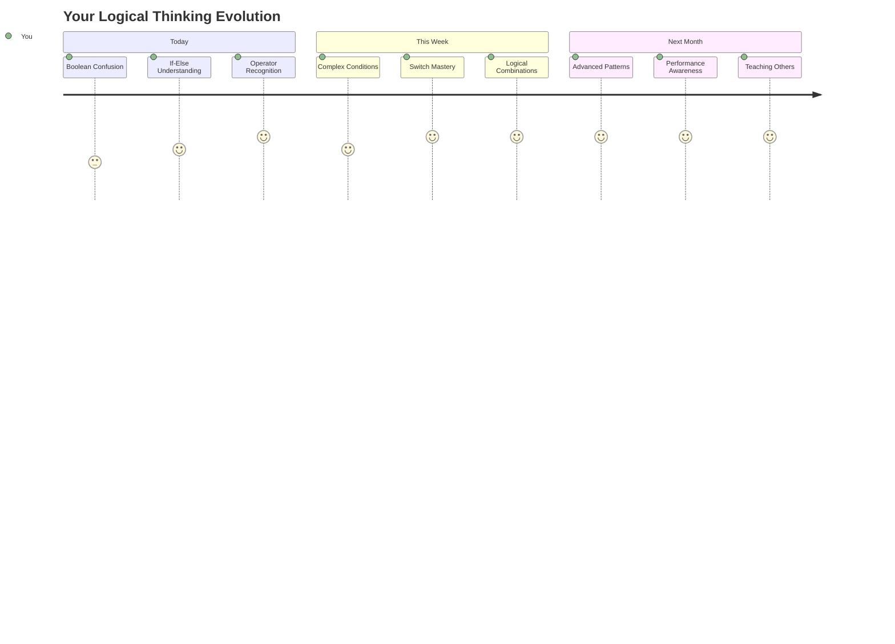
  
> 🧠 **तपाईंले डिजिटल निर्णय-लिने कलाको मास्टरी हासिल गर्नुभएको छ!** प्रत्येक अन्तरक्रियात्मक एप्लिकेसनले प्रयोगकर्ताको कार्यहरू र परिवर्तनशील अवस्थाहरूमा बुद्धिमानीपूर्वक प्रतिक्रिया दिन सर्त तर्कमा निर्भर गर्दछ। तपाईंले अब तपाईंको प्रोग्रामलाई सोच्न, मूल्याङ्कन गर्न, र उपयुक्त प्रतिक्रिया छनोट गर्न कसरी बनाउने भन्ने कुरा बुझ्नुभएको छ। यो तार्किक आधारले तपाईंले निर्माण गर्ने प्रत्येक गतिशील एप्लिकेसनलाई शक्ति प्रदान गर्नेछ! 🎉  

---

**अस्वीकरण**:  
यो दस्तावेज़ AI अनुवाद सेवा [Co-op Translator](https://github.com/Azure/co-op-translator) प्रयोग गरेर अनुवाद गरिएको छ। हामी शुद्धताको लागि प्रयास गर्छौं, तर कृपया ध्यान दिनुहोस् कि स्वचालित अनुवादमा त्रुटिहरू वा अशुद्धताहरू हुन सक्छ। यसको मूल भाषा मा रहेको दस्तावेज़लाई आधिकारिक स्रोत मानिनुपर्छ। महत्वपूर्ण जानकारीको लागि, व्यावसायिक मानव अनुवाद सिफारिस गरिन्छ। यस अनुवादको प्रयोगबाट उत्पन्न हुने कुनै पनि गलतफहमी वा गलत व्याख्याको लागि हामी जिम्मेवार हुने छैनौं।