# जाभास्क्रिप्ट आधारभूत: एरेहरू र लूपहरू

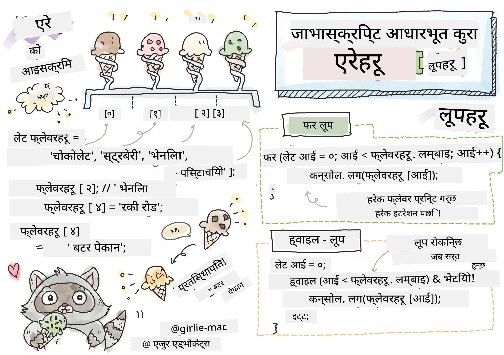
> स्केच नोट [टोमोमी इमुरा](https://twitter.com/girlie_mac) द्वारा

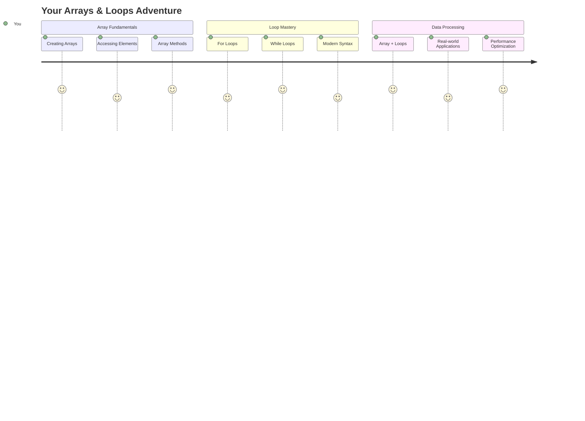

## व्याख्यान अघि क्विज
[व्याख्यान अघि क्विज](https://ff-quizzes.netlify.app/web/quiz/13)

के तपाईंले कहिल्यै सोच्नुभएको छ कि वेबसाइटहरूले किन किनमेल कार्टका वस्तुहरू ट्र्याक गर्छन् वा तपाईंको साथीहरूको सूची देखाउँछन्? यहीँ एरेहरू र लूपहरू काममा आउँछन्। एरेहरू डिजिटल कन्टेनर जस्तै हुन् जसले धेरै जानकारीहरू राख्छन्, जबकि लूपहरूले तपाईंलाई त्यो डेटा कुशलतापूर्वक काम गर्न अनुमति दिन्छन् बिना दोहोरिने कोड।

यी दुई अवधारणाहरूले तपाईंको प्रोग्रामहरूमा जानकारी व्यवस्थापनको आधार बनाउँछन्। तपाईंले प्रत्येक चरण म्यानुअल रूपमा लेख्नेबाट स्मार्ट, कुशल कोड सिर्जना गर्न सिक्नुहुनेछ जसले सयौं वा हजारौं वस्तुहरू छिटो प्रक्रिया गर्न सक्छ।

यस पाठको अन्त्यसम्ममा, तपाईंले केही लाइनको कोडले जटिल डेटा कार्यहरू कसरी पूरा गर्ने भन्ने बुझ्नुहुनेछ। यी आवश्यक प्रोग्रामिङ अवधारणाहरू अन्वेषण गरौं।

[](https://youtube.com/watch?v=1U4qTyq02Xw "एरेहरू")

[](https://www.youtube.com/watch?v=Eeh7pxtTZ3k "लूपहरू")

> 🎥 माथिका तस्बिरहरूमा क्लिक गर्नुहोस् एरेहरू र लूपहरूबारे भिडियोहरूका लागि।

> तपाईं यो पाठ [Microsoft Learn](https://docs.microsoft.com/learn/modules/web-development-101-arrays/?WT.mc_id=academic-77807-sagibbon) मा लिन सक्नुहुन्छ!

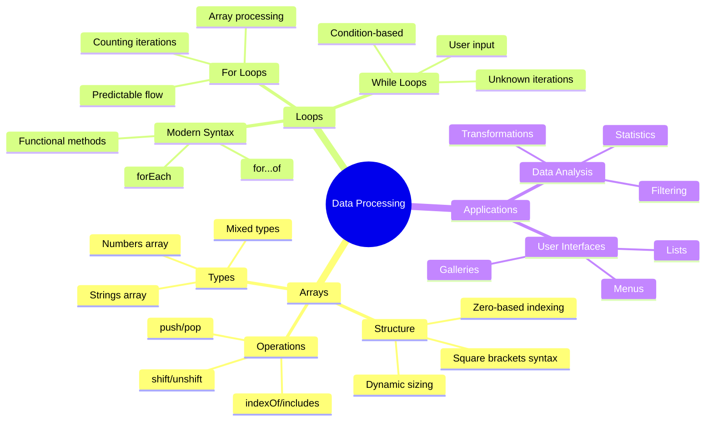

## एरेहरू

एरेहरूलाई डिजिटल फाइलिङ क्याबिनेटको रूपमा सोच्नुहोस् - एउटा दराजमा एउटा कागजात भण्डारण गर्ने सट्टा, तपाईं धेरै सम्बन्धित वस्तुहरूलाई एउटै संरचित कन्टेनरमा व्यवस्थित गर्न सक्नुहुन्छ। प्रोग्रामिङ सन्दर्भमा, एरेहरूले तपाईंलाई धेरै जानकारीहरू एउटै संगठित प्याकेजमा भण्डारण गर्न अनुमति दिन्छ।

तपाईं फोटो ग्यालरी बनाउँदै हुनुहुन्छ, टु-डु सूची व्यवस्थापन गर्दै हुनुहुन्छ, वा खेलमा उच्च स्कोरहरू ट्र्याक गर्दै हुनुहुन्छ भने, एरेहरूले डेटा संगठनको आधार प्रदान गर्छन्। आउनुहोस्, यसले कसरी काम गर्छ हेर्नुहोस्।

✅ एरेहरू हरेक ठाउँमा छन्! के तपाईं एरेको वास्तविक जीवन उदाहरण सोच्न सक्नुहुन्छ, जस्तै सौर्य प्यानल एरे?

### एरेहरू सिर्जना गर्दै

एरे सिर्जना गर्नु धेरै सरल छ - केवल वर्ग ब्र्याकेटहरू प्रयोग गर्नुहोस्!

```javascript
// Empty array - like an empty shopping cart waiting for items
const myArray = [];
```

**यहाँ के भइरहेको छ?**
तपाईंले ती वर्ग ब्र्याकेटहरू `[]` प्रयोग गरेर खाली कन्टेनर सिर्जना गर्नुभएको छ। यसलाई खाली पुस्तकालय शेल्फ जस्तै सोच्नुहोस् - यो तपाईंले त्यहाँ व्यवस्थित गर्न चाहनुभएको किताबहरू राख्न तयार छ।

तपाईं आफ्नो एरेलाई सुरुवातमै प्रारम्भिक मानहरूद्वारा भरिन पनि सक्नुहुन्छ:

```javascript
// Your ice cream shop's flavor menu
const iceCreamFlavors = ["Chocolate", "Strawberry", "Vanilla", "Pistachio", "Rocky Road"];

// A user's profile info (mixing different types of data)
const userData = ["John", 25, true, "developer"];

// Test scores for your favorite class
const scores = [95, 87, 92, 78, 85];
```

**ध्यान दिन लायक कुराहरू:**
- तपाईंले एउटै एरेमा पाठ, संख्या, वा सत्य/झुटो मानहरू भण्डारण गर्न सक्नुहुन्छ
- प्रत्येक वस्तुलाई अल्पविरामले छुट्याउनुहोस् - सजिलो!
- एरेहरू सम्बन्धित जानकारीहरू सँगै राख्नका लागि उत्तम छन्

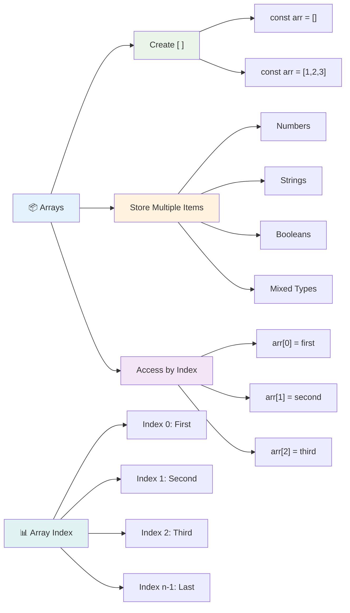

### एरे इन्डेक्सिङ

यहाँ केहि असामान्य लाग्न सक्छ: एरेहरूले आफ्नो वस्तुहरू 0 बाट सुरु गरेर नम्बर गर्छन्, 1 बाट होइन। यो शून्य-आधारित इन्डेक्सिङ कम्प्युटर मेमोरी कसरी काम गर्छ भन्ने कुरामा आधारित छ - यो प्रोग्रामिङ परम्परा कम्प्युटिङ भाषाहरू जस्तै C को प्रारम्भिक दिनदेखि चल्दै आएको छ। एरेको प्रत्येक स्थानले आफ्नो ठेगाना नम्बर पाउँछ जसलाई **इन्डेक्स** भनिन्छ।

| इन्डेक्स | मान | विवरण |
|-------|-------|-------------|
| 0 | "चकलेट" | पहिलो तत्व |
| 1 | "स्ट्रबेरी" | दोस्रो तत्व |
| 2 | "भ्यानिला" | तेस्रो तत्व |
| 3 | "पिस्ताचियो" | चौथो तत्व |
| 4 | "रकी रोड" | पाँचौं तत्व |

✅ के तपाईंलाई एरेहरू शून्य इन्डेक्सबाट सुरु हुन्छ भन्ने कुरा अचम्म लाग्छ? केही प्रोग्रामिङ भाषाहरूमा, इन्डेक्सहरू 1 बाट सुरु हुन्छ। यसको बारेमा रोचक इतिहास छ, जुन तपाईं [विकिपिडियामा पढ्न सक्नुहुन्छ](https://en.wikipedia.org/wiki/Zero-based_numbering)।

**एरे तत्वहरू पहुँच गर्दै:**

```javascript
const iceCreamFlavors = ["Chocolate", "Strawberry", "Vanilla", "Pistachio", "Rocky Road"];

// Access individual elements using bracket notation
console.log(iceCreamFlavors[0]); // "Chocolate" - first element
console.log(iceCreamFlavors[2]); // "Vanilla" - third element
console.log(iceCreamFlavors[4]); // "Rocky Road" - last element
```

**यहाँ के भइरहेको छ:**
- **प्रयोग गर्छ** इन्डेक्स नम्बरको साथ वर्ग ब्र्याकेट नोटेशन तत्वहरू पहुँच गर्न
- **फिर्ता दिन्छ** एरेको सो विशेष स्थानमा भण्डारण गरिएको मान
- **सुरु गर्छ** 0 बाट गणना गर्दै, पहिलो तत्व इन्डेक्स 0 बनाउँदै

**एरे तत्वहरू परिमार्जन गर्दै:**

```javascript
// Change an existing value
iceCreamFlavors[4] = "Butter Pecan";
console.log(iceCreamFlavors[4]); // "Butter Pecan"

// Add a new element at the end
iceCreamFlavors[5] = "Cookie Dough";
console.log(iceCreamFlavors[5]); // "Cookie Dough"
```

**माथिको उदाहरणमा हामीले:**
- **परिमार्जन गर्‍यौं** इन्डेक्स 4 मा रहेको तत्व "रकी रोड" बाट "बटर पेकन" मा
- **नयाँ तत्व थप्यौं** "कुकी डो" इन्डेक्स 5 मा
- **स्वचालित रूपमा विस्तार गर्‍यो** एरेको लम्बाइ जब वर्तमान सीमा भन्दा पर थपियो

### एरे लम्बाइ र सामान्य विधिहरू

एरेहरूमा बिल्ट-इन गुणहरू र विधिहरू छन् जसले डेटा काम गर्न धेरै सजिलो बनाउँछ।

**एरे लम्बाइ पत्ता लगाउँदै:**

```javascript
const iceCreamFlavors = ["Chocolate", "Strawberry", "Vanilla", "Pistachio", "Rocky Road"];
console.log(iceCreamFlavors.length); // 5

// Length updates automatically as array changes
iceCreamFlavors.push("Mint Chip");
console.log(iceCreamFlavors.length); // 6
```

**महत्वपूर्ण बुँदाहरू सम्झनुहोस्:**
- **फिर्ता दिन्छ** एरेमा कुल तत्वहरूको संख्या
- **स्वचालित रूपमा अपडेट हुन्छ** जब तत्वहरू थपिन्छन् वा हटाइन्छन्
- **प्रदान गर्छ** लूपहरू र मान्यताका लागि गतिशील गणना

**आवश्यक एरे विधिहरू:**

```javascript
const fruits = ["apple", "banana", "orange"];

// Add elements
fruits.push("grape");           // Adds to end: ["apple", "banana", "orange", "grape"]
fruits.unshift("strawberry");   // Adds to beginning: ["strawberry", "apple", "banana", "orange", "grape"]

// Remove elements
const lastFruit = fruits.pop();        // Removes and returns "grape"
const firstFruit = fruits.shift();     // Removes and returns "strawberry"

// Find elements
const index = fruits.indexOf("banana"); // Returns 1 (position of "banana")
const hasApple = fruits.includes("apple"); // Returns true
```

**यी विधिहरू बुझ्दै:**
- **थप्छ** `push()` (अन्त्यमा) र `unshift()` (सुरुमा) द्वारा तत्वहरू
- **हटाउँछ** `pop()` (अन्त्यमा) र `shift()` (सुरुमा) द्वारा तत्वहरू
- **पत्ता लगाउँछ** `indexOf()` द्वारा तत्वहरू र `includes()` द्वारा अस्तित्व जाँच्छ
- **फिर्ता दिन्छ** उपयोगी मानहरू जस्तै हटाइएका तत्वहरू वा स्थिति इन्डेक्सहरू

✅ आफैं प्रयास गर्नुहोस्! आफ्नो ब्राउजरको कन्सोलमा एरे सिर्जना गरेर परिमार्जन गर्नुहोस्।

### 🧠 **एरे आधारभूत जाँच: तपाईंको डेटा व्यवस्थित गर्दै**

**तपाईंको एरे बुझाइ परीक्षण गर्नुहोस्:**
- तपाईंलाई किन लाग्छ एरेहरू 0 बाट गणना सुरु गर्छन् 1 बाट होइन?
- के हुन्छ यदि तपाईंले त्यस्तो इन्डेक्स पहुँच गर्न खोज्नुभयो जुन अस्तित्वमा छैन (जस्तै `arr[100]` 5-तत्व एरेमा)?
- एरेहरू उपयोगी हुने तीन वास्तविक जीवन परिदृश्य सोच्न सक्नुहुन्छ?

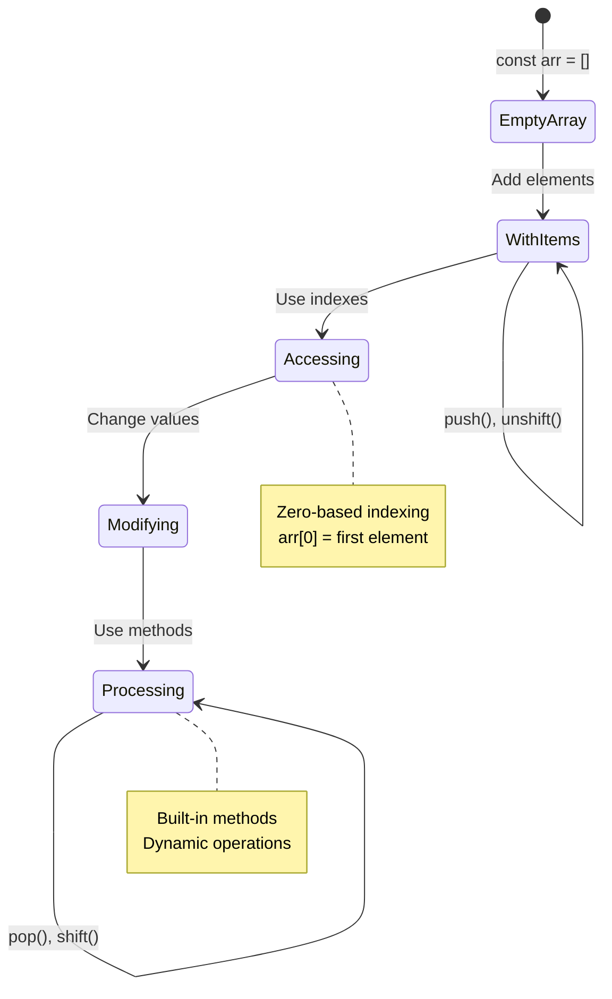

> **वास्तविक जीवन अन्तर्दृष्टि**: एरेहरू प्रोग्रामिङमा हरेक ठाउँमा छन्! सामाजिक मिडिया फिडहरू, किनमेल कार्टहरू, फोटो ग्यालरीहरू, प्लेलिस्ट गीतहरू - यी सबै एरेहरू हुन् पर्दा पछाडि!

## लूपहरू

चार्ल्स डिकेन्सका उपन्यासहरूमा प्रसिद्ध सजायको बारेमा सोच्नुहोस् जहाँ विद्यार्थीहरूले स्लेटमा लाइनहरू बारम्बार लेख्नुपर्थ्यो। कल्पना गर्नुहोस् यदि तपाईं कसैलाई "यो वाक्य 100 पटक लेख" भन्न सक्नुहुन्छ र यो स्वचालित रूपमा पूरा हुन्छ। यही कुरा लूपहरूले तपाईंको कोडका लागि गर्छन्।

लूपहरू tireless सहायक जस्तै हुन् जसले कार्यहरू दोहोर्याउन सक्छन् बिना त्रुटि। तपाईंलाई किनमेल कार्टको प्रत्येक वस्तु जाँच गर्न वा एल्बममा सबै फोटोहरू देखाउन आवश्यक छ भने, लूपहरूले दोहोर्याइलाई कुशलतापूर्वक व्यवस्थापन गर्छन्।

जाभास्क्रिप्टले छनोट गर्नका लागि धेरै प्रकारका लूपहरू प्रदान गर्दछ। प्रत्येकलाई जाँच गरौं र कहिले प्रयोग गर्ने बुझौं।

```mermaid
flowchart TD
    A["🔄 Loop Types"] --> B["For Loop"]
    A --> C["While Loop"]
    A --> D["For...of Loop"]
    A --> E["forEach Method"]
    
    B --> B1["Known iterations"]
    B --> B2["Counter-based"]
    B --> B3["for(init; condition; increment)"]
    
    C --> C1["Unknown iterations"]
    C --> C2["Condition-based"]
    C --> C3["while(condition)"]
    
    D --> D1["Modern ES6+"]
    D --> D2["Array iteration"]
    D --> D3["for(item of array)"]
    
    E --> E1["Functional style"]
    E --> E2["Array method"]
    E --> E3["array.forEach(callback)"]
    
    F["⏰ When to Use"] --> F1["For: Counting, indexes"]
    F --> F2["While: User input, searching"]
    F --> F3["For...of: Simple iteration"]
    F --> F4["forEach: Functional programming"]
    
    style A fill:#e3f2fd
    style B fill:#e8f5e8
    style C fill:#fff3e0
    style D fill:#f3e5f5
    style E fill:#e0f2f1
    style F fill:#fce4ec
```

### फोर लूप

`for` लूप टाइमर सेट गर्ने जस्तै हो - तपाईंलाई थाहा छ कि तपाईंले कति पटक केहि गर्न चाहनुहुन्छ। यो धेरै व्यवस्थित र पूर्वानुमान योग्य छ, जसले यसलाई एरेहरूसँग काम गर्दा वा वस्तुहरू गणना गर्न उत्तम बनाउँछ।

**फोर लूप संरचना:**

| घटक | उद्देश्य | उदाहरण |
|-----------|---------|----------|
| **सुरुवात** | सुरु बिन्दु सेट गर्छ | `let i = 0` |
| **सर्त** | कहिले जारी राख्ने | `i < 10` |
| **वृद्धि** | कसरी अपडेट गर्ने | `i++` |

```javascript
// Counting from 0 to 9
for (let i = 0; i < 10; i++) {
  console.log(`Count: ${i}`);
}

// More practical example: processing scores
const testScores = [85, 92, 78, 96, 88];
for (let i = 0; i < testScores.length; i++) {
  console.log(`Student ${i + 1}: ${testScores[i]}%`);
}
```

**चरणबद्ध रूपमा, यहाँ के भइरहेको छ:**
- **सुरु गर्छ** काउन्टर भेरिएबल `i` लाई 0 मा सेट गर्दै
- **जाँच गर्छ** सर्त `i < 10` प्रत्येक पुनरावृत्तिको अघि
- **कार्यान्वयन गर्छ** कोड ब्लक जब सर्त सत्य हुन्छ
- **वृद्धि गर्छ** `i` लाई प्रत्येक पुनरावृत्तिपछि 1 द्वारा `i++` प्रयोग गर्दै
- **रोक्छ** जब सर्त झुटो हुन्छ (जब `i` 10 पुग्छ)

✅ यो कोड ब्राउजर कन्सोलमा चलाउनुहोस्। काउन्टर, सर्त, वा पुनरावृत्ति अभिव्यक्तिमा साना परिवर्तन गर्दा के हुन्छ? के तपाईं यसलाई उल्टो चलाउन सक्नुहुन्छ, काउन्टडाउन सिर्जना गर्दै?

### 🗓️ **फोर लूप मास्टरी जाँच: नियन्त्रित दोहोर्याइ**

**तपाईंको फोर लूप बुझाइ मूल्यांकन गर्नुहोस्:**
- फोर लूपका तीन भागहरू के हुन्, र प्रत्येकले के गर्छ?
- तपाईं कसरी एरेलाई उल्टो लूप गर्न सक्नुहुन्छ?
- यदि तपाईंले वृद्धि भाग (`i++`) बिर्सनुभयो भने के हुन्छ?

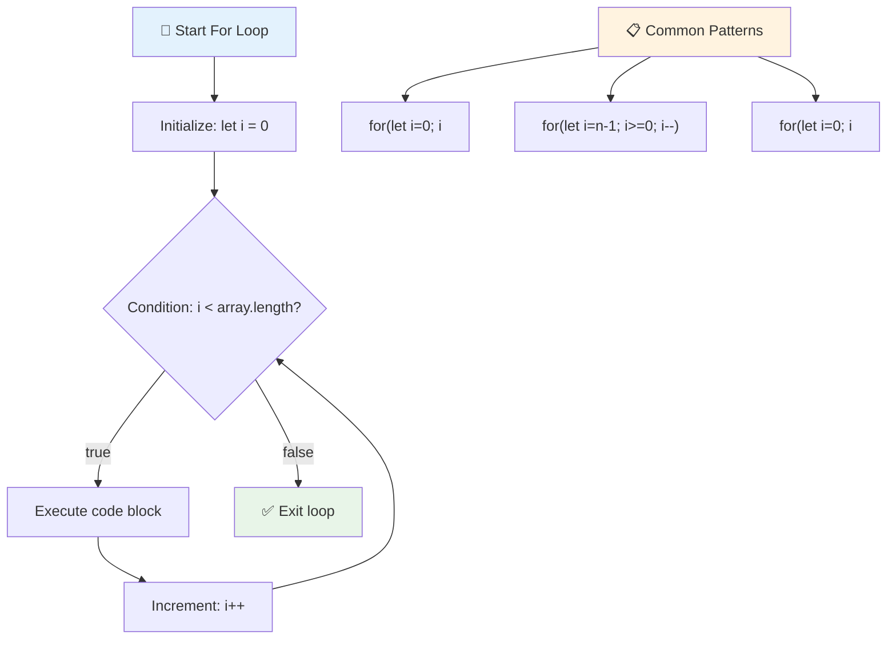

> **लूप ज्ञान**: फोर लूपहरू उत्तम हुन्छन् जब तपाईंलाई थाहा छ कि तपाईंले कति पटक केहि दोहोर्याउन आवश्यक छ। एरे प्रशोधनका लागि तिनीहरू सबैभन्दा सामान्य छनोट हुन्!

### ह्वाइल लूप

`while` लूप "यो गरिराख... सम्म" भन्ने जस्तै हो - तपाईंलाई थाहा नहुन सक्छ कि यो कति पटक चल्छ, तर तपाईंलाई थाहा छ कहिले रोक्ने। यो त्यस्तो कुराहरूका लागि उत्तम हो जस्तै प्रयोगकर्ताबाट इनपुट माग्ने जबसम्म उनीहरूले तपाईंलाई चाहिएको कुरा दिन्छन्, वा तपाईंले खोज्न चाहनुभएको डेटा पत्ता लगाउँदासम्म।

**ह्वाइल लूप विशेषताहरू:**
- **जारी राख्छ** सर्त सत्य रहँदासम्म कार्यान्वयन गर्दै
- **आवश्यक छ** कुनै पनि काउन्टर भेरिएबलहरूको म्यानुअल व्यवस्थापन
- **जाँच गर्छ** सर्त प्रत्येक पुनरावृत्तिको अघि
- **जोखिम छ** अनन्त लूपहरू यदि सर्त कहिल्यै झुटो हुँदैन भने

```javascript
// Basic counting example
let i = 0;
while (i < 10) {
  console.log(`While count: ${i}`);
  i++; // Don't forget to increment!
}

// More practical example: processing user input
let userInput = "";
let attempts = 0;
const maxAttempts = 3;

while (userInput !== "quit" && attempts < maxAttempts) {
  userInput = prompt(`Enter 'quit' to exit (attempt ${attempts + 1}):`);
  attempts++;
}

if (attempts >= maxAttempts) {
  console.log("Maximum attempts reached!");
}
```

**यी उदाहरणहरू बुझ्दै:**
- **व्यवस्थापन गर्छ** काउन्टर भेरिएबल `i` लूपको भित्र म्यानुअल रूपमा
- **वृद्धि गर्छ** काउन्टर अनन्त लूपहरू रोक्न
- **व्यावहारिक प्रयोग केस देखाउँछ** प्रयोगकर्ता इनपुट र प्रयास सीमित गर्दै
- **सुरक्षा संयन्त्रहरू समावेश गर्छ** अनन्त कार्यान्वयन रोक्न

### ♾️ **ह्वाइल लूप ज्ञान जाँच: सर्त-आधारित दोहोर्याइ**

**तपाईंको ह्वाइल लूप बुझाइ परीक्षण गर्नुहोस्:**
- ह्वाइल लूप प्रयोग गर्दा मुख्य खतरा के हो?
- तपाईंले फोर लूपको सट्टा ह्वाइल लूप कहिले रोज्नुहुन्छ?
- तपाईं कसरी अनन्त लूपहरू रोक्न सक्नुहुन्छ?

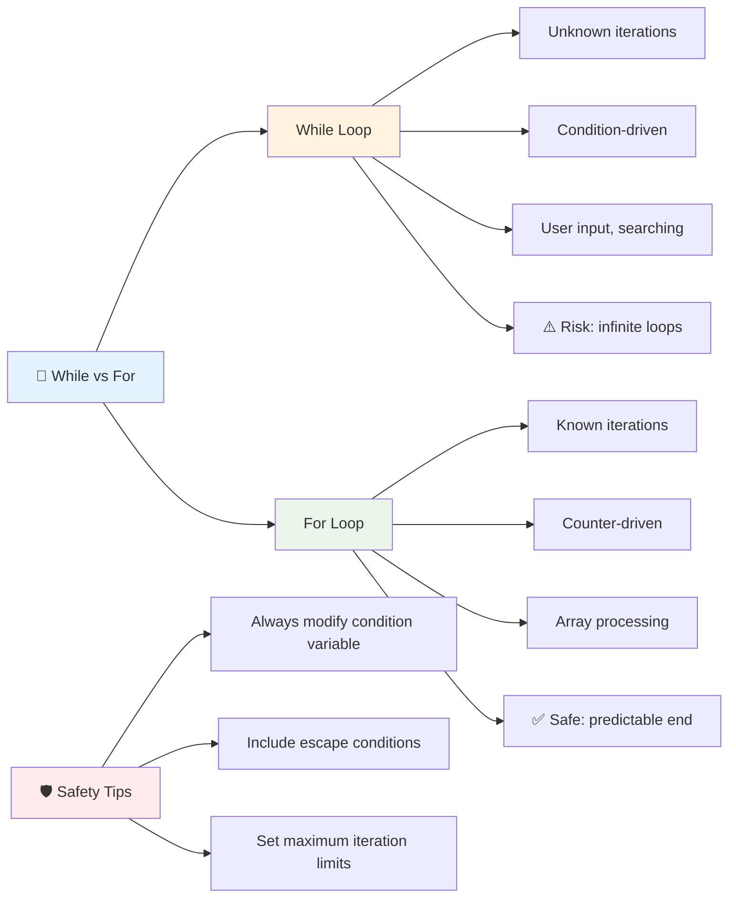

> **सुरक्षा पहिलो**: ह्वाइल लूपहरू शक्तिशाली छन् तर सर्त व्यवस्थापनमा सावधानी आवश्यक छ। सधैं सुनिश्चित गर्नुहोस् कि तपाईंको लूप सर्त अन्ततः झुटो हुनेछ!

### आधुनिक लूप विकल्पहरू

जाभास्क्रिप्टले आधुनिक लूप सिन्ट्याक्स प्रदान गर्दछ जसले तपाईंको कोडलाई पढ्न योग्य र कम त्रुटिपूर्ण बनाउँछ।

**फोर...अफ लूप (ES6+):**

```javascript
const colors = ["red", "green", "blue", "yellow"];

// Modern approach - cleaner and safer
for (const color of colors) {
  console.log(`Color: ${color}`);
}

// Compare with traditional for loop
for (let i = 0; i < colors.length; i++) {
  console.log(`Color: ${colors[i]}`);
}
```

**फोर...अफका मुख्य फाइदाहरू:**
- **इन्डेक्स व्यवस्थापन हटाउँछ** र सम्भावित त्रुटिहरू कम गर्छ
- **प्रत्यक्ष पहुँच प्रदान गर्छ** एरे तत्वहरूमा
- **कोड पढ्न सजिलो बनाउँछ** र सिन्ट्याक्स जटिलता कम गर्छ

**forEach विधि:**

```javascript
const prices = [9.99, 15.50, 22.75, 8.25];

// Using forEach for functional programming style
prices.forEach((price, index) => {
  console.log(`Item ${index + 1}: $${price.toFixed(2)}`);
});

// forEach with arrow functions for simple operations
prices.forEach(price => console.log(`Price: $${price}`));
```

**forEachको बारेमा जान्नुपर्ने कुरा:**
- **प्रत्येक एरे तत्वका लागि कार्यान्वयन गर्छ** एक कार्य
- **प्रदान गर्छ** तत्व मान र इन्डेक्स दुवैलाई प्यारामिटरको रूपमा
- **रोक्न सकिँदैन** प्रारम्भिक रूपमा (परम्परागत लूपहरू विपरीत)
- **फिर्ता दिन्छ** undefined (नयाँ एरे सिर्जना गर्दैन)

✅ तपाईं किन फोर लूप बनाम ह्वाइल लूप रोज्नुहुन्छ? 17K दर्शकहरूले StackOverflowमा यही प्रश्न गरेका थिए, र केही विचारहरू [तपाईंलाई रोचक लाग्न सक्छ](https://stackoverflow.com/questions/39969145/while-loops-vs-for-loops-in-javascript)।

### 🎨 **आधुनिक लूप सिन्ट्याक्स जाँच: ES6+ अपनाउँदै**

**तपाईंको आधुनिक जाभास्क्रिप्ट बुझाइ मूल्यांकन गर्नुहोस्:**
- परम्परागत फोर लूपहरूमा `for...of` का फाइदाहरू के हुन्?
- तपाईं कहिले परम्परागत फोर लूपहरू रोज्न सक्नुहुन्छ?
- `forEach` र `map` बीचको फरक के हो?

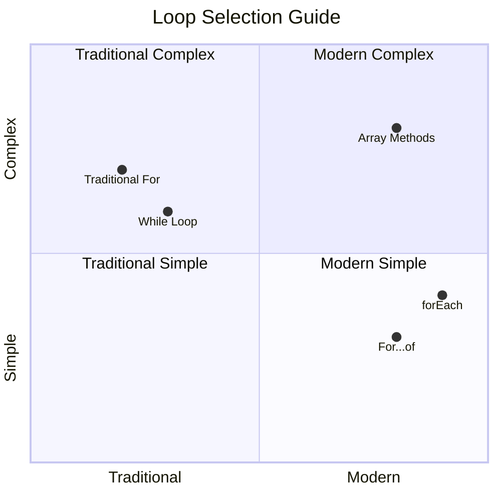

> **आधुनिक प्रवृत्ति**: ES6+ सिन्ट्याक्स जस्तै `for...of` र `forEach` एरे पुनरावृत्तिका लागि प्राथमिक दृष्टिकोण बनिरहेको छ किनभने यो सफा र कम त्रुटिपूर्ण छ!

## लूपहरू र एरेहरू

एरेहरूलाई लूपहरूसँग संयोजन गर्दा शक्तिशाली डेटा प्रशोधन क्षमता सिर्जना हुन्छ। यो जोडी धेरै प्रोग्रामिङ कार्यहरूको लागि आधारभूत हो, सूचीहरू देखाउनेदेखि लिएर तथ्याङ्कहरू गणना गर्नसम्म।

**परम्परागत एरे प्रशोधन:**

```javascript
const iceCreamFlavors = ["Chocolate", "Strawberry", "Vanilla", "Pistachio", "Rocky Road"];

// Classic for loop approach
for (let i = 0; i < iceCreamFlavors.length; i++) {
  console.log(`Flavor ${i + 1}: ${iceCreamFlavors[i]}`);
}

// Modern for...of approach
for (const flavor of iceCreamFlavors) {
  console.log(`Available flavor: ${flavor}`);
}
```

**प्रत्येक दृष्टिकोण बुझौं:**
- **प्रयोग गर्छ** एरे लम्बाइ गुण लूप सीमा निर्धारण गर्न
- **पहुंच गर्छ** परम्परागत फोर लूपहरूमा इन्डेक्सद्वारा तत्वहरू
- **प्रत्यक्ष तत्व पहुँच प्रदान गर्छ** फोर...अफ लूपहरूमा
- **प्रत्येक एरे तत्वलाई ठीक एक पटक प्रक्रिया गर्छ**

**व्यावहारिक डेटा प्रशोधन उदाहरण:**

```javascript
const studentGrades = [85, 92, 78, 96, 88, 73, 89];
let total = 0;
let highestGrade = studentGrades[0];
let lowestGrade = studentGrades[0];

// Process all grades with a single loop
for (let i = 0; i < studentGrades.length; i++) {
  const grade = studentGrades[i];
  total += grade;
  
  if (grade > highestGrade) {
    highestGrade = grade;
  }
  
  if (grade < lowestGrade) {
    lowestGrade = grade;
  }
}

const average = total / studentGrades.length;
console.log(`Average: ${average.toFixed(1)}`);
console.log(`Highest: ${highestGrade}`);
console.log(`Lowest: ${lowestGrade}`);
```

**यो कोड कसरी काम गर्छ:**
- **सुरु गर्छ** ट्र्याकिङ भेरिएबलहरू सम, चरम मानहरूको लागि
- **प्रत्येक ग्रेड प्रक्रिया गर्छ** एकल कुशल लूपद्वारा
- **कुल जम्मा गर्छ** औसत गणनाका लागि
- **ट्र्याक गर्छ** उच्चतम र न्यूनतम मानहरू पुनरावृत्तिको क्रममा
- **अन्तिम तथ्याङ्कहरू गणना गर्छ** लूप पूरा भएपछि

✅ आफ्नो ब्राउजरको कन्सोलमा आफ्नै एरेमा लूप गर्दै प्रयोग गर्नुहोस्।

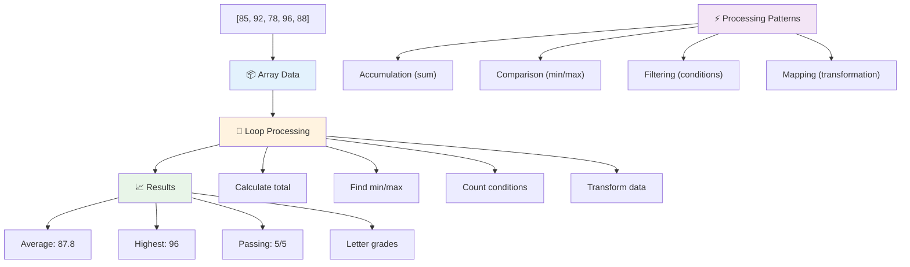

---

## GitHub Copilot एजेन्ट चुनौती 🚀

एजेन्ट मोड प्रयोग गरेर निम्न चुनौती पूरा गर्नुहोस्:

**विवरण:** एरेहरू र लूपहरू संयोजन गरेर डेटासेट विश्लेषण गर्ने र अर्थपूर्ण अन्तर्दृष्टि उत्पन्न गर्ने व्यापक डेटा प्रशोधन कार्य सिर्जना गर्नुहोस्।

**प्रम्ट:** `analyzeGrades` नामक एक कार्य सिर्जना गर्नुहोस् जसले विद्यार्थी ग्रेड वस्तुहरूको एरे (प्रत्येकमा नाम र स्कोर गुणहरू समावेश छन्) लिन्छ र तथ्याङ्कहरू सहितको वस्तु फिर्ता गर्छ जस्तै उच्चतम स्कोर, न्यूनतम स्कोर, औसत स्कोर, पास भएका विद्यार्थीहरूको संख्या (स्कोर >= 70
जाभास्क्रिप्टले केही आधुनिक एरे मेथडहरू प्रदान गर्दछ जसले विशेष कार्यहरूको लागि परम्परागत लूपहरूलाई प्रतिस्थापन गर्न सक्छ। [forEach](https://developer.mozilla.org/docs/Web/JavaScript/Reference/Global_Objects/Array/forEach), [for-of](https://developer.mozilla.org/docs/Web/JavaScript/Reference/Statements/for...of), [map](https://developer.mozilla.org/docs/Web/JavaScript/Reference/Global_Objects/Array/map), [filter](https://developer.mozilla.org/docs/Web/JavaScript/Reference/Global_Objects/Array/filter), र [reduce](https://developer.mozilla.org/docs/Web/JavaScript/Reference/Global_Objects/Array/reduce) को अन्वेषण गर्नुहोस्।

**तपाईंको चुनौती:** विद्यार्थी ग्रेडको उदाहरणलाई कम्तीमा तीन फरक एरे मेथडहरू प्रयोग गरेर पुनःलेखन गर्नुहोस्। आधुनिक जाभास्क्रिप्ट सिन्ट्याक्सले कोड कति सफा र पढ्न सजिलो बनाउँछ भन्ने कुरामा ध्यान दिनुहोस्।

## पोस्ट-लेक्चर क्विज
[पोस्ट-लेक्चर क्विज](https://ff-quizzes.netlify.app/web/quiz/14)

## समीक्षा र आत्म-अध्ययन

जाभास्क्रिप्टमा एरेहरूमा धेरै मेथडहरू जोडिएका छन्, जुन डाटा हेरफेरको लागि अत्यन्त उपयोगी छन्। [यी मेथडहरूबारे पढ्नुहोस्](https://developer.mozilla.org/docs/Web/JavaScript/Reference/Global_Objects/Array) र आफ्नो सिर्जनाको एरेमा केही प्रयास गर्नुहोस् (जस्तै push, pop, slice र splice)।

## असाइनमेन्ट

[एरे लूप गर्नुहोस्](assignment.md)

---

## 📊 **तपाईंको एरेहरू र लूप टूलकिट सारांश**

```mermaid
graph TD
    A["🎯 Arrays & Loops Mastery"] --> B["📦 Array Fundamentals"]
    A --> C["🔄 Loop Types"]
    A --> D["🔗 Data Processing"]
    A --> E["🎨 Modern Techniques"]
    
    B --> B1["Creation: [ ]"]
    B --> B2["Indexing: arr[0]"]
    B --> B3["Methods: push, pop"]
    B --> B4["Properties: length"]
    
    C --> C1["For: Known iterations"]
    C --> C2["While: Condition-based"]
    C --> C3["For...of: Direct access"]
    C --> C4["forEach: Functional"]
    
    D --> D1["Statistics calculation"]
    D --> D2["Data transformation"]
    D --> D3["Filtering & searching"]
    D --> D4["Real-time processing"]
    
    E --> E1["Arrow functions"]
    E --> E2["Method chaining"]
    E --> E3["Destructuring"]
    E --> E4["Template literals"]
    
    F["💡 Key Benefits"] --> F1["Efficient data handling"]
    F --> F2["Reduced code repetition"]
    F --> F3["Scalable solutions"]
    F --> F4["Cleaner syntax"]
    
    style A fill:#e3f2fd
    style B fill:#e8f5e8
    style C fill:#fff3e0
    style D fill:#f3e5f5
    style E fill:#e0f2f1
    style F fill:#fce4ec
```

---

## 🚀 तपाईंको एरेहरू र लूप मास्टरी टाइमलाइन

### ⚡ **तपाईंले अर्को ५ मिनेटमा गर्न सक्ने कुरा**
- [ ] आफ्नो मनपर्ने फिल्महरूको एरे सिर्जना गर्नुहोस् र विशिष्ट तत्वहरू पहुँच गर्नुहोस्
- [ ] १ देखि १० सम्म गणना गर्ने एउटा for लूप लेख्नुहोस्
- [ ] पाठबाट आधुनिक एरे मेथडहरूको चुनौती प्रयास गर्नुहोस्
- [ ] आफ्नो ब्राउजर कन्सोलमा एरे इन्डेक्सिङ अभ्यास गर्नुहोस्

### 🎯 **तपाईंले यो घण्टामा हासिल गर्न सक्ने कुरा**
- [ ] पोस्ट-लेक्चर क्विज पूरा गर्नुहोस् र कुनै चुनौतीपूर्ण अवधारणाहरू समीक्षा गर्नुहोस्
- [ ] GitHub Copilot चुनौतीबाट व्यापक ग्रेड एनालाइजर निर्माण गर्नुहोस्
- [ ] वस्तुहरू थप्ने र हटाउने एउटा साधारण किनमेल कार्ट बनाउनुहोस्
- [ ] विभिन्न लूप प्रकारहरूमा रूपान्तरण अभ्यास गर्नुहोस्
- [ ] `push`, `pop`, `slice`, र `splice` जस्ता एरे मेथडहरूमा प्रयोग गर्नुहोस्

### 📅 **तपाईंको हप्ताभरि डाटा प्रोसेसिङ यात्रा**
- [ ] "एरे लूप गर्नुहोस्" असाइनमेन्ट रचनात्मक सुधारसहित पूरा गर्नुहोस्
- [ ] एरेहरू र लूपहरू प्रयोग गरेर टु-डु सूची एप्लिकेसन बनाउनुहोस्
- [ ] संख्यात्मक डाटाको लागि साधारण तथ्यांक क्यालकुलेटर बनाउनुहोस्
- [ ] [MDN एरे मेथडहरू](https://developer.mozilla.org/docs/Web/JavaScript/Reference/Global_Objects/Array) संग अभ्यास गर्नुहोस्
- [ ] फोटो ग्यालरी वा संगीत प्लेलिस्ट इन्टरफेस निर्माण गर्नुहोस्
- [ ] `map`, `filter`, र `reduce` संग फङ्सनल प्रोग्रामिङ अन्वेषण गर्नुहोस्

### 🌟 **तपाईंको महिनाभरि रूपान्तरण**
- [ ] उन्नत एरे अपरेसनहरू र प्रदर्शन अनुकूलनमा महारत हासिल गर्नुहोस्
- [ ] पूर्ण डाटा भिजुअलाइजेसन ड्यासबोर्ड निर्माण गर्नुहोस्
- [ ] डाटा प्रोसेसिङ समावेश गर्ने ओपन सोर्स प्रोजेक्टहरूमा योगदान गर्नुहोस्
- [ ] व्यावहारिक उदाहरणहरूसँग कसैलाई एरेहरू र लूपहरूबारे सिकाउनुहोस्
- [ ] पुनः प्रयोग गर्न मिल्ने डाटा प्रोसेसिङ फङ्सनहरूको व्यक्तिगत पुस्तकालय सिर्जना गर्नुहोस्
- [ ] एरेहरूमा आधारित एल्गोरिदम र डाटा संरचनाहरू अन्वेषण गर्नुहोस्

### 🏆 **अन्तिम डाटा प्रोसेसिङ च्याम्पियन चेक-इन**

**तपाईंको एरे र लूप मास्टरीको उत्सव मनाउनुहोस्:**
- वास्तविक संसारको अनुप्रयोगहरूको लागि तपाईंले सिकेको सबैभन्दा उपयोगी एरे अपरेसन के हो?
- कुन लूप प्रकार तपाईंलाई सबैभन्दा प्राकृतिक लाग्छ र किन?
- एरेहरू र लूपहरूको समझले डाटा व्यवस्थित गर्ने तपाईंको दृष्टिकोणलाई कसरी परिवर्तन गर्यो?
- तपाईंले अर्को कुन जटिल डाटा प्रोसेसिङ कार्यलाई सम्बोधन गर्न चाहनुहुन्छ?

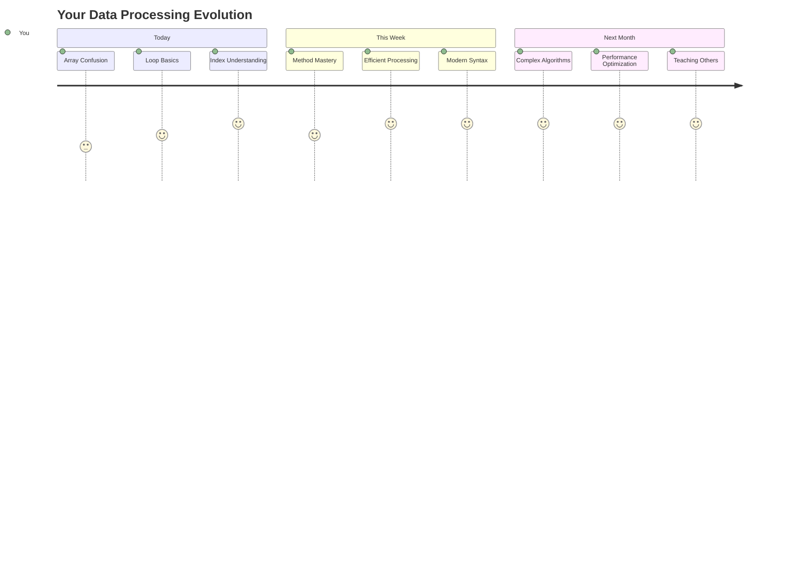

> 📦 **तपाईंले डाटा संगठन र प्रोसेसिङको शक्ति अनलक गर्नुभएको छ!** एरेहरू र लूपहरू लगभग हरेक एप्लिकेसनको आधार हुन् जुन तपाईंले कहिल्यै निर्माण गर्नुहुनेछ। साधारण सूचीहरूदेखि जटिल डाटा विश्लेषणसम्म, तपाईंसँग अब जानकारीलाई कुशलतापूर्वक र सुन्दर रूपमा ह्यान्डल गर्ने उपकरणहरू छन्। प्रत्येक गतिशील वेबसाइट, मोबाइल एप, र डाटा-चालित एप्लिकेसन यी आधारभूत अवधारणाहरूमा निर्भर गर्दछ। स्केलेबल डाटा प्रोसेसिङको संसारमा स्वागत छ! 🎉

---

**अस्वीकरण**:  
यो दस्तावेज़ AI अनुवाद सेवा [Co-op Translator](https://github.com/Azure/co-op-translator) प्रयोग गरेर अनुवाद गरिएको छ। हामी शुद्धताको लागि प्रयास गर्छौं, तर कृपया ध्यान दिनुहोस् कि स्वचालित अनुवादमा त्रुटिहरू वा अशुद्धताहरू हुन सक्छ। यसको मूल भाषा मा रहेको दस्तावेज़लाई आधिकारिक स्रोत मानिनुपर्छ। महत्वपूर्ण जानकारीको लागि, व्यावसायिक मानव अनुवाद सिफारिस गरिन्छ। यस अनुवादको प्रयोगबाट उत्पन्न हुने कुनै पनि गलतफहमी वा गलत व्याख्याको लागि हामी जिम्मेवार हुने छैनौं।