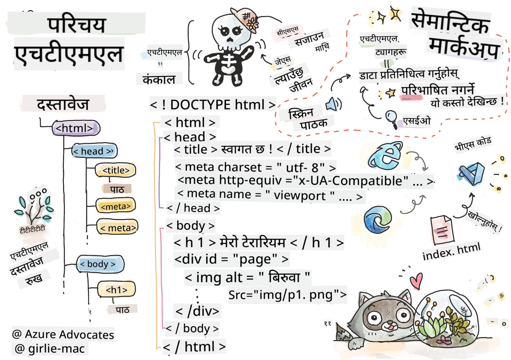
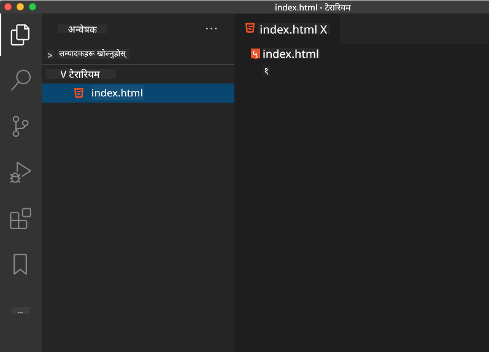

<!--
CO_OP_TRANSLATOR_METADATA:
{
  "original_hash": "20c72cf2e5b0050d38ca3cb14a75a9df",
  "translation_date": "2025-10-22T17:01:03+00:00",
  "source_file": "3-terrarium/1-intro-to-html/README.md",
  "language_code": "ne"
}
-->
# टेरारियम परियोजना भाग १: HTML को परिचय


> स्केच नोट [टोमोमी इमुरा](https://twitter.com/girlie_mac) द्वारा

HTML, वा हाइपरटेक्स्ट मार्कअप भाषा, तपाईंले कहिल्यै भ्रमण गरेको प्रत्येक वेबसाइटको आधार हो। HTML लाई वेब पृष्ठहरूको संरचना दिने हड्डीको रूपमा सोच्नुहोस् – यसले सामग्री कहाँ जान्छ, कसरी व्यवस्थित हुन्छ, र प्रत्येक टुक्राले के प्रतिनिधित्व गर्छ भनेर परिभाषित गर्दछ। CSS पछि तपाईंको HTML लाई रंग र लेआउटले "सजाउनेछ", र JavaScript ले अन्तरक्रियात्मकता संग यसलाई जीवन्त बनाउनेछ, HTML ले आवश्यक संरचना प्रदान गर्दछ जसले अरू सबै सम्भव बनाउँछ।

यस पाठमा, तपाईंले भर्चुअल टेरारियम इन्टरफेसको लागि HTML संरचना सिर्जना गर्नुहुनेछ। यो व्यावहारिक परियोजनाले तपाईंलाई HTML को आधारभूत अवधारणाहरू सिकाउँछ जबकि दृश्यात्मक रूपमा आकर्षक केहि निर्माण गर्दै। तपाईंले सामग्रीलाई अर्थपूर्ण तत्वहरू प्रयोग गरेर व्यवस्थित गर्ने, छविहरूसँग काम गर्ने, र अन्तरक्रियात्मक वेब अनुप्रयोगको आधार सिर्जना गर्ने सिक्नुहुनेछ।

पाठको अन्त्यसम्ममा, तपाईंले HTML पृष्ठ तयार गर्नुहुनेछ जसले व्यवस्थित स्तम्भहरूमा बिरुवाका छविहरू प्रदर्शन गर्दछ, अर्को पाठमा शैलीको लागि तयार। चिन्ता नगर्नुहोस् यदि यो सुरुमा आधारभूत देखिन्छ – CSS ले दृश्यात्मक चमक थप्नु अघि HTML ले ठीक यही गर्नुपर्छ।

## प्रि-लेक्चर क्विज

[प्रि-लेक्चर क्विज](https://ff-quizzes.netlify.app/web/quiz/15)

> 📺 **हेर्नुहोस् र सिक्नुहोस्**: यो उपयोगी भिडियो अवलोकन हेर्नुहोस्
> 
> [](https://www.youtube.com/watch?v=1TvxJKBzhyQ)

## तपाईंको परियोजना सेट अप गर्दै

HTML को कोडमा प्रवेश गर्नु अघि, तपाईंको टेरारियम परियोजनाको लागि उचित कार्यक्षेत्र सेट अप गरौं। सुरुबाट व्यवस्थित फाइल संरचना सिर्जना गर्नु वेब विकासको यात्रामा तपाईंलाई राम्रो सेवा दिने महत्त्वपूर्ण बानी हो।

### कार्य: तपाईंको परियोजना संरचना सिर्जना गर्नुहोस्

तपाईंले आफ्नो टेरारियम परियोजनाको लागि समर्पित फोल्डर सिर्जना गर्नुहुनेछ र आफ्नो पहिलो HTML फाइल थप्नुहुनेछ। यहाँ दुई दृष्टिकोणहरू छन् जुन तपाईं प्रयोग गर्न सक्नुहुन्छ:

**विकल्प १: Visual Studio Code प्रयोग गर्दै**
1. Visual Studio Code खोल्नुहोस्
2. "File" → "Open Folder" मा क्लिक गर्नुहोस् वा `Ctrl+K, Ctrl+O` (Windows/Linux) वा `Cmd+K, Cmd+O` (Mac) प्रयोग गर्नुहोस्
3. `terrarium` नामको नयाँ फोल्डर सिर्जना गर्नुहोस् र यसलाई चयन गर्नुहोस्
4. Explorer प्यानमा, "New File" आइकनमा क्लिक गर्नुहोस्
5. तपाईंको फाइललाई `index.html` नाम दिनुहोस्



**विकल्प २: टर्मिनल कमाण्डहरू प्रयोग गर्दै**
```bash
mkdir terrarium
cd terrarium
touch index.html
code index.html
```

**यी कमाण्डहरूले के गर्छन्:**
- **नयाँ डाइरेक्टरी सिर्जना गर्छन्** जसको नाम `terrarium` छ
- **टेरारियम डाइरेक्टरीमा जान्छ**
- **खाली `index.html` फाइल सिर्जना गर्छ**
- **फाइललाई Visual Studio Code मा सम्पादनको लागि खोल्छ**

> 💡 **प्रो टिप**: फाइल नाम `index.html` वेब विकासमा विशेष छ। जब कोही वेबसाइट भ्रमण गर्छ, ब्राउजरहरूले स्वतः `index.html` लाई डिफल्ट पृष्ठको रूपमा प्रदर्शन गर्न खोज्छ। यसको मतलब `https://mysite.com/projects/` जस्तो URL ले `projects` फोल्डरबाट `index.html` फाइल स्वतः सेवा गर्नेछ बिना URL मा फाइल नाम निर्दिष्ट नगरी।

## HTML डकुमेन्ट संरचना बुझ्दै

प्रत्येक HTML डकुमेन्टले ब्राउजरहरूले सही रूपमा बुझ्न र प्रदर्शन गर्न आवश्यक विशिष्ट संरचना अनुसरण गर्दछ। यस संरचनालाई औपचारिक पत्र जस्तै सोच्नुहोस् – यसमा आवश्यक तत्वहरू छन् जुन ब्राउजरले सामग्रीलाई सही रूपमा प्रक्रिया गर्न मद्दत गर्दछ।

आउनुहोस्, प्रत्येक HTML डकुमेन्टलाई आवश्यक पर्ने आधारभूत संरचना थप्न सुरु गरौं।

### DOCTYPE घोषणा र रूट तत्व

कुनै पनि HTML फाइलको पहिलो दुई लाइनले ब्राउजरलाई डकुमेन्टको "परिचय" दिन्छ:

```html
<!DOCTYPE html>
<html></html>
```

**यस कोडले के गर्छ:**
- **डकुमेन्ट प्रकारलाई HTML5 को रूपमा घोषणा गर्छ** `<!DOCTYPE html>` प्रयोग गरेर
- **रूट `<html>` तत्व सिर्जना गर्छ** जसले सबै पृष्ठ सामग्री समावेश गर्दछ
- **आधुनिक वेब मापदण्डहरू स्थापना गर्छ** सही ब्राउजर रेंडरिंगको लागि
- **विभिन्न ब्राउजर र उपकरणहरूमा स्थिर प्रदर्शन सुनिश्चित गर्छ**

> 💡 **VS Code टिप**: VS Code मा कुनै पनि HTML ट्यागमा होभर गर्नुहोस् र MDN Web Docs बाट उपयोगी जानकारी हेर्नुहोस्, जसमा प्रयोगका उदाहरणहरू र ब्राउजर अनुकूलता विवरणहरू समावेश छन्।

> 📚 **थप जान्नुहोस्**: DOCTYPE घोषणा ब्राउजरहरूलाई "quirks mode" मा प्रवेश गर्न रोक्छ, जुन धेरै पुरानो वेबसाइटहरूलाई समर्थन गर्न प्रयोग गरिएको थियो। आधुनिक वेब विकासले सरल `<!DOCTYPE html>` घोषणा प्रयोग गर्दछ [मापदण्ड-अनुकूल रेंडरिंग](https://developer.mozilla.org/docs/Web/HTML/Quirks_Mode_and_Standards_Mode) सुनिश्चित गर्न।

## आवश्यक डकुमेन्ट मेटाडाटा थप्दै

HTML डकुमेन्टको `<head>` खण्डले ब्राउजरहरू र सर्च इन्जिनहरूलाई आवश्यक जानकारी समावेश गर्दछ, तर आगन्तुकहरूले पृष्ठमा प्रत्यक्ष रूपमा देख्दैनन्। यसलाई "पृष्ठको पछाडि" जानकारीको रूपमा सोच्नुहोस् जसले तपाईंको वेबपृष्ठलाई सही रूपमा काम गर्न र विभिन्न उपकरणहरू र प्लेटफर्महरूमा सही रूपमा देखिन मद्दत गर्दछ।

यो मेटाडाटाले ब्राउजरहरूलाई तपाईंको पृष्ठ कसरी प्रदर्शन गर्ने, कुन क्यारेक्टर एन्कोडिङ प्रयोग गर्ने, र विभिन्न स्क्रिन साइजहरू कसरी ह्यान्डल गर्ने भन्ने बताउँछ – व्यावसायिक, पहुँचयोग्य वेबपृष्ठहरू सिर्जना गर्न आवश्यक सबै।

### कार्य: डकुमेन्ट हेड थप्नुहोस्

तपाईंको `<html>` ट्यागहरूको बीचमा यो `<head>` खण्ड समावेश गर्नुहोस्:

```html
<head>
	<title>Welcome to my Virtual Terrarium</title>
	<meta charset="utf-8" />
	<meta http-equiv="X-UA-Compatible" content="IE=edge" />
	<meta name="viewport" content="width=device-width, initial-scale=1" />
</head>
```

**प्रत्येक तत्वले के गर्छ:**
- **पृष्ठ शीर्षक सेट गर्छ** जुन ब्राउजर ट्याबहरू र सर्च परिणामहरूमा देखिन्छ
- **UTF-8 क्यारेक्टर एन्कोडिङ निर्दिष्ट गर्छ** विश्वव्यापी रूपमा सही पाठ प्रदर्शनको लागि
- **आधुनिक Internet Explorer संस्करणहरूसँग अनुकूलता सुनिश्चित गर्छ**
- **उत्तरदायी डिजाइन कन्फिगर गर्छ** उपकरण चौडाइसँग मिल्ने भ्यूपोर्ट सेट गरेर
- **प्रारम्भिक जूम स्तर नियन्त्रण गर्छ** सामग्रीलाई प्राकृतिक आकारमा प्रदर्शन गर्न

> 🤔 **यसको बारेमा सोच्नुहोस्**: यदि तपाईंले यस्तो भ्यूपोर्ट मेटा ट्याग सेट गर्नुभयो भने के हुन्छ: `<meta name="viewport" content="width=600">`? यसले पृष्ठलाई सधैं 600 पिक्सेल चौडाइमा बाध्य पार्नेछ, उत्तरदायी डिजाइनलाई बिगार्नेछ! [सही भ्यूपोर्ट कन्फिगरेसन](https://developer.mozilla.org/docs/Web/HTML/Viewport_meta_tag) को बारेमा थप जान्नुहोस्।

## डकुमेन्ट बडी निर्माण गर्दै

HTML को `<body>` तत्वले तपाईंको वेबपृष्ठको सबै दृश्य सामग्री समावेश गर्दछ – प्रयोगकर्ताहरूले देख्ने र अन्तरक्रिया गर्ने सबै कुरा। `<head>` खण्डले ब्राउजरलाई निर्देशन प्रदान गर्‍यो भने, `<body>` खण्डले वास्तविक सामग्री समावेश गर्दछ: पाठ, छविहरू, बटनहरू, र अन्य तत्वहरू जसले तपाईंको प्रयोगकर्ता इन्टरफेस सिर्जना गर्छ।

आउनुहोस्, बडी संरचना थपौं र HTML ट्यागहरू कसरी सँगै काम गर्छन् भन्ने बुझौं।

### HTML ट्याग संरचना बुझ्दै

HTML ले तत्वहरू परिभाषित गर्न जोडी ट्यागहरू प्रयोग गर्दछ। अधिकांश ट्यागहरूमा `<p>` जस्तो खोल्ने ट्याग र `</p>` जस्तो बन्द गर्ने ट्याग हुन्छ, बीचमा सामग्री सहित: `<p>Hello, world!</p>`। यसले "Hello, world!" पाठ समावेश गर्ने अनुच्छेद तत्व सिर्जना गर्छ।

### कार्य: बडी तत्व थप्नुहोस्

तपाईंको HTML फाइललाई `<body>` तत्व समावेश गर्न अद्यावधिक गर्नुहोस्:

```html
<!DOCTYPE html>
<html>
	<head>
		<title>Welcome to my Virtual Terrarium</title>
		<meta charset="utf-8" />
		<meta http-equiv="X-UA-Compatible" content="IE=edge" />
		<meta name="viewport" content="width=device-width, initial-scale=1" />
	</head>
	<body></body>
</html>
```

**यस पूर्ण संरचनाले के प्रदान गर्छ:**
- **HTML5 डकुमेन्टको आधारभूत फ्रेमवर्क स्थापना गर्छ**
- **सही ब्राउजर रेंडरिंगको लागि आवश्यक मेटाडाटा समावेश गर्छ**
- **तपाईंको दृश्य सामग्रीको लागि खाली बडी सिर्जना गर्छ**
- **आधुनिक वेब विकासको उत्कृष्ट अभ्यासहरू अनुसरण गर्छ**

अब तपाईं आफ्नो टेरारियमको दृश्य तत्वहरू थप्न तयार हुनुहुन्छ। हामी `<div>` तत्वहरूलाई कन्टेनरको रूपमा प्रयोग गर्नेछौं विभिन्न सामग्री खण्डहरू व्यवस्थित गर्न, र `` तत्वहरू बिरुवाका छविहरू प्रदर्शन गर्न।

### छविहरू र लेआउट कन्टेनरहरूसँग काम गर्दै

HTML मा छविहरू विशेष छन् किनभने तिनीहरूले "स्व-समापन" ट्यागहरू प्रयोग गर्छन्। `<p></p>` जस्ता तत्वहरू सामग्री वरिपरि घेरिन्छन् भने, `` ट्यागले सबै जानकारी ट्याग भित्रै समावेश गर्दछ जस्तै `src` छवि फाइल पथको लागि र `alt` पहुँचयोग्यताको लागि।

छविहरूलाई HTML मा थप्नु अघि, तपाईंले आफ्नो परियोजना फाइलहरू व्यवस्थित गर्न आवश्यक छविहरूको फोल्डर सिर्जना गर्नुपर्नेछ र बिरुवाका ग्राफिक्सहरू थप्नुपर्नेछ।

**पहिले, तपाईंको छविहरू सेट अप गर्नुहोस्:**
1. तपाईंको टेरारियम परियोजना फोल्डर भित्र `images` नामको फोल्डर सिर्जना गर्नुहोस्
2. [समाधान फोल्डर](../../../../3-terrarium/solution/images) बाट बिरुवाका छविहरू डाउनलोड गर्नुहोस् (कुल १४ बिरुवाका छविहरू)
3. सबै बिरुवाका छविहरू तपाईंको नयाँ `images` फोल्डरमा प्रतिलिपि गर्नुहोस्

### कार्य: बिरुवा प्रदर्शन लेआउट सिर्जना गर्नुहोस्

अब तपाईंको `<body></body>` ट्यागहरूको बीचमा दुई स्तम्भहरूमा व्यवस्थित बिरुवाका छविहरू थप्नुहोस्:

```html
<div id="page">
	<div id="left-container" class="container">
		<div class="plant-holder">
			
		</div>
		<div class="plant-holder">
			
		</div>
		<div class="plant-holder">
			
		</div>
		<div class="plant-holder">
			
		</div>
		<div class="plant-holder">
			
		</div>
		<div class="plant-holder">
			
		</div>
		<div class="plant-holder">
			
		</div>
	</div>
	<div id="right-container" class="container">
		<div class="plant-holder">
			
		</div>
		<div class="plant-holder">
			
		</div>
		<div class="plant-holder">
			
		</div>
		<div class="plant-holder">
			
		</div>
		<div class="plant-holder">
			
		</div>
		<div class="plant-holder">
			
		</div>
		<div class="plant-holder">
			
		</div>
	</div>
</div>
```

**चरणबद्ध रूपमा, यस कोडमा के भइरहेको छ:**
- **मुख्य पृष्ठ कन्टेनर सिर्जना गर्छ** `id="page"` सबै सामग्री समावेश गर्न
- **दुई स्तम्भ कन्टेनर स्थापना गर्छ**: `left-container` र `right-container`
- **बायाँ स्तम्भमा ७ बिरुवा र दायाँ स्तम्भमा ७ बिरुवा व्यवस्थित गर्छ**
- **प्रत्येक बिरुवा छवि `plant-holder` div मा घेरिन्छ व्यक्तिगत स्थिति निर्धारण गर्न**
- **CSS शैलीको लागि सुसंगत वर्ग नामहरू लागू गर्छ अर्को पाठमा**
- **प्रत्येक बिरुवा छविलाई JavaScript अन्तरक्रियाको लागि अद्वितीय ID प्रदान गर्छ**
- **छविहरू फोल्डरमा सही फाइल पथ समावेश गर्छ**

> 🤔 **यसको बारेमा सोच्नुहोस्**: ध्यान दिनुहोस् कि सबै छविहरू हाल "plant" जस्तै समान alt पाठ छ। यो पहुँचयोग्यताको लागि आदर्श होइन। स्क्रिन रिडर प्रयोगकर्ताहरूले "plant" १४ पटक दोहोरिएको सुन्थे तर प्रत्येक छविले कुन विशिष्ट बिरुवा देखाउँछ भन्ने थाहा पाउँदैनन्। के तपाईं प्रत्येक छविको लागि राम्रो, अधिक वर्णनात्मक alt पाठ सोच्न सक्नुहुन्छ?

> 📝 **HTML तत्व प्रकारहरू**: `<div>` तत्वहरू "ब्लक-स्तर" हुन् र पूर्ण चौडाइ लिन्छन्, जबकि `<span>` तत्वहरू "इनलाइन" हुन् र आवश्यक चौडाइ मात्र लिन्छन्। तपाईंले यी सबै `<div>` ट्यागहरूलाई `<span>` ट्यागहरूमा परिवर्तन गर्नुभयो भने के हुन्छ?

यस मार्कअप थपेपछि, बिरुवाहरू स्क्रिनमा देखिनेछन्, यद्यपि तिनीहरू अझै चमकदार देखिने छैनन् – त्यसका लागि CSS अर्को पाठमा छ! अहिलेको लागि, तपाईंले सामग्रीलाई सही रूपमा व्यवस्थित गर्ने र पहुँचयोग्यताको उत्कृष्ट अभ्यासहरू अनुसरण गर्ने ठोस HTML आधार छ।
**प्रस्तावना:** "प्लान्ट केयर गाइड" शीर्षकको साथमा एक सेम्यान्टिक HTML सेक्सन बनाउनुहोस् जसमा "पानी दिने तरिका", "प्रकाशको आवश्यकता", र "माटोको हेरचाह" शीर्षक भएका तीन उप-सेक्सनहरू समावेश छन्। प्रत्येक उप-सेक्सनमा बिरुवाको हेरचाह सम्बन्धी जानकारी भएको एउटा अनुच्छेद समावेश गर्नुहोस्। सामग्रीलाई उपयुक्त रूपमा संरचना गर्न `<section>`, `<h2>`, `<h3>`, र `<p>` जस्ता सेम्यान्टिक HTML ट्यागहरू प्रयोग गर्नुहोस्।

[एजेन्ट मोड](https://code.visualstudio.com/blogs/2025/02/24/introducing-copilot-agent-mode) को बारेमा थप जान्नुहोस्।

## HTML इतिहास चुनौती अन्वेषण गर्नुहोस्

**वेबको विकासबारे सिक्दै**

HTML ले १९९० मा टिम बर्नर्स-लीले CERN मा पहिलो वेब ब्राउजर बनाएको समयदेखि धेरै विकास गरेको छ। केही पुराना ट्यागहरू जस्तै `<marquee>` अहिले डिप्रिकेटेड छन् किनभने तिनीहरू आधुनिक पहुँचयोग्यता मापदण्ड र उत्तरदायी डिजाइन सिद्धान्तहरूसँग राम्रोसँग काम गर्दैनन्।

**यो प्रयोग प्रयास गर्नुहोस्:**
1. आफ्नो `<h1>` शीर्षकलाई अस्थायी रूपमा `<marquee>` ट्यागमा राख्नुहोस्: `<marquee><h1>मेरो टेरारियम</h1></marquee>`
2. आफ्नो पृष्ठ ब्राउजरमा खोल्नुहोस् र स्क्रोल गर्ने प्रभावलाई अवलोकन गर्नुहोस्
3. यो ट्याग किन डिप्रिकेटेड भयो भनेर विचार गर्नुहोस् (सुझाव: प्रयोगकर्ता अनुभव र पहुँचयोग्यता बारे सोच्नुहोस्)
4. `<marquee>` ट्याग हटाउनुहोस् र सेम्यान्टिक मार्कअपमा फर्कनुहोस्

**प्रतिबिम्ब प्रश्नहरू:**
- स्क्रोल गर्ने शीर्षकले दृश्य अपाङ्गता वा गति संवेदनशीलता भएका प्रयोगकर्ताहरूलाई कसरी असर गर्न सक्छ?
- आधुनिक CSS प्रविधिहरूले समान दृश्य प्रभावलाई कसरी अधिक पहुँचयोग्य रूपमा प्राप्त गर्न सक्छ?
- डिप्रिकेटेड तत्वहरूको सट्टा वर्तमान वेब मापदण्ड प्रयोग गर्नु किन महत्त्वपूर्ण छ?

[पुराना र डिप्रिकेटेड HTML तत्वहरू](https://developer.mozilla.org/docs/Web/HTML/Element#Obsolete_and_deprecated_elements) को बारेमा थप अन्वेषण गर्नुहोस् ताकि वेब मापदण्डले प्रयोगकर्ता अनुभव सुधार गर्न कसरी विकास गर्छ भन्ने बुझ्न सकियोस्।


## पोस्ट-व्याख्यान क्विज

[पोस्ट-व्याख्यान क्विज](https://ff-quizzes.netlify.app/web/quiz/16)

## समीक्षा र आत्म अध्ययन

**HTML ज्ञानलाई गहिरो बनाउनुहोस्**

HTML वेबको आधार ३० वर्षभन्दा बढी समयदेखि रहँदै आएको छ, साधारण दस्तावेज मार्कअप भाषाबाट अन्तरक्रियात्मक एप्लिकेसनहरू निर्माण गर्ने परिष्कृत प्लेटफर्ममा विकसित हुँदै। यस विकासलाई बुझ्नाले आधुनिक वेब मापदण्डको कदर गर्न र राम्रो विकास निर्णय लिन मद्दत गर्दछ।

**सिफारिस गरिएको सिकाइ मार्गहरू:**

1. **HTML इतिहास र विकास**
   - HTML 1.0 देखि HTML5 सम्मको समयरेखा अनुसन्धान गर्नुहोस्
   - किन केही ट्यागहरू डिप्रिकेटेड भए (पहुंचयोग्यता, मोबाइल-अनुकूलता, मर्मतयोग्यता)
   - उदयमान HTML सुविधाहरू र प्रस्तावहरूको अनुसन्धान गर्नुहोस्

2. **सेम्यान्टिक HTML गहिरो अध्ययन**
   - [HTML5 सेम्यान्टिक तत्वहरूको पूर्ण सूची](https://developer.mozilla.org/docs/Web/HTML/Element) अध्ययन गर्नुहोस्
   - कहिले `<article>`, `<section>`, `<aside>`, र `<main>` प्रयोग गर्ने भनेर पहिचान गर्ने अभ्यास गर्नुहोस्
   - पहुँचयोग्यता सुधार गर्न ARIA विशेषताहरूको बारेमा जान्नुहोस्

3. **आधुनिक वेब विकास**
   - [उत्तरदायी वेबसाइट निर्माण](https://docs.microsoft.com/learn/modules/build-simple-website/?WT.mc_id=academic-77807-sagibbon) मा Microsoft Learn मा अन्वेषण गर्नुहोस्
   - HTML कसरी CSS र JavaScript सँग एकीकृत हुन्छ भन्ने बुझ्नुहोस्
   - वेब प्रदर्शन र SEO को उत्कृष्ट अभ्यासहरूको बारेमा जान्नुहोस्

**प्रतिबिम्ब प्रश्नहरू:**
- तपाईले कुन डिप्रिकेटेड HTML ट्यागहरू पत्ता लगाउनुभयो, र किन तिनीहरू हटाइयो?
- भविष्यका संस्करणहरूको लागि प्रस्तावित नयाँ HTML सुविधाहरू के हुन्?
- सेम्यान्टिक HTML ले वेब पहुँचयोग्यता र SEO मा कसरी योगदान पुर्‍याउँछ?


## असाइनमेन्ट

[आफ्नो HTML अभ्यास गर्नुहोस्: ब्लग मोकअप निर्माण गर्नुहोस्](assignment.md)

---

**अस्वीकरण**:  
यो दस्तावेज AI अनुवाद सेवा [Co-op Translator](https://github.com/Azure/co-op-translator) प्रयोग गरेर अनुवाद गरिएको छ। हामी शुद्धताको लागि प्रयास गर्छौं, तर कृपया ध्यान दिनुहोस् कि स्वचालित अनुवादमा त्रुटिहरू वा अशुद्धताहरू हुन सक्छ। यसको मूल भाषा मा रहेको मूल दस्तावेजलाई आधिकारिक स्रोत मानिनुपर्छ। महत्वपूर्ण जानकारीको लागि, व्यावसायिक मानव अनुवाद सिफारिस गरिन्छ। यस अनुवादको प्रयोगबाट उत्पन्न हुने कुनै पनि गलतफहमी वा गलत व्याख्याको लागि हामी जिम्मेवार हुने छैनौं।