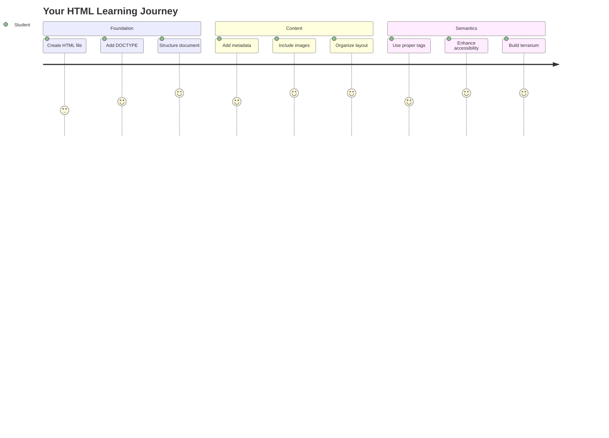
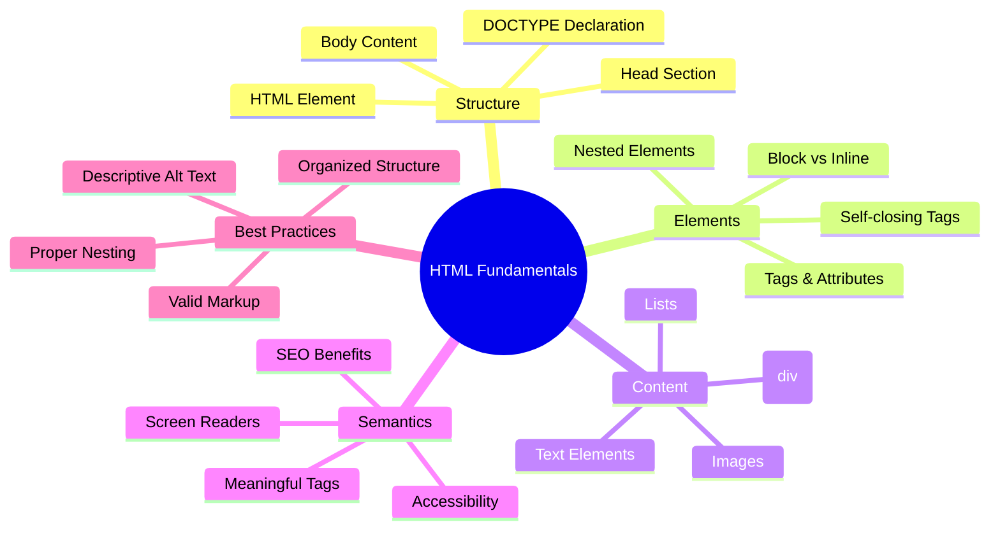
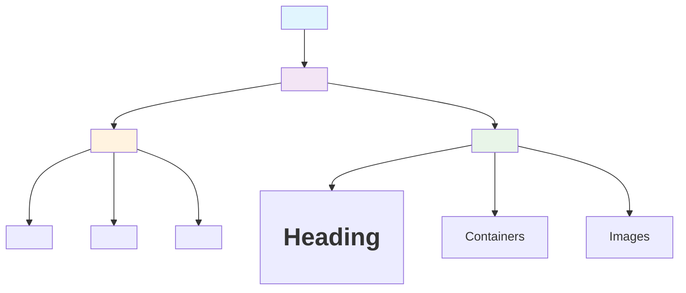
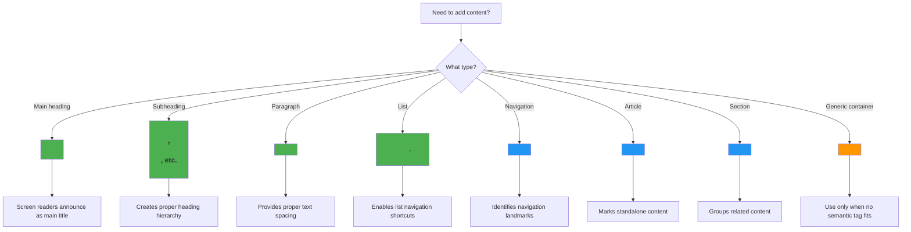
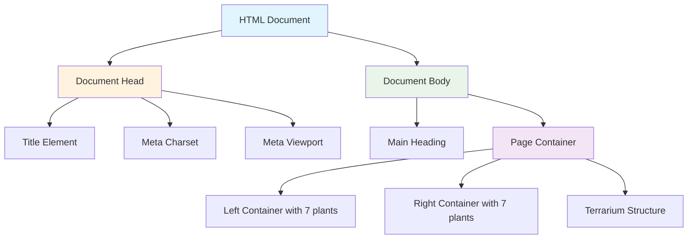
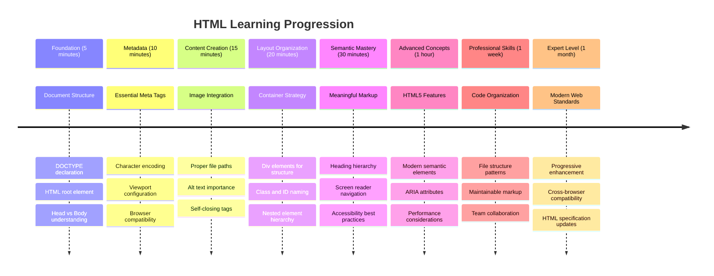

<!--
CO_OP_TRANSLATOR_METADATA:
{
  "original_hash": "3fcfa99c4897e051b558b5eaf1e8cc74",
  "translation_date": "2025-11-03T15:36:01+00:00",
  "source_file": "3-terrarium/1-intro-to-html/README.md",
  "language_code": "ne"
}
-->
# टेरारियम परियोजना भाग १: HTML को परिचय




> स्केच नोट [टोमोमी इमुरा](https://twitter.com/girlie_mac) द्वारा

HTML, वा हाइपरटेक्स्ट मार्कअप भाषा, तपाईंले कहिल्यै भ्रमण गरेको प्रत्येक वेबसाइटको आधार हो। HTML लाई वेब पृष्ठहरूको संरचना दिने कंकालको रूपमा सोच्नुहोस् – यसले सामग्री कहाँ जान्छ, कसरी व्यवस्थित हुन्छ, र प्रत्येक टुक्राले के प्रतिनिधित्व गर्दछ भनेर परिभाषित गर्दछ। CSS ले पछि तपाईंको HTML लाई रंग र लेआउटको साथ "सजाउनेछ", र जाभास्क्रिप्टले अन्तरक्रियात्मकता संग यसलाई जीवनमा ल्याउनेछ, HTML ले सबै कुरा सम्भव बनाउने आवश्यक संरचना प्रदान गर्दछ।

यस पाठमा, तपाईंले भर्चुअल टेरारियम इन्टरफेसको लागि HTML संरचना सिर्जना गर्नुहुनेछ। यो व्यावहारिक परियोजनाले तपाईंलाई मौलिक HTML अवधारणाहरू सिकाउँछ जबकि दृश्य रूपमा आकर्षक केहि निर्माण गर्दै। तपाईंले सामग्रीलाई सेम्यान्टिक तत्वहरू प्रयोग गरेर कसरी व्यवस्थित गर्ने, छविहरूसँग काम गर्ने, र अन्तरक्रियात्मक वेब अनुप्रयोगको लागि आधार सिर्जना गर्ने सिक्नुहुनेछ।

यस पाठको अन्त्यमा, तपाईंले व्यवस्थित स्तम्भहरूमा बिरुवाको छविहरू प्रदर्शन गर्ने कार्यरत HTML पृष्ठ पाउनुहुनेछ, जुन अर्को पाठमा शैलीको लागि तयार हुनेछ। यदि यो सुरुमा आधारभूत देखिन्छ भने चिन्ता नगर्नुहोस् – CSS ले दृश्य चमक थप्नुअघि HTML ले ठीक यही गर्नुपर्छ।



## प्रि-लेक्चर क्विज

[प्रि-लेक्चर क्विज](https://ff-quizzes.netlify.app/web/quiz/15)

> 📺 **हेर्नुहोस् र सिक्नुहोस्**: यो उपयोगी भिडियो अवलोकन हेर्नुहोस्
> 
> [](https://www.youtube.com/watch?v=1TvxJKBzhyQ)

## तपाईंको परियोजना सेट अप गर्दै

HTML कोडमा प्रवेश गर्नु अघि, तपाईंको टेरारियम परियोजनाको लागि उचित कार्यक्षेत्र सेट अप गरौं। सुरुबाट व्यवस्थित फाइल संरचना सिर्जना गर्नु वेब विकासको यात्रामा तपाईंलाई राम्रो सेवा दिने महत्त्वपूर्ण बानी हो।

### कार्य: तपाईंको परियोजना संरचना सिर्जना गर्नुहोस्

तपाईंले आफ्नो टेरारियम परियोजनाको लागि समर्पित फोल्डर सिर्जना गर्नुहुनेछ र आफ्नो पहिलो HTML फाइल थप्नुहुनेछ। यहाँ दुई दृष्टिकोणहरू छन् जुन तपाईं प्रयोग गर्न सक्नुहुन्छ:

**विकल्प १: भिजुअल स्टुडियो कोड प्रयोग गर्दै**
1. भिजुअल स्टुडियो कोड खोल्नुहोस्
2. "फाइल" → "फोल्डर खोल्नुहोस्" क्लिक गर्नुहोस् वा `Ctrl+K, Ctrl+O` (विन्डोज/लिनक्स) वा `Cmd+K, Cmd+O` (म्याक) प्रयोग गर्नुहोस्
3. `terrarium` नामक नयाँ फोल्डर सिर्जना गर्नुहोस् र यसलाई चयन गर्नुहोस्
4. एक्सप्लोरर प्यानमा, "नयाँ फाइल" आइकन क्लिक गर्नुहोस्
5. तपाईंको फाइललाई `index.html` नाम दिनुहोस्


**विकल्प २: टर्मिनल कमाण्डहरू प्रयोग गर्दै**
```bash
mkdir terrarium
cd terrarium
touch index.html
code index.html
```

**यी कमाण्डहरूले के गर्छन्:**
- **नयाँ डाइरेक्टरी सिर्जना गर्छन्** `terrarium` नामक तपाईंको परियोजनाको लागि
- **डाइरेक्टरीमा जान्छन्** `terrarium`
- **खाली `index.html` फाइल सिर्जना गर्छन्**
- **फाइललाई भिजुअल स्टुडियो कोडमा सम्पादनको लागि खोल्छन्**

> 💡 **प्रो टिप**: फाइल नाम `index.html` वेब विकासमा विशेष छ। जब कसैले वेबसाइट भ्रमण गर्छ, ब्राउजरहरूले स्वतः `index.html` लाई डिफल्ट पृष्ठको रूपमा प्रदर्शन गर्न खोज्छन्। यसको मतलब `https://mysite.com/projects/` जस्तो URL ले `projects` फोल्डरबाट `index.html` फाइल स्वतः सेवा गर्नेछ बिना URL मा फाइल नाम निर्दिष्ट नगरी।

## HTML डकुमेन्ट संरचना बुझ्दै

प्रत्येक HTML डकुमेन्टले ब्राउजरहरूले सही रूपमा बुझ्न र प्रदर्शन गर्न आवश्यक विशिष्ट संरचनाको पालना गर्दछ। यस संरचनालाई औपचारिक पत्र जस्तै सोच्नुहोस् – यसमा विशेष क्रममा आवश्यक तत्वहरू छन् जसले प्राप्तकर्तालाई (यस अवस्थामा, ब्राउजर) सामग्री सही रूपमा प्रक्रिया गर्न मद्दत गर्दछ।



आउनुहोस्, प्रत्येक HTML डकुमेन्टलाई आवश्यक पर्ने आधारभूत संरचना थप्न सुरु गरौं।

### DOCTYPE घोषणा र रूट तत्व

कुनै पनि HTML फाइलको पहिलो दुई लाइनहरूले ब्राउजरलाई डकुमेन्टको "परिचय" को रूपमा सेवा गर्छन्:

```html
<!DOCTYPE html>
<html></html>
```

**यस कोडले के गर्छ:**
- **डकुमेन्ट प्रकार HTML5 घोषणा गर्छ** `<!DOCTYPE html>` प्रयोग गरेर
- **रूट `<html>` तत्व सिर्जना गर्छ** जसले सबै पृष्ठ सामग्री समावेश गर्दछ
- **आधुनिक वेब मापदण्डहरू स्थापना गर्छ** सही ब्राउजर रेंडरिंगको लागि
- **विभिन्न ब्राउजर र उपकरणहरूमा स्थिर प्रदर्शन सुनिश्चित गर्छ**

> 💡 **VS कोड टिप**: VS कोडमा कुनै पनि HTML ट्यागमा होभर गर्नुहोस् र MDN वेब डक्सबाट उपयोगी जानकारी हेर्नुहोस्, जसमा प्रयोग उदाहरणहरू र ब्राउजर अनुकूलता विवरणहरू समावेश छन्।

> 📚 **थप जान्नुहोस्**: DOCTYPE घोषणाले ब्राउजरहरूलाई "क्विर्क्स मोड" मा प्रवेश गर्नबाट रोक्छ, जुन धेरै पुरानो वेबसाइटहरूलाई समर्थन गर्न प्रयोग गरिएको थियो। आधुनिक वेब विकासले सरल `<!DOCTYPE html>` घोषणाको प्रयोग गर्दछ [मापदण्ड-अनुकूल रेंडरिंग](https://developer.mozilla.org/docs/Web/HTML/Quirks_Mode_and_Standards_Mode) सुनिश्चित गर्न।

### 🔄 **शिक्षण जाँच**
**रोक्नुहोस् र विचार गर्नुहोस्**: अगाडि बढ्नु अघि, सुनिश्चित गर्नुहोस् कि तपाईं बुझ्नुहुन्छ:
- ✅ किन प्रत्येक HTML डकुमेन्टलाई DOCTYPE घोषणाको आवश्यकता हुन्छ
- ✅ `<html>` रूट तत्वले के समावेश गर्दछ
- ✅ यो संरचनाले ब्राउजरहरूलाई पृष्ठहरू सही रूपमा रेंडर गर्न कसरी मद्दत गर्छ

**छिटो आत्म-परीक्षण**: के तपाईं "मापदण्ड-अनुकूल रेंडरिंग" को मतलब आफ्नै शब्दमा व्याख्या गर्न सक्नुहुन्छ?

## आवश्यक डकुमेन्ट मेटाडाटा थप्दै

HTML डकुमेन्टको `<head>` सेक्सनमा ब्राउजरहरू र सर्च इन्जिनहरूले आवश्यक पर्ने महत्त्वपूर्ण जानकारी समावेश हुन्छ, तर आगन्तुकहरूले पृष्ठमा प्रत्यक्ष रूपमा देख्दैनन्। यसलाई "पर्दा पछाडि" जानकारीको रूपमा सोच्नुहोस् जसले तपाईंको वेबपृष्ठलाई सही रूपमा काम गर्न र विभिन्न उपकरणहरू र प्लेटफर्महरूमा सही रूपमा देखिन मद्दत गर्दछ।

यो मेटाडाटाले ब्राउजरहरूलाई तपाईंको पृष्ठ कसरी प्रदर्शन गर्ने, कुन क्यारेक्टर एन्कोडिङ प्रयोग गर्ने, र विभिन्न स्क्रिन साइजहरू कसरी ह्यान्डल गर्ने भन्ने बताउँछ – व्यावसायिक, पहुँचयोग्य वेबपृष्ठहरू सिर्जना गर्न आवश्यक सबै।

### कार्य: डकुमेन्ट हेड थप्नुहोस्

तपाईंको `<html>` ट्यागहरूको बीचमा यो `<head>` सेक्सन थप्नुहोस्:

```html
<head>
	<title>Welcome to my Virtual Terrarium</title>
	<meta charset="utf-8" />
	<meta http-equiv="X-UA-Compatible" content="IE=edge" />
	<meta name="viewport" content="width=device-width, initial-scale=1" />
</head>
```

**प्रत्येक तत्वले के गर्छ भन्ने कुरा तोड्दै:**
- **पृष्ठ शीर्षक सेट गर्छ** जुन ब्राउजर ट्याबहरू र सर्च परिणामहरूमा देखा पर्छ
- **UTF-8 क्यारेक्टर एन्कोडिङ निर्दिष्ट गर्छ** विश्वव्यापी रूपमा सही पाठ प्रदर्शनको लागि
- **आधुनिक इन्टरनेट एक्सप्लोरर संस्करणहरूसँग अनुकूलता सुनिश्चित गर्छ**
- **उत्तरदायी डिजाइन कन्फिगर गर्छ** उपकरण चौडाइसँग मिल्दो भ्यूपोर्ट सेट गरेर
- **प्रारम्भिक जूम स्तर नियन्त्रण गर्छ** सामग्रीलाई प्राकृतिक आकारमा प्रदर्शन गर्न

> 🤔 **यसको बारेमा सोच्नुहोस्**: यदि तपाईंले भ्यूपोर्ट मेटा ट्यागलाई यसरी सेट गर्नुभयो भने के हुन्छ: `<meta name="viewport" content="width=600">`? यसले पृष्ठलाई सधैं ६०० पिक्सेल चौडा बनाउँछ, उत्तरदायी डिजाइनलाई बिगार्छ! [सही भ्यूपोर्ट कन्फिगरेसन](https://developer.mozilla.org/docs/Web/HTML/Viewport_meta_tag) को बारेमा थप जान्नुहोस्।

## डकुमेन्ट बडी निर्माण गर्दै

HTML को `<body>` तत्वले तपाईंको वेबपृष्ठको सबै दृश्य सामग्री समावेश गर्दछ – प्रयोगकर्ताहरूले देख्ने र अन्तरक्रिया गर्ने सबै कुरा। जबकि `<head>` सेक्सनले ब्राउजरलाई निर्देशनहरू प्रदान गर्‍यो, `<body>` सेक्सनले वास्तविक सामग्री समावेश गर्दछ: पाठ, छविहरू, बटनहरू, र अन्य तत्वहरू जसले तपाईंको प्रयोगकर्ता इन्टरफेस सिर्जना गर्छ।

आउनुहोस्, बडी संरचना थपौं र HTML ट्यागहरू कसरी सँगै काम गर्छन् भन्ने कुरा बुझौं।

### HTML ट्याग संरचना बुझ्दै

HTML ले तत्वहरू परिभाषित गर्न जोडी ट्यागहरू प्रयोग गर्दछ। अधिकांश ट्यागहरूमा `<p>` जस्तै खोल्ने ट्याग र `</p>` जस्तै बन्द गर्ने ट्याग हुन्छ, बीचमा सामग्रीको साथ: `<p>Hello, world!</p>`। यसले "Hello, world!" पाठ समावेश गर्ने अनुच्छेद तत्व सिर्जना गर्छ।

### कार्य: बडी तत्व थप्नुहोस्

तपाईंको HTML फाइललाई `<body>` तत्व समावेश गर्न अद्यावधिक गर्नुहोस्:

```html
<!DOCTYPE html>
<html>
	<head>
		<title>Welcome to my Virtual Terrarium</title>
		<meta charset="utf-8" />
		<meta http-equiv="X-UA-Compatible" content="IE=edge" />
		<meta name="viewport" content="width=device-width, initial-scale=1" />
	</head>
	<body></body>
</html>
```

**यस पूर्ण संरचनाले के प्रदान गर्छ:**
- **आधारभूत HTML5 डकुमेन्ट फ्रेमवर्क स्थापना गर्छ**
- **सही ब्राउजर रेंडरिंगको लागि आवश्यक मेटाडाटा समावेश गर्छ**
- **तपाईंको दृश्य सामग्रीको लागि खाली बडी सिर्जना गर्छ**
- **व्यावसायिक वेब विकासको उत्कृष्ट अभ्यासहरू पालना गर्छ**

अब तपाईं आफ्नो टेरारियमको दृश्य तत्वहरू थप्न तयार हुनुहुन्छ। हामी `<div>` तत्वहरूलाई कन्टेनरको रूपमा प्रयोग गर्नेछौं विभिन्न सामग्री खण्डहरू व्यवस्थित गर्न, र `` तत्वहरू बिरुवाको छविहरू प्रदर्शन गर्न।

### छविहरू र लेआउट कन्टेनरहरूसँग काम गर्दै

HTML मा छविहरू विशेष हुन्छन् किनभने तिनीहरूले "सेल्फ-क्लोजिङ" ट्यागहरू प्रयोग गर्छन्। `<p></p>` जस्ता तत्वहरू सामग्री वरिपरि घुम्छन्, जबकि `` ट्यागले सबै जानकारी समावेश गर्दछ जुन यसले आफैंमा आवश्यक छ, जस्तै `src` छवि फाइल पथको लागि र `alt` पहुँचयोग्यताको लागि।

छविहरूलाई तपाईंको HTML मा थप्न अघि, तपाईंले आफ्नो परियोजना फाइलहरू सही रूपमा व्यवस्थित गर्न आवश्यक छविहरूको फोल्डर सिर्जना गर्नुपर्नेछ र बिरुवाको ग्राफिक्सहरू थप्नुपर्नेछ।

**पहिले, तपाईंको छविहरू सेट गर्नुहोस्:**
1. तपाईंको टेरारियम परियोजना फोल्डर भित्र `images` नामक फोल्डर सिर्जना गर्नुहोस्
2. [समाधान फोल्डर](../../../../3-terrarium/solution/images) बाट बिरुवाको छविहरू डाउनलोड गर्नुहोस् (कुल १४ बिरुवा छविहरू)
3. सबै बिरुवा छविहरू तपाईंको नयाँ `images` फोल्डरमा प्रतिलिपि गर्नुहोस्

### कार्य: बिरुवा प्रदर्शन लेआउट सिर्जना गर्नुहोस्

अब तपाईंको `<body></body>` ट्यागहरूको बीचमा दुई स्तम्भहरूमा व्यवस्थित बिरुवा छविहरू थप्नुहोस्:

```html
<div id="page">
	<div id="left-container" class="container">
		<div class="plant-holder">
			
		</div>
		<div class="plant-holder">
			
		</div>
		<div class="plant-holder">
			
		</div>
		<div class="plant-holder">
			
		</div>
		<div class="plant-holder">
			
		</div>
		<div class="plant-holder">
			
		</div>
		<div class="plant-holder">
			
		</div>
	</div>
	<div id="right-container" class="container">
		<div class="plant-holder">
			
		</div>
		<div class="plant-holder">
			
		</div>
		<div class="plant-holder">
			
		</div>
		<div class="plant-holder">
			
		</div>
		<div class="plant-holder">
			
		</div>
		<div class="plant-holder">
			
		</div>
		<div class="plant-holder">
			
		</div>
	</div>
</div>
```

**चरण-दर-चरण, यस कोडमा के भइरहेको छ:**
- **मुख्य पृष्ठ कन्टेनर सिर्जना गर्छ** `id="page"` सबै सामग्री समावेश गर्न
- **दुई स्तम्भ कन्टेनर स्थापना गर्छ**: `left-container` र `right-container`
- **७ बिरुवाहरूलाई बायाँ स्तम्भमा र ७ बिरुवाहरूलाई दायाँ स्तम्भमा व्यवस्थित गर्छ**
- **प्रत्येक बिरुवा छविलाई `plant-holder` div मा घुमाउँछ** व्यक्तिगत स्थिति निर्धारणको लागि
- **CSS शैलीको लागि समान वर्ग नामहरू लागू गर्छ** अर्को पाठमा
- **प्रत्येक बिरुवा छविलाई अनौठो ID प्रदान गर्छ** जाभास्क्रिप्ट अन्तरक्रियाको लागि पछि
- **छविहरूको फोल्डरमा सही फाइल पथ समावेश गर्छ**

> 🤔 **यसको बारेमा विचार गर्नुहोस्**: ध्यान दिनुहोस् कि सबै छविहरूको हाल समान alt पाठ "plant" छ। यो पहुँचयोग्यताको लागि आदर्श छैन। स्क्रिन रिडर प्रयोगकर्ताहरूले "plant" १४ पटक दोहोरिएको सुन्नेछन् बिना प्रत्येक छविले कुन विशिष्ट बिरुवा देखाउँछ भन्ने थाहा पाए। के तपाईं प्रत्येक छविको लागि राम्रो, थप वर्णनात्मक alt पाठ सोच्न सक्नुहुन्छ?

> 📝 **HTML तत्व प्रकारहरू**: `<div>` तत्वहरू "ब्लक-स्तर" हुन् र पूर्ण चौडाइ लिन्छन्, जबकि `<span>` तत्वहरू "इनलाइन" हुन् र केवल आवश्यक चौडाइ लिन्छन्। तपाईंले यी सबै `<div>` ट्यागहरूलाई `<span>` ट्यागहरूमा परिवर्तन गर्नुभयो भने के हुन्छ?

### 🔄 **शिक्षण जाँच**
**संरचना बुझाइ**: तपाईंको HTML संरचनालाई समीक्षा गर्न एक क्षण लिनुहोस्:
- ✅ के तपाईं लेआउटमा मुख्य कन्टेनरहरू पहिचान गर्न सक्नुहुन्छ?
- ✅ के तपाईं बुझ्नुहुन्छ किन प्रत्येक छविलाई अनौठो ID छ?
- ✅ तपाईं `plant-holder` div को उद्देश्यलाई कसरी वर्णन गर्नुहुन्छ?

**दृश्य निरीक्षण**: तपाईंको HTML फाइललाई ब्राउजरमा खोल्नुहोस्। तपाईंले देख्नुपर्छ:
- बिरुवाको छविहरूको आधारभूत सूची
- छविहरू दुई स्तम्भहरूमा व्यवस्थित
- सरल, बिना शैलीको लेआउट

**स्मरण गर्नुहोस्**: यो साधारण उपस्थिति ठीक HTML ले CSS शैलीको अघि देखिनु पर्ने हो!

यस मार्कअपलाई थपेर, बिरुवाहरू स्क्रिनमा देखा पर्नेछन्, यद्यपि तिनीहरू अझै चमकदार देखिने छैनन् – त्यसका लागि CSS अर्को पाठमा हो! अहिलेको लागि, तपाईंले आफ्नो सामग्रीलाई सही रूपमा व्यवस्थित गर्ने र पहुँचयोग्यता उत्कृष्ट अभ्यासहरू पालना गर्ने ठोस HTML आधार पाउनुभएको छ।

## पहुँचयोग्यताको लागि सेम्यान्टिक HTML प्रयोग गर्दै

सेम्यान्टिक HTML भनेको HTML तत्वहरूलाई तिनीहरूको अर्थ र उद्देश्यको आधारमा चयन गर्नु हो, केवल तिनीहरूको उपस्थिति होइन। जब तपाईं सेम्यान्टिक मार्कअप प्रयोग गर्नुहुन्छ, तपाईं ब्राउजरहरू, सर्च इन्जिनहरू, र स्क्रिन रिडर जस्ता सहायक प्रविधिहरूसँग तपाईंको सामग्रीको संरचना र अर्थ सञ्चार गर्दै हुनुहुन्छ।



यो दृष्टिकोणले अपाङ्गता भएका प्रयोगकर्ताहरूको लागि तपाईंको वेबसाइटहरूलाई थप पहुँचयोग्य बनाउँछ र सर्च इन्जिनहरूले तपाईंको सामग्रीलाई राम्रोसँग बुझ्न मद्दत गर्छ। यो आधुनिक वेब विकासको मौलिक सिद्धान्त हो जसले सबैका लागि राम्रो अनुभवहरू सिर्जना गर्छ।

### सेम्यान्टिक पृष्ठ शीर्षक थप्दै

आउनुहोस्, तपाईंको टेरारियम पृष्ठमा उचित शीर्षक थपौं। तपाईंको खोल्ने `<body>` ट्यागको ठीक पछि यो लाइन थप्नुहोस्:

```html
<h1>My Terrarium</h1>
```

**किन सेम्यान्टिक मार्कअप महत्त्वपूर्ण छ:**
- **स्क्रिन रिडरहरूलाई पृष्ठ संरचना नेभिगेट गर्न र बुझ्न मद्दत गर्छ**
- **सर्च इन्जिन अप्टिमाइजेसन (SEO) सुधार गर्छ** सामग्रीको पदानुक्रम स्पष्ट गरेर
- **दृष्टि अपाङ्गता वा संज्ञानात्मक भिन्नता भएका प्रयोगकर्ताहरूको पहुँचयोग्यता बढाउँछ**
- **सबै उपकरणहरू र प्लेटफर्महरूमा राम्रो प्रयोगकर्ता अनुभव सिर्जना गर्छ**
- **व्यावसायिक विकासका लागि वेब मापदण्डहरू र उत्कृष्ट अभ्यासहरू पालना गर्छ**

**सेम्यान्टिक बनाम गैर-सेम्यान्टिक विकल्पहरूको उदाहरणहरू:**

| उद्देश्य | ✅ सेम्यान्टिक विकल्प | ❌ गैर-सेम्यान्टिक विकल्प |
|---------|-------------------|------------------------|
| मुख्य शीर्षक | `<h1>शीर्षक</h1>` | `<div class="big-text">शीर्षक</div>` |
| नेभिगेसन | `<nav><ul><li></li></ul></nav>` | `<div class="menu"><div></div></div>` |
| बटन | `<button>क्लिक गर्नुहोस्</button>` | `<span onclick="...">क्लिक गर्नुहोस्</span>` |
| लेख सामग्री | `<article><p></p></article>` | `<div class="content"><div></div></div>` |

> 🎥 **यसलाई कार्यमा हेर्नुहोस्**: [स्क्रिन रिडरहरूले वेब पृष्ठहरूसँग कसरी अन्तरक्रिया गर्छन्
- **प्रत्येक दृश्य घटक (माथि, पर्खाल, माटो, तल) को लागि अलग तत्वहरू परिभाषित गर्दछ।**
- **ग्लास प्रतिबिम्ब प्रभावहरूको लागि नेस्टेड तत्वहरू समावेश गर्दछ (चमकदार तत्वहरू)।**
- **प्रत्येक तत्वको उद्देश्य स्पष्ट रूपमा संकेत गर्ने वर्णनात्मक क्लास नामहरू प्रयोग गर्दछ।**
- **ग्लास टेरारियमको स्वरूप सिर्जना गर्ने CSS स्टाइलिङको संरचना तयार गर्दछ।**

> 🤔 **केहि देख्नुभयो?**: तपाईंले यो मार्कअप थपे पनि, पृष्ठमा नयाँ केहि देख्न सक्नुहुन्न! यसले HTML संरचना प्रदान गर्दछ जबकि CSS स्वरूप प्रदान गर्दछ भन्ने कुरा स्पष्ट रूपमा देखाउँछ। यी `<div>` तत्वहरू छन् तर हालसम्म कुनै दृश्य शैली छैन – यो अर्को पाठमा आउँदैछ!



### 🔄 **शिक्षण जाँच**
**HTML संरचना दक्षता**: अगाडि बढ्नु अघि सुनिश्चित गर्नुहोस् कि तपाईं:
- ✅ HTML संरचना र दृश्य स्वरूपको बीचको भिन्नता व्याख्या गर्न सक्नुहुन्छ।
- ✅ सेम्यान्टिक र गैर-सेम्यान्टिक HTML तत्वहरू पहिचान गर्न सक्नुहुन्छ।
- ✅ उचित मार्कअपले पहुँचयोग्यता कसरी लाभ पुर्‍याउँछ व्याख्या गर्न सक्नुहुन्छ।
- ✅ पूर्ण दस्तावेज ट्री संरचना पहिचान गर्न सक्नुहुन्छ।

**तपाईंको बुझाइ परीक्षण गर्नुहोस्**: आफ्नो HTML फाइल ब्राउजरमा खोल्नुहोस् जहाँ JavaScript अक्षम गरिएको छ र CSS हटाइएको छ। यसले तपाईंले सिर्जना गरेको शुद्ध सेम्यान्टिक संरचना देखाउँछ!

---

## GitHub Copilot Agent Challenge

Agent मोड प्रयोग गरेर निम्न चुनौती पूरा गर्नुहोस्:

**विवरण:** टेरारियम परियोजनामा ​​थप्न सकिने प्लान्ट केयर गाइड सेक्सनको लागि सेम्यान्टिक HTML संरचना सिर्जना गर्नुहोस्।

**प्रेरणा:** "प्लान्ट केयर गाइड" मुख्य शीर्षक, "पानी दिने", "प्रकाश आवश्यकताहरू", र "माटोको हेरचाह" शीर्षक भएका तीन उप-सेक्सनहरू, प्रत्येकमा प्लान्ट केयर जानकारीको अनुच्छेद समावेश गर्ने सेम्यान्टिक HTML सेक्सन सिर्जना गर्नुहोस्। सामग्रीलाई उपयुक्त रूपमा संरचना गर्न `<section>`, `<h2>`, `<h3>`, र `<p>` जस्ता उचित सेम्यान्टिक HTML ट्यागहरू प्रयोग गर्नुहोस्।

[Agent मोडको बारेमा थप जान्नुहोस्](https://code.visualstudio.com/blogs/2025/02/24/introducing-copilot-agent-mode)।

## HTML इतिहास चुनौती

**वेबको विकासबारे सिक्दै**

HTML ले १९९० मा टिम बर्नर्स-लीले CERN मा पहिलो वेब ब्राउजर सिर्जना गरेदेखि धेरै विकास गरेको छ। केही पुराना ट्यागहरू जस्तै `<marquee>` अब डिप्रिकेटेड छन् किनभने तिनीहरू आधुनिक पहुँचयोग्यता मापदण्ड र उत्तरदायी डिजाइन सिद्धान्तहरूसँग राम्रोसँग काम गर्दैनन्।

**यो प्रयोग प्रयास गर्नुहोस्:**
1. आफ्नो `<h1>` शीर्षकलाई अस्थायी रूपमा `<marquee>` ट्यागमा राख्नुहोस्: `<marquee><h1>मेरो टेरारियम</h1></marquee>`।
2. आफ्नो पृष्ठ ब्राउजरमा खोल्नुहोस् र स्क्रोलिङ प्रभाव अवलोकन गर्नुहोस्।
3. यो ट्याग किन डिप्रिकेटेड भयो भनेर विचार गर्नुहोस् (संकेत: प्रयोगकर्ता अनुभव र पहुँचयोग्यता सोच्नुहोस्)।
4. `<marquee>` ट्याग हटाउनुहोस् र सेम्यान्टिक मार्कअपमा फर्कनुहोस्।

**प्रतिबिम्ब प्रश्नहरू:**
- स्क्रोलिङ शीर्षकले दृश्य अपाङ्गता वा गति संवेदनशीलता भएका प्रयोगकर्ताहरूलाई कसरी असर गर्न सक्छ?
- समान दृश्य प्रभावहरू अधिक पहुँचयोग्य रूपमा प्राप्त गर्न के आधुनिक CSS प्रविधिहरू प्रयोग गर्न सकिन्छ?
- डिप्रिकेटेड तत्वहरूको सट्टा वर्तमान वेब मापदण्ड प्रयोग गर्नु किन महत्त्वपूर्ण छ?

[पुराना र डिप्रिकेटेड HTML तत्वहरूको बारेमा थप अन्वेषण गर्नुहोस्](https://developer.mozilla.org/docs/Web/HTML/Element#Obsolete_and_deprecated_elements) ताकि वेब मापदण्डले प्रयोगकर्ता अनुभव सुधार गर्न कसरी विकास गर्छन् भन्ने बुझ्न सकियो।

## पोस्ट-लेक्चर क्विज

[पोस्ट-लेक्चर क्विज](https://ff-quizzes.netlify.app/web/quiz/16)

## समीक्षा र आत्म-अध्ययन

**HTML ज्ञानलाई गहिरो बनाउनुहोस्**

HTML वेबको आधार हो, ३० वर्षभन्दा बढी समयदेखि, साधारण दस्तावेज मार्कअप भाषाबाट अन्तरक्रियात्मक अनुप्रयोगहरू निर्माण गर्ने परिष्कृत प्लेटफर्ममा विकसित हुँदै। यस विकासलाई बुझ्दा आधुनिक वेब मापदण्डहरूको प्रशंसा गर्न मद्दत गर्दछ र राम्रो विकास निर्णयहरू लिन सकिन्छ।

**सिफारिस गरिएको सिकाइ मार्गहरू:**

1. **HTML इतिहास र विकास**
   - HTML 1.0 देखि HTML5 सम्मको समयरेखा अनुसन्धान गर्नुहोस्।
   - किन केही ट्यागहरू डिप्रिकेटेड भए (पहुंचयोग्यता, मोबाइल-अनुकूलता, मर्मतयोग्यता) अन्वेषण गर्नुहोस्।
   - उदीयमान HTML सुविधाहरू र प्रस्तावहरूको अनुसन्धान गर्नुहोस्।

2. **सेम्यान्टिक HTML गहिरो अध्ययन**
   - [HTML5 सेम्यान्टिक तत्वहरूको पूर्ण सूची](https://developer.mozilla.org/docs/Web/HTML/Element) अध्ययन गर्नुहोस्।
   - कहिले `<article>`, `<section>`, `<aside>`, र `<main>` प्रयोग गर्ने पहिचान अभ्यास गर्नुहोस्।
   - पहुँचयोग्यता सुधार गर्न ARIA विशेषताहरूको बारेमा जान्नुहोस्।

3. **आधुनिक वेब विकास**
   - [उत्तरदायी वेबसाइट निर्माण](https://docs.microsoft.com/learn/modules/build-simple-website/?WT.mc_id=academic-77807-sagibbon) Microsoft Learn मा अन्वेषण गर्नुहोस्।
   - HTML कसरी CSS र JavaScript सँग एकीकृत हुन्छ बुझ्नुहोस्।
   - वेब प्रदर्शन र SEO उत्तम अभ्यासहरूको बारेमा जान्नुहोस्।

**प्रतिबिम्ब प्रश्नहरू:**
- कुन डिप्रिकेटेड HTML ट्यागहरू तपाईंले पत्ता लगाउनुभयो, र किन तिनीहरू हटाइयो?
- भविष्यका संस्करणहरूको लागि प्रस्तावित नयाँ HTML सुविधाहरू के हुन्?
- सेम्यान्टिक HTML वेब पहुँचयोग्यता र SEO मा कसरी योगदान पुर्‍याउँछ?

### ⚡ **तपाईंले अर्को ५ मिनेटमा गर्न सक्ने कुरा**
- [ ] DevTools (F12) खोल्नुहोस् र आफ्नो मनपर्ने वेबसाइटको HTML संरचना निरीक्षण गर्नुहोस्।
- [ ] आधारभूत ट्यागहरू `<h1>`, `<p>`, र `` सहित साधारण HTML फाइल सिर्जना गर्नुहोस्।
- [ ] W3C HTML Validator अनलाइन प्रयोग गरेर आफ्नो HTML मान्य गर्नुहोस्।
- [ ] `<!-- टिप्पणी -->` प्रयोग गरेर आफ्नो HTML मा टिप्पणी थप्ने प्रयास गर्नुहोस्।

### 🎯 **तपाईंले यो घण्टामा हासिल गर्न सक्ने कुरा**
- [ ] पोस्ट-पाठ क्विज पूरा गर्नुहोस् र सेम्यान्टिक HTML अवधारणाहरू समीक्षा गर्नुहोस्।
- [ ] उचित HTML संरचना प्रयोग गरेर आफ्नो बारेमा साधारण वेबपृष्ठ निर्माण गर्नुहोस्।
- [ ] विभिन्न शीर्षक स्तरहरू र पाठ स्वरूप ट्यागहरू प्रयोग गरेर प्रयोग गर्नुहोस्।
- [ ] मल्टिमिडिया एकीकरण अभ्यास गर्न छविहरू र लिंकहरू थप्नुहोस्।
- [ ] तपाईंले अझै प्रयास नगरेका HTML5 सुविधाहरूको अनुसन्धान गर्नुहोस्।

### 📅 **तपाईंको हप्ताको HTML यात्रा**
- [ ] सेम्यान्टिक मार्कअपको साथ टेरारियम परियोजना असाइनमेन्ट पूरा गर्नुहोस्।
- [ ] ARIA लेबलहरू र भूमिकाहरू प्रयोग गरेर पहुँचयोग्य वेबपृष्ठ सिर्जना गर्नुहोस्।
- [ ] विभिन्न इनपुट प्रकारहरू सहित फारम सिर्जना अभ्यास गर्नुहोस्।
- [ ] स्थानीयStorage वा geolocation जस्ता HTML5 APIs अन्वेषण गर्नुहोस्।
- [ ] उत्तरदायी HTML ढाँचाहरू र मोबाइल-प्रथम डिजाइन अध्ययन गर्नुहोस्।
- [ ] उत्तम अभ्यासहरूको लागि अन्य विकासकर्ताहरूको HTML कोड समीक्षा गर्नुहोस्।

### 🌟 **तपाईंको महिनाको वेब आधार**
- [ ] आफ्नो HTML दक्षता प्रदर्शन गर्ने पोर्टफोलियो वेबसाइट निर्माण गर्नुहोस्।
- [ ] Handlebars जस्ता फ्रेमवर्कको साथ HTML टेम्प्लेटिङ सिक्नुहोस्।
- [ ] HTML दस्तावेज सुधार गरेर ओपन सोर्स परियोजनाहरूमा योगदान गर्नुहोस्।
- [ ] कस्टम तत्वहरू जस्ता उन्नत HTML अवधारणाहरूमा महारत हासिल गर्नुहोस्।
- [ ] CSS फ्रेमवर्क र JavaScript पुस्तकालयहरूसँग HTML एकीकृत गर्नुहोस्।
- [ ] HTML आधारभूत कुराहरू सिक्दै अरूलाई मार्गदर्शन गर्नुहोस्।

## 🎯 तपाईंको HTML दक्षता समयरेखा



### 🛠️ तपाईंको HTML उपकरण किट सारांश

यो पाठ पूरा गरेपछि, तपाईंसँग अब छ:
- **दस्तावेज संरचना**: उचित DOCTYPE सहित पूर्ण HTML5 आधार।
- **सेम्यान्टिक मार्कअप**: पहुँचयोग्यता र SEO सुधार गर्ने अर्थपूर्ण ट्यागहरू।
- **छवि एकीकरण**: उचित फाइल संगठन र alt पाठ अभ्यासहरू।
- **लेआउट कन्टेनरहरू**: वर्णनात्मक क्लास नामहरू सहित divs को रणनीतिक प्रयोग।
- **पहुंचयोग्यता सचेतता**: स्क्रिन रिडर नेभिगेसनको समझ।
- **आधुनिक मापदण्डहरू**: वर्तमान HTML5 अभ्यासहरू र डिप्रिकेटेड ट्याग ज्ञान।
- **परियोजना आधार**: CSS स्टाइलिङ र JavaScript अन्तरक्रियाको लागि ठोस आधार।

**अर्को चरणहरू**: तपाईंको HTML संरचना CSS स्टाइलिङको लागि तयार छ! तपाईंले निर्माण गरेको सेम्यान्टिक आधारले अर्को पाठलाई बुझ्न धेरै सजिलो बनाउनेछ।

## असाइनमेन्ट

[HTML अभ्यास गर्नुहोस्: ब्लग मोकअप निर्माण गर्नुहोस्](assignment.md)

---

**अस्वीकरण**:  
यो दस्तावेज AI अनुवाद सेवा [Co-op Translator](https://github.com/Azure/co-op-translator) प्रयोग गरेर अनुवाद गरिएको छ। हामी शुद्धताको लागि प्रयास गर्छौं, तर कृपया ध्यान दिनुहोस् कि स्वचालित अनुवादमा त्रुटिहरू वा अशुद्धताहरू हुन सक्छ। यसको मूल भाषा मा रहेको मूल दस्तावेजलाई आधिकारिक स्रोत मानिनुपर्छ। महत्वपूर्ण जानकारीको लागि, व्यावसायिक मानव अनुवाद सिफारिस गरिन्छ। यस अनुवादको प्रयोगबाट उत्पन्न हुने कुनै पनि गलतफहमी वा गलत व्याख्याको लागि हामी जिम्मेवार हुनेछैनौं।