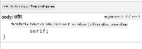

<!--
CO_OP_TRANSLATOR_METADATA:
{
  "original_hash": "e375c2aeb94e2407f2667633d39580bd",
  "translation_date": "2025-08-25T21:26:11+00:00",
  "source_file": "3-terrarium/2-intro-to-css/README.md",
  "language_code": "ne"
}
-->
# टेरारियम प्रोजेक्ट भाग २: CSS को परिचय


> स्केच नोट [Tomomi Imura](https://twitter.com/girlie_mac) द्वारा

## प्रि-लेक्चर क्विज

[प्रि-लेक्चर क्विज](https://ff-quizzes.netlify.app/web/quiz/17)

### परिचय

CSS, वा Cascading Style Sheets, वेब विकासको एउटा महत्त्वपूर्ण समस्या समाधान गर्छ: तपाईंको वेबसाइटलाई राम्रो देखाउने। तपाईंको एप्सलाई स्टाइलिङ गर्दा तिनीहरू प्रयोग गर्न सजिलो र आकर्षक देखिन्छन्; CSS प्रयोग गरेर तपाईं Responsive Web Design (RWD) पनि बनाउन सक्नुहुन्छ - जसले तपाईंको एप्सलाई जुनसुकै स्क्रिन साइजमा राम्रो देखिन मद्दत गर्छ। CSS केवल तपाईंको एपलाई राम्रो देखाउन मात्र होइन; यसको स्पेसिफिकेसनमा एनिमेसन र ट्रान्सफर्महरू पनि समावेश छन् जसले तपाईंको एप्सका लागि परिष्कृत अन्तरक्रियाहरू सक्षम गर्न सक्छ। CSS Working Group ले हालको CSS स्पेसिफिकेसनहरू कायम राख्न मद्दत गर्छ; तपाईं [World Wide Web Consortium को साइट](https://www.w3.org/Style/CSS/members) मा उनीहरूको काम पछ्याउन सक्नुहुन्छ।

> नोट, CSS एक भाषा हो जुन वेबको अन्य सबै चीजजस्तै विकसित हुन्छ, र सबै ब्राउजरहरूले नयाँ स्पेसिफिकेसनलाई समर्थन गर्दैनन्। सधैं [CanIUse.com](https://caniuse.com) परामर्श गरेर तपाईंको कार्यान्वयन जाँच गर्नुहोस्।

यस पाठमा, हामी हाम्रो अनलाइन टेरारियममा स्टाइल थप्नेछौं र CSS का केही अवधारणाहरू सिक्नेछौं: क्यास्केड, इनहेरिटेन्स, र सिलेक्टर्सको प्रयोग, पोजिसनिङ, र CSS प्रयोग गरेर लेआउट निर्माण। यस प्रक्रियामा हामी टेरारियमको लेआउट बनाउनेछौं र वास्तविक टेरारियम निर्माण गर्नेछौं।

### पूर्व-आवश्यकता

तपाईंको टेरारियमको HTML तयार र स्टाइल गर्न तयार हुनुपर्छ।

> भिडियो हेर्नुहोस्

> 
> [](https://www.youtube.com/watch?v=6yIdOIV9p1I)

### कार्य

तपाईंको टेरारियम फोल्डरमा, `style.css` नामको नयाँ फाइल बनाउनुहोस्। उक्त फाइललाई `<head>` सेक्सनमा इम्पोर्ट गर्नुहोस्:

```html
<link rel="stylesheet" href="./style.css" />
```

---

## क्यास्केड

Cascading Style Sheets ले 'क्यास्केड' को विचार समावेश गर्छ जसले स्टाइलको प्राथमिकताले मार्गदर्शन गर्छ। वेबसाइट लेखकद्वारा सेट गरिएको स्टाइल ब्राउजरद्वारा सेट गरिएको स्टाइलभन्दा प्राथमिकतामा हुन्छ। 'इनलाइन' सेट गरिएको स्टाइल बाह्य स्टाइल शीटमा सेट गरिएको स्टाइलभन्दा प्राथमिकतामा हुन्छ।

### कार्य

तपाईंको `<h1>` ट्यागमा "color: red" इनलाइन स्टाइल थप्नुहोस्:

```HTML
<h1 style="color: red">My Terrarium</h1>
```

त्यसपछि, तपाईंको `style.css` फाइलमा निम्न कोड थप्नुहोस्:

```CSS
h1 {
 color: blue;
}
```

✅ तपाईंको वेब एपमा कुन रंग देखिन्छ? किन? के तपाईं स्टाइललाई ओभरराइड गर्ने तरिका पत्ता लगाउन सक्नुहुन्छ? तपाईंले कहिले यो गर्न चाहनुहुन्छ, वा किन नगर्ने?

---

## इनहेरिटेन्स

स्टाइलहरू पुर्खाको स्टाइलबाट वंशजमा इनहेरिट हुन्छन्, जसले गर्दा नेस्ट गरिएको तत्वहरूले आफ्ना अभिभावकहरूको स्टाइल इनहेरिट गर्छ।

### कार्य

बडीको फन्टलाई दिइएको फन्टमा सेट गर्नुहोस्, र नेस्ट गरिएको तत्वको फन्ट जाँच गर्नुहोस्:

```CSS
body {
	font-family: helvetica, arial, sans-serif;
}
```

तपाईंको ब्राउजरको कन्सोलमा 'Elements' ट्याब खोल्नुहोस् र H1 को फन्ट अवलोकन गर्नुहोस्। यो बडीबाट यसको फन्ट इनहेरिट गर्छ, ब्राउजरमा उल्लेख गरिएको अनुसार:



✅ के तपाईं नेस्ट गरिएको स्टाइललाई फरक गुण इनहेरिट गर्न सक्नुहुन्छ?

---

## CSS सिलेक्टर्स

### ट्यागहरू

अहिलेसम्म, तपाईंको `style.css` फाइलमा केवल केही ट्यागहरू स्टाइल गरिएको छ, र एप अजीब देखिन्छ:

```CSS
body {
	font-family: helvetica, arial, sans-serif;
}

h1 {
	color: #3a241d;
	text-align: center;
}
```

यस प्रकारको ट्याग स्टाइलिङले तपाईंलाई अद्वितीय तत्वहरूमा नियन्त्रण दिन्छ, तर तपाईंलाई टेरारियममा धेरै बोटबिरुवाहरूको स्टाइल नियन्त्रण गर्न आवश्यक छ। त्यसका लागि, तपाईंले CSS सिलेक्टर्सको उपयोग गर्न आवश्यक छ।

### Ids

बायाँ र दायाँ कन्टेनरहरूको लेआउटमा केही स्टाइल थप्नुहोस्। चूँकि मार्कअपमा केवल एक बायाँ कन्टेनर र एक दायाँ कन्टेनर छ, तिनीहरूलाई Ids दिइएको छ। तिनीहरूलाई स्टाइल गर्न `#` प्रयोग गर्नुहोस्:

```CSS
#left-container {
	background-color: #eee;
	width: 15%;
	left: 0px;
	top: 0px;
	position: absolute;
	height: 100%;
	padding: 10px;
}

#right-container {
	background-color: #eee;
	width: 15%;
	right: 0px;
	top: 0px;
	position: absolute;
	height: 100%;
	padding: 10px;
}
```

यहाँ, तपाईंले यी कन्टेनरहरूलाई स्क्रिनको टाढा बायाँ र दायाँमा राख्न absolute पोजिसनिङ प्रयोग गर्नुभएको छ, र तिनीहरूको चौडाइलाई प्रतिशतमा प्रयोग गर्नुभएको छ ताकि तिनीहरू साना मोबाइल स्क्रिनहरूको लागि स्केल गर्न सकून्।

✅ यो कोड धेरै दोहोरिएको छ, जसले गर्दा यो "DRY" (Don't Repeat Yourself) छैन; के तपाईं Id र Class प्रयोग गरेर यी Ids लाई स्टाइल गर्ने राम्रो तरिका पत्ता लगाउन सक्नुहुन्छ? तपाईंले मार्कअप परिवर्तन गर्न र CSSलाई पुनःफारम गर्न आवश्यक हुनेछ:

```html
<div id="left-container" class="container"></div>
```

### Classes

माथिको उदाहरणमा, तपाईंले स्क्रिनमा दुई अद्वितीय तत्वहरू स्टाइल गर्नुभएको छ। यदि तपाईं चाहनुहुन्छ कि स्टाइलहरू स्क्रिनमा धेरै तत्वहरूमा लागू होस्, तपाईं CSS Classes प्रयोग गर्न सक्नुहुन्छ। बायाँ र दायाँ कन्टेनरहरूमा बोटबिरुवाहरूको लेआउट गर्न यसलाई गर्नुहोस्।

ध्यान दिनुहोस् कि HTML मार्कअपमा प्रत्येक बोटबिरुवामा Ids र Classes को संयोजन छ। यहाँ Ids पछि तपाईंले टेरारियम बोटबिरुवाको प्लेसमेन्टलाई हेरफेर गर्न थप्ने JavaScript द्वारा प्रयोग गरिनेछ। Classes, यद्यपि, सबै बोटबिरुवाहरूलाई दिइएको स्टाइल प्रदान गर्छ।

```html
<div class="plant-holder">
	
</div>
```

तपाईंको `style.css` फाइलमा निम्न थप्नुहोस्:

```CSS
.plant-holder {
	position: relative;
	height: 13%;
	left: -10px;
}

.plant {
	position: absolute;
	max-width: 150%;
	max-height: 150%;
	z-index: 2;
}
```

यस स्निपेटमा उल्लेखनीय कुरा relative र absolute पोजिसनिङको मिश्रण हो, जसलाई हामी अर्को सेक्सनमा कभर गर्नेछौं। उचाइहरू प्रतिशतद्वारा कसरी ह्यान्डल गरिएको छ हेर्नुहोस्:

तपाईंले प्लान्ट होल्डरको उचाइलाई १३% मा सेट गर्नुभएको छ, एउटा राम्रो संख्या जसले सुनिश्चित गर्छ कि सबै बोटबिरुवाहरू प्रत्येक vertical कन्टेनरमा स्क्रोलिङको आवश्यकता बिना प्रदर्शन हुन्छन्।

तपाईंले प्लान्ट होल्डरलाई बायाँतिर सार्न सेट गर्नुभएको छ ताकि बोटबिरुवाहरू आफ्नो कन्टेनरभित्र बढी केन्द्रित देखिन्छन्। छविहरूमा ठूलो मात्रामा पारदर्शी पृष्ठभूमि छ जसले गर्दा तिनीहरूलाई बढी ड्र्याग गर्न मिल्ने बनाउँछ, त्यसैले स्क्रिनमा राम्रोसँग फिट गर्न तिनीहरूलाई बायाँतिर धकेल्न आवश्यक छ।

त्यसपछि, बोटबिरुवालाई १५०% को अधिकतम चौडाइ दिइएको छ। यसले ब्राउजर स्केल गर्दा बोटबिरुवाहरूलाई स्केल डाउन गर्न अनुमति दिन्छ। तपाईंको ब्राउजरलाई पुनःआकार दिन प्रयास गर्नुहोस्; बोटबिरुवाहरू आफ्नो कन्टेनरमा रहन्छन् तर फिट गर्न स्केल डाउन गर्छन्।

त्यसपछि, z-index को प्रयोग उल्लेखनीय छ, जसले तत्वको सापेक्ष उचाइलाई नियन्त्रण गर्छ (ताकि बोटबिरुवाहरू कन्टेनरको माथि बस्छन् र टेरारियमभित्र बसेको देखिन्छन्)।

✅ किन तपाईंलाई प्लान्ट होल्डर र प्लान्ट CSS सिलेक्टर दुवै आवश्यक छ?

## CSS पोजिसनिङ

पोजिसन प्रोपर्टीहरू (जस्तै static, relative, fixed, absolute, र sticky पोजिसनहरू) मिश्रण गर्दा अलि जटिल हुन सक्छ, तर सही तरिकाले गर्दा यसले तपाईंलाई तपाईंको पृष्ठहरूमा तत्वहरूको राम्रो नियन्त्रण दिन्छ।

Absolute पोजिसन गरिएको तत्वहरू नजिकको पोजिसन गरिएको पुर्खाको सापेक्ष पोजिसन गरिन्छ, र यदि त्यहाँ कुनै छैन भने, यो डकुमेन्ट बडी अनुसार पोजिसन गरिन्छ।

Relative पोजिसन गरिएको तत्वहरू CSS को निर्देशनहरूमा आधारित हुन्छन् जसले यसको प्रारम्भिक पोजिसनबाट टाढा यसको प्लेसमेन्ट समायोजन गर्छ।

हाम्रो नमूनामा, `plant-holder` एक relative-पोजिसन गरिएको तत्व हो जुन absolute-पोजिसन गरिएको कन्टेनरभित्र पोजिसन गरिएको छ। परिणामस्वरूप व्यवहारले साइड बार कन्टेनरहरूलाई बायाँ र दायाँमा पिन गर्छ, र plant-holder नेस्ट गरिएको छ, साइड बारभित्र समायोजन गर्दै, बोटबिरुवाहरूलाई vertical पंक्तिमा राख्न ठाउँ दिन्छ।

> `plant` स्वयं absolute पोजिसनिङ छ, जसले यसलाई ड्र्याग गर्न मिल्ने बनाउँछ, जस्तो तपाईंले अर्को पाठमा पत्ता लगाउनुहुनेछ।

✅ साइड कन्टेनरहरू र plant-holder को पोजिसनिङ प्रकारहरू स्विच गर्ने प्रयास गर्नुहोस्। के हुन्छ?

## CSS लेआउटहरू

अब तपाईंले CSS प्रयोग गरेर टेरारियम निर्माण गर्न सिक्नुभएको कुरा प्रयोग गर्नुहुनेछ!

पहिले, `.terrarium` div का बच्चाहरूलाई CSS प्रयोग गरेर गोलाकार आयतको रूपमा स्टाइल गर्नुहोस्:

```CSS
.jar-walls {
	height: 80%;
	width: 60%;
	background: #d1e1df;
	border-radius: 1rem;
	position: absolute;
	bottom: 0.5%;
	left: 20%;
	opacity: 0.5;
	z-index: 1;
}

.jar-top {
	width: 50%;
	height: 5%;
	background: #d1e1df;
	position: absolute;
	bottom: 80.5%;
	left: 25%;
	opacity: 0.7;
	z-index: 1;
}

.jar-bottom {
	width: 50%;
	height: 1%;
	background: #d1e1df;
	position: absolute;
	bottom: 0%;
	left: 25%;
	opacity: 0.7;
}

.dirt {
	width: 60%;
	height: 5%;
	background: #3a241d;
	position: absolute;
	border-radius: 0 0 1rem 1rem;
	bottom: 1%;
	left: 20%;
	opacity: 0.7;
	z-index: -1;
}
```

यहाँ प्रतिशतहरूको प्रयोगलाई ध्यान दिनुहोस्। यदि तपाईं आफ्नो ब्राउजरलाई स्केल गर्नुहुन्छ, तपाईंले देख्न सक्नुहुन्छ कि जार पनि कसरी स्केल हुन्छ। जार तत्वहरूको चौडाइ र उचाइ प्रतिशतहरू र प्रत्येक तत्वलाई केन्द्रमा, viewport को तलमा पिन गरिएको कसरी पोजिसन गरिएको छ हेर्नुहोस्।

हामीले `rem` प्रयोग गरिरहेका छौं border-radius को लागि, एक फन्ट-सापेक्ष लम्बाइ। यस प्रकारको सापेक्ष मापनको बारेमा [CSS स्पेसिफिकेसन](https://www.w3.org/TR/css-values-3/#font-relative-lengths) मा थप पढ्नुहोस्।

✅ जारको रंग र अपासिटीलाई माटोको रंग र अपासिटीसँग तुलना गरेर परिवर्तन गर्ने प्रयास गर्नुहोस्। के हुन्छ? किन?

---

## 🚀 चुनौती

जारलाई थप ग्लासजस्तो देखाउनको लागि बायाँ तल्लो क्षेत्रमा 'बबल' चमक थप्नुहोस्। तपाईं `.jar-glossy-long` र `.jar-glossy-short` लाई प्रतिबिम्बित चमकजस्तो देखाउन स्टाइल गर्नुहुनेछ। यसरी यो देखिनेछ:


पोस्ट-लेक्चर क्विज पूरा गर्न, यो Learn मोड्युलमा जानुहोस्: [तपाईंको HTML एपलाई CSS प्रयोग गरेर स्टाइल गर्नुहोस्](https://docs.microsoft.com/learn/modules/build-simple-website/4-css-basics/?WT.mc_id=academic-77807-sagibbon)

## पोस्ट-लेक्चर क्विज

[पोस्ट-लेक्चर क्विज](https://ff-quizzes.netlify.app/web/quiz/18)

## समीक्षा र आत्म-अध्ययन

CSS देख्नमा सरल लाग्छ, तर सबै ब्राउजर र स्क्रिन साइजहरूको लागि एपलाई पूर्ण रूपमा स्टाइल गर्न प्रयास गर्दा धेरै चुनौतीहरू आउँछन्। CSS-Grid र Flexbox उपकरणहरू विकास गरिएको छ जसले कामलाई अलि संरचित र भरपर्दो बनाउँछ। यी उपकरणहरूको बारेमा [Flexbox Froggy](https://flexboxfroggy.com/) र [Grid Garden](https://codepip.com/games/grid-garden/) खेल खेल्दै सिक्नुहोस्।

## असाइनमेन्ट

[CSS Refactoring](assignment.md)

**अस्वीकरण**:  
यो दस्तावेज़ AI अनुवाद सेवा [Co-op Translator](https://github.com/Azure/co-op-translator) प्रयोग गरेर अनुवाद गरिएको छ। हामी यथार्थताको लागि प्रयास गर्छौं, तर कृपया ध्यान दिनुहोस् कि स्वचालित अनुवादहरूमा त्रुटिहरू वा अशुद्धताहरू हुन सक्छ। यसको मूल भाषा मा रहेको मूल दस्तावेज़लाई आधिकारिक स्रोत मानिनुपर्छ। महत्वपूर्ण जानकारीको लागि, व्यावसायिक मानव अनुवाद सिफारिस गरिन्छ। यस अनुवादको प्रयोगबाट उत्पन्न हुने कुनै पनि गलतफहमी वा गलत व्याख्याको लागि हामी जिम्मेवार हुने छैनौं।