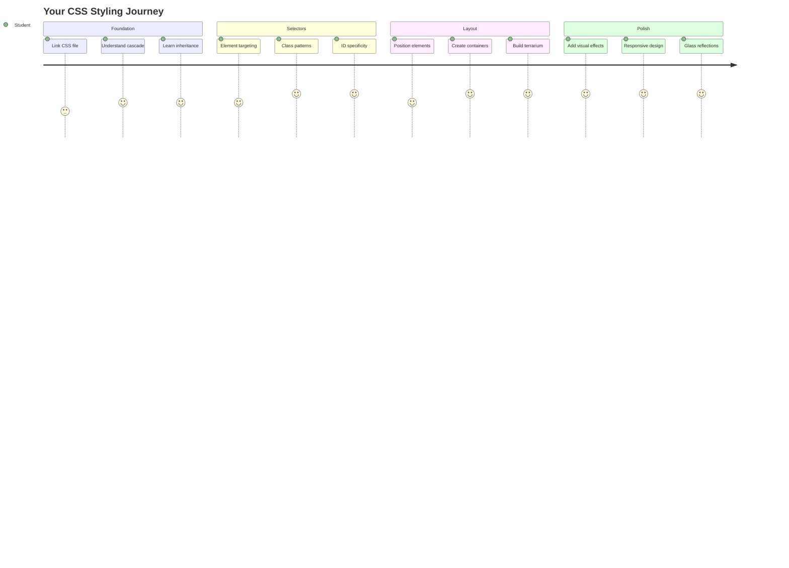
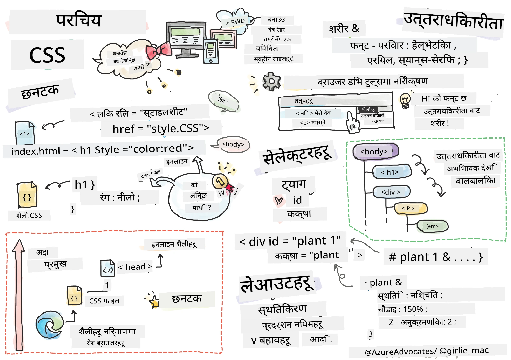
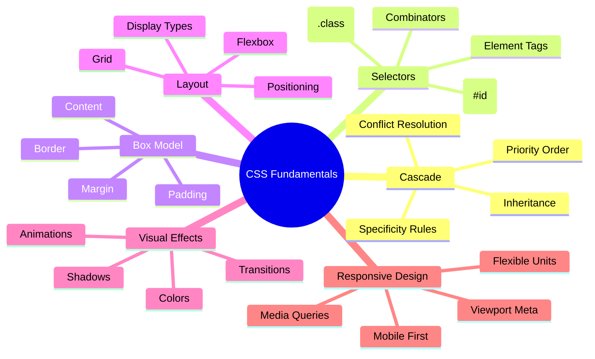
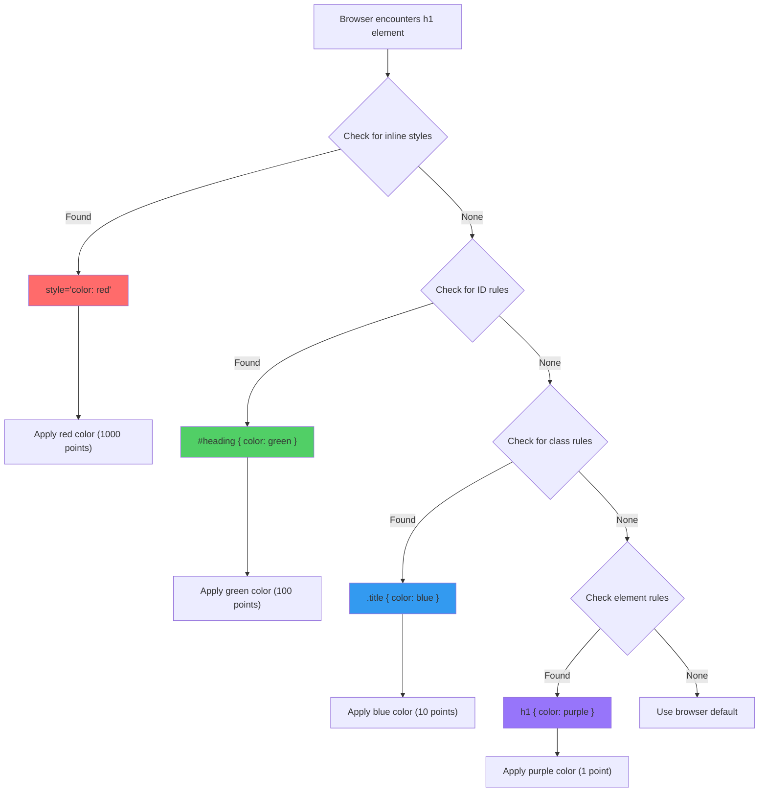
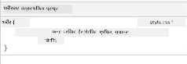
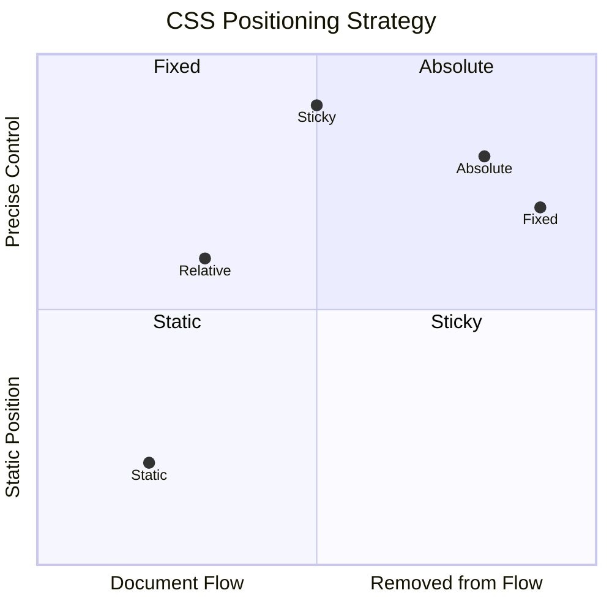
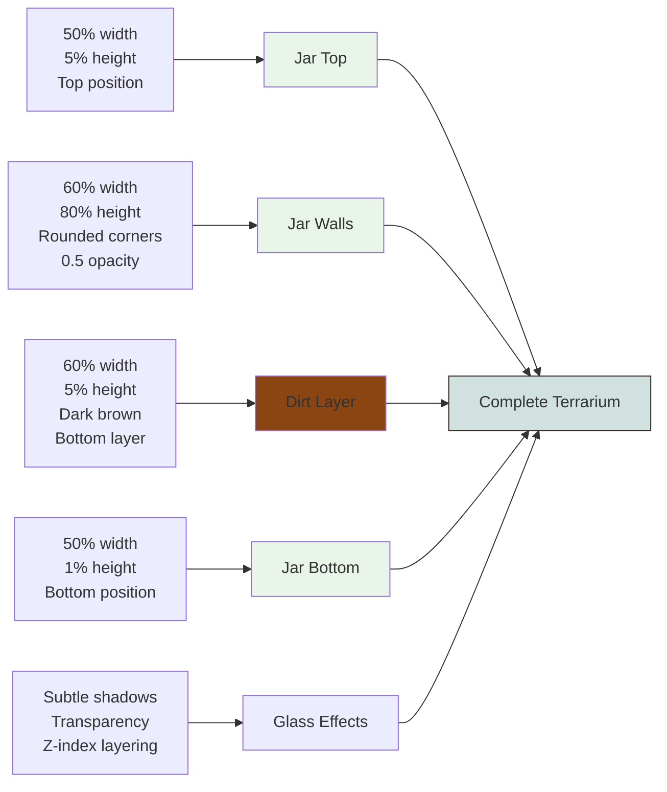
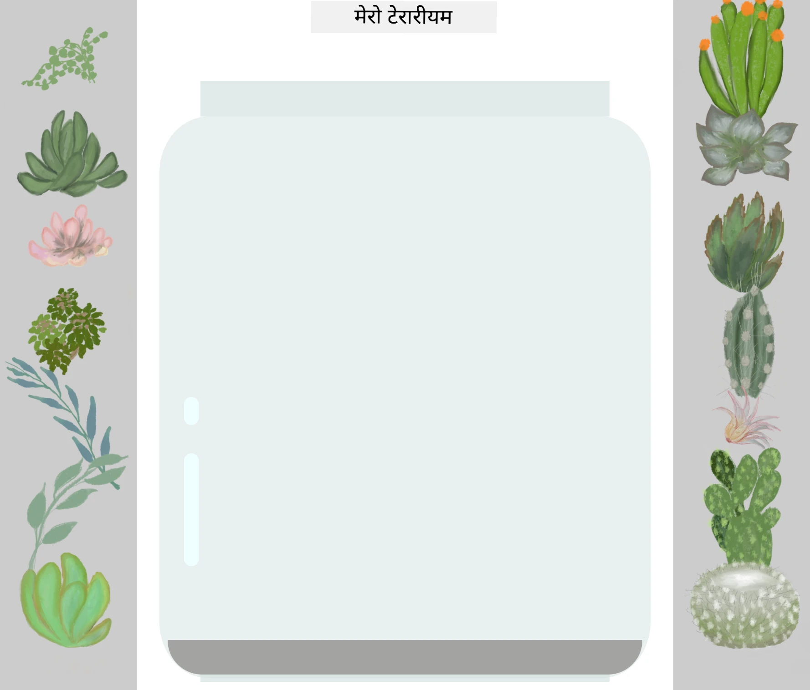
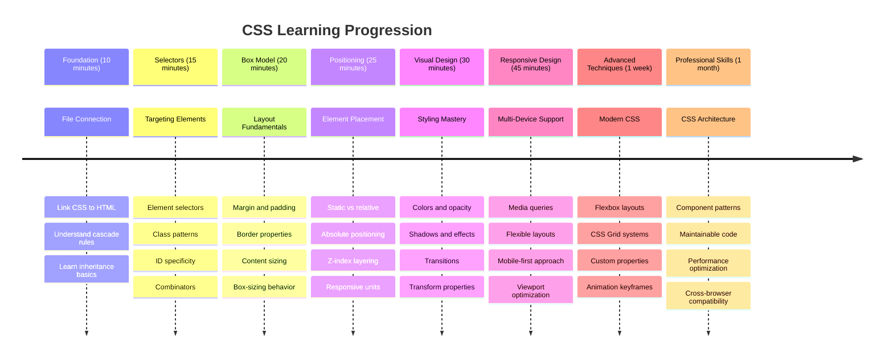

# टेरारियम प्रोजेक्ट भाग २: CSS को परिचय




> स्केच नोट [टोमोमी इमुरा](https://twitter.com/girlie_mac) द्वारा

तपाईंको HTML टेरारियम कति सामान्य देखिन्थ्यो भन्ने सम्झनुहुन्छ? CSS ले त्यो साधारण संरचनालाई दृश्यात्मक रूपमा आकर्षक बनाउने काम गर्छ।

यदि HTML घरको फ्रेम बनाउने जस्तो हो भने, CSS भनेको घरलाई घरजस्तो बनाउने सबै कुरा हो - रंग, फर्निचरको व्यवस्था, बत्ती, र कोठाहरूको प्रवाह। सोच्नुहोस् कि भर्सायको दरबार साधारण शिकारको कुटीबाट सुरु भयो, तर सजावट र लेआउटमा ध्यान दिएर यसलाई संसारको सबैभन्दा भव्य भवनहरू मध्ये एकमा परिणत गरियो।

आज, हामी तपाईंको टेरारियमलाई कार्यात्मकबाट परिष्कृतमा रूपान्तरण गर्नेछौं। तपाईंले तत्वहरूलाई ठीकसँग स्थिति दिन, विभिन्न स्क्रिन आकारहरूमा लेआउटहरूलाई प्रतिक्रिया दिन, र वेबसाइटहरूलाई आकर्षक बनाउने दृश्यात्मक अपील सिर्जना गर्न सिक्नुहुनेछ।

यस पाठको अन्त्यमा, तपाईंले देख्नुहुनेछ कि रणनीतिक CSS शैलीले तपाईंको प्रोजेक्टलाई नाटकीय रूपमा सुधार गर्न सक्छ। अब तपाईंको टेरारियममा केही शैली थपौं।



## प्रि-लेक्चर क्विज

[प्रि-लेक्चर क्विज](https://ff-quizzes.netlify.app/web/quiz/17)

## CSS को साथ सुरु गर्दै

CSS लाई प्रायः "चिजहरू सुन्दर बनाउने" मात्र मानिन्छ, तर यसले धेरै व्यापक उद्देश्य पूरा गर्छ। CSS फिल्मको निर्देशक जस्तै हो - तपाईंले सबै कुरा कस्तो देखिन्छ, कसरी चल्छ, अन्तरक्रियामा कसरी प्रतिक्रिया दिन्छ, र विभिन्न परिस्थितिहरूमा कसरी अनुकूलन हुन्छ भन्ने नियन्त्रण गर्नुहुन्छ।

आधुनिक CSS उल्लेखनीय रूपमा सक्षम छ। तपाईंले फोन, ट्याब्लेट, र डेस्कटप कम्प्युटरहरूको लागि लेआउटहरू स्वतः समायोजन गर्ने कोड लेख्न सक्नुहुन्छ। तपाईंले प्रयोगकर्ताको ध्यान आवश्यक ठाउँमा मार्गदर्शन गर्ने सहज एनिमेसनहरू सिर्जना गर्न सक्नुहुन्छ। जब सबै कुरा सँगै काम गर्छ, परिणामहरू निकै प्रभावशाली हुन सक्छ।

> 💡 **प्रो टिप**: CSS नयाँ सुविधाहरू र क्षमताहरूको साथ निरन्तर विकसित हुँदैछ। उत्पादन प्रोजेक्टहरूमा प्रयोग गर्नु अघि नयाँ CSS सुविधाहरूको ब्राउजर समर्थन प्रमाणित गर्न सधैं [CanIUse.com](https://caniuse.com) जाँच गर्नुहोस्।

**यस पाठमा हामीले के हासिल गर्नेछौं:**
- **सिर्जना गर्नेछौं** आधुनिक CSS प्रविधिहरू प्रयोग गरेर तपाईंको टेरारियमको पूर्ण दृश्य डिजाइन
- **अन्वेषण गर्नेछौं** क्यास्केड, इनहेरिटेन्स, र CSS चयनकर्ताहरू जस्ता आधारभूत अवधारणाहरू
- **कार्यान्वयन गर्नेछौं** उत्तरदायी स्थिति र लेआउट रणनीतिहरू
- **निर्माण गर्नेछौं** CSS आकार र शैली प्रयोग गरेर टेरारियम कन्टेनर

### पूर्वापेक्षा

तपाईंले अघिल्लो पाठबाट तपाईंको टेरारियमको HTML संरचना पूरा गर्नुपर्छ र यसलाई शैली बनाउन तयार राख्नुपर्छ।

> 📺 **भिडियो स्रोत**: यो उपयोगी भिडियो वाकथ्रु हेर्नुहोस्
>
> [](https://www.youtube.com/watch?v=6yIdOIV9p1I)

### तपाईंको CSS फाइल सेट अप गर्दै

शैली सुरु गर्न अघि, हामीले CSS लाई HTML सँग जडान गर्न आवश्यक छ। यो जडानले ब्राउजरलाई हाम्रो टेरारियमको लागि शैली निर्देशनहरू कहाँ फेला पार्ने बताउँछ।

तपाईंको टेरारियम फोल्डरमा, `style.css` नामक नयाँ फाइल सिर्जना गर्नुहोस्, त्यसपछि यसलाई तपाईंको HTML डकुमेन्टको `<head>` सेक्सनमा लिंक गर्नुहोस्:

```html
<link rel="stylesheet" href="./style.css" />
```

**यस कोडले के गर्छ:**
- **जडान बनाउँछ** तपाईंको HTML र CSS फाइलहरू बीच
- **ब्राउजरलाई बताउँछ** `style.css` बाट शैलीहरू लोड र लागू गर्न
- **प्रयोग गर्छ** `rel="stylesheet"` विशेषता CSS फाइल हो भनेर निर्दिष्ट गर्न
- **सन्दर्भ दिन्छ** फाइल पथ `href="./style.css"` प्रयोग गरेर

## CSS क्यास्केडको समझ

CSS लाई "क्यास्केडिङ" शैली शीट्स किन भनिन्छ भनेर कहिल्यै सोच्नुभएको छ? शैलीहरू झरनाजस्तै तल झर्छन्, र कहिलेकाहीं तिनीहरू एकअर्कासँग विरोध गर्छन्।

कसरी सैन्य आदेश संरचनाहरू काम गर्छन् भनेर विचार गर्नुहोस् - सामान्य आदेशले "सबै सैनिकहरूले हरियो लगाउनुहोस्" भन्न सक्छ, तर तपाईंको युनिटलाई विशिष्ट आदेशले "समारोहको लागि ड्रेस ब्लुज लगाउनुहोस्" भन्न सक्छ। थप विशिष्ट निर्देशनलाई प्राथमिकता दिइन्छ। CSS ले यस्तै तर्क अनुसरण गर्छ, र यो पदानुक्रमको समझले डिबगिङलाई धेरै व्यवस्थापनयोग्य बनाउँछ।

### क्यास्केड प्राथमिकतासँग प्रयोग

क्यास्केडलाई कार्यमा देखौं र शैलीको द्वन्द्व सिर्जना गरौं। पहिलो, तपाईंको `<h1>` ट्यागमा इनलाइन शैली थप्नुहोस्:

```html
<h1 style="color: red">My Terrarium</h1>
```

**यस कोडले के गर्छ:**
- **रंग लागू गर्छ** इनलाइन शैली प्रयोग गरेर `<h1>` तत्वमा
- **प्रयोग गर्छ** `style` विशेषता CSS लाई HTML मा सीधा एम्बेड गर्न
- **सिर्जना गर्छ** यो विशिष्ट तत्वको लागि उच्च प्राथमिकता शैली नियम

अब, तपाईंको `style.css` फाइलमा यो नियम थप्नुहोस्:

```css
h1 {
  color: blue;
}
```

**माथिको कोडमा:**
- **परिभाषित गर्छ** CSS नियम जसले सबै `<h1>` तत्वहरूलाई लक्षित गर्छ
- **सेट गर्छ** पाठको रंग नीलो बाह्य शैली शीट प्रयोग गरेर
- **सिर्जना गर्छ** इनलाइन शैलीहरूको तुलनामा कम प्राथमिकता नियम

✅ **ज्ञान जाँच**: तपाईंको वेब एपमा कुन रंग देखिन्छ? किन त्यो रंग जित्छ? तपाईंले शैलीहरूलाई ओभरराइड गर्न चाहनुहुने परिदृश्यहरू सोच्न सक्नुहुन्छ?



> 💡 **CSS प्राथमिकता क्रम (उच्चतमदेखि न्यूनतम):**
> 1. **इनलाइन शैलीहरू** (style attribute)
> 2. **IDs** (#myId)
> 3. **क्लासहरू** (.myClass) र विशेषताहरू
> 4. **तत्व चयनकर्ताहरू** (h1, div, p)
> 5. **ब्राउजर डिफल्टहरू**

## CSS इनहेरिटेन्सको कार्यमा समझ

CSS इनहेरिटेन्स आनुवंशिकता जस्तै काम गर्छ - तत्वहरूले तिनीहरूको अभिभावक तत्वहरूबाट निश्चित गुणहरू प्राप्त गर्छन्। यदि तपाईंले शरीर तत्वमा फन्ट परिवार सेट गर्नुभयो भने, भित्रको सबै पाठले स्वचालित रूपमा त्यही फन्ट प्रयोग गर्छ। यो ह्याब्सबर्ग परिवारको विशिष्ट जबडा रेखा पीढीहरूमा देखा परे जस्तै हो।

तर सबै कुरा इनहेरिट हुँदैन। फन्ट र रंग जस्ता पाठ शैलीहरू इनहेरिट हुन्छन्, तर मार्जिन र बोर्डर जस्ता लेआउट गुणहरू हुँदैनन्। जस्तै बच्चाहरूले शारीरिक विशेषताहरू प्राप्त गर्न सक्छन् तर तिनीहरूको अभिभावकको फेसन छनोटहरू होइन।

### फन्ट इनहेरिटेन्सको अवलोकन

तपाईंको `<body>` तत्वमा फन्ट परिवार सेट गरेर इनहेरिटेन्सलाई कार्यमा देखौं:

```css
body {
  font-family: 'Segoe UI', Tahoma, Geneva, Verdana, sans-serif;
}
```

**यहाँ के हुन्छ भन्ने कुरा तोड्दै:**
- **सेट गर्छ** सम्पूर्ण पृष्ठको लागि फन्ट परिवार `<body>` तत्वलाई लक्षित गरेर
- **प्रयोग गर्छ** फन्ट स्ट्याक फालब्याक विकल्पहरूसँग राम्रो ब्राउजर अनुकूलताको लागि
- **लागू गर्छ** आधुनिक प्रणाली फन्टहरू जुन विभिन्न अपरेटिङ सिस्टमहरूमा राम्रो देखिन्छ
- **सुनिश्चित गर्छ** सबै बच्चा तत्वहरूले यो फन्ट प्राप्त गर्छन् जबसम्म विशेष रूपमा ओभरराइड गरिएको छैन

तपाईंको ब्राउजरको डेभलपर टूल्स (F12) खोल्नुहोस्, एलिमेन्ट्स ट्याबमा जानुहोस्, र तपाईंको `<h1>` तत्व निरीक्षण गर्नुहोस्। तपाईंले देख्नुहुनेछ कि यसले शरीरबाट फन्ट परिवार इनहेरिट गर्छ:



✅ **प्रयोग समय**: `<body>` मा `color`, `line-height`, वा `text-align` जस्ता अन्य इनहेरिटेबल गुणहरू सेट गर्न प्रयास गर्नुहोस्। तपाईंको हेडिङ र अन्य तत्वहरूमा के हुन्छ?

> 📝 **इनहेरिटेबल गुणहरू समावेश छन्**: `color`, `font-family`, `font-size`, `line-height`, `text-align`, `visibility`
>
> **गैर-इनहेरिटेबल गुणहरू समावेश छन्**: `margin`, `padding`, `border`, `width`, `height`, `position`

### 🔄 **शिक्षण जाँच**
**CSS आधारभूत समझ**: चयनकर्ताहरूमा जानु अघि सुनिश्चित गर्नुहोस् कि तपाईं:
- ✅ क्यास्केड र इनहेरिटेन्सको बीचको भिन्नता व्याख्या गर्न सक्नुहुन्छ
- ✅ विशिष्टता द्वन्द्वमा कुन शैली जित्छ भविष्यवाणी गर्न सक्नुहुन्छ
- ✅ कुन गुणहरू अभिभावक तत्वहरूबाट इनहेरिट हुन्छन् पहिचान गर्न सक्नुहुन्छ
- ✅ CSS फाइलहरू HTML सँग ठीकसँग जडान गर्न सक्नुहुन्छ

**छिटो परीक्षण**: यदि तपाईंसँग यी शैलीहरू छन् भने, `<div class="special">` भित्रको `<h1>` को रंग के हुनेछ?
```css
div { color: blue; }
.special { color: green; }
h1 { color: red; }
```
*उत्तर: रातो (तत्व चयनकर्ताले सिधै h1 लाई लक्षित गर्छ)*

## CSS चयनकर्ताहरूमा महारत हासिल गर्दै

CSS चयनकर्ताहरू तपाईंको शैलीको लागि विशिष्ट तत्वहरूलाई लक्षित गर्ने तरिका हो। तिनीहरू सटीक निर्देशन दिने जस्तै काम गर्छन् - "घर" भन्नुको सट्टा, तपाईं "म्यापल स्ट्रिटमा रातो ढोकासहितको नीलो घर" भन्न सक्नुहुन्छ।

CSS ले विशिष्ट हुन विभिन्न तरिकाहरू प्रदान गर्दछ, र सही चयनकर्ता छनोट गर्नु भनेको कार्यको लागि उपयुक्त उपकरण छनोट गर्नु जस्तै हो। कहिलेकाहीं तपाईंले छिमेकका सबै ढोकाहरूलाई शैली दिन आवश्यक छ, र कहिलेकाहीं केवल एक विशिष्ट ढोका।

### तत्व चयनकर्ताहरू (ट्यागहरू)

तत्व चयनकर्ताहरू HTML तत्वहरूलाई तिनीहरूको ट्याग नामद्वारा लक्षित गर्छन्। तिनीहरू तपाईंको पृष्ठभरि व्यापक रूपमा लागू हुने आधारभूत शैलीहरू सेट गर्न उत्तम छन्:

```css
body {
  font-family: 'Segoe UI', Tahoma, Geneva, Verdana, sans-serif;
  margin: 0;
  padding: 0;
}

h1 {
  color: #3a241d;
  text-align: center;
  font-size: 2.5rem;
  margin-bottom: 1rem;
}
```

**यी शैलीहरूको समझ:**
- **सेट गर्छ** सम्पूर्ण पृष्ठमा सुसंगत टाइपोग्राफी `body` चयनकर्ता प्रयोग गरेर
- **हटाउँछ** ब्राउजरको डिफल्ट मार्जिन र प्याडिङ राम्रो नियन्त्रणको लागि
- **शैली दिन्छ** सबै हेडिङ तत्वहरूलाई रंग, संरेखण, र स्पेसिङको साथ
- **प्रयोग गर्छ** `rem` युनिटहरू स्केलेबल, पहुँचयोग्य फन्ट साइजको लागि

तत्व चयनकर्ताहरू सामान्य शैलीको लागि राम्रोसँग काम गर्छन्, तर तपाईंलाई टेरारियममा बोटबिरुवाहरू जस्ता व्यक्तिगत कम्पोनेन्टहरूलाई शैली दिन अधिक विशिष्ट चयनकर्ताहरू आवश्यक हुनेछ।

### अद्वितीय तत्वहरूको लागि ID चयनकर्ताहरू

ID चयनकर्ताहरू `#` प्रतीक प्रयोग गर्छन् र विशिष्ट `id` विशेषताहरू भएका तत्वहरूलाई लक्षित गर्छन्। IDs पृष्ठमा अद्वितीय हुनुपर्छ, त्यसैले तिनीहरू हाम्रो बायाँ र दायाँ बोट कन्टेनरहरू जस्ता व्यक्तिगत, विशेष तत्वहरूलाई शैली दिन उत्तम छन्।

हाम्रो टेरारियमको साइड कन्टेनरहरूको शैली सिर्जना गरौं जहाँ बोटहरू बस्नेछन्:

```css
#left-container {
  background-color: #f5f5f5;
  width: 15%;
  left: 0;
  top: 0;
  position: absolute;
  height: 100vh;
  padding: 1rem;
  box-sizing: border-box;
}

#right-container {
  background-color: #f5f5f5;
  width: 15%;
  right: 0;
  top: 0;
  position: absolute;
  height: 100vh;
  padding: 1rem;
  box-sizing: border-box;
}
```

**यस कोडले के हासिल गर्छ:**
- **स्थिति दिन्छ** कन्टेनरहरूलाई `absolute` स्थिति प्रयोग गरेर टाढाको बायाँ र दायाँ किनारहरूमा
- **प्रयोग गर्छ** `vh` (भ्यूपोर्ट उचाइ) युनिटहरू उत्तरदायी उचाइको लागि जुन स्क्रिन आकारमा अनुकूलन हुन्छ
- **लागू गर्छ** `box-sizing: border-box` ताकि प्याडिङ कुल चौडाइमा समावेश होस्
- **हटाउँछ** अनावश्यक `px` युनिटहरू शून्य मानहरूबाट सफा कोडको लागि
- **सेट गर्छ** हल्का पृष्ठभूमि रंग जुन गाढा खैरोको तुलनामा आँखामा सजिलो छ

✅ **कोड गुणस्तर चुनौती**: ध्यान दिनुहोस् कि यो CSS ले DRY (Don't Repeat Yourself) सिद्धान्तको उल्लङ्घन गर्छ। तपाईंले यसलाई ID र क्लास दुवै प्रयोग गरेर कसरी पुनःफारम्याट गर्न सक्नुहुन्छ?

**सुधारिएको दृष्टिकोण:**
```html
<div id="left-container" class="container"></div>
<div id="right-container" class="container"></div>
```

```css
.container {
  background-color: #f5f5f5;
  width: 15%;
  top: 0;
  position: absolute;
  height: 100vh;
  padding: 1rem;
  box-sizing: border-box;
}

#left-container {
  left: 0;
}

#right-container {
  right: 0;
}
```

### पुन: प्रयोगयोग्य शैलीहरूको लागि क्लास चयनकर्ताहरू

क्लास चयनकर्ताहरू `.` प्रतीक प्रयोग गर्छन् र तपाईंले धेरै तत्वहरूमा समान शैलीहरू लागू गर्न चाहनुहुन्छ भने उत्तम हुन्छ। IDs को विपरीत, क्लासहरू तपाईंको HTML भरि पुन: प्रयोग गर्न सकिन्छ, जसले तिनीहरूलाई सुसंगत शैलीका ढाँचाहरूको लागि आदर्श बनाउँछ।

हाम्रो टेरारियममा, प्रत्येक बोटलाई समान शैलीको आवश्यकता छ तर व्यक्तिगत स्थिति पनि आवश्यक छ। हामीले साझा शैलीहरूको लागि क्लासहरूको संयोजन र अद्वितीय स्थिति र जाभास्क्रिप्ट अन्तरक्रियाको लागि IDs प्रयोग गर्नेछौं।

**प्रत्येक बोटको लागि HTML संरचना यहाँ छ:**
```html
<div class="plant-holder">
  
</div>
```

**मुख्य तत्वहरू व्याख्या गरियो:**
- **प्रयोग गर्छ** `class="plant-holder"` सबै बोटहरूको लागि सुसंगत कन्टेनर शैली
- **लागू गर्छ** `class="plant"` साझा छवि शैली र व्यवहारको लागि
- **समावेश गर्छ** अद्वितीय `id="plant1"` व्यक्तिगत स्थिति र जाभास्क्रिप्ट अन्तरक्रियाको लागि
- **प्रदान गर्छ** स्क्रिन रिडर पहुँचयोग्यताको लागि वर्णनात्मक alt पाठ

अब यी शैलीहरू तपाईंको `style.css` फाइलमा थप्नुहोस्:

```css
.plant-holder {
  position: relative;
  height: 13%;
  left: -0.6rem;
}

.plant {
  position: absolute;
  max-width: 150%;
  max-height: 150%;
  z-index: 2;
  transition: transform 0.3s ease;
}

.plant:hover {
  transform: scale(1.05);
}
```

**यी शैलीहरूको विश्लेषण:**
- **सिर्जना गर्छ** बोट होल्डरको लागि सापेक्ष स्थिति स्थिति सन्दर्भ स्थापना गर्न
- **सेट गर्छ** प्रत्येक बोट होल्डरलाई १३% उचाइ, सुनिश्चित गर्दै सबै बोटहरू स्क्रोल नगरी ठडिन्छन्
- **थोरै बायाँ सर्छ** होल्डरहरूलाई बोटहरूलाई कन्टेनरभित्र राम्रोसँग केन्द्रित गर्न
- **अनुमति दिन्छ** बोटहरूलाई `max-width` र `max-height` गुणहरू प्रयोग गरेर उत्तरदायी रूपमा स्केल गर्न
- **प्रयोग गर्छ** `z-index` बोटहरूलाई टेरारियमका अन्य तत्वहरू माथि तह गर्न
- **थप्छ** CSS ट्रान्जिसनहरूसँग हल्का होभर प्रभाव राम्रो प्रयोगकर्ता अन्तरक्रियाको लागि

✅ **महत्वपूर्ण सोचाइ**: किन हामीलाई `.plant-holder` र `.plant` चयनकर्ताहरू दुवै आवश्यक छ? यदि हामीले केवल एउटा प्रयोग गर्ने प्रयास गर्यौं भने के हुन्छ?

> 💡 **डिजाइन ढाँचा**: कन्टेनर (`.plant-holder`) ले लेआउट र स्थिति नियन्त्रण गर्छ, जबकि सामग्री (`.plant`) ले उपस्थिति र स्केलिङ नियन्त्रण गर्छ। यस विभाजनले कोडलाई अधिक मर्मतयोग्य र लचिलो बनाउँछ।

## CSS स्थिति समझ

CSS स्थिति नाटकको लागि स्टेज निर्देशक जस्तै हो - तपाईंले प्रत्येक पात्र कहाँ उभिन्छ र कसरी स्टेज वरिपरि सर्छ भन्ने निर्देशन दिनुहुन्छ। केही पात्रहरूले मानक संरचना अनुसरण गर्छन्, जबकि अन्यलाई नाटकीय प्रभावको लागि विशिष्ट स्थिति आवश्यक छ।

एकपटक तपाईंले स्थिति बुझ्नुभयो भने, धेरै लेआउट चुनौतीहरू व्यवस्थापनयोग्य हुन्छन्। तपाईंलाई नेभिगेसन बार चाहिन्छ जुन प्रयोगकर्ताहरू स्क्रोल गर्दा शीर्षमा रहन्छ? स्थिति त्यसलाई सम्हाल्छ। तपाईंलाई एक टूलटिप चाहिन्छ जुन विशिष्ट स्थानमा देखा पर्छ? त्यो पनि स्थिति हो।

### पाँच स्थिति मानहरू



| स्थिति मान | व्यवहार | प्रयोग केस |
|------------|---------|------------|
| `static` | डिफल्ट प्रवाह, top/left/right/bottom लाई बेवास्ता गर्छ | सामान्य डकुमेन्ट लेआउट |
| `relative` | यसको सामान्य स्थितिको सापेक्ष स्थित | साना समायोजनहरू, स्थिति सन्दर्भ सिर्जना गर्दै |
| `absolute` | नजिकको स्थित अभिभावकको सापेक्ष स्थित | सटीक प्लेसमेन्ट, ओभरलेहरू |
| `fixed` | भ्यूपोर्टको सापेक्ष स्थित | नेभिगेसन बारहरू, फ्लोटिङ तत्वहरू |
| `sticky` | स्क्रोलको आधारमा सापेक्ष र फिक्स
- यदि `.plant-holder` ले `relative` को सट्टा `absolute` प्रयोग गर्‍यो भने लेआउट कसरी परिवर्तन हुन्छ?
- जब तपाईं `.plant` लाई `relative` पोजिसनिङमा परिवर्तन गर्नुहुन्छ, के हुन्छ?

### 🔄 **शैक्षिक जाँच**
**CSS पोजिसनिङको मास्टरी**: आफ्नो बुझाइलाई पुष्टि गर्न रोक्नुहोस्:
- ✅ के तपाईं व्याख्या गर्न सक्नुहुन्छ कि ड्र्याग-एन्ड-ड्रपको लागि बिरुवाहरूलाई किन absolute पोजिसनिङ चाहिन्छ?
- ✅ के तपाईं बुझ्नुहुन्छ कि relative कन्टेनरहरूले पोजिसनिङको सन्दर्भ कसरी सिर्जना गर्छन्?
- ✅ किन साइड कन्टेनरहरूले absolute पोजिसनिङ प्रयोग गर्छन्?
- ✅ यदि तपाईंले पोजिसन घोषणा पूर्ण रूपमा हटाउनुभयो भने के हुन्छ?

**वास्तविक संसारको जडान**: CSS पोजिसनिङले वास्तविक संसारको लेआउटलाई कसरी प्रतिबिम्बित गर्छ भन्ने सोच्नुहोस्:
- **Static**: शेल्फमा किताबहरू (प्राकृतिक क्रम)
- **Relative**: किताबलाई अलिकति सार्ने तर यसको स्थानमा राख्ने
- **Absolute**: पृष्ठ नम्बरमा ठ्याक्कै बुकमार्क राख्ने
- **Fixed**: स्टिकी नोट जसले पृष्ठ पल्टाउँदा पनि देखिन्छ

## CSS प्रयोग गरेर टेरारियम बनाउने

अब हामी केवल CSS प्रयोग गरेर ग्लास जार बनाउनेछौं - कुनै छवि वा ग्राफिक्स सफ्टवेयर आवश्यक छैन।

पोजिसनिङ र ट्रान्सपरेन्सी प्रयोग गरेर यथार्थपरक ग्लास, छायाँ, र गहिराइ प्रभावहरू सिर्जना गर्नु CSS को दृश्य क्षमताहरू देखाउँछ। यो प्रविधिले Bauhaus आन्दोलनका आर्किटेक्टहरूले सरल ज्यामितीय रूपहरू प्रयोग गरेर जटिल, सुन्दर संरचनाहरू कसरी बनाएका थिए भन्ने कुरा प्रतिबिम्बित गर्छ। यी सिद्धान्तहरू बुझिसकेपछि, तपाईं धेरै वेब डिजाइनहरू पछाडि CSS प्रविधिहरू चिन्न सक्नुहुन्छ।



### ग्लास जारका कम्पोनेन्टहरू बनाउने

आउनुहोस् टेरारियम जारलाई टुक्रा-टुक्रामा बनाऔं। प्रत्येक भागले absolute पोजिसनिङ र प्रतिशत-आधारित साइजिङ प्रयोग गर्दछ ताकि डिजाइन उत्तरदायी होस्:

```css
.jar-walls {
  height: 80%;
  width: 60%;
  background: #d1e1df;
  border-radius: 1rem;
  position: absolute;
  bottom: 0.5%;
  left: 20%;
  opacity: 0.5;
  z-index: 1;
  box-shadow: inset 0 0 2rem rgba(0, 0, 0, 0.1);
}

.jar-top {
  width: 50%;
  height: 5%;
  background: #d1e1df;
  position: absolute;
  bottom: 80.5%;
  left: 25%;
  opacity: 0.7;
  z-index: 1;
  border-radius: 0.5rem 0.5rem 0 0;
}

.jar-bottom {
  width: 50%;
  height: 1%;
  background: #d1e1df;
  position: absolute;
  bottom: 0;
  left: 25%;
  opacity: 0.7;
  border-radius: 0 0 0.5rem 0.5rem;
}

.dirt {
  width: 60%;
  height: 5%;
  background: #3a241d;
  position: absolute;
  border-radius: 0 0 1rem 1rem;
  bottom: 1%;
  left: 20%;
  opacity: 0.7;
  z-index: -1;
}
```

**टेरारियम निर्माणको बुझाइ:**
- **प्रयोग गर्दछ** उत्तरदायी स्केलिङको लागि प्रतिशत-आधारित आयामहरू
- **पोजिसन गर्दछ** तत्वहरूलाई ठ्याक्कै मिलाउन र स्ट्याक गर्न absolute पोजिसनिङ प्रयोग गरेर
- **लागु गर्दछ** विभिन्न अपासिटी मानहरू ताकि ग्लास ट्रान्सपरेन्सी प्रभाव सिर्जना होस्
- **प्रयोग गर्दछ** `z-index` लेयरिङ ताकि बिरुवाहरू जारभित्र देखिन्छन्
- **थप्छ** सूक्ष्म बक्स-छायाँ र परिष्कृत border-radius ताकि यथार्थपरक देखिन्छ

### प्रतिशतको साथ उत्तरदायी डिजाइन

ध्यान दिनुहोस् कि सबै आयामहरूले निश्चित पिक्सेल मानहरूको सट्टा प्रतिशत प्रयोग गर्छन्:

**किन यो महत्त्वपूर्ण छ:**
- **सुनिश्चित गर्दछ** टेरारियम कुनै पनि स्क्रिन साइजमा समानुपातिक रूपमा स्केल हुन्छ
- **राख्छ** जार कम्पोनेन्टहरू बीचको दृश्य सम्बन्ध
- **प्रदान गर्दछ** मोबाइल फोनदेखि ठूला डेस्कटप मोनिटरसम्मको लागि एक सुसंगत अनुभव
- **अनुकूलन गर्दछ** डिजाइनलाई भत्किन नदिई परिवर्तन गर्न

### CSS युनिटहरूको प्रयोग

हामी `rem` युनिटहरू border-radius को लागि प्रयोग गर्दैछौं, जसले रूट फन्ट साइजको सापेक्ष स्केल गर्दछ। यसले अधिक पहुँचयोग्य डिजाइनहरू सिर्जना गर्दछ जसले प्रयोगकर्ताको फन्ट प्राथमिकताहरूलाई सम्मान गर्दछ। [CSS relative units](https://www.w3.org/TR/css-values-3/#font-relative-lengths) को आधिकारिक स्पेसिफिकेशनमा थप जान्नुहोस्।

✅ **दृश्य प्रयोग**: यी मानहरू परिवर्तन गरेर प्रभावहरू अवलोकन गर्नुहोस्:
- जारको अपासिटीलाई 0.5 बाट 0.8 मा परिवर्तन गर्नुहोस् - यसले ग्लासको देखावटलाई कसरी असर गर्छ?
- माटोको रंगलाई `#3a241d` बाट `#8B4513` मा समायोजन गर्नुहोस् - यसले के दृश्य प्रभाव पार्छ?
- माटोको `z-index` लाई 2 मा परिवर्तन गर्नुहोस् - लेयरिङमा के हुन्छ?

### 🔄 **शैक्षिक जाँच**
**CSS दृश्य डिजाइनको बुझाइ**: दृश्य CSS को आफ्नो समझ पुष्टि गर्नुहोस्:
- ✅ प्रतिशत-आधारित आयामहरूले उत्तरदायी डिजाइन कसरी सिर्जना गर्छन्?
- ✅ अपासिटीले ग्लास ट्रान्सपरेन्सी प्रभाव कसरी सिर्जना गर्छ?
- ✅ लेयरिङ तत्वहरूमा z-index को भूमिका के हो?
- ✅ border-radius मानहरूले जारको आकार कसरी सिर्जना गर्छन्?

**डिजाइन सिद्धान्त**: ध्यान दिनुहोस् कि हामी सरल आकारहरूबाट जटिल दृश्यहरू बनाउँदैछौं:
1. **आयतहरू** → **गोलो आयतहरू** → **जार कम्पोनेन्टहरू**
2. **समतल रंगहरू** → **अपासिटी** → **ग्लास प्रभाव**
3. **व्यक्तिगत तत्वहरू** → **लेयर गरिएको संरचना** → **3D देखावट**

---

## GitHub Copilot Agent Challenge 🚀

Agent मोड प्रयोग गरेर निम्न चुनौती पूरा गर्नुहोस्:

**विवरण:** CSS एनिमेसन सिर्जना गर्नुहोस् जसले टेरारियमका बिरुवाहरूलाई प्राकृतिक हावाको प्रभाव जस्तै बिस्तारै हल्लाउँछ। CSS एनिमेसन, ट्रान्सफर्म्स, र keyframes अभ्यास गर्दै टेरारियमको दृश्य आकर्षण बढाउनुहोस्।

**प्रेरणा:** CSS keyframe एनिमेसन थपेर टेरारियमका बिरुवाहरूलाई बिस्तारै दायाँ-बायाँ हल्लाउने बनाउनुहोस्। प्रत्येक बिरुवालाई अलिकति (2-3 डिग्री) दायाँ-बायाँ घुमाउने एनिमेसन सिर्जना गर्नुहोस् जसको अवधि 3-4 सेकेन्ड होस्, र यसलाई `.plant` क्लासमा लागू गर्नुहोस्। सुनिश्चित गर्नुहोस् कि एनिमेसन अनन्त रूपमा लूप हुन्छ र प्राकृतिक गतिका लागि easing function प्रयोग गर्दछ।

[agent mode](https://code.visualstudio.com/blogs/2025/02/24/introducing-copilot-agent-mode) को बारेमा थप जान्नुहोस्।

## 🚀 चुनौती: ग्लास रिफ्लेक्सन थप्ने

के तपाईं आफ्नो टेरारियमलाई यथार्थपरक ग्लास रिफ्लेक्सनको साथ सुधार गर्न तयार हुनुहुन्छ? यो प्रविधिले डिजाइनमा गहिराइ र यथार्थता थप्नेछ।

तपाईंले हल्का रंगका अण्डाकार आकारहरू सिर्जना गर्नुहुनेछ जसले ग्लास रिफ्लेक्सनलाई नक्कल गर्छ। यो प्रविधि Renaissance चित्रकारहरू जस्तै Jan van Eyck ले चित्रित ग्लासलाई तीन-आयामीय देखाउन प्रकाश र रिफ्लेक्सन प्रयोग गरेको जस्तै हो। तपाईंले निम्न लक्ष्य राख्नुहुनेछ:



**तपाईंको चुनौती:**
- **सिर्जना गर्नुहोस्** ग्लास रिफ्लेक्सनका लागि हल्का रंगका अण्डाकार आकारहरू
- **पोजिसन गर्नुहोस्** तिनीहरूलाई जारको बायाँतिर रणनीतिक रूपमा
- **लागु गर्नुहोस्** उपयुक्त अपासिटी र ब्लर प्रभावहरू ताकि यथार्थपरक प्रकाश रिफ्लेक्सन होस्
- **प्रयोग गर्नुहोस्** `border-radius` ताकि जैविक, बबल-जस्ता आकारहरू बनोस्
- **अनुसन्धान गर्नुहोस्** ग्रेडियन्ट वा बक्स-छायाँहरू प्रयोग गरेर यथार्थता सुधार गर्न

## पोस्ट-लेक्चर क्विज

[पोस्ट-लेक्चर क्विज](https://ff-quizzes.netlify.app/web/quiz/18)

## CSS ज्ञान विस्तार गर्नुहोस्

CSS सुरुमा जटिल लाग्न सक्छ, तर यी मुख्य अवधारणाहरू बुझ्दा उन्नत प्रविधिहरूको लागि बलियो आधार प्रदान गर्दछ।

**तपाईंको अर्को CSS सिक्ने क्षेत्रहरू:**
- **Flexbox** - तत्वहरूको संरेखण र वितरणलाई सरल बनाउँछ
- **CSS Grid** - जटिल लेआउटहरू सिर्जना गर्न शक्तिशाली उपकरणहरू प्रदान गर्दछ
- **CSS Variables** - पुनरावृत्ति घटाउँछ र मर्मतयोग्यता सुधार गर्दछ
- **उत्तरदायी डिजाइन** - विभिन्न स्क्रिन साइजहरूमा साइटहरू राम्रोसँग काम गर्न सुनिश्चित गर्दछ

### अन्तरक्रियात्मक सिक्ने स्रोतहरू

यी रोचक, व्यावहारिक खेलहरूसँग अवधारणाहरू अभ्यास गर्नुहोस्:
- 🐸 [Flexbox Froggy](https://flexboxfroggy.com/) - Flexbox मास्टर गर्न रमाइलो चुनौतीहरू
- 🌱 [Grid Garden](https://codepip.com/games/grid-garden/) - CSS Grid सिक्न भर्चुअल गाजर उमार्ने
- 🎯 [CSS Battle](https://cssbattle.dev/) - कोडिङ चुनौतीहरूसँग आफ्नो CSS कौशल परीक्षण गर्नुहोस्

### थप सिकाइ

CSS को आधारभूत ज्ञानको लागि, यो Microsoft Learn मोड्युल पूरा गर्नुहोस्: [Style your HTML app with CSS](https://docs.microsoft.com/learn/modules/build-simple-website/4-css-basics/?WT.mc_id=academic-77807-sagibbon)

### ⚡ **तपाईंले अर्को ५ मिनेटमा गर्न सक्ने कुरा**
- [ ] DevTools खोल्नुहोस् र कुनै पनि वेबसाइटमा CSS शैलीहरू निरीक्षण गर्नुहोस्
- [ ] साधारण CSS फाइल सिर्जना गर्नुहोस् र HTML पेजमा लिंक गर्नुहोस्
- [ ] विभिन्न विधिहरू प्रयोग गरेर रंगहरू परिवर्तन गर्नुहोस्: hex, RGB, र नामित रंगहरू
- [ ] बक्स मोडेल अभ्यास गर्नुहोस् र div मा padding र margin थप्नुहोस्

### 🎯 **तपाईंले यो घण्टामा हासिल गर्न सक्ने कुरा**
- [ ] पोस्ट-लेसन क्विज पूरा गर्नुहोस् र CSS को आधारभूत कुराहरू समीक्षा गर्नुहोस्
- [ ] आफ्नो HTML पेजलाई फन्ट, रंग, र स्पेसिङको साथ स्टाइल गर्नुहोस्
- [ ] Flexbox वा Grid प्रयोग गरेर साधारण लेआउट सिर्जना गर्नुहोस्
- [ ] CSS ट्रान्सिसनहरू प्रयोग गरेर स्मूथ प्रभावहरू अभ्यास गर्नुहोस्
- [ ] मिडिया क्वेरीहरू प्रयोग गरेर उत्तरदायी डिजाइन अभ्यास गर्नुहोस्

### 📅 **तपाईंको हप्ताको CSS साहसिक यात्रा**
- [ ] टेरारियम स्टाइलिङ असाइनमेन्ट पूरा गर्नुहोस् र रचनात्मकता थप्नुहोस्
- [ ] फोटो ग्यालरी लेआउट बनाउँदै CSS Grid मास्टर गर्नुहोस्
- [ ] CSS एनिमेसन सिक्नुहोस् ताकि तपाईंको डिजाइनहरू जीवन्त बनोस्
- [ ] Sass वा Less जस्ता CSS प्रिप्रोसेसरहरू अन्वेषण गर्नुहोस्
- [ ] डिजाइन सिद्धान्तहरू अध्ययन गर्नुहोस् र CSS मा लागू गर्नुहोस्
- [ ] अनलाइन भेटिएका रोचक डिजाइनहरू विश्लेषण गर्नुहोस् र पुनः सिर्जना गर्नुहोस्

### 🌟 **तपाईंको महिनाको डिजाइन मास्टरी**
- [ ] पूर्ण उत्तरदायी वेबसाइट डिजाइन प्रणाली बनाउनुहोस्
- [ ] CSS-in-JS वा Tailwind जस्ता युटिलिटी-फर्स्ट फ्रेमवर्कहरू सिक्नुहोस्
- [ ] CSS सुधारका साथ ओपन सोर्स प्रोजेक्टहरूमा योगदान गर्नुहोस्
- [ ] CSS का उन्नत अवधारणाहरू जस्तै CSS कस्टम प्रोपर्टीहरू र कन्टेन्मेन्ट मास्टर गर्नुहोस्
- [ ] मोड्युलर CSS को साथ पुन: प्रयोग गर्न मिल्ने कम्पोनेन्ट लाइब्रेरीहरू सिर्जना गर्नुहोस्
- [ ] CSS सिक्दै अरूलाई मार्गदर्शन गर्नुहोस् र डिजाइन ज्ञान साझा गर्नुहोस्

## 🎯 तपाईंको CSS मास्टरी टाइमलाइन



### 🛠️ तपाईंको CSS टूलकिटको सारांश

यो पाठ पूरा गरेपछि, तपाईंसँग अब छ:
- **क्यास्केड बुझाइ**: शैलीहरू कसरी इनहेरिट र ओभरराइड हुन्छन्
- **सेलेक्टर मास्टरी**: तत्वहरू, क्लासहरू, र IDs को साथ सटीक लक्ष्यीकरण
- **पोजिसनिङ कौशल**: रणनीतिक तत्व प्लेसमेन्ट र लेयरिङ
- **दृश्य डिजाइन**: ग्लास प्रभाव, छायाँ, र ट्रान्सपरेन्सी सिर्जना गर्ने
- **उत्तरदायी प्रविधिहरू**: प्रतिशत-आधारित लेआउटहरू जुन कुनै पनि स्क्रिनमा अनुकूल हुन्छन्
- **कोड संगठन**: सफा, मर्मतयोग्य CSS संरचना
- **आधुनिक अभ्यासहरू**: सापेक्ष युनिटहरू र पहुँचयोग्य डिजाइन ढाँचाहरू प्रयोग गर्दै

**अर्को चरणहरू**: तपाईंको टेरारियममा अब संरचना (HTML) र शैली (CSS) छ। अन्तिम पाठले JavaScript को साथ अन्तरक्रियात्मकता थप्नेछ!

## असाइनमेन्ट

[CSS Refactoring](assignment.md)

---

**अस्वीकरण**:  
यो दस्तावेज़ AI अनुवाद सेवा [Co-op Translator](https://github.com/Azure/co-op-translator) प्रयोग गरेर अनुवाद गरिएको छ। हामी शुद्धताको लागि प्रयास गर्छौं, तर कृपया ध्यान दिनुहोस् कि स्वचालित अनुवादमा त्रुटिहरू वा अशुद्धताहरू हुन सक्छ। यसको मूल भाषा मा रहेको दस्तावेज़लाई आधिकारिक स्रोत मानिनुपर्छ। महत्वपूर्ण जानकारीको लागि, व्यावसायिक मानव अनुवाद सिफारिस गरिन्छ। यस अनुवादको प्रयोगबाट उत्पन्न हुने कुनै पनि गलतफहमी वा गलत व्याख्याको लागि हामी जिम्मेवार हुने छैनौं।