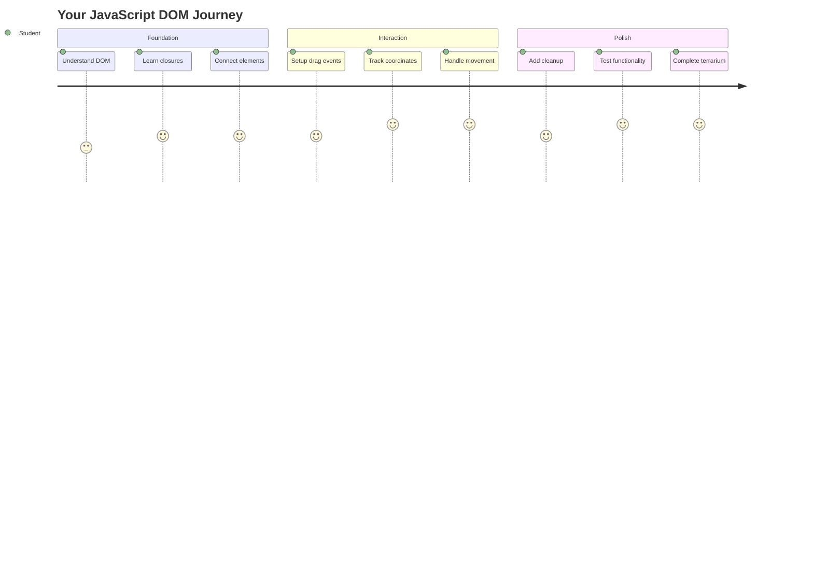
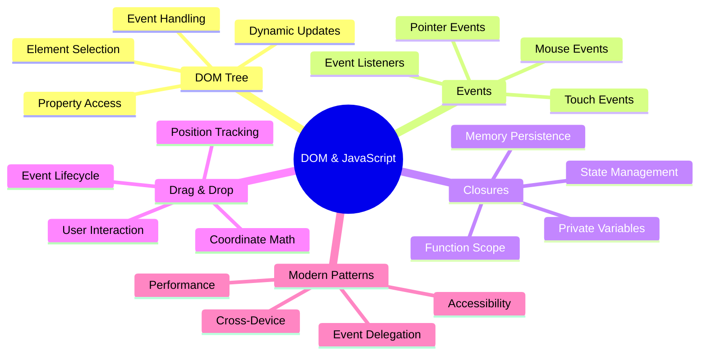
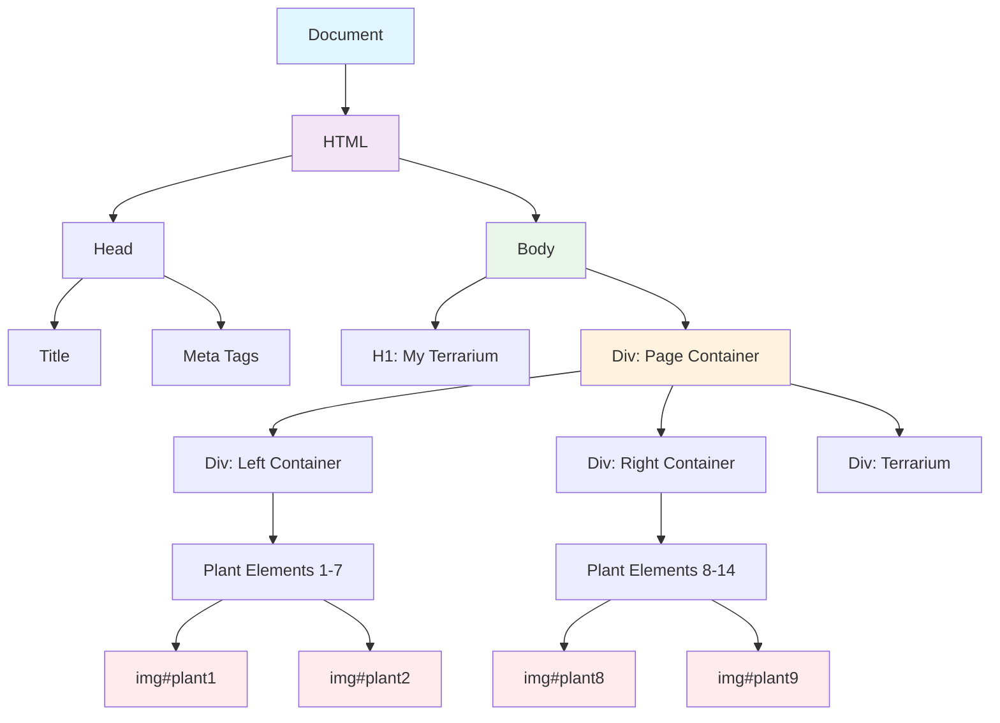
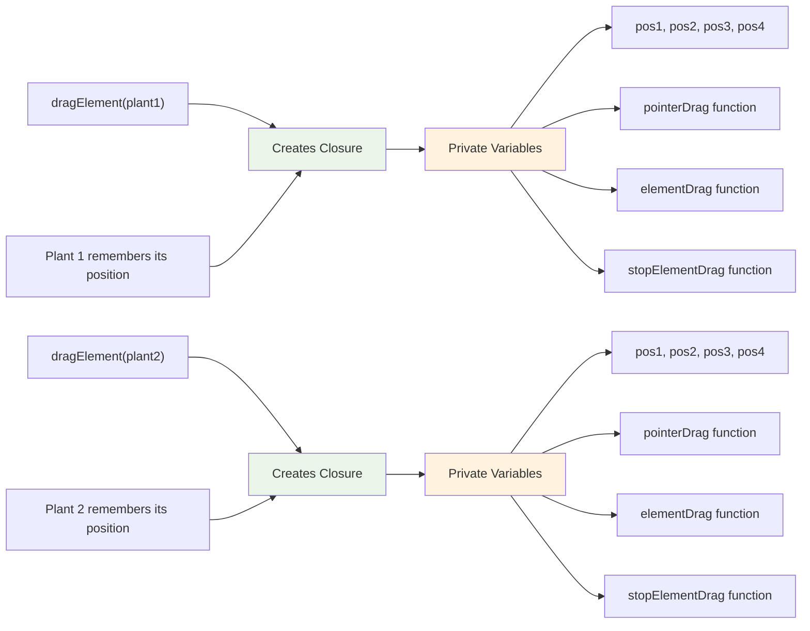
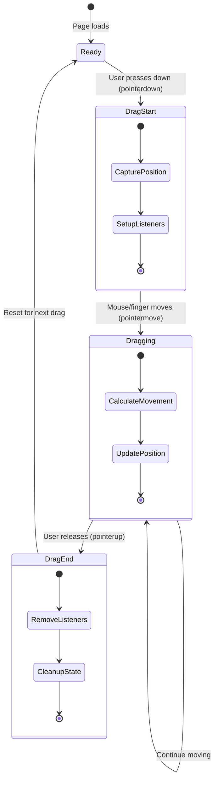
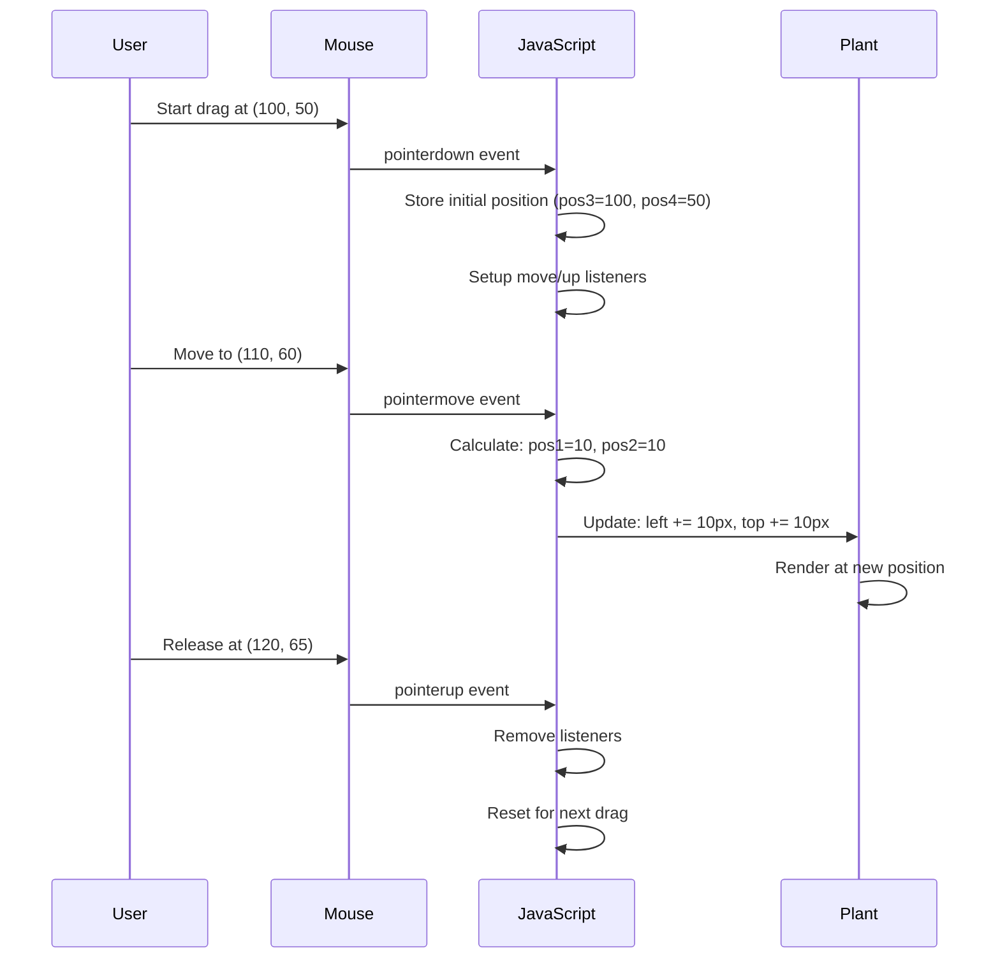
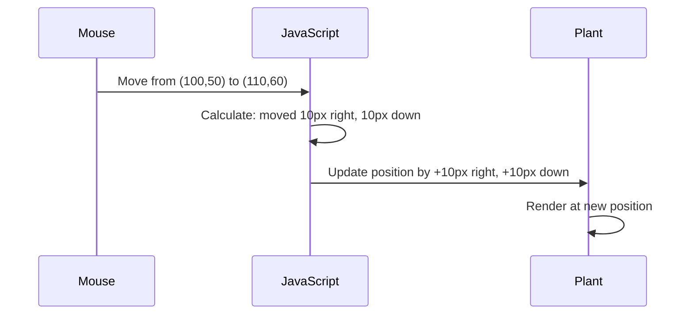
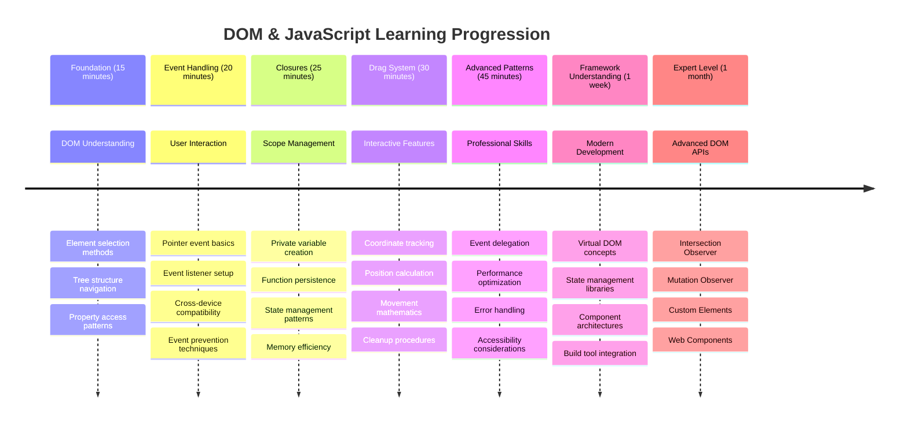

<!--
CO_OP_TRANSLATOR_METADATA:
{
  "original_hash": "973e48ad87d67bf5bb819746c9f8e302",
  "translation_date": "2025-11-03T15:33:04+00:00",
  "source_file": "3-terrarium/3-intro-to-DOM-and-closures/README.md",
  "language_code": "ne"
}
-->
# टेरारियम परियोजना भाग ३: DOM म्यानिपुलेसन र जाभास्क्रिप्ट क्लोजर




> स्केच नोट [टोमोमी इमुरा](https://twitter.com/girlie_mac) द्वारा

वेब विकासको सबैभन्दा रोचक पक्षमा स्वागत छ - चीजहरूलाई अन्तरक्रियात्मक बनाउने! डकुमेन्ट अब्जेक्ट मोडेल (DOM) तपाईंको HTML र जाभास्क्रिप्ट बीचको पुल जस्तै हो, र आज हामी यसलाई तपाईंको टेरारियमलाई जीवन्त बनाउन प्रयोग गर्नेछौं। जब टिम बर्नर्स-लीले पहिलो वेब ब्राउजर बनाएका थिए, उनले वेबलाई गतिशील र अन्तरक्रियात्मक बनाउन सक्ने दस्तावेजहरूको कल्पना गरेका थिए - DOM ले त्यो दृष्टिकोणलाई सम्भव बनाउँछ।

हामी जाभास्क्रिप्ट क्लोजरहरू पनि अन्वेषण गर्नेछौं, जुन सुरुमा डर लाग्दो लाग्न सक्छ। क्लोजरलाई "स्मृति खल्तीहरू" सिर्जना गर्ने जस्तै सोच्नुहोस् जहाँ तपाईंको फङ्सनहरूले महत्त्वपूर्ण जानकारी सम्झन सक्छ। यो तपाईंको टेरारियमको प्रत्येक बिरुवाले आफ्नो स्थिति ट्र्याक गर्न आफ्नै डेटा रेकर्ड भएको जस्तै हो। यस पाठको अन्त्यसम्ममा, तपाईंले तिनीहरू कति प्राकृतिक र उपयोगी छन् भन्ने बुझ्नुहुनेछ।

हामीले निर्माण गर्न लागेको कुरा यहाँ छ: एउटा टेरारियम जहाँ प्रयोगकर्ताहरूले बिरुवाहरूलाई जहाँ चाहिन्छ त्यहाँ तान्न र राख्न सक्छन्। तपाईंले DOM म्यानिपुलेसन प्रविधिहरू सिक्नुहुनेछ जसले ड्र्याग-एन्ड-ड्रप फाइल अपलोडदेखि अन्तरक्रियात्मक खेलहरू सम्म सबैलाई शक्ति दिन्छ। तपाईंको टेरारियमलाई जीवन्त बनाऔं।



## प्रि-लेक्चर क्विज

[प्रि-लेक्चर क्विज](https://ff-quizzes.netlify.app/web/quiz/19)

## DOM बुझ्दै: अन्तरक्रियात्मक वेब पृष्ठहरूको प्रवेशद्वार

डकुमेन्ट अब्जेक्ट मोडेल (DOM) जाभास्क्रिप्टले तपाईंको HTML तत्वहरूसँग संवाद गर्ने तरिका हो। जब तपाईंको ब्राउजरले HTML पृष्ठ लोड गर्छ, यसले मेमोरीमा त्यो पृष्ठको संरचित प्रतिनिधित्व सिर्जना गर्छ - त्यो DOM हो। यसलाई परिवारको रुख जस्तै सोच्नुहोस् जहाँ प्रत्येक HTML तत्व एक परिवार सदस्य हो जसलाई जाभास्क्रिप्टले पहुँच गर्न, परिवर्तन गर्न, वा पुन: व्यवस्था गर्न सक्छ।

DOM म्यानिपुलेसनले स्थिर पृष्ठहरूलाई अन्तरक्रियात्मक वेबसाइटहरूमा रूपान्तरण गर्छ। जब तपाईंले बटनलाई होभर गर्दा रंग परिवर्तन भएको देख्नुहुन्छ, पृष्ठ रिफ्रेस नगरी सामग्री अपडेट भएको देख्नुहुन्छ, वा तान्न सकिने तत्वहरू देख्नुहुन्छ, त्यो DOM म्यानिपुलेसनको काम हो।




> DOM र HTML मार्कअपको प्रतिनिधित्व जसले यसलाई सन्दर्भित गर्छ। [ओल्फा नासराओई](https://www.researchgate.net/publication/221417012_Profile-Based_Focused_Crawler_for_Social_Media-Sharing_Websites) बाट

**DOM लाई शक्तिशाली बनाउने कुरा:**
- **प्रदान गर्छ** तपाईंको पृष्ठको कुनै पनि तत्वमा पहुँच गर्ने संरचित तरिका
- **सक्षम बनाउँछ** पृष्ठ रिफ्रेस नगरी गतिशील सामग्री अपडेट
- **अनुमति दिन्छ** क्लिक र ड्र्याग्स जस्ता प्रयोगकर्ता अन्तरक्रियाहरूको वास्तविक समय प्रतिक्रिया
- **सिर्जना गर्छ** आधुनिक अन्तरक्रियात्मक वेब अनुप्रयोगहरूको आधार

## जाभास्क्रिप्ट क्लोजरहरू: व्यवस्थित, शक्तिशाली कोड सिर्जना गर्दै

[जाभास्क्रिप्ट क्लोजर](https://developer.mozilla.org/docs/Web/JavaScript/Closures) एउटा फङ्सनलाई यसको आफ्नै निजी कार्यक्षेत्र दिने जस्तै हो जसमा स्थायी मेमोरी हुन्छ। डार्विनका फिन्चहरूले गालापागोस टापुमा आफ्नो विशिष्ट वातावरणको आधारमा विशेष चोंच विकास गरे जस्तै - क्लोजरले पनि काम गर्छ, विशेष फङ्सनहरू सिर्जना गर्दै जसले आफ्नो विशिष्ट सन्दर्भ "सम्झन्छ"।

हाम्रो टेरारियममा, क्लोजरहरूले प्रत्येक बिरुवालाई स्वतन्त्र रूपमा आफ्नो स्थिति सम्झन मद्दत गर्छ। यो ढाँचा व्यावसायिक जाभास्क्रिप्ट विकासमा व्यापक रूपमा देखा पर्छ, जसले यसलाई बुझ्नको लागि महत्त्वपूर्ण अवधारणा बनाउँछ।



> 💡 **क्लोजर बुझ्दै**: क्लोजरहरू जाभास्क्रिप्टमा महत्त्वपूर्ण विषय हुन्, र धेरै विकासकर्ताहरूले तिनीहरूलाई पूर्ण रूपमा सैद्धान्तिक पक्षहरू बुझ्नुअघि वर्षौंसम्म प्रयोग गर्छन्। आज, हामी व्यावहारिक अनुप्रयोगमा केन्द्रित छौं - तपाईंले अन्तरक्रियात्मक सुविधाहरू निर्माण गर्दा क्लोजरहरू स्वाभाविक रूपमा देखा पर्ने देख्नुहुनेछ। बुझाइ वास्तविक समस्याहरू समाधान गर्ने तरिकामा देखेर विकास हुनेछ।


> DOM र HTML मार्कअपको प्रतिनिधित्व जसले यसलाई सन्दर्भित गर्छ। [ओल्फा नासराओई](https://www.researchgate.net/publication/221417012_Profile-Based_Focused_Crawler_for_Social_Media-Sharing_Websites) बाट

यस पाठमा, हामी हाम्रो अन्तरक्रियात्मक टेरारियम परियोजना पूरा गर्नेछौं जसले प्रयोगकर्तालाई पृष्ठमा बिरुवाहरूलाई म्यानिपुलेट गर्न अनुमति दिने जाभास्क्रिप्ट सिर्जना गरेर।

## सुरु गर्नु अघि: सफलताको लागि सेटअप

तपाईंलाई अघिल्लो टेरारियम पाठहरूबाट तपाईंको HTML र CSS फाइलहरू चाहिन्छ - हामी त्यो स्थिर डिजाइनलाई अन्तरक्रियात्मक बनाउन लागेका छौं। यदि तपाईं पहिलो पटक सामेल हुँदै हुनुहुन्छ भने, ती पाठहरू पूरा गर्नुले महत्त्वपूर्ण सन्दर्भ प्रदान गर्नेछ।

हामीले निर्माण गर्न लागेको कुरा यहाँ छ:
- **स्मूथ ड्र्याग-एन्ड-ड्रप** सबै टेरारियम बिरुवाहरूको लागि
- **कोअर्डिनेट ट्र्याकिङ** जसले बिरुवाहरूलाई आफ्नो स्थिति सम्झन मद्दत गर्छ
- **पूर्ण अन्तरक्रियात्मक इन्टरफेस** भ्यानिला जाभास्क्रिप्ट प्रयोग गरेर
- **सफा, व्यवस्थित कोड** क्लोजर ढाँचाहरू प्रयोग गरेर

## तपाईंको जाभास्क्रिप्ट फाइल सेटअप गर्दै

आउनुहोस् जाभास्क्रिप्ट फाइल सिर्जना गरौं जसले तपाईंको टेरारियमलाई अन्तरक्रियात्मक बनाउनेछ।

**चरण १: तपाईंको स्क्रिप्ट फाइल सिर्जना गर्नुहोस्**

तपाईंको टेरारियम फोल्डरमा, `script.js` नामको नयाँ फाइल सिर्जना गर्नुहोस्।

**चरण २: जाभास्क्रिप्टलाई तपाईंको HTML मा लिंक गर्नुहोस्**

तपाईंको `index.html` फाइलको `<head>` सेक्सनमा यो स्क्रिप्ट ट्याग थप्नुहोस्:

```html
<script src="./script.js" defer></script>
```

**किन `defer` एट्रिब्युट महत्त्वपूर्ण छ:**
- **सुनिश्चित गर्छ** तपाईंको जाभास्क्रिप्टले सबै HTML लोड नभएसम्म पर्खन्छ
- **रोक्छ** जाभास्क्रिप्टले तयार नभएका तत्वहरू खोज्ने त्रुटिहरू
- **ग्यारेन्टी गर्छ** सबै बिरुवा तत्वहरू अन्तरक्रियाको लागि उपलब्ध छन्
- **बेहतर प्रदर्शन प्रदान गर्छ** पृष्ठको तल स्क्रिप्ट राख्नुभन्दा

> ⚠️ **महत्त्वपूर्ण नोट**: `defer` एट्रिब्युटले सामान्य टाइमिङ समस्याहरू रोक्छ। यसको बिना, जाभास्क्रिप्टले HTML तत्वहरू लोड हुनु अघि पहुँच गर्न प्रयास गर्न सक्छ, जसले त्रुटिहरू निम्त्याउँछ।

---

## जाभास्क्रिप्टलाई तपाईंको HTML तत्वहरूसँग जडान गर्दै

तत्वहरूलाई तान्न योग्य बनाउनुअघि, जाभास्क्रिप्टले DOM मा तिनीहरूलाई पत्ता लगाउन आवश्यक छ। यसलाई पुस्तकालयको क्याटलगिङ प्रणाली जस्तै सोच्नुहोस् - एकपटक तपाईंले क्याटलग नम्बर पाएपछि, तपाईंले चाहिएको पुस्तकलाई ठीकसँग पत्ता लगाउन सक्नुहुन्छ र यसको सबै सामग्री पहुँच गर्न सक्नुहुन्छ।

हामी `document.getElementById()` विधि प्रयोग गर्नेछौं यी जडानहरू बनाउन। यो एक सटीक फाइलिङ प्रणाली जस्तै हो - तपाईंले एक ID प्रदान गर्नुहुन्छ, र यसले तपाईंको HTML मा ठीक त्यही तत्व पत्ता लगाउँछ।

### सबै बिरुवाहरूको लागि ड्र्याग कार्यक्षमता सक्षम गर्दै

तपाईंको `script.js` फाइलमा यो कोड थप्नुहोस्:

```javascript
// Enable drag functionality for all 14 plants
dragElement(document.getElementById('plant1'));
dragElement(document.getElementById('plant2'));
dragElement(document.getElementById('plant3'));
dragElement(document.getElementById('plant4'));
dragElement(document.getElementById('plant5'));
dragElement(document.getElementById('plant6'));
dragElement(document.getElementById('plant7'));
dragElement(document.getElementById('plant8'));
dragElement(document.getElementById('plant9'));
dragElement(document.getElementById('plant10'));
dragElement(document.getElementById('plant11'));
dragElement(document.getElementById('plant12'));
dragElement(document.getElementById('plant13'));
dragElement(document.getElementById('plant14'));
```

**यो कोडले के पूरा गर्छ:**
- **प्रत्येक बिरुवा तत्वलाई DOM मा पत्ता लगाउँछ** यसको अद्वितीय ID प्रयोग गरेर
- **प्रत्येक HTML तत्वको जाभास्क्रिप्ट रेफरेन्स प्राप्त गर्छ**
- **प्रत्येक तत्वलाई `dragElement` फङ्सनमा पास गर्छ** (जसलाई हामी अब सिर्जना गर्नेछौं)
- **प्रत्येक बिरुवालाई ड्र्याग-एन्ड-ड्रप अन्तरक्रियाको लागि तयार गर्छ**
- **तपाईंको HTML संरचनालाई जाभास्क्रिप्ट कार्यक्षमतासँग जडान गर्छ**

> 🎯 **किन क्लासको सट्टा ID प्रयोग गर्ने?** ID ले विशिष्ट तत्वहरूको लागि अद्वितीय पहिचानकर्ता प्रदान गर्छ, जबकि CSS क्लासहरू तत्वहरूको समूहलाई स्टाइल गर्न डिजाइन गरिएको हो। जब जाभास्क्रिप्टले व्यक्तिगत तत्वहरू म्यानिपुलेट गर्न आवश्यक छ, ID ले हामीलाई चाहिएको सटीकता र प्रदर्शन प्रदान गर्छ।

> 💡 **प्रो टिप**: ध्यान दिनुहोस् हामी प्रत्येक बिरुवाको लागि व्यक्तिगत रूपमा `dragElement()` कल गर्दैछौं। यो दृष्टिकोणले सुनिश्चित गर्छ कि प्रत्येक बिरुवाले आफ्नो स्वतन्त्र ड्र्यागिङ व्यवहार प्राप्त गर्छ, जुन सहज प्रयोगकर्ता अन्तरक्रियाको लागि आवश्यक छ।

### 🔄 **शैक्षिक जाँच**
**DOM जडान बुझाइ**: ड्र्याग कार्यक्षमतामा जानुअघि, सुनिश्चित गर्नुहोस् तपाईं:
- ✅ कसरी `document.getElementById()` ले HTML तत्वहरू पत्ता लगाउँछ भन्ने व्याख्या गर्न सक्नुहुन्छ
- ✅ किन प्रत्येक बिरुवाको लागि अद्वितीय ID प्रयोग गरिन्छ भन्ने बुझ्नुहुन्छ
- ✅ स्क्रिप्ट ट्यागमा `defer` एट्रिब्युटको उद्देश्य वर्णन गर्न सक्नुहुन्छ
- ✅ कसरी जाभास्क्रिप्ट र HTML DOM मार्फत जडान हुन्छ भन्ने चिन्न सक्नुहुन्छ

**छिटो आत्म-परीक्षण**: यदि दुई तत्वहरूको समान ID भएमा के हुन्छ? किन `getElementById()` ले केवल एक तत्व फर्काउँछ?
*उत्तर: ID अद्वितीय हुनुपर्छ; यदि दोहोरिन्छ भने, केवल पहिलो तत्व फर्काइन्छ*

---

## ड्र्याग एलिमेन्ट क्लोजर निर्माण गर्दै

अब हामी प्रत्येक बिरुवाको ड्र्यागिङ व्यवहार व्यवस्थापन गर्ने क्लोजर सिर्जना गर्नेछौं। यो क्लोजरले माउसको चाल ट्र्याक गर्न र तत्वको स्थिति अपडेट गर्न सँगै काम गर्ने धेरै इनर फङ्सनहरू समावेश गर्नेछ।

क्लोजरहरू यस कार्यको लागि उत्तम छन् किनभने तिनीहरूले "निजी" भेरिएबलहरू सिर्जना गर्न अनुमति दिन्छन् जसले फङ्सन कलहरू बीचमा निरन्तरता कायम राख्छ, प्रत्येक बिरुवालाई आफ्नो स्वतन्त्र कोअर्डिनेट ट्र्याकिङ प्रणाली दिन्छ।

### सरल उदाहरणको साथ क्लोजर बुझ्दै

क्लोजरको अवधारणा चित्रण गर्ने सरल उदाहरणको साथ म तपाईंलाई प्रदर्शन गर्नेछु:

```javascript
function createCounter() {
    let count = 0; // This is like a private variable
    
    function increment() {
        count++; // The inner function remembers the outer variable
        return count;
    }
    
    return increment; // We're giving back the inner function
}

const myCounter = createCounter();
console.log(myCounter()); // 1
console.log(myCounter()); // 2
```

**यो क्लोजर ढाँचामा के भइरहेको छ:**
- **निजी `count` भेरिएबल सिर्जना गर्छ** जुन केवल यो क्लोजर भित्र मात्र हुन्छ
- **इनर फङ्सनले** त्यो बाहिरी भेरिएबलमा पहुँच गर्न र परिवर्तन गर्न सक्छ (क्लोजर मेकानिज्म)
- **जब हामी फर्काउँछौं** इनर फङ्सन, यसले त्यो निजी डाटासँगको जडान कायम राख्छ
- **यहाँसम्म कि** `createCounter()` कार्यान्वयन समाप्त भएपछि पनि, `count` आफ्नो मान सम्झन्छ

### किन ड्र्याग कार्यक्षमताको लागि क्लोजरहरू उत्तम छन्

हाम्रो टेरारियमको लागि, प्रत्येक बिरुवाले आफ्नो हालको स्थिति कोअर्डिनेटहरू सम्झन आवश्यक छ। क्लोजरहरूले उत्तम समाधान प्रदान गर्छन्:

**हाम्रो परियोजनाका लागि मुख्य फाइदाहरू:**
- **प्रत्येक बिरुवा स्वतन्त्र रूपमा आफ्नो स्थिति भेरिएबलहरू कायम राख्छ**
- **ड्र्याग घटनाहरू बीचमा कोअर्डिनेट डाटा कायम राख्छ**
- **विभिन्न तान्न सकिने तत्वहरू बीचमा भेरिएबल द्वन्द्व रोक्छ**
- **सफा, व्यवस्थित कोड संरचना सिर्जना गर्छ**

> 🎯 **सिक्ने लक्ष्य**: तपाईंले अहिले क्लोजरहरूको प्रत्येक पक्षमा महारत हासिल गर्न आवश्यक छैन। तिनीहरूले हाम्रो कोडलाई व्यवस्थित गर्न र हाम्रो ड्र्यागिङ कार्यक्षमताको लागि अवस्था कायम राख्न कसरी मद्दत गर्छन् भन्ने हेर्नमा ध्यान केन्द्रित गर्नुहोस्।



### `dragElement` फङ्सन सिर्जना गर्दै

अब हामी मुख्य फङ्सन निर्माण गर्नेछौं जसले सबै ड्र्यागिङ तर्कलाई व्यवस्थापन गर्नेछ। तपाईंको बिरुवा तत्व घोषणाहरूको तल यो फङ्सन थप्नुहोस्:

```javascript
function dragElement(terrariumElement) {
    // Initialize position tracking variables
    let pos1 = 0,  // Previous mouse X position
        pos2 = 0,  // Previous mouse Y position  
        pos3 = 0,  // Current mouse X position
        pos4 = 0;  // Current mouse Y position
    
    // Set up the initial drag event listener
    terrariumElement.onpointerdown = pointerDrag;
}
```

**स्थिति ट्र्याकिङ प्रणाली बुझ्दै:**
- **`pos1` र `pos2`**: पुरानो र नयाँ माउस स्थितिहरू बीचको भिन्नता भण्डारण गर्नुहोस्
- **`pos3` र `pos4`**: हालको माउस कोअर्डिनेटहरू ट्र्याक गर्नुहोस्
- **`terrariumElement`**: विशिष्ट बिरुवा तत्व जसलाई हामी तान्न योग्य बनाउँदैछौं
- **`onpointerdown`**: घटना जसले प्रयोगकर्ताले तान्न सुरु गर्दा ट्रिगर गर्छ

**क्लोजर ढाँचाले कसरी काम गर्छ:**
- **प्रत्येक बिरुवा तत्वको लागि निजी स्थिति भेरिएबलहरू सिर्जना गर्छ**
- **यी भेरिएबलहरू ड्र्यागिङ जीवनचक्रभरि कायम राख्छ**
- **प्रत्येक बिरुवाले स्वतन्त्र रूपमा आफ्नो कोअर्डिनेट ट्र्याक गर्छ भन्ने सुनिश्चित गर्छ**
- **सफा इन्टरफेस प्रदान गर्छ** `dragElement` फङ्सन मार्फत

### किन पोइन्टर इभेन्टहरू प्रयोग गर्ने?

तपाईं सोच्न सक्नुहुन्छ किन हामी `onpointerdown` प्रयोग गर्छौं `onclick` भन्दा। यहाँ कारण छ:

| इभेन्ट प्रकार | उत्तम लागि | समस्या |
|------------|----------|-------------|
| `onclick` | साधारण बटन क्लिकहरू | तान्न सक्दैन (केवल क्लिक र रिलिज) |
| `onpointerdown` | माउस र टच दुवै | नयाँ, तर आजकल राम्रोसँग समर्थित |
| `onmousedown` | डेस्कटप माउस मात्र | मोबाइल प्रयोगकर्ताहरूलाई छुटाउँछ |

**हामीले निर्माण गरिरहेको कुराको लागि पोइन्टर इभेन्टहरू उत्तम किन छन्:**
- **माउस, औंला, वा स्टाइलस प्रयोग गर्दा पनि राम्रोसँग काम गर्छ**
- **ल्यापटप, ट्याब्लेट, वा फोनमा समान अनुभव दिन्छ**
- **वास्तविक तान्ने गति सम्हाल्छ** (केवल क्लिक-एन्ड-डन होइन)
- **स्मूथ अनुभव सिर्जना गर्छ** जुन प्रयोगकर्ताहरूले आधुनिक वेब अनुप्रयोगबाट अपेक्षा गर्छन्

> 💡 **भविष्यको लागि तयार गर्दै**: पोइन्टर इभेन्टहरू प्रयोगकर्ता अन्तरक्रियाहरूलाई सम्हाल्ने आधुनिक तरिका हुन्। माउस र टचको लागि अलग-अलग कोड लेख्नुभन्दा, तपाईंले दुवैलाई स्वत: प्राप्त गर्नुहुन्छ। धेरै राम्रो, हैन?

### 🔄 **शैक्षिक जाँच**
**इभेन्ट ह्यान्डलिङ बुझाइ**: इभेन्टहरू बुझ्नको लागि आफ्नो समझ पुष्टि गर्न रोक्नुहोस्:
- ✅ किन हामी माउस इभेन्टहरूको सट्टा पोइन्टर इभेन्टहरू प्रयोग गर्छौं?
- ✅ क्लोजर भेरिएबलहरू फङ्सन कलहरू बीचमा कसरी कायम रहन्छन्?
- ✅ `preventDefault()` ले स्मूथ ड्र्यागिङमा के भूमिका खेल्छ?
- ✅ किन हामी व्यक्तिगत तत्वहरूको सट्टा डकुमेन्टमा लिसनरहरू जोड्छौं?

**वास्तविक संसारको जडान**: तपाईंले दैनिक प्रयोग गर्ने ड्र्याग-एन्ड-ड्रप इन्टरफेसहरूको बारेमा सोच्नुहोस्:
- **फाइल अपलोडहरू**: ब्राउजर विन्डोमा फाइलहरू तान्दै
- **कानबन बोर्डहरू**: कार्यहरू स्तम्भहरू बीचमा सार्दै
- **इमेज ग्यालरीहरू**: फोटोहरूको क्रम पुन: व्यवस्था गर्दै
- **मोबाइल इन्टरफेसहरू**: टचस्क्रिनमा स्वाइप र तान्दै

---

## `pointerDrag` फङ्सन: ड्र्यागको सुरुवात कब्जा गर्दै

जब प्रयोगकर्ताले बिरुवामा थिच्छ (माउस क्लिक वा औंलाको टचसँग), `pointerDrag` फङ्सन सक्रिय हुन्छ। यो फङ्सनले प्रारम्भिक कोअर्डिनेटहरू कब्जा गर्छ र ड्र्यागिङ प्रणाली सेटअप गर्छ।

यो फङ्स
**यी समन्वयहरू बुझ्दै:**
- **प्रदान गर्दछ** पिक्सेल-परफेक्ट पोजिसनिङ जानकारी
- **रियल-टाइममा अपडेट हुन्छ** जब प्रयोगकर्ताले आफ्नो पोइन्टर सार्छन्
- **विभिन्न स्क्रिन साइज र जूम स्तरहरूमा स्थिर रहन्छ**
- **सजिलो र प्रतिक्रियात्मक ड्र्याग अन्तरक्रिया सक्षम बनाउँछ**

### डकुमेन्ट-स्तर इभेन्ट लिसनर सेटअप गर्दै

ध्यान दिनुहोस् कि हामीले `document` मा मूभ र स्टप इभेन्टहरू जोडेका छौं, केवल प्लान्ट एलिमेन्टमा होइन:

```javascript
document.onpointermove = elementDrag;
document.onpointerup = stopElementDrag;
```

**किन डकुमेन्टमा जोड्ने:**
- **ट्र्याकिङ जारी राख्छ** जब माउस प्लान्ट एलिमेन्टबाट बाहिर जान्छ
- **ड्र्याग अवरोध रोक्छ** यदि प्रयोगकर्ताले छिटो सर्छन्
- **पूरे स्क्रिनमा सहज ड्र्यागिङ प्रदान गर्दछ**
- **एज केसहरू ह्यान्डल गर्दछ** जहाँ कर्सर ब्राउजर विन्डो बाहिर जान्छ

> ⚡ **प्रदर्शन नोट**: ड्र्यागिङ रोक्दा यी डकुमेन्ट-स्तर लिसनरहरू सफा गरिनेछ ताकि मेमोरी लीक र प्रदर्शन समस्याहरू रोक्न सकियोस्।

## ड्र्याग प्रणाली पूरा गर्दै: मूभमेन्ट र सफाइ

अब हामी दुई बाँकी फङ्सनहरू थप्नेछौं जसले वास्तविक ड्र्यागिङ मूभमेन्ट र ड्र्यागिङ रोक्दा सफाइ ह्यान्डल गर्छ। यी फङ्सनहरूले मिलेर तपाईंको टेरारियममा प्लान्टको सहज, प्रतिक्रियात्मक मूभमेन्ट सिर्जना गर्छ।

### elementDrag फङ्सन: मूभमेन्ट ट्र्याकिङ

`pointerDrag` को बन्द कर्ली ब्र्याकेटपछि `elementDrag` फङ्सन थप्नुहोस्:

```javascript
function elementDrag(e) {
    // Calculate the distance moved since the last event
    pos1 = pos3 - e.clientX;  // Horizontal distance moved
    pos2 = pos4 - e.clientY;  // Vertical distance moved
    
    // Update the current position tracking
    pos3 = e.clientX;  // New current X position
    pos4 = e.clientY;  // New current Y position
    
    // Apply the movement to the element's position
    terrariumElement.style.top = (terrariumElement.offsetTop - pos2) + 'px';
    terrariumElement.style.left = (terrariumElement.offsetLeft - pos1) + 'px';
}
```

**समन्वय गणित बुझ्दै:**
- **`pos1` र `pos2`**: माउसले अन्तिम अपडेटदेखि कति टाढा सरेको छ गणना गर्छ
- **`pos3` र `pos4`**: अर्को गणनाको लागि हालको माउस पोजिसन स्टोर गर्छ
- **`offsetTop` र `offsetLeft`**: पृष्ठमा एलिमेन्टको हालको पोजिसन प्राप्त गर्छ
- **घटाउने तर्क**: माउसले सरेको जति नै एलिमेन्टलाई सार्छ



**मूभमेन्ट गणनाको विवरण:**
1. **पुरानो र नयाँ माउस पोजिसनको भिन्नता मापन गर्छ**
2. **माउस मूभमेन्टको आधारमा एलिमेन्टलाई कति सार्ने गणना गर्छ**
3. **रियल-टाइममा एलिमेन्टको CSS पोजिसन प्रोपर्टीहरू अपडेट गर्छ**
4. **अर्को मूभमेन्ट गणनाको लागि नयाँ पोजिसनलाई आधाररेखा बनाउँछ**

### गणितको दृश्य प्रतिनिधित्व



### stopElementDrag फङ्सन: सफाइ गर्दै

`elementDrag` को बन्द कर्ली ब्र्याकेटपछि सफाइ फङ्सन थप्नुहोस्:

```javascript
function stopElementDrag() {
    // Remove the document-level event listeners
    document.onpointerup = null;
    document.onpointermove = null;
}
```

**किन सफाइ आवश्यक छ:**
- **मेमोरी लीक रोक्छ** जुन बाँकी इभेन्ट लिसनरहरूबाट हुन सक्छ
- **प्लान्ट छोड्दा ड्र्यागिङ व्यवहार रोक्छ**
- **अन्य एलिमेन्टहरू स्वतन्त्र रूपमा ड्र्याग गर्न अनुमति दिन्छ**
- **अर्को ड्र्याग अपरेशनको लागि प्रणाली रिसेट गर्छ**

**सफाइ नगर्दा के हुन्छ:**
- इभेन्ट लिसनरहरू ड्र्यागिङ रोकिएपछि पनि चलिरहन्छन्
- प्रदर्शन बिग्रिन्छ किनकि प्रयोग नगरिएका लिसनरहरू जम्मा हुन्छन्
- अन्य एलिमेन्टहरूसँग अन्तरक्रिया गर्दा अप्रत्याशित व्यवहार
- अनावश्यक इभेन्ट ह्यान्डलिङमा ब्राउजर स्रोतहरू खेर जान्छन्

### CSS पोजिसन प्रोपर्टीहरू बुझ्दै

हाम्रो ड्र्यागिङ प्रणालीले दुई प्रमुख CSS प्रोपर्टीहरूलाई ह्यान्डल गर्छ:

| प्रोपर्टी | के नियन्त्रण गर्छ | हामी कसरी प्रयोग गर्छौं |
|----------|------------------|---------------|
| `top` | माथिल्लो किनारबाट दूरी | ड्र्यागको क्रममा ठाडो पोजिसनिङ |
| `left` | बायाँ किनारबाट दूरी | ड्र्यागको क्रममा तेर्सो पोजिसनिङ |

**ऑफसेट प्रोपर्टीहरूको प्रमुख जानकारी:**
- **`offsetTop`**: पोजिसन गरिएको अभिभावक एलिमेन्टबाट हालको दूरी
- **`offsetLeft`**: पोजिसन गरिएको अभिभावक एलिमेन्टबाट हालको दूरी
- **पोजिसनिङ सन्दर्भ**: यी मानहरू नजिकको पोजिसन गरिएको पूर्वजसँग सम्बन्धित छन्
- **रियल-टाइम अपडेटहरू**: जब हामी CSS प्रोपर्टीहरू परिवर्तन गर्छौं, यी मानहरू तुरुन्तै परिवर्तन हुन्छन्

> 🎯 **डिजाइन दर्शन**: यो ड्र्याग प्रणाली जानाजानी लचिलो बनाइएको छ – कुनै "ड्रप जोन" वा प्रतिबन्धहरू छैनन्। प्रयोगकर्ताहरूले प्लान्टहरू जहाँ पनि राख्न सक्छन्, जसले उनीहरूलाई आफ्नो टेरारियम डिजाइनमा पूर्ण रचनात्मक नियन्त्रण दिन्छ।

## सबै कुरा जोड्दै: तपाईंको पूर्ण ड्र्याग प्रणाली

बधाई छ! तपाईंले भ्यानिला जाभास्क्रिप्ट प्रयोग गरेर एक परिष्कृत ड्र्याग-एन्ड-ड्रप प्रणाली निर्माण गर्नुभयो। तपाईंको पूर्ण `dragElement` फङ्सनमा अब एक शक्तिशाली क्लोजर समावेश छ जसले व्यवस्थापन गर्छ:

**तपाईंको क्लोजरले के हासिल गर्छ:**
- **प्रत्येक प्लान्टको लागि निजी पोजिसन भेरिएबलहरू कायम राख्छ**
- **ड्र्याग जीवनचक्रको सुरुदेखि अन्त्यसम्म ह्यान्डल गर्छ**
- **पूरे स्क्रिनमा सहज, प्रतिक्रियात्मक मूभमेन्ट प्रदान गर्छ**
- **स्रोतहरू ठीकसँग सफा गर्छ ताकि मेमोरी लीक रोक्न सकियोस्**
- **टेरारियम डिजाइनको लागि सहज, रचनात्मक इन्टरफेस सिर्जना गर्छ**

### तपाईंको अन्तरक्रियात्मक टेरारियम परीक्षण गर्दै

अब तपाईंको अन्तरक्रियात्मक टेरारियम परीक्षण गर्नुहोस्! आफ्नो `index.html` फाइल ब्राउजरमा खोल्नुहोस् र कार्यक्षमता प्रयास गर्नुहोस्:

1. **क्लिक र होल्ड गर्नुहोस्** कुनै पनि प्लान्टलाई ड्र्याग सुरु गर्न
2. **माउस वा औंला सार्नुहोस्** र प्लान्टलाई सहज रूपमा पछ्याउँदै हेर्नुहोस्
3. **छोड्नुहोस्** प्लान्टलाई नयाँ पोजिसनमा राख्न
4. **विभिन्न व्यवस्थाहरूको साथ प्रयोग गर्नुहोस्** इन्टरफेस अन्वेषण गर्न

🥇 **उपलब्धि**: तपाईंले पेशेवर विकासकर्ताहरूले दैनिक प्रयोग गर्ने कोर अवधारणाहरू प्रयोग गरेर पूर्ण रूपमा अन्तरक्रियात्मक वेब एप्लिकेसन सिर्जना गर्नुभयो। त्यो ड्र्याग-एन्ड-ड्रप कार्यक्षमता फाइल अपलोडहरू, कानबान बोर्डहरू, र धेरै अन्य अन्तरक्रियात्मक इन्टरफेसहरू पछाडि समान सिद्धान्तहरू प्रयोग गर्दछ।

### 🔄 **शिक्षणात्मक जाँच**
**पूर्ण प्रणाली बुझाइ**: तपाईंको पूर्ण ड्र्याग प्रणालीको मास्टरी प्रमाणित गर्नुहोस्:
- ✅ क्लोजरहरूले प्रत्येक प्लान्टको लागि स्वतन्त्र अवस्था कसरी कायम राख्छन्?
- ✅ सहज मूभमेन्टको लागि समन्वय गणित किन आवश्यक छ?
- ✅ यदि हामीले इभेन्ट लिसनरहरू सफा गर्न बिर्स्यौं भने के हुन्छ?
- ✅ यो ढाँचा जटिल अन्तरक्रियाहरूमा कसरी स्केल हुन्छ?

**कोड गुणस्तर प्रतिबिम्ब**: तपाईंको पूर्ण समाधान समीक्षा गर्नुहोस्:
- **मोड्युलर डिजाइन**: प्रत्येक प्लान्टले आफ्नो क्लोजर इन्स्ट्यान्स प्राप्त गर्छ
- **इभेन्ट दक्षता**: लिसनरहरूको उचित सेटअप र सफाइ
- **क्रस-डिभाइस समर्थन**: डेस्कटप र मोबाइलमा काम गर्छ
- **प्रदर्शन सचेत**: कुनै मेमोरी लीक वा अनावश्यक गणनाहरू छैनन्


---

## GitHub Copilot Agent Challenge 🚀

Agent मोड प्रयोग गरेर निम्न चुनौती पूरा गर्नुहोस्:

**विवरण:** टेरारियम प्रोजेक्टमा रिसेट कार्यक्षमता थप्नुहोस् जसले सबै प्लान्टहरूलाई उनीहरूको मूल पोजिसनमा स्मूथ एनिमेसनको साथ फर्काउँछ।

**प्रम्ट:** एक रिसेट बटन सिर्जना गर्नुहोस्, जसलाई क्लिक गर्दा सबै प्लान्टहरूलाई उनीहरूको मूल साइडबार पोजिसनमा CSS ट्रान्जिसन प्रयोग गरेर १ सेकेन्डमा स्मूथली ट्रान्जिसन गराउँछ। फङ्सनले पेज लोड हुँदा मूल पोजिसनहरू स्टोर गर्नुपर्छ र रिसेट बटन थिच्दा ती पोजिसनहरूमा प्लान्टहरू फर्काउँछ।

[agent mode](https://code.visualstudio.com/blogs/2025/02/24/introducing-copilot-agent-mode) को बारेमा थप जान्नुहोस्।

## 🚀 थप चुनौती: आफ्नो सीप विस्तार गर्नुहोस्

तपाईंको टेरारियमलाई अर्को स्तरमा लैजान तयार हुनुहुन्छ? यी सुधारहरू कार्यान्वयन गर्ने प्रयास गर्नुहोस्:

**रचनात्मक विस्तारहरू:**
- **डबल-क्लिक** प्लान्टलाई अगाडि ल्याउन (z-index म्यानिपुलेसन)
- **दृश्य प्रतिक्रिया थप्नुहोस्** जस्तै प्लान्टहरूमा होभर गर्दा हल्का चमक
- **सीमाहरू कार्यान्वयन गर्नुहोस्** प्लान्टहरूलाई टेरारियम बाहिर ड्र्याग गर्न रोक्न
- **सेभ फङ्सन सिर्जना गर्नुहोस्** जसले प्लान्ट पोजिसनहरूलाई localStorage प्रयोग गरेर सम्झन्छ
- **ध्वनि प्रभावहरू थप्नुहोस्** प्लान्ट उठाउँदा र राख्दा

> 💡 **शिक्षण अवसर**: यी चुनौतीहरूले तपाईंलाई DOM म्यानिपुलेसन, इभेन्ट ह्यान्डलिङ, र प्रयोगकर्ता अनुभव डिजाइनको नयाँ पक्षहरू सिकाउनेछन्।

## पोस्ट-लेक्चर क्विज

[पोस्ट-लेक्चर क्विज](https://ff-quizzes.netlify.app/web/quiz/20)

## समीक्षा र आत्म अध्ययन: तपाईंको बुझाइलाई गहिरो बनाउँदै

तपाईंले DOM म्यानिपुलेसन र क्लोजरहरूको आधारभूत कुरा मास्टर गर्नुभएको छ, तर अझै अन्वेषण गर्न धेरै छ! यहाँ तपाईंको ज्ञान र सीप विस्तार गर्नका लागि केही मार्गहरू छन्।

### वैकल्पिक ड्र्याग र ड्रप दृष्टिकोणहरू

हामीले अधिकतम लचीलापनको लागि पोइन्टर इभेन्टहरू प्रयोग गर्यौं, तर वेब विकासले धेरै दृष्टिकोणहरू प्रदान गर्दछ:

| दृष्टिकोण | सबैभन्दा राम्रो लागि | सिक्ने मूल्य |
|----------|----------|----------------|
| [HTML Drag and Drop API](https://developer.mozilla.org/docs/Web/API/HTML_Drag_and_Drop_API) | फाइल अपलोडहरू, औपचारिक ड्र्याग जोनहरू | ब्राउजरको प्राकृतिक क्षमता बुझ्दै |
| [Touch Events](https://developer.mozilla.org/docs/Web/API/Touch_events) | मोबाइल-विशिष्ट अन्तरक्रिया | मोबाइल-प्रथम विकास ढाँचाहरू |
| CSS `transform` प्रोपर्टीहरू | स्मूथ एनिमेसनहरू | प्रदर्शन अनुकूलन प्रविधिहरू |

### उन्नत DOM म्यानिपुलेसन विषयहरू

**तपाईंको सिकाइ यात्रामा अर्को चरणहरू:**
- **इभेन्ट डेलिगेसन**: धेरै एलिमेन्टहरूको लागि इभेन्टहरू कुशलतापूर्वक ह्यान्डल गर्दै
- **इंटरसेक्सन अब्जर्भर**: एलिमेन्टहरू भ्यूपोर्टमा प्रवेश/निस्कने समय पत्ता लगाउँदै
- **म्युटेसन अब्जर्भर**: DOM संरचनामा परिवर्तनहरूको लागि हेर्दै
- **वेब कम्पोनेन्टहरू**: पुन: प्रयोग गर्न मिल्ने, इन्क्याप्सुलेटेड UI एलिमेन्टहरू सिर्जना गर्दै
- **भर्चुअल DOM अवधारणाहरू**: फ्रेमवर्कहरूले DOM अपडेटहरू कसरी अनुकूलित गर्छन् बुझ्दै

### निरन्तर सिकाइका लागि आवश्यक स्रोतहरू

**प्राविधिक डकुमेन्टेसन:**
- [MDN Pointer Events Guide](https://developer.mozilla.org/docs/Web/API/Pointer_events) - व्यापक पोइन्टर इभेन्ट सन्दर्भ
- [W3C Pointer Events Specification](https://www.w3.org/TR/pointerevents1/) - आधिकारिक मापदण्ड डकुमेन्टेसन
- [JavaScript Closures Deep Dive](https://developer.mozilla.org/docs/Web/JavaScript/Closures) - उन्नत क्लोजर ढाँचाहरू

**ब्राउजर अनुकूलता:**
- [CanIUse.com](https://caniuse.com/) - ब्राउजरहरूमा फिचर समर्थन जाँच गर्नुहोस्
- [MDN Browser Compatibility Data](https://github.com/mdn/browser-compat-data) - विस्तृत अनुकूलता जानकारी

**अभ्यास अवसरहरू:**
- **निर्माण गर्नुहोस्** ड्र्याग म्याकानिक्स प्रयोग गरेर पजल गेम
- **सिर्जना गर्नुहोस्** ड्र्याग-एन्ड-ड्रप टास्क व्यवस्थापनको साथ कानबान बोर्ड
- **डिजाइन गर्नुहोस्** ड्र्याग गर्न मिल्ने फोटो व्यवस्थापनको साथ इमेज ग्यालरी
- **प्रयोग गर्नुहोस्** मोबाइल इन्टरफेसहरूको लागि टच जेस्चरहरू

> 🎯 **सिकाइ रणनीति**: यी अवधारणाहरूलाई ठोस बनाउनको लागि उत्तम तरिका अभ्यास हो। ड्र्याग गर्न मिल्ने इन्टरफेसहरूको भिन्नता निर्माण गर्ने प्रयास गर्नुहोस् – प्रत्येक प्रोजेक्टले तपाईंलाई प्रयोगकर्ता अन्तरक्रिया र DOM म्यानिपुलेसनको बारेमा नयाँ कुरा सिकाउनेछ।

### ⚡ **तपाईंले अर्को ५ मिनेटमा गर्न सक्ने कुरा**
- [ ] ब्राउजर DevTools खोल्नुहोस् र कन्सोलमा `document.querySelector('body')` टाइप गर्नुहोस्
- [ ] `innerHTML` वा `textContent` प्रयोग गरेर वेबपेजको टेक्स्ट परिवर्तन गर्ने प्रयास गर्नुहोस्
- [ ] वेबपेजमा कुनै पनि बटन वा लिंकमा क्लिक इभेन्ट लिसनर थप्नुहोस्
- [ ] Elements प्यानल प्रयोग गरेर DOM ट्री संरचना निरीक्षण गर्नुहोस्

### 🎯 **तपाईंले यो घण्टामा हासिल गर्न सक्ने कुरा**
- [ ] पोस्ट-लेसन क्विज पूरा गर्नुहोस् र DOM म्यानिपुलेसन अवधारणाहरू समीक्षा गर्नुहोस्
- [ ] प्रयोगकर्ताको क्लिकहरूमा प्रतिक्रिया दिने अन्तरक्रियात्मक वेबपेज सिर्जना गर्नुहोस्
- [ ] विभिन्न इभेन्ट प्रकारहरू (क्लिक, माउसओभर, कीप्रेस) संग इभेन्ट ह्यान्डलिङ अभ्यास गर्नुहोस्
- [ ] DOM म्यानिपुलेसन प्रयोग गरेर साधारण टु-डु लिस्ट वा काउन्टर निर्माण गर्नुहोस्
- [ ] HTML एलिमेन्टहरू र जाभास्क्रिप्ट वस्तुहरू बीचको सम्बन्ध अन्वेषण गर्नुहोस्

### 📅 **तपाईंको हप्ताको जाभास्क्रिप्ट यात्रा**
- [ ] ड्र्याग-एन्ड-ड्रप कार्यक्षमता सहित अन्तरक्रियात्मक टेरारियम प्रोजेक्ट पूरा गर्नुहोस्
- [ ] कुशल इभेन्ट ह्यान्डलिङको लागि इभेन्ट डेलिगेसन मास्टर गर्नुहोस्
- [ ] इभेन्ट लूप र एसिंक्रोनस जाभास्क्रिप्टको बारेमा जान्नुहोस्
- [ ] निजी अवस्थाको साथ मोड्युलहरू निर्माण गरेर क्लोजरहरू अभ्यास गर्नुहोस्
- [ ] Intersection Observer जस्ता आधुनिक DOM API अन्वेषण गर्नुहोस्
- [ ] फ्रेमवर्क प्रयोग नगरी अन्तरक्रियात्मक कम्पोनेन्टहरू निर्माण गर्नुहोस्

### 🌟 **तपाईंको महिनाको जाभास्क्रिप्ट मास्टरी**
- [ ] भ्यानिला जाभास्क्रिप्ट प्रयोग गरेर जटिल सिंगल-पेज एप्लिकेसन सिर्जना गर्नुहोस्
- [ ] आधुनिक फ्रेमवर्क (React, Vue, वा Angular) सिक्नुहोस् र यसलाई भ्यानिला DOM सँग तुलना गर्नुहोस्
- [ ] ओपन सोर्स जाभास्क्रिप्ट प्रोजेक्टहरूमा योगदान गर्नुहोस्
- [ ] वेब कम्पोनेन्टहरू र कस्टम एलिमेन्टहरू जस्ता उन्नत अवधारणाहरू मास्टर गर्नुहोस्
- [ ] इष्टतम DOM ढाँचाहरूको साथ प्रदर्शनकारी वेब एप्लिकेसनहरू निर्माण गर्नुहोस्
- [ ] DOM म्यानिपुलेसन र जाभास्क्रिप्ट आधारभूत कुराहरूको बारेमा अरूलाई सिकाउनुहोस्

## 🎯 तपाईंको जाभास्क्रिप्ट DOM मास्टरी टाइमलाइन



### 🛠️ तपाईंको जाभास्क्रिप्ट टूलकिट सारांश

यो पाठ पूरा गरेपछि, तपाईंसँग अब छ:
- **DOM मास्टरी**: एलिमेन्ट चयन, प्रोपर्टी म्यानिपुलेसन, र ट्री नेभिगेसन
- **इभेन्ट विशेषज्ञता**: पोइन्टर इभेन्टहरूको साथ क्रस-डिभाइस अन्तरक्रिया ह्यान्डलिङ
- **क्लोजर बुझाइ**: निजी अवस्था व्यवस्थापन र फङ्सन स्थायित्व
- **अन्तरक्रियात्मक प्रणालीहरू**: स्क्र्याचबाट पूर्ण ड्र्याग-एन्ड-ड्रप कार्यान्वयन
- **प्रदर्शन सचेतता**: उचित इभेन्ट

---

**अस्वीकरण**:  
यो दस्तावेज AI अनुवाद सेवा [Co-op Translator](https://github.com/Azure/co-op-translator) प्रयोग गरेर अनुवाद गरिएको छ। हामी शुद्धताको लागि प्रयास गर्छौं, तर कृपया ध्यान दिनुहोस् कि स्वचालित अनुवादहरूमा त्रुटि वा अशुद्धता हुन सक्छ। यसको मूल भाषा मा रहेको दस्तावेजलाई आधिकारिक स्रोत मानिनुपर्छ। महत्वपूर्ण जानकारीको लागि, व्यावसायिक मानव अनुवाद सिफारिस गरिन्छ। यस अनुवादको प्रयोगबाट उत्पन्न हुने कुनै पनि गलतफहमी वा गलत व्याख्याको लागि हामी जिम्मेवार हुने छैनौं।