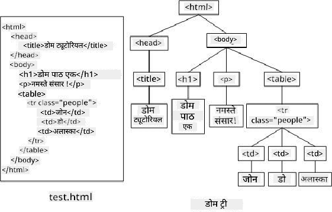

<!--
CO_OP_TRANSLATOR_METADATA:
{
  "original_hash": "30f8903a1f290e3d438dc2c70fe60259",
  "translation_date": "2025-08-25T21:17:59+00:00",
  "source_file": "3-terrarium/3-intro-to-DOM-and-closures/README.md",
  "language_code": "ne"
}
-->
# टेरारियम प्रोजेक्ट भाग ३: DOM म्यानिपुलेसन र क्लोजर


> स्केच नोट [टोमोमी इमुरा](https://twitter.com/girlie_mac) द्वारा

## प्रि-लेक्चर क्विज

[प्रि-लेक्चर क्विज](https://ff-quizzes.netlify.app/web/quiz/19)

### परिचय

DOM, वा "डकुमेन्ट अब्जेक्ट मोडेल", लाई म्यानिपुलेट गर्नु वेब विकासको मुख्य पक्ष हो। [MDN](https://developer.mozilla.org/docs/Web/API/Document_Object_Model/Introduction) अनुसार, "डकुमेन्ट अब्जेक्ट मोडेल (DOM) वेबमा रहेको डकुमेन्टको संरचना र सामग्रीलाई समेट्ने वस्तुहरूको डाटा प्रतिनिधित्व हो।" वेबमा DOM म्यानिपुलेसनको चुनौतीहरूले प्रायः JavaScript फ्रेमवर्कहरू प्रयोग गर्न प्रेरित गरेको छ, तर हामी यसलाई भेनिला JavaScript प्रयोग गरेर आफैं व्यवस्थापन गर्नेछौं!

यसका साथै, यो पाठले [JavaScript क्लोजर](https://developer.mozilla.org/docs/Web/JavaScript/Closures) को अवधारणा प्रस्तुत गर्नेछ, जसलाई तपाईं एउटा कार्यले अर्को कार्यलाई घेरेको रूपमा सोच्न सक्नुहुन्छ, जसले गर्दा भित्री कार्यले बाहिरी कार्यको स्कोपमा पहुँच पाउँछ।

> JavaScript क्लोजरहरू एक विशाल र जटिल विषय हो। यो पाठले केवल आधारभूत विचारलाई छोएको छ कि यस टेरारियमको कोडमा तपाईंले एउटा क्लोजर पाउनुहुनेछ: एउटा भित्री कार्य र एउटा बाहिरी कार्य, जसले भित्री कार्यलाई बाहिरी कार्यको स्कोपमा पहुँच दिन्छ। यसले कसरी काम गर्छ भन्ने थप जानकारीको लागि, कृपया [विस्तृत डकुमेन्टेसन](https://developer.mozilla.org/docs/Web/JavaScript/Closures) हेर्नुहोस्।

हामी DOM म्यानिपुलेसन गर्न क्लोजर प्रयोग गर्नेछौं।

DOM लाई एउटा रूखको रूपमा सोच्नुहोस्, जसले वेब पृष्ठ डकुमेन्टलाई म्यानिपुलेट गर्न सकिने सबै तरिकाहरूलाई प्रतिनिधित्व गर्छ। विभिन्न API (Application Program Interfaces) हरू लेखिएका छन् जसले प्रोग्रामरहरूलाई उनीहरूको रोजाइको प्रोग्रामिङ भाषाको प्रयोग गरेर DOM पहुँच गर्न र सम्पादन, परिवर्तन, पुनःव्यवस्थित, र अन्यथा व्यवस्थापन गर्न अनुमति दिन्छ।



> DOM र यसलाई सन्दर्भ गर्ने HTML मार्कअपको प्रतिनिधित्व। [ओल्फा नस्राओई](https://www.researchgate.net/publication/221417012_Profile-Based_Focused_Crawler_for_Social_Media-Sharing_Websites) बाट

यस पाठमा, हामी हाम्रो अन्तरक्रियात्मक टेरारियम प्रोजेक्ट पूरा गर्नेछौं, जसले प्रयोगकर्तालाई पृष्ठमा रहेका बिरुवाहरू म्यानिपुलेट गर्न अनुमति दिनेछ।

### पूर्वआवश्यकता

तपाईंको टेरारियमको HTML र CSS तयार हुनुपर्छ। यो पाठको अन्त्यसम्ममा तपाईं बिरुवाहरूलाई टेरारियमभित्र र बाहिर तान्न सक्नुहुनेछ।

### कार्य

तपाईंको टेरारियम फोल्डरमा, `script.js` नामक नयाँ फाइल बनाउनुहोस्। यो फाइल `<head>` सेक्सनमा इम्पोर्ट गर्नुहोस्:

```html
	<script src="./script.js" defer></script>
```

> नोट: HTML फाइल पूर्ण रूपमा लोड भएपछि मात्र JavaScript कार्यान्वयन गर्न `defer` प्रयोग गर्नुहोस्। तपाईं `async` एट्रिब्युट पनि प्रयोग गर्न सक्नुहुन्छ, जसले HTML फाइल पार्स गर्दा स्क्रिप्ट कार्यान्वयन गर्न अनुमति दिन्छ, तर हाम्रो केसमा, HTML तत्वहरू तान्नका लागि पूर्ण रूपमा उपलब्ध हुनु महत्त्वपूर्ण छ।

---

## DOM तत्वहरू

पहिलो काम भनेको DOM मा तपाईंले म्यानिपुलेट गर्न चाहनुभएको तत्वहरूको सन्दर्भ बनाउनु हो। हाम्रो केसमा, ती १४ बिरुवाहरू हुन्, जुन हाल साइड बारहरूमा छन्।

### कार्य

```html
dragElement(document.getElementById('plant1'));
dragElement(document.getElementById('plant2'));
dragElement(document.getElementById('plant3'));
dragElement(document.getElementById('plant4'));
dragElement(document.getElementById('plant5'));
dragElement(document.getElementById('plant6'));
dragElement(document.getElementById('plant7'));
dragElement(document.getElementById('plant8'));
dragElement(document.getElementById('plant9'));
dragElement(document.getElementById('plant10'));
dragElement(document.getElementById('plant11'));
dragElement(document.getElementById('plant12'));
dragElement(document.getElementById('plant13'));
dragElement(document.getElementById('plant14'));
```

यहाँ के भइरहेको छ? तपाईंले डकुमेन्टलाई सन्दर्भ गर्दै यसको DOM भित्र एउटा विशेष Id भएको तत्व खोज्दै हुनुहुन्छ। HTML को पहिलो पाठमा तपाईंले प्रत्येक बिरुवा छविलाई व्यक्तिगत Id (`id="plant1"`) दिएको सम्झनुहोस्? अब तपाईंले त्यो प्रयासको उपयोग गर्नुहुनेछ। प्रत्येक तत्व पहिचान गरेपछि, तपाईंले त्यस वस्तुलाई `dragElement` नामक कार्यमा पास गर्नुहुन्छ, जुन तपाईंले केही समयपछि निर्माण गर्नुहुनेछ। यसरी, HTML मा रहेको तत्व अब तान्न मिल्ने बनाइन्छ, वा चाँडै बनाइनेछ।

✅ हामी किन तत्वहरूलाई Id द्वारा सन्दर्भ गर्छौं? CSS क्लासद्वारा किन गर्दैनौं? यस प्रश्नको उत्तरका लागि CSS को अघिल्लो पाठलाई सन्दर्भ गर्न सक्नुहुन्छ।

---

## क्लोजर

अब तपाईं `dragElement` क्लोजर बनाउन तयार हुनुहुन्छ, जुन एउटा बाहिरी कार्य हो, जसले एउटा भित्री कार्य वा कार्यहरूलाई घेर्छ (हाम्रो केसमा, तीनवटा हुनेछन्)।

क्लोजरहरू उपयोगी हुन्छन्, जब एक वा बढी कार्यहरूले बाहिरी कार्यको स्कोपमा पहुँच गर्न आवश्यक हुन्छ। यहाँ एउटा उदाहरण छ:

```javascript
function displayCandy(){
	let candy = ['jellybeans'];
	function addCandy(candyType) {
		candy.push(candyType)
	}
	addCandy('gumdrops');
}
displayCandy();
console.log(candy)
```

यस उदाहरणमा, `displayCandy` कार्यले एउटा कार्यलाई घेर्छ, जसले पहिले नै कार्यमा रहेको एरेमा नयाँ क्यान्डी प्रकार थप्छ। यदि तपाईंले यो कोड चलाउनुभयो भने, `candy` एरे अपरिभाषित हुनेछ, किनभने यो एउटा स्थानीय भेरिएबल हो (क्लोजरको लागि स्थानीय)।

✅ तपाईं `candy` एरेलाई कसरी पहुँचयोग्य बनाउन सक्नुहुन्छ? यसलाई क्लोजर बाहिर सारेर प्रयास गर्नुहोस्। यसरी, एरे स्थानीय स्कोपमा सीमित नरही ग्लोबल बन्छ।

### कार्य

`script.js` मा तत्व घोषणाहरूको तल एउटा कार्य बनाउनुहोस्:

```javascript
function dragElement(terrariumElement) {
	//set 4 positions for positioning on the screen
	let pos1 = 0,
		pos2 = 0,
		pos3 = 0,
		pos4 = 0;
	terrariumElement.onpointerdown = pointerDrag;
}
```

`dragElement` ले यसको `terrariumElement` वस्तु स्क्रिप्टको शीर्षमा भएका घोषणाहरूबाट प्राप्त गर्छ। त्यसपछि, तपाईंले कार्यमा पास गरिएको वस्तुका लागि केही स्थानीय स्थिति `0` मा सेट गर्नुहुन्छ। यी स्थानीय भेरिएबलहरू हुन्, जसलाई तपाईं प्रत्येक तत्वको लागि म्यानिपुलेसन गर्नुहुनेछ, जब तपाईं तान्ने र छोड्ने कार्यक्षमता थप्नुहुन्छ। टेरारियम यी तानिएका तत्वहरूले भरिनेछ, त्यसैले एप्लिकेसनले तिनीहरू कहाँ राखिएका छन् भन्ने ट्र्याक राख्न आवश्यक छ।

यसका साथै, `terrariumElement` लाई `pointerdown` इभेन्ट असाइन गरिएको छ, जुन [वेब API](https://developer.mozilla.org/docs/Web/API) को भाग हो, जसले DOM व्यवस्थापनमा मद्दत गर्दछ। `onpointerdown` तब फायर हुन्छ, जब कुनै बटन थिचिन्छ, वा हाम्रो केसमा, तान्न मिल्ने तत्वलाई छोइन्छ। यो इभेन्ट ह्यान्डलर [वेब र मोबाइल ब्राउजरहरू](https://caniuse.com/?search=onpointerdown) मा काम गर्छ, केही अपवादहरू बाहेक।

✅ [इभेन्ट ह्यान्डलर `onclick`](https://developer.mozilla.org/docs/Web/API/GlobalEventHandlers/onclick) ले धेरै ब्राउजरहरूमा समर्थन गर्दछ; तपाईंले यहाँ किन यो प्रयोग गर्नुहुन्न? तपाईंले यहाँ सिर्जना गर्न खोजेको स्क्रिन अन्तरक्रियाको प्रकारबारे सोच्नुहोस्।

---

## `pointerDrag` कार्य

`terrariumElement` तान्न तयार छ; जब `onpointerdown` इभेन्ट फायर हुन्छ, `pointerDrag` कार्यलाई बोलाइन्छ। यो लाइनको ठीक तल यो कार्य थप्नुहोस्: `terrariumElement.onpointerdown = pointerDrag;`:

### कार्य 

```javascript
function pointerDrag(e) {
	e.preventDefault();
	console.log(e);
	pos3 = e.clientX;
	pos4 = e.clientY;
}
```

धेरै कुरा हुन्छ। पहिलो, तपाईंले `e.preventDefault();` प्रयोग गरेर `pointerdown` मा सामान्यतया हुने डिफल्ट इभेन्टहरूलाई रोक्नुहुन्छ। यसरी तपाईंले इन्टरफेसको व्यवहारमा बढी नियन्त्रण पाउनुहुन्छ।

> जब तपाईंले स्क्रिप्ट फाइल पूर्ण रूपमा बनाइसक्नुभयो, यो लाइन हटाएर प्रयास गर्नुहोस् - के हुन्छ?

दोस्रो, `index.html` लाई ब्राउजर विन्डोमा खोल्नुहोस्, र इन्टरफेस निरीक्षण गर्नुहोस्। जब तपाईं कुनै बिरुवामा क्लिक गर्नुहुन्छ, तपाईंले 'e' इभेन्ट कसरी क्याप्चर भएको छ देख्न सक्नुहुन्छ। इभेन्टमा कति धेरै जानकारी संकलन गरिएको छ हेर्नुहोस्!  

अन्ततः, स्थानीय भेरिएबलहरू `pos3` र `pos4` लाई `e.clientX` मा सेट गरिएको छ। तपाईंले यी मानहरू निरीक्षण प्यानमा पाउन सक्नुहुन्छ। यी मानहरूले बिरुवाको x र y निर्देशांकहरू क्याप्चर गर्छन्, जब तपाईं यसलाई क्लिक गर्नुहुन्छ वा छोइन्छ। तपाईंले बिरुवाहरूलाई क्लिक र तान्दा हुने व्यवहारमा सूक्ष्म नियन्त्रण आवश्यक छ, त्यसैले तपाईं यसको निर्देशांकहरूको ट्र्याक राख्नुहुन्छ।

✅ के यो स्पष्ट हुँदैछ कि किन यो सम्पूर्ण एप्लिकेसन एउटा ठूलो क्लोजरमा बनाइएको छ? यदि यो नभएको भए, तपाईंले १४ वटा तान्न मिल्ने बिरुवाहरूको स्कोप कसरी व्यवस्थापन गर्नुहुन्थ्यो?

प्रारम्भिक कार्य पूरा गर्न `pos4 = e.clientY` को तल दुईवटा थप `pointer` इभेन्ट म्यानिपुलेसनहरू थप्नुहोस्:

```html
document.onpointermove = elementDrag;
document.onpointerup = stopElementDrag;
```
अब तपाईंले बिरुवालाई कर्सरसँगै तान्न चाहनुभएको संकेत दिनुभएको छ, र बिरुवा छोड्दा तान्ने इशारा रोक्न चाहनुभएको छ। `onpointermove` र `onpointerup` `onpointerdown` जस्तै API का भाग हुन्। इन्टरफेसले अब त्रुटिहरू फ्याँल्नेछ, किनभने तपाईंले `elementDrag` र `stopElementDrag` कार्यहरू अझै परिभाषित गर्नुभएको छैन, त्यसैले अब ती निर्माण गर्नुहोस्।

## `elementDrag` र `stopElementDrag` कार्यहरू

तपाईंले दुईवटा थप आन्तरिक कार्यहरू थपेर आफ्नो क्लोजर पूरा गर्नुहुनेछ, जसले बिरुवा तान्दा र तान्न रोक्दा के हुन्छ भन्ने ह्यान्डल गर्नेछ। तपाईंले चाहनुभएको व्यवहार भनेको तपाईंले कुनै पनि समयमा कुनै पनि बिरुवा तान्न र स्क्रिनमा जहाँसुकै राख्न सक्नुहुनेछ। यो इन्टरफेस धेरै अनुकूल छ (उदाहरणका लागि, ड्रप जोन छैन) ताकि तपाईं आफ्नो टेरारियमलाई आफ्नो इच्छाअनुसार डिजाइन गर्न सक्नुहुन्छ।

### कार्य

`pointerDrag` को बन्द कर्ली ब्र्याकेटको ठीक पछि `elementDrag` कार्य थप्नुहोस्:

```javascript
function elementDrag(e) {
	pos1 = pos3 - e.clientX;
	pos2 = pos4 - e.clientY;
	pos3 = e.clientX;
	pos4 = e.clientY;
	console.log(pos1, pos2, pos3, pos4);
	terrariumElement.style.top = terrariumElement.offsetTop - pos2 + 'px';
	terrariumElement.style.left = terrariumElement.offsetLeft - pos1 + 'px';
}
```
यस कार्यमा, तपाईंले प्रारम्भिक स्थिति १-४ लाई धेरै सम्पादन गर्नुहुन्छ, जुन तपाईंले बाहिरी कार्यमा स्थानीय भेरिएबलको रूपमा सेट गर्नुभएको थियो। यहाँ के भइरहेको छ?

जब तपाईं तान्नुहुन्छ, तपाईंले `pos1` लाई `pos3` (जसलाई तपाईंले पहिले `e.clientX` को रूपमा सेट गर्नुभएको थियो) र हालको `e.clientX` मानको बीचको अन्तर बराबर बनाउनुहुन्छ। तपाईंले `pos2` मा पनि यस्तै अपरेशन गर्नुहुन्छ। त्यसपछि, तपाईंले `pos3` र `pos4` लाई तत्वको नयाँ X र Y निर्देशांकहरूमा पुनः सेट गर्नुहुन्छ। तपाईंले यी परिवर्तनहरू कन्सोलमा तान्दा हेर्न सक्नुहुन्छ। त्यसपछि, तपाईंले बिरुवाको CSS शैलीलाई यसको नयाँ स्थिति सेट गर्न म्यानिपुलेट गर्नुहुन्छ, `pos1` र `pos2` को नयाँ स्थितिहरूको आधारमा बिरुवाको शीर्ष र बाँया X र Y निर्देशांकहरूको गणना गर्दै।

> `offsetTop` र `offsetLeft` CSS प्रोपर्टीहरू हुन्, जसले कुनै तत्वको स्थिति यसको अभिभावकको आधारमा सेट गर्छ; यसको अभिभावक कुनै पनि तत्व हुन सक्छ, जुन `static` स्थितिमा छैन। 

यो सबै स्थिति पुनःगणनाले तपाईंलाई टेरारियम र यसको बिरुवाहरूको व्यवहारलाई सूक्ष्म रूपमा ट्युन गर्न अनुमति दिन्छ।

### कार्य 

इन्टरफेस पूरा गर्न अन्तिम कार्य भनेको `elementDrag` को बन्द कर्ली ब्र्याकेटको पछि `stopElementDrag` कार्य थप्नु हो:

```javascript
function stopElementDrag() {
	document.onpointerup = null;
	document.onpointermove = null;
}
```

यो सानो कार्यले `onpointerup` र `onpointermove` इभेन्टहरूलाई रिसेट गर्छ, ताकि तपाईं आफ्नो बिरुवाको प्रगति पुनः सुरु गर्न सक्नुहुन्छ, वा नयाँ बिरुवा तान्न सुरु गर्न सक्नुहुन्छ।

✅ यदि तपाईंले यी इभेन्टहरूलाई null मा सेट गर्नुभएन भने के हुन्छ?

अब तपाईंको प्रोजेक्ट पूरा भयो!

🥇बधाई छ! तपाईंले आफ्नो सुन्दर टेरारियम समाप्त गर्नुभयो। 

---

## 🚀चुनौती

तपाईंको क्लोजरमा नयाँ इभेन्ट ह्यान्डलर थपेर बिरुवाहरूमा थप केही गर्नुहोस्; उदाहरणका लागि, कुनै बिरुवालाई अगाडि ल्याउन डबल-क्लिक गर्नुहोस्। सिर्जनात्मक बनौं!

## पोस्ट-लेक्चर क्विज

[पोस्ट-लेक्चर क्विज](https://ff-quizzes.netlify.app/web/quiz/20)

## समीक्षा र आत्म-अध्ययन

स्क्रिनमा तत्वहरू तान्नु सामान्य लाग्न सक्छ, तर यसलाई गर्न धेरै तरिकाहरू छन् र धेरै चुनौतीहरू पनि, तपाईंले खोजेको प्रभावमा निर्भर गर्दै। वास्तवमा, एउटा सम्पूर्ण [ड्र्याग एन्ड ड्रप API](https://developer.mozilla.org/docs/Web/API/HTML_Drag_and_Drop_API) छ, जुन तपाईं प्रयास गर्न सक्नुहुन्छ। हामीले यस मोड्युलमा यो प्रयोग गरेनौं, किनभने हामीले चाहेको प्रभाव केही फरक थियो, तर यो API तपाईंको आफ्नै प्रोजेक्टमा प्रयास गर्नुहोस् र के हासिल गर्न सकिन्छ हेर्नुहोस्।

प्वाइन्टर इभेन्ट्सबारे थप जानकारी [W3C डक](https://www.w3.org/TR/pointerevents1/) र [MDN वेब डक](https://developer.mozilla.org/docs/Web/API/Pointer_events) मा पाउनुहोस्।

सधैं ब्राउजर क्षमताहरू [CanIUse.com](https://caniuse.com/) मा जाँच गर्नुहोस्।

## असाइनमेन्ट

[DOM सँग अझै केही काम गर्नुहोस्](assignment.md)

**अस्वीकरण**:  
यो दस्तावेज़ AI अनुवाद सेवा [Co-op Translator](https://github.com/Azure/co-op-translator) प्रयोग गरेर अनुवाद गरिएको छ। हामी शुद्धताको लागि प्रयास गर्छौं, तर कृपया ध्यान दिनुहोस् कि स्वचालित अनुवादमा त्रुटिहरू वा अशुद्धताहरू हुन सक्छ। यसको मूल भाषा मा रहेको मूल दस्तावेज़लाई आधिकारिक स्रोत मानिनुपर्छ। महत्वपूर्ण जानकारीको लागि, व्यावसायिक मानव अनुवाद सिफारिस गरिन्छ। यस अनुवादको प्रयोगबाट उत्पन्न हुने कुनै पनि गलतफहमी वा गलत व्याख्याको लागि हामी जिम्मेवार हुने छैनौं।