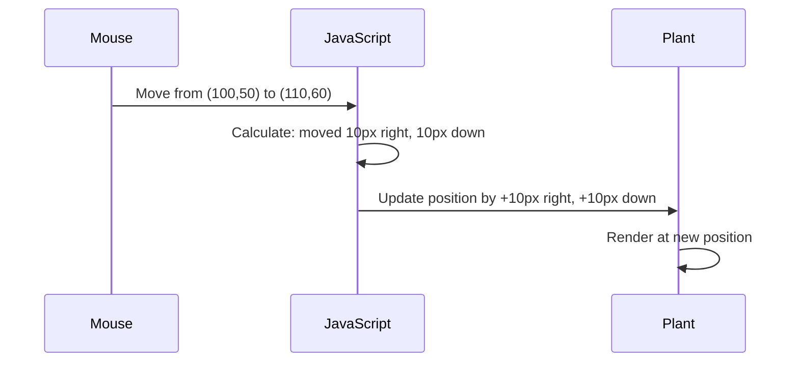

<!--
CO_OP_TRANSLATOR_METADATA:
{
  "original_hash": "bc93f6285423033ebf5b8abeb5282888",
  "translation_date": "2025-10-22T16:58:19+00:00",
  "source_file": "3-terrarium/3-intro-to-DOM-and-closures/README.md",
  "language_code": "ne"
}
-->
# टेरारियम परियोजना भाग ३: DOM म्यानिपुलेसन र जाभास्क्रिप्ट क्लोजरहरू


> स्केच नोट [Tomomi Imura](https://twitter.com/girlie_mac) द्वारा

वेब विकासको सबैभन्दा रोचक पक्षहरू मध्ये एकमा स्वागत छ - चीजहरू अन्तरक्रियात्मक बनाउनु! डकुमेन्ट अब्जेक्ट मोडेल (DOM) तपाईंको HTML र जाभास्क्रिप्ट बीचको पुल जस्तै हो, र आज हामी यसलाई तपाईंको टेरारियमलाई जीवन्त बनाउन प्रयोग गर्नेछौं। जब टिम बर्नर्स-लीले पहिलो वेब ब्राउजर बनाएका थिए, उनले वेबलाई गतिशील र अन्तरक्रियात्मक बनाउन सक्ने कल्पना गरेका थिए - DOM ले त्यो कल्पनालाई सम्भव बनाउँछ।

हामी जाभास्क्रिप्ट क्लोजरहरू पनि अन्वेषण गर्नेछौं, जुन सुरुमा डर लाग्दो लाग्न सक्छ। क्लोजरहरूलाई "स्मृति खल्तीहरू" सिर्जना गर्ने जस्तै सोच्नुहोस् जहाँ तपाईंको फङ्सनहरूले महत्त्वपूर्ण जानकारी सम्झन सक्छ। यो तपाईंको टेरारियमको प्रत्येक बिरुवाले आफ्नो स्थिति ट्र्याक गर्नको लागि आफ्नै डेटा रेकर्ड भएको जस्तै हो। यो पाठको अन्त्यसम्ममा, तपाईंले तिनीहरू कति प्राकृतिक र उपयोगी छन् भन्ने बुझ्नुहुनेछ।

हामी के निर्माण गर्दैछौं: एक टेरारियम जहाँ प्रयोगकर्ताहरूले बिरुवाहरूलाई जहाँ चाहिन्छ त्यहाँ तान्न र राख्न सक्छन्। तपाईंले DOM म्यानिपुलेसन प्रविधिहरू सिक्नुहुनेछ जसले ड्र्याग-एन्ड-ड्रप फाइल अपलोडदेखि अन्तरक्रियात्मक खेलहरूसम्म सबैलाई शक्ति दिन्छ। तपाईंको टेरारियमलाई जीवन्त बनाऔं।

## प्रि-लेक्चर क्विज

[प्रि-लेक्चर क्विज](https://ff-quizzes.netlify.app/web/quiz/19)

## DOM बुझ्दै: अन्तरक्रियात्मक वेब पृष्ठहरूको प्रवेशद्वार

डकुमेन्ट अब्जेक्ट मोडेल (DOM) जाभास्क्रिप्टले तपाईंको HTML तत्वहरूसँग संवाद गर्ने तरिका हो। जब तपाईंको ब्राउजरले HTML पृष्ठ लोड गर्छ, यसले स्मृतिमा त्यो पृष्ठको संरचित प्रतिनिधित्व सिर्जना गर्छ - त्यो हो DOM। यसलाई परिवारको रुख जस्तै सोच्नुहोस् जहाँ प्रत्येक HTML तत्व एक परिवार सदस्य हो जसलाई जाभास्क्रिप्टले पहुँच गर्न, परिवर्तन गर्न, वा पुनः व्यवस्था गर्न सक्छ।

DOM म्यानिपुलेसनले स्थिर पृष्ठहरूलाई अन्तरक्रियात्मक वेबसाइटहरूमा रूपान्तरण गर्छ। जब तपाईंले बटनले होभर गर्दा रंग परिवर्तन गरेको देख्नुहुन्छ, पृष्ठ रिफ्रेस नगरी सामग्री अपडेट भएको देख्नुहुन्छ, वा तान्न सकिने तत्वहरू देख्नुहुन्छ, त्यो DOM म्यानिपुलेसनको काम हो।


> DOM र HTML मार्कअपको प्रतिनिधित्व। [Olfa Nasraoui](https://www.researchgate.net/publication/221417012_Profile-Based_Focused_Crawler_for_Social_Media-Sharing_Websites) बाट।

**DOM लाई शक्तिशाली बनाउने कुराहरू:**
- **प्रदान गर्छ** तपाईंको पृष्ठको कुनै पनि तत्वमा पहुँचको संरचित तरिका
- **सक्षम बनाउँछ** पृष्ठ रिफ्रेस नगरी गतिशील सामग्री अपडेट
- **अनुमति दिन्छ** क्लिक र ड्र्याग जस्ता प्रयोगकर्ता अन्तरक्रियाहरूमा वास्तविक समय प्रतिक्रिया
- **सिर्जना गर्छ** आधुनिक अन्तरक्रियात्मक वेब अनुप्रयोगहरूको आधार

## जाभास्क्रिप्ट क्लोजरहरू: व्यवस्थित, शक्तिशाली कोड सिर्जना गर्दै

[जाभास्क्रिप्ट क्लोजर](https://developer.mozilla.org/docs/Web/JavaScript/Closures) भनेको फङ्सनलाई यसको आफ्नै निजी कार्यक्षेत्र दिनु जस्तै हो जसमा स्थायी स्मृति हुन्छ। डार्विनका फिन्चहरू जस्तै, जसले गालापागोस टापुमा आफ्नो विशेष वातावरणको आधारमा विशेष चोंच विकास गरे - क्लोजरहरूले पनि त्यस्तै काम गर्छन्, विशेष फङ्सनहरू सिर्जना गर्दै जसले आफ्नो विशेष सन्दर्भ "सम्झन्छ"।

हाम्रो टेरारियममा, क्लोजरहरूले प्रत्येक बिरुवालाई स्वतन्त्र रूपमा आफ्नो स्थिति सम्झन मद्दत गर्छ। यो ढाँचा व्यावसायिक जाभास्क्रिप्ट विकासमा व्यापक रूपमा देखा पर्छ, जसले यसलाई बुझ्न महत्त्वपूर्ण बनाउँछ।

> 💡 **क्लोजरहरू बुझ्दै**: क्लोजरहरू जाभास्क्रिप्टमा महत्त्वपूर्ण विषय हुन्, र धेरै विकासकर्ताहरूले तिनीहरूलाई पूर्ण रूपमा सैद्धान्तिक पक्षहरू बुझ्नुअघि वर्षौंसम्म प्रयोग गर्छन्। आज, हामी व्यावहारिक अनुप्रयोगमा केन्द्रित छौं - तपाईंले अन्तरक्रियात्मक सुविधाहरू निर्माण गर्दा क्लोजरहरू स्वाभाविक रूपमा देखा पर्ने देख्नुहुनेछ। बुझाइ वास्तविक समस्याहरू समाधान गर्ने तरिकामा विकसित हुनेछ।


> DOM र HTML मार्कअपको प्रतिनिधित्व। [Olfa Nasraoui](https://www.researchgate.net/publication/221417012_Profile-Based_Focused_Crawler_for_Social_Media-Sharing_Websites) बाट।

यस पाठमा, हामी हाम्रो अन्तरक्रियात्मक टेरारियम परियोजना पूरा गर्नेछौं जसले प्रयोगकर्तालाई पृष्ठमा बिरुवाहरूलाई हेरफेर गर्न अनुमति दिने जाभास्क्रिप्ट सिर्जना गर्नेछ।

## सुरु गर्नु अघि: सफलताको लागि सेटअप गर्दै

तपाईंलाई अघिल्लो टेरारियम पाठहरूबाट तपाईंको HTML र CSS फाइलहरू चाहिन्छ - हामी त्यो स्थिर डिजाइनलाई अन्तरक्रियात्मक बनाउन लागिरहेका छौं। यदि तपाईं पहिलो पटक सामेल हुँदै हुनुहुन्छ भने, ती पाठहरू पूरा गर्दा महत्त्वपूर्ण सन्दर्भ प्रदान गर्नेछ।

हामी के निर्माण गर्नेछौं:
- **स्मूथ ड्र्याग-एन्ड-ड्रप** सबै टेरारियम बिरुवाहरूको लागि
- **समन्वय ट्र्याकिङ** ताकि बिरुवाहरूले आफ्नो स्थितिहरू सम्झन सकून्
- **पूर्ण अन्तरक्रियात्मक इन्टरफेस** भ्यानिला जाभास्क्रिप्ट प्रयोग गर्दै
- **सफा, व्यवस्थित कोड** क्लोजर ढाँचाहरू प्रयोग गर्दै

## तपाईंको जाभास्क्रिप्ट फाइल सेटअप गर्दै

आउनुहोस् जाभास्क्रिप्ट फाइल सिर्जना गरौं जसले तपाईंको टेरारियमलाई अन्तरक्रियात्मक बनाउनेछ।

**चरण १: तपाईंको स्क्रिप्ट फाइल सिर्जना गर्नुहोस्**

तपाईंको टेरारियम फोल्डरमा, `script.js` नामको नयाँ फाइल सिर्जना गर्नुहोस्।

**चरण २: जाभास्क्रिप्टलाई तपाईंको HTML सँग लिंक गर्नुहोस्**

तपाईंको `index.html` फाइलको `<head>` सेक्सनमा यो स्क्रिप्ट ट्याग थप्नुहोस्:

```html
<script src="./script.js" defer></script>
```

**किन `defer` एट्रिब्युट महत्त्वपूर्ण छ:**
- **सुनिश्चित गर्छ** तपाईंको जाभास्क्रिप्टले सबै HTML लोड नभएसम्म पर्खन्छ
- **रोक्छ** त्रुटिहरू जहाँ जाभास्क्रिप्टले तयार नभएका तत्वहरू खोज्छ
- **ग्यारेन्टी गर्छ** सबै तपाईंको बिरुवा तत्वहरू अन्तरक्रियाको लागि उपलब्ध छन्
- **प्रदर्शन सुधार गर्छ** पृष्ठको तल स्क्रिप्ट राख्नुभन्दा

> ⚠️ **महत्त्वपूर्ण नोट**: `defer` एट्रिब्युटले सामान्य टाइमिङ समस्याहरू रोक्छ। यसको बिना, जाभास्क्रिप्टले HTML तत्वहरू लोड हुनु अघि पहुँच गर्न प्रयास गर्न सक्छ, जसले त्रुटि उत्पन्न गर्न सक्छ।

---

## जाभास्क्रिप्टलाई तपाईंको HTML तत्वहरूसँग जडान गर्दै

तत्वहरूलाई तान्न मिल्ने बनाउनुअघि, जाभास्क्रिप्टले DOM मा तिनीहरूलाई पत्ता लगाउन आवश्यक छ। यसलाई पुस्तकालयको सूची प्रणाली जस्तै सोच्नुहोस् - एकपटक तपाईंले सूची नम्बर पाउनुभयो भने, तपाईंले चाहिएको पुस्तक ठीक पत्ता लगाउन सक्नुहुन्छ र यसको सबै सामग्री पहुँच गर्न सक्नुहुन्छ।

हामी `document.getElementById()` विधि प्रयोग गर्नेछौं यी जडानहरू बनाउन। यो एक सटीक फाइलिङ प्रणाली जस्तै हो - तपाईंले एक ID प्रदान गर्नुहुन्छ, र यसले तपाईंलाई चाहिएको HTML तत्व ठीक पत्ता लगाउँछ।

### सबै बिरुवाहरूको लागि ड्र्याग कार्यक्षमता सक्षम गर्दै

तपाईंको `script.js` फाइलमा यो कोड थप्नुहोस्:

```javascript
// Enable drag functionality for all 14 plants
dragElement(document.getElementById('plant1'));
dragElement(document.getElementById('plant2'));
dragElement(document.getElementById('plant3'));
dragElement(document.getElementById('plant4'));
dragElement(document.getElementById('plant5'));
dragElement(document.getElementById('plant6'));
dragElement(document.getElementById('plant7'));
dragElement(document.getElementById('plant8'));
dragElement(document.getElementById('plant9'));
dragElement(document.getElementById('plant10'));
dragElement(document.getElementById('plant11'));
dragElement(document.getElementById('plant12'));
dragElement(document.getElementById('plant13'));
dragElement(document.getElementById('plant14'));
```

**यो कोडले के पूरा गर्छ:**
- **प्रत्येक बिरुवा तत्वलाई** यसको अद्वितीय ID प्रयोग गरेर DOM मा पत्ता लगाउँछ
- **प्राप्त गर्छ** प्रत्येक HTML तत्वको जाभास्क्रिप्ट सन्दर्भ
- **प्रत्येक तत्वलाई** `dragElement` फङ्सनमा पास गर्छ (जसलाई हामी अब सिर्जना गर्नेछौं)
- **प्रत्येक बिरुवालाई** ड्र्याग-एन्ड-ड्रप अन्तरक्रियाको लागि तयार बनाउँछ
- **तपाईंको HTML संरचनालाई** जाभास्क्रिप्ट कार्यक्षमतासँग जडान गर्छ

> 🎯 **किन ID प्रयोग गर्ने क्लासको सट्टा?** ID ले विशिष्ट तत्वहरूको लागि अद्वितीय पहिचानकर्ता प्रदान गर्छ, जबकि CSS क्लासहरू तत्वहरूको समूहलाई स्टाइल गर्न डिजाइन गरिएको हो। जब जाभास्क्रिप्टले व्यक्तिगत तत्वहरूलाई हेरफेर गर्न आवश्यक छ, ID ले हामीलाई चाहिएको सटीकता र प्रदर्शन प्रदान गर्छ।

> 💡 **प्रो टिप**: ध्यान दिनुहोस् हामीले प्रत्येक बिरुवाको लागि व्यक्तिगत रूपमा `dragElement()` कल गरिरहेका छौं। यो दृष्टिकोणले सुनिश्चित गर्छ कि प्रत्येक बिरुवाले आफ्नो स्वतन्त्र ड्र्यागिङ व्यवहार प्राप्त गर्छ, जुन सहज प्रयोगकर्ता अन्तरक्रियाको लागि आवश्यक छ।

---

## ड्र्याग एलिमेन्ट क्लोजर निर्माण गर्दै

अब हामी हाम्रो ड्र्यागिङ कार्यक्षमताको मुख्य भाग सिर्जना गर्नेछौं: एक क्लोजर जसले प्रत्येक बिरुवाको ड्र्यागिङ व्यवहारलाई व्यवस्थापन गर्छ। यो क्लोजरमा धेरै आन्तरिक फङ्सनहरू समावेश हुनेछ जसले माउसको गतिविधि ट्र्याक गर्न र तत्वको स्थितिहरू अपडेट गर्न सँगै काम गर्छ।

क्लोजरहरू यस कार्यको लागि उत्तम हुन् किनभने तिनीहरूले हामीलाई "निजी" भेरिएबलहरू सिर्जना गर्न अनुमति दिन्छन् जो फङ्सन कलहरू बीचमा कायम रहन्छन्, प्रत्येक बिरुवालाई आफ्नो स्वतन्त्र समन्वय ट्र्याकिङ प्रणाली दिन्छ।

### क्लोजरहरू बुझ्ने सरल उदाहरणसँग

क्लोजरहरूको अवधारणा देखाउनको लागि एउटा सरल उदाहरण प्रस्तुत गरौं:

```javascript
function createCounter() {
    let count = 0; // This is like a private variable
    
    function increment() {
        count++; // The inner function remembers the outer variable
        return count;
    }
    
    return increment; // We're giving back the inner function
}

const myCounter = createCounter();
console.log(myCounter()); // 1
console.log(myCounter()); // 2
```

**यो क्लोजर ढाँचामा के भइरहेको छ:**
- **सिर्जना गर्छ** एउटा निजी `count` भेरिएबल जो यो क्लोजर भित्र मात्र अवस्थित हुन्छ
- **आन्तरिक फङ्सनले** त्यो बाह्य भेरिएबलमा पहुँच गर्न र परिवर्तन गर्न सक्छ (क्लोजर मेकानिज्म)
- **जब हामी फर्काउँछौं** आन्तरिक फङ्सन, यसले त्यो निजी डाटासँगको आफ्नो जडान कायम राख्छ
- **यहाँसम्म कि** `createCounter()` कार्यान्वयन समाप्त भएपछि पनि, `count` कायम रहन्छ र यसको मान सम्झन्छ

### किन ड्र्याग कार्यक्षमताको लागि क्लोजरहरू उत्तम छन्

हाम्रो टेरारियमको लागि, प्रत्येक बिरुवाले आफ्नो वर्तमान स्थिति समन्वयहरू सम्झन आवश्यक छ। क्लोजरहरूले उत्तम समाधान प्रदान गर्छन्:

**हाम्रो परियोजनाको लागि मुख्य फाइदाहरू:**
- **निजी स्थिति भेरिएबलहरू कायम राख्छ** प्रत्येक बिरुवा स्वतन्त्र रूपमा
- **ड्र्याग घटनाहरू बीचमा** समन्वय डाटा कायम राख्छ
- **विभिन्न ड्र्याग गर्न मिल्ने तत्वहरू बीचमा** भेरिएबल द्वन्द्व रोक्छ
- **सफा, व्यवस्थित कोड संरचना सिर्जना गर्छ**

> 🎯 **सिक्ने लक्ष्य**: तपाईंले अहिले क्लोजरहरूको प्रत्येक पक्षलाई पूर्ण रूपमा बुझ्न आवश्यक छैन। तिनीहरूले हाम्रो ड्र्यागिङ कार्यक्षमताको लागि कोडलाई कसरी व्यवस्थित गर्न र स्थिति कायम राख्न मद्दत गर्छन् भन्ने देख्नमा ध्यान केन्द्रित गर्नुहोस्।

### ड्र्याग एलिमेन्ट फङ्सन सिर्जना गर्दै

अब हामी मुख्य फङ्सन निर्माण गर्नेछौं जसले सबै ड्र्यागिङ तर्कलाई व्यवस्थापन गर्नेछ। तपाईंको बिरुवा तत्व घोषणाहरूको तल यो फङ्सन थप्नुहोस्:

```javascript
function dragElement(terrariumElement) {
    // Initialize position tracking variables
    let pos1 = 0,  // Previous mouse X position
        pos2 = 0,  // Previous mouse Y position  
        pos3 = 0,  // Current mouse X position
        pos4 = 0;  // Current mouse Y position
    
    // Set up the initial drag event listener
    terrariumElement.onpointerdown = pointerDrag;
}
```

**स्थिति ट्र्याकिङ प्रणाली बुझ्दै:**
- **`pos1` र `pos2`**: पुरानो र नयाँ माउस स्थितिहरू बीचको भिन्नता भण्डारण गर्छ
- **`pos3` र `pos4`**: वर्तमान माउस समन्वयहरू ट्र्याक गर्छ
- **`terrariumElement`**: विशिष्ट बिरुवा तत्व जसलाई हामी ड्र्याग गर्न मिल्ने बनाउँदैछौं
- **`onpointerdown`**: प्रयोगकर्ताले ड्र्याग सुरु गर्दा ट्रिगर हुने घटना

**क्लोजर ढाँचाले कसरी काम गर्छ:**
- **सिर्जना गर्छ** प्रत्येक बिरुवा तत्वको लागि निजी स्थिति भेरिएबलहरू
- **यी भेरिएबलहरू कायम राख्छ** ड्र्यागिङ जीवनचक्रभर
- **सुनिश्चित गर्छ** प्रत्येक बिरुवाले स्वतन्त्र रूपमा आफ्नो समन्वय ट्र्याक गर्छ
- **सफा इन्टरफेस प्रदान गर्छ** `dragElement` फङ्सन मार्फत

### किन पोइन्टर इभेन्टहरू प्रयोग गर्ने?

तपाईं सोच्न सक्नुहुन्छ किन हामी `onpointerdown` प्रयोग गर्छौं `onclick` को सट्टा। यहाँ कारण छ:

| इभेन्ट प्रकार | उत्तम प्रयोग | समस्या |
|------------|----------|-------------|
| `onclick` | साधारण बटन क्लिकहरू | ड्र्यागिङलाई ह्यान्डल गर्न सक्दैन (मात्र क्लिक र रिलिज) |
| `onpointerdown` | माउस र टच दुवै | नयाँ, तर आजकल राम्रोसँग समर्थित |
| `onmousedown` | डेस्कटप माउस मात्र | मोबाइल प्रयोगकर्ताहरूलाई छुटाउँछ |

**हामीले निर्माण गरिरहेको कुराको लागि पोइन्टर इभेन्टहरू किन उत्तम छन्:**
- **उत्तम काम गर्छ** चाहे कसैले माउस, औंला, वा स्टाइलस प्रयोग गरिरहेको होस्
- **उस्तै महसुस हुन्छ** ल्यापटप, ट्याब्लेट, वा फोनमा
- **ड्र्यागिङ गति ह्यान्डल गर्छ** (मात्र क्लिक-एन्ड-डन होइन)
- **सजिलो अनुभव सिर्जना गर्छ** जुन प्रयोगकर्ताहरूले आधुनिक वेब अनुप्रयोगबाट अपेक्षा गर्छन्

> 💡 **भविष्यको लागि तयार गर्दै**: पोइन्टर इभेन्टहरू प्रयोगकर्ता अन्तरक्रियाहरू ह्यान्डल गर्ने आधुनिक तरिका हुन्। माउस र टचको लागि अलग-अलग कोड लेख्नुभन्दा, तपाईंले दुवै स्वतः प्राप्त गर्नुहुन्छ। धेरै राम्रो, हैन?

---

## पोइन्टरड्र्याग फङ्सन: ड्र्यागको सुरुवात कब्जा गर्दै

जब प्रयोगकर्ताले बिरुवामा थिच्छ (माउस क्लिक वा औंलाको टचसँग), `pointerDrag` फङ्सन सक्रिय हुन्छ। यो फङ्सनले प्रारम्भिक समन्वयहरू कब्जा गर्छ र ड्र्यागिङ प्रणाली सेटअप गर्छ।

`terrariumElement.onpointerdown = pointerDrag;` लाइनको ठीक पछि तपाईंको `dragElement` क्लोजर भित्र यो फङ्सन थप्नुहोस्:

```javascript
function pointerDrag(e) {
    // Prevent default browser behavior (like text selection)
    e.preventDefault();
    
    // Capture the initial mouse/touch position
    pos3 = e.clientX;  // X coordinate where drag started
    pos4 = e.clientY;  // Y coordinate where drag started
    
    // Set up event listeners for the dragging process
    document.onpointermove = elementDrag;
    document.onpointerup = stopElementDrag;
}
```

**चरणबद्ध रूपमा, यहाँ के भइरहेको छ:**
- **रोक्छ** ब्राउजरको डिफल्ट व्यवहारहरू जसले ड्र्यागिङमा बाधा पुर्याउन सक्छ
- **ठ्याक्कै समन्वयहरू रेकर्ड गर्छ** जहाँ प्रयोगकर्ताले ड्र्याग इशारा सुरु गरेको हो
- **इभेन्ट लिसनरहरू स्थापना गर्छ** जारी ड्र्याग गतिविधिको लागि
- **प्रणाली तयार गर्छ** माउस/औंलाको गति पृष्ठभरि ट्र्याक गर्न

### इभेन्ट रोकथाम बुझ्दै

`e.preventDefault()` लाइनले स्मूथ ड्र्यागिङको लागि महत्त्वपूर्ण छ:

**रोकथाम बिना, ब्राउजरहरूले:**
- **पाठ चयन गर्न सक्छन्** पृष्ठभरि ड्र्याग गर्दा
- **सन्दर्भ मेनु ट्रिगर गर्न सक्छन्** राइट-क्लिक ड्र्यागमा
- **हाम्रो कस्टम ड्र्यागिङ व्यवहारमा बाधा पुर्याउन सक्छन्**
- **ड्र्याग अपरेशनको दौरान दृश्य कलाकृति सिर्जना गर्न सक्छन्**

> 🔍 **प्रयोग गर्नुहोस्**: यो पाठ पूरा गरेपछि, `e.preventDefault()` हटाएर हेर्नुहोस् यसले ड्र्यागिङ अनुभवलाई कसरी प्रभावित गर्छ। तपाईंले छिट्टै बुझ्नुहुनेछ किन यो लाइन आवश्यक छ!

### समन्वय ट्र्याकिङ प्रणाली

`e.clientX` र `e.clientY` गुणहरूले हामीलाई सटीक माउस/टच समन्वयहरू प्रदान गर्छ:

| गुण | के मापन गर्छ | प्रयोग केस |
|----------|------------------|----------|
| `clientX` | भ्यूपोर्टको सापेक्ष क्षैतिज स्थिति | बायाँ-दायाँ गति ट्र्याक गर्दै |
| `clientY` | भ्यूपोर्टको सापेक्ष ठाडो स्थिति | माथि-तल गति ट्र्याक गर्दै |

**यी समन्वयहरू बुझ्दै:**
- **पिक्सेल-परफेक्ट स्थिति जानकारी प्रदान गर्छ**
- **वास्तविक समयमा अपडेट हुन्छ** प्रयोगकर्ताले
- **`pos3` र `pos4`**: अर्को गणनाको लागि माउसको हालको स्थिति भण्डारण गर्नुहोस्  
- **`offsetTop` र `offsetLeft`**: पृष्ठमा तत्वको हालको स्थिति प्राप्त गर्नुहोस्  
- **घटाउने तर्क**: माउसले जति सरेको छ, तत्वलाई त्यति नै सर्नुहोस्  

**यहाँ आन्दोलन गणनाको विवरण छ:**  
1. पुरानो र नयाँ माउसको स्थितिबीचको फरक **मापन गर्नुहोस्**  
2. माउसको आन्दोलनको आधारमा तत्वलाई कति सर्नु पर्ने हो **गणना गर्नुहोस्**  
3. वास्तविक समयमा तत्वको CSS स्थिति गुणहरू **अपडेट गर्नुहोस्**  
4. अर्को आन्दोलन गणनाको लागि आधार रेखाको रूपमा नयाँ स्थिति **भण्डारण गर्नुहोस्**  

### गणितको दृश्यात्मक प्रतिनिधित्व  


  
### stopElementDrag Function: सफा गर्ने प्रक्रिया  

`elementDrag` को बन्द कर्ली ब्र्याकेट पछि सफा गर्ने कार्य थप्नुहोस्:  

```javascript
function stopElementDrag() {
    // Remove the document-level event listeners
    document.onpointerup = null;
    document.onpointermove = null;
}
```
  
**सफा गर्ने प्रक्रिया किन आवश्यक छ:**  
- **स्मृति चुहावट रोक्छ** जुन घटनाको श्रोताहरूले लामो समयसम्म चलिरहन्छ  
- प्रयोगकर्ताले प्लान्ट छोड्दा तान्ने व्यवहार **रोक्छ**  
- अन्य तत्वहरू स्वतन्त्र रूपमा तान्न **सक्षम बनाउँछ**  
- अर्को तान्ने कार्यको लागि प्रणालीलाई **रिसेट गर्छ**  

**सफा नगर्दा के हुन्छ:**  
- तान्ने कार्य रोकिएपछि पनि घटनाको श्रोताहरू चलिरहन्छन्  
- प्रयोगमा नआएका श्रोतहरूले प्रदर्शनलाई कमजोर बनाउँछ  
- अन्य तत्वहरूसँग अन्तरक्रिया गर्दा अप्रत्याशित व्यवहार  
- अनावश्यक घटनाको ह्यान्डलिङले ब्राउजरको स्रोतहरू खेर जान्छ  

### CSS स्थिति गुणहरू बुझ्दै  

हाम्रो तान्ने प्रणालीले दुई मुख्य CSS गुणहरूलाई हेरफेर गर्छ:  

| गुण | के नियन्त्रण गर्छ | हामी यसलाई कसरी प्रयोग गर्छौं |  
|----------|------------------|---------------|  
| `top` | माथिल्लो किनारबाट दूरी | तान्ने क्रममा ठाडो स्थिति |  
| `left` | बायाँ किनारबाट दूरी | तान्ने क्रममा तेर्सो स्थिति |  

**offset गुणहरूको मुख्य जानकारी:**  
- **`offsetTop`**: स्थितिबद्ध अभिभावक तत्वको माथिल्लो भागबाट हालको दूरी  
- **`offsetLeft`**: स्थितिबद्ध अभिभावक तत्वको बायाँ भागबाट हालको दूरी  
- **स्थिति सन्दर्भ**: यी मानहरू नजिकको स्थितिबद्ध पूर्वजको सन्दर्भमा हुन्छन्  
- **वास्तविक समय अपडेटहरू**: CSS गुणहरू परिवर्तन गर्दा तुरुन्तै परिवर्तन हुन्छ  

> 🎯 **डिजाइन दर्शन**: यो तान्ने प्रणाली जानाजानी लचिलो बनाइएको छ – यहाँ कुनै "ड्रप जोन" वा प्रतिबन्धहरू छैनन्। प्रयोगकर्ताहरूले प्लान्टहरूलाई जहाँ पनि राख्न सक्छन्, जसले उनीहरूलाई आफ्नो टेरारियम डिजाइनमा पूर्ण रचनात्मक नियन्त्रण दिन्छ।  

## सबै कुरा एकसाथ ल्याउँदै: तपाईंको पूर्ण तान्ने प्रणाली  

बधाई छ! तपाईंले भ्यानिला जाभास्क्रिप्ट प्रयोग गरेर एक परिष्कृत तान्ने प्रणाली निर्माण गर्नुभएको छ। तपाईंको पूर्ण `dragElement` कार्यले अब एक शक्तिशाली क्लोजर समावेश गर्दछ जसले व्यवस्थापन गर्छ:  

**तपाईंको क्लोजरले के हासिल गर्छ:**  
- प्रत्येक प्लान्टको लागि निजी स्थिति चरहरू **राख्छ**  
- सुरुदेखि अन्त्यसम्मको सम्पूर्ण तान्ने जीवनचक्र **ह्यान्डल गर्छ**  
- सम्पूर्ण स्क्रिनमा सहज, प्रतिक्रियात्मक आन्दोलन **प्रदान गर्छ**  
- स्मृति चुहावट रोक्न श्रोतहरू **सफा गर्छ**  
- टेरारियम डिजाइनको लागि सहज, रचनात्मक इन्टरफेस **सिर्जना गर्छ**  

### तपाईंको अन्तरक्रियात्मक टेरारियम परीक्षण गर्दै  

अब तपाईंको अन्तरक्रियात्मक टेरारियम परीक्षण गर्नुहोस्! आफ्नो `index.html` फाइल वेब ब्राउजरमा खोल्नुहोस् र कार्यक्षमता प्रयास गर्नुहोस्:  

1. कुनै पनि प्लान्टलाई **क्लिक र होल्ड** गरेर तान्न सुरु गर्नुहोस्  
2. **माउस वा औंला सार्नुहोस्** र प्लान्टलाई सहज रूपमा पछ्याउँदै हेर्नुहोस्  
3. **छोड्नुहोस्** र प्लान्टलाई नयाँ स्थितिमा राख्नुहोस्  
4. **विभिन्न व्यवस्थाहरूको साथ प्रयोग गर्नुहोस्** र इन्टरफेस अन्वेषण गर्नुहोस्  

🥇 **उपलब्धि**: तपाईंले कोर अवधारणाहरू प्रयोग गरेर पूर्ण रूपमा अन्तरक्रियात्मक वेब एप्लिकेसन सिर्जना गर्नुभएको छ जुन पेशेवर विकासकर्ताहरूले दैनिक रूपमा प्रयोग गर्छन्। यो तान्ने कार्यक्षमता फाइल अपलोडहरू, कानबान बोर्डहरू, र धेरै अन्य अन्तरक्रियात्मक इन्टरफेसहरूको पछाडि समान सिद्धान्तहरू प्रयोग गर्छ।  

  

---

## GitHub Copilot Agent Challenge 🚀  

Agent मोड प्रयोग गरेर निम्न चुनौती पूरा गर्नुहोस्:  

**विवरण:** टेरारियम परियोजनामा ​​एक रिसेट कार्यक्षमता थप्नुहोस् जसले सबै प्लान्टहरूलाई उनीहरूको मूल स्थितिमा सहज एनिमेसनको साथ फर्काउँछ।  

**प्रेरणा:** एक रिसेट बटन सिर्जना गर्नुहोस्, जसलाई क्लिक गर्दा सबै प्लान्टहरूलाई उनीहरूको मूल साइडबार स्थितिमा CSS ट्रान्जिसन प्रयोग गरेर १ सेकेन्डमा सहज रूपमा फर्काउँछ। पृष्ठ लोड हुँदा मूल स्थितिहरू भण्डारण गर्ने कार्यले यो सुनिश्चित गर्नुपर्छ।  

[agent mode](https://code.visualstudio.com/blogs/2025/02/24/introducing-copilot-agent-mode) को बारेमा थप जान्नुहोस्।  

## 🚀 थप चुनौती: आफ्नो सीप विस्तार गर्नुहोस्  

तपाईंको टेरारियमलाई अर्को स्तरमा लैजान तयार हुनुहुन्छ? यी सुधारहरू कार्यान्वयन गर्ने प्रयास गर्नुहोस्:  

**रचनात्मक विस्तारहरू:**  
- प्लान्टलाई अगाडि ल्याउन **डबल-क्लिक** गर्नुहोस् (z-index हेरफेर)  
- प्लान्टहरूमा होभर गर्दा **सजिलो चमक** जस्तो दृश्यात्मक प्रतिक्रिया थप्नुहोस्  
- प्लान्टहरूलाई टेरारियम बाहिर तान्नबाट रोक्न **सीमाहरू लागू गर्नुहोस्**  
- प्लान्टको स्थिति सम्झनको लागि **सेभ कार्य** सिर्जना गर्नुहोस् (localStorage प्रयोग गरेर)  
- प्लान्ट उठाउने र राख्ने क्रममा **ध्वनि प्रभावहरू थप्नुहोस्**  

> 💡 **अध्ययनको अवसर**: यी चुनौतीहरूले तपाईंलाई DOM हेरफेर, घटनाको ह्यान्डलिङ, र प्रयोगकर्ता अनुभव डिजाइनको नयाँ पक्षहरू सिकाउनेछन्।  

## पोस्ट-व्याख्यान क्विज  

[पोस्ट-व्याख्यान क्विज](https://ff-quizzes.netlify.app/web/quiz/20)  

## समीक्षा र आत्म-अध्ययन: तपाईंको बुझाइलाई गहिरो बनाउँदै  

तपाईंले DOM हेरफेर र क्लोजरहरूको आधारभूत कुराहरूमा महारत हासिल गर्नुभएको छ, तर अझै अन्वेषण गर्न धेरै छ! यहाँ तपाईंको ज्ञान र सीप विस्तार गर्नका लागि केही मार्गहरू छन्।  

### वैकल्पिक तान्ने र छोड्ने दृष्टिकोणहरू  

हामीले अधिकतम लचिलोताका लागि पोइन्टर घटनाहरू प्रयोग गर्यौं, तर वेब विकासले धेरै दृष्टिकोणहरू प्रदान गर्दछ:  

| दृष्टिकोण | केको लागि उत्तम | सिकाइ मूल्य |  
|----------|----------|----------------|  
| [HTML Drag and Drop API](https://developer.mozilla.org/docs/Web/API/HTML_Drag_and_Drop_API) | फाइल अपलोडहरू, औपचारिक तान्ने क्षेत्रहरू | ब्राउजरको प्राकृतिक क्षमता बुझ्दै |  
| [Touch Events](https://developer.mozilla.org/docs/Web/API/Touch_events) | मोबाइल-विशिष्ट अन्तरक्रियाहरू | मोबाइल-प्रथम विकास ढाँचाहरू |  
| CSS `transform` गुणहरू | सहज एनिमेसनहरू | प्रदर्शन अनुकूलन प्रविधिहरू |  

### उन्नत DOM हेरफेर विषयहरू  

**तपाईंको सिकाइ यात्राको अर्को चरणहरू:**  
- **घटना प्रतिनिधित्व**: धेरै तत्वहरूको लागि घटनाहरू कुशलतापूर्वक ह्यान्डल गर्दै  
- **Intersection Observer**: तत्वहरू दृश्यमा प्रवेश गर्दा/छोड्दा पत्ता लगाउँदै  
- **Mutation Observer**: DOM संरचनामा परिवर्तनहरू हेर्दै  
- **Web Components**: पुन: प्रयोगयोग्य, समावेशित UI तत्वहरू सिर्जना गर्दै  
- **Virtual DOM अवधारणाहरू**: फ्रेमवर्कहरूले DOM अपडेटहरू कसरी अनुकूलित गर्छन् बुझ्दै  

### निरन्तर सिकाइका लागि आवश्यक स्रोतहरू  

**प्राविधिक दस्तावेजहरू:**  
- [MDN Pointer Events Guide](https://developer.mozilla.org/docs/Web/API/Pointer_events) - व्यापक पोइन्टर घटना सन्दर्भ  
- [W3C Pointer Events Specification](https://www.w3.org/TR/pointerevents1/) - आधिकारिक मापदण्ड दस्तावेज  
- [JavaScript Closures Deep Dive](https://developer.mozilla.org/docs/Web/JavaScript/Closures) - उन्नत क्लोजर ढाँचाहरू  

**ब्राउजर अनुकूलता:**  
- [CanIUse.com](https://caniuse.com/) - ब्राउजरहरूमा सुविधा समर्थन जाँच गर्नुहोस्  
- [MDN Browser Compatibility Data](https://github.com/mdn/browser-compat-data) - विस्तृत अनुकूलता जानकारी  

**अभ्यासका अवसरहरू:**  
- **सिर्जना गर्नुहोस्**: समान तान्ने मेकानिक्स प्रयोग गरेर पजल खेल  
- **डिजाइन गर्नुहोस्**: तान्न र छोड्न सकिने कार्य व्यवस्थापनको साथ कानबान बोर्ड  
- **सजाउनुहोस्**: तस्बिरहरूको व्यवस्था गर्न सकिने फोटो ग्यालरी  
- **प्रयोग गर्नुहोस्**: मोबाइल इन्टरफेसहरूको लागि टच इशाराहरू  

> 🎯 **सिकाइ रणनीति**: यी अवधारणाहरूलाई बलियो बनाउनको लागि उत्तम तरिका भनेको अभ्यास हो। तान्न सकिने इन्टरफेसहरूको भिन्नता निर्माण गर्ने प्रयास गर्नुहोस् – प्रत्येक परियोजनाले तपाईंलाई प्रयोगकर्ता अन्तरक्रिया र DOM हेरफेरको बारेमा नयाँ कुरा सिकाउनेछ।  

## असाइनमेन्ट  

[DOMसँग अलिकति बढी काम गर्नुहोस्](assignment.md)  

---

**अस्वीकरण**:  
यो दस्तावेज़ AI अनुवाद सेवा [Co-op Translator](https://github.com/Azure/co-op-translator) प्रयोग गरेर अनुवाद गरिएको छ। हामी शुद्धताको लागि प्रयास गर्छौं, तर कृपया ध्यान दिनुहोस् कि स्वचालित अनुवादमा त्रुटिहरू वा अशुद्धताहरू हुन सक्छ। यसको मूल भाषा मा रहेको दस्तावेज़लाई आधिकारिक स्रोत मानिनुपर्छ। महत्वपूर्ण जानकारीको लागि, व्यावसायिक मानव अनुवाद सिफारिस गरिन्छ। यस अनुवादको प्रयोगबाट उत्पन्न हुने कुनै पनि गलतफहमी वा गलत व्याख्याको लागि हामी जिम्मेवार हुने छैनौं।