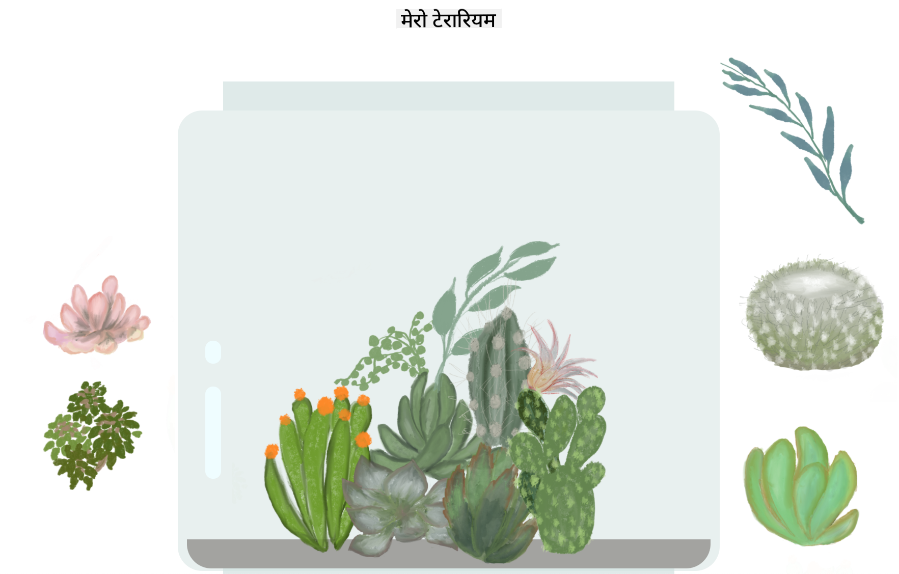

<!--
CO_OP_TRANSLATOR_METADATA:
{
  "original_hash": "7965cd2bc5dc92ad888dc4c6ab2ab70a",
  "translation_date": "2025-08-25T21:04:38+00:00",
  "source_file": "3-terrarium/README.md",
  "language_code": "ne"
}
-->
# मेरो टेरारियम: HTML, CSS, र DOM म्यानिपुलेसन सिक्नका लागि एक प्रोजेक्ट 🌵🌱

सानो ड्र्याग र ड्रप कोड-मेडिटेसन। थोरै HTML, JS, र CSS प्रयोग गरेर तपाईं वेब इन्टरफेस बनाउन, यसलाई स्टाइल गर्न, र आफ्नो रोजाइका विभिन्न अन्तरक्रियाहरू थप्न सक्षम हुनुहुनेछ।

# पाठहरू

1. [HTML को परिचय](./1-intro-to-html/README.md)
2. [CSS को परिचय](./2-intro-to-css/README.md)
3. [DOM र JS क्लोजरहरूको परिचय](./3-intro-to-DOM-and-closures/README.md)

## श्रेय

♥️ का साथ लेखिएको [Jen Looper](https://www.twitter.com/jenlooper) द्वारा।

CSS मार्फत बनाइएको टेरारियम Jakub Mandra को ग्लास जार [codepen](https://codepen.io/Rotarepmi/pen/rjpNZY) बाट प्रेरित छ।

कलाकृति [Jen Looper](http://jenlooper.com) द्वारा हातले कोरिएको हो, Procreate को सहयोगमा।

## आफ्नो टेरारियम डिप्लोय गर्नुहोस्

तपाईं आफ्नो टेरारियमलाई वेबमा Azure Static Web Apps प्रयोग गरेर डिप्लोय वा प्रकाशित गर्न सक्नुहुन्छ।

1. यो रिपोजिटरी फोर्क गर्नुहोस्

2. यो बटन थिच्नुहोस्

3. आफ्नो एप बनाउनका लागि विजार्डको चरणहरू पूरा गर्नुहोस्। सुनिश्चित गर्नुहोस् कि तपाईंले एप रुटलाई `/solution` वा आफ्नो कोडबेसको रुटमा सेट गर्नुभएको छ। यो एपमा कुनै API छैन, त्यसैले त्यसको चिन्ता नगर्नुहोस्। तपाईंको फोर्क गरिएको रिपोजिटरीमा एउटा GitHub फोल्डर सिर्जना हुनेछ, जसले Azure Static Web Apps को बिल्ड सेवाहरूलाई तपाईंको एपलाई नयाँ URL मा बिल्ड र प्रकाशित गर्न मद्दत गर्नेछ।

**अस्वीकरण**:  
यो दस्तावेज़ AI अनुवाद सेवा [Co-op Translator](https://github.com/Azure/co-op-translator) प्रयोग गरेर अनुवाद गरिएको छ। हामी यथार्थताको लागि प्रयास गर्छौं, तर कृपया ध्यान दिनुहोस् कि स्वचालित अनुवादहरूमा त्रुटिहरू वा अशुद्धताहरू हुन सक्छ। यसको मूल भाषा मा रहेको मूल दस्तावेज़लाई आधिकारिक स्रोत मानिनुपर्छ। महत्वपूर्ण जानकारीको लागि, व्यावसायिक मानव अनुवाद सिफारिस गरिन्छ। यस अनुवादको प्रयोगबाट उत्पन्न हुने कुनै पनि गलतफहमी वा गलत व्याख्याको लागि हामी जिम्मेवार हुने छैनौं।