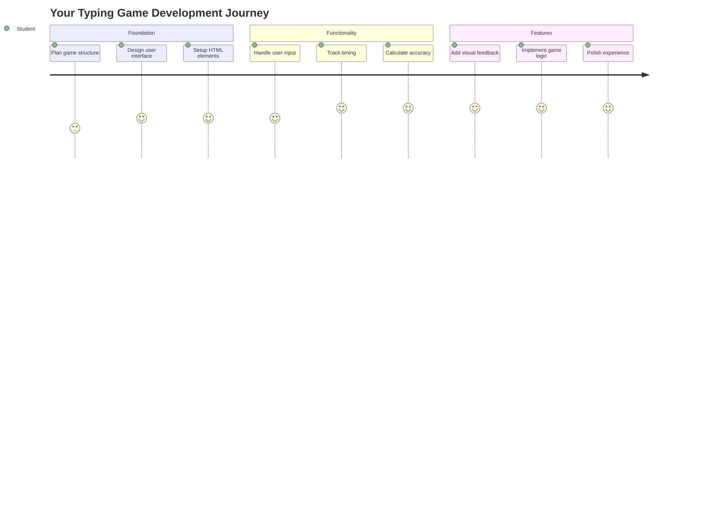
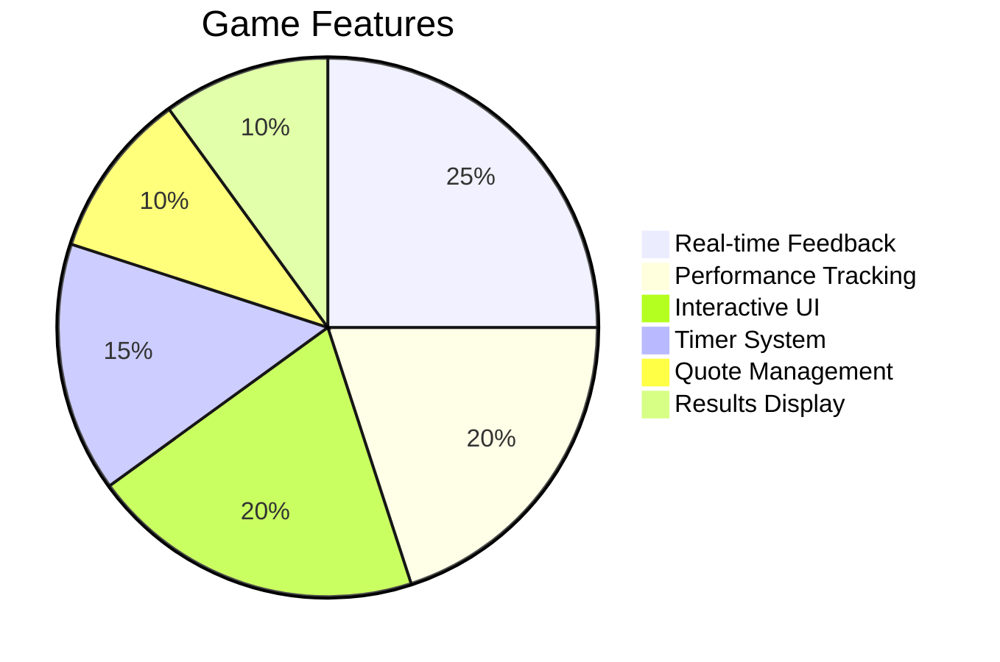
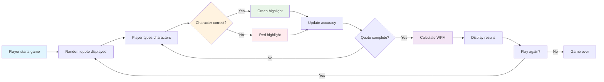
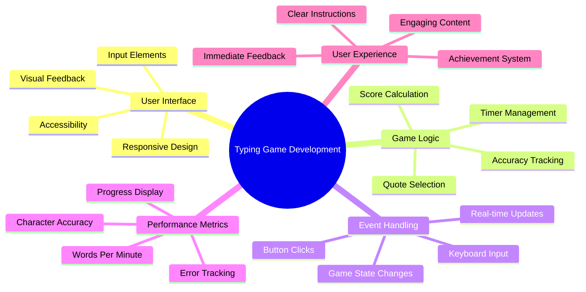
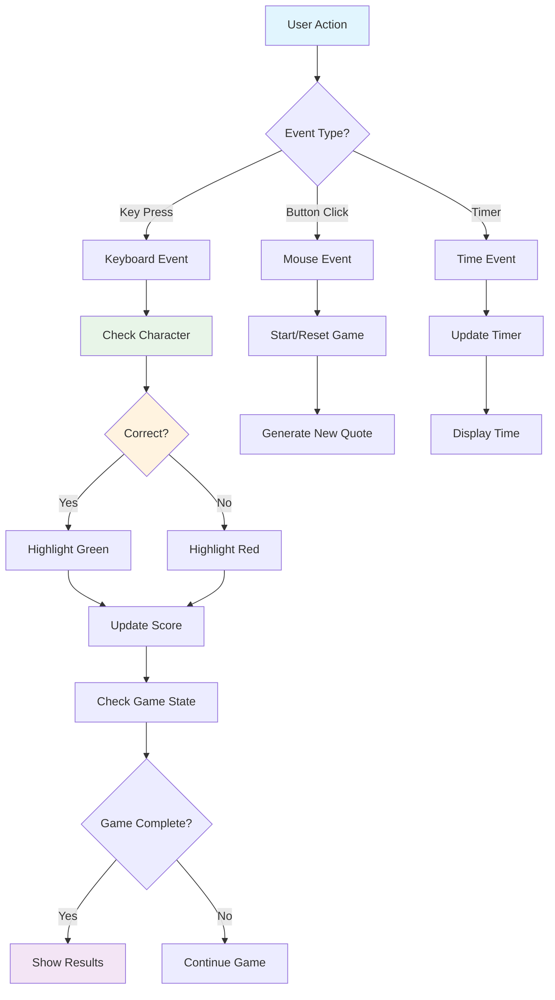
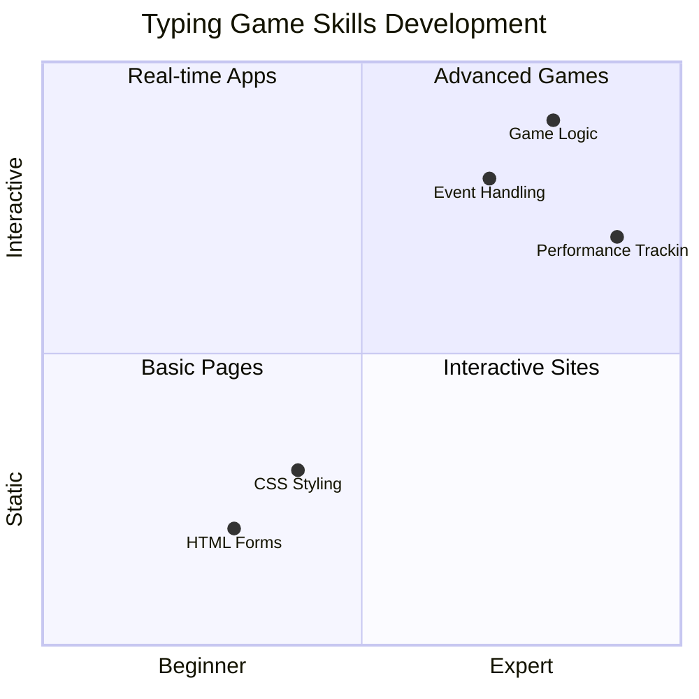
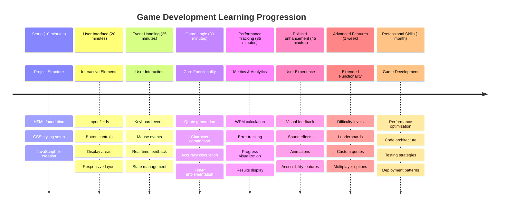

# इभेन्ट-ड्रिभन प्रोग्रामिङ - टाइपिङ खेल बनाउनुहोस्

## परिचय

यहाँ एउटा कुरा छ जुन हरेक डेभलपरलाई थाहा छ तर कमै मात्र कुरा गर्छन्: छिटो टाइप गर्न सक्नु एक सुपरपावर हो! 🚀 सोच्नुहोस् - तपाईंको विचारलाई तपाईंको मस्तिष्कबाट कोड एडिटरमा छिटो पुर्‍याउन सक्नुहुन्छ भने, तपाईंको सिर्जनशीलता अझ राम्रोसँग प्रवाह गर्न सक्छ। यो तपाईंको विचार र स्क्रिन बीचको सीधा पाइपलाइन जस्तै हो।

यो सीपलाई स्तरवृद्धि गर्ने उत्तम तरिका जान्न चाहनुहुन्छ? तपाईंले सही अनुमान गर्नुभयो - हामी खेल बनाउन जाँदैछौं!

> आउनुहोस्, सँगै एउटा उत्कृष्ट टाइपिङ खेल बनाउँ!

तपाईंले सिक्दै आएको JavaScript, HTML, र CSS सीपलाई काममा लगाउन तयार हुनुहुन्छ? हामी एउटा टाइपिङ खेल बनाउनेछौं जसले तपाईंलाई प्रसिद्ध जासूस [शर्लक होम्स](https://en.wikipedia.org/wiki/Sherlock_Holmes) का र्यान्डम उद्धरणहरूसँग चुनौती दिनेछ। खेलले तपाईं कति छिटो र सही टाइप गर्न सक्नुहुन्छ भनेर ट्र्याक गर्नेछ - र विश्वास गर्नुहोस्, यो तपाईंले सोचेभन्दा धेरै नशालु छ!

## तपाईंलाई थाहा हुनुपर्ने कुरा

हामी सुरु गर्नु अघि, सुनिश्चित गर्नुहोस् कि तपाईं यी अवधारणाहरूमा सहज हुनुहुन्छ (यदि तपाईंलाई छिटो पुनरावलोकनको आवश्यकता छ भने चिन्ता नगर्नुहोस् - हामी सबै त्यहाँ पुगेका छौं!):

- टेक्स्ट इनपुट र बटन कन्ट्रोलहरू सिर्जना गर्नु
- CSS र क्लासहरू प्रयोग गरेर स्टाइल सेट गर्नु  
- JavaScript आधारभूत कुरा
  - एरे सिर्जना गर्नु
  - र्यान्डम नम्बर सिर्जना गर्नु
  - वर्तमान समय प्राप्त गर्नु

यदि यी मध्ये कुनै पनि कुरा अलि कमजोर लाग्छ भने, त्यो पूर्ण रूपमा ठीक छ! कहिलेकाहीं तपाईंको ज्ञानलाई बलियो बनाउने उत्तम तरिका भनेको परियोजनामा ​​हाम फाल्नु र काम गर्दै जानु हो।

### 🔄 **शैक्षिक जाँच**
**आधार मूल्याङ्कन**: विकास सुरु गर्नु अघि सुनिश्चित गर्नुहोस् कि तपाईं बुझ्नुहुन्छ:
- ✅ HTML फारम र इनपुट एलिमेन्टहरू कसरी काम गर्छन्
- ✅ CSS क्लासहरू र गतिशील स्टाइलिङ
- ✅ JavaScript इभेन्ट लिस्नरहरू र ह्यान्डलरहरू
- ✅ एरे म्यानिपुलेसन र र्यान्डम चयन
- ✅ समय मापन र गणना

**छिटो आत्म-परीक्षण**: के तपाईं व्याख्या गर्न सक्नुहुन्छ कि यी अवधारणाहरूले इन्टरएक्टिभ खेलमा कसरी सँगै काम गर्छन्?
- **इभेन्टहरू** प्रयोगकर्ताले एलिमेन्टहरूसँग अन्तरक्रिया गर्दा ट्रिगर हुन्छन्
- **ह्यान्डलरहरू** ती इभेन्टहरूलाई प्रक्रिया गर्छन् र खेलको अवस्था अपडेट गर्छन्
- **CSS** प्रयोगकर्ताको क्रियाकलापको लागि दृश्य प्रतिक्रिया प्रदान गर्छ
- **समय मापन** प्रदर्शन मापन र खेलको प्रगतिको लागि सक्षम बनाउँछ

## आउनुहोस्, यो बनाऔं!

[इभेन्ट ड्रिभन प्रोग्रामिङ प्रयोग गरेर टाइपिङ खेल बनाउने](./typing-game/README.md)

### ⚡ **अर्को ५ मिनेटमा तपाईं के गर्न सक्नुहुन्छ**
- [ ] तपाईंको ब्राउजर कन्सोल खोल्नुहोस् र `addEventListener` प्रयोग गरेर किबोर्ड इभेन्टहरू सुन्न प्रयास गर्नुहोस्
- [ ] इनपुट फिल्ड भएको साधारण HTML पेज सिर्जना गर्नुहोस् र टाइपिङ डिटेक्शन परीक्षण गर्नुहोस्
- [ ] टाइप गरिएको टेक्स्टलाई लक्ष्य टेक्स्टसँग तुलना गरेर स्ट्रिङ म्यानिपुलेसन अभ्यास गर्नुहोस्
- [ ] टाइमिङ फङ्सनहरू बुझ्न `setTimeout` प्रयोग गरेर प्रयोग गर्नुहोस्

### 🎯 **यो घण्टामा तपाईं के हासिल गर्न सक्नुहुन्छ**
- [ ] पाठ-अन्तिम क्विज पूरा गर्नुहोस् र इभेन्ट-ड्रिभन प्रोग्रामिङ बुझ्नुहोस्
- [ ] शब्द मान्यतासहित टाइपिङ खेलको आधारभूत संस्करण बनाउनुहोस्
- [ ] सही र गलत टाइपिङको लागि दृश्य प्रतिक्रिया थप्नुहोस्
- [ ] गति र शुद्धतामा आधारित सरल स्कोरिङ प्रणाली कार्यान्वयन गर्नुहोस्
- [ ] CSS प्रयोग गरेर तपाईंको खेललाई दृश्य रूपमा आकर्षक बनाउनुहोस्

### 📅 **तपाईंको हप्ताको खेल विकास**
- [ ] सबै सुविधाहरू र पोलिशसहित पूर्ण टाइपिङ खेल पूरा गर्नुहोस्
- [ ] विभिन्न शब्द जटिलतासहित कठिनाई स्तरहरू थप्नुहोस्
- [ ] प्रयोगकर्ता तथ्याङ्क ट्र्याकिङ कार्यान्वयन गर्नुहोस् (WPM, समय अनुसार शुद्धता)
- [ ] राम्रो प्रयोगकर्ता अनुभवको लागि ध्वनि प्रभाव र एनिमेसनहरू सिर्जना गर्नुहोस्
- [ ] तपाईंको खेललाई टच डिभाइसहरूको लागि मोबाइल-उत्तरदायी बनाउनुहोस्
- [ ] तपाईंको खेल अनलाइन साझा गर्नुहोस् र प्रयोगकर्ताहरूबाट प्रतिक्रिया संकलन गर्नुहोस्

### 🌟 **तपाईंको महिनाको इन्टरएक्टिभ विकास**
- [ ] विभिन्न अन्तरक्रिया ढाँचाहरू अन्वेषण गर्दै धेरै खेलहरू बनाउनुहोस्
- [ ] खेल लूप, अवस्था व्यवस्थापन, र प्रदर्शन अनुकूलनको बारेमा जान्नुहोस्
- [ ] ओपन सोर्स खेल विकास परियोजनाहरूमा योगदान गर्नुहोस्
- [ ] उन्नत टाइमिङ अवधारणाहरू र स्मूथ एनिमेसनहरू मास्टर गर्नुहोस्
- [ ] विभिन्न इन्टरएक्टिभ एप्लिकेसनहरू प्रदर्शन गर्ने पोर्टफोलियो सिर्जना गर्नुहोस्
- [ ] खेल विकास र प्रयोगकर्ता अन्तरक्रियामा रुचि राख्ने अन्यलाई मार्गदर्शन गर्नुहोस्

## 🎯 तपाईंको टाइपिङ खेल मास्टरी टाइमलाइन

### 🛠️ तपाईंको खेल विकास टूलकिट सारांश

यो परियोजना पूरा गरेपछि, तपाईंले निम्न कुराहरूमा महारत हासिल गर्नुहुनेछ:
- **इभेन्ट-ड्रिभन प्रोग्रामिङ**: प्रयोगकर्ता इन्टरफेसहरू जो इनपुटमा प्रतिक्रिया दिन्छन्
- **रियल-टाइम प्रतिक्रिया**: तत्काल दृश्य र प्रदर्शन अपडेटहरू
- **प्रदर्शन मापन**: सटीक टाइमिङ र स्कोरिङ प्रणालीहरू
- **खेल अवस्था व्यवस्थापन**: एप्लिकेसन प्रवाह र प्रयोगकर्ता अनुभव नियन्त्रण
- **इन्टरएक्टिभ डिजाइन**: आकर्षक, नशालु प्रयोगकर्ता अनुभव सिर्जना गर्नु
- **आधुनिक वेब APIs**: समृद्ध अन्तरक्रियाको लागि ब्राउजर क्षमताहरूको उपयोग
- **पहुंचयोग्यता ढाँचाहरू**: सबै प्रयोगकर्ताहरूको लागि समावेशी डिजाइन

**वास्तविक-विश्व अनुप्रयोगहरू**: यी सीपहरू सीधा लागू हुन्छन्:
- **वेब अनुप्रयोगहरू**: कुनै पनि इन्टरएक्टिभ इन्टरफेस वा ड्यासबोर्ड
- **शैक्षिक सफ्टवेयर**: सिकाइ प्लेटफर्महरू र सीप मूल्याङ्कन उपकरणहरू
- **उत्पादकता उपकरणहरू**: टेक्स्ट एडिटरहरू, IDEs, र सहयोग सफ्टवेयर
- **गेमिङ उद्योग**: ब्राउजर खेलहरू र इन्टरएक्टिभ मनोरञ्जन
- **मोबाइल विकास**: टच-आधारित इन्टरफेसहरू र इशारा ह्यान्डलिङ

**अर्को स्तर**: तपाईं उन्नत खेल फ्रेमवर्कहरू, रियल-टाइम मल्टिप्लेयर प्रणालीहरू, वा जटिल इन्टरएक्टिभ अनुप्रयोगहरू अन्वेषण गर्न तयार हुनुहुन्छ!

## क्रेडिट्स

♥️ सहित लेखिएको [क्रिस्टोफर ह्यारिसन](http://www.twitter.com/geektrainer) द्वारा

---

**अस्वीकरण**:  
यो दस्तावेज़ AI अनुवाद सेवा [Co-op Translator](https://github.com/Azure/co-op-translator) प्रयोग गरेर अनुवाद गरिएको छ। हामी शुद्धताको लागि प्रयास गर्छौं, तर कृपया ध्यान दिनुहोस् कि स्वचालित अनुवादमा त्रुटिहरू वा अशुद्धताहरू हुन सक्छ। यसको मूल भाषा मा रहेको मूल दस्तावेज़लाई आधिकारिक स्रोत मानिनुपर्छ। महत्वपूर्ण जानकारीको लागि, व्यावसायिक मानव अनुवाद सिफारिस गरिन्छ। यस अनुवादको प्रयोगबाट उत्पन्न हुने कुनै पनि गलतफहमी वा गलत व्याख्याको लागि हामी जिम्मेवार हुने छैनौं।