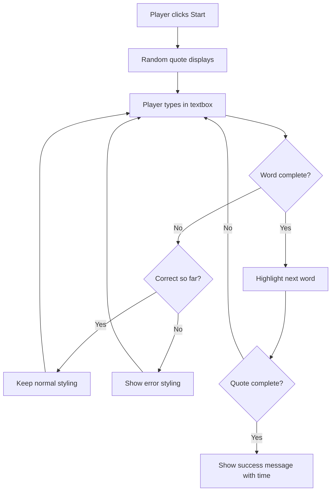
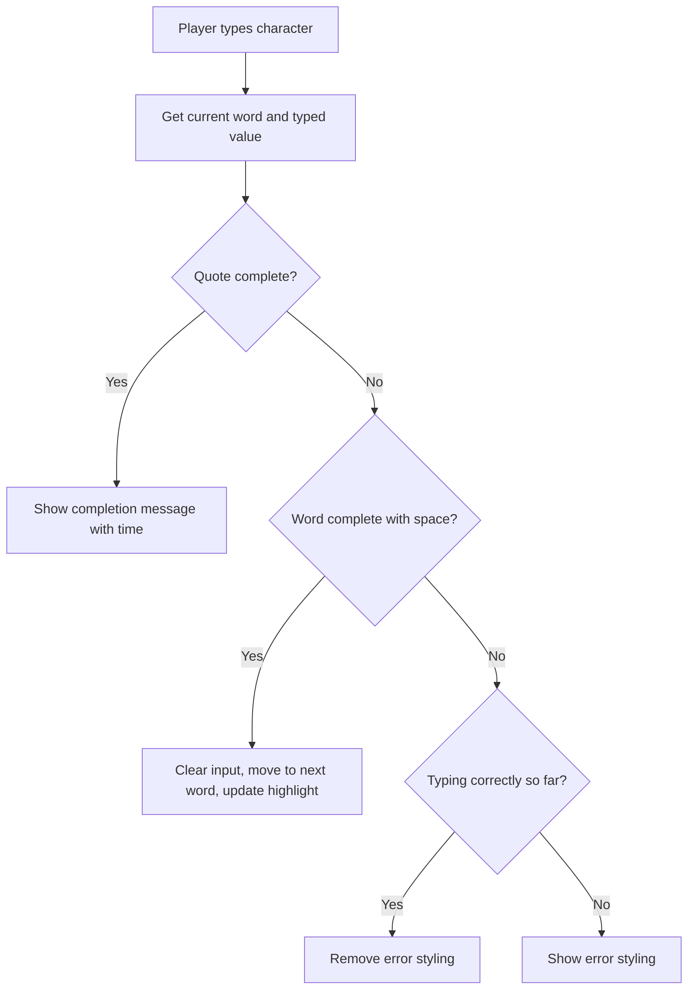

<!--
CO_OP_TRANSLATOR_METADATA:
{
  "original_hash": "e6b75e5b8caae906473a8a09d77b7121",
  "translation_date": "2025-10-22T17:10:25+00:00",
  "source_file": "4-typing-game/typing-game/README.md",
  "language_code": "ne"
}
-->
# इभेन्टहरू प्रयोग गरेर खेल बनाउने

के तपाईंले कहिल्यै सोच्नुभएको छ कि वेबसाइटहरूले कसरी थाहा पाउँछन् जब तपाईंले बटन क्लिक गर्नुहुन्छ वा टेक्स्ट बक्समा टाइप गर्नुहुन्छ? यो इभेन्ट-ड्राइभन प्रोग्रामिङको जादू हो! यो महत्वपूर्ण सीप सिक्नको लागि के राम्रो तरिका हुन सक्छ - एक टाइपिङ स्पीड खेल बनाउनुहोस् जसले तपाईंले गरेको प्रत्येक कीस्ट्रोकमा प्रतिक्रिया दिन्छ।

तपाईंले प्रत्यक्ष रूपमा देख्नुहुनेछ कि वेब ब्राउजरहरूले तपाईंको JavaScript कोडसँग "कसरी कुरा गर्छन्।" जब तपाईं क्लिक गर्नुहुन्छ, टाइप गर्नुहुन्छ, वा माउस सार्नुहुन्छ, ब्राउजरले साना सन्देशहरू (हामी तिनीहरूलाई इभेन्ट्स भन्छौं) तपाईंको कोडमा पठाइरहेको छ, र तपाईंले कसरी प्रतिक्रिया दिने निर्णय गर्न सक्नुहुन्छ!

यहाँ काम सकिएपछि, तपाईंले आफ्नो स्पीड र शुद्धता ट्र्याक गर्ने वास्तविक टाइपिङ खेल बनाइसक्नु हुनेछ। अझ महत्त्वपूर्ण कुरा, तपाईंले प्रत्येक इन्टरएक्टिभ वेबसाइटलाई शक्ति दिने आधारभूत अवधारणाहरू बुझ्नुहुनेछ। सुरु गरौं!

## प्रि-लेक्चर क्विज

[प्रि-लेक्चर क्विज](https://ff-quizzes.netlify.app/web/quiz/21)

## इभेन्ट-ड्राइभन प्रोग्रामिङ

तपाईंको मनपर्ने एप वा वेबसाइटको बारेमा सोच्नुहोस् - यसलाई जीवित र प्रतिक्रियात्मक बनाउने के हो? यो तपाईंले के गर्नुहुन्छ भन्ने कुरामा प्रतिक्रिया कसरी दिन्छ भन्ने कुरामा आधारित छ! प्रत्येक ट्याप, क्लिक, स्वाइप, वा कीस्ट्रोकले "इभेन्ट" सिर्जना गर्छ, र त्यहाँ वेब विकासको वास्तविक जादू हुन्छ।

वेबको लागि प्रोग्रामिङलाई रोचक बनाउने कुरा यहाँ छ: हामीले कहिल्यै थाहा पाउँदैनौं कि कसैले त्यो बटन कहिले क्लिक गर्नेछ वा टेक्स्ट बक्समा टाइप गर्न सुरु गर्नेछ। उनीहरूले तुरुन्त क्लिक गर्न सक्छन्, पाँच मिनेट पर्खन सक्छन्, वा सायद कहिल्यै क्लिक नगर्न सक्छन्! यो अनिश्चितताले हामीलाई हाम्रो कोड कसरी लेख्ने भन्ने बारे फरक सोच्न बाध्य बनाउँछ।

रिसिपी जस्तै माथिबाट तलसम्म चल्ने कोड लेख्नको सट्टा, हामीले कोड लेख्छौं जुन केही हुने प्रतीक्षा गर्छ। यो १८०० को दशकमा टेलिग्राफ अपरेटरहरूले आफ्नो मेसिनको छेउमा बस्ने तरिकासँग मिल्दोजुल्दो छ, तारबाट सन्देश आउँदा तुरुन्त प्रतिक्रिया दिन तयार।

त्यसो भए "इभेन्ट" भनेको वास्तवमा के हो? सरल शब्दमा भन्नुपर्दा, यो केही हो जुन हुन्छ! जब तपाईं बटन क्लिक गर्नुहुन्छ - त्यो एक इभेन्ट हो। जब तपाईं अक्षर टाइप गर्नुहुन्छ - त्यो एक इभेन्ट हो। जब तपाईं आफ्नो माउस सार्नुहुन्छ - त्यो अर्को इभेन्ट हो।

इभेन्ट-ड्राइभन प्रोग्रामिङले हामीलाई सुन्न र प्रतिक्रिया दिनको लागि हाम्रो कोड सेटअप गर्न दिन्छ। हामीले विशेष कार्यहरू सिर्जना गर्छौं जसलाई **इभेन्ट लिस्नरहरू** भनिन्छ, जुन विशेष कुराहरू हुने प्रतीक्षा गर्छन्, त्यसपछि तिनीहरू हुँदा तुरुन्तै सक्रिय हुन्छन्।

इभेन्ट लिस्नरहरूलाई तपाईंको कोडको लागि डोरबेल भएको जस्तै सोच्नुहोस्। तपाईंले डोरबेल सेटअप गर्नुहुन्छ (`addEventListener()`), यसलाई कुन आवाज सुन्नु पर्ने हो भनेर भन्नुहुन्छ (जस्तै 'क्लिक' वा 'कीप्रेस'), र त्यसपछि कसैले यसलाई बजाउँदा के हुनुपर्छ भनेर निर्दिष्ट गर्नुहुन्छ (तपाईंको कस्टम फङ्सन)।

**इभेन्ट लिस्नरहरू यसरी काम गर्छन्:**
- **सुन्छ** विशेष प्रयोगकर्ता क्रियाहरू जस्तै क्लिक, कीस्ट्रोक, वा माउस मूभमेन्ट
- **कार्यान्वयन गर्छ** तपाईंको कस्टम कोड जब निर्दिष्ट इभेन्ट हुन्छ
- **तुरुन्त प्रतिक्रिया दिन्छ** प्रयोगकर्ता इन्टरएक्शनहरूमा, सहज अनुभव सिर्जना गर्दै
- **एकै तत्वमा** विभिन्न लिस्नरहरू प्रयोग गरेर धेरै इभेन्टहरू ह्यान्डल गर्छ

> **NOTE:** यो उल्लेख गर्न लायक छ कि इभेन्ट लिस्नरहरू सिर्जना गर्न धेरै तरिकाहरू छन्। तपाईंले एनोनिमस फङ्सनहरू प्रयोग गर्न सक्नुहुन्छ, वा नामित फङ्सनहरू सिर्जना गर्न सक्नुहुन्छ। तपाईंले विभिन्न सर्टकटहरू प्रयोग गर्न सक्नुहुन्छ, जस्तै `click` प्रोपर्टी सेट गर्नु, वा `addEventListener()` प्रयोग गर्नु। हाम्रो अभ्यासमा हामी `addEventListener()` र एनोनिमस फङ्सनहरूमा ध्यान केन्द्रित गर्नेछौं, किनकि यो सम्भवतः वेब डेभलपरहरूले प्रयोग गर्ने सबैभन्दा सामान्य प्रविधि हो। यो सबैभन्दा लचिलो पनि हो, किनकि `addEventListener()` सबै इभेन्टहरूको लागि काम गर्छ, र इभेन्ट नामलाई प्यारामिटरको रूपमा प्रदान गर्न सकिन्छ।

### सामान्य इभेन्टहरू

जबकि वेब ब्राउजरहरूले सुन्नको लागि दर्जनौं विभिन्न इभेन्टहरू प्रदान गर्छन्, अधिकांश इन्टरएक्टिभ एप्लिकेसनहरूले केवल केही आवश्यक इभेन्टहरूमा निर्भर गर्छन्। यी कोर इभेन्टहरू बुझ्नाले तपाईंलाई परिष्कृत प्रयोगकर्ता इन्टरएक्शनहरू निर्माण गर्न आधार प्रदान गर्नेछ।

जब तपाईं एप्लिकेसन बनाउँदा सुन्नको लागि [दर्जनौं इभेन्टहरू](https://developer.mozilla.org/docs/Web/Events) उपलब्ध छन्। आधारभूत रूपमा प्रयोगकर्ताले पेजमा गरेको कुनै पनि कुराले इभेन्ट उठाउँछ, जसले तपाईंलाई उनीहरूले चाहेको अनुभव सुनिश्चित गर्न धेरै शक्ति दिन्छ। भाग्यवश, तपाईंलाई सामान्यतया केवल केही इभेन्टहरू चाहिन्छ। यहाँ केही सामान्य इभेन्टहरू छन् (जसमा दुई हामीले हाम्रो खेल बनाउँदा प्रयोग गर्नेछौं):

| इभेन्ट | विवरण | सामान्य प्रयोग केसहरू |
|-------|-------------|------------------|
| `click` | प्रयोगकर्ताले केही क्लिक गर्यो | बटनहरू, लिंकहरू, इन्टरएक्टिभ तत्वहरू |
| `contextmenu` | प्रयोगकर्ताले दायाँ माउस बटन क्लिक गर्यो | कस्टम राइट-क्लिक मेनुहरू |
| `select` | प्रयोगकर्ताले केही टेक्स्ट हाइलाइट गर्यो | टेक्स्ट एडिटिङ, कपी अपरेसनहरू |
| `input` | प्रयोगकर्ताले केही टेक्स्ट इनपुट गर्यो | फर्म भ्यालिडेसन, रियल-टाइम सर्च |

**यी इभेन्ट प्रकारहरू बुझ्दै:**
- **ट्रिगर गर्छ** जब प्रयोगकर्ताहरूले तपाईंको पेजमा विशेष तत्वहरूसँग इन्टरएक्ट गर्छन्
- **विस्तृत जानकारी प्रदान गर्छ** प्रयोगकर्ताको क्रियाको बारेमा इभेन्ट वस्तुहरू मार्फत
- **सक्षम बनाउँछ** तपाईंलाई प्रतिक्रियात्मक, इन्टरएक्टिभ वेब एप्लिकेसनहरू सिर्जना गर्न
- **सुसंगत रूपमा काम गर्छ** विभिन्न ब्राउजरहरू र उपकरणहरूमा

## खेल बनाउने

अब तपाईंले इभेन्टहरू कसरी काम गर्छन् भन्ने कुरा बुझ्नुभयो, त्यस ज्ञानलाई अभ्यासमा राखेर केही उपयोगी बनाऔं। हामी इभेन्ट ह्यान्डलिङ प्रदर्शन गर्ने टाइपिङ स्पीड खेल बनाउनेछौं जसले तपाईंलाई महत्त्वपूर्ण डेभलपर सीप विकास गर्न मद्दत गर्नेछ।

हामी खेल बनाउनेछौं जसले JavaScript मा इभेन्टहरू कसरी काम गर्छन् भनेर अन्वेषण गर्नेछ। हाम्रो खेलले खेलाडीको टाइपिङ सीप परीक्षण गर्नेछ, जुन सबै डेभलपरहरूले राख्नुपर्ने सबैभन्दा कम मूल्याङ्कन गरिएको सीप हो। रमाइलो तथ्य: आज हामीले प्रयोग गर्ने QWERTY किबोर्ड लेआउट वास्तवमा १८७० को दशकमा टाइपराइटरहरूको लागि डिजाइन गरिएको थियो - र राम्रो टाइपिङ सीप आज पनि प्रोग्रामरहरूको लागि उत्तिकै मूल्यवान छ! खेलको सामान्य प्रवाह यस प्रकार देखिनेछ:



**हाम्रो खेल यसरी काम गर्नेछ:**
- **सुरु हुन्छ** जब खेलाडीले स्टार्ट बटन क्लिक गर्छ र र्यान्डम कोट देखाउँछ
- **ट्र्याक गर्छ** खेलाडीको टाइपिङ प्रगति शब्द-प्रति-शब्द रियल-टाइममा
- **हाइलाइट गर्छ** हालको शब्द खेलाडीको ध्यान मार्गदर्शन गर्न
- **तुरुन्त दृश्य प्रतिक्रिया प्रदान गर्छ** टाइपिङ त्रुटिहरूको लागि
- **क्याल्कुलेट गर्छ** र कोट पूरा हुँदा कुल समय देखाउँछ

आउनुहोस्, हाम्रो खेल बनाऔं, र इभेन्टहरूको बारेमा सिकौं!

### फाइल संरचना

कोडिङ सुरु गर्नु अघि, हामी व्यवस्थित बनौं! सुरुबाट सफा फाइल संरचना हुनुले पछि टाउको दुखाइबाट बचाउँछ र तपाईंको प्रोजेक्टलाई अझ व्यावसायिक बनाउँछ। 😊

हामी केवल तीन फाइलहरू राखेर चीजहरू सरल बनाउनेछौं: `index.html` हाम्रो पेज संरचनाको लागि, `script.js` हाम्रो खेलको सम्पूर्ण तर्कको लागि, र `style.css` सबै कुरालाई राम्रो देखाउन। यो वेबको अधिकांश भागलाई शक्ति दिने क्लासिक त्रय हो!

**कन्सोल वा टर्मिनल विन्डो खोल्नुहोस् र निम्न आदेश जारी गरेर आफ्नो कामको लागि नयाँ फोल्डर बनाउनुहोस्:**

```bash
# Linux or macOS
mkdir typing-game && cd typing-game

# Windows
md typing-game && cd typing-game
```

**यी आदेशहरूले के गर्छन्:**
- **नयाँ डाइरेक्टरी बनाउँछ** जसलाई `typing-game` भनिन्छ तपाईंको प्रोजेक्ट फाइलहरूको लागि
- **नयाँ बनाइएको डाइरेक्टरीमा जान्छ** स्वचालित रूपमा
- **सफा कार्यक्षेत्र सेटअप गर्छ** तपाईंको खेल विकासको लागि

**भिजुअल स्टुडियो कोड खोल्नुहोस्:**

```bash
code .
```

**यो आदेश:**
- **भिजुअल स्टुडियो कोड सुरु गर्छ** हालको डाइरेक्टरीमा
- **तपाईंको प्रोजेक्ट फोल्डर खोल्छ** एडिटरमा
- **तपाईंलाई आवश्यक पर्ने सबै विकास उपकरणहरूमा पहुँच प्रदान गर्छ**

**भिजुअल स्टुडियो कोडमा फोल्डरमा तीन फाइलहरू निम्न नामहरूका साथ थप्नुहोस्:**
- `index.html` - तपाईंको खेलको संरचना र सामग्री समावेश गर्दछ
- `script.js` - सम्पूर्ण खेल तर्क र इभेन्ट लिस्नरहरू ह्यान्डल गर्छ
- `style.css` - दृश्य उपस्थिति र स्टाइल परिभाषित गर्छ

## प्रयोगकर्ता इन्टरफेस बनाउनुहोस्

अब हाम्रो खेलको सबै कार्यहरू हुने स्टेज बनाऔं! यसलाई स्पेसशिपको कन्ट्रोल प्यानल डिजाइन गर्ने जस्तै सोच्नुहोस् - हामीले सुनिश्चित गर्नुपर्छ कि हाम्रो खेलाडीलाई आवश्यक पर्ने सबै कुरा त्यहाँ छ।

आउनुहोस्, हाम्रो खेललाई वास्तवमा के चाहिन्छ भनेर पत्ता लगाऔं। यदि तपाईं टाइपिङ खेल खेल्दै हुनुहुन्थ्यो भने, तपाईंले स्क्रिनमा के देख्न चाहनुहुन्छ? यहाँ हामीलाई चाहिने कुरा हो:

| UI तत्व | उद्देश्य | HTML तत्व |
|------------|---------|-------------|
| कोट डिस्प्ले | टाइप गर्नको लागि टेक्स्ट देखाउँछ | `<p>` `id="quote"` सहित |
| सन्देश क्षेत्र | स्थिति र सफलताको सन्देश देखाउँछ | `<p>` `id="message"` सहित |
| टेक्स्ट इनपुट | खेलाडीहरूले कोट टाइप गर्ने ठाउँ | `<input>` `id="typed-value"` सहित |
| स्टार्ट बटन | खेल सुरु गर्छ | `<button>` `id="start"` सहित |

**UI संरचना बुझ्दै:**
- **सामग्रीलाई व्यवस्थित गर्छ** माथिबाट तलसम्म तार्किक रूपमा
- **युनिक IDहरू प्रदान गर्छ** तत्वहरूलाई JavaScript टार्गेट गर्न
- **स्पष्ट दृश्य पदानुक्रम प्रदान गर्छ** राम्रो प्रयोगकर्ता अनुभवको लागि
- **सामाजिक HTML तत्वहरू समावेश गर्छ** पहुँचयोग्यताको लागि

यी सबैलाई ID चाहिन्छ ताकि हामी तिनीहरूसँग हाम्रो JavaScript मा काम गर्न सकौं। हामीले सिर्जना गर्न लागेको CSS र JavaScript फाइलहरूको सन्दर्भ पनि थप्नेछौं।

`index.html` नामको नयाँ फाइल बनाउनुहोस्। निम्न HTML थप्नुहोस्:

```html
<!-- inside index.html -->
<html>
<head>
  <title>Typing game</title>
  <link rel="stylesheet" href="style.css">
</head>
<body>
  <h1>Typing game!</h1>
  <p>Practice your typing skills with a quote from Sherlock Holmes. Click **start** to begin!</p>
  <p id="quote"></p> <!-- This will display our quote -->
  <p id="message"></p> <!-- This will display any status messages -->
  <div>
    <input type="text" aria-label="current word" id="typed-value" /> <!-- The textbox for typing -->
    <button type="button" id="start">Start</button> <!-- To start the game -->
  </div>
  <script src="script.js"></script>
</body>
</html>
```

**यो HTML संरचनाले के हासिल गर्छ:**
- **CSS स्टाइलशीट लिंक गर्छ** `<head>` मा स्टाइलिङको लागि
- **स्पष्ट हेडिङ र निर्देशनहरू सिर्जना गर्छ** प्रयोगकर्ताहरूको लागि
- **स्पेसिफिक ID सहित प्लेसहोल्डर प्याराग्राफहरू स्थापना गर्छ** गतिशील सामग्रीको लागि
- **एक इनपुट फिल्ड समावेश गर्छ** पहुँचयोग्यता विशेषताहरू सहित
- **स्टार्ट बटन प्रदान गर्छ** खेल ट्रिगर गर्न
- **JavaScript फाइल लोड गर्छ** अन्त्यमा, इष्टतम प्रदर्शनको लागि

### एप्लिकेसन सुरु गर्नुहोस्

विकासको क्रममा बारम्बार आफ्नो एप्लिकेसन परीक्षण गर्दा तपाईंले समस्या चाँडै पत्ता लगाउन सक्नुहुन्छ र वास्तविक समयमा आफ्नो प्रगति देख्न सक्नुहुन्छ। लाइभ सर्भर एक अमूल्य उपकरण हो जसले तपाईंले फाइलहरू बचत गर्दा स्वचालित रूपमा तपाईंको ब्राउजरलाई रिफ्रेस गर्छ, विकासलाई धेरै कुशल बनाउँछ।

सधैं उत्तम हुन्छ कि चीजहरू कस्तो देखिन्छ भनेर हेर्नको लागि क्रमिक रूपमा विकास गर्नुहोस्। आउनुहोस् हाम्रो एप्लिकेसन सुरु गरौं। भिजुअल स्टुडियो कोडको लागि [लाइभ सर्भर](https://marketplace.visualstudio.com/items?itemName=ritwickdey.LiveServer&WT.mc_id=academic-77807-sagibbon) नामक एक अद्भुत एक्सटेन्सन छ जसले तपाईंको एप्लिकेसनलाई स्थानीय रूपमा होस्ट गर्नेछ र तपाईंले फाइलहरू बचत गर्दा ब्राउजरलाई रिफ्रेस गर्नेछ।

**[लाइभ सर्भर](https://marketplace.visualstudio.com/items?itemName=ritwickdey.LiveServer&WT.mc_id=academic-77807-sagibbon) स्थापना गर्नुहोस् लिंकमा गएर र इन्स्टल क्लिक गरेर:**

**स्थापनाको क्रममा के हुन्छ:**
- **तपाईंको ब्राउजरलाई भिजुअल स्टुडियो कोड खोल्न प्रेरित गर्छ**
- **तपाईंलाई एक्सटेन्सन स्थापना प्रक्रियामा मार्गदर्शन गर्छ**
- **भिजुअल स्टुडियो कोडलाई पुनः सुरु गर्न आवश्यक हुन सक्छ** सेटअप पूरा गर्न

**स्थापना भएपछि, भिजुअल स्टुडियो कोडमा, Ctrl-Shift-P (वा Cmd-Shift-P) क्लिक गर्नुहोस् कमाण्ड प्यालेट खोल्न:**

**कमाण्ड प्यालेट बुझ्दै:**
- **भिजुअल स्टुडियो कोडका सबै कमाण्डहरूमा छिटो पहुँच प्रदान गर्छ**
- **टाइप गर्दा कमाण्डहरू खोज्छ**
- **छिटो विकासको लागि किबोर्ड सर्टकटहरू प्रदान गर्छ**

**"Live Server: Open with Live Server" टाइप गर्नुहोस्:**

**लाइभ सर्भरले के गर्छ:**
- **तपाईंको प्रोजेक्टको लागि स्थानीय विकास सर्भर सुरु गर्छ**
- **तपाईंले फाइलहरू बचत गर्दा स्वचालित रूपमा ब्राउजर रिफ्रेस गर्छ**
- **तपाईंको फाइलहरू स्थानीय URL (सामान्यतया `localhost:5500`) बाट सर्भ गर्छ**

**ब्राउजर खोल्नुहोस् र `https://localhost:5500` मा नेभिगेट गर्नुहोस्:**

अब तपाईंले बनाएको पेज देख्न सक्नुहुन्छ! आउनुहोस् केही कार्यक्षमता थपौं।

## CSS थप्नुहोस्

अब चीजहरू राम्रो देखिने बनाऔं! दृश्य प्रतिक्रिया कम्प्युटिङको प्रारम्भिक दिनदेखि नै प्रयोगकर्ता इन्टरफेसहरूको लागि महत्त्वपूर्ण छ। १९८० को दशकमा, अनुसन्धानकर्ताहरूले पत्ता लगाए कि तुरुन्त दृश्य प्रतिक्रिया प्रयोगकर्ता प्रदर्शनलाई नाटकीय रूपमा सुधार गर्छ र त्रुटिहरू कम गर्छ। यही कुरा हामी सिर्जना गर्न गइरहेका छौं।

हाम्रो खेलले के भइरहेको छ भन्ने कुरामा स्पष्ट हुनुपर्छ। खेलाडीहरूले तुरुन्तै थाहा पाउनुपर्छ कि कुन शब्द टाइप गर्नुपर्ने हो, र यदि उनीहरूले गल्ती गरे भने, उनीहरूले तुरुन्तै देख्नुपर्छ। आउनुहोस् केही सरल तर प्रभावकारी स्टाइलिङ बनाऔं:

`style.css` नामको नयाँ फाइल बनाउनुहोस् र निम्न सिंट्याक्स थप्नुहोस्।

```css
/* inside style.css */
.highlight {
  background-color: yellow;
}

.error {
  background-color: lightcoral;
  border: red;
}
```

**यी CSS क्लासहरू बुझ्दै:**
- **हालको शब्दलाई हाइलाइट गर्छ** स्पष्ट दृश्य मार्गदर्शनको लागि पहेँलो पृष्ठभूमिसँग
- **टाइपिङ त्रुटिहरू संकेत गर्छ** हल्का कोरल पृष्ठभूमि रंगको साथ
- **तुरुन्त प्रतिक्रिया प्रदान गर्छ** प्रयोगकर्ताको टाइपिङ प्रवाहलाई बाधा नपुर्‍याई
- **विपरीत रंगहरू प्रयोग गर्छ** पहुँचयोग्यता र स्पष्ट दृश्य सञ्चारको लागि

✅ CSS को कुरा गर्दा तपाईं आफ्नो पेजलाई जस्तो चाहनुहुन्छ त्यस्तै लेआउट गर्न सक्नुहुन्छ। अलिकति समय लिनुहोस् र पेजलाई अझ आकर्षक बनाउनुहोस्:

- फरक फन्ट रोज्नुहोस्
- हेडरहरूलाई रंग दिनुहोस्
- वस्तुहरूलाई पुनः आकार दिनुहोस्

## JavaScript

अब रोचक कुरा सुरु हुन्छ! 🎉 हामीसँग हाम्रो HTML संरचना र CSS स्टाइलिङ छ, तर अहिले हाम्रो खेल एउटा सुन्दर कार जस्तै छ जसमा इन्ज
| उद्धरणहरूको सूची | खेलका लागि सबै सम्भावित उद्धरणहरू भण्डारण गर्नुहोस् | `['उद्धरण १', 'उद्धरण २', ...]` |
| शब्दहरूको सूची | हालको उद्धरणलाई छुट्टाछुट्टै शब्दहरूमा विभाजन गर्नुहोस् | `['जब', 'तपाईं', 'सँग', ...]` |
| शब्द सूचकांक | खेलाडीले कुन शब्द टाइप गरिरहेको छ ट्र्याक गर्नुहोस् | `0, 1, 2, 3...` |
| सुरु समय | स्कोरिङको लागि बितेको समय गणना गर्नुहोस् | `Date.now()` |

**हामीलाई हाम्रो UI तत्वहरूको सन्दर्भ पनि चाहिन्छ:**
| तत्व | ID | उद्देश्य |
|------|----|---------|
| पाठ इनपुट | `typed-value` | जहाँ खेलाडीहरूले टाइप गर्छन् |
| उद्धरण प्रदर्शन | `quote` | टाइप गर्न उद्धरण देखाउँछ |
| सन्देश क्षेत्र | `message` | स्थिति अपडेटहरू देखाउँछ |

```javascript
// inside script.js
// all of our quotes
const quotes = [
    'When you have eliminated the impossible, whatever remains, however improbable, must be the truth.',
    'There is nothing more deceptive than an obvious fact.',
    'I ought to know by this time that when a fact appears to be opposed to a long train of deductions it invariably proves to be capable of bearing some other interpretation.',
    'I never make exceptions. An exception disproves the rule.',
    'What one man can invent another can discover.',
    'Nothing clears up a case so much as stating it to another person.',
    'Education never ends, Watson. It is a series of lessons, with the greatest for the last.',
];
// store the list of words and the index of the word the player is currently typing
let words = [];
let wordIndex = 0;
// the starting time
let startTime = Date.now();
// page elements
const quoteElement = document.getElementById('quote');
const messageElement = document.getElementById('message');
const typedValueElement = document.getElementById('typed-value');
```

**यस सेटअप कोडले के हासिल गर्छ भन्ने कुरा टुक्रा-टुक्रामा बुझौं:**
- **भण्डारण गर्छ** Sherlock Holmes का उद्धरणहरूको सूची `const` प्रयोग गरेर किनभने उद्धरणहरू परिवर्तन हुँदैनन्
- **सुरु गर्छ** ट्र्याकिङ भेरिएबलहरू `let` प्रयोग गरेर किनभने यी मानहरू खेलको क्रममा अपडेट हुन्छन्
- **सङ्कलन गर्छ** DOM तत्वहरूको सन्दर्भ `document.getElementById()` प्रयोग गरेर प्रभावकारी पहुँचको लागि
- **सेटअप गर्छ** खेलको सम्पूर्ण कार्यक्षमता स्पष्ट र वर्णनात्मक भेरिएबल नामहरूको साथ
- **व्यवस्थित गर्छ** सम्बन्धित डेटा र तत्वहरू तार्किक रूपमा ताकि कोड मर्मत गर्न सजिलो होस्

✅ आफ्नो खेलमा थप उद्धरणहरू थप्न अगाडि बढ्नुहोस्

> 💡 **प्रो टिप**: हामी `document.getElementById()` प्रयोग गरेर तत्वहरूलाई जबसुकै कोडमा पुनः प्राप्त गर्न सक्छौं। किनभने हामी यी तत्वहरूलाई नियमित रूपमा सन्दर्भ गर्नेछौं, हामी स्ट्रिङ लिटरलहरूमा टाइपोहरूबाट बच्न `const` प्रयोग गर्नेछौं। [Vue.js](https://vuejs.org/) वा [React](https://reactjs.org/) जस्ता फ्रेमवर्कहरूले तपाईंलाई आफ्नो कोडलाई केन्द्रित गर्न मद्दत गर्न सक्छ।
>
**यो दृष्टिकोण किन राम्रोसँग काम गर्छ:**
- **स्पेलिङ त्रुटिहरू रोक्छ** जब तत्वहरूलाई बारम्बार सन्दर्भ गरिन्छ
- **कोड पढ्न सजिलो बनाउँछ** वर्णनात्मक स्थिर नामहरूको साथ
- **IDE समर्थन सुधार गर्छ** ऑटो कम्प्लीट र त्रुटि जाँचको साथ
- **पुनः संरचना गर्न सजिलो बनाउँछ** यदि पछि तत्व ID परिवर्तन हुन्छ भने

`const`, `let` र `var` प्रयोग गर्नेबारे भिडियो हेर्न एक मिनेट समय लिनुहोस्

[](https://youtube.com/watch?v=JNIXfGiDWM8 "भेरिएबलका प्रकारहरू")

> 🎥 माथिको छवि क्लिक गरेर भेरिएबलबारे भिडियो हेर्नुहोस्।

### सुरु गर्ने तर्क थप्नुहोस्

अब सबै कुरा मिल्न थाल्छ! 🚀 तपाईं आफ्नो पहिलो वास्तविक इभेन्ट लिस्नर लेख्न जाँदै हुनुहुन्छ, र "स्टार्ट" बटन क्लिक गर्दा तपाईंको कोडले प्रतिक्रिया दिने कुरा देख्दा केही सन्तोषजनक महसुस हुन्छ।

सोच्नुहोस्: कतै बाहिर, कुनै खेलाडीले "स्टार्ट" बटन क्लिक गर्न जाँदैछ, र तपाईंको कोडले त्यसको लागि तयार हुनुपर्छ। हामीलाई थाहा छैन उनीहरूले कहिले क्लिक गर्नेछन् - तुरुन्तै, वा कफी लिन गएपछि - तर जब उनीहरूले क्लिक गर्छन्, तपाईंको खेल जीवन्त हुन्छ।

जब प्रयोगकर्ताले `start` क्लिक गर्छ, हामीले उद्धरण चयन गर्न, प्रयोगकर्ता इन्टरफेस सेटअप गर्न, र हालको शब्द र समय ट्र्याकिङ सेटअप गर्न आवश्यक छ। तल तपाईंले थप्नुपर्ने JavaScript छ; हामी स्क्रिप्ट ब्लकपछि यसलाई छलफल गर्छौं।

```javascript
// at the end of script.js
document.getElementById('start').addEventListener('click', () => {
  // get a quote
  const quoteIndex = Math.floor(Math.random() * quotes.length);
  const quote = quotes[quoteIndex];
  // Put the quote into an array of words
  words = quote.split(' ');
  // reset the word index for tracking
  wordIndex = 0;

  // UI updates
  // Create an array of span elements so we can set a class
  const spanWords = words.map(function(word) { return `<span>${word} </span>`});
  // Convert into string and set as innerHTML on quote display
  quoteElement.innerHTML = spanWords.join('');
  // Highlight the first word
  quoteElement.childNodes[0].className = 'highlight';
  // Clear any prior messages
  messageElement.innerText = '';

  // Setup the textbox
  // Clear the textbox
  typedValueElement.value = '';
  // set focus
  typedValueElement.focus();
  // set the event handler

  // Start the timer
  startTime = new Date().getTime();
});
```

**कोडलाई तार्किक खण्डहरूमा टुक्रा-टुक्रा गरौं:**

**📊 शब्द ट्र्याकिङ सेटअप:**
- **चयन गर्छ** `Math.floor()` र `Math.random()` प्रयोग गरेर विविधताको लागि एउटा र्यान्डम उद्धरण
- **रूपान्तरण गर्छ** उद्धरणलाई छुट्टाछुट्टै शब्दहरूको सूचीमा `split(' ')` प्रयोग गरेर
- **रीसेट गर्छ** `wordIndex` लाई 0 मा किनभने खेलाडीहरू पहिलो शब्दबाट सुरु गर्छन्
- **तयार गर्छ** खेलको अवस्था नयाँ चरणको लागि

**🎨 UI सेटअप र प्रदर्शन:**
- **सिर्जना गर्छ** `<span>` तत्वहरूको सूची, प्रत्येक शब्दलाई व्यक्तिगत शैलीको लागि र्याप गर्दै
- **जोड्छ** span तत्वहरूलाई एकल स्ट्रिङमा प्रभावकारी DOM अपडेटको लागि
- **हाइलाइट गर्छ** पहिलो शब्दलाई `highlight` CSS क्लास थपेर
- **पछिल्लो खेल सन्देशहरू हटाउँछ** ताकि सफा सुरुवात होस्

**⌨️ टेक्स्टबक्स तयारी:**
- **अस्तित्वमा रहेको पाठ हटाउँछ** इनपुट फिल्डमा
- **फोकस सेट गर्छ** टेक्स्टबक्समा ताकि खेलाडीहरू तुरुन्तै टाइप गर्न सुरु गर्न सकून्
- **इनपुट क्षेत्र तयार गर्छ** नयाँ खेल सत्रको लागि

**⏱️ टाइमर सुरुवात:**
- **हालको टाइमस्ट्याम्प सङ्कलन गर्छ** `new Date().getTime()` प्रयोग गरेर
- **टाइपिङ गति र पूरा गर्ने समयको सही गणना सक्षम बनाउँछ**
- **प्रदर्शन ट्र्याकिङ सुरु गर्छ** खेल सत्रको लागि

### टाइपिङ तर्क थप्नुहोस्

यहाँ हामी हाम्रो खेलको मुख्य भागलाई सम्बोधन गर्दैछौं! यदि यो सुरुमा धेरै जस्तो लाग्छ भने चिन्ता नगर्नुहोस् - हामी प्रत्येक भागलाई व्याख्या गर्नेछौं, र अन्त्यमा तपाईंले यो सबै तार्किक देख्नुहुनेछ।

हामी यहाँ निर्माण गर्दैछौं के भने धेरै परिष्कृत छ: जब कसैले अक्षर टाइप गर्छ, हाम्रो कोडले उनीहरूले के टाइप गरे जाँच गर्नेछ, उनीहरूलाई प्रतिक्रिया दिनेछ, र के गर्नुपर्ने निर्णय गर्नेछ। यो 1970 को दशकमा WordStar जस्ता प्रारम्भिक वर्ड प्रोसेसरहरूले टाइपिस्टहरूलाई वास्तविक समय प्रतिक्रिया प्रदान गर्ने तरिकासँग मिल्दोजुल्दो छ।

```javascript
// at the end of script.js
typedValueElement.addEventListener('input', () => {
  // Get the current word
  const currentWord = words[wordIndex];
  // get the current value
  const typedValue = typedValueElement.value;

  if (typedValue === currentWord && wordIndex === words.length - 1) {
    // end of sentence
    // Display success
    const elapsedTime = new Date().getTime() - startTime;
    const message = `CONGRATULATIONS! You finished in ${elapsedTime / 1000} seconds.`;
    messageElement.innerText = message;
  } else if (typedValue.endsWith(' ') && typedValue.trim() === currentWord) {
    // end of word
    // clear the typedValueElement for the new word
    typedValueElement.value = '';
    // move to the next word
    wordIndex++;
    // reset the class name for all elements in quote
    for (const wordElement of quoteElement.childNodes) {
      wordElement.className = '';
    }
    // highlight the new word
    quoteElement.childNodes[wordIndex].className = 'highlight';
  } else if (currentWord.startsWith(typedValue)) {
    // currently correct
    // highlight the next word
    typedValueElement.className = '';
  } else {
    // error state
    typedValueElement.className = 'error';
  }
});
```

**टाइपिङ तर्कको प्रवाह बुझ्दै:**

यो फङ्क्सनले सबैभन्दा विशिष्ट अवस्थाबाट सामान्य अवस्थासम्मको अवस्था जाँच गर्ने "वाटरफल" दृष्टिकोण प्रयोग गर्छ। प्रत्येक परिदृश्यलाई टुक्रा-टुक्रामा बुझौं:



**🏁 उद्धरण पूरा (परिदृश्य १):**
- **जाँच गर्छ** यदि टाइप गरिएको मान हालको शब्दसँग मेल खान्छ र हामी अन्तिम शब्दमा छौं
- **गणना गर्छ** बितेको समय सुरु समयबाट हालको समय घटाएर
- **मिलिसेकेन्डलाई सेकेन्डमा रूपान्तरण गर्छ** 1,000 ले भाग गरेर
- **बधाई सन्देश देखाउँछ** पूरा गर्ने समयको साथ

**✅ शब्द पूरा (परिदृश्य २):**
- **पत्ता लगाउँछ** शब्द पूरा भएको जब इनपुट स्पेसमा समाप्त हुन्छ
- **प्रमाणित गर्छ** कि ट्रिम गरिएको इनपुट हालको शब्दसँग ठ्याक्कै मेल खान्छ
- **इनपुट फिल्ड खाली गर्छ** अर्को शब्दको लागि
- **अगाडि बढ्छ** अर्को शब्दमा `wordIndex` बढाएर
- **दृश्य हाइलाइटिङ अपडेट गर्छ** सबै क्लासहरू हटाएर र नयाँ शब्दलाई हाइलाइट गरेर

**📝 टाइपिङ जारी (परिदृश्य ३):**
- **प्रमाणित गर्छ** कि हालको शब्दले अहिलेसम्म टाइप गरिएको कुराबाट सुरु हुन्छ
- **त्रुटि शैली हटाउँछ** ताकि इनपुट सही छ भनेर देखाउन सकियोस्
- **टाइपिङ जारी राख्न अनुमति दिन्छ** बिना अवरोध

**❌ त्रुटि अवस्था (परिदृश्य ४):**
- **ट्रिगर गर्छ** जब टाइप गरिएको पाठ अपेक्षित शब्दको सुरुवातसँग मेल खाँदैन
- **त्रुटि CSS क्लास लागू गर्छ** तत्काल दृश्य प्रतिक्रिया प्रदान गर्न
- **खेलाडीहरूलाई छिटो त्रुटि पहिचान गर्न र सुधार गर्न मद्दत गर्छ**

## आफ्नो एप्लिकेसन परीक्षण गर्नुहोस्

तपाईंले के हासिल गर्नुभयो हेर्नुहोस्! 🎉 तपाईंले इभेन्ट-ड्रिभन प्रोग्रामिङ प्रयोग गरेर स्क्र्याचबाट वास्तविक, काम गर्ने टाइपिङ खेल निर्माण गर्नुभयो। यसलाई सराहना गर्न एक क्षण लिनुहोस् - यो सानो उपलब्धि होइन!

अब परीक्षण चरण आउँछ! के यो अपेक्षित रूपमा काम गर्नेछ? के हामीले केही छुटायौं? यहाँ कुरा छ: यदि केही कुरा तुरुन्तै पूर्ण रूपमा काम गर्दैन भने, त्यो पूर्ण रूपमा सामान्य हो। अनुभवी विकासकर्ताहरूले नियमित रूपमा आफ्नो कोडमा बगहरू फेला पार्छन्। यो विकास प्रक्रियाको हिस्सा हो!

`start` मा क्लिक गर्नुहोस्, र टाइप गर्न सुरु गर्नुहोस्! यो पहिले देखिएको एनिमेसन जस्तै देखिनुपर्छ।


**तपाईंको एप्लिकेसनमा के परीक्षण गर्ने:**
- **पुष्टि गर्छ** कि Start क्लिक गर्दा र्यान्डम उद्धरण देखिन्छ
- **पक्का गर्छ** कि टाइप गर्दा हालको शब्द सही रूपमा हाइलाइट हुन्छ
- **जाँच गर्छ** कि गलत टाइपिङको लागि त्रुटि शैली देखिन्छ
- **पक्का गर्छ** कि शब्द पूरा गर्दा हाइलाइट सही रूपमा अगाडि बढ्छ
- **परीक्षण गर्छ** कि उद्धरण पूरा गर्दा समयसहितको सन्देश देखिन्छ

**सामान्य डिबगिङ सुझावहरू:**
- **ब्राउजर कन्सोल जाँच गर्नुहोस्** (F12) JavaScript त्रुटिहरूको लागि
- **पुष्टि गर्नुहोस्** कि सबै फाइल नामहरू ठ्याक्कै मेल खान्छन् (केस-संवेदी)
- **पक्का गर्नुहोस्** कि Live Server चलिरहेको छ र ठीकसँग रिफ्रेस भइरहेको छ
- **विभिन्न उद्धरणहरू परीक्षण गर्नुहोस्** र्यान्डम चयन काम गरिरहेको छ भनेर पुष्टि गर्न

---

## GitHub Copilot Agent Challenge 🎮

Agent मोड प्रयोग गरेर निम्न चुनौती पूरा गर्नुहोस्:

**विवरण:** खेलाडीको प्रदर्शनको आधारमा खेल समायोजन गर्ने कठिनाई प्रणाली कार्यान्वयन गरेर टाइपिङ खेल विस्तार गर्नुहोस्। यो चुनौतीले तपाईंलाई उन्नत इभेन्ट ह्यान्डलिङ, डेटा विश्लेषण, र गतिशील UI अपडेट अभ्यास गर्न मद्दत गर्नेछ।

**प्रेरणा:** टाइपिङ खेलको लागि कठिनाई समायोजन प्रणाली बनाउनुहोस् जसले:
1. खेलाडीको टाइपिङ गति (शब्द प्रति मिनेट) र शुद्धता प्रतिशत ट्र्याक गर्छ
2. स्वतः तीन कठिनाई स्तरमा समायोजन गर्छ: सजिलो (साधारण उद्धरणहरू), मध्यम (हालको उद्धरणहरू), कठिन (जटिल उद्धरणहरू पङ्क्तिविन्याससहित)
3. हालको कठिनाई स्तर र खेलाडीको तथ्याङ्क UI मा देखाउँछ
4. लगातार ३ राम्रो प्रदर्शनपछि कठिनाई बढाउने स्ट्रीक काउन्टर कार्यान्वयन गर्छ
5. कठिनाई परिवर्तन संकेत गर्न दृश्य प्रतिक्रिया (रङ, एनिमेसन) थप्छ

आवश्यक HTML तत्वहरू, CSS शैलीहरू, र JavaScript फङ्क्सनहरू थपेर यो सुविधा कार्यान्वयन गर्नुहोस्। उचित त्रुटि ह्यान्डलिङ समावेश गर्नुहोस् र खेललाई उपयुक्त ARIA लेबलहरूसहित पहुँचयोग्य बनाउनुहोस्।

[agent mode](https://code.visualstudio.com/blogs/2025/02/24/introducing-copilot-agent-mode) बारे थप जान्नुहोस्।

## 🚀 चुनौती

तपाईंको टाइपिङ खेललाई अर्को स्तरमा लैजान तयार हुनुहुन्छ? इभेन्ट ह्यान्डलिङ र DOM म्यानिपुलेसनको गहिरो समझको लागि यी उन्नत सुविधाहरू कार्यान्वयन गर्ने प्रयास गर्नुहोस्:

**थप कार्यक्षमता थप्नुहोस्:**

| सुविधा | विवरण | तपाईंले अभ्यास गर्ने सीपहरू |
|--------|-------|---------------------------|
| **इनपुट नियन्त्रण** | उद्धरण पूरा भएपछि `input` इभेन्ट लिस्नरलाई निष्क्रिय गर्नुहोस्, र बटन क्लिक गर्दा पुनः सक्रिय गर्नुहोस् | इभेन्ट व्यवस्थापन र अवस्था नियन्त्रण |
| **UI अवस्था व्यवस्थापन** | खेलाडीले उद्धरण पूरा गर्दा टेक्स्टबक्स निष्क्रिय गर्नुहोस् | DOM सम्पत्ति म्यानिपुलेसन |
| **मोडल संवाद** | सफलताको सन्देशसहित मोडल संवाद बक्स देखाउनुहोस् | उन्नत UI ढाँचा र पहुँचयोग्यता |
| **उच्च स्कोर प्रणाली** | `localStorage` प्रयोग गरेर उच्च स्कोरहरू भण्डारण गर्नुहोस् | ब्राउजर भण्डारण API र डेटा स्थायित्व |

**कार्यान्वयन सुझावहरू:**
- **अनुसन्धान गर्नुहोस्** `localStorage.setItem()` र `localStorage.getItem()` स्थायी भण्डारणको लागि
- **अभ्यास गर्नुहोस्** गतिशील रूपमा इभेन्ट लिस्नरहरू थप्ने र हटाउने
- **अन्वेषण गर्नुहोस्** HTML संवाद तत्वहरू वा CSS मोडल ढाँचा
- **विचार गर्नुहोस्** पहुँचयोग्यता जब फारम नियन्त्रणहरू निष्क्रिय र सक्रिय गरिन्छ

## पोस्ट-लेक्चर क्विज

[पोस्ट-लेक्चर क्विज](https://ff-quizzes.netlify.app/web/quiz/22)

## समीक्षा र आत्म अध्ययन

[वेब ब्राउजरमार्फत उपलब्ध सबै इभेन्टहरू](https://developer.mozilla.org/docs/Web/Events) पढ्नुहोस्, र तपाईंले प्रत्येकलाई कुन परिदृश्यमा प्रयोग गर्नुहुन्छ भन्ने विचार गर्नुहोस्।

## असाइनमेन्ट

[नयाँ किबोर्ड खेल बनाउनुहोस्](assignment.md)

---

**अस्वीकरण**:  
यो दस्तावेज़ AI अनुवाद सेवा [Co-op Translator](https://github.com/Azure/co-op-translator) प्रयोग गरेर अनुवाद गरिएको छ। हामी शुद्धताको लागि प्रयास गर्छौं, तर कृपया ध्यान दिनुहोस् कि स्वचालित अनुवादमा त्रुटिहरू वा अशुद्धताहरू हुन सक्छ। यसको मूल भाषा मा रहेको दस्तावेज़लाई आधिकारिक स्रोत मानिनुपर्छ। महत्वपूर्ण जानकारीको लागि, व्यावसायिक मानव अनुवाद सिफारिस गरिन्छ। यस अनुवादको प्रयोगबाट उत्पन्न हुने कुनै पनि गलतफहमी वा गलत व्याख्याको लागि हामी जिम्मेवार हुनेछैनौं।