# ब्राउजर एक्सटेन्सन प्रोजेक्ट भाग १: ब्राउजरको बारेमा सबै कुरा

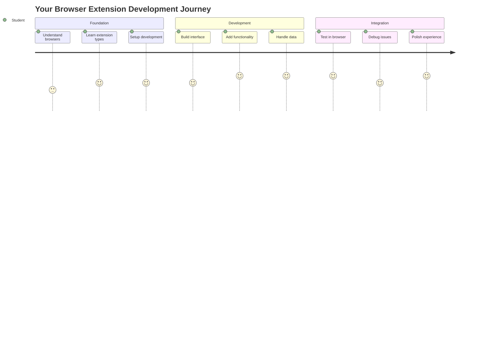

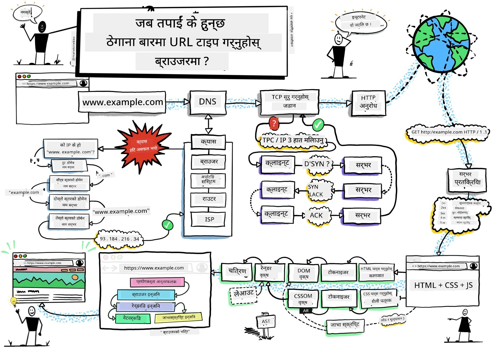
> स्केच नोट [वसिम चेघम](https://dev.to/wassimchegham/ever-wondered-what-happens-when-you-type-in-a-url-in-an-address-bar-in-a-browser-3dob) द्वारा

## प्रि-लेक्चर क्विज

[प्रि-लेक्चर क्विज](https://ff-quizzes.netlify.app/web/quiz/23)

### परिचय

ब्राउजर एक्सटेन्सनहरू साना एप्लिकेसनहरू हुन् जसले तपाईंको वेब ब्राउजिङ अनुभवलाई सुधार गर्छ। टिम बर्नर्स-लीको इन्टरएक्टिभ वेबको मूल दृष्टिकोण जस्तै, एक्सटेन्सनहरूले ब्राउजरको क्षमता साधारण दस्तावेज हेर्ने सीमाभन्दा पर पुर्‍याउँछन्। पासवर्ड म्यानेजरहरू जसले तपाईंको खाताहरू सुरक्षित राख्छन् देखि डिजाइनरहरूलाई सही रंगहरू टिप्न मद्दत गर्ने कलर पिकरहरूसम्म, एक्सटेन्सनहरूले दैनिक ब्राउजिङ चुनौतीहरूको समाधान गर्छन्।

तपाईंको पहिलो एक्सटेन्सन निर्माण गर्नु अघि, ब्राउजरहरू कसरी काम गर्छन् भन्ने कुरा बुझौं। जस्तै अलेक्जेन्डर ग्राहम बेलले टेलिफोन आविष्कार गर्नु अघि ध्वनि प्रसारण बुझ्न आवश्यक थियो, ब्राउजरको आधारभूत कुराहरू जान्नाले तपाईंलाई ब्राउजर प्रणालीहरूसँग सहज रूपमा एकीकृत हुने एक्सटेन्सनहरू बनाउन मद्दत गर्नेछ।

यस पाठको अन्त्यसम्म, तपाईं ब्राउजरको संरचना बुझ्नुहुनेछ र आफ्नो पहिलो एक्सटेन्सन निर्माण गर्न सुरु गरिसक्नु हुनेछ।

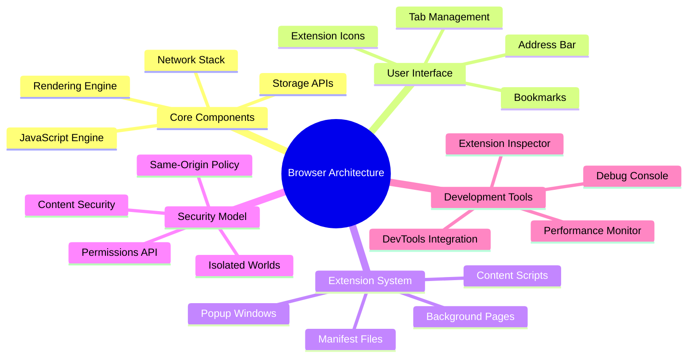

## वेब ब्राउजरको समझ

वेब ब्राउजर मूलतः एक जटिल दस्तावेज व्याख्याकार हो। जब तपाईं "google.com" एड्रेस बारमा टाइप गर्नुहुन्छ, ब्राउजरले विश्वभरका सर्भरहरूबाट सामग्री अनुरोध गर्ने, त्यसपछि कोडलाई पार्स र रेंडर गरेर तपाईंले देख्ने इन्टरएक्टिभ वेब पृष्ठहरूमा परिणत गर्ने जटिल प्रक्रिया पूरा गर्छ।

यो प्रक्रिया टिम बर्नर्स-लीले १९९० मा सबैलाई हाइपरलिंक गरिएको दस्तावेजहरू पहुँचयोग्य बनाउन डिजाइन गरेको पहिलो वेब ब्राउजर, वर्ल्डवाइडवेब, को डिजाइनसँग मेल खान्छ।

✅ **थोरै इतिहास**: पहिलो ब्राउजर 'वर्ल्डवाइडवेब' भनिन्थ्यो र यो सर टिमोथी बर्नर्स-लीले १९९० मा निर्माण गरेका थिए।

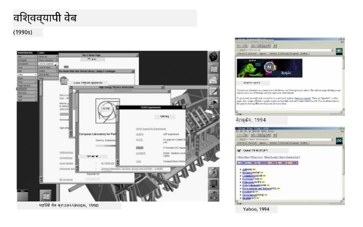
> केही प्रारम्भिक ब्राउजरहरू, [करेन म्याकग्रेन](https://www.slideshare.net/KMcGrane/week-4-ixd-history-personal-computing) मार्फत

### ब्राउजरहरूले वेब सामग्री कसरी प्रक्रिया गर्छन्

URL टाइप गरेर वेबपेज देख्नसम्मको प्रक्रिया केही सेकेन्डभित्र हुने धेरै समन्वित चरणहरू समावेश गर्दछ:

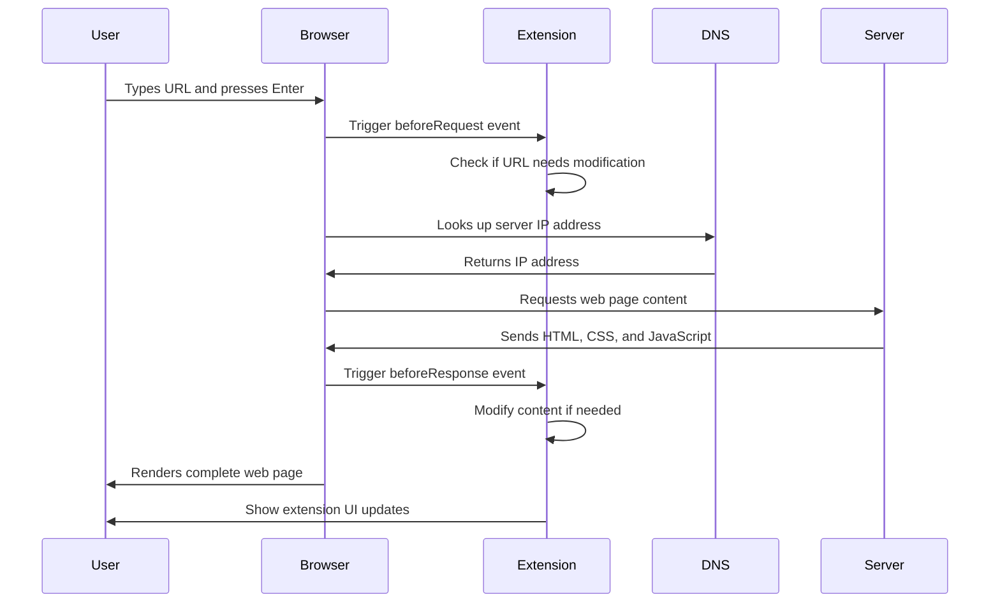

**यस प्रक्रियाले के हासिल गर्छ:**
- **मानव-पढ्न सकिने URL** लाई DNS लुकअप मार्फत सर्भर IP ठेगानामा अनुवाद गर्छ
- **HTTP वा HTTPS प्रोटोकलहरू प्रयोग गरेर** वेब सर्भरसँग सुरक्षित कनेक्शन स्थापना गर्छ
- **विशिष्ट वेब पृष्ठ सामग्री** सर्भरबाट अनुरोध गर्छ
- **HTML मार्कअप, CSS स्टाइलिङ, र JavaScript कोड** सर्भरबाट प्राप्त गर्छ
- **सामग्रीलाई रेंडर गर्छ** र तपाईंले देख्ने इन्टरएक्टिभ वेब पृष्ठमा परिणत गर्छ

### ब्राउजरको मुख्य विशेषताहरू

आधुनिक ब्राउजरहरूले एक्सटेन्सन विकासकर्ताहरूले उपयोग गर्न सक्ने धेरै विशेषताहरू प्रदान गर्छन्:

| विशेषता | उद्देश्य | एक्सटेन्सन अवसरहरू |
|---------|---------|------------------------|
| **रेंडरिङ इन्जिन** | HTML, CSS, र JavaScript देखाउँछ | सामग्री परिमार्जन, स्टाइलिङ इन्जेक्सन |
| **JavaScript इन्जिन** | JavaScript कोड कार्यान्वयन गर्छ | कस्टम स्क्रिप्टहरू, API अन्तर्क्रिया |
| **स्थानीय भण्डारण** | डेटा स्थानीय रूपमा बचत गर्छ | प्रयोगकर्ता प्राथमिकताहरू, क्यास गरिएको डेटा |
| **नेटवर्क स्ट्याक** | वेब अनुरोधहरू ह्यान्डल गर्छ | अनुरोध निगरानी, डेटा विश्लेषण |
| **सुरक्षा मोडेल** | प्रयोगकर्ताहरूलाई हानिकारक सामग्रीबाट बचाउँछ | सामग्री फिल्टरिङ, सुरक्षा सुधारहरू |

**यी विशेषताहरू बुझ्नाले तपाईंलाई मद्दत गर्छ:**
- **पहिचान गर्न** कि तपाईंको एक्सटेन्सनले सबैभन्दा धेरै मूल्य कहाँ थप्न सक्छ
- **सही ब्राउजर API चयन गर्न** तपाईंको एक्सटेन्सनको कार्यक्षमताका लागि
- **डिजाइन गर्न** ब्राउजर प्रणालीहरूसँग कुशलतापूर्वक काम गर्ने एक्सटेन्सनहरू
- **सुनिश्चित गर्न** कि तपाईंको एक्सटेन्सनले ब्राउजर सुरक्षा उत्तम अभ्यासहरू पालना गर्छ

### क्रस-ब्राउजर विकास विचारहरू

विभिन्न ब्राउजरहरूले मानकहरूलाई थोरै भिन्नतासहित कार्यान्वयन गर्छन्, जस्तै विभिन्न प्रोग्रामिङ भाषाहरूले एउटै एल्गोरिथमलाई फरक तरिकाले ह्यान्डल गर्न सक्छन्। क्रोम, फायरफक्स, र सफारी प्रत्येकमा विकासकर्ताहरूले एक्सटेन्सन विकासको क्रममा विचार गर्नुपर्ने अनौठो विशेषताहरू छन्।

> 💡 **प्रो टिप**: [caniuse.com](https://www.caniuse.com) प्रयोग गरेर विभिन्न ब्राउजरहरूमा कुन वेब प्रविधिहरू समर्थित छन् जाँच गर्नुहोस्। यो तपाईंको एक्सटेन्सनको सुविधाहरू योजना गर्दा अमूल्य छ!

**एक्सटेन्सन विकासका लागि मुख्य विचारहरू:**
- **क्रोम, फायरफक्स, र एज ब्राउजरहरूमा** तपाईंको एक्सटेन्सन परीक्षण गर्नुहोस्
- **विभिन्न ब्राउजर एक्सटेन्सन API र म्यानिफेस्ट ढाँचाहरूमा** अनुकूलन गर्नुहोस्
- **विभिन्न प्रदर्शन विशेषताहरू र सीमाहरू ह्यान्डल गर्नुहोस्**
- **ब्राउजर-विशिष्ट सुविधाहरूको लागि फलब्याकहरू प्रदान गर्नुहोस्** जुन उपलब्ध नहुन सक्छ

✅ **एनालिटिक्स इनसाइट**: तपाईं आफ्नो वेब विकास परियोजनाहरूमा एनालिटिक्स प्याकेजहरू स्थापना गरेर प्रयोगकर्ताहरूले कुन ब्राउजरहरू प्राथमिकता दिन्छन् निर्धारण गर्न सक्नुहुन्छ। यस डेटा ले तपाईंलाई कुन ब्राउजरहरूलाई पहिले समर्थन गर्ने प्राथमिकता दिन मद्दत गर्छ।

## ब्राउजर एक्सटेन्सनको समझ

ब्राउजर एक्सटेन्सनहरूले सामान्य वेब ब्राउजिङ चुनौतीहरूको समाधान ब्राउजर इन्टरफेसमा सीधा कार्यक्षमता थपेर गर्छन्। अलग एप्लिकेसनहरू वा जटिल वर्कफ्लोहरू आवश्यक पार्नुभन्दा, एक्सटेन्सनहरूले उपकरणहरू र सुविधाहरूमा तत्काल पहुँच प्रदान गर्छन्।

यो अवधारणा प्रारम्भिक कम्प्युटर अग्रदूतहरू जस्तै डगलस एङ्गलबर्टले प्रविधिको साथ मानव क्षमताहरू बढाउने कल्पना गरे जस्तै हो - एक्सटेन्सनहरूले तपाईंको ब्राउजरको आधारभूत कार्यक्षमता बढाउँछन्।

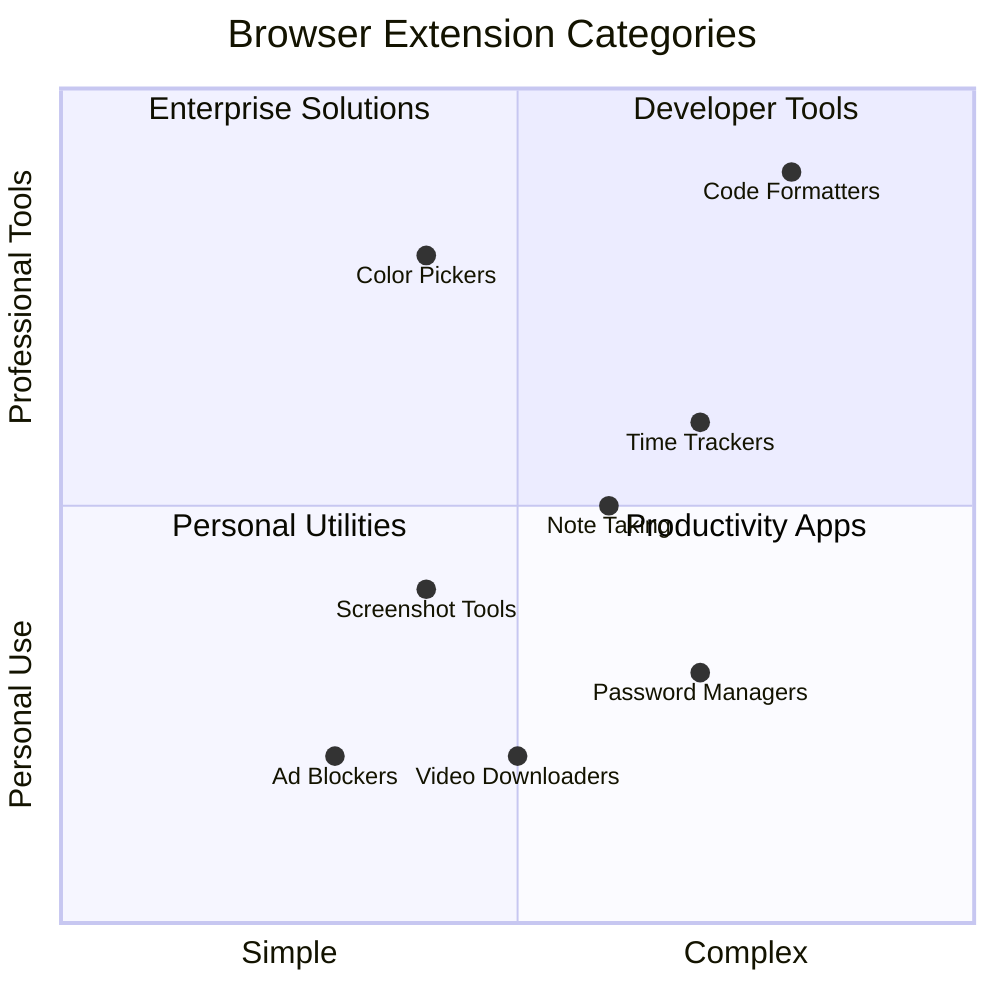

**लोकप्रिय एक्सटेन्सन श्रेणीहरू र तिनका फाइदाहरू:**
- **उत्पादकता उपकरणहरू**: टास्क म्यानेजरहरू, नोट-टेकिङ एप्स, र टाइम ट्र्याकर्स जसले तपाईंलाई व्यवस्थित रहन मद्दत गर्छ
- **सुरक्षा सुधारहरू**: पासवर्ड म्यानेजरहरू, विज्ञापन ब्लकरहरू, र गोपनीयता उपकरणहरू जसले तपाईंको डेटा सुरक्षित राख्छ
- **विकासकर्ता उपकरणहरू**: कोड फर्म्याटरहरू, कलर पिकरहरू, र डिबगिङ युटिलिटीज जसले विकासलाई सरल बनाउँछ
- **सामग्री सुधार**: पढ्ने मोडहरू, भिडियो डाउनलोडरहरू, र स्क्रिनशट उपकरणहरू जसले तपाईंको वेब अनुभव सुधार गर्छ

✅ **प्रतिबिम्ब प्रश्न**: तपाईंको मनपर्ने ब्राउजर एक्सटेन्सनहरू के हुन्? तिनीहरूले कुन विशिष्ट कार्यहरू गर्छन्, र तिनीहरूले तपाईंको ब्राउजिङ अनुभवलाई कसरी सुधार गर्छन्?

### 🔄 **शैक्षिक जाँच**
**ब्राउजर संरचना समझ**: एक्सटेन्सन विकासमा जानु अघि, सुनिश्चित गर्नुहोस् कि तपाईं:
- ✅ ब्राउजरहरूले वेब अनुरोधहरू कसरी प्रक्रिया गर्छन् र सामग्री कसरी रेंडर गर्छन् व्याख्या गर्न सक्नुहुन्छ
- ✅ ब्राउजर संरचनाका मुख्य घटकहरू पहिचान गर्न सक्नुहुन्छ
- ✅ एक्सटेन्सनहरू ब्राउजर कार्यक्षमतासँग कसरी एकीकृत हुन्छन् बुझ्न सक्नुहुन्छ
- ✅ प्रयोगकर्ताहरूलाई सुरक्षा प्रदान गर्ने सुरक्षा मोडेललाई पहिचान गर्न सक्नुहुन्छ

**छिटो आत्म-परीक्षण**: तपाईं URL टाइप गरेर वेबपेज देख्नसम्मको बाटो ट्रेस गर्न सक्नुहुन्छ?
1. **DNS लुकअप** URL लाई IP ठेगानामा रूपान्तरण गर्छ
2. **HTTP अनुरोध** सर्भरबाट सामग्री ल्याउँछ
3. **पार्सिङ** HTML, CSS, र JavaScript प्रक्रिया गर्छ
4. **रेंडरिङ** अन्तिम वेबपेज देखाउँछ
5. **एक्सटेन्सनहरू** विभिन्न चरणहरूमा सामग्री परिमार्जन गर्न सक्छ

## एक्सटेन्सन स्थापना र व्यवस्थापन

एक्सटेन्सन स्थापना प्रक्रिया बुझ्नाले तपाईंलाई प्रयोगकर्ताहरूले तपाईंको एक्सटेन्सन स्थापना गर्दा अनुभव गर्ने कुराको पूर्वानुमान गर्न मद्दत गर्छ। स्थापना प्रक्रिया आधुनिक ब्राउजरहरूमा मानकीकृत छ, इन्टरफेस डिजाइनमा साना भिन्नताहरूका साथ।

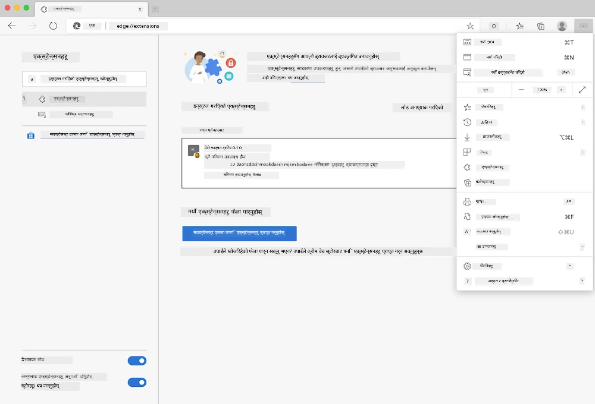

> **महत्वपूर्ण**: आफ्नो एक्सटेन्सन परीक्षण गर्दा डेभलपर मोड अन गर्नुहोस् र अन्य स्टोरहरूबाट एक्सटेन्सनहरू अनुमति दिन सुनिश्चित गर्नुहोस्।

### विकास एक्सटेन्सन स्थापना प्रक्रिया

जब तपाईं आफ्नो एक्सटेन्सन विकास र परीक्षण गर्दै हुनुहुन्छ, यो वर्कफ्लो पालना गर्नुहोस्:

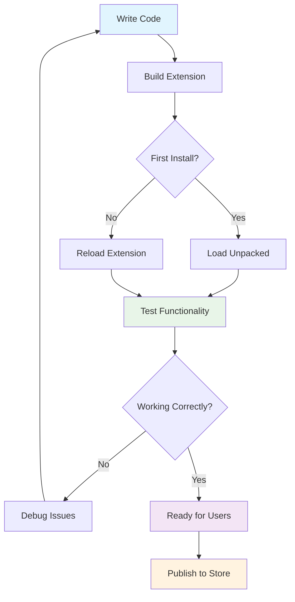

```bash
# Step 1: Build your extension
npm run build
```

**यस कमाण्डले के हासिल गर्छ:**
- **तपाईंको स्रोत कोडलाई** ब्राउजर-तयार फाइलहरूमा कम्पाइल गर्छ
- **JavaScript मोड्युलहरूलाई** अनुकूलित प्याकेजहरूमा बन्डल गर्छ
- **अन्तिम एक्सटेन्सन फाइलहरूलाई** `/dist` फोल्डरमा उत्पन्न गर्छ
- **तपाईंको एक्सटेन्सनलाई** स्थापना र परीक्षणको लागि तयार गर्छ

**चरण २: ब्राउजर एक्सटेन्सनहरूमा नेभिगेट गर्नुहोस्**
1. **तपाईंको ब्राउजरको एक्सटेन्सन व्यवस्थापन पृष्ठ खोल्नुहोस्**
2. **"सेटिङ्स र थप" बटन ( `...` आइकन) माथि दायाँ क्लिक गर्नुहोस्**
3. **ड्रपडाउन मेनुबाट "एक्सटेन्सनहरू" चयन गर्नुहोस्**

**चरण ३: आफ्नो एक्सटेन्सन लोड गर्नुहोस्**
- **नयाँ स्थापनाहरूको लागि**: `लोड अनप्याक्ड` चयन गर्नुहोस् र आफ्नो `/dist` फोल्डर चयन गर्नुहोस्
- **अपडेटहरूको लागि**: तपाईंको पहिले नै स्थापित एक्सटेन्सनको छेउमा `रिलोड` क्लिक गर्नुहोस्
- **परीक्षणको लागि**: "डेभलपर मोड" सक्षम गर्नुहोस् ताकि थप डिबगिङ सुविधाहरू पहुँच गर्न सकियोस्

### उत्पादन एक्सटेन्सन स्थापना

> ✅ **नोट**: यी विकास निर्देशनहरू तपाईंले आफैं निर्माण गरेका एक्सटेन्सनहरूको लागि विशेष रूपमा हुन्। प्रकाशित एक्सटेन्सनहरू स्थापना गर्न, आधिकारिक ब्राउजर एक्सटेन्सन स्टोरहरू जस्तै [माइक्रोसफ्ट एज एड-अन्स स्टोर](https://microsoftedge.microsoft.com/addons/Microsoft-Edge-Extensions-Home) मा जानुहोस्।

**अन्तर बुझ्दै:**
- **विकास स्थापना**हरूले तपाईंलाई विकासको क्रममा अप्रकाशित एक्सटेन्सनहरू परीक्षण गर्न अनुमति दिन्छ
- **स्टोर स्थापना**हरूले स्वीकृत, प्रकाशित एक्सटेन्सनहरू स्वचालित अपडेटहरूसहित प्रदान गर्छ
- **साइडलोडिङ**ले आधिकारिक स्टोरहरू बाहिरबाट एक्सटेन्सन स्थापना गर्न अनुमति दिन्छ (डेभलपर मोड आवश्यक छ)

## तपाईंको कार्बन फुटप्रिन्ट एक्सटेन्सन निर्माण गर्दै

हामी एउटा ब्राउजर एक्सटेन्सन निर्माण गर्नेछौं जसले तपाईंको क्षेत्रको ऊर्जा प्रयोगको कार्बन फुटप्रिन्ट देखाउँछ। यो परियोजनाले आवश्यक एक्सटेन्सन विकास अवधारणाहरू प्रदर्शन गर्दछ जबकि वातावरणीय सचेतनाको लागि व्यावहारिक उपकरण सिर्जना गर्छ।

यो दृष्टिकोण "गर्दै सिक्ने" सिद्धान्तलाई पछ्याउँछ जुन जॉन डेवीको शैक्षिक सिद्धान्तहरूदेखि प्रभावकारी साबित भएको छ - प्राविधिक सीपहरूलाई अर्थपूर्ण वास्तविक-विश्व अनुप्रयोगहरूसँग संयोजन गर्दै।

### परियोजना आवश्यकताहरू

विकास सुरु गर्नु अघि, आवश्यक स्रोतहरू र निर्भरता संकलन गरौं:

**आवश्यक API पहुँच:**
- **[CO2 सिग्नल API की](https://www.co2signal.com/)**: आफ्नो इमेल ठेगाना प्रविष्ट गरेर आफ्नो नि:शुल्क API की प्राप्त गर्नुहोस्
- **[क्षेत्र कोड](http://api.electricitymap.org/v3/zones)**: [इलेक्ट्रिसिटी म्याप](https://www.electricitymap.org/map) प्रयोग गरेर आफ्नो क्षेत्र कोड पत्ता लगाउनुहोस् (उदाहरणका लागि, बोस्टनले 'US-NEISO' प्रयोग गर्छ)

**विकास उपकरणहरू:**
- **[Node.js र NPM](https://www.npmjs.com)**: परियोजना निर्भरता स्थापना गर्नको लागि प्याकेज व्यवस्थापन उपकरण
- **[स्टार्टर कोड](../../../../5-browser-extension/start)**: विकास सुरु गर्न `start` फोल्डर डाउनलोड गर्नुहोस्

✅ **थप जान्नुहोस्**: आफ्नो प्याकेज व्यवस्थापन सीपहरू सुधार गर्न यो [व्यापक सिक्ने मोड्युल](https://docs.microsoft.com/learn/modules/create-nodejs-project-dependencies/?WT.mc_id=academic-77807-sagibbon) हेर्नुहोस्

### परियोजना संरचना बुझ्दै

परियोजना संरचना बुझ्नाले विकास कार्यलाई कुशलतापूर्वक व्यवस्थित गर्न मद्दत गर्छ। जस्तै अलेक्जेन्ड्रिया पुस्तकालयलाई सजिलो ज्ञान पुनःप्राप्तिको लागि व्यवस्थित गरिएको थियो, राम्रोसँग संरचित कोडबेसले विकासलाई कुशल बनाउँछ:

```
project-root/
├── dist/                    # Built extension files
│   ├── manifest.json        # Extension configuration
│   ├── index.html           # User interface markup
│   ├── background.js        # Background script functionality
│   └── main.js              # Compiled JavaScript bundle
├── src/                     # Source development files
│   └── index.js             # Your main JavaScript code
├── package.json             # Project dependencies and scripts
└── webpack.config.js        # Build configuration
```

**प्रत्येक फाइलले के हासिल गर्छ:**
- **`manifest.json`**: एक्सटेन्सन मेटाडेटा, अनुमति, र प्रवेश बिन्दुहरू परिभाषित गर्छ
- **`index.html`**: प्रयोगकर्ता इन्टरफेस सिर्जना गर्छ जुन प्रयोगकर्ताहरूले तपाईंको एक्सटेन्सन क्लिक गर्दा देख्छन्
- **`background.js`**: पृष्ठभूमि कार्यहरू र ब्राउजर इभेन्ट लिसनरहरू ह्यान्डल गर्छ
- **`main.js`**: निर्माण प्रक्रिया पछि अन्तिम बन्डल गरिएको JavaScript समावेश गर्छ
- **`src/index.js`**: तपाईंको मुख्य विकास कोड समावेश गर्छ जुन `main.js` मा कम्पाइल हुन्छ

> 💡 **संरचना टिप**: आफ्नो API की र क्षेत्र कोडलाई सुरक्षित नोटमा भण्डारण गर्नुहोस् ताकि विकासको क्रममा सजिलै सन्दर्भ गर्न सकियोस्। तपाईंलाई यी मानहरू आफ्नो एक्सटेन्सनको कार्यक्षमता परीक्षण गर्न आवश्यक हुनेछ।

✅ **सुरक्षा नोट**: कहिल्यै आफ्नो कोड रिपोजिटरीमा API की वा संवेदनशील प्रमाणहरू कमिट नगर्नुहोस्। हामी तपाईंलाई यी सुरक्षित रूपमा ह्यान्डल गर्ने तरिका अर्को चरणहरूमा देखाउनेछौं।

## एक्सटेन्सन इन्टरफेस सिर्जना गर्दै

अब हामी प्रयोगकर्ता इन्टरफेस कम्पोनेन्टहरू निर्माण गर्नेछौं। एक्सटेन्सनले दुई-स्क्रिन दृष्टिकोण प्रयोग गर्छ: प्रारम्भिक सेटअपको लागि कन्फिगरेसन स्क्रिन र डेटा प्रदर्शनको लागि परिणाम स्क्रिन।

यो कम्प्युटिङको प्रारम्भिक दिनदेखि प्रयोग गरिएको इन्टरफेस डिजाइनमा प्रगतिशील खुलासा सिद्धान्तलाई पछ्याउँछ - प्रयोगकर्ताहरूलाई अभिभूत नगरी जानकारी र विकल्पहरू तार्किक क्रममा देखाउँदै।

### एक्सटेन्सन दृश्यहरूको अवलोकन

**सेटअप दृश्य** - पहिलो पटक प्रयोगकर्ता कन्फिगरेसन:
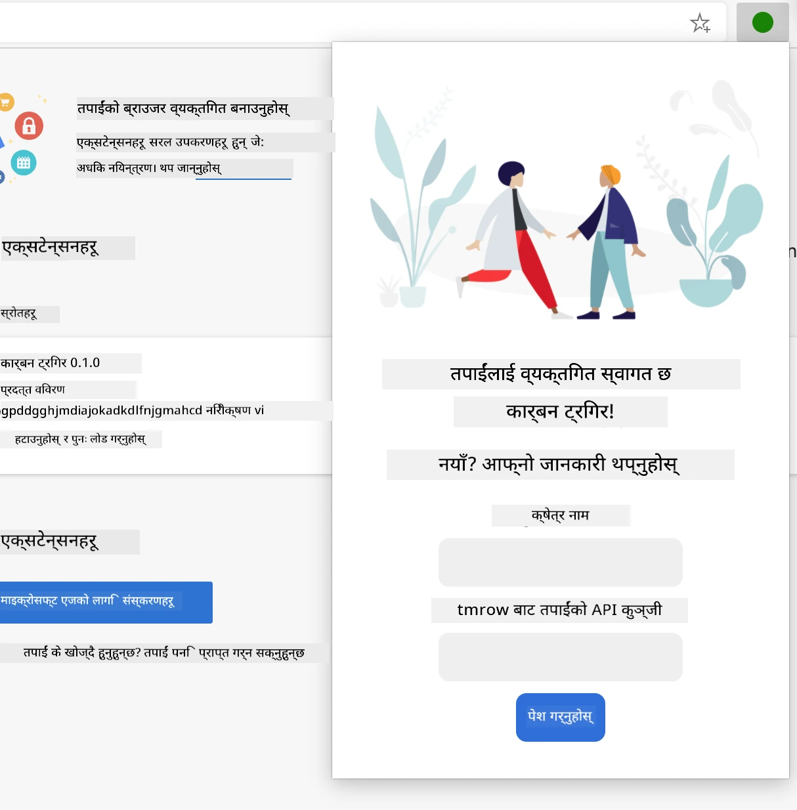

**परिणाम दृश्य** - कार्बन फुटप्रिन्ट डेटा प्रदर्शन:
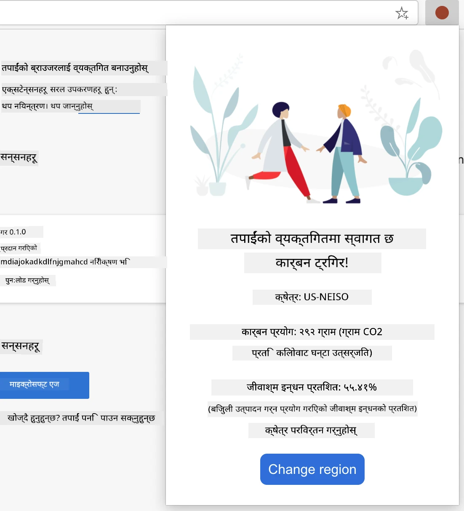

### कन्फिगरेसन फारम निर्माण गर्दै

सेटअप फारमले प्रारम्भिक प्रयोगको क्रममा प्रयोगकर्ता कन्फिगरेसन डेटा सङ्कलन गर्छ। एक पटक कन्फिगर गरेपछि, यो जानकारी भविष्यका सत्रहरूको लागि ब्राउजर भण्डारणमा रहन्छ।

`/dist/index.html` फाइलमा, यो फारम संर
1. **निर्माण गर्नुहोस्** आफ्नो कोड कम्पाइल गर्न निर्माण आदेश चलाउनुहोस्  
2. **लोड गर्नुहोस्** विकासकर्ता मोड प्रयोग गरेर आफ्नो ब्राउजरमा एक्सटेन्सन  
3. **पुष्टि गर्नुहोस्** कि फारम सही ढंगले देखिन्छ र व्यावसायिक देखिन्छ  
4. **जाँच गर्नुहोस्** कि सबै फारम तत्वहरू सही रूपमा मिलाइएको र कार्यात्मक छन्  

**तपाईंले के हासिल गर्नुभयो:**  
- **निर्माण गर्नुभयो** आफ्नो एक्सटेन्सनको आधारभूत HTML संरचना  
- **तयार गर्नुभयो** कन्फिगरेसन र परिणाम इन्टरफेसहरू सही सेम्यान्टिक मार्कअपको साथ  
- **सेट अप गर्नुभयो** उद्योग-मानक उपकरणहरू प्रयोग गरेर आधुनिक विकास कार्यप्रवाह  
- **तयार गर्नुभयो** अन्तरक्रियात्मक JavaScript कार्यक्षमता थप्नको लागि आधार  

### 🔄 **शैक्षिक जाँच-पडताल**  
**एक्सटेन्सन विकास प्रगति**: अगाडि बढ्नु अघि आफ्नो बुझाइ पुष्टि गर्नुहोस्:  
- ✅ के तपाईं परियोजना संरचनामा प्रत्येक फाइलको उद्देश्य व्याख्या गर्न सक्नुहुन्छ?  
- ✅ के तपाईं बुझ्नुहुन्छ कि निर्माण प्रक्रिया कसरी तपाईंको स्रोत कोडलाई रूपान्तरण गर्छ?  
- ✅ किन हामी कन्फिगरेसन र परिणामलाई फरक UI खण्डहरूमा विभाजित गर्छौं?  
- ✅ फारम संरचनाले प्रयोगकर्ता अनुभव र पहुँचयोग्यता कसरी समर्थन गर्छ?  

**विकास कार्यप्रवाह बुझाइ**: अब तपाईं सक्षम हुनुहुन्छ:  
1. **परिवर्तन गर्नुहोस्** HTML र CSS आफ्नो एक्सटेन्सन इन्टरफेसको लागि  
2. **चलाउनुहोस्** निर्माण आदेश आफ्नो परिवर्तनहरू कम्पाइल गर्न  
3. **पुनः लोड गर्नुहोस्** आफ्नो ब्राउजरमा एक्सटेन्सन अपडेट परीक्षण गर्न  
4. **डिबग गर्नुहोस्** ब्राउजर विकासकर्ता उपकरणहरू प्रयोग गरेर समस्या  

तपाईंले ब्राउजर एक्सटेन्सन विकासको पहिलो चरण पूरा गर्नुभएको छ। जस्तै राइट भाइहरूले उडान प्राप्त गर्नु अघि एरोडायनामिक्स बुझ्न आवश्यक थियो, यी आधारभूत अवधारणाहरू बुझ्नुले तपाईंलाई अर्को पाठमा थप जटिल अन्तरक्रियात्मक सुविधाहरू निर्माण गर्न तयार बनाउँछ।  

## GitHub Copilot Agent चुनौती 🚀  

Agent मोड प्रयोग गरेर निम्न चुनौती पूरा गर्नुहोस्:  

**विवरण:** API की र क्षेत्र कोडहरू प्रविष्ट गर्दा प्रयोगकर्ता अनुभव सुधार गर्न फारम मान्यता र प्रयोगकर्ता प्रतिक्रिया सुविधाहरू थप्नुहोस्।  

**प्रेरणा:** JavaScript मान्यता कार्यहरू सिर्जना गर्नुहोस् जसले API की क्षेत्रले कम्तीमा २० अक्षर समावेश गरेको छ कि छैन र क्षेत्र कोड सही ढाँचामा छ कि छैन (जस्तै 'US-NEISO') जाँच गर्छ। मान्य इनपुटहरूको लागि इनपुट सीमा रंगलाई हरियोमा परिवर्तन गर्नुहोस् र अमान्यहरूको लागि रातोमा। साथै सुरक्षा उद्देश्यका लागि API की देखाउने/लुकाउने सुविधा थप्नुहोस्।  

[Agent मोडको बारेमा थप जान्नुहोस्](https://code.visualstudio.com/blogs/2025/02/24/introducing-copilot-agent-mode) यहाँ।  

## 🚀 चुनौती  

ब्राउजर एक्सटेन्सन स्टोर हेर्नुहोस् र आफ्नो ब्राउजरमा एउटा स्थापना गर्नुहोस्। तपाईं यसको फाइलहरू रोचक तरिकामा जाँच गर्न सक्नुहुन्छ। तपाईंले के पत्ता लगाउनुहुन्छ?  

## पोस्ट-व्याख्यान क्विज  

[पोस्ट-व्याख्यान क्विज](https://ff-quizzes.netlify.app/web/quiz/24)  

## समीक्षा र आत्म-अध्ययन  

यस पाठमा तपाईंले वेब ब्राउजरको इतिहासको बारेमा थोरै सिक्नुभयो; यस अवसरलाई वेबको इतिहासको बारेमा थप जान्न प्रयोग गर्नुहोस्। केही उपयोगी साइटहरू समावेश छन्:  

[वेब ब्राउजरहरूको इतिहास](https://www.mozilla.org/firefox/browsers/browser-history/)  

[वेबको इतिहास](https://webfoundation.org/about/vision/history-of-the-web/)  

[टिम बर्नर्स-लीसँगको अन्तर्वार्ता](https://www.theguardian.com/technology/2019/mar/12/tim-berners-lee-on-30-years-of-the-web-if-we-dream-a-little-we-can-get-the-web-we-want)  

### ⚡ **अर्को ५ मिनेटमा तपाईं के गर्न सक्नुहुन्छ**  
- [ ] Chrome/Edge एक्सटेन्सन पृष्ठ खोल्नुहोस् (chrome://extensions) र तपाईंले के स्थापना गर्नुभएको छ हेर्नुहोस्  
- [ ] वेबपेज लोड गर्दा आफ्नो ब्राउजरको DevTools नेटवर्क ट्याब हेर्नुहोस्  
- [ ] पेज स्रोत हेर्ने प्रयास गर्नुहोस् (Ctrl+U) HTML संरचना हेर्न  
- [ ] कुनै पनि वेबपेज तत्व निरीक्षण गर्नुहोस् र DevTools मा यसको CSS परिवर्तन गर्नुहोस्  

### 🎯 **अर्को एक घण्टामा तपाईं के हासिल गर्न सक्नुहुन्छ**  
- [ ] पोस्ट-पाठ क्विज पूरा गर्नुहोस् र ब्राउजरको आधारभूत कुराहरू बुझ्नुहोस्  
- [ ] ब्राउजर एक्सटेन्सनको लागि आधारभूत manifest.json फाइल सिर्जना गर्नुहोस्  
- [ ] एउटा साधारण "Hello World" एक्सटेन्सन बनाउनुहोस् जसले पपअप देखाउँछ  
- [ ] विकासकर्ता मोडमा आफ्नो एक्सटेन्सन लोड परीक्षण गर्नुहोस्  
- [ ] आफ्नो लक्ष्य ब्राउजरको लागि ब्राउजर एक्सटेन्सन डकुमेन्टेसन अन्वेषण गर्नुहोस्  

### 📅 **तपाईंको हप्ताको एक्सटेन्सन यात्रा**  
- [ ] वास्तविक उपयोगितासहितको कार्यात्मक ब्राउजर एक्सटेन्सन पूरा गर्नुहोस्  
- [ ] सामग्री स्क्रिप्टहरू, पृष्ठभूमि स्क्रिप्टहरू, र पपअप अन्तरक्रियाहरूको बारेमा जान्नुहोस्  
- [ ] स्टोरेज, ट्याब्स, र मेसेजिङ जस्ता ब्राउजर API मास्टर गर्नुहोस्  
- [ ] आफ्नो एक्सटेन्सनको लागि प्रयोगकर्ता-अनुकूल इन्टरफेस डिजाइन गर्नुहोस्  
- [ ] विभिन्न वेबसाइटहरू र परिदृश्यहरूमा आफ्नो एक्सटेन्सन परीक्षण गर्नुहोस्  
- [ ] ब्राउजरको एक्सटेन्सन स्टोरमा आफ्नो एक्सटेन्सन प्रकाशित गर्नुहोस्  

### 🌟 **तपाईंको महिनाको ब्राउजर विकास**  
- [ ] विभिन्न प्रयोगकर्ता समस्याहरू समाधान गर्ने बहु एक्सटेन्सनहरू निर्माण गर्नुहोस्  
- [ ] उन्नत ब्राउजर API र सुरक्षा उत्तम अभ्यासहरू सिक्नुहोस्  
- [ ] ओपन सोर्स ब्राउजर एक्सटेन्सन परियोजनाहरूमा योगदान गर्नुहोस्  
- [ ] क्रस-ब्राउजर अनुकूलता र प्रगतिशील सुधार मास्टर गर्नुहोस्  
- [ ] अन्यको लागि एक्सटेन्सन विकास उपकरणहरू र टेम्प्लेटहरू सिर्जना गर्नुहोस्  
- [ ] ब्राउजर एक्सटेन्सन विशेषज्ञ बन्नुहोस् जो अन्य विकासकर्ताहरूलाई मद्दत गर्छ  

## 🎯 तपाईंको ब्राउजर एक्सटेन्सन मास्टरी समयरेखा  

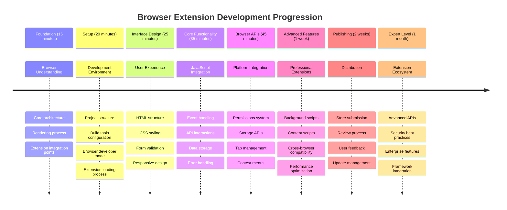
  
### 🛠️ तपाईंको एक्सटेन्सन विकास उपकरणको सारांश  

यस पाठ पूरा गरेपछि, अब तपाईंसँग छ:  
- **ब्राउजर आर्किटेक्चर ज्ञान**: रेंडरिङ इन्जिन, सुरक्षा मोडेल, र एक्सटेन्सन एकीकरणको बुझाइ  
- **विकास वातावरण**: Webpack, NPM, र डिबगिङ क्षमताहरूको साथ आधुनिक टूलचेन  
- **UI/UX आधारभूत संरचना**: प्रगतिशील डिस्क्लोजर ढाँचाहरूको साथ सेम्यान्टिक HTML संरचना  
- **सुरक्षा सचेतता**: ब्राउजर अनुमति र सुरक्षित विकास अभ्यासहरूको बुझाइ  
- **क्रस-ब्राउजर अवधारणाहरू**: अनुकूलता विचारहरू र परीक्षण दृष्टिकोणहरूको ज्ञान  
- **API एकीकरण**: बाह्य डेटा स्रोतहरूसँग काम गर्ने आधार  
- **व्यावसायिक कार्यप्रवाह**: उद्योग-मानक विकास र परीक्षण प्रक्रियाहरू  

**वास्तविक-विश्व अनुप्रयोगहरू**: यी सीपहरू सीधा लागू हुन्छन्:  
- **वेब विकास**: सिंगल-पेज एप्लिकेसनहरू र प्रगतिशील वेब एपहरू  
- **डेस्कटप अनुप्रयोगहरू**: इलेक्ट्रोन र वेब-आधारित डेस्कटप सफ्टवेयर  
- **मोबाइल विकास**: हाइब्रिड एपहरू र वेब-आधारित मोबाइल समाधानहरू  
- **उद्यम उपकरणहरू**: आन्तरिक उत्पादकता अनुप्रयोगहरू र कार्यप्रवाह स्वचालन  
- **ओपन सोर्स**: ब्राउजर एक्सटेन्सन परियोजनाहरू र वेब मानकहरूमा योगदान  

**अर्को स्तर**: अब तपाईं अन्तरक्रियात्मक कार्यक्षमता थप्न, ब्राउजर API सँग काम गर्न, र वास्तविक प्रयोगकर्ता समस्याहरू समाधान गर्ने एक्सटेन्सनहरू सिर्जना गर्न तयार हुनुहुन्छ!  

## असाइनमेन्ट  

[आफ्नो एक्सटेन्सनलाई पुनःस्टाइल गर्नुहोस्](assignment.md)  

---

**अस्वीकरण**:  
यो दस्तावेज़ AI अनुवाद सेवा [Co-op Translator](https://github.com/Azure/co-op-translator) प्रयोग गरेर अनुवाद गरिएको छ। हामी शुद्धताको लागि प्रयास गर्छौं, तर कृपया ध्यान दिनुहोस् कि स्वचालित अनुवादहरूमा त्रुटिहरू वा अशुद्धताहरू हुन सक्छ। यसको मूल भाषा मा रहेको दस्तावेज़लाई आधिकारिक स्रोत मानिनुपर्छ। महत्वपूर्ण जानकारीको लागि, व्यावसायिक मानव अनुवाद सिफारिस गरिन्छ। यस अनुवादको प्रयोगबाट उत्पन्न हुने कुनै पनि गलतफहमी वा गलत व्याख्याको लागि हामी जिम्मेवार हुने छैनौं।