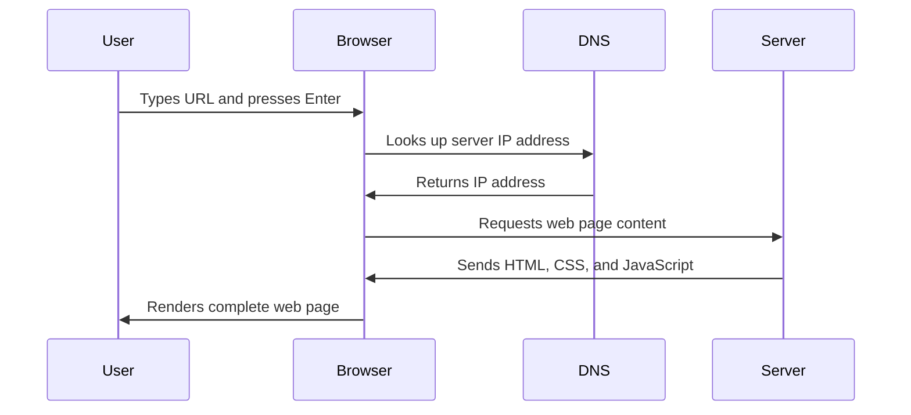

<!--
CO_OP_TRANSLATOR_METADATA:
{
  "original_hash": "33a875c522f237a2026e4653240dfc07",
  "translation_date": "2025-10-22T17:19:20+00:00",
  "source_file": "5-browser-extension/1-about-browsers/README.md",
  "language_code": "ne"
}
-->
# ब्राउजर एक्सटेन्सन परियोजना भाग १: ब्राउजरको बारेमा सबै कुरा


> स्केच नोट [वसिम चेघम](https://dev.to/wassimchegham/ever-wondered-what-happens-when-you-type-in-a-url-in-an-address-bar-in-a-browser-3dob) द्वारा

## प्रि-लेक्चर क्विज

[प्रि-लेक्चर क्विज](https://ff-quizzes.netlify.app/web/quiz/23)

### परिचय

ब्राउजर एक्सटेन्सनहरू साना एप्लिकेसनहरू हुन् जसले तपाईंको वेब ब्राउजिङ अनुभवलाई सुधार गर्छ। टिम बर्नर्स-लीको इन्टरएक्टिभ वेबको मूल दृष्टिकोण जस्तै, एक्सटेन्सनहरूले ब्राउजरको क्षमता साधारण दस्तावेज हेर्ने सीमाभन्दा पर पुर्‍याउँछन्। पासवर्ड म्यानेजरहरू जसले तपाईंको खाताहरू सुरक्षित राख्छन् देखि डिजाइनरहरूलाई सही रंगहरू टिप्न मद्दत गर्ने कलर पिकरहरूसम्म, एक्सटेन्सनहरूले दैनिक ब्राउजिङ चुनौतीहरूको समाधान गर्छन्।

तपाईंको पहिलो एक्सटेन्सन निर्माण गर्नु अघि, ब्राउजरहरू कसरी काम गर्छन् भन्ने कुरा बुझौं। जस्तै अलेक्जेन्डर ग्राहम बेलले टेलिफोन आविष्कार गर्नु अघि ध्वनि प्रसारण बुझ्न आवश्यक थियो, ब्राउजरको आधारभूत कुराहरू जान्नाले तपाईंलाई ब्राउजर प्रणालीहरूसँग सहज रूपमा एकीकृत हुने एक्सटेन्सनहरू बनाउन मद्दत गर्नेछ।

यस पाठको अन्त्यसम्ममा, तपाईं ब्राउजरको संरचना बुझ्नुहुनेछ र आफ्नो पहिलो एक्सटेन्सन निर्माण गर्न सुरु गरिसक्नु हुनेछ।

## वेब ब्राउजरहरू बुझ्दै

वेब ब्राउजर मूलतः एक जटिल दस्तावेज व्याख्याकार हो। जब तपाईं "google.com" ब्राउजरको एड्रेस बारमा टाइप गर्नुहुन्छ, ब्राउजरले विश्वभरका सर्भरहरूबाट सामग्री अनुरोध गर्ने, त्यसपछि कोडलाई पार्स र रेंडर गर्ने जटिल प्रक्रिया गर्छ - जसले तपाईंले देख्ने इन्टरएक्टिभ वेब पृष्ठहरूमा परिणत हुन्छ।

यो प्रक्रिया टिम बर्नर्स-लीले १९९० मा डिजाइन गरेको पहिलो वेब ब्राउजर, वर्ल्डवाइडवेब, जसले हाइपरलिंक गरिएको दस्तावेजहरू सबैका लागि पहुँचयोग्य बनायो, जस्तै हो।

✅ **थोरै इतिहास**: पहिलो ब्राउजर 'वर्ल्डवाइडवेब' भनिन्थ्यो र यसलाई सर टिमोथी बर्नर्स-लीले १९९० मा निर्माण गरेका थिए।


> केही प्रारम्भिक ब्राउजरहरू, [करेन म्याकग्रेन](https://www.slideshare.net/KMcGrane/week-4-ixd-history-personal-computing) मार्फत

### ब्राउजरले वेब सामग्री कसरी प्रक्रिया गर्छ

URL प्रविष्टि गर्ने र वेबपेज देखिने बीचको प्रक्रिया केही सेकेन्डभित्र हुने धेरै समन्वित चरणहरू समावेश गर्दछ:



**यस प्रक्रियाले के हासिल गर्छ:**
- **मानव-पढ्न सकिने URL** लाई DNS लुकअप मार्फत सर्भर IP ठेगानामा अनुवाद गर्छ
- HTTP वा HTTPS प्रोटोकल प्रयोग गरेर वेब सर्भरसँग सुरक्षित कनेक्शन स्थापना गर्छ
- सर्भरबाट विशिष्ट वेब पृष्ठ सामग्री अनुरोध गर्छ
- HTML मार्कअप, CSS स्टाइलिङ, र JavaScript कोड सर्भरबाट प्राप्त गर्छ
- सबै सामग्रीलाई इन्टरएक्टिभ वेब पृष्ठमा रेंडर गर्छ

### ब्राउजरको मुख्य विशेषताहरू

आधुनिक ब्राउजरहरूले एक्सटेन्सन विकासकर्ताहरूले उपयोग गर्न सक्ने धेरै विशेषताहरू प्रदान गर्छन्:

| विशेषता | उद्देश्य | एक्सटेन्सन अवसरहरू |
|---------|---------|------------------------|
| **रेंडरिङ इन्जिन** | HTML, CSS, र JavaScript प्रदर्शन गर्छ | सामग्री परिमार्जन, स्टाइलिङ इन्जेक्सन |
| **JavaScript इन्जिन** | JavaScript कोड कार्यान्वयन गर्छ | कस्टम स्क्रिप्टहरू, API अन्तर्क्रिया |
| **स्थानीय भण्डारण** | डेटा स्थानीय रूपमा बचत गर्छ | प्रयोगकर्ता प्राथमिकताहरू, क्यास गरिएको डेटा |
| **नेटवर्क स्ट्याक** | वेब अनुरोधहरू ह्यान्डल गर्छ | अनुरोध अनुगमन, डेटा विश्लेषण |
| **सुरक्षा मोडेल** | प्रयोगकर्ताहरूलाई हानिकारक सामग्रीबाट सुरक्षा दिन्छ | सामग्री फिल्टरिङ, सुरक्षा सुधार |

**यी विशेषताहरू बुझ्नाले तपाईंलाई मद्दत गर्छ:**
- **पहिचान** गर्नुहोस् कि तपाईंको एक्सटेन्सनले सबैभन्दा धेरै मूल्य कहाँ थप्न सक्छ
- **चयन** गर्नुहोस् कि तपाईंको एक्सटेन्सनको कार्यक्षमताको लागि सही ब्राउजर API
- **डिजाइन** गर्नुहोस् कि ब्राउजर प्रणालीहरूसँग कुशलतापूर्वक काम गर्ने एक्सटेन्सनहरू
- **सुनिश्चित** गर्नुहोस् कि तपाईंको एक्सटेन्सनले ब्राउजर सुरक्षा उत्तम अभ्यासहरू पालना गर्छ

### क्रस-ब्राउजर विकास विचारहरू

विभिन्न ब्राउजरहरूले थोरै भिन्नतासहित मानकहरू कार्यान्वयन गर्छन्, जस्तै विभिन्न प्रोग्रामिङ भाषाहरूले समान एल्गोरिदमलाई फरक तरिकाले ह्यान्डल गर्न सक्छन्। क्रोम, फायरफक्स, र सफारी प्रत्येकमा अनौठो विशेषताहरू छन् जसलाई एक्सटेन्सन विकासको क्रममा विकासकर्ताहरूले विचार गर्नुपर्छ।

> 💡 **प्रो टिप**: [caniuse.com](https://www.caniuse.com) प्रयोग गरेर विभिन्न ब्राउजरहरूमा कुन वेब प्रविधिहरू समर्थित छन् जाँच गर्नुहोस्। तपाईंको एक्सटेन्सनको विशेषताहरू योजना गर्दा यो अमूल्य छ!

**एक्सटेन्सन विकासका लागि मुख्य विचारहरू:**
- **परीक्षण** गर्नुहोस् कि तपाईंको एक्सटेन्सन क्रोम, फायरफक्स, र एज ब्राउजरहरूमा काम गर्छ
- **अनुकूलन** गर्नुहोस् विभिन्न ब्राउजर एक्सटेन्सन API र म्यानिफेस्ट ढाँचाहरूमा
- **ह्यान्डल** गर्नुहोस् विभिन्न ब्राउजर-विशिष्ट विशेषताहरू र सीमाहरू
- **फिर्ता विकल्पहरू प्रदान गर्नुहोस्** ब्राउजर-विशिष्ट विशेषताहरूको लागि जुन उपलब्ध नहुन सक्छ

✅ **एनालिटिक्स इनसाइट**: तपाईं आफ्नो वेब विकास परियोजनाहरूमा एनालिटिक्स प्याकेजहरू स्थापना गरेर प्रयोगकर्ताहरूले कुन ब्राउजरहरू प्राथमिकता दिन्छन् भनेर निर्धारण गर्न सक्नुहुन्छ। यस डेटा तपाईंलाई कुन ब्राउजरहरूलाई पहिले समर्थन गर्ने प्राथमिकता दिन मद्दत गर्छ।

## ब्राउजर एक्सटेन्सनहरू बुझ्दै

ब्राउजर एक्सटेन्सनहरूले सामान्य वेब ब्राउजिङ चुनौतीहरूको समाधान ब्राउजर इन्टरफेसमा सीधा कार्यक्षमता थपेर गर्छन्। अलग एप्लिकेसनहरू वा जटिल वर्कफ्लोहरू आवश्यक पार्नुभन्दा, एक्सटेन्सनहरूले उपकरणहरू र सुविधाहरूमा तत्काल पहुँच प्रदान गर्छन्।

यो अवधारणा प्रारम्भिक कम्प्युटर अग्रदूतहरू जस्तै डगलस एङ्गलबर्टले प्रविधिको साथ मानव क्षमताहरू बढाउने कल्पना गरे जस्तै हो - एक्सटेन्सनहरूले तपाईंको ब्राउजरको आधारभूत कार्यक्षमता बढाउँछन्।

**लोकप्रिय एक्सटेन्सन कोटीहरू र तिनीहरूको फाइदाहरू:**
- **उत्पादकता उपकरणहरू**: कार्य व्यवस्थापकहरू, नोट लिने एप्स, र समय ट्र्याकर्स जसले तपाईंलाई व्यवस्थित रहन मद्दत गर्छ
- **सुरक्षा सुधारहरू**: पासवर्ड म्यानेजरहरू, विज्ञापन ब्लकरहरू, र गोपनीयता उपकरणहरू जसले तपाईंको डेटा सुरक्षित राख्छ
- **विकासकर्ता उपकरणहरू**: कोड फर्म्याटरहरू, कलर पिकरहरू, र डिबगिङ युटिलिटीहरू जसले विकासलाई सरल बनाउँछ
- **सामग्री सुधार**: पढ्ने मोडहरू, भिडियो डाउनलोडरहरू, र स्क्रिनशट उपकरणहरू जसले तपाईंको वेब अनुभव सुधार गर्छ

✅ **प्रतिबिम्ब प्रश्न**: तपाईंको मनपर्ने ब्राउजर एक्सटेन्सनहरू के हुन्? तिनीहरूले कुन विशिष्ट कार्यहरू गर्छन्, र तिनीहरूले तपाईंको ब्राउजिङ अनुभवलाई कसरी सुधार गर्छन्?

## एक्सटेन्सन स्थापना र व्यवस्थापन गर्दै

एक्सटेन्सन स्थापना प्रक्रिया बुझ्नाले तपाईंलाई मानिसहरूले तपाईंको एक्सटेन्सन स्थापना गर्दा अनुभव गर्ने कुराको पूर्वानुमान गर्न मद्दत गर्छ। स्थापना प्रक्रिया आधुनिक ब्राउजरहरूमा मानकीकृत छ, इन्टरफेस डिजाइनमा साना भिन्नताहरूका साथ।


> **महत्वपूर्ण**: आफ्नो एक्सटेन्सन परीक्षण गर्दा डेभलपर मोड अन गर्नुहोस् र अन्य स्टोरहरूबाट एक्सटेन्सनहरू अनुमति दिनुहोस्।

### विकास एक्सटेन्सन स्थापना प्रक्रिया

जब तपाईं आफ्नो एक्सटेन्सन विकास र परीक्षण गर्दै हुनुहुन्छ, यो वर्कफ्लो पालना गर्नुहोस्:

```bash
# Step 1: Build your extension
npm run build
```

**यस आदेशले के हासिल गर्छ:**
- **तपाईंको स्रोत कोडलाई** ब्राउजर-तयार फाइलहरूमा कम्पाइल गर्छ
- **JavaScript मोड्युलहरूलाई** अनुकूलित प्याकेजहरूमा बन्डल गर्छ
- **अन्तिम एक्सटेन्सन फाइलहरूलाई** `/dist` फोल्डरमा उत्पन्न गर्छ
- **तपाईंको एक्सटेन्सनलाई** स्थापना र परीक्षणको लागि तयार गर्छ

**चरण २: ब्राउजर एक्सटेन्सनहरूमा जानुहोस्**
1. **खोल्नुहोस्** आफ्नो ब्राउजरको एक्सटेन्सन व्यवस्थापन पृष्ठ
2. **क्लिक गर्नुहोस्** "सेटिङ्स र थप" बटन (माथि दायाँमा `...` आइकन)
3. **चयन गर्नुहोस्** ड्रपडाउन मेनुबाट "एक्सटेन्सनहरू"

**चरण ३: आफ्नो एक्सटेन्सन लोड गर्नुहोस्**
- **नयाँ स्थापनाहरूको लागि**: `लोड अनप्याक्ड` चयन गर्नुहोस् र आफ्नो `/dist` फोल्डर चयन गर्नुहोस्
- **अपडेटहरूको लागि**: पहिले नै स्थापना गरिएको एक्सटेन्सनको छेउमा `रिलोड` क्लिक गर्नुहोस्
- **परीक्षणको लागि**: "डेभलपर मोड" सक्षम गर्नुहोस् थप डिबगिङ सुविधाहरू पहुँच गर्न

### उत्पादन एक्सटेन्सन स्थापना

> ✅ **नोट**: यी विकास निर्देशनहरू तपाईंले आफैंले निर्माण गरेका एक्सटेन्सनहरूको लागि विशेष रूपमा हुन्। प्रकाशित एक्सटेन्सनहरू स्थापना गर्न, [माइक्रोसफ्ट एज एड-ऑन्स स्टोर](https://microsoftedge.microsoft.com/addons/Microsoft-Edge-Extensions-Home) जस्ता आधिकारिक ब्राउजर एक्सटेन्सन स्टोरहरूमा जानुहोस्।

**भिन्नता बुझ्दै:**
- **विकास स्थापना**हरूले तपाईंलाई विकासको क्रममा अप्रकाशित एक्सटेन्सनहरू परीक्षण गर्न दिन्छ
- **स्टोर स्थापना**हरूले स्वचालित अपडेटहरूसँग प्रमाणित, प्रकाशित एक्सटेन्सनहरू प्रदान गर्छ
- **साइडलोडिङ**ले आधिकारिक स्टोरहरू बाहिरबाट एक्सटेन्सन स्थापना गर्न अनुमति दिन्छ (डेभलपर मोड आवश्यक छ)

## तपाईंको कार्बन फुटप्रिन्ट एक्सटेन्सन निर्माण गर्दै

हामी एउटा ब्राउजर एक्सटेन्सन निर्माण गर्नेछौं जसले तपाईंको क्षेत्रको ऊर्जा प्रयोगको कार्बन फुटप्रिन्ट देखाउँछ। यो परियोजनाले आवश्यक एक्सटेन्सन विकास अवधारणाहरू प्रदर्शन गर्दछ भने वातावरणीय सचेतनाको लागि व्यावहारिक उपकरण सिर्जना गर्छ।

यो दृष्टिकोण "गर्दै सिक्ने" सिद्धान्तलाई पछ्याउँछ जुन जॉन डेवीको शैक्षिक सिद्धान्तहरूदेखि प्रभावकारी साबित भएको छ - प्राविधिक सीपहरूलाई अर्थपूर्ण वास्तविक-विश्व अनुप्रयोगहरूसँग संयोजन गर्दै।

### परियोजना आवश्यकताहरू

विकास सुरु गर्नु अघि, आवश्यक स्रोतहरू र निर्भरता सङ्कलन गरौं:

**आवश्यक API पहुँच:**
- **[CO2 सिग्नल API कुञ्जी](https://www.co2signal.com/)**: आफ्नो इमेल ठेगाना प्रविष्ट गरेर आफ्नो निःशुल्क API कुञ्जी प्राप्त गर्नुहोस्
- **[क्षेत्र कोड](http://api.electricitymap.org/v3/zones)**: आफ्नो क्षेत्र कोड [इलेक्ट्रिसिटी म्याप](https://www.electricitymap.org/map) प्रयोग गरेर पत्ता लगाउनुहोस् (उदाहरणका लागि, बोस्टनले 'US-NEISO' प्रयोग गर्छ)

**विकास उपकरणहरू:**
- **[Node.js र NPM](https://www.npmjs.com)**: परियोजना निर्भरता स्थापना गर्नको लागि प्याकेज व्यवस्थापन उपकरण
- **[स्टार्टर कोड](../../../../5-browser-extension/start)**: विकास सुरु गर्न `start` फोल्डर डाउनलोड गर्नुहोस्

✅ **थप जान्नुहोस्**: आफ्नो प्याकेज व्यवस्थापन सीपहरू सुधार गर्न यो [व्यापक सिकाइ मोड्युल](https://docs.microsoft.com/learn/modules/create-nodejs-project-dependencies/?WT.mc_id=academic-77807-sagibbon) हेर्नुहोस्

### परियोजना संरचना बुझ्दै

परियोजना संरचना बुझ्नाले विकास कार्यलाई कुशलतापूर्वक व्यवस्थित गर्न मद्दत गर्छ। जस्तै अलेक्जेन्ड्रिया पुस्तकालयलाई सजिलो ज्ञान पुनःप्राप्तिको लागि व्यवस्थित गरिएको थियो, राम्रोसँग संरचित कोडबेसले विकासलाई अधिक कुशल बनाउँछ:

```
project-root/
├── dist/                    # Built extension files
│   ├── manifest.json        # Extension configuration
│   ├── index.html           # User interface markup
│   ├── background.js        # Background script functionality
│   └── main.js              # Compiled JavaScript bundle
└── src/                     # Source development files
    └── index.js             # Your main JavaScript code
```

**प्रत्येक फाइलले के हासिल गर्छ:**
- **`manifest.json`**: एक्सटेन्सन मेटाडेटा, अनुमति, र इन्ट्री पोइन्टहरू परिभाषित गर्छ
- **`index.html`**: प्रयोगकर्ता इन्टरफेस सिर्जना गर्छ जुन प्रयोगकर्ताहरूले तपाईंको एक्सटेन्सन क्लिक गर्दा देख्छन्
- **`background.js`**: पृष्ठभूमि कार्यहरू र ब्राउजर इभेन्ट लिसनरहरू ह्यान्डल गर्छ
- **`main.js`**: निर्माण प्रक्रियापछि अन्तिम बन्डल गरिएको JavaScript समावेश गर्छ
- **`src/index.js`**: तपाईंको मुख्य विकास कोड समावेश गर्छ जुन `main.js` मा कम्पाइल हुन्छ

> 💡 **संगठन टिप**: आफ्नो API कुञ्जी र क्षेत्र कोडलाई सुरक्षित नोटमा भण्डारण गर्नुहोस् ताकि विकासको क्रममा सजिलै सन्दर्भ गर्न सकियोस्। तपाईंलाई आफ्नो एक्सटेन्सनको कार्यक्षमता परीक्षण गर्न यी मानहरू आवश्यक हुनेछ।

✅ **सुरक्षा नोट**: कहिल्यै आफ्नो कोड रिपोजिटरीमा API कुञ्जी वा संवेदनशील प्रमाणहरू कमिट नगर्नुहोस्। हामी तपाईंलाई यी सुरक्षित रूपमा ह्यान्डल गर्ने तरिका अर्को चरणहरूमा देखाउनेछौं।

## एक्सटेन्सन इन्टरफेस सिर्जना गर्दै

अब हामी प्रयोगकर्ता इन्टरफेस कम्पोनेन्टहरू निर्माण गर्नेछौं। एक्सटेन्सनले दुई-स्क्रिन दृष्टिकोण प्रयोग गर्छ: प्रारम्भिक सेटअपको लागि कन्फिगरेसन स्क्रिन र डेटा प्रदर्शनको लागि परिणाम स्क्रिन।

यो कम्प्युटिङको प्रारम्भिक दिनदेखि प्रयोग गरिएको इन्टरफेस डिजाइनमा प्रगतिशील खुलासा सिद्धान्तलाई पछ्याउँछ - प्रयोगकर्ताहरूलाई अभिभूत नगर्ने तर्कसंगत क्रममा जानकारी र विकल्पहरू प्रकट गर्दै।

### एक्सटेन्सन दृश्यहरूको अवलोकन

**सेटअप दृश्य** - पहिलो पटक प्रयोगकर्ता कन्फिगरेसन:


**परिणाम दृश्य** - कार्बन फुटप्रिन्ट डेटा प्रदर्शन:


### कन्फिगरेसन फारम निर्माण गर्दै

सेटअप फारमले प्रारम्भिक प्रयोगको क्रममा प्रयोगकर्ता कन्फिगरेसन डेटा सङ्कलन गर्छ। एक पटक कन्फिगर गरेपछि, यो जानकारी भविष्यका सत्रहरूको लागि ब्राउजर भण्डारणमा रहन्छ।

`/dist/index.html` फाइलमा, यो फारम संरचना थप्नुहोस्:

```html
<form class="form-data" autocomplete="on">
    <div>
        <h2>New? Add your Information</h2>
    </div>
    <div>
        <label for="region">Region Name</label>
        <input type="text" id="region" required class="region-name" />
    </div>
    <div>
        <label for="api">Your API Key from tmrow</label>
        <input type="text" id="api" required class="api-key" />
    </div>
    <button class="search-btn">Submit</button>
</form>
```

**यस फारमले के हासिल गर्छ:**
- **सामान्य फारम संरचना सिर्जना गर्छ** उचित लेबल र इनपुट संघहरूको साथ
- **ब्राउजर स्वतः पूर्ण कार्यक्षमता सक्षम गर्छ** सुधारिएको प्रयोगकर्ता अनुभवको लागि
- **दुवै क्षेत्रहरू भरिएको हुनुपर्छ** फारम सबमिट गर्नु अघि `required` विशेषता प्रयोग गरेर
- **इनपुटहरूलाई व्यवस्थित गर्छ** वर्णनात्मक क्लास नामहरूको साथ सजिलो स्टाइलिङ र JavaScript लक्ष्यको लागि
- **प्रयोगकर्ताहरूलाई स्पष्ट निर्देशन प्रदान गर्छ** जो पहिलो पटक एक्सटेन्सन सेटअप गर्दैछन्

### परिणाम प्रदर्शन निर्माण गर्दै

अब, कार्बन फुटप्रिन्ट डेटा देखाउने परिणाम क्षेत्र सिर्जना गर्नुहोस्। फारमको तल यो HTML थप्नुहोस्:

```html
<div class="result">
    <div class="loading">loading...</div>
    <div class="errors"></div>
    <div class="data"></div>
    <div class="result-container">
        <p><strong>Region: </strong><span class="my-region"></span></p>
        <p><strong>Carbon Usage: </strong><span class="carbon-usage"></span></p>
        <p><strong>Fossil Fuel Percentage: </strong><span class="fossil-fuel"></span></p>
    </div>
    <button class="clear-btn">Change region</button>
</div>
```

**यस संरचनाले के प्रदान गर्छ:**
- **`loading`**: API डेटा फेच गर्दा लोडिङ सन्देश प्रदर्शन गर्छ
- **`errors`**: API कलहरू असफल भए वा डेटा अमान्य भएमा त्रुटि सन्देश देखाउँछ
- **`data`**: विकासको क्रममा डिबगिङ उद्देश्यका लागि कच्चा डेटा समावेश
**विवरण:** ब्राउजर एक्सटेन्सनलाई सुधार गरेर फर्म भ्यालिडेसन र प्रयोगकर्ता प्रतिक्रिया सुविधाहरू थप्नुहोस् ताकि API की र क्षेत्र कोडहरू प्रविष्ट गर्दा प्रयोगकर्ता अनुभव सुधार होस्।

**प्रेरणा:** JavaScript भ्यालिडेसन फङ्सनहरू बनाउनुहोस् जसले API की फिल्डमा कम्तीमा २० क्यारेक्टरहरू छन् कि छैनन् भनेर जाँच गर्छ र क्षेत्र कोड सही ढाँचामा छ कि छैन (जस्तै 'US-NEISO')। मान्य इनपुटहरूको लागि इनपुटको सीमा रंगलाई हरियोमा परिवर्तन गर्नुहोस् र अमान्य इनपुटहरूको लागि रातोमा परिवर्तन गर्नुहोस्। साथै सुरक्षा उद्देश्यका लागि API की देखाउने/लुकाउने टगल सुविधा थप्नुहोस्।

[एजेन्ट मोड](https://code.visualstudio.com/blogs/2025/02/24/introducing-copilot-agent-mode) को बारेमा थप जान्नुहोस्।

## 🚀 चुनौती

ब्राउजर एक्सटेन्सन स्टोरमा हेर्नुहोस् र आफ्नो ब्राउजरमा एउटा एक्सटेन्सन इन्स्टल गर्नुहोस्। यसको फाइलहरू रोचक तरिकामा जाँच गर्नुहोस्। तपाईंले के पत्ता लगाउनुहुन्छ?

## पोस्ट-लेक्चर क्विज

[पोस्ट-लेक्चर क्विज](https://ff-quizzes.netlify.app/web/quiz/24)

## समीक्षा र आत्म अध्ययन

यस पाठमा तपाईंले वेब ब्राउजरको इतिहासको बारेमा थोरै सिक्नुभयो; यस अवसरलाई प्रयोग गरेर विश्वव्यापी वेबका आविष्कारकहरूले यसको प्रयोगको कल्पना कसरी गरेका थिए भन्ने बारेमा थप जान्नको लागि यसको इतिहासको बारेमा पढ्नुहोस्। केही उपयोगी साइटहरू समावेश छन्:

[वेब ब्राउजरहरूको इतिहास](https://www.mozilla.org/firefox/browsers/browser-history/)

[वेबको इतिहास](https://webfoundation.org/about/vision/history-of-the-web/)

[टिम बर्नर्स-लीसँगको अन्तर्वार्ता](https://www.theguardian.com/technology/2019/mar/12/tim-berners-lee-on-30-years-of-the-web-if-we-dream-a-little-we-can-get-the-web-we-want)

## असाइनमेन्ट 

[आफ्नो एक्सटेन्सनलाई पुनःस्टाइल गर्नुहोस्](assignment.md)

---

**अस्वीकरण**:  
यो दस्तावेज़ AI अनुवाद सेवा [Co-op Translator](https://github.com/Azure/co-op-translator) प्रयोग गरेर अनुवाद गरिएको छ। हामी शुद्धताको लागि प्रयास गर्छौं, तर कृपया ध्यान दिनुहोस् कि स्वचालित अनुवादहरूमा त्रुटिहरू वा अशुद्धताहरू हुन सक्छ। यसको मूल भाषा मा रहेको दस्तावेज़लाई आधिकारिक स्रोत मानिनुपर्छ। महत्वपूर्ण जानकारीको लागि, व्यावसायिक मानव अनुवाद सिफारिस गरिन्छ। यस अनुवादको प्रयोगबाट उत्पन्न हुने कुनै पनि गलतफहमी वा गलत व्याख्याको लागि हामी जिम्मेवार हुने छैनौं।