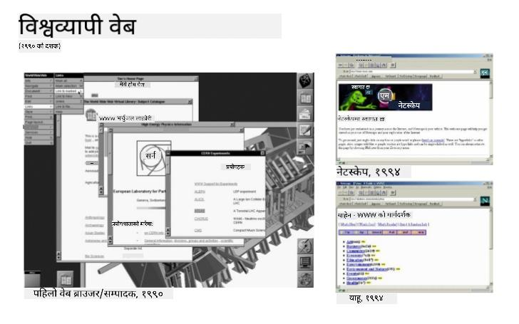
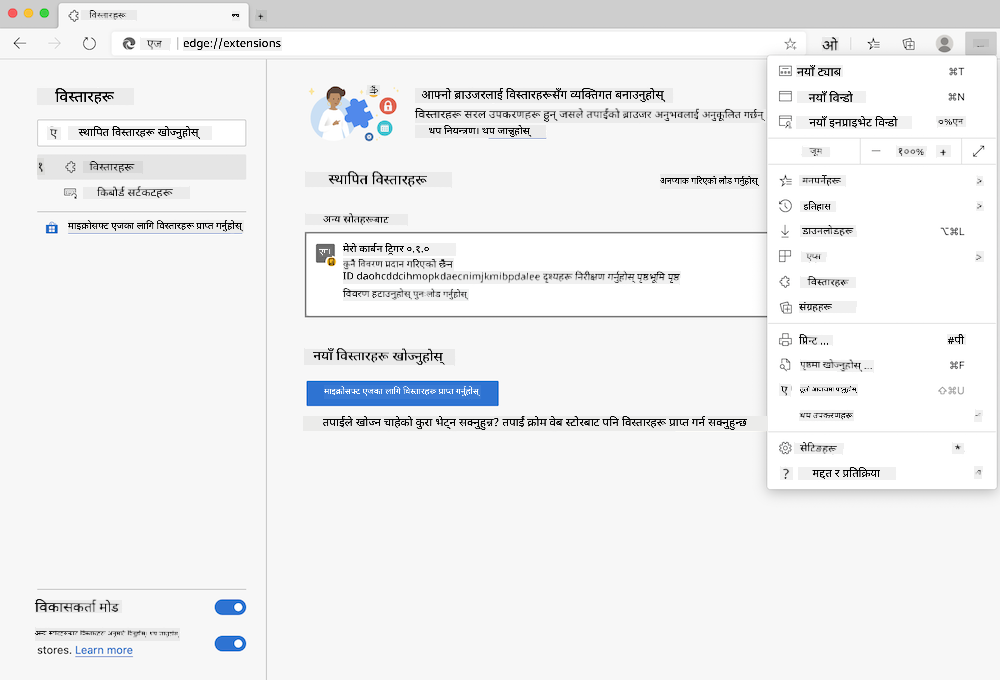
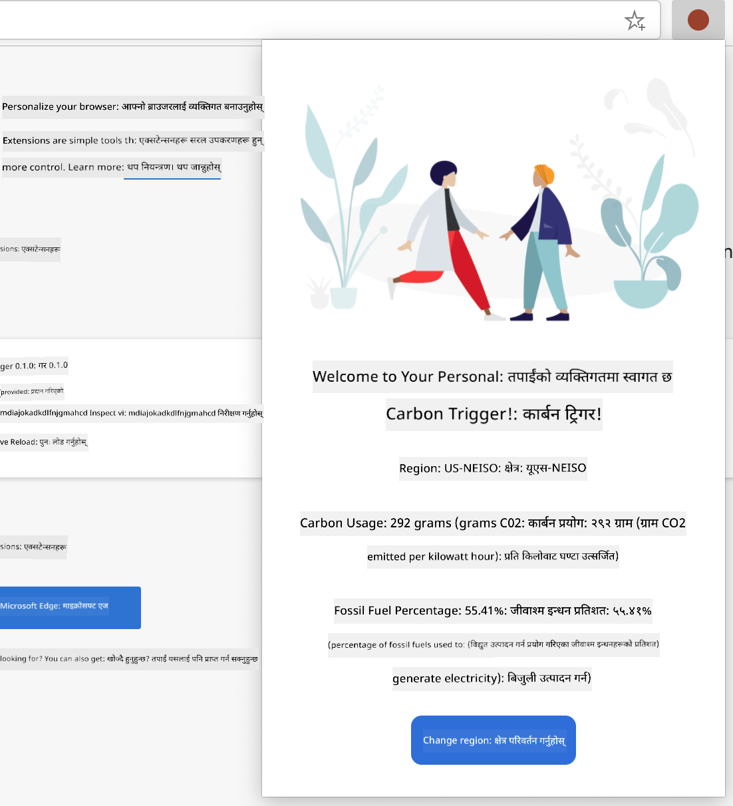

<!--
CO_OP_TRANSLATOR_METADATA:
{
  "original_hash": "0bb55e0b98600afab801eea115228873",
  "translation_date": "2025-08-25T23:39:32+00:00",
  "source_file": "5-browser-extension/1-about-browsers/README.md",
  "language_code": "ne"
}
-->
# ब्राउजर एक्सटेन्सन प्रोजेक्ट भाग १: ब्राउजरको बारेमा


> स्केच नोट [Wassim Chegham](https://dev.to/wassimchegham/ever-wondered-what-happens-when-you-type-in-a-url-in-an-address-bar-in-a-browser-3dob) द्वारा

## प्रि-लेक्चर क्विज

[प्रि-लेक्चर क्विज](https://ff-quizzes.netlify.app/web/quiz/23)

### परिचय

ब्राउजर एक्सटेन्सनले ब्राउजरमा थप कार्यक्षमता थप्छ। तर एउटा बनाउनु अघि, तपाईंले ब्राउजरले कसरी काम गर्छ भन्ने थोरै सिक्नुपर्छ।

### ब्राउजरको बारेमा

यस पाठ श्रृंखलामा, तपाईं Chrome, Firefox र Edge ब्राउजरमा काम गर्ने ब्राउजर एक्सटेन्सन बनाउन सिक्नुहुनेछ। यस भागमा, तपाईं ब्राउजरले कसरी काम गर्छ भन्ने पत्ता लगाउनुहुनेछ र ब्राउजर एक्सटेन्सनका तत्वहरू तयार गर्नुहुनेछ।

तर ब्राउजर भनेको वास्तवमा के हो? यो एउटा सफ्टवेयर एप्लिकेसन हो जसले अन्तिम प्रयोगकर्तालाई सर्भरबाट सामग्री पहुँच गर्न र वेब पृष्ठहरूमा प्रदर्शन गर्न अनुमति दिन्छ।

✅ थोरै इतिहास: पहिलो ब्राउजर 'WorldWideWeb' भनिन्थ्यो र यो Sir Timothy Berners-Lee द्वारा १९९० मा बनाइएको थियो।


> केही प्रारम्भिक ब्राउजरहरू, [Karen McGrane](https://www.slideshare.net/KMcGrane/week-4-ixd-history-personal-computing) मार्फत

जब प्रयोगकर्ताले URL (Uniform Resource Locator) ठेगाना प्रयोग गरेर इन्टरनेटमा जडान गर्छ, सामान्यतया Hypertext Transfer Protocol मार्फत `http` वा `https` ठेगाना प्रयोग गरेर, ब्राउजरले वेब सर्भरसँग संवाद गर्छ र वेब पृष्ठ ल्याउँछ।

यस बिन्दुमा, ब्राउजरको रेंडरिङ इन्जिनले यसलाई प्रयोगकर्ताको उपकरणमा प्रदर्शन गर्छ, जुन मोबाइल फोन, डेस्कटप, वा ल्यापटप हुन सक्छ।

ब्राउजरहरूले सामग्री क्यास गर्ने क्षमता पनि राख्छन् ताकि प्रत्येक पटक सर्भरबाट पुनः प्राप्त गर्न नपरोस्। तिनीहरूले प्रयोगकर्ताको ब्राउजिङ गतिविधिको इतिहास रेकर्ड गर्न, 'कुकीहरू' भण्डारण गर्न सक्छन्, जुन साना डाटा बिटहरू हुन् जसले प्रयोगकर्ताको गतिविधि भण्डारण गर्न प्रयोग गरिन्छ, र थप।

ब्राउजरहरूको बारेमा सम्झनुपर्ने एकदम महत्त्वपूर्ण कुरा भनेको तिनीहरू सबै एउटै हुँदैनन्! प्रत्येक ब्राउजरका आफ्नै बल र कमजोरीहरू छन्, र एक पेशेवर वेब डेभलपरले वेब पृष्ठहरूलाई क्रस-ब्राउजरमा राम्रो प्रदर्शन गर्न कसरी बनाउने भन्ने बुझ्नुपर्छ। यसमा मोबाइल फोनको सानो भ्यूपोर्टहरू सम्हाल्ने साथै अफलाइन प्रयोगकर्तालाई समावेश गर्दछ।

एकदम उपयोगी वेबसाइट जुन तपाईंले आफ्नो मनपर्ने ब्राउजरमा बुकमार्क गर्नुपर्छ भनेको [caniuse.com](https://www.caniuse.com) हो। जब तपाईं वेब पृष्ठहरू बनाउँदै हुनुहुन्छ, caniuse को समर्थित प्रविधिहरूको सूची प्रयोग गर्नु धेरै उपयोगी हुन्छ ताकि तपाईंले आफ्नो प्रयोगकर्ताहरूलाई राम्रोसँग समर्थन गर्न सक्नुहुन्छ।

✅ तपाईंको वेब साइटको प्रयोगकर्ता आधारमा कुन ब्राउजरहरू सबैभन्दा लोकप्रिय छन् भनेर कसरी थाहा पाउन सकिन्छ? आफ्नो एनालिटिक्स जाँच गर्नुहोस् - तपाईं आफ्नो वेब विकास प्रक्रियाको भागको रूपमा विभिन्न एनालिटिक्स प्याकेजहरू स्थापना गर्न सक्नुहुन्छ, र तिनीहरूले विभिन्न लोकप्रिय ब्राउजरहरूद्वारा सबैभन्दा धेरै प्रयोग गरिएका ब्राउजरहरू के हुन् भनेर बताउँछन्।

## ब्राउजर एक्सटेन्सनहरू

किन तपाईं ब्राउजर एक्सटेन्सन बनाउन चाहनुहुन्छ? यो ब्राउजरमा जोड्नको लागि उपयोगी कुरा हो जब तपाईं बारम्बार दोहोरिने कार्यहरूमा छिटो पहुँच चाहनुहुन्छ। उदाहरणका लागि, यदि तपाईंले आफूले अन्तरक्रिया गर्ने विभिन्न वेब पृष्ठहरूमा रंगहरू जाँच गर्न आवश्यक छ भने, तपाईंले रंग-पिकर ब्राउजर एक्सटेन्सन स्थापना गर्न सक्नुहुन्छ। यदि तपाईंलाई पासवर्ड सम्झन गाह्रो छ भने, तपाईं पासवर्ड-व्यवस्थापन ब्राउजर एक्सटेन्सन प्रयोग गर्न सक्नुहुन्छ।

ब्राउजर एक्सटेन्सनहरू विकास गर्न रमाइलो हुन्छ। तिनीहरूले सीमित संख्याका कार्यहरू व्यवस्थित गर्छन् जुन तिनीहरूले राम्रोसँग प्रदर्शन गर्छन्।

✅ तपाईंको मनपर्ने ब्राउजर एक्सटेन्सनहरू के हुन्? तिनीहरूले कुन कार्यहरू प्रदर्शन गर्छन्?

### एक्सटेन्सनहरू स्थापना गर्दै

तपाईंले निर्माण सुरु गर्नु अघि, ब्राउजर एक्सटेन्सन निर्माण र तैनातीको प्रक्रियालाई हेर्नुहोस्। प्रत्येक ब्राउजरले यो कार्य कसरी व्यवस्थापन गर्छ भन्नेमा थोरै फरक भए पनि, Chrome र Firefox मा प्रक्रिया Edge मा यो उदाहरणसँग मिल्दोजुल्दो छ:



> नोट: सुनिश्चित गर्नुहोस् कि डेभलपर मोड अन गर्नुहोस् र अन्य स्टोरहरूबाट एक्सटेन्सन अनुमति दिनुहोस्।

सारमा, प्रक्रिया यस्तो हुनेछ:

- `npm run build` प्रयोग गरेर आफ्नो एक्सटेन्सन निर्माण गर्नुहोस् 
- ब्राउजरमा "सेटिङ्स र थप" बटन (माथि दायाँमा रहेको `...` आइकन) प्रयोग गरेर एक्सटेन्सन प्यानमा नेभिगेट गर्नुहोस्
- यदि यो नयाँ स्थापना हो भने, `load unpacked` छान्नुहोस् ताकि यसको निर्माण फोल्डरबाट नयाँ एक्सटेन्सन अपलोड गर्न सकियोस् (हाम्रो केसमा यो `/dist` हो) 
- वा, यदि तपाईं पहिले नै स्थापना गरिएको एक्सटेन्सन पुनः लोड गर्दै हुनुहुन्छ भने `reload` क्लिक गर्नुहोस्

✅ यी निर्देशनहरू तपाईंले आफैंले निर्माण गरेका एक्सटेन्सनहरूका लागि हुन्; प्रत्येक ब्राउजरसँग सम्बन्धित ब्राउजर एक्सटेन्सन स्टोरमा रिलिज गरिएका एक्सटेन्सनहरू स्थापना गर्न, तपाईंले ती [स्टोरहरू](https://microsoftedge.microsoft.com/addons/Microsoft-Edge-Extensions-Home) मा नेभिगेट गर्नुपर्छ र आफ्नो रोजाइको एक्सटेन्सन स्थापना गर्नुपर्छ।

### सुरु गर्नुहोस्

तपाईं आफ्नो क्षेत्रको कार्बन फुटप्रिन्ट देखाउने ब्राउजर एक्सटेन्सन निर्माण गर्दै हुनुहुन्छ, जसले तपाईंको क्षेत्रको ऊर्जा प्रयोग र ऊर्जा स्रोत देखाउँछ। एक्सटेन्सनमा API कुञ्जी सङ्कलन गर्ने फारम हुनेछ ताकि तपाईं CO2 Signal को API पहुँच गर्न सक्नुहुन्छ।

**तपाईंलाई चाहिन्छ:**

- [एक API कुञ्जी](https://www.co2signal.com/); यस पृष्ठमा आफ्नो इमेल बक्समा प्रविष्ट गर्नुहोस् र तपाईंलाई एउटा पठाइनेछ
- [तपाईंको क्षेत्रको कोड](http://api.electricitymap.org/v3/zones) जुन [Electricity Map](https://www.electricitymap.org/map) सँग मेल खान्छ (उदाहरणका लागि, Boston मा, म 'US-NEISO' प्रयोग गर्छु।)
- [स्टार्टर कोड](../../../../5-browser-extension/start)। `start` फोल्डर डाउनलोड गर्नुहोस्; तपाईंले यस फोल्डरमा कोड पूरा गर्दै हुनुहुनेछ।
- [NPM](https://www.npmjs.com) - NPM एउटा प्याकेज व्यवस्थापन उपकरण हो; यसलाई स्थानीय रूपमा स्थापना गर्नुहोस् र तपाईंको `package.json` फाइलमा सूचीबद्ध प्याकेजहरू तपाईंको वेब सम्पत्तिमा प्रयोगको लागि स्थापना गरिनेछ।

✅ प्याकेज व्यवस्थापनको बारेमा थप जान्न यो [उत्कृष्ट Learn मोड्युल](https://docs.microsoft.com/learn/modules/create-nodejs-project-dependencies/?WT.mc_id=academic-77807-sagibbon) हेर्नुहोस्।

कोडबेस हेर्न एक मिनेट लिनुहोस्:

dist
    -|manifest.json (डिफल्टहरू यहाँ सेट गरिन्छ)
    -|index.html (फ्रन्ट-एन्ड HTML मार्कअप यहाँ)
    -|background.js (पृष्ठभूमि JS यहाँ)
    -|main.js (बन्डल गरिएको JS)
src
    -|index.js (तपाईंको JS कोड यहाँ जान्छ)

✅ एकपटक तपाईंले आफ्नो API कुञ्जी र क्षेत्र कोड तयार गर्नुभयो भने, तिनीहरूलाई भविष्यको प्रयोगको लागि नोटमा कहीं भण्डारण गर्नुहोस्।

### एक्सटेन्सनको लागि HTML निर्माण गर्नुहोस्

यस एक्सटेन्सनमा दुई दृश्यहरू छन्। एउटा API कुञ्जी र क्षेत्र कोड सङ्कलन गर्न:


र दोस्रो क्षेत्रको कार्बन प्रयोग देखाउन:



आउनुहोस् फारमको लागि HTML निर्माण गरेर CSS प्रयोग गरेर यसलाई स्टाइल गरौं।

`/dist` फोल्डरमा, तपाईंले फारम र परिणाम क्षेत्र निर्माण गर्नुहुनेछ। `index.html` फाइलमा, delineated फारम क्षेत्रलाई भर्नुहोस्:

```HTML
<form class="form-data" autocomplete="on">
	<div>
		<h2>New? Add your Information</h2>
	</div>
	<div>
		<label for="region">Region Name</label>
		<input type="text" id="region" required class="region-name" />
	</div>
	<div>
		<label for="api">Your API Key from tmrow</label>
		<input type="text" id="api" required class="api-key" />
	</div>
	<button class="search-btn">Submit</button>
</form>	
```
यो फारम हो जहाँ तपाईंको सुरक्षित जानकारी इनपुट गरिनेछ र स्थानीय भण्डारणमा सुरक्षित गरिनेछ।

अन्तिम फारम ट्याग अन्तर्गत, परिणाम क्षेत्र सिर्जना गर्नुहोस्; केही divs थप्नुहोस्:

```HTML
<div class="result">
	<div class="loading">loading...</div>
	<div class="errors"></div>
	<div class="data"></div>
	<div class="result-container">
		<p><strong>Region: </strong><span class="my-region"></span></p>
		<p><strong>Carbon Usage: </strong><span class="carbon-usage"></span></p>
		<p><strong>Fossil Fuel Percentage: </strong><span class="fossil-fuel"></span></p>
	</div>
	<button class="clear-btn">Change region</button>
</div>
```
यस बिन्दुमा, तपाईंले निर्माण प्रयास गर्न सक्नुहुन्छ। सुनिश्चित गर्नुहोस् कि यस एक्सटेन्सनको प्याकेज निर्भरताहरू स्थापना गर्नुहोस्:

```
npm install
```

यो कमाण्डले npm, Node Package Manager, प्रयोग गरेर तपाईंको एक्सटेन्सनको निर्माण प्रक्रियाको लागि webpack स्थापना गर्नेछ। तपाईं `/dist/main.js` मा हेरेर यस प्रक्रियाको आउटपुट देख्न सक्नुहुन्छ - तपाईंले देख्नुहुनेछ कि कोड बन्डल गरिएको छ।

हालको लागि, एक्सटेन्सन निर्माण गर्नुपर्छ र यदि तपाईं यसलाई Edge मा एक्सटेन्सनको रूपमा तैनाती गर्नुभयो भने, तपाईंले फारम राम्रोसँग प्रदर्शन भएको देख्नुहुनेछ।

बधाई छ, तपाईंले ब्राउजर एक्सटेन्सन निर्माणको पहिलो चरणहरू पूरा गर्नुभएको छ। आगामी पाठहरूमा, तपाईं यसलाई अझ कार्यात्मक र उपयोगी बनाउनुहुनेछ।

---

## 🚀 चुनौती

ब्राउजर एक्सटेन्सन स्टोर हेर्नुहोस् र आफ्नो ब्राउजरमा एउटा स्थापना गर्नुहोस्। तपाईंले यसको फाइलहरू रोचक तरिकामा जाँच गर्न सक्नुहुन्छ। तपाईंले के पत्ता लगाउनुहुन्छ?

## पोस्ट-लेक्चर क्विज

[पोस्ट-लेक्चर क्विज](https://ff-quizzes.netlify.app/web/quiz/24)

## समीक्षा र आत्म अध्ययन

यस पाठमा तपाईंले वेब ब्राउजरको इतिहासको बारेमा थोरै सिक्नुभयो; यस अवसरलाई वेबको आविष्कारकहरूले यसको प्रयोगको बारेमा कसरी कल्पना गरे भन्ने जान्न यसको इतिहासको बारेमा थप पढ्न प्रयोग गर्नुहोस्। केही उपयोगी साइटहरू समावेश छन्:

[वेब ब्राउजरहरूको इतिहास](https://www.mozilla.org/firefox/browsers/browser-history/)

[वेबको इतिहास](https://webfoundation.org/about/vision/history-of-the-web/)

[Tim Berners-Lee सँगको अन्तर्वार्ता](https://www.theguardian.com/technology/2019/mar/12/tim-berners-lee-on-30-years-of-the-web-if-we-dream-a-little-we-can-get-the-web-we-want)

## असाइनमेन्ट 

[तपाईंको एक्सटेन्सनलाई पुनःस्टाइल गर्नुहोस्](assignment.md)

**अस्वीकरण**:  
यो दस्तावेज़ AI अनुवाद सेवा [Co-op Translator](https://github.com/Azure/co-op-translator) प्रयोग गरी अनुवाद गरिएको हो। हामी यथासम्भव शुद्धताको प्रयास गर्छौं, तर कृपया ध्यान दिनुहोस् कि स्वचालित अनुवादमा त्रुटिहरू वा अशुद्धताहरू हुन सक्छन्। यसको मूल भाषामा रहेको मूल दस्तावेज़लाई आधिकारिक स्रोत मानिनुपर्छ। महत्वपूर्ण जानकारीका लागि, व्यावसायिक मानव अनुवाद सिफारिस गरिन्छ। यस अनुवादको प्रयोगबाट उत्पन्न हुने कुनै पनि गलतफहमी वा गलत व्याख्याका लागि हामी जिम्मेवार हुने छैनौं।