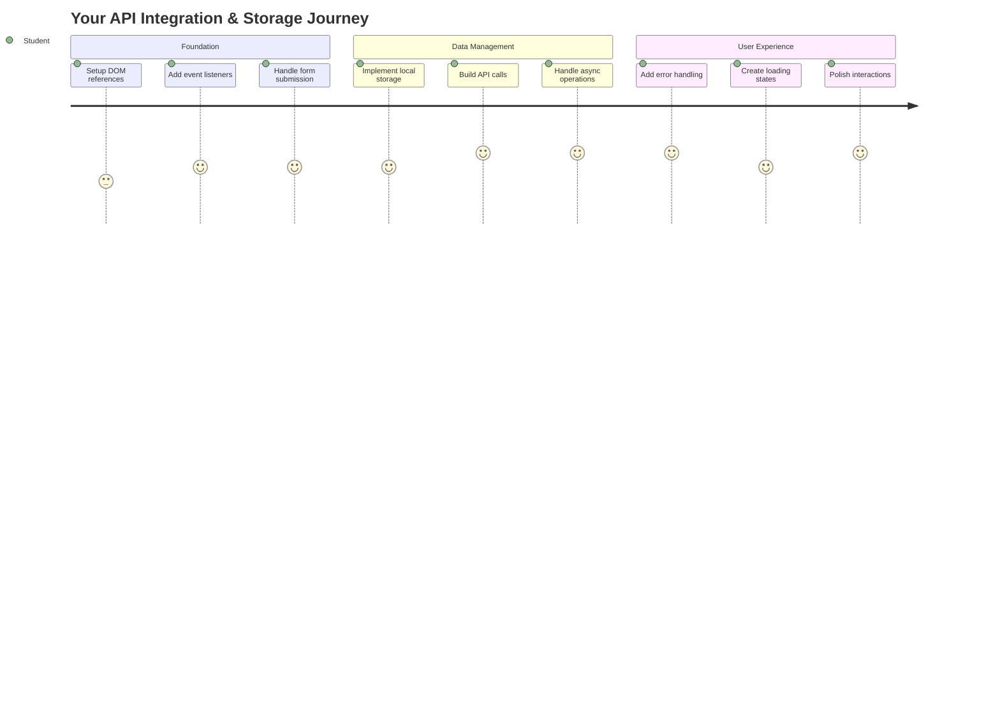
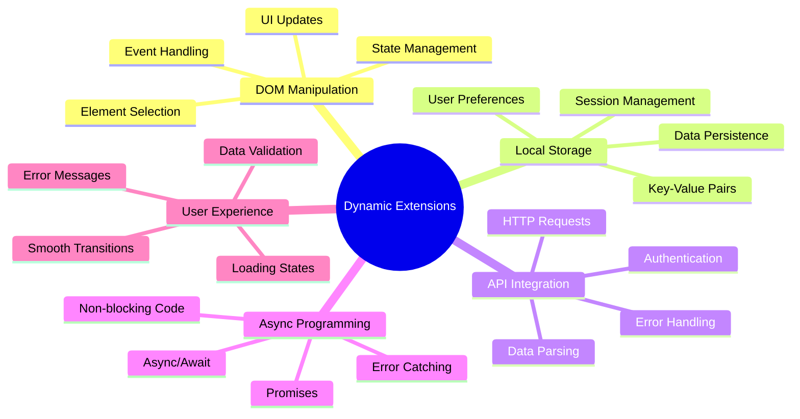
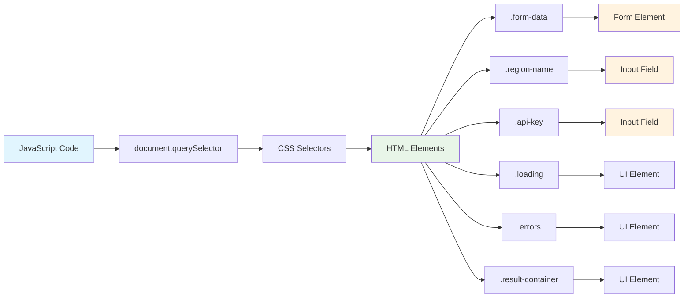
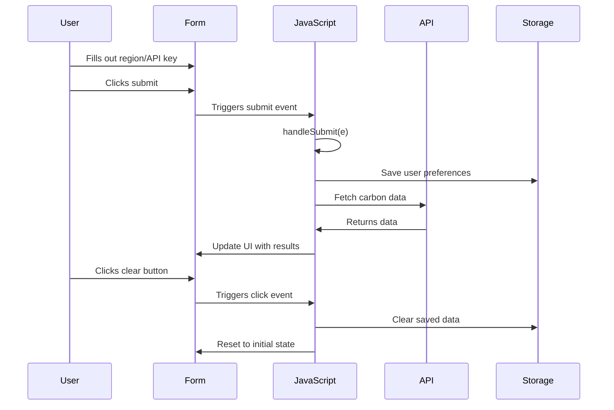
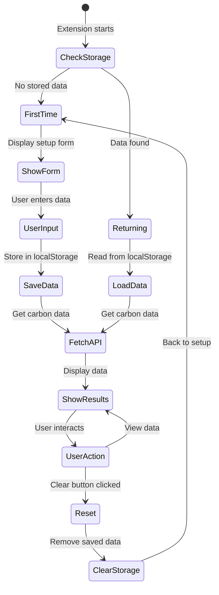
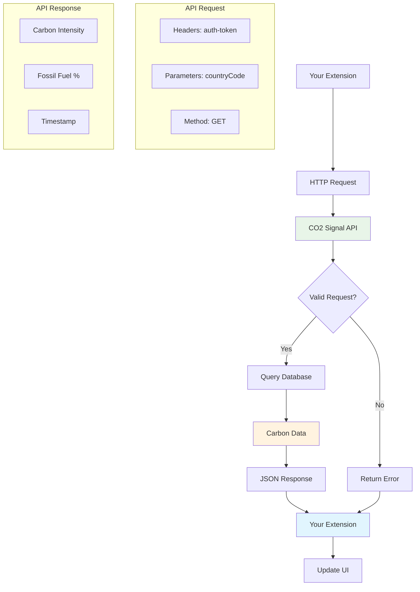
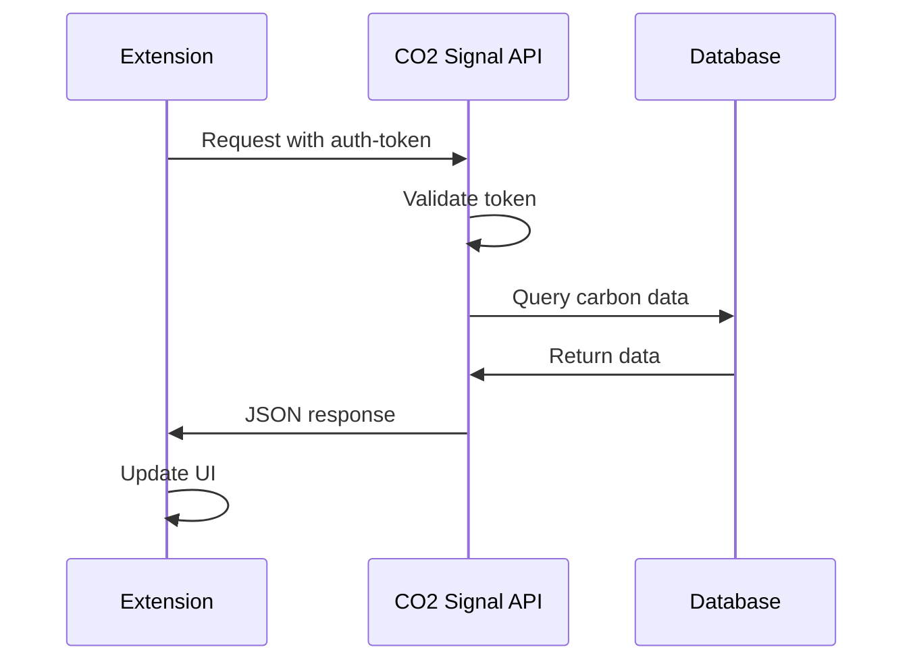
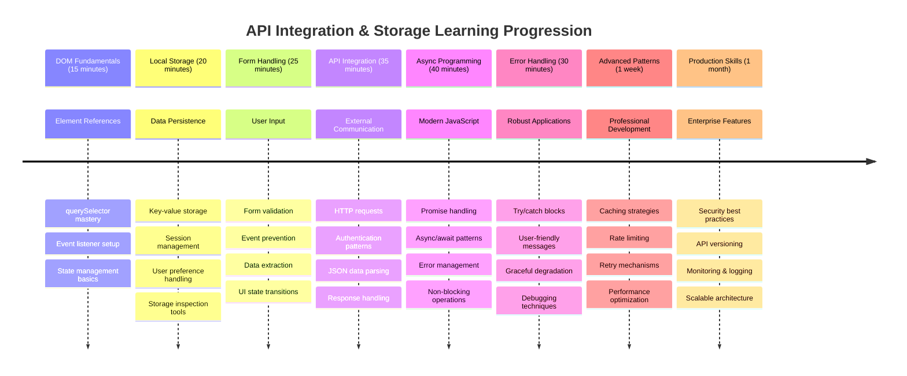

<!--
CO_OP_TRANSLATOR_METADATA:
{
  "original_hash": "2b6203a48c48d8234e0948353b47d84e",
  "translation_date": "2025-11-03T15:58:57+00:00",
  "source_file": "5-browser-extension/2-forms-browsers-local-storage/README.md",
  "language_code": "ne"
}
-->
# ब्राउजर एक्सटेन्सन प्रोजेक्ट भाग २: API कल गर्नुहोस्, लोकल स्टोरेज प्रयोग गर्नुहोस्



## प्रि-लेक्चर क्विज

[प्रि-लेक्चर क्विज](https://ff-quizzes.netlify.app/web/quiz/25)

## परिचय

तपाईंले सुरु गरेको ब्राउजर एक्सटेन्सन सम्झनुहोस्? अहिले तपाईंको फर्म राम्रो देखिन्छ, तर यो मुख्य रूपमा स्थिर छ। आज हामी यसलाई वास्तविक डाटासँग जोडेर र यसलाई मेमोरी दिनेर जीवन्त बनाउनेछौं।

अपोलो मिशन कन्ट्रोल कम्प्युटरहरूको बारेमा सोच्नुहोस् - तिनीहरूले स्थिर जानकारी मात्र देखाएनन्। तिनीहरूले लगातार अन्तरिक्ष यानसँग संवाद गरे, टेलिमेट्री डाटासँग अपडेट गरे, र महत्वपूर्ण मिशन प्यारामिटरहरू सम्झिए। आज हामी त्यस्तै गतिशील व्यवहार निर्माण गर्दैछौं। तपाईंको एक्सटेन्सनले इन्टरनेटमा पुग्नेछ, वास्तविक वातावरणीय डाटा लिनेछ, र अर्को पटकका लागि तपाईंको सेटिङहरू सम्झिनेछ।

API एकीकरण जटिल लाग्न सक्छ, तर यो वास्तवमा तपाईंको कोडलाई अन्य सेवाहरूसँग कसरी संवाद गर्ने सिकाउने कुरा हो। चाहे तपाईं मौसम डाटा, सामाजिक मिडिया फिडहरू, वा कार्बन फुटप्रिन्ट जानकारी जस्तै हामी आज गर्नेछौं, यो डिजिटल कनेक्शनहरू स्थापना गर्ने बारे हो। हामी ब्राउजरहरूले जानकारी कसरी स्थायी बनाउन सक्छन् भन्ने पनि अन्वेषण गर्नेछौं - जस्तै पुस्तकालयहरूले कार्ड क्याटलग प्रयोग गरेर पुस्तकहरू कहाँ राख्ने सम्झन्छन्।

यस पाठको अन्त्यमा, तपाईंको ब्राउजर एक्सटेन्सनले वास्तविक डाटा ल्याउनेछ, प्रयोगकर्ता प्राथमिकताहरू भण्डारण गर्नेछ, र एक सहज अनुभव प्रदान गर्नेछ। सुरु गरौं!



✅ उपयुक्त फाइलहरूमा क्रमांकित खण्डहरू अनुसरण गर्नुहोस् ताकि तपाईंको कोड कहाँ राख्ने थाहा पाउन सक्नुहोस्।

## एक्सटेन्सनमा परिवर्तन गर्नका लागि तत्वहरू सेट गर्नुहोस्

तपाईंको जाभास्क्रिप्टले इन्टरफेसलाई परिवर्तन गर्न सक्नु अघि, यसलाई विशिष्ट HTML तत्वहरूको सन्दर्भहरू आवश्यक छ। यो टेलिस्कोपलाई विशेष ताराहरूमा लक्षित गर्न आवश्यक जस्तै हो - ग्यालिलियोले बृहस्पति अध्ययन गर्नुअघि, उसले बृहस्पतिलाई पत्ता लगाउन र ध्यान केन्द्रित गर्नुपर्थ्यो।

तपाईंको `index.js` फाइलमा, हामी `const` भेरिएबलहरू सिर्जना गर्नेछौं जसले प्रत्येक महत्वपूर्ण फर्म तत्वको सन्दर्भहरू कब्जा गर्छ। यो वैज्ञानिकहरूले आफ्नो उपकरणहरू लेबल गर्ने तरिकासँग मिल्दोजुल्दो छ - प्रत्येक पटक प्रयोगशालामा खोजी गर्नुको सट्टा, उनीहरूले सीधा आवश्यक वस्तुहरू पहुँच गर्न सक्छन्।



```javascript
// form fields
const form = document.querySelector('.form-data');
const region = document.querySelector('.region-name');
const apiKey = document.querySelector('.api-key');

// results
const errors = document.querySelector('.errors');
const loading = document.querySelector('.loading');
const results = document.querySelector('.result-container');
const usage = document.querySelector('.carbon-usage');
const fossilfuel = document.querySelector('.fossil-fuel');
const myregion = document.querySelector('.my-region');
const clearBtn = document.querySelector('.clear-btn');
```

**यो कोडले के गर्छ:**
- **क्याप्चर गर्छ** फर्म तत्वहरू `document.querySelector()` प्रयोग गरेर CSS क्लास चयनकर्ताहरूको साथ
- **सिर्जना गर्छ** क्षेत्र नाम र API कुञ्जीको लागि इनपुट फिल्डहरूको सन्दर्भहरू
- **जोड्छ** कार्बन प्रयोग डाटाको लागि परिणाम प्रदर्शन तत्वहरूसँग कनेक्शन
- **सेट अप गर्छ** लोडिङ संकेतकहरू र त्रुटि सन्देशहरू जस्ता UI तत्वहरूमा पहुँच
- **भण्डारण गर्छ** प्रत्येक तत्व सन्दर्भलाई `const` भेरिएबलमा ताकि तपाईंको कोडमा सजिलै पुन: प्रयोग गर्न सकियोस्

## इभेन्ट लिसनरहरू थप्नुहोस्

अब हामी तपाईंको एक्सटेन्सनलाई प्रयोगकर्ताको क्रियाकलापहरूमा प्रतिक्रिया दिन बनाउनेछौं। इभेन्ट लिसनरहरू तपाईंको कोडको प्रयोगकर्ता अन्तरक्रियाहरू निगरानी गर्ने तरिका हो। तिनीहरू प्रारम्भिक टेलिफोन एक्सचेन्जका अपरेटरहरू जस्तै हुन् - तिनीहरूले इनकमिङ कलहरूको लागि सुने र कसैले कनेक्शन गर्न चाहँदा सही सर्किटहरू जोड्ने।



```javascript
form.addEventListener('submit', (e) => handleSubmit(e));
clearBtn.addEventListener('click', (e) => reset(e));
init();
```

**यी अवधारणाहरू बुझ्दै:**
- **जोड्छ** फर्ममा सबमिट लिसनर जसले प्रयोगकर्ताहरूले इन्टर थिच्दा वा सबमिट क्लिक गर्दा ट्रिगर गर्छ
- **कनेक्ट गर्छ** क्लियर बटनमा क्लिक लिसनर जसले फर्म रिसेट गर्न ट्रिगर गर्छ
- **पास गर्छ** इभेन्ट वस्तु `(e)` ह्यान्डलर फङ्सनहरूमा थप नियन्त्रणको लागि
- **कल गर्छ** `init()` फङ्सन तुरुन्तै ताकि तपाईंको एक्सटेन्सनको प्रारम्भिक अवस्था सेटअप होस्

✅ यहाँ प्रयोग गरिएको छोटो एरो फङ्सन सिन्ट्याक्सलाई ध्यान दिनुहोस्। यो आधुनिक जाभास्क्रिप्ट दृष्टिकोण परम्परागत फङ्सन अभिव्यक्तिहरू भन्दा सफा छ, तर दुवै समान रूपमा काम गर्छन्!

### 🔄 **शैक्षिक जाँच**
**इभेन्ट ह्यान्डलिङ बुझाइ**: इनिसियलाइजेसनमा जानु अघि सुनिश्चित गर्नुहोस् कि तपाईं:
- ✅ कसरी `addEventListener` प्रयोगकर्ता क्रियाकलापहरूलाई जाभास्क्रिप्ट फङ्सनहरूसँग जोड्छ भन्ने व्याख्या गर्न सक्नुहुन्छ
- ✅ किन हामी इभेन्ट वस्तु `(e)` ह्यान्डलर फङ्सनहरूमा पास गर्छौं भन्ने बुझ्न सक्नुहुन्छ
- ✅ `submit` र `click` इभेन्टहरू बीचको भिन्नता चिन्न सक्नुहुन्छ
- ✅ `init()` फङ्सन कहिले चल्छ र किन भन्ने वर्णन गर्न सक्नुहुन्छ

**छोटो आत्म-परीक्षण**: यदि तपाईंले फर्म सबमिशनमा `e.preventDefault()` बिर्सनुभयो भने के हुन्छ?
*उत्तर: पृष्ठ पुनः लोड हुनेछ, सबै जाभास्क्रिप्ट अवस्था हराउनेछ र प्रयोगकर्ता अनुभवलाई बाधा पुर्‍याउनेछ*

## इनिसियलाइजेसन र रिसेट फङ्सनहरू निर्माण गर्नुहोस्

अब तपाईंको एक्सटेन्सनको इनिसियलाइजेसन तर्क सिर्जना गरौं। `init()` फङ्सन जहाजको नेभिगेसन प्रणाली जस्तै हो जसले यसको उपकरणहरू जाँच्छ - यसले वर्तमान अवस्था निर्धारण गर्छ र इन्टरफेसलाई त्यस अनुसार समायोजन गर्छ। यसले कसैले पहिले तपाईंको एक्सटेन्सन प्रयोग गरेको छ कि छैन जाँच्छ र तिनीहरूको अघिल्लो सेटिङहरू लोड गर्छ।

`reset()` फङ्सनले प्रयोगकर्ताहरूलाई नयाँ सुरुवात प्रदान गर्दछ - जस्तै वैज्ञानिकहरूले आफ्नो उपकरणहरू सफा डाटाको सुनिश्चित गर्न प्रयोगहरू बीच रिसेट गर्छन्।

```javascript
function init() {
	// Check if user has previously saved API credentials
	const storedApiKey = localStorage.getItem('apiKey');
	const storedRegion = localStorage.getItem('regionName');

	// Set extension icon to generic green (placeholder for future lesson)
	// TODO: Implement icon update in next lesson

	if (storedApiKey === null || storedRegion === null) {
		// First-time user: show the setup form
		form.style.display = 'block';
		results.style.display = 'none';
		loading.style.display = 'none';
		clearBtn.style.display = 'none';
		errors.textContent = '';
	} else {
		// Returning user: load their saved data automatically
		displayCarbonUsage(storedApiKey, storedRegion);
		results.style.display = 'none';
		form.style.display = 'none';
		clearBtn.style.display = 'block';
	}
}

function reset(e) {
	e.preventDefault();
	// Clear stored region to allow user to choose a new location
	localStorage.removeItem('regionName');
	// Restart the initialization process
	init();
}
```

**यहाँ के हुन्छ भन्ने कुरा तोड्दै:**
- **पुनः प्राप्त गर्छ** ब्राउजरको लोकल स्टोरेजबाट भण्डारण गरिएको API कुञ्जी र क्षेत्र
- **जाँच्छ** यो पहिलो पटक प्रयोगकर्ता हो (कुनै भण्डारण गरिएको प्रमाणपत्र छैन) वा फर्कने प्रयोगकर्ता
- **देखाउँछ** नयाँ प्रयोगकर्ताहरूको लागि सेटअप फर्म र अन्य इन्टरफेस तत्वहरू लुकाउँछ
- **स्वचालित रूपमा लोड गर्छ** फर्कने प्रयोगकर्ताहरूको लागि बचत गरिएको डाटा र रिसेट विकल्प देखाउँछ
- **प्रबन्ध गर्छ** उपलब्ध डाटाको आधारमा प्रयोगकर्ता इन्टरफेस अवस्था

**लोकल स्टोरेजको बारेमा मुख्य अवधारणाहरू:**
- **स्थायी बनाउँछ** ब्राउजर सत्रहरू बीच डाटा (सेसन स्टोरेजको विपरीत)
- **भण्डारण गर्छ** `getItem()` र `setItem()` प्रयोग गरेर की-वैल्यू जोडीहरूमा डाटा
- **फर्काउँछ** `null` जब कुनै डाटा दिइएको कीको लागि अवस्थित छैन
- **सजिलो बनाउँछ** प्रयोगकर्ता प्राथमिकताहरू र सेटिङहरू सम्झन

> 💡 **ब्राउजर स्टोरेज बुझाइ**: [LocalStorage](https://developer.mozilla.org/docs/Web/API/Window/localStorage) तपाईंको एक्सटेन्सनलाई स्थायी मेमोरी दिने जस्तै हो। प्राचीन अलेक्जेन्ड्रिया पुस्तकालयले स्क्रोलहरू भण्डारण गरेको जस्तै - जानकारी उपलब्ध रहन्थ्यो जब विद्वानहरू गएर फर्कन्थे।
>
> **मुख्य विशेषताहरू:**
> - **स्थायी बनाउँछ** डाटा तपाईंको ब्राउजर बन्द गरेपछि पनि
> - **बाँच्छ** कम्प्युटर पुनः सुरु र ब्राउजर क्र्यासहरू
> - **प्रदान गर्छ** प्रयोगकर्ता प्राथमिकताहरूको लागि पर्याप्त भण्डारण स्थान
> - **तत्काल पहुँच दिन्छ** नेटवर्क ढिलाइ बिना

> **महत्वपूर्ण नोट**: तपाईंको ब्राउजर एक्सटेन्सनको आफ्नै अलग लोकल स्टोरेज छ जुन नियमित वेब पृष्ठहरूबाट अलग छ। यसले सुरक्षा प्रदान गर्छ र अन्य वेबसाइटहरूसँग द्वन्द्व रोक्छ।

तपाईं आफ्नो भण्डारण गरिएको डाटा ब्राउजर डेभलपर टूल्स (F12) खोल्दै, **Application** ट्याबमा नेभिगेट गर्दै, र **Local Storage** सेक्सन विस्तार गरेर हेर्न सक्नुहुन्छ।




> ⚠️ **सुरक्षा विचार**: उत्पादन अनुप्रयोगहरूमा, लोकल स्टोरेजमा API कुञ्जीहरू भण्डारण गर्दा सुरक्षा जोखिमहरू हुन्छन् किनभने जाभास्क्रिप्टले यो डाटामा पहुँच गर्न सक्छ। सिक्ने उद्देश्यका लागि, यो दृष्टिकोण ठीक छ, तर वास्तविक अनुप्रयोगहरूले संवेदनशील प्रमाणपत्रहरूको लागि सुरक्षित सर्भर-साइड स्टोरेज प्रयोग गर्नुपर्छ।

## फर्म सबमिशन ह्यान्डल गर्नुहोस्

अब हामी कसैले तपाईंको फर्म सबमिट गर्दा के हुन्छ भन्ने ह्यान्डल गर्नेछौं। डिफल्ट रूपमा, ब्राउजरहरूले फर्म सबमिट गर्दा पृष्ठ पुनः लोड गर्छन्, तर हामी यो व्यवहारलाई रोक्नेछौं ताकि एक सहज अनुभव सिर्जना गर्न सकियोस्।

यो दृष्टिकोण मिशन कन्ट्रोलले अन्तरिक्ष यान संचार ह्यान्डल गर्ने तरिकासँग मेल खान्छ - प्रत्येक ट्रान्समिशनको लागि सम्पूर्ण प्रणाली रिसेट गर्नुको सट्टा, तिनीहरूले नयाँ जानकारी प्रशोधन गर्दा निरन्तर सञ्चालन कायम राख्छन्।

फर्म सबमिशन इभेन्टलाई क्याप्चर गर्ने र प्रयोगकर्ताको इनपुट निकाल्ने फङ्सन सिर्जना गर्नुहोस्:

```javascript
function handleSubmit(e) {
	e.preventDefault();
	setUpUser(apiKey.value, region.value);
}
```

**माथिको कोडमा:**
- **रोक्छ** डिफल्ट फर्म सबमिशन व्यवहार जसले पृष्ठलाई रिफ्रेस गर्नेछ
- **निकाल्छ** प्रयोगकर्ताको इनपुट मानहरू API कुञ्जी र क्षेत्र फिल्डहरूबाट
- **पास गर्छ** फर्म डाटालाई `setUpUser()` फङ्सनमा प्रशोधनको लागि
- **राख्छ** पृष्ठ रिफ्रेस नगरी सिंगल-पेज एप्लिकेसन व्यवहार

✅ याद गर्नुहोस् कि तपाईंको HTML फर्म फिल्डहरूमा `required` एट्रिब्युट समावेश छ, त्यसैले ब्राउजरले स्वतः मान्य गर्दछ कि प्रयोगकर्ताहरूले यो फङ्सन चल्नु अघि API कुञ्जी र क्षेत्र दुवै प्रदान गरेका छन्।

## प्रयोगकर्ता प्राथमिकताहरू सेट गर्नुहोस्

`setUpUser` फङ्सन प्रयोगकर्ताको प्रमाणपत्रहरू बचत गर्ने र पहिलो API कल सुरु गर्ने जिम्मेवार छ। यसले सेटअपबाट परिणामहरू प्रदर्शन गर्न सहज संक्रमण सिर्जना गर्छ।

```javascript
function setUpUser(apiKey, regionName) {
	// Save user credentials for future sessions
	localStorage.setItem('apiKey', apiKey);
	localStorage.setItem('regionName', regionName);
	
	// Update UI to show loading state
	loading.style.display = 'block';
	errors.textContent = '';
	clearBtn.style.display = 'block';
	
	// Fetch carbon usage data with user's credentials
	displayCarbonUsage(apiKey, regionName);
}
```

**चरणबद्ध रूपमा, यहाँ के हुन्छ:**
- **बचत गर्छ** API कुञ्जी र क्षेत्र नामलाई भविष्यको प्रयोगको लागि लोकल स्टोरेजमा
- **देखाउँछ** लोडिङ संकेतक ताकि प्रयोगकर्ताहरूलाई जानकारी दिइयो कि डाटा ल्याइँदैछ
- **सफा गर्छ** प्रदर्शनबाट कुनै पनि अघिल्लो त्रुटि सन्देशहरू
- **देखाउँछ** क्लियर बटन ताकि प्रयोगकर्ताहरूले पछि आफ्नो सेटिङहरू रिसेट गर्न सकून्
- **सुरु गर्छ** API कल ताकि वास्तविक कार्बन प्रयोग डाटा ल्याउन सकियोस्

यो फङ्सनले डाटा स्थायित्व र प्रयोगकर्ता इन्टरफेस अपडेटहरूलाई एक समन्वित कार्यमा व्यवस्थापन गरेर एक सहज प्रयोगकर्ता अनुभव सिर्जना गर्छ।

## कार्बन प्रयोग डाटा प्रदर्शन गर्नुहोस्

अब हामी तपाईंको एक्सटेन्सनलाई API मार्फत बाह्य डाटा स्रोतहरूसँग जोड्नेछौं। यसले तपाईंको एक्सटेन्सनलाई एक स्वतन्त्र उपकरणबाट इन्टरनेटभरि वास्तविक-समय जानकारी पहुँच गर्न सक्ने चीजमा रूपान्तरण गर्छ।

**API बुझाइ**

[APIs](https://www.webopedia.com/TERM/A/API.html) विभिन्न अनुप्रयोगहरूले एकअर्कासँग कसरी संवाद गर्छन् भन्ने तरिका हो। तिनीहरू १९ औं शताब्दीमा टेलिग्राफ प्रणाली जस्तै हुन् जसले टाढा शहरहरूलाई जोड्थ्यो - अपरेटरहरूले टाढा स्टेशनहरूमा अनुरोध पठाउँथे र अनुरोधित जानकारीको साथ प्रतिक्रिया प्राप्त गर्थे। जब तपाईं सामाजिक मिडिया जाँच गर्नुहुन्छ, भ्वाइस असिस्टेन्टलाई प्रश्न सोध्नुहुन्छ, वा डेलिभरी एप प्रयोग गर्नुहुन्छ, APIहरूले यी डाटा एक्सचेन्जहरूलाई सहज बनाइरहेका छन्।



**REST APIहरूको बारेमा मुख्य अवधारणाहरू:**
- **REST** को अर्थ 'Representational State Transfer' हो
- **प्रयोग गर्छ** मानक HTTP विधिहरू (GET, POST, PUT, DELETE) डाटासँग अन्तरक्रिया गर्न
- **फर्काउँछ** डाटा पूर्वानुमान योग्य ढाँचाहरूमा, सामान्यतया JSON
- **प्रदान गर्छ** विभिन्न प्रकारका अनुरोधहरूको लागि स्थिर, URL-आधारित अन्त बिन्दुहरू

✅ [CO2 Signal API](https://www.co2signal.com/) हामीले प्रयोग गर्ने वास्तविक-समय कार्बन तीव्रता डाटा विश्वव्यापी विद्युत ग्रिडहरूबाट प्रदान गर्छ। यसले प्रयोगकर्ताहरूलाई उनीहरूको बिजुली प्रयोगको वातावरणीय प्रभाव बुझ्न मद्दत गर्छ!

> 💡 **असिन्क्रोनस जाभास्क्रिप्ट बुझाइ**: [`async` कीवर्ड](https://developer.mozilla.org/docs/Web/JavaScript/Reference/Statements/async_function) तपाईंको कोडलाई एकै समयमा धेरै अपरेसनहरू ह्यान्डल गर्न सक्षम बनाउँछ। जब तपाईं सर्भरबाट डाटा अनुरोध गर्नुहुन्छ, तपाईं आफ्नो सम्पूर्ण एक्सटेन्सनलाई फ्रिज गर्न चाहनुहुन्न - यो हवाई यातायात नियन्त्रणले एक विमानको प्रतिक्रिया पर्खँदा सबै अपरेसनहरू रोक्ने जस्तै हुनेछ।
>
> **मुख्य फाइदाहरू:**
> - **राख्छ** डाटा लोड हुँदा एक्सटेन्सनको प्रतिक्रियाशीलता
> - **अनुमति दिन्छ** अन्य कोड नेटवर्क अनुरोधहरू चल्दा कार्यान्वयन गर्न
> - **सुधार गर्छ** परम्परागत कलब्याक ढाँचाहरूको तुलनामा कोड पढ्न सजिलो बनाउँछ
> - **सक्षम बनाउँछ** नेटवर्क समस्याहरूको लागि ग्रेसफुल त्रुटि ह्यान्डलिङ

यहाँ `async` को बारेमा छिटो भिडियो छ:

[](https://youtube.com/watch?v=YwmlRkrxvkk "Async र Await प्रबन्ध गर्न")

> 🎥 माथिको छवि क्लिक गरेर async/await को बारेमा भिडियो हेर्नुहोस्।

### 🔄 **शैक्षिक जाँच**
**असिन्क्रोनस प्रोग्रामिङ बुझाइ**: API फङ्सनमा जानु अघि सुनिश्चित गर्नुहोस् कि तपाईं बुझ्नुहुन्छ:
- ✅ किन हामी `async/await` प्रयोग गर्छौं सम्पूर्ण एक्सटेन्सनलाई फ्रिज नगरी
- ✅ कसरी `try/catch` ब्लकहरूले नेटवर्क त्रुटिहरूलाई ग्रेसफुली ह्यान्डल गर्छन्
- ✅ सिन्क्रोनस र असिन्क्रोनस अपरेसनहरू बीचको भिन्नता
- ✅ किन API कलहरू असफल हुन सक्छन् र ती असफलताहरूलाई कसरी ह्यान्डल गर्ने

**वास्तविक-विश्व जडान**: यी दैनिक असिन्क्रोनस उदाहरणहरू विचार गर्नुहोस्:
- **खाना अर्डर गर्नुहोस्**: तपाईं भान्सामा पर्खनुहुन्न - तपाईंले रसीद पाउनुहुन्छ र अन्य गतिविधिहरू जारी राख्नुहुन्छ
- **इमेल पठाउनुहोस्**: तपाईंको इमेल एप पठाउँदा फ्रिज हुँदैन - तपाईं थप इमेलहरू लेख्न सक्नुहुन्छ
- **वेब पृष्ठहरू लोड गर्दै**: छविहरू क्रमिक रूपमा लोड हुन्छन् जबकि तपाईं पहिले नै पाठ पढ्न सक्नुहुन्छ

**API प्रमाणिकरण प्रवाह**:


कार्बन प्रयोग डाटा ल्याउन र प्रदर्शन गर्न फङ्सन सिर्जना गर्नुहोस्:

```javascript
// Modern fetch API approach (no external dependencies needed)
async function displayCarbonUsage(apiKey, region) {
	try {
		// Fetch carbon intensity data from CO2 Signal API
		const response = await fetch('https://api.co2signal.com/v1/latest', {
			method: 'GET',
			headers: {
				'auth-token': apiKey,
				'Content-Type': 'application/json'
			},
			// Add query parameters for the specific region
			...new URLSearchParams({ countryCode: region }) && {
				url: `https://api.co2signal.com/v1/latest?countryCode=${region}`
			}
		});

		// Check if the API request was successful
		if (!response.ok) {
			throw new Error(`API request failed: ${response.status}`);
		}

		const data = await response.json();
		const carbonData = data.data;

		// Calculate rounded carbon intensity value
		const carbonIntensity = Math.round(carbonData.carbonIntensity);

		// Update the user interface with fetched data
		loading.style.display = 'none';
		form.style.display = 'none';
		myregion.textContent = region.toUpperCase();
		usage.textContent = `${carbonIntensity} grams (grams CO₂ emitted per kilowatt hour)`;
		fossilfuel.textContent = `${carbonData.fossilFuelPercentage.toFixed(2)}% (percentage of fossil fuels used to generate electricity)`;
		results.style.display = 'block';

		// TODO: calculateColor(carbonIntensity) - implement in next lesson

	} catch (error) {
		console.error('Error fetching carbon data:', error);
		
		// Show user-friendly error message
		loading.style.display = 'none';
		results.style.display = 'none';
		errors.textContent = 'Sorry, we couldn\'t fetch data for that region. Please check your API key and region code.';
	}
}
```

**यहाँ के हुन्छ भन्ने कुरा तोड्दै:**
- **प्रयोग गर्छ** आधुनिक `fetch()` API बाह्य पुस्तकालयहरू जस्तै Axios प्रयोग नगरी सफा, निर्भरता-रहित कोडको लागि
- **सही त्रुटि जाँच लागू गर्छ** `response.ok` को साथ ताकि API असफलताहरूलाई चाँडै पत्ता लगाउन सकियोस्
- **ह्यान्डल गर्छ** असिन्क्रोनस अपरेसनहरू `async/await` को साथ ताकि कोड फ्लो पढ्न सजिलो होस्
- **प्रमाणिकरण गर्छ** CO2 Signal APIसँग `auth-token` हेडर प्रयोग गरेर
- **पार्स गर्छ** JSON प्रतिक्रिया ड
**विवरण:** ब्राउजर एक्सटेन्सनलाई सुधार गरेर त्रुटि व्यवस्थापन सुधार र प्रयोगकर्ता अनुभव सुविधाहरू थप्नुहोस्। यो चुनौतीले तपाईंलाई API, स्थानीय भण्डारण, र आधुनिक जाभास्क्रिप्ट ढाँचाहरू प्रयोग गरेर DOM म्यानिपुलेशनमा अभ्यास गर्न मद्दत गर्नेछ।

**प्रेरणा:** displayCarbonUsage फङ्सनको सुधारिएको संस्करण बनाउनुहोस् जसमा समावेश होस्: १) असफल API कलहरूको लागि पुन: प्रयास गर्ने मेकानिजम (exponential backoff सहित), २) API कल गर्नु अघि क्षेत्र कोडको इनपुट मान्यता, ३) प्रगति सूचकसहितको लोडिङ एनिमेसन, ४) स्थानीय भण्डारणमा API प्रतिक्रियाहरूको क्यासिङ (३० मिनेटको लागि क्यास), र ५) अघिल्लो API कलहरूको ऐतिहासिक डाटा देखाउने सुविधा। साथै, सबै फङ्सन प्यारामिटरहरू र रिटर्न प्रकारहरूलाई दस्तावेज गर्न TypeScript शैलीको JSDoc टिप्पणीहरू थप्नुहोस्।

[agent mode](https://code.visualstudio.com/blogs/2025/02/24/introducing-copilot-agent-mode) को बारेमा थप जान्नुहोस्।

## 🚀 चुनौती

API को ज्ञान विस्तार गर्न ब्राउजर-आधारित APIहरूको विविधता अन्वेषण गर्नुहोस्। यी ब्राउजर API मध्ये एक छान्नुहोस् र सानो डेमो बनाउनुहोस्:

- [Geolocation API](https://developer.mozilla.org/docs/Web/API/Geolocation_API) - प्रयोगकर्ताको हालको स्थान प्राप्त गर्नुहोस्
- [Notification API](https://developer.mozilla.org/docs/Web/API/Notifications_API) - डेस्कटप सूचनाहरू पठाउनुहोस्
- [HTML Drag and Drop API](https://developer.mozilla.org/docs/Web/API/HTML_Drag_and_Drop_API) - अन्तरक्रियात्मक ड्र्याग इन्टरफेस बनाउनुहोस्
- [Web Storage API](https://developer.mozilla.org/docs/Web/API/Web_Storage_API) - स्थानीय भण्डारण प्रविधिहरूको उन्नत प्रयोग
- [Fetch API](https://developer.mozilla.org/docs/Web/API/Fetch_API) - XMLHttpRequest को आधुनिक विकल्प

**अनुसन्धानका प्रश्नहरू विचार गर्न:**  
- यो API ले कुन वास्तविक समस्याहरू समाधान गर्छ?  
- API ले त्रुटिहरू र किनाराका केसहरू कसरी व्यवस्थापन गर्छ?  
- यो API प्रयोग गर्दा सुरक्षा सम्बन्धी के विचारहरू छन्?  
- विभिन्न ब्राउजरहरूमा यो API कति व्यापक रूपमा समर्थित छ?  

अनुसन्धानपछि, कुन विशेषताहरूले API लाई विकासकर्ता-अनुकूल र भरपर्दो बनाउँछ भनेर पहिचान गर्नुहोस्।

## पोस्ट-व्याख्यान क्विज

[पोस्ट-व्याख्यान क्विज](https://ff-quizzes.netlify.app/web/quiz/26)

## समीक्षा र आत्म-अध्ययन

यस पाठमा तपाईंले LocalStorage र APIहरूको बारेमा सिक्नुभयो, जुन व्यावसायिक वेब विकासकर्ताका लागि धेरै उपयोगी छन्। के तपाईं यी दुई चीजहरू कसरी सँगै काम गर्छन् भनेर सोच्न सक्नुहुन्छ? वेबसाइटको वास्तुकला कसरी बनाउने भनेर सोच्नुहोस् जसले API द्वारा प्रयोग गरिने वस्तुहरू भण्डारण गर्छ।

### ⚡ **अगाडि ५ मिनेटमा तपाईंले गर्न सक्ने कुरा**
- [ ] DevTools को Application ट्याब खोल्नुहोस् र कुनै पनि वेबसाइटमा localStorage अन्वेषण गर्नुहोस्  
- [ ] साधारण HTML फारम बनाउनुहोस् र ब्राउजरमा फारम मान्यता परीक्षण गर्नुहोस्  
- [ ] ब्राउजर कन्सोलमा localStorage प्रयोग गरेर डाटा भण्डारण र पुन: प्राप्ति प्रयास गर्नुहोस्  
- [ ] Network ट्याब प्रयोग गरेर फारम डाटा पेश गरिएको निरीक्षण गर्नुहोस्  

### 🎯 **अगाडि एक घण्टामा तपाईंले गर्न सक्ने कुरा**
- [ ] पोस्ट-पाठ क्विज पूरा गर्नुहोस् र फारम ह्यान्डलिङ अवधारणाहरू बुझ्नुहोस्  
- [ ] प्रयोगकर्ता प्राथमिकताहरू बचत गर्ने ब्राउजर एक्सटेन्सन फारम बनाउनुहोस्  
- [ ] सहायक त्रुटि सन्देशहरू सहित क्लाइन्ट-साइड फारम मान्यता कार्यान्वयन गर्नुहोस्  
- [ ] एक्सटेन्सन डाटा स्थायित्वको लागि chrome.storage API प्रयोग अभ्यास गर्नुहोस्  
- [ ] बचत गरिएका प्रयोगकर्ता सेटिङहरूमा प्रतिक्रिया दिने प्रयोगकर्ता इन्टरफेस बनाउनुहोस्  

### 📅 **तपाईंको हप्ताको एक्सटेन्सन निर्माण**
- [ ] फारम कार्यक्षमतासहित पूर्ण-विशेषता ब्राउजर एक्सटेन्सन पूरा गर्नुहोस्  
- [ ] विभिन्न भण्डारण विकल्पहरूमा महारत हासिल गर्नुहोस्: स्थानीय, सिंक, र सत्र भण्डारण  
- [ ] उन्नत फारम सुविधाहरू जस्तै autocomplete र मान्यता कार्यान्वयन गर्नुहोस्  
- [ ] प्रयोगकर्ता डाटाको लागि आयात/निर्यात कार्यक्षमता थप्नुहोस्  
- [ ] विभिन्न ब्राउजरहरूमा तपाईंको एक्सटेन्सनलाई राम्रोसँग परीक्षण गर्नुहोस्  
- [ ] तपाईंको एक्सटेन्सनको प्रयोगकर्ता अनुभव र त्रुटि व्यवस्थापनलाई सुधार गर्नुहोस्  

### 🌟 **तपाईंको महिनाको वेब API महारत**
- [ ] विभिन्न ब्राउजर भण्डारण APIहरू प्रयोग गरेर जटिल एप्लिकेसनहरू निर्माण गर्नुहोस्  
- [ ] अफलाइन-प्रथम विकास ढाँचाहरूको बारेमा जान्नुहोस्  
- [ ] डाटा स्थायित्व समावेश गर्ने ओपन सोर्स प्रोजेक्टहरूमा योगदान गर्नुहोस्  
- [ ] गोपनीयता-केंद्रित विकास र GDPR अनुपालनमा महारत हासिल गर्नुहोस्  
- [ ] फारम ह्यान्डलिङ र डाटा व्यवस्थापनका लागि पुन: प्रयोग गर्न मिल्ने लाइब्रेरीहरू बनाउनुहोस्  
- [ ] वेब API र एक्सटेन्सन विकासको बारेमा ज्ञान साझा गर्नुहोस्  

## 🎯 तपाईंको एक्सटेन्सन विकास महारतको समयरेखा


  
### 🛠️ तपाईंको पूर्ण-स्ट्याक विकास उपकरणको सारांश

यस पाठ पूरा गरेपछि, तपाईंसँग अब छ:  
- **DOM महारत**: सटीक तत्व लक्ष्यीकरण र म्यानिपुलेशन  
- **भण्डारण विशेषज्ञता**: localStorage द्वारा स्थायी डाटा व्यवस्थापन  
- **API एकीकरण**: वास्तविक-समय डाटा फेचिङ र प्रमाणीकरण  
- **Async प्रोग्रामिङ**: आधुनिक जाभास्क्रिप्टसँग गैर-अवरोधक अपरेशनहरू  
- **त्रुटि व्यवस्थापन**: असफलताहरूलाई सुन्दर रूपमा व्यवस्थापन गर्ने बलियो एप्लिकेसनहरू  
- **प्रयोगकर्ता अनुभव**: लोडिङ अवस्था, मान्यता, र सहज अन्तरक्रिया  
- **आधुनिक ढाँचाहरू**: fetch API, async/await, र ES6+ सुविधाहरू  

**व्यावसायिक सीपहरू प्राप्त गरियो**: तपाईंले यी ढाँचाहरू कार्यान्वयन गर्नुभयो:  
- **वेब एप्लिकेसनहरू**: बाह्य डाटा स्रोतहरूसहितको एकल-पृष्ठ एप्स  
- **मोबाइल विकास**: API-चालित एप्स अफलाइन क्षमतासहित  
- **डेस्कटप सफ्टवेयर**: स्थानीय भण्डारणसहितको Electron एप्स  
- **उद्यम प्रणालीहरू**: प्रमाणीकरण, क्यासिङ, र त्रुटि व्यवस्थापन  
- **आधुनिक फ्रेमवर्कहरू**: React/Vue/Angular डाटा व्यवस्थापन ढाँचाहरू  

**अर्को स्तर**: तपाईं क्यासिङ रणनीतिहरू, वास्तविक-समय WebSocket कनेक्शनहरू, वा जटिल राज्य व्यवस्थापन जस्ता उन्नत विषयहरू अन्वेषण गर्न तयार हुनुहुन्छ!

## असाइनमेन्ट

[एक API अपनाउनुहोस्](assignment.md)  

---

**अस्वीकरण**:  
यो दस्तावेज़ AI अनुवाद सेवा [Co-op Translator](https://github.com/Azure/co-op-translator) प्रयोग गरेर अनुवाद गरिएको छ। हामी शुद्धताको लागि प्रयास गर्छौं, तर कृपया ध्यान दिनुहोस् कि स्वचालित अनुवादहरूमा त्रुटिहरू वा अशुद्धताहरू हुन सक्छ। यसको मूल भाषा मा रहेको मूल दस्तावेज़लाई आधिकारिक स्रोत मानिनुपर्छ। महत्वपूर्ण जानकारीको लागि, व्यावसायिक मानव अनुवाद सिफारिस गरिन्छ। यस अनुवादको प्रयोगबाट उत्पन्न हुने कुनै पनि गलतफहमी वा गलत व्याख्याको लागि हामी जिम्मेवार हुने छैनौं।