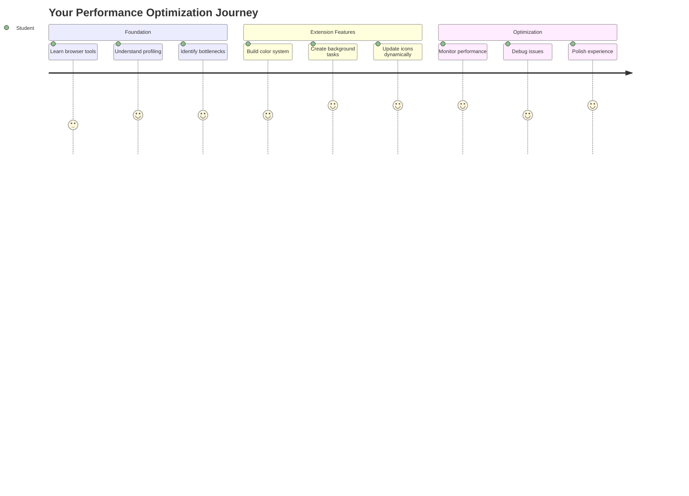
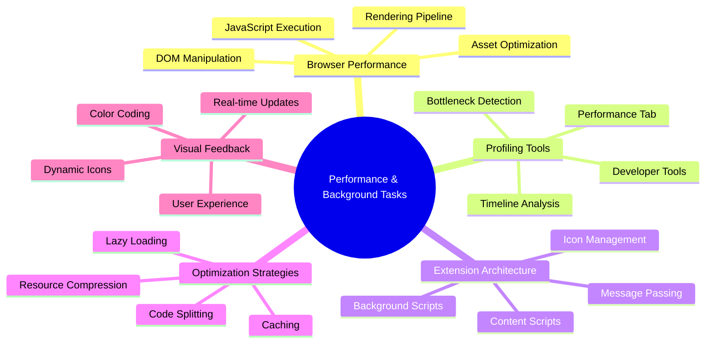
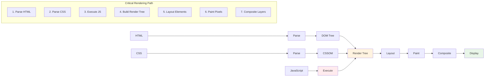
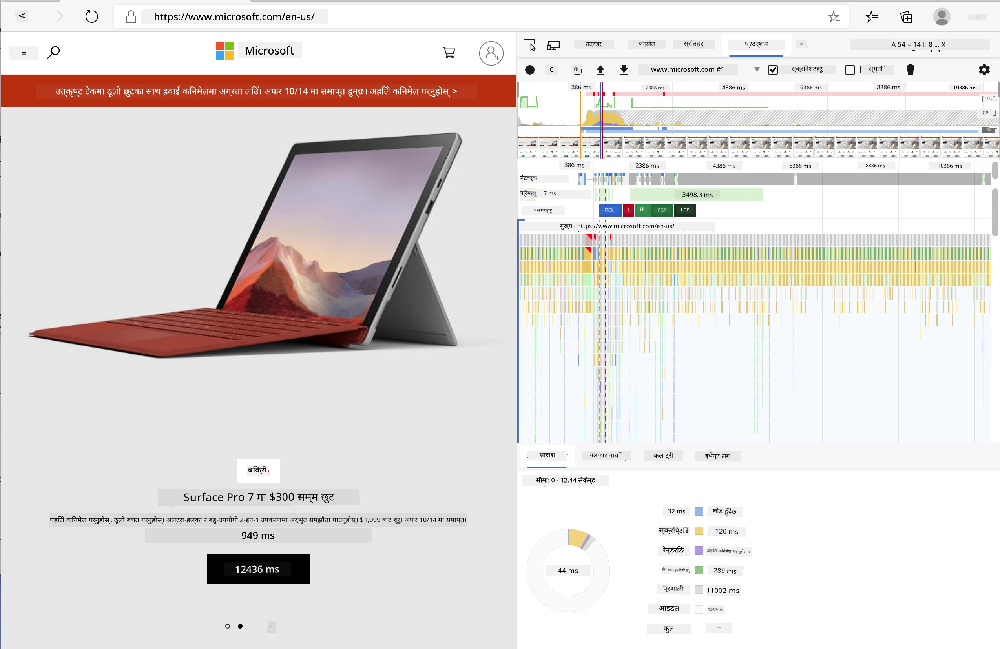
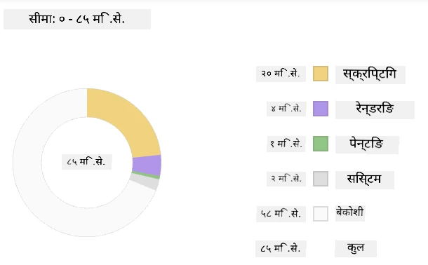
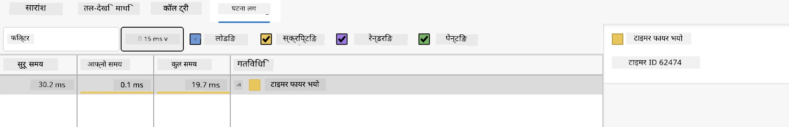
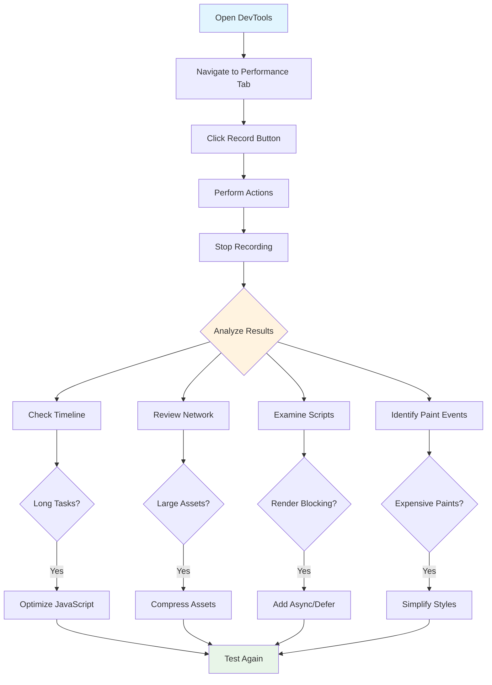
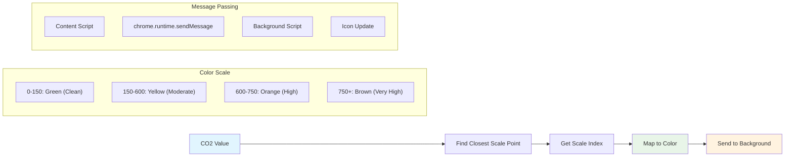
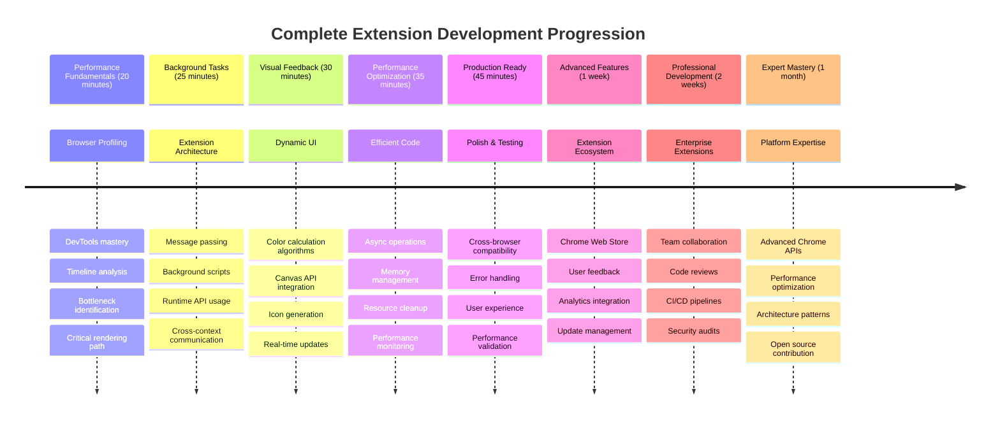

```mermaid
architecture-beta
    group browser(logos:chrome)[Browser]
    
    service popup(logos:html5)[Popup UI] in browser
    service content(logos:javascript)[Content Script] in browser
    service background(database)[Background Script] in browser
    service api(logos:api)[External API] in browser
    
    popup:R -- L:content
    content:R -- L:background
    background:T -- B:api
    content:T -- B:api
    
    junction junctionCenter in browser
    popup:R -- L:junctionCenter
    junctionCenter:R -- L:background
```

<!--
CO_OP_TRANSLATOR_METADATA:
{
  "original_hash": "b275fed2c6fc90d2b9b6661a3225faa2",
  "translation_date": "2025-11-03T15:57:11+00:00",
  "source_file": "5-browser-extension/3-background-tasks-and-performance/README.md",
  "language_code": "ne"
}
-->
# ब्राउजर एक्सटेन्सन परियोजना भाग ३: पृष्ठभूमि कार्यहरू र प्रदर्शनको बारेमा जान्नुहोस्



के तपाईं कहिल्यै सोच्नुभएको छ कि किन केही ब्राउजर एक्सटेन्सनहरू चाँडो र प्रतिक्रियात्मक महसुस हुन्छन् भने अरू सुस्त देखिन्छन्? यसको रहस्य पर्दा पछाडि के भइरहेको छ भन्ने कुरामा छ। जब प्रयोगकर्ताहरू तपाईंको एक्सटेन्सनको इन्टरफेसमा क्लिक गरिरहेका हुन्छन्, त्यहाँ पृष्ठभूमि प्रक्रियाहरूको एक संसार हुन्छ जसले डेटा फेचिंग, आइकन अपडेटहरू, र प्रणाली स्रोतहरू शान्त रूपमा व्यवस्थापन गरिरहेको हुन्छ।

यो ब्राउजर एक्सटेन्सन श्रृंखलाको अन्तिम पाठ हो, र हामी तपाईंको कार्बन फुटप्रिन्ट ट्र्याकरलाई सहज रूपमा काम गर्ने बनाउनेछौं। तपाईंले गतिशील आइकन अपडेटहरू थप्नुहुनेछ र प्रदर्शन समस्याहरूलाई समस्या बन्नु अघि नै पहिचान गर्न सिक्नुहुनेछ। यो रेस कार ट्युनिङ जस्तै हो - साना अनुकूलनहरूले सबै कुरा कसरी चल्छ भन्नेमा ठूलो फरक पार्न सक्छ।

जब हामी समाप्त गर्छौं, तपाईंसँग एक परिष्कृत एक्सटेन्सन हुनेछ र प्रदर्शनका सिद्धान्तहरू बुझ्नुहुनेछ जसले राम्रो वेब एप्सलाई उत्कृष्ट बनाउँछ। ब्राउजर अनुकूलनको संसारमा डुबौं।

## प्रि-लेक्चर क्विज

[प्रि-लेक्चर क्विज](https://ff-quizzes.netlify.app/web/quiz/27)

### परिचय

हाम्रो अघिल्लो पाठहरूमा, तपाईंले एउटा फारम निर्माण गर्नुभयो, यसलाई API सँग जडान गर्नुभयो, र एसिंक्रोनस डेटा फेचिंगलाई सामना गर्नुभयो। तपाईंको एक्सटेन्सन राम्रो आकारमा छ।

अब हामी अन्तिम टचहरू थप्न आवश्यक छ - जस्तै कार्बन डेटा अनुसार एक्सटेन्सन आइकनको रंग परिवर्तन गराउनु। यसले मलाई नासाले अपोलो अन्तरिक्ष यानको प्रत्येक प्रणालीलाई अनुकूलित गर्नुपरेको कुरा सम्झाउँछ। उनीहरूले कुनै पनि अनावश्यक चक्र वा मेमोरी खर्च गर्न सक्दैनथे किनभने प्रदर्शनमा जीवन निर्भर थियो। जबकि हाम्रो ब्राउजर एक्सटेन्सन त्यति महत्वपूर्ण छैन, त्यही सिद्धान्तहरू लागू हुन्छन् - कुशल कोडले राम्रो प्रयोगकर्ता अनुभव सिर्जना गर्दछ।



## वेब प्रदर्शनको आधारभूत कुरा

जब तपाईंको कोड कुशलतापूर्वक चल्छ, मानिसहरूले वास्तवमै *महसुस* गर्न सक्छन्। तपाईंलाई थाहा छ त्यो क्षण जब पृष्ठ तुरुन्तै लोड हुन्छ वा एनिमेसन सहज रूपमा बग्छ? त्यो राम्रो प्रदर्शनको काम हो।

प्रदर्शन केवल गति मात्र होइन - यो वेब अनुभवहरूलाई प्राकृतिक महसुस गराउने बारे हो, क्लंकी र निराशाजनक होइन। कम्प्युटिङको प्रारम्भिक दिनहरूमा, ग्रेस होपरले आफ्नो डेस्कमा एक न्यानोसेकेन्ड (लगभग एक फिट लामो तारको टुक्रा) राख्थिन् ताकि एक अर्बौं सेकेन्डमा प्रकाश कति टाढा यात्रा गर्छ भनेर देखाउन सकियोस्। यो कम्प्युटिङमा प्रत्येक माइक्रोसेकेन्ड किन महत्त्वपूर्ण छ भन्ने व्याख्या गर्ने उनको तरिका थियो। आउनुहोस्, के चीजले गति ढिलो बनाइरहेको छ भनेर पत्ता लगाउन मद्दत गर्ने जासुसी उपकरणहरू अन्वेषण गरौं।

> "वेबसाइट प्रदर्शन दुई कुराको बारेमा हो: पृष्ठ कति छिटो लोड हुन्छ, र यसमा कोड कति छिटो चल्छ।" -- [ज्याक ग्रोसबार्ट](https://www.smashingmagazine.com/2012/06/javascript-profiling-chrome-developer-tools/)

तपाईंको वेबसाइटहरूलाई सबै प्रकारका उपकरणहरूमा, सबै प्रकारका प्रयोगकर्ताहरूका लागि, सबै प्रकारका परिस्थितिहरूमा अत्यन्त छिटो बनाउने विषय, आश्चर्यजनक रूपमा विशाल छ। यहाँ केहि बुँदाहरू छन् जुन तपाईंले मानक वेब परियोजना वा ब्राउजर एक्सटेन्सन निर्माण गर्दा ध्यानमा राख्नुपर्छ।

तपाईंको साइटलाई अनुकूलित गर्ने पहिलो कदम भनेको वास्तवमा पर्दा पछाडि के भइरहेको छ भन्ने कुरा बुझ्नु हो। भाग्यवश, तपाईंको ब्राउजरमा शक्तिशाली जासुसी उपकरणहरू पहिले नै समावेश छन्।



एजमा डेभलपर टूल्स खोल्न, माथि दायाँ कुनामा तीन डटहरू क्लिक गर्नुहोस्, त्यसपछि More Tools > Developer Tools मा जानुहोस्। वा किबोर्ड सर्टकट प्रयोग गर्नुहोस्: Windows मा `Ctrl` + `Shift` + `I` वा Mac मा `Option` + `Command` + `I`। एकपटक त्यहाँ पुगेपछि, Performance ट्याबमा क्लिक गर्नुहोस् - यहीँ तपाईं आफ्नो अनुसन्धान गर्नुहुनेछ।

**यहाँ तपाईंको प्रदर्शन जासुसी टूलकिट छ:**
- **खोल्नुहोस्** डेभलपर टूल्स (तपाईंले यो बारम्बार प्रयोग गर्नुहुनेछ!)
- **हेड गर्नुहोस्** Performance ट्याबमा - यसलाई तपाईंको वेब एपको फिटनेस ट्र्याकरको रूपमा सोच्नुहोस्
- **रिकर्ड बटन थिच्नुहोस्** र तपाईंको पृष्ठलाई क्रियाशील अवस्थामा हेर्नुहोस्
- **परिणामहरू अध्ययन गर्नुहोस्** के चीजले गति ढिलो बनाइरहेको छ भनेर पत्ता लगाउन

यसलाई प्रयास गरौं। एउटा वेबसाइट खोल्नुहोस् (Microsoft.com राम्रो काम गर्दछ) र 'रिकर्ड' बटन क्लिक गर्नुहोस्। अब पृष्ठलाई रिफ्रेस गर्नुहोस् र प्रोफाइलरले के भइरहेको छ भनेर क्याप्चर गर्न हेर्नुहोस्। जब तपाईं रेकर्डिङ रोक्नुहुन्छ, तपाईंले ब्राउजरले साइटलाई 'स्क्रिप्ट', 'रेन्डर', र 'पेन्ट' गर्ने तरिकाको विस्तृत विवरण देख्नुहुनेछ। यो मिशन कन्ट्रोलले रकेट प्रक्षेपणको समयमा प्रत्येक प्रणालीलाई अनुगमन गर्ने तरिकाको जस्तै हो - तपाईंलाई वास्तविक समयमा के भइरहेको छ र कहिले भइरहेको छ भन्ने डेटा प्राप्त हुन्छ।



✅ [Microsoft Documentation](https://docs.microsoft.com/microsoft-edge/devtools-guide/performance/?WT.mc_id=academic-77807-sagibbon) मा थप विवरणहरू छन् यदि तपाईं गहिराइमा जान चाहनुहुन्छ भने।

> प्रो टिप: परीक्षण गर्नु अघि तपाईंको ब्राउजर क्यास खाली गर्नुहोस् ताकि तपाईंको साइटले पहिलो पटक आगन्तुकहरूको लागि कस्तो प्रदर्शन गर्छ हेर्न सक्नुहोस् - यो सामान्यतया दोहोरिने भ्रमणहरू भन्दा धेरै फरक हुन्छ!

प्रोफाइल टाइमलाइनका तत्वहरू चयन गरेर पृष्ठ लोड हुँदा हुने घटनाहरूमा जुम इन गर्नुहोस्।

प्रोफाइल टाइमलाइनको एक भाग चयन गरेर र सारांश प्यान हेरेर तपाईंको पृष्ठको प्रदर्शनको स्न्यापशट प्राप्त गर्नुहोस्:



इभेन्ट लग प्यान जाँच गर्नुहोस् कि कुनै इभेन्ट १५ मिलिसेकेन्ड भन्दा लामो समय लागेको छ कि छैन:



✅ तपाईंको प्रोफाइलरलाई चिन्नुहोस्! यस साइटमा डेभलपर टूल्स खोल्नुहोस् र कुनै पनि बाधाहरू छन् कि छैनन् हेर्नुहोस्। सबैभन्दा ढिलो लोड हुने सम्पत्ति के हो? सबैभन्दा छिटो?



## प्रोफाइलिङ गर्दा के हेर्ने

प्रोफाइलर चलाउनु भनेको केवल सुरुवात हो - वास्तविक सीप भनेको ती रंगीन चार्टहरूले वास्तवमा के बताइरहेका छन् भन्ने कुरा जान्नु हो। चिन्ता नगर्नुहोस्, तपाईंले तिनीहरूलाई पढ्न सिक्नुहुनेछ। अनुभवी डेभलपरहरूले समस्या पूर्ण रूपमा विकसित हुनुअघि चेतावनी संकेतहरू पहिचान गर्न सिकेका छन्।

आउनुहोस्, सामान्य संदिग्धहरूको बारेमा कुरा गरौं - प्रदर्शन समस्याहरू जसले वेब परियोजनाहरूमा छिप्न रुचाउँछन्। जस्तै मेरी क्युरीले आफ्नो प्रयोगशालामा विकिरण स्तरलाई सावधानीपूर्वक अनुगमन गर्नुपरेको थियो, हामीले निश्चित ढाँचाहरूको लागि हेर्नु आवश्यक छ जसले समस्या उत्पन्न गरिरहेको संकेत गर्दछ। यीलाई चाँडै समात्दा तपाईं (र तपाईंका प्रयोगकर्ताहरू) धेरै निराशाबाट बचाउनुहुनेछ।

**सम्पत्ति आकारहरू**: वेबसाइटहरू वर्षौंदेखि "गह्रौं" हुँदै गएका छन्, र त्यो अतिरिक्त वजनको धेरै हिस्सा छविहरूबाट आउँछ। यो जस्तै हामीले हाम्रो डिजिटल सुटकेसहरूमा थप र थप सामान भरिरहेका छौं।

✅ [इन्टरनेट आर्काइभ](https://httparchive.org/reports/page-weight) हेर्नुहोस् कि पृष्ठ आकारहरू समयसँगै कसरी बढेका छन् - यो धेरै खुलासा छ।

**तपाईंको सम्पत्तिहरूलाई अनुकूलित राख्ने तरिका:**
- **कम्प्रेस गर्नुहोस्** ती छविहरू! WebP जस्ता आधुनिक ढाँचाहरूले फाइल आकारलाई नाटकीय रूपमा कटौती गर्न सक्छन्
- **सर्भ गर्नुहोस्** प्रत्येक उपकरणको लागि सही छवि आकार - फोनहरूमा ठूला डेस्कटप छविहरू पठाउन आवश्यक छैन
- **मिनिफाइ गर्नुहोस्** तपाईंको CSS र JavaScript - प्रत्येक बाइट महत्त्वपूर्ण छ
- **लेजी लोडिङ प्रयोग गर्नुहोस्** ताकि छविहरू केवल प्रयोगकर्ताहरूले वास्तवमा स्क्रोल गर्दा मात्र डाउनलोड हुन्छन्

**DOM ट्राभर्सलहरू**: ब्राउजरले तपाईंले लेखेको कोडको आधारमा यसको Document Object Model निर्माण गर्नुपर्छ, त्यसैले राम्रो पृष्ठ प्रदर्शनको चासोमा तपाईंको ट्यागहरू न्यूनतम राख्नु महत्त्वपूर्ण छ, केवल पृष्ठलाई आवश्यक पर्ने कुराहरू प्रयोग गरेर र स्टाइलिङ गरेर। यस बिन्दुमा, पृष्ठसँग सम्बन्धित अतिरिक्त CSS अनुकूलित गर्न सकिन्छ; केवल एक पृष्ठमा प्रयोग गर्न आवश्यक शैलीहरू मुख्य शैली शीटमा समावेश गर्न आवश्यक छैन, उदाहरणका लागि।

**DOM अनुकूलनका लागि मुख्य रणनीतिहरू:**
- **HTML तत्वहरूको संख्या र नेस्टिङ स्तरहरू कम गर्नुहोस्**
- **अप्रयुक्त CSS नियमहरू हटाउनुहोस् र शैली शीटहरू कुशलतापूर्वक समेकित गर्नुहोस्**
- **CSS लाई प्रत्येक पृष्ठको लागि आवश्यक पर्ने मात्र लोड गर्न व्यवस्थित गर्नुहोस्**
- **HTML लाई ब्राउजर पार्सिङको लागि राम्रो बनाउन संरचना गर्नुहोस्**

**JavaScript**: प्रत्येक JavaScript डेभलपरले 'रेन्डर-ब्लकिङ' स्क्रिप्टहरूको लागि हेर्नु पर्छ जुन बाँकी DOM ट्राभर्स र ब्राउजरमा पेन्ट गर्न अघि लोड गर्नुपर्छ। तपाईंको इनलाइन स्क्रिप्टहरूसँग `defer` प्रयोग गर्ने विचार गर्नुहोस् (जसरी Terrarium मोड्युलमा गरिएको छ)।

**आधुनिक JavaScript अनुकूलन प्रविधिहरू:**
- **स्क्रिप्टहरू DOM पार्सिङ पछि लोड गर्न `defer` विशेषता प्रयोग गर्नुहोस्**
- **कोड स्प्लिटिङ कार्यान्वयन गर्नुहोस् ताकि केवल आवश्यक JavaScript लोड होस्**
- **गैर-आवश्यक कार्यक्षमताको लागि लेजी लोडिङ लागू गर्नुहोस्**
- **भारी पुस्तकालयहरू र फ्रेमवर्कहरूको प्रयोग सकेसम्म कम गर्नुहोस्**

✅ साइट प्रदर्शन निर्धारण गर्न गरिने सामान्य जाँचहरूको बारेमा थप जान्न [साइट स्पीड टेस्ट वेबसाइट](https://www.webpagetest.org/) मा केही साइटहरू प्रयास गर्नुहोस्।

### 🔄 **शैक्षिक जाँच**
**प्रदर्शन बुझाइ**: एक्सटेन्सन सुविधाहरू निर्माण गर्नु अघि सुनिश्चित गर्नुहोस् कि तपाईं:
- ✅ HTML देखि पिक्सेलसम्मको क्रिटिकल रेंडरिंग पथ व्याख्या गर्न सक्नुहुन्छ
- ✅ वेब एप्लिकेसनहरूमा सामान्य प्रदर्शन बाधाहरू पहिचान गर्न सक्नुहुन्छ
- ✅ पृष्ठ प्रदर्शन प्रोफाइल गर्न ब्राउजर डेभलपर टूल्स प्रयोग गर्न सक्नुहुन्छ
- ✅ सम्पत्ति आकार र DOM जटिलताले गति कसरी प्रभावित गर्छ भन्ने कुरा बुझ्नुहुन्छ

**छिटो आत्म-परीक्षण**: जब तपाईंसँग रेंडर-ब्लकिङ JavaScript हुन्छ के हुन्छ?
*उत्तर: ब्राउजरले स्क्रिप्ट डाउनलोड र कार्यान्वयन गर्नुपर्छ त्यसपछि मात्र HTML पार्सिङ र पृष्ठ रेंडर गर्न जारी राख्न सक्छ*

**वास्तविक-विश्व प्रदर्शन प्रभाव**:
- **१००ms ढिलाइ**: प्रयोगकर्ताहरूले ढिलाइ महसुस गर्छन्
- **१ सेकेन्ड ढिलाइ**: प्रयोगकर्ताहरूको ध्यान गुम्न थाल्छ
- **३+ सेकेन्ड**: ४०% प्रयोगकर्ताहरू पृष्ठ छोड्छन्
- **मोबाइल नेटवर्कहरू**: प्रदर्शन अझ बढी महत्त्वपूर्ण छ

अब तपाईंले ब्राउजरले तपाईंले पठाएको सम्पत्तिहरू कसरी रेंडर गर्छ भन्ने बारेमा विचार पाउनुभएको छ, आउनुहोस् तपाईंको एक्सटेन्सन पूरा गर्न आवश्यक अन्तिम केही कुराहरू हेर्नुहोस्:

### रंग गणना गर्न एक फंक्शन सिर्जना गर्नुहोस्

अब हामी एउटा फंक्शन सिर्जना गर्नेछौं जसले संख्यात्मक डेटा अर्थपूर्ण रंगहरूमा परिणत गर्छ। यसलाई ट्राफिक लाइट प्रणाली जस्तै सोच्नुहोस् - हरियो सफा ऊर्जा, रातो उच्च कार्बन तीव्रता।

यो फंक्शनले हाम्रो API बाट CO2 डेटा लिनेछ र वातावरणीय प्रभावलाई प्रतिनिधित्व गर्ने सबैभन्दा राम्रो रंग निर्धारण गर्नेछ। यो वैज्ञानिकहरूले जटिल डेटा ढाँचाहरूलाई दृश्यात्मक बनाउन ताप नक्साहरूमा रंग-कोडिङ प्रयोग गर्ने तरिकाको जस्तै हो - महासागरको तापक्रमदेखि ताराहरूको निर्माणसम्म। आउनुहोस् यसलाई `/src/index.js` मा थपौं, ती `const` भेरिएबलहरू सेट गरेपछि:



```javascript
function calculateColor(value) {
	// Define CO2 intensity scale (grams per kWh)
	const co2Scale = [0, 150, 600, 750, 800];
	// Corresponding colors from green (clean) to dark brown (high carbon)
	const colors = ['#2AA364', '#F5EB4D', '#9E4229', '#381D02', '#381D02'];

	// Find the closest scale value to our input
	const closestNum = co2Scale.sort((a, b) => {
		return Math.abs(a - value) - Math.abs(b - value);
	})[0];
	
	console.log(`${value} is closest to ${closestNum}`);
	
	// Find the index for color mapping
	const num = (element) => element > closestNum;
	const scaleIndex = co2Scale.findIndex(num);

	const closestColor = colors[scaleIndex];
	console.log(scaleIndex, closestColor);

	// Send color update message to background script
	chrome.runtime.sendMessage({ action: 'updateIcon', value: { color: closestColor } });
}
```

**आउनुहोस्, यस चतुर सानो फंक्शनलाई तोडौं:**
- **दुई एरेहरू सेट अप गर्दछ** - एउटा CO2 स्तरहरूको लागि, अर्को रंगहरूको लागि (हरियो = सफा, खैरो = फोहोर!)
- **हाम्रो वास्तविक CO2 मानसँग सबैभन्दा नजिकको मिलान पत्ता लगाउँछ** केही चाखलाग्दो एरे सर्टिङ प्रयोग गरेर
- **मिल्दो रंग समात्छ** findIndex() विधि प्रयोग गरेर
- **हाम्रो रोजिएको रंगको साथ Chrome को पृष्ठभूमि स्क्रिप्टमा सन्देश पठाउँछ**
- **टेम्प्लेट लिटरलहरू प्रयोग गर्दछ** (ती ब्याकटिक्स) सफा स्ट्रिङ फर्म्याटिङको लागि
- **सबै कुरा व्यवस्थित राख्छ** const घोषणाहरूको साथ

`chrome.runtime` [API](https://developer.chrome.com/extensions/runtime) तपाईंको एक्सटेन्सनको स्नायु प्रणाली जस्तै हो - यसले पर्दा पछाडि सबै संचार र कार्यहरू व्यवस्थापन गर्दछ:

> "chrome.runtime API प्रयोग गरेर पृष्ठभूमि पृष्ठ पुनःप्राप्त गर्नुहोस्, म्यानिफेस्टको बारेमा विवरणहरू फर्काउनुहोस्, र एप वा एक्सटेन्सन जीवनचक्रमा घटनाहरूको लागि सुन्नुहोस् र प्रतिक्रिया दिनुहोस्। तपाईं यस API लाई URL को सापेक्ष पथलाई पूर्ण-योग्य URL मा रूपान्तरण गर्न पनि प्रयोग गर्न सक्नुहुन्छ।"

**किन Chrome Runtime API उपयोगी छ:**
- **तपाईंको एक्सटेन्सनका विभिन्न भागहरूलाई एकअर्कासँग कुरा गर्न दिन्छ**
- **पृष्ठभूमि कार्यहरू व्यवस्थापन गर्दछ** प्रयोगकर्ता इन्टरफेसलाई फ्रिज नगरी
- **तपाईंको एक्सटेन्सनको जीवनचक्र घटनाहरू व्यवस्थापन गर्दछ**
- **स्क्रिप्टहरू बीच सन्देश पास गर्न सजिलो बनाउँछ**

✅ यदि तपाईं यो ब्राउजर एक्सटेन्सन Edge को लागि विकास गर्दै हुनुहुन्छ भने, तपाईंलाई आश्चर्य लाग्न सक्छ कि तपाईं chrome API प्रयोग गर्दै हुनुहुन्छ। नयाँ Edge ब्राउजर संस्करणहरू Chromium ब्राउजर इन्जिनमा चल्छन्, त्यसैले तपाईं यी उपकरणहरूको लाभ उठाउन सक्नुहुन्छ।



> **प्रो टिप**: यदि तपाईं ब्राउजर एक्सटेन्सन प्रोफाइल गर्न चाहनुहुन्छ भने, एक्सटेन्सन भित्रैबाट डेभलपर टूल्स सुरू गर्नुहोस्, किनभने यो आफ्नै अलग ब्राउजर इन्स्ट्यान्स हो। यसले तपाईंलाई एक्सटेन्सन-विशिष्ट प्रदर्शन मेट्रिक्समा पहुँच दिन्छ।

### डिफल्ट आइकन रंग सेट गर्नुहोस्

वास्तविक डेटा फेच गर्न सुरु गर्नु अघि, आउनुहोस् हाम्रो एक्सटेन्सनलाई सुरुवात बिन्दु दिउँ। कसैलाई खाली वा बिग्रिएको देखिने आइकन हेर्न मन पर्दैन। हामी हरियो रंगबाट सुरु गर्नेछौं ताकि प्रयोगकर्ताहरूले एक्सटेन्सन स्थापना गर्ने क्षणदेखि नै काम गरिरहेको देख्न सकून्।

तपाईंको `init()` फंक्शनमा, आउनुहोस् त्यो डिफल्ट हरियो आइकन सेट गरौं:

```javascript
chrome.runtime.sendMessage({
	action: 'updateIcon',
	value: {
		color: 'green',
	},
});
```

**यो सुरुवातले के पूरा गर्छ:**
- **डिफल्ट अवस्थाको रूपमा तटस्थ हरियो रंग सेट गर्दछ**
- **एक्सटेन्सन लोड हुँदा तुरुन्तै दृश्यात्मक प्रतिक्रिया प्रदान गर्दछ**
- **पृष्ठभूमि स्क्रिप्टसँग संचार ढाँचा स्थापना गर्दछ**
- **डेटा लोड हुनु अघि प्रयोगकर्ताहरूले कार्यात्मक एक्सटेन्सन देख्न सुनिश्चित गर्दछ**

### फंक्शनलाई कल गर्नुहोस्, कल कार्यान्वयन गर्नुहोस्

अब आउनुहोस् सबै कुरा जोडौं ताकि ताजा CO2 डेटा आउँदा, तपाईंको आइकनले सही रंगसँग स्वतः अपडेट होस्। यो इलेक्ट्रोनिक उपकरणमा अन्तिम सर्किट जडान गर्ने जस्तै हो - अचानक सबै व्यक्तिगत कम्पोनेन्टहरू एक प्रणालीको रूपमा काम गर्छन्।

API बाट CO2 डेटा प्राप्त गरेपछि यो लाइन थप्नुहोस्:

```javascript
// After retrieving CO2 data from the API
// let CO2 = data.data[0].intensity.actual;
calculateColor(CO2);
```

**यो
- ✅ क्रोम Runtime API ले एक्सटेन्सन आर्किटेक्चरमा के भूमिका खेल्छ?
- ✅ रंग गणना एल्गोरिदमले डाटा दृश्यात्मक प्रतिक्रिया संग कसरी नक्सा बनाउँछ?

**प्रदर्शन विचारहरू**: तपाईंको एक्सटेन्सनले अब निम्न देखाउँछ:
- **प्रभावकारी सन्देश आदानप्रदान**: स्क्रिप्ट सन्दर्भहरू बीच सफा संचार
- **अनुकूलित रेंडरिंग**: OffscreenCanvas ले UI ब्लकिंग रोक्छ
- **रियल-टाइम अपडेटहरू**: प्रत्यक्ष डाटामा आधारित गतिशील आइकन परिवर्तन
- **मेमोरी व्यवस्थापन**: सही सफाई र स्रोत ह्यान्डलिंग

**तपाईंको एक्सटेन्सन परीक्षण गर्ने समय:**
- **Build** सबै कुरा `npm run build` प्रयोग गरेर
- **Reload** आफ्नो एक्सटेन्सन ब्राउजरमा (यो चरण बिर्सनु हुँदैन)
- **Open** आफ्नो एक्सटेन्सन र आइकन रंग परिवर्तन हेर्नुहोस्
- **Check** यो विश्वभरको वास्तविक कार्बन डाटामा कसरी प्रतिक्रिया दिन्छ

अब तपाईंलाई थाहा हुनेछ कि कपडा धुने समय राम्रो छ कि सफा ऊर्जा कुर्नु पर्छ। तपाईंले केही साँच्चै उपयोगी निर्माण गर्नुभयो र ब्राउजर प्रदर्शनको बारेमा सिक्नुभयो।

## GitHub Copilot Agent Challenge 🚀

Agent मोड प्रयोग गरेर निम्न चुनौती पूरा गर्नुहोस्:

**विवरण:** ब्राउजर एक्सटेन्सनको प्रदर्शन निगरानी क्षमता सुधार गर्न एक सुविधा थप्नुहोस् जसले एक्सटेन्सनका विभिन्न कम्पोनेन्टहरूको लोड समय ट्र्याक र प्रदर्शन गर्दछ।

**प्रेरणा:** Performance API प्रयोग गरेर CO2 डाटा API बाट फेच गर्न, रंग गणना गर्न, र आइकन अपडेट गर्न लाग्ने समय मापन गर्ने र ब्राउजर कन्सोलमा टाइमस्ट्याम्प र अवधि मेट्रिक्ससहित परिणाम देखाउने `performanceTracker` नामक एक फंक्शन बनाउनुहोस्।

[agent mode](https://code.visualstudio.com/blogs/2025/02/24/introducing-copilot-agent-mode) को बारेमा थप जान्नुहोस्।

## 🚀 चुनौती

यहाँ एक रोचक जासुसी मिशन छ: केही पुराना ओपन सोर्स वेबसाइटहरू (जस्तै Wikipedia, GitHub, वा Stack Overflow) छनोट गर्नुहोस् र तिनीहरूको कमिट इतिहासमा डुब्नुहोस्। के तपाईंले प्रदर्शन सुधार कहाँ गरिएको छ पत्ता लगाउन सक्नुहुन्छ? कुन समस्याहरू बारम्बार देखा परिरहेका छन्?

**तपाईंको अनुसन्धान दृष्टिकोण:**
- **Search** कमिट सन्देशहरूमा "optimize," "performance," वा "faster" जस्ता शब्दहरू खोज्नुहोस्
- **Look** ढाँचाहरूको लागि - के तिनीहरूले बारम्बार उस्तै प्रकारका समस्याहरू समाधान गरिरहेका छन्?
- **Identify** वेबसाइटहरू सुस्त बनाउने सामान्य दोषीहरू
- **Share** तपाईंले के पत्ता लगाउनुभयो - अन्य विकासकर्ताहरू वास्तविक उदाहरणहरूबाट सिक्छन्

## Post-Lecture Quiz

[Post-lecture quiz](https://ff-quizzes.netlify.app/web/quiz/28)

## समीक्षा र आत्म अध्ययन

[performance newsletter](https://perf.email/) को लागि साइन अप गर्ने विचार गर्नुहोस्।

ब्राउजरहरूले वेब प्रदर्शन कसरी मापन गर्छन् भनेर तिनीहरूको वेब उपकरणहरूको प्रदर्शन ट्याबहरू हेरेर अनुसन्धान गर्नुहोस्। के तपाईंले कुनै ठूला भिन्नता पाउनुभयो?

### ⚡ **तपाईंले अर्को ५ मिनेटमा गर्न सक्ने कुरा**
- [ ] ब्राउजर टास्क म्यानेजर खोल्नुहोस् (Chrome मा Shift+Esc) एक्सटेन्सन स्रोत उपयोग हेर्न
- [ ] DevTools प्रदर्शन ट्याब प्रयोग गरेर वेबपेज प्रदर्शन रेकर्ड र विश्लेषण गर्नुहोस्
- [ ] ब्राउजरको एक्सटेन्सन पृष्ठ जाँच गर्नुहोस् कुन एक्सटेन्सनहरूले स्टार्टअप समयमा प्रभाव पार्छ
- [ ] एक्सटेन्सनहरू अस्थायी रूपमा अक्षम गरेर प्रदर्शन भिन्नता हेर्न प्रयास गर्नुहोस्

### 🎯 **तपाईंले यो घण्टामा पूरा गर्न सक्ने कुरा**
- [ ] पोस्ट-लेसन क्विज पूरा गर्नुहोस् र प्रदर्शन अवधारणाहरू बुझ्नुहोस्
- [ ] आफ्नो ब्राउजर एक्सटेन्सनको लागि ब्याकग्राउन्ड स्क्रिप्ट कार्यान्वयन गर्नुहोस्
- [ ] ब्राउजर.alarms प्रयोग गरेर प्रभावकारी ब्याकग्राउन्ड कार्यहरू सिक्नुहोस्
- [ ] सामग्री स्क्रिप्टहरू र ब्याकग्राउन्ड स्क्रिप्टहरू बीच सन्देश आदानप्रदान अभ्यास गर्नुहोस्
- [ ] आफ्नो एक्सटेन्सनको स्रोत उपयोग मापन र अनुकूलन गर्नुहोस्

### 📅 **तपाईंको हप्ताको प्रदर्शन यात्रा**
- [ ] ब्याकग्राउन्ड कार्यक्षमता सहित उच्च प्रदर्शन ब्राउजर एक्सटेन्सन पूरा गर्नुहोस्
- [ ] सेवा कार्यकर्ता र आधुनिक एक्सटेन्सन आर्किटेक्चरमा महारत हासिल गर्नुहोस्
- [ ] प्रभावकारी डाटा समिकरण र क्यासिङ रणनीतिहरू कार्यान्वयन गर्नुहोस्
- [ ] एक्सटेन्सन प्रदर्शनको लागि उन्नत डिबगिङ प्रविधिहरू सिक्नुहोस्
- [ ] कार्यक्षमता र स्रोत दक्षताको लागि आफ्नो एक्सटेन्सन अनुकूलित गर्नुहोस्
- [ ] एक्सटेन्सन प्रदर्शन परिदृश्यहरूको लागि व्यापक परीक्षणहरू सिर्जना गर्नुहोस्

### 🌟 **तपाईंको महिनाको अनुकूलन महारत**
- [ ] इन्प्राइज-ग्रेड ब्राउजर एक्सटेन्सनहरू निर्माण गर्नुहोस् जसको प्रदर्शन उत्कृष्ट छ
- [ ] वेब वर्करहरू, सेवा कार्यकर्ता, र आधुनिक वेब प्रदर्शनको बारेमा सिक्नुहोस्
- [ ] प्रदर्शन अनुकूलनमा केन्द्रित ओपन सोर्स प्रोजेक्टहरूमा योगदान गर्नुहोस्
- [ ] ब्राउजर आन्तरिक र उन्नत डिबगिङ प्रविधिहरूमा महारत हासिल गर्नुहोस्
- [ ] प्रदर्शन निगरानी उपकरणहरू र उत्कृष्ट अभ्यास मार्गदर्शकहरू सिर्जना गर्नुहोस्
- [ ] वेब अनुप्रयोगहरू अनुकूलन गर्ने प्रदर्शन विशेषज्ञ बन्नुहोस्

## 🎯 तपाईंको ब्राउजर एक्सटेन्सन महारत समयरेखा



### 🛠️ तपाईंको पूर्ण एक्सटेन्सन विकास उपकरण किट

यो त्रयी पूरा गरेपछि, तपाईंले निम्नमा महारत हासिल गर्नुभएको छ:
- **ब्राउजर आर्किटेक्चर**: एक्सटेन्सनहरू ब्राउजर प्रणालीहरूसँग कसरी एकीकृत हुन्छन् भन्ने गहिरो समझ
- **प्रदर्शन प्रोफाइलिङ**: विकासकर्ता उपकरणहरू प्रयोग गरेर बाधाहरू पहिचान र समाधान गर्ने क्षमता
- **Async प्रोग्रामिङ**: उत्तरदायी, गैर-अवरोधक अपरेशनहरूको लागि आधुनिक JavaScript ढाँचाहरू
- **API एकीकरण**: प्रमाणीकरण र त्रुटि ह्यान्डलिङसहित बाह्य डाटा फेच गर्ने
- **दृश्य डिजाइन**: गतिशील UI अपडेटहरू र Canvas-आधारित ग्राफिक्स उत्पादन
- **सन्देश आदानप्रदान**: एक्सटेन्सन आर्किटेक्चरमा स्क्रिप्टहरू बीच संचार
- **प्रयोगकर्ता अनुभव**: लोडिङ अवस्थाहरू, त्रुटि ह्यान्डलिङ, र सहज अन्तरक्रियाहरू
- **उत्पादन कौशल**: वास्तविक संसारमा परिनियोजनको लागि परीक्षण, डिबगिङ, र अनुकूलन

**वास्तविक संसार अनुप्रयोगहरू**: तपाईंको एक्सटेन्सन विकास कौशल सीधा लागू हुन्छ:
- **प्रोग्रेसिव वेब एप्स**: समान आर्किटेक्चर र प्रदर्शन ढाँचाहरू
- **Electron डेस्कटप एप्स**: वेब प्रविधिहरू प्रयोग गरेर क्रस-प्ल्याटफर्म अनुप्रयोगहरू
- **मोबाइल हाइब्रिड एप्स**: Cordova/PhoneGap विकास वेब APIs प्रयोग गरेर
- **इन्प्राइज वेब अनुप्रयोगहरू**: जटिल ड्यासबोर्ड र उत्पादकता उपकरणहरू
- **Chrome DevTools एक्सटेन्सनहरू**: उन्नत विकासकर्ता उपकरण र डिबगिङ
- **वेब API एकीकरण**: कुनै पनि अनुप्रयोग जसले बाह्य सेवाहरूसँग संचार गर्छ

**व्यावसायिक प्रभाव**: अब तपाईं:
- **Build** उत्पादन-तयार ब्राउजर एक्सटेन्सनहरू अवधारणा देखि परिनियोजनसम्म निर्माण गर्न सक्नुहुन्छ
- **Optimize** वेब अनुप्रयोग प्रदर्शन उद्योग-मानक प्रोफाइलिङ उपकरणहरू प्रयोग गरेर
- **Architect** उचित चिन्ताको अलगावसहित स्केलेबल प्रणालीहरू डिजाइन गर्न सक्नुहुन्छ
- **Debug** जटिल async अपरेशनहरू र क्रस-कन्टेक्स्ट संचार
- **Contribute** ओपन सोर्स एक्सटेन्सन प्रोजेक्टहरू र ब्राउजर मापदण्डहरूमा योगदान गर्न

**अर्को स्तरका अवसरहरू**:
- **Chrome Web Store Developer**: लाखौं प्रयोगकर्ताहरूका लागि एक्सटेन्सनहरू प्रकाशित गर्नुहोस्
- **Web Performance Engineer**: अनुकूलन र प्रयोगकर्ता अनुभवमा विशेषज्ञता हासिल गर्नुहोस्
- **Browser Platform Developer**: ब्राउजर इन्जिन विकासमा योगदान गर्नुहोस्
- **Extension Framework Creator**: अन्य विकासकर्ताहरूलाई मद्दत गर्ने उपकरणहरू निर्माण गर्नुहोस्
- **Developer Relations**: शिक्षण र सामग्री सिर्जनाको माध्यमबाट ज्ञान साझा गर्नुहोस्

🌟 **उपलब्धि अनलक गरियो**: तपाईंले एक पूर्ण, कार्यात्मक ब्राउजर एक्सटेन्सन निर्माण गर्नुभएको छ जसले व्यावसायिक विकास अभ्यासहरू र आधुनिक वेब मापदण्डहरू प्रदर्शन गर्दछ!

## असाइनमेन्ट

[Analyze a site for performance](assignment.md)

---

**अस्वीकरण**:  
यो दस्तावेज़ AI अनुवाद सेवा [Co-op Translator](https://github.com/Azure/co-op-translator) प्रयोग गरेर अनुवाद गरिएको छ। हामी शुद्धताको लागि प्रयास गर्छौं, तर कृपया ध्यान दिनुहोस् कि स्वचालित अनुवादमा त्रुटिहरू वा अशुद्धताहरू हुन सक्छ। यसको मूल भाषा मा रहेको मूल दस्तावेज़लाई आधिकारिक स्रोत मानिनुपर्छ। महत्वपूर्ण जानकारीको लागि, व्यावसायिक मानव अनुवाद सिफारिस गरिन्छ। यस अनुवादको प्रयोगबाट उत्पन्न हुने कुनै पनि गलतफहमी वा गलत व्याख्याको लागि हामी जिम्मेवार हुने छैनौं।