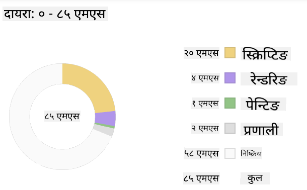
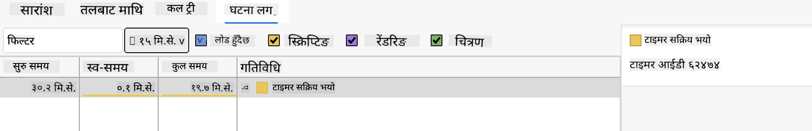

<!--
CO_OP_TRANSLATOR_METADATA:
{
  "original_hash": "640d7f35d57f0e02bbfe468bb0247741",
  "translation_date": "2025-10-20T21:45:35+00:00",
  "source_file": "5-browser-extension/3-background-tasks-and-performance/README.md",
  "language_code": "ne"
}
-->
# ब्राउजर एक्सटेन्सन प्रोजेक्ट भाग ३: पृष्ठभूमि कार्यहरू र प्रदर्शनको बारेमा जान्नुहोस्

## प्रि-लेक्चर क्विज

[प्रि-लेक्चर क्विज](https://ff-quizzes.netlify.app/web/quiz/27)

### परिचय

यस मोड्युलका पछिल्ला दुई पाठहरूमा, तपाईंले API बाट डेटा प्राप्त गर्नको लागि फारम र प्रदर्शन क्षेत्र कसरी निर्माण गर्ने भनेर सिक्नुभयो। यो वेबमा वेब उपस्थिति सिर्जना गर्ने एक धेरै सामान्य तरिका हो। तपाईंले डेटा असिंक्रोनस रूपमा कसरी प्राप्त गर्ने भनेर पनि सिक्नुभयो। तपाईंको ब्राउजर एक्सटेन्सन लगभग पूरा भइसकेको छ।

अब केही पृष्ठभूमि कार्यहरू व्यवस्थापन गर्न बाँकी छ, जसमा एक्सटेन्सनको आइकनको रंग ताजा बनाउने समावेश छ। त्यसैले यो ब्राउजरले यस प्रकारको कार्य कसरी व्यवस्थापन गर्छ भन्ने कुरा छलफल गर्नको लागि राम्रो समय हो। तपाईंले वेब सम्पत्तिहरू निर्माण गर्दा प्रदर्शनको सन्दर्भमा यी ब्राउजर कार्यहरूबारे सोचौं।

## वेब प्रदर्शनको आधारभूत कुरा

> "वेबसाइट प्रदर्शन दुई कुराहरूको बारेमा हो: पृष्ठ कति छिटो लोड हुन्छ, र यसमा रहेको कोड कति छिटो चल्छ।" -- [ज्याक ग्रोसबार्ट](https://www.smashingmagazine.com/2012/06/javascript-profiling-chrome-developer-tools/)

तपाईंको वेबसाइटहरूलाई सबै प्रकारका उपकरणहरूमा, सबै प्रकारका प्रयोगकर्ताहरूको लागि, सबै प्रकारका परिस्थितिहरूमा अत्यन्त छिटो बनाउने विषय, आश्चर्यजनक रूपमा विशाल छ। यहाँ केही बुँदाहरू छन् जुन तपाईंले मानक वेब प्रोजेक्ट वा ब्राउजर एक्सटेन्सन निर्माण गर्दा ध्यानमा राख्नुपर्छ।

तपाईंको साइट कुशलतापूर्वक चलिरहेको छ भनेर सुनिश्चित गर्नको लागि पहिलो कुरा भनेको यसको प्रदर्शनको बारेमा डेटा संकलन गर्नु हो। यो गर्नको लागि पहिलो स्थान भनेको तपाईंको वेब ब्राउजरको डेभलपर टूल्स हो। Edge मा, तपाईं "सेटिङ्स र थप" बटन (ब्राउजरको माथि दायाँ तीन डट आइकन) चयन गर्न सक्नुहुन्छ, त्यसपछि More Tools > Developer Tools मा जानुहोस् र Performance ट्याब खोल्नुहोस्। तपाईं Windows मा `Ctrl` + `Shift` + `I` वा Mac मा `Option` + `Command` + `I` कीबोर्ड सर्टकट प्रयोग गरेर पनि डेभलपर टूल्स खोल्न सक्नुहुन्छ।

Performance ट्याबमा एक प्रोफाइलिङ टूल हुन्छ। वेबसाइट खोल्नुहोस् (उदाहरणको लागि, [https://www.microsoft.com](https://www.microsoft.com/?WT.mc_id=academic-77807-sagibbon)) र 'Record' बटन क्लिक गर्नुहोस्, त्यसपछि साइटलाई रिफ्रेस गर्नुहोस्। कुनै पनि समयमा रेकर्डिङ रोक्नुहोस्, र तपाईंले साइटलाई 'स्क्रिप्ट', 'रेन्डर', र 'पेन्ट' गर्न उत्पन्न हुने रुटिनहरू देख्न सक्नुहुन्छ:


✅ [Microsoft Documentation](https://docs.microsoft.com/microsoft-edge/devtools-guide/performance/?WT.mc_id=academic-77807-sagibbon) मा Edge को Performance प्यानलको बारेमा जान्नुहोस्।

> टिप: तपाईंको वेबसाइटको स्टार्टअप समयको सही रिडिङ प्राप्त गर्नको लागि, तपाईंको ब्राउजरको क्यास खाली गर्नुहोस्।

प्रोफाइल टाइमलाइनका तत्वहरू चयन गरेर तपाईंको पृष्ठ लोड हुँदा हुने घटनाहरूमा जुम इन गर्नुहोस्।

प्रोफाइल टाइमलाइनको भाग चयन गरेर र समरी प्यानमा हेरेर तपाईंको पृष्ठको प्रदर्शनको स्न्यापशट प्राप्त गर्नुहोस्:



Event Log प्यान जाँच गर्नुहोस् कि कुनै घटना १५ मिलिसेकेन्ड भन्दा लामो समय लागेको छ कि छैन:



✅ तपाईंको प्रोफाइलरलाई चिन्नुहोस्! यस साइटमा डेभलपर टूल्स खोल्नुहोस् र हेर्नुहोस् कि कुनै बोटलनेक छ कि छैन। सबैभन्दा ढिलो लोड हुने सम्पत्ति के हो? सबैभन्दा छिटो?

## प्रोफाइलिङ जाँचहरू

सामान्यतया, त्यहाँ केही "समस्या क्षेत्रहरू" छन् जुन प्रत्येक वेब डेभलपरले साइट निर्माण गर्दा ध्यान दिनुपर्छ ताकि उत्पादनमा डिप्लोय गर्ने समयमा अप्रिय आश्चर्यहरूबाट बच्न सकियोस्।

**सम्पत्ति आकारहरू**: पछिल्ला केही वर्षहरूमा वेब 'भारी' भएको छ, र त्यसैले ढिलो पनि। यस तौलको केही भाग छविहरूको प्रयोगसँग सम्बन्धित छ।

✅ [Internet Archive](https://httparchive.org/reports/page-weight) मा पृष्ठ तौलको ऐतिहासिक दृश्य र थप हेर्नुहोस्।

एक राम्रो अभ्यास भनेको सुनिश्चित गर्नु हो कि तपाईंको छविहरू अनुकूलित छन् र तपाईंका प्रयोगकर्ताहरूको लागि सही आकार र रिजोल्युसनमा प्रदान गरिएका छन्।

**DOM ट्राभर्सलहरू**: ब्राउजरले तपाईंले लेखेको कोडको आधारमा यसको Document Object Model निर्माण गर्नुपर्छ, त्यसैले राम्रो पृष्ठ प्रदर्शनको हितमा तपाईंका ट्यागहरू न्यूनतम राख्नुहोस्, पृष्ठलाई आवश्यक पर्ने मात्र प्रयोग र शैली गर्नुहोस्। यस बुँदामा, पृष्ठसँग सम्बन्धित अतिरिक्त CSS अनुकूलित गर्न सकिन्छ; केवल एक पृष्ठमा प्रयोग गर्न आवश्यक शैलीहरू मुख्य शैली पानामा समावेश गर्न आवश्यक छैन, उदाहरणको लागि।

**JavaScript**: प्रत्येक JavaScript डेभलपरले 'रेन्डर-ब्लकिङ' स्क्रिप्टहरूको लागि ध्यान दिनुपर्छ जुन DOM ट्राभर्स र ब्राउजरमा पेन्ट गर्न बाँकी स्क्रिप्टहरू लोड गर्नु अघि लोड गर्नुपर्छ। तपाईंका इनलाइन स्क्रिप्टहरूसँग `defer` प्रयोग गर्ने विचार गर्नुहोस् (जसरी Terrarium मोड्युलमा गरिएको छ)।

✅ साइट प्रदर्शन निर्धारण गर्न गरिने सामान्य जाँचहरूको बारेमा थप जान्नको लागि [Site Speed Test वेबसाइट](https://www.webpagetest.org/) मा केही साइटहरू प्रयास गर्नुहोस्।

अब तपाईंलाई ब्राउजरले तपाईंले पठाएको सम्पत्तिहरू कसरी रेन्डर गर्छ भन्ने थाहा छ, अब तपाईंको एक्सटेन्सन पूरा गर्न आवश्यक अन्तिम केही कुराहरू हेरौं:

### रंग गणना गर्ने फंक्शन सिर्जना गर्नुहोस्

`/src/index.js` मा काम गर्दै, `calculateColor()` नामक फंक्शनलाई तपाईंले DOM पहुँच गर्न सेट गरेका `const` भेरिएबलहरूको श्रृंखलापछि थप्नुहोस्:

```JavaScript
function calculateColor(value) {
	let co2Scale = [0, 150, 600, 750, 800];
	let colors = ['#2AA364', '#F5EB4D', '#9E4229', '#381D02', '#381D02'];

	let closestNum = co2Scale.sort((a, b) => {
		return Math.abs(a - value) - Math.abs(b - value);
	})[0];
	console.log(value + ' is closest to ' + closestNum);
	let num = (element) => element > closestNum;
	let scaleIndex = co2Scale.findIndex(num);

	let closestColor = colors[scaleIndex];
	console.log(scaleIndex, closestColor);

	chrome.runtime.sendMessage({ action: 'updateIcon', value: { color: closestColor } });
}
```

यहाँ के भइरहेको छ? तपाईंले API कलबाट प्राप्त कार्बन तीव्रताको मान पास गर्नुहुन्छ जुन तपाईंले पछिल्लो पाठमा पूरा गर्नुभएको थियो, र त्यसपछि तपाईंले यसको मानलाई रंगहरूको एरेमा प्रस्तुत गरिएको सूचकांकसँग कति नजिक छ भनेर गणना गर्नुहुन्छ। त्यसपछि तपाईंले त्यो नजिकको रंग मानलाई क्रोम रनटाइममा पठाउनुहुन्छ।

chrome.runtime सँग [एक API](https://developer.chrome.com/extensions/runtime) छ जसले सबै प्रकारका पृष्ठभूमि कार्यहरू ह्यान्डल गर्छ, र तपाईंको एक्सटेन्सनले यसलाई प्रयोग गरिरहेको छ:

> "chrome.runtime API प्रयोग गरेर पृष्ठभूमि पृष्ठ पुनःप्राप्त गर्न, म्यानिफेस्टको बारेमा विवरण फिर्ता गर्न, र एप वा एक्सटेन्सन लाइफसाइकलमा घटनाहरूको लागि सुन्न र प्रतिक्रिया दिन प्रयोग गर्नुहोस्। तपाईंले यस API लाई URL हरूको सापेक्ष पथलाई पूर्ण-योग्य URL हरूमा रूपान्तरण गर्न पनि प्रयोग गर्न सक्नुहुन्छ।"

✅ यदि तपाईं यो ब्राउजर एक्सटेन्सन Edge को लागि विकास गर्दै हुनुहुन्छ भने, तपाईंलाई आश्चर्य लाग्न सक्छ कि तपाईंले क्रोम API प्रयोग गर्दै हुनुहुन्छ। नयाँ Edge ब्राउजर संस्करणहरू Chromium ब्राउजर इन्जिनमा चल्छन्, त्यसैले तपाईंले यी उपकरणहरू प्रयोग गर्न सक्नुहुन्छ।

> नोट, यदि तपाईं ब्राउजर एक्सटेन्सनलाई प्रोफाइल गर्न चाहनुहुन्छ भने, एक्सटेन्सन भित्रबाट डेभलपर टूल्स सुरु गर्नुहोस्, किनकि यो आफ्नै अलग ब्राउजर इन्स्ट्यान्स हो।

### डिफल्ट आइकन रंग सेट गर्नुहोस्

अब, `init()` फंक्शनमा, आइकनलाई सुरुमा सामान्य हरियो बनाउन फेरि क्रोमको `updateIcon` एक्सनलाई कल गरेर सेट गर्नुहोस्:

```JavaScript
chrome.runtime.sendMessage({
	action: 'updateIcon',
		value: {
			color: 'green',
		},
});
```
### फंक्शनलाई कल गर्नुहोस्, कल कार्यान्वयन गर्नुहोस्

अन्तमा, तपाईंले पछिल्लो पाठमा पूरा गर्नुभएको C02Signal API द्वारा फिर्ता गरिएको प्रॉमिसमा तपाईंले सिर्जना गरेको फंक्शनलाई कल गर्नुहोस्:

```JavaScript
//let CO2...
calculateColor(CO2);
```

र अन्तमा, `/dist/background.js` मा, यी पृष्ठभूमि कार्य कलहरूको लागि लिस्नर थप्नुहोस्:

```JavaScript
chrome.runtime.onMessage.addListener(function (msg, sender, sendResponse) {
	if (msg.action === 'updateIcon') {
		chrome.action.setIcon({ imageData: drawIcon(msg.value) });
	}
});
//borrowed from energy lollipop extension, nice feature!
function drawIcon(value) {
	let canvas = new OffscreenCanvas(200, 200);
	let context = canvas.getContext('2d');

	context.beginPath();
	context.fillStyle = value.color;
	context.arc(100, 100, 50, 0, 2 * Math.PI);
	context.fill();

	return context.getImageData(50, 50, 100, 100);
}
```
यस कोडमा, तपाईं पृष्ठभूमि कार्य प्रबन्धकमा आउने कुनै पनि सन्देशहरूको लागि लिस्नर थप्दै हुनुहुन्छ। यदि यसलाई 'updateIcon' भनिन्छ भने, त्यसपछि अर्को कोड चल्छ जसले Canvas API प्रयोग गरेर सही रंगको आइकन बनाउँछ।

✅ तपाईं [Space Game पाठहरू](../../6-space-game/2-drawing-to-canvas/README.md) मा Canvas API को बारेमा थप जान्नुहुनेछ।

अब, तपाईंको एक्सटेन्सनलाई पुनः निर्माण गर्नुहोस् (`npm run build`), रिफ्रेस गर्नुहोस् र तपाईंको एक्सटेन्सन सुरु गर्नुहोस्, र रंग परिवर्तन हेर्नुहोस्। के यो काम गर्नको लागि उपयुक्त समय हो? अब तपाईंलाई थाहा छ!

बधाई छ, तपाईंले एक उपयोगी ब्राउजर एक्सटेन्सन निर्माण गर्नुभयो र ब्राउजर कसरी काम गर्छ र यसको प्रदर्शन कसरी प्रोफाइल गर्ने भनेर थप जान्नुभयो।

## GitHub Copilot Agent चुनौती 🚀

Agent मोड प्रयोग गरेर निम्न चुनौती पूरा गर्नुहोस्:

**विवरण:** ब्राउजर एक्सटेन्सनको प्रदर्शन अनुगमन क्षमताहरूलाई सुधार गर्न एक सुविधा थप्नुहोस् जसले एक्सटेन्सनका विभिन्न कम्पोनेन्टहरूको लोड समय ट्र्याक र प्रदर्शन गर्छ।

**प्रोम्प्ट:** ब्राउजर एक्सटेन्सनको लागि एक प्रदर्शन अनुगमन प्रणाली सिर्जना गर्नुहोस् जसले API बाट CO2 डेटा प्राप्त गर्न, रंगहरू गणना गर्न, र आइकन अपडेट गर्न लाग्ने समय मापन र लग गर्छ। `performanceTracker` नामक फंक्शन थप्नुहोस् जसले Performance API प्रयोग गरेर यी कार्यहरू मापन गर्छ र ब्राउजर कन्सोलमा टाइमस्ट्याम्प र अवधि मेट्रिक्ससहित परिणामहरू प्रदर्शन गर्छ।

---

## 🚀 चुनौती

केही पुराना ओपन सोर्स वेबसाइटहरू अनुसन्धान गर्नुहोस्, र तिनीहरूको GitHub इतिहासको आधारमा, हेर्नुहोस् कि तिनीहरू प्रदर्शनको लागि वर्षौंमा कसरी अनुकूलित गरिएका थिए। सबैभन्दा सामान्य समस्या के हो?

## पोस्ट-लेक्चर क्विज

[पोस्ट-लेक्चर क्विज](https://ff-quizzes.netlify.app/web/quiz/28)

## समीक्षा र आत्म अध्ययन

[प्रदर्शन न्यूजलेटर](https://perf.email/) को लागि साइन अप गर्ने विचार गर्नुहोस्।

वेब टूल्सका प्रदर्शन ट्याबहरू हेर्दै ब्राउजरहरूले वेब प्रदर्शनलाई कसरी मापन गर्छन् भन्ने केही तरिकाहरू अनुसन्धान गर्नुहोस्। के तपाईंले कुनै प्रमुख भिन्नता पाउनुभयो?

## असाइनमेन्ट

[साइटको प्रदर्शन विश्लेषण गर्नुहोस्](assignment.md)

---

**अस्वीकरण**:  
यो दस्तावेज़ AI अनुवाद सेवा [Co-op Translator](https://github.com/Azure/co-op-translator) प्रयोग गरेर अनुवाद गरिएको छ। हामी शुद्धताको लागि प्रयास गर्छौं, तर कृपया ध्यान दिनुहोस् कि स्वचालित अनुवादमा त्रुटिहरू वा अशुद्धताहरू हुन सक्छ। यसको मूल भाषा मा रहेको दस्तावेज़लाई आधिकारिक स्रोत मानिनुपर्छ। महत्वपूर्ण जानकारीको लागि, व्यावसायिक मानव अनुवाद सिफारिस गरिन्छ। यस अनुवादको प्रयोगबाट उत्पन्न हुने कुनै पनि गलतफहमी वा गलत व्याख्याको लागि हामी जिम्मेवार हुने छैनौं।