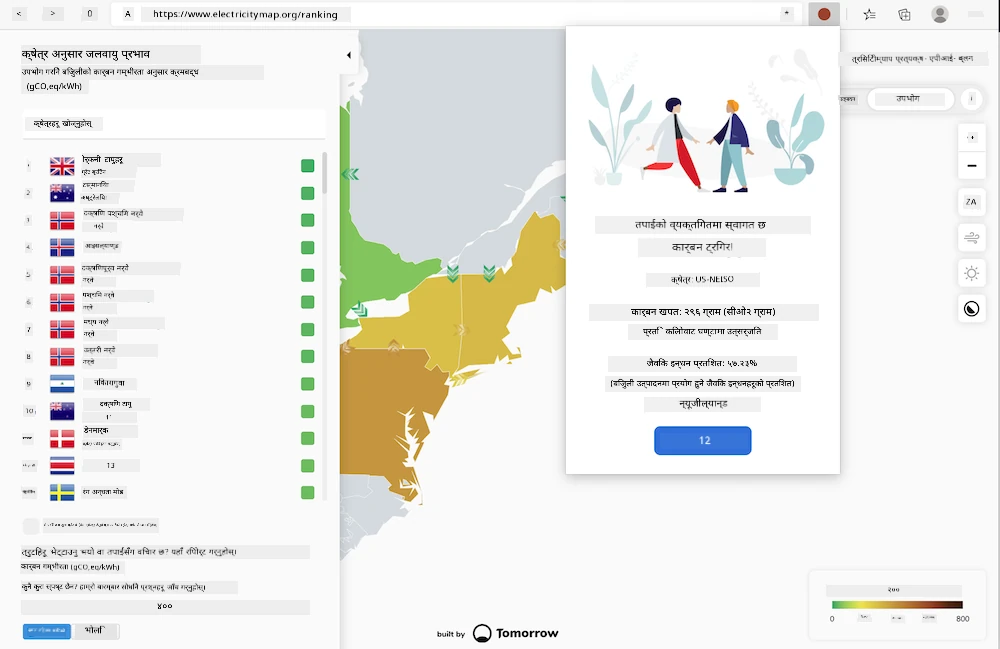
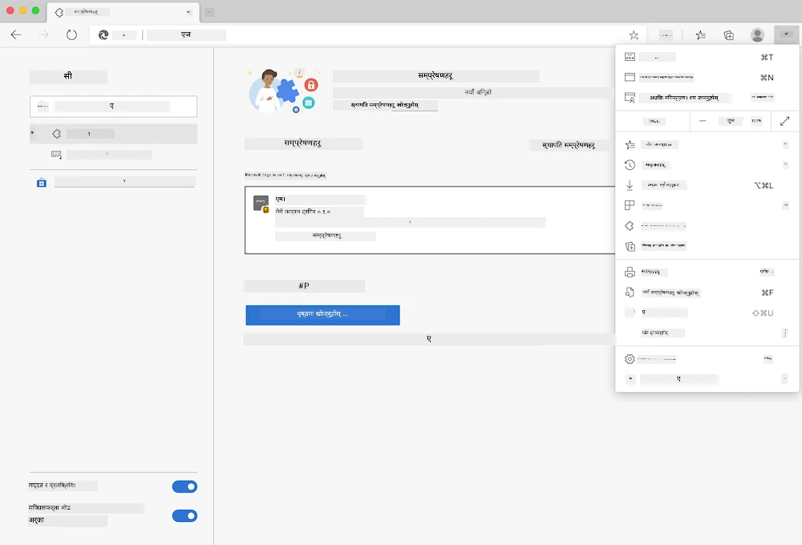

<!--
CO_OP_TRANSLATOR_METADATA:
{
  "original_hash": "9361268ca430b2579375009e1eceb5e5",
  "translation_date": "2025-08-25T23:57:58+00:00",
  "source_file": "5-browser-extension/solution/translation/README.fr.md",
  "language_code": "ne"
}
-->
# कार्बन ट्रिगर ब्राउजर एक्स्टेन्सन: पूरा भएको कोड

tmrow को C02 Signal API प्रयोग गरेर बिजुली खपत ट्र्याक गर्दै, एउटा ब्राउजर एक्स्टेन्सन बनाउनुहोस् जसले तपाईंलाई तपाईंको क्षेत्रको बिजुली खपतको बारेमा सिधै ब्राउजरमा सम्झना दिन्छ। यो विशेष एक्स्टेन्सनको प्रयोगले तपाईंलाई यी जानकारीहरूको आधारमा तपाईंको गतिविधिहरूको बारेमा निर्णय लिन मद्दत गर्नेछ।



## सुरु गर्न

तपाईंले [npm](https://npmjs.com) स्थापना गर्नुपर्नेछ। यो कोडको प्रतिलिपि तपाईंको कम्प्युटरको कुनै फोल्डरमा डाउनलोड गर्नुहोस्।

आवश्यक सबै प्याकेजहरू स्थापना गर्नुहोस्:

```
npm install
```

Webpack बाट एक्स्टेन्सन बनाउनुहोस्:

```
npm run build
```

Edge मा स्थापना गर्न, ब्राउजरको माथिल्लो दायाँ कुनामा रहेको 'तीन बिन्दु' मेनु प्रयोग गरेर Extensions प्यानल खोज्नुहोस्। त्यहाँबाट, 'लोड अनजिप्ड एक्स्टेन्सन' चयन गरेर नयाँ एक्स्टेन्सन लोड गर्नुहोस्। प्रॉम्प्टमा 'dist' फोल्डर खोल्नुहोस्, र एक्स्टेन्सन लोड हुनेछ। यसलाई प्रयोग गर्न, तपाईंलाई CO2 Signal API को लागि API की चाहिन्छ ([यहाँ ईमेल मार्फत प्राप्त गर्नुहोस्](https://www.co2signal.com/) - यो पृष्ठमा रहेको बाकसमा तपाईंको ईमेल प्रविष्ट गर्नुहोस्) र तपाईंको क्षेत्रको लागि [कोड](http://api.electricitymap.org/v3/zones) जुन [बिजुलीको नक्सा](https://www.electricitymap.org/map) सँग मेल खान्छ (उदाहरणका लागि, बोस्टनमा, म 'US-NEISO' प्रयोग गर्छु)।



एक पटक API की र क्षेत्र एक्स्टेन्सन इन्टरफेसमा प्रविष्ट गरेपछि, ब्राउजरको एक्स्टेन्सन बारमा रहेको रङ्गीन बिन्दु तपाईंको क्षेत्रको ऊर्जा खपतलाई प्रतिबिम्बित गर्न परिवर्तन हुनुपर्छ र तपाईंलाई ऊर्जा-गहन गतिविधिहरूको बारेमा संकेत दिनुपर्छ जुन तपाईंले गर्न उपयुक्त ठान्न सक्नुहुन्छ। यो 'बिन्दु' प्रणालीको अवधारणा मलाई [Energy Lollipop एक्स्टेन्सन](https://energylollipop.com/) बाट क्यालिफोर्नियाका उत्सर्जनहरूको लागि प्रेरित भएको हो।

**अस्वीकरण**:  
यो दस्तावेज़ AI अनुवाद सेवा [Co-op Translator](https://github.com/Azure/co-op-translator) प्रयोग गरी अनुवाद गरिएको हो। हामी यथासम्भव सटीकता सुनिश्चित गर्न प्रयास गर्छौं, तर कृपया ध्यान दिनुहोस् कि स्वचालित अनुवादहरूमा त्रुटि वा अशुद्धता हुन सक्छ। यसको मूल भाषामा रहेको मूल दस्तावेज़लाई आधिकारिक स्रोत मानिनुपर्छ। महत्त्वपूर्ण जानकारीका लागि, व्यावसायिक मानव अनुवाद सिफारिस गरिन्छ। यस अनुवादको प्रयोगबाट उत्पन्न हुने कुनै पनि गलतफहमी वा गलत व्याख्याको लागि हामी जिम्मेवार हुने छैनौं।