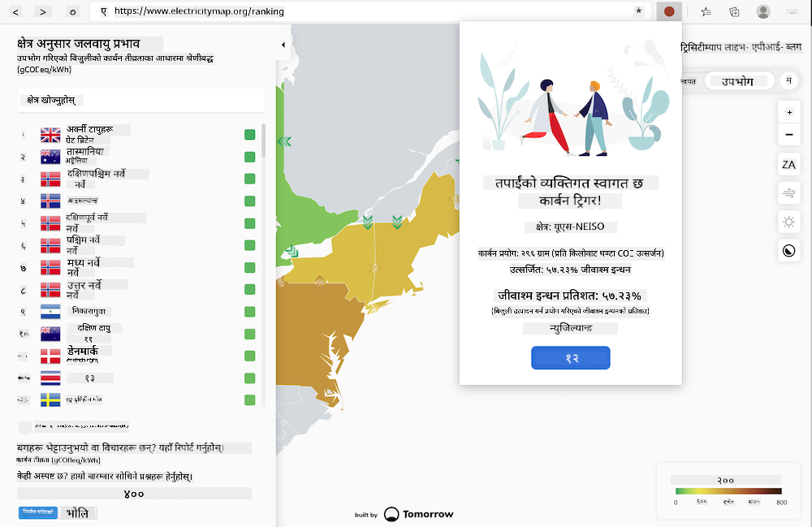
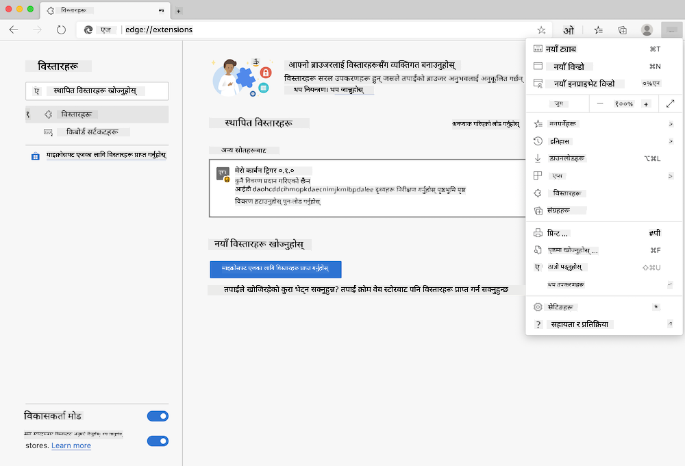

<!--
CO_OP_TRANSLATOR_METADATA:
{
  "original_hash": "26fd39046d264ba185dcb086d3a8cf3e",
  "translation_date": "2025-08-25T23:35:27+00:00",
  "source_file": "5-browser-extension/start/README.md",
  "language_code": "ne"
}
-->
# कार्बन ट्रिगर ब्राउजर एक्स्टेन्सन: सुरुवाती कोड

tmrow को C02 Signal API प्रयोग गरेर बिजुलीको प्रयोग ट्र्याक गर्न, एउटा ब्राउजर एक्स्टेन्सन बनाउनुहोस् जसले तपाईंलाई तपाईंको क्षेत्रको बिजुली प्रयोगको भारबारे ब्राउजरमै सम्झना दिन्छ। यो एक्स्टेन्सनलाई अनियमित रूपमा प्रयोग गर्दा तपाईंले यस जानकारीको आधारमा आफ्नो गतिविधिहरूको निर्णय लिन मद्दत गर्नेछ।



## सुरु गर्न

तपाईंले [npm](https://npmjs.com) स्थापना गर्नुपर्नेछ। यो कोडको प्रतिलिपि आफ्नो कम्प्युटरको कुनै फोल्डरमा डाउनलोड गर्नुहोस्।

आवश्यक सबै प्याकेजहरू स्थापना गर्नुहोस्:

```
npm install
```

Webpack बाट एक्स्टेन्सन बनाउनुहोस्:

```
npm run build
```

Edge मा स्थापना गर्न, ब्राउजरको माथिल्लो दायाँ कुनामा रहेको 'तीन डट' मेनु प्रयोग गरेर Extensions प्यानल खोज्नुहोस्। त्यहाँबाट, 'Load Unpacked' चयन गरेर नयाँ एक्स्टेन्सन लोड गर्नुहोस्। प्रम्प्टमा 'dist' फोल्डर खोल्नुहोस् र एक्स्टेन्सन लोड हुनेछ। यसलाई प्रयोग गर्न, तपाईंलाई CO2 Signal को API को लागि API key ([यहाँ इमेलमार्फत प्राप्त गर्नुहोस्](https://www.co2signal.com/) - यस पृष्ठमा आफ्नो इमेल बक्समा प्रविष्ट गर्नुहोस्) र [Electricity Map](https://www.electricitymap.org/map) सँग सम्बन्धित [तपाईंको क्षेत्रको कोड](http://api.electricitymap.org/v3/zones) आवश्यक हुनेछ (उदाहरणका लागि, बोस्टनमा म 'US-NEISO' प्रयोग गर्छु)।



एक पटक API key र क्षेत्र एक्स्टेन्सन इन्टरफेसमा प्रविष्ट गरेपछि, ब्राउजर एक्स्टेन्सन बारमा रहेको रङ्गीन डटले तपाईंको क्षेत्रको ऊर्जा प्रयोगलाई प्रतिबिम्बित गर्न परिवर्तन गर्नेछ र तपाईंलाई ऊर्जा-गहन गतिविधिहरूको लागि उपयुक्त सल्लाह दिनेछ। यो 'डट' प्रणालीको अवधारणा मलाई [Energy Lollipop एक्स्टेन्सन](https://energylollipop.com/) बाट क्यालिफोर्नियाको उत्सर्जनका लागि प्रेरित गरिएको हो।

**अस्वीकरण**:  
यो दस्तावेज़ AI अनुवाद सेवा [Co-op Translator](https://github.com/Azure/co-op-translator) प्रयोग गरेर अनुवाद गरिएको छ। हामी यथार्थताको लागि प्रयास गर्छौं, तर कृपया ध्यान दिनुहोस् कि स्वचालित अनुवादहरूमा त्रुटिहरू वा अशुद्धताहरू हुन सक्छ। यसको मूल भाषा मा रहेको मूल दस्तावेज़लाई आधिकारिक स्रोत मानिनुपर्छ। महत्वपूर्ण जानकारीको लागि, व्यावसायिक मानव अनुवाद सिफारिस गरिन्छ। यस अनुवादको प्रयोगबाट उत्पन्न हुने कुनै पनि गलतफहमी वा गलत व्याख्याको लागि हामी जिम्मेवार हुने छैनौं।