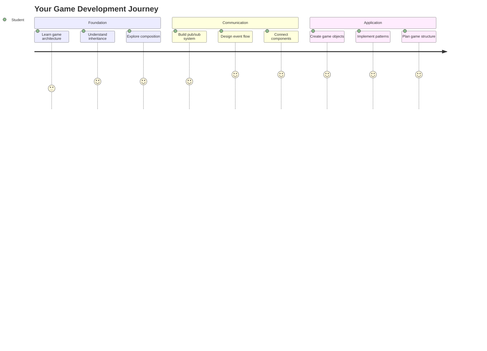
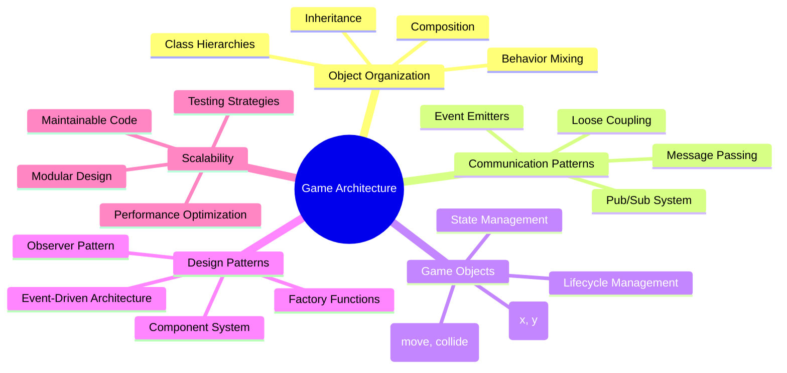
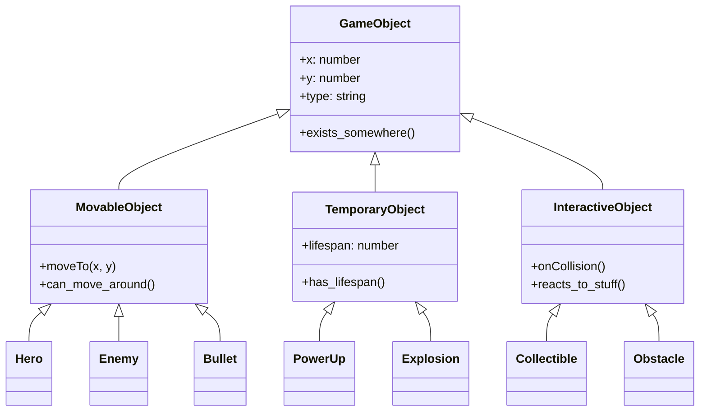
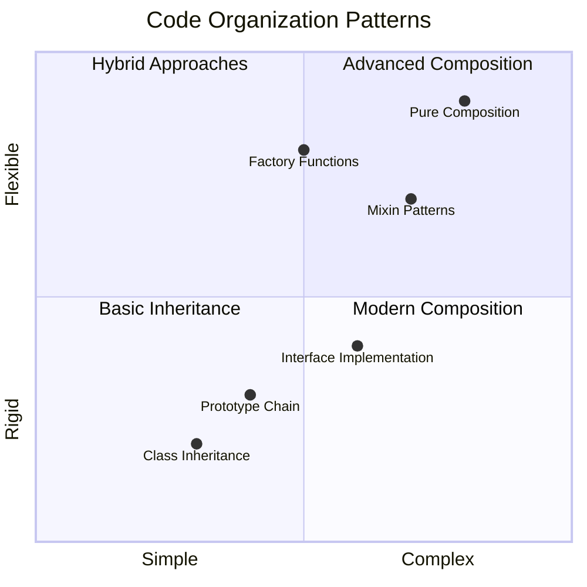
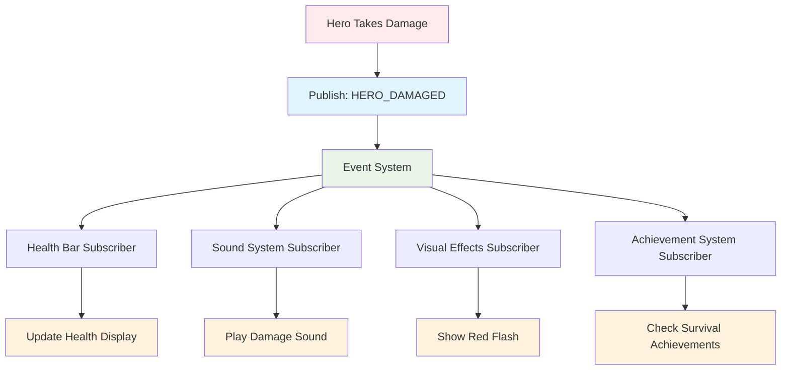
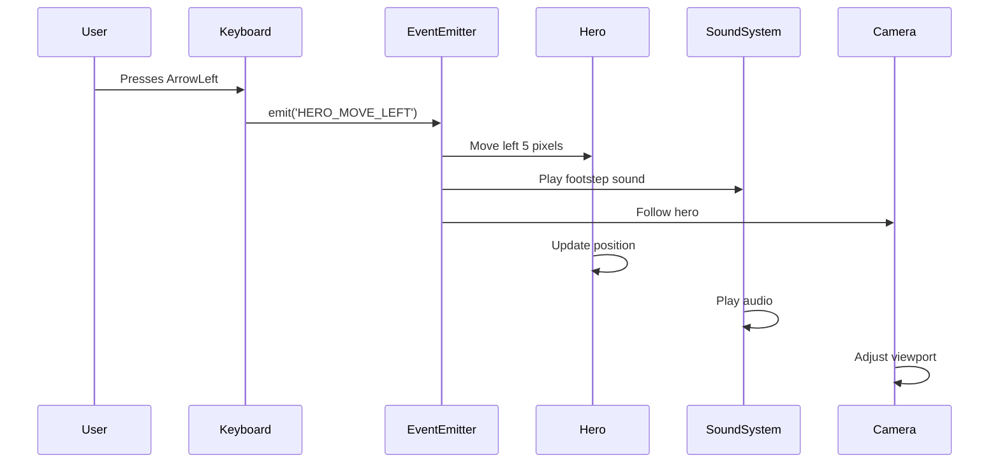
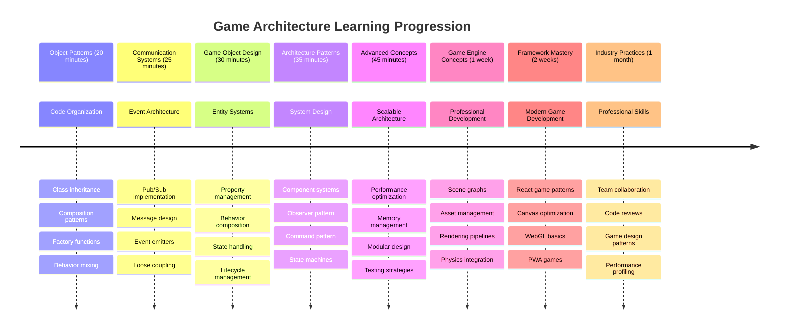

<!--
CO_OP_TRANSLATOR_METADATA:
{
  "original_hash": "a6332a7bb4d0be3bfd24199c83993777",
  "translation_date": "2025-11-03T15:54:53+00:00",
  "source_file": "6-space-game/1-introduction/README.md",
  "language_code": "ne"
}
-->
# स्पेस गेम बनाउनुहोस् भाग १: परिचय




जसरी नासाको मिशन कन्ट्रोलले स्पेस लन्चको समयमा विभिन्न प्रणालीहरू समन्वय गर्छ, हामी एउटा स्पेस गेम बनाउनेछौं जसले देखाउँछ कि कसरी प्रोग्रामका विभिन्न भागहरू सहज रूपमा सँगै काम गर्न सक्छन्। तपाईंले वास्तवमा खेल्न सक्ने केही सिर्जना गर्दा, तपाईंले कुनै पनि सफ्टवेयर परियोजनामा लागू हुने आवश्यक प्रोग्रामिङ अवधारणाहरू सिक्नुहुनेछ।

हामी कोडलाई व्यवस्थित गर्ने दुई आधारभूत दृष्टिकोणहरू अन्वेषण गर्नेछौं: इनहेरिटेन्स र कम्पोजिसन। यी केवल शैक्षिक अवधारणाहरू मात्र होइनन् - यी त्यस्ता ढाँचाहरू हुन् जसले भिडियो गेमदेखि बैंकिङ प्रणालीसम्म सबैलाई शक्ति दिन्छ। हामीले स्पेसक्राफ्टमा प्रयोग हुने संचार नेटवर्क जस्तै काम गर्ने पब/सब नामक संचार प्रणाली पनि कार्यान्वयन गर्नेछौं, जसले विभिन्न कम्पोनेन्टहरूलाई निर्भरता सिर्जना नगरी जानकारी साझा गर्न अनुमति दिन्छ।

यस श्रृंखलाको अन्त्यसम्ममा, तपाईंले स्केल र विकास गर्न सक्ने एप्लिकेसनहरू निर्माण गर्ने तरिका बुझ्नुहुनेछ - चाहे तपाईं गेमहरू, वेब एप्लिकेसनहरू, वा कुनै अन्य सफ्टवेयर प्रणाली विकास गर्दै हुनुहुन्छ।



## प्रि-लेक्चर क्विज

[प्रि-लेक्चर क्विज](https://ff-quizzes.netlify.app/web/quiz/29)

## गेम विकासमा इनहेरिटेन्स र कम्पोजिसन

जब परियोजनाहरू जटिलतामा बढ्छन्, कोडको संगठन महत्वपूर्ण हुन्छ। साधारण स्क्रिप्टको रूपमा सुरु भएको कुरा उचित संरचना बिना मर्मत गर्न गाह्रो हुन सक्छ - ठीक त्यस्तै जस्तो अपोलो मिशनहरूले हजारौं कम्पोनेन्टहरू बीच सावधानीपूर्वक समन्वयको आवश्यकता थियो।

हामी कोडलाई व्यवस्थित गर्न दुई आधारभूत दृष्टिकोणहरू अन्वेषण गर्नेछौं: इनहेरिटेन्स र कम्पोजिसन। प्रत्येकको अलग-अलग फाइदाहरू छन्, र दुवैलाई बुझ्नाले विभिन्न परिस्थितिहरूको लागि सही दृष्टिकोण छनोट गर्न मद्दत गर्दछ। हामी यी अवधारणाहरू हाम्रो स्पेस गेम मार्फत प्रदर्शन गर्नेछौं, जहाँ नायकहरू, शत्रुहरू, पावर-अपहरू, र अन्य वस्तुहरूले कुशलतापूर्वक अन्तरक्रिया गर्नुपर्छ।

✅ सबैभन्दा प्रसिद्ध प्रोग्रामिङ पुस्तकहरू मध्ये एक [डिजाइन प्याटर्न्स](https://en.wikipedia.org/wiki/Design_Patterns) को बारेमा हो।

कुनै पनि गेममा, तपाईंको `गेम वस्तुहरू` हुन्छन् - अन्तरक्रियात्मक तत्वहरू जसले तपाईंको गेम संसारलाई भरिदिन्छ। नायकहरू, शत्रुहरू, पावर-अपहरू, र दृश्य प्रभावहरू सबै गेम वस्तुहरू हुन्। प्रत्येक `x` र `y` मानहरू प्रयोग गरेर विशिष्ट स्क्रिन समन्वयमा अवस्थित हुन्छ, ठीक जस्तै समन्वय प्लेनमा बिन्दुहरू प्लट गर्दै।

तिनीहरूको दृश्य भिन्नताहरूको बाबजुद, यी वस्तुहरूले प्रायः आधारभूत व्यवहारहरू साझा गर्छन्:

- **तिनीहरू कतै अवस्थित छन्** - प्रत्येक वस्तुमा `x` र `y` समन्वय हुन्छ ताकि गेमले यसलाई कहाँ चित्रण गर्ने थाहा पाओस्।
- **धेरैले वरिपरि सर्न सक्छन्** - नायकहरू दौडन्छन्, शत्रुहरूले पछ्याउँछन्, गोलीहरू स्क्रिनभरि उड्छन्।
- **तिनीहरूको जीवनकाल हुन्छ** - केही सधैं रहन्छन्, अरू (जस्तै विस्फोटहरू) छोटो समयको लागि देखा पर्छन् र हराउँछन्।
- **तिनीहरूले प्रतिक्रिया दिन्छन्** - जब चीजहरू ठोक्किन्छन्, पावर-अपहरू सङ्कलन गरिन्छ, स्वास्थ्य बारहरू अपडेट हुन्छन्।

✅ प्याक-म्यान जस्तो गेमको बारेमा सोच्नुहोस्। के तपाईं यस खेलमा चार वस्तु प्रकारहरू पहिचान गर्न सक्नुहुन्छ?



### कोड मार्फत व्यवहार व्यक्त गर्दै

अब तपाईंले बुझ्नुभयो कि गेम वस्तुहरूले साझा गर्ने सामान्य व्यवहारहरू के हुन्, आउनुहोस् यी व्यवहारहरूलाई जाभास्क्रिप्टमा कार्यान्वयन गर्ने तरिका अन्वेषण गरौं। तपाईं कक्षाहरू वा व्यक्तिगत वस्तुहरूमा संलग्न विधिहरू मार्फत वस्तु व्यवहार व्यक्त गर्न सक्नुहुन्छ, र छनोट गर्नका लागि धेरै दृष्टिकोणहरू छन्।

**क्लास-आधारित दृष्टिकोण**

क्लासहरू र इनहेरिटेन्सले गेम वस्तुहरूलाई व्यवस्थित गर्न संरचित दृष्टिकोण प्रदान गर्दछ। कार्ल लिनियसद्वारा विकसित कर प्रणाली जस्तै, तपाईं सामान्य गुणहरू समावेश गर्ने आधार कक्षा संग सुरु गर्नुहुन्छ, त्यसपछि विशेष क्षमताहरू थप्दै यी आधारभूतहरूलाई इनहेरिट गर्ने विशेष कक्षाहरू सिर्जना गर्नुहुन्छ।

✅ इनहेरिटेन्स बुझ्न महत्त्वपूर्ण अवधारणा हो। [MDN को इनहेरिटेन्सको लेख](https://developer.mozilla.org/docs/Web/JavaScript/Inheritance_and_the_prototype_chain) मा थप जान्नुहोस्।

यहाँ कसरी तपाईं कक्षाहरू र इनहेरिटेन्स प्रयोग गरेर गेम वस्तुहरू कार्यान्वयन गर्न सक्नुहुन्छ:

```javascript
// Step 1: Create the base GameObject class
class GameObject {
  constructor(x, y, type) {
    this.x = x;
    this.y = y;
    this.type = type;
  }
}
```

**यसलाई चरणबद्ध रूपमा तोडौं:**
- हामी एउटा आधारभूत टेम्प्लेट सिर्जना गर्दैछौं जुन प्रत्येक गेम वस्तुले प्रयोग गर्न सक्छ।
- कन्स्ट्रक्टरले वस्तु कहाँ छ (`x`, `y`) र कस्तो प्रकारको वस्तु हो भनेर बचत गर्छ।
- यो आधार बनिन्छ जसमा तपाईंका सबै गेम वस्तुहरू निर्माण हुनेछ।

```javascript
// Step 2: Add movement capability through inheritance
class Movable extends GameObject {
  constructor(x, y, type) {
    super(x, y, type); // Call parent constructor
  }

  // Add the ability to move to a new position
  moveTo(x, y) {
    this.x = x;
    this.y = y;
  }
}
```

**माथिको कोडमा, हामीले:**
- **विस्तारित** GameObject कक्षालाई आन्दोलन कार्यक्षमता थप्न।
- **पेरेन्ट कन्स्ट्रक्टरलाई बोलाएको** `super()` प्रयोग गरेर इनहेरिटेड गुणहरू आरम्भ गर्न।
- **थपिएको** `moveTo()` विधि जसले वस्तुको स्थिति अपडेट गर्दछ।

```javascript
// Step 3: Create specific game object types
class Hero extends Movable {
  constructor(x, y) {
    super(x, y, 'Hero'); // Set type automatically
  }
}

class Tree extends GameObject {
  constructor(x, y) {
    super(x, y, 'Tree'); // Trees don't need movement
  }
}

// Step 4: Use your game objects
const hero = new Hero(0, 0);
hero.moveTo(5, 5); // Hero can move!

const tree = new Tree(10, 15);
// tree.moveTo() would cause an error - trees can't move
```

**यी अवधारणाहरू बुझ्दै:**
- **विशेषीकृत वस्तु प्रकारहरू सिर्जना गर्दछ** जसले उपयुक्त व्यवहारहरू इनहेरिट गर्छ।
- **देखाउँछ** कि इनहेरिटेन्सले चयनात्मक सुविधा समावेश गर्न अनुमति दिन्छ।
- **देखाउँछ** कि नायकहरू सर्न सक्छन् जबकि रूखहरू स्थिर रहन्छन्।
- **चित्रण गर्दछ** कि कक्षा पदानुक्रमले अनुपयुक्त कार्यहरू रोक्छ।

✅ केही मिनेट लिनुहोस् र प्याक-म्यान नायक (जस्तै, इन्की, पिन्की वा ब्लिन्की) पुनः कल्पना गर्नुहोस् र यसलाई जाभास्क्रिप्टमा कसरी लेखिनेछ।

**कम्पोजिसन दृष्टिकोण**

कम्पोजिसनले मोड्युलर डिजाइन दर्शन अनुसरण गर्दछ, ठीक जस्तै इन्जिनियरहरूले अन्तरिक्ष यानलाई विनिमेय कम्पोनेन्टहरूसँग डिजाइन गर्छन्। पेरेन्ट कक्षाबाट इनहेरिट गर्ने सट्टा, तपाईंले विशिष्ट व्यवहारहरू संयोजन गरेर वस्तुहरू सिर्जना गर्नुहुन्छ जसमा तिनीहरूलाई चाहिने कार्यक्षमता मात्र हुन्छ। यस दृष्टिकोणले कठोर पदानुक्रमीय बाधाहरू बिना लचिलोपन प्रदान गर्दछ।

```javascript
// Step 1: Create base behavior objects
const gameObject = {
  x: 0,
  y: 0,
  type: ''
};

const movable = {
  moveTo(x, y) {
    this.x = x;
    this.y = y;
  }
};
```

**यस कोडले के गर्छ:**
- **परिभाषित गर्दछ** आधार `gameObject` स्थिति र प्रकार गुणहरूसँग।
- **सिर्जना गर्दछ** अलग `movable` व्यवहार वस्तु आन्दोलन कार्यक्षमतासँग।
- **चिन्ता अलग गर्दछ** स्थिति डेटा र आन्दोलन तर्कलाई स्वतन्त्र राखेर।

```javascript
// Step 2: Compose objects by combining behaviors
const movableObject = { ...gameObject, ...movable };

// Step 3: Create factory functions for different object types
function createHero(x, y) {
  return {
    ...movableObject,
    x,
    y,
    type: 'Hero'
  };
}

function createStatic(x, y, type) {
  return {
    ...gameObject,
    x,
    y,
    type
  };
}
```

**माथिको कोडमा, हामीले:**
- **संयोजन गरेको** आधार वस्तु गुणहरू र आन्दोलन व्यवहारलाई स्प्रेड सिन्ट्याक्स प्रयोग गरेर।
- **फ्याक्टरी कार्यहरू सिर्जना गरेको** जसले अनुकूलित वस्तुहरू फर्काउँछ।
- **लचिलो वस्तु सिर्जना सक्षम गरेको** कठोर कक्षा पदानुक्रम बिना।
- **वस्तुहरूलाई ठीक त्यस्तै व्यवहारहरू दिन अनुमति दिएको** जसमा तिनीहरूलाई आवश्यकता छ।

```javascript
// Step 4: Create and use your composed objects
const hero = createHero(10, 10);
hero.moveTo(5, 5); // Works perfectly!

const tree = createStatic(0, 0, 'Tree');
// tree.moveTo() is undefined - no movement behavior was composed
```

**स्मरण गर्नका लागि मुख्य बिन्दुहरू:**
- **वस्तुहरूलाई मिश्रण गरेर कम्पोज गर्छ** व्यवहारहरू इनहेरिट गर्ने सट्टा।
- **कठोर इनहेरिटेन्स पदानुक्रमभन्दा बढी लचिलोपन प्रदान गर्छ।**
- **वस्तुहरूलाई ठीक त्यस्तै सुविधाहरू दिन अनुमति दिन्छ।**
- **सफा वस्तु संयोजनको लागि आधुनिक जाभास्क्रिप्ट स्प्रेड सिन्ट्याक्स प्रयोग गर्छ।**
```

**Which Pattern Should You Choose?**

**Which Pattern Should You Choose?**



> 💡 **प्रो टिप**: दुवै ढाँचाहरू आधुनिक जाभास्क्रिप्ट विकासमा आफ्नो स्थान राख्छन्। कक्षाहरू स्पष्ट रूपमा परिभाषित पदानुक्रमहरूको लागि राम्रो काम गर्छन्, जबकि कम्पोजिसनले अधिकतम लचिलोपनको आवश्यकता पर्दा चम्किन्छ।
> 
**कुन दृष्टिकोण कहिले प्रयोग गर्ने:**
- **इनहेरिटेन्स छनोट गर्नुहोस्** जब तपाईंसँग स्पष्ट "is-a" सम्बन्धहरू छन् (नायक *is-a* Movable वस्तु हो)।
- **कम्पोजिसन चयन गर्नुहोस्** जब तपाईंलाई "has-a" सम्बन्धहरू चाहिन्छ (नायकसँग *movement abilities* छन्)।
- **तपाईंको टोलीको प्राथमिकता र परियोजना आवश्यकताहरू विचार गर्नुहोस्।**
- **स्मरण गर्नुहोस्** कि तपाईं एउटै एप्लिकेसनमा दुवै दृष्टिकोणहरू मिश्रण गर्न सक्नुहुन्छ।

### 🔄 **शैक्षिक जाँच**
**वस्तु संगठन बुझाइ**: संचार ढाँचाहरूमा जानु अघि सुनिश्चित गर्नुहोस् कि तपाईं:
- ✅ इनहेरिटेन्स र कम्पोजिसनको बीचको फरक व्याख्या गर्न सक्नुहुन्छ।
- ✅ कक्षाहरू बनाम फ्याक्टरी कार्यहरू कहिले प्रयोग गर्ने पहिचान गर्न सक्नुहुन्छ।
- ✅ इनहेरिटेन्समा `super()` कुञ्जी शब्द कसरी काम गर्छ बुझ्न सक्नुहुन्छ।
- ✅ गेम विकासको लागि प्रत्येक दृष्टिकोणको फाइदाहरू पहिचान गर्न सक्नुहुन्छ।

**छोटो आत्म-परीक्षण**: तपाईं कसरी उड्ने शत्रु सिर्जना गर्नुहुन्छ जसले सर्न र उड्न दुवै सक्छ?
- **इनहेरिटेन्स दृष्टिकोण**: `class FlyingEnemy extends Movable`
- **कम्पोजिसन दृष्टिकोण**: `{ ...movable, ...flyable, ...gameObject }`

**वास्तविक-विश्व जडान**: यी ढाँचाहरू हरेक ठाउँमा देखा पर्दछन्:
- **React कम्पोनेंटहरू**: Props (कम्पोजिसन) बनाम कक्षा इनहेरिटेन्स।
- **गेम इन्जिनहरू**: इकाई-कम्पोनेंट प्रणालीहरूले कम्पोजिसन प्रयोग गर्छ।
- **मोबाइल एप्स**: UI फ्रेमवर्कहरूले प्रायः इनहेरिटेन्स पदानुक्रम प्रयोग गर्छ।

## संचार ढाँचाहरू: पब/सब प्रणाली

जब एप्लिकेसनहरू जटिल हुन्छन्, कम्पोनेंटहरू बीच संचार व्यवस्थापन चुनौतीपूर्ण हुन्छ। पब्लिश-सब्सक्राइब ढाँचाले (पब/सब) रेडियो प्रसारण जस्तै सिद्धान्तहरू प्रयोग गरेर यो समस्या समाधान गर्छ - एक ट्रान्समिटरले धेरै रिसीभरहरूलाई थाहा नपाई पुग्न सक्छ।

जब नायकले क्षति लिन्छ, के हुन्छ विचार गर्नुहोस्: स्वास्थ्य बार अपडेट हुन्छ, ध्वनि प्रभावहरू बज्छ, दृश्य प्रतिक्रिया देखा पर्दछ। नायक वस्तुलाई यी प्रणालीहरूसँग सीधा जोड्ने सट्टा, पब/सबले नायकलाई "क्षति लिइएको" सन्देश प्रसारण गर्न अनुमति दिन्छ। प्रतिक्रिया दिन आवश्यक पर्ने कुनै पनि प्रणालीले यस सन्देश प्रकारलाई सब्सक्राइब गर्न सक्छ र तदनुसार प्रतिक्रिया दिन सक्छ।

✅ **पब/सब** को अर्थ 'पब्लिश-सब्सक्राइब' हो।



### पब/सब आर्किटेक्चर बुझ्दै

पब/सब ढाँचाले तपाईंको एप्लिकेसनका विभिन्न भागहरूलाई ढिलोसँग जोडिएको राख्छ, जसको अर्थ तिनीहरू एकअर्कामा सीधा निर्भर नभई सँगै काम गर्न सक्छन्। यो अलगावले तपाईंको कोडलाई अधिक मर्मतयोग्य, परीक्षणयोग्य, र परिवर्तनहरूको लागि लचिलो बनाउँछ।

**पब/सबका मुख्य खेलाडीहरू:**
- **सन्देशहरू** – साधारण पाठ लेबलहरू जस्तै `'PLAYER_SCORED'` जसले के भयो वर्णन गर्छ (प्लस कुनै अतिरिक्त जानकारी)।
- **पब्लिशरहरू** – वस्तुहरू जसले "केही भयो!" भनेर चिच्याउँछन् जो कोही सुन्छ।
- **सब्सक्राइबरहरू** – वस्तुहरू जसले "म त्यो घटनाको बारेमा चासो राख्छु" भन्छन् र जब यो हुन्छ प्रतिक्रिया दिन्छन्।
- **इभेन्ट प्रणाली** – मध्यस्थ जसले सुनिश्चित गर्छ कि सन्देशहरू सही श्रोताहरूमा पुग्छ।

### इभेन्ट प्रणाली निर्माण गर्दै

आउनुहोस् यी अवधारणाहरू प्रदर्शन गर्ने सरल तर शक्तिशाली इभेन्ट प्रणाली सिर्जना गरौं:

```javascript
// Step 1: Create the EventEmitter class
class EventEmitter {
  constructor() {
    this.listeners = {}; // Store all event listeners
  }
  
  // Register a listener for a specific message type
  on(message, listener) {
    if (!this.listeners[message]) {
      this.listeners[message] = [];
    }
    this.listeners[message].push(listener);
  }
  
  // Send a message to all registered listeners
  emit(message, payload = null) {
    if (this.listeners[message]) {
      this.listeners[message].forEach(listener => {
        listener(message, payload);
      });
    }
  }
}
```

**यहाँ के हुन्छ तोड्दै:**
- **सिर्जना गर्छ** एक केन्द्रीय इभेन्ट व्यवस्थापन प्रणाली एक साधारण कक्षा प्रयोग गरेर।
- **स्रोताहरूलाई भण्डारण गर्छ** सन्देश प्रकारद्वारा व्यवस्थित वस्तुमा।
- **नयाँ स्रोताहरू दर्ता गर्छ** `on()` विधि प्रयोग गरेर।
- **सन्देशहरू प्रसारण गर्छ** सबै इच्छुक स्रोताहरूलाई `emit()` प्रयोग गरेर।
- **वैकल्पिक डेटा पेलोडहरूलाई समर्थन गर्छ** सम्बन्धित जानकारी पास गर्न।

### सबै सँगै राख्दै: व्यावहारिक उदाहरण

ठिक छ, आउनुहोस् यसलाई कार्यमा हेर्नुहोस्! हामी एउटा साधारण आन्दोलन प्रणाली निर्माण गर्नेछौं जसले देखाउँछ कि पब/सब कति सफा र लचिलो हुन सक्छ:

```javascript
// Step 1: Define your message types
const Messages = {
  HERO_MOVE_LEFT: 'HERO_MOVE_LEFT',
  HERO_MOVE_RIGHT: 'HERO_MOVE_RIGHT',
  ENEMY_SPOTTED: 'ENEMY_SPOTTED'
};

// Step 2: Create your event system and game objects
const eventEmitter = new EventEmitter();
const hero = createHero(0, 0);
```

**यस कोडले के गर्छ:**
- **परिभाषित गर्छ** सन्देश नामहरूमा टाइपो रोक्नको लागि एक स्थिरांक वस्तु।
- **सिर्जना गर्छ** एक इभेन्ट इमिटर उदाहरण सबै संचार व्यवस्थापन गर्न।
- **आरम्भ गर्छ** नायक वस्तु सुरुवात स्थितिमा।

```javascript
// Step 3: Set up event listeners (subscribers)
eventEmitter.on(Messages.HERO_MOVE_LEFT, () => {
  hero.moveTo(hero.x - 5, hero.y);
  console.log(`Hero moved to position: ${hero.x}, ${hero.y}`);
});

eventEmitter.on(Messages.HERO_MOVE_RIGHT, () => {
  hero.moveTo(hero.x + 5, hero.y);
  console.log(`Hero moved to position: ${hero.x}, ${hero.y}`);
});
```

**माथिको कोडमा, हामीले:**
- **दर्ता गरेको** इभेन्ट स्रोताहरू जसले आन्दोलन सन्देशहरूमा प्रतिक्रिया दिन्छ।
- **नायकको स्थिति अपडेट गरेको** आन्दोलन दिशाको आधारमा।
- **कन्सोल लगिङ थपेको** नायकको स्थिति परिवर्तनहरू ट्र्याक गर्न।
- **आन्दोलन तर्कलाई इनपुट ह्यान्डलिङबाट अलग गरेको।**

```javascript
// Step 4: Connect keyboard input to events (publishers)
window.addEventListener('keydown', (event) => {
  switch(event.key) {
    case 'ArrowLeft':
      eventEmitter.emit(Messages.HERO_MOVE_LEFT);
      break;
    case 'ArrowRight':
      eventEmitter.emit(Messages.HERO_MOVE_RIGHT);
      break;
  }
});
```

**यी अवधारणाहरू बुझ्दै:**
- **किबोर्ड इनपुटलाई गेम इभेन्टहरूसँग जोड्छ** बिना कडा जोड।
- **इनपुट प्रणालीलाई गेम वस्तुहरूसँग अप्रत्यक्ष रूपमा संचार गर्न सक्षम बनाउँछ।**
- **एकै किबोर्ड घटनाहरूमा धेरै प्रणालीहरूलाई प्रतिक्रिया दिन अनुमति दिन्छ।**
- **किबोर्ड वा आन्दोलन कोडलाई परिवर्तन नगरी नयाँ इनपुट विधिहरू थप्न सजिलो बनाउँछ।**



> 💡 **प्रो टिप**: यस ढाँचाको सुन्दरता लचिलोपनमा छ! तपाईंले ध्वनि प्रभावहरू, स्क्रिन शेक, वा पार्टिकल प्रभावहरू सजिलै थप्न सक्नुहुन्छ केवल थप इभेन्ट स्रोताहरू थपेर – विद्यमान किबोर्ड वा आन्दोलन कोडलाई संशोधन गर्न आवश्यक छैन।
> 
**तपाईंलाई यो दृष्टिकोण किन मनपर्छ:**
- नयाँ सुविधाहरू थप्न धेरै सजिलो हुन्छ – केवल तपाईंलाई चासो लाग्ने घटनाहरू सुन्नुहोस्।
- एउटै घटनामा धेरै चीजहरूले एकअर्कामा बाधा नपारी प्रतिक्रिया दिन सक्छ।
- परीक्षण धेरै सरल हुन्छ किनकि प्रत्येक टुक्रा स्वतन्त्र रूपमा काम गर्छ।
- जब केही बिग्रन्छ, तपाईंलाई थाहा हुन्छ कि कहाँ हेर्ने।

### किन पब/सब प्रभावकारी रूपमा स्केल हुन्छ

पब/सब ढाँचाले एप्लिकेसनहरू जटिलतामा बढ्दै जाँदा सरलता कायम राख्छ। दर्जनौं शत्रुहरू, गतिशील UI अपडेटहरू, वा ध्वनि प्रणालीहरू व्यवस्थापन गर्दा, ढाँचाले वास्तुकलामा परिवर्तन नगरी बढ्दो स्केललाई सम्हाल्छ। नयाँ सुविधाहरू विद्यमान इभेन्ट प्रणालीमा एकीकृत हुन्छन् बिना स्थापित कार्यक्षमतामा असर नगरी।

> ⚠️ **सामान्य गल्ती**: धेरै विशिष्ट सन्देश प्रकारहरू प्रारम्भमा सिर्जना नगर्नुहोस्। व्यापक श्रेणीहरूसँग सुरु गर्नुहोस् र तपाईंको गेमको आवश्यकताहरू स्पष्ट हुँदै जाँदा तिनीहरूलाई परिष्कृत गर्नुहोस्।
> 
**पालना गर्नका लागि उत्तम अभ्यासहरू:**
- **समूह बनाउँछ** सम्बन्धित सन्देशहरूलाई तार्किक श्रेणीहरूमा।
- **वर्णनात्मक नामहरू प्रयोग गर्छ** जसले स्पष्ट रूपमा के भयो संकेत गर्छ।
- **सन्देश पेलोडहरू सरल र केन्द्रित राख्छ।**
- **तपाईंको सन्देश प्रकारहरूलाई दस्तावेज बनाउँछ** टोली सहयोगका लागि।

### 🔄 **शैक्षिक जाँच**
**इभेन्ट-ड्राइभन आर्किटेक्चर बुझाइ**: पूर्ण प्रणालीको तपाईंको
खेलको आर्किटेक्चरलाई सुधार गर्न पब-सब ढाँचाले कसरी मद्दत गर्न सक्छ भन्ने विचार गर्नुहोस्। कुन कम्पोनेन्टहरूले घटनाहरू उत्पन्न गर्नुपर्छ र प्रणालीले कसरी प्रतिक्रिया दिनुपर्छ भन्ने पहिचान गर्नुहोस्। खेलको अवधारणा डिजाइन गर्नुहोस् र यसको कम्पोनेन्टहरू बीचको सञ्चार ढाँचाको नक्सा बनाउनुहोस्।

## पोस्ट-व्याख्यान क्विज

[पोस्ट-व्याख्यान क्विज](https://ff-quizzes.netlify.app/web/quiz/30)

## समीक्षा र आत्म-अध्ययन

पब/सबको बारेमा थप जान्नको लागि [यसको बारेमा पढ्नुहोस्](https://docs.microsoft.com/azure/architecture/patterns/publisher-subscriber/?WT.mc_id=academic-77807-sagibbon)।

### ⚡ **अर्को ५ मिनेटमा तपाईंले गर्न सक्ने कुरा**
- [ ] कुनै पनि HTML5 खेल अनलाइन खोल्नुहोस् र यसको कोडलाई DevTools प्रयोग गरेर जाँच गर्नुहोस्
- [ ] एउटा साधारण HTML5 क्यानभास तत्व सिर्जना गर्नुहोस् र आधारभूत आकार कोर्नुहोस्
- [ ] `setInterval` प्रयोग गरेर साधारण एनिमेसन लूप बनाउन प्रयास गर्नुहोस्
- [ ] क्यानभास API दस्तावेज अन्वेषण गर्नुहोस् र कोर्ने विधि प्रयास गर्नुहोस्

### 🎯 **यो घण्टामा तपाईंले हासिल गर्न सक्ने कुरा**
- [ ] पोस्ट-पाठ क्विज पूरा गर्नुहोस् र खेल विकास अवधारणाहरू बुझ्नुहोस्
- [ ] HTML, CSS, र JavaScript फाइलहरूको साथमा आफ्नो खेल परियोजना संरचना सेट गर्नुहोस्
- [ ] निरन्तर अपडेट र रेंडर गर्ने आधारभूत खेल लूप सिर्जना गर्नुहोस्
- [ ] क्यानभासमा आफ्नो पहिलो खेल स्प्राइटहरू कोर्नुहोस्
- [ ] छविहरू र ध्वनिहरूको लागि आधारभूत सम्पत्ति लोडिंग कार्यान्वयन गर्नुहोस्

### 📅 **तपाईंको साप्ताहिक खेल सिर्जना**
- [ ] सबै योजना गरिएका सुविधाहरू सहित पूर्ण स्पेस खेल पूरा गर्नुहोस्
- [ ] परिष्कृत ग्राफिक्स, ध्वनि प्रभावहरू, र सहज एनिमेसनहरू थप्नुहोस्
- [ ] खेल अवस्थाहरू कार्यान्वयन गर्नुहोस् (सुरुवात स्क्रिन, गेमप्ले, गेम ओभर)
- [ ] स्कोरिङ प्रणाली र खेलाडी प्रगति ट्र्याकिङ सिर्जना गर्नुहोस्
- [ ] आफ्नो खेललाई उपकरणहरूमा उत्तरदायी र पहुँचयोग्य बनाउनुहोस्
- [ ] आफ्नो खेल अनलाइन साझा गर्नुहोस् र खेलाडीहरूबाट प्रतिक्रिया संकलन गर्नुहोस्

### 🌟 **तपाईंको मासिक खेल विकास**
- [ ] विभिन्न विधा र यान्त्रिकी अन्वेषण गर्दै बहु खेलहरू निर्माण गर्नुहोस्
- [ ] Phaser वा Three.js जस्ता खेल विकास फ्रेमवर्क सिक्नुहोस्
- [ ] ओपन सोर्स खेल विकास परियोजनाहरूमा योगदान गर्नुहोस्
- [ ] उन्नत खेल प्रोग्रामिङ ढाँचाहरू र अनुकूलनमा महारत हासिल गर्नुहोस्
- [ ] आफ्नो खेल विकास सीपहरू प्रदर्शन गर्ने पोर्टफोलियो सिर्जना गर्नुहोस्
- [ ] खेल विकास र अन्तरक्रियात्मक मिडियामा रुचि राख्ने अन्यलाई मार्गदर्शन गर्नुहोस्

## 🎯 तपाईंको खेल विकास महारत समयरेखा



### 🛠️ तपाईंको खेल आर्किटेक्चर टूलकिट सारांश

यो पाठ पूरा गरेपछि, तपाईंले अब:
- **डिजाइन ढाँचा महारत**: उत्तराधिकार बनाम संरचना व्यापार-अफहरूको समझ
- **घटनामा आधारित आर्किटेक्चर**: स्केलेबल सञ्चारको लागि पब/सब कार्यान्वयन
- **वस्तु-उन्मुख डिजाइन**: वर्ग पदानुक्रम र व्यवहार संरचना
- **आधुनिक JavaScript**: फ्याक्टरी कार्यहरू, स्प्रेड सिन्ट्याक्स, र ES6+ ढाँचाहरू
- **स्केलेबल आर्किटेक्चर**: ढिलो युग्मन र मोड्युलर डिजाइन सिद्धान्तहरू
- **खेल विकास आधार**: इकाई प्रणालीहरू र कम्पोनेन्ट ढाँचाहरू
- **व्यावसायिक ढाँचाहरू**: कोड संगठनको लागि उद्योग-मानक दृष्टिकोणहरू

**वास्तविक-विश्व अनुप्रयोगहरू**: यी ढाँचाहरू सीधा लागू हुन्छन्:
- **फ्रन्टएन्ड फ्रेमवर्कहरू**: React/Vue कम्पोनेन्ट आर्किटेक्चर र राज्य व्यवस्थापन
- **ब्याकएन्ड सेवाहरू**: माइक्रोसर्भिस सञ्चार र घटनामा आधारित प्रणालीहरू
- **मोबाइल विकास**: iOS/Android एप आर्किटेक्चर र सूचना प्रणालीहरू
- **खेल इन्जिनहरू**: Unity, Unreal, र वेब-आधारित खेल विकास
- **उद्यम सफ्टवेयर**: घटनाको स्रोत र वितरित प्रणाली डिजाइन
- **API डिजाइन**: RESTful सेवाहरू र वास्तविक-समय सञ्चार

**व्यावसायिक सीपहरू प्राप्त गरियो**: अब तपाईं:
- **डिजाइन** प्रमाणित ढाँचाहरू प्रयोग गरेर स्केलेबल सफ्टवेयर आर्किटेक्चरहरू
- **कार्यान्वयन** जटिल अन्तरक्रियाहरू ह्यान्डल गर्ने घटनामा आधारित प्रणालीहरू
- **चयन** विभिन्न परिदृश्यहरूको लागि उपयुक्त कोड संगठन रणनीतिहरू
- **डिबग** र ढिलो युग्मन प्रणालीहरू प्रभावकारी रूपमा मर्मत गर्नुहोस्
- **सञ्चार** उद्योग-मानक शब्दावली प्रयोग गरेर प्राविधिक निर्णयहरू

**अर्को स्तर**: तपाईं यी ढाँचाहरूलाई वास्तविक खेलमा कार्यान्वयन गर्न, उन्नत खेल विकास विषयहरू अन्वेषण गर्न, वा वेब अनुप्रयोगहरूमा यी आर्किटेक्चरल अवधारणाहरू लागू गर्न तयार हुनुहुन्छ!

🌟 **उपलब्धि अनलक गरियो**: तपाईंले साधारण खेलदेखि जटिल उद्यम प्रणालीसम्म शक्ति प्रदान गर्ने मौलिक सफ्टवेयर आर्किटेक्चर ढाँचाहरूमा महारत हासिल गर्नुभएको छ!

## असाइनमेन्ट

[खेलको मोकअप बनाउनुहोस्](assignment.md)

---

**अस्वीकरण**:  
यो दस्तावेज AI अनुवाद सेवा [Co-op Translator](https://github.com/Azure/co-op-translator) प्रयोग गरेर अनुवाद गरिएको हो। हामी शुद्धताको लागि प्रयास गर्छौं, तर कृपया ध्यान दिनुहोस् कि स्वचालित अनुवादमा त्रुटिहरू वा अशुद्धताहरू हुन सक्छ। यसको मूल भाषा मा रहेको दस्तावेजलाई आधिकारिक स्रोत मानिनुपर्छ। महत्वपूर्ण जानकारीको लागि, व्यावसायिक मानव अनुवाद सिफारिस गरिन्छ। यस अनुवादको प्रयोगबाट उत्पन्न हुने कुनै पनि गलतफहमी वा गलत व्याख्याको लागि हामी जिम्मेवार हुनेछैनौं।