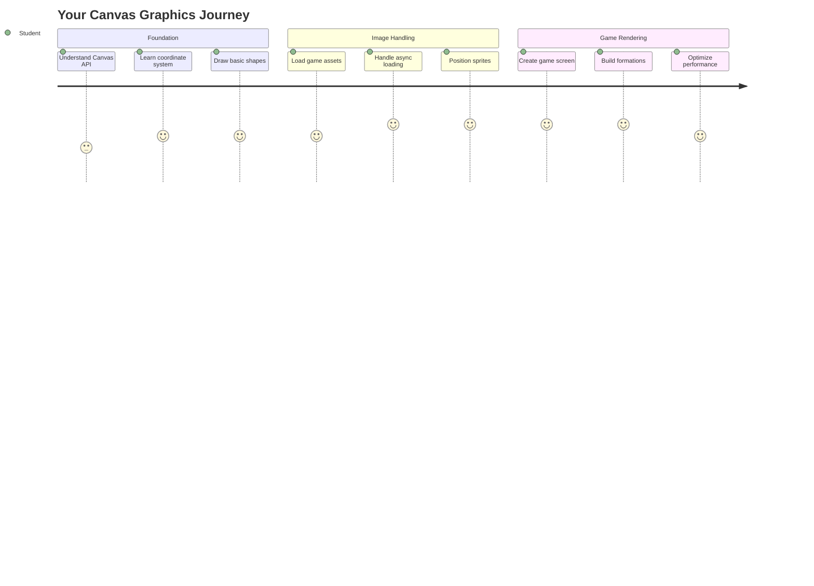
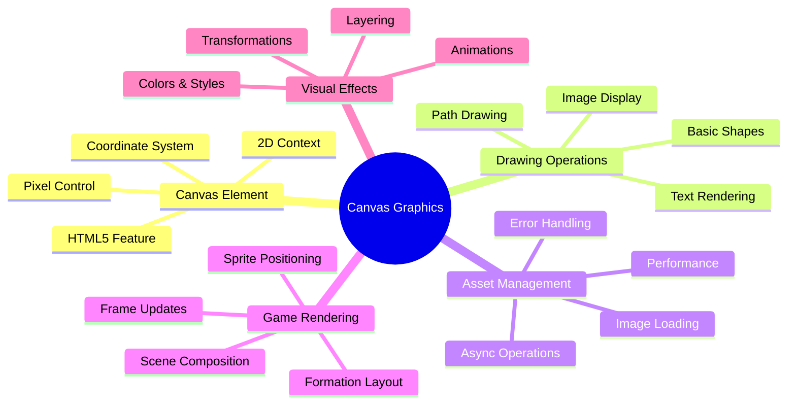
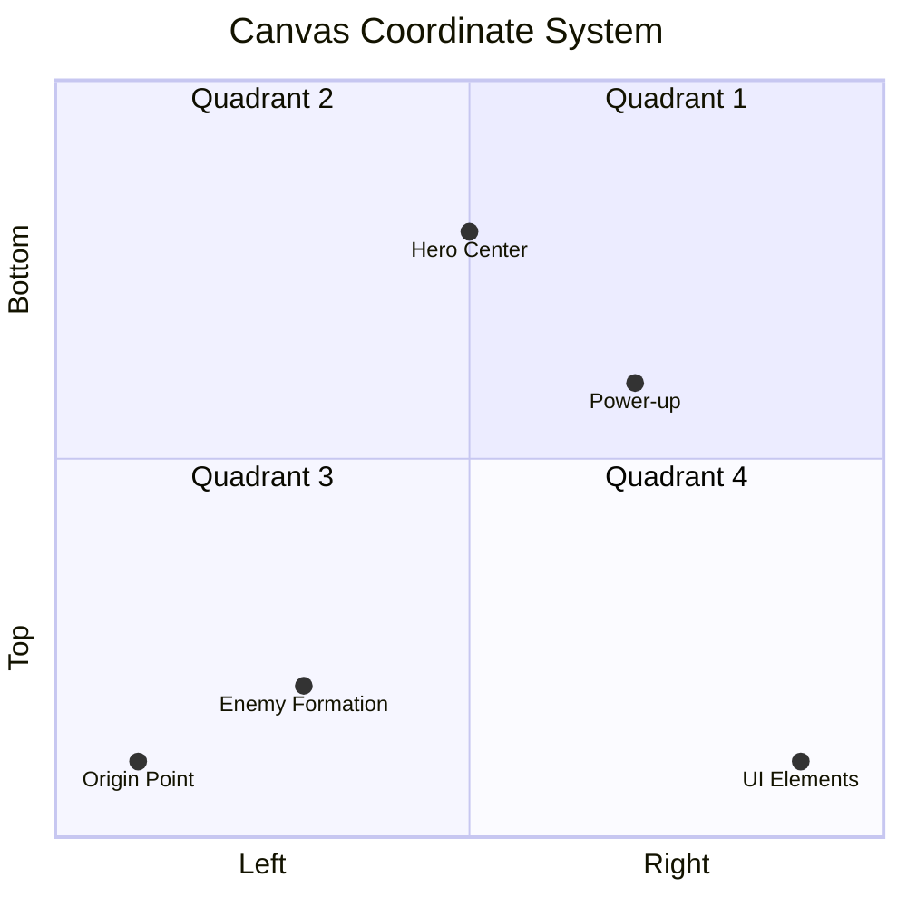
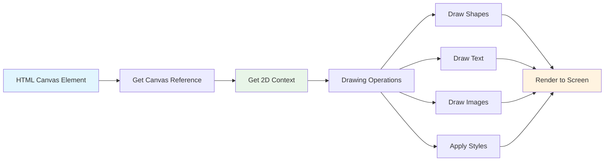
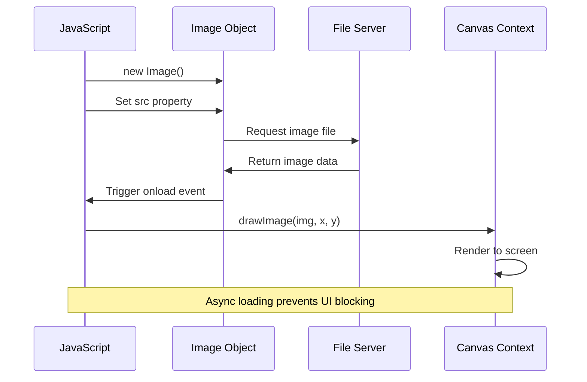
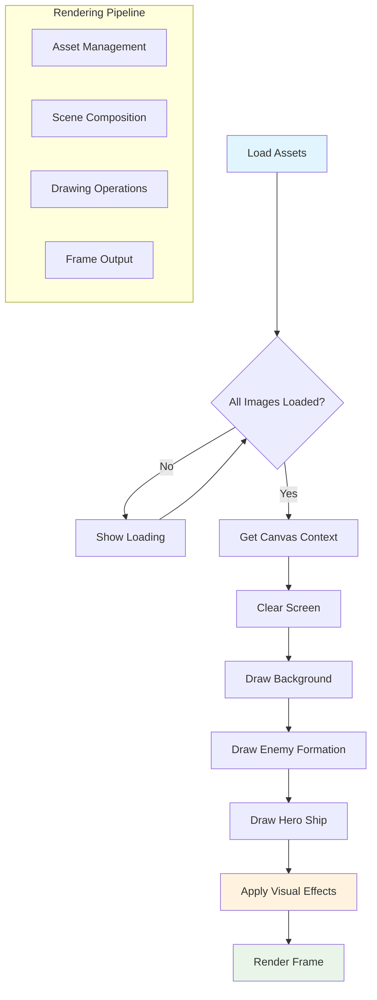
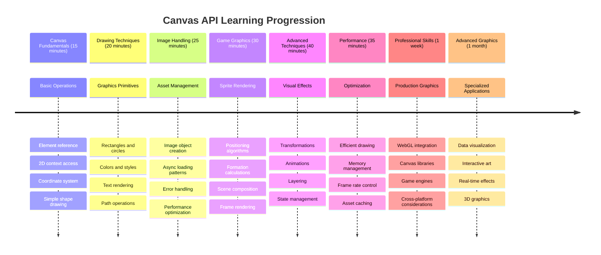

<!--
CO_OP_TRANSLATOR_METADATA:
{
  "original_hash": "7994743c5b21fdcceb36307916ef249a",
  "translation_date": "2025-11-03T15:50:53+00:00",
  "source_file": "6-space-game/2-drawing-to-canvas/README.md",
  "language_code": "ne"
}
-->
# स्पेस गेम निर्माण भाग २: हिरो र राक्षसलाई क्यानभासमा चित्रण गर्नुहोस्



क्यानभास एपीआई वेब विकासको एक शक्तिशाली विशेषता हो जसले तपाईंको ब्राउजरमा नै गतिशील, अन्तरक्रियात्मक ग्राफिक्स सिर्जना गर्न अनुमति दिन्छ। यस पाठमा, हामी खाली HTML `<canvas>` तत्वलाई हिरो र राक्षसहरूले भरिएको खेलको संसारमा रूपान्तरण गर्नेछौं। क्यानभासलाई तपाईंको डिजिटल कला बोर्डको रूपमा सोच्नुहोस् जहाँ कोड दृश्यमा परिणत हुन्छ।

हामीले अघिल्लो पाठमा सिकेको कुरालाई अगाडि बढाउँदैछौं, र अब हामी दृश्य पक्षमा गहिरो रूपमा जान्छौं। तपाईं खेलका स्प्राइटहरू लोड र प्रदर्शन गर्न, तत्वहरूलाई ठ्याक्कै स्थान दिन, र तपाईंको स्पेस गेमको दृश्य आधार सिर्जना गर्न सिक्नुहुनेछ। यसले स्थिर वेब पृष्ठहरू र गतिशील, अन्तरक्रियात्मक अनुभवहरू बीचको खाडललाई पुल गर्दछ।

यस पाठको अन्त्यसम्ममा, तपाईंको हिरो जहाज सही रूपमा स्थित हुनेछ र शत्रुहरूको गठन युद्धको लागि तयार हुनेछ। तपाईंले आधुनिक खेलहरूले ब्राउजरमा ग्राफिक्स कसरी रेंडर गर्छन् भन्ने बुझ्नुहुनेछ र आफ्नै अन्तरक्रियात्मक दृश्य अनुभवहरू सिर्जना गर्ने सीप प्राप्त गर्नुहुनेछ। क्यानभास ग्राफिक्स अन्वेषण गरौं र तपाईंको स्पेस गेमलाई जीवन्त बनाऔं!



## प्रि-लेक्चर क्विज

[प्रि-लेक्चर क्विज](https://ff-quizzes.netlify.app/web/quiz/31)

## क्यानभास

तपाईंको `<canvas>` तत्व वास्तवमा के हो? यो HTML5 को समाधान हो जसले वेब ब्राउजरहरूमा गतिशील ग्राफिक्स र एनिमेसनहरू सिर्जना गर्न अनुमति दिन्छ। नियमित छविहरू वा भिडियोहरू स्थिर हुन्छन्, तर क्यानभासले स्क्रिनमा देखिने सबै कुरामा पिक्सेल-स्तरको नियन्त्रण दिन्छ। यसले खेलहरू, डेटा भिजुअलाइजेसनहरू, र अन्तरक्रियात्मक कलाका लागि यो उत्तम बनाउँछ। यसलाई प्रोग्राम गर्न मिल्ने ड्रइङ सतहको रूपमा सोच्नुहोस् जहाँ जाभास्क्रिप्ट तपाईंको ब्रश बन्छ।

डिफल्टमा, क्यानभास तत्व तपाईंको पृष्ठमा खाली, पारदर्शी आयतजस्तो देखिन्छ। तर यहीँ यसको सम्भावना लुकेको छ! यसको वास्तविक शक्ति तब प्रकट हुन्छ जब तपाईं जाभास्क्रिप्ट प्रयोग गरेर आकारहरू चित्रण गर्नुहुन्छ, छविहरू लोड गर्नुहुन्छ, एनिमेसनहरू सिर्जना गर्नुहुन्छ, र चीजहरूलाई प्रयोगकर्ताको अन्तरक्रियामा प्रतिक्रिया दिन बनाउनुहुन्छ। यो १९६० को दशकमा बेल ल्याब्सका प्रारम्भिक कम्प्युटर ग्राफिक्स अग्रगामीहरूले पहिलो डिजिटल एनिमेसनहरू सिर्जना गर्न प्रत्येक पिक्सेल प्रोग्राम गर्नुपरेको जस्तै हो।

✅ [क्यानभास एपीआईको बारेमा थप पढ्नुहोस्](https://developer.mozilla.org/docs/Web/API/Canvas_API) MDN मा।

यो सामान्यतया पृष्ठको बडीको भागको रूपमा यसरी घोषणा गरिन्छ:

```html
<canvas id="myCanvas" width="200" height="100"></canvas>
```

**यो कोडले के गर्छ:**
- **सेट गर्छ** `id` एट्रिब्युट ताकि तपाईं यस विशेष क्यानभास तत्वलाई जाभास्क्रिप्टमा सन्दर्भ गर्न सक्नुहुन्छ
- **परिभाषित गर्छ** पिक्सेलमा `width` ताकि क्यानभासको क्षैतिज आकार नियन्त्रण गर्न सकियोस्
- **स्थापना गर्छ** पिक्सेलमा `height` ताकि क्यानभासको ठाडो आयाम निर्धारण गर्न सकियोस्

## साधारण ज्यामिति चित्रण गर्नुहोस्

अब तपाईंलाई क्यानभास तत्व के हो भन्ने थाहा छ, आउनुहोस् यसमा वास्तवमा चित्रण गर्ने अन्वेषण गरौं! क्यानभासले एक समन्वय प्रणाली प्रयोग गर्दछ जुन गणितको कक्षाबाट परिचित लाग्न सक्छ, तर कम्प्युटर ग्राफिक्ससँग विशेष रूपमा एक महत्त्वपूर्ण मोड छ।

क्यानभासले कार्टेसियन समन्वय प्रणाली प्रयोग गर्दछ जसमा x-अक्ष (क्षैतिज) र y-अक्ष (ठाडो) हुन्छ। तर यहाँ मुख्य भिन्नता छ: गणितको कक्षाको समन्वय प्रणालीको विपरीत, मूल बिन्दु `(0,0)` माथि-बायाँ कुनाबाट सुरु हुन्छ, जहाँ x-मूल्यहरू दायाँतिर बढ्छन् र y-मूल्यहरू तलतिर बढ्छन्। यो दृष्टिकोण प्रारम्भिक कम्प्युटर डिस्प्लेहरूबाट आएको हो जहाँ इलेक्ट्रोन बीमहरू माथिबाट तल स्क्यान गर्थे, जसले माथि-बायाँलाई प्राकृतिक सुरुवात बिन्दु बनायो।




> छवि [MDN](https://developer.mozilla.org/docs/Web/API/Canvas_API/Tutorial/Drawing_shapes) बाट

क्यानभास तत्वमा चित्रण गर्न, तपाईंले क्यानभास ग्राफिक्सको आधार बनाउने तीन-चरण प्रक्रिया पछ्याउनुहुनेछ। तपाईंले यो केही पटक गरेपछि, यो स्वाभाविक बन्छ:



1. **क्यानभास तत्वको सन्दर्भ प्राप्त गर्नुहोस्** (अन्य HTML तत्व जस्तै)
2. **२D रेंडरिङ सन्दर्भ प्राप्त गर्नुहोस्** – यसले सबै चित्रण विधिहरू प्रदान गर्दछ
3. **चित्रण सुरु गर्नुहोस्!** सन्दर्भको बिल्ट-इन विधिहरू प्रयोग गरेर तपाईंको ग्राफिक्स सिर्जना गर्नुहोस्

यो कोडमा यसरी देखिन्छ:

```javascript
// Step 1: Get the canvas element
const canvas = document.getElementById("myCanvas");

// Step 2: Get the 2D rendering context
const ctx = canvas.getContext("2d");

// Step 3: Set fill color and draw a rectangle
ctx.fillStyle = 'red';
ctx.fillRect(0, 0, 200, 200); // x, y, width, height
```

**यसलाई चरणबद्ध रूपमा तोडौं:**
- हामीले **क्यानभास तत्वलाई समात्यौं** यसको ID प्रयोग गरेर र यसलाई भेरिएबलमा स्टोर गर्यौं
- हामीले **२D रेंडरिङ सन्दर्भ प्राप्त गर्यौं** – यो हाम्रो चित्रण विधिहरूको टूलकिट हो
- हामीले क्यानभासलाई **बतायौं** कि हामी `fillStyle` प्रोपर्टी प्रयोग गरेर चीजहरू रातो रंगले भरना चाहन्छौं
- हामीले **चित्रण गर्यौं** एक आयत जसको सुरुवात बिन्दु (0,0) हो र २०० पिक्सेल चौडाइ र उचाइ छ

✅ क्यानभास एपीआई मुख्य रूपमा २D आकारहरूमा केन्द्रित छ, तर तपाईं वेब साइटमा ३D तत्वहरू पनि चित्रण गर्न सक्नुहुन्छ; यसका लागि तपाईं [WebGL API](https://developer.mozilla.org/docs/Web/API/WebGL_API) प्रयोग गर्न सक्नुहुन्छ।

तपाईं क्यानभास एपीआईको साथमा धेरै प्रकारका चीजहरू चित्रण गर्न सक्नुहुन्छ जस्तै:

- **ज्यामितीय आकारहरू**, हामीले आयत चित्रण गर्ने तरिका देखाइसकेका छौं, तर तपाईं धेरै अन्य चीजहरू पनि चित्रण गर्न सक्नुहुन्छ।
- **पाठ**, तपाईं कुनै पनि फन्ट र रंगको साथमा पाठ चित्रण गर्न सक्नुहुन्छ।
- **छविहरू**, तपाईं छवि सम्पत्तिमा आधारित छवि जस्तै .jpg वा .png चित्रण गर्न सक्नुहुन्छ।

✅ प्रयास गर्नुहोस्! तपाईंलाई आयत चित्रण गर्ने तरिका थाहा छ, के तपाईं पृष्ठमा वृत्त चित्रण गर्न सक्नुहुन्छ? CodePen मा केही रोचक क्यानभास चित्रणहरू हेर्नुहोस्। यहाँ एक [विशेष प्रभावशाली उदाहरण](https://codepen.io/dissimulate/pen/KrAwx) छ।

### 🔄 **शैक्षिक जाँच**
**क्यानभासको आधारभूत ज्ञान**: छविहरू लोड गर्न अघि सुनिश्चित गर्नुहोस् कि तपाईं:
- ✅ क्यानभास समन्वय प्रणाली गणितीय समन्वय प्रणालीबाट कसरी फरक छ भनेर व्याख्या गर्न सक्नुहुन्छ
- ✅ क्यानभास चित्रण अपरेशनहरूको तीन-चरण प्रक्रिया बुझ्न सक्नुहुन्छ
- ✅ २D रेंडरिङ सन्दर्भले के प्रदान गर्छ भनेर पहिचान गर्न सक्नुहुन्छ
- ✅ fillStyle र fillRect कसरी सँगै काम गर्छन् भनेर वर्णन गर्न सक्नुहुन्छ

**छोटो आत्म-परीक्षण**: तपाईं कसरी (100, 50) स्थितिमा २५ रेडियसको निलो वृत्त चित्रण गर्नुहुन्छ?
```javascript
ctx.fillStyle = 'blue';
ctx.beginPath();
ctx.arc(100, 50, 25, 0, 2 * Math.PI);
ctx.fill();
```

**क्यानभास चित्रण विधिहरू जुन तपाईंले अब जान्नुभयो:**
- **fillRect()**: भरिएको आयत चित्रण गर्दछ
- **fillStyle**: रंग र ढाँचाहरू सेट गर्दछ
- **beginPath()**: नयाँ चित्रण पथ सुरु गर्दछ
- **arc()**: वृत्त र वक्रहरू सिर्जना गर्दछ

## छवि सम्पत्ति लोड र चित्रण गर्नुहोस्

साधारण आकारहरू चित्रण गर्नु सुरूवातका लागि उपयोगी छ, तर अधिकांश खेलहरूलाई वास्तविक छविहरू चाहिन्छ! स्प्राइटहरू, पृष्ठभूमि, र टेक्स्चरहरूले खेलहरूलाई दृश्य अपील दिन्छ। क्यानभासमा छविहरू लोड र प्रदर्शन गर्नु ज्यामितीय आकारहरू चित्रण गर्ने भन्दा फरक छ, तर प्रक्रिया बुझिसकेपछि यो सरल छ।

हामीले एउटा `Image` वस्तु सिर्जना गर्नुपर्छ, हाम्रो छवि फाइल लोड गर्नुपर्छ (यो असिंक्रोनस रूपमा हुन्छ, जसको अर्थ "पृष्ठभूमिमा"), र यो तयार भएपछि क्यानभासमा चित्रण गर्नुपर्छ। यो दृष्टिकोणले सुनिश्चित गर्दछ कि तपाईंको छविहरू सही रूपमा प्रदर्शन हुन्छन् बिना तपाईंको एप्लिकेशनलाई अवरोध नगरी।



### आधारभूत छवि लोडिङ

```javascript
const img = new Image();
img.src = 'path/to/my/image.png';
img.onload = () => {
  // Image loaded and ready to be used
  console.log('Image loaded successfully!');
};
```

**यो कोडमा के भइरहेको छ:**
- हामीले **नयाँ Image वस्तु सिर्जना गर्यौं** हाम्रो स्प्राइट वा टेक्स्चर राख्न
- हामीले **बतायौं** कुन छवि फाइल लोड गर्न स्रोत पथ सेट गरेर
- हामीले **लोड इभेन्टको लागि सुनेका छौं** ताकि छवि प्रयोग गर्न तयार भएको समय थाहा पाउन सकियोस्

### छवि लोड गर्नको लागि राम्रो तरिका

यहाँ छवि लोडिङलाई सम्हाल्नको लागि एक अधिक मजबुत तरिका छ जुन व्यावसायिक विकासकर्ताहरूले सामान्यतया प्रयोग गर्छन्। हामी छवि लोडिङलाई Promise-आधारित कार्यमा राख्नेछौं – यो दृष्टिकोण, जब जाभास्क्रिप्ट Promises ES6 मा मानक बन्यो, तपाईंको कोडलाई अधिक व्यवस्थित बनाउँछ र त्रुटिहरूलाई सुन्दर रूपमा सम्हाल्छ:

```javascript
function loadAsset(path) {
  return new Promise((resolve, reject) => {
    const img = new Image();
    img.src = path;
    img.onload = () => {
      resolve(img);
    };
    img.onerror = () => {
      reject(new Error(`Failed to load image: ${path}`));
    };
  });
}

// Modern usage with async/await
async function initializeGame() {
  try {
    const heroImg = await loadAsset('hero.png');
    const monsterImg = await loadAsset('monster.png');
    // Images are now ready to use
  } catch (error) {
    console.error('Failed to load game assets:', error);
  }
}
```

**हामीले यहाँ के गरेका छौं:**
- **Promise मा लपेटेका छौं** सबै छवि लोडिङ तर्क ताकि हामी यसलाई राम्रोसँग सम्हाल्न सकौं
- **त्रुटि ह्यान्डलिङ थपेका छौं** जसले वास्तवमा हामीलाई केहि गलत भएको बताउँछ
- **आधुनिक async/await सिन्ट्याक्स प्रयोग गरेका छौं** किनकि यो पढ्न धेरै सफा छ
- **try/catch ब्लकहरू समावेश गरेका छौं** कुनै पनि लोडिङ समस्यालाई सुन्दर रूपमा सम्हाल्न

तपाईंको छविहरू लोड भएपछि, तिनीहरूलाई क्यानभासमा चित्रण गर्नु वास्तवमा धेरै सरल छ:

```javascript
async function renderGameScreen() {
  try {
    // Load game assets
    const heroImg = await loadAsset('hero.png');
    const monsterImg = await loadAsset('monster.png');

    // Get canvas and context
    const canvas = document.getElementById("myCanvas");
    const ctx = canvas.getContext("2d");

    // Draw images to specific positions
    ctx.drawImage(heroImg, canvas.width / 2, canvas.height / 2);
    ctx.drawImage(monsterImg, 0, 0);
  } catch (error) {
    console.error('Failed to render game screen:', error);
  }
}
```

**यसलाई चरणबद्ध रूपमा व्याख्या गरौं:**
- हामीले **हाम्रो हिरो र राक्षस छविहरू लोड गर्यौं** पृष्ठभूमिमा await प्रयोग गरेर
- हामीले **हाम्रो क्यानभास तत्व समात्यौं** र आवश्यक २D रेंडरिङ सन्दर्भ प्राप्त गर्यौं
- हामीले **हिरो छवि केन्द्रमा स्थित गर्यौं** केही छिटो समन्वय गणित प्रयोग गरेर
- हामीले **राक्षस छवि माथि-बायाँ कुनामा राख्यौं** हाम्रो शत्रु गठन सुरु गर्न
- हामीले **कुनै पनि त्रुटि समात्यौं** जुन लोडिङ वा रेंडरिङको क्रममा हुन सक्छ



## अब तपाईंको खेल निर्माण सुरु गर्ने समय हो

अब हामी सबै कुरा एकसाथ राखेर तपाईंको स्पेस गेमको दृश्य आधार सिर्जना गर्नेछौं। तपाईंले क्यानभासको आधारभूत ज्ञान र छवि लोडिङ प्रविधिहरूको ठोस समझ पाउनुभएको छ, त्यसैले यो व्यावहारिक खण्डले तपाईंलाई सही रूपमा स्थित स्प्राइटहरूसहितको पूर्ण खेल स्क्रिन निर्माण गर्न मार्गदर्शन गर्नेछ।

### के निर्माण गर्ने

तपाईंले क्यानभास तत्व भएको वेब पृष्ठ निर्माण गर्नुहुनेछ। यसले `1024*768` को कालो स्क्रिन रेंडर गर्नुपर्छ। हामीले तपाईंलाई दुई छविहरू प्रदान गरेका छौं:

- हिरो जहाज

   

- 5*5 राक्षस

   

### विकास सुरु गर्न सिफारिस गरिएका चरणहरू

`your-work` उप फोल्डरमा सिर्जना गरिएका स्टार्ट फाइलहरू पत्ता लगाउनुहोस्। तपाईंको प्रोजेक्ट संरचनामा समावेश हुनुपर्छ:

```bash
your-work/
├── assets/
│   ├── enemyShip.png
│   └── player.png
├── index.html
├── app.js
└── package.json
```

**तपाईंले केसँग काम गर्दै हुनुहुन्छ:**
- **खेल स्प्राइटहरू** `assets/` फोल्डरमा छन् ताकि सबै व्यवस्थित रहोस्
- **तपाईंको मुख्य HTML फाइल** क्यानभास तत्व सेटअप गर्दछ र सबै कुरा तयार गर्दछ
- **एक जाभास्क्रिप्ट फाइल** जहाँ तपाईं आफ्नो खेल रेंडरिङ जादू लेख्नुहुनेछ
- **एक package.json** जसले विकास सर्भर सेटअप गर्दछ ताकि तपाईं स्थानीय रूपमा परीक्षण गर्न सक्नुहुन्छ

यो फोल्डरलाई Visual Studio Code मा खोल्नुहोस् विकास सुरु गर्न। तपाईंलाई Visual Studio Code, NPM, र Node.js स्थापना भएको स्थानीय विकास वातावरण चाहिन्छ। यदि तपाईंको कम्प्युटरमा `npm` सेटअप छैन भने, [यसलाई कसरी स्थापना गर्ने](https://www.npmjs.com/get-npm) हेर्नुहोस्।

`your-work` फोल्डरमा नेभिगेट गरेर आफ्नो विकास सर्भर सुरु गर्नुहोस्:

```bash
cd your-work
npm start
```

**यो कमाण्डले केही धेरै राम्रो काम गर्छ:**
- **स्थानीय सर्भर सुरु गर्छ** `http://localhost:5000` मा ताकि तपाईं आफ्नो खेल परीक्षण गर्न सक्नुहुन्छ
- **तपाईंका सबै फाइलहरू सही रूपमा सर्भ गर्छ** ताकि तपाईंको ब्राउजरले तिनीहरूलाई सही रूपमा लोड गर्न सकियोस्
- **तपाईंका फाइलहरू परिवर्तनको लागि हेर्छ** ताकि तपाईं सहज रूपमा विकास गर्न सक्नुहुन्छ
- **तपाईंलाई** व्यावसायिक विकास वातावरण दिन्छ ताकि सबै कुरा परीक्षण गर्न सकियोस्

> 💡 **नोट**: तपाईंको ब्राउजरले सुरुमा खाली पृष्ठ देखाउनेछ – यो अपेक्षित हो! तपाईंले कोड थप्दै जाँदा, आफ्नो ब्राउजरलाई रिफ्रेस गर्नुहोस् परिवर्तनहरू हेर्न। यो पुनरावृत्त विकास दृष्टिकोण नासाले अपोलो गाइडन्स कम्प्युटर निर्माण गर्दा अपनाएको जस्तै हो – प्रत्येक कम्पोनेन्ट परीक्षण गर्दै यसलाई ठूलो प्रणालीमा एकीकृत गर्नु अघि।

### कोड थप्नुहोस्

`your-work/app.js` मा आवश्यक कोड थप्नुहोस् निम्न कार्यहरू पूरा गर्न:

1. **कालो पृष्ठभूमि भएको क्यानभास चित्रण गर्नुहोस्**
   > 💡 **यसरी गर्नुहोस्**: `/app.js` मा TODO पत्ता लगाउनुहोस् र दुई लाइन मात्र थप्नुहोस्। `ctx.fillStyle` लाई कालोमा सेट गर्नुहोस्, त्यसपछि `ctx.fillRect()` प्रयोग गरेर (0,0) बाट सुरु गर्दै क्यानभासको आयामहरू प्रयोग गर्नुहोस्। सजिलो!

2. **खेल टेक्स्चरहरू लोड गर्नुहोस्**
   > 💡 **यसरी गर्नुहोस्**: `await loadAsset()` प्रयोग गरेर तपाईंको प्लेयर र शत्रु छविहरू लोड गर्नुहोस्। तिनीहरूलाई भेरिएबलहरूमा स्टोर गर्नुहोस् ताकि तपाईं पछि प्रयोग गर्न सक्नुहुन्छ। सम्झनुहोस् – तिनीहरू देखिने छैनन् जबसम्म तपाईं वास्तवमा तिनीहरूलाई चित्रण गर्नुहुन्न!

3. **हिरो जहाजलाई केन्द्र-तलको स्थितिमा चित्रण गर्नुहोस्**
   > 💡 **यसरी गर्नुहोस्**: `ctx.drawImage()` प्रयोग गरेर तपाईंको हिरोलाई स्थित गर्नुहोस्। x-समन्वयको लागि, `canvas.width / 2 - 45` प्रयोग गर्नुहोस् केन्द्रमा राख्न, र y-समन्वयको लागि `canvas.height - canvas.height / 4` प्रयोग गर्नुहोस् तलको क्षेत्रमा राख्न।

4. **राक्षस जहाजहरूको 5×5 गठन चित्रण गर्नुहोस्**
   > 💡 **यसरी गर्नुहोस्**: `createEnemies` कार्य पत्ता लगाउनुहोस् र नेस्टेड लूप सेटअप गर्नुहोस्। तपाईंले स्पेसिङ र पोजिसनिङको लागि केही गणित गर्नुपर्नेछ, तर चिन्ता नगर्नुहोस् – म तपाईंलाई ठ्याक्कै कसरी गर्ने देखाउँछु!

पहिले, सही शत्रु गठन लेआउटको लागि Constants स्थापना गर्नुहोस्:

```javascript
const ENEMY_TOTAL = 5;
const ENEMY_SPACING = 98;
const FORMATION_WIDTH = ENEMY_TOTAL * ENEMY_SPACING;
const START_X = (canvas.width - FORMATION_WIDTH) / 2;
const STOP_X = START_X + FORMATION_WIDTH;
```

**यी Constants के गर्छन् भनेर तोडौं:**
- हामीले **प्रति पङ्क्ति र स्तम्भ ५ शत्रुहरू सेट गरेका छौं** (एक राम्रो 5×5 ग्रिड)
- हामीले **शत्रुहरू बीच कति स्पेस राख्ने परिभाषित गरेका छौं** ताकि तिनीहरू भीडभाड देखिएनन्
- हामीले **हाम्रो सम्पूर्ण गठन कति चौडा हुनेछ गणना गरेका छौं**
- हामीले **कहाँ सुरु र रोक्ने गणना गरेका छौं** ताकि गठन केन्द्रित देखियोस्

@@CODE
- **समन्वय प्रणालीहरू**: गणितलाई स्क्रिन स्थितिमा अनुवाद गर्ने
- **स्प्राइट व्यवस्थापन**: खेलको ग्राफिक्स लोड गर्ने र देखाउने
- **गठन एल्गोरिदमहरू**: व्यवस्थित लेआउटका लागि गणितीय ढाँचाहरू
- **एसिंक्रोनस अपरेशनहरू**: आधुनिक जाभास्क्रिप्ट प्रयोग गरेर सहज प्रयोगकर्ता अनुभव

## परिणाम

तयार परिणाम यसरी देखिनुपर्छ:


## समाधान

पहिला आफैं प्रयास गर्नुहोस् तर यदि अड्किनुभयो भने, [समाधान](../../../../6-space-game/2-drawing-to-canvas/solution/app.js) हेर्नुहोस्।

---

## GitHub Copilot Agent Challenge 🚀

Agent मोड प्रयोग गरेर निम्न चुनौती पूरा गर्नुहोस्:

**विवरण:** Canvas API प्रविधिहरू प्रयोग गरेर आफ्नो स्पेस गेम क्यानभासमा दृश्य प्रभावहरू र अन्तरक्रियात्मक तत्वहरू थप्नुहोस्।

**प्रेरणा:** `enhanced-canvas.html` नामको नयाँ फाइल बनाउनुहोस् जसमा पृष्ठभूमिमा एनिमेटेड ताराहरू, नायक जहाजको लागि पल्सिंग स्वास्थ्य बार, र शत्रु जहाजहरू तल सर्दै जाने देखिन्छ। ताराहरूको चमक र अपासिटीको लागि र्यान्डम स्थान प्रयोग गरेर तिनीहरूलाई क्यानभासमा बनाउनुहोस्, स्वास्थ्य स्तरको आधारमा रंग परिवर्तन गर्ने स्वास्थ्य बार (हरियो > पहेंलो > रातो) कार्यान्वयन गर्नुहोस्, र शत्रु जहाजहरूलाई विभिन्न गतिमा स्क्रिन तल सर्दै जाने एनिमेट गर्नुहोस्।

[agent mode](https://code.visualstudio.com/blogs/2025/02/24/introducing-copilot-agent-mode) को बारेमा थप जान्नुहोस्।

## 🚀 चुनौती

तपाईंले 2D-केंद्रित Canvas API को बारेमा सिक्नुभएको छ; [WebGL API](https://developer.mozilla.org/docs/Web/API/WebGL_API) हेर्नुहोस्, र 3D वस्तु बनाउने प्रयास गर्नुहोस्।

## पोस्ट-व्याख्यान क्विज

[पोस्ट-व्याख्यान क्विज](https://ff-quizzes.netlify.app/web/quiz/32)

## समीक्षा र आत्म अध्ययन

Canvas API को बारेमा [पढेर](https://developer.mozilla.org/docs/Web/API/Canvas_API) थप जान्नुहोस्।

### ⚡ **अगाडि ५ मिनेटमा तपाईं के गर्न सक्नुहुन्छ**
- [ ] ब्राउजर कन्सोल खोल्नुहोस् र `document.createElement('canvas')` प्रयोग गरेर क्यानभास तत्व बनाउनुहोस्
- [ ] क्यानभास सन्दर्भमा `fillRect()` प्रयोग गरेर आयत बनाउने प्रयास गर्नुहोस्
- [ ] `fillStyle` प्रोपर्टी प्रयोग गरेर विभिन्न रंगहरू प्रयोग गर्नुहोस्
- [ ] `arc()` विधि प्रयोग गरेर साधारण वृत्त बनाउनुहोस्

### 🎯 **अगाडि एक घण्टामा तपाईं के गर्न सक्नुहुन्छ**
- [ ] पाठ-पछिको क्विज पूरा गर्नुहोस् र क्यानभासको आधारभूत कुराहरू बुझ्नुहोस्
- [ ] बहु आकार र रंगहरू भएको क्यानभास ड्रइङ एप्लिकेसन बनाउनुहोस्
- [ ] आफ्नो खेलको लागि छवि लोड गर्ने र स्प्राइट रेंडरिङ कार्यान्वयन गर्नुहोस्
- [ ] वस्तुहरू क्यानभासमा सर्दै जाने साधारण एनिमेशन बनाउनुहोस्
- [ ] क्यानभास रूपान्तरणहरू जस्तै स्केलिङ, घुमाउने, र अनुवाद अभ्यास गर्नुहोस्

### 📅 **तपाईंको हप्ताको क्यानभास यात्रा**
- [ ] परिष्कृत ग्राफिक्स र स्प्राइट एनिमेशनसहित स्पेस गेम पूरा गर्नुहोस्
- [ ] ग्रेडियेन्ट, ढाँचाहरू, र कम्पोजिटिङ जस्ता उन्नत क्यानभास प्रविधिहरूमा महारत हासिल गर्नुहोस्
- [ ] क्यानभास प्रयोग गरेर अन्तरक्रियात्मक दृश्यहरू बनाउनुहोस्
- [ ] सहज प्रदर्शनको लागि क्यानभास अनुकूलन प्रविधिहरू सिक्नुहोस्
- [ ] विभिन्न उपकरणहरू भएको ड्रइङ वा पेन्टिङ एप्लिकेसन बनाउनुहोस्
- [ ] क्यानभाससँग रचनात्मक कोडिङ ढाँचाहरू र जेनेरेटिभ आर्ट अन्वेषण गर्नुहोस्

### 🌟 **तपाईंको महिनाको ग्राफिक्स महारत**
- [ ] Canvas 2D र WebGL प्रयोग गरेर जटिल दृश्य एप्लिकेसनहरू बनाउनुहोस्
- [ ] ग्राफिक्स प्रोग्रामिङ अवधारणाहरू र शेडर आधारभूत कुराहरू सिक्नुहोस्
- [ ] ओपन सोर्स ग्राफिक्स लाइब्रेरीहरू र दृश्य उपकरणहरूमा योगदान गर्नुहोस्
- [ ] ग्राफिक्स-गहन एप्लिकेसनहरूको लागि प्रदर्शन अनुकूलनमा महारत हासिल गर्नुहोस्
- [ ] क्यानभास प्रोग्रामिङ र कम्प्युटर ग्राफिक्सको बारेमा शैक्षिक सामग्री बनाउनुहोस्
- [ ] दृश्य अनुभवहरू सिर्जना गर्न अरूलाई मद्दत गर्ने ग्राफिक्स प्रोग्रामिङ विशेषज्ञ बन्नुहोस्

## 🎯 तपाईंको क्यानभास ग्राफिक्स महारतको समयरेखा



### 🛠️ तपाईंको क्यानभास ग्राफिक्स टूलकिट सारांश

यस पाठ पूरा गरेपछि, तपाईंसँग अब छ:
- **Canvas API महारत**: 2D ग्राफिक्स प्रोग्रामिङको पूर्ण समझ
- **समन्वय गणित**: सटीक स्थिति र लेआउट एल्गोरिदमहरू
- **संपत्ति व्यवस्थापन**: व्यावसायिक छवि लोड गर्ने र त्रुटि ह्यान्डल गर्ने
- **रेंडरिङ पाइपलाइन**: दृश्य संरचना गर्न व्यवस्थित दृष्टिकोण
- **खेल ग्राफिक्स**: स्प्राइट स्थिति र गठन गणनाहरू
- **एसिंक्रोनस प्रोग्रामिङ**: सहज प्रदर्शनको लागि आधुनिक जाभास्क्रिप्ट ढाँचाहरू
- **दृश्य प्रोग्रामिङ**: गणितीय अवधारणाहरूलाई स्क्रिन ग्राफिक्समा अनुवाद गर्ने

**वास्तविक-विश्व अनुप्रयोगहरू**: तपाईंको क्यानभास सीपहरू सीधा लागू हुन्छन्:
- **डाटा दृश्यकरण**: चार्टहरू, ग्राफहरू, र अन्तरक्रियात्मक ड्यासबोर्डहरू
- **खेल विकास**: 2D खेलहरू, सिमुलेशनहरू, र अन्तरक्रियात्मक अनुभवहरू
- **डिजिटल कला**: रचनात्मक कोडिङ र जेनेरेटिभ आर्ट परियोजनाहरू
- **UI/UX डिजाइन**: अनुकूल ग्राफिक्स र अन्तरक्रियात्मक तत्वहरू
- **शैक्षिक सफ्टवेयर**: दृश्य शिक्षण उपकरणहरू र सिमुलेशनहरू
- **वेब अनुप्रयोगहरू**: गतिशील ग्राफिक्स र वास्तविक-समय दृश्यहरू

**व्यावसायिक सीपहरू प्राप्त गरियो**: अब तपाईं गर्न सक्नुहुन्छ:
- **निर्माण गर्नुहोस्** बाह्य लाइब्रेरीहरू बिना अनुकूल ग्राफिक्स समाधानहरू
- **अनुकूलन गर्नुहोस्** सहज प्रयोगकर्ता अनुभवको लागि रेंडरिङ प्रदर्शन
- **डिबग गर्नुहोस्** ब्राउजर डेभलपर टूलहरू प्रयोग गरेर जटिल दृश्य समस्याहरू
- **डिजाइन गर्नुहोस्** गणितीय सिद्धान्तहरू प्रयोग गरेर स्केलेबल ग्राफिक्स प्रणालीहरू
- **एकीकृत गर्नुहोस्** आधुनिक वेब एप्लिकेसन फ्रेमवर्कहरूसँग क्यानभास ग्राफिक्स

**Canvas API विधिहरू तपाईंले महारत हासिल गर्नुभएको छ**:
- **तत्व व्यवस्थापन**: getElementById, getContext
- **ड्रइङ अपरेशनहरू**: fillRect, drawImage, fillStyle
- **संपत्ति लोड गर्ने**: छवि वस्तुहरू, वाचा ढाँचाहरू
- **गणितीय स्थिति**: समन्वय गणनाहरू, गठन एल्गोरिदमहरू

**अर्को स्तर**: अब तपाईं एनिमेशन, प्रयोगकर्ता अन्तरक्रिया, टक्कर पत्ता लगाउने थप्न तयार हुनुहुन्छ, वा 3D ग्राफिक्सको लागि WebGL अन्वेषण गर्नुहोस्!

🌟 **उपलब्धि अनलक गरियो**: तपाईंले आधारभूत Canvas API प्रविधिहरू प्रयोग गरेर पूर्ण खेल रेंडरिङ प्रणाली निर्माण गर्नुभएको छ!

## असाइनमेन्ट

[Canvas API संग खेल्नुहोस्](assignment.md)

---

**अस्वीकरण**:  
यो दस्तावेज़ AI अनुवाद सेवा [Co-op Translator](https://github.com/Azure/co-op-translator) प्रयोग गरेर अनुवाद गरिएको छ। हामी शुद्धताको लागि प्रयास गर्छौं, तर कृपया ध्यान दिनुहोस् कि स्वचालित अनुवादहरूमा त्रुटिहरू वा अशुद्धताहरू हुन सक्छ। यसको मूल भाषा मा रहेको मूल दस्तावेज़लाई आधिकारिक स्रोत मानिनुपर्छ। महत्वपूर्ण जानकारीको लागि, व्यावसायिक मानव अनुवाद सिफारिस गरिन्छ। यस अनुवादको प्रयोगबाट उत्पन्न हुने कुनै पनि गलतफहमी वा गलत व्याख्याको लागि हामी जिम्मेवार हुने छैनौं।