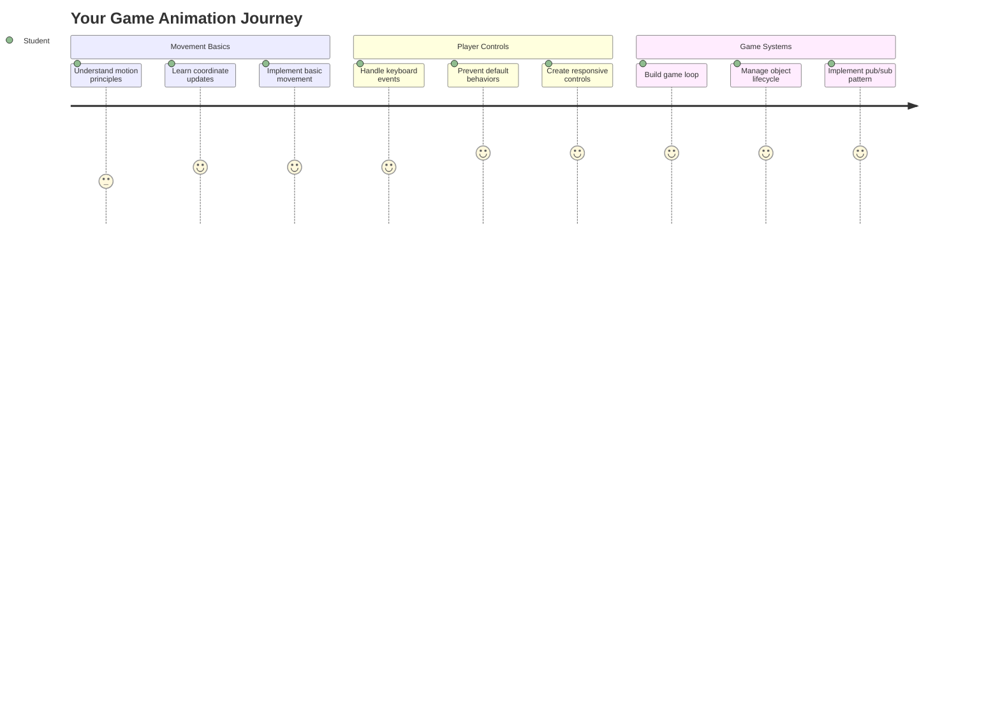
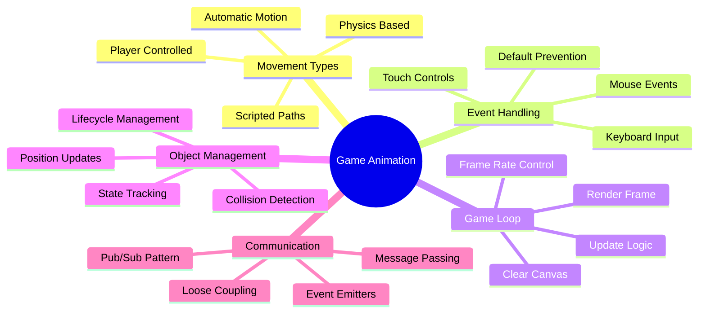
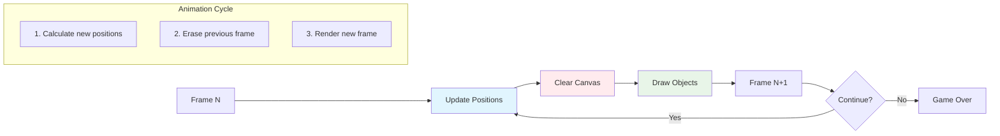
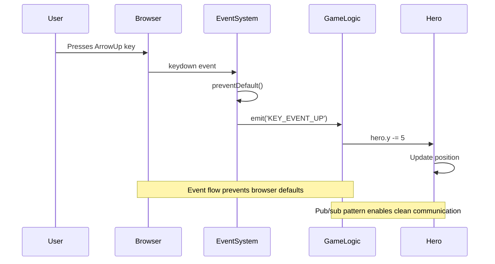
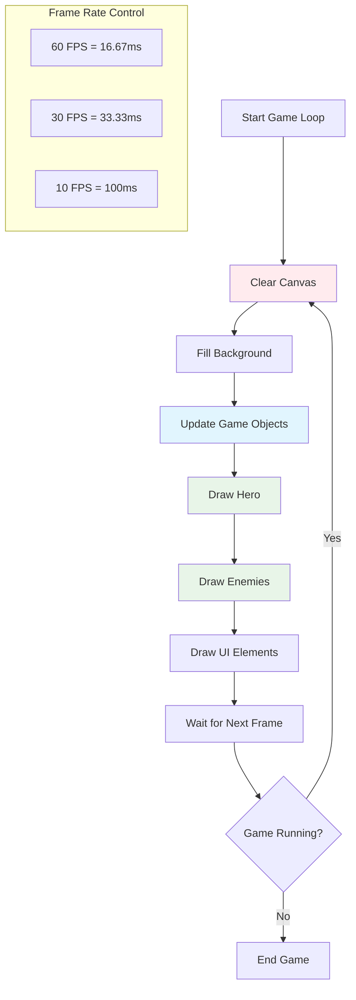
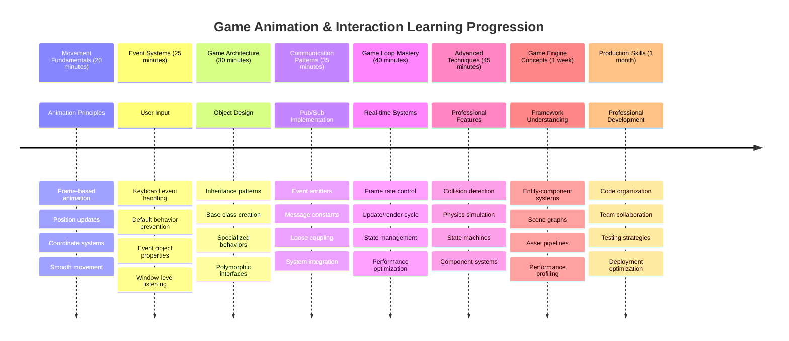

<!--
CO_OP_TRANSLATOR_METADATA:
{
  "original_hash": "8c55a2bd4bc0ebe4c88198fd563a9e09",
  "translation_date": "2025-11-03T15:49:07+00:00",
  "source_file": "6-space-game/3-moving-elements-around/README.md",
  "language_code": "ne"
}
-->
# स्पेस गेम बनाउनुहोस् भाग ३: गति थप्दै



तपाईंको मनपर्ने खेलहरूको बारेमा सोच्नुहोस् – तिनीहरूलाई आकर्षक बनाउने कुरा केवल राम्रो ग्राफिक्स मात्र होइन, तर सबै कुरा कसरी चल्छ र तपाईंको क्रियाकलापमा प्रतिक्रिया दिन्छ। अहिले, तपाईंको स्पेस गेम एउटा सुन्दर चित्रजस्तै छ, तर हामी यसलाई जीवन्त बनाउने गति थप्न जाँदैछौं।

जब नासाका इन्जिनियरहरूले अपोलो मिशनहरूको लागि गाइडेंस कम्प्युटर प्रोग्राम गरे, उनीहरूले यस्तै चुनौतीको सामना गरे: कसरी एक अन्तरिक्ष यानलाई पाइलटको इनपुटमा प्रतिक्रिया दिन बनाउने, जबकि स्वचालित रूपमा कोर्स सुधारहरू कायम राख्ने? आज हामीले सिक्ने सिद्धान्तहरू ती समान अवधारणाहरूको प्रतिध्वनि गर्छन् – खेलाडी-नियन्त्रित गति व्यवस्थापन गर्दै स्वचालित प्रणाली व्यवहारहरू।

यस पाठमा, तपाईंले अन्तरिक्ष यानलाई स्क्रिनमा चिप्लिन सिक्नुहुनेछ, खेलाडीको आदेशहरूमा प्रतिक्रिया दिनुहुनेछ, र चिल्लो गति ढाँचाहरू सिर्जना गर्नुहुनेछ। हामी सबै कुरा प्राकृतिक रूपमा एकअर्कामा निर्माण हुने प्रबन्धनीय अवधारणाहरूमा तोड्नेछौं।

अन्त्यमा, तपाईंले खेलाडीहरूलाई उनीहरूको हिरो जहाजलाई स्क्रिनमा उडाउँदै गर्दा शत्रु जहाजहरू माथि गस्ती गरिरहेको देख्नुहुनेछ। अझ महत्त्वपूर्ण कुरा, तपाईंले खेल गति प्रणालीहरूलाई शक्ति दिने मुख्य सिद्धान्तहरू बुझ्नुहुनेछ।



## प्रि-लेक्चर क्विज

[प्रि-लेक्चर क्विज](https://ff-quizzes.netlify.app/web/quiz/33)

## खेलको गति बुझ्दै

खेलहरू तब जीवित हुन्छन् जब चीजहरू वरिपरि चल्न थाल्छन्, र यो दुई तरिकामा हुन्छ:

- **खेलाडी-नियन्त्रित गति**: जब तपाईंले कुनै कुञ्जी थिच्नुहुन्छ वा माउस क्लिक गर्नुहुन्छ, केही चल्छ। यो तपाईं र तपाईंको खेल संसारको बीचको प्रत्यक्ष सम्बन्ध हो।
- **स्वचालित गति**: जब खेल आफैंले चीजहरू चलाउने निर्णय गर्छ – जस्तै ती शत्रु जहाजहरू जसले स्क्रिनमा गस्ती गर्नुपर्छ चाहे तपाईंले केही गरिरहनुभएको छैन।

कम्प्युटर स्क्रिनमा वस्तुहरू चलाउनु सोचेभन्दा सजिलो छ। गणितको कक्षामा ती x र y समन्वयहरू सम्झनुहोस्? हामी यहाँ त्यहीसँग काम गर्दैछौं। जब ग्यालिलियोले १६१० मा बृहस्पतिको चन्द्रमाहरू ट्र्याक गरे, उनले मूलतः त्यही काम गरिरहेका थिए – गति ढाँचाहरू बुझ्न समयको साथमा स्थानहरू प्लट गर्दै।

स्क्रिनमा चीजहरू चलाउनु भनेको फ्लिपबुक एनिमेसन सिर्जना गर्नु जस्तै हो – तपाईंले यी तीन सरल चरणहरू पालना गर्न आवश्यक छ:



1. **स्थिति अपडेट गर्नुहोस्** – तपाईंको वस्तु कहाँ हुनुपर्छ परिवर्तन गर्नुहोस् (सायद यसलाई दायाँतिर ५ पिक्सेल सार्नुहोस्)
2. **पुरानो फ्रेम मेटाउनुहोस्** – स्क्रिन सफा गर्नुहोस् ताकि तपाईंले भूतिया ट्रेल्स नदेख्नुहोस्
3. **नयाँ फ्रेम बनाउनुहोस्** – तपाईंको वस्तुलाई यसको नयाँ स्थानमा राख्नुहोस्

यो पर्याप्त छिटो गर्नुहोस्, र बूम! तपाईंले खेलाडीहरूलाई प्राकृतिक लाग्ने चिल्लो गति पाउनुहुन्छ।

यसले कोडमा कस्तो देखिन्छ:

```javascript
// Set the hero's location
hero.x += 5;
// Clear the rectangle that hosts the hero
ctx.clearRect(0, 0, canvas.width, canvas.height);
// Redraw the game background and hero
ctx.fillRect(0, 0, canvas.width, canvas.height);
ctx.fillStyle = "black";
ctx.drawImage(heroImg, hero.x, hero.y);
```

**यस कोडले के गर्छ:**
- **अपडेट गर्छ** हिरोको x-समन्वयलाई ५ पिक्सेलले क्षैतिज रूपमा सार्न
- **सफा गर्छ** सम्पूर्ण क्यानभास क्षेत्रलाई पुरानो फ्रेम हटाउन
- **भर्छ** क्यानभासलाई कालो पृष्ठभूमि रंगले
- **पुन: बनाउँछ** हिरोको छवि नयाँ स्थानमा

✅ तपाईंले सोच्न सक्नुहुन्छ कि किन धेरै फ्रेमहरू प्रति सेकेन्डमा तपाईंको हिरोलाई पुन: बनाउँदा प्रदर्शन लागत बढ्न सक्छ? [यस ढाँचाको विकल्पहरू](https://developer.mozilla.org/en-US/docs/Web/API/Canvas_API/Tutorial/Optimizing_canvas) बारे पढ्नुहोस्।

## कुञ्जीपाटी घटनाहरू ह्यान्डल गर्नुहोस्

यहीँबाट हामी खेलाडीको इनपुटलाई खेलको क्रियाकलापसँग जोड्छौं। जब कसैले लेजर फायर गर्न स्पेसबार थिच्छ वा एस्टेरोइडबाट बच्न एरो कुञ्जी थिच्छ, तपाईंको खेलले त्यो इनपुट पत्ता लगाउन र प्रतिक्रिया दिन आवश्यक छ।

कुञ्जीपाटी घटनाहरू विन्डो स्तरमा हुन्छन्, जसको अर्थ तपाईंको सम्पूर्ण ब्राउजर विन्डोले ती कुञ्जी थिचाइहरू सुन्दैछ। माउस क्लिकहरू, अर्कोतर्फ, विशिष्ट तत्वहरूमा बाँध्न सकिन्छ (जस्तै बटन क्लिक गर्दा)। हाम्रो स्पेस गेमको लागि, हामी कुञ्जीपाटी नियन्त्रणहरूमा ध्यान केन्द्रित गर्नेछौं किनभने यसले खेलाडीहरूलाई क्लासिक आर्केड अनुभव दिन्छ।

यसले मलाई १८०० को दशकमा टेलिग्राफ अपरेटरहरूले मोर्स कोड इनपुटलाई अर्थपूर्ण सन्देशहरूमा अनुवाद गर्नुपरेको सम्झाउँछ – हामी केही यस्तै गर्दैछौं, कुञ्जी थिचाइहरूलाई खेल आदेशहरूमा अनुवाद गर्दै।

घटना ह्यान्डल गर्न तपाईंले विन्डोको `addEventListener()` विधि प्रयोग गर्नुपर्छ र यसलाई दुई इनपुट प्यारामिटरहरू प्रदान गर्नुपर्छ। पहिलो प्यारामिटर घटनाको नाम हो, उदाहरणका लागि `keyup`। दोस्रो प्यारामिटर घटना घटेको परिणामस्वरूप बोलाइनु पर्ने कार्य हो।

यहाँ एउटा उदाहरण छ:

```javascript
window.addEventListener('keyup', (evt) => {
  // evt.key = string representation of the key
  if (evt.key === 'ArrowUp') {
    // do something
  }
});
```

**यहाँ के हुन्छ:**
- **सुन्छ** सम्पूर्ण विन्डोमा कुञ्जीपाटी घटनाहरू
- **पक्रन्छ** घटना वस्तु जसले कुन कुञ्जी थिचिएको जानकारी समावेश गर्दछ
- **जाँच्छ** कि थिचिएको कुञ्जी विशिष्ट कुञ्जीसँग मेल खान्छ (यस अवस्थामा, माथि एरो)
- **कार्यान्वयन गर्छ** कोड जब सर्त पूरा हुन्छ

कुञ्जी घटनाहरूको लागि घटनामा दुई गुणहरू छन् जसले कुन कुञ्जी थिचिएको हेर्न प्रयोग गर्न सकिन्छ:

- `key` - यो थिचिएको कुञ्जीको स्ट्रिङ प्रतिनिधित्व हो, उदाहरणका लागि `'ArrowUp'`
- `keyCode` - यो संख्यात्मक प्रतिनिधित्व हो, उदाहरणका लागि `37`, `ArrowLeft` सँग मेल खान्छ

✅ कुञ्जी घटना हेरफेर खेल विकास बाहेक उपयोगी छ। तपाईं यस प्रविधिको लागि अन्य उपयोगहरू के सोच्न सक्नुहुन्छ?



### विशेष कुञ्जीहरू: एक चेतावनी!

केही कुञ्जीहरूमा बिल्ट-इन ब्राउजर व्यवहारहरू हुन्छन् जसले तपाईंको खेलमा बाधा पुर्याउन सक्छ। एरो कुञ्जीहरूले पृष्ठ स्क्रोल गर्छन् र स्पेसबार तल जान्छ – जब कसैले आफ्नो अन्तरिक्ष यान चलाउन खोज्दैछ, तपाईंले यी व्यवहारहरू चाहनुहुन्न।

हामी यी डिफल्ट व्यवहारहरू रोक्न सक्छौं र हाम्रो खेलले इनपुटलाई ह्यान्डल गर्न दिन सक्छौं। यो प्रारम्भिक कम्प्युटर प्रोग्रामरहरूले कस्टम व्यवहारहरू सिर्जना गर्न प्रणाली इन्टरप्टहरू ओभरराइड गर्नुपरेको जस्तै हो – हामी ब्राउजर स्तरमा मात्र गर्दैछौं। यहाँ कसरी:

```javascript
const onKeyDown = function (e) {
  console.log(e.keyCode);
  switch (e.keyCode) {
    case 37:
    case 39:
    case 38:
    case 40: // Arrow keys
    case 32:
      e.preventDefault();
      break; // Space
    default:
      break; // do not block other keys
  }
};

window.addEventListener('keydown', onKeyDown);
```

**यो रोकथाम कोड बुझ्दै:**
- **जाँच्छ** विशिष्ट कुञ्जी कोडहरू जसले अनावश्यक ब्राउजर व्यवहार निम्त्याउन सक्छ
- **रोक्छ** एरो कुञ्जीहरू र स्पेसबारको लागि डिफल्ट ब्राउजर क्रियाकलाप
- **अनुमति दिन्छ** अन्य कुञ्जीहरू सामान्य रूपमा काम गर्न
- **प्रयोग गर्छ** `e.preventDefault()` ब्राउजरको बिल्ट-इन व्यवहार रोक्न

### 🔄 **शिक्षण जाँच**
**घटना ह्यान्डलिंग बुझाइ**: स्वचालित गति तर्फ जानु अघि सुनिश्चित गर्नुहोस् कि तपाईं:
- ✅ `keydown` र `keyup` घटनाहरूको बीचको भिन्नता व्याख्या गर्न सक्नुहुन्छ
- ✅ किन हामी डिफल्ट ब्राउजर व्यवहार रोक्छौं बुझ्न सक्नुहुन्छ
- ✅ कसरी घटना सुन्नेहरूले प्रयोगकर्ता इनपुटलाई खेलको तर्कसँग जोड्छ व्याख्या गर्न सक्नुहुन्छ
- ✅ कुन कुञ्जीहरूले खेल नियन्त्रणमा बाधा पुर्याउन सक्छ पहिचान गर्न सक्नुहुन्छ

**छिटो आत्म-परीक्षण**: यदि तपाईंले एरो कुञ्जीहरूको लागि डिफल्ट व्यवहार रोक्नुभएन भने के हुन्छ?
*उत्तर: ब्राउजरले पृष्ठ स्क्रोल गर्नेछ, खेलको गति बाधा पुर्याउँदै*

**घटना प्रणाली संरचना**: तपाईं अब बुझ्नुहुन्छ:
- **विन्डो-स्तर सुन्ने**: ब्राउजर स्तरमा घटनाहरू पक्रने
- **घटना वस्तु गुणहरू**: `key` स्ट्रिङहरू बनाम `keyCode` नम्बरहरू
- **डिफल्ट रोकथाम**: अनावश्यक ब्राउजर व्यवहार रोक्दै
- **सर्तात्मक तर्क**: विशिष्ट कुञ्जी संयोजनहरूमा प्रतिक्रिया दिँदै

## खेल प्रेरित गति

अब कुरा गरौं वस्तुहरू जो खेलाडीको इनपुट बिना चल्छन्। शत्रु जहाजहरू स्क्रिनमा क्रुज गर्दै, सीधा रेखामा गोलीहरू उड्दै, वा पृष्ठभूमिमा बादलहरू तैरिरहेको सोच्नुहोस्। यो स्वतन्त्र गति तपाईंको खेल संसारलाई जीवन्त बनाउँछ, चाहे कोही नियन्त्रणमा नहोस्।

हामी नियमित अन्तरालमा स्थानहरू अपडेट गर्न JavaScript को बिल्ट-इन टाइमरहरू प्रयोग गर्छौं। यो अवधारणा पेन्डुलम घडीहरू कसरी काम गर्छन् जस्तै हो – एक नियमित मेकानिज्म जसले निरन्तर, समयबद्ध क्रियाकलापहरू ट्रिगर गर्छ। यहाँ यो कति सरल हुन सक्छ:

```javascript
const id = setInterval(() => {
  // Move the enemy on the y axis
  enemy.y += 10;
}, 100);
```

**यो गति कोडले के गर्छ:**
- **सिर्जना गर्छ** एक टाइमर जो प्रत्येक १०० मिलिसेकेन्डमा चल्छ
- **अपडेट गर्छ** शत्रुको y-समन्वयलाई प्रत्येक पटक १० पिक्सेलले
- **भण्डारण गर्छ** अन्तराल ID ताकि हामी पछि यसलाई रोक्न सकौं
- **चलाउँछ** शत्रुलाई स्वत: स्क्रिनमा तलतिर

## खेल लूप

यहाँ अवधारणा छ जसले सबै कुरा जोड्छ – खेल लूप। यदि तपाईंको खेल एउटा चलचित्र हो भने, खेल लूप फिल्म प्रोजेक्टर हुनेछ, फ्रेम पछि फ्रेम देखाउँदै ताकि सबै कुरा चिल्लो रूपमा चलिरहेको देखिन्छ।

प्रत्येक खेलको पछाडि एउटा लूप चलिरहेको हुन्छ। यो एउटा कार्य हो जसले सबै खेल वस्तुहरू अपडेट गर्छ, स्क्रिन पुन: बनाउँछ, र यो प्रक्रिया निरन्तर दोहोर्याउँछ। यसले तपाईंको हिरो, सबै शत्रुहरू, कुनै पनि लेजरहरू – सम्पूर्ण खेल अवस्था ट्र्याक राख्छ।

यो अवधारणा मलाई प्रारम्भिक फिल्म एनिमेटरहरू जस्तै वाल्ट डिज्नीले पात्रहरू फ्रेम द्वारा फ्रेम पुन: बनाउनु परेको सम्झाउँछ। हामी त्यही काम गर्दैछौं, केवल कोडको साथमा पेन्सिलको सट्टा।

यहाँ खेल लूप सामान्यतया कस्तो देखिन्छ, कोडमा व्यक्त गरिएको:



```javascript
const gameLoopId = setInterval(() => {
  function gameLoop() {
    ctx.clearRect(0, 0, canvas.width, canvas.height);
    ctx.fillStyle = "black";
    ctx.fillRect(0, 0, canvas.width, canvas.height);
    drawHero();
    drawEnemies();
    drawStaticObjects();
  }
  gameLoop();
}, 200);
```

**खेल लूप संरचना बुझ्दै:**
- **सफा गर्छ** सम्पूर्ण क्यानभास पुरानो फ्रेम हटाउन
- **भर्छ** पृष्ठभूमिलाई ठोस रंगले
- **पुन: बनाउँछ** सबै खेल वस्तुहरूलाई उनीहरूको वर्तमान स्थानमा
- **दोहर्याउँछ** यो प्रक्रिया प्रत्येक २०० मिलिसेकेन्डमा चिल्लो एनिमेसन सिर्जना गर्न
- **व्यवस्थापन गर्छ** फ्रेम दरलाई अन्तराल समय नियन्त्रण गरेर

## स्पेस गेम जारी राख्दै

अब हामी स्थिर दृश्यमा गति थप्नेछौं जुन तपाईंले पहिले निर्माण गर्नुभएको थियो। हामी यसलाई स्क्रिनशटबाट अन्तरक्रियात्मक अनुभवमा रूपान्तरण गर्नेछौं। हामी प्रत्येक टुक्रालाई पछिल्लोमा निर्माण गर्न सुनिश्चित गर्न चरणबद्ध रूपमा काम गर्नेछौं।

पछिल्लो पाठमा हामीले छोडेको कोड लिनुहोस् (वा यदि तपाईंलाई नयाँ सुरुवात चाहिन्छ भने [भाग II- स्टार्टर](../../../../6-space-game/3-moving-elements-around/your-work) फोल्डरमा कोडबाट सुरु गर्नुहोस्)।

**आज हामी के निर्माण गर्दैछौं:**
- **हिरो नियन्त्रणहरू**: एरो कुञ्जीहरूले तपाईंको अन्तरिक्ष यानलाई स्क्रिन वरिपरि चलाउनेछ
- **शत्रु गति**: ती एलियन जहाजहरूले आफ्नो आक्रमण सुरु गर्नेछन्

यी सुविधाहरू कार्यान्वयन गर्न सुरु गरौं।

## सिफारिस गरिएका चरणहरू

`your-work` उप फोल्डरमा तपाईंको लागि सिर्जना गरिएका फाइलहरू पत्ता लगाउनुहोस्। यसले निम्न समावेश गर्नुपर्छ:

```bash
-| assets
  -| enemyShip.png
  -| player.png
-| index.html
-| app.js
-| package.json
```

तपाईं आफ्नो परियोजना `your-work` फोल्डरमा टाइप गरेर सुरु गर्नुहुन्छ:

```bash
cd your-work
npm start
```

**यो आदेशले के गर्छ:**
- **तपाईंको परियोजना निर्देशिका**मा जान्छ
- **HTTP सर्भर सुरु गर्छ** ठेगाना `http://localhost:5000` मा
- **तपाईंको खेल फाइलहरू सेवा दिन्छ** ताकि तपाईं ब्राउजरमा परीक्षण गर्न सक्नुहुन्छ

माथिको आदेशले ठेगाना `http://localhost:5000` मा HTTP सर्भर सुरु गर्नेछ। ब्राउजर खोल्नुहोस् र त्यो ठेगाना इनपुट गर्नुहोस्, अहिले यसले हिरो र सबै शत्रुहरूलाई प्रस्तुत गर्नुपर्छ; केही पनि चलिरहेको छैन - अझै!

### कोड थप्नुहोस्

1. **समर्पित वस्तुहरू थप्नुहोस्** `hero`, `enemy`, र `game object` को लागि, तिनीहरूसँग `x` र `y` गुणहरू हुनुपर्छ। (याद गर्नुहोस् [Inheritance or composition](../README.md) को भाग)।

   *सुझाव* `game object` त्यो हुनुपर्छ जससँग `x` र `y` र क्यानभासमा आफैंलाई बनाउने क्षमता छ।

   > **टिप**: नयाँ `GameObject` कक्षा थप्न सुरु गर्नुहोस् यसको कन्स्ट्रक्टर तलको रूपमा परिभाषित गरेर, र त्यसपछि यसलाई क्यानभासमा बनाउनुहोस्:

    ```javascript
    class GameObject {
      constructor(x, y) {
        this.x = x;
        this.y = y;
        this.dead = false;
        this.type = "";
        this.width = 0;
        this.height = 0;
        this.img = undefined;
      }
    
      draw(ctx) {
        ctx.drawImage(this.img, this.x, this.y, this.width, this.height);
      }
    }
    ```

    **यो आधार कक्षा बुझ्दै:**
    - **सामान्य गुणहरू परिभाषित गर्छ** जुन सबै खेल वस्तुहरूले साझा गर्छन् (स्थिति, आकार, छवि)
    - **समावेश गर्छ** एक `dead` झण्डा वस्तु हटाउन ट्र्याक गर्न
    - **प्रदान गर्छ** एक `draw()` विधि जसले क्यानभासमा वस्तु बनाउँछ
    - **डिफल्ट मानहरू सेट गर्छ** सबै गुणहरूको लागि जुन बच्चा कक्षाहरूले ओभरराइड गर्न सक्छन्

    ```mermaid
    classDiagram
        class GameObject {
            +x: number
            +y: number
            +dead: boolean
            +type: string
            +width: number
            +height: number
            +img: Image
            +draw(ctx)
        }
        
        class Hero {
            +speed: number
            +type: "Hero"
            +width: 98
            +height: 75
        }
        
        class Enemy {
            +type: "Enemy"
            +width: 98
            +height: 50
            +setInterval()
        }
        
        GameObject <|-- Hero
        GameObject <|-- Enemy
        
        class EventEmitter {
            +listeners: object
            +on(message, listener)
            +emit(message, payload)
        }
    ```

    अब, यस `GameObject` लाई विस्तार गरेर `Hero` र `Enemy` सिर्जना गर्नुहोस्:
    
    ```javascript
    class Hero extends GameObject {
      constructor(x, y) {
        super(x, y);
        this.width = 98;
        this.height = 75;
        this.type = "Hero";
        this.speed = 5;
      }
    }
    ```

    ```javascript
    class Enemy extends GameObject {
      constructor(x, y) {
        super(x, y);
        this.width = 98;
        this.height = 50;
        this.type = "Enemy";
        const id = setInterval(() => {
          if (this.y < canvas.height - this.height) {
            this.y += 5;
          } else {
            console.log('Stopped at', this.y);
            clearInterval(id);
          }
        }, 300);
      }
    }
    ```

    **यी कक्षाहरूमा मुख्य अवधारणाहरू:**
    - **`extends` कीवर्ड प्रयोग गरेर `GameObject` बाट उत्तराधिकार लिन्छ**
    - **`super(x, y)` प्रयोग गरेर अभिभावक कन्स्ट्रक्टरलाई बोलाउँछ**
    - **प्रत्येक वस्तु प्रकारको लागि विशिष्ट आयाम र गुणहरू सेट गर्छ**
    - **`setInterval()` प्रयोग गरेर शत्रुहरूको स्वत: गति कार्यान्वयन गर्छ**

2. **कुञ्जी-घटना ह्यान्डलरहरू थप्नुहोस्** कुञ्जी नेभिगेसन ह्यान्डल गर्न (हिरोलाई माथि/तल, बायाँ/दायाँ सार्न)

   *याद गर्नुहोस्* यो एक कार्टेसियन प्रणाली हो, माथि-बायाँ `0,0` हो। साथै एरो कुञ्जीहरू र स्पेसबारको लागि डिफल्ट व्यवहार रोक्न कोड थप्न सम्झनुहोस्।

   > **टिप**: तपाईंको `onKeyDown` कार्य सिर्जना गर्नुहोस् र यसलाई विन्डोमा जोड्नुहोस्:

   ```javascript
   const onKeyDown = function (e) {
     console.log(e.keyCode);
     // Add the code from the lesson above to stop default behavior
     switch (e.keyCode) {
       case 37:
       case 39:
       case 38:
       case 40: // Arrow keys
       case 32:
         e.preventDefault();
         break; // Space
       default:
         break; // do not block other keys
     }
   };

   window.addEventListener("keydown", onKeyDown);
   ```
    
   **यो घटना ह्यान्डलरले के गर्छ:**
   - **सुन्छ** सम्पूर्ण विन्डोमा कुञ्जीपाटी घटनाहरू
   - **लॉग गर्छ** कुञ्जी कोडले कुन कुञ्जी थिचिएको छ भनेर डिबग गर्न मद्दत गर्दछ
   - **रोक्छ** एरो कुञ्जीहरू र स्पेसबारको लागि डिफल्ट ब्राउजर व्यवहार
   - **अनुमति दिन्छ** अन्य कुञ्जीहरू सामान्य रूपमा काम गर्न
   
   यस बिन्दुमा तपाईंको ब्राउजर कन्सोल जाँच गर्नुहोस्, र थिचिएका कुञ्जीहरूलाई हेर्नुहोस्।

3. **[Pub sub pattern](../README.md) कार्यान्वयन गर्नुहोस्**, यसले तपाईंको कोडलाई सफा राख्छ जब तपाईं बाँकी भागहरू पछ्याउनुहुन्छ।

   पब्लिश-सब्सक्राइब ढाँचाले तपाईंको कोडलाई घटनाको पत्ता लगाउने र घटनाको ह्यान्डलिंगबाट अलग गरेर व्यवस्थित गर्न मद्दत गर्छ। यसले तपाईंको कोडलाई अधिक मोड्युलर र सजिलो बनाउँछ।


   - **सुरु गर्छ** सबै खेल वस्तुहरू राख्नको लागि एउटा array

   4. **खेल सुरु गर्नुहोस्**

       ```javascript
       function initGame() {
         gameObjects = [];
         createEnemies();
         createHero();
       
         eventEmitter.on(Messages.KEY_EVENT_UP, () => {
           hero.y -= 5;
         });
       
         eventEmitter.on(Messages.KEY_EVENT_DOWN, () => {
           hero.y += 5;
         });
       
         eventEmitter.on(Messages.KEY_EVENT_LEFT, () => {
           hero.x -= 5;
         });
       
4. **खेल लूप सेटअप गर्नुहोस्**

   `window.onload` function लाई पुनः संरचना गर्नुहोस् ताकि खेल सुरु गर्न सकियोस् र राम्रो अन्तरालमा खेल लूप सेटअप गर्न सकियोस्। तपाईंले एउटा लेजर बीम पनि थप्नु पर्नेछ:

    ```javascript
    window.onload = async () => {
      canvas = document.getElementById("canvas");
      ctx = canvas.getContext("2d");
      heroImg = await loadTexture("assets/player.png");
      enemyImg = await loadTexture("assets/enemyShip.png");
      laserImg = await loadTexture("assets/laserRed.png");
    
      initGame();
      const gameLoopId = setInterval(() => {
        ctx.clearRect(0, 0, canvas.width, canvas.height);
        ctx.fillStyle = "black";
        ctx.fillRect(0, 0, canvas.width, canvas.height);
        drawGameObjects(ctx);
      }, 100);
    };
    ```

   **खेल सेटअप बुझ्दै:**
   - **पर्खन्छ** पृष्ठ पूर्ण रूपमा लोड हुने समयसम्म
   - **क्यानभास तत्व र यसको 2D रेंडरिंग सन्दर्भ प्राप्त गर्छ**
   - **सबै छवि सम्पत्ति असिंक्रोनस रूपमा `await` प्रयोग गरेर लोड गर्छ**
   - **खेल लूप 100ms अन्तरालमा (10 FPS) चलाउन सुरु गर्छ**
   - **प्रत्येक फ्रेममा सम्पूर्ण स्क्रिन सफा गर्छ र पुनः रेखांकन गर्छ**

5. **कोड थप्नुहोस्** ताकि दुश्मनहरू निश्चित अन्तरालमा सर्नेछन्

    `createEnemies()` function लाई पुनः संरचना गर्नुहोस् ताकि दुश्मनहरू सिर्जना गर्न सकियोस् र तिनीहरूलाई नयाँ gameObjects class मा धकेल्न सकियोस्:

    ```javascript
    function createEnemies() {
      const MONSTER_TOTAL = 5;
      const MONSTER_WIDTH = MONSTER_TOTAL * 98;
      const START_X = (canvas.width - MONSTER_WIDTH) / 2;
      const STOP_X = START_X + MONSTER_WIDTH;
    
      for (let x = START_X; x < STOP_X; x += 98) {
        for (let y = 0; y < 50 * 5; y += 50) {
          const enemy = new Enemy(x, y);
          enemy.img = enemyImg;
          gameObjects.push(enemy);
        }
      }
    }
    ```

    **दुश्मन सिर्जना के गर्छ:**
    - **पोजिसन गणना गर्छ** ताकि दुश्मनहरू स्क्रिनको केन्द्रमा राख्न सकियोस्
    - **दुश्मनहरूको ग्रिड सिर्जना गर्छ** nested loops प्रयोग गरेर
    - **प्रत्येक दुश्मन वस्तुमा दुश्मन छवि असाइन गर्छ**
    - **प्रत्येक दुश्मनलाई ग्लोबल खेल वस्तु array मा थप्छ**
    
    र `createHero()` function थप्नुहोस् ताकि नायकको लागि पनि यस्तै प्रक्रिया गर्न सकियोस्।
    
    ```javascript
    function createHero() {
      hero = new Hero(
        canvas.width / 2 - 45,
        canvas.height - canvas.height / 4
      );
      hero.img = heroImg;
      gameObjects.push(hero);
    }
    ```

    **नायक सिर्जना के गर्छ:**
    - **नायकलाई स्क्रिनको तल्लो केन्द्रमा पोजिसन गर्छ**
    - **नायक वस्तुमा नायक छवि असाइन गर्छ**
    - **नायकलाई खेल वस्तु array मा रेखांकनको लागि थप्छ**

    अन्तमा, `drawGameObjects()` function थप्नुहोस् ताकि रेखांकन सुरु गर्न सकियोस्:

    ```javascript
    function drawGameObjects(ctx) {
      gameObjects.forEach(go => go.draw(ctx));
    }
    ```

    **रेखांकन function बुझ्दै:**
    - **सबै खेल वस्तु array मा iterate गर्छ**
    - **प्रत्येक वस्तुमा `draw()` method कल गर्छ**
    - **क्यानभास सन्दर्भ पास गर्छ ताकि वस्तुहरूले आफूलाई रेंडर गर्न सकून्**

    ### 🔄 **शिक्षण चेक-इन**
    **पूर्ण खेल प्रणाली बुझाइ**: सम्पूर्ण आर्किटेक्चरको मास्टरी प्रमाणित गर्नुहोस्:
    - ✅ Hero र Enemy ले साझा GameObject गुणहरू कसरी inherit गर्छन्?
    - ✅ किन pub/sub pattern ले तपाईंको कोडलाई बढी maintainable बनाउँछ?
    - ✅ खेल लूपले smooth animation सिर्जना गर्न के भूमिका खेल्छ?
    - ✅ Event listeners कसरी प्रयोगकर्ता इनपुटलाई खेल वस्तु व्यवहारसँग जोड्छन्?

    **सिस्टम एकीकरण**: तपाईंको खेलले अब प्रदर्शन गर्छ:
    - **Object-Oriented Design**: Base classes संग विशेष inheritance
    - **Event-Driven Architecture**: Pub/sub pattern loose coupling को लागि
    - **Animation Framework**: खेल लूप संग consistent frame updates
    - **Input Handling**: Keyboard events संग default prevention
    - **Asset Management**: छवि लोडिंग र sprite rendering

    **Professional Patterns**: तपाईंले लागू गर्नुभएको छ:
    - **Separation of Concerns**: Input, logic, र rendering अलग
    - **Polymorphism**: सबै खेल वस्तुहरूले साझा रेखांकन interface प्रयोग गर्छन्
    - **Message Passing**: Components बीच सफा communication
    - **Resource Management**: Sprite र animation को efficient handling

    तपाईंका दुश्मनहरूले तपाईंको नायक spaceship तर्फ अगाडि बढ्न सुरु गर्नुपर्छ!
      }
    }
    ```
    
    and add a `createHero()` function to do a similar process for the hero.
    
    ```javascript
    function createHero() {
      hero = new Hero(
        canvas.width / 2 - 45,
        canvas.height - canvas.height / 4
      );
      hero.img = heroImg;
      gameObjects.push(hero);
    }
    ```

    अन्तमा, `drawGameObjects()` function थप्नुहोस् ताकि रेखांकन सुरु गर्न सकियोस्:

    ```javascript
    function drawGameObjects(ctx) {
      gameObjects.forEach(go => go.draw(ctx));
    }
    ```

    तपाईंका दुश्मनहरूले तपाईंको नायक spaceship तर्फ अगाडि बढ्न सुरु गर्नुपर्छ!

---

## GitHub Copilot Agent Challenge 🚀

यहाँ एउटा चुनौती छ जसले तपाईंको खेललाई अझ राम्रो बनाउनेछ: boundaries र smooth controls थप्नु। हाल, तपाईंको नायक स्क्रिनबाट बाहिर जान सक्छ, र movement अलि असहज लाग्न सक्छ।

**तपाईंको मिशन:** तपाईंको spaceship लाई अझ वास्तविक बनाउनुहोस् boundaries लागू गरेर र movement लाई fluid बनाउनुहोस्। जब खेलाडीहरूले arrow key थिच्छन्, जहाजले निरन्तर glide गर्नुपर्छ discrete steps मा सर्ने सट्टा। स्क्रिन boundaries मा पुग्दा subtle effect जस्तै दृश्यात्मक feedback थप्न विचार गर्नुहोस्।

[agent mode](https://code.visualstudio.com/blogs/2025/02/24/introducing-copilot-agent-mode) को बारेमा थप जान्नुहोस्।

## 🚀 Challenge

जसरी परियोजनाहरू बढ्छन्, कोडको संगठन अझ महत्त्वपूर्ण बन्छ। तपाईंले आफ्नो फाइल functions, variables, र classes संग crowded भएको देख्नुभएको हुन सक्छ। यो Apollo mission को कोडलाई व्यवस्थित गर्ने इन्जिनियरहरूले स्पष्ट, maintainable प्रणालीहरू सिर्जना गर्नुपरेको जस्तै हो।

**तपाईंको मिशन:**
Software architect जस्तै सोच्नुहोस्। तपाईं आफ्नो कोड कसरी व्यवस्थित गर्नुहुन्छ ताकि छ महिनापछि तपाईं (वा तपाईंको सहकर्मी) के भइरहेको छ बुझ्न सकून्? अहिले सबै कुरा एउटै फाइलमा भए पनि, तपाईं राम्रो संगठन सिर्जना गर्न सक्नुहुन्छ:

- **सम्बन्धित functions समूह बनाउनुहोस्** स्पष्ट comment headers संग
- **Concerns अलग गर्नुहोस्** - खेल logic र rendering अलग राख्नुहोस्
- **Consistent naming** conventions प्रयोग गर्नुहोस् variables र functions को लागि
- **Modules वा namespaces सिर्जना गर्नुहोस्** खेलका विभिन्न पक्षहरू व्यवस्थित गर्न
- **Documentation थप्नुहोस्** जसले प्रत्येक मुख्य भागको उद्देश्य व्याख्या गर्छ

**Reflection questions:**
- तपाईंको कोडको कुन भागहरू पुनः हेर्दा बुझ्न गाह्रो लाग्छ?
- तपाईंको कोड कसरी व्यवस्थित गर्न सकिन्छ ताकि अरूले योगदान दिन सजिलो होस्?
- यदि तपाईंले power-ups वा विभिन्न दुश्मन प्रकारहरू जस्ता नयाँ सुविधाहरू थप्न चाहनुभयो भने के हुनेछ?

## Post-Lecture Quiz

[Post-lecture quiz](https://ff-quizzes.netlify.app/web/quiz/34)

## Review & Self Study

हामीले सबै कुरा scratch बाट निर्माण गरेका छौं, जुन सिकाइको लागि उत्कृष्ट छ, तर यहाँ एउटा सानो रहस्य छ – त्यहाँ केही अद्भुत JavaScript frameworks छन् जसले तपाईंको लागि धेरै काम गर्न सक्छ। हामीले कभर गरेका आधारभूत कुराहरूमा सहज महसुस गरेपछि, [के उपलब्ध छ](https://github.com/collections/javascript-game-engines) अन्वेषण गर्न लायक छ।

Frameworks लाई सोच्नुहोस् जस्तै राम्रोसँग भरिएको toolbox जसले प्रत्येक उपकरण हातले बनाउनुको सट्टा प्रदान गर्छ। तिनीहरूले हामीले चर्चा गरेका कोड संगठन चुनौतीहरूको समाधान गर्न सक्छन्, साथै त्यस्ता सुविधाहरू प्रदान गर्छन् जसलाई आफैं निर्माण गर्न हप्ताहरू लाग्न सक्छ।

**अन्वेषण गर्न लायक कुराहरू:**
- खेल इन्जिनहरूले कोड कसरी व्यवस्थित गर्छन् – तपाईं तिनीहरूको चतुर patterns देखेर अचम्मित हुनुहुनेछ
- Canvas खेलहरू butter-smooth चलाउनको लागि performance tricks  
- Modern JavaScript सुविधाहरू जसले तपाईंको कोडलाई सफा र maintainable बनाउँछ
- खेल वस्तुहरू र तिनीहरूको सम्बन्ध व्यवस्थापन गर्ने विभिन्न दृष्टिकोणहरू

## 🎯 Your Game Animation Mastery Timeline



### 🛠️ Your Game Development Toolkit Summary

यो पाठ पूरा गरेपछि, तपाईंले अब मास्टर गर्नुभएको छ:
- **Animation Principles**: Frame-based movement र smooth transitions
- **Event-Driven Programming**: Keyboard input handling सही event management संग
- **Object-Oriented Design**: Inheritance hierarchies र polymorphic interfaces
- **Communication Patterns**: Pub/sub architecture maintainable code को लागि
- **Game Loop Architecture**: Real-time update र rendering cycles
- **Input Systems**: प्रयोगकर्ता नियन्त्रण mapping default behavior रोकथाम सहित
- **Asset Management**: Sprite लोडिंग र efficient rendering techniques

### ⚡ **What You Can Do in the Next 5 Minutes**
- [ ] Browser console खोल्नुहोस् र `addEventListener('keydown', console.log)` प्रयोग गरेर keyboard events हेर्नुहोस्
- [ ] एउटा साधारण div element सिर्जना गर्नुहोस् र arrow keys प्रयोग गरेर यसलाई घुमाउनुहोस्
- [ ] `setInterval` प्रयोग गरेर निरन्तर movement सिर्जना गर्नुहोस्
- [ ] `event.preventDefault()` प्रयोग गरेर default behavior रोक्न प्रयास गर्नुहोस्

### 🎯 **What You Can Accomplish This Hour**
- [ ] Post-lesson quiz पूरा गर्नुहोस् र event-driven programming बुझ्नुहोस्
- [ ] पूर्ण keyboard controls सहित चल्ने नायक spaceship निर्माण गर्नुहोस्
- [ ] दुश्मन movement patterns लागू गर्नुहोस्
- [ ] खेल वस्तुहरूलाई स्क्रिनबाट बाहिर जानबाट रोक्न boundaries थप्नुहोस्
- [ ] खेल वस्तुहरू बीच basic collision detection सिर्जना गर्नुहोस्

### 📅 **Your Week-Long Animation Journey**
- [ ] Polished movement र interactions सहित पूर्ण space खेल पूरा गर्नुहोस्
- [ ] Curves, acceleration, र physics जस्ता advanced movement patterns थप्नुहोस्
- [ ] Smooth transitions र easing functions लागू गर्नुहोस्
- [ ] Particle effects र visual feedback systems सिर्जना गर्नुहोस्
- [ ] खेल performance optimize गर्नुहोस् ताकि smooth 60fps gameplay होस्
- [ ] Mobile touch controls र responsive design थप्नुहोस्

### 🌟 **Your Month-Long Interactive Development**
- [ ] Advanced animation systems सहित जटिल interactive applications निर्माण गर्नुहोस्
- [ ] GSAP जस्ता animation libraries सिक्नुहोस् वा आफ्नो animation engine सिर्जना गर्नुहोस्
- [ ] Open source खेल विकास र animation परियोजनाहरूमा योगदान गर्नुहोस्
- [ ] Graphics-intensive applications को लागि performance optimization मास्टर गर्नुहोस्
- [ ] खेल विकास र animation को बारेमा शैक्षिक सामग्री सिर्जना गर्नुहोस्
- [ ] Advanced interactive programming skills प्रदर्शन गर्ने portfolio निर्माण गर्नुहोस्

**Real-World Applications**: तपाईंको खेल animation skills सीधा लागू हुन्छ:
- **Interactive Web Applications**: Dynamic dashboards र real-time interfaces
- **Data Visualization**: Animated charts र interactive graphics
- **Educational Software**: Interactive simulations र learning tools
- **Mobile Development**: Touch-based खेलहरू र gesture handling
- **Desktop Applications**: Electron apps smooth animations सहित
- **Web Animations**: CSS र JavaScript animation libraries

**Professional Skills Gained**: तपाईं अब सक्षम हुनुहुन्छ:
- **Architect** event-driven systems जसले complexity संग scale गर्छ
- **Implement** smooth animations mathematical principles प्रयोग गरेर
- **Debug** complex interaction systems browser developer tools प्रयोग गरेर
- **Optimize** खेल performance विभिन्न devices र browsers को लागि
- **Design** maintainable code structures proven patterns प्रयोग गरेर

**Game Development Concepts Mastered**:
- **Frame Rate Management**: FPS र timing controls बुझ्दै
- **Input Handling**: Cross-platform keyboard र event systems
- **Object Lifecycle**: Creation, update, र destruction patterns
- **State Synchronization**: Frames बीच खेल state consistent राख्दै
- **Event Architecture**: खेल प्रणालीहरू बीच decoupled communication

**Next Level**: तपाईं collision detection, scoring systems, sound effects थप्न तयार हुनुहुन्छ वा Phaser वा Three.js जस्ता आधुनिक खेल frameworks अन्वेषण गर्न सक्नुहुन्छ!

🌟 **Achievement Unlocked**: तपाईंले professional architecture patterns सहित पूर्ण interactive खेल प्रणाली निर्माण गर्नुभएको छ!

## Assignment

[Comment your code](assignment.md)

---

**अस्वीकरण**:  
यो दस्तावेज़ AI अनुवाद सेवा [Co-op Translator](https://github.com/Azure/co-op-translator) प्रयोग गरेर अनुवाद गरिएको छ। हामी शुद्धताको लागि प्रयास गर्छौं, तर कृपया ध्यान दिनुहोस् कि स्वचालित अनुवादमा त्रुटिहरू वा अशुद्धताहरू हुन सक्छ। यसको मूल भाषा मा रहेको दस्तावेज़लाई आधिकारिक स्रोत मानिनुपर्छ। महत्वपूर्ण जानकारीको लागि, व्यावसायिक मानव अनुवाद सिफारिस गरिन्छ। यस अनुवादको प्रयोगबाट उत्पन्न हुने कुनै पनि गलतफहमी वा गलत व्याख्याको लागि हामी जिम्मेवार हुने छैनौं।