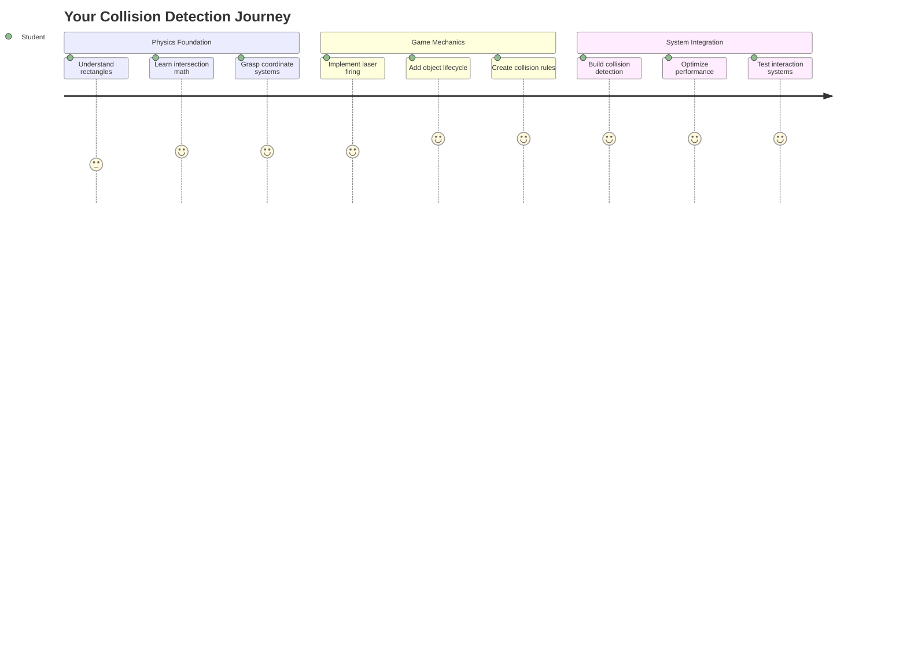
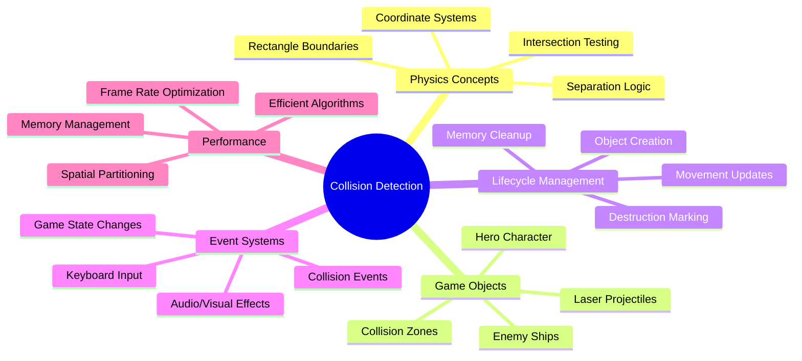
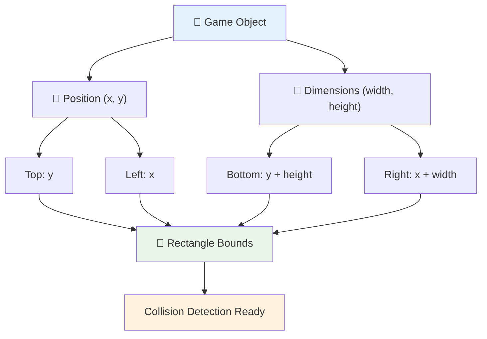
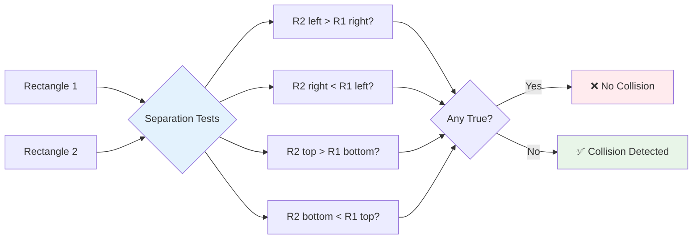
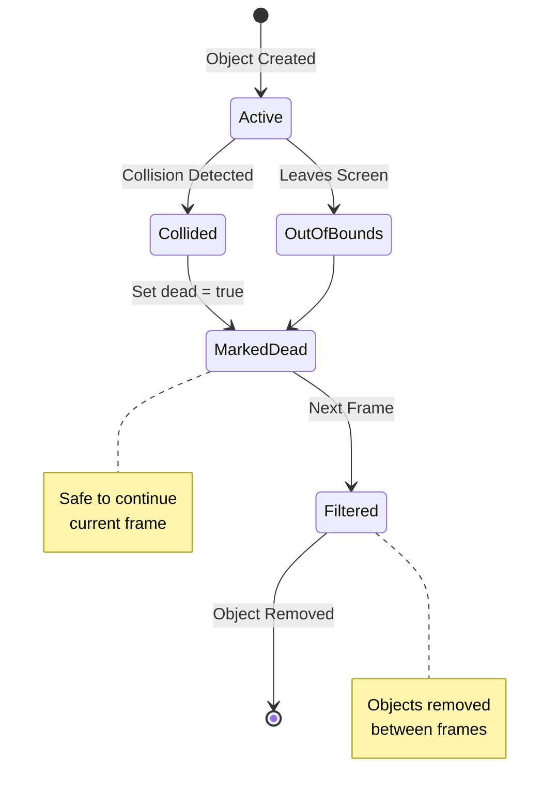
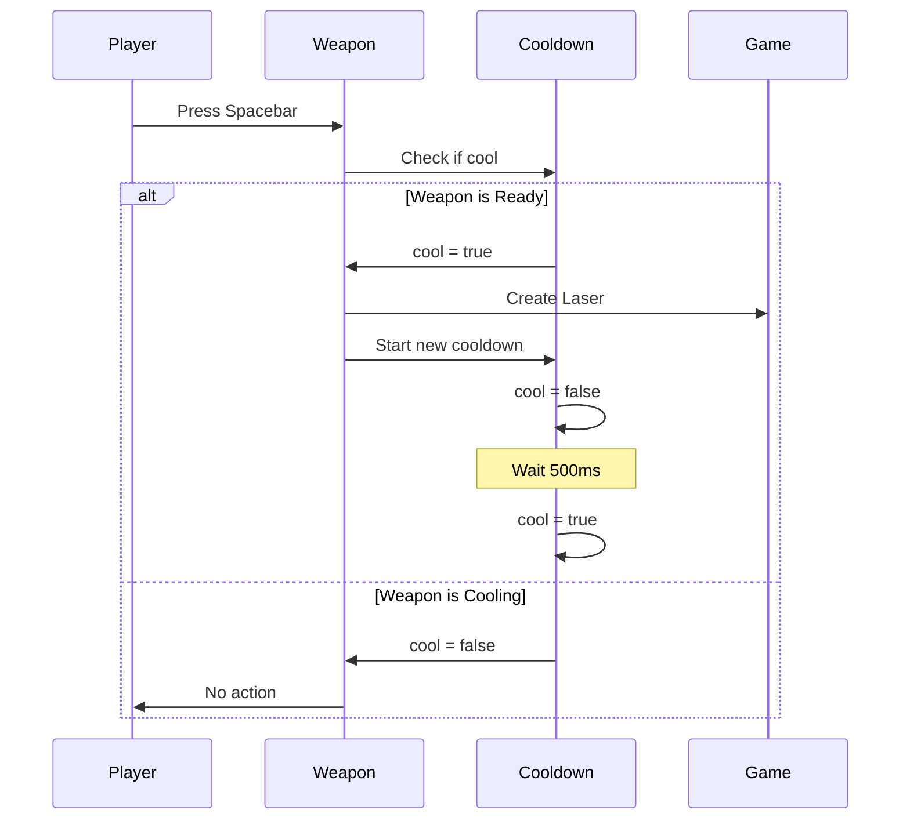
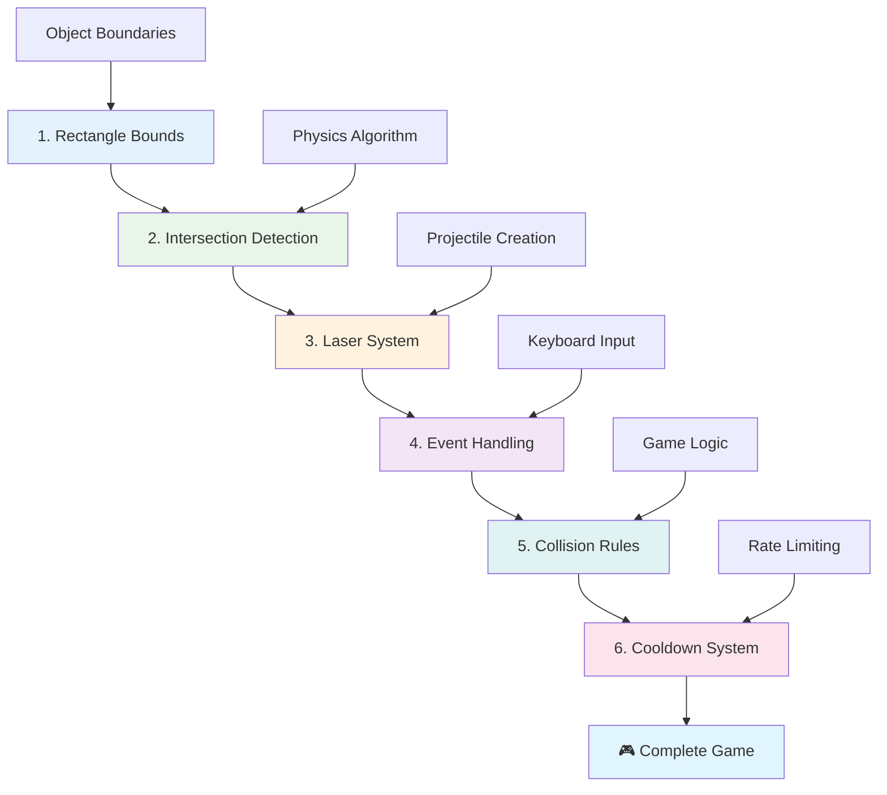
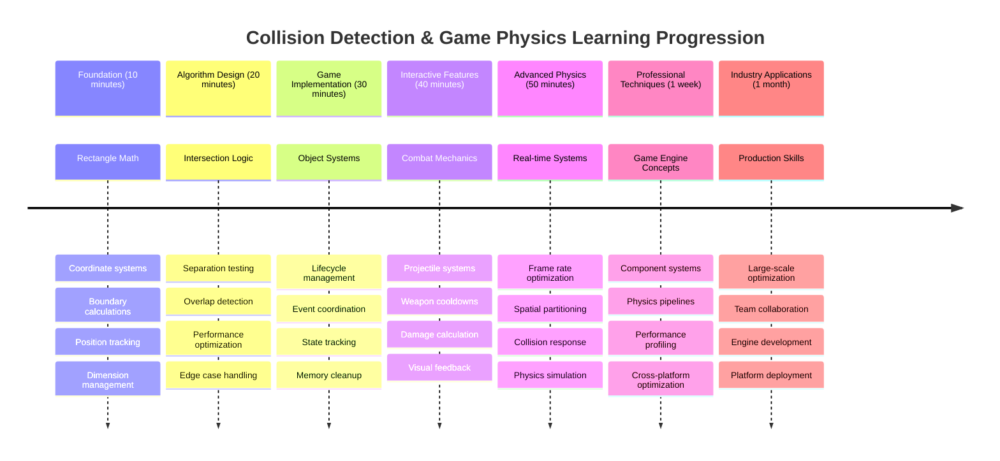

<!--
CO_OP_TRANSLATOR_METADATA:
{
  "original_hash": "039b4d8ce65f5edd82cf48d9c3e6728c",
  "translation_date": "2025-11-03T15:53:27+00:00",
  "source_file": "6-space-game/4-collision-detection/README.md",
  "language_code": "ne"
}
-->
# स्पेस गेम बनाउनुहोस् भाग ४: लेजर थप्नुहोस् र टक्कर पत्ता लगाउनुहोस्



## प्रि-लेक्चर क्विज

[प्रि-लेक्चर क्विज](https://ff-quizzes.netlify.app/web/quiz/35)

स्टार वार्सको त्यो क्षण सम्झनुहोस् जब लुकको प्रोटोन टार्पिडोले डेथ स्टारको एक्जस्ट पोर्टलाई हान्यो। त्यो सटीक टक्कर पत्ता लगाउने क्षणले ग्यालेक्सीको भाग्य परिवर्तन गर्यो! खेलहरूमा, टक्कर पत्ता लगाउने प्रणालीले वस्तुहरू कहिले अन्तरक्रिया गर्छन् र त्यसपछि के हुन्छ भनेर निर्धारण गर्छ।

यस पाठमा, तपाईं आफ्नो स्पेस गेममा लेजर हतियारहरू थप्नुहुनेछ र टक्कर पत्ता लगाउने प्रणाली कार्यान्वयन गर्नुहुनेछ। नासाको मिशन योजनाकारहरूले अन्तरिक्ष यानको मार्गहरू मलबा टार्न गणना गरेजस्तै, तपाईं खेलका वस्तुहरू कहिले एकअर्कासँग ठोक्किन्छन् भनेर पत्ता लगाउन सिक्नुहुनेछ। हामी यसलाई सुलभ चरणहरूमा विभाजन गर्नेछौं जसले एकअर्कामा निर्माण गर्छ।

पाठको अन्त्यसम्ममा, तपाईंको खेलमा लेजरहरूले शत्रुहरूलाई नष्ट गर्ने र टक्करहरूले खेलका घटनाहरू ट्रिगर गर्ने कार्य प्रणाली हुनेछ। यी समान टक्कर सिद्धान्तहरू भौतिक विज्ञानको सिमुलेशनदेखि इन्टरएक्टिभ वेब इन्टरफेससम्म प्रयोग गरिन्छ।



✅ पहिलो कम्प्युटर गेम कहिले लेखिएको थियो भनेर थाहा पाउन थोरै अनुसन्धान गर्नुहोस्। यसको कार्यक्षमता के थियो?

## टक्कर पत्ता लगाउने प्रणाली

टक्कर पत्ता लगाउने प्रणाली अपोलो चन्द्रमा मोड्युलको नजिकको सेन्सरहरू जस्तै काम गर्छ - यो लगातार दूरी जाँच गर्छ र वस्तुहरू धेरै नजिक आउँदा चेतावनी दिन्छ। खेलहरूमा, यो प्रणालीले वस्तुहरू कहिले अन्तरक्रिया गर्छन् र त्यसपछि के हुन्छ भनेर निर्धारण गर्छ।

हामीले प्रयोग गर्ने विधिले प्रत्येक खेलको वस्तुलाई आयतको रूपमा व्यवहार गर्छ, जस्तै हवाई यातायात नियन्त्रण प्रणालीहरूले विमान ट्र्याक गर्न सरल ज्यामितीय आकारहरू प्रयोग गर्छ। यो आयताकार विधि आधारभूत देखिन सक्छ, तर यो कम्प्युटेशनल रूपमा प्रभावकारी छ र अधिकांश खेल परिदृश्यहरूमा राम्रोसँग काम गर्छ।

### आयतको प्रतिनिधित्व

प्रत्येक खेलको वस्तुलाई समन्वय सीमा चाहिन्छ, जस्तै मर्स पाथफाइन्डर रोभरले मर्सको सतहमा आफ्नो स्थान म्याप गर्यो। यहाँ हामीले यी सीमा समन्वयहरू कसरी परिभाषित गर्छौं:



```javascript
rectFromGameObject() {
  return {
    top: this.y,
    left: this.x,
    bottom: this.y + this.height,
    right: this.x + this.width
  }
}
```

**यसलाई टुक्रा-टुक्रामा बुझौं:**
- **माथिल्लो किनारा**: यो वस्तु कहाँबाट ठाडो रूपमा सुरु हुन्छ (यसको y स्थिति)
- **बायाँ किनारा**: यो वस्तु कहाँबाट तेर्सो रूपमा सुरु हुन्छ (यसको x स्थिति)
- **तल्लो किनारा**: y स्थितिमा उचाइ थप्नुहोस् - अब तपाईंलाई थाहा छ यो कहाँ समाप्त हुन्छ!
- **दायाँ किनारा**: x स्थितिमा चौडाइ थप्नुहोस् - र तपाईंले पूर्ण सीमा पाउनुभयो।

### अन्तरक्रिया एल्गोरिदम

आयतको अन्तरक्रिया पत्ता लगाउने प्रणाली हबल स्पेस टेलिस्कोपले आफ्नो दृश्य क्षेत्रमा खगोलीय वस्तुहरू ओभरल्याप गरिरहेका छन् कि छैनन् भनेर निर्धारण गर्ने तरिकासँग मिल्दोजुल्दो तर्क प्रयोग गर्छ। एल्गोरिदमले छुट्टै परीक्षण गर्छ:



```javascript
function intersectRect(r1, r2) {
  return !(r2.left > r1.right ||
    r2.right < r1.left ||
    r2.top > r1.bottom ||
    r2.bottom < r1.top);
}
```

**छुट्टै परीक्षण राडार प्रणालीजस्तै काम गर्छ:**
- के आयत २ पूर्ण रूपमा आयत १ को दायाँ छ?
- के आयत २ पूर्ण रूपमा आयत १ को बायाँ छ?
- के आयत २ पूर्ण रूपमा आयत १ को तल छ?
- के आयत २ पूर्ण रूपमा आयत १ को माथि छ?

यदि यी कुनै पनि सर्तहरू सत्य छैनन् भने, आयतहरू ओभरल्याप गरिरहेका हुनुपर्छ। यो विधि राडार अपरेटरहरूले दुई विमान सुरक्षित दूरीमा छन् कि छैनन् भनेर निर्धारण गर्ने तरिकासँग मिल्दोजुल्दो छ।

## वस्तुहरूको जीवनचक्र व्यवस्थापन

जब लेजरले शत्रुलाई हान्छ, दुबै वस्तुहरू खेलबाट हटाउनुपर्छ। तर, लूपको बीचमा वस्तुहरू मेट्दा क्र्यास हुन सक्छ - अपोलो गाइडेन्स कम्प्युटरजस्ता प्रारम्भिक कम्प्युटर प्रणालीहरूमा सिकिएको पाठ। यसको सट्टा, हामी "मेट्नका लागि चिन्ह लगाउने" विधि प्रयोग गर्छौं जसले फ्रेमहरू बीचमा वस्तुहरू सुरक्षित रूपमा हटाउँछ।



यहाँ हामी कसरी मेट्नका लागि चिन्ह लगाउँछौं:

```javascript
// Mark object for removal
enemy.dead = true;
```

**यो विधि किन काम गर्छ:**
- हामी वस्तुलाई "मृत" भनेर चिन्ह लगाउँछौं तर तुरुन्तै मेट्दैनौं।
- यसले हालको खेल फ्रेमलाई सुरक्षित रूपमा समाप्त गर्न दिन्छ।
- पहिले नै मेटिएको वस्तु प्रयोग गर्न खोज्दा कुनै क्र्यास हुँदैन!

त्यसपछि अर्को रेंडर चक्र अघि चिन्ह लगाइएका वस्तुहरू फिल्टर गर्नुहोस्:

```javascript
gameObjects = gameObjects.filter(go => !go.dead);
```

**यो फिल्टरले के गर्छ:**
- केवल "जिउँदो" वस्तुहरू भएको नयाँ सूची बनाउँछ।
- "मृत" भनेर चिन्ह लगाइएका वस्तुहरू हटाउँछ।
- तपाईंको खेललाई सहज रूपमा चलाउन मद्दत गर्छ।
- नष्ट गरिएका वस्तुहरूबाट मेमोरी बृद्धि रोक्छ।

## लेजर मेकानिक्स कार्यान्वयन

खेलहरूमा लेजर प्रोजेक्टाइलहरू स्टार ट्रेकको फोटोन टार्पिडोजजस्तै काम गर्छन् - ती छुट्टै वस्तुहरू हुन् जो सीधा रेखामा यात्रा गर्छन् जबसम्म तिनीहरूले केही हान्दैनन्। प्रत्येक स्पेसबार प्रेसले नयाँ लेजर वस्तु सिर्जना गर्छ जुन स्क्रिनमा सर्छ।

यसलाई काम गर्न बनाउन, हामीले केही फरक टुक्राहरू समन्वय गर्नुपर्छ:

**कार्यान्वयन गर्नका लागि मुख्य घटकहरू:**
- **सिर्जना गर्नुहोस्** लेजर वस्तुहरू जो नायकको स्थितिबाट उत्पन्न हुन्छन्।
- **ह्यान्डल गर्नुहोस्** कीबोर्ड इनपुटले लेजर सिर्जना ट्रिगर गर्छ।
- **व्यवस्थापन गर्नुहोस्** लेजरको गति र जीवनचक्र।
- **लेजर प्रोजेक्टाइलहरूको दृश्य प्रतिनिधित्व कार्यान्वयन गर्नुहोस्।**

## फायरिङ दर नियन्त्रण कार्यान्वयन

असीमित फायरिङ दरले खेल इन्जिनलाई ओभरलोड गर्नेछ र खेललाई धेरै सजिलो बनाउनेछ। वास्तविक हतियार प्रणालीहरूले यस्तै सीमाहरू सामना गर्छन् - USS एंटरप्राइजको फेजरहरूलाई पनि शटहरू बीचमा रिचार्ज गर्न समय चाहिन्थ्यो।

हामी एक कूलडाउन प्रणाली कार्यान्वयन गर्नेछौं जसले स्प्यामिङ रोक्छ तर उत्तरदायी नियन्त्रणहरू कायम राख्छ:



```javascript
class Cooldown {
  constructor(time) {
    this.cool = false;
    setTimeout(() => {
      this.cool = true;
    }, time);
  }
}

class Weapon {
  constructor() {
    this.cooldown = null;
  }
  
  fire() {
    if (!this.cooldown || this.cooldown.cool) {
      // Create laser projectile
      this.cooldown = new Cooldown(500);
    } else {
      // Weapon is still cooling down
    }
  }
}
```

**कूलडाउन कसरी काम गर्छ:**
- सिर्जना गर्दा, हतियार "तातो" हुन्छ (अहिलेसम्म फायर गर्न सक्दैन)।
- टाइमआउट अवधि पछि, यो "चिसो" हुन्छ (फायर गर्न तयार)।
- फायर गर्नु अघि, हामी जाँच गर्छौं: "के हतियार चिसो छ?"
- यसले स्प्याम-क्लिकिङ रोक्छ तर नियन्त्रणहरू उत्तरदायी राख्छ।

✅ स्पेस गेम श्रृंखलाको पाठ १ मा फर्केर कूलडाउनको बारेमा सम्झनुहोस्।

## टक्कर प्रणाली निर्माण

तपाईं आफ्नो स्पेस गेमको कोडलाई टक्कर पत्ता लगाउने प्रणाली सिर्जना गर्न विस्तार गर्नुहुनेछ। अन्तर्राष्ट्रिय स्पेस स्टेशनको स्वचालित टक्कर टार्ने प्रणालीजस्तै, तपाईंको खेलले निरन्तर वस्तुहरूको स्थिति अनुगमन गर्नेछ र अन्तरक्रियामा प्रतिक्रिया दिनेछ।

तपाईंको अघिल्लो पाठको कोडबाट सुरु गर्दै, तपाईं टक्कर पत्ता लगाउने प्रणाली थप्नुहुनेछ जसले वस्तु अन्तरक्रियालाई शासित गर्ने विशिष्ट नियमहरू समावेश गर्दछ।

> 💡 **प्रो टिप**: लेजर स्प्राइट पहिले नै तपाईंको एसेट्स फोल्डरमा समावेश गरिएको छ र तपाईंको कोडमा सन्दर्भ गरिएको छ, कार्यान्वयनको लागि तयार।

### कार्यान्वयन गर्नका लागि टक्कर नियमहरू

**खेल यान्त्रिकी थप्नुहोस्:**
1. **लेजरले शत्रुलाई हान्छ**: लेजर प्रोजेक्टाइलले हान्दा शत्रु वस्तु नष्ट हुन्छ।
2. **लेजर स्क्रिनको सीमा हान्छ**: स्क्रिनको माथिल्लो किनारमा पुग्दा लेजर हटाइन्छ।
3. **शत्रु र नायकको टक्कर**: दुबै वस्तुहरू ठोक्किँदा नष्ट हुन्छन्।
4. **शत्रु तल पुग्छ**: शत्रुहरू स्क्रिनको तल पुग्दा खेल समाप्त हुने अवस्था।

### 🔄 **शैक्षिक जाँच**
**टक्कर पत्ता लगाउने आधार**: कार्यान्वयन गर्नु अघि सुनिश्चित गर्नुहोस् कि तपाईं बुझ्नुहुन्छ:
- ✅ आयत सीमा कसरी टक्कर क्षेत्रहरू परिभाषित गर्छ।
- ✅ किन छुट्टै परीक्षण अन्तरक्रिया गणनाभन्दा बढी प्रभावकारी छ।
- ✅ खेल लूपमा वस्तु जीवनचक्र व्यवस्थापनको महत्त्व।
- ✅ टक्कर प्रतिक्रियाहरू समन्वय गर्न घटनाचालित प्रणालीहरू कसरी काम गर्छन्।

**छोटो आत्म-परीक्षण**: यदि तपाईंले वस्तुहरू तुरुन्तै मेट्नुभयो भने के हुन्छ?
*उत्तर: लूपको बीचमा मेट्दा क्र्यास हुन सक्छ वा वस्तुहरू पुनरावृत्तिमा छुट्न सक्छ।*

**भौतिक विज्ञानको समझ**: तपाईंले अब बुझ्नुभयो:
- **समन्वय प्रणालीहरू**: स्थिति र आयामहरूले सीमा कसरी सिर्जना गर्छ।
- **अन्तरक्रिया तर्क**: टक्कर पत्ता लगाउने पछाडि गणितीय सिद्धान्तहरू।
- **प्रदर्शन अनुकूलन**: वास्तविक समय प्रणालीहरूमा प्रभावकारी एल्गोरिदम किन महत्त्वपूर्ण छन्।
- **मेमोरी व्यवस्थापन**: स्थिरताका लागि सुरक्षित वस्तु जीवनचक्र ढाँचाहरू।

## तपाईंको विकास वातावरण सेटअप गर्नुहोस्

खुसीको कुरा - हामीले तपाईंका लागि अधिकांश आधारभूत संरचना पहिले नै सेटअप गरिसकेका छौं! तपाईंका सबै खेल एसेट्स र आधारभूत संरचना `your-work` सबफोल्डरमा छन्, तपाईंले टक्करका उत्कृष्ट विशेषताहरू थप्न तयार।

### परियोजना संरचना

```bash
-| assets
  -| enemyShip.png
  -| player.png
  -| laserRed.png
-| index.html
-| app.js
-| package.json
```

**फाइल संरचना बुझ्नुहोस्:**
- **समावेश गर्दछ** खेल वस्तुहरूको लागि आवश्यक सबै स्प्राइट छविहरू।
- **सामेल गर्दछ** मुख्य HTML डकुमेन्ट र जाभास्क्रिप्ट एप्लिकेसन फाइल।
- **प्रदान गर्दछ** स्थानीय विकास सर्भरको लागि प्याकेज कन्फिगरेसन।

### विकास सर्भर सुरु गर्नुहोस्

तपाईंको परियोजना फोल्डरमा नेभिगेट गर्नुहोस् र स्थानीय सर्भर सुरु गर्नुहोस्:

```bash
cd your-work
npm start
```

**यो कमाण्ड अनुक्रम:**
- **डाइरेक्टरी परिवर्तन गर्छ** तपाईंको कार्य परियोजना फोल्डरमा।
- **स्थानीय HTTP सर्भर सुरु गर्छ** `http://localhost:5000` मा।
- **तपाईंका खेल फाइलहरू सेवा दिन्छ** परीक्षण र विकासका लागि।
- **सक्रिय बनाउँछ** स्वत: रीलोडिङसहितको लाइभ विकास।

तपाईंको ब्राउजर खोल्नुहोस् र `http://localhost:5000` मा नेभिगेट गर्नुहोस् ताकि तपाईं आफ्नो हालको खेल स्थिति नायक र शत्रुहरू स्क्रिनमा रेंडर भएको देख्न सक्नुहुन्छ।

### चरण-दर-चरण कार्यान्वयन

नासाले भ्वायजर स्पेसक्राफ्ट प्रोग्राम गर्न प्रयोग गरेको व्यवस्थित दृष्टिकोणजस्तै, हामी टक्कर पत्ता लगाउने प्रणालीलाई विधिवत रूपमा कार्यान्वयन गर्नेछौं, प्रत्येक घटकलाई चरण-दर-चरण निर्माण गर्दै।



#### १. आयत टक्कर सीमा थप्नुहोस्

पहिले, खेलका वस्तुहरूलाई आफ्नो सीमा वर्णन गर्न सिकाऔं। तपाईंको `GameObject` क्लासमा यो विधि थप्नुहोस्:

```javascript
rectFromGameObject() {
    return {
      top: this.y,
      left: this.x,
      bottom: this.y + this.height,
      right: this.x + this.width,
    };
  }
```

**यो विधिले के गर्छ:**
- **सिर्जना गर्छ** सटीक सीमा समन
- [ ] वास्तविक समयमा टक्कर घटनाहरू ट्र्याक गर्न `console.log` स्टेटमेन्टहरू थप्नुहोस्

### 🎯 **यो घण्टामा तपाईंले के हासिल गर्न सक्नुहुन्छ**
- [ ] पाठ-पछिको क्विज पूरा गर्नुहोस् र टक्कर पत्ता लगाउने एल्गोरिदम बुझ्नुहोस्
- [ ] टक्कर हुँदा विस्फोट जस्ता दृश्य प्रभावहरू थप्नुहोस्
- [ ] विभिन्न प्रकारका प्रोजेक्टाइलहरू कार्यान्वयन गर्नुहोस् जसको भिन्न गुणहरू छन्
- [ ] खेलाडीको क्षमताहरू अस्थायी रूपमा बढाउने पावर-अपहरू सिर्जना गर्नुहोस्
- [ ] टक्करलाई थप सन्तोषजनक बनाउन ध्वनि प्रभावहरू थप्नुहोस्

### 📅 **तपाईंको हप्ताभरि भौतिक विज्ञान प्रोग्रामिङ**
- [ ] परिष्कृत टक्कर प्रणालीसहित पूर्ण स्पेस गेम पूरा गर्नुहोस्
- [ ] आयतहरू भन्दा पर उन्नत टक्कर आकारहरू कार्यान्वयन गर्नुहोस् (वृत्त, बहुभुज)
- [ ] यथार्थपरक विस्फोट प्रभावहरूको लागि कण प्रणालीहरू थप्नुहोस्
- [ ] टक्करबाट बच्न जटिल शत्रु व्यवहार सिर्जना गर्नुहोस्
- [ ] धेरै वस्तुहरूसँग राम्रो प्रदर्शनको लागि टक्कर पत्ता लगाउने प्रणालीलाई अनुकूलित गर्नुहोस्
- [ ] गति र यथार्थपरक आन्दोलन जस्ता भौतिक विज्ञान सिमुलेशन थप्नुहोस्

### 🌟 **तपाईंको महिनाभरि खेल भौतिक विज्ञानको मास्टरी**
- [ ] उन्नत भौतिक विज्ञान इन्जिनहरू र यथार्थपरक सिमुलेशनहरूसहित खेलहरू निर्माण गर्नुहोस्
- [ ] 3D टक्कर पत्ता लगाउने र स्थानिक विभाजन एल्गोरिदम सिक्नुहोस्
- [ ] खुला स्रोत भौतिक विज्ञान पुस्तकालयहरू र खेल इन्जिनहरूमा योगदान गर्नुहोस्
- [ ] ग्राफिक्स-गहन अनुप्रयोगहरूको लागि प्रदर्शन अनुकूलनमा मास्टरी हासिल गर्नुहोस्
- [ ] खेल भौतिक विज्ञान र टक्कर पत्ता लगाउने विषयमा शैक्षिक सामग्री सिर्जना गर्नुहोस्
- [ ] उन्नत भौतिक विज्ञान प्रोग्रामिङ कौशल प्रदर्शन गर्ने पोर्टफोलियो निर्माण गर्नुहोस्

## 🎯 तपाईंको टक्कर पत्ता लगाउने मास्टरी समयरेखा



### 🛠️ तपाईंको खेल भौतिक विज्ञान उपकरणको सारांश

यो पाठ पूरा गरेपछि, तपाईंले निम्न कुराहरूमा मास्टरी हासिल गर्नुभएको छ:
- **टक्कर गणित**: आयत अन्तराल एल्गोरिदम र समन्वय प्रणालीहरू
- **प्रदर्शन अनुकूलन**: वास्तविक समयमा टक्कर पत्ता लगाउने प्रणालीको लागि प्रभावकारी समाधान
- **वस्तु जीवनचक्र व्यवस्थापन**: सुरक्षित सिर्जना, अद्यावधिक, र विनाशको ढाँचा
- **घटना-चालित वास्तुकला**: टक्कर प्रतिक्रियाको लागि अलग प्रणालीहरू
- **खेल लूप एकीकरण**: फ्रेम-आधारित भौतिक विज्ञान अद्यावधिक र रेंडरिङ समन्वय
- **इनपुट प्रणालीहरू**: दर सीमित र प्रतिक्रिया सहित उत्तरदायी नियन्त्रणहरू
- **स्मृति व्यवस्थापन**: प्रभावकारी वस्तु पूलिङ र सफा गर्ने रणनीतिहरू

**वास्तविक-विश्व अनुप्रयोगहरू**: तपाईंको टक्कर पत्ता लगाउने कौशल सीधा लागू हुन्छ:
- **अन्तर्क्रियात्मक सिमुलेशनहरू**: वैज्ञानिक मोडेलिङ र शैक्षिक उपकरणहरू
- **प्रयोगकर्ता इन्टरफेस डिजाइन**: ड्र्याग-एन्ड-ड्रप अन्तर्क्रियाहरू र टच पत्ता लगाउने
- **डाटा भिजुअलाइजेशन**: अन्तर्क्रियात्मक चार्टहरू र क्लिक गर्न मिल्ने तत्वहरू
- **मोबाइल विकास**: टच इशारा पहिचान र टक्कर ह्यान्डलिङ
- **रोबोटिक्स प्रोग्रामिङ**: पथ योजना र बाधा बचाव
- **कम्प्युटर ग्राफिक्स**: रे ट्रेसिङ र स्थानिक एल्गोरिदम

**व्यावसायिक कौशल प्राप्त**: अब तपाईं गर्न सक्नुहुन्छ:
- **डिजाइन** वास्तविक समयमा टक्कर पत्ता लगाउने प्रभावकारी एल्गोरिदमहरू
- **कार्यान्वयन** वस्तु जटिलतासँग स्केल हुने भौतिक विज्ञान प्रणालीहरू
- **डिबग** गणितीय सिद्धान्तहरू प्रयोग गरेर जटिल अन्तर्क्रियात्मक प्रणालीहरू
- **अनुकूलन** विभिन्न हार्डवेयर र ब्राउजर क्षमताहरूको लागि प्रदर्शन
- **आर्किटेक्ट** प्रमाणित डिजाइन ढाँचाहरू प्रयोग गरेर मर्मतयोग्य खेल प्रणालीहरू

**खेल विकास अवधारणाहरूमा मास्टरी**:
- **भौतिक विज्ञान सिमुलेशन**: वास्तविक समयमा टक्कर पत्ता लगाउने र प्रतिक्रिया
- **प्रदर्शन इन्जिनियरिङ**: अन्तर्क्रियात्मक अनुप्रयोगहरूको लागि अनुकूलित एल्गोरिदमहरू
- **घटना प्रणालीहरू**: खेल घटकहरू बीच अलग गरिएको सञ्चार
- **वस्तु व्यवस्थापन**: गतिशील सामग्रीको लागि प्रभावकारी जीवनचक्र ढाँचाहरू
- **इनपुट ह्यान्डलिङ**: उपयुक्त प्रतिक्रिया सहित उत्तरदायी नियन्त्रणहरू

**अर्को स्तर**: तपाईं उन्नत भौतिक विज्ञान इन्जिनहरू जस्तै Matter.js अन्वेषण गर्न, 3D टक्कर पत्ता लगाउने कार्यान्वयन गर्न, वा जटिल कण प्रणालीहरू निर्माण गर्न तयार हुनुहुन्छ!

🌟 **उपलब्धि अनलक गरियो**: तपाईंले व्यावसायिक-ग्रेड टक्कर पत्ता लगाउने प्रणालीसहित पूर्ण भौतिक विज्ञान-आधारित अन्तर्क्रियात्मक प्रणाली निर्माण गर्नुभएको छ!

## GitHub Copilot एजेन्ट चुनौती 🚀

एजेन्ट मोड प्रयोग गरेर निम्न चुनौती पूरा गर्नुहोस्:

**विवरण:** टक्कर पत्ता लगाउने प्रणालीलाई सुधार गरेर पावर-अपहरू कार्यान्वयन गर्नुहोस् जुन अनियमित रूपमा उत्पन्न हुन्छन् र नायक जहाजले सङ्कलन गर्दा अस्थायी क्षमताहरू प्रदान गर्दछ।

**प्रेरणा:** PowerUp वर्ग सिर्जना गर्नुहोस् जुन GameObject विस्तार गर्दछ र नायक र पावर-अपहरू बीच टक्कर पत्ता लगाउने कार्यान्वयन गर्नुहोस्। कम्तीमा दुई प्रकारका पावर-अपहरू थप्नुहोस्: एउटा जसले फायर दर बढाउँछ (कूलडाउन घटाउँछ) र अर्को जसले अस्थायी शील्ड सिर्जना गर्दछ। अनियमित अन्तराल र स्थानहरूमा पावर-अपहरू सिर्जना गर्ने उत्पन्न तर्क समावेश गर्नुहोस्।

---

## 🚀 चुनौती

विस्फोट थप्नुहोस्! [Space Art repo](../../../../6-space-game/solution/spaceArt/readme.txt) मा खेल सम्पत्तिहरू हेर्नुहोस् र जब लेजरले एलियनलाई हिर्काउँछ तब विस्फोट थप्न प्रयास गर्नुहोस्।

## पाठ-पछिको क्विज

[पाठ-पछिको क्विज](https://ff-quizzes.netlify.app/web/quiz/36)

## समीक्षा र आत्म अध्ययन

तपाईंको खेलमा हालसम्मका अन्तरालहरूसँग प्रयोग गर्नुहोस्। जब तपाईंले तिनीहरूलाई परिवर्तन गर्नुहुन्छ के हुन्छ? [JavaScript समय घटनाहरू](https://www.freecodecamp.org/news/javascript-timing-events-settimeout-and-setinterval/) बारे थप पढ्नुहोस्।

## असाइनमेन्ट

[टक्कर अन्वेषण गर्नुहोस्](assignment.md)

---

**अस्वीकरण**:  
यो दस्तावेज AI अनुवाद सेवा [Co-op Translator](https://github.com/Azure/co-op-translator) प्रयोग गरी अनुवाद गरिएको हो। हामी शुद्धताको लागि प्रयास गर्छौं, तर कृपया ध्यान दिनुहोस् कि स्वचालित अनुवादमा त्रुटिहरू वा अशुद्धताहरू हुन सक्छ। यसको मूल भाषा मा रहेको मूल दस्तावेजलाई आधिकारिक स्रोत मानिनुपर्छ। महत्वपूर्ण जानकारीको लागि, व्यावसायिक मानव अनुवाद सिफारिस गरिन्छ। यस अनुवादको प्रयोगबाट उत्पन्न हुने कुनै पनि गलतफहमी वा गलत व्याख्याको लागि हामी जिम्मेवार हुने छैनौं।