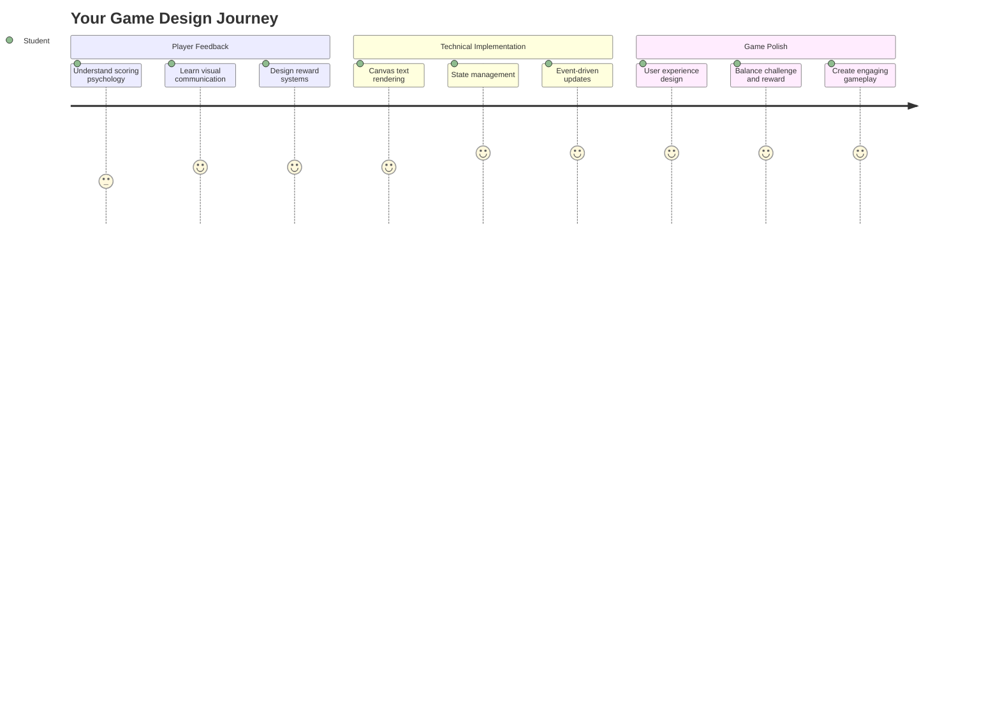
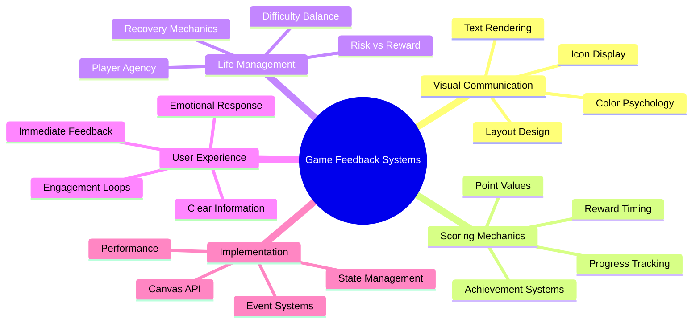
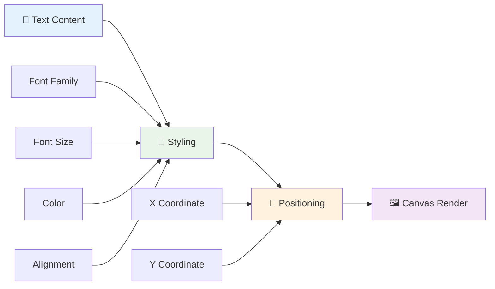
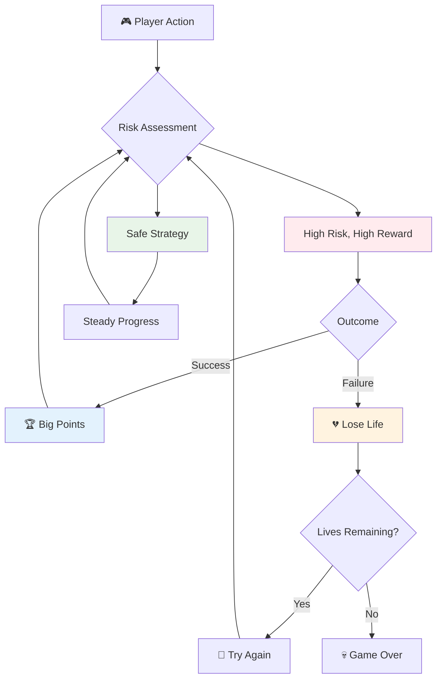
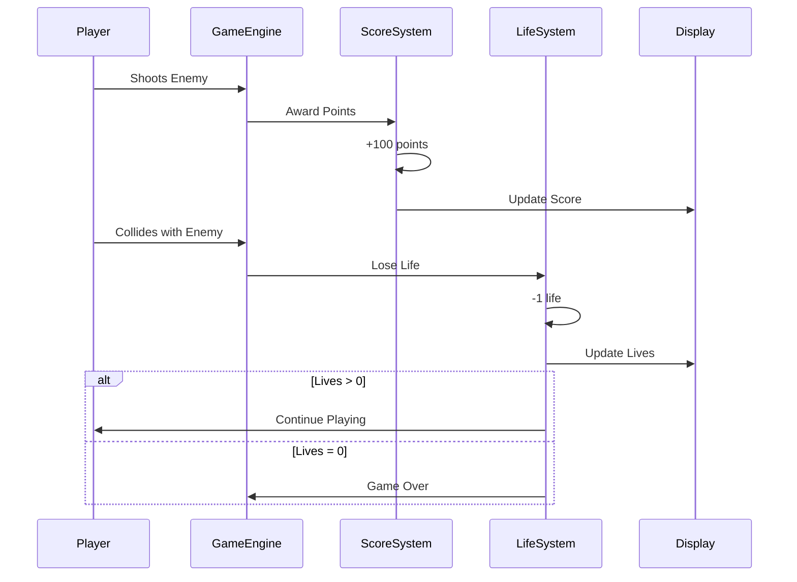
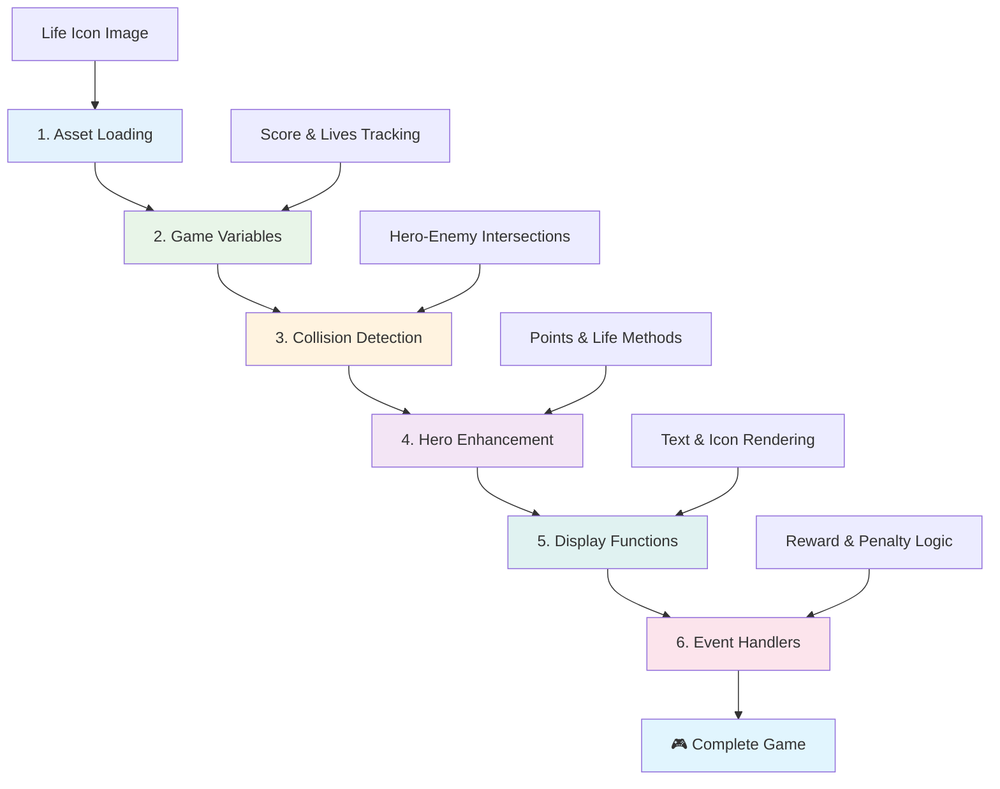
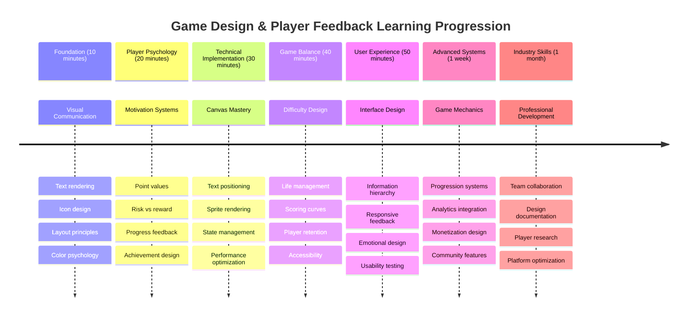

<!--
CO_OP_TRANSLATOR_METADATA:
{
  "original_hash": "2ed9145a16cf576faa2a973dff84d099",
  "translation_date": "2025-11-03T15:55:38+00:00",
  "source_file": "6-space-game/5-keeping-score/README.md",
  "language_code": "ne"
}
-->
# स्पेस गेम बनाउनुहोस् भाग ५: स्कोरिङ र जीवनहरू



## प्रि-लेक्चर क्विज

[प्रि-लेक्चर क्विज](https://ff-quizzes.netlify.app/web/quiz/37)

तपाईंको स्पेस गेमलाई वास्तविक खेल जस्तो बनाउन तयार हुनुहुन्छ? स्कोरिङ पोइन्ट्स र जीवन व्यवस्थापन थपौं - कोर मेकानिक्स जसले प्रारम्भिक आर्केड गेमहरू जस्तै स्पेस इनभेडर्सलाई साधारण प्रदर्शनबाट आकर्षक मनोरञ्जनमा परिवर्तन गर्‍यो। यहीँबाट तपाईंको खेल वास्तवमै खेल्न योग्य हुन्छ।



## स्क्रिनमा टेक्स्ट देखाउने - तपाईंको खेलको आवाज

तपाईंको स्कोर देखाउन, हामीले क्यानभासमा टेक्स्ट कसरी रेंडर गर्ने सिक्नुपर्छ। `fillText()` मेथड तपाईंको मुख्य उपकरण हो - यो क्लासिक आर्केड गेमहरूमा स्कोर र स्टेटस जानकारी देखाउन प्रयोग गरिएको उही प्रविधि हो।



तपाईं टेक्स्टको स्वरूपमा पूर्ण नियन्त्रण राख्न सक्नुहुन्छ:

```javascript
ctx.font = "30px Arial";
ctx.fillStyle = "red";
ctx.textAlign = "right";
ctx.fillText("show this on the screen", 0, 0);
```

✅ [क्यानभासमा टेक्स्ट थप्ने](https://developer.mozilla.org/docs/Web/API/Canvas_API/Tutorial/Drawing_text) मा गहिरो डुब्नुहोस् - तपाईं फन्ट र स्टाइलिङसँग कति रचनात्मक हुन सक्नुहुन्छ भनेर आश्चर्यचकित हुन सक्नुहुन्छ!

## जीवनहरू - केवल संख्या भन्दा बढी

खेल डिजाइनमा, "जीवन" खेलाडीको गल्तीको मार्जिनलाई प्रतिनिधित्व गर्दछ। यो अवधारणा पिनबल मेसिनहरूबाट सुरु भएको हो, जहाँ तपाईंले खेल्नका लागि धेरै बलहरू पाउनुहुन्थ्यो। प्रारम्भिक भिडियो गेमहरू जस्तै एस्टेरोइड्समा, जीवनहरूले खेलाडीहरूलाई जोखिम लिन र गल्तीबाट सिक्न अनुमति दिन्थ्यो।



दृश्य प्रतिनिधित्व धेरै महत्त्वपूर्ण हुन्छ - "Lives: 3" मात्र देखाउने सट्टा जहाज आइकनहरू देखाउनुले तत्काल दृश्य पहिचान सिर्जना गर्दछ, जस्तै प्रारम्भिक आर्केड क्याबिनेटहरूले भाषा बाधाहरू पार गर्न आइकनोग्राफी प्रयोग गर्थे।

## तपाईंको खेलको पुरस्कार प्रणाली निर्माण गर्नुहोस्

अब हामी खेलाडीहरूलाई संलग्न राख्ने कोर फिडब्याक प्रणालीहरू कार्यान्वयन गर्नेछौं:



- **स्कोरिङ प्रणाली**: प्रत्येक नष्ट गरिएको शत्रु जहाजले १०० पोइन्ट्स प्रदान गर्दछ (राउन्ड नम्बरहरू खेलाडीहरूले मानसिक रूपमा गणना गर्न सजिलो हुन्छ)। स्कोर तलको बायाँ कुनामा देखाइन्छ।
- **जीवन काउन्टर**: तपाईंको हिरो तीन जीवनहरूसँग सुरु हुन्छ - प्रारम्भिक आर्केड गेमहरूले चुनौती र खेल्न योग्यताको सन्तुलन गर्न स्थापना गरेको मानक। प्रत्येक शत्रुसँगको टक्करले एक जीवन खर्च हुन्छ। बाँकी जीवनहरू तलको दायाँ कुनामा जहाज आइकनहरू प्रयोग गरेर देखाइन्छ ।

## निर्माण सुरु गरौं!

पहिले, तपाईंको कार्यक्षेत्र सेटअप गर्नुहोस्। तपाईंको `your-work` सब फोल्डरमा फाइलहरूमा नेभिगेट गर्नुहोस्। तपाईंले यी फाइलहरू देख्नुहुनेछ:

```bash
-| assets
  -| enemyShip.png
  -| player.png
  -| laserRed.png
-| index.html
-| app.js
-| package.json
```

तपाईंको खेल परीक्षण गर्न, `your_work` फोल्डरबाट विकास सर्भर सुरु गर्नुहोस्:

```bash
cd your-work
npm start
```

यसले `http://localhost:5000` मा स्थानीय सर्भर चलाउँछ। तपाईंको ब्राउजरमा यो ठेगाना खोल्नुहोस् र तपाईंको खेल हेर्नुहोस्। एरो कीहरू प्रयोग गरेर कन्ट्रोलहरू परीक्षण गर्नुहोस् र सबै कुरा काम गरिरहेको छ भनी सुनिश्चित गर्न शत्रुहरूलाई शूट गर्न प्रयास गर्नुहोस्।



### कोड लेख्ने समय!

1. **तपाईंलाई आवश्यक दृश्य सम्पत्ति प्राप्त गर्नुहोस्**। `solution/assets/` फोल्डरबाट `life.png` सम्पत्ति तपाईंको `your-work` फोल्डरमा प्रतिलिपि गर्नुहोस्। त्यसपछि `lifeImg` लाई तपाईंको window.onload फङ्सनमा थप्नुहोस्:

    ```javascript
    lifeImg = await loadTexture("assets/life.png");
    ```

1. `lifeImg` लाई तपाईंको सम्पत्ति सूचीमा थप्न नबिर्सनुहोस्:

    ```javascript
    let heroImg,
    ...
    lifeImg,
    ...
    eventEmitter = new EventEmitter();
    ```
  
2. **तपाईंको खेल भेरिएबलहरू सेटअप गर्नुहोस्**। तपाईंको कुल स्कोर (० बाट सुरु गर्दै) र बाँकी जीवनहरू (३ बाट सुरु गर्दै) ट्र्याक गर्न केही कोड थप्नुहोस्। हामी यी स्क्रिनमा देखाउनेछौं ताकि खेलाडीहरूले सधैं आफ्नो स्थिति थाहा पाउन सकून्।

3. **टक्कर पत्ता लगाउने कार्यान्वयन गर्नुहोस्**। तपाईंको `updateGameObjects()` फङ्सनलाई विस्तार गरेर शत्रुहरूले तपाईंको हिरोसँग टक्कर गर्दा पत्ता लगाउने बनाउनुहोस्:

    ```javascript
    enemies.forEach(enemy => {
        const heroRect = hero.rectFromGameObject();
        if (intersectRect(heroRect, enemy.rectFromGameObject())) {
          eventEmitter.emit(Messages.COLLISION_ENEMY_HERO, { enemy });
        }
      })
    ```

4. **तपाईंको हिरोमा जीवन र पोइन्ट ट्र्याकिङ थप्नुहोस्**। 
   1. **काउन्टरहरू आरम्भ गर्नुहोस्**। तपाईंको `Hero` क्लासमा `this.cooldown = 0` अन्तर्गत जीवन र पोइन्ट्स सेटअप गर्नुहोस्:

        ```javascript
        this.life = 3;
        this.points = 0;
        ```

   1. **यी मानहरू खेलाडीलाई देखाउनुहोस्**। स्क्रिनमा यी मानहरू देखाउन फङ्सनहरू सिर्जना गर्नुहोस्:

        ```javascript
        function drawLife() {
          // TODO, 35, 27
          const START_POS = canvas.width - 180;
          for(let i=0; i < hero.life; i++ ) {
            ctx.drawImage(
              lifeImg, 
              START_POS + (45 * (i+1) ), 
              canvas.height - 37);
          }
        }
        
        function drawPoints() {
          ctx.font = "30px Arial";
          ctx.fillStyle = "red";
          ctx.textAlign = "left";
          drawText("Points: " + hero.points, 10, canvas.height-20);
        }
        
        function drawText(message, x, y) {
          ctx.fillText(message, x, y);
        }

        ```

   1. **यी सबैलाई तपाईंको खेल लूपमा जोड्नुहोस्**। यी फङ्सनहरू `updateGameObjects()` पछि तपाईंको window.onload फङ्सनमा थप्नुहोस्:

        ```javascript
        drawPoints();
        drawLife();
        ```

### 🔄 **शैक्षिक जाँच**
**खेल डिजाइन बुझाइ**: परिणामहरू कार्यान्वयन गर्नु अघि सुनिश्चित गर्नुहोस्:
- ✅ दृश्य फिडब्याकले खेलाडीहरूलाई खेलको अवस्था कसरी सञ्चार गर्छ
- ✅ UI तत्वहरूको निरन्तर स्थानले प्रयोगयोग्यतालाई किन सुधार गर्छ
- ✅ पोइन्ट मानहरू र जीवन व्यवस्थापनको मनोविज्ञान
- ✅ क्यानभास टेक्स्ट रेंडरिङ HTML टेक्स्टबाट कसरी फरक छ

**छोटो आत्म-परीक्षण**: किन आर्केड गेमहरूले सामान्यतया पोइन्ट मानहरूको लागि राउन्ड नम्बरहरू प्रयोग गर्छन्?
*उत्तर: राउन्ड नम्बरहरू खेलाडीहरूले मानसिक रूपमा गणना गर्न सजिलो हुन्छ र सन्तोषजनक मनोवैज्ञानिक पुरस्कार सिर्जना गर्छ*

**प्रयोगकर्ता अनुभव सिद्धान्तहरू**: तपाईं अहिले लागू गर्दै हुनुहुन्छ:
- **दृश्य पदानुक्रम**: महत्त्वपूर्ण जानकारी प्रमुख स्थानमा राखिएको
- **तत्काल फिडब्याक**: खेलाडी क्रियाकलापहरूमा वास्तविक समय अपडेटहरू
- **संज्ञानात्मक भार**: सरल, स्पष्ट जानकारी प्रस्तुति
- **भावनात्मक डिजाइन**: आइकनहरू र रंगहरूले खेलाडीको सम्बन्ध सिर्जना गर्ने

1. **खेल परिणामहरू र पुरस्कारहरू कार्यान्वयन गर्नुहोस्**। अब हामी खेलाडी क्रियाकलापहरूलाई अर्थपूर्ण बनाउने फिडब्याक प्रणालीहरू थप्नेछौं:

   1. **टक्करहरूले जीवन खर्च गर्छन्**। तपाईंको हिरोले शत्रुसँग टक्कर गर्दा प्रत्येक पटक एक जीवन गुमाउनु पर्छ।
   
      यो मेथड तपाईंको `Hero` क्लासमा थप्नुहोस्:

        ```javascript
        decrementLife() {
          this.life--;
          if (this.life === 0) {
            this.dead = true;
          }
        }
        ```

   2. **शत्रुहरूलाई शूट गर्दा पोइन्ट्स कमाइन्छ**। प्रत्येक सफल हिटले १०० पोइन्ट्स प्रदान गर्दछ, सटीक शूटिङको लागि तत्काल सकारात्मक फिडब्याक प्रदान गर्दै।

      तपाईंको Hero क्लासलाई यो इन्क्रिमेन्ट मेथडसँग विस्तार गर्नुहोस्:
    
        ```javascript
          incrementPoints() {
            this.points += 100;
          }
        ```

        अब यी फङ्सनहरूलाई तपाईंको टक्कर घटनाहरूमा जोड्नुहोस्:

        ```javascript
        eventEmitter.on(Messages.COLLISION_ENEMY_LASER, (_, { first, second }) => {
           first.dead = true;
           second.dead = true;
           hero.incrementPoints();
        })

        eventEmitter.on(Messages.COLLISION_ENEMY_HERO, (_, { enemy }) => {
           enemy.dead = true;
           hero.decrementLife();
        });
        ```

✅ जाभास्क्रिप्ट र क्यानभाससँग बनाइएका अन्य खेलहरूको बारेमा उत्सुक हुनुहुन्छ? केही अन्वेषण गर्नुहोस् - तपाईं सम्भावनाहरूमा चकित हुन सक्नुहुन्छ!

यी सुविधाहरू कार्यान्वयन गरेपछि, तपाईंको खेल परीक्षण गर्नुहोस् र पूर्ण फिडब्याक प्रणालीलाई क्रियाशील देख्नुहोस्। तपाईंले तलको दायाँमा जीवन आइकनहरू, तलको बायाँमा स्कोर देख्नुहुनेछ, र टक्करहरूले जीवन घटाउँदा सफल शूटहरूले स्कोर बढाएको हेर्नुहोस्।

तपाईंको खेलमा अब प्रारम्भिक आर्केड गेमहरूलाई यति आकर्षक बनाउने आवश्यक मेकानिक्सहरू छन् - स्पष्ट लक्ष्यहरू, तत्काल फिडब्याक, र खेलाडी क्रियाकलापहरूको लागि अर्थपूर्ण परिणामहरू।

### 🔄 **शैक्षिक जाँच**
**पूर्ण खेल डिजाइन प्रणाली**: खेलाडी फिडब्याक प्रणालीहरूको तपाईंको मास्टरी प्रमाणित गर्नुहोस्:
- ✅ स्कोरिङ मेकानिक्सले खेलाडी प्रेरणा र संलग्नता कसरी सिर्जना गर्छ?
- ✅ प्रयोगकर्ता इन्टरफेस डिजाइनको लागि दृश्य निरन्तरता किन महत्त्वपूर्ण छ?
- ✅ जीवन प्रणालीले चुनौती र खेलाडी प्रतिधारणलाई कसरी सन्तुलन गर्छ?
- ✅ सन्तोषजनक गेमप्ले सिर्जना गर्न तत्काल फिडब्याकले के भूमिका खेल्छ?

**सिस्टम एकीकरण**: तपाईंको फिडब्याक प्रणालीले प्रदर्शन गर्दछ:
- **प्रयोगकर्ता अनुभव डिजाइन**: स्पष्ट दृश्य सञ्चार र जानकारी पदानुक्रम
- **इभेन्ट-ड्रिभन आर्किटेक्चर**: खेलाडी क्रियाकलापहरूमा प्रतिक्रियात्मक अपडेटहरू
- **स्टेट म्यानेजमेन्ट**: गतिशील खेल डेटा ट्र्याकिङ र प्रदर्शन
- **क्यानभास मास्टरी**: टेक्स्ट रेंडरिङ र स्प्राइट पोजिसनिङ
- **खेल मनोविज्ञान**: खेलाडी प्रेरणा र संलग्नता बुझाइ

**व्यावसायिक ढाँचाहरू**: तपाईंले कार्यान्वयन गर्नुभएको छ:
- **MVC आर्किटेक्चर**: खेल तर्क, डेटा, र प्रस्तुतीकरणको छुट्टै व्यवस्था
- **अवलोकनकर्ता ढाँचा**: खेल अवस्था परिवर्तनहरूको लागि इभेन्ट-ड्रिभन अपडेटहरू
- **घटक डिजाइन**: रेंडरिङ र तर्कका लागि पुन: प्रयोगयोग्य फङ्सनहरू
- **प्रदर्शन अनुकूलन**: खेल लूपमा कुशल रेंडरिङ

### ⚡ **अर्को ५ मिनेटमा तपाईं के गर्न सक्नुहुन्छ**
- [ ] स्कोर डिस्प्लेका लागि विभिन्न फन्ट साइज र रंगहरू प्रयोग गर्नुहोस्
- [ ] पोइन्ट मानहरू परिवर्तन गरेर गेमप्लेको अनुभवमा कस्तो प्रभाव पर्छ हेर्नुहोस्
- [ ] पोइन्ट्स र जीवन परिवर्तन हुँदा ट्र्याक गर्न console.log स्टेटमेन्टहरू थप्नुहोस्
- [ ] जीवन समाप्त हुने वा उच्च स्कोर प्राप्त गर्ने जस्ता किनाराका केसहरू परीक्षण गर्नुहोस्

### 🎯 **यो घण्टामा तपाईं के हासिल गर्न सक्नुहुन्छ**
- [ ] पोस्ट-लेसन क्विज पूरा गर्नुहोस् र खेल डिजाइन मनोविज्ञान बुझ्नुहोस्
- [ ] स्कोरिङ र जीवन गुमाउँदा ध्वनि प्रभावहरू थप्नुहोस्
- [ ] स्थानीयStorage प्रयोग गरेर उच्च स्कोर प्रणाली कार्यान्वयन गर्नुहोस्
- [ ] विभिन्न शत्रु प्रकारहरूको लागि विभिन्न पोइन्ट मानहरू सिर्जना गर्नुहोस्
- [ ] जीवन गुमाउँदा स्क्रिन शेक जस्ता दृश्य प्रभावहरू थप्नुहोस्

### 📅 **तपाईंको हप्ताको खेल डिजाइन यात्रा**
- [ ] पूर्ण स्पेस गेमलाई परिष्कृत फिडब्याक प्रणालीहरूसँग पूरा गर्नुहोस्
- [ ] उन्नत स्कोरिङ मेकानिक्स जस्तै कम्बो मल्टिप्लायर्स कार्यान्वयन गर्नुहोस्
- [ ] उपलब्धिहरू र अनलक गर्न सकिने सामग्री थप्नुहोस्
- [ ] कठिनाई प्रगति र सन्तुलन प्रणालीहरू सिर्जना गर्नुहोस्
- [ ] मेनुहरू र गेम ओभर स्क्रिनहरूको लागि प्रयोगकर्ता इन्टरफेस डिजाइन गर्नुहोस्
- [ ] अन्य खेलहरू अध्ययन गरेर संलग्नता मेकानिक्स बुझ्नुहोस्

### 🌟 **तपाईंको महिनाको खेल विकास मास्टरी**
- [ ] परिष्कृत प्रगति प्रणालीहरूसँग पूर्ण खेलहरू निर्माण गर्नुहोस्
- [ ] खेल विश्लेषण र खेलाडी व्यवहार मापन सिक्नुहोस्
- [ ] खुला स्रोत खेल विकास परियोजनाहरूमा योगदान गर्नुहोस्
- [ ] उन्नत खेल डिजाइन ढाँचाहरू र मुद्रीकरण मास्टर गर्नुहोस्
- [ ] खेल डिजाइन र प्रयोगकर्ता अनुभवको बारेमा शैक्षिक सामग्री सिर्जना गर्नुहोस्
- [ ] खेल डिजाइन र विकास कौशल प्रदर्शन गर्ने पोर्टफोलियो निर्माण गर्नुहोस्

## 🎯 तपाईंको खेल डिजाइन मास्टरी टाइमलाइन



### 🛠️ तपाईंको खेल डिजाइन टूलकिट सारांश

यो पाठ पूरा गरेपछि, तपाईंले अब मास्टर गर्नुभएको छ:
- **खेलाडी मनोविज्ञान**: प्रेरणा, जोखिम/पुरस्कार, र संलग्नता लूपहरू बुझ्नुहोस्
- **दृश्य सञ्चार**: टेक्स्ट, आइकन, र लेआउट प्रयोग गरेर प्रभावकारी UI डिजाइन
- **फिडब्याक प्रणालीहरू**: खेलाडी क्रियाकलापहरू र खेल घटनाहरूमा वास्तविक समय प्रतिक्रिया
- **स्टेट म्यानेजमेन्ट**: गतिशील खेल डेटा कुशलतापूर्वक ट्र्याकिङ र प्रदर्शन
- **क्यानभास टेक्स्ट रेंडरिङ**: स्टाइलिङ र पोजिसनिङको साथ व्यावसायिक टेक्स्ट डिस्प्ले
- **इभेन्ट एकीकरण**: प्रयोगकर्ता क्रियाकलापहरूलाई अर्थपूर्ण खेल परिणामहरूसँग जोड्नुहोस्
- **खेल सन्तुलन**: कठिनाई वक्र र खेलाडी प्रगति प्रणालीहरू डिजाइन गर्नुहोस्

**वास्तविक-विश्व अनुप्रयोगहरू**: तपाईंको खेल डिजाइन कौशल सीधा लागू हुन्छ:
- **प्रयोगकर्ता इन्टरफेस डिजाइन**: आकर्षक र सहज इन्टरफेसहरू सिर्जना गर्नुहोस्
- **उत्पादन विकास**: प्रयोगकर्ता प्रेरणा र फिडब्याक लूपहरू बुझ्नुहोस्
- **शैक्षिक प्रविधि**: गेमिफिकेशन र सिकाइ संलग्नता प्रणालीहरू
- **डाटा भिजुअलाइजेशन**: जटिल जानकारी पहुँचयोग्य र आकर्षक बनाउनुहोस्
- **मोबाइल एप विकास**: प्रतिधारण मेकानिक्स र प्रयोगकर्ता अनुभव डिजाइन
- **मार्केटिङ प्रविधि**: प्रयोगकर्ता व्यवहार र रूपान्तरण अनुकूलन बुझ्नुहोस्

**प्रोफेशनल कौशल प्राप्त गरियो**: तपाईं अब गर्न सक्नुहुन्छ:
- **डिजाइन** प्रयोगकर्ता अनुभवहरू जसले प्रयोगकर्ताहरूलाई प्रेरित र संलग्न गर्छ
- **कार्यान्वयन** फिडब्याक प्रणालीहरू जसले प्रभावकारी रूपमा प्रयोगकर्ता व्यवहारलाई मार्गदर्शन गर्छ
- **सन्तुलन** चुनौती र पहुँचयोग्यता अन्तरक्रियात्मक प्रणालीहरूमा
- **सिर्जना** दृश्य सञ्चार जसले विभिन्न प्रयोगकर्ता समूहहरूमा काम गर्छ
- **विश्लेषण** प्रयोगकर्ता व्यवहार र डिजाइन सुधारहरूमा पुनरावृत्ति गर्नुहोस्

**खेल विकास अवधारणाहरू मास्टर गरियो**:
- **खेलाडी प्रेरणा**: संलग्नता र प्रतिधारणलाई प्रेरित गर्ने कुरा बुझ्नुहोस्
- **दृश्य डिजाइन**: स्पष्ट, आकर्षक, र कार्यात्मक इन्टरफेसहरू सिर्जना गर्नुहोस्
- **सिस्टम एकीकरण**: एकसाथ अनुभवको लागि धेरै खेल प्रणालीहरू जोड्नुहोस्
- **प्रदर्शन अनुकूलन**: कुशल रेंडरिङ र स्टेट म्यानेजमेन्ट
- **पहुंचयोग्यता**: विभिन्न कौशल स्तर र खेलाडी आवश्यकताहरूको लागि डिजाइन गर्नुहोस्

**अर्को स्तर**: तपाईं उन्नत खेल डिजाइन ढाँचाहरू अन्वेषण गर्न, विश्लेषण प्रणालीहरू कार्यान्वयन गर्न, वा खेल मुद्रीकरण र खेलाडी प्रतिधारण रणनीतिहरू अध्ययन गर्न तयार हुनुहुन्छ!

🌟 **उपलब्धि अनलक गरियो**: तपाईंले व्यावसायिक खेल डिजाइन सिद्धान्तहरूसँग पूर्ण खेलाडी फिडब्याक प्रणाली निर्माण गर्नुभएको छ!

---

## GitHub Copilot Agent Challenge 🚀

Agent मोड प्रयोग गरेर निम्न चुनौती पूरा गर्नुहोस्:

**विवरण:** स्पेस गेमको स्कोरिङ प्रणालीलाई उच्च स्कोर सुविधा र बोनस स्कोरिङ मेकानिक्स कार्यान्वयन गरेर सुधार गर्नुहोस्।

**प्रोम्प्ट:** खेलाडीको सर्वश्रेष्ठ स्कोरलाई localStorage मा बचत गर्ने उच्च स्कोर प्रणाली सिर्जना गर्नुहोस्। लगातार शत्रु मार्ने (कम्बो प्रणाली) को लागि बोनस पोइन्ट्स थप्नुहोस् र विभिन्न शत्रु प्रकारहरूको लागि विभिन्न पोइन्ट मानहरू कार्यान्वयन गर्नुहोस्। खेलाडीले नयाँ उच्च स्कोर प्राप्त गर्दा दृश्य संकेतक समावेश गर्नुहोस् र खेल स्क्रिनमा वर्तमान उच्च स्कोर देखाउनुहोस्।

## 🚀 चुनौती

तपाईंसँग अहिले स्कोरिङ र जीवनहरूसँग कार्यात्मक खेल छ। खेलाडी अनुभवलाई अझ राम्रो बनाउन सक्ने थप सुविधाहरू के हुन सक्छन् विचार गर्नुहोस्।

## पोस्ट-लेक्चर क्विज

[पोस्ट-लेक्चर क्विज](https://ff-quizzes.netlify.app/web/quiz/38)

## समीक्षा र आत्म अध्ययन

थप अन्वेषण गर्न चाहनुहुन्छ? खेल स्कोरिङ र जीवन प्रणालीहरूको विभिन्न दृष्टिकोणहरू अनुसन्धान गर्नुहोस्। त्यहाँ [PlayFab](https://playfab.com) जस्ता आकर्षक खेल इन्जिनहरू छन् जसले स्कोरिङ, लिडरबोर्डहरू, र खेलाडी प्रगति व्यवस्थापन गर्छ। यस्तो कुरा एकीकृत गर्दा तपाईंको खेललाई अर्को स्तरमा कसरी लैजान सकिन्छ?  

## असाइनमेन्ट

[स्कोरिङ गेम बनाउनुहोस्](assignment.md)

---

**अस्वीकरण**:  
यो दस्तावेज AI अनुवाद सेवा [Co-op Translator](https://github.com/Azure/co-op-translator) प्रयोग गरेर अनुवाद गरिएको छ। हामी शुद्धताको लागि प्रयास गर्छौं, तर कृपया ध्यान दिनुहोस् कि स्वचालित अनुवादहरूमा त्रुटिहरू वा अशुद्धताहरू हुन सक्छ। यसको मूल भाषा मा रहेको दस्तावेजलाई आधिकारिक स्रोत मानिनुपर्छ। महत्वपूर्ण जानकारीको लागि, व्यावसायिक मानव अनुवाद सिफारिस गरिन्छ। यस अनुवादको प्रयोगबाट उत्पन्न हुने कुनै पनि गलतफहमी वा गलत व्याख्याको लागि हामी जिम्मेवार हुने छैनौं।