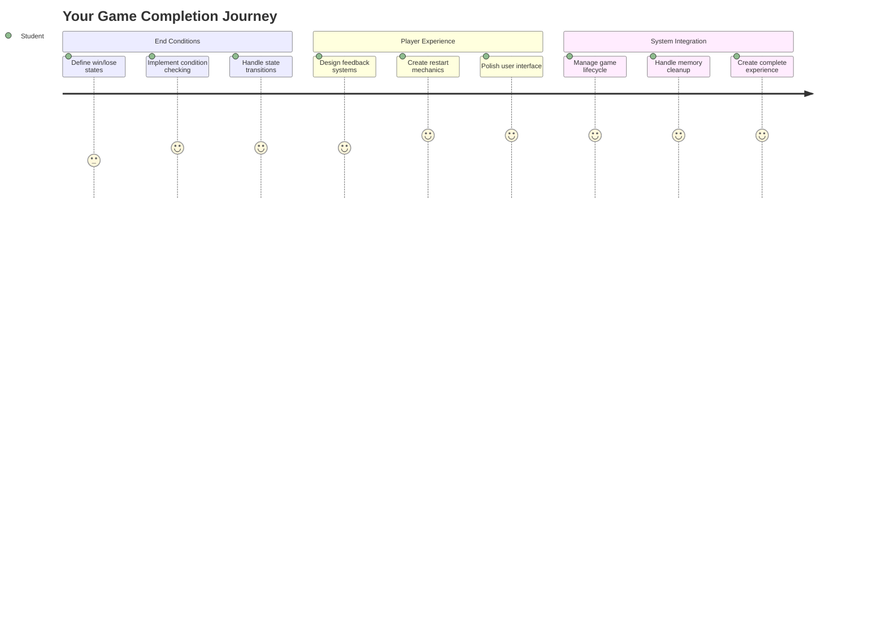
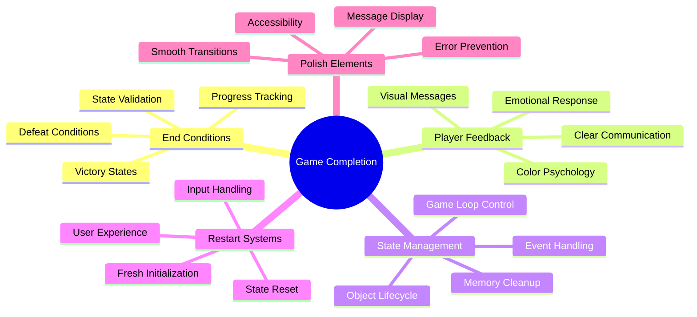
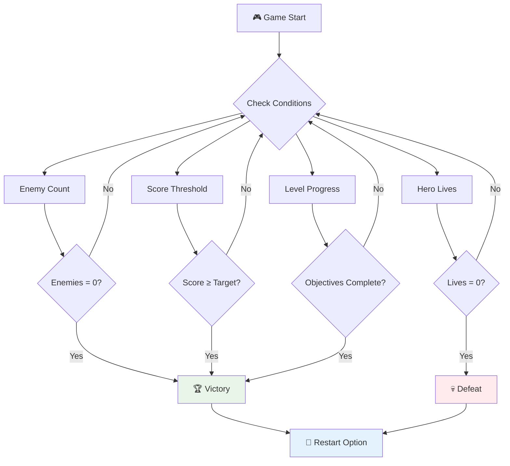
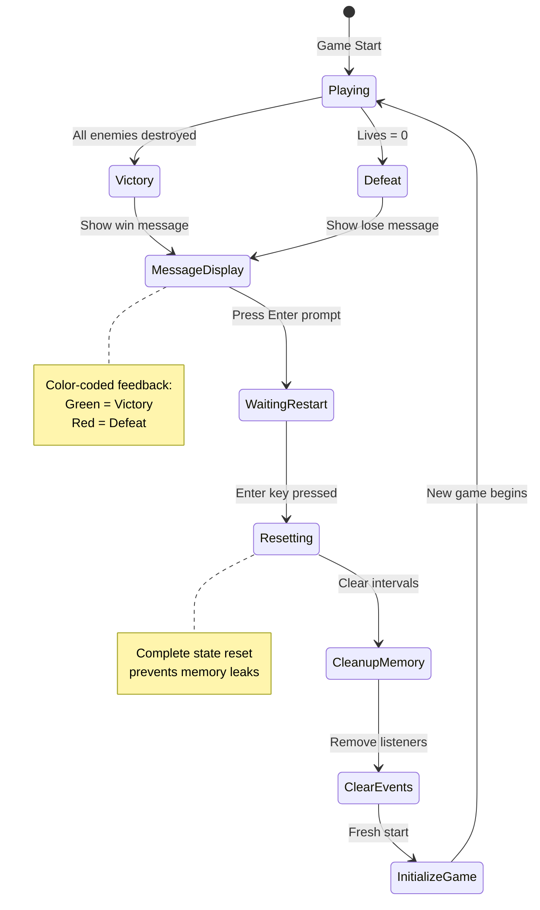
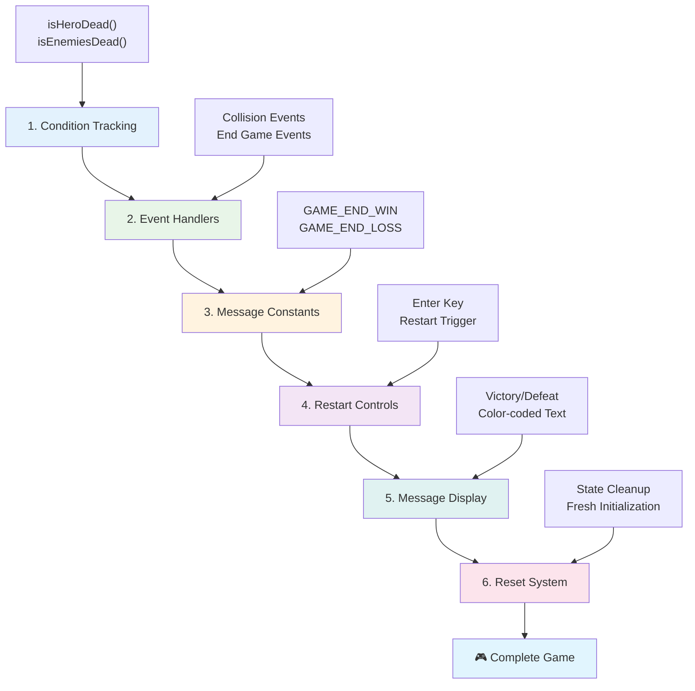
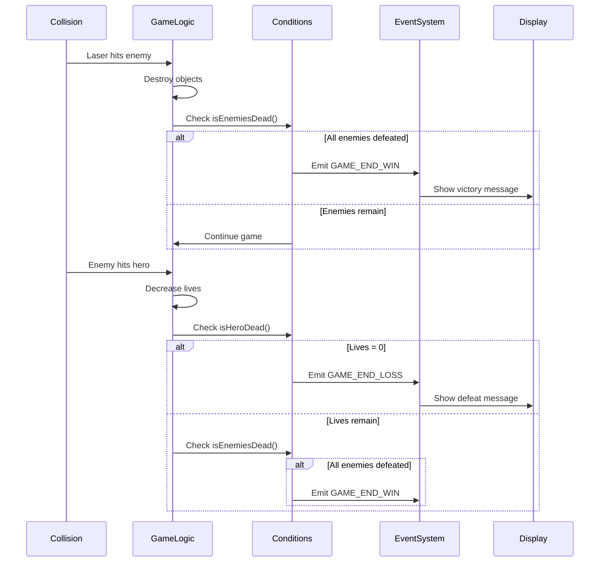
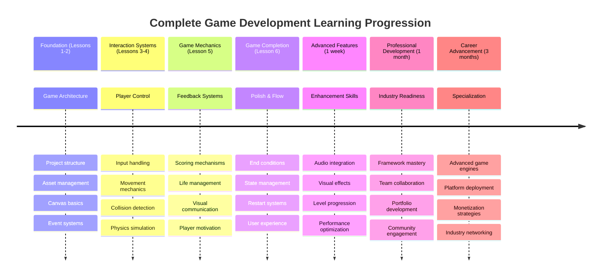

<!--
CO_OP_TRANSLATOR_METADATA:
{
  "original_hash": "a4b78043f4d64bf3ee24e0689b8b391d",
  "translation_date": "2025-11-03T15:51:47+00:00",
  "source_file": "6-space-game/6-end-condition/README.md",
  "language_code": "ne"
}
-->
# स्पेस गेम बनाउनुहोस् भाग ६: अन्त्य र पुनः सुरु गर्नुहोस्



प्रत्येक उत्कृष्ट खेलमा स्पष्ट अन्त्य अवस्था र सहज पुनः सुरु गर्ने प्रणाली आवश्यक हुन्छ। तपाईंले आन्दोलन, युद्ध, र स्कोरिङसहितको प्रभावशाली स्पेस गेम निर्माण गर्नुभएको छ - अब यो पूर्ण महसुस गराउने अन्तिम टुक्राहरू थप्ने समय हो।

तपाईंको खेल हाल अनिश्चितकालसम्म चल्छ, जस्तै नासाले १९७७ मा प्रक्षेपण गरेका Voyager प्रोबहरू - दशकौंसम्म अन्तरिक्षमा यात्रा गरिरहेका छन्। जबकि यो अन्तरिक्ष अन्वेषणका लागि ठीक छ, खेलहरूलाई सन्तोषजनक अनुभव सिर्जना गर्न परिभाषित अन्त्य बिन्दुहरू आवश्यक हुन्छ।

आज, हामी उचित जित/हार अवस्था र पुनः सुरु प्रणाली कार्यान्वयन गर्नेछौं। यो पाठको अन्त्यसम्ममा, तपाईंले एक परिष्कृत खेल बनाउनुहुनेछ जसलाई खेलाडीहरूले पूरा गर्न र पुनः खेल्न सक्नेछन्, ठीक त्यस्तै क्लासिक आर्केड खेलहरू जसले माध्यमलाई परिभाषित गरे।



## प्रि-लेक्चर क्विज

[प्रि-लेक्चर क्विज](https://ff-quizzes.netlify.app/web/quiz/39)

## खेलको अन्त्य अवस्था बुझ्दै

तपाईंको खेल कहिले समाप्त हुनुपर्छ? यो मौलिक प्रश्नले प्रारम्भिक आर्केड युगदेखि खेल डिजाइनलाई आकार दिएको छ। Pac-Man तब समाप्त हुन्छ जब तपाईं भूतहरूद्वारा समातिनुहुन्छ वा सबै डटहरू सफा गर्नुहुन्छ, जबकि Space Invaders तब समाप्त हुन्छ जब एलियनहरू तल पुग्छन् वा तपाईंले तिनीहरूलाई सबै नष्ट गर्नुहुन्छ।

खेल सिर्जनाकर्ताको रूपमा, तपाईंले जित र हारको अवस्था परिभाषित गर्नुहुन्छ। हाम्रो स्पेस गेमको लागि, यहाँ प्रमाणित दृष्टिकोणहरू छन् जसले आकर्षक गेमप्ले सिर्जना गर्छ:



- **`N` शत्रु जहाजहरू नष्ट भएका छन्**: यदि तपाईंले खेललाई विभिन्न स्तरहरूमा विभाजन गर्नुभएको छ भने, स्तर पूरा गर्न `N` शत्रु जहाजहरू नष्ट गर्न आवश्यक छ।
- **तपाईंको जहाज नष्ट भएको छ**: त्यस्ता खेलहरू पक्कै छन् जहाँ तपाईंको जहाज नष्ट भएमा तपाईं खेल हार्नुहुन्छ। अर्को सामान्य दृष्टिकोण भनेको जीवनको अवधारणा हो। प्रत्येक पटक तपाईंको जहाज नष्ट हुँदा एक जीवन घट्छ। सबै जीवन समाप्त भएपछि तपाईं खेल हार्नुहुन्छ।
- **तपाईंले `N` अंकहरू सङ्कलन गर्नुभएको छ**: अर्को सामान्य अन्त्य अवस्था भनेको तपाईंले अंक सङ्कलन गर्नु हो। तपाईंले कसरी अंक प्राप्त गर्नुहुन्छ भन्ने कुरा तपाईंको हातमा छ तर शत्रु जहाज नष्ट गर्दा वा नष्ट हुँदा वस्तुहरू सङ्कलन गर्दा अंक प्रदान गर्नु सामान्य हो।
- **स्तर पूरा गर्नुहोस्**: यसमा `X` शत्रु जहाजहरू नष्ट भएका, `Y` अंक सङ्कलन गरिएको वा विशेष वस्तु सङ्कलन गरिएको जस्ता विभिन्न अवस्थाहरू समावेश हुन सक्छ।

## खेल पुनः सुरु गर्ने कार्यक्षमता कार्यान्वयन गर्दै

राम्रो खेलहरूले सहज पुनः सुरु गर्ने प्रणालीमार्फत पुनः खेल्न प्रोत्साहन दिन्छ। जब खेलाडीहरूले खेल पूरा गर्छन् (वा पराजित हुन्छन्), तिनीहरू प्रायः तुरुन्तै फेरि प्रयास गर्न चाहन्छन् - चाहे आफ्नो स्कोर हराउन वा आफ्नो प्रदर्शन सुधार गर्न।



Tetris यसलाई पूर्ण रूपमा उदाहरण दिन्छ: जब तपाईंको ब्लकहरू माथि पुग्छन्, तपाईंले जटिल मेनुहरू नेभिगेट नगरी तुरुन्तै नयाँ खेल सुरु गर्न सक्नुहुन्छ। हामी यस्तै पुनः सुरु प्रणाली निर्माण गर्नेछौं जसले खेलको अवस्था सफा रूपमा रिसेट गर्छ र खेलाडीहरूलाई छिटो कार्यमा फर्काउँछ।

✅ **प्रतिबिम्ब**: तपाईंले खेलेका खेलहरूको बारेमा सोच्नुहोस्। कुन अवस्थाहरूमा तिनीहरू समाप्त हुन्छन्, र तपाईंलाई कसरी पुनः सुरु गर्न प्रेरित गरिन्छ? पुनः सुरु गर्ने अनुभवलाई सहज बनाउने बनाम निराशाजनक बनाउने के हो?

## तपाईंले के निर्माण गर्नुहुनेछ

तपाईंले अन्तिम सुविधाहरू कार्यान्वयन गर्नुहुनेछ जसले तपाईंको परियोजनालाई पूर्ण खेल अनुभवमा रूपान्तरण गर्छ। यी तत्वहरूले परिष्कृत खेलहरूलाई आधारभूत प्रोटोटाइपहरूबाट अलग गर्छ।

**आज हामी के थप्दैछौं:**

1. **जितको अवस्था**: सबै शत्रुहरूलाई विस्फोट गर्नुहोस् र उचित उत्सव प्राप्त गर्नुहोस् (तपाईंले यसलाई कमाउनुभएको छ!)
2. **हारको अवस्था**: जीवन समाप्त गर्नुहोस् र पराजय स्क्रिनको सामना गर्नुहोस्
3. **पुनः सुरु गर्ने प्रणाली**: Enter थिचेर तुरुन्तै फर्कनुहोस् - किनकि एक खेल कहिल्यै पर्याप्त हुँदैन
4. **राज्य व्यवस्थापन**: प्रत्येक पटक सफा स्लेट - कुनै बाँकी शत्रुहरू वा अघिल्लो खेलबाट अजीब गडबडीहरू छैनन्

## सुरु गर्दै

आफ्नो विकास वातावरण तयार गरौं। तपाईंले अघिल्लो पाठहरूबाट सबै स्पेस गेम फाइलहरू तयार गर्नुपर्छ।

**तपाईंको परियोजना यस्तो देखिनुपर्छ:**

```bash
-| assets
  -| enemyShip.png
  -| player.png
  -| laserRed.png
  -| life.png
-| index.html
-| app.js
-| package.json
```

**आफ्नो विकास सर्भर सुरु गर्नुहोस्:**

```bash
cd your-work
npm start
```

**यो आदेश:**
- `http://localhost:5000` मा स्थानीय सर्भर चलाउँछ
- तपाईंको फाइलहरू ठीकसँग सेवा दिन्छ
- तपाईंले परिवर्तन गर्दा स्वतः ताजा हुन्छ

`http://localhost:5000` आफ्नो ब्राउजरमा खोल्नुहोस् र आफ्नो खेल चलिरहेको छ भनी पुष्टि गर्नुहोस्। तपाईंले सर्न, शूट गर्न, र शत्रुहरूसँग अन्तरक्रिया गर्न सक्षम हुनुहुन्छ। एकपटक पुष्टि भएपछि, हामी कार्यान्वयनमा अगाडि बढ्न सक्छौं।

> 💡 **प्रो टिप**: Visual Studio Code मा चेतावनीहरूबाट बच्न, `gameLoopId` लाई `window.onload` फङ्सन भित्र घोषणा गर्नुको सट्टा आफ्नो फाइलको माथि `let gameLoopId;` को रूपमा घोषणा गर्नुहोस्। यसले आधुनिक JavaScript भेरिएबल घोषणा गर्ने उत्तम अभ्यासहरू अनुसरण गर्दछ।



## कार्यान्वयन चरणहरू

### चरण १: अन्त्य अवस्था ट्र्याक गर्ने फङ्सनहरू सिर्जना गर्नुहोस्

हामीलाई खेल कहिले समाप्त हुनुपर्छ भनेर निगरानी गर्ने फङ्सनहरू चाहिन्छ। जस्तै अन्तर्राष्ट्रिय स्पेस स्टेशनमा सेन्सरहरूले महत्त्वपूर्ण प्रणालीहरू निरन्तर निगरानी गर्छन्, यी फङ्सनहरूले खेलको अवस्था निरन्तर जाँच गर्नेछन्।

```javascript
function isHeroDead() {
  return hero.life <= 0;
}

function isEnemiesDead() {
  const enemies = gameObjects.filter((go) => go.type === "Enemy" && !go.dead);
  return enemies.length === 0;
}
```

**भित्र के भइरहेको छ:**
- **जाँच्छ** कि हाम्रो हिरोको जीवन समाप्त भएको छ कि छैन (आह!)
- **गणना गर्छ** कि कति शत्रुहरू अझै जीवित छन्
- **`true` फर्काउँछ** जब युद्धक्षेत्र शत्रुहरूबाट खाली हुन्छ
- **सरल true/false तर्क प्रयोग गर्छ** चीजहरू सीधा राख्न
- **सबै खेल वस्तुहरू फिल्टर गर्छ** जीवितहरू पत्ता लगाउन

### चरण २: अन्त्य अवस्थाहरूका लागि इभेन्ट ह्यान्डलरहरू अपडेट गर्नुहोस्

अब हामी यी अवस्था जाँचहरूलाई खेलको इभेन्ट प्रणालीसँग जडान गर्नेछौं। प्रत्येक पटक टक्कर हुँदा, खेलले मूल्याङ्कन गर्नेछ कि यसले अन्त्य अवस्था ट्रिगर गर्छ कि गर्दैन। यसले महत्त्वपूर्ण खेल घटनाहरूको लागि तुरुन्त प्रतिक्रिया सिर्जना गर्छ।



```javascript
eventEmitter.on(Messages.COLLISION_ENEMY_LASER, (_, { first, second }) => {
    first.dead = true;
    second.dead = true;
    hero.incrementPoints();

    if (isEnemiesDead()) {
      eventEmitter.emit(Messages.GAME_END_WIN);
    }
});

eventEmitter.on(Messages.COLLISION_ENEMY_HERO, (_, { enemy }) => {
    enemy.dead = true;
    hero.decrementLife();
    if (isHeroDead())  {
      eventEmitter.emit(Messages.GAME_END_LOSS);
      return; // loss before victory
    }
    if (isEnemiesDead()) {
      eventEmitter.emit(Messages.GAME_END_WIN);
    }
});

eventEmitter.on(Messages.GAME_END_WIN, () => {
    endGame(true);
});
  
eventEmitter.on(Messages.GAME_END_LOSS, () => {
  endGame(false);
});
```

**यहाँ के भइरहेको छ:**
- **लेजरले शत्रुलाई हिर्काउँछ**: दुबै गायब हुन्छन्, तपाईंले अंक प्राप्त गर्नुहुन्छ, र हामी जाँच गर्छौं कि तपाईंले जित्नुभएको छ कि छैन
- **शत्रुले तपाईंलाई हिर्काउँछ**: तपाईंले जीवन गुमाउनुहुन्छ, र हामी जाँच गर्छौं कि तपाईं अझै जीवित हुनुहुन्छ कि छैन
- **स्मार्ट क्रम**: हामी पहिले हारको लागि जाँच गर्छौं (कसैले एकै समयमा जित्न र हार्न चाहँदैन!)
- **तुरुन्त प्रतिक्रिया**: केही महत्त्वपूर्ण घटना भएलगत्तै, खेललाई यसको बारेमा थाहा हुन्छ

### चरण ३: नयाँ सन्देश स्थिरांकहरू थप्नुहोस्

तपाईंले आफ्नो `Messages` स्थिर वस्तुमा नयाँ सन्देश प्रकारहरू थप्न आवश्यक छ। यी स्थिरांकहरूले स्थिरता कायम राख्न मद्दत गर्छ र तपाईंको इभेन्ट प्रणालीमा टाइपोहरू रोक्छ।

```javascript
GAME_END_LOSS: "GAME_END_LOSS",
GAME_END_WIN: "GAME_END_WIN",
```

**माथिकोमा, हामीले:**
- **खेल अन्त्य घटनाहरूका लागि स्थिरांकहरू थपेका छौं** स्थिरता कायम राख्न
- **वर्णनात्मक नामहरू प्रयोग गरेका छौं** जसले स्पष्ट रूपमा घटनाको उद्देश्य संकेत गर्छ
- **सन्देश प्रकारहरूको लागि विद्यमान नामकरण परम्परा अनुसरण गरेका छौं**

### चरण ४: पुनः सुरु गर्ने नियन्त्रणहरू कार्यान्वयन गर्नुहोस्

अब तपाईंले किबोर्ड नियन्त्रणहरू थप्नुहुनेछ जसले खेलाडीहरूलाई खेल पुनः सुरु गर्न अनुमति दिन्छ। Enter कुञ्जी प्राकृतिक विकल्प हो किनभने यो सामान्यत: कार्यहरू पुष्टि गर्न र नयाँ खेल सुरु गर्नसँग सम्बन्धित छ।

**तपाईंको विद्यमान keydown इभेन्ट लिस्नरमा Enter कुञ्जी पत्ता लगाउने कुरा थप्नुहोस्:**

```javascript
else if(evt.key === "Enter") {
   eventEmitter.emit(Messages.KEY_EVENT_ENTER);
}
```

**नयाँ सन्देश स्थिरांक थप्नुहोस्:**

```javascript
KEY_EVENT_ENTER: "KEY_EVENT_ENTER",
```

**तपाईंलाई थाहा हुनुपर्ने कुरा:**
- **तपाईंको विद्यमान किबोर्ड इभेन्ट ह्यान्डलिङ प्रणालीलाई विस्तार गर्छ**
- **Enter कुञ्जीलाई पुनः सुरु ट्रिगरको रूपमा प्रयोग गर्छ** सहज प्रयोगकर्ता अनुभवको लागि
- **अनुकूलन इभेन्ट प्रसारण गर्छ** जुन तपाईंको खेलका अन्य भागहरूले सुन्न सक्छ
- **तपाईंको अन्य किबोर्ड नियन्त्रणहरूको जस्तै ढाँचा कायम राख्छ**

### चरण ५: सन्देश प्रदर्शन प्रणाली सिर्जना गर्नुहोस्

तपाईंको खेलले खेलाडीहरूलाई परिणामहरू स्पष्ट रूपमा सञ्चार गर्न आवश्यक छ। हामी एक सन्देश प्रणाली सिर्जना गर्नेछौं जसले विजयी र पराजय अवस्थाहरू रंग-कोड गरिएको पाठ प्रयोग गरेर प्रदर्शन गर्छ, प्रारम्भिक कम्प्युटर प्रणालीहरूको टर्मिनल इन्टरफेसहरू जस्तै जहाँ हरियोले सफलता संकेत गर्छ र रातोले त्रुटिहरू संकेत गर्छ।

**`displayMessage()` फङ्सन सिर्जना गर्नुहोस्:**

```javascript
function displayMessage(message, color = "red") {
  ctx.font = "30px Arial";
  ctx.fillStyle = color;
  ctx.textAlign = "center";
  ctx.fillText(message, canvas.width / 2, canvas.height / 2);
}
```

**चरणबद्ध रूपमा, यहाँ के भइरहेको छ:**
- **स्पष्ट, पढ्न मिल्ने पाठको लागि फन्ट आकार र परिवार सेट गर्छ**
- **रंग प्यारामिटर लागू गर्छ** "रातो" चेतावनीहरूको लागि डिफल्टको रूपमा
- **क्यानभासमा पाठलाई तेर्सो र ठाडो रूपमा केन्द्रित गर्छ**
- **लचिलो रंग विकल्पहरूको लागि आधुनिक JavaScript डिफल्ट प्यारामिटरहरू प्रयोग गर्छ**
- **क्यानभास 2D सन्दर्भ प्रयोग गर्छ** प्रत्यक्ष पाठ रेंडरिङको लागि

**`endGame()` फङ्सन सिर्जना गर्नुहोस्:**

```javascript
function endGame(win) {
  clearInterval(gameLoopId);

  // Set a delay to ensure any pending renders complete
  setTimeout(() => {
    ctx.clearRect(0, 0, canvas.width, canvas.height);
    ctx.fillStyle = "black";
    ctx.fillRect(0, 0, canvas.width, canvas.height);
    if (win) {
      displayMessage(
        "Victory!!! Pew Pew... - Press [Enter] to start a new game Captain Pew Pew",
        "green"
      );
    } else {
      displayMessage(
        "You died !!! Press [Enter] to start a new game Captain Pew Pew"
      );
    }
  }, 200)  
}
```

**यो फङ्सनले के गर्छ:**
- **सबै कुरा स्थिर बनाउँछ** - अब कुनै चल्ने जहाज वा लेजरहरू छैनन्
- **सानो विराम लिन्छ (२००ms)** अन्तिम फ्रेमलाई चित्रण गर्न दिन
- **स्क्रिनलाई सफा गर्छ र नाटकीय प्रभावको लागि कालो रंग लगाउँछ**
- **विजेता र पराजितहरूको लागि फरक सन्देशहरू देखाउँछ**
- **समाचारलाई रंग-कोड गर्छ** - राम्रोको लागि हरियो, नराम्रोको लागि रातो
- **खेलाडीहरूलाई स्पष्ट रूपमा बताउँछ** कसरी पुनः खेल्न सुरु गर्ने

### 🔄 **शैक्षिक जाँच**
**खेलको अवस्था व्यवस्थापन**: रिसेट कार्यक्षमता कार्यान्वयन गर्नु अघि सुनिश्चित गर्नुहोस्:
- ✅ अन्त्य अवस्थाहरूले स्पष्ट खेल उद्देश्यहरू कसरी सिर्जना गर्छन्?
- ✅ दृश्य प्रतिक्रिया खेलाडीको बुझाइको लागि किन महत्त्वपूर्ण छ?
- ✅ उचित सफाइले मेमोरी लीक रोक्न किन महत्त्वपूर्ण छ?
- ✅ इभेन्ट-ड्राइभन आर्किटेक्चरले सफा अवस्था संक्रमणलाई कसरी सक्षम बनाउँछ?

**छिटो आत्म-परीक्षण**: यदि तपाईंले रिसेटको क्रममा इभेन्ट लिस्नरहरू सफा गर्नुभएन भने के हुन्छ?
*उत्तर: मेमोरी लीक र डुप्लिकेट इभेन्ट ह्यान्डलरहरूले अप्रत्याशित व्यवहार उत्पन्न गर्छ*

**खेल डिजाइन सिद्धान्तहरू**: तपाईं अहिले कार्यान्वयन गर्दै हुनुहुन्छ:
- **स्पष्ट उद्देश्यहरू**: खेलाडीहरूले सफलता र असफलता के हो भनेर स्पष्ट रूपमा थाहा पाउँछन्
- **तुरुन्त प्रतिक्रिया**: खेलको अवस्था परिवर्तन तुरुन्तै सञ्चार गरिन्छ
- **प्रयोगकर्ता नियन्त्रण**: खेलाडीहरू तयार हुँदा पुनः सुरु गर्न सक्छन्
- **प्रणाली विश्वसनीयता**: उचित सफाइले बग र प्रदर्शन समस्याहरू रोक्छ

### चरण ६: खेल रिसेट कार्यक्षमता कार्यान्वयन गर्नुहोस्

रिसेट प्रणालीले हालको खेलको अवस्था पूर्ण रूपमा सफा गर्न र नयाँ खेल सत्र सुरु गर्न आवश्यक छ। यसले खेलाडीहरूलाई अघिल्लो खेलबाट कुनै बाँकी डाटाबिना सफा सुरुवात सुनिश्चित गर्छ।

**`resetGame()` फङ्सन सिर्जना गर्नुहोस्:**

```javascript
function resetGame() {
  if (gameLoopId) {
    clearInterval(gameLoopId);
    eventEmitter.clear();
    initGame();
    gameLoopId = setInterval(() => {
      ctx.clearRect(0, 0, canvas.width, canvas.height);
      ctx.fillStyle = "black";
      ctx.fillRect(0, 0, canvas.width, canvas.height);
      drawPoints();
      drawLife();
      updateGameObjects();
      drawGameObjects(ctx);
    }, 100);
  }
}
```

**प्रत्येक भाग बुझौं:**
- **जाँच्छ** कि खेल लूप हाल चलिरहेको छ कि छैन रिसेट गर्नु अघि
- **अस्तित्वमा रहेको खेल लूपलाई सफा गर्छ** सबै हालको खेल गतिविधि रोक्न
- **सबै इभेन्ट लिस्नरहरू हटाउँछ** मेमोरी लीक रोक्न
- **ताजा वस्तुहरू र भेरिएबलहरूसँग खेलको अवस्था पुनः आरम्भ गर्छ**
- **सबै आवश्यक खेल फङ्सनहरूसँग नयाँ खेल लूप सुरु गर्छ**
- **एकै १००ms अन्तर कायम राख्छ** स्थिर खेल प्रदर्शनको लागि

**तपाईंको `initGame()` फङ्सनमा Enter कुञ्जी इभेन्ट ह्यान्डलर थप्नुहोस्:**

```javascript
eventEmitter.on(Messages.KEY_EVENT_ENTER, () => {
  resetGame();
});
```

**तपाईंको EventEmitter वर्गमा `clear()` विधि थप्नुहोस्:**

```javascript
clear() {
  this.listeners = {};
}
```

**स्मरण गर्नुपर्ने मुख्य बुँदाहरू:**
- **Enter कुञ्जी प्रेसलाई खेल रिसेट कार्यक्षमतासँग जडान गर्छ**
- **खेलको सुरुवातको क्रममा यो इभेन्ट लिस्नर दर्ता गर्छ**
- **खेलहरू बीच इभेन्ट ह्यान्डलरहरू सफा गरेर मेमोरी लीक रोक्छ**
- **ताजा सुरुवातको लागि लिस्नर वस्तु खाली अवस्थामा रिसेट गर्छ**

## बधाई छ! 🎉

👽 💥 🚀 तपाईंले जमिनदेखि पूर्ण खेल सफलतापूर्वक निर्माण गर्नुभएको छ। जस्तै १९७० को दशकमा पहिलो भिडियो खेलहरू सिर्जना गर्ने प्रोग्रामरहरूले कोडका रेखाहरूलाई अन्तरक्रियात्मक अनुभवमा रूपान्तरण गरे, तपाईंले उचित खेल यान्त्रिकी र प्रयोगकर्ता प्रतिक्रियासहितको अनुभव सिर्जना गर्नुभएको छ। 🚀 💥 👽

**तपाईंले हासिल गर्नुभएको छ:**
- **जित र हारको अवस्था कार्यान्वयन गर्नुभएको छ** प्रयोगकर्ता प्रतिक्रियासहित
- **सतत गेमप्लेका लागि सहज पुनः सुरु प्रणाली सिर्जना गर्नुभएको छ**
- **खेल अवस्थाहरूको लागि स्पष्ट दृश्य सञ्चार डिजाइन गर्नुभएको छ**
- **जटिल खेल अवस्था संक्रमण र सफाइ व्यवस्थापन गर्नुभएको छ**
- **सबै घटकहरूलाई एक सुसंगत, खेल्न मिल्ने खेलमा संयोजन गर्नुभएको छ**

### 🔄 **शैक्षिक जाँच**
**पूर्ण खेल विकास प्रणाली**: पूर्ण खेल विकास चक्रको तपाईंको महारथको उत्सव मनाउनुहोस्:
- ✅ अन्त्य अवस्थाहरूले सन्तोषजनक खेलाडी अनुभवहरू कसरी सिर्जना गर्छन्?
- ✅ खेल स्थिरताका लागि उचित अवस्था व्यवस्थापन किन महत्त्वपूर्ण छ?
- ✅ दृश्य प्रतिक्रिया खेलाडीको बुझाइलाई कसरी बढाउँछ?
- ✅ पुनः सुरु प्रणालीले खेलाडीको रुचि कायम राख्न के भूमिका खेल्छ?

**प्रणाली महारथ**: तपाईंको पूर्ण खेलले प्रदर्शन गर्छ:
- **पूर्ण-स्ट्याक खेल विकास**: ग्राफिक्सदेखि इनपुटसम्म अवस्था व्यवस्थापनसम्म
- **व्यावसायिक आर्किटेक्चर**: उचित सफाइसहितको इभेन्ट-ड्राइभन प्रणाली
- **प्रयोगकर्ता अनुभव डिजाइन**: स्पष्ट प्रतिक्रिया र सहज नियन्त्रणहरू
- **प्रदर्शन अनुकूलन**: विभिन्न उपकरण र ब्राउजरहरूको लागि कुशल रेंडरिङ र मेमोरी व्यवस्थापन
- **पोलिश र पूर्णता**: खेललाई समाप्त महसुस गराउने सबै विवरणहरू

**उद्योग-तयार सीपहरू**: तपाईंले कार्यान्वयन गर्नुभएको छ:
- **खेल लूप आर्किटेक्चर**: स्थिर प्रदर्शनसहितको वास्तविक-समय प्रणाली
- **इभेन्ट-ड्राइभन प्रोग्रामिङ**: स्केल प्रभावकारी प्रणालीहरू
- **अवस्था व्यवस्थापन**: जटिल डाटा ह्यान्डलिङ र जीवनचक्र व्यवस्थापन
- **प्रयोगकर्ता इन्टरफेस डिजाइन**: स्पष्ट सञ्चार र प्रतिक्रियाशील नियन्त्रणहरू
- **परीक्षण र डिबगिङ**: पुनरावृत्त विकास र समस्या समाधान

### ⚡ **अर्को ५ मिनेटमा तपाईं के गर्न सक्नु
### 🌟 **तपाईंको एक महिनाको गेम विकास करियर**
- [ ] विभिन्न विधा र मेकानिक्सहरू अन्वेषण गर्दै धेरै पूर्ण खेलहरू निर्माण गर्नुहोस्
- [ ] Phaser वा Three.js जस्ता उन्नत गेम विकास फ्रेमवर्कहरू सिक्नुहोस्
- [ ] ओपन सोर्स गेम विकास परियोजनाहरूमा योगदान गर्नुहोस्
- [ ] गेम डिजाइन सिद्धान्तहरू र खेलाडी मनोविज्ञान अध्ययन गर्नुहोस्
- [ ] तपाईंको गेम विकास सीपहरू प्रदर्शन गर्ने पोर्टफोलियो बनाउनुहोस्
- [ ] गेम विकास समुदायसँग जडान गर्नुहोस् र सिकाइ जारी राख्नुहोस्

## 🎯 तपाईंको पूर्ण गेम विकास मास्टरी समयरेखा



### 🛠️ तपाईंको पूर्ण गेम विकास उपकरणको सारांश

यो सम्पूर्ण स्पेस गेम श्रृंखला पूरा गरेपछि, तपाईंले निम्नमा दक्षता हासिल गर्नुभएको छ:
- **गेम आर्किटेक्चर**: इभेन्ट-ड्राइभन प्रणालीहरू, गेम लूपहरू, र स्टेट व्यवस्थापन
- **ग्राफिक्स प्रोग्रामिङ**: क्यानभास API, स्प्राइट रेंडरिङ, र दृश्य प्रभावहरू
- **इनपुट प्रणालीहरू**: किबोर्ड ह्यान्डलिङ, टक्कर पत्ता लगाउने, र उत्तरदायी नियन्त्रणहरू
- **गेम डिजाइन**: खेलाडी प्रतिक्रिया, प्रगति प्रणालीहरू, र संलग्नता मेकानिक्स
- **प्रदर्शन अनुकूलन**: प्रभावकारी रेंडरिङ, मेमोरी व्यवस्थापन, र फ्रेम दर नियन्त्रण
- **प्रयोगकर्ता अनुभव**: स्पष्ट संचार, सहज नियन्त्रणहरू, र परिष्कृत विवरणहरू
- **व्यावसायिक ढाँचा**: सफा कोड, डिबगिङ प्रविधिहरू, र परियोजना संगठन

**वास्तविक संसारको प्रयोगहरू**: तपाईंको गेम विकास सीपहरू सीधा लागू हुन्छन्:
- **इन्टरएक्टिभ वेब एप्लिकेसनहरू**: गतिशील इन्टरफेसहरू र वास्तविक समय प्रणालीहरू
- **डाटा भिजुअलाइजेशन**: एनिमेटेड चार्टहरू र इन्टरएक्टिभ ग्राफिक्स
- **शैक्षिक प्रविधि**: गेमिफिकेशन र आकर्षक सिकाइ अनुभवहरू
- **मोबाइल विकास**: टच-आधारित अन्तरक्रियाहरू र प्रदर्शन अनुकूलन
- **सिमुलेशन सफ्टवेयर**: भौतिक इन्जिनहरू र वास्तविक समय मोडलिङ
- **रचनात्मक उद्योगहरू**: इन्टरएक्टिभ कला, मनोरञ्जन, र डिजिटल अनुभवहरू

**प्रोफेशनल सीपहरू प्राप्त गरियो**: अब तपाईं गर्न सक्नुहुन्छ:
- **आर्किटेक्ट** स्क्र्याचबाट जटिल इन्टरएक्टिभ प्रणालीहरू
- **डिबग** वास्तविक समय एप्लिकेसनहरू व्यवस्थित दृष्टिकोण प्रयोग गरेर
- **अनुकूलन** सहज प्रयोगकर्ता अनुभवहरूको लागि प्रदर्शन
- **डिजाइन** आकर्षक प्रयोगकर्ता इन्टरफेसहरू र अन्तरक्रिया ढाँचा
- **सहयोग** प्राविधिक परियोजनाहरूमा प्रभावकारी रूपमा उचित कोड संगठनको साथ

**गेम विकास अवधारणाहरूमा दक्षता हासिल गरियो**:
- **रियल-टाइम प्रणालीहरू**: गेम लूपहरू, फ्रेम दर व्यवस्थापन, र प्रदर्शन
- **इभेन्ट-ड्राइभन आर्किटेक्चर**: डिकपल्ड प्रणालीहरू र सन्देश पासिङ
- **स्टेट व्यवस्थापन**: जटिल डाटा ह्यान्डलिङ र जीवनचक्र व्यवस्थापन
- **प्रयोगकर्ता इन्टरफेस प्रोग्रामिङ**: क्यानभास ग्राफिक्स र उत्तरदायी डिजाइन
- **गेम डिजाइन सिद्धान्त**: खेलाडी मनोविज्ञान र संलग्नता मेकानिक्स

**अर्को स्तर**: तपाईं उन्नत गेम फ्रेमवर्कहरू, 3D ग्राफिक्स, मल्टिप्लेयर प्रणालीहरू अन्वेषण गर्न वा व्यावसायिक गेम विकास भूमिकाहरूमा संक्रमण गर्न तयार हुनुहुन्छ!

🌟 **उपलब्धि अनलक गरियो**: तपाईंले पूर्ण गेम विकास यात्रा पूरा गर्नुभएको छ र स्क्र्याचबाट व्यावसायिक-गुणस्तरको इन्टरएक्टिभ अनुभव निर्माण गर्नुभएको छ!

**गेम विकास समुदायमा स्वागत छ!** 🎮✨

## GitHub Copilot Agent Challenge 🚀

Agent मोड प्रयोग गरेर निम्न चुनौती पूरा गर्नुहोस्:

**विवरण:** स्तर प्रगति प्रणाली लागू गरेर स्पेस गेमलाई सुधार गर्नुहोस् जसमा बढ्दो कठिनाइ र बोनस सुविधाहरू समावेश छन्।

**प्रेरणा:** बहु-स्तरीय स्पेस गेम प्रणाली सिर्जना गर्नुहोस् जहाँ प्रत्येक स्तरमा थप शत्रु जहाजहरू छन् जसको गति र स्वास्थ्य बढेको छ। प्रत्येक स्तरसँग स्कोरिङ गुणक थप्नुहोस्, र पावर-अपहरू (जस्तै, र्यापिड फायर वा शील्ड) लागू गर्नुहोस् जुन शत्रुहरू नष्ट हुँदा अनियमित रूपमा देखा पर्छ। स्तर पूरा गर्ने बोनस समावेश गर्नुहोस् र स्क्रिनमा हालको स्तर स्कोर र जीवनसँगै प्रदर्शन गर्नुहोस्।

[agent mode](https://code.visualstudio.com/blogs/2025/02/24/introducing-copilot-agent-mode) बारे थप जान्नुहोस्।

## 🚀 वैकल्पिक सुधार चुनौती

**तपाईंको खेलमा अडियो थप्नुहोस्**: ध्वनि प्रभावहरू लागू गरेर तपाईंको गेमप्ले अनुभव सुधार गर्नुहोस्! निम्नका लागि अडियो थप्ने विचार गर्नुहोस्:

- **लेजर शटहरू** जब खेलाडीले फायर गर्छ
- **शत्रु विनाश** जब जहाजहरू हिट हुन्छन्
- **नायकलाई क्षति** जब खेलाडीले हिट लिन्छ
- **विजय संगीत** जब खेल जितिन्छ
- **पराजय ध्वनि** जब खेल हारिन्छ

**अडियो कार्यान्वयन उदाहरण:**

```javascript
// Create audio objects
const laserSound = new Audio('assets/laser.wav');
const explosionSound = new Audio('assets/explosion.wav');

// Play sounds during game events
function playLaserSound() {
  laserSound.currentTime = 0; // Reset to beginning
  laserSound.play();
}
```

**तपाईंलाई थाहा हुनुपर्ने कुरा:**
- **सिर्जना गर्छ** विभिन्न ध्वनि प्रभावहरूको लागि अडियो वस्तुहरू
- **रीसेट गर्छ** `currentTime` ताकि द्रुत फायर ध्वनि प्रभावहरू अनुमति दिन सकियोस्
- **ह्यान्डल गर्छ** ब्राउजरको स्वतःप्ले नीतिहरू प्रयोगकर्ता अन्तरक्रियाबाट ध्वनि ट्रिगर गरेर
- **व्यवस्थापन गर्छ** अडियो भोल्युम र समय राम्रो गेम अनुभवको लागि

> 💡 **सिकाइ स्रोत**: यो [अडियो स्यान्डबक्स](https://www.w3schools.com/jsref/tryit.asp?filename=tryjsref_audio_play) अन्वेषण गर्नुहोस् जसले जाभास्क्रिप्ट खेलहरूमा अडियो लागू गर्न सिकाउँछ।

## पोस्ट-लेक्चर क्विज

[पोस्ट-लेक्चर क्विज](https://ff-quizzes.netlify.app/web/quiz/40)

## समीक्षा र आत्म अध्ययन

तपाईंको असाइनमेन्ट नयाँ नमूना खेल सिर्जना गर्नु हो, त्यसैले त्यहाँका केही रोचक खेलहरू अन्वेषण गर्नुहोस् ताकि तपाईं कुन प्रकारको खेल निर्माण गर्न सक्नुहुन्छ भनेर हेर्न सक्नुहुन्छ।

## असाइनमेन्ट

[नमूना खेल निर्माण गर्नुहोस्](assignment.md)

---

**अस्वीकरण**:  
यो दस्तावेज़ AI अनुवाद सेवा [Co-op Translator](https://github.com/Azure/co-op-translator) प्रयोग गरेर अनुवाद गरिएको छ। हामी शुद्धताको लागि प्रयास गर्छौं, तर कृपया ध्यान दिनुहोस् कि स्वचालित अनुवादमा त्रुटिहरू वा अशुद्धताहरू हुन सक्छ। यसको मूल भाषा मा रहेको दस्तावेज़लाई आधिकारिक स्रोत मानिनुपर्छ। महत्वपूर्ण जानकारीको लागि, व्यावसायिक मानव अनुवाद सिफारिस गरिन्छ। यस अनुवादको प्रयोगबाट उत्पन्न हुने कुनै पनि गलतफहमी वा गलत व्याख्याको लागि हामी जिम्मेवार हुनेछैनौं।