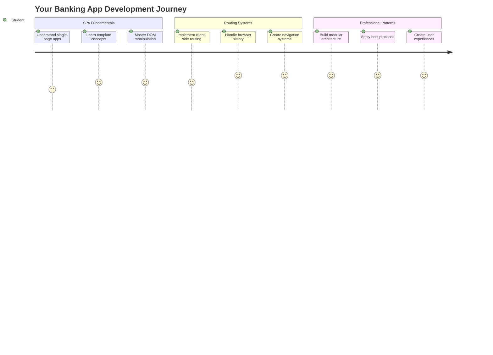
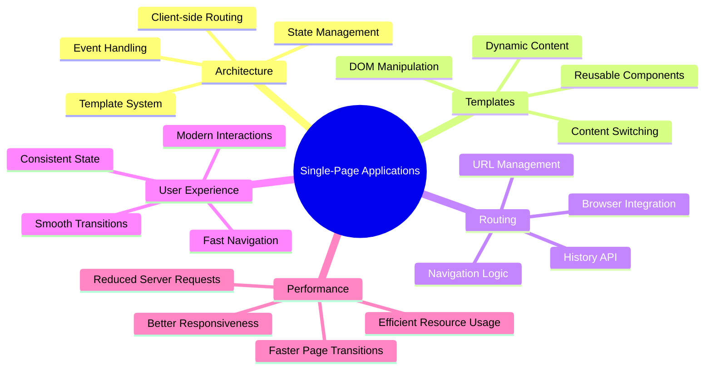
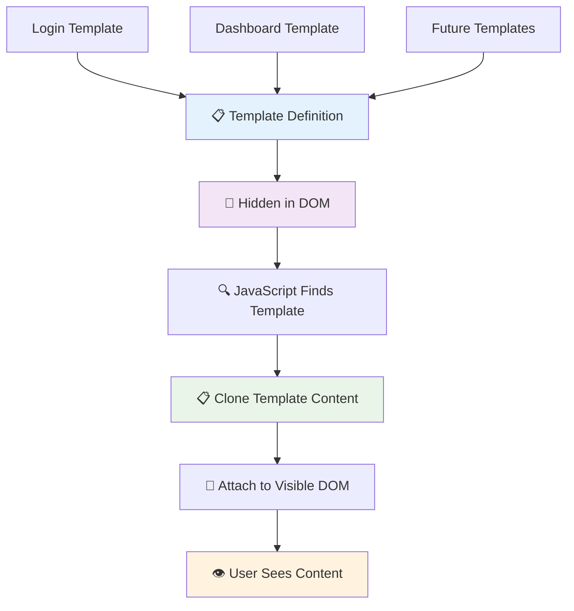
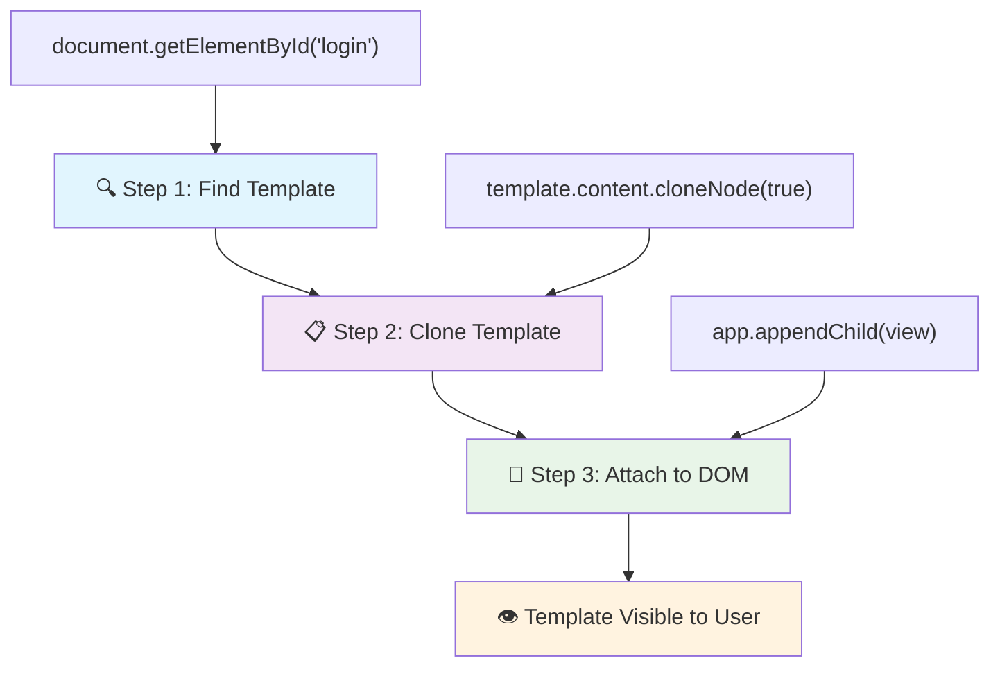
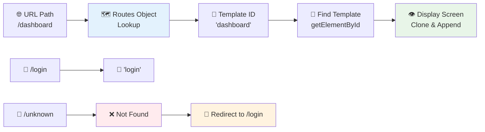
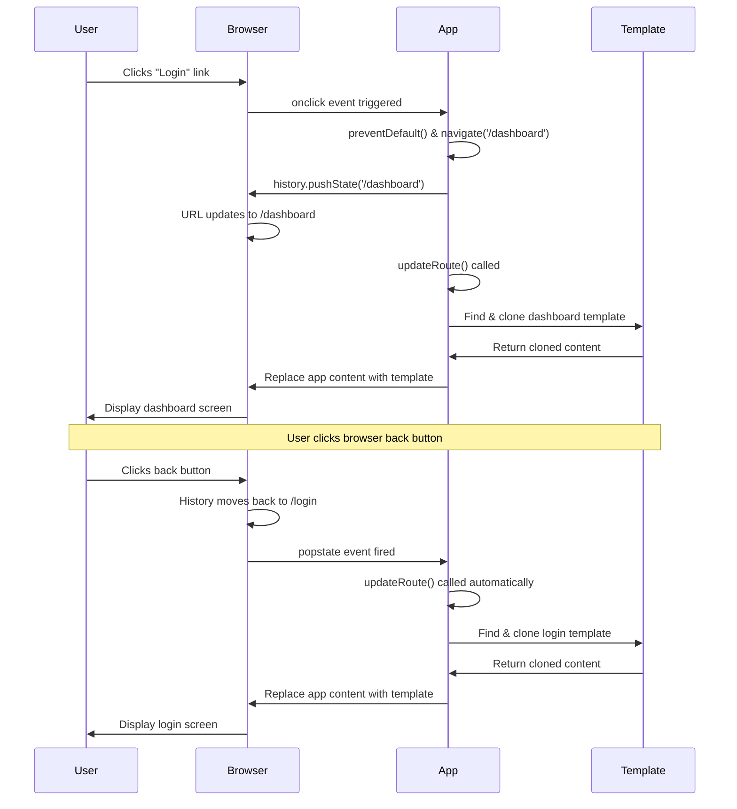
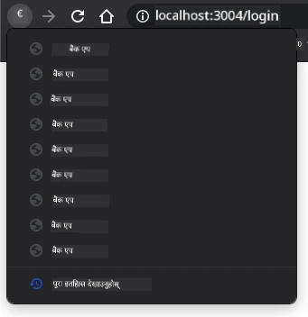
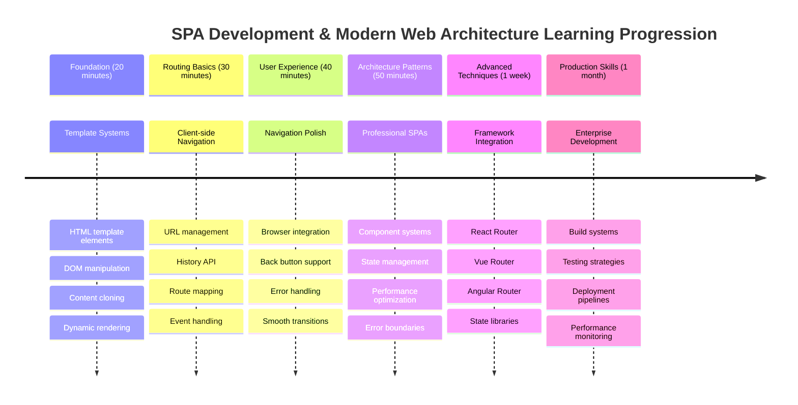

# बैंकिङ एप निर्माण भाग १: वेब एपमा HTML टेम्प्लेट र रुटहरू



जब अपोलो ११ को गाइडेन्स कम्प्युटरले १९६९ मा चन्द्रमामा नेभिगेट गर्‍यो, यसले सम्पूर्ण प्रणाली पुनः सुरु नगरी विभिन्न प्रोग्रामहरू बीच स्विच गर्नुपरेको थियो। आधुनिक वेब एपहरू पनि यस्तै काम गर्छन् – तिनीहरूले तपाईंले देख्नुभएको कुरा परिवर्तन गर्छन् तर सबै कुरा सुरुबाट पुनः लोड गर्दैनन्। यसले प्रयोगकर्ताहरूले आज अपेक्षा गर्ने सहज, प्रतिक्रियात्मक अनुभव सिर्जना गर्छ।

परम्परागत वेबसाइटहरूले प्रत्येक अन्तरक्रियाको लागि सम्पूर्ण पृष्ठ पुनः लोड गर्छन् भने, आधुनिक वेब एपहरूले केवल परिवर्तन गर्न आवश्यक भागहरू अपडेट गर्छन्। यो दृष्टिकोण, मिशन कन्ट्रोलले विभिन्न डिस्प्लेहरू बीच स्विच गर्दा निरन्तर सञ्चार कायम राख्ने तरिकाको जस्तै, हामीले अपेक्षा गरेको तरल अनुभव सिर्जना गर्छ।

यहाँ के कुराले फरकलाई नाटकीय बनाउँछ:

| परम्परागत मल्टि-पेज एपहरू | आधुनिक सिंगल-पेज एपहरू |
|----------------------------|-------------------------|
| **नेभिगेसन** | प्रत्येक स्क्रिनको लागि पूर्ण पृष्ठ पुनः लोड | सामग्री तुरुन्त स्विच |
| **प्रदर्शन** | सम्पूर्ण HTML डाउनलोडको कारण ढिलो | आंशिक अपडेटको साथ छिटो |
| **प्रयोगकर्ता अनुभव** | पृष्ठ फ्ल्यासहरू झट्का दिने | सहज, एप-जस्तो ट्रान्जिसनहरू |
| **डाटा साझेदारी** | पृष्ठहरू बीच कठिन | सजिलो स्टेट म्यानेजमेन्ट |
| **विकास** | धेरै HTML फाइलहरू मर्मत गर्नुपर्ने | एकल HTML र गतिशील टेम्प्लेटहरू |

**विकासको बुझाइ:**
- **परम्परागत एपहरू** प्रत्येक नेभिगेसन कार्यको लागि सर्भर अनुरोध आवश्यक छ
- **आधुनिक SPAs** एक पटक लोड हुन्छन् र सामग्रीलाई गतिशील रूपमा अपडेट गर्छन्
- **प्रयोगकर्ता अपेक्षाहरू** अब तुरुन्त, सहज अन्तरक्रियाहरूलाई प्राथमिकता दिन्छन्
- **प्रदर्शन लाभहरू** ब्यान्डविथ घटाउने र छिटो प्रतिक्रिया समावेश गर्दछ

यस पाठमा, हामी धेरै स्क्रिनहरू भएको बैंकिङ एप निर्माण गर्नेछौं जसले सहज रूपमा एकअर्कासँग प्रवाह गर्छ। वैज्ञानिकहरूले विभिन्न प्रयोगहरूको लागि पुनः कन्फिगर गर्न सकिने मोड्युलर उपकरणहरू प्रयोग गर्ने तरिकाको जस्तै, हामी HTML टेम्प्लेटहरूलाई पुनः प्रयोग गर्न सकिने कम्पोनेन्टको रूपमा प्रयोग गर्नेछौं।

तपाईं HTML टेम्प्लेटहरू (विभिन्न स्क्रिनहरूको लागि पुनः प्रयोग गर्न सकिने ब्लूप्रिन्टहरू), जाभास्क्रिप्ट रुटिङ (स्क्रिनहरू बीच स्विच गर्ने प्रणाली), र ब्राउजरको इतिहास API (जसले ब्याक बटनलाई अपेक्षित रूपमा काम गर्न सक्षम बनाउँछ) सँग काम गर्नुहुनेछ। यी फ्रेमवर्कहरू जस्तै React, Vue, र Angular द्वारा प्रयोग गरिने आधारभूत प्रविधिहरू हुन्।

पाठको अन्त्यमा, तपाईंसँग व्यावसायिक सिंगल-पेज एप्लिकेसन सिद्धान्तहरू प्रदर्शन गर्ने कार्यशील बैंकिङ एप हुनेछ।



## प्रि-लेक्चर क्विज

[प्रि-लेक्चर क्विज](https://ff-quizzes.netlify.app/web/quiz/41)

### तपाईंलाई के चाहिन्छ

हामीलाई हाम्रो बैंकिङ एप परीक्षण गर्न स्थानीय वेब सर्भर चाहिन्छ – चिन्ता नगर्नुहोस्, यो जति गाह्रो लाग्छ त्यति छैन! यदि तपाईंले पहिले नै सेट अप गर्नुभएको छैन भने, केवल [Node.js](https://nodejs.org) स्थापना गर्नुहोस् र आफ्नो प्रोजेक्ट फोल्डरबाट `npx lite-server` चलाउनुहोस्। यो उपयोगी कमाण्डले स्थानीय सर्भर सुरु गर्छ र तपाईंको एपलाई ब्राउजरमा स्वतः खोल्छ।

### तयारी

तपाईंको कम्प्युटरमा `bank` नामको फोल्डर बनाउनुहोस् र भित्र `index.html` नामको फाइल बनाउनुहोस्। हामी यो HTML [बोइलरप्लेट](https://en.wikipedia.org/wiki/Boilerplate_code) बाट सुरु गर्नेछौं:

```html
<!DOCTYPE html>
<html lang="en">
  <head>
    <meta charset="UTF-8">
    <meta name="viewport" content="width=device-width, initial-scale=1.0">
    <title>Bank App</title>
  </head>
  <body>
    <!-- This is where you'll work -->
  </body>
</html>
```

**यो बोइलरप्लेटले के प्रदान गर्छ:**
- **HTML5 दस्तावेज संरचना** उचित DOCTYPE घोषणासहित स्थापना गर्छ
- **क्यारेक्टर इन्कोडिङ** UTF-8 को रूपमा कन्फिगर गर्छ अन्तर्राष्ट्रिय पाठ समर्थनको लागि
- **उत्तरदायी डिजाइन सक्षम बनाउँछ** मोबाइल अनुकूलताको लागि भ्यूपोर्ट मेटा ट्यागको साथ
- **वर्णनात्मक शीर्षक सेट गर्छ** जुन ब्राउजर ट्याबमा देखिन्छ
- **सफा बडी सेक्सन सिर्जना गर्छ** जहाँ हामी हाम्रो एप निर्माण गर्नेछौं

> 📁 **प्रोजेक्ट संरचना पूर्वावलोकन**
> 
> **पाठको अन्त्यमा, तपाईंको प्रोजेक्टमा समावेश हुनेछ:**
> ```
> bank/
> ├── index.html      <!-- Main HTML with templates -->
> ├── app.js          <!-- Routing and navigation logic -->
> └── style.css       <!-- (Optional for future lessons) -->
> ```
> 
> **फाइल जिम्मेवारीहरू:**
> - **index.html**: सबै टेम्प्लेटहरू समावेश गर्दछ र एप संरचना प्रदान गर्दछ
> - **app.js**: रुटिङ, नेभिगेसन, र टेम्प्लेट व्यवस्थापन सम्हाल्छ
> - **टेम्प्लेटहरू**: लगइन, ड्यासबोर्ड, र अन्य स्क्रिनहरूको UI परिभाषित गर्दछ

---

## HTML टेम्प्लेटहरू

टेम्प्लेटहरूले वेब विकासमा मौलिक समस्या समाधान गर्छन्। जब गुटेनबर्गले १४४० को दशकमा चलायमान प्रकारको मुद्रण आविष्कार गरे, उनले सम्पूर्ण पृष्ठहरू कुँद्नको सट्टा पुनः प्रयोग गर्न सकिने अक्षर ब्लकहरू सिर्जना गर्न सकिने र आवश्यक अनुसार व्यवस्था गर्न सकिने महसुस गरे। HTML टेम्प्लेटहरू पनि त्यही सिद्धान्तमा काम गर्छन् – प्रत्येक स्क्रिनको लागि अलग HTML फाइलहरू सिर्जना गर्नको सट्टा, तपाईं पुनः प्रयोग गर्न सकिने संरचनाहरू परिभाषित गर्नुहुन्छ जुन आवश्यक पर्दा प्रदर्शन गर्न सकिन्छ।



टेम्प्लेटहरूलाई तपाईंको एपका विभिन्न भागहरूको ब्लूप्रिन्टको रूपमा सोच्नुहोस्। जस्तै एक आर्किटेक्टले एक ब्लूप्रिन्ट बनाउँछ र समान कोठाहरू पुनः रेखांकन नगरी धेरै पटक प्रयोग गर्छ, हामी एक पटक टेम्प्लेटहरू सिर्जना गर्छौं र आवश्यक पर्दा तिनीहरूलाई प्रयोग गर्छौं। ब्राउजरले यी टेम्प्लेटहरूलाई लुकाउँछ जबसम्म जाभास्क्रिप्टले तिनीहरूलाई सक्रिय गर्दैन।

यदि तपाईं वेब पृष्ठको लागि धेरै स्क्रिनहरू सिर्जना गर्न चाहनुहुन्छ भने, एउटा समाधान भनेको तपाईंले देखाउन चाहनुभएको प्रत्येक स्क्रिनको लागि एउटा HTML फाइल सिर्जना गर्नु हो। तर, यो समाधानले केही असुविधा ल्याउँछ:

- स्क्रिन स्विच गर्दा सम्पूर्ण HTML पुनः लोड गर्नुपर्छ, जसले ढिलो हुन सक्छ।
- विभिन्न स्क्रिनहरू बीच डाटा साझा गर्न गाह्रो हुन्छ।

अर्को दृष्टिकोण भनेको केवल एक HTML फाइल राख्नु हो, र `<template>` तत्व प्रयोग गरेर धेरै [HTML टेम्प्लेटहरू](https://developer.mozilla.org/docs/Web/HTML/Element/template) परिभाषित गर्नु हो। टेम्प्लेट एक पुनः प्रयोग गर्न सकिने HTML ब्लक हो जुन ब्राउजरले प्रदर्शन गर्दैन, र रनटाइममा जाभास्क्रिप्ट प्रयोग गरेर सक्रिय गर्नुपर्छ।

### यसलाई निर्माण गरौं

हामी दुई मुख्य स्क्रिनहरू भएको बैंक एप निर्माण गर्न जाँदैछौं: लगइन पृष्ठ र ड्यासबोर्ड। पहिलो, हामी हाम्रो HTML बडीमा एउटा प्लेसहोल्डर तत्व थप्नेछौं – यहीँ हाम्रो विभिन्न स्क्रिनहरू देखिनेछन्:

```html
<div id="app">Loading...</div>
```

**यस प्लेसहोल्डरलाई बुझ्दै:**
- **ID "app" भएको कन्टेनर सिर्जना गर्छ** जहाँ सबै स्क्रिनहरू प्रदर्शन गरिनेछन्
- **लोडिङ सन्देश देखाउँछ** जबसम्म जाभास्क्रिप्टले पहिलो स्क्रिन सुरु गर्दैन
- **हाम्रो गतिशील सामग्रीको लागि एकल माउन्टिङ पोइन्ट प्रदान गर्छ**
- **जाभास्क्रिप्टबाट सजिलो लक्ष्यीकरण सक्षम बनाउँछ** `document.getElementById()` प्रयोग गरेर

> 💡 **प्रो टिप**: किनकि यस तत्वको सामग्री प्रतिस्थापन गरिनेछ, हामी लोडिङ सन्देश वा सूचक राख्न सक्छौं जुन एप लोड हुँदा देखाइनेछ।

अब, हामी लगइन पृष्ठको लागि HTML टेम्प्लेट तल थप्नेछौं। अहिलेका लागि हामी त्यहाँ एउटा शीर्षक र एउटा सेक्सन राख्नेछौं जसमा नेभिगेसन गर्न प्रयोग गरिने लिंक हुनेछ।

```html
<template id="login">
  <h1>Bank App</h1>
  <section>
    <a href="/dashboard">Login</a>
  </section>
</template>
```

**यस लगइन टेम्प्लेटलाई तोड्दै:**
- **जाभास्क्रिप्ट लक्ष्यीकरणको लागि अद्वितीय पहिचानकर्ता "login" भएको टेम्प्लेट परिभाषित गर्छ**
- **एपको ब्रान्डिङ स्थापना गर्ने मुख्य शीर्षक समावेश गर्दछ**
- **सम्बन्धित सामग्री समूह गर्नको लागि सेम्यान्टिक `<section>` तत्व समावेश गर्दछ**
- **नेभिगेसन लिंक प्रदान गर्छ** जसले प्रयोगकर्ताहरूलाई ड्यासबोर्डमा रुट गर्नेछ

त्यसपछि हामी ड्यासबोर्ड पृष्ठको लागि अर्को HTML टेम्प्लेट थप्नेछौं। यो पृष्ठमा विभिन्न सेक्सनहरू समावेश हुनेछ:

- शीर्षक र लगआउट लिंक भएको हेडर
- बैंक खाताको वर्तमान ब्यालेन्स
- ट्रान्जेक्सनहरूको सूची, तालिकामा प्रदर्शन गरिएको

```html
<template id="dashboard">
  <header>
    <h1>Bank App</h1>
    <a href="/login">Logout</a>
  </header>
  <section>
    Balance: 100$
  </section>
  <section>
    <h2>Transactions</h2>
    <table>
      <thead>
        <tr>
          <th>Date</th>
          <th>Object</th>
          <th>Amount</th>
        </tr>
      </thead>
      <tbody></tbody>
    </table>
  </section>
</template>
```

**ड्यासबोर्डको प्रत्येक भागलाई बुझ्दै:**
- **सेम्यान्टिक `<header>` तत्व प्रयोग गरेर पृष्ठ संरचना बनाउँछ** जसमा नेभिगेसन समावेश छ
- **स्क्रिनहरूमा एप शीर्षक निरन्तर प्रदर्शन गर्छ** ब्रान्डिङको लागि
- **लगआउट लिंक प्रदान गर्छ** जसले लगइन स्क्रिनमा रुट गर्छ
- **खाताको वर्तमान ब्यालेन्स समर्पित सेक्सनमा देखाउँछ**
- **ट्रान्जेक्सन डाटा व्यवस्थित गर्छ** राम्रोसँग संरचित HTML तालिका प्रयोग गरेर
- **तालिका हेडर परिभाषित गर्छ** मिति, वस्तु, र रकम स्तम्भहरूको लागि
- **तालिका बडी खाली छोड्छ** पछि गतिशील सामग्री इन्जेक्सनको लागि

> 💡 **प्रो टिप**: HTML टेम्प्लेटहरू सिर्जना गर्दा, यदि तपाईंले यसको कस्तो देखिन्छ हेर्न चाहनुहुन्छ भने, `<template>` र `</template>` लाइनहरूलाई `<!-- -->` ले घेरिएर कमेन्ट गर्न सक्नुहुन्छ।

### 🔄 **शैक्षिक जाँच**
**टेम्प्लेट प्रणाली बुझाइ**: जाभास्क्रिप्ट कार्यान्वयन गर्नु अघि सुनिश्चित गर्नुहोस्:
- ✅ टेम्प्लेटहरू सामान्य HTML तत्वहरूबाट कसरी फरक छन्
- ✅ किन टेम्प्लेटहरू जाभास्क्रिप्टले सक्रिय नगरेसम्म लुकेका रहन्छन्
- ✅ टेम्प्लेटहरूमा सेम्यान्टिक HTML संरचनाको महत्त्व
- ✅ टेम्प्लेटहरूले पुनः प्रयोग गर्न सकिने UI कम्पोनेन्टहरू कसरी सक्षम बनाउँछन्

**छिटो आत्म-परीक्षण**: यदि तपाईंले आफ्नो HTML वरिपरि `<template>` ट्यागहरू हटाउनुभयो भने के हुन्छ?
*उत्तर: सामग्री तुरुन्तै देखिने हुन्छ र यसको टेम्प्लेट कार्यक्षमता गुमाउँछ*

**आर्किटेक्चर लाभहरू**: टेम्प्लेटहरूले प्रदान गर्छ:
- **पुनः प्रयोगयोग्यता**: एक परिभाषा, धेरै उदाहरणहरू
- **प्रदर्शन**: कुनै पनि अनावश्यक HTML पार्सिङ छैन
- **मर्मतयोग्यता**: केन्द्रीय UI संरचना
- **लचिलोपन**: गतिशील सामग्री स्विचिङ

✅ तपाईंको विचारमा किन हामीले टेम्प्लेटहरूमा `id` एट्रिब्युटहरू प्रयोग गर्छौं? के हामीले क्लासहरू जस्ता अरू केही प्रयोग गर्न सक्थ्यौं?

## जाभास्क्रिप्टको साथ टेम्प्लेटहरूलाई जीवन्त बनाउँदै

अब हामीले हाम्रो टेम्प्लेटहरूलाई कार्यात्मक बनाउन आवश्यक छ। जस्तै 3D प्रिन्टरले डिजिटल ब्लूप्रिन्टलाई भौतिक वस्तुमा परिणत गर्छ, जाभास्क्रिप्टले हाम्रो लुकेका टेम्प्लेटहरूलाई देखिने, अन्तरक्रियात्मक तत्वहरूमा परिणत गर्छ जुन प्रयोगकर्ताहरूले देख्न र प्रयोग गर्न सक्छन्।

यो प्रक्रिया आधुनिक वेब विकासको आधार बनाउने तीन स्थिर चरणहरू अनुसरण गर्दछ। एक पटक तपाईंले यो ढाँचा बुझ्नुभयो भने, तपाईंले यसलाई धेरै फ्रेमवर्क र लाइब्रेरीहरूमा चिन्नेछ।

यदि तपाईंले आफ्नो हालको HTML फाइल ब्राउजरमा प्रयास गर्नुभयो भने, तपाईंले देख्नुहुनेछ कि यो `Loading...` देखाउँदै अड्किएको छ। त्यसको कारण हामीले HTML टेम्प्लेटहरूलाई सक्रिय गर्न र प्रदर्शन गर्न केही जाभास्क्रिप्ट कोड थप्न आवश्यक छ।

टेम्प्लेटलाई सक्रिय गर्नु सामान्यतया ३ चरणमा गरिन्छ:

1. DOM मा टेम्प्लेट तत्व पुनः प्राप्त गर्नुहोस्, उदाहरणका लागि [`document.getElementById`](https://developer.mozilla.org/docs/Web/API/Document/getElementById) प्रयोग गरेर।
2. टेम्प्लेट तत्वलाई क्लोन गर्नुहोस्, [`cloneNode`](https://developer.mozilla.org/docs/Web/API/Node/cloneNode) प्रयोग गरेर।
3. यसलाई देखिने तत्व अन्तर्गत DOM मा संलग्न गर्नुहोस्, उदाहरणका लागि [`appendChild`](https://developer.mozilla.org/docs/Web/API/Node/appendChild) प्रयोग गरेर।



**प्रक्रियाको दृश्यात्मक विश्लेषण:**
- **चरण १** ले DOM संरचनामा लुकेको टेम्प्लेट पत्ता लगाउँछ
- **चरण २** ले सुरक्षित रूपमा परिमार्जन गर्न सकिने कार्यशील प्रतिलिपि सिर्जना गर्छ
- **चरण ३** ले प्रतिलिपिलाई देखिने पृष्ठ क्षेत्रमा सम्मिलित गर्छ
- **परिणाम** एक कार्यात्मक स्क्रिन हो जससँग प्रयोगकर्ताहरू अन्तरक्रिया गर्न सक्छन्

✅ किन हामीले टेम्प्लेटलाई DOM मा संलग्न गर्नु अघि क्लोन गर्न आवश्यक छ? तपाईंको विचारमा यदि हामीले यो चरण छोड्यौं भने के हुन्छ?

### कार्य

तपाईंको प्रोजेक्ट फोल्डरमा `app.js` नामको नयाँ फाइल सिर्जना गर्नुहोस् र HTML को `<head>` सेक्सनमा उक्त फाइललाई आयात गर्नुहोस्:

```html
<script src="app.js" defer></script>
```

**यस स्क्रिप्ट आयातलाई बुझ्दै:**
- **जाभास्क्रिप्ट फाइललाई हाम्रो HTML दस्तावेजसँग लिंक गर्छ**
- **`defer` एट्रिब्युट प्रयोग गर्छ** स्क्रिप्ट HTML पार्सिङ पूरा भएपछि चल्न सुनिश्चित गर्न
- **सबै DOM तत्वहरूमा पहुँच सक्षम बनाउँछ** किनकि तिनीहरू स्क्रिप्ट कार्यान्वयन अघि पूर्ण रूपमा लोड हुन्छन्
- **स्क्रिप्ट लोडिङ र प्रदर्शनको लागि आधुनिक उत्तम अभ्यासहरू अनुसरण गर्छ**

अब `app.js` मा, हामी नयाँ फंक्शन `updateRoute` सिर्जना गर्नेछौं:

```js
function updateRoute(templateId) {
  const template = document.getElementById(templateId);
  const view = template.content.cloneNode(true);
  const app = document.getElementById('app');
  app.innerHTML = '';
  app.appendChild(view);
}
```

**चरणबद्ध रूपमा, यहाँ के भइरहेको छ:**
- **टेम्प्लेट तत्वलाई यसको अद्वितीय ID प्रयोग गरेर पत्ता लगाउँछ**
- **`cloneNode(true)` प्रयोग गरेर टेम्प्लेटको सामग्रीको गहिरो प्रतिलिपि सिर्जना गर्छ**
- **कन्टेनर पत्ता लगाउँछ जहाँ सामग्री प्रदर्शन गरिनेछ**
- **कन्टेनरबाट कुनै पनि अवस्थित सामग्री हटाउँछ**
- **क्लोन गरिएको टेम्प्लेट सामग्रीलाई देखिने DOM मा सम्मिलित गर्छ**

अब यस फंक्शनलाई टेम्प्लेटहरूमध्ये एकसँग कल गर्नुहोस् र परिणाम हेर्नुहोस्।

```js
updateRoute('login');
```

**यस फंक्शन कलले के पूरा गर्छ:**
- **लगइन टेम्प्लेटलाई सक्रिय गर्छ** यसको ID लाई प्यारामिटरको रूपमा पास गरेर
- **विभिन्न एप स्क्रिनहरू बीच प्रोग्रामेटिक रूपमा स्विच गर्ने तरिका प्रदर्शन गर्छ**
- **"Loading..." सन्देशको सट्टा लगइन स्क्रिन देखाउँछ**

✅ यस कोडको उद्देश्य के हो `app.innerHTML = '';`? यसको बिना के हुन्छ?

## रुटहरू सिर्जना गर्दै

रुटिङ भनेको URL हरूलाई सही सामग्रीसँग जोड्ने कुरा हो। जस्तै प्रारम्भिक टेलिफोन अपरेटरहरूले स्विचबोर्ड प्रयोग गरेर कलहरू जोड्थे – तिनीहरूले आउने अनुरोध लिँदै सही गन्तव्यमा रुट गर्थे। वेब रुटिङ पनि यस्तै काम गर्छ, URL अनुरोध लिँदै कुन सामग्री प्रदर्शन गर्ने निर्धारण गर्छ।



परम्परागत रूपमा, वेब सर्भरहरूले विभिन्न URL हरूको लागि विभिन्न HTML फाइलहरू सेवा गरेर यो सम्हाल्थे। किनकि हामी सिंगल-पेज एप निर्माण गर्दैछौं, हामीले यो रुटिङ आफैं जाभास्क्रिप्टको साथ सम्हाल्न आवश्यक छ। यस दृष्टिकोणले हामीलाई प्रयोगकर्ता अनुभव र प्रदर्शनमा बढी नियन्त्रण दिन्छ।


**रुटिङ प्रवाहलाई बुझ्दै:**
- **URL परिवर्तनहरू** हाम्रो रुट्स कन्फिगरेसनमा लुकअप ट्रिगर गर्छ
अब हामी `updateRoute` फङ्क्शनलाई अलि परिमार्जन गर्नेछौं। `templateId` लाई सिधै आर्गुमेन्टको रूपमा पास गर्ने सट्टा, हामी पहिले हालको URL हेरेर त्यसबाट `templateId` प्राप्त गर्नेछौं। त्यसपछि हाम्रो म्याप प्रयोग गरेर सम्बन्धित `templateId` मान प्राप्त गर्नेछौं। [`window.location.pathname`](https://developer.mozilla.org/docs/Web/API/Location/pathname) प्रयोग गरेर URL बाट केवल पाथ सेग्मेन्ट प्राप्त गर्न सकिन्छ।

```js
function updateRoute() {
  const path = window.location.pathname;
  const route = routes[path];

  const template = document.getElementById(route.templateId);
  const view = template.content.cloneNode(true);
  const app = document.getElementById('app');
  app.innerHTML = '';
  app.appendChild(view);
}
```

**यहाँ के हुन्छ भन्ने कुरा टुक्रा-टुक्रामा बुझौं:**
- **Extracts** ब्राउजरको URL बाट हालको पाथ `window.location.pathname` प्रयोग गरेर निकाल्छ।
- **Looks up** हाम्रो routes object मा सम्बन्धित route configuration खोज्छ।
- **Retrieves** route configuration बाट `templateId` प्राप्त गर्छ।
- **Follows** पहिलाको जस्तै template rendering प्रक्रिया अनुसरण गर्छ।
- **Creates** URL परिवर्तनमा प्रतिक्रिया दिने गतिशील प्रणाली बनाउँछ।

यहाँ हामीले घोषणा गरेका routes लाई सम्बन्धित template सँग म्याप गरेका छौं। तपाईं ब्राउजरमा URL म्यानुअली परिवर्तन गरेर यो सही काम गर्छ कि भनेर प्रयास गर्न सक्नुहुन्छ।

✅ यदि तपाईं URL मा कुनै अज्ञात पाथ प्रविष्ट गर्नुहुन्छ भने के हुन्छ? हामी यसलाई कसरी समाधान गर्न सक्छौं?

## नेभिगेसन थप्दै

Routing स्थापित भएपछि, प्रयोगकर्ताहरूलाई एपमा नेभिगेट गर्ने तरिका चाहिन्छ। परम्परागत वेबसाइटहरूमा लिंक क्लिक गर्दा पूरा पृष्ठ पुनः लोड हुन्छ, तर हामी URL र सामग्री दुवैलाई पृष्ठ रिफ्रेस नगरी अपडेट गर्न चाहन्छौं। यसले डेस्कटप एप्सले विभिन्न दृश्यहरू बीच स्विच गर्ने जस्तै सहज अनुभव सिर्जना गर्छ।

हामीले दुई कुराहरू समन्वय गर्नुपर्छ: ब्राउजरको URL अपडेट गर्ने ताकि प्रयोगकर्ताहरू पृष्ठहरू बुकमार्क गर्न र लिंकहरू साझा गर्न सकून्, र उपयुक्त सामग्री प्रदर्शन गर्ने। सही रूपमा कार्यान्वयन गर्दा, यसले आधुनिक एप्सबाट प्रयोगकर्ताहरूले अपेक्षा गर्ने सहज नेभिगेसन सिर्जना गर्छ।



### 🔄 **शिक्षण जाँच**
**Single-Page Application Architecture**: सम्पूर्ण प्रणालीको तपाईंको बुझाइ प्रमाणित गर्नुहोस्:
- ✅ Client-side routing परम्परागत server-side routing भन्दा कसरी फरक छ?
- ✅ SPA नेभिगेसनको लागि History API किन आवश्यक छ?
- ✅ Templates पृष्ठ रिफ्रेस नगरी गतिशील सामग्री कसरी सक्षम बनाउँछ?
- ✅ नेभिगेसनलाई रोक्न event handling को भूमिका के हो?

**System Integration**: तपाईंको SPA ले प्रदर्शन गर्छ:
- **Template Management**: गतिशील सामग्रीसहित पुन: प्रयोग गर्न मिल्ने UI components
- **Client-side Routing**: Server requests बिना URL व्यवस्थापन
- **Event-driven Architecture**: नेभिगेसन र प्रयोगकर्ता अन्तरक्रियाको लागि उत्तरदायी
- **Browser Integration**: History र back/forward बटनको सही समर्थन
- **Performance Optimization**: छिटो ट्रान्जिसन र कम server लोड

**Professional Patterns**: तपाईंले कार्यान्वयन गर्नुभएको छ:
- **Model-View Separation**: Templates एप्लिकेसन तर्कबाट अलग
- **State Management**: URL state प्रदर्शन गरिएको सामग्रीसँग समक्रमित
- **Progressive Enhancement**: JavaScript ले आधारभूत HTML कार्यक्षमता सुधार गर्छ
- **User Experience**: पृष्ठ रिफ्रेस नगरी सहज, एप-जस्तो नेभिगेसन

> � **Architecture Insight**: नेभिगेसन प्रणालीका घटकहरू
>
> **तपाईंले निर्माण गरिरहनुभएको:**
> - **🔄 URL Management**: पृष्ठ रिफ्रेस नगरी ब्राउजरको एड्रेस बार अपडेट गर्छ
> - **📋 Template System**: हालको route अनुसार गतिशील रूपमा सामग्री परिवर्तन गर्छ  
> - **📚 History Integration**: ब्राउजरको back/forward बटन कार्यक्षमता कायम राख्छ
> - **🛡️ Error Handling**: अमान्य वा हराएको routes का लागि graceful fallbacks

> **घटकहरू कसरी सँगै काम गर्छन्:**
> - **Listens** नेभिगेसन events (क्लिक्स, history परिवर्तन) को लागि
> - **Updates** URL History API प्रयोग गरेर
> - **Renders** नयाँ route को लागि उपयुक्त template
> - **Maintains** सम्पूर्ण प्रयोगकर्ता अनुभवलाई सहज बनाउँछ

हाम्रो एपको अर्को चरण भनेको URL म्यानुअली परिवर्तन नगरी पृष्ठहरू बीच नेभिगेट गर्ने सम्भावना थप्नु हो। यसले दुई कुराहरू समावेश गर्छ:

  1. हालको URL अपडेट गर्ने
  2. नयाँ URL को आधारमा प्रदर्शन गरिएको template अपडेट गर्ने

हामीले `updateRoute` फङ्क्शनको साथ दोस्रो भागको ख्याल राखिसकेका छौं, त्यसैले हामीले हालको URL कसरी अपडेट गर्ने भन्ने कुरा बुझ्नुपर्छ।

हामीले JavaScript र विशेष गरी [`history.pushState`](https://developer.mozilla.org/docs/Web/API/History/pushState) प्रयोग गर्नुपर्नेछ, जसले HTML पुनः लोड नगरी URL अपडेट गर्न र ब्राउजिङ इतिहासमा नयाँ प्रविष्टि सिर्जना गर्न अनुमति दिन्छ।

> ⚠️ **महत्वपूर्ण नोट**: HTML anchor element [`<a href>`](https://developer.mozilla.org/docs/Web/HTML/Element/a) लाई स्वतन्त्र रूपमा विभिन्न URL हरूमा हाइपरलिङ्कहरू सिर्जना गर्न प्रयोग गर्न सकिन्छ, तर यसले ब्राउजरलाई डिफल्ट रूपमा HTML पुनः लोड गर्न बाध्य बनाउँछ। कस्टम JavaScript प्रयोग गरेर routing ह्यान्डल गर्दा यो व्यवहार रोक्न आवश्यक छ, क्लिक इभेन्टमा `preventDefault()` फङ्क्शन प्रयोग गरेर।

### कार्य

हामी हाम्रो एपमा नेभिगेट गर्न प्रयोग गर्न सकिने नयाँ फङ्क्शन सिर्जना गर्नेछौं:

```js
function navigate(path) {
  window.history.pushState({}, path, path);
  updateRoute();
}
```

**यस नेभिगेसन फङ्क्शनलाई बुझ्दै:**
- **Updates** `history.pushState` प्रयोग गरेर ब्राउजरको URL नयाँ पाथमा अपडेट गर्छ
- **Adds** ब्राउजरको history stack मा नयाँ प्रविष्टि थप्छ ताकि back/forward बटन सही रूपमा काम गरोस्
- **Triggers** `updateRoute()` फङ्क्शनलाई सम्बन्धित template प्रदर्शन गर्न
- **Maintains** पृष्ठ रिफ्रेस नगरी single-page app अनुभव

यस विधिले पहिले दिइएको पाथको आधारमा हालको URL अपडेट गर्छ, त्यसपछि template अपडेट गर्छ। `window.location.origin` प्रोपर्टीले URL root फर्काउँछ, जसले दिइएको पाथबाट पूर्ण URL पुनर्निर्माण गर्न अनुमति दिन्छ।

अब हामीसँग यो फङ्क्शन छ, यदि कुनै पाथले कुनै परिभाषित route सँग मेल खाँदैन भने हामीसँग भएको समस्या समाधान गर्न सक्छौं। हामी `updateRoute` फङ्क्शनलाई परिमार्जन गर्नेछौं र कुनै मेल नभेटिएमा एउटा विद्यमान route मा fallback थप्नेछौं।

```js
function updateRoute() {
  const path = window.location.pathname;
  const route = routes[path];

  if (!route) {
    return navigate('/login');
  }

  const template = document.getElementById(route.templateId);
  const view = template.content.cloneNode(true);
  const app = document.getElementById('app');
  app.innerHTML = '';
  app.appendChild(view);
}
```

**स्मरण गर्नुपर्ने मुख्य बुँदाहरू:**
- **Checks** हालको पाथको लागि route अवस्थित छ कि छैन
- **Redirects** अमान्य route पहुँच गर्दा login पृष्ठमा
- **Provides** एक fallback मेकानिजम जसले बिग्रिएको नेभिगेसन रोक्छ
- **Ensures** प्रयोगकर्ताहरूले सधैं सही स्क्रिन देख्छन्, गलत URL हरूसँग पनि

यदि route भेटिएन भने, हामी अब `login` पृष्ठमा रिडाइरेक्ट गर्नेछौं।

अब हामी लिंक क्लिक गर्दा URL प्राप्त गर्ने र ब्राउजरको डिफल्ट लिंक व्यवहार रोक्ने फङ्क्शन सिर्जना गर्नेछौं:

```js
function onLinkClick(event) {
  event.preventDefault();
  navigate(event.target.href);
}
```

**यस क्लिक ह्यान्डलरलाई टुक्रा-टुक्रामा बुझ्दै:**
- **Prevents** ब्राउजरको डिफल्ट लिंक व्यवहार `preventDefault()` प्रयोग गरेर रोक्छ
- **Extracts** क्लिक गरिएको लिंक एलिमेन्टबाट गन्तव्य URL निकाल्छ
- **Calls** हाम्रो कस्टम नेभिगेट फङ्क्शन पृष्ठ पुनः लोड नगरी
- **Maintains** सहज single-page application अनुभव

```html
<a href="/dashboard" onclick="onLinkClick(event)">Login</a>
...
<a href="/login" onclick="onLinkClick(event)">Logout</a>
```

**यस onclick बाइन्डिङले के हासिल गर्छ:**
- **Connects** प्रत्येक लिंकलाई हाम्रो कस्टम नेभिगेसन प्रणालीसँग
- **Passes** क्लिक इभेन्टलाई हाम्रो `onLinkClick` फङ्क्शनमा प्रोसेसिङको लागि
- **Enables** पृष्ठ रिफ्रेस नगरी सहज नेभिगेसन
- **Maintains** सही URL संरचना जसलाई प्रयोगकर्ताहरूले बुकमार्क गर्न वा साझा गर्न सक्छन्

[`onclick`](https://developer.mozilla.org/docs/Web/API/GlobalEventHandlers/onclick) attribute ले `click` इभेन्टलाई JavaScript कोडसँग बाइन्ड गर्छ, यहाँ `navigate()` फङ्क्शनको कल।

यी लिंकहरू क्लिक गरेर प्रयास गर्नुहोस्, तपाईं अब आफ्नो एपका विभिन्न स्क्रिनहरू बीच नेभिगेट गर्न सक्षम हुनुहुन्छ।

✅ `history.pushState` विधि HTML5 मानकको हिस्सा हो र [सबै आधुनिक ब्राउजरहरूमा](https://caniuse.com/?search=pushState) कार्यान्वयन गरिएको छ। यदि तपाईं पुराना ब्राउजरहरूको लागि वेब एप निर्माण गर्दै हुनुहुन्छ भने, तपाईं यस API को सट्टा एउटा ट्रिक प्रयोग गर्न सक्नुहुन्छ: पाथ अघि [hash (`#`)](https://en.wikipedia.org/wiki/URI_fragment) प्रयोग गरेर तपाईं नियमित anchor नेभिगेसनसँग काम गर्ने routing कार्यान्वयन गर्न सक्नुहुन्छ जसले पृष्ठ पुनः लोड गर्दैन।

## Back र Forward बटनहरू काम गर्ने बनाउँदै

Back र forward बटनहरू वेब ब्राउजिङको लागि आधारभूत हुन्, NASA मिशन कन्ट्रोलरहरूले स्पेस मिशनको दौरान अघिल्लो प्रणाली अवस्थाहरू समीक्षा गर्न सक्ने जस्तै। प्रयोगकर्ताहरूले यी बटनहरू काम गर्ने अपेक्षा गर्छन्, र जब तिनीहरू काम गर्दैनन्, यो अपेक्षित ब्राउजिङ अनुभवलाई तोड्छ।

हाम्रो single-page app लाई यसलाई समर्थन गर्न थप कन्फिगरेसन आवश्यक छ। ब्राउजरले history stack कायम राख्छ (जसलाई हामीले `history.pushState` प्रयोग गरेर थप्दै आएका छौं), तर जब प्रयोगकर्ताहरू यस history मार्फत नेभिगेट गर्छन्, हाम्रो एपले प्रतिक्रिया दिनु पर्छ र त्यस अनुसार प्रदर्शन गरिएको सामग्री अपडेट गर्नुपर्छ।


**मुख्य अन्तरक्रिया बिन्दुहरू:**
- **User actions** क्लिकहरू वा ब्राउजर बटनहरू मार्फत नेभिगेसन ट्रिगर गर्छ
- **App intercepts** लिंक क्लिकहरू पृष्ठ रिफ्रेस रोक्न
- **History API** URL परिवर्तन र ब्राउजर history stack व्यवस्थापन गर्छ
- **Templates** प्रत्येक स्क्रिनको लागि सामग्री संरचना प्रदान गर्छ
- **Event listeners** सुनिश्चित गर्छ कि एपले सबै प्रकारका नेभिगेसनमा प्रतिक्रिया दिन्छ

`history.pushState` प्रयोग गरेर ब्राउजरको नेभिगेसन history मा नयाँ प्रविष्टिहरू सिर्जना हुन्छ। तपाईंले आफ्नो ब्राउजरको *back button* थिचेर जाँच गर्न सक्नुहुन्छ, यसले केही यस्तो देखाउनु पर्छ:



यदि तपाईं back बटन केही पटक क्लिक गर्नुहुन्छ भने, तपाईं देख्नुहुनेछ कि हालको URL परिवर्तन हुन्छ र history अपडेट हुन्छ, तर उही template प्रदर्शन भइरहन्छ।

त्यसको कारण एपले थाहा पाउँदैन कि हामीले `updateRoute()` प्रत्येक पटक history परिवर्तन हुँदा कल गर्नुपर्छ। यदि तपाईं [`history.pushState` को डकुमेन्टेशन](https://developer.mozilla.org/docs/Web/API/History/pushState) हेर्नुहुन्छ भने, तपाईं देख्नुहुनेछ कि यदि state परिवर्तन भयो भने - जसको अर्थ हामी फरक URL मा सरेका छौं - [`popstate`](https://developer.mozilla.org/docs/Web/API/Window/popstate_event) इभेन्ट ट्रिगर हुन्छ। हामी यसलाई प्रयोग गरेर उक्त समस्या समाधान गर्नेछौं।

### कार्य

ब्राउजर history परिवर्तन हुँदा प्रदर्शन गरिएको template अपडेट सुनिश्चित गर्न, हामी `updateRoute()` कल गर्ने नयाँ फङ्क्शन संलग्न गर्नेछौं। हामी यो हाम्रो `app.js` फाइलको तल गर्नेछौं:

```js
window.onpopstate = () => updateRoute();
updateRoute();
```

**यस history एकीकरणलाई बुझ्दै:**
- **Listens** `popstate` इभेन्टहरूको लागि जुन प्रयोगकर्ताहरूले ब्राउजर बटनहरू प्रयोग गरेर नेभिगेट गर्दा हुन्छ
- **Uses** concise इभेन्ट ह्यान्डलर सिंट्याक्सको लागि arrow function
- **Calls** `updateRoute()` स्वतः जब history state परिवर्तन हुन्छ
- **Initializes** एपलाई `updateRoute()` कल गरेर जब पृष्ठ पहिलो पटक लोड हुन्छ
- **Ensures** प्रयोगकर्ताहरूले कसरी नेभिगेट गरे पनि सही template प्रदर्शन हुन्छ

> 💡 **Pro Tip**: हामीले यहाँ [arrow function](https://developer.mozilla.org/docs/Web/JavaScript/Reference/Functions/Arrow_functions) प्रयोग गरेर हाम्रो `popstate` इभेन्ट ह्यान्डलर घोषणा गरेका छौं, तर नियमित फङ्क्शनले पनि उस्तै काम गर्नेछ।

arrow functions मा एक रिफ्रेसर भिडियो यहाँ छ:

[](https://youtube.com/watch?v=OP6eEbOj2sc "Arrow Functions")

> 🎥 माथिको छवि क्लिक गरेर arrow functions को बारेमा भिडियो हेर्नुहोस्।

अब आफ्नो ब्राउजरको back र forward बटनहरू प्रयोग गरेर प्रयास गर्नुहोस्, र जाँच गर्नुहोस् कि यस पटक प्रदर्शन गरिएको route सही रूपमा अपडेट हुन्छ।

### ⚡ **अर्को ५ मिनेटमा तपाईं के गर्न सक्नुहुन्छ**
- [ ] आफ्नो बैंकिङ एपको नेभिगेसन ब्राउजर back/forward बटनहरू प्रयोग गरेर परीक्षण गर्नुहोस्
- [ ] Address bar मा विभिन्न URL हरू म्यानुअली टाइप गरेर routing परीक्षण गर्नुहोस्
- [ ] ब्राउजर DevTools खोल्नुहोस् र templates DOM मा कसरी clone गरिन्छ हेर्नुहोस्
- [ ] Routing flow ट्र्याक गर्न console.log statements थपेर प्रयोग गर्नुहोस्

### 🎯 **यो घण्टामा तपाईं के हासिल गर्न सक्नुहुन्छ**
- [ ] Post-lesson quiz पूरा गर्नुहोस् र SPA architecture concepts बुझ्नुहोस्
- [ ] CSS styling थपेर आफ्नो बैंकिङ एप templates लाई व्यावसायिक देखिने बनाउनुहोस्
- [ ] 404 error page challenge सही error handling सहित कार्यान्वयन गर्नुहोस्
- [ ] Credits page challenge थप routing कार्यक्षमता सहित सिर्जना गर्नुहोस्
- [ ] Template switch बीच loading states र transitions थप्नुहोस्

### 📅 **तपाईंको हप्ताभरि SPA विकास यात्रा**
- [ ] Forms, data management, र persistence सहित पूर्ण बैंकिङ एप पूरा गर्नुहोस्
- [ ] Route parameters र nested routes जस्ता उन्नत routing सुविधाहरू थप्नुहोस्
- [ ] Navigation guards र authentication-based routing कार्यान्वयन गर्नुहोस्
- [ ] पुन: प्रयोग गर्न मिल्ने template components र component library सिर्जना गर्नुहोस्
- [ ] Smooth user experience को लागि animations र transitions थप्नुहोस्
- [ ] आफ्नो SPA hosting platform मा deploy गर्नुहोस् र routing सही रूपमा कन्फिगर गर्नुहोस्

### 🌟 **तपाईंको महिनाभरि Frontend Architecture Mastery**
- [ ] React, Vue, वा Angular जस्ता आधुनिक frameworks प्रयोग गरेर जटिल SPAs निर्माण गर्नुहोस्
- [ ] उन्नत state management patterns र libraries सिक्नुहोस्
- [ ] SPA विकासका लागि build tools र development workflows मा महारत हासिल गर्नुहोस्
- [ ] Progressive Web App सुविधाहरू र offline functionality कार्यान्वयन गर्नुहोस्
- [ ] ठूलो-scale SPAs को लागि performance optimization techniques अध्ययन गर्नुहोस्
- [ ] Open source SPA projects मा योगदान गर्नुहोस् र आफ्नो ज्ञान साझा गर्नुहोस्

## 🎯 तपाईंको Single-Page Application Mastery Timeline



### 🛠️ तपाईंको SPA विकास उपकरणको सारांश

यो पाठ पूरा गरेपछि, तपाईंले अब निम्न कुराहरूमा महारत हासिल गर्नुभएको छ:
- **Template Architecture**: गतिशील सामग्री rendering सहित पुन: प्रयोग गर्न मिल्ने HTML components
- **Client-side Routing**: URL व्यवस्थापन र पृष्ठ रिफ्रेस बिना नेभिगेसन
- **Browser Integration**: History API प्रयोग र back/forward बटन समर्थन
- **Event-driven Systems**: नेभिगेसन ह्यान्डलिंग र प्रयोगकर्ता अन्तरक्रिया व्यवस्थापन
- **DOM Manipulation**: Template cloning, सामग्री switch, र element व्यवस्थापन
- **Error Handling**: अमान्य routes र हराएको सामग्रीका लागि graceful fallbacks
- **Performance Patterns**: प्रभावकारी सामग्री लोडिंग र rendering रणनीतिहरू

**वास्तविक-विश्व अनुप्रयोगहरू**: तपाईंको SPA विकास कौशल सीधा लागू हुन्छ:
- **Modern Web Applications**: React, Vue, Angular, र अन्य framework विकास
- **Progressive Web Apps**: Offline-capable एप्स app-like अनुभवसहित
- **Enterprise Dashboards**: जटिल व्यवसाय एप्स धेरै दृश्यहरूसहित
- **E-commerce Platforms**: Product catalogs, shopping carts, र checkout flows
- **Content Management**: गतिशील सामग्री सिर्जना र सम्पादन interfaces
- **Mobile Development**: वेब प्रविधिहरू प्रयोग गरेर hybrid apps

**व्यावसायिक कौशल प्राप्त**: तपाईं अब सक्षम हुनुहुन्छ:
- **एकल-पृष्ठ एप्लिकेसनहरू** उचित जिम्मेवारीको विभाजनसहित डिजाइन गर्नुहोस्  
- **क्लाइन्ट-साइड राउटिङ प्रणालीहरू लागू गर्नुहोस्** जसले एप्लिकेसनको जटिलतासँगै विस्तार गर्न सक्छ  
- **जटिल नेभिगेसन प्रवाहहरू डिबग गर्नुहोस्** ब्राउजर डेभलपर टूलहरूको प्रयोग गरेर  
- **एप्लिकेसनको प्रदर्शन सुधार गर्नुहोस्** प्रभावकारी टेम्प्लेट व्यवस्थापनको माध्यमबाट  
- **प्रयोगकर्ता अनुभव डिजाइन गर्नुहोस्** जसले प्राकृतिक र प्रतिक्रियात्मक महसुस गराउँछ  

**फ्रन्टएन्ड विकास अवधारणाहरूमा महारत हासिल गरियो**:  
- **कम्पोनेन्ट आर्किटेक्चर**: पुन: प्रयोग गर्न मिल्ने UI ढाँचा र टेम्प्लेट प्रणाली  
- **स्टेट समिकरण**: URL स्टेट व्यवस्थापन र ब्राउजर इतिहास  
- **इभेन्ट-ड्रिभन प्रोग्रामिङ**: प्रयोगकर्ता अन्तरक्रिया व्यवस्थापन र नेभिगेसन  
- **प्रदर्शन सुधार**: प्रभावकारी DOM हेरफेर र सामग्री लोडिङ  
- **प्रयोगकर्ता अनुभव डिजाइन**: सहज ट्रान्जिसनहरू र सहज नेभिगेसन  

**अर्को स्तर**: तपाईं आधुनिक फ्रन्टएन्ड फ्रेमवर्कहरू, उन्नत स्टेट व्यवस्थापन, वा जटिल उद्यम एप्लिकेसनहरू निर्माण गर्न तयार हुनुहुन्छ!  

🌟 **उपलब्धि अनलक गरियो**: तपाईंले आधुनिक वेब आर्किटेक्चर ढाँचासहित व्यावसायिक एकल-पृष्ठ एप्लिकेसनको आधार निर्माण गर्नुभएको छ!  

---

## GitHub Copilot Agent चुनौती 🚀  

Agent मोड प्रयोग गरेर निम्न चुनौती पूरा गर्नुहोस्:  

**विवरण:** बैंकिङ एपलाई सुधार गर्दै त्रुटि व्यवस्थापन र अमान्य रूटहरूको लागि 404 पृष्ठ टेम्प्लेट लागू गर्नुहोस्, जसले प्रयोगकर्ताको अनुभव सुधार गर्दछ जब उनीहरू गैर-अस्तित्वमा रहेका पृष्ठहरूमा नेभिगेट गर्छन्।  

**प्रेरणा:** "not-found" आईडी भएको नयाँ HTML टेम्प्लेट बनाउनुहोस् जसले प्रयोगकर्तालाई मैत्रीपूर्ण 404 त्रुटि पृष्ठ देखाउँछ। त्यसपछि, जाभास्क्रिप्ट राउटिङ तर्कलाई संशोधन गर्नुहोस् ताकि यो टेम्प्लेट अमान्य URLहरूमा नेभिगेट गर्दा देखिन्छ। साथै, "Go Home" बटन थप्नुहोस् जसले लगइन पृष्ठमा फर्काउँछ।  

[agent mode](https://code.visualstudio.com/blogs/2025/02/24/introducing-copilot-agent-mode) को बारेमा यहाँ थप जान्नुहोस्।  

## 🚀 चुनौती  

यस एपको क्रेडिटहरू देखाउने तेस्रो पृष्ठको लागि नयाँ टेम्प्लेट र रूट थप्नुहोस्।  

**चुनौतीका लक्ष्यहरू:**  
- **उपयुक्त सामग्री संरचनासहित** नयाँ HTML टेम्प्लेट बनाउनुहोस्  
- **रूट्स कन्फिगरेसन वस्तुमा** नयाँ रूट थप्नुहोस्  
- **क्रेडिट्स पृष्ठमा जाने र फर्कने नेभिगेसन लिंकहरू समावेश गर्नुहोस्**  
- **ब्राउजर इतिहाससँग सबै नेभिगेसन सही रूपमा काम गर्छ भनी परीक्षण गर्नुहोस्**  

## पोस्ट-व्याख्यान क्विज  

[पोस्ट-व्याख्यान क्विज](https://ff-quizzes.netlify.app/web/quiz/42)  

## समीक्षा र आत्म-अध्ययन  

राउटिङ वेब विकासको एक आश्चर्यजनक रूपमा जटिल भाग हो, विशेष गरी वेब पृष्ठ रिफ्रेस व्यवहारबाट एकल-पृष्ठ एप्लिकेसन पृष्ठ रिफ्रेसमा सर्दै गर्दा। [Azure Static Web App सेवा](https://docs.microsoft.com/azure/static-web-apps/routes/?WT.mc_id=academic-77807-sagibbon) ले राउटिङ कसरी व्यवस्थापन गर्छ भन्ने बारेमा थोरै पढ्नुहोस्। तपाईंले उक्त दस्तावेजमा वर्णन गरिएका केही निर्णयहरू किन आवश्यक छन् भनेर व्याख्या गर्न सक्नुहुन्छ?  

**थप अध्ययन स्रोतहरू:**  
- **अनुसन्धान गर्नुहोस्** कि React Router र Vue Router जस्ता लोकप्रिय फ्रेमवर्कहरूले क्लाइन्ट-साइड राउटिङ कसरी लागू गर्छन्  
- **अन्तर खोज्नुहोस्** ह्यास-आधारित राउटिङ र इतिहास API राउटिङको बीचमा  
- **सिक्नुहोस्** सर्वर-साइड रेंडरिङ (SSR) र यसले राउटिङ रणनीतिहरूलाई कसरी प्रभावित गर्छ  
- **अनुसन्धान गर्नुहोस्** कि प्रोग्रेसिभ वेब एप्स (PWAs) ले राउटिङ र नेभिगेसन कसरी व्यवस्थापन गर्छन्  

## असाइनमेन्ट  

[राउटिङ सुधार गर्नुहोस्](assignment.md)  

---

**अस्वीकरण**:  
यो दस्तावेज AI अनुवाद सेवा [Co-op Translator](https://github.com/Azure/co-op-translator) प्रयोग गरेर अनुवाद गरिएको छ। हामी शुद्धताको लागि प्रयास गर्छौं, तर कृपया ध्यान दिनुहोस् कि स्वचालित अनुवादमा त्रुटिहरू वा अशुद्धताहरू हुन सक्छ। यसको मूल भाषा मा रहेको दस्तावेजलाई आधिकारिक स्रोत मानिनुपर्छ। महत्वपूर्ण जानकारीको लागि, व्यावसायिक मानव अनुवाद सिफारिस गरिन्छ। यस अनुवादको प्रयोगबाट उत्पन्न हुने कुनै पनि गलतफहमी वा गलत व्याख्याको लागि हामी जिम्मेवार हुने छैनौं।