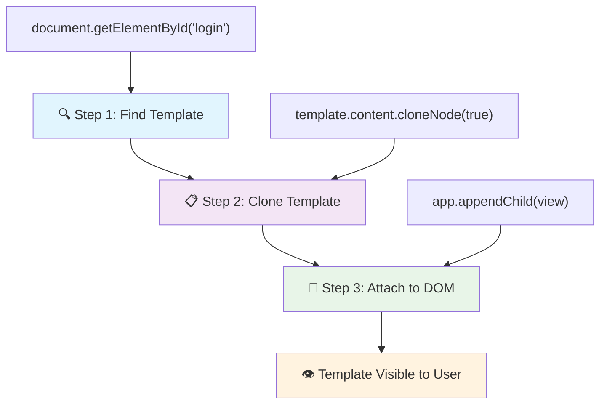
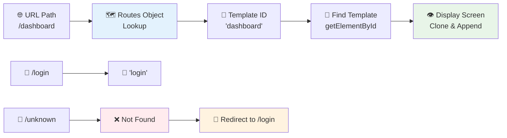
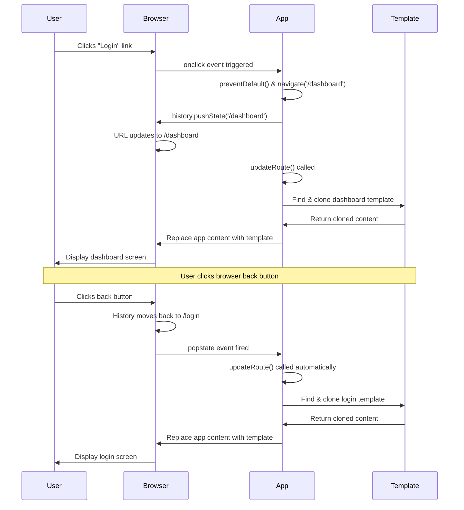

<!--
CO_OP_TRANSLATOR_METADATA:
{
  "original_hash": "5d259f6962464ad91e671083aa0398f4",
  "translation_date": "2025-10-22T17:07:03+00:00",
  "source_file": "7-bank-project/1-template-route/README.md",
  "language_code": "ne"
}
-->
# बैंकिङ एप निर्माण भाग १: वेब एपमा HTML टेम्प्लेट र रुटहरू

जब अपोलो ११ को गाइडेन्स कम्प्युटरले सन् १९६९ मा चन्द्रमामा नेभिगेट गर्‍यो, त्यसले सम्पूर्ण प्रणाली पुनः सुरु नगरी विभिन्न प्रोग्रामहरू बीच स्विच गर्नुपर्‍यो। आधुनिक वेब एप्लिकेसनहरू पनि यस्तै काम गर्छन् – तिनीहरूले तपाईंलाई देखिने सामग्री परिवर्तन गर्छन् तर सबै कुरा पुनः लोड गर्दैनन्। यसले आजका प्रयोगकर्ताहरूले अपेक्षा गरेको सहज, प्रतिक्रियात्मक अनुभव सिर्जना गर्छ।

परम्परागत वेबसाइटहरूले प्रत्येक अन्तरक्रियाको लागि सम्पूर्ण पृष्ठ पुनः लोड गर्छन् भने आधुनिक वेब एप्सले केवल परिवर्तन गर्नुपर्ने भागहरू अपडेट गर्छन्। यो दृष्टिकोण, मिशन कन्ट्रोलले विभिन्न डिस्प्लेहरू बीच स्विच गर्दा निरन्तर सञ्चार कायम राख्ने तरिकाको जस्तै, हामीले अपेक्षा गरेको तरल अनुभव सिर्जना गर्छ।

यहाँ के कुराले फरक पार्छ:

| परम्परागत मल्टि-पेज एप्स | आधुनिक सिंगल-पेज एप्स |
|----------------------------|-------------------------|
| **नेभिगेसन** | प्रत्येक स्क्रिनको लागि पूर्ण पृष्ठ पुनः लोड | सामग्री तुरुन्तै स्विच हुन्छ |
| **प्रदर्शन** | सम्पूर्ण HTML डाउनलोडको कारण ढिलो | आंशिक अपडेटको कारण छिटो |
| **प्रयोगकर्ता अनुभव** | पृष्ठ झिल्काहरू | सहज, एप-जस्तो ट्रान्जिसनहरू |
| **डाटा साझेदारी** | पृष्ठहरू बीच कठिन | राज्य व्यवस्थापन सजिलो |
| **विकास** | धेरै HTML फाइलहरू व्यवस्थापन गर्नुपर्ने | एकल HTML र गतिशील टेम्प्लेटहरू |

**विकासको समझ:**
- **परम्परागत एप्स** प्रत्येक नेभिगेसन कार्यको लागि सर्भर अनुरोध आवश्यक छ
- **आधुनिक SPAs** एक पटक लोड हुन्छ र सामग्रीलाई जाभास्क्रिप्ट प्रयोग गरेर गतिशील रूपमा अपडेट गर्छ
- **प्रयोगकर्ता अपेक्षाहरू** अब तुरुन्त, सहज अन्तरक्रियाहरूलाई प्राथमिकता दिन्छ
- **प्रदर्शन लाभहरू** ब्यान्डविथ कम र छिटो प्रतिक्रिया समावेश गर्दछ

यस पाठमा, हामी धेरै स्क्रिनहरू भएको बैंकिङ एप निर्माण गर्नेछौं जसले सहज रूपमा काम गर्छ। वैज्ञानिकहरूले विभिन्न प्रयोगहरूको लागि पुनः कन्फिगर गर्न सकिने मोड्युलर उपकरणहरू प्रयोग गर्ने तरिकाको जस्तै, हामी HTML टेम्प्लेटहरूलाई पुनः प्रयोग गर्न सकिने कम्पोनेन्टको रूपमा प्रयोग गर्नेछौं।

तपाईं HTML टेम्प्लेटहरू (विभिन्न स्क्रिनहरूको लागि पुनः प्रयोग गर्न सकिने ब्लूप्रिन्टहरू), जाभास्क्रिप्ट रुटिङ (स्क्रिनहरू बीच स्विच गर्ने प्रणाली), र ब्राउजरको इतिहास API (जसले ब्याक बटनलाई अपेक्षित रूपमा काम गर्न मद्दत गर्छ) सँग काम गर्नुहुनेछ। यी नै आधारभूत प्रविधिहरू React, Vue, र Angular जस्ता फ्रेमवर्कहरूले प्रयोग गर्छन्।

पाठको अन्त्यसम्ममा, तपाईंले व्यावसायिक सिंगल-पेज एप्लिकेसन सिद्धान्तहरू प्रदर्शन गर्ने कार्यरत बैंकिङ एप निर्माण गर्न सक्नुहुनेछ।

## प्रि-लेक्चर क्विज

[प्रि-लेक्चर क्विज](https://ff-quizzes.netlify.app/web/quiz/41)

### तपाईंलाई के चाहिन्छ

हामीलाई हाम्रो बैंकिङ एप परीक्षण गर्न स्थानीय वेब सर्भर चाहिन्छ – चिन्ता नगर्नुहोस्, यो जति गाह्रो लाग्छ त्यति छैन! यदि तपाईंले पहिले नै सेटअप गर्नुभएको छैन भने, [Node.js](https://nodejs.org) स्थापना गर्नुहोस् र आफ्नो प्रोजेक्ट फोल्डरबाट `npx lite-server` चलाउनुहोस्। यो उपयोगी कमाण्डले स्थानीय सर्भर सुरु गर्छ र तपाईंको एपलाई ब्राउजरमा स्वतः खोल्छ।

### तयारी

तपाईंको कम्प्युटरमा `bank` नामको फोल्डर बनाउनुहोस् र त्यसमा `index.html` नामको फाइल राख्नुहोस्। हामी यो HTML [बोइलरप्लेट](https://en.wikipedia.org/wiki/Boilerplate_code) बाट सुरु गर्नेछौं:

```html
<!DOCTYPE html>
<html lang="en">
  <head>
    <meta charset="UTF-8">
    <meta name="viewport" content="width=device-width, initial-scale=1.0">
    <title>Bank App</title>
  </head>
  <body>
    <!-- This is where you'll work -->
  </body>
</html>
```

**यो बोइलरप्लेटले के प्रदान गर्छ:**
- **HTML5** डकुमेन्ट संरचना उचित DOCTYPE घोषणासहित स्थापना गर्छ
- **क्यारेक्टर एन्कोडिङ** UTF-8 कन्फिगर गर्छ अन्तर्राष्ट्रिय पाठ समर्थनको लागि
- **उत्तरदायी डिजाइन सक्षम बनाउँछ** मोबाइल अनुकूलता लागि viewport meta tag प्रयोग गरेर
- **वर्णनात्मक शीर्षक सेट गर्छ** जुन ब्राउजर ट्याबमा देखिन्छ
- **सफा बडी सेक्सन सिर्जना गर्छ** जहाँ हामी हाम्रो एप निर्माण गर्नेछौं

> 📁 **प्रोजेक्ट संरचना पूर्वावलोकन**
> 
> **पाठको अन्त्यसम्ममा, तपाईंको प्रोजेक्टमा समावेश हुनेछ:**
> ```
> bank/
> ├── index.html      <!-- Main HTML with templates -->
> ├── app.js          <!-- Routing and navigation logic -->
> └── style.css       <!-- (Optional for future lessons) -->
> ```
> 
> **फाइल जिम्मेवारीहरू:**
> - **index.html**: सबै टेम्प्लेटहरू समावेश गर्दछ र एप संरचना प्रदान गर्छ
> - **app.js**: रुटिङ, नेभिगेसन, र टेम्प्लेट व्यवस्थापन सम्हाल्छ
> - **टेम्प्लेटहरू**: लगइन, ड्यासबोर्ड, र अन्य स्क्रिनहरूको UI परिभाषित गर्छ

---

## HTML टेम्प्लेटहरू

टेम्प्लेटहरूले वेब विकासमा आधारभूत समस्याको समाधान गर्छन्। जब गुटेनबर्गले १४४० को दशकमा चलायमान टाइप प्रिन्टिङ आविष्कार गरे, उनले सम्पूर्ण पृष्ठहरू कोर्ने सट्टा पुनः प्रयोग गर्न सकिने अक्षर ब्लकहरू सिर्जना गर्न सकिने महसुस गरे। HTML टेम्प्लेटहरू पनि यही सिद्धान्तमा काम गर्छन् – प्रत्येक स्क्रिनको लागि अलग HTML फाइलहरू सिर्जना गर्ने सट्टा, तपाईं पुनः प्रयोग गर्न सकिने संरचनाहरू परिभाषित गर्नुहुन्छ जुन आवश्यक पर्दा प्रदर्शन गर्न सकिन्छ।

टेम्प्लेटहरूलाई तपाईंको एपका विभिन्न भागहरूको ब्लूप्रिन्टको रूपमा सोच्नुहोस्। जस्तै एक आर्किटेक्टले एक ब्लूप्रिन्ट बनाउँछ र समान कोठाहरू पुनः कोर्ने सट्टा धेरै पटक प्रयोग गर्छ, हामी एक पटक टेम्प्लेटहरू बनाउँछौं र आवश्यक पर्दा तिनीहरूलाई प्रयोग गर्छौं। ब्राउजरले यी टेम्प्लेटहरूलाई लुकाएर राख्छ जबसम्म जाभास्क्रिप्टले तिनीहरूलाई सक्रिय गर्दैन।

यदि तपाईं वेब पृष्ठको लागि धेरै स्क्रिनहरू सिर्जना गर्न चाहनुहुन्छ भने, एउटा समाधान भनेको तपाईंले देखाउन चाहनुभएको प्रत्येक स्क्रिनको लागि एउटा HTML फाइल बनाउनु हो। तर, यो समाधानले केही असुविधा ल्याउँछ:

- स्क्रिन स्विच गर्दा सम्पूर्ण HTML पुनः लोड गर्नुपर्छ, जसले गर्दा ढिलो हुन सक्छ।
- विभिन्न स्क्रिनहरू बीच डाटा साझा गर्न गाह्रो हुन्छ।

अर्को दृष्टिकोण भनेको केवल एक HTML फाइल राख्नु हो, र `<template>` एलिमेन्ट प्रयोग गरेर धेरै [HTML टेम्प्लेटहरू](https://developer.mozilla.org/docs/Web/HTML/Element/template) परिभाषित गर्नु हो। टेम्प्लेट एक पुनः प्रयोग गर्न सकिने HTML ब्लक हो जुन ब्राउजरले प्रदर्शन गर्दैन, र यसलाई रनटाइममा जाभास्क्रिप्ट प्रयोग गरेर सक्रिय गर्नुपर्छ।

### यसलाई निर्माण गरौं

हामी दुई मुख्य स्क्रिनहरू भएको बैंक एप बनाउनेछौं: एक लगइन पृष्ठ र एक ड्यासबोर्ड। पहिलो, हामी हाम्रो HTML बडीमा एउटा प्लेसहोल्डर एलिमेन्ट थप्नेछौं – यहीँ हाम्रो विभिन्न स्क्रिनहरू देखिनेछन्:

```html
<div id="app">Loading...</div>
```

**यस प्लेसहोल्डरको समझ:**
- **ID "app"** भएको कन्टेनर सिर्जना गर्छ जहाँ सबै स्क्रिनहरू प्रदर्शन गरिन्छ
- **लोडिङ सन्देश देखाउँछ** जबसम्म जाभास्क्रिप्टले पहिलो स्क्रिन सुरु गर्छ
- **हाम्रो गतिशील सामग्रीको लागि एकल माउन्टिङ पोइन्ट प्रदान गर्छ**
- **जाभास्क्रिप्टबाट सजिलो लक्ष्यीकरण सक्षम बनाउँछ** `document.getElementById()` प्रयोग गरेर

> 💡 **प्रो टिप**: किनभने यस एलिमेन्टको सामग्री प्रतिस्थापन हुनेछ, हामी यसमा लोडिङ सन्देश वा सूचक राख्न सक्छौं जुन एप लोड हुँदा देखिनेछ।

अब, HTML टेम्प्लेट लगइन पृष्ठको लागि तल थपौं। अहिले हामी त्यहाँ एउटा शीर्षक र एउटा सेक्सन राख्नेछौं जसमा नेभिगेसन गर्न प्रयोग गरिने लिंक हुनेछ।

```html
<template id="login">
  <h1>Bank App</h1>
  <section>
    <a href="/dashboard">Login</a>
  </section>
</template>
```

**यस लगइन टेम्प्लेटको विश्लेषण:**
- **"login"** नामक अद्वितीय पहिचानसहित टेम्प्लेट परिभाषित गर्छ जाभास्क्रिप्ट लक्ष्यीकरणको लागि
- **मुख्य हेडिङ समावेश गर्छ** जसले एपको ब्रान्डिङ स्थापना गर्छ
- **सम्बन्धित सामग्री समूह गर्न** एक सेम्यान्टिक `<section>` एलिमेन्ट समावेश गर्छ
- **नेभिगेसन लिंक प्रदान गर्छ** जसले प्रयोगकर्ताहरूलाई ड्यासबोर्डमा रुट गर्छ

त्यसपछि हामी ड्यासबोर्ड पृष्ठको लागि अर्को HTML टेम्प्लेट थप्नेछौं। यो पृष्ठमा विभिन्न सेक्सनहरू समावेश हुनेछ:

- शीर्षक र लगआउट लिंक भएको हेडर
- बैंक खाताको वर्तमान ब्यालेन्स
- ट्रान्जेक्सनहरूको सूची, तालिकामा प्रदर्शन गरिएको

```html
<template id="dashboard">
  <header>
    <h1>Bank App</h1>
    <a href="/login">Logout</a>
  </header>
  <section>
    Balance: 100$
  </section>
  <section>
    <h2>Transactions</h2>
    <table>
      <thead>
        <tr>
          <th>Date</th>
          <th>Object</th>
          <th>Amount</th>
        </tr>
      </thead>
      <tbody></tbody>
    </table>
  </section>
</template>
```

**ड्यासबोर्डको प्रत्येक भागको समझ:**
- **पृष्ठ संरचना गर्छ** नेभिगेसन समावेश भएको सेम्यान्टिक `<header>` एलिमेन्ट प्रयोग गरेर
- **एप शीर्षक प्रदर्शन गर्छ** स्क्रिनहरूमा ब्रान्डिङको लागि
- **लगआउट लिंक प्रदान गर्छ** जसले लगइन स्क्रिनमा रुट गर्छ
- **खाताको वर्तमान ब्यालेन्स देखाउँछ** समर्पित सेक्सनमा
- **ट्रान्जेक्सन डाटा व्यवस्थित गर्छ** राम्रोसँग संरचित HTML तालिका प्रयोग गरेर
- **तालिका हेडर परिभाषित गर्छ** मिति, वस्तु, र रकम स्तम्भहरूको लागि
- **तालिका बडी खाली राख्छ** गतिशील सामग्री इन्जेक्सनको लागि

> 💡 **प्रो टिप**: HTML टेम्प्लेट बनाउँदा, यदि तपाईं यसलाई कस्तो देखिन्छ हेर्न चाहनुहुन्छ भने, `<template>` र `</template>` लाइनहरूलाई `<!-- -->` ले घेरेर कमेन्ट गर्न सक्नुहुन्छ।

✅ तपाईंलाई किन लाग्छ कि हामीले टेम्प्लेटहरूमा `id` एट्रिब्युटहरू प्रयोग गरेका छौं? के हामीले क्लासहरू जस्ता अन्य केही प्रयोग गर्न सक्थ्यौं?

## जाभास्क्रिप्ट प्रयोग गरेर टेम्प्लेटहरूलाई जीवन्त बनाउने

अब हामीले हाम्रो टेम्प्लेटहरूलाई कार्यात्मक बनाउनुपर्छ। जस्तै 3D प्रिन्टरले डिजिटल ब्लूप्रिन्टलाई भौतिक वस्तु बनाउँछ, जाभास्क्रिप्टले हाम्रो लुकेका टेम्प्लेटहरूलाई देखिने, अन्तरक्रियात्मक एलिमेन्टहरूमा परिणत गर्छ जसलाई प्रयोगकर्ताहरूले देख्न र प्रयोग गर्न सक्छन्।

यो प्रक्रिया तीन निरन्तर चरणहरू अनुसरण गर्छ जसले आधुनिक वेब विकासको आधार बनाउँछ। एक पटक तपाईंले यो ढाँचा बुझ्नुभयो भने, तपाईंले यसलाई धेरै फ्रेमवर्कहरू र लाइब्रेरीहरूमा देख्नुहुनेछ।

यदि तपाईंले आफ्नो हालको HTML फाइललाई ब्राउजरमा प्रयास गर्नुभयो भने, तपाईंले देख्नुहुनेछ कि यो `Loading...` देखाउँदै अड्किन्छ। त्यसको कारण हामीले HTML टेम्प्लेटहरूलाई सक्रिय गर्न र प्रदर्शन गर्न केही जाभास्क्रिप्ट कोड थप्नुपर्छ।

टेम्प्लेटलाई सक्रिय गर्नु सामान्यतया ३ चरणमा गरिन्छ:

1. DOM मा टेम्प्लेट एलिमेन्ट प्राप्त गर्नुहोस्, उदाहरणका लागि [`document.getElementById`](https://developer.mozilla.org/docs/Web/API/Document/getElementById) प्रयोग गरेर।
2. टेम्प्लेट एलिमेन्टलाई क्लोन गर्नुहोस्, [`cloneNode`](https://developer.mozilla.org/docs/Web/API/Node/cloneNode) प्रयोग गरेर।
3. यसलाई देखिने एलिमेन्ट अन्तर्गत DOM मा जोड्नुहोस्, उदाहरणका लागि [`appendChild`](https://developer.mozilla.org/docs/Web/API/Node/appendChild) प्रयोग गरेर।



**प्रक्रियाको दृश्यात्मक विश्लेषण:**
- **चरण १** ले DOM संरचनामा लुकेको टेम्प्लेट पत्ता लगाउँछ
- **चरण २** ले सुरक्षित रूपमा परिमार्जन गर्न सकिने कार्यरत प्रतिलिपि सिर्जना गर्छ
- **चरण ३** ले प्रतिलिपिलाई देखिने पृष्ठ क्षेत्रमा राख्छ
- **परिणाम** एक कार्यात्मक स्क्रिन हो जससँग प्रयोगकर्ताहरू अन्तरक्रिया गर्न सक्छन्

✅ हामीले टेम्प्लेटलाई DOM मा जोड्नुअघि किन क्लोन गर्न आवश्यक छ? यदि हामीले यो चरण छोड्यौं भने के हुन्छ?

### कार्य

तपाईंको प्रोजेक्ट फोल्डरमा `app.js` नामको नयाँ फाइल सिर्जना गर्नुहोस् र उक्त फाइललाई आफ्नो HTML को `<head>` सेक्सनमा इम्पोर्ट गर्नुहोस्:

```html
<script src="app.js" defer></script>
```

**यस स्क्रिप्ट इम्पोर्टको समझ:**
- **जाभास्क्रिप्ट फाइललाई हाम्रो HTML डकुमेन्टसँग लिंक गर्छ**
- **`defer` एट्रिब्युट प्रयोग गर्छ** स्क्रिप्ट HTML पार्सिङ पूरा भएपछि चल्न सुनिश्चित गर्न
- **सबै DOM एलिमेन्टहरूमा पहुँच सक्षम बनाउँछ** किनभने तिनीहरू स्क्रिप्ट कार्यान्वयन अघि पूर्ण रूपमा लोड हुन्छन्
- **स्क्रिप्ट लोडिङ र प्रदर्शनको लागि आधुनिक उत्तम अभ्यासहरू अनुसरण गर्छ**

अब `app.js` मा, हामी नयाँ `updateRoute` नामक फंक्शन सिर्जना गर्नेछौं:

```js
function updateRoute(templateId) {
  const template = document.getElementById(templateId);
  const view = template.content.cloneNode(true);
  const app = document.getElementById('app');
  app.innerHTML = '';
  app.appendChild(view);
}
```

**चरणबद्ध रूपमा, यहाँ के भइरहेको छ:**
- **टेम्प्लेट एलिमेन्टलाई यसको अद्वितीय ID प्रयोग गरेर पत्ता लगाउँछ**
- **`cloneNode(true)` प्रयोग गरेर टेम्प्लेटको गहिरो प्रतिलिपि सिर्जना गर्छ**
- **कन्टेनर पत्ता लगाउँछ जहाँ सामग्री प्रदर्शन हुनेछ**
- **कन्टेनरबाट कुनै पनि अवस्थित सामग्री हटाउँछ**
- **क्लोन गरिएको टेम्प्लेट सामग्रीलाई देखिने DOM मा राख्छ**

अब यस फंक्शनलाई टेम्प्लेटहरूमध्ये एकसँग कल गर्नुहोस् र परिणाम हेर्नुहोस्।

```js
updateRoute('login');
```

**यस फंक्शन कलले के हासिल गर्छ:**
- **लगइन टेम्प्लेट सक्रिय गर्छ** यसको ID लाई प्यारामिटरको रूपमा पास गरेर
- **विभिन्न एप स्क्रिनहरू बीच प्रोग्रामेटिक रूपमा स्विच गर्ने तरिका प्रदर्शन गर्छ**
- **"Loading..." सन्देशको सट्टा लगइन स्क्रिन देखाउँछ**

✅ यस कोडको उद्देश्य के हो `app.innerHTML = '';`? यसको बिना के हुन्छ?

## रुटहरू सिर्जना गर्दै

रुटिङ भनेको URL लाई सही सामग्रीसँग जोड्ने कुरा हो। जस्तै प्रारम्भिक टेलिफोन अपरेटरहरूले स्विचबोर्ड प्रयोग गरेर कलहरू जोड्थे – तिनीहरूले आउने अनुरोध लिँदै सही गन्तव्यमा रुट गर्थे। वेब रुटिङ पनि यस्तै काम गर्छ, URL अनुरोध लिँदै कुन सामग्री प्रदर्शन गर्ने निर्धारण गर्छ।

परम्परागत रूपमा, वेब सर्भरहरूले विभिन्न URL हरूको लागि विभिन्न HTML फाइलहरू सेवा दिन्थे। किनभने हामी सिंगल-पेज एप बनाउँदैछौं, हामीले यो रुटिङ आफैंले जाभास्क्रिप्ट प्रयोग गरेर सम्हाल्नुपर्छ। यसले प्रयोगकर्ता अनुभव र प्रदर्शनमा थप नियन्त्रण दिन्छ।



**रुटिङ प्रवाहको समझ:**
- **URL परिवर्तनहरू** हाम्रो रुट्स कन्फिगरेसनमा लुकअप ट्रिगर गर्छ
- **वैध रुटहरू** विशिष्ट टेम्प्लेट ID हरूसँग म्याप हुन्छन् प्रदर्शनको लागि
- **अवैध रुटहरू** फलब्याक व्यवहार ट्रिगर गर्छन् भंग अवस्थाहरू रोक्न
- **टेम्प्लेट रेंडरिङ** हामीले सिकेको तीन-चरण प्रक्रिया अनुसरण गर्छ

वेब एपको कुरा गर्दा, हामी *रुटिङ* लाई URL हरूलाई विशिष्ट स्क्रिनहरूसँग म्याप गर्ने उद्देश्य भन्छौं जुन प्रदर्शन गरिनुपर्छ। धेरै HTML फाइलहरू भएको वेबसाइटमा, यो स्वतः गरिन्छ किनभने फाइल पथहरू URL मा प्रतिबिम्बित हुन्छन्। उदाहरणका लागि, तपाईंको प्रोजेक्ट फोल्डरमा यी फाइलहरू भए:

```
mywebsite/index.html
mywebsite/login.html
mywebsite/admin/index.html
```

यदि तपाईंले `mywebsite` लाई रुटको रूपमा वेब सर्भर सिर्जना गर्नुभयो भने, URL म्यापिङ हुनेछ:

```
https://site.com            --> mywebsite/index.html
https://site.com/login.html --> mywebsite/login.html
https://site.com/admin/     --> mywebsite/admin/index.html
```

तर, हाम्रो वेब एपको लागि हामी एकल HTML फाइल प्रयोग गर्दैछौं जसमा सबै स्क्रिनहरू समावेश छन्, त्यसैले यो डिफल्ट व्यवहारले हामीलाई मद्दत गर्दैन। हामीले यो म्याप म्यानुअली सिर्जना गर्नुपर्छ र जाभास्क्रिप्ट प्रयोग गरेर प्रदर्शन गरिएको टेम्प्लेट अपडेट गर्नुपर्छ।

### कार्य

हामी URL पथहरू र हाम्रो टेम्प्लेटहरू बीच [म्याप](https://en.wikipedia.org/wiki/Associative_array) कार्य
✅ यदि तपाईं URL मा अज्ञात पथ प्रविष्ट गर्नुहुन्छ भने के हुन्छ? हामी यसलाई कसरी समाधान गर्न सक्छौं?

## नेभिगेसन थप्दै

राउटिङ सेटअप भएपछि, प्रयोगकर्ताहरूलाई एपमा नेभिगेट गर्ने तरिका चाहिन्छ। परम्परागत वेबसाइटहरूले लिंक क्लिक गर्दा सम्पूर्ण पृष्ठहरू पुनः लोड गर्छन्, तर हामी URL र सामग्रीलाई पृष्ठ पुनः लोड नगरी अपडेट गर्न चाहन्छौं। यसले डेस्कटप एप्लिकेसनहरूले विभिन्न दृश्यहरू बीच स्विच गर्ने तरिकाको जस्तै सहज अनुभव सिर्जना गर्दछ।

हामीले दुईवटा कुरा समन्वय गर्न आवश्यक छ: ब्राउजरको URL अपडेट गर्नु ताकि प्रयोगकर्ताहरूले पृष्ठहरू बुकमार्क गर्न र लिंकहरू साझा गर्न सकून्, र उपयुक्त सामग्री देखाउनु। सही तरिकाले कार्यान्वयन गर्दा, यसले आधुनिक एप्लिकेसनहरूबाट प्रयोगकर्ताहरूले अपेक्षा गरेको सहज नेभिगेसन सिर्जना गर्दछ।

> 🏗️ **आर्किटेक्चर जानकारी**: नेभिगेसन प्रणालीका घटकहरू
>
> **तपाईंले निर्माण गर्दै हुनुहुन्छ:**
> - **🔄 URL व्यवस्थापन**: पृष्ठ पुनः लोड नगरी ब्राउजरको ठेगाना पट्टी अपडेट गर्दछ
> - **📋 टेम्प्लेट प्रणाली**: हालको राउटको आधारमा सामग्रीलाई गतिशील रूपमा परिवर्तन गर्दछ  
> - **📚 इतिहास एकीकरण**: ब्राउजरको पछाडि/अगाडि बटनको कार्यक्षमता कायम राख्छ
> - **🛡️ त्रुटि ह्यान्डलिङ**: अमान्य वा हराएको राउटहरूको लागि सहज फिर्ता व्यवस्था
>
> **घटकहरू कसरी सँगै काम गर्छन्:**
> - नेभिगेसन घटनाहरू (क्लिकहरू, इतिहास परिवर्तनहरू) **सुन्छ**
> - History API प्रयोग गरेर URL **अपडेट गर्छ**
> - नयाँ राउटको लागि उपयुक्त टेम्प्लेट **रेंडर गर्छ**
> - **सामान्य प्रयोगकर्ता अनुभव** कायम राख्छ

हाम्रो एपको अर्को चरण भनेको पृष्ठहरू बीच नेभिगेट गर्ने सम्भावना थप्नु हो ताकि URL म्यानुअली परिवर्तन गर्न नपरोस्। यसले दुई कुरा संकेत गर्दछ:

  1. हालको URL अपडेट गर्नु
  2. नयाँ URL को आधारमा देखाइएको टेम्प्लेट अपडेट गर्नु

हामीले `updateRoute` फङ्सनको साथ दोस्रो भागको ख्याल राखिसकेका छौं, त्यसैले हामीले हालको URL कसरी अपडेट गर्ने भन्ने कुरा बुझ्नुपर्छ।

हामीले JavaScript र विशेष गरी [`history.pushState`](https://developer.mozilla.org/docs/Web/API/History/pushState) प्रयोग गर्नुपर्नेछ जसले HTML पुनः लोड नगरी URL अपडेट गर्न र ब्राउजिङ इतिहासमा नयाँ प्रविष्टि सिर्जना गर्न अनुमति दिन्छ।

> ⚠️ **महत्वपूर्ण नोट**: HTML एङ्कर एलिमेन्ट [`<a href>`](https://developer.mozilla.org/docs/Web/HTML/Element/a) लाई आफ्नै रूपमा विभिन्न URL हरूमा हाइपरलिङ्कहरू सिर्जना गर्न प्रयोग गर्न सकिन्छ, तर यसले ब्राउजरलाई डिफल्ट रूपमा HTML पुनः लोड गराउँछ। कस्टम जाभास्क्रिप्टको साथ राउटिङ ह्यान्डल गर्दा यो व्यवहार रोक्न आवश्यक छ, क्लिक इभेन्टमा preventDefault() फङ्सन प्रयोग गरेर।

### कार्य

आउनुहोस्, हाम्रो एपमा नेभिगेट गर्न प्रयोग गर्न सकिने नयाँ फङ्सन सिर्जना गरौं:

```js
function navigate(path) {
  window.history.pushState({}, path, path);
  updateRoute();
}
```

**यस नेभिगेसन फङ्सनलाई बुझ्दै:**
- `history.pushState` प्रयोग गरेर ब्राउजरको URL नयाँ पथमा **अपडेट गर्छ**
- ब्राउजरको इतिहास स्ट्याकमा नयाँ प्रविष्टि थप्छ ताकि पछाडि/अगाडि बटनले सही काम गरोस्
- `updateRoute()` फङ्सनलाई ट्रिगर गरेर सम्बन्धित टेम्प्लेट देखाउँछ
- पृष्ठ पुनः लोड नगरी सिंगल-पेज एप अनुभव **मेन्टेन गर्छ**

यस विधिले पहिले दिइएको पथको आधारमा हालको URL अपडेट गर्छ, त्यसपछि टेम्प्लेट अपडेट गर्छ। `window.location.origin` प्रोपर्टीले URL को रूट फर्काउँछ, जसले हामीलाई दिइएको पथबाट पूर्ण URL पुनः निर्माण गर्न अनुमति दिन्छ।

अब हामीसँग यो फङ्सन छ, हामीले समस्या समाधान गर्न सक्छौं यदि कुनै पथले परिभाषित गरिएको राउटसँग मेल खाँदैन। हामीले `updateRoute` फङ्सनलाई संशोधन गरेर कुनै मेल नभएमा विद्यमान राउटमा फिर्ता जाने व्यवस्था थप्नेछौं।

```js
function updateRoute() {
  const path = window.location.pathname;
  const route = routes[path];

  if (!route) {
    return navigate('/login');
  }

  const template = document.getElementById(route.templateId);
  const view = template.content.cloneNode(true);
  const app = document.getElementById('app');
  app.innerHTML = '';
  app.appendChild(view);
}
```

**महत्वपूर्ण बुँदाहरू सम्झनुहोस्:**
- हालको पथको लागि राउट अवस्थित छ कि छैन भनेर **जाँच्छ**
- अमान्य राउट पहुँच गर्दा लगइन पृष्ठमा **रिडाइरेक्ट गर्छ**
- **फिर्ता व्यवस्था प्रदान गर्छ** जसले बिग्रिएको नेभिगेसनलाई रोक्छ
- **सुनिश्चित गर्छ** कि प्रयोगकर्ताहरूले सधैं सही स्क्रिन देख्छन्, गलत URL हरूसँग पनि

यदि कुनै राउट फेला पार्न सकिँदैन भने, हामी अब `login` पृष्ठमा रिडाइरेक्ट गर्नेछौं।

अब आउनुहोस्, लिंक क्लिक गर्दा URL प्राप्त गर्न र ब्राउजरको डिफल्ट लिंक व्यवहार रोक्न फङ्सन सिर्जना गरौं:

```js
function onLinkClick(event) {
  event.preventDefault();
  navigate(event.target.href);
}
```

**यस क्लिक ह्यान्डलरलाई तोड्दै:**
- `preventDefault()` प्रयोग गरेर ब्राउजरको डिफल्ट लिंक व्यवहार **रोक्छ**
- क्लिक गरिएको लिंक एलिमेन्टबाट गन्तव्य URL **निकाल्छ**
- पृष्ठ पुनः लोड नगरी हाम्रो कस्टम नेभिगेट फङ्सनलाई **कल गर्छ**
- सिंगल-पेज एप्लिकेसनको सहज अनुभव **मेन्टेन गर्छ**

```html
<a href="/dashboard" onclick="onLinkClick(event)">Login</a>
...
<a href="/login" onclick="onLinkClick(event)">Logout</a>
```

**यस onclick बाइन्डिङले के हासिल गर्छ:**
- प्रत्येक लिंकलाई हाम्रो कस्टम नेभिगेसन प्रणालीसँग **जोड्छ**
- क्लिक इभेन्टलाई हाम्रो `onLinkClick` फङ्सनमा **पास गर्छ** प्रक्रिया गर्न
- पृष्ठ पुनः लोड नगरी **सहज नेभिगेसन सक्षम गर्छ**
- प्रयोगकर्ताहरूले बुकमार्क गर्न वा साझा गर्न सक्ने सही URL संरचना **मेन्टेन गर्छ**

[`onclick`](https://developer.mozilla.org/docs/Web/API/GlobalEventHandlers/onclick) एट्रिब्युटले `click` इभेन्टलाई जाभास्क्रिप्ट कोडसँग बाइन्ड गर्छ, यहाँ `navigate()` फङ्सनको कल।

यी लिंकहरू क्लिक गरेर प्रयास गर्नुहोस्, तपाईंले अब आफ्नो एपका विभिन्न स्क्रिनहरू बीच नेभिगेट गर्न सक्षम हुनुहुनेछ।

✅ `history.pushState` विधि HTML5 मानकको भाग हो र [सबै आधुनिक ब्राउजरहरूमा](https://caniuse.com/?search=pushState) कार्यान्वयन गरिएको छ। यदि तपाईं पुराना ब्राउजरहरूको लागि वेब एप बनाउँदै हुनुहुन्छ भने, तपाईं यस API को सट्टा एउटा ट्रिक प्रयोग गर्न सक्नुहुन्छ: पथ अघि [ह्यास (`#`)](https://en.wikipedia.org/wiki/URI_fragment) प्रयोग गरेर तपाईं नियमित एङ्कर नेभिगेसनसँग काम गर्ने र पृष्ठ पुनः लोड नगर्ने राउटिङ कार्यान्वयन गर्न सक्नुहुन्छ, किनकि यसको उद्देश्य पृष्ठभित्र आन्तरिक लिंकहरू सिर्जना गर्नु हो।

## पछाडि र अगाडि बटनहरू काम गर्ने बनाउँदै

पछाडि र अगाडि बटनहरू वेब ब्राउजिङको लागि आधारभूत हुन्, NASA मिशन कन्ट्रोलरहरूले स्पेस मिशनको क्रममा अघिल्लो प्रणाली अवस्थाहरू समीक्षा गर्न सक्ने तरिकाको जस्तै। प्रयोगकर्ताहरूले यी बटनहरू काम गर्ने अपेक्षा गर्छन्, र जब तिनीहरू काम गर्दैनन्, यसले अपेक्षित ब्राउजिङ अनुभवलाई तोड्छ।

हाम्रो सिंगल-पेज एपलाई यसलाई समर्थन गर्न थप कन्फिगरेसन आवश्यक छ। ब्राउजरले इतिहास स्ट्याक कायम राख्छ (जसलाई हामीले `history.pushState` प्रयोग गरेर थप्दै आएका छौं), तर जब प्रयोगकर्ताहरू यस इतिहासमा नेभिगेट गर्छन्, हाम्रो एपले प्रतिक्रिया दिन आवश्यक छ र देखाइएको सामग्रीलाई तदनुसार अपडेट गर्नुपर्छ।



**महत्वपूर्ण अन्तरक्रिया बुँदाहरू:**
- **प्रयोगकर्ता क्रियाकलापहरू** क्लिकहरू वा ब्राउजर बटनहरू मार्फत नेभिगेसन ट्रिगर गर्छ
- एपले पृष्ठ पुनः लोड रोक्न लिंक क्लिकहरू **अवरोध गर्छ**
- **इतिहास API** ले URL परिवर्तन र ब्राउजर इतिहास स्ट्याक व्यवस्थापन गर्छ
- **टेम्प्लेटहरू** प्रत्येक स्क्रिनको लागि सामग्री संरचना प्रदान गर्छ
- **इभेन्ट लिसनरहरू** सुनिश्चित गर्छ कि एपले सबै प्रकारका नेभिगेसनमा प्रतिक्रिया दिन्छ

`history.pushState` प्रयोग गरेर ब्राउजरको नेभिगेसन इतिहासमा नयाँ प्रविष्टिहरू सिर्जना हुन्छ। तपाईंले आफ्नो ब्राउजरको *पछाडि बटन* थिचेर जाँच गर्न सक्नुहुन्छ, यसले केही यस्तो देखाउनु पर्छ:


यदि तपाईंले पछाडि बटन केही पटक क्लिक गर्न प्रयास गर्नुभयो भने, तपाईंले देख्नुहुनेछ कि हालको URL परिवर्तन हुन्छ र इतिहास अपडेट हुन्छ, तर उही टेम्प्लेट देखाइन्छ।

त्यसको कारण एप्लिकेसनलाई थाहा छैन कि हामीले `updateRoute()` कल गर्न आवश्यक छ प्रत्येक पटक इतिहास परिवर्तन हुँदा। यदि तपाईंले [`history.pushState`](https://developer.mozilla.org/docs/Web/API/History/pushState) को डकुमेन्टेसन हेर्नुभयो भने, तपाईंले देख्नुहुनेछ कि यदि अवस्था परिवर्तन भयो - जसको अर्थ हामी फरक URL मा सरेका छौं - [`popstate`](https://developer.mozilla.org/docs/Web/API/Window/popstate_event) इभेन्ट ट्रिगर हुन्छ। हामीले यो समस्या समाधान गर्न यसलाई प्रयोग गर्नेछौं।

### कार्य

ब्राउजर इतिहास परिवर्तन हुँदा देखाइएको टेम्प्लेट अपडेट सुनिश्चित गर्न, हामीले `updateRoute()` कल गर्ने नयाँ फङ्सन संलग्न गर्नेछौं। हामीले यो हाम्रो `app.js` फाइलको तल गर्नेछौं:

```js
window.onpopstate = () => updateRoute();
updateRoute();
```

**यस इतिहास एकीकरणलाई बुझ्दै:**
- प्रयोगकर्ताहरूले ब्राउजर बटनहरू प्रयोग गरेर नेभिगेट गर्दा हुने `popstate` इभेन्टहरू **सुन्छ**
- संक्षिप्त इभेन्ट ह्यान्डलर सिन्ट्याक्सको लागि एरो फङ्सन प्रयोग गर्छ
- इतिहास अवस्था परिवर्तन हुँदा स्वतः `updateRoute()` **कल गर्छ**
- पृष्ठ पहिलो पटक लोड हुँदा एपलाई **इनिसियलाइज गर्छ**
- प्रयोगकर्ताहरूले कसरी नेभिगेट गरे पनि सही टेम्प्लेट **सुनिश्चित गर्छ**

> 💡 **प्रो टिप**: हामीले यहाँ [एरो फङ्सन](https://developer.mozilla.org/docs/Web/JavaScript/Reference/Functions/Arrow_functions) प्रयोग गरेर हाम्रो `popstate` इभेन्ट ह्यान्डलरलाई संक्षिप्तता प्रदान गरेका छौं, तर नियमित फङ्सनले पनि उस्तै काम गर्नेछ।

एरो फङ्सनको बारेमा एक रिफ्रेसर भिडियो यहाँ छ:

[](https://youtube.com/watch?v=OP6eEbOj2sc "एरो फङ्सनहरू")

> 🎥 माथिको तस्बिर क्लिक गरेर एरो फङ्सनहरूको बारेमा भिडियो हेर्नुहोस्।

अब आफ्नो ब्राउजरको पछाडि र अगाडि बटनहरू प्रयोग गर्न प्रयास गर्नुहोस्, र यो पटक देखाइएको राउट सही रूपमा अपडेट भएको छ कि छैन जाँच गर्नुहोस्।

---

## GitHub Copilot Agent Challenge 🚀

Agent मोड प्रयोग गरेर निम्न चुनौती पूरा गर्नुहोस्:

**विवरण:** बैंकिङ एपलाई सुधार गर्दै अमान्य राउटहरूको लागि त्रुटि ह्यान्डलिङ र 404 पृष्ठ टेम्प्लेट कार्यान्वयन गर्नुहोस्, जसले प्रयोगकर्ताको अनुभवलाई सुधार गर्दछ जब तिनीहरू अवस्थित नभएका पृष्ठहरूमा नेभिगेट गर्छन्।

**प्रेरणा:** "not-found" आईडी भएको नयाँ HTML टेम्प्लेट सिर्जना गर्नुहोस् जसले प्रयोगकर्तालाई मैत्रीपूर्ण 404 त्रुटि पृष्ठ देखाउँछ। त्यसपछि जाभास्क्रिप्ट राउटिङ तर्कलाई संशोधन गरेर यो टेम्प्लेट देखाउनुहोस् जब प्रयोगकर्ताहरू अमान्य URL हरूमा नेभिगेट गर्छन्, र "Go Home" बटन थप्नुहोस् जसले लगइन पृष्ठमा फिर्ता नेभिगेट गर्छ।

[agent mode](https://code.visualstudio.com/blogs/2025/02/24/introducing-copilot-agent-mode) को बारेमा यहाँ थप जान्नुहोस्।

## 🚀 चुनौती

यस एपको क्रेडिटहरू देखाउने तेस्रो पृष्ठको लागि नयाँ टेम्प्लेट र राउट थप्नुहोस्।

**चुनौतीका लक्ष्यहरू:**
- उपयुक्त सामग्री संरचनासहित नयाँ HTML टेम्प्लेट **सिर्जना गर्नुहोस्**
- आफ्नो राउट्स कन्फिगरेसन वस्तुमा नयाँ राउट **थप्नुहोस्**
- क्रेडिट्स पृष्ठमा र त्यहाँबाट नेभिगेसन लिंकहरू **सामेल गर्नुहोस्**
- ब्राउजर इतिहासको साथ सबै नेभिगेसन सही रूपमा काम गर्छ कि जाँच गर्नुहोस्

## पोस्ट-लेक्चर क्विज

[पोस्ट-लेक्चर क्विज](https://ff-quizzes.netlify.app/web/quiz/42)

## समीक्षा र आत्म अध्ययन

राउटिङ वेब विकासको एक आश्चर्यजनक रूपमा जटिल भाग हो, विशेष गरी वेब पृष्ठ पुनः लोड व्यवहारबाट सिंगल पेज एप्लिकेसन पृष्ठ रिफ्रेसमा सर्दा। [Azure Static Web App सेवा](https://docs.microsoft.com/azure/static-web-apps/routes/?WT.mc_id=academic-77807-sagibbon) ले राउटिङ कसरी ह्यान्डल गर्छ भन्ने बारेमा थोरै पढ्नुहोस्। के तपाईंले उक्त डकुमेन्टमा वर्णन गरिएका केही निर्णयहरू किन आवश्यक छन् भनेर व्याख्या गर्न सक्नुहुन्छ?

**थप सिकाइ स्रोतहरू:**
- **अनुसन्धान गर्नुहोस्** कि React Router र Vue Router जस्ता लोकप्रिय फ्रेमवर्कहरूले क्लाइन्ट-साइड राउटिङ कसरी कार्यान्वयन गर्छन्
- **अनुसन्धान गर्नुहोस्** ह्यास-आधारित राउटिङ र इतिहास API राउटिङ बीचको भिन्नता
- **सिक्नुहोस्** सर्वर-साइड रेंडरिङ (SSR) को बारेमा र यसले राउटिङ रणनीतिहरूलाई कसरी असर गर्छ
- **अनुसन्धान गर्नुहोस्** प्रोग्रेसिभ वेब एप्स (PWAs) ले राउटिङ र नेभिगेसनलाई कसरी ह्यान्डल गर्छन्

## असाइनमेन्ट

[राउटिङ सुधार गर्नुहोस्](assignment.md)

---

**अस्वीकरण**:  
यो दस्तावेज AI अनुवाद सेवा [Co-op Translator](https://github.com/Azure/co-op-translator) प्रयोग गरेर अनुवाद गरिएको छ। हामी शुद्धताको लागि प्रयास गर्छौं, तर कृपया ध्यान दिनुहोस् कि स्वचालित अनुवादमा त्रुटि वा अशुद्धता हुन सक्छ। यसको मूल भाषा मा रहेको मूल दस्तावेजलाई आधिकारिक स्रोत मानिनुपर्छ। महत्वपूर्ण जानकारीको लागि, व्यावसायिक मानव अनुवाद सिफारिस गरिन्छ। यस अनुवादको प्रयोगबाट उत्पन्न हुने कुनै पनि गलतफहमी वा गलत व्याख्याको लागि हामी जिम्मेवार हुने छैनौं।