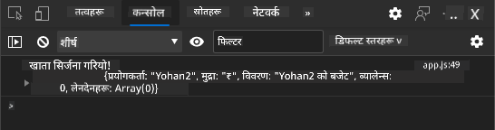

<!--
CO_OP_TRANSLATOR_METADATA:
{
  "original_hash": "b667b7d601e2ee19acb5aa9d102dc9f3",
  "translation_date": "2025-08-26T00:11:13+00:00",
  "source_file": "7-bank-project/2-forms/README.md",
  "language_code": "ne"
}
-->
# बैंकिङ एप निर्माण भाग २: लगइन र रजिस्ट्रेशन फारम बनाउने

## प्रि-लेक्चर क्विज

[प्रि-लेक्चर क्विज](https://ashy-river-0debb7803.1.azurestaticapps.net/quiz/43)

### परिचय

प्रायः सबै आधुनिक वेब एपहरूमा, तपाईंले आफ्नो निजी स्पेस बनाउन खाता सिर्जना गर्न सक्नुहुन्छ। धेरै प्रयोगकर्ताहरूले एकै समयमा वेब एप पहुँच गर्न सक्ने भएकाले, प्रत्येक प्रयोगकर्ताको व्यक्तिगत डेटा अलग-अलग भण्डारण गर्न र कुन जानकारी देखाउने छनोट गर्न एक मेकानिजम आवश्यक हुन्छ। हामी [प्रयोगकर्ता पहिचान सुरक्षित रूपमा](https://en.wikipedia.org/wiki/Authentication) व्यवस्थापन गर्ने कुरा कभर गर्ने छैनौं किनभने यो आफैंमा विस्तृत विषय हो, तर हामी सुनिश्चित गर्नेछौं कि प्रत्येक प्रयोगकर्ताले हाम्रो एपमा एक (वा धेरै) बैंक खाता सिर्जना गर्न सकून्।

यस भागमा हामी HTML फारमहरू प्रयोग गरेर हाम्रो वेब एपमा लगइन र रजिस्ट्रेशन थप्नेछौं। हामी डेटा प्रोग्रामेटिक रूपमा सर्भर API मा कसरी पठाउने देख्नेछौं, र अन्ततः प्रयोगकर्ता इनपुटहरूको लागि आधारभूत मान्यता नियमहरू परिभाषित गर्नेछौं।

### पूर्व-आवश्यकता

तपाईंले यस पाठको लागि वेब एपको [HTML टेम्प्लेट र राउटिङ](../1-template-route/README.md) पूरा गरिसक्नुपर्छ। तपाईंले [Node.js](https://nodejs.org) स्थापना गर्नुपर्छ र [सर्भर API चलाउनुहोस्](../api/README.md) ताकि तपाईं खाता सिर्जना गर्न डेटा पठाउन सक्नुहुन्छ।

**ध्यान दिनुहोस्**
तपाईंसँग एकै समयमा दुई टर्मिनलहरू चलिरहेको हुनेछ:
1. मुख्य बैंक एपको लागि जुन हामीले [HTML टेम्प्लेट र राउटिङ](../1-template-route/README.md) पाठमा निर्माण गरेका थियौं।
2. [बैंक एप सर्भर API](../api/README.md) जुन हामीले माथि सेटअप गर्यौं।

पाठको बाँकी भागमा अगाडि बढ्नका लागि तपाईंले यी दुई सर्भरहरू चलिरहेको हुनुपर्छ। यी फरक पोर्टहरू (पोर्ट `3000` र पोर्ट `5000`) मा सुन्दैछन्, त्यसैले सबै ठीकसँग काम गर्नुपर्छ।

तपाईंले सर्भर ठीकसँग चलिरहेको छ कि छैन जाँच गर्न टर्मिनलमा यो कमाण्ड चलाउन सक्नुहुन्छ:

```sh
curl http://localhost:5000/api
# -> should return "Bank API v1.0.0" as a result
```

---

## फारम र कन्ट्रोलहरू

`<form>` एलिमेन्टले HTML डकुमेन्टको एउटा भागलाई समेट्छ जहाँ प्रयोगकर्ताले इनपुट दिन र इन्टरएक्टिभ कन्ट्रोलहरूको साथ डेटा सबमिट गर्न सक्छ। फारमभित्र प्रयोग गर्न सकिने सबै प्रकारका प्रयोगकर्ता इन्टरफेस (UI) कन्ट्रोलहरू छन्, सबैभन्दा सामान्य `<input>` र `<button>` एलिमेन्टहरू हुन्।

`<input>` को धेरै [प्रकारहरू](https://developer.mozilla.org/docs/Web/HTML/Element/input) छन्। उदाहरणका लागि, प्रयोगकर्ताले आफ्नो युजरनेम प्रविष्ट गर्न सक्ने क्षेत्र बनाउन तपाईंले यो प्रयोग गर्न सक्नुहुन्छ:

```html
<input id="username" name="username" type="text">
```

`name` एट्रिब्युट फारम डेटा पठाउँदा प्रोपर्टी नामको रूपमा प्रयोग गरिन्छ। `id` एट्रिब्युट `<label>` लाई फारम कन्ट्रोलसँग सम्बन्धित गर्न प्रयोग गरिन्छ।

> [`<input>` प्रकारहरूको](https://developer.mozilla.org/docs/Web/HTML/Element/input) सम्पूर्ण सूची र [अन्य फारम कन्ट्रोलहरू](https://developer.mozilla.org/docs/Learn/Forms/Other_form_controls) हेर्नुहोस् ताकि तपाईं आफ्नो UI निर्माण गर्दा प्रयोग गर्न सकिने सबै नेटिभ UI एलिमेन्टहरूको बारेमा जानकारी प्राप्त गर्न सक्नुहुन्छ।

✅ ध्यान दिनुहोस् कि `<input>` एक [खाली एलिमेन्ट](https://developer.mozilla.org/docs/Glossary/Empty_element) हो जसमा तपाईंले *मिल्दो क्लोजिङ ट्याग* थप्नु हुँदैन। तपाईंले सेल्फ-क्लोजिङ `<input/>` नोटेशन प्रयोग गर्न सक्नुहुन्छ, तर यो आवश्यक छैन।

फारमभित्रको `<button>` एलिमेन्ट अलि विशेष छ। यदि तपाईंले यसको `type` एट्रिब्युट निर्दिष्ट गर्नुभएन भने, यो थिच्दा फारम डेटा सर्भरमा स्वतः सबमिट हुनेछ। यहाँ सम्भावित `type` मानहरू छन्:

- `submit`: फारमभित्रको डिफल्ट, बटनले फारम सबमिट एक्सन ट्रिगर गर्छ।
- `reset`: बटनले सबै फारम कन्ट्रोलहरूलाई प्रारम्भिक मानहरूमा रिसेट गर्छ।
- `button`: बटन थिच्दा कुनै डिफल्ट व्यवहार असाइन नगर्नुहोस्। तपाईंले यसलाई JavaScript प्रयोग गरेर कस्टम एक्सनहरू असाइन गर्न सक्नुहुन्छ।

### कार्य

हामी `login` टेम्प्लेटमा फारम थप्न सुरु गरौं। हामीलाई *युजरनेम* फिल्ड र *लगइन* बटन चाहिन्छ।

```html
<template id="login">
  <h1>Bank App</h1>
  <section>
    <h2>Login</h2>
    <form id="loginForm">
      <label for="username">Username</label>
      <input id="username" name="user" type="text">
      <button>Login</button>
    </form>
  </section>
</template>
```

यदि तपाईं नजिकबाट हेर्नुहुन्छ भने, तपाईंले यहाँ `<label>` एलिमेन्ट पनि थपेको देख्न सक्नुहुन्छ। `<label>` एलिमेन्टहरू UI कन्ट्रोलहरूमा नाम थप्न प्रयोग गरिन्छ, जस्तै हाम्रो युजरनेम फिल्ड। लेबलहरू फारमहरूको पढ्न सजिलो बनाउन महत्त्वपूर्ण छन्, तर यसले थप फाइदाहरू पनि ल्याउँछ:

- फारम कन्ट्रोलसँग लेबल सम्बन्धित गरेर, यसले सहायक प्रविधि (जस्तै स्क्रिन रिडर) प्रयोग गर्ने प्रयोगकर्ताहरूलाई उनीहरूले कुन डेटा प्रदान गर्न अपेक्षित छ भन्ने बुझ्न मद्दत गर्छ।
- तपाईंले लेबलमा क्लिक गरेर सम्बन्धित इनपुटमा सीधा फोकस राख्न सक्नुहुन्छ, जसले टच-स्क्रिन आधारित उपकरणहरूमा पुग्न सजिलो बनाउँछ।

> [वेबमा पहुँचयोग्यता](https://developer.mozilla.org/docs/Learn/Accessibility/What_is_accessibility) एक धेरै महत्त्वपूर्ण विषय हो जुन प्रायः बेवास्ता गरिन्छ। [सेम्यान्टिक HTML एलिमेन्टहरू](https://developer.mozilla.org/docs/Learn/Accessibility/HTML) को सही प्रयोग गरेर पहुँचयोग्य सामग्री सिर्जना गर्न गाह्रो छैन। तपाईं [पहुंचयोग्यता बारे थप पढ्न सक्नुहुन्छ](https://developer.mozilla.org/docs/Web/Accessibility) ताकि सामान्य गल्तीहरूबाट बच्न सकियोस् र जिम्मेवार डेभलपर बन्न सकियोस्।

अब हामी रजिस्ट्रेशनको लागि दोस्रो फारम थप्नेछौं, पहिलेको फारमको ठीक तल:

```html
<hr/>
<h2>Register</h2>
<form id="registerForm">
  <label for="user">Username</label>
  <input id="user" name="user" type="text">
  <label for="currency">Currency</label>
  <input id="currency" name="currency" type="text" value="$">
  <label for="description">Description</label>
  <input id="description" name="description" type="text">
  <label for="balance">Current balance</label>
  <input id="balance" name="balance" type="number" value="0">
  <button>Register</button>
</form>
```

`value` एट्रिब्युट प्रयोग गरेर हामी कुनै इनपुटको लागि डिफल्ट मान परिभाषित गर्न सक्छौं। ध्यान दिनुहोस् कि `balance` को इनपुटमा `number` प्रकार छ। के यो अन्य इनपुटहरू भन्दा फरक देखिन्छ? यससँग अन्तरक्रिया गरेर हेर्नुहोस्।

✅ के तपाईं केवल किबोर्ड प्रयोग गरेर फारमहरू नेभिगेट र अन्तरक्रिया गर्न सक्नुहुन्छ? तपाईंले यो कसरी गर्नुहुन्छ?

## सर्भरमा डेटा सबमिट गर्दै

अब हामीसँग कार्यात्मक UI छ, अर्को चरण भनेको डेटा सर्भरमा पठाउनु हो। हाम्रो हालको कोड प्रयोग गरेर छिटो परीक्षण गरौं: यदि तपाईं *लगइन* वा *रजिस्टर* बटनमा क्लिक गर्नुहुन्छ भने के हुन्छ?

के तपाईंले आफ्नो ब्राउजरको URL सेक्सनमा परिवर्तन देख्नुभयो?


`<form>` को डिफल्ट एक्सन भनेको फारमलाई हालको सर्भर URL मा [GET मेथड](https://www.w3.org/Protocols/rfc2616/rfc2616-sec9.html#sec9.3) प्रयोग गरेर सबमिट गर्नु हो, फारम डेटा URL मा सिधै थप्दै। तर यस मेथडमा केही सीमाहरू छन्:

- पठाइएको डेटा धेरै सीमित आकारको हुन्छ (लगभग 2000 क्यारेक्टरहरू)
- डेटा URL मा सिधै देखिन्छ (पासवर्डको लागि राम्रो होइन)
- यो फाइल अपलोडहरूसँग काम गर्दैन

त्यसैले तपाईंले यसलाई [POST मेथड](https://www.w3.org/Protocols/rfc2616/rfc2616-sec9.html#sec9.5) मा परिवर्तन गर्न सक्नुहुन्छ जसले फारम डेटा HTTP अनुरोधको बडीमा सर्भरमा पठाउँछ, बिना कुनै सीमाहरू।

> जबकि POST डेटा पठाउनको लागि सबैभन्दा सामान्य रूपमा प्रयोग गरिने मेथड हो, [केही विशेष परिस्थितिहरूमा](https://www.w3.org/2001/tag/doc/whenToUseGet.html) GET मेथड प्रयोग गर्नु उपयुक्त हुन्छ, जस्तै सर्च फिल्ड कार्यान्वयन गर्दा।

### कार्य

रजिस्ट्रेशन फारममा `action` र `method` प्रोपर्टीहरू थप्नुहोस्:

```html
<form id="registerForm" action="//localhost:5000/api/accounts" method="POST">
```

अब आफ्नो नाम प्रयोग गरेर नयाँ खाता रजिस्टर गर्न प्रयास गर्नुहोस्। *रजिस्टर* बटन क्लिक गरेपछि तपाईंले यस्तो देख्नुपर्छ:


यदि सबै ठीकसँग काम गर्छ भने, सर्भरले तपाईंको अनुरोधलाई JSON प्रतिक्रिया दिनेछ जसमा सिर्जना गरिएको खाता डेटा समावेश हुनेछ।

✅ उही नाम प्रयोग गरेर फेरि रजिस्टर गर्न प्रयास गर्नुहोस्। के हुन्छ?

## पेज रिफ्रेस नगरी डेटा सबमिट गर्दै

जसरी तपाईंले सम्भवतः देख्नुभयो, हामीले प्रयोग गरेको विधिमा एउटा सानो समस्या छ: फारम सबमिट गर्दा, हामी हाम्रो एपबाट बाहिर जान्छौं र ब्राउजर सर्भर URL मा रिडाइरेक्ट हुन्छ। हामी हाम्रो वेब एपसँग सबै पेज रिफ्रेसहरूबाट बच्न प्रयास गर्दैछौं, किनभने हामी [सिंगल-पेज एप्लिकेसन (SPA)](https://en.wikipedia.org/wiki/Single-page_application) बनाउँदैछौं।

पेज रिफ्रेस नगरी फारम डेटा सर्भरमा पठाउन, हामीले JavaScript कोड प्रयोग गर्नुपर्छ। `<form>` एलिमेन्टको `action` प्रोपर्टीमा URL राख्नको सट्टा, तपाईंले `javascript:` स्ट्रिङको साथ कुनै पनि JavaScript कोड प्रयोग गर्न सक्नुहुन्छ। यसलाई प्रयोग गर्दा ब्राउजरले स्वतः गरिने केही कार्यहरू तपाईंले कार्यान्वयन गर्नुपर्नेछ:

- फारम डेटा प्राप्त गर्नुहोस्
- फारम डेटा उपयुक्त फर्म्याटमा रूपान्तरण र एन्कोड गर्नुहोस्
- HTTP अनुरोध सिर्जना गर्नुहोस् र सर्भरमा पठाउनुहोस्

### कार्य

रजिस्ट्रेशन फारमको `action` लाई यसमा परिवर्तन गर्नुहोस्:

```html
<form id="registerForm" action="javascript:register()">
```

`app.js` खोल्नुहोस् र `register` नामको नयाँ फङ्सन थप्नुहोस्:

```js
function register() {
  const registerForm = document.getElementById('registerForm');
  const formData = new FormData(registerForm);
  const data = Object.fromEntries(formData);
  const jsonData = JSON.stringify(data);
}
```

यहाँ हामी फारम एलिमेन्टलाई `getElementById()` प्रयोग गरेर प्राप्त गर्छौं र [`FormData`](https://developer.mozilla.org/docs/Web/API/FormData) हेल्पर प्रयोग गरेर फारम कन्ट्रोलहरूबाट मानहरूलाई की/भ्यालु जोडीको सेटको रूपमा निकाल्छौं। त्यसपछि हामी डेटालाई नियमित वस्तुमा रूपान्तरण गर्न [`Object.fromEntries()`](https://developer.mozilla.org/docs/Web/JavaScript/Reference/Global_Objects/Object/fromEntries) प्रयोग गर्छौं र अन्ततः डेटा [JSON](https://www.json.org/json-en.html) मा सिरियलाइज गर्छौं, वेबमा डेटा आदानप्रदान गर्न सामान्य रूपमा प्रयोग गरिने फर्म्याट।

अब डेटा सर्भरमा पठाउन तयार छ। `createAccount` नामको नयाँ फङ्सन सिर्जना गर्नुहोस्:

```js
async function createAccount(account) {
  try {
    const response = await fetch('//localhost:5000/api/accounts', {
      method: 'POST',
      headers: { 'Content-Type': 'application/json' },
      body: account
    });
    return await response.json();
  } catch (error) {
    return { error: error.message || 'Unknown error' };
  }
}
```

यो फङ्सनले के गर्दैछ? पहिलो कुरा, यहाँ `async` कीवर्डलाई ध्यान दिनुहोस्। यसको मतलब फङ्सनले [**असिंक्रोनस**](https://developer.mozilla.org/docs/Web/JavaScript/Reference/Statements/async_function) कोड समावेश गर्दछ। `await` कीवर्डको साथ प्रयोग गर्दा, यसले असिंक्रोनस कोड कार्यान्वयनको लागि पर्खन अनुमति दिन्छ - जस्तै यहाँ सर्भर प्रतिक्रिया पर्खन - अघि बढ्नु अघि।

`fetch()` API प्रयोग गरेर हामी JSON डेटा सर्भरमा पठाउँछौं। यो मेथडले २ प्यारामिटरहरू लिन्छ:

- सर्भरको URL, त्यसैले हामी यहाँ `//localhost:5000/api/accounts` राख्छौं।
- अनुरोधको सेटिङहरू। यहीँ हामी मेथडलाई `POST` मा सेट गर्छौं र अनुरोधको लागि `body` प्रदान गर्छौं। हामी JSON डेटा सर्भरमा पठाउँदैछौं, त्यसैले हामीले `Content-Type` हेडरलाई `application/json` मा सेट गर्नुपर्छ ताकि सर्भरले सामग्रीलाई कसरी व्याख्या गर्ने थाहा पाओस्।

सर्भरले अनुरोधलाई JSON प्रतिक्रिया दिनेछ, त्यसैले हामी `await response.json()` प्रयोग गरेर JSON सामग्रीलाई पार्स गर्न सक्छौं र परिणामी वस्तु फर्काउन सक्छौं। ध्यान दिनुहोस् कि यो मेथड असिंक्रोनस छ, त्यसैले हामी यहाँ `await` कीवर्ड प्रयोग गर्छौं ताकि पार्सिङको क्रममा कुनै पनि त्रुटिहरू पनि समात्न सकियोस्।

अब `register` फङ्सनमा `createAccount()` कल गर्न केही कोड थप्नुहोस्:

```js
const result = await createAccount(jsonData);
```

किनकि हामी यहाँ `await` कीवर्ड प्रयोग गर्छौं, हामीले `register` फङ्सन अघि `async` कीवर्ड थप्नुपर्छ:

```js
async function register() {
```

अन्ततः, परिणाम जाँच गर्न केही लगहरू थपौं। अन्तिम फङ्सन यस प्रकार देखिनुपर्छ:

```js
async function register() {
  const registerForm = document.getElementById('registerForm');
  const formData = new FormData(registerForm);
  const jsonData = JSON.stringify(Object.fromEntries(formData));
  const result = await createAccount(jsonData);

  if (result.error) {
    return console.log('An error occurred:', result.error);
  }

  console.log('Account created!', result);
}
```

यो अलि लामो थियो तर हामी त्यहाँ पुग्यौं! यदि तपाईं आफ्नो [ब्राउजर डेभलपर टुल्स](https://developer.mozilla.org/docs/Learn/Common_questions/What_are_browser_developer_tools) खोल्नुहुन्छ, र नयाँ खाता रजिस्टर गर्न प्रयास गर्नुहुन्छ भने, तपाईंले वेब पेजमा कुनै परिवर्तन देख्नुहुने छैन तर कन्सोलमा एउटा सन्देश देखिनेछ जसले पुष्टि गर्छ कि सबै ठीकसँग काम गरिरहेको छ।



✅ के तपाईं सोच्नुहुन्छ कि डेटा सर्भरमा सुरक्षित रूपमा पठाइएको छ? यदि कसैले अनुरोधलाई रोक्न सके भने के हुन्छ? [HTTPS](https://en.wikipedia.org/wiki/HTTPS) बारे पढेर सुरक्षित डेटा सञ्चारको बारेमा जान्न सक्नुहुन्छ।

## डेटा मान्यता

यदि तपाईंले पहिले युजरनेम सेट नगरी नयाँ खाता रजिस्टर गर्न प्रयास गर्नुभयो भने, तपाईंले देख्न सक्नुहुन्छ कि सर्भरले [400 (Bad Request)](https://developer.mozilla.org/docs/Web/HTTP/Status/400#:~:text=The%20HyperText%20Transfer%20Protocol%20(HTTP,%2C%20or%20deceptive%20request%20routing).) स्टाटस कोडको साथ त्रुटि फर्काउँछ।

सर्भरमा डेटा पठाउनु अघि [फारम डेटा मान्यता](https://developer.mozilla.org/docs/Learn/Forms/Form_validation) गर्नु राम्रो अभ्यास हो जब सम्भव छ, ताकि तपाईंले मान्य अनुरोध पठाउन सक्नुहुन्छ। HTML5 फारम कन्ट्रोलहरूले विभिन्न एट्रिब्युटहरू प्रयोग गरेर बिल्ट-इन मान्यता प्रदान गर्दछ:

- `required`: फिल्ड भरेको हुनुपर्छ अन्यथा फारम सबमिट गर्न सकिँदैन।
- `minlength` र `maxlength`: टेक्स्ट फिल्डहरूमा क्यारेक्टरहरूको न्यूनतम र अधिकतम संख्या परिभाषित गर्दछ।
- `min` र `max`: संख्यात्मक फिल्डको न्यूनतम र अधिकतम मान परिभाषित गर्दछ।
- `type`: अपेक्षित डेटा प्रकार परिभाषित गर्दछ, जस्तै `number`, `email`, `file` वा [अन्य बिल्ट-इन प्रकारहरू](https://developer.mozilla.org/docs/Web/HTML/Element/input)। यस एट्रिब्युटले फारम कन्ट्रोलको दृश्य रेंडरिङ परिवर्तन गर्न सक्छ।
- `pattern`: [रेगुलर एक्सप्रेसन](https://developer.mozilla.org/docs/Web/JavaScript/Guide/Regular_Expressions) ढाँचा परिभाषित गर्न अनुमति दिन्छ ताकि प्रविष्ट गरिएको डेटा मान्य छ कि छैन परीक्षण गर्न सकियोस्।
> सुझाव: तपाईं आफ्नो फारम नियन्त्रणहरूको रूपलाई अनुकूलित गर्न सक्नुहुन्छ यदि तिनीहरू मान्य छन् वा छैनन् भनेर `:valid` र `:invalid` CSS pseudo-classes प्रयोग गरेर।
### कार्य

नयाँ खाता बनाउनका लागि दुई अनिवार्य फिल्डहरू आवश्यक छन्: प्रयोगकर्ता नाम (username) र मुद्रा (currency)। अन्य फिल्डहरू वैकल्पिक छन्। फारमको HTML अपडेट गर्नुहोस्, `required` एट्रिब्युट र फिल्डको लेबलमा पाठ प्रयोग गरेर यसरी:

```html
<label for="user">Username (required)</label>
<input id="user" name="user" type="text" required>
...
<label for="currency">Currency (required)</label>
<input id="currency" name="currency" type="text" value="$" required>
```

यद्यपि यो विशेष सर्भर कार्यान्वयनले फिल्डहरूको अधिकतम लम्बाइमा कुनै निश्चित सीमा लागू गर्दैन, कुनै पनि प्रयोगकर्ता पाठ प्रविष्टिका लागि उपयुक्त सीमा परिभाषित गर्नु सधैं राम्रो अभ्यास हो।

पाठ फिल्डहरूमा `maxlength` एट्रिब्युट थप्नुहोस्:

```html
<input id="user" name="user" type="text" maxlength="20" required>
...
<input id="currency" name="currency" type="text" value="$" maxlength="5" required>
...
<input id="description" name="description" type="text" maxlength="100">
```

अब यदि तपाईं *Register* बटन थिच्नुहुन्छ र कुनै फिल्डले हामीले परिभाषित गरेको मान्यता नियमको पालना गर्दैन भने, तपाईंले यस प्रकारको त्रुटि देख्नुहुनेछ:


यसरी कुनै पनि डाटा सर्भरमा पठाउनु अघि गरिने मान्यता **क्लाइन्ट-साइड** मान्यता भनिन्छ। तर ध्यान दिनुहोस् कि सबै जाँचहरू डाटा पठाउनु बिना सम्भव छैन। उदाहरणका लागि, यहाँ हामी जाँच गर्न सक्दैनौं कि उही प्रयोगकर्ता नाम भएको खाता पहिले नै छ कि छैन, सर्भरमा अनुरोध पठाउनु बिना। सर्भरमा गरिने थप मान्यता **सर्भर-साइड** मान्यता भनिन्छ।

सामान्यतया दुवै कार्यान्वयन गर्न आवश्यक हुन्छ। क्लाइन्ट-साइड मान्यताले प्रयोगकर्तालाई तुरुन्त प्रतिक्रिया दिएर अनुभव सुधार गर्छ, तर सर्भर-साइड मान्यता महत्त्वपूर्ण हुन्छ ताकि तपाईंले ह्यान्डल गर्ने प्रयोगकर्ता डाटा सही र सुरक्षित होस्।

---

## 🚀 चुनौती

यदि प्रयोगकर्ता पहिले नै छ भने HTML मा त्रुटि सन्देश देखाउनुहोस्।

यहाँ CSS शैलीहरू थपेपछि अन्तिम लगइन पृष्ठ कस्तो देखिन सक्छ भन्ने उदाहरण छ:


## पोस्ट-व्याख्यान क्विज

[पोस्ट-व्याख्यान क्विज](https://ashy-river-0debb7803.1.azurestaticapps.net/quiz/44)

## समीक्षा र आत्म-अध्ययन

डेभलपरहरूले फारम निर्माण गर्ने प्रयासमा, विशेष गरी मान्यता रणनीतिहरूमा, धेरै रचनात्मक भएका छन्। [CodePen](https://codepen.com) हेरेर विभिन्न फारम फ्लोहरूको बारेमा जान्नुहोस्; के तपाईं केही रोचक र प्रेरणादायक फारमहरू फेला पार्न सक्नुहुन्छ?

## असाइनमेन्ट

[तपाईंको बैंक एपलाई शैली दिनुहोस्](assignment.md)

**अस्वीकरण**:  
यो दस्तावेज़ AI अनुवाद सेवा [Co-op Translator](https://github.com/Azure/co-op-translator) प्रयोग गरेर अनुवाद गरिएको छ। हामी यथार्थताको लागि प्रयास गर्छौं, तर कृपया ध्यान दिनुहोस् कि स्वचालित अनुवादहरूमा त्रुटिहरू वा अशुद्धताहरू हुन सक्छ। यसको मूल भाषा मा रहेको मूल दस्तावेज़लाई आधिकारिक स्रोत मानिनुपर्छ। महत्वपूर्ण जानकारीको लागि, व्यावसायिक मानव अनुवाद सिफारिस गरिन्छ। यस अनुवादको प्रयोगबाट उत्पन्न हुने कुनै पनि गलतफहमी वा गलत व्याख्याको लागि हामी जिम्मेवार हुने छैनौं।