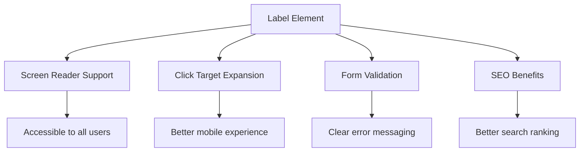
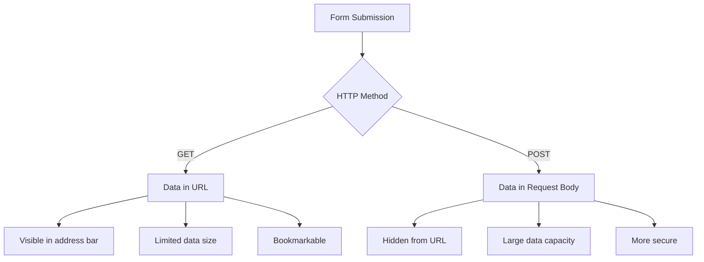
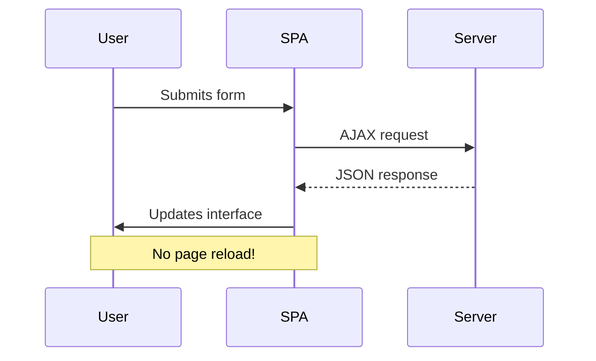
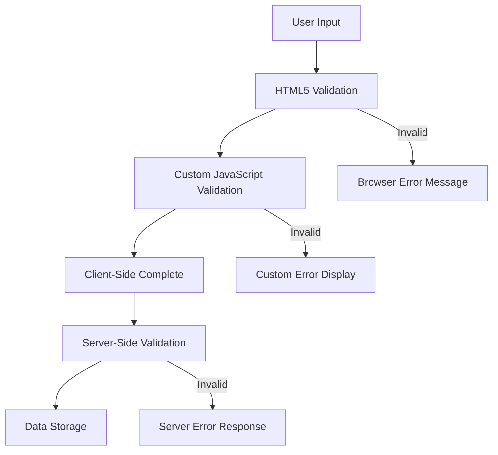
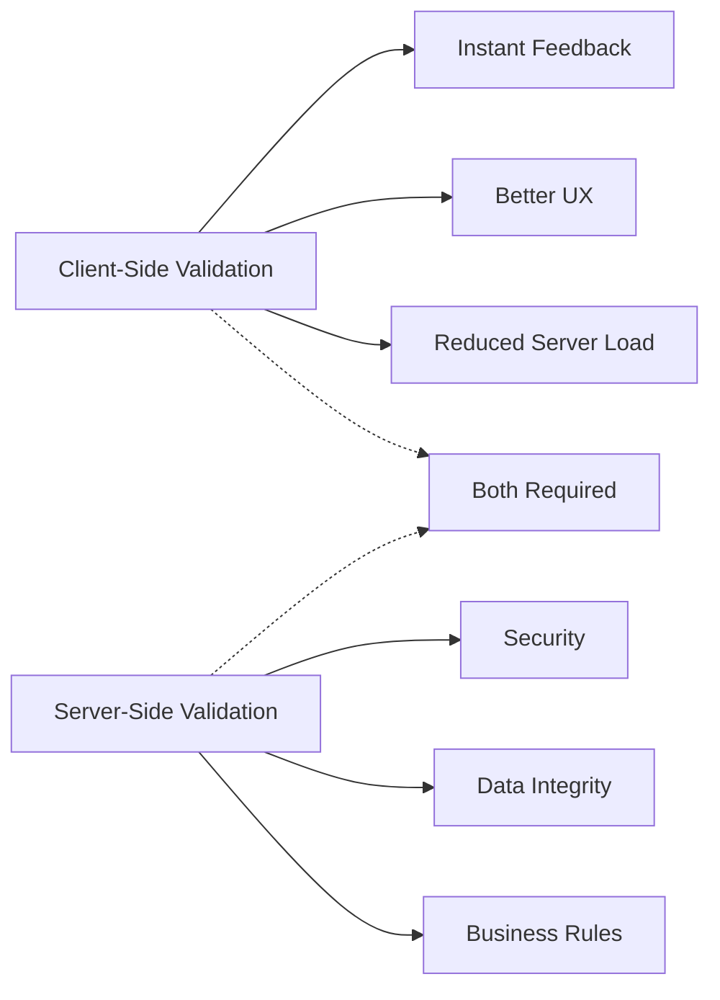

<!--
CO_OP_TRANSLATOR_METADATA:
{
  "original_hash": "b24f28fc46dd473aa9080f174182adde",
  "translation_date": "2025-10-22T17:09:03+00:00",
  "source_file": "7-bank-project/2-forms/README.md",
  "language_code": "ne"
}
-->
# बैंकिङ एप निर्माण भाग २: लगइन र दर्ता फारम निर्माण

## प्रि-लेक्चर क्विज

[प्रि-लेक्चर क्विज](https://ff-quizzes.netlify.app/web/quiz/43)

के तपाईंले कहिल्यै अनलाइन फारम भरेर इमेलको ढाँचा गलत भएको कारण अस्वीकृत भएको अनुभव गर्नुभएको छ? वा सबमिट क्लिक गर्दा सबै जानकारी हराएको? हामी सबैले यस्ता निराशाजनक अनुभवहरू सामना गरेका छौं।

फारमहरू तपाईंको प्रयोगकर्ता र तपाईंको एप्लिकेसनको कार्यक्षमताबीचको पुल हुन्। जस्तै हवाई यातायात नियन्त्रकहरूले विमानलाई सुरक्षित गन्तव्यमा पुर्‍याउन सावधानीपूर्वक प्रोटोकल प्रयोग गर्छन्, राम्रोसँग डिजाइन गरिएका फारमहरूले स्पष्ट प्रतिक्रिया दिन्छन् र महँगो गल्तीहरू रोक्छन्। खराब फारमहरूले भने प्रयोगकर्तालाई व्यस्त विमानस्थलमा गलत सञ्चारभन्दा छिटो टाढा लैजान सक्छ।

यस पाठमा, हामी तपाईंको स्थिर बैंकिङ एपलाई अन्तरक्रियात्मक एप्लिकेसनमा रूपान्तरण गर्नेछौं। तपाईंले प्रयोगकर्ता इनपुट प्रमाणित गर्ने, सर्भरसँग संवाद गर्ने, र उपयोगी प्रतिक्रिया प्रदान गर्ने फारम निर्माण गर्न सिक्नुहुनेछ। यसलाई प्रयोगकर्तालाई तपाईंको एप्लिकेसनको सुविधाहरू नेभिगेट गर्न दिने नियन्त्रण इन्टरफेस निर्माणको रूपमा सोच्नुहोस्।

पाठको अन्त्यसम्ममा, तपाईंले प्रयोगकर्तालाई निराशा होइन सफलता तर्फ मार्गदर्शन गर्ने प्रमाणिकरणसहितको पूर्ण लगइन र दर्ता प्रणाली तयार गर्न सक्नुहुनेछ।

## पूर्वापेक्षाहरू

फारम निर्माण सुरु गर्नु अघि, सुनिश्चित गर्नुहोस् कि तपाईंले सबै कुरा सही रूपमा सेट गर्नुभएको छ। यो पाठले हामीले अघिल्लो पाठमा छोडेको ठाउँबाट सुरु गर्छ, त्यसैले यदि तपाईंले अगाडि बढ्नुभएको छ भने, पहिले आधारभूत सेटअप काम गराउनुहोस्।

### आवश्यक सेटअप

| कम्पोनेन्ट | स्थिति | विवरण |
|------------|--------|--------|
| [HTML टेम्प्लेटहरू](../1-template-route/README.md) | ✅ आवश्यक | तपाईंको आधारभूत बैंकिङ एप संरचना |
| [Node.js](https://nodejs.org) | ✅ आवश्यक | सर्भरको लागि जाभास्क्रिप्ट रनटाइम |
| [बैंक API सर्भर](../api/README.md) | ✅ आवश्यक | डाटा भण्डारणको लागि ब्याकएन्ड सेवा |

> 💡 **विकास टिप**: तपाईंले दुई अलग-अलग सर्भरहरू एकै समयमा चलाउनुहुनेछ – एउटा तपाईंको फ्रन्ट-एन्ड बैंकिङ एपको लागि र अर्को ब्याकएन्ड API को लागि। यो सेटअप वास्तविक संसारको विकासलाई प्रतिबिम्बित गर्छ जहाँ फ्रन्टएन्ड र ब्याकएन्ड सेवाहरू स्वतन्त्र रूपमा सञ्चालन हुन्छन्।

### सर्भर कन्फिगरेसन

**तपाईंको विकास वातावरणमा समावेश हुनेछ:**
- **फ्रन्टएन्ड सर्भर**: तपाईंको बैंकिङ एपलाई सेवा दिन्छ (सामान्यतया पोर्ट `3000`)
- **ब्याकएन्ड API सर्भर**: डाटा भण्डारण र पुनःप्राप्ति सम्हाल्छ (पोर्ट `5000`)
- **दुवै सर्भरहरू** कुनै पनि द्वन्द्व बिना एकै समयमा चल्न सक्छन्

**तपाईंको API कनेक्शन परीक्षण गर्दै:**
```bash
curl http://localhost:5000/api
# Expected response: "Bank API v1.0.0"
```

**यदि तपाईंले API संस्करण प्रतिक्रिया देख्नुभयो भने, तपाईं अगाडि बढ्न तयार हुनुहुन्छ!**

---

## HTML फारम र नियन्त्रणहरू बुझ्दै

HTML फारमहरू तपाईंको वेब एप्लिकेसनसँग प्रयोगकर्ताहरूको संवाद गर्ने माध्यम हुन्। यसलाई १९ औं शताब्दीमा टाढा ठाउँहरूलाई जोड्ने टेलिग्राफ प्रणालीको रूपमा सोच्नुहोस् – यो प्रयोगकर्ता उद्देश्य र एप्लिकेसन प्रतिक्रियाबीचको सञ्चार प्रोटोकल हो। जब विचारपूर्वक डिजाइन गरिन्छ, तिनीहरूले गल्तीहरू समात्छन्, इनपुट ढाँचा मार्गदर्शन गर्छन्, र उपयोगी सुझावहरू प्रदान गर्छन्।

आधुनिक फारमहरू आधारभूत पाठ इनपुटभन्दा धेरै परिष्कृत छन्। HTML5 ले विशेष इनपुट प्रकारहरू प्रस्तुत गर्‍यो जसले इमेल प्रमाणिकरण, नम्बर ढाँचा, र मिति चयन स्वचालित रूपमा सम्हाल्छ। यी सुधारहरूले पहुँचयोग्यता र मोबाइल प्रयोगकर्ता अनुभवलाई फाइदा पुर्‍याउँछन्।

### आवश्यक फारम तत्वहरू

**प्रत्येक फारमलाई चाहिने निर्माण ब्लकहरू:**

```html
<!-- Basic form structure -->
<form id="userForm" method="POST">
  <label for="username">Username</label>
  <input id="username" name="username" type="text" required>
  
  <button type="submit">Submit</button>
</form>
```

**यस कोडले के गर्छ:**
- **फारम कन्टेनर सिर्जना गर्छ** अद्वितीय पहिचानसहित
- **डेटा सबमिशनको लागि HTTP विधि निर्दिष्ट गर्छ**
- **इनपुटहरूलाई पहुँचयोग्य बनाउन लेबलहरूसँग सम्बन्धित गर्छ**
- **फारम प्रक्रिया गर्न सबमिट बटन परिभाषित गर्छ**

### आधुनिक इनपुट प्रकारहरू र विशेषताहरू

| इनपुट प्रकार | उद्देश्य | उदाहरण प्रयोग |
|--------------|---------|----------------|
| `text` | सामान्य पाठ इनपुट | `<input type="text" name="username">` |
| `email` | इमेल प्रमाणिकरण | `<input type="email" name="email">` |
| `password` | लुकेको पाठ प्रविष्टि | `<input type="password" name="password">` |
| `number` | संख्यात्मक इनपुट | `<input type="number" name="balance" min="0">` |
| `tel` | फोन नम्बरहरू | `<input type="tel" name="phone">` |

> 💡 **आधुनिक HTML5 लाभ**: विशिष्ट इनपुट प्रकारहरू प्रयोग गर्दा स्वचालित प्रमाणिकरण, उपयुक्त मोबाइल किबोर्ड, र अतिरिक्त जाभास्क्रिप्ट बिना राम्रो पहुँचयोग्यता समर्थन प्रदान गर्दछ!

### बटन प्रकारहरू र व्यवहार

```html
<!-- Different button behaviors -->
<button type="submit">Save Data</button>     <!-- Submits the form -->
<button type="reset">Clear Form</button>    <!-- Resets all fields -->
<button type="button">Custom Action</button> <!-- No default behavior -->
```

**प्रत्येक बटन प्रकारले के गर्छ:**
- **सबमिट बटनहरू**: फारम सबमिशन ट्रिगर गर्छ र निर्दिष्ट अन्त बिन्दुमा डेटा पठाउँछ
- **रिसेट बटनहरू**: सबै फारम क्षेत्रहरूलाई प्रारम्भिक अवस्थामा पुनर्स्थापित गर्छ
- **सामान्य बटनहरू**: कुनै डिफल्ट व्यवहार प्रदान गर्दैन, कार्यक्षमताको लागि कस्टम जाभास्क्रिप्ट आवश्यक हुन्छ

> ⚠️ **महत्वपूर्ण नोट**: `<input>` तत्व स्व-समापन हो र बन्द गर्ने ट्याग आवश्यक छैन। आधुनिक उत्तम अभ्यास भनेको स्ल्यास बिना `<input>` लेख्नु हो।

### तपाईंको लगइन फारम निर्माण गर्दै

अब हामी आधुनिक HTML फारम अभ्यासहरू प्रदर्शन गर्ने व्यावहारिक लगइन फारम सिर्जना गर्नेछौं। हामी आधारभूत संरचनाबाट सुरु गर्नेछौं र क्रमिक रूपमा यसलाई पहुँचयोग्यता सुविधाहरू र प्रमाणिकरणसँग सुधार गर्नेछौं।

```html
<template id="login">
  <h1>Bank App</h1>
  <section>
    <h2>Login</h2>
    <form id="loginForm" novalidate>
      <div class="form-group">
        <label for="username">Username</label>
        <input id="username" name="user" type="text" required 
               autocomplete="username" placeholder="Enter your username">
      </div>
      <button type="submit">Login</button>
    </form>
  </section>
</template>
```

**यहाँ के हुन्छ:**
- **HTML5 तत्वहरूको साथ फारम संरचना गर्छ**
- **सम्बन्धित तत्वहरूलाई अर्थपूर्ण वर्गहरू भएको `div` कन्टेनरहरू प्रयोग गरेर समूह बनाउँछ**
- **लेबलहरूलाई `for` र `id` विशेषताहरू प्रयोग गरेर इनपुटहरूसँग सम्बन्धित गर्छ**
- **अधिक पहुँचयोग्य UX को लागि `autocomplete` र `placeholder` जस्ता आधुनिक विशेषताहरू समावेश गर्छ**
- **ब्राउजर डिफल्टको सट्टा जाभास्क्रिप्टसँग प्रमाणिकरण सम्हाल्न `novalidate` थप्छ**

### सही लेबलहरूको शक्ति

**आधुनिक वेब विकासका लागि लेबलहरू किन महत्त्वपूर्ण छन्:**



**सही लेबलहरूले के गर्छ:**
- **स्क्रीन रिडरहरूलाई फारम क्षेत्रहरू स्पष्ट रूपमा घोषणा गर्न सक्षम बनाउँछ**
- **क्लिकयोग्य क्षेत्र विस्तार गर्छ (लेबल क्लिक गर्दा इनपुटमा फोकस हुन्छ)**
- **मोबाइल प्रयोगकर्ताको लागि ठूलो टच लक्ष्यको साथ उपयोगिता सुधार गर्छ**
- **अर्थपूर्ण त्रुटि सन्देशहरूको साथ फारम प्रमाणिकरण समर्थन गर्छ**
- **फारम तत्वहरूलाई अर्थपूर्ण अर्थ प्रदान गरेर SEO सुधार गर्छ**

> 🎯 **पहुंचयोग्यता लक्ष्य**: प्रत्येक फारम इनपुटसँग सम्बन्धित लेबल हुनुपर्छ। यो सरल अभ्यासले तपाईंको फारमहरू सबै प्रयोगकर्ताहरू, अपाङ्गता भएका व्यक्तिहरू सहित, प्रयोग गर्न योग्य बनाउँछ र सबै प्रयोगकर्ताको अनुभव सुधार गर्छ।

### दर्ता फारम निर्माण गर्दै

दर्ता फारमले पूर्ण प्रयोगकर्ता खाता सिर्जना गर्न थप विस्तृत जानकारी आवश्यक पर्दछ। आधुनिक HTML5 सुविधाहरू र सुधारिएको पहुँचयोग्यतासहित यसलाई निर्माण गरौं।

```html
<hr/>
<h2>Register</h2>
<form id="registerForm" novalidate>
  <div class="form-group">
    <label for="user">Username</label>
    <input id="user" name="user" type="text" required 
           autocomplete="username" placeholder="Choose a username">
  </div>
  
  <div class="form-group">
    <label for="currency">Currency</label>
    <input id="currency" name="currency" type="text" value="$" 
           required maxlength="3" placeholder="USD, EUR, etc.">
  </div>
  
  <div class="form-group">
    <label for="description">Account Description</label>
    <input id="description" name="description" type="text" 
           maxlength="100" placeholder="Personal savings, checking, etc.">
  </div>
  
  <div class="form-group">
    <label for="balance">Starting Balance</label>
    <input id="balance" name="balance" type="number" value="0" 
           min="0" step="0.01" placeholder="0.00">
  </div>
  
  <button type="submit">Create Account</button>
</form>
```

**माथिको कोडमा हामीले:**
- **प्रत्येक क्षेत्रलाई राम्रो शैली र लेआउटको लागि कन्टेनर div मा व्यवस्थित गरेका छौं**
- **ब्राउजर अटोफिल समर्थनको लागि उपयुक्त `autocomplete` विशेषताहरू थपेका छौं**
- **प्रयोगकर्ता इनपुट मार्गदर्शन गर्न सहायक प्लेसहोल्डर पाठ समावेश गरेका छौं**
- **`value` विशेषता प्रयोग गरेर संवेदनशील डिफल्ट सेट गरेका छौं**
- **`required`, `maxlength`, र `min` जस्ता प्रमाणिकरण विशेषताहरू लागू गरेका छौं**
- **डेसिमल समर्थनसहित `type="number"` प्रयोग गरेका छौं**

### इनपुट प्रकारहरू र व्यवहार अन्वेषण गर्दै

**आधुनिक इनपुट प्रकारहरूले सुधारिएको कार्यक्षमता प्रदान गर्छ:**

| विशेषता | लाभ | उदाहरण |
|---------|-----|--------|
| `type="number"` | मोबाइलमा संख्यात्मक किबोर्ड | सन्तुलन प्रविष्टि सजिलो बनाउँछ |
| `step="0.01"` | दशमलव परिशुद्धता नियन्त्रण | मुद्रामा सेन्टहरू अनुमति दिन्छ |
| `autocomplete` | ब्राउजर अटोफिल | फारम पूरा गर्न छिटो |
| `placeholder` | सन्दर्भात्मक संकेतहरू | प्रयोगकर्ता अपेक्षाहरू मार्गदर्शन गर्छ |

> 🎯 **पहुंचयोग्यता चुनौती**: केवल तपाईंको किबोर्ड प्रयोग गरेर फारमहरू नेभिगेट गर्न प्रयास गर्नुहोस्! `Tab` प्रयोग गरेर क्षेत्रहरू बीच सर्नुहोस्, `Space` प्रयोग गरेर चेक बक्सहरू जाँच गर्नुहोस्, र `Enter` प्रयोग गरेर सबमिट गर्नुहोस्। यो अनुभवले तपाईंलाई स्क्रीन रिडर प्रयोगकर्ताहरूले तपाईंको फारमहरूसँग कसरी अन्तरक्रिया गर्छन् भन्ने बुझ्न मद्दत गर्छ।

## फारम सबमिशन विधिहरू बुझ्दै

जब कसैले तपाईंको फारम भर्छ र सबमिट क्लिक गर्छ, त्यो डेटा कतै जानुपर्छ – सामान्यतया सर्भरमा जसले यसलाई बचत गर्न सक्छ। यो विभिन्न तरिकामा हुन सक्छ, र कुन प्रयोग गर्ने थाहा पाउनुले पछि केही टाउको दुखाइबाट बचाउन सक्छ।

आउनुहोस्, कसैले सबमिट बटन क्लिक गर्दा वास्तवमा के हुन्छ हेर्नुहोस्।

### डिफल्ट फारम व्यवहार

पहिले, आधारभूत फारम सबमिशनसँग के हुन्छ हेर्नुहोस्:

**तपाईंको हालको फारमहरू परीक्षण गर्नुहोस्:**
1. तपाईंको फारममा *Register* बटन क्लिक गर्नुहोस्
2. तपाईंको ब्राउजरको ठेगाना बारमा परिवर्तनहरू अवलोकन गर्नुहोस्
3. पृष्ठ पुनः लोड भएको र URL मा डेटा देखा परेको नोट गर्नुहोस्


### HTTP विधिहरू तुलना



**भिन्नताहरू बुझ्दै:**

| विधि | प्रयोग केस | डेटा स्थान | सुरक्षा स्तर | आकार सीमा |
|------|-----------|------------|--------------|-----------|
| `GET` | खोज क्वेरीहरू, फिल्टरहरू | URL प्यारामिटरहरू | कम (देखिने) | ~2000 क्यारेक्टरहरू |
| `POST` | प्रयोगकर्ता खाता, संवेदनशील डेटा | अनुरोध शरीर | उच्च (लुकेको) | कुनै व्यावहारिक सीमा छैन |

**मूलभूत भिन्नताहरू बुझ्दै:**
- **GET**: फारम डेटा URL मा क्वेरी प्यारामिटरको रूपमा थप्छ (खोज कार्यहरूको लागि उपयुक्त)
- **POST**: डेटा अनुरोध शरीरमा समावेश गर्छ (संवेदनशील जानकारीको लागि आवश्यक)
- **GET सीमाहरू**: आकार प्रतिबन्ध, देखिने डेटा, स्थायी ब्राउजर इतिहास
- **POST लाभहरू**: ठूलो डेटा क्षमता, गोपनीयता सुरक्षा, फाइल अपलोड समर्थन

> 💡 **उत्तम अभ्यास**: खोज फारम र फिल्टरहरूको लागि `GET` प्रयोग गर्नुहोस् (डेटा पुनःप्राप्ति), प्रयोगकर्ता दर्ता, लगइन, र डेटा सिर्जनाको लागि `POST` प्रयोग गर्नुहोस्।

### फारम सबमिशन कन्फिगरेसन

आउनुहोस्, तपाईंको दर्ता फारमलाई POST विधि प्रयोग गरेर ब्याकएन्ड API सँग ठीकसँग संवाद गर्न कन्फिगर गरौं:

```html
<form id="registerForm" action="//localhost:5000/api/accounts" 
      method="POST" novalidate>
```

**यस कन्फिगरेसनले के गर्छ:**
- **तपाईंको API अन्त बिन्दुमा फारम सबमिशन निर्देशित गर्छ**
- **सुरक्षित डेटा प्रसारणको लागि POST विधि प्रयोग गर्छ**
- **ब्राउजर डिफल्टको सट्टा जाभास्क्रिप्टसँग प्रमाणिकरण सम्हाल्न `novalidate` समावेश गर्छ**

### फारम सबमिशन परीक्षण गर्दै

**तपाईंको फारम परीक्षण गर्न यी चरणहरू पालना गर्नुहोस्:**
1. **तपाईंको जानकारीसहित** दर्ता फारम भर्नुहोस्
2. **"Create Account" बटन क्लिक गर्नुहोस्**
3. **तपाईंको ब्राउजरमा सर्भर प्रतिक्रिया अवलोकन गर्नुहोस्**


**तपाईंले के देख्नुहुन्छ:**
- **ब्राउजरले** API अन्त बिन्दु URL मा पुनःनिर्देशित गर्छ
- **JSON प्रतिक्रिया** जसमा तपाईंको नयाँ खाता डेटा समावेश छ
- **सर्भर पुष्टि** कि खाता सफलतापूर्वक सिर्जना गरिएको छ

> 🧪 **प्रयोग समय**: उस्तै प्रयोगकर्ता नामको साथ फेरि दर्ता प्रयास गर्नुहोस्। तपाईंले के प्रतिक्रिया प्राप्त गर्नुहुन्छ? यसले तपाईंलाई सर्भरले डुप्लिकेट डेटा र त्रुटि अवस्थाहरू कसरी सम्हाल्छ भन्ने बुझ्न मद्दत गर्छ।

### JSON प्रतिक्रियाहरू बुझ्दै

**जब सर्भरले तपाईंको फारम सफलतापूर्वक प्रक्रिया गर्छ:**
```json
{
  "user": "john_doe",
  "currency": "$",
  "description": "Personal savings",
  "balance": 100,
  "id": "unique_account_id"
}
```

**यो प्रतिक्रिया पुष्टि गर्छ:**
- **तपाईंले निर्दिष्ट गरेको डेटा सहित नयाँ खाता सिर्जना गर्छ**
- **भविष्य सन्दर्भको लागि अद्वितीय पहिचान प्रदान गर्छ**
- **सत्यापनको लागि सबै खाता जानकारी फर्काउँछ**
- **डाटाबेस भण्डारण सफल भएको संकेत गर्छ**

## आधुनिक फारम ह्यान्डलिङ जाभास्क्रिप्टसँग

पारम्परिक फारम सबमिशनले पूर्ण पृष्ठ पुनः लोड गराउँछ, जस्तै प्रारम्भिक अन्तरिक्ष मिशनहरूले कोर्स सुधारको लागि पूर्ण प्रणाली रिसेट आवश्यक थियो। यसले प्रयोगकर्ता अनुभवलाई बाधा पुर्‍याउँछ र एप्लिकेसनको अवस्था गुमाउँछ।

जाभास्क्रिप्ट फारम ह्यान्डलिङले आधुनिक अन्तरिक्ष यानले प्रयोग गर्ने निरन्तर मार्गदर्शन प्रणाली जस्तै काम गर्छ – नेभिगेसन सन्दर्भ गुमाउँदा बिना वास्तविक समय समायोजनहरू गर्दै। हामी फारम सबमिशनलाई रोक्न सक्छौं, तत्काल प्रतिक्रिया प्रदान गर्न सक्छौं, त्रुटिहरूलाई सहज रूपमा सम्हाल्न सक्छौं, र प्रयोगकर्ताको एप्लिकेसनमा स्थिति कायम राख्दै सर्भर प्रतिक्रियाको आधारमा इन्टरफेस अपडेट गर्न सक्छौं।

### पृष्ठ पुनः लोड किन टाल्ने?



**जाभास्क्रिप्ट फारम ह्यान्डलिङका लाभहरू:**
- **एप्लिकेसन अवस्था र प्रयोगकर्ता सन्दर्भ कायम राख्छ**
- **तत्काल प्रतिक्रिया र लोडिङ संकेतकहरू प्रदान गर्छ**
- **गतिशील त्रुटि ह्यान्डलिङ र प्रमाणिकरण सक्षम बनाउँछ**
- **स्मूथ, एप-जस्तै प्रयोगकर्ता अनुभव सिर्जना गर्छ**
- **सर्भर प्रतिक्रियाको आधारमा सशर्त तर्क अनुमति दिन्छ**

### पारम्परिकबाट आधुनिक फारममा संक्रमण

**पारम्परिक दृष्टिकोण चुनौतीहरू:**
- **प्रयोगकर्तालाई तपाईंको एप्लिकेसनबाट टाढा लैजान्छ**
- **हालको एप्लिकेसन अवस्था र सन्दर्भ गुमाउँछ**
- **साधारण अपरेसनहरूको लागि पूर्ण पृष्ठ पुनः लोड आवश्यक छ**
- **प्रयोगकर्ता प्रतिक्रियामा सीमित नियन्त्रण प्रदान गर्छ**

**आधुनिक जाभास्क्रिप्ट दृष्टिकोण लाभहरू:**
- **प्रयोगकर्तालाई तपाईंको एप्लिकेसनभित्र राख्छ**
- **सबै एप्लिकेसन अवस्था र डेटा कायम राख्छ**
- **वास्तविक समय प्रमाणिकरण र प्रतिक्रिया सक्षम बनाउँछ**
- **प्रगतिशील सुधार र पहुँचयोग्यता समर्थन गर्छ**

### जाभास्क्रिप्ट फारम ह्यान्डलिङ कार्यान्वयन गर्दै

आउनुहोस्, पारम्परिक फारम सबमिशनलाई आधुनिक जाभास्क्रिप्ट इभेन्ट ह्यान्डलिङसँग प्रतिस्थापन गरौं:

```html
<!-- Remove the action attribute and add event handling -->
<form id="registerForm" method="POST" novalidate>
```

**तपाईंको `app.js` फाइलमा दर्ता तर्क थप्नुहोस्:**

```javascript
// Modern event-driven form handling
function register() {
  const registerForm = document.getElementById('registerForm');
  const formData = new FormData(registerForm);
  const data = Object.fromEntries(formData);
  const jsonData = JSON.stringify(data);
  
  console.log('Form data prepared:', data);
}

// Attach event listener when the page loads
document.addEventListener('DOMContentLoaded', () => {
  const registerForm = document.getElementById('registerForm');
  registerForm.addEventListener('submit', (event) => {
    event.preventDefault(); // Prevent default form submission
    register();
  });
});
```

**यहाँ के हुन्छ:**
- **डिफल्ट फारम सबमिशनलाई `event.preventDefault()` प्रयोग गरेर रोक्छ**
- **आधुनिक DOM चयन प्रयोग गरेर
- **विस्तृत त्रुटि सन्देशहरू** डिबगिङका लागि प्रदान गर्दछ  
- **सफलता र त्रुटि केसहरूका लागि** स्थिर डाटा संरचना फर्काउँछ  

### आधुनिक Fetch API को शक्ति  

**पुराना विधिहरूको तुलनामा Fetch API का फाइदाहरू:**  

| विशेषता | फाइदा | कार्यान्वयन |  
|---------|---------|----------------|  
| प्रॉमिस-आधारित | सफा असिंक्रोनस कोड | `await fetch()` |  
| अनुरोध अनुकूलन | पूर्ण HTTP नियन्त्रण | हेडरहरू, विधिहरू, बडी |  
| प्रतिक्रिया ह्यान्डलिङ | लचिलो डाटा पार्सिङ | `.json()`, `.text()`, `.blob()` |  
| त्रुटि ह्यान्डलिङ | व्यापक त्रुटि समात्ने | Try/catch ब्लकहरू |  

> 🎥 **थप जान्नुहोस्**: [Async/Await ट्युटोरियल](https://youtube.com/watch?v=YwmlRkrxvkk) - आधुनिक वेब विकासका लागि असिंक्रोनस जाभास्क्रिप्ट ढाँचाहरू बुझ्दै।  

**सर्भर संचारका लागि मुख्य अवधारणाहरू:**  
- **Async functions** सर्भर प्रतिक्रियाको प्रतीक्षा गर्न कार्यान्वयन रोक्न अनुमति दिन्छ  
- **Await keyword** असिंक्रोनस कोडलाई सिंक्रोनस कोडजस्तै पढ्न सजिलो बनाउँछ  
- **Fetch API** आधुनिक, प्रॉमिस-आधारित HTTP अनुरोधहरू प्रदान गर्दछ  
- **Error handling** सुनिश्चित गर्दछ कि तपाईंको एपले नेटवर्क समस्याहरूलाई सहज रूपमा प्रतिक्रिया दिन्छ  

### दर्ता कार्य पूरा गर्दै  

अब सबै कुरा एकसाथ ल्याएर उत्पादन-तयार दर्ता कार्य बनाऔं:  

```javascript
async function register() {
  const registerForm = document.getElementById('registerForm');
  const submitButton = registerForm.querySelector('button[type="submit"]');
  
  try {
    // Show loading state
    submitButton.disabled = true;
    submitButton.textContent = 'Creating Account...';
    
    // Process form data
    const formData = new FormData(registerForm);
    const jsonData = JSON.stringify(Object.fromEntries(formData));
    
    // Send to server
    const result = await createAccount(jsonData);
    
    if (result.error) {
      console.error('Registration failed:', result.error);
      alert(`Registration failed: ${result.error}`);
      return;
    }
    
    console.log('Account created successfully!', result);
    alert(`Welcome, ${result.user}! Your account has been created.`);
    
    // Reset form after successful registration
    registerForm.reset();
    
  } catch (error) {
    console.error('Unexpected error:', error);
    alert('An unexpected error occurred. Please try again.');
  } finally {
    // Restore button state
    submitButton.disabled = false;
    submitButton.textContent = 'Create Account';
  }
}
```
  
**यस सुधारिएको कार्यान्वयनमा समावेश छ:**  
- **दर्शनीय प्रतिक्रिया प्रदान गर्दछ** फारम सबमिशनको समयमा  
- **सबमिट बटनलाई निष्क्रिय बनाउँछ** दोहोरिने सबमिशन रोक्न  
- **दुवै अपेक्षित र अप्रत्याशित त्रुटिहरूलाई** सहज रूपमा ह्यान्डल गर्दछ  
- **प्रयोगकर्तालाई अनुकूल सफलता र त्रुटि सन्देशहरू देखाउँछ**  
- **सफल दर्तापछि फारमलाई रिसेट गर्दछ**  
- **परिणामको परवाह नगरी UI स्थिति पुनर्स्थापित गर्दछ**  

### तपाईंको कार्यान्वयन परीक्षण गर्दै  

**तपाईंको ब्राउजर डेभलपर टूल्स खोल्नुहोस् र दर्ता परीक्षण गर्नुहोस्:**  

1. **ब्राउजर कन्सोल खोल्नुहोस्** (F12 → कन्सोल ट्याब)  
2. **दर्ता फारम भर्नुहोस्**  
3. **"खाता सिर्जना गर्नुहोस्" क्लिक गर्नुहोस्**  
4. **कन्सोल सन्देशहरू र प्रयोगकर्ता प्रतिक्रिया अवलोकन गर्नुहोस्**  

  

**तपाईंले देख्नुपर्ने कुरा:**  
- **लोडिङ स्थिति** सबमिट बटनमा देखा पर्छ  
- **कन्सोल लगहरू** प्रक्रियाको विस्तृत जानकारी देखाउँछन्  
- **सफलता सन्देश** खाता सिर्जना सफल हुँदा देखा पर्छ  
- **फारम स्वतः रिसेट हुन्छ** सफल सबमिशनपछि  

> 🔒 **सुरक्षा विचार**: हाल, डाटा HTTP मार्फत यात्रा गर्दछ, जुन उत्पादनका लागि सुरक्षित छैन। वास्तविक एपहरूमा, सधैं HTTPS प्रयोग गर्नुहोस् डाटा प्रसारणलाई एन्क्रिप्ट गर्न। [HTTPS सुरक्षा](https://en.wikipedia.org/wiki/HTTPS) र प्रयोगकर्ता डाटा सुरक्षित गर्न किन यो आवश्यक छ भन्ने बारे थप जान्नुहोस्।  

## व्यापक फारम मान्यता  

फारम मान्यताले त्रुटिहरू सबमिशनपछि मात्र पत्ता लगाउने निराशाजनक अनुभवलाई रोक्छ। अन्तर्राष्ट्रिय स्पेस स्टेशनमा बहु-अतिरिक्त प्रणालीहरूजस्तै, प्रभावकारी मान्यताले सुरक्षा जाँचको बहु-स्तरहरू प्रयोग गर्दछ।  

उत्तम दृष्टिकोणले ब्राउजर-स्तरको मान्यता तत्काल प्रतिक्रिया प्रदान गर्न, जाभास्क्रिप्ट मान्यता प्रयोगकर्ता अनुभव सुधार गर्न, र सुरक्षा र डाटा अखण्डताका लागि सर्भर-स्तरको मान्यता समावेश गर्दछ। यो अतिरिक्तता प्रयोगकर्ता सन्तुष्टि र प्रणाली सुरक्षा सुनिश्चित गर्दछ।  

### मान्यता स्तरहरू बुझ्दै  


  
**बहु-स्तर मान्यता रणनीति:**  
- **HTML5 मान्यता**: तत्काल ब्राउजर-आधारित जाँच  
- **जाभास्क्रिप्ट मान्यता**: अनुकूलन तर्क र प्रयोगकर्ता अनुभव  
- **सर्भर मान्यता**: अन्तिम सुरक्षा र डाटा अखण्डता जाँच  
- **प्रगतिशील सुधार**: जाभास्क्रिप्ट निष्क्रिय भए पनि काम गर्दछ  

### HTML5 मान्यता विशेषताहरू  

**आधुनिक मान्यता उपकरणहरू तपाईंको लागि उपलब्ध:**  

| विशेषता | उद्देश्य | उदाहरण प्रयोग | ब्राउजर व्यवहार |  
|-----------|---------|---------------|------------------|  
| `required` | अनिवार्य क्षेत्रहरू | `<input required>` | खाली सबमिशन रोक्छ |  
| `minlength`/`maxlength` | पाठ लम्बाइ सीमा | `<input maxlength="20">` | क्यारेक्टर सीमा लागू गर्दछ |  
| `min`/`max` | संख्यात्मक दायरा | `<input min="0" max="1000">` | संख्या सीमा मान्य गर्दछ |  
| `pattern` | कस्टम रेगुलर एक्सप्रेसन नियमहरू | `<input pattern="[A-Za-z]+">` | विशिष्ट ढाँचाहरू मिलाउँछ |  
| `type` | डाटा प्रकार मान्यता | `<input type="email">` | ढाँचासँग सम्बन्धित मान्यता |  

### CSS मान्यता स्टाइलिङ  

**मान्यता अवस्थाहरूका लागि दृश्य प्रतिक्रिया सिर्जना गर्नुहोस्:**  

```css
/* Valid input styling */
input:valid {
  border-color: #28a745;
  background-color: #f8fff9;
}

/* Invalid input styling */
input:invalid {
  border-color: #dc3545;
  background-color: #fff5f5;
}

/* Focus states for better accessibility */
input:focus:valid {
  box-shadow: 0 0 0 0.2rem rgba(40, 167, 69, 0.25);
}

input:focus:invalid {
  box-shadow: 0 0 0 0.2rem rgba(220, 53, 69, 0.25);
}
```
  
**यी दृश्य संकेतहरूले के पूरा गर्छन्:**  
- **हरियो सीमा**: सफल मान्यता संकेत गर्दछ, मिशन कन्ट्रोलमा हरियो बत्तीहरूजस्तै  
- **रातो सीमा**: ध्यान आवश्यक मान्यता त्रुटिहरू संकेत गर्दछ  
- **फोकस हाइलाइटहरू**: वर्तमान इनपुट स्थानको लागि स्पष्ट दृश्य सन्दर्भ प्रदान गर्दछ  
- **सुसंगत स्टाइलिङ**: प्रयोगकर्ताहरूले सिक्न सक्ने पूर्वानुमानयोग्य इन्टरफेस ढाँचाहरू स्थापना गर्दछ  

> 💡 **प्रो टिप**: `:valid` र `:invalid` CSS pseudo-classes प्रयोग गरेर प्रयोगकर्ताहरू टाइप गर्दा तत्काल दृश्य प्रतिक्रिया प्रदान गर्नुहोस्, जसले उत्तरदायी र सहयोगी इन्टरफेस सिर्जना गर्दछ।  

### व्यापक मान्यता कार्यान्वयन गर्दै  

आफ्नो दर्ता फारमलाई उत्कृष्ट प्रयोगकर्ता अनुभव र डाटा गुणस्तर प्रदान गर्ने बलियो मान्यतासँग सुधार गरौं:  

```html
<form id="registerForm" method="POST" novalidate>
  <div class="form-group">
    <label for="user">Username <span class="required">*</span></label>
    <input id="user" name="user" type="text" required 
           minlength="3" maxlength="20" 
           pattern="[a-zA-Z0-9_]+" 
           autocomplete="username"
           title="Username must be 3-20 characters, letters, numbers, and underscores only">
    <small class="form-text">Choose a unique username (3-20 characters)</small>
  </div>
  
  <div class="form-group">
    <label for="currency">Currency <span class="required">*</span></label>
    <input id="currency" name="currency" type="text" required 
           value="$" maxlength="3" 
           pattern="[A-Z$€£¥₹]+" 
           title="Enter a valid currency symbol or code">
    <small class="form-text">Currency symbol (e.g., $, €, £)</small>
  </div>
  
  <div class="form-group">
    <label for="description">Account Description</label>
    <input id="description" name="description" type="text" 
           maxlength="100" 
           placeholder="Personal savings, checking, etc.">
    <small class="form-text">Optional description (up to 100 characters)</small>
  </div>
  
  <div class="form-group">
    <label for="balance">Starting Balance</label>
    <input id="balance" name="balance" type="number" 
           value="0" min="0" step="0.01" 
           title="Enter a positive number for your starting balance">
    <small class="form-text">Initial account balance (minimum $0.00)</small>
  </div>
  
  <button type="submit">Create Account</button>
</form>
```
  
**सुधारिएको मान्यता बुझ्दै:**  
- **अनिवार्य क्षेत्र सूचकहरूलाई सहायक विवरणहरूसँग मिलाउँछ**  
- **ढाँचाको मान्यताका लागि `pattern` विशेषताहरू समावेश गर्दछ**  
- **सहजता र टूलटिप्सका लागि `title` विशेषताहरू प्रदान गर्दछ**  
- **प्रयोगकर्ता इनपुट मार्गदर्शन गर्न सहायक पाठ थप्छ**  
- **बेहतर पहुँचका लागि सेम्यान्टिक HTML संरचना प्रयोग गर्दछ**  

### उन्नत मान्यता नियमहरू  

**प्रत्येक मान्यता नियमले के पूरा गर्छ:**  

| क्षेत्र | मान्यता नियमहरू | प्रयोगकर्ता लाभ |  
|-------|------------------|--------------|  
| प्रयोगकर्ता नाम | `required`, `minlength="3"`, `maxlength="20"`, `pattern="[a-zA-Z0-9_]+"` | मान्य, अद्वितीय पहिचान सुनिश्चित गर्दछ |  
| मुद्रा | `required`, `maxlength="3"`, `pattern="[A-Z$€£¥₹]+"` | सामान्य मुद्रा प्रतीकहरू स्वीकार गर्दछ |  
| ब्यालेन्स | `min="0"`, `step="0.01"`, `type="number"` | नकारात्मक ब्यालेन्स रोक्छ |  
| विवरण | `maxlength="100"` | उचित लम्बाइ सीमा |  

### मान्यता व्यवहार परीक्षण गर्दै  

**यी मान्यता परिदृश्यहरू प्रयास गर्नुहोस्:**  
1. **खाली अनिवार्य क्षेत्रहरूसँग फारम सबमिट गर्नुहोस्**  
2. **३ क्यारेक्टरभन्दा छोटो प्रयोगकर्ता नाम प्रविष्ट गर्नुहोस्**  
3. **प्रयोगकर्ता नाम क्षेत्रमा विशेष क्यारेक्टरहरू प्रयास गर्नुहोस्**  
4. **नकारात्मक ब्यालेन्स रकम प्रविष्ट गर्नुहोस्**  

  

**तपाईंले अवलोकन गर्ने कुरा:**  
- **ब्राउजरले** देशी मान्यता सन्देशहरू देखाउँछ  
- **स्टाइलिङ परिवर्तनहरू** `:valid` र `:invalid` अवस्थाहरूमा आधारित हुन्छन्  
- **सबमिशन रोकिन्छ** जबसम्म सबै मान्यताहरू पास गर्दैनन्  
- **फोकस स्वतः** पहिलो अमान्य क्षेत्रमा सर्छ  

### क्लाइन्ट-साइड बनाम सर्भर-साइड मान्यता  


  
**दुवै स्तर किन आवश्यक छ:**  
- **क्लाइन्ट-साइड मान्यता**: तत्काल प्रतिक्रिया प्रदान गर्दछ र प्रयोगकर्ता अनुभव सुधार गर्दछ  
- **सर्भर-साइड मान्यता**: सुरक्षा सुनिश्चित गर्दछ र जटिल व्यापार नियमहरू ह्यान्डल गर्दछ  
- **संयुक्त दृष्टिकोण**: बलियो, प्रयोगकर्ता-अनुकूल, र सुरक्षित एप्लिकेसनहरू सिर्जना गर्दछ  
- **प्रगतिशील सुधार**: जाभास्क्रिप्ट निष्क्रिय भए पनि काम गर्दछ  

> 🛡️ **सुरक्षा सम्झना**: केवल क्लाइन्ट-साइड मान्यतामा विश्वास नगर्नुहोस्! दुर्भावनापूर्ण प्रयोगकर्ताहरूले क्लाइन्ट-साइड जाँचहरू बाइपास गर्न सक्छन्, त्यसैले सुरक्षा र डाटा अखण्डताका लागि सर्भर-साइड मान्यता आवश्यक छ।  

---  

## GitHub Copilot Agent Challenge 🚀  

Agent मोड प्रयोग गरेर निम्न चुनौती पूरा गर्नुहोस्:  

**विवरण:** दर्ता फारमलाई व्यापक क्लाइन्ट-साइड मान्यता र प्रयोगकर्ता प्रतिक्रियासँग सुधार गर्नुहोस्। यो चुनौतीले फारम मान्यता, त्रुटि ह्यान्डलिङ, र अन्तरक्रियात्मक प्रतिक्रियासँग प्रयोगकर्ता अनुभव सुधार गर्ने अभ्यास गर्न मद्दत गर्नेछ।  

**प्रेरणा:** दर्ता फारमका लागि पूर्ण मान्यता प्रणाली सिर्जना गर्नुहोस् जसमा समावेश छ: १) प्रयोगकर्ताले टाइप गर्दा प्रत्येक क्षेत्रको लागि वास्तविक-समय मान्यता प्रतिक्रिया, २) प्रत्येक इनपुट क्षेत्रको तल देखिने कस्टम मान्यता सन्देशहरू, ३) मिल्दो मान्यता भएको पासवर्ड पुष्टि क्षेत्र, ४) मान्य क्षेत्रहरूको लागि हरियो चेकमार्कहरू र अमान्य क्षेत्रहरूको लागि रातो चेतावनीहरूजस्ता दृश्य संकेतहरू, ५) सबै मान्यताहरू पास भएपछि मात्र सक्षम हुने सबमिट बटन। HTML5 मान्यता विशेषताहरू, CSS मान्यता अवस्थाहरूको लागि स्टाइलिङ, र अन्तरक्रियात्मक व्यवहारका लागि जाभास्क्रिप्ट प्रयोग गर्नुहोस्।  

[Agent मोड](https://code.visualstudio.com/blogs/2025/02/24/introducing-copilot-agent-mode) बारे थप जान्नुहोस्।  

## 🚀 चुनौती  

यदि प्रयोगकर्ता पहिले नै अवस्थित छ भने HTML मा त्रुटि सन्देश देखाउनुहोस्।  

यहाँ CSS शैलीहरू थपेपछि अन्तिम लगइन पृष्ठ कस्तो देखिन सक्छ भन्ने उदाहरण छ:  

  

## पोस्ट-व्याख्यान क्विज  

[पोस्ट-व्याख्यान क्विज](https://ff-quizzes.netlify.app/web/quiz/44)  

## समीक्षा र आत्म-अध्ययन  

डेभलपरहरूले फारम निर्माण प्रयासहरूमा, विशेष गरी मान्यता रणनीतिहरूमा धेरै रचनात्मक भएका छन्। [CodePen](https://codepen.com) हेरेर विभिन्न फारम प्रवाहहरूको बारेमा जान्नुहोस्; के तपाईं केही रोचक र प्रेरणादायक फारमहरू फेला पार्न सक्नुहुन्छ?  

## असाइनमेन्ट  

[तपाईंको बैंक एपलाई शैली दिनुहोस्](assignment.md)  

---

**अस्वीकरण**:  
यो दस्तावेज़ AI अनुवाद सेवा [Co-op Translator](https://github.com/Azure/co-op-translator) प्रयोग गरेर अनुवाद गरिएको छ। हामी शुद्धताको लागि प्रयास गर्छौं, तर कृपया ध्यान दिनुहोस् कि स्वचालित अनुवादमा त्रुटिहरू वा अशुद्धताहरू हुन सक्छ। यसको मूल भाषा मा रहेको दस्तावेज़लाई आधिकारिक स्रोत मानिनुपर्छ। महत्वपूर्ण जानकारीको लागि, व्यावसायिक मानव अनुवाद सिफारिस गरिन्छ। यस अनुवादको प्रयोगबाट उत्पन्न हुने कुनै पनि गलतफहमी वा गलत व्याख्याको लागि हामी जिम्मेवार हुने छैनौं।