# बैंकिङ एप निर्माण भाग २: लगइन र दर्ता फारम निर्माण

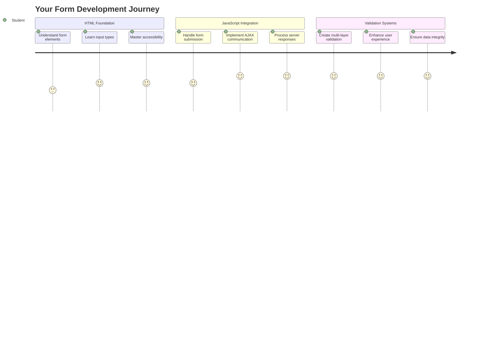

## प्रि-लेक्चर क्विज

[प्रि-लेक्चर क्विज](https://ff-quizzes.netlify.app/web/quiz/43)

के तपाईंले कहिल्यै अनलाइन फारम भरेर इमेलको ढाँचा गलत भएको कारण अस्वीकृत भएको अनुभव गर्नुभएको छ? वा सबमिट क्लिक गर्दा सबै जानकारी हराएको छ? हामी सबैले यस्ता निराशाजनक अनुभवहरू सामना गरेका छौं।

फारमहरू तपाईंको प्रयोगकर्ता र तपाईंको एप्लिकेसनको कार्यक्षमताबीचको पुल हुन्। जस्तै हवाई यातायात नियन्त्रकहरूले विमानलाई सुरक्षित गन्तव्यमा पुर्‍याउन सावधानीपूर्वक प्रोटोकलहरू प्रयोग गर्छन्, राम्रोसँग डिजाइन गरिएका फारमहरूले स्पष्ट प्रतिक्रिया दिन्छन् र महँगो गल्तीहरू रोक्छन्। अर्कोतर्फ, खराब फारमहरूले प्रयोगकर्ताहरूलाई व्यस्त विमानस्थलमा गलत सञ्चारको जस्तै छिटो टाढा पुर्‍याउन सक्छ।

यस पाठमा, हामी तपाईंको स्थिर बैंकिङ एपलाई अन्तरक्रियात्मक एप्लिकेसनमा रूपान्तरण गर्नेछौं। तपाईंले प्रयोगकर्ताको इनपुटलाई मान्य बनाउने, सर्भरहरूसँग संवाद गर्ने, र उपयोगी प्रतिक्रिया प्रदान गर्ने फारमहरू निर्माण गर्न सिक्नुहुनेछ। यसलाई प्रयोगकर्ताहरूलाई तपाईंको एप्लिकेसनको सुविधाहरू नेभिगेट गर्न अनुमति दिने नियन्त्रण इन्टरफेस निर्माणको रूपमा सोच्नुहोस्।

पाठको अन्त्यसम्ममा, तपाईंले प्रयोगकर्ताहरूलाई निराशा होइन, सफलतामा मार्गदर्शन गर्ने मान्यतासहितको पूर्ण लगइन र दर्ता प्रणाली तयार गर्नुहुनेछ।

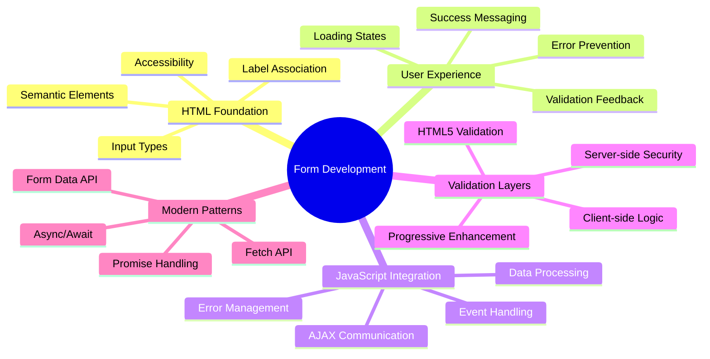

## पूर्वापेक्षाहरू

फारमहरू निर्माण गर्न सुरु गर्नु अघि, सुनिश्चित गर्नुहोस् कि तपाईंले सबै कुरा सही रूपमा सेट गर्नुभएको छ। यो पाठले हामीले अघिल्लो पाठमा छोडेको ठाउँबाट सुरु गर्दछ, त्यसैले यदि तपाईंले अगाडि बढ्नुभएको छ भने, तपाईंले पहिले आधारभूत कुराहरू काम गर्न फर्कन चाहनुहुन्छ।

### आवश्यक सेटअप

| कम्पोनेन्ट | स्थिति | विवरण |
|-----------|--------|-------------|
| [HTML टेम्प्लेटहरू](../1-template-route/README.md) | ✅ आवश्यक | तपाईंको आधारभूत बैंकिङ एप संरचना |
| [Node.js](https://nodejs.org) | ✅ आवश्यक | सर्भरको लागि जाभास्क्रिप्ट रनटाइम |
| [बैंक API सर्भर](../api/README.md) | ✅ आवश्यक | डाटा भण्डारणको लागि ब्याकएन्ड सेवा |

> 💡 **विकास टिप**: तपाईंले दुई अलग सर्भरहरू एकै समयमा चलाउनुहुनेछ - एउटा तपाईंको फ्रन्ट-एन्ड बैंकिङ एपको लागि र अर्को ब्याकएन्ड API को लागि। यो सेटअप वास्तविक संसारको विकासलाई प्रतिबिम्बित गर्दछ जहाँ फ्रन्टएन्ड र ब्याकएन्ड सेवाहरू स्वतन्त्र रूपमा सञ्चालन गर्छन्।

### सर्भर कन्फिगरेसन

**तपाईंको विकास वातावरणमा समावेश हुनेछ:**
- **फ्रन्टएन्ड सर्भर**: तपाईंको बैंकिङ एपलाई सेवा दिन्छ (सामान्यतया पोर्ट `3000`)
- **ब्याकएन्ड API सर्भर**: डाटा भण्डारण र पुनःप्राप्ति सम्हाल्छ (पोर्ट `5000`)
- **दुबै सर्भरहरू** कुनै द्वन्द्व बिना एकै समयमा चल्न सक्छन्

**तपाईंको API कनेक्शन परीक्षण गर्दै:**
```bash
curl http://localhost:5000/api
# Expected response: "Bank API v1.0.0"
```

**यदि तपाईंले API संस्करण प्रतिक्रिया देख्नुभयो भने, तपाईं अगाडि बढ्न तयार हुनुहुन्छ!**

---

## HTML फारमहरू र नियन्त्रणहरू बुझ्दै

HTML फारमहरू तपाईंको वेब एप्लिकेसनसँग प्रयोगकर्ताहरूले संवाद गर्ने तरिका हो। यसलाई १९ औं शताब्दीमा टाढा ठाउँहरूलाई जोड्ने टेलिग्राफ प्रणालीको रूपमा सोच्नुहोस् - यो प्रयोगकर्ता उद्देश्य र एप्लिकेसन प्रतिक्रियाबीचको सञ्चार प्रोटोकल हो। जब विचारपूर्वक डिजाइन गरिन्छ, तिनीहरूले गल्तीहरू समात्छन्, इनपुट ढाँचालाई मार्गदर्शन गर्छन्, र उपयोगी सुझावहरू प्रदान गर्छन्।

आधुनिक फारमहरू आधारभूत पाठ इनपुटहरू भन्दा धेरै परिष्कृत छन्। HTML5 ले विशेष इनपुट प्रकारहरू प्रस्तुत गर्‍यो जसले स्वचालित रूपमा इमेल मान्यता, संख्या ढाँचा, र मिति चयन सम्हाल्छ। यी सुधारहरूले पहुँचयोग्यता र मोबाइल प्रयोगकर्ता अनुभवलाई फाइदा पुर्‍याउँछन्।

### आवश्यक फारम तत्वहरू

**प्रत्येक फारमलाई आवश्यक पर्ने निर्माण ब्लकहरू:**

```html
<!-- Basic form structure -->
<form id="userForm" method="POST">
  <label for="username">Username</label>
  <input id="username" name="username" type="text" required>
  
  <button type="submit">Submit</button>
</form>
```

**यस कोडले के गर्छ:**
- **फारम कन्टेनर** एक अद्वितीय पहिचानकर्तासँग सिर्जना गर्दछ
- **डेटा सबमिशनको लागि HTTP विधि निर्दिष्ट गर्दछ**
- **एक्सेसिबिलिटीको लागि इनपुटहरूसँग लेबलहरू सम्बन्धित गर्दछ**
- **फारम प्रक्रिया गर्न सबमिट बटन परिभाषित गर्दछ**

### आधुनिक इनपुट प्रकारहरू र विशेषताहरू

| इनपुट प्रकार | उद्देश्य | उदाहरण प्रयोग |
|------------|---------|---------------|
| `text` | सामान्य पाठ इनपुट | `<input type="text" name="username">` |
| `email` | इमेल मान्यता | `<input type="email" name="email">` |
| `password` | लुकेको पाठ प्रविष्टि | `<input type="password" name="password">` |
| `number` | संख्यात्मक इनपुट | `<input type="number" name="balance" min="0">` |
| `tel` | फोन नम्बरहरू | `<input type="tel" name="phone">` |

> 💡 **आधुनिक HTML5 फाइदा**: विशिष्ट इनपुट प्रकारहरू प्रयोग गर्दा स्वचालित मान्यता, उपयुक्त मोबाइल किबोर्डहरू, र अतिरिक्त जाभास्क्रिप्ट बिना राम्रो पहुँचयोग्यता समर्थन प्रदान गर्दछ!

### बटन प्रकारहरू र व्यवहार

```html
<!-- Different button behaviors -->
<button type="submit">Save Data</button>     <!-- Submits the form -->
<button type="reset">Clear Form</button>    <!-- Resets all fields -->
<button type="button">Custom Action</button> <!-- No default behavior -->
```

**प्रत्येक बटन प्रकारले के गर्छ:**
- **सबमिट बटनहरू**: फारम सबमिशन ट्रिगर गर्दछ र निर्दिष्ट अन्तबिन्दुमा डेटा पठाउँछ
- **रिसेट बटनहरू**: सबै फारम फिल्डहरूलाई प्रारम्भिक अवस्थामा पुनर्स्थापित गर्दछ
- **सामान्य बटनहरू**: कुनै डिफल्ट व्यवहार प्रदान गर्दैन, कार्यक्षमताको लागि कस्टम जाभास्क्रिप्ट आवश्यक छ

> ⚠️ **महत्वपूर्ण नोट**: `<input>` तत्व स्व-समापन हो र बन्द गर्ने ट्याग आवश्यक छैन। आधुनिक उत्तम अभ्यास भनेको स्ल्यास बिना `<input>` लेख्नु हो।

### तपाईंको लगइन फारम निर्माण गर्दै

अब हामी आधुनिक HTML फारम अभ्यासहरू प्रदर्शन गर्ने व्यावहारिक लगइन फारम सिर्जना गरौं। हामी आधारभूत संरचनाबाट सुरु गर्नेछौं र क्रमशः यसलाई पहुँचयोग्यता सुविधाहरू र मान्यतासँग सुधार गर्नेछौं।

```html
<template id="login">
  <h1>Bank App</h1>
  <section>
    <h2>Login</h2>
    <form id="loginForm" novalidate>
      <div class="form-group">
        <label for="username">Username</label>
        <input id="username" name="user" type="text" required 
               autocomplete="username" placeholder="Enter your username">
      </div>
      <button type="submit">Login</button>
    </form>
  </section>
</template>
```

**यहाँ के हुन्छ:**
- **HTML5 तत्वहरू प्रयोग गरेर फारम संरचना बनाउँछ**
- **सम्बन्धित तत्वहरूलाई अर्थपूर्ण वर्गहरू भएको `div` कन्टेनरहरू प्रयोग गरेर समूह बनाउँछ**
- **लेबलहरूलाई `for` र `id` विशेषताहरू प्रयोग गरेर इनपुटहरूसँग सम्बन्धित गर्दछ**
- **बेहतर UX को लागि `autocomplete` र `placeholder` जस्ता आधुनिक विशेषताहरू समावेश गर्दछ**
- **ब्राउजर डिफल्टको सट्टा जाभास्क्रिप्टसँग मान्यता सम्हाल्न `novalidate` थप्छ**

### सही लेबलहरूको शक्ति

**आधुनिक वेब विकासको लागि लेबलहरू किन महत्त्वपूर्ण छन्:**

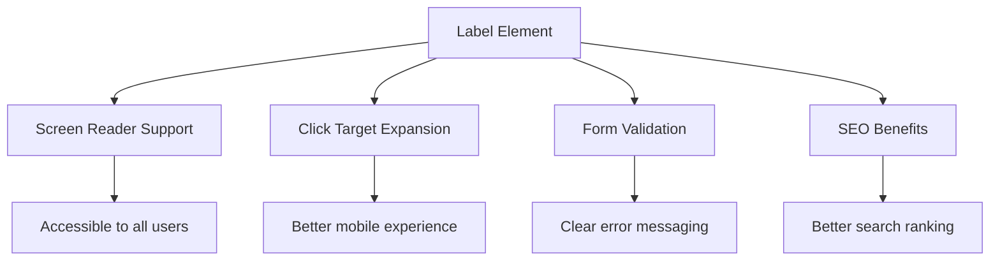

**सही लेबलहरूले के गर्छ:**
- **स्क्रिन रिडरहरूलाई फारम फिल्डहरू स्पष्ट रूपमा घोषणा गर्न सक्षम बनाउँछ**
- **क्लिकयोग्य क्षेत्र विस्तार गर्दछ (लेबल क्लिक गर्दा इनपुटमा फोकस हुन्छ)**
- **मोबाइल प्रयोगयोग्यतामा सुधार गर्दछ ठूलो टच लक्ष्यहरूसँग**
- **अर्थपूर्ण त्रुटि सन्देशहरूसँग फारम मान्यतालाई समर्थन गर्दछ**
- **फारम तत्वहरूलाई अर्थपूर्ण अर्थ प्रदान गरेर SEO सुधार गर्दछ**

> 🎯 **पहुंचयोग्यता लक्ष्य**: प्रत्येक फारम इनपुटसँग सम्बन्धित लेबल हुनुपर्छ। यो सरल अभ्यासले तपाईंका फारमहरू सबैका लागि प्रयोगयोग्य बनाउँछ, अपाङ्गता भएका प्रयोगकर्ताहरू सहित, र सबै प्रयोगकर्ताहरूको अनुभव सुधार गर्दछ।

### दर्ता फारम निर्माण गर्दै

दर्ता फारमले पूर्ण प्रयोगकर्ता खाता सिर्जना गर्न विस्तृत जानकारी आवश्यक पर्दछ। आधुनिक HTML5 सुविधाहरू र सुधारिएको पहुँचयोग्यतासँग यसलाई निर्माण गरौं।

```html
<hr/>
<h2>Register</h2>
<form id="registerForm" novalidate>
  <div class="form-group">
    <label for="user">Username</label>
    <input id="user" name="user" type="text" required 
           autocomplete="username" placeholder="Choose a username">
  </div>
  
  <div class="form-group">
    <label for="currency">Currency</label>
    <input id="currency" name="currency" type="text" value="$" 
           required maxlength="3" placeholder="USD, EUR, etc.">
  </div>
  
  <div class="form-group">
    <label for="description">Account Description</label>
    <input id="description" name="description" type="text" 
           maxlength="100" placeholder="Personal savings, checking, etc.">
  </div>
  
  <div class="form-group">
    <label for="balance">Starting Balance</label>
    <input id="balance" name="balance" type="number" value="0" 
           min="0" step="0.01" placeholder="0.00">
  </div>
  
  <button type="submit">Create Account</button>
</form>
```

**माथिको कोडमा हामीले:**
- **बेहतर स्टाइल र लेआउटको लागि प्रत्येक फिल्डलाई कन्टेनर `div` मा व्यवस्थित गरेका छौं**
- **ब्राउजर अटोफिल समर्थनको लागि उपयुक्त `autocomplete` विशेषताहरू थपेका छौं**
- **प्रयोगकर्ताको इनपुटलाई मार्गदर्शन गर्न उपयोगी `placeholder` पाठ समावेश गरेका छौं**
- **`value` विशेषता प्रयोग गरेर संवेदनशील डिफल्ट सेट गरेका छौं**
- **`required`, `maxlength`, र `min` जस्ता मान्यता विशेषताहरू लागू गरेका छौं**
- **डेसिमल समर्थनसहित `type="number"` प्रयोग गरेका छौं**

### इनपुट प्रकारहरू र व्यवहार अन्वेषण गर्दै

**आधुनिक इनपुट प्रकारहरूले सुधारिएको कार्यक्षमता प्रदान गर्दछ:**

| विशेषता | फाइदा | उदाहरण |
|---------|---------|----------|
| `type="number"` | मोबाइलमा संख्यात्मक किबोर्ड | सन्तुलन प्रविष्टि सजिलो |
| `step="0.01"` | दशमलव परिशुद्धता नियन्त्रण | मुद्रामा सेन्टहरू अनुमति दिन्छ |
| `autocomplete` | ब्राउजर अटोफिल | फारम पूरा गर्न छिटो |
| `placeholder` | सन्दर्भात्मक संकेतहरू | प्रयोगकर्ताको अपेक्षालाई मार्गदर्शन गर्दछ |

> 🎯 **पहुंचयोग्यता चुनौती**: केवल तपाईंको किबोर्ड प्रयोग गरेर फारमहरू नेभिगेट गर्न प्रयास गर्नुहोस्! `Tab` प्रयोग गरेर फिल्डहरू बीच सर्नुहोस्, `Space` प्रयोग गरेर चेक बक्सहरू जाँच गर्नुहोस्, र `Enter` प्रयोग गरेर सबमिट गर्नुहोस्। यो अनुभवले तपाईंलाई स्क्रिन रिडर प्रयोगकर्ताहरूले तपाईंका फारमहरूसँग कसरी अन्तरक्रिया गर्छन् भन्ने बुझ्न मद्दत गर्दछ।

### 🔄 **शैक्षिक जाँच**
**फारमको आधारभूत बुझाइ**: जाभास्क्रिप्ट कार्यान्वयन गर्नु अघि सुनिश्चित गर्नुहोस् कि तपाईंले बुझ्नुभएको छ:
- ✅ कसरी अर्थपूर्ण HTML पहुँचयोग्य फारम संरचना सिर्जना गर्दछ
- ✅ किन इनपुट प्रकारहरू मोबाइल किबोर्ड र मान्यताको लागि महत्त्वपूर्ण छन्
- ✅ लेबलहरू र फारम नियन्त्रणहरू बीचको सम्बन्ध
- ✅ फारम विशेषताहरूले ब्राउजरको डिफल्ट व्यवहारलाई कसरी असर गर्छ

**छिटो आत्म-परीक्षण**: यदि तपाईंले जाभास्क्रिप्ट ह्यान्डलिङ बिना फारम सबमिट गर्नुभयो भने के हुन्छ?
*उत्तर: ब्राउजरले डिफल्ट सबमिशन प्रदर्शन गर्दछ, सामान्यतया कार्य URL मा पुनःनिर्देशन गर्दै*

**HTML5 फारम लाभहरू**: आधुनिक फारमहरूले प्रदान गर्छन्:
- **निर्मित मान्यता**: स्वचालित इमेल र संख्या ढाँचा जाँच
- **मोबाइल अनुकूलन**: विभिन्न इनपुट प्रकारहरूको लागि उपयुक्त किबोर्डहरू
- **पहुंचयोग्यता**: स्क्रिन रिडर समर्थन र किबोर्ड नेभिगेसन
- **प्रगतिशील सुधार**: जाभास्क्रिप्ट अक्षम हुँदा पनि काम गर्दछ

## फारम सबमिशन विधिहरू बुझ्दै

जब कसैले तपाईंको फारम भर्छ र सबमिट क्लिक गर्छ, त्यो डेटा कतै जानुपर्छ – सामान्यतया सर्भरमा जसले यसलाई बचत गर्न सक्छ। यो विभिन्न तरिकाहरूमा हुन सक्छ, र कुन प्रयोग गर्ने थाहा पाउनुले पछि केही समस्याहरूबाट बच्न सक्छ।

आउनुहोस्, कसैले सबमिट बटन क्लिक गर्दा वास्तवमा के हुन्छ भनेर हेरौं।

### डिफल्ट फारम व्यवहार

पहिले, आधारभूत फारम सबमिशनसँग के हुन्छ भनेर अवलोकन गरौं:

**तपाईंका हालका फारमहरू परीक्षण गर्नुहोस्:**
1. तपाईंको फारममा *दर्ता* बटन क्लिक गर्नुहोस्
2. तपाईंको ब्राउजरको ठेगाना पट्टीमा परिवर्तनहरू अवलोकन गर्नुहोस्
3. पृष्ठ पुनः लोड भएको र URL मा डेटा देखा परेको नोट गर्नुहोस्


### HTTP विधिहरूको तुलना

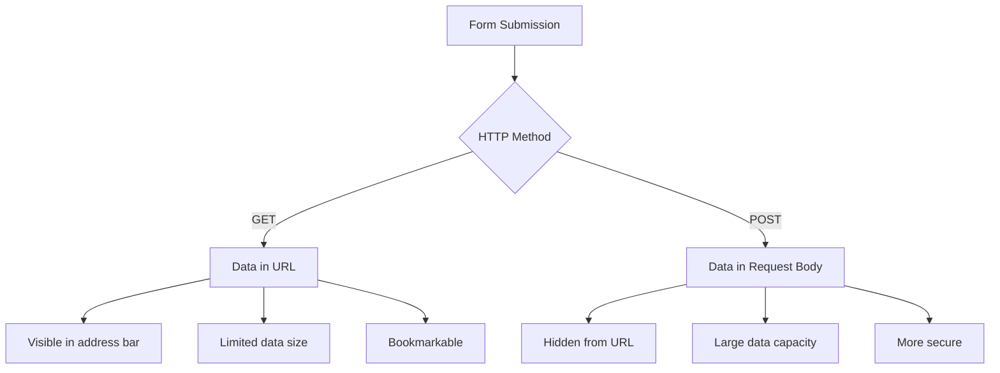

**भिन्नताहरू बुझ्दै:**

| विधि | प्रयोग केस | डाटा स्थान | सुरक्षा स्तर | आकार सीमा |
|--------|----------|---------------|----------------|-------------|
| `GET` | खोज क्वेरीहरू, फिल्टरहरू | URL प्यारामिटरहरू | कम (देखिने) | ~2000 क्यारेक्टरहरू |
| `POST` | प्रयोगकर्ता खाता, संवेदनशील डेटा | अनुरोध शरीर | उच्च (लुकेको) | कुनै व्यावहारिक सीमा छैन |

**मूलभूत भिन्नताहरू बुझ्दै:**
- **GET**: फारम डेटा URL मा क्वेरी प्यारामिटरहरू रूपमा थप्छ (खोज कार्यहरूको लागि उपयुक्त)
- **POST**: डेटा अनुरोध शरीरमा समावेश गर्दछ (संवेदनशील जानकारीको लागि आवश्यक)
- **GET सीमाहरू**: आकार प्रतिबन्ध, देखिने डेटा, स्थायी ब्राउजर इतिहास
- **POST लाभहरू**: ठूलो डेटा क्षमता, गोपनीयता सुरक्षा, फाइल अपलोड समर्थन

> 💡 **उत्तम अभ्यास**: खोज फारमहरू र फिल्टरहरूको लागि `GET` प्रयोग गर्नुहोस् (डाटा पुनःप्राप्ति), प्रयोगकर्ता दर्ता, लगइन, र डाटा सिर्जनाको लागि `POST` प्रयोग गर्नुहोस्।

### फारम सबमिशन कन्फिगर गर्दै

आउनुहोस् तपाईंको दर्ता फारमलाई POST विधि प्रयोग गरेर ब्याकएन्ड API सँग ठीकसँग संवाद गर्न कन्फिगर गरौं:

```html
<form id="registerForm" action="//localhost:5000/api/accounts" 
      method="POST" novalidate>
```

**यस कन्फिगरेसनले के गर्छ:**
- **तपाईंको API अन्तबिन्दुमा फारम सबमिशन निर्देशित गर्दछ**
- **सुरक्षित डेटा प्रसारणको लागि POST विधि प्रयोग गर्दछ**
- **ब्राउजर डिफल्ट मान्यता सम्हाल्न `novalidate` समावेश गर्दछ**

### फारम सबमिशन परीक्षण गर्दै

**तपाईंको फारम परीक्षण गर्न यी चरणहरू पालना गर्नुहोस्:**
1. **दर्ता फारम भर्नुहोस्** तपाईंको जानकारीसँग
2. **"खाता सिर्जना गर्नुहोस्" बटन क्लिक गर्नुहोस्**
3. **तपाईंको ब्राउजरमा सर्भर प्रतिक्रिया अवलोकन गर्नुहोस्**

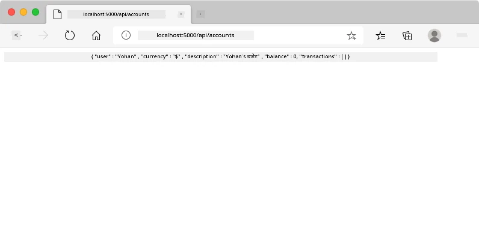

**तपाईंले के देख्नुहुन्छ:**
- **ब्राउजर पुनःनिर्देशन** API अन्तबिन्दु URL मा
- **JSON प्रतिक्रिया** तपाईंको नयाँ सिर्जित खाता डेटा समावेश गर्दै
- **सर्भर पुष्टि** कि खाता सफलतापूर्वक सिर्जना गरिएको छ

> 🧪 **प्रयोग समय**: उही प्रयोगकर्ता नामसँग फेरि दर्ता गर्न प्रयास गर्नुहोस्। तपाईंले कस्तो प्रतिक्रिया प्राप्त गर्नुहुन्छ? यसले तपाईंलाई सर्भरले डुप्लिकेट डेटा र त्रुटि अवस्थाहरू कसरी सम्हाल्छ भन्ने बुझ्न मद्दत गर्दछ।

### JSON प्रतिक्रियाहरू बुझ्दै

**जब सर्भरले तपाईंको फारम सफलतापूर्वक प्रक्रिया गर्छ:**
```json
{
  "user": "john_doe",
  "currency": "$",
  "description": "Personal savings",
  "balance": 100,
  "id": "unique_account_id"
}
```

**यो प्रतिक्रिया पुष्टि गर्दछ:**
- **तपाईंको निर्दिष्ट डेटा प्रयोग गरेर नयाँ खाता सिर्जना गर्दछ**
- **भविष्य सन्दर्भको लागि अद्वितीय पहिचानकर्ता असाइन गर्दछ**
- **सत्यापनको लागि सबै खाता जानकारी फर्काउँछ**
- **डाटाबेस भण्डारण सफल भएको संकेत गर्दछ**

## आधुनिक फारम ह्यान्डलिङ जाभास्क्रिप्टसँग

परम्परागत फारम सबमिशनले पूर्ण पृष्ठ पुनः लोड गराउँछ, जस्तै प्रारम्भिक अन्तरिक्ष मिशनहरूले कोर्स सुधारका लागि पूर्ण प्रणाली रिसेट आवश्यक थियो। यो दृष्टिकोणले प्रयोगकर्ता अनुभवलाई बाधा पुर्‍याउँछ र एप्लिकेसनको अवस्था गुमाउँछ।

जाभास्क्रिप्ट फारम ह्यान्डलिङले आधुनिक अन्तरिक्ष यानले प्रयोग गर्ने निरन्तर मार्गदर्शन प्रणालीहरू जस्तै काम गर्छ – नेभिगेसन सन्दर्भ गुमाउँदा बिना वास्तविक समय समायोजनहरू गर्दै। हामी फारम सबमिशनलाई रोक्न सक्छौं, तत्काल प्रतिक्रिया प्रदान गर्न सक्छौं, त्रुटिहरूलाई सुन्दर रूपमा सम्हाल्न सक्छौं, र प्रयोगकर्ताको एप्लिकेसनमा स्थिति कायम राख्दै सर्भर प्रतिक्रियाहरूको आधारमा इन्टरफेस अपडेट गर्न सक्छौं।

### पृष्ठ पुनः लोड किन टार्नुहोस्?

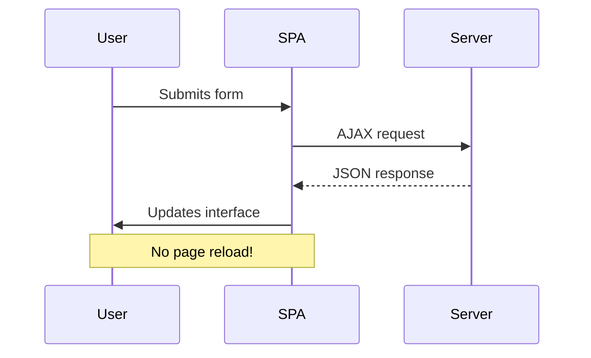

**जाभास्क्रिप्ट फारम ह्यान्डलिङका फाइदाहरू:**
- **एप्लिकेसनको अवस्था र प्रयोगकर्ताको सन्दर्भ कायम राख्छ**
- **तत्काल प्रतिक्रिया र लोडिङ
```javascript
// Example of what FormData captures
const formData = new FormData(registerForm);

// FormData automatically captures:
// {
//   "user": "john_doe",
//   "currency": "$", 
//   "description": "Personal account",
//   "balance": "100"
// }
```

**FormData API का फाइदाहरू:**
- **व्यापक संग्रह**: सबै फारम तत्वहरू समेट्छ, जस्तै पाठ, फाइलहरू, र जटिल इनपुटहरू
- **प्रकारको जानकारी**: विभिन्न इनपुट प्रकारहरूलाई स्वचालित रूपमा ह्यान्डल गर्छ, कुनै कस्टम कोडिङ बिना
- **क्षमता**: एकल API कलले म्यानुअल फिल्ड संग्रहलाई हटाउँछ
- **अनुकूलता**: फारम संरचना परिवर्तन भए पनि कार्यक्षमता कायम राख्छ

### सर्भर संचार कार्य बनाउने

अब आधुनिक JavaScript ढाँचाहरू प्रयोग गरेर तपाईंको API सर्भरसँग संचार गर्न एक बलियो कार्य बनाउँछौं:

```javascript
async function createAccount(account) {
  try {
    const response = await fetch('//localhost:5000/api/accounts', {
      method: 'POST',
      headers: { 
        'Content-Type': 'application/json',
        'Accept': 'application/json'
      },
      body: account
    });
    
    // Check if the response was successful
    if (!response.ok) {
      throw new Error(`HTTP error! status: ${response.status}`);
    }
    
    return await response.json();
  } catch (error) {
    console.error('Account creation failed:', error);
    return { error: error.message || 'Network error occurred' };
  }
}
```

**असिंक्रोनस JavaScript बुझ्दै:**

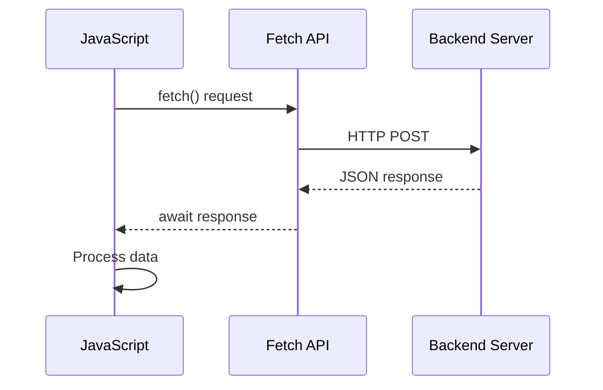

**यस आधुनिक कार्यान्वयनले के हासिल गर्छ:**
- **प्रयोग गर्छ** `async/await` पठनीय असिंक्रोनस कोडका लागि
- **सही त्रुटि ह्यान्डलिङ समावेश गर्छ** try/catch ब्लकहरू प्रयोग गरेर
- **प्रतिक्रिया स्थिति जाँच्छ** डेटा प्रक्रिया गर्नु अघि
- **JSON संचारका लागि उपयुक्त हेडर सेट गर्छ**
- **डिबगिङका लागि विस्तृत त्रुटि सन्देश प्रदान गर्छ**
- **सफलता र त्रुटि केसहरूको लागि सुसंगत डेटा संरचना फर्काउँछ**

### आधुनिक Fetch API को शक्ति

**Fetch API का पुराना विधिहरू भन्दा फाइदाहरू:**

| विशेषता | फाइदा | कार्यान्वयन |
|---------|---------|----------------|
| प्रॉमिस-आधारित | सफा असिंक्रोनस कोड | `await fetch()` |
| अनुरोध अनुकूलन | पूर्ण HTTP नियन्त्रण | हेडरहरू, विधिहरू, शरीर |
| प्रतिक्रिया ह्यान्डलिङ | लचिलो डेटा पार्सिङ | `.json()`, `.text()`, `.blob()` |
| त्रुटि ह्यान्डलिङ | व्यापक त्रुटि समात्ने | Try/catch ब्लकहरू |

> 🎥 **थप जान्नुहोस्**: [Async/Await ट्युटोरियल](https://youtube.com/watch?v=YwmlRkrxvkk) - आधुनिक वेब विकासका लागि असिंक्रोनस JavaScript ढाँचाहरू बुझ्दै।

**सर्भर संचारका लागि मुख्य अवधारणाहरू:**
- **Async कार्यहरू** सर्भर प्रतिक्रियाको प्रतीक्षा गर्न कार्यान्वयन रोक्न अनुमति दिन्छ
- **Await कीवर्ड** असिंक्रोनस कोडलाई सिंक्रोनस कोड जस्तै पढ्न बनाउँछ
- **Fetch API** आधुनिक, प्रॉमिस-आधारित HTTP अनुरोधहरू प्रदान गर्छ
- **त्रुटि ह्यान्डलिङ** सुनिश्चित गर्छ कि तपाईंको एप नेटवर्क समस्याहरूमा राम्रोसँग प्रतिक्रिया दिन्छ

### दर्ता कार्य पूरा गर्दै

सबै कुरा एकसाथ ल्याएर पूर्ण, उत्पादन-तयार दर्ता कार्य बनाउँछौं:

```javascript
async function register() {
  const registerForm = document.getElementById('registerForm');
  const submitButton = registerForm.querySelector('button[type="submit"]');
  
  try {
    // Show loading state
    submitButton.disabled = true;
    submitButton.textContent = 'Creating Account...';
    
    // Process form data
    const formData = new FormData(registerForm);
    const jsonData = JSON.stringify(Object.fromEntries(formData));
    
    // Send to server
    const result = await createAccount(jsonData);
    
    if (result.error) {
      console.error('Registration failed:', result.error);
      alert(`Registration failed: ${result.error}`);
      return;
    }
    
    console.log('Account created successfully!', result);
    alert(`Welcome, ${result.user}! Your account has been created.`);
    
    // Reset form after successful registration
    registerForm.reset();
    
  } catch (error) {
    console.error('Unexpected error:', error);
    alert('An unexpected error occurred. Please try again.');
  } finally {
    // Restore button state
    submitButton.disabled = false;
    submitButton.textContent = 'Create Account';
  }
}
```

**यस सुधारिएको कार्यान्वयनमा समावेश छ:**
- **दृश्य प्रतिक्रिया प्रदान गर्छ** फारम सबमिशनको समयमा
- **सबमिट बटनलाई निष्क्रिय बनाउँछ** दोहोरिएको सबमिशन रोक्न
- **अपेक्षित र अप्रत्याशित त्रुटिहरूलाई राम्रोसँग ह्यान्डल गर्छ**
- **सफलता र त्रुटि सन्देशहरू प्रयोगकर्ता-अनुकूल देखाउँछ**
- **सफल दर्तापछि फारम रिसेट गर्छ**
- **परिणामको परवाह नगरी UI स्थिति पुनर्स्थापित गर्छ**

### तपाईंको कार्यान्वयन परीक्षण गर्दै

**तपाईंको ब्राउजर डेभलपर टूल्स खोल्नुहोस् र दर्ता परीक्षण गर्नुहोस्:**

1. **खोल्नुहोस्** ब्राउजर कन्सोल (F12 → कन्सोल ट्याब)
2. **दर्ता फारम भर्नुहोस्**
3. **क्लिक गर्नुहोस्** "खाता सिर्जना गर्नुहोस्"
4. **कन्सोल सन्देशहरू र प्रयोगकर्ता प्रतिक्रिया अवलोकन गर्नुहोस्**

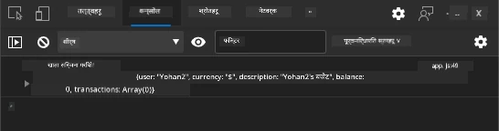

**तपाईंले के देख्नुहुन्छ:**
- **लोडिङ स्थिति** सबमिट बटनमा देखा पर्छ
- **कन्सोल लगहरू** प्रक्रियाको विस्तृत जानकारी देखाउँछ
- **सफलता सन्देश** खाता सिर्जना सफल हुँदा देखा पर्छ
- **फारम स्वतः रिसेट हुन्छ** सफल सबमिशन पछि

> 🔒 **सुरक्षा विचार**: हाल, डेटा HTTP मार्फत यात्रा गर्छ, जुन उत्पादनका लागि सुरक्षित छैन। वास्तविक एपहरूमा, सधैं HTTPS प्रयोग गर्नुहोस् डेटा प्रसारणलाई एन्क्रिप्ट गर्न। [HTTPS सुरक्षा](https://en.wikipedia.org/wiki/HTTPS) र प्रयोगकर्ता डेटा सुरक्षित गर्न किन यो आवश्यक छ भन्ने बारे थप जान्नुहोस्।

### 🔄 **शिक्षण जाँच**
**आधुनिक JavaScript एकीकरण**: असिंक्रोनस फारम ह्यान्डलिङको तपाईंको बुझाइ प्रमाणित गर्नुहोस्:
- ✅ `event.preventDefault()` ले डिफल्ट फारम व्यवहारलाई कसरी परिवर्तन गर्छ?
- ✅ किन FormData API म्यानुअल फिल्ड संग्रह भन्दा बढी प्रभावकारी छ?
- ✅ Async/await ढाँचाहरूले कोड पठनीयता कसरी सुधार गर्छ?
- ✅ त्रुटि ह्यान्डलिङले प्रयोगकर्ता अनुभवमा के भूमिका खेल्छ?

**सिस्टम आर्किटेक्चर**: तपाईंको फारम ह्यान्डलिङले प्रदर्शन गर्छ:
- **इभेन्ट-ड्रिभन प्रोग्रामिङ**: पृष्ठ पुनः लोड नगरी प्रयोगकर्ता क्रियाकलापहरूमा प्रतिक्रिया दिन्छ
- **असिंक्रोनस संचार**: सर्भर अनुरोधहरूले प्रयोगकर्ता इन्टरफेसलाई अवरोध गर्दैन
- **त्रुटि ह्यान्डलिङ**: नेटवर्क अनुरोधहरू असफल हुँदा राम्रोसँग प्रतिक्रिया दिन्छ
- **राज्य व्यवस्थापन**: UI अपडेटहरू सर्भर प्रतिक्रियाहरूलाई प्रतिबिम्बित गर्छ
- **प्रगतिशील सुधार**: आधारभूत कार्यक्षमता काम गर्छ, JavaScript यसलाई सुधार्छ

**व्यावसायिक ढाँचाहरू**: तपाईंले कार्यान्वयन गर्नुभएको छ:
- **एकल जिम्मेवारी**: कार्यहरू स्पष्ट, केन्द्रित उद्देश्यहरू छन्
- **त्रुटि सीमा**: Try/catch ब्लकहरूले एप क्र्यास हुनबाट रोक्छ
- **प्रयोगकर्ता प्रतिक्रिया**: लोडिङ स्थिति र सफलता/त्रुटि सन्देशहरू
- **डेटा रूपान्तरण**: सर्भर संचारका लागि FormData लाई JSON मा रूपान्तरण

## व्यापक फारम मान्यता

फारम मान्यताले सबमिशन पछि मात्र त्रुटिहरू पत्ता लगाउने निराशाजनक अनुभवलाई रोक्छ। अन्तर्राष्ट्रिय अन्तरिक्ष स्टेशनमा बहु अनावश्यक प्रणालीहरू जस्तै, प्रभावकारी मान्यताले सुरक्षा जाँचहरूको बहु तहहरू प्रयोग गर्छ।

उपयुक्त दृष्टिकोणले ब्राउजर-स्तरको मान्यता तत्काल प्रतिक्रिया प्रदान गर्न, JavaScript मान्यता प्रयोगकर्ता अनुभव सुधार गर्न, र सर्भर-साइड मान्यता सुरक्षा र डेटा अखण्डता सुनिश्चित गर्न संयोजन गर्दछ। यो अनावश्यकता प्रयोगकर्ता सन्तुष्टि र प्रणाली सुरक्षा सुनिश्चित गर्दछ।

### मान्यता तहहरू बुझ्दै

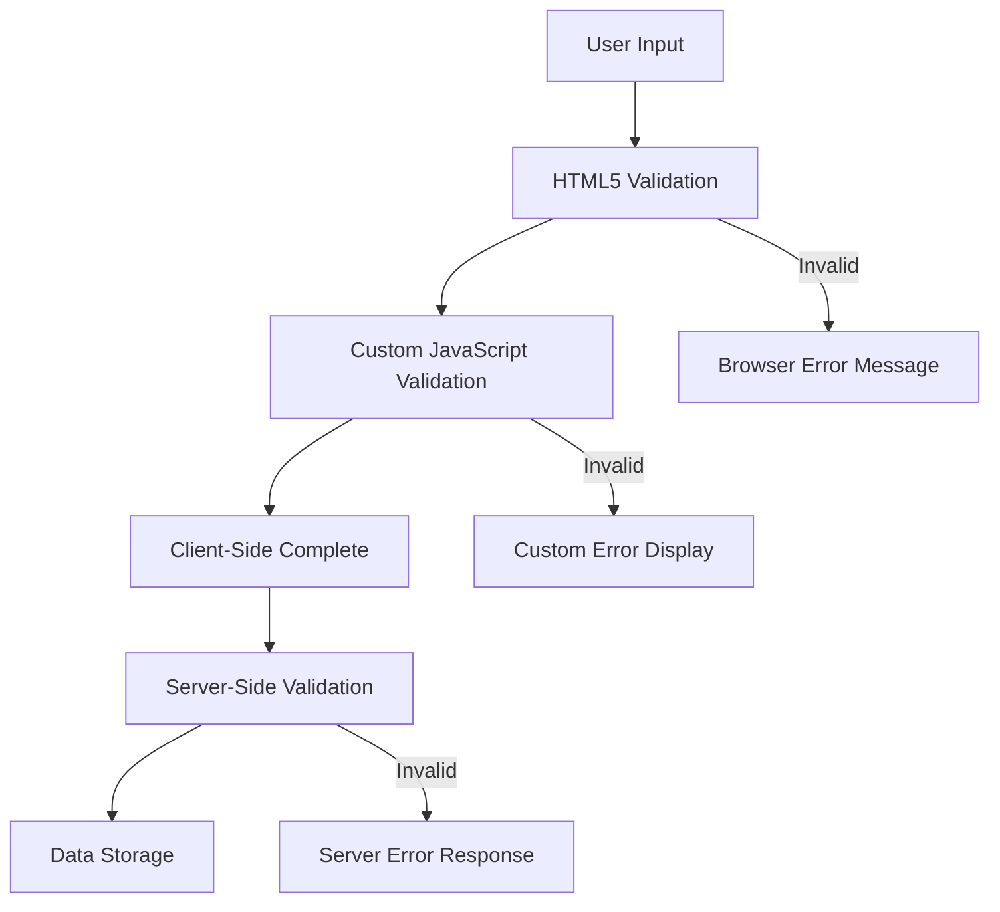

**बहु-तह मान्यता रणनीति:**
- **HTML5 मान्यता**: तत्काल ब्राउजर-आधारित जाँचहरू
- **JavaScript मान्यता**: कस्टम तर्क र प्रयोगकर्ता अनुभव
- **सर्भर मान्यता**: अन्तिम सुरक्षा र डेटा अखण्डता जाँचहरू
- **प्रगतिशील सुधार**: JavaScript अक्षम भए पनि काम गर्छ

### HTML5 मान्यता विशेषताहरू

**आधुनिक मान्यता उपकरणहरू तपाईंको हातमा:**

| विशेषता | उद्देश्य | उदाहरण प्रयोग | ब्राउजर व्यवहार |
|-----------|---------|---------------|------------------|
| `required` | अनिवार्य फिल्डहरू | `<input required>` | खाली सबमिशन रोक्छ |
| `minlength`/`maxlength` | पाठ लम्बाइ सीमा | `<input maxlength="20">` | क्यारेक्टर सीमा लागू गर्छ |
| `min`/`max` | संख्यात्मक सीमा | `<input min="0" max="1000">` | संख्या सीमा मान्यता गर्छ |
| `pattern` | कस्टम regex नियमहरू | `<input pattern="[A-Za-z]+">` | विशिष्ट ढाँचाहरू मिलाउँछ |
| `type` | डेटा प्रकार मान्यता | `<input type="email">` | ढाँचासँग सम्बन्धित मान्यता |

### CSS मान्यता स्टाइलिङ

**मान्यता अवस्थाहरूका लागि दृश्य प्रतिक्रिया सिर्जना गर्नुहोस्:**

```css
/* Valid input styling */
input:valid {
  border-color: #28a745;
  background-color: #f8fff9;
}

/* Invalid input styling */
input:invalid {
  border-color: #dc3545;
  background-color: #fff5f5;
}

/* Focus states for better accessibility */
input:focus:valid {
  box-shadow: 0 0 0 0.2rem rgba(40, 167, 69, 0.25);
}

input:focus:invalid {
  box-shadow: 0 0 0 0.2rem rgba(220, 53, 69, 0.25);
}
```

**यी दृश्य संकेतहरूले के हासिल गर्छ:**
- **हरियो सीमा**: सफल मान्यता संकेत गर्छ, जस्तै मिशन नियन्त्रणमा हरियो बत्ती
- **रातो सीमा**: ध्यान आवश्यक पर्ने मान्यता त्रुटिहरू संकेत गर्छ
- **फोकस हाइलाइटहरू**: वर्तमान इनपुट स्थानको लागि स्पष्ट दृश्य सन्दर्भ प्रदान गर्छ
- **सुसंगत स्टाइलिङ**: प्रयोगकर्ताहरूले सिक्न सक्ने पूर्वानुमान योग्य इन्टरफेस ढाँचाहरू स्थापना गर्छ

> 💡 **प्रो टिप**: `:valid` र `:invalid` CSS स्यूडो-क्लासहरू प्रयोग गरेर प्रयोगकर्ताहरूले टाइप गर्दा तत्काल दृश्य प्रतिक्रिया प्रदान गर्नुहोस्, एक उत्तरदायी र उपयोगी इन्टरफेस सिर्जना गर्दै।

### व्यापक मान्यता कार्यान्वयन गर्दै

तपाईंको दर्ता फारमलाई उत्कृष्ट प्रयोगकर्ता अनुभव र डेटा गुणस्तर प्रदान गर्ने बलियो मान्यतासँग सुधार गरौं:

```html
<form id="registerForm" method="POST" novalidate>
  <div class="form-group">
    <label for="user">Username <span class="required">*</span></label>
    <input id="user" name="user" type="text" required 
           minlength="3" maxlength="20" 
           pattern="[a-zA-Z0-9_]+" 
           autocomplete="username"
           title="Username must be 3-20 characters, letters, numbers, and underscores only">
    <small class="form-text">Choose a unique username (3-20 characters)</small>
  </div>
  
  <div class="form-group">
    <label for="currency">Currency <span class="required">*</span></label>
    <input id="currency" name="currency" type="text" required 
           value="$" maxlength="3" 
           pattern="[A-Z$€£¥₹]+" 
           title="Enter a valid currency symbol or code">
    <small class="form-text">Currency symbol (e.g., $, €, £)</small>
  </div>
  
  <div class="form-group">
    <label for="description">Account Description</label>
    <input id="description" name="description" type="text" 
           maxlength="100" 
           placeholder="Personal savings, checking, etc.">
    <small class="form-text">Optional description (up to 100 characters)</small>
  </div>
  
  <div class="form-group">
    <label for="balance">Starting Balance</label>
    <input id="balance" name="balance" type="number" 
           value="0" min="0" step="0.01" 
           title="Enter a positive number for your starting balance">
    <small class="form-text">Initial account balance (minimum $0.00)</small>
  </div>
  
  <button type="submit">Create Account</button>
</form>
```

**सुधारिएको मान्यता बुझ्दै:**
- **अनिवार्य फिल्ड संकेतकहरू समावेश गर्छ** सहायक विवरणहरूसँग
- **ढाँचाको मान्यताका लागि `pattern` विशेषताहरू समावेश गर्छ**
- **सुलभता र टूलटिप्सका लागि `title` विशेषताहरू प्रदान गर्छ**
- **प्रयोगकर्ता इनपुट मार्गदर्शन गर्न सहायक पाठ थप्छ**
- **बेहतर सुलभताका लागि सेम्यान्टिक HTML संरचना प्रयोग गर्छ**

### उन्नत मान्यता नियमहरू

**प्रत्येक मान्यता नियमले के हासिल गर्छ:**

| फिल्ड | मान्यता नियमहरू | प्रयोगकर्ता लाभ |
|-------|------------------|--------------|
| प्रयोगकर्ता नाम | `required`, `minlength="3"`, `maxlength="20"`, `pattern="[a-zA-Z0-9_]+"` | मान्य, अद्वितीय पहिचान सुनिश्चित गर्छ |
| मुद्रा | `required`, `maxlength="3"`, `pattern="[A-Z$€£¥₹]+"` | सामान्य मुद्रा प्रतीकहरू स्वीकार्छ |
| ब्यालेन्स | `min="0"`, `step="0.01"`, `type="number"` | नकारात्मक ब्यालेन्स रोक्छ |
| विवरण | `maxlength="100"` | उचित लम्बाइ सीमा |

### मान्यता व्यवहार परीक्षण गर्दै

**यी मान्यता परिदृश्यहरू प्रयास गर्नुहोस्:**
1. **खाली अनिवार्य फिल्डहरूसँग फारम सबमिट गर्नुहोस्**
2. **३ क्यारेक्टरभन्दा छोटो प्रयोगकर्ता नाम प्रविष्ट गर्नुहोस्**
3. **प्रयोगकर्ता नाम फिल्डमा विशेष क्यारेक्टरहरू प्रयास गर्नुहोस्**
4. **नकारात्मक ब्यालेन्स रकम प्रविष्ट गर्नुहोस्**


**तपाईंले के अवलोकन गर्नुहुन्छ:**
- **ब्राउजरले** देशी मान्यता सन्देशहरू देखाउँछ
- **स्टाइलिङ परिवर्तन हुन्छ** `:valid` र `:invalid` अवस्थाहरूमा आधारित
- **फारम सबमिशन रोक्छ** जबसम्म सबै मान्यताहरू पास गर्दैन
- **फोकस स्वतः** पहिलो अमान्य फिल्डमा सर्छ

### क्लाइन्ट-साइड बनाम सर्भर-साइड मान्यता

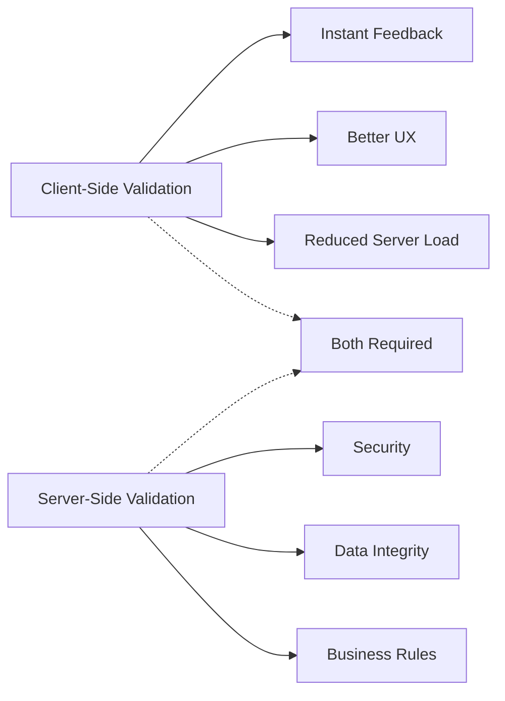

**दुवै तह किन आवश्यक छन्:**
- **क्लाइन्ट-साइड मान्यता**: तत्काल प्रतिक्रिया प्रदान गर्छ र प्रयोगकर्ता अनुभव सुधार गर्छ
- **सर्भर-साइड मान्यता**: सुरक्षा सुनिश्चित गर्छ र जटिल व्यापार नियमहरू ह्यान्डल गर्छ
- **संयुक्त दृष्टिकोण**: बलियो, प्रयोगकर्ता-अनुकूल, र सुरक्षित एपहरू सिर्जना गर्छ
- **प्रगतिशील सुधार**: JavaScript अक्षम हुँदा पनि काम गर्छ

> 🛡️ **सुरक्षा सम्झना**: केवल क्लाइन्ट-साइड मान्यतामा विश्वास नगर्नुहोस्! दुर्भावनापूर्ण प्रयोगकर्ताहरूले क्लाइन्ट-साइड जाँचहरू बाइपास गर्न सक्छन्, त्यसैले सर्भर-साइड मान्यता सुरक्षा र डेटा अखण्डताको लागि आवश्यक छ।

### ⚡ **अर्को ५ मिनेटमा तपाईं के गर्न सक्नुहुन्छ**
- [ ] अमान्य डेटा प्रयोग गरेर तपाईंको फारम परीक्षण गर्नुहोस् मान्यता सन्देशहरू हेर्न
- [ ] HTML5 मान्यता हेर्न JavaScript अक्षम गरेर फारम सबमिट प्रयास गर्नुहोस्
- [ ] ब्राउजर डेभटूल्स खोल्नुहोस् र सर्भरमा पठाइएको फारम डेटा निरीक्षण गर्नुहोस्
- [ ] विभिन्न इनपुट प्रकारहरू प्रयोग गरेर मोबाइल किबोर्ड परिवर्तनहरू हेर्न प्रयास गर्नुहोस्

### 🎯 **तपाईंले यो घण्टामा के हासिल गर्न सक्नुहुन्छ**
- [ ] पाठ-पाठ क्विज पूरा गर्नुहोस् र फारम ह्यान्डलिङ अवधारणाहरू बुझ्नुहोस्
- [ ] वास्तविक-समय प्रतिक्रिया सहित व्यापक मान्यता चुनौती कार्यान्वयन गर्नुहोस्
- [ ] CSS स्टाइलिङ थप्नुहोस् व्यावसायिक देखिने फारमहरू सिर्जना गर्न
- [ ] दोहोरिएको प्रयोगकर्ता नाम र सर्भर त्रुटिहरूका लागि त्रुटि ह्यान्डलिङ थप्नुहोस्
- [ ] मिल्दो मान्यतासँग पासवर्ड पुष्टि फिल्डहरू थप्नुहोस्

### 📅 **तपाईंको हप्ताको फारम मास्टरी यात्रा**
- [ ] उन्नत फारम सुविधाहरू सहित पूर्ण बैंकिङ एप पूरा गर्नुहोस्
- [ ] प्रोफाइल तस्वीरहरू वा कागजातहरूको लागि फाइल अपलोड क्षमता कार्यान्वयन गर्नुहोस्
- [ ] प्रगति संकेतकहरू र राज्य व्यवस्थापन सहित बहु-चरण फारमहरू थप्नुहोस्
- [ ] प्रयोगकर्ता चयनहरूमा आधारित अनुकूलन फारमहरू सिर्जना गर्नुहोस्
- [ ] राम्रो प्रयोगकर्ता अनुभवका लागि फारम स्वतःसेभ र रिकभरी थप्नुहोस्
- [ ] इमेल प्रमाणिकरण र फोन नम्बर ढाँचाजस्ता उन्नत मान्यता थप्नुहोस्

### 🌟 **तपाईंको महिनाको फ्रन्टएन्ड विकास मास्टरी**
- [ ] सर्तात्मक तर्क र वर्कफ्लोहरूसँग जटिल फारम एप्लिकेसनहरू निर्माण गर्नुहोस्
- [ ] द्रुत विकासका लागि फारम पुस्तकालयहरू र फ्रेमवर्कहरू सिक्नुहोस्
- [ ] सुलभता दिशानिर्देशहरू र समावेशी डिजाइन सिद्धान्तहरू मास्टर गर्नुहोस्
- [ ] विश्वव्यापी फारमहरूको लागि अन्तर्राष्ट्रियकरण र स्थानीयकरण कार्यान्वयन गर्नुहोस्
- [ ] पुन: प्रयोग गर्न सकिने फारम कम्पोनेन्ट पुस्तकालयहरू र डिजाइन प्रणालीहरू सिर्जना गर्नुहोस्
- [ ] खुला स्रोत फारम परियोजनाहरूमा योगदान गर्नुहोस् र उत्कृष्ट अभ्यासहरू साझा गर्नुहोस्

## 🎯 तपाईंको फारम विकास मास्टरी समयरेखा

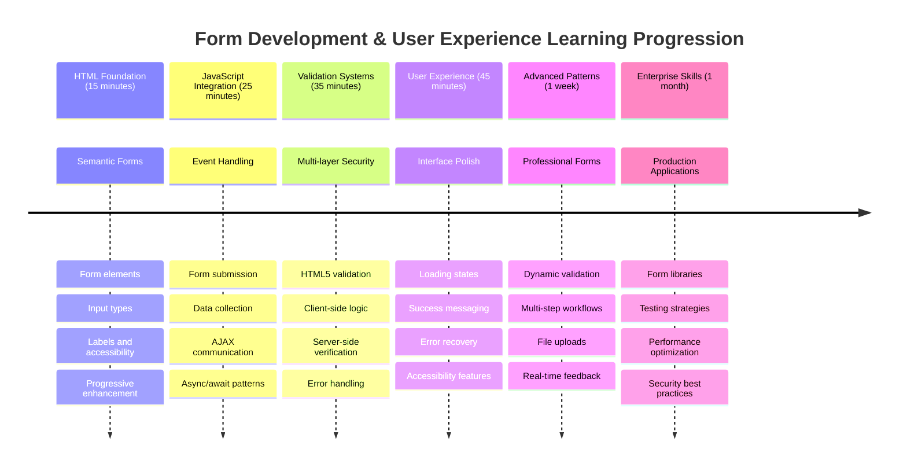

### 🛠️ तपाईंको फारम विकास उपकरण किट सारांश

यस पाठ पूरा गरेपछि, तपाईंले मास्टर गर्नुभएको छ:
- **HTML5 फारमहरू**: सेम्यान्टिक संरचना, इनपुट प्रकारहरू, र सुलभता सुविधाहरू
- **JavaScript फारम ह्यान्डलिङ**: इभेन्ट व्यवस्थापन, डेटा संग्रह, र AJAX संचार
- **मान्यता आर्किटेक्चर**: सुरक्षा र प्रयोगकर्ता अनुभवका लागि बहु-तह मान्यता
- **असिंक्रोनस प्रोग्रामिङ**: आधुनिक Fetch API र async/await ढाँचाहरू
- **त्रुटि व्यवस्थापन**: व्यापक त्रुटि ह्यान्डलिङ र प्रयोगकर्ता प्रतिक्रिया प्रणालीहरू
- **प्रयोगकर्ता अनुभव डिजाइन**: लोडिङ स्थिति, सफलता सन्देश, र त्रुटि रिकभरी
- **प्रगतिशील सुधार**: सबै ब्राउजर र क्षमताहरूमा काम गर्ने फारमहरू

**वास्तविक संसारका अनुप्रयोगहरू**: तपाईंको फारम विकास कौशल सीधा लागू हुन्छ:
- **ई-कमर्स अनुप्रयोगहरू**: चेकआउट प्रक्रिया, खाता दर्ता, र भुक्तानी फारमहरू
- **उद्यम सफ्टवेयर**: डेटा प्रविष्टि प्रणालीहरू, रिपोर्टिङ इन्टरफेसहरू, र वर्कफ्लो अनुप्रयोगहरू
- **सामग्री व्यवस्थापन**: प्रकाशन प्लेटफर्महरू, प्रयोगकर्ता-उत्पन्न सामग्री, र प्रशासनिक इन्टरफेसहरू
- **वित्तीय अनुप्रयोगहरू**: बैंकिङ इन्टरफेसहरू, लगानी प्लेटफर्महरू, र लेनदेन प्रणालीहरू
- **स्वास्थ्य प्रणालीहरू**: बिरामी पोर्टलहरू, भेटघाट तालिका, र मेडिकल रेकर्ड फारमहरू
- **शैक्षिक प्लेटफर्महरू**: पाठ्यक्रम दर्ता, मूल्यांकन उपकरणहरू, र सिकाइ व्यवस्थापन

**व्यावसायिक कौशल प्राप्त गरियो**: अब तपाईं गर्न सक्नुहुन्छ:
- **डिजाइन गर्नुहोस्** सुलभ फारमहरू जो अपाङ्गता भएका सबै प्रयोगकर्ताहरूका लागि काम गर्छ
- **कार्यान्वयन गर्नुहोस्** सुरक्षित फारम मान्यता जसले डेटा भ्रष्टाचार र सुरक्षा कमजोरतालाई रोक्छ
- **सिर्जना गर्नुहोस्** उत्तरदायी प्रयोगकर्ता इन्टरफेसहरू जसले स्पष्ट प्रतिक्रिया र मार्गदर्शन प्रदान गर्छ
- **
**प्रोम्प्ट:** दर्ता फारमको लागि पूर्ण फारम मान्यता प्रणाली बनाउनुहोस् जसमा समावेश छ: 1) प्रयोगकर्ताले टाइप गर्दा प्रत्येक क्षेत्रको वास्तविक-समय मान्यता प्रतिक्रिया, 2) प्रत्येक इनपुट क्षेत्रको तल देखिने अनुकूल मान्यता सन्देशहरू, 3) पासवर्ड पुष्टि क्षेत्रसँग मिल्ने मान्यता, 4) दृश्य संकेतकहरू (जस्तै मान्य क्षेत्रहरूको लागि हरियो चेकमार्क र अमान्य क्षेत्रहरूको लागि रातो चेतावनीहरू), 5) सबै मान्यताहरू पास भएपछि मात्र सक्रिय हुने सबमिट बटन। HTML5 मान्यता विशेषताहरू, CSS मान्यता अवस्थाहरूको लागि शैलीकरण, र अन्तरक्रियात्मक व्यवहारको लागि JavaScript प्रयोग गर्नुहोस्।

[एजेन्ट मोड](https://code.visualstudio.com/blogs/2025/02/24/introducing-copilot-agent-mode) को बारेमा यहाँ थप जान्नुहोस्।

## 🚀 चुनौती

यदि प्रयोगकर्ता पहिले नै अवस्थित छ भने HTML मा त्रुटि सन्देश देखाउनुहोस्।

थप शैलीहरू थपेपछि अन्तिम लगइन पृष्ठ कस्तो देखिन सक्छ भन्ने उदाहरण यहाँ छ:

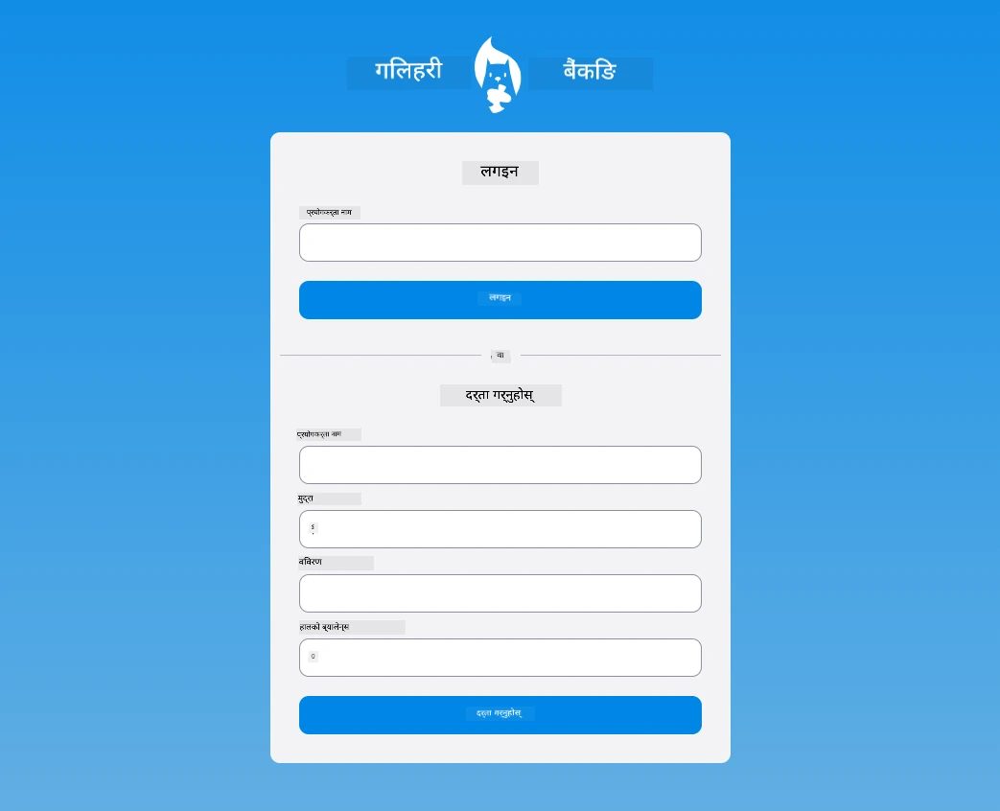

## पोस्ट-व्याख्यान क्विज

[पोस्ट-व्याख्यान क्विज](https://ff-quizzes.netlify.app/web/quiz/44)

## समीक्षा र आत्म अध्ययन

डेभलपरहरूले फारम निर्माण प्रयासहरूमा, विशेष गरी मान्यता रणनीतिहरूमा, धेरै रचनात्मक भएका छन्। [CodePen](https://codepen.com) हेरेर विभिन्न फारम प्रवाहहरूको बारेमा जान्नुहोस्; के तपाईं केही रोचक र प्रेरणादायक फारमहरू फेला पार्न सक्नुहुन्छ?

## असाइनमेन्ट

[तपाईंको बैंक एपलाई शैली दिनुहोस्](assignment.md)

---

**अस्वीकरण**:  
यो दस्तावेज़ AI अनुवाद सेवा [Co-op Translator](https://github.com/Azure/co-op-translator) प्रयोग गरेर अनुवाद गरिएको छ। हामी शुद्धताको लागि प्रयास गर्छौं, तर कृपया ध्यान दिनुहोस् कि स्वचालित अनुवादमा त्रुटिहरू वा अशुद्धताहरू हुन सक्छ। यसको मूल भाषा मा रहेको दस्तावेज़लाई आधिकारिक स्रोत मानिनुपर्छ। महत्वपूर्ण जानकारीको लागि, व्यावसायिक मानव अनुवाद सिफारिस गरिन्छ। यस अनुवादको प्रयोगबाट उत्पन्न हुने कुनै पनि गलतफहमी वा गलत व्याख्याको लागि हामी जिम्मेवार हुने छैनौं।