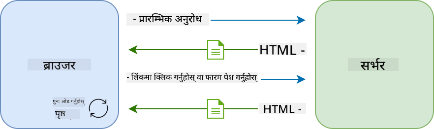

<!--
CO_OP_TRANSLATOR_METADATA:
{
  "original_hash": "f587e913e3f7c0b1c549a05dd74ee8e5",
  "translation_date": "2025-08-26T00:22:49+00:00",
  "source_file": "7-bank-project/3-data/README.md",
  "language_code": "ne"
}
-->
# बैंकिङ एप निर्माण भाग ३: डेटा प्राप्त गर्ने र प्रयोग गर्ने विधिहरू

## प्रि-लेक्चर क्विज

[प्रि-लेक्चर क्विज](https://ff-quizzes.netlify.app/web/quiz/45)

### परिचय

प्रत्येक वेब एप्लिकेसनको केन्द्रमा *डेटा* हुन्छ। डेटा विभिन्न प्रकारका हुन सक्छ, तर यसको मुख्य उद्देश्य सधैं प्रयोगकर्तालाई जानकारी देखाउनु हो। वेब एपहरू बढ्दो अन्तरक्रियात्मक र जटिल हुँदै गइरहेको अवस्थामा, प्रयोगकर्ताले जानकारी कसरी पहुँच गर्छ र त्यससँग कसरी अन्तरक्रिया गर्छ भन्ने कुरा वेब विकासको महत्त्वपूर्ण भाग बनिसकेको छ।

यस पाठमा, हामीले कसरी सर्वरबाट डेटा एसिंक्रोनस रूपमा प्राप्त गर्ने र HTML पुनःलोड नगरी वेब पृष्ठमा जानकारी देखाउने भन्ने कुरा सिक्नेछौं।

### पूर्व-आवश्यकता

यस पाठको लागि तपाईंले वेब एपको [लगइन र रजिस्ट्रेसन फारम](../2-forms/README.md) भाग निर्माण गरिसक्नुपर्छ। तपाईंले [Node.js](https://nodejs.org) स्थापना गर्नुपर्छ र [सर्भर API](../api/README.md) स्थानीय रूपमा चलाउनुपर्छ ताकि तपाईंले खाता डेटा प्राप्त गर्न सक्नुहुन्छ।

सर्भर ठीकसँग चलिरहेको छ कि छैन भनेर जाँच गर्न तपाईंले टर्मिनलमा निम्न कमाण्ड चलाउन सक्नुहुन्छ:

```sh
curl http://localhost:5000/api
# -> should return "Bank API v1.0.0" as a result
```

---

## AJAX र डेटा प्राप्त गर्ने

परम्परागत वेबसाइटहरूले प्रयोगकर्ताले लिंक चयन गर्दा वा फारममार्फत डेटा पेश गर्दा HTML पृष्ठ पुनःलोड गरेर देखाइएको सामग्री अपडेट गर्छ। नयाँ डेटा लोड गर्न प्रत्येक पटक वेब सर्भरले नयाँ HTML पृष्ठ फर्काउँछ, जसलाई ब्राउजरले प्रक्रिया गर्नुपर्छ। यसले प्रयोगकर्ताको हालको कार्यलाई अवरोध पुर्‍याउँछ र पुनःलोडको क्रममा अन्तरक्रियालाई सीमित बनाउँछ। यस वर्कफ्लोलाई *मल्टि-पेज एप्लिकेसन* वा *MPA* भनिन्छ।



जब वेब एप्लिकेसनहरू जटिल र अन्तरक्रियात्मक हुन थाले, [AJAX (Asynchronous JavaScript and XML)](https://en.wikipedia.org/wiki/Ajax_(programming)) नामक नयाँ प्रविधि देखा पर्‍यो। यस प्रविधिले वेब एपहरूलाई HTML पृष्ठ पुनःलोड नगरी एसिंक्रोनस रूपमा सर्भरबाट डेटा पठाउन र प्राप्त गर्न अनुमति दिन्छ। यसले छिटो अपडेट र सहज प्रयोगकर्ता अन्तरक्रिया प्रदान गर्दछ। सर्भरबाट नयाँ डेटा प्राप्त भएपछि, वर्तमान HTML पृष्ठलाई [DOM](https://developer.mozilla.org/docs/Web/API/Document_Object_Model) API प्रयोग गरेर जाभास्क्रिप्टद्वारा अपडेट गर्न सकिन्छ। समयसँगै, यो प्रविधि [*सिंगल-पेज एप्लिकेसन* वा *SPA*](https://en.wikipedia.org/wiki/Single-page_application) मा विकसित भएको छ।


AJAX पहिलो पटक प्रस्तुत हुँदा, एसिंक्रोनस रूपमा डेटा प्राप्त गर्न उपलब्ध एकमात्र API [`XMLHttpRequest`](https://developer.mozilla.org/docs/Web/API/XMLHttpRequest/Using_XMLHttpRequest) थियो। तर आधुनिक ब्राउजरहरूले अब [`Fetch` API](https://developer.mozilla.org/docs/Web/API/Fetch_API) पनि लागू गरेका छन्, जसले प्रॉमिस प्रयोग गर्छ र JSON डेटा ह्यान्डल गर्न अझ सुविधाजनक र शक्तिशाली छ।

> सबै आधुनिक ब्राउजरहरूले `Fetch API` समर्थन गर्छन्। तर यदि तपाईंको वेब एप पुरानो ब्राउजरमा काम गर्नुपर्छ भने, [caniuse.com](https://caniuse.com/fetch) मा अनुकूलता तालिका जाँच गर्नु राम्रो हुन्छ।

### कार्य

[अघिल्लो पाठमा](../2-forms/README.md) हामीले खाता सिर्जना गर्न रजिस्ट्रेसन फारम कार्यान्वयन गरेका थियौं। अब हामीले विद्यमान खाताको प्रयोग गरेर लगइन गर्ने र यसको डेटा प्राप्त गर्ने कोड थप्नेछौं। `app.js` फाइल खोल्नुहोस् र नयाँ `login` फंक्शन थप्नुहोस्:

```js
async function login() {
  const loginForm = document.getElementById('loginForm')
  const user = loginForm.user.value;
}
```

यहाँ हामीले `getElementById()` प्रयोग गरेर फारम तत्व प्राप्त गर्छौं, र त्यसपछि `loginForm.user.value` बाट इनपुटबाट प्रयोगकर्ता नाम प्राप्त गर्छौं। प्रत्येक फारम कन्ट्रोललाई HTML मा `name` एट्रिब्युट प्रयोग गरेर फारमको प्रोपर्टीको रूपमा पहुँच गर्न सकिन्छ।

रजिस्ट्रेसनको लागि हामीले गरेको जस्तै, हामीले सर्भर अनुरोध गर्न अर्को फंक्शन सिर्जना गर्नेछौं, तर यस पटक खाता डेटा प्राप्त गर्नको लागि:

```js
async function getAccount(user) {
  try {
    const response = await fetch('//localhost:5000/api/accounts/' + encodeURIComponent(user));
    return await response.json();
  } catch (error) {
    return { error: error.message || 'Unknown error' };
  }
}
```

हामीले `fetch` API प्रयोग गरेर सर्भरबाट डेटा एसिंक्रोनस रूपमा अनुरोध गर्छौं। यस पटक हामीलाई URL बाहेक अन्य कुनै अतिरिक्त प्यारामिटर आवश्यक छैन, किनकि हामी केवल डेटा सोध्दैछौं। डिफल्ट रूपमा, `fetch` ले [`GET`](https://developer.mozilla.org/docs/Web/HTTP/Methods/GET) HTTP अनुरोध सिर्जना गर्छ, जुन हामीलाई यहाँ चाहिन्छ।

✅ `encodeURIComponent()` एक फंक्शन हो जसले URL का विशेष क्यारेक्टरहरूलाई एस्केप गर्छ। यदि हामीले यो फंक्शन नबोलाईकन `user` मानलाई URL मा सिधै प्रयोग गर्यौं भने के समस्या हुन सक्छ?

अब हामीले `login` फंक्शनलाई `getAccount` प्रयोग गर्न अपडेट गर्नेछौं:

```js
async function login() {
  const loginForm = document.getElementById('loginForm')
  const user = loginForm.user.value;
  const data = await getAccount(user);

  if (data.error) {
    return console.log('loginError', data.error);
  }

  account = data;
  navigate('/dashboard');
}
```

पहिले, किनकि `getAccount` एक एसिंक्रोनस फंक्शन हो, हामीले यसलाई `await` कीवर्डसँग मिलाउनुपर्छ ताकि सर्भरको नतिजाको प्रतीक्षा गर्न सकियोस्। कुनै पनि सर्भर अनुरोधमा, हामीले त्रुटि केसहरू पनि ह्यान्डल गर्नुपर्छ। अहिलेका लागि हामी केवल त्रुटि देखाउन एक लग सन्देश थप्नेछौं, र पछि यसमा फर्कनेछौं।

त्यसपछि हामीले डेटा कतै भण्डारण गर्नुपर्छ ताकि पछि ड्यासबोर्ड जानकारी देखाउन प्रयोग गर्न सकियोस्। किनकि `account` भेरिएबल अझै अवस्थित छैन, हामीले यसलाई हाम्रो फाइलको शीर्षमा एक ग्लोबल भेरिएबलको रूपमा सिर्जना गर्नेछौं:

```js
let account = null;
```

प्रयोगकर्ताको डेटा भेरिएबलमा सुरक्षित भएपछि, हामीले *लगइन* पृष्ठबाट *ड्यासबोर्ड* मा `navigate()` फंक्शन प्रयोग गरेर जान सकिन्छ।

अन्ततः, हामीले लगइन फारम पेश गर्दा हाम्रो `login` फंक्शनलाई कल गर्नुपर्छ। HTML संशोधन गरेर यो गर्न सकिन्छ:

```html
<form id="loginForm" action="javascript:login()">
```

नयाँ खाता रजिस्टर गरेर र सोही खाताको प्रयोग गरेर लगइन प्रयास गरेर सबै कुरा ठीकसँग काम गरिरहेको छ कि छैन परीक्षण गर्नुहोस्।

अर्को भागमा अघि बढ्नु अघि, हामीले `register` फंक्शनलाई निम्न कोड थपेर पूरा गर्न सक्छौं:

```js
account = result;
navigate('/dashboard');
```

✅ के तपाईंलाई थाहा छ कि डिफल्ट रूपमा, तपाईंले हेर्दै गरेको वेब पृष्ठको *समान डोमेन र पोर्ट* बाट मात्र सर्भर API कल गर्न सकिन्छ? यो ब्राउजरहरूले लागू गरेको सुरक्षा मेकानिजम हो। तर हाम्रो वेब एप `localhost:3000` मा चलिरहेको छ भने सर्भर API `localhost:5000` मा चलिरहेको छ, यो किन काम गर्छ? [Cross-Origin Resource Sharing (CORS)](https://developer.mozilla.org/docs/Web/HTTP/CORS) नामक प्रविधि प्रयोग गरेर, यदि सर्भरले प्रतिक्रिया विशेष डोमेनहरूको लागि अपवाद अनुमति दिने विशेष हेडरहरू थप्छ भने क्रस-ओरिजिन HTTP अनुरोधहरू गर्न सम्भव छ।

> APIहरूको बारेमा थप जान्नको लागि यो [पाठ](https://docs.microsoft.com/learn/modules/use-apis-discover-museum-art/?WT.mc_id=academic-77807-sagibbon) लिनुहोस्।

## HTML अपडेट गरेर डेटा देखाउने

अब हामीसँग प्रयोगकर्ता डेटा छ, हामीले यसलाई देखाउनको लागि HTML अपडेट गर्नुपर्छ। हामीले पहिले नै `document.getElementById()` जस्तै विधि प्रयोग गरेर DOM बाट तत्व प्राप्त गर्ने तरिका थाहा पाइसकेका छौं। आधार तत्व प्राप्त गरेपछि, यहाँ केही APIहरू छन् जसलाई तपाईंले यसलाई परिवर्तन गर्न वा नयाँ चाइल्ड तत्वहरू थप्न प्रयोग गर्न सक्नुहुन्छ:

- [`textContent`](https://developer.mozilla.org/docs/Web/API/Node/textContent) प्रोपर्टी प्रयोग गरेर तपाईंले तत्वको पाठ परिवर्तन गर्न सक्नुहुन्छ। ध्यान दिनुहोस् कि यो मान परिवर्तन गर्दा तत्वका सबै चाइल्डहरू (यदि कुनै छन् भने) हटाइन्छ र प्रदान गरिएको पाठले प्रतिस्थापन गरिन्छ। यसरी, यो कुनै पनि तत्वका सबै चाइल्डहरू हटाउनको लागि खाली स्ट्रिङ `''` असाइन गरेर कुशल विधि पनि हो।

- [`document.createElement()`](https://developer.mozilla.org/docs/Web/API/Document/createElement) र [`append()`](https://developer.mozilla.org/docs/Web/API/ParentNode/append) विधि प्रयोग गरेर तपाईंले नयाँ चाइल्ड तत्वहरू सिर्जना र संलग्न गर्न सक्नुहुन्छ।

✅ [`innerHTML`](https://developer.mozilla.org/docs/Web/API/Element/innerHTML) प्रोपर्टी प्रयोग गरेर तत्वको HTML सामग्री परिवर्तन गर्न पनि सम्भव छ। तर यो [क्रस-साइट स्क्रिप्टिङ (XSS)](https://developer.mozilla.org/docs/Glossary/Cross-site_scripting) आक्रमणको लागि संवेदनशील भएकाले यसलाई टाढा राख्नुपर्छ।

### कार्य

ड्यासबोर्ड स्क्रिनमा अघि बढ्नु अघि, *लगइन* पृष्ठमा एउटा कुरा थप्नुपर्छ। हाल, यदि तपाईंले अवैध प्रयोगकर्ता नाम प्रयोग गरेर लगइन प्रयास गर्नुभयो भने, कन्सोलमा सन्देश देखिन्छ तर सामान्य प्रयोगकर्ताका लागि केही परिवर्तन हुँदैन र तपाईंलाई के भइरहेको छ थाहा हुँदैन।

हामीले लगइन `<button>` भन्दा ठीक अघि फारममा एउटा प्लेसहोल्डर तत्व थप्नेछौं जहाँ आवश्यक परेमा त्रुटि सन्देश देखाउन सकिन्छ:

```html
...
<div id="loginError"></div>
<button>Login</button>
...
```

यो `<div>` तत्व खाली छ, जसको अर्थ स्क्रीनमा केही देखाइने छैन जबसम्म हामीले यसमा केही सामग्री थप्दैनौं। हामीले यसलाई `id` पनि दिएको छ ताकि यसलाई जाभास्क्रिप्ट प्रयोग गरेर सजिलै प्राप्त गर्न सकियोस्।

`app.js` फाइलमा फर्केर नयाँ हेल्पर फंक्शन `updateElement` सिर्जना गर्नुहोस्:

```js
function updateElement(id, text) {
  const element = document.getElementById(id);
  element.textContent = text;
}
```

यो फंक्शन धेरै सरल छ: दिइएको तत्व *id* र *text* को आधारमा, यो मिल्दो `id` भएको DOM तत्वको पाठ सामग्री अपडेट गर्छ। अब हामीले यस विधिलाई `login` फंक्शनमा पहिलेको त्रुटि सन्देशको सट्टा प्रयोग गर्नेछौं:

```js
if (data.error) {
  return updateElement('loginError', data.error);
}
```

अब यदि तपाईंले अवैध खाताको साथ लगइन प्रयास गर्नुभयो भने, तपाईंले निम्न जस्तो देख्नुहुनेछ:


अब हामीसँग दृश्य रूपमा देखिने त्रुटि पाठ छ। तर यदि तपाईंले स्क्रिन रिडर प्रयोग गर्नुभयो भने तपाईंले केही घोषणा भएको देख्नुहुनेछैन। पृष्ठमा गतिशील रूपमा थपिएको पाठ स्क्रिन रिडरद्वारा घोषणा गर्नको लागि, यसले [Live Region](https://developer.mozilla.org/docs/Web/Accessibility/ARIA/ARIA_Live_Regions) प्रयोग गर्नुपर्छ। यहाँ हामीले अलर्ट नामक विशेष प्रकारको लाइभ क्षेत्र प्रयोग गर्नेछौं:

```html
<div id="loginError" role="alert"></div>
```

`register` फंक्शन त्रुटिहरूको लागि पनि यही व्यवहार कार्यान्वयन गर्नुहोस् (HTML अपडेट गर्न नबिर्सनुहोस्)।

## ड्यासबोर्डमा जानकारी देखाउने

हामीले भर्खरै देखेका समान प्रविधिहरू प्रयोग गरेर, हामीले ड्यासबोर्ड पृष्ठमा खाता जानकारी देखाउने काम गर्नेछौं।

सर्भरबाट प्राप्त खाता वस्तु यस प्रकारको देखिन्छ:

```json
{
  "user": "test",
  "currency": "$",
  "description": "Test account",
  "balance": 75,
  "transactions": [
    { "id": "1", "date": "2020-10-01", "object": "Pocket money", "amount": 50 },
    { "id": "2", "date": "2020-10-03", "object": "Book", "amount": -10 },
    { "id": "3", "date": "2020-10-04", "object": "Sandwich", "amount": -5 }
  ],
}
```

> नोट: तपाईंको काम सजिलो बनाउनको लागि, तपाईंले पहिले नै डेटा भरिएको `test` खाता प्रयोग गर्न सक्नुहुन्छ।

### कार्य

HTML मा "Balance" सेक्सनलाई प्लेसहोल्डर तत्वहरू थप्न प्रतिस्थापन गरेर सुरु गरौं:

```html
<section>
  Balance: <span id="balance"></span><span id="currency"></span>
</section>
```

हामीले खाता विवरण देखाउनको लागि नयाँ सेक्सन पनि थप्नेछौं:

```html
<h2 id="description"></h2>
```

✅ किनकि खाता विवरणले यसको तलको सामग्रीको लागि शीर्षकको रूपमा काम गर्छ, यसलाई हेडिङको रूपमा अर्थपूर्ण रूपमा मार्कअप गरिएको छ। [हेडिङ संरचना](https://www.nomensa.com/blog/2017/how-structure-headings-web-accessibility) कसरी पहुँचयोग्यताका लागि महत्त्वपूर्ण छ भन्ने बारे थप जान्नुहोस्, र पृष्ठलाई आलोचनात्मक रूपमा हेरेर के अरू हेडिङ हुन सक्छ भनेर निर्धारण गर्नुहोस्।

अब, `app.js` मा नयाँ फंक्शन `updateDashboard` सिर्जना गरौं:

```js
function updateDashboard() {
  if (!account) {
    return navigate('/login');
  }

  updateElement('description', account.description);
  updateElement('balance', account.balance.toFixed(2));
  updateElement('currency', account.currency);
}
```

पहिले, हामीसँग आवश्यक खाता डेटा छ कि छैन जाँच गर्छौं। त्यसपछि हामीले पहिले सिर्जना गरेको `updateElement()` फंक्शन प्रयोग गरेर HTML अपडेट गर्छौं।

> ब्यालेन्स प्रदर्शनलाई अझ राम्रो बनाउन, हामीले [`toFixed(2)`](https://developer.mozilla.org/docs/Web/JavaScript/Reference/Global_Objects/Number/toFixed) विधि प्रयोग गरेर दशमलव बिन्दु पछि २ अंक देखाउन बाध्य पार्छौं।

अब हामीले ड्यासबोर्ड लोड हुँदा हरेक पटक `updateDashboard()` फंक्शन कल गर्नुपर्छ। यदि तपाईंले [पाठ १ असाइनमेन्ट](../1-template-route/assignment.md) पूरा गरिसक्नुभएको छ भने यो सीधा हुनुपर्छ, अन्यथा तपाईं निम्न कार्यान्वयन प्रयोग गर्न सक्नुहुन्छ।

`updateRoute()` फंक्शनको अन्त्यमा यो कोड थप्नुहोस्:

```js
if (typeof route.init === 'function') {
  route.init();
}
```

र रूट्स परिभाषालाई यससँग अपडेट गर्नुहोस्:

```js
const routes = {
  '/login': { templateId: 'login' },
  '/dashboard': { templateId: 'dashboard', init: updateDashboard }
};
```

यस परिवर्तनसँग, हरेक पटक ड्यासबोर्ड पृष्ठ देखाइन्छ, `updateDashboard()` फंक्शन कल गरिन्छ। लगइन पछि, तपाईंले खाता ब्यालेन्स, मुद्रा र विवरण देख्न सक्नुहुन्छ।

## HTML टेम्प्लेटहरू प्रयोग गरेर तालिका पङ्क्तिहरू गतिशील रूपमा सिर्जना गर्नुहोस्

[पहिलो पाठमा](../1-template-route/README.md) हामीले HTML टेम्प्लेटहरू र [`appendChild()`](https://developer.mozilla.org/docs/Web/API/Node/appendChild) विधि प्रयोग गरेर हाम्रो एपमा नेभिगेसन कार्यान्वयन गरेका थियौं। टेम्प्लेटहरू साना पनि हुन सक्छन् र पृष्ठको पुनरावृत्त भागहरू गतिशील रूपमा भर्न प्रयोग गर्न सकिन्छ।

हामीले HTML तालिकामा लेनदेनहरूको सूची देखाउन समान दृष्टिकोण प्रयोग गर्नेछौं।

### कार्य

HTML `<body>` मा नयाँ टेम्प्लेट थप्नुहोस्:

```html
<template id="transaction">
  <tr>
    <td></td>
    <td></td>
    <td></td>
  </tr>
</template>
```

यो टेम्प्लेटले एकल तालिका पङ्क्ति प्रतिनिधित्व गर्छ, जसमा हामीले भरिने ३ स्तम्भहरू छन्: लेनदेनको *मिति*, *वस्तु* र *रकम*।

त्यसपछि, ड्यासबोर्ड टेम्प्लेटभित्रको तालिकाको `<tbody>` तत्वमा यो `id` प्रोपर्टी थप्नुहोस् ताकि यसलाई जाभास्क्रिप्ट प्रयोग गरेर सजिलै फेला पार्न सकियोस्:

```html
<tbody id="transactions"></tbody>
```

हाम्रो HTML तयार छ। अब जाभास्क्रिप्ट कोडमा स्विच गरौं र नयाँ फंक्शन `createTransactionRow` सिर्जना गरौं:

```js
function createTransactionRow(transaction) {
  const template = document.getElementById('transaction');
  const transactionRow = template.content.cloneNode(true);
  const tr = transactionRow.querySelector('tr');
  tr.children[0].textContent = transaction.date;
  tr.children[1].textContent = transaction.object;
  tr.children[2].textContent = transaction.amount.toFixed(2);
  return transactionRow;
}
```

यो फंक्शनले ठीक त्यसै गर्छ जसको नामले संकेत गर्छ: हामीले पहिले सिर्जना गरेको टेम्प्लेट प्रयोग गरेर, यो नयाँ तालिका पङ्क्ति सिर्जना गर्छ र लेनदेन डेटा प्रयोग गरेर यसको सामग्री भर्छ। हामीले यसलाई हाम्रो `updateDashboard()` फंक्शनमा तालिका भर्न प्रयोग गर्नेछौं:

```js
const transactionsRows = document.createDocumentFragment();
for (const transaction of account.transactions) {
  const transactionRow = createTransactionRow(transaction);
  transactionsRows.appendChild(transactionRow);
}
updateElement('transactions', transactionsRows);
```

यहाँ हामीले [`document.createDocumentFragment()`](https://developer.mozilla.org/docs/Web/API/Document/createDocumentFragment) विधि प्रयोग गर्छौं जसले नयाँ DOM फ्रागमेन्ट सिर्जना गर्छ। यसमा काम गरेपछि अन्ततः यसलाई हाम्रो HTML तालिकामा संलग्न गरिन्छ।

यो कोड काम गर्न सक्ने बनाउन अझै एउटा कुरा गर्न बाँकी छ। किनकि हाम्रो `updateElement()` फंक्शन हाल पाठ सामग्री मात्र समर्थन गर्छ। यसको कोडलाई अलि परिवर्तन गरौं:

```js
function updateElement(id, textOrNode) {
  const element = document.getElementById(id);
  element.textContent = ''; // Removes all children
  element.append(textOrNode);
}
```

हामीले [`append()`](https://developer.mozilla.org/docs/Web/API/ParentNode/append) विधि प्रयोग गर्छौं किनकि यसले पाठ वा [DOM Nodes](https://developer.mozilla.org/docs/Web/API/Node) दुबैलाई अभिभावक तत्वमा संलग्न गर्न अनुमति दिन्छ, जुन हाम्रो सबै प्रयोगका लागि उपयुक्त छ।
यदि तपाईंले `test` खाता प्रयोग गरेर लगइन गर्न प्रयास गर्नुभयो भने, अब तपाईंले ड्यासबोर्डमा लेनदेन सूची देख्न सक्नुहुन्छ 🎉।

---

## 🚀 चुनौती

ड्यासबोर्ड पृष्ठलाई वास्तविक बैंकिङ एप जस्तो देखिने बनाउनको लागि सँगै काम गर्नुहोस्। यदि तपाईंले पहिले नै आफ्नो एपलाई स्टाइल गर्नुभएको छ भने, [मिडिया क्वेरीहरू](https://developer.mozilla.org/docs/Web/CSS/Media_Queries) प्रयोग गरेर [उत्तरदायी डिजाइन](https://developer.mozilla.org/docs/Web/Progressive_web_apps/Responsive/responsive_design_building_blocks) बनाउने प्रयास गर्नुहोस् जसले डेस्कटप र मोबाइल उपकरणहरूमा राम्रोसँग काम गर्छ।

यहाँ स्टाइल गरिएको ड्यासबोर्ड पृष्ठको उदाहरण छ:


## पोस्ट-व्याख्यान क्विज

[पोस्ट-व्याख्यान क्विज](https://ff-quizzes.netlify.app/web/quiz/46)

## असाइनमेन्ट

[तपाईंको कोडलाई पुनःसंरचना गर्नुहोस् र टिप्पणीहरू थप्नुहोस्](assignment.md)

**अस्वीकरण**:  
यो दस्तावेज़ AI अनुवाद सेवा [Co-op Translator](https://github.com/Azure/co-op-translator) प्रयोग गरेर अनुवाद गरिएको छ। हामी शुद्धताको लागि प्रयास गर्छौं, तर कृपया ध्यान दिनुहोस् कि स्वचालित अनुवादमा त्रुटिहरू वा अशुद्धताहरू हुन सक्छ। यसको मूल भाषा मा रहेको मूल दस्तावेज़लाई आधिकारिक स्रोत मानिनुपर्छ। महत्वपूर्ण जानकारीको लागि, व्यावसायिक मानव अनुवाद सिफारिस गरिन्छ। यस अनुवादको प्रयोगबाट उत्पन्न हुने कुनै पनि गलतफहमी वा गलत व्याख्याको लागि हामी जिम्मेवार हुने छैनौं।