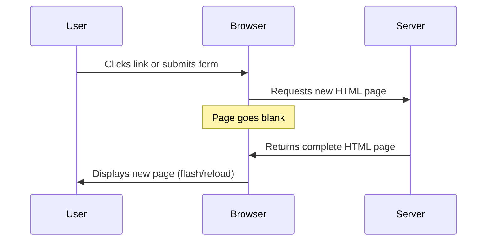
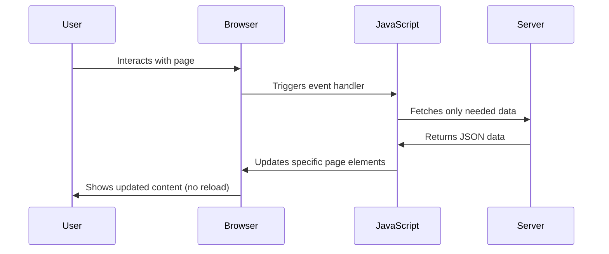
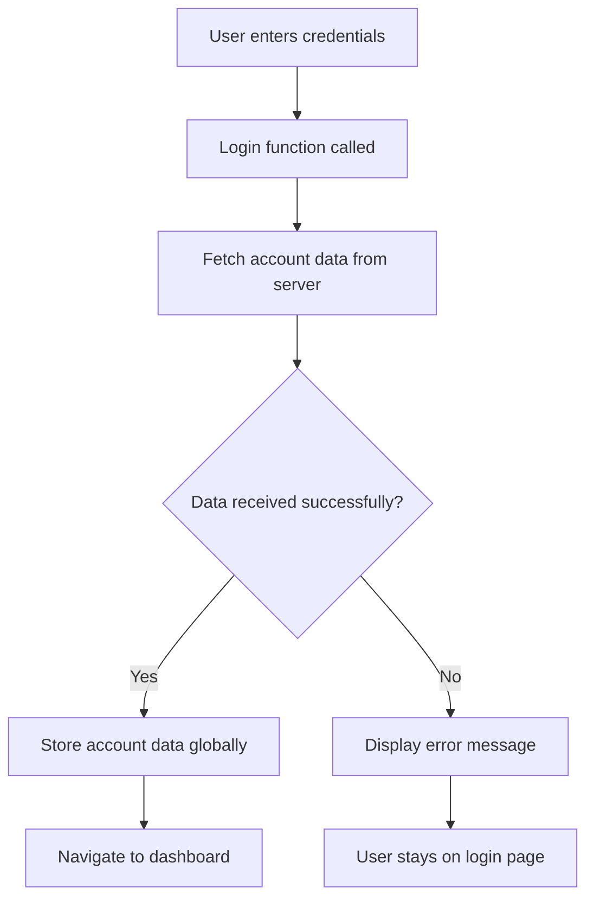
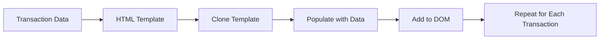

<!--
CO_OP_TRANSLATOR_METADATA:
{
  "original_hash": "2c1164912414820c8efd699b43f64954",
  "translation_date": "2025-10-22T17:04:36+00:00",
  "source_file": "7-bank-project/3-data/README.md",
  "language_code": "ne"
}
-->
# बैंकिङ एप निर्माण भाग ३: डेटा प्राप्ति र प्रयोग गर्ने विधिहरू

स्टार ट्रेकको एंटरप्राइजको कम्प्युटरलाई सम्झनुहोस् - जब कप्तान पिकार्डले जहाजको स्थिति सोध्छन्, जानकारी तुरुन्तै देखिन्छ, सम्पूर्ण इन्टरफेस बन्द गरेर पुनः निर्माण नगरी। यो नै हामी यहाँ निर्माण गर्दैछौं, गतिशील डेटा प्राप्तिको साथमा।

अहिले, तपाईंको बैंकिङ एप छापिएको समाचारपत्र जस्तै छ - जानकारीमूलक तर स्थिर। हामी यसलाई नासाको मिशन कन्ट्रोल जस्तै बनाउनेछौं, जहाँ डेटा निरन्तर प्रवाह हुन्छ र वास्तविक समयमा अपडेट हुन्छ, प्रयोगकर्ताको कार्यप्रवाहलाई अवरोध नगरी।

तपाईंले सर्वरहरूसँग असिंक्रोनस रूपमा संवाद गर्न, विभिन्न समयमा आउने डेटा व्यवस्थापन गर्न, र कच्चा जानकारीलाई प्रयोगकर्ताहरूका लागि अर्थपूर्ण बनाउने तरिका सिक्नुहुनेछ। यो डेमो र उत्पादन-तयार सफ्टवेयरको बीचको फरक हो।

## प्रि-लेक्चर क्विज

[प्रि-लेक्चर क्विज](https://ff-quizzes.netlify.app/web/quiz/45)

### आवश्यकताहरू

डेटा प्राप्तिमा प्रवेश गर्नु अघि, यी कम्पोनेन्टहरू तयार गर्नुहोस्:

- **अघिल्लो पाठ**: [लगइन र रजिस्ट्रेसन फारम](../2-forms/README.md) पूरा गर्नुहोस् - हामी यस आधारमा निर्माण गर्नेछौं।
- **स्थानीय सर्भर**: [Node.js](https://nodejs.org) स्थापना गर्नुहोस् र [सर्भर API चलाउनुहोस्](../api/README.md) खाता डेटा प्रदान गर्न।
- **API कनेक्शन**: यो कमाण्डसँग आफ्नो सर्भर कनेक्शन परीक्षण गर्नुहोस्:

```bash
curl http://localhost:5000/api
# Expected response: "Bank API v1.0.0"
```

यो छिटो परीक्षणले सुनिश्चित गर्दछ कि सबै कम्पोनेन्टहरू ठीकसँग संवाद गरिरहेका छन्:
- तपाईंको प्रणालीमा Node.js सही रूपमा चलिरहेको छ भनी प्रमाणित गर्दछ।
- तपाईंको API सर्भर सक्रिय छ र प्रतिक्रिया दिइरहेको छ भनी पुष्टि गर्दछ।
- तपाईंको एपले सर्भरमा पुग्न सक्छ भनी प्रमाणित गर्दछ (मिशन अघि रेडियो सम्पर्क जाँच गरेजस्तै)।

---

## आधुनिक वेब एप्समा डेटा प्राप्ति बुझ्दै

वेब एप्लिकेसनहरूले डेटा व्यवस्थापन गर्ने तरिका पछिल्लो दुई दशकमा नाटकीय रूपमा विकसित भएको छ। यस विकासलाई बुझ्दा आधुनिक प्रविधिहरू जस्तै AJAX र Fetch API किन शक्तिशाली छन् र किन वेब विकासकर्ताहरूका लागि आवश्यक उपकरण बनेका छन् भन्ने कुरा स्पष्ट हुन्छ।

आउनुहोस्, परम्परागत वेबसाइटहरू कसरी काम गर्थे र आज हामीले निर्माण गर्ने गतिशील, प्रतिक्रियात्मक एप्लिकेसनहरूको तुलना गरौं।

### परम्परागत मल्टि-पेज एप्लिकेसन (MPA)

वेबको सुरुवाती दिनहरूमा, प्रत्येक क्लिक पुरानो टेलिभिजनमा च्यानल परिवर्तन गरेजस्तै थियो - स्क्रिन खाली हुन्थ्यो, अनि नयाँ सामग्रीमा ट्युन गर्न बिस्तारै लाग्थ्यो। यो प्रारम्भिक वेब एप्लिकेसनहरूको वास्तविकता थियो, जहाँ प्रत्येक अन्तरक्रियाले सम्पूर्ण पृष्ठलाई पुनः निर्माण गर्नुपर्थ्यो।




**किन यो विधि असहज लाग्थ्यो:**
- प्रत्येक क्लिकले सम्पूर्ण पृष्ठलाई पुनः निर्माण गर्नुपर्थ्यो।
- ती झिल्काहरूले प्रयोगकर्ताको विचारलाई अवरोध गर्थे।
- तपाईंको इन्टरनेट कनेक्शनले बारम्बार हेडर र फुटर डाउनलोड गर्न धेरै काम गर्नुपर्थ्यो।
- एप्स फाइलिङ क्याबिनेटमा क्लिक गरेजस्तो लाग्थ्यो, सफ्टवेयर प्रयोग गरेजस्तो होइन।

### आधुनिक सिंगल-पेज एप्लिकेसन (SPA)

AJAX (Asynchronous JavaScript and XML) ले यो परिपाटीलाई पूर्ण रूपमा परिवर्तन गर्यो। अन्तर्राष्ट्रिय स्पेस स्टेशनको मोड्युलर डिजाइन जस्तै, जहाँ अन्तरिक्ष यात्रीहरूले सम्पूर्ण संरचना पुनः निर्माण नगरी व्यक्तिगत कम्पोनेन्टहरू प्रतिस्थापन गर्न सक्छन्, AJAX ले हामीलाई वेबपेजको विशिष्ट भागहरू पुनः लोड नगरी अपडेट गर्न अनुमति दिन्छ। XML उल्लेख भए पनि, आज हामी प्रायः JSON प्रयोग गर्छौं, तर मुख्य सिद्धान्त उस्तै छ: केवल परिवर्तन भएको भागलाई अपडेट गर्नुहोस्।




**किन SPA हरू राम्रो लाग्छन्:**
- केवल वास्तवमा परिवर्तन भएका भागहरू अपडेट हुन्छन् (स्मार्ट, हैन र?)
- अब झट्काहरू छैनन् - तपाईंका प्रयोगकर्ताहरू आफ्नो प्रवाहमा रहन्छन्।
- तारमा कम डेटा यात्रा गर्दा छिटो लोड हुन्छ।
- सबै कुरा फोनका एप्स जस्तै चपल र प्रतिक्रियात्मक लाग्छ।

### आधुनिक Fetch API तर्फको विकास

आधुनिक ब्राउजरहरूले [`Fetch` API](https://developer.mozilla.org/docs/Web/API/Fetch_API) प्रदान गर्छन्, जसले पुरानो [`XMLHttpRequest`](https://developer.mozilla.org/docs/Web/API/XMLHttpRequest/Using_XMLHttpRequest) लाई प्रतिस्थापन गर्छ। टेलिग्राफ चलाउने र इमेल प्रयोग गर्ने बीचको फरक जस्तै, Fetch API ले सफा असिंक्रोनस कोडका लागि प्रॉमिसहरू प्रयोग गर्छ र JSON स्वाभाविक रूपमा व्यवस्थापन गर्छ।

| विशेषता | XMLHttpRequest | Fetch API |
|---------|----------------|----------|
| **सिन्ट्याक्स** | जटिल क्यालब्याक-आधारित | सफा प्रॉमिस-आधारित |
| **JSON व्यवस्थापन** | म्यानुअल पार्सिङ आवश्यक | बिल्ट-इन `.json()` विधि |
| **त्रुटि व्यवस्थापन** | सीमित त्रुटि जानकारी | व्यापक त्रुटि विवरण |
| **आधुनिक समर्थन** | पुरानो अनुकूलता | ES6+ प्रॉमिस र async/await |

> 💡 **ब्राउजर अनुकूलता**: राम्रो खबर - Fetch API सबै आधुनिक ब्राउजरहरूमा काम गर्छ! यदि तपाईंलाई विशेष संस्करणहरूको बारेमा जिज्ञासा छ भने, [caniuse.com](https://caniuse.com/fetch) मा पूर्ण अनुकूलता कथा छ।
> 
**मुख्य कुरा:**
- Chrome, Firefox, Safari, र Edge मा राम्रोसँग काम गर्छ (मूलतः जहाँ तपाईंका प्रयोगकर्ताहरू छन् त्यहाँ)
- केवल Internet Explorer ले अतिरिक्त सहयोग चाहिन्छ (र इमानदारीपूर्वक, IE लाई छोड्ने समय आएको छ)
- हामीले पछि प्रयोग गर्ने सुन्दर async/await ढाँचाहरूका लागि तपाईंलाई पूर्ण रूपमा तयार बनाउँछ।

### प्रयोगकर्ता लगइन र डेटा प्राप्ति कार्यान्वयन गर्दै

अब हामी लगइन प्रणाली कार्यान्वयन गर्नेछौं जसले तपाईंको बैंकिङ एपलाई स्थिर प्रदर्शनबाट कार्यात्मक एप्लिकेसनमा रूपान्तरण गर्छ। जस्तै सुरक्षित सैन्य सुविधाहरूमा प्रयोग गरिने प्रमाणीकरण प्रोटोकलहरू, हामी प्रयोगकर्ताको प्रमाणिकता पुष्टि गर्नेछौं र त्यसपछि उनीहरूको विशिष्ट डेटा प्रदान गर्नेछौं।

हामी यसलाई क्रमिक रूपमा निर्माण गर्नेछौं, आधारभूत प्रमाणीकरणबाट सुरु गर्दै र त्यसपछि डेटा प्राप्ति क्षमताहरू थप्दै।

#### चरण १: लगइन फंक्शनको आधार सिर्जना गर्नुहोस्

तपाईंको `app.js` फाइल खोल्नुहोस् र नयाँ `login` फंक्शन थप्नुहोस्। यसले प्रयोगकर्ता प्रमाणीकरण प्रक्रिया व्यवस्थापन गर्नेछ:

```javascript
async function login() {
  const loginForm = document.getElementById('loginForm');
  const user = loginForm.user.value;
}
```

**यसलाई टुक्रा-टुक्रामा बुझौं:**
- त्यो `async` कीवर्ड? यसले JavaScript लाई भन्छ "हे, यो फंक्शनले कुराहरूको लागि पर्खनु पर्छ।"
- हामी हाम्रो पृष्ठबाट फारम समात्दैछौं (केही विशेष छैन, केवल यसको ID द्वारा खोज्दैछौं।)
- त्यसपछि हामी प्रयोगकर्ताले टाइप गरेको प्रयोगकर्ता नाम निकाल्दैछौं।
- यहाँ एउटा राम्रो ट्रिक छ: तपाईं कुनै पनि फारम इनपुटलाई यसको `name` एट्रिब्युटद्वारा पहुँच गर्न सक्नुहुन्छ - अतिरिक्त getElementById कलहरूको आवश्यकता छैन!

> 💡 **फारम पहुँच ढाँचा**: प्रत्येक फारम कन्ट्रोललाई यसको नाम (HTML मा `name` एट्रिब्युट प्रयोग गरेर सेट गरिएको) द्वारा फारम एलिमेन्टको गुणको रूपमा पहुँच गर्न सकिन्छ। यसले फारम डेटा प्राप्त गर्न सफा, पढ्न मिल्ने तरिका प्रदान गर्दछ।

#### चरण २: खाता डेटा प्राप्ति फंक्शन सिर्जना गर्नुहोस्

अगाडि, हामी सर्भरबाट खाता डेटा प्राप्त गर्न समर्पित फंक्शन सिर्जना गर्नेछौं। यो तपाईंको रजिस्ट्रेसन फंक्शनको समान ढाँचालाई पछ्याउँछ तर डेटा प्राप्तिमा केन्द्रित छ:

```javascript
async function getAccount(user) {
  try {
    const response = await fetch('//localhost:5000/api/accounts/' + encodeURIComponent(user));
    return await response.json();
  } catch (error) {
    return { error: error.message || 'Unknown error' };
  }
}
```

**यस कोडले के पूरा गर्छ:**
- **आधुनिक `fetch` API प्रयोग गरेर** डेटा असिंक्रोनस रूपमा अनुरोध गर्छ।
- **GET अनुरोध URL निर्माण गर्छ** प्रयोगकर्ता नाम प्यारामिटरको साथ।
- **`encodeURIComponent()` लागू गर्छ** URL मा विशेष क्यारेक्टरहरू सुरक्षित रूपमा व्यवस्थापन गर्न।
- **प्रतिक्रिया JSON ढाँचामा रूपान्तरण गर्छ** डेटा हेरफेर गर्न सजिलो बनाउन।
- **त्रुटिहरूलाई सुन्दर रूपमा व्यवस्थापन गर्छ** त्रुटि वस्तु फर्काएर क्र्यास नगरी।

> ⚠️ **सुरक्षा नोट**: `encodeURIComponent()` फंक्शनले URL मा विशेष क्यारेक्टरहरू व्यवस्थापन गर्छ। जस्तै नौसेनाको सञ्चार प्रणालीमा प्रयोग गरिने एन्कोडिङ प्रणाली, यसले तपाईंको सन्देश ठीक त्यस्तै रूपमा पुग्छ भनी सुनिश्चित गर्छ, "#" वा "&" जस्ता क्यारेक्टरहरू गलत व्याख्या हुनबाट रोक्छ।
> 
**किन यो महत्त्वपूर्ण छ:**
- विशेष क्यारेक्टरहरूले URL तोड्नबाट रोक्छ।
- URL हेरफेर आक्रमणबाट सुरक्षा प्रदान गर्छ।
- तपाईंको सर्भरले इच्छित डेटा प्राप्त गर्छ भनी सुनिश्चित गर्छ।
- सुरक्षित कोडिङ अभ्यासहरू पछ्याउँछ।

#### HTTP GET अनुरोधहरू बुझ्दै

जब तपाईं `fetch` बिना कुनै अतिरिक्त विकल्प प्रयोग गर्नुहुन्छ, यसले स्वतः [`GET`](https://developer.mozilla.org/docs/Web/HTTP/Methods/GET) अनुरोध सिर्जना गर्छ। यो हामीले गरिरहेको कामका लागि उत्तम छ - सर्भरलाई सोध्दै "हे, म यो प्रयोगकर्ताको खाता डेटा देख्न सक्छु?"

GET अनुरोधहरूलाई पुस्तकालयबाट पुस्तक उधारो माग्न जस्तै सोच्नुहोस् - तपाईंले पहिले नै रहेको केही हेर्न अनुरोध गर्दै हुनुहुन्छ। POST अनुरोधहरू (जसलाई हामीले रजिस्ट्रेसनका लागि प्रयोग गर्यौं) नयाँ पुस्तक संग्रहमा थप्न जस्तै छन्।

| GET अनुरोध | POST अनुरोध |
|-------------|-------------|
| **उद्देश्य** | अवस्थित डेटा प्राप्त गर्नुहोस् | सर्भरमा नयाँ डेटा पठाउनुहोस् |
| **प्यारामिटरहरू** | URL पथ/क्वेरी स्ट्रिङमा | अनुरोध बडीमा |
| **क्यासिङ** | ब्राउजरद्वारा क्यास गर्न सकिन्छ | सामान्यतया क्यास गरिँदैन |
| **सुरक्षा** | URL/लगहरूमा देखिने | अनुरोध बडीमा लुकेको |

#### चरण ३: सबै कुरा एकसाथ ल्याउँदै

अब सन्तोषजनक भागको लागि - तपाईंको खाता प्राप्ति फंक्शनलाई लगइन प्रक्रियासँग जडान गरौं। यहीँ सबै कुरा मिल्छ:

```javascript
async function login() {
  const loginForm = document.getElementById('loginForm');
  const user = loginForm.user.value;
  const data = await getAccount(user);

  if (data.error) {
    return console.log('loginError', data.error);
  }

  account = data;
  navigate('/dashboard');
}
```

यो फंक्शनले स्पष्ट क्रम पछ्याउँछ:
- फारम इनपुटबाट प्रयोगकर्ता नाम निकाल्नुहोस्।
- सर्भरबाट प्रयोगकर्ताको खाता डेटा अनुरोध गर्नुहोस्।
- प्रक्रियाको क्रममा हुने कुनै पनि त्रुटिहरू व्यवस्थापन गर्नुहोस्।
- खाता डेटा भण्डारण गर्नुहोस् र सफलतापछि ड्यासबोर्डमा नेभिगेट गर्नुहोस्।

> 🎯 **Async/Await ढाँचा**: किनकि `getAccount` असिंक्रोनस फंक्शन हो, हामी `await` कीवर्ड प्रयोग गरेर कार्यान्वयनलाई रोक्छौं जबसम्म सर्भरले प्रतिक्रिया दिन्छ। यसले कोडलाई अपरिभाषित डेटा सहित अगाडि बढ्नबाट रोक्छ।

#### चरण ४: तपाईंको डेटा राख्नको लागि घर सिर्जना गर्नुहोस्

तपाईंको एपलाई खाता जानकारी लोड भएपछि सम्झनको लागि कुनै ठाउँ चाहिन्छ। यसलाई तपाईंको एपको छोटो समयको स्मृति जस्तै सोच्नुहोस् - हालको प्रयोगकर्ताको डेटा सजिलो पहुँचको लागि राख्ने ठाउँ। तपाईंको `app.js` फाइलको शीर्षमा यो लाइन थप्नुहोस्:

```javascript
// This holds the current user's account data
let account = null;
```

**किन हामीलाई यो चाहिन्छ:**
- खाता डेटा तपाईंको एपको कुनै पनि ठाउँबाट पहुँचयोग्य राख्छ।
- `null` बाट सुरु गर्नुको मतलब "अहिलेसम्म कोही लगइन भएको छैन।"
- जब कोही सफलतापूर्वक लगइन वा रजिस्टर गर्छ, अपडेट हुन्छ।
- सत्यको एकल स्रोतको रूपमा काम गर्छ - कोही लगइन भएको छ भनी भ्रम छैन।

#### चरण ५: तपाईंको फारमलाई जडान गर्नुहोस्

अब तपाईंको नयाँ लगइन फंक्शनलाई तपाईंको HTML फारमसँग जडान गरौं। तपाईंको फारम ट्यागलाई यसरी अपडेट गर्नुहोस्:

```html
<form id="loginForm" action="javascript:login()">
  <!-- Your existing form inputs -->
</form>
```

**यो सानो परिवर्तनले के गर्छ:**
- फारमलाई यसको डिफल्ट "सम्पूर्ण पृष्ठ पुनः लोड गर्ने" व्यवहार रोक्छ।
- तपाईंको कस्टम JavaScript फंक्शनलाई कल गर्छ।
- सबै कुरा चिल्लो र सिंगल-पेज-एप-जस्तै राख्छ।
- प्रयोगकर्ताहरूले "लगइन" थिच्दा के हुन्छ भन्नेमा तपाईंलाई पूर्ण नियन्त्रण दिन्छ।

#### चरण ६: तपाईंको रजिस्ट्रेसन फंक्शनलाई सुधार गर्नुहोस्

सुसंगतताका लागि, तपाईंको `register` फंक्शनलाई पनि खाता डेटा भण्डारण गर्न र ड्यासबोर्डमा नेभिगेट गर्न अपडेट गर्नुहोस्:

```javascript
// Add these lines at the end of your register function
account = result;
navigate('/dashboard');
```

**यस सुधारले प्रदान गर्छ:**
- **सजिलो** रजिस्ट्रेसनबाट ड्यासबोर्डमा संक्रमण।
- **सुसंगत** प्रयोगकर्ता अनुभव लगइन र रजिस्ट्रेसन प्रवाहहरू बीच।
- **तुरुन्तै** सफल रजिस्ट्रेसनपछि खाता डेटा पहुँच।

#### तपाईंको कार्यान्वयन परीक्षण गर्दै



**अब यसलाई परीक्षण गर्ने समय:**
1. नयाँ खाता सिर्जना गरेर सबै कुरा काम गरिरहेको छ भनी सुनिश्चित गर्नुहोस्।
2. ती नै प्रमाणहरू प्रयोग गरेर लगइन प्रयास गर्नुहोस्।
3. यदि केही असामान्य लाग्छ भने तपाईंको ब्राउजरको कन्सोल (F12) हेर्नुहोस्।
4. सफल लगइनपछि ड्यासबोर्डमा पुग्न सुनिश्चित गर्नुहोस्।

यदि केही काम गरिरहेको छैन भने, नआत्तिनुहोस्! अधिकांश समस्याहरू साधारण सुधारहरू हुन् जस्तै टाइपोहरू वा API सर्भर सुरु गर्न बिर्सनु।

#### क्रस-ओरिजिन जादूको बारेमा छोटो शब्द

तपाईं सोच्न सक्नुहुन्छ: "मेरो वेब एपले यो API सर्भरसँग कसरी कुरा गरिरहेको छ जब तिनीहरू फरक पोर्टमा चलिरहेका छन्?" राम्रो प्रश्न! यो प्रत्येक वेब विकासकर्ताले अन्ततः सामना गर्ने विषयलाई छुन्छ।

> 🔒 **क्रस-ओरिजिन सुरक्षा**: ब्राउजरहरूले "साम-ओरिजिन नीति" लागू गर्छन् ताकि विभिन्न डोमेनहरू बीचको अनधिकृत सञ्चारलाई रोक्न सकियोस्। जस्तै पेन्टागनको चेकपोइन्ट प्रणाली, तिनीहरूले डेटा स्थानान्तरण अनुमति दिएर सञ्चारलाई प्रमाणित गर्छन्।
> 
**हाम्रो सेटअपमा:**
- तपाईंको वेब एप `localhost:3000` मा चल्छ (विकास सर्भर)
- तपाईंको API सर्भर `localhost:5000` मा चल्छ (ब्याकएन्ड सर्भर)
- API सर्भरले [CORS हेडरहरू](https://developer.mozilla.org/docs/Web/HTTP/CORS) समावेश गर्छ जसले तपाईंको वेब एपबाट सञ्चारलाई स्पष्ट रूपमा अनुमति दिन्छ।

यो कन्फिगरेसन वास्तविक-विश्व विकासलाई प्रतिबिम्बित गर्छ जहाँ फ्रन्टएन्ड र ब्याकएन्ड एप्लिकेसनहरू सामान्यतया अलग सर्भरहरूमा चल्छन्।

> 📚 **थप जान्नुहोस्**: API हरू र डेटा प्राप्तिमा गहिरो डुब्नको लागि यो व्यापक [Microsoft Learn मोड्युल](https://docs.microsoft.com/learn/modules/use-apis-discover-museum-art/?WT.mc_id=academic-77807-sagibbon) हेर्नुहोस्।

## HTML मा तपाईंको डेटा जीवन्त बनाउँदै

अब हामी प्राप्त गरिएको डेटा प्रयोगकर्ताहरूलाई DOM म्यानिपुलेसनको माध्यमबाट देखिने बनाउनेछौं। जस्तै अँध्यारो कोठामा फोटोहरू विकास गर्ने प्रक्रिया, हामी अदृश्य डेटा लिँदैछौं र यसलाई प्रयोगकर्ताहरूले देख्न र अन्तरक्रिया गर्न सक्ने केहीमा प्रस्तुत गर्दैछौं।

DOM म्यानिपुलेसन एक प्रविधि हो जसले स्थिर वेब पृष्ठहरूलाई गतिशील एप्लिकेसनहरूमा रूपान्तरण गर्छ, जसले प्रयोगकर्ता अन्तरक्रिया र सर्भर प्रतिक्रियाको आधारमा सामग्री अपडेट गर्दछ।

### कामको लागि सही उपकरण चयन गर्दै

जब तपाईं आफ्नो HTML लाई JavaScript को साथ अपडेट गर्नुहुन्छ, तपाईंसँग धेरै विकल्पहरू छन्। यीलाई उपकरणको टूलबक्समा विभिन्न उपकरणहरू जस्तै सोच्नुहोस् - प्रत्येक विशिष्ट कामका लागि उत्तम।

| विधि | यो केका लागि राम्रो छ | कहिले प्रयोग गर्ने | सुरक्षा स्तर |
|--------|---------------------|----------------|--------------|
| `textContent` | प्रयोगकर्ता डेटा सुरक्षित रूपमा देखाउन | जब तपाईं पाठ देखाउँदै हुनुहुन्छ | ✅ अत्यन्त सुरक्षित |
| `createElement()` + `append()` | जटिल लेआउट निर्माण गर्न | नयाँ सेक्सन/सूचीहरू सिर्जना गर्दा | ✅ अत्यन्त सुरक्षित
अधिक जटिल सामग्रीको लागि, [`document.createElement()`](https://developer.mozilla.org/docs/Web/API/Document/createElement) लाई [`append()`](https://developer.mozilla.org/docs/Web/API/ParentNode/append) विधिसँग मिलाउनुहोस्:

```javascript
// Safe way to create new elements
const transactionItem = document.createElement('div');
transactionItem.className = 'transaction-item';
transactionItem.textContent = `${transaction.date}: ${transaction.description}`;
container.append(transactionItem);
```

**यस विधिको बुझाइ:**
- **नयाँ DOM तत्वहरू** प्रोग्राममार्फत सिर्जना गर्दछ
- **तत्वहरूको विशेषता र सामग्रीमा** पूर्ण नियन्त्रण राख्छ
- **जटिल, nested तत्व संरचनाहरूको लागि अनुमति दिन्छ**
- **सुरक्षा कायम राख्छ** सामग्रीलाई संरचनाबाट अलग गरेर

> ⚠️ **सुरक्षा विचार**: जबकि [`innerHTML`](https://developer.mozilla.org/docs/Web/API/Element/innerHTML) धेरै ट्यूटोरियलहरूमा देखिन्छ, यसले embedded स्क्रिप्टहरू कार्यान्वयन गर्न सक्छ। CERN मा अनधिकृत कोड कार्यान्वयन रोक्नका लागि सुरक्षा प्रोटोकलहरू जस्तै, `textContent` र `createElement` प्रयोग गर्दा सुरक्षित विकल्पहरू प्रदान गर्दछ।
> 
**innerHTML को जोखिमहरू:**
- प्रयोगकर्ता डेटा भित्रका कुनै पनि `<script>` ट्यागहरू कार्यान्वयन गर्दछ
- कोड इन्जेक्सन आक्रमणको लागि संवेदनशील
- सम्भावित सुरक्षा कमजोरीहरू सिर्जना गर्दछ
- हामीले प्रयोग गरिरहेका सुरक्षित विकल्पहरूले समान कार्यक्षमता प्रदान गर्दछ

### त्रुटिहरूलाई प्रयोगकर्तामैत्री बनाउने

हाल, लगइन त्रुटिहरू केवल ब्राउजर कन्सोलमा देखिन्छन्, जुन प्रयोगकर्ताहरूको लागि अदृश्य हुन्छ। पाइलटको आन्तरिक डायग्नोस्टिक्स र यात्रु जानकारी प्रणालीको बीचको फरक जस्तै, हामीले महत्त्वपूर्ण जानकारी उपयुक्त माध्यमबाट संचार गर्न आवश्यक छ।

दृश्य त्रुटि सन्देशहरू कार्यान्वयन गर्दा प्रयोगकर्ताहरूलाई के गलत भयो र कसरी अगाडि बढ्ने भन्ने बारेमा तत्काल प्रतिक्रिया प्रदान गर्दछ।

#### चरण १: त्रुटि सन्देशहरूको लागि स्थान थप्नुहोस्

पहिले, त्रुटि सन्देशहरूलाई HTML मा स्थान दिनुहोस्। यो तपाईंको लगइन बटनको ठीक अगाडि थप्नुहोस् ताकि प्रयोगकर्ताहरूले यसलाई स्वाभाविक रूपमा देख्न सकून्:

```html
<!-- This is where error messages will appear -->
<div id="loginError" role="alert"></div>
<button>Login</button>
```

**यहाँ के भइरहेको छ:**
- हामीले एउटा खाली कन्टेनर सिर्जना गरेका छौं जुन आवश्यक नभएसम्म अदृश्य रहन्छ
- यो लगइन क्लिक गरेपछि प्रयोगकर्ताहरू स्वाभाविक रूपमा हेर्ने स्थानमा राखिएको छ
- त्यो `role="alert"` स्क्रिन रिडरहरूको लागि राम्रो छ - यसले सहायक प्रविधिलाई भन्छ "हेर्नुहोस्, यो महत्त्वपूर्ण छ!"
- अनौठो `id` ले हाम्रो जाभास्क्रिप्टलाई सजिलो लक्ष्य दिन्छ

#### चरण २: उपयोगी सहायक कार्य बनाउनुहोस्

अब हामी एउटा सानो युटिलिटी कार्य बनाउँछौं जसले कुनै पनि तत्वको पाठ अपडेट गर्न सक्छ। यो "एक पटक लेख्नुहोस्, सबै ठाउँमा प्रयोग गर्नुहोस्" प्रकारको कार्य हो जसले तपाईंको समय बचत गर्नेछ:

```javascript
function updateElement(id, text) {
  const element = document.getElementById(id);
  element.textContent = text;
}
```

**कार्यको फाइदाहरू:**
- केवल तत्व ID र पाठ सामग्री चाहिने सरल इन्टरफेस
- सुरक्षित रूपमा DOM तत्वहरू पत्ता लगाउँछ र अपडेट गर्दछ
- पुन: प्रयोग गर्न मिल्ने ढाँचा जसले कोडको पुनरावृत्ति कम गर्दछ
- अनुप्रयोगभरि निरन्तर अपडेट गर्ने व्यवहार कायम राख्छ

#### चरण ३: त्रुटिहरू प्रयोगकर्ताले देख्न सक्ने ठाउँमा देखाउनुहोस्

अब हामी लुकेको कन्सोल सन्देशलाई बदल्न सक्छौं जुन प्रयोगकर्ताहरूले वास्तवमै देख्न सक्छन्। आफ्नो लगइन कार्यलाई अपडेट गर्नुहोस्:

```javascript
// Instead of just logging to console, show the user what's wrong
if (data.error) {
  return updateElement('loginError', data.error);
}
```

**यो सानो परिवर्तनले ठूलो फरक पार्छ:**
- त्रुटि सन्देशहरू ठीक त्यही ठाउँमा देखिन्छ जहाँ प्रयोगकर्ताहरू हेर्दैछन्
- अब रहस्यमय मौन असफलताहरू छैनन्
- प्रयोगकर्ताहरूले तत्काल, कार्यान्वयन योग्य प्रतिक्रिया प्राप्त गर्छन्
- तपाईंको एप व्यावसायिक र विचारशील महसुस गर्न थाल्छ

अब जब तपाईंले अमान्य खाता प्रयोग गरेर परीक्षण गर्नुहुन्छ, तपाईंले पृष्ठमा नै उपयोगी त्रुटि सन्देश देख्नुहुनेछ!


#### चरण ४: पहुँचयोग्यताको साथ समावेशी बनाउने

हामीले पहिले थपेको `role="alert"` को बारेमा यहाँ केही चाखलाग्दो कुरा छ - यो केवल सजावट होइन! यो सानो विशेषताले [Live Region](https://developer.mozilla.org/docs/Web/Accessibility/ARIA/ARIA_Live_Regions) सिर्जना गर्दछ जसले स्क्रिन रिडरहरूलाई तुरुन्तै परिवर्तनहरू घोषणा गर्दछ:

```html
<div id="loginError" role="alert"></div>
```

**यसको महत्त्व किन छ:**
- स्क्रिन रिडर प्रयोगकर्ताहरूले त्रुटि सन्देश तुरुन्तै सुन्छन्
- सबैले महत्त्वपूर्ण जानकारी प्राप्त गर्छन्, उनीहरूले कसरी नेभिगेट गर्छन् भन्ने कुराको पर्वाह नगरी
- यो तपाईंको एपलाई धेरै मानिसहरूको लागि काम गर्न सजिलो बनाउने सरल तरिका हो
- समावेशी अनुभव सिर्जना गर्न तपाईंले ध्यान दिनुभएको देखाउँछ

यस्ता साना कुराहरूले राम्रो विकासकर्तालाई उत्कृष्ट विकासकर्ताबाट अलग गर्छ!

#### चरण ५: दर्तामा समान ढाँचा लागू गर्नुहोस्

संगतताका लागि, आफ्नो दर्ता फारममा समान त्रुटि ह्यान्डलिंग कार्यान्वयन गर्नुहोस्:

1. **थप्नुहोस्** त्रुटि प्रदर्शन तत्वलाई आफ्नो दर्ता HTML मा:
```html
<div id="registerError" role="alert"></div>
```

2. **अपडेट गर्नुहोस्** आफ्नो दर्ता कार्यलाई समान त्रुटि प्रदर्शन ढाँचा प्रयोग गर्न:
```javascript
if (data.error) {
  return updateElement('registerError', data.error);
}
```

**समान त्रुटि ह्यान्डलिंगको फाइदाहरू:**
- **समान** प्रयोगकर्ता अनुभव सबै फारमहरूमा प्रदान गर्दछ
- **परिचित ढाँचाहरू** प्रयोग गरेर संज्ञानात्मक भार कम गर्दछ
- **पुन: प्रयोग गर्न मिल्ने कोड** संग मर्मतसम्भार सरल बनाउँछ
- **पहुँचयोग्यता मापदण्डहरू** अनुप्रयोगभरि पूरा गर्दछ

## आफ्नो गतिशील ड्यासबोर्ड सिर्जना गर्दै

अब हामी तपाईंको स्थिर ड्यासबोर्डलाई गतिशील इन्टरफेसमा रूपान्तरण गर्नेछौं जसले वास्तविक खाता डेटा देखाउँछ। मुद्रित उडान तालिका र एयरपोर्टमा लाइभ प्रस्थान बोर्डहरूको बीचको फरक जस्तै, हामी स्थिर जानकारीबाट वास्तविक-समय, प्रतिक्रियाशील प्रदर्शनमा जाँदैछौं।

तपाईंले सिकेका DOM हेरफेर प्रविधिहरू प्रयोग गरेर, हामी एउटा ड्यासबोर्ड सिर्जना गर्नेछौं जुन हालको खाता जानकारीसँग स्वचालित रूपमा अपडेट हुन्छ।

### तपाईंको डेटा बुझ्दै

हामी निर्माण सुरु गर्नु अघि, तपाईंको सर्भरले फिर्ता पठाउने डेटा प्रकारलाई हेर्नुहोस्। जब कसैले सफलतापूर्वक लगइन गर्छ, यहाँ तपाईंले काम गर्न पाउने जानकारीको खजाना छ:

```json
{
  "user": "test",
  "currency": "$",
  "description": "Test account",
  "balance": 75,
  "transactions": [
    { "id": "1", "date": "2020-10-01", "object": "Pocket money", "amount": 50 },
    { "id": "2", "date": "2020-10-03", "object": "Book", "amount": -10 },
    { "id": "3", "date": "2020-10-04", "object": "Sandwich", "amount": -5 }
  ]
}
```

**यो डेटा संरचनाले प्रदान गर्दछ:**
- **`user`**: अनुभवलाई व्यक्तिगत बनाउनको लागि उत्तम ("फेरि स्वागत छ, Sarah!")
- **`currency`**: पैसा रकमहरू सही ढंगले प्रदर्शन गर्न सुनिश्चित गर्दछ
- **`description`**: खाताको लागि मैत्री नाम
- **`balance`**: सबैभन्दा महत्त्वपूर्ण वर्तमान ब्यालेन्स
- **`transactions`**: सबै विवरणहरूसहितको पूर्ण लेनदेन इतिहास

पेशेवर देखिने बैंकिङ ड्यासबोर्ड निर्माण गर्न तपाईंलाई चाहिने सबै कुरा!

> 💡 **प्रो टिप**: तपाईंको ड्यासबोर्डलाई तुरुन्तै काममा देख्न चाहनुहुन्छ? लगइन गर्दा `test` प्रयोगकर्ता नाम प्रयोग गर्नुहोस् - यसमा नमूना डेटा पहिले नै लोड गरिएको छ ताकि तपाईंले लेनदेनहरू पहिले सिर्जना नगरी सबै काम गरिरहेको देख्न सक्नुहुन्छ।
> 
**परीक्षण खाता किन उपयोगी छ:**
- पहिले नै लोड गरिएको यथार्थपरक नमूना डेटा आउँछ
- लेनदेनहरू कसरी प्रदर्शन हुन्छन् हेर्नको लागि उत्तम
- तपाईंको ड्यासबोर्ड सुविधाहरू परीक्षण गर्न उत्कृष्ट
- तपाईंलाई म्यानुअल रूपमा डमी डेटा सिर्जना गर्नबाट बचाउँछ

### ड्यासबोर्ड प्रदर्शन तत्वहरू सिर्जना गर्दै

आफ्नो ड्यासबोर्ड इन्टरफेस चरणबद्ध रूपमा निर्माण गरौं, खाता सारांश जानकारीबाट सुरु गर्दै र त्यसपछि लेनदेन सूचीहरू जस्ता जटिल सुविधाहरूमा जाँदै।

#### चरण १: आफ्नो HTML संरचना अपडेट गर्नुहोस्

पहिले, स्थिर "Balance" खण्डलाई गतिशील प्लेसहोल्डर तत्वहरूसँग बदल्नुहोस् जसलाई तपाईंको जाभास्क्रिप्टले भरिदिन सक्छ:

```html
<section>
  Balance: <span id="balance"></span><span id="currency"></span>
</section>
```

अर्को, खाता विवरणको लागि खण्ड थप्नुहोस्। किनभने यो ड्यासबोर्ड सामग्रीको लागि शीर्षकको रूपमा कार्य गर्दछ, सेम्यान्टिक HTML प्रयोग गर्नुहोस्:

```html
<h2 id="description"></h2>
```

**HTML संरचनाको बुझाइ:**
- **अलग `<span>` तत्वहरू प्रयोग गर्दछ** ब्यालेन्स र मुद्रा व्यक्तिगत नियन्त्रणको लागि
- **प्रत्येक तत्वलाई लक्षित गर्न** अनौठो IDs लागू गर्दछ
- **सेम्यान्टिक HTML अनुसरण गर्दछ** खाता विवरणको लागि `<h2>` प्रयोग गरेर
- **स्क्रिन रिडरहरू र SEO को लागि** तार्किक पदानुक्रम सिर्जना गर्दछ

> ✅ **पहुँचयोग्यता जानकारी**: खाता विवरण ड्यासबोर्ड सामग्रीको शीर्षकको रूपमा कार्य गर्दछ, त्यसैले यो सेम्यान्टिक रूपमा शीर्षकको रूपमा चिन्हित गरिएको छ। [शीर्षक संरचना](https://www.nomensa.com/blog/2017/how-structure-headings-web-accessibility) पहुँचयोग्यतामा कसरी प्रभाव पार्छ भन्ने बारे थप जान्नुहोस्। तपाईं आफ्नो पृष्ठमा अन्य तत्वहरू पहिचान गर्न सक्नुहुन्छ जसले शीर्षक ट्यागहरूबाट फाइदा लिन सक्छ?

#### चरण २: ड्यासबोर्ड अपडेट कार्य सिर्जना गर्नुहोस्

अब एउटा कार्य सिर्जना गर्नुहोस् जसले वास्तविक खाता डेटा प्रयोग गरेर तपाईंको ड्यासबोर्डलाई भरिदिन्छ:

```javascript
function updateDashboard() {
  if (!account) {
    return navigate('/login');
  }

  updateElement('description', account.description);
  updateElement('balance', account.balance.toFixed(2));
  updateElement('currency', account.currency);
}
```

**चरणबद्ध रूपमा, यो कार्यले के गर्छ:**
- **पुष्टि गर्दछ** कि खाता डेटा अवस्थित छ
- **अप्रमाणित प्रयोगकर्ताहरूलाई** लगइन पृष्ठमा पुनःनिर्देशित गर्दछ
- **पुन: प्रयोग गर्न मिल्ने `updateElement` कार्य प्रयोग गरेर** खाता विवरण अपडेट गर्दछ
- **ब्यालेन्सलाई सधैं दुई दशमलव स्थानहरू देखाउनको लागि** ढाँचा बनाउँछ
- **उपयुक्त मुद्रा चिन्ह देखाउँछ**

> 💰 **पैसा ढाँचा बनाउने**: त्यो [`toFixed(2)`](https://developer.mozilla.org/docs/Web/JavaScript/Reference/Global_Objects/Number/toFixed) विधि जीवन बचाउने हो! यसले तपाईंको ब्यालेन्सलाई सधैं वास्तविक पैसाको जस्तो देखिन्छ - "75.00" को सट्टा केवल "75"। तपाईंका प्रयोगकर्ताहरूले परिचित मुद्रा ढाँचा देखेर प्रशंसा गर्नेछन्।

#### चरण ३: सुनिश्चित गर्नुहोस् तपाईंको ड्यासबोर्ड अपडेट हुन्छ

तपाईंको ड्यासबोर्डले प्रत्येक पटक कसैले यसलाई भ्रमण गर्दा वर्तमान डेटा संग ताजा हुन्छ भनेर सुनिश्चित गर्न, हामीले तपाईंको नेभिगेसन प्रणालीमा हुक गर्न आवश्यक छ। यदि तपाईंले [पाठ १ असाइनमेन्ट](../1-template-route/assignment.md) पूरा गर्नुभएको छ भने, यो परिचित महसुस हुनुपर्छ। यदि छैन भने, चिन्ता नगर्नुहोस् - यहाँ तपाईंलाई चाहिने कुरा छ:

यो तपाईंको `updateRoute()` कार्यको अन्त्यमा थप्नुहोस्:

```javascript
if (typeof route.init === 'function') {
  route.init();
}
```

त्यसपछि आफ्नो मार्गहरूलाई ड्यासबोर्ड आरम्भ समावेश गर्न अपडेट गर्नुहोस्:

```javascript
const routes = {
  '/login': { templateId: 'login' },
  '/dashboard': { templateId: 'dashboard', init: updateDashboard }
};
```

**यो चतुर सेटअपले के गर्छ:**
- जाँच गर्दछ कि कुनै मार्गमा विशेष आरम्भ कोड छ कि छैन
- त्यो कोड स्वचालित रूपमा मार्ग लोड हुँदा चलाउँछ
- सुनिश्चित गर्दछ कि तपाईंको ड्यासबोर्डले सधैं ताजा, वर्तमान डेटा देखाउँछ
- तपाईंको राउटिङ तर्कलाई सफा र व्यवस्थित राख्छ

#### तपाईंको ड्यासबोर्ड परीक्षण गर्दै

यी परिवर्तनहरू कार्यान्वयन गरेपछि, आफ्नो ड्यासबोर्ड परीक्षण गर्नुहोस्:

1. **लगइन गर्नुहोस्** परीक्षण खाताको साथ
2. **पुष्टि गर्नुहोस्** कि तपाईं ड्यासबोर्डमा पुनःनिर्देशित हुनुहुन्छ
3. **जाँच गर्नुहोस्** कि खाता विवरण, ब्यालेन्स, र मुद्रा सही ढंगले देखिन्छ
4. **लगआउट र पुन: लगइन प्रयास गर्नुहोस्** डेटा सही ढंगले ताजा हुन्छ भनेर सुनिश्चित गर्न

तपाईंको ड्यासबोर्डले अब गतिशील खाता जानकारी देखाउनु पर्छ जुन लगइन प्रयोगकर्ताको डेटा अनुसार अपडेट हुन्छ!

## टेम्प्लेटहरूको साथ स्मार्ट लेनदेन सूचीहरू निर्माण गर्दै

प्रत्येक लेनदेनको लागि म्यानुअल रूपमा HTML सिर्जना गर्ने सट्टा, हामी स्वचालित रूपमा सुसंगत ढाँचा सिर्जना गर्न टेम्प्लेटहरू प्रयोग गर्नेछौं। अन्तरिक्ष यान निर्माणमा प्रयोग गरिएका मानकीकृत घटकहरू जस्तै, टेम्प्लेटहरूले प्रत्येक लेनदेन पङ्क्तिले समान संरचना र उपस्थिति पालना सुनिश्चित गर्दछ।

यो प्रविधि केही लेनदेनहरूदेखि हजारौंसम्म कुशलतापूर्वक स्केल हुन्छ, सुसंगत प्रदर्शन र प्रस्तुति कायम राख्दै।



### चरण १: लेनदेन टेम्प्लेट सिर्जना गर्नुहोस्

पहिले, आफ्नो HTML `<body>` मा लेनदेन पङ्क्तिहरूको लागि पुन: प्रयोग गर्न मिल्ने टेम्प्लेट थप्नुहोस्:

```html
<template id="transaction">
  <tr>
    <td></td>
    <td></td>
    <td></td>
  </tr>
</template>
```

**HTML टेम्प्लेटहरूको बुझाइ:**
- **एकल तालिका पङ्क्तिको संरचना परिभाषित गर्दछ**
- **जाभास्क्रिप्टले क्लोन गरेर भरिदिनु अघि अदृश्य रहन्छ**
- **मिति, विवरण, र रकमको लागि तीन कक्षहरू समावेश गर्दछ**
- **सुसंगत ढाँचाको लागि पुन: प्रयोग गर्न मिल्ने ढाँचा प्रदान गर्दछ**

### चरण २: गतिशील सामग्रीको लागि आफ्नो तालिका तयार गर्नुहोस्

अर्को, आफ्नो तालिका शरीरमा `id` थप्नुहोस् ताकि जाभास्क्रिप्टले यसलाई सजिलै लक्षित गर्न सकून्:

```html
<tbody id="transactions"></tbody>
```

**यसले के पूरा गर्छ:**
- **लेनदेन पङ्क्तिहरू सम्मिलित गर्न स्पष्ट लक्ष्य सिर्जना गर्दछ**
- **तालिका संरचनालाई गतिशील सामग्रीबाट अलग गर्दछ**
- **लेनदेन डेटा सजिलै सफा र पुनः भरिदिन सक्षम बनाउँछ**

### चरण ३: लेनदेन पङ्क्ति निर्माण कार्य बनाउनुहोस्

अब एउटा कार्य सिर्जना गर्नुहोस् जसले लेनदेन डेटा लाई HTML तत्वहरूमा रूपान्तरण गर्दछ:

```javascript
function createTransactionRow(transaction) {
  const template = document.getElementById('transaction');
  const transactionRow = template.content.cloneNode(true);
  const tr = transactionRow.querySelector('tr');
  tr.children[0].textContent = transaction.date;
  tr.children[1].textContent = transaction.object;
  tr.children[2].textContent = transaction.amount.toFixed(2);
  return transactionRow;
}
```

**यस निर्माण कार्यको विश्लेषण:**
- **टेम्प्लेट तत्वलाई यसको ID द्वारा पुनःप्राप्त गर्दछ**
- **सुरक्षित हेरफेरको लागि टेम्प्लेट सामग्री क्लोन गर्दछ**
- **क्लोन गरिएको सामग्री भित्रको तालिका पङ्क्ति चयन गर्दछ**
- **प्रत्येक कक्षलाई लेनदेन डेटा संग भरिदिन्छ**
- **रकमलाई सही दशमलव स्थानहरू देखाउन ढाँचा बनाउँछ**
- **समाप्त पङ्क्ति फिर्ता गर्दछ जुन सम्मिलनको लागि तयार छ**

### चरण ४: कुशलतापूर्वक धेरै लेनदेन पङ्क्तिहरू सिर्जना गर्नुहोस्

तपाईंको `updateDashboard()` कार्यमा यो कोड थप्नुहोस् सबै लेनदेनहरू प्रदर्शन गर्न:

```javascript
const transactionsRows = document.createDocumentFragment();
for (const transaction of account.transactions) {
  const transactionRow = createTransactionRow(transaction);
  transactionsRows.appendChild(transactionRow);
}
updateElement('transactions', transactionsRows);
```

**यस कुशल विधिको बुझाइ:**
- **डकुमेन्ट फ्र्यागमेन्ट सिर्जना गर्दछ** ब्याच DOM अपरेसनहरूको लागि
- **खाता डेटा भित्रका सबै लेनदेनहरूमा पुनरावृत्ति गर्दछ**
- **निर्माण कार्य प्रयोग गरेर प्रत्येक लेनदेनको लागि पङ्क्ति सिर्जना गर्दछ**
- **डकुमेन्ट फ्र्यागमेन्टमा सबै पङ्क्तिहरू सङ्कलन गर्दछ**
- **धेरै व्यक्तिगत सम्मिलनहरूको सट्टा एकल DOM अपडेट प्रदर्शन गर्दछ**

> ⚡ **प्रदर्शन अनुकूलन**: [`document.createDocumentFragment()`](https://developer.mozilla.org/docs/Web/API/Document/createDocumentFragment) बोइङको असेंबली प्रक्रियाको जस्तै काम गर्दछ - घटकहरू मुख्य लाइनबाट बाहिर तयार गरिन्छन्, त्यसपछि पूर्ण एकाइको रूपमा स्थापना गरिन्छ। यो ब्याचिङ विधिले धेरै व्यक्तिगत अपरेसनहरूको सट्टा एकल सम्मिलन प्रदर्शन गरेर DOM पुन: प्रवाहलाई न्यूनतम बनाउँछ।

### चरण ५: मिश्रित सामग्रीको लागि अपडेट कार्य सुधार गर्नुहोस्

तपाईंको `updateElement()` कार्य हाल केवल पाठ सामग्रीलाई ह्यान्डल गर्दछ। यसलाई पाठ र DOM नोडहरू दुवैसँग काम गर्न सुधार गर्नुहोस्:

```javascript
function updateElement(id, textOrNode) {
  const element = document.getElementById(id);
  element.textContent = ''; // Removes all children
  element.append(textOrNode);
}
```

**यस अपडेटमा मुख्य सुधारहरू:**
- **नयाँ सामग्री थप्नु अघि** अवस्थित सामग्री सफा गर्दछ
- **पाठ स्ट्रिङहरू वा DOM नोडहरूलाई** प्यारामिटरको रूपमा स्वीकार गर्दछ
- **लचिलोताका लागि [`append()`](https://developer.mozilla.org/docs/Web/API/ParentNode/append) विधि प्रयोग गर्दछ**
- **अव
**प्रॉम्प्ट:** बैंकिङ एपको लागि खोजी सुविधा बनाउनुहोस् जसमा समावेश छन्: १) मिति दायरा (देखि/सम्म), न्यूनतम/अधिकतम रकम, र लेनदेन विवरण कुञ्जीशब्दहरूको लागि इनपुट क्षेत्रहरू भएको खोजी फारम, २) `filterTransactions()` नामक एक फङ्सन जसले खोजी मापदण्डको आधारमा account.transactions एरेलाई फिल्टर गर्छ, ३) `updateDashboard()` फङ्सनलाई फिल्टर गरिएको नतिजा देखाउन अद्यावधिक गर्नुहोस्, र ४) "क्लियर फिल्टर्स" बटन थप्नुहोस् जसले दृश्यलाई रिसेट गर्छ। आधुनिक JavaScript एरे मेथडहरू जस्तै `filter()` प्रयोग गर्नुहोस् र खाली खोजी मापदण्डको लागि किनारा केसहरू ह्यान्डल गर्नुहोस्।

[एजेन्ट मोड](https://code.visualstudio.com/blogs/2025/02/24/introducing-copilot-agent-mode) को बारेमा थप जान्नुहोस्।

## 🚀 चुनौती

तपाईंको बैंकिङ एपलाई अर्को स्तरमा लैजान तयार हुनुहुन्छ? यसलाई वास्तवमै प्रयोग गर्न चाहिने जस्तो देखिने र महसुस गराउने बनाऔं। यहाँ तपाईंको सिर्जनशीलतालाई प्रेरित गर्न केही विचारहरू छन्:

**यसलाई सुन्दर बनाउनुहोस्**: CSS स्टाइलिङ थपेर तपाईंको कार्यात्मक ड्यासबोर्डलाई दृश्यात्मक रूपमा आकर्षक बनाउनुहोस्। सफा रेखाहरू, राम्रो स्पेसिङ, र सायद केही सूक्ष्म एनिमेसनहरूको बारेमा सोच्नुहोस्।

**यसलाई उत्तरदायी बनाउनुहोस्**: [मिडिया क्वेरीहरू](https://developer.mozilla.org/docs/Web/CSS/Media_Queries) प्रयोग गरेर फोन, ट्याब्लेट, र डेस्कटपमा राम्रोसँग काम गर्ने [उत्तरदायी डिजाइन](https://developer.mozilla.org/docs/Web/Progressive_web_apps/Responsive/responsive_design_building_blocks) बनाउन प्रयास गर्नुहोस्। तपाईंका प्रयोगकर्ताहरूले तपाईंलाई धन्यवाद दिनेछन्!

**थप आकर्षण थप्नुहोस्**: लेनदेनहरूलाई रंग-कोडिङ गर्ने विचार गर्नुहोस् (आम्दानीको लागि हरियो, खर्चको लागि रातो), आइकनहरू थप्ने, वा इन्टरफेसलाई अन्तरक्रियात्मक महसुस गराउने हभर प्रभावहरू सिर्जना गर्ने।

यहाँ एक परिष्कृत ड्यासबोर्ड कस्तो देखिन सक्छ भन्ने उदाहरण छ:


यसलाई ठ्याक्कै मेल गर्नुपर्छ भन्ने महसुस नगर्नुहोस् - यसलाई प्रेरणाको रूपमा प्रयोग गर्नुहोस् र यसलाई आफ्नो बनाउनुहोस्!

## पोस्ट-व्याख्यान क्विज

[पोस्ट-व्याख्यान क्विज](https://ff-quizzes.netlify.app/web/quiz/46)

## असाइनमेन्ट

[तपाईंको कोडलाई पुनःसंरचना गर्नुहोस् र टिप्पणी थप्नुहोस्](assignment.md)

---

**अस्वीकरण**:  
यो दस्तावेज़ AI अनुवाद सेवा [Co-op Translator](https://github.com/Azure/co-op-translator) प्रयोग गरेर अनुवाद गरिएको छ। हामी शुद्धताको लागि प्रयास गर्छौं, तर कृपया ध्यान दिनुहोस् कि स्वचालित अनुवादमा त्रुटिहरू वा अशुद्धताहरू हुन सक्छ। यसको मूल भाषा मा रहेको दस्तावेज़लाई आधिकारिक स्रोत मानिनुपर्छ। महत्वपूर्ण जानकारीको लागि, व्यावसायिक मानव अनुवाद सिफारिस गरिन्छ। यस अनुवादको प्रयोगबाट उत्पन्न हुने कुनै पनि गलतफहमी वा गलत व्याख्याको लागि हामी जिम्मेवार हुने छैनौं।